# 🔄 Request-Response Lifecycle

---

## 0️⃣ Prerequisites

Before understanding the request-response lifecycle, you need to know:

- **Client**: The program making a request (usually a web browser or mobile app). Think of it as the customer asking for something.
- **Server**: The program responding to requests (runs on a computer somewhere). Think of it as the shop fulfilling the request.
- **Protocol**: A set of rules for communication. Like how humans agree to speak English in a conversation.
- **IP Address**: A unique number identifying a computer on a network (like 192.168.1.1). Think of it as a house address.
- **Port**: A number identifying a specific program on a computer (like 80 or 443). Think of it as an apartment number within a building.

If you understand that computers talk to each other using addresses and agreed-upon rules, you're ready.

---

## 1️⃣ What Problem Does This Exist to Solve?

### The Pain Point

Imagine you want to visit a website. Your computer needs to:

1. Find where the website's server is located
2. Establish a connection with that server
3. Send your request in a format the server understands
4. Receive the response
5. Display it to you

Without a standardized lifecycle, every website would need its own custom communication method. Chaos!

### What Systems Looked Like Before

In the early days of computing (1960s-1970s), there was no standardized way for computers to communicate:

- Each manufacturer had proprietary protocols
- IBM computers couldn't talk to DEC computers
- Networks were isolated islands

**ARPANET** (1969) began standardizing communication, leading to TCP/IP and eventually HTTP.

### What Breaks Without It

1. **No Interoperability**: Your Chrome browser couldn't talk to Apache servers
2. **No Reliability**: Messages would get lost with no way to know
3. **No Security**: Anyone could intercept and read your data
4. **No Scalability**: No way to route requests efficiently

### Real Examples of the Problem

**Before DNS (1983)**: Every computer had a `hosts` file mapping names to IP addresses. When a new computer joined the network, EVERY computer needed to update its file manually. At Stanford, they had to distribute floppy disks with updated host files!

---

## 2️⃣ Intuition and Mental Model

### The Mail Delivery Analogy

Think of the request-response lifecycle like sending a letter and receiving a reply:


<details>
<summary>ASCII diagram (reference)</summary>

```text
┌─────────────────────────────────────────────────────────────────────┐
│                    SENDING A LETTER                                  │
│                                                                      │
│  1. You write a letter                    (Create HTTP Request)     │
│  2. You look up the address               (DNS Lookup)              │
│  3. You put it in an envelope             (Add TCP/IP headers)      │
│  4. Post office picks it up               (Your ISP)                │
│  5. Sorted through distribution centers   (Internet routers)        │
│  6. Delivered to recipient's mailbox      (Server receives)         │
│  7. Recipient reads and writes reply      (Server processes)        │
│  8. Reply travels back same way           (Response)                │
│  9. You receive and read the reply        (Browser renders)         │
│                                                                      │
└─────────────────────────────────────────────────────────────────────┘
```

</details>

**Key insight**: Just like mail, internet communication involves multiple steps, multiple parties, and can fail at any point.

This analogy will be referenced throughout:

- Letter content = HTTP body
- Envelope = TCP packet
- Address = IP address
- Postal code = Port number
- Return address = Source IP
- Tracking number = Sequence numbers

---

## 3️⃣ How It Works Internally

### The Complete Journey: Browser to Server

Let's trace what happens when you type `https://www.amazon.com` and press Enter.


<details>
<summary>ASCII diagram (reference)</summary>

```text
┌──────────────────────────────────────────────────────────────────────────┐
│                    COMPLETE REQUEST LIFECYCLE                             │
│                                                                           │
│   Browser                                                    Server       │
│      │                                                          │         │
│      │  1. URL Parsing                                          │         │
│      │  2. DNS Lookup ──────────────────────────────────────►   │         │
│      │  3. TCP Handshake ◄─────────────────────────────────►    │         │
│      │  4. TLS Handshake ◄─────────────────────────────────►    │         │
│      │  5. HTTP Request ────────────────────────────────────►   │         │
│      │                                                          │         │
│      │                                      6. Server Processing│         │
│      │                                                          │         │
│      │  7. HTTP Response ◄──────────────────────────────────    │         │
│      │  8. Browser Rendering                                    │         │
│      │                                                          │         │
└──────────────────────────────────────────────────────────────────────────┘
```

</details>

### Step 1: URL Parsing

When you type `https://www.amazon.com/books?category=fiction`, the browser parses it:

```
https://www.amazon.com:443/books?category=fiction#reviews
  │          │          │    │         │            │
  │          │          │    │         │            └── Fragment (client-side only)
  │          │          │    │         └── Query string (parameters)
  │          │          │    └── Path (resource location)
  │          │          └── Port (443 is default for HTTPS)
  │          └── Host/Domain name
  └── Protocol/Scheme
```

```java
// Java code to parse a URL
import java.net.URL;

public class URLParser {
    public static void main(String[] args) throws Exception {
        URL url = new URL("https://www.amazon.com:443/books?category=fiction");

        System.out.println("Protocol: " + url.getProtocol());  // https
        System.out.println("Host: " + url.getHost());          // www.amazon.com
        System.out.println("Port: " + url.getPort());          // 443
        System.out.println("Path: " + url.getPath());          // /books
        System.out.println("Query: " + url.getQuery());        // category=fiction
    }
}
```

### Step 2: DNS Lookup

**DNS (Domain Name System)** translates human-readable names to IP addresses.


<details>
<summary>ASCII diagram (reference)</summary>

```text
Your Computer          DNS Resolver         Root DNS          .com DNS         amazon.com DNS
      │                    │                   │                  │                  │
      │ "www.amazon.com?"  │                   │                  │                  │
      │───────────────────►│                   │                  │                  │
      │                    │ "Who handles .com?"                  │                  │
      │                    │──────────────────►│                  │                  │
      │                    │                   │                  │                  │
      │                    │ "Ask 192.5.6.30"  │                  │                  │
      │                    │◄──────────────────│                  │                  │
      │                    │                   │                  │                  │
      │                    │ "Who handles amazon.com?"            │                  │
      │                    │─────────────────────────────────────►│                  │
      │                    │                   │                  │                  │
      │                    │ "Ask 205.251.192.47"                 │                  │
      │                    │◄─────────────────────────────────────│                  │
      │                    │                   │                  │                  │
      │                    │ "What is www.amazon.com?"                              │
      │                    │──────────────────────────────────────────────────────►│
      │                    │                   │                  │                  │
      │                    │ "54.239.28.85"                                         │
      │                    │◄──────────────────────────────────────────────────────│
      │                    │                   │                  │                  │
      │ "54.239.28.85"     │                   │                  │                  │
      │◄───────────────────│                   │                  │                  │
```

</details>

**DNS Record Types**:

| Record | Purpose               | Example                      |
| ------ | --------------------- | ---------------------------- |
| A      | Maps name to IPv4     | amazon.com → 54.239.28.85    |
| AAAA   | Maps name to IPv6     | amazon.com → 2600:1f18:...   |
| CNAME  | Alias to another name | www.amazon.com → amazon.com  |
| MX     | Mail server           | amazon.com → mail.amazon.com |
| TXT    | Text data             | Used for verification        |

**DNS Caching** (why repeated visits are faster):


<details>
<summary>ASCII diagram (reference)</summary>

```text
┌─────────────────────────────────────────────────────────────────┐
│                     DNS CACHING LAYERS                           │
│                                                                  │
│  1. Browser cache (Chrome: chrome://net-internals/#dns)         │
│     └── TTL: Usually 1-5 minutes                                │
│                                                                  │
│  2. Operating System cache                                       │
│     └── Windows: ipconfig /displaydns                           │
│     └── Linux: systemd-resolve --statistics                     │
│                                                                  │
│  3. Router cache                                                 │
│     └── Your home router remembers lookups                      │
│                                                                  │
│  4. ISP DNS resolver cache                                       │
│     └── Shared across all ISP customers                         │
│                                                                  │
└─────────────────────────────────────────────────────────────────┘
```

</details>

### Step 3: TCP Handshake

**TCP (Transmission Control Protocol)** establishes a reliable connection.


<details>
<summary>ASCII diagram (reference)</summary>

```text
Client                                              Server
   │                                                   │
   │  SYN (seq=100)                                    │
   │  "I want to connect, my sequence starts at 100"  │
   │─────────────────────────────────────────────────►│
   │                                                   │
   │  SYN-ACK (seq=300, ack=101)                      │
   │  "OK, my sequence is 300, I expect 101 next"     │
   │◄─────────────────────────────────────────────────│
   │                                                   │
   │  ACK (seq=101, ack=301)                          │
   │  "Got it, I expect 301 next"                     │
   │─────────────────────────────────────────────────►│
   │                                                   │
   │         CONNECTION ESTABLISHED                    │
   │                                                   │
```

</details>

**Why three-way handshake?**

1. **SYN**: Client proves it can send
2. **SYN-ACK**: Server proves it can receive AND send
3. **ACK**: Client proves it can receive

This ensures both sides can send and receive before exchanging data.

**What a TCP packet looks like**:


<details>
<summary>ASCII diagram (reference)</summary>

```text
┌────────────────────────────────────────────────────────────────────┐
│                       TCP PACKET HEADER                             │
├──────────────────────────────┬─────────────────────────────────────┤
│ Source Port (16 bits)        │ Destination Port (16 bits)          │
│ e.g., 52431                  │ e.g., 443                           │
├──────────────────────────────┴─────────────────────────────────────┤
│ Sequence Number (32 bits)                                          │
│ e.g., 1000 (position of first byte in this segment)               │
├────────────────────────────────────────────────────────────────────┤
│ Acknowledgment Number (32 bits)                                    │
│ e.g., 5001 (next byte expected from other side)                   │
├────────────────────────────────────────────────────────────────────┤
│ Flags: SYN, ACK, FIN, RST, PSH, URG                               │
├────────────────────────────────────────────────────────────────────┤
│ Window Size (flow control)                                         │
├────────────────────────────────────────────────────────────────────┤
│ Checksum (error detection)                                         │
├────────────────────────────────────────────────────────────────────┤
│ DATA (your actual HTTP request/response)                          │
└────────────────────────────────────────────────────────────────────┘
```

</details>

### Step 4: TLS Handshake (for HTTPS)

**TLS (Transport Layer Security)** encrypts the connection.


<details>
<summary>ASCII diagram (reference)</summary>

```text
Client                                                Server
   │                                                     │
   │  ClientHello                                        │
   │  - Supported TLS versions (1.2, 1.3)               │
   │  - Supported cipher suites                          │
   │  - Random number (for key generation)              │
   │───────────────────────────────────────────────────►│
   │                                                     │
   │  ServerHello                                        │
   │  - Chosen TLS version                              │
   │  - Chosen cipher suite                             │
   │  - Server's random number                          │
   │  - Server's certificate (contains public key)      │
   │◄───────────────────────────────────────────────────│
   │                                                     │
   │  Client verifies certificate                        │
   │  - Is it signed by trusted CA?                     │
   │  - Is the domain name correct?                     │
   │  - Is it expired?                                  │
   │                                                     │
   │  Key Exchange                                       │
   │  - Client generates pre-master secret              │
   │  - Encrypts with server's public key               │
   │───────────────────────────────────────────────────►│
   │                                                     │
   │  Both sides derive session keys from:              │
   │  - Client random                                    │
   │  - Server random                                    │
   │  - Pre-master secret                               │
   │                                                     │
   │  "Finished" (encrypted with session key)           │
   │◄─────────────────────────────────────────────────►│
   │                                                     │
   │     SECURE CONNECTION ESTABLISHED                   │
   │     All further data is encrypted                  │
```

</details>

### Step 5: HTTP Request

Now the browser sends the actual request:

```http
GET /books?category=fiction HTTP/1.1
Host: www.amazon.com
User-Agent: Mozilla/5.0 (Windows NT 10.0; Win64; x64) Chrome/120.0
Accept: text/html,application/xhtml+xml
Accept-Language: en-US,en;q=0.9
Accept-Encoding: gzip, deflate, br
Connection: keep-alive
Cookie: session-id=123-456-789; ubid-main=123-456-789

```

**HTTP Request Structure**:

```mermaid
graph TD
    subgraph "HTTP REQUEST"
        RequestLine["REQUEST LINE:<br>METHOD   PATH              VERSION<br>GET      /books?cat=fiction HTTP/1.1"]
        Headers["HEADERS:<br>Host: www.amazon.com        (Required in HTTP/1.1)<br>User-Agent: Chrome/120      (What browser you're using)<br>Accept: text/html           (What formats you accept)<br>Cookie: session=abc         (Your session data)<br>Authorization: Bearer xyz   (Your credentials)"]
        BlankLine["BLANK LINE (separates headers from body)"]
        Body["BODY (optional, used in POST/PUT):<br>{\"productId\": \"123\", \"quantity\": 1}"]

        RequestLine --> Headers --> BlankLine --> Body
    end
```

<details>
<summary>ASCII diagram (reference)</summary>

```text
┌─────────────────────────────────────────────────────────────────┐
│                      HTTP REQUEST                                │
├─────────────────────────────────────────────────────────────────┤
│ REQUEST LINE:                                                    │
│   METHOD   PATH              VERSION                            │
│   GET      /books?cat=fiction HTTP/1.1                          │
├─────────────────────────────────────────────────────────────────┤
│ HEADERS:                                                         │
│   Host: www.amazon.com        (Required in HTTP/1.1)            │
│   User-Agent: Chrome/120      (What browser you're using)       │
│   Accept: text/html           (What formats you accept)         │
│   Cookie: session=abc         (Your session data)               │
│   Authorization: Bearer xyz   (Your credentials)                │
├─────────────────────────────────────────────────────────────────┤
│ BLANK LINE (separates headers from body)                        │
├─────────────────────────────────────────────────────────────────┤
│ BODY (optional, used in POST/PUT):                              │
│   {"productId": "123", "quantity": 1}                           │
└─────────────────────────────────────────────────────────────────┘
```

</details>

**HTTP Methods**:

| Method  | Purpose             | Has Body | Idempotent | Safe |
| ------- | ------------------- | -------- | ---------- | ---- |
| GET     | Retrieve data       | No       | Yes        | Yes  |
| POST    | Create resource     | Yes      | No         | No   |
| PUT     | Replace resource    | Yes      | Yes        | No   |
| PATCH   | Partial update      | Yes      | No         | No   |
| DELETE  | Remove resource     | Optional | Yes        | No   |
| HEAD    | Get headers only    | No       | Yes        | Yes  |
| OPTIONS | Get allowed methods | No       | Yes        | Yes  |

**Idempotent**: Same request multiple times = same result
**Safe**: Doesn't modify server state

### Step 6: Server Processing


<details>
<summary>ASCII diagram (reference)</summary>

```text
┌─────────────────────────────────────────────────────────────────────────┐
│                       SERVER-SIDE PROCESSING                             │
│                                                                          │
│  Request arrives at port 443                                            │
│         │                                                                │
│         ▼                                                                │
│  ┌─────────────────┐                                                    │
│  │  Load Balancer  │  Distributes across multiple servers               │
│  └────────┬────────┘                                                    │
│           │                                                              │
│           ▼                                                              │
│  ┌─────────────────┐                                                    │
│  │   Web Server    │  Nginx/Apache handles static files, SSL           │
│  │   (Reverse      │  termination, compression                          │
│  │    Proxy)       │                                                    │
│  └────────┬────────┘                                                    │
│           │                                                              │
│           ▼                                                              │
│  ┌─────────────────┐                                                    │
│  │  Application    │  Spring Boot, Node.js, Django                      │
│  │  Server         │  Business logic, authentication                    │
│  └────────┬────────┘                                                    │
│           │                                                              │
│           ▼                                                              │
│  ┌─────────────────┐                                                    │
│  │  Database/      │  PostgreSQL, Redis, Elasticsearch                  │
│  │  Cache          │  Data retrieval                                    │
│  └─────────────────┘                                                    │
│                                                                          │
└─────────────────────────────────────────────────────────────────────────┘
```

</details>

### Step 7: HTTP Response

```http
HTTP/1.1 200 OK
Date: Mon, 23 Dec 2024 10:30:00 GMT
Content-Type: text/html; charset=utf-8
Content-Length: 45023
Content-Encoding: gzip
Cache-Control: max-age=3600
Set-Cookie: session-id=new-session; Path=/; HttpOnly; Secure
X-Request-Id: abc-123-def

<!DOCTYPE html>
<html>
<head><title>Fiction Books - Amazon</title></head>
<body>
  <!-- Page content -->
</body>
</html>
```

**HTTP Status Codes**:

| Range | Category      | Examples                                                            |
| ----- | ------------- | ------------------------------------------------------------------- |
| 1xx   | Informational | 100 Continue, 101 Switching Protocols                               |
| 2xx   | Success       | 200 OK, 201 Created, 204 No Content                                 |
| 3xx   | Redirection   | 301 Moved Permanently, 302 Found, 304 Not Modified                  |
| 4xx   | Client Error  | 400 Bad Request, 401 Unauthorized, 403 Forbidden, 404 Not Found     |
| 5xx   | Server Error  | 500 Internal Server Error, 502 Bad Gateway, 503 Service Unavailable |

### Step 8: Browser Rendering


<details>
<summary>ASCII diagram (reference)</summary>

```text
┌─────────────────────────────────────────────────────────────────────────┐
│                      BROWSER RENDERING PIPELINE                          │
│                                                                          │
│  1. Parse HTML ──► DOM Tree (Document Object Model)                     │
│                                                                          │
│  2. Parse CSS ──► CSSOM (CSS Object Model)                              │
│                                                                          │
│  3. Execute JavaScript (may modify DOM/CSSOM)                           │
│                                                                          │
│  4. Combine DOM + CSSOM ──► Render Tree                                 │
│                                                                          │
│  5. Layout ──► Calculate position and size of each element              │
│                                                                          │
│  6. Paint ──► Draw pixels to screen                                     │
│                                                                          │
│  7. Composite ──► Combine layers for final image                        │
│                                                                          │
└─────────────────────────────────────────────────────────────────────────┘
```

</details>

---

## 4️⃣ Simulation-First Explanation

### Tracing a Single Request End-to-End

Let's trace exactly what happens when you visit `https://example.com/hello`.

**Your Setup**:

- Your IP: 192.168.1.100
- Your DNS: 8.8.8.8 (Google DNS)
- example.com's IP: 93.184.216.34

**Step 1: DNS Query (UDP packet)**

```mermaid
graph LR
    YourComputer["Your Computer<br/>(192.168.1.100)"] --> DNSServer["DNS Server<br/>(8.8.8.8)"]

    subgraph "UDP Packet"
        UDPHeader["Source IP: 192.168.1.100<br>Dest IP: 8.8.8.8<br>Source Port: 54321<br>Dest Port: 53 (DNS)"]
        DNSQuery["DNS Query:<br>Transaction ID: 0xABCD<br>Question: example.com<br>Type: A (IPv4 address)"]
        UDPHeader --> DNSQuery
    end

    subgraph "DNS Response"
        DNSResp["Transaction ID: 0xABCD<br>Answer: example.com → 93.184.216.34<br>TTL: 3600 seconds"]
    end
```



<details>
<summary>ASCII diagram (reference)</summary>

```text
Your Computer (192.168.1.100) → DNS Server (8.8.8.8)

UDP Packet:
┌────────────────────────────────────────────┐
│ Source IP: 192.168.1.100                   │
│ Dest IP: 8.8.8.8                           │
│ Source Port: 54321                         │
│ Dest Port: 53 (DNS)                        │
├────────────────────────────────────────────┤
│ DNS Query:                                 │
│   Transaction ID: 0xABCD                   │
│   Question: example.com                    │
│   Type: A (IPv4 address)                   │
└────────────────────────────────────────────┘

DNS Response:
┌────────────────────────────────────────────┐
│ Transaction ID: 0xABCD                     │
│ Answer: example.com → 93.184.216.34        │
│ TTL: 3600 seconds                          │
└────────────────────────────────────────────┘
```

</details>

**Step 2: TCP SYN**


<details>
<summary>ASCII diagram (reference)</summary>

```text
Your Computer → example.com

TCP Packet #1:
┌────────────────────────────────────────────┐
│ Source IP: 192.168.1.100                   │
│ Dest IP: 93.184.216.34                     │
│ Source Port: 52000                         │
│ Dest Port: 443                             │
├────────────────────────────────────────────┤
│ Sequence: 1000                             │
│ Flags: SYN                                 │
│ Window: 65535                              │
└────────────────────────────────────────────┘
```

</details>

**Step 3: TCP SYN-ACK**


<details>
<summary>ASCII diagram (reference)</summary>

```text
example.com → Your Computer

TCP Packet #2:
┌────────────────────────────────────────────┐
│ Source IP: 93.184.216.34                   │
│ Dest IP: 192.168.1.100                     │
│ Source Port: 443                           │
│ Dest Port: 52000                           │
├────────────────────────────────────────────┤
│ Sequence: 5000                             │
│ Acknowledgment: 1001                       │
│ Flags: SYN, ACK                            │
└────────────────────────────────────────────┘
```

</details>

**Step 4: TCP ACK**


<details>
<summary>ASCII diagram (reference)</summary>

```text
Your Computer → example.com

TCP Packet #3:
┌────────────────────────────────────────────┐
│ Sequence: 1001                             │
│ Acknowledgment: 5001                       │
│ Flags: ACK                                 │
└────────────────────────────────────────────┘
```

</details>

**Step 5-8: TLS Handshake** (multiple packets exchanged)

**Step 9: HTTP Request (encrypted)**

```
Encrypted payload containing:
GET /hello HTTP/1.1
Host: example.com
```

**Step 10: HTTP Response (encrypted)**

```
Encrypted payload containing:
HTTP/1.1 200 OK
Content-Type: text/html

<!doctype html>
<html>
<head><title>Example Domain</title></head>
<body>
<h1>Example Domain</h1>
<p>This domain is for use in examples.</p>
</body>
</html>
```

### Round-Trip Time Components


<details>
<summary>ASCII diagram (reference)</summary>

```text
┌─────────────────────────────────────────────────────────────────────────┐
│                     ROUND-TRIP TIME BREAKDOWN                            │
│                                                                          │
│  Total time for https://example.com from New York:                      │
│                                                                          │
│  DNS Lookup:           ~20ms (cached) or ~100ms (uncached)              │
│  TCP Handshake:        ~30ms (1.5 RTT to server)                        │
│  TLS Handshake:        ~60ms (2 RTT for TLS 1.2, 1 RTT for TLS 1.3)    │
│  HTTP Request/Response: ~30ms                                           │
│  ─────────────────────────────────────────                              │
│  Total:                ~140ms (first request)                           │
│                                                                          │
│  Subsequent requests (same connection):                                  │
│  - No DNS (cached)                                                       │
│  - No TCP handshake (connection reused)                                 │
│  - No TLS handshake (session resumed)                                   │
│  - Just HTTP: ~30ms                                                      │
│                                                                          │
└─────────────────────────────────────────────────────────────────────────┘
```

</details>

---

## 5️⃣ How Engineers Actually Use This in Production

### Real Systems at Real Companies

**Google's QUIC Protocol**:

Google found TCP+TLS too slow for modern web. They created QUIC:

- Combines transport + encryption in one protocol
- 0-RTT connection resumption (instant reconnection)
- Used by YouTube, Google Search, Gmail
- Now standardized as HTTP/3

**Cloudflare's Edge Network**:


<details>
<summary>ASCII diagram (reference)</summary>

```text
┌─────────────────────────────────────────────────────────────────────────┐
│                    CLOUDFLARE'S APPROACH                                 │
│                                                                          │
│  User in Tokyo                                                           │
│       │                                                                  │
│       │  Request to yoursite.com                                        │
│       ▼                                                                  │
│  ┌─────────────────┐                                                    │
│  │ Cloudflare Edge │  Tokyo data center                                 │
│  │ (DNS + CDN)     │  - DNS resolution: 1ms                             │
│  └────────┬────────┘  - TLS termination here                            │
│           │           - Cached content served directly                   │
│           │                                                              │
│           │ Only if cache miss                                          │
│           ▼                                                              │
│  ┌─────────────────┐                                                    │
│  │  Origin Server  │  San Francisco                                     │
│  │  (Your server)  │                                                    │
│  └─────────────────┘                                                    │
│                                                                          │
│  Result: User experiences 10ms instead of 200ms                         │
│                                                                          │
└─────────────────────────────────────────────────────────────────────────┘
```

</details>

### Real Workflows and Tooling

**Debugging with Chrome DevTools**:

```
Network Tab shows:
┌─────────────────────────────────────────────────────────────────┐
│ Name          Status  Type   Size    Time    Waterfall          │
├─────────────────────────────────────────────────────────────────┤
│ example.com   200     doc    1.2KB   142ms   ████████████       │
│                                              │ DNS: 20ms         │
│                                              │ Connect: 45ms     │
│                                              │ TLS: 50ms         │
│                                              │ TTFB: 25ms        │
│                                              │ Download: 2ms     │
└─────────────────────────────────────────────────────────────────┘
```

**Using curl to debug**:

```bash
# See all timing details
curl -w "\
   DNS Lookup: %{time_namelookup}s\n\
   TCP Connect: %{time_connect}s\n\
   TLS Handshake: %{time_appconnect}s\n\
   Time to First Byte: %{time_starttransfer}s\n\
   Total Time: %{time_total}s\n" \
   -o /dev/null -s https://example.com

# Output:
#    DNS Lookup: 0.023s
#    TCP Connect: 0.089s
#    TLS Handshake: 0.156s
#    Time to First Byte: 0.234s
#    Total Time: 0.237s
```

**Using tcpdump/Wireshark**:

```bash
# Capture packets on port 443
sudo tcpdump -i eth0 port 443 -w capture.pcap

# Then open capture.pcap in Wireshark to see:
# - Every TCP packet
# - TLS handshake details
# - Timing between packets
```

### What is Automated vs Manual

| Aspect             | Automated                  | Manual                        |
| ------------------ | -------------------------- | ----------------------------- |
| DNS resolution     | OS/Browser handles         | Configure DNS servers         |
| TLS certificates   | Let's Encrypt auto-renewal | Initial setup, key management |
| Connection pooling | HTTP client libraries      | Pool size configuration       |
| Compression        | Web servers auto-compress  | Enable/configure              |
| Caching            | CDN edge caching           | Cache invalidation strategy   |

---

## 6️⃣ How to Implement and Debug

### Java HTTP Client (Modern Approach)

```java
// HttpClientExample.java
package com.example.http;

import java.net.URI;
import java.net.http.HttpClient;
import java.net.http.HttpRequest;
import java.net.http.HttpResponse;
import java.time.Duration;

/**
 * Demonstrates the request-response lifecycle using Java's HttpClient.
 *
 * Java's HttpClient (introduced in Java 11) handles:
 * - DNS resolution (uses system resolver)
 * - TCP connection management (with connection pooling)
 * - TLS/SSL (automatic for https://)
 * - HTTP/1.1 and HTTP/2
 */
public class HttpClientExample {

    public static void main(String[] args) throws Exception {
        // Step 1: Create an HttpClient
        // This client can be reused for multiple requests (connection pooling)
        HttpClient client = HttpClient.newBuilder()
            .version(HttpClient.Version.HTTP_2)      // Prefer HTTP/2
            .connectTimeout(Duration.ofSeconds(10))   // TCP connect timeout
            .followRedirects(HttpClient.Redirect.NORMAL)  // Follow 3xx redirects
            .build();

        // Step 2: Build the request
        HttpRequest request = HttpRequest.newBuilder()
            .uri(URI.create("https://httpbin.org/get"))  // Test endpoint
            .header("Accept", "application/json")         // We want JSON
            .header("User-Agent", "Java-HttpClient/17")   // Identify ourselves
            .timeout(Duration.ofSeconds(30))              // Request timeout
            .GET()                                        // HTTP method
            .build();

        // Step 3: Send request and receive response
        // This single line does: DNS → TCP → TLS → HTTP Request → HTTP Response
        long startTime = System.currentTimeMillis();

        HttpResponse<String> response = client.send(
            request,
            HttpResponse.BodyHandlers.ofString()  // Read body as String
        );

        long endTime = System.currentTimeMillis();

        // Step 4: Process the response
        System.out.println("=== Response Details ===");
        System.out.println("Status Code: " + response.statusCode());
        System.out.println("HTTP Version: " + response.version());
        System.out.println("Total Time: " + (endTime - startTime) + "ms");

        System.out.println("\n=== Response Headers ===");
        response.headers().map().forEach((key, values) -> {
            System.out.println(key + ": " + String.join(", ", values));
        });

        System.out.println("\n=== Response Body ===");
        System.out.println(response.body());
    }
}
```

### Spring Boot REST Controller (Server Side)

```java
// RequestLoggingController.java
package com.example.web;

import jakarta.servlet.http.HttpServletRequest;
import org.springframework.http.HttpHeaders;
import org.springframework.http.ResponseEntity;
import org.springframework.web.bind.annotation.*;
import java.util.Enumeration;
import java.util.HashMap;
import java.util.Map;

/**
 * Demonstrates what the server sees when receiving a request.
 * This helps understand the request-response lifecycle from the server's perspective.
 */
@RestController
@RequestMapping("/api/debug")
public class RequestLoggingController {

    /**
     * Echo back all details about the incoming request.
     * Useful for understanding what headers, parameters, etc. arrive at the server.
     */
    @GetMapping("/echo")
    public ResponseEntity<Map<String, Object>> echoRequest(
            HttpServletRequest request,
            @RequestHeader HttpHeaders headers) {

        Map<String, Object> response = new HashMap<>();

        // Request line information
        response.put("method", request.getMethod());
        response.put("requestURI", request.getRequestURI());
        response.put("queryString", request.getQueryString());
        response.put("protocol", request.getProtocol());

        // Client information
        response.put("remoteAddr", request.getRemoteAddr());  // Client IP
        response.put("remotePort", request.getRemotePort());  // Client port

        // Server information
        response.put("serverName", request.getServerName());
        response.put("serverPort", request.getServerPort());
        response.put("scheme", request.getScheme());  // http or https
        response.put("isSecure", request.isSecure()); // Is HTTPS?

        // All headers
        Map<String, String> headerMap = new HashMap<>();
        Enumeration<String> headerNames = request.getHeaderNames();
        while (headerNames.hasMoreElements()) {
            String name = headerNames.nextElement();
            headerMap.put(name, request.getHeader(name));
        }
        response.put("headers", headerMap);

        // All parameters
        response.put("parameters", request.getParameterMap());

        return ResponseEntity.ok()
            .header("X-Server-Time", String.valueOf(System.currentTimeMillis()))
            .header("X-Request-Id", java.util.UUID.randomUUID().toString())
            .body(response);
    }

    /**
     * Simulate slow response to demonstrate timeout behavior.
     */
    @GetMapping("/slow")
    public ResponseEntity<String> slowEndpoint(
            @RequestParam(defaultValue = "5000") long delayMs) throws InterruptedException {

        Thread.sleep(delayMs);  // Simulate slow processing
        return ResponseEntity.ok("Response after " + delayMs + "ms delay");
    }

    /**
     * Return different status codes for testing error handling.
     */
    @GetMapping("/status/{code}")
    public ResponseEntity<Map<String, Object>> customStatus(@PathVariable int code) {
        Map<String, Object> body = new HashMap<>();
        body.put("requestedStatus", code);
        body.put("timestamp", System.currentTimeMillis());

        return ResponseEntity.status(code).body(body);
    }
}
```

### Configuration for Request/Response Logging

```yaml
# application.yml
server:
  port: 8080

  # Connection settings
  tomcat:
    connection-timeout: 20000 # 20 seconds to establish connection
    max-connections: 10000 # Maximum concurrent connections
    accept-count: 100 # Queue size when all threads busy
    threads:
      max: 200 # Maximum worker threads
      min-spare: 10 # Minimum idle threads

# Enable request/response logging
logging:
  level:
    org.springframework.web: DEBUG
    org.apache.coyote.http11: DEBUG # See raw HTTP

# Actuator for monitoring
management:
  endpoints:
    web:
      exposure:
        include: health, metrics, httptrace
  endpoint:
    httptrace:
      enabled: true
```

### Commands to Test

```bash
# Basic GET request
curl -v https://localhost:8080/api/debug/echo

# With query parameters
curl "http://localhost:8080/api/debug/echo?name=John&age=30"

# With custom headers
curl -H "X-Custom-Header: test-value" \
     -H "Accept: application/json" \
     http://localhost:8080/api/debug/echo

# Test timeout (will timeout if client timeout < 5s)
curl --max-time 3 http://localhost:8080/api/debug/slow?delayMs=10000

# Test different status codes
curl -i http://localhost:8080/api/debug/status/201
curl -i http://localhost:8080/api/debug/status/404
curl -i http://localhost:8080/api/debug/status/500

# See detailed timing
curl -w "@curl-format.txt" -o /dev/null -s http://localhost:8080/api/debug/echo
```

Create `curl-format.txt`:

```
     time_namelookup:  %{time_namelookup}s\n
        time_connect:  %{time_connect}s\n
     time_appconnect:  %{time_appconnect}s\n
    time_pretransfer:  %{time_pretransfer}s\n
       time_redirect:  %{time_redirect}s\n
  time_starttransfer:  %{time_starttransfer}s\n
                     ----------\n
          time_total:  %{time_total}s\n
```

---

## 7️⃣ Tradeoffs, Pitfalls, and Common Mistakes

### HTTP/1.1 vs HTTP/2 vs HTTP/3

| Feature               | HTTP/1.1                  | HTTP/2                        | HTTP/3       |
| --------------------- | ------------------------- | ----------------------------- | ------------ |
| Multiplexing          | No (1 req per connection) | Yes (many reqs, 1 connection) | Yes          |
| Header Compression    | No                        | HPACK                         | QPACK        |
| Server Push           | No                        | Yes                           | Yes          |
| Transport             | TCP                       | TCP                           | QUIC (UDP)   |
| Head-of-line Blocking | Yes                       | Partially                     | No           |
| Connection Setup      | Slow (TCP + TLS)          | Slow                          | Fast (0-RTT) |

### Common Mistakes

**1. Not setting timeouts**

```java
// WRONG: Can hang forever
HttpURLConnection conn = (HttpURLConnection) url.openConnection();
conn.getInputStream();  // Waits indefinitely

// RIGHT: Always set timeouts
HttpURLConnection conn = (HttpURLConnection) url.openConnection();
conn.setConnectTimeout(5000);  // 5 seconds to connect
conn.setReadTimeout(30000);    // 30 seconds to read
conn.getInputStream();
```

**2. Creating new connections for every request**

```java
// WRONG: Creates new TCP+TLS connection each time
for (int i = 0; i < 100; i++) {
    HttpClient client = HttpClient.newHttpClient();  // New client each iteration!
    client.send(request, BodyHandlers.ofString());
}

// RIGHT: Reuse the client (connection pooling)
HttpClient client = HttpClient.newHttpClient();  // Create once
for (int i = 0; i < 100; i++) {
    client.send(request, BodyHandlers.ofString());  // Reuses connections
}
```

**3. Ignoring response status codes**

```java
// WRONG: Assumes success
HttpResponse<String> response = client.send(request, BodyHandlers.ofString());
processData(response.body());  // What if status was 500?

// RIGHT: Check status code
HttpResponse<String> response = client.send(request, BodyHandlers.ofString());
if (response.statusCode() >= 200 && response.statusCode() < 300) {
    processData(response.body());
} else if (response.statusCode() >= 400 && response.statusCode() < 500) {
    handleClientError(response);  // Bad request, unauthorized, etc.
} else {
    handleServerError(response);  // Server problems
}
```

**4. Not handling redirects properly**

```java
// Some clients don't follow redirects by default
// Or they follow too many (redirect loops)

HttpClient client = HttpClient.newBuilder()
    .followRedirects(HttpClient.Redirect.NORMAL)  // Follow 3xx
    // NORMAL: follows redirects except HTTPS→HTTP
    // ALWAYS: follows all redirects (security risk!)
    // NEVER: don't follow (you handle manually)
    .build();
```

### Performance Gotchas

- **DNS caching**: First request is slow due to DNS lookup
- **Cold connections**: First request needs TCP+TLS handshake
- **Keep-alive**: Reuse connections when possible
- **Compression**: Always enable gzip/brotli for text content
- **Connection limits**: Browsers limit concurrent connections per domain

---

## 8️⃣ When NOT to Focus on This

### Situations Where This is Less Critical

- **Internal microservices**: Service mesh handles much of this (Istio, Linkerd)
- **Serverless functions**: Cloud provider handles connections
- **GraphQL**: Abstracts away many HTTP details
- **WebSockets**: Different lifecycle (persistent connection)

### Better Alternatives for Specific Scenarios

| Scenario                      | Instead of HTTP     | Use                         |
| ----------------------------- | ------------------- | --------------------------- |
| Real-time updates             | Polling HTTP        | WebSockets or SSE           |
| High-frequency internal calls | REST                | gRPC                        |
| Large file transfers          | Single HTTP request | Chunked upload/download     |
| Offline-first apps            | Direct HTTP         | Service Workers + Cache API |

---

## 9️⃣ Comparison with Alternatives

### REST vs gRPC vs GraphQL

```mermaid
graph TD
    subgraph "REST (HTTP/JSON)"
        REST_Example["GET /users/123<br>Response: {\"id\": 123, \"name\": \"John\", ...}"]
        REST_Pros["Pros: Simple, cacheable, widely understood"]
        REST_Cons["Cons: Over-fetching, multiple round trips"]
        REST_Example --> REST_Pros
        REST_Example --> REST_Cons
    end

    subgraph "gRPC (HTTP/2 + Protobuf)"
        GRPC_Example["userService.GetUser(UserRequest{id: 123})<br>Response: Binary protobuf"]
        GRPC_Pros["Pros: Fast, typed, streaming"]
        GRPC_Cons["Cons: Not browser-friendly, harder to debug"]
        GRPC_Example --> GRPC_Pros
        GRPC_Example --> GRPC_Cons
    end

    subgraph "GraphQL (HTTP POST + JSON)"
        GraphQL_Example["POST /graphql<br>{ user(id: 123) { name, email } }<br>Response: {\"data\": {\"user\": {...}}}"]
        GraphQL_Pros["Pros: Fetch exactly what you need"]
        GraphQL_Cons["Cons: Caching complex, learning curve"]
        GraphQL_Example --> GraphQL_Pros
        GraphQL_Example --> GraphQL_Cons
    end
```

<details>
<summary>ASCII diagram (reference)</summary>

```text
REST (HTTP/JSON):
┌─────────────────────────────────────────────┐
│ GET /users/123                              │
│ Response: {"id": 123, "name": "John", ...}  │
│                                             │
│ Pros: Simple, cacheable, widely understood  │
│ Cons: Over-fetching, multiple round trips   │
└─────────────────────────────────────────────┘

gRPC (HTTP/2 + Protobuf):
┌─────────────────────────────────────────────┐
│ userService.GetUser(UserRequest{id: 123})   │
│ Response: Binary protobuf                   │
│                                             │
│ Pros: Fast, typed, streaming                │
│ Cons: Not browser-friendly, harder to debug │
└─────────────────────────────────────────────┘

GraphQL (HTTP POST + JSON):
┌─────────────────────────────────────────────┐
│ POST /graphql                               │
│ { user(id: 123) { name, email } }          │
│ Response: {"data": {"user": {...}}}         │
│                                             │
│ Pros: Fetch exactly what you need           │
│ Cons: Caching complex, learning curve       │
└─────────────────────────────────────────────┘
```

</details>

---

## 🔟 Interview Follow-Up Questions WITH Answers

### L4 (Entry-Level) Questions

**Q: What happens when you type google.com in your browser?**

A: Here's the sequence: (1) Browser checks its cache for DNS. (2) If not cached, DNS lookup happens, querying DNS servers to resolve google.com to an IP address. (3) Browser establishes a TCP connection using a three-way handshake (SYN, SYN-ACK, ACK). (4) Since it's HTTPS, a TLS handshake happens to establish encryption. (5) Browser sends an HTTP GET request. (6) Google's server processes the request and sends back HTML. (7) Browser parses HTML, discovers additional resources (CSS, JS, images), and makes additional requests. (8) Browser renders the page.

**Q: What is the difference between HTTP and HTTPS?**

A: HTTP sends data in plain text. Anyone intercepting the traffic can read it. HTTPS adds TLS encryption on top of HTTP. The data is encrypted before sending and decrypted on receipt. HTTPS also provides authentication (you know you're talking to the real server via certificates) and integrity (data can't be modified in transit without detection).

### L5 (Mid-Level) Questions

**Q: How would you optimize the request-response lifecycle for a slow website?**

A: I'd approach this systematically: (1) DNS: Use a fast DNS provider, enable DNS prefetching. (2) Connection: Enable HTTP/2 or HTTP/3, use connection pooling, consider a CDN to reduce latency. (3) TLS: Use TLS 1.3 for faster handshakes, enable session resumption. (4) Request: Minimize payload size, use compression (gzip/brotli), reduce number of requests by bundling. (5) Server: Optimize backend processing, use caching (Redis), database query optimization. (6) Response: Enable browser caching with proper Cache-Control headers, use ETags for conditional requests. I'd measure with tools like Chrome DevTools or WebPageTest to identify the actual bottleneck.

**Q: Explain TCP vs UDP and when to use each.**

A: TCP is connection-oriented, reliable, and ordered. It guarantees delivery through acknowledgments and retransmissions. The tradeoff is latency from the handshake and overhead from reliability mechanisms. Use TCP for: web traffic, file transfers, emails, anything where data integrity matters.

UDP is connectionless, unreliable, and unordered. It's fire-and-forget with no delivery guarantee. The benefit is lower latency and overhead. Use UDP for: video streaming (missing a frame is better than waiting), online gaming (old position data is useless), DNS queries (small, can retry at application level), VoIP.

### L6 (Senior) Questions

**Q: How would you design a system to handle 1 million concurrent connections?**

A: First, I'd calculate resource needs. Each TCP connection needs memory for buffers (typically 8-16KB). 1M connections = 8-16GB just for buffers. I'd use: (1) Event-driven architecture (epoll on Linux) instead of thread-per-connection. (2) Connection pooling and keep-alive to reduce handshake overhead. (3) Load balancing across multiple servers (each handling 100K-200K connections). (4) Consider QUIC/HTTP/3 for reduced connection overhead. (5) Tune kernel parameters: increase file descriptor limits, adjust TCP buffer sizes, enable TCP Fast Open. (6) Use specialized servers like Nginx or HAProxy designed for high concurrency. I'd also consider whether all connections need to be persistent or if some can be short-lived.

**Q: Explain the tradeoffs between HTTP/2 and HTTP/3.**

A: HTTP/2 runs over TCP. Benefits: multiplexing (multiple requests over one connection), header compression (HPACK), server push. Problem: TCP's head-of-line blocking. If one packet is lost, ALL streams wait for retransmission, even unrelated ones.

HTTP/3 runs over QUIC (UDP-based). Benefits: eliminates head-of-line blocking (streams are independent), faster connection establishment (0-RTT possible), connection migration (survives IP changes, great for mobile). Tradeoffs: UDP is often blocked by firewalls, less mature tooling, more CPU usage for encryption (no hardware offload yet), middleboxes may not understand QUIC.

I'd choose HTTP/2 for: internal services, stable networks, when compatibility matters. I'd choose HTTP/3 for: mobile apps, high-latency networks, user-facing applications where every millisecond counts.

---

## 1️⃣1️⃣ One Clean Mental Summary

The request-response lifecycle is like sending a letter: you look up the address (DNS), establish a delivery route (TCP), secure the envelope (TLS), write your request (HTTP), wait for processing, and receive a reply. Each step adds latency but provides reliability and security. Understanding this lifecycle helps you optimize web performance by knowing where time is spent, whether it's DNS caching, connection reuse, or server-side processing. In production, most of this is abstracted away, but debugging slow requests requires understanding each layer.
