# 📊 Core Metrics: Latency, Throughput, Bandwidth, and Percentiles

---

## 0️⃣ Prerequisites

Before understanding system metrics, you need to know:

- **Request**: A single ask from a client to a server (like clicking a button that fetches data).
- **Response**: The server's reply to that request.
- **Time**: Measured in milliseconds (ms) for most web operations. 1 second = 1000 milliseconds.
- **Data Size**: Measured in bytes, kilobytes (KB), megabytes (MB). 1 KB = 1024 bytes.

If you understand that requests take time and transfer data, you're ready.

---

## 1️⃣ What Problem Does This Exist to Solve?

### The Pain Point

Imagine you're running an e-commerce website. Users complain it's "slow." But what does "slow" mean?

- Is the server taking too long to respond?
- Is the network congested?
- Is it slow for everyone or just some users?
- Can the server handle the traffic?

Without metrics, you're flying blind. You can't improve what you can't measure.

### What Systems Looked Like Before

In the early days, engineers would:

- Manually time operations with a stopwatch
- Ask users "does it feel fast?"
- Only notice problems when the system crashed

There was no systematic way to measure or compare performance.

### What Breaks Without It

1. **Can't identify bottlenecks**: Is the database slow? The network? The application code?
2. **Can't set expectations**: What response time should users expect?
3. **Can't plan capacity**: How many servers do we need for Black Friday?
4. **Can't detect degradation**: Is performance getting worse over time?
5. **Can't compare solutions**: Is solution A faster than solution B?

### Real Examples of the Problem

**Amazon's Finding**: Every 100ms of latency cost them 1% in sales. Without measuring latency precisely, they couldn't optimize.

**Google's Research**: A 500ms delay in search results caused 20% drop in traffic. They obsess over milliseconds.

---

## 2️⃣ Intuition and Mental Model

### The Highway Analogy

Think of your system as a highway:

```mermaid
graph TD
    subgraph "THE HIGHWAY ANALOGY"
        Latency["LATENCY = How long it takes ONE car to travel from A to B<br/>(Time for a single request)"]
        Throughput["THROUGHPUT = How many cars pass a point per hour<br/>(Requests per second the system handles)"]
        Bandwidth["BANDWIDTH = How many lanes the highway has<br/>(Maximum data transfer capacity)"]
        
        Highway1["Highway Lane 1 →"]
        Highway2["Highway Lane 2 →"]
        Highway3["Highway Lane 3 →"]
        
        HighBW["A 6-lane highway (high bandwidth) can have:<br>- Fast cars (low latency)<br>- Many cars passing (high throughput)"]
        Congestion["But if there's a traffic jam (congestion):<br>- Each car is slow (high latency)<br>- Few cars pass (low throughput)<br>- Even though the highway is wide (bandwidth unchanged)"]
        
        Latency --> Highway1
        Throughput --> Highway2
        Bandwidth --> Highway3
        Highway1 --> HighBW
        Highway2 --> HighBW
        Highway3 --> Congestion
    end
```



<details>
<summary>ASCII diagram (reference)</summary>

```text
┌─────────────────────────────────────────────────────────────────────────┐
│                        THE HIGHWAY ANALOGY                               │
│                                                                          │
│  LATENCY = How long it takes ONE car to travel from A to B              │
│            (Time for a single request)                                   │
│                                                                          │
│  THROUGHPUT = How many cars pass a point per hour                       │
│               (Requests per second the system handles)                   │
│                                                                          │
│  BANDWIDTH = How many lanes the highway has                             │
│              (Maximum data transfer capacity)                            │
│                                                                          │
│  ════════════════════════════════════════════════════════════           │
│  ──────────────────────────────────────────────────────────►            │
│  ════════════════════════════════════════════════════════════           │
│  ──────────────────────────────────────────────────────────►            │
│  ════════════════════════════════════════════════════════════           │
│                                                                          │
│  A 6-lane highway (high bandwidth) can have:                            │
│  - Fast cars (low latency)                                              │
│  - Many cars passing (high throughput)                                  │
│                                                                          │
│  But if there's a traffic jam (congestion):                             │
│  - Each car is slow (high latency)                                      │
│  - Few cars pass (low throughput)                                       │
│  - Even though the highway is wide (bandwidth unchanged)                │
│                                                                          │
└─────────────────────────────────────────────────────────────────────────┘
```
</details>

**Key insight**: Bandwidth is capacity, throughput is actual usage, latency is individual experience.

---

## 3️⃣ How It Works Internally

### Latency

**Definition**: The time between sending a request and receiving a response.


<details>
<summary>ASCII diagram (reference)</summary>

```text
┌─────────────────────────────────────────────────────────────────────────┐
│                         LATENCY BREAKDOWN                                │
│                                                                          │
│  Client                                                    Server        │
│    │                                                          │          │
│    │  ──────────── Network Latency (request) ─────────────►  │          │
│    │                                                          │          │
│    │                              Processing Time             │          │
│    │                              (Server thinks)             │          │
│    │                                                          │          │
│    │  ◄──────────── Network Latency (response) ────────────  │          │
│    │                                                          │          │
│                                                                          │
│  Total Latency = Request Network + Processing + Response Network        │
│                                                                          │
│  Example:                                                                │
│  - Request travel: 20ms                                                  │
│  - Server processing: 50ms                                               │
│  - Response travel: 20ms                                                 │
│  - Total latency: 90ms                                                   │
│                                                                          │
└─────────────────────────────────────────────────────────────────────────┘
```
</details>

**Components of Latency**:

| Component         | Typical Range | What Affects It           |
| ----------------- | ------------- | ------------------------- |
| DNS Lookup        | 0-100ms       | Caching, DNS provider     |
| TCP Handshake     | 10-100ms      | Distance to server        |
| TLS Handshake     | 20-200ms      | TLS version, cipher       |
| Request Transfer  | 1-50ms        | Request size, bandwidth   |
| Server Processing | 1-1000ms+     | Code efficiency, database |
| Response Transfer | 1-500ms       | Response size, bandwidth  |

**Types of Latency**:

```mermaid
graph TD
    subgraph "TYPES OF LATENCY"
        Type1[1. Network Latency (Round-Trip Time / RTT)<br>Time for a packet to go from A to B and back<br>Measured with: ping]
        Type2[2. Application Latency<br>Time for the application to process a request<br>Measured with: APM tools (New Relic, Datadog)]
        Type3[3. Database Latency<br>Time for a database query to execute<br>Measured with: slow query logs]
        Type4[4. End-to-End Latency<br>Total time from user action to visible result<br>Measured with: Real User Monitoring (RUM)]
        
        Type1 --> Type2 --> Type3 --> Type4
    end
```

<details>
<summary>ASCII diagram (reference)</summary>

```text
┌─────────────────────────────────────────────────────────────────────────┐
│                        TYPES OF LATENCY                                  │
│                                                                          │
│  1. Network Latency (Round-Trip Time / RTT)                             │
│     Time for a packet to go from A to B and back                        │
│     Measured with: ping                                                  │
│                                                                          │
│  2. Application Latency                                                  │
│     Time for the application to process a request                       │
│     Measured with: APM tools (New Relic, Datadog)                       │
│                                                                          │
│  3. Database Latency                                                     │
│     Time for a database query to execute                                │
│     Measured with: slow query logs                                       │
│                                                                          │
│  4. End-to-End Latency                                                   │
│     Total time from user action to visible result                       │
│     Measured with: Real User Monitoring (RUM)                           │
│                                                                          │
└─────────────────────────────────────────────────────────────────────────┘
```
</details>

### Throughput

**Definition**: The number of operations completed per unit of time.


<details>
<summary>ASCII diagram (reference)</summary>

```text
┌─────────────────────────────────────────────────────────────────────────┐
│                           THROUGHPUT                                     │
│                                                                          │
│  Common Units:                                                           │
│  - RPS (Requests Per Second)                                            │
│  - QPS (Queries Per Second)                                             │
│  - TPS (Transactions Per Second)                                        │
│                                                                          │
│  Example Calculation:                                                    │
│                                                                          │
│  If your server:                                                         │
│  - Has 100 worker threads                                               │
│  - Each request takes 100ms on average                                  │
│  - Each thread handles 10 requests/second (1000ms / 100ms)             │
│                                                                          │
│  Maximum Throughput = 100 threads × 10 req/sec = 1000 RPS               │
│                                                                          │
│  ┌─────────────────────────────────────────────────────────────┐        │
│  │  Time ───────────────────────────────────────────────────►  │        │
│  │                                                              │        │
│  │  Thread 1: [req1][req2][req3][req4][req5]...                │        │
│  │  Thread 2: [req1][req2][req3][req4][req5]...                │        │
│  │  Thread 3: [req1][req2][req3][req4][req5]...                │        │
│  │  ...                                                         │        │
│  │  Thread 100: [req1][req2][req3][req4][req5]...              │        │
│  │                                                              │        │
│  │  1 second = 1000 requests completed                         │        │
│  └─────────────────────────────────────────────────────────────┘        │
│                                                                          │
└─────────────────────────────────────────────────────────────────────────┘
```
</details>

**Throughput vs Latency Relationship**:

```
Little's Law: L = λ × W

Where:
- L = Average number of requests in the system
- λ (lambda) = Throughput (requests per second)
- W = Average latency (seconds per request)

Example:
- If throughput is 100 RPS
- And average latency is 200ms (0.2 seconds)
- Then average requests in flight = 100 × 0.2 = 20 requests
```

### Bandwidth

**Definition**: The maximum rate of data transfer across a network path.

```mermaid
graph TD
    subgraph "BANDWIDTH"
        Measured["Measured in: bits per second (bps, Mbps, Gbps)"]
        Table["Common Bandwidths:<br>3G Mobile: 1-5 Mbps<br>4G LTE: 10-50 Mbps<br>5G: 100-1000 Mbps<br>Home WiFi: 50-500 Mbps<br>Ethernet (office): 1 Gbps<br>Data center internal: 10-100 Gbps<br>AWS region to region: 5-25 Gbps"]
        Important["Important: Bandwidth ≠ Speed<br>- Bandwidth is capacity (how wide the pipe is)<br>- Latency is speed (how fast water flows through)<br><br>A 1 Gbps connection with 100ms latency is SLOWER for small<br>requests than a 100 Mbps connection with 10ms latency!"]
        
        Measured --> Table --> Important
    end
```



<details>
<summary>ASCII diagram (reference)</summary>

```text
┌─────────────────────────────────────────────────────────────────────────┐
│                           BANDWIDTH                                      │
│                                                                          │
│  Measured in: bits per second (bps, Mbps, Gbps)                         │
│                                                                          │
│  Common Bandwidths:                                                      │
│  ┌────────────────────────────────────────────────────────────┐         │
│  │ Connection Type          │ Typical Bandwidth               │         │
│  ├────────────────────────────────────────────────────────────┤         │
│  │ 3G Mobile                │ 1-5 Mbps                        │         │
│  │ 4G LTE                   │ 10-50 Mbps                      │         │
│  │ 5G                       │ 100-1000 Mbps                   │         │
│  │ Home WiFi                │ 50-500 Mbps                     │         │
│  │ Ethernet (office)        │ 1 Gbps                          │         │
│  │ Data center internal     │ 10-100 Gbps                     │         │
│  │ AWS region to region     │ 5-25 Gbps                       │         │
│  └────────────────────────────────────────────────────────────┘         │
│                                                                          │
│  Important: Bandwidth ≠ Speed                                            │
│  - Bandwidth is capacity (how wide the pipe is)                         │
│  - Latency is speed (how fast water flows through)                      │
│                                                                          │
│  A 1 Gbps connection with 100ms latency is SLOWER for small             │
│  requests than a 100 Mbps connection with 10ms latency!                 │
│                                                                          │
└─────────────────────────────────────────────────────────────────────────┘
```
</details>

**Bandwidth vs Throughput**:

```
Bandwidth: Maximum theoretical capacity
Throughput: Actual data transferred

Example:
- You have a 100 Mbps internet connection (bandwidth)
- But you're only downloading at 30 Mbps (throughput)
- Why? Congestion, server limits, protocol overhead
```

### Percentiles

**Definition**: A way to understand the distribution of values, not just the average.

```mermaid
graph TD
    subgraph "WHY PERCENTILES MATTER"
        Scenario["Scenario: 1000 requests with these latencies:<br>- 990 requests: 50ms<br>- 10 requests: 5000ms (5 seconds!)"]
        Average["Average = (990 × 50 + 10 × 5000) / 1000 = 99.5ms"]
        Insight["The average looks fine! But 1% of users waited 5 seconds.<br>If you have 1 million users, that's 10,000 frustrated people."]
        Percentiles["Percentiles reveal the truth:<br>- p50 (median): 50ms ← Half of requests faster than this<br>- p90: 50ms ← 90% of requests faster than this<br>- p95: 50ms ← 95% of requests faster than this<br>- p99: 5000ms ← 99% of requests faster than this<br>- p99.9: 5000ms ← 99.9% of requests faster than this"]
        Conclusion["The p99 shows the problem the average hid!"]
        
        Scenario --> Average --> Insight --> Percentiles --> Conclusion
    end
```



<details>
<summary>ASCII diagram (reference)</summary>

```text
┌─────────────────────────────────────────────────────────────────────────┐
│                         WHY PERCENTILES MATTER                           │
│                                                                          │
│  Scenario: 1000 requests with these latencies:                          │
│  - 990 requests: 50ms                                                    │
│  - 10 requests: 5000ms (5 seconds!)                                     │
│                                                                          │
│  Average = (990 × 50 + 10 × 5000) / 1000 = 99.5ms                       │
│                                                                          │
│  The average looks fine! But 1% of users waited 5 seconds.              │
│  If you have 1 million users, that's 10,000 frustrated people.          │
│                                                                          │
│  Percentiles reveal the truth:                                           │
│  - p50 (median): 50ms    ← Half of requests faster than this           │
│  - p90: 50ms             ← 90% of requests faster than this            │
│  - p95: 50ms             ← 95% of requests faster than this            │
│  - p99: 5000ms           ← 99% of requests faster than this            │
│  - p99.9: 5000ms         ← 99.9% of requests faster than this          │
│                                                                          │
│  The p99 shows the problem the average hid!                             │
│                                                                          │
└─────────────────────────────────────────────────────────────────────────┘
```
</details>

**Visual Representation**:

```
Latency Distribution (1000 requests):

     Count
       │
   500 │  ████████████████████
       │  ████████████████████
   400 │  ████████████████████
       │  ████████████████████
   300 │  ████████████████████
       │  ████████████████████
   200 │  ████████████████████
       │  ████████████████████
   100 │  ████████████████████
       │  ████████████████████                                    █
     0 │──────────────────────────────────────────────────────────█───
       0    50   100   200   500  1000  2000  3000  4000  5000  Latency(ms)
            │                                                    │
           p50                                                  p99
         (median)                                          (the tail)
```

**Common Percentiles and Their Meaning**:

| Percentile   | Meaning          | Use Case                 |
| ------------ | ---------------- | ------------------------ |
| p50 (median) | Half are faster  | Typical user experience  |
| p75          | 75% are faster   | Good user experience     |
| p90          | 90% are faster   | Most users' experience   |
| p95          | 95% are faster   | SLA target (common)      |
| p99          | 99% are faster   | Worst normal cases       |
| p99.9        | 99.9% are faster | Extreme cases, VIP users |

---

## 4️⃣ Simulation-First Explanation

### Measuring Latency: A Single Request


<details>
<summary>ASCII diagram (reference)</summary>

```text
┌─────────────────────────────────────────────────────────────────────────┐
│                    TRACING A SINGLE REQUEST                              │
│                                                                          │
│  User clicks "Buy" button at T=0ms                                      │
│                                                                          │
│  T=0ms     Browser prepares request                                     │
│  T=1ms     DNS lookup (cached)                                          │
│  T=2ms     TCP connection (already established)                         │
│  T=2ms     Send HTTP POST /api/orders                                   │
│            │                                                             │
│            │  ─────── Network (20ms) ───────►                           │
│            │                                                             │
│  T=22ms    Server receives request                                      │
│  T=23ms    │ Parse JSON body                                            │
│  T=25ms    │ Validate user session (Redis lookup: 2ms)                  │
│  T=30ms    │ Check inventory (DB query: 5ms)                            │
│  T=45ms    │ Process payment (external API: 15ms)                       │
│  T=50ms    │ Save order (DB write: 5ms)                                 │
│  T=52ms    │ Build response                                             │
│            │                                                             │
│            │  ◄─────── Network (20ms) ───────                           │
│            │                                                             │
│  T=72ms    Browser receives response                                    │
│  T=75ms    Browser updates UI                                           │
│                                                                          │
│  Total Latency: 75ms                                                     │
│  - Network: 40ms (53%)                                                   │
│  - Server Processing: 30ms (40%)                                        │
│  - Client Processing: 5ms (7%)                                          │
│                                                                          │
└─────────────────────────────────────────────────────────────────────────┘
```
</details>

### Measuring Throughput: Many Requests


<details>
<summary>ASCII diagram (reference)</summary>

```text
┌─────────────────────────────────────────────────────────────────────────┐
│                    THROUGHPUT MEASUREMENT                                │
│                                                                          │
│  Load Test: 60 seconds, as many requests as possible                    │
│                                                                          │
│  Second 1:  ████████████████████████████████████████  850 requests     │
│  Second 2:  █████████████████████████████████████████ 920 requests     │
│  Second 3:  █████████████████████████████████████████ 950 requests     │
│  Second 4:  ██████████████████████████████████████████ 980 requests    │
│  Second 5:  ██████████████████████████████████████████ 1000 requests   │
│  ...                                                                     │
│  Second 60: ██████████████████████████████████████████ 1000 requests   │
│                                                                          │
│  Results:                                                                │
│  - Total requests: 58,500                                               │
│  - Duration: 60 seconds                                                  │
│  - Average throughput: 975 RPS                                          │
│  - Peak throughput: 1000 RPS                                            │
│  - Ramp-up time: 5 seconds to reach peak                                │
│                                                                          │
└─────────────────────────────────────────────────────────────────────────┘
```
</details>

### Calculating Percentiles: Step by Step

```
Given these 20 latency measurements (in ms):
45, 52, 48, 51, 47, 49, 53, 46, 50, 48,
52, 47, 51, 49, 48, 250, 52, 47, 50, 49

Step 1: Sort the values
45, 46, 47, 47, 47, 48, 48, 48, 49, 49,
49, 50, 50, 51, 51, 52, 52, 52, 53, 250

Step 2: Calculate percentile positions
- p50 position = 0.50 × 20 = 10th value
- p90 position = 0.90 × 20 = 18th value
- p95 position = 0.95 × 20 = 19th value
- p99 position = 0.99 × 20 = 19.8 ≈ 20th value

Step 3: Read the values
- p50 = 49ms (10th value)
- p90 = 52ms (18th value)
- p95 = 53ms (19th value)
- p99 = 250ms (20th value)

Step 4: Calculate average for comparison
Average = (sum of all) / 20 = 1051 / 20 = 52.55ms

Insight: Average (52.55ms) hides the outlier (250ms) that p99 reveals!
```

---

## 5️⃣ How Engineers Actually Use This in Production

### Real Systems at Real Companies

**Amazon**:

- Tracks latency at p50, p90, p99, p99.9
- Target: p99 < 100ms for most services
- Uses internal tool called "CloudWatch" for metrics
- Every team has latency dashboards

**Google**:

- Invented "tail latency" awareness
- Their paper "The Tail at Scale" is foundational
- Uses Dapper for distributed tracing
- SRE teams have error budgets based on latency SLOs

**Netflix**:

- Measures "time to first frame" for video
- Target: Start playing within 2 seconds
- Uses Atlas for real-time metrics
- Chaos engineering to test latency under failure

### Real Workflows and Tooling

**Metrics Collection Pipeline**:

```mermaid
graph TD
    subgraph "METRICS PIPELINE"
        App[Application]
        Agent["Metrics Agent<br/>(in-process)<br/>Micrometer, StatsD, Prometheus client"]
        Store["Metrics Store<br/>(time-series DB)<br/>Prometheus, InfluxDB, Datadog"]
        Dashboard["Dashboard<br/>(visualization)<br/>Grafana, Datadog, CloudWatch"]
        Alerting["Alerting<br/>(notification)<br/>PagerDuty, OpsGenie, Slack"]
        
        App -->|Emit metrics (latency, throughput, errors)| Agent
        Agent -->|Push/Pull metrics| Store
        Store -->|Query for visualization| Dashboard
        Dashboard -->|Alert when thresholds breached| Alerting
    end
```

<details>
<summary>ASCII diagram (reference)</summary>

```text
┌─────────────────────────────────────────────────────────────────────────┐
│                    METRICS PIPELINE                                      │
│                                                                          │
│  Application                                                             │
│      │                                                                   │
│      │ Emit metrics (latency, throughput, errors)                       │
│      ▼                                                                   │
│  ┌─────────────────┐                                                    │
│  │ Metrics Agent   │  Micrometer, StatsD, Prometheus client             │
│  │ (in-process)    │                                                    │
│  └────────┬────────┘                                                    │
│           │                                                              │
│           │ Push/Pull metrics                                           │
│           ▼                                                              │
│  ┌─────────────────┐                                                    │
│  │ Metrics Store   │  Prometheus, InfluxDB, Datadog                     │
│  │ (time-series DB)│                                                    │
│  └────────┬────────┘                                                    │
│           │                                                              │
│           │ Query for visualization                                     │
│           ▼                                                              │
│  ┌─────────────────┐                                                    │
│  │ Dashboard       │  Grafana, Datadog, CloudWatch                      │
│  │ (visualization) │                                                    │
│  └────────┬────────┘                                                    │
│           │                                                              │
│           │ Alert when thresholds breached                              │
│           ▼                                                              │
│  ┌─────────────────┐                                                    │
│  │ Alerting        │  PagerDuty, OpsGenie, Slack                        │
│  │ (notification)  │                                                    │
│  └─────────────────┘                                                    │
│                                                                          │
└─────────────────────────────────────────────────────────────────────────┘
```
</details>

### What is Automated vs Manual

| Aspect            | Automated                     | Manual                     |
| ----------------- | ----------------------------- | -------------------------- |
| Metric collection | Agent collects continuously   | Define what to measure     |
| Aggregation       | Time-series DB aggregates     | Choose aggregation windows |
| Visualization     | Dashboards update real-time   | Design dashboard layout    |
| Alerting          | Triggers on threshold breach  | Set appropriate thresholds |
| Capacity planning | Auto-scaling based on metrics | Initial capacity estimates |

---

## 6️⃣ How to Implement and Measure

### Java: Measuring Latency with Micrometer

```java
// MetricsConfiguration.java
package com.example.metrics;

import io.micrometer.core.instrument.MeterRegistry;
import io.micrometer.core.instrument.Timer;
import io.micrometer.core.instrument.Counter;
import io.micrometer.core.instrument.Gauge;
import org.springframework.stereotype.Component;

import java.util.concurrent.atomic.AtomicInteger;

/**
 * Demonstrates how to measure core metrics in a Spring Boot application.
 *
 * Micrometer is the metrics facade for Spring Boot (like SLF4J for logging).
 * It can export to Prometheus, Datadog, CloudWatch, etc.
 */
@Component
public class MetricsService {

    private final MeterRegistry registry;
    private final Timer orderLatencyTimer;
    private final Counter orderCounter;
    private final AtomicInteger activeRequests = new AtomicInteger(0);

    public MetricsService(MeterRegistry registry) {
        this.registry = registry;

        // Timer measures latency distribution (automatically calculates percentiles)
        this.orderLatencyTimer = Timer.builder("orders.latency")
            .description("Time to process an order")
            .tag("service", "order-service")
            .publishPercentiles(0.5, 0.9, 0.95, 0.99)  // p50, p90, p95, p99
            .publishPercentileHistogram()  // For Prometheus histogram queries
            .register(registry);

        // Counter measures throughput (requests processed)
        this.orderCounter = Counter.builder("orders.total")
            .description("Total orders processed")
            .tag("service", "order-service")
            .register(registry);

        // Gauge measures current state (active requests = concurrency)
        Gauge.builder("orders.active", activeRequests, AtomicInteger::get)
            .description("Currently processing orders")
            .register(registry);
    }

    /**
     * Wrap your business logic to measure latency.
     */
    public Order processOrder(OrderRequest request) {
        // Track active requests (for concurrency monitoring)
        activeRequests.incrementAndGet();

        try {
            // Timer.record() measures how long the lambda takes
            return orderLatencyTimer.record(() -> {
                // Your actual business logic here
                Order order = createOrder(request);

                // Increment counter for throughput tracking
                orderCounter.increment();

                return order;
            });
        } finally {
            activeRequests.decrementAndGet();
        }
    }

    /**
     * Alternative: Manual timing for more control
     */
    public Order processOrderManual(OrderRequest request) {
        Timer.Sample sample = Timer.start(registry);

        try {
            Order order = createOrder(request);

            // Record with success tag
            sample.stop(Timer.builder("orders.latency.detailed")
                .tag("status", "success")
                .register(registry));

            return order;

        } catch (Exception e) {
            // Record with failure tag
            sample.stop(Timer.builder("orders.latency.detailed")
                .tag("status", "failure")
                .tag("error", e.getClass().getSimpleName())
                .register(registry));

            throw e;
        }
    }

    private Order createOrder(OrderRequest request) {
        // Simulate processing time
        try {
            Thread.sleep((long) (Math.random() * 100));  // 0-100ms
        } catch (InterruptedException e) {
            Thread.currentThread().interrupt();
        }
        return new Order(request.productId(), request.quantity());
    }

    // Records
    public record OrderRequest(String productId, int quantity) {}
    public record Order(String productId, int quantity) {}
}
```

### Spring Boot Configuration

```yaml
# application.yml
management:
  endpoints:
    web:
      exposure:
        include: health, metrics, prometheus
  metrics:
    export:
      prometheus:
        enabled: true
    distribution:
      percentiles-histogram:
        http.server.requests: true
      percentiles:
        http.server.requests: 0.5, 0.9, 0.95, 0.99
      slo:
        http.server.requests: 50ms, 100ms, 200ms, 500ms
    tags:
      application: my-service
      environment: production

# Server settings for throughput
server:
  tomcat:
    threads:
      max: 200
      min-spare: 20
    max-connections: 10000
    accept-count: 100
```

### Maven Dependencies

```xml
<!-- pom.xml -->
<dependencies>
    <!-- Spring Boot Actuator for metrics endpoint -->
    <dependency>
        <groupId>org.springframework.boot</groupId>
        <artifactId>spring-boot-starter-actuator</artifactId>
    </dependency>

    <!-- Micrometer Prometheus registry -->
    <dependency>
        <groupId>io.micrometer</groupId>
        <artifactId>micrometer-registry-prometheus</artifactId>
    </dependency>
</dependencies>
```

### Querying Metrics

```bash
# Get all metrics
curl http://localhost:8080/actuator/metrics

# Get specific metric
curl http://localhost:8080/actuator/metrics/orders.latency

# Response:
# {
#   "name": "orders.latency",
#   "measurements": [
#     {"statistic": "COUNT", "value": 1523},
#     {"statistic": "TOTAL_TIME", "value": 152.3},
#     {"statistic": "MAX", "value": 0.523}
#   ],
#   "availableTags": [
#     {"tag": "service", "values": ["order-service"]}
#   ]
# }

# Prometheus format (for Grafana)
curl http://localhost:8080/actuator/prometheus | grep orders

# Output:
# orders_latency_seconds{quantile="0.5"} 0.048
# orders_latency_seconds{quantile="0.9"} 0.089
# orders_latency_seconds{quantile="0.95"} 0.102
# orders_latency_seconds{quantile="0.99"} 0.245
# orders_latency_seconds_count 1523
# orders_latency_seconds_sum 152.3
# orders_total 1523
# orders_active 5
```

### Calculating Throughput and Percentiles Manually

```java
// ManualMetricsCalculator.java
package com.example.metrics;

import java.util.*;
import java.util.concurrent.ConcurrentLinkedQueue;
import java.util.concurrent.atomic.AtomicLong;

/**
 * Demonstrates how percentiles and throughput are calculated internally.
 * In production, use Micrometer or similar libraries.
 */
public class ManualMetricsCalculator {

    // Store recent latencies (sliding window)
    private final Queue<Long> latencies = new ConcurrentLinkedQueue<>();
    private final int windowSize = 1000;  // Keep last 1000 measurements

    // Throughput tracking
    private final AtomicLong requestCount = new AtomicLong(0);
    private long windowStartTime = System.currentTimeMillis();

    /**
     * Record a latency measurement
     */
    public void recordLatency(long latencyMs) {
        latencies.add(latencyMs);
        requestCount.incrementAndGet();

        // Keep window size bounded
        while (latencies.size() > windowSize) {
            latencies.poll();
        }
    }

    /**
     * Calculate percentile from recorded latencies
     *
     * @param percentile Value between 0 and 1 (e.g., 0.99 for p99)
     */
    public long getPercentile(double percentile) {
        List<Long> sorted = new ArrayList<>(latencies);
        Collections.sort(sorted);

        if (sorted.isEmpty()) {
            return 0;
        }

        int index = (int) Math.ceil(percentile * sorted.size()) - 1;
        index = Math.max(0, Math.min(index, sorted.size() - 1));

        return sorted.get(index);
    }

    /**
     * Calculate current throughput (requests per second)
     */
    public double getThroughput() {
        long now = System.currentTimeMillis();
        long duration = now - windowStartTime;

        if (duration == 0) {
            return 0;
        }

        return (requestCount.get() * 1000.0) / duration;  // Convert to per-second
    }

    /**
     * Get all statistics
     */
    public Map<String, Object> getStatistics() {
        Map<String, Object> stats = new HashMap<>();

        stats.put("count", latencies.size());
        stats.put("p50", getPercentile(0.50));
        stats.put("p90", getPercentile(0.90));
        stats.put("p95", getPercentile(0.95));
        stats.put("p99", getPercentile(0.99));
        stats.put("throughput_rps", getThroughput());

        // Calculate average
        double avg = latencies.stream()
            .mapToLong(Long::longValue)
            .average()
            .orElse(0);
        stats.put("average", avg);

        return stats;
    }

    public static void main(String[] args) throws InterruptedException {
        ManualMetricsCalculator calc = new ManualMetricsCalculator();
        Random random = new Random();

        // Simulate 1000 requests
        for (int i = 0; i < 1000; i++) {
            // Most requests: 40-60ms
            // Some slow requests: 200-500ms (5% chance)
            long latency;
            if (random.nextDouble() < 0.95) {
                latency = 40 + random.nextInt(20);  // 40-60ms
            } else {
                latency = 200 + random.nextInt(300);  // 200-500ms
            }

            calc.recordLatency(latency);
            Thread.sleep(1);  // 1ms between requests
        }

        // Print statistics
        System.out.println("=== Latency Statistics ===");
        calc.getStatistics().forEach((key, value) ->
            System.out.printf("%s: %.2f%n", key, ((Number) value).doubleValue()));
    }
}
```

---

## 7️⃣ Tradeoffs, Pitfalls, and Common Mistakes

### Common Mistakes

**1. Using averages instead of percentiles**

```
WRONG: "Our average latency is 50ms, we're fine!"
       (Hides that 1% of users wait 5 seconds)

RIGHT: "Our p50 is 45ms, p99 is 120ms, p99.9 is 500ms"
       (Shows the full picture)
```

**2. Measuring at the wrong place**

```
WRONG: Measure latency only at the server
       (Misses network latency, client rendering)

RIGHT: Measure end-to-end from user's perspective
       (Real User Monitoring / RUM)
```

**3. Not considering coordinated omission**

```
WRONG: Load test sends request, waits for response, sends next
       (If server is slow, you send fewer requests, hiding the problem)

RIGHT: Send requests at fixed rate regardless of response time
       (Reveals true latency under load)
```

**4. Ignoring latency during failures**

```
WRONG: Only measure successful requests
       (Timeouts and errors often have worst latency)

RIGHT: Measure all requests including failures
       (Failed requests still cost user time)
```

### Performance Gotchas

- **Metric collection overhead**: Too many metrics slow down your app
- **Cardinality explosion**: Too many unique tag combinations
- **Storage costs**: High-resolution metrics are expensive to store
- **Aggregation loss**: Aggregating percentiles is mathematically incorrect

### The Aggregation Problem

```
WRONG: Average of percentiles

Server A p99: 100ms
Server B p99: 200ms
"Combined p99": (100 + 200) / 2 = 150ms  ← WRONG!

The actual combined p99 could be anywhere from 100ms to 200ms
depending on the distribution of requests.

RIGHT: Aggregate raw data, then calculate percentiles
Or use histogram-based metrics (like Prometheus histograms)
```

---

## 8️⃣ When NOT to Focus on These Metrics

### Situations Where This is Less Critical

- **Batch processing**: Throughput matters more than individual latency
- **Async systems**: End-to-end time matters, not individual service latency
- **Internal tools**: User tolerance for latency is higher
- **One-time operations**: Not worth optimizing rarely-used features

### Better Metrics for Specific Scenarios

| Scenario        | Instead of Latency/Throughput | Focus On                             |
| --------------- | ----------------------------- | ------------------------------------ |
| Video streaming | Request latency               | Time to first frame, rebuffer rate   |
| Search          | Query latency                 | Result relevance, click-through rate |
| E-commerce      | Page load time                | Conversion rate, cart abandonment    |
| Gaming          | Server latency                | Frame rate, input lag                |

---

## 9️⃣ Comparison: Different Measurement Approaches

### Synthetic vs Real User Monitoring


<details>
<summary>ASCII diagram (reference)</summary>

```text
┌─────────────────────────────────────────────────────────────────────────┐
│              SYNTHETIC MONITORING                                        │
│                                                                          │
│  What: Automated tests from known locations                             │
│  How: Bots make requests every minute from AWS regions                  │
│  Pros: Consistent baseline, catches outages fast                        │
│  Cons: Doesn't reflect real user experience                             │
│  Tools: Pingdom, Datadog Synthetics, AWS CloudWatch Synthetics          │
│                                                                          │
└─────────────────────────────────────────────────────────────────────────┘

┌─────────────────────────────────────────────────────────────────────────┐
│              REAL USER MONITORING (RUM)                                  │
│                                                                          │
│  What: Measure actual user experiences                                  │
│  How: JavaScript in browser reports timing data                         │
│  Pros: True user experience, geographic distribution                    │
│  Cons: Privacy concerns, sampling needed at scale                       │
│  Tools: Google Analytics, New Relic Browser, Datadog RUM                │
│                                                                          │
└─────────────────────────────────────────────────────────────────────────┘
```
</details>

### Server-Side vs Client-Side Metrics

| Aspect             | Server-Side     | Client-Side             |
| ------------------ | --------------- | ----------------------- |
| What's measured    | Processing time | End-to-end time         |
| Includes network   | No              | Yes                     |
| Includes rendering | No              | Yes                     |
| Accuracy           | High            | Varies by device        |
| Coverage           | All requests    | Only instrumented pages |

---

## 🔟 Interview Follow-Up Questions WITH Answers

### L4 (Entry-Level) Questions

**Q: What's the difference between latency and throughput?**

A: Latency is the time for a single request to complete, measured in milliseconds. Throughput is the number of requests the system handles per unit time, measured in requests per second (RPS). They're related but different. You can have low latency but low throughput (fast but can't handle many users), or high throughput with high latency (handles many users but each waits a while). Ideally, we want both low latency and high throughput.

**Q: Why do we use p99 instead of average?**

A: Average hides outliers. If 99 requests take 50ms and 1 request takes 5000ms, the average is about 100ms, which looks fine. But that one user waited 5 seconds! With millions of users, 1% is thousands of people. p99 shows that 99% of requests are faster than some value, revealing the worst experiences. We typically track p50 (typical), p90 (most users), p95 (SLA target), and p99 (tail latency).

### L5 (Mid-Level) Questions

**Q: How would you investigate high p99 latency while p50 is normal?**

A: This indicates tail latency issues. I'd investigate: (1) Garbage collection pauses, which cause periodic spikes. (2) Database query variability, some queries hitting cold cache. (3) Resource contention, like thread pool exhaustion under load. (4) External service dependencies, one slow downstream service. (5) Network issues, packet loss causing retries. I'd use distributed tracing to see which component is slow for those p99 requests, then look at logs and metrics for that timeframe.

**Q: How do you calculate the throughput capacity of a system?**

A: I use Little's Law: Throughput = Concurrency / Latency. If I have 100 threads and average latency is 100ms, max throughput is 100 / 0.1 = 1000 RPS. But this is theoretical max. Real capacity is lower due to: (1) Not all threads are always busy. (2) Some requests are slower (p99 vs p50). (3) System overhead (GC, context switching). (4) External dependencies. I'd load test to find actual capacity, typically 60-70% of theoretical max for sustainable operation.

### L6 (Senior) Questions

**Q: How would you design a metrics system for a global service with millions of RPS?**

A: Key challenges are volume and aggregation. My approach: (1) Client-side aggregation: Each server aggregates metrics locally (histograms, not raw values) and reports every 10-60 seconds. This reduces data volume 1000x. (2) Hierarchical aggregation: Regional collectors aggregate, then global collectors. (3) Use histogram-based metrics (like Prometheus) that can be aggregated correctly, unlike percentiles. (4) Sampling for high-cardinality data (traces). (5) Different retention: 1-second resolution for 1 hour, 1-minute for 1 week, 1-hour for 1 year. (6) Separate hot path (alerting) from cold path (analysis). Tools: Prometheus + Thanos for metrics, Jaeger for traces, with custom aggregation layer.

**Q: Explain the tradeoff between measurement accuracy and overhead.**

A: Every measurement has cost. Recording a timestamp takes CPU cycles. Storing metrics takes memory and disk. Transmitting metrics takes bandwidth. The tradeoffs: (1) Sampling rate: 100% sampling is accurate but expensive. 1% sampling is cheap but may miss rare events. For p99.9, you need enough samples. (2) Resolution: Millisecond precision costs more than second precision. (3) Cardinality: More tags give more insight but exponentially more storage. (4) Histogram buckets: More buckets = more accuracy = more storage. My rule: Measure what matters, sample what's expensive, aggregate early. For critical paths, accept 1-2% overhead. For debugging, use sampling that can be increased during incidents.

---

## 1️⃣1️⃣ One Clean Mental Summary

Core metrics are like vital signs for your system. Latency tells you how fast (time per request), throughput tells you how much (requests per second), and bandwidth tells you the limit (maximum capacity). Averages lie, so use percentiles: p50 shows typical experience, p99 shows worst normal cases. Amazon found 100ms costs 1% sales. Measure at the right place (end-to-end for users, per-component for debugging), and remember that you can't improve what you can't measure.
