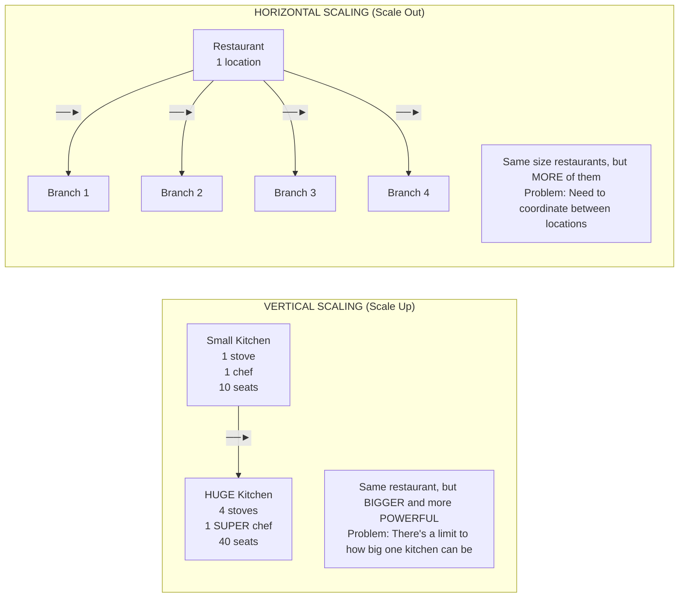
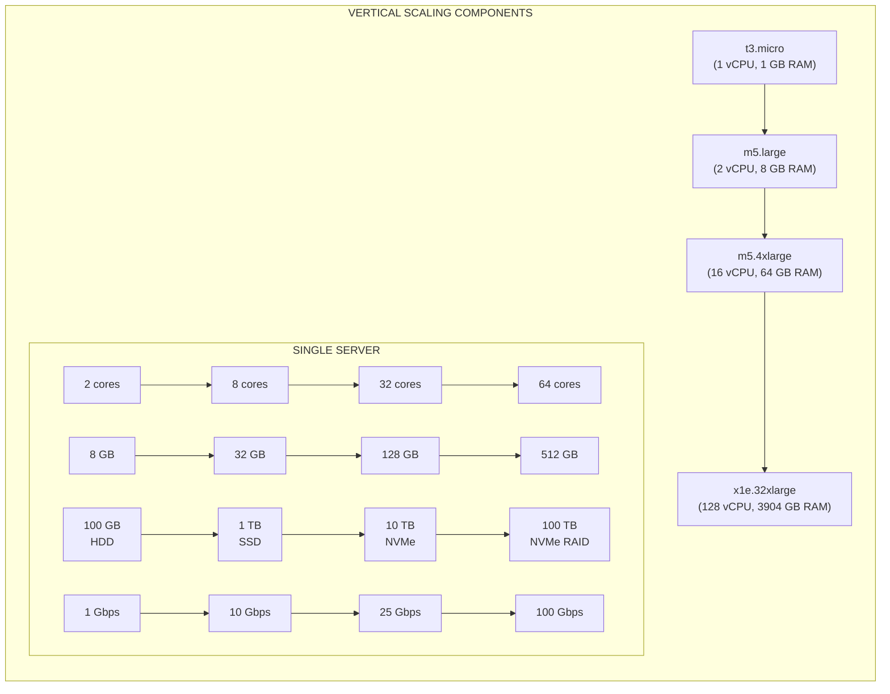
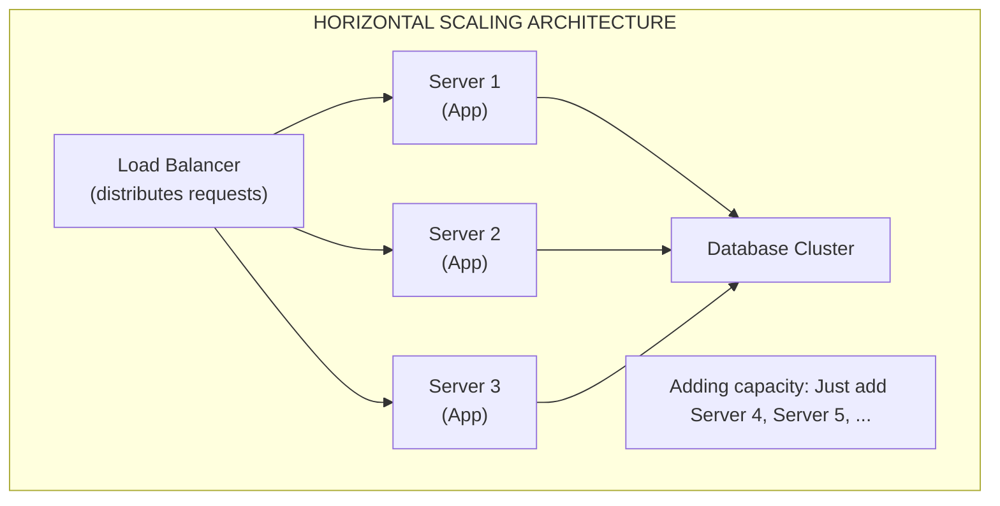
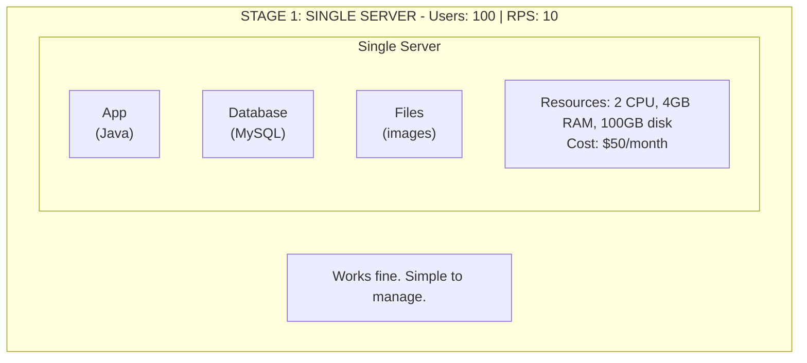
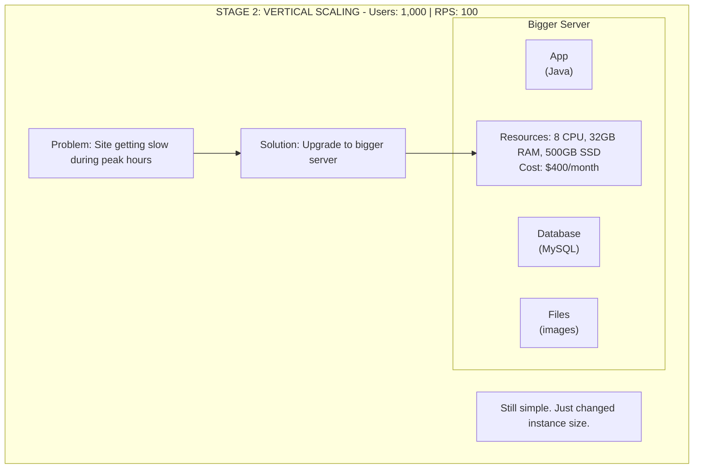
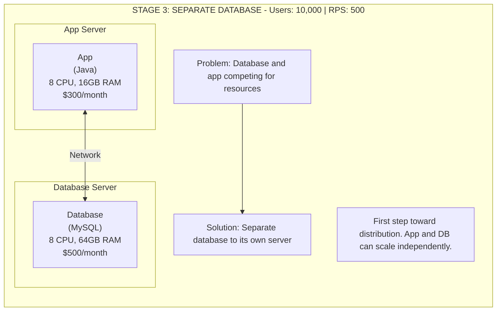
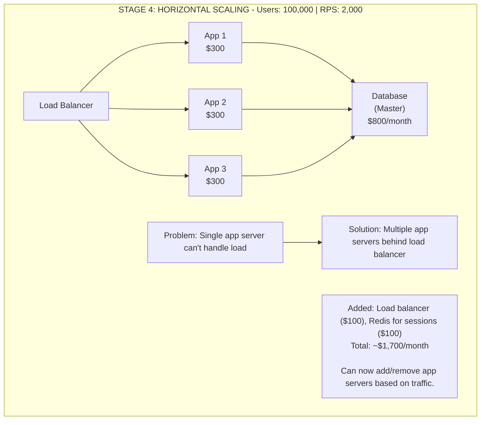
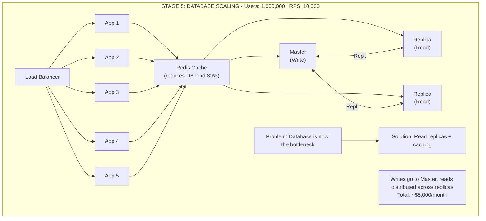
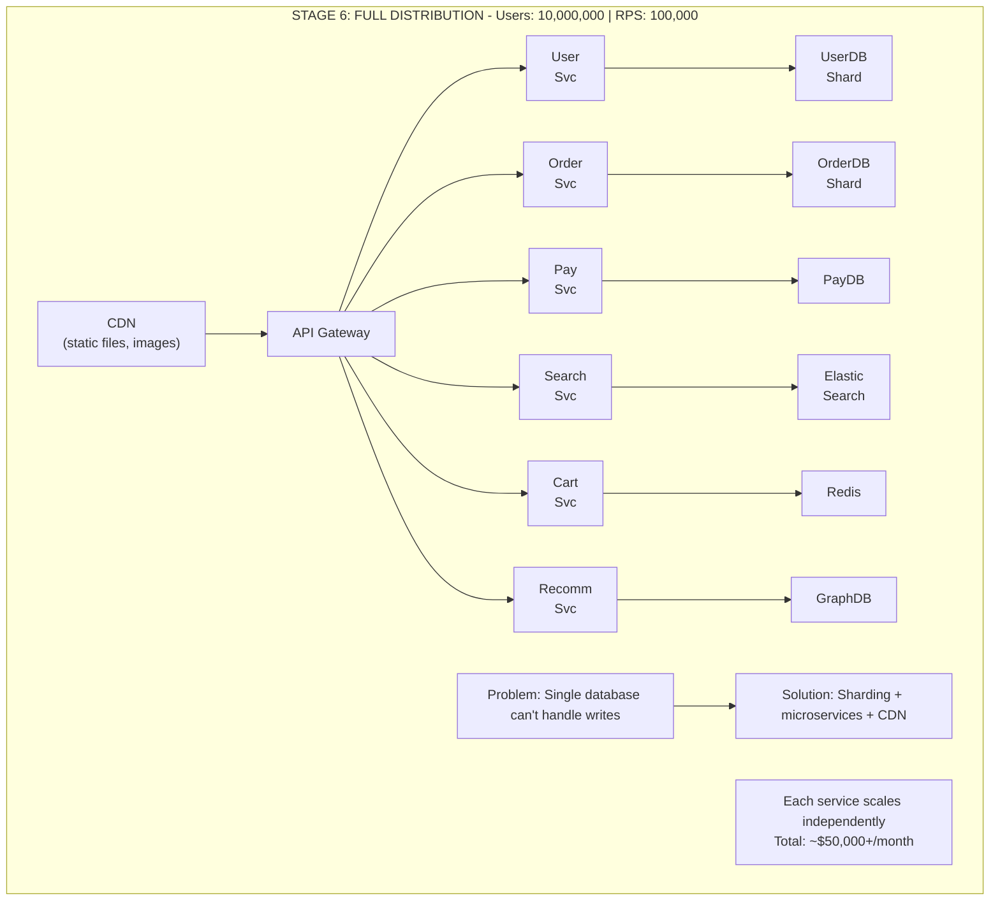

# 📈 Scalability: Vertical vs Horizontal Scaling

---

## 0️⃣ Prerequisites

Before understanding scalability, you need to know:

- **Server**: A computer that runs your application and serves requests.
- **Load**: The amount of work your system handles (requests, users, data).
- **Resources**: CPU, memory (RAM), storage, network bandwidth.
- **Bottleneck**: The component that limits your system's capacity.

If you understand that servers have limited resources and more users mean more load, you're ready.

---

## 1️⃣ What Problem Does This Exist to Solve?

### The Pain Point

Your startup launches. Day 1: 100 users, everything works. Month 3: 10,000 users, site is slow. Month 6: 100,000 users try to sign up, site crashes.

**The fundamental problem**: Success brings more load than your current system can handle.

### What Systems Looked Like Before

In the mainframe era (1960s-1980s), scaling meant buying a bigger, more expensive computer. There was no other option. Companies would:

- Plan capacity years in advance
- Pay millions for larger mainframes
- Accept that growth was limited by hardware availability

### What Breaks Without It

1. **Response times increase**: Users wait longer and longer
2. **Errors increase**: System starts rejecting requests
3. **Complete outage**: System crashes under load
4. **Lost revenue**: Users leave for competitors
5. **Reputation damage**: "That site that always crashes"

### Real Examples of the Problem

**Twitter's Fail Whale (2008-2010)**: Twitter couldn't scale fast enough. Users saw the "Fail Whale" error page constantly during peak times. They had to completely rewrite their architecture.

**Healthcare.gov Launch (2013)**: Expected 50,000 concurrent users, got 250,000. Site crashed on launch day. Couldn't handle 5x expected load.

**Pokemon GO Launch (2016)**: Servers crashed repeatedly. Niantic had to delay launches in other countries while they scaled up.

---

## 2️⃣ Intuition and Mental Model

### The Restaurant Analogy (Continued)

Remember our restaurant analogy from distributed systems? Let's extend it for scaling:



<details>
<summary>ASCII diagram (reference)</summary>

```text
┌─────────────────────────────────────────────────────────────────────────┐
│                    VERTICAL SCALING                                      │
│                    (Scale Up)                                            │
│                                                                          │
│  BEFORE:                          AFTER:                                │
│  ┌─────────────────┐              ┌─────────────────────────┐           │
│  │  Small Kitchen  │              │    HUGE Kitchen         │           │
│  │  1 stove        │     ──►      │    4 stoves             │           │
│  │  1 chef         │              │    1 SUPER chef         │           │
│  │  10 seats       │              │    40 seats             │           │
│  └─────────────────┘              └─────────────────────────┘           │
│                                                                          │
│  Same restaurant, but BIGGER and more POWERFUL                          │
│  Problem: There's a limit to how big one kitchen can be                 │
│                                                                          │
└─────────────────────────────────────────────────────────────────────────┘

┌─────────────────────────────────────────────────────────────────────────┐
│                    HORIZONTAL SCALING                                    │
│                    (Scale Out)                                           │
│                                                                          │
│  BEFORE:                          AFTER:                                │
│  ┌─────────────────┐              ┌──────────┐ ┌──────────┐             │
│  │  Restaurant     │              │ Branch 1 │ │ Branch 2 │             │
│  │  1 location     │     ──►      └──────────┘ └──────────┘             │
│  │                 │              ┌──────────┐ ┌──────────┐             │
│  └─────────────────┘              │ Branch 3 │ │ Branch 4 │             │
│                                   └──────────┘ └──────────┘             │
│                                                                          │
│  Same size restaurants, but MORE of them                                │
│  Problem: Need to coordinate between locations                          │
│                                                                          │
└─────────────────────────────────────────────────────────────────────────┘
```
</details>

**Key insight**: Vertical = make it bigger. Horizontal = make more of them.

---

## 3️⃣ How It Works Internally

### Vertical Scaling (Scale Up)

**Definition**: Increasing the capacity of a single server by adding more resources.



<details>
<summary>ASCII diagram (reference)</summary>

```text
┌─────────────────────────────────────────────────────────────────────────┐
│                    VERTICAL SCALING COMPONENTS                           │
│                                                                          │
│  ┌─────────────────────────────────────────────────────────────────┐    │
│  │                        SINGLE SERVER                             │    │
│  │                                                                  │    │
│  │  CPU:     2 cores  ──►  8 cores  ──►  32 cores  ──►  64 cores  │    │
│  │                                                                  │    │
│  │  RAM:     8 GB    ──►  32 GB   ──►  128 GB   ──►  512 GB       │    │
│  │                                                                  │    │
│  │  Storage: 100 GB  ──►  1 TB    ──►  10 TB    ──►  100 TB       │    │
│  │           HDD          SSD          NVMe          NVMe RAID     │    │
│  │                                                                  │    │
│  │  Network: 1 Gbps  ──►  10 Gbps ──►  25 Gbps  ──►  100 Gbps     │    │
│  │                                                                  │    │
│  └─────────────────────────────────────────────────────────────────┘    │
│                                                                          │
│  Cloud Instance Examples (AWS):                                          │
│  t3.micro  ──►  m5.large  ──►  m5.4xlarge  ──►  x1e.32xlarge           │
│  (1 vCPU)      (2 vCPU)       (16 vCPU)        (128 vCPU)              │
│  (1 GB RAM)    (8 GB RAM)     (64 GB RAM)      (3904 GB RAM)           │
│                                                                          │
└─────────────────────────────────────────────────────────────────────────┘
```
</details>

**How it works**:

1. Stop the server (or use live migration)
2. Upgrade hardware (or change instance type in cloud)
3. Restart the server
4. Application code stays the same

**Advantages**:

| Advantage                  | Explanation                        |
| -------------------------- | ---------------------------------- |
| Simple                     | No code changes needed             |
| No distribution complexity | Single database, no sync issues    |
| Lower latency              | No network hops between components |
| Easier debugging           | Everything in one place            |
| ACID transactions          | Easy to maintain consistency       |

**Disadvantages**:

| Disadvantage            | Explanation                              |
| ----------------------- | ---------------------------------------- |
| Hardware limits         | Can't add infinite CPU/RAM               |
| Single point of failure | One server dies = everything dies        |
| Expensive at scale      | High-end servers cost exponentially more |
| Downtime for upgrades   | Usually need to restart                  |
| Vendor lock-in          | Tied to specific hardware capabilities   |

### Horizontal Scaling (Scale Out)

**Definition**: Increasing capacity by adding more servers that work together.



<details>
<summary>ASCII diagram (reference)</summary>

```text
┌─────────────────────────────────────────────────────────────────────────┐
│                    HORIZONTAL SCALING ARCHITECTURE                       │
│                                                                          │
│                         ┌─────────────────┐                             │
│                         │  Load Balancer  │                             │
│                         │  (distributes   │                             │
│                         │   requests)     │                             │
│                         └────────┬────────┘                             │
│                                  │                                       │
│              ┌───────────────────┼───────────────────┐                  │
│              │                   │                   │                  │
│              ▼                   ▼                   ▼                  │
│       ┌──────────┐        ┌──────────┐        ┌──────────┐             │
│       │ Server 1 │        │ Server 2 │        │ Server 3 │             │
│       │ (App)    │        │ (App)    │        │ (App)    │             │
│       └────┬─────┘        └────┬─────┘        └────┬─────┘             │
│            │                   │                   │                    │
│            └───────────────────┼───────────────────┘                    │
│                                │                                        │
│                         ┌──────┴──────┐                                │
│                         │  Database   │                                │
│                         │  Cluster    │                                │
│                         └─────────────┘                                │
│                                                                          │
│  Adding capacity: Just add Server 4, Server 5, ...                      │
│                                                                          │
└─────────────────────────────────────────────────────────────────────────┘
```
</details>

**How it works**:

1. Deploy application to new server
2. Register new server with load balancer
3. Load balancer starts sending traffic to new server
4. Repeat as needed

**Advantages**:

| Advantage               | Explanation                      |
| ----------------------- | -------------------------------- |
| Near-infinite scale     | Keep adding servers              |
| Fault tolerance         | One server dies, others continue |
| Cost-effective          | Use commodity hardware           |
| No downtime scaling     | Add servers without stopping     |
| Geographic distribution | Servers in different regions     |

**Disadvantages**:

| Disadvantage          | Explanation                            |
| --------------------- | -------------------------------------- |
| Complexity            | Need load balancers, service discovery |
| Data consistency      | Harder to keep data in sync            |
| Network overhead      | Servers must communicate               |
| Stateless requirement | Application must not store local state |
| Debugging difficulty  | Issues span multiple servers           |

### The Stateless Requirement

For horizontal scaling to work, your application must be **stateless**:

```mermaid
graph LR
    subgraph "STATEFUL (Cannot scale horizontally easily)"
        Req1A[Request 1] --> ServerA[Server A stores session in memory]
        Req2A[Request 2] --> ServerB[Server B (different server!)]
        ServerB --> Error[Session not found! ❌]
    end
    
    subgraph "STATELESS (Can scale horizontally)"
        Req1B[Request 1] --> ServerA2[Server A]
        ServerA2 --> Redis1[Stores session in Redis (external)]
        Req2B[Request 2] --> ServerB2[Server B]
        ServerB2 --> Redis2[Reads session from Redis]
        Redis2 --> Success[Works! ✓]
    end
    
    Note["The state is externalized to a shared store (Redis, database)"]
```

<details>
<summary>ASCII diagram (reference)</summary>

```text
┌─────────────────────────────────────────────────────────────────────────┐
│                    STATEFUL vs STATELESS                                 │
│                                                                          │
│  STATEFUL (Cannot scale horizontally easily):                           │
│                                                                          │
│  Request 1 ──► Server A stores session in memory                        │
│  Request 2 ──► Server B (different server!) ──► Session not found! ❌   │
│                                                                          │
│  ───────────────────────────────────────────────────────────────────    │
│                                                                          │
│  STATELESS (Can scale horizontally):                                    │
│                                                                          │
│  Request 1 ──► Server A ──► Stores session in Redis (external)         │
│  Request 2 ──► Server B ──► Reads session from Redis ──► Works! ✓      │
│                                                                          │
│  The state is externalized to a shared store (Redis, database)          │
│                                                                          │
└─────────────────────────────────────────────────────────────────────────┘
```
</details>

---

## 4️⃣ Simulation-First Explanation

### Scenario: E-commerce Site Growth

Let's trace how an e-commerce site might scale from 100 to 10 million users.

**Stage 1: Single Server (100 users)**



<details>
<summary>ASCII diagram (reference)</summary>

```text
┌─────────────────────────────────────────────────────────────────────────┐
│                    STAGE 1: SINGLE SERVER                                │
│                    Users: 100 | RPS: 10                                  │
│                                                                          │
│  ┌─────────────────────────────────────────────────────────────────┐    │
│  │                     Single Server                                │    │
│  │                                                                  │    │
│  │  ┌──────────┐  ┌──────────┐  ┌──────────┐                       │    │
│  │  │   App    │  │ Database │  │  Files   │                       │    │
│  │  │  (Java)  │  │ (MySQL)  │  │ (images) │                       │    │
│  │  └──────────┘  └──────────┘  └──────────┘                       │    │
│  │                                                                  │    │
│  │  Resources: 2 CPU, 4GB RAM, 100GB disk                          │    │
│  │  Cost: $50/month                                                 │    │
│  │                                                                  │    │
│  └─────────────────────────────────────────────────────────────────┘    │
│                                                                          │
│  Works fine. Simple to manage.                                          │
│                                                                          │
└─────────────────────────────────────────────────────────────────────────┘
```
</details>

**Stage 2: Vertical Scaling (1,000 users)**



<details>
<summary>ASCII diagram (reference)</summary>

```text
┌─────────────────────────────────────────────────────────────────────────┐
│                    STAGE 2: VERTICAL SCALING                             │
│                    Users: 1,000 | RPS: 100                               │
│                                                                          │
│  Problem: Site getting slow during peak hours                           │
│  Solution: Upgrade to bigger server                                      │
│                                                                          │
│  ┌─────────────────────────────────────────────────────────────────┐    │
│  │                     Bigger Server                                │    │
│  │                                                                  │    │
│  │  ┌──────────┐  ┌──────────┐  ┌──────────┐                       │    │
│  │  │   App    │  │ Database │  │  Files   │                       │    │
│  │  │  (Java)  │  │ (MySQL)  │  │ (images) │                       │    │
│  │  └──────────┘  └──────────┘  └──────────┘                       │    │
│  │                                                                  │    │
│  │  Resources: 8 CPU, 32GB RAM, 500GB SSD                          │    │
│  │  Cost: $400/month                                                │    │
│  │                                                                  │    │
│  └─────────────────────────────────────────────────────────────────┘    │
│                                                                          │
│  Still simple. Just changed instance size.                              │
│                                                                          │
└─────────────────────────────────────────────────────────────────────────┘
```
</details>

**Stage 3: Separate Database (10,000 users)**



<details>
<summary>ASCII diagram (reference)</summary>

```text
┌─────────────────────────────────────────────────────────────────────────┐
│                    STAGE 3: SEPARATE DATABASE                            │
│                    Users: 10,000 | RPS: 500                              │
│                                                                          │
│  Problem: Database and app competing for resources                      │
│  Solution: Separate database to its own server                          │
│                                                                          │
│  ┌──────────────────────┐         ┌──────────────────────┐              │
│  │    App Server        │         │   Database Server    │              │
│  │                      │         │                      │              │
│  │  ┌──────────┐        │         │  ┌──────────┐        │              │
│  │  │   App    │◄───────┼─────────┼──│ Database │        │              │
│  │  │  (Java)  │        │ Network │  │ (MySQL)  │        │              │
│  │  └──────────┘        │         │  └──────────┘        │              │
│  │                      │         │                      │              │
│  │  8 CPU, 16GB RAM     │         │  8 CPU, 64GB RAM     │              │
│  │  $300/month          │         │  $500/month          │              │
│  └──────────────────────┘         └──────────────────────┘              │
│                                                                          │
│  First step toward distribution. App and DB can scale independently.    │
│                                                                          │
└─────────────────────────────────────────────────────────────────────────┘
```
</details>

**Stage 4: Horizontal App Scaling (100,000 users)**



<details>
<summary>ASCII diagram (reference)</summary>

```text
┌─────────────────────────────────────────────────────────────────────────┐
│                    STAGE 4: HORIZONTAL SCALING                           │
│                    Users: 100,000 | RPS: 2,000                           │
│                                                                          │
│  Problem: Single app server can't handle load                           │
│  Solution: Multiple app servers behind load balancer                    │
│                                                                          │
│                    ┌─────────────────┐                                  │
│                    │  Load Balancer  │                                  │
│                    └────────┬────────┘                                  │
│           ┌─────────────────┼─────────────────┐                         │
│           ▼                 ▼                 ▼                         │
│    ┌──────────┐      ┌──────────┐      ┌──────────┐                    │
│    │  App 1   │      │  App 2   │      │  App 3   │                    │
│    │  $300    │      │  $300    │      │  $300    │                    │
│    └────┬─────┘      └────┬─────┘      └────┬─────┘                    │
│         └─────────────────┼─────────────────┘                           │
│                           ▼                                             │
│                    ┌──────────────┐                                     │
│                    │   Database   │                                     │
│                    │   (Master)   │                                     │
│                    │   $800/month │                                     │
│                    └──────────────┘                                     │
│                                                                          │
│  Added: Load balancer ($100), Redis for sessions ($100)                 │
│  Total: ~$1,700/month                                                   │
│                                                                          │
│  Can now add/remove app servers based on traffic.                       │
│                                                                          │
└─────────────────────────────────────────────────────────────────────────┘
```
</details>

**Stage 5: Database Scaling (1,000,000 users)**



<details>
<summary>ASCII diagram (reference)</summary>

```text
┌─────────────────────────────────────────────────────────────────────────┐
│                    STAGE 5: DATABASE SCALING                             │
│                    Users: 1,000,000 | RPS: 10,000                        │
│                                                                          │
│  Problem: Database is now the bottleneck                                │
│  Solution: Read replicas + caching                                       │
│                                                                          │
│                    ┌─────────────────┐                                  │
│                    │  Load Balancer  │                                  │
│                    └────────┬────────┘                                  │
│                             │                                           │
│    ┌────────────────────────┼────────────────────────┐                  │
│    ▼            ▼           ▼           ▼            ▼                  │
│  ┌─────┐    ┌─────┐     ┌─────┐     ┌─────┐     ┌─────┐                │
│  │App 1│    │App 2│     │App 3│     │App 4│     │App 5│                │
│  └──┬──┘    └──┬──┘     └──┬──┘     └──┬──┘     └──┬──┘                │
│     └──────────┴───────────┼───────────┴───────────┘                    │
│                            ▼                                            │
│              ┌─────────────────────────┐                                │
│              │     Redis Cache         │                                │
│              │  (reduces DB load 80%)  │                                │
│              └────────────┬────────────┘                                │
│                           │                                             │
│     ┌─────────────────────┼─────────────────────┐                       │
│     ▼                     ▼                     ▼                       │
│  ┌──────┐           ┌──────────┐           ┌──────┐                    │
│  │Replica│◄─────────│  Master  │──────────►│Replica│                   │
│  │(Read) │  Repl.   │ (Write)  │   Repl.   │(Read) │                   │
│  └──────┘           └──────────┘           └──────┘                    │
│                                                                          │
│  Writes go to Master, reads distributed across replicas                 │
│  Total: ~$5,000/month                                                   │
│                                                                          │
└─────────────────────────────────────────────────────────────────────────┘
```
</details>

**Stage 6: Full Distribution (10,000,000 users)**



<details>
<summary>ASCII diagram (reference)</summary>

```text
┌─────────────────────────────────────────────────────────────────────────┐
│                    STAGE 6: FULL DISTRIBUTION                            │
│                    Users: 10,000,000 | RPS: 100,000                      │
│                                                                          │
│  Problem: Single database can't handle writes                           │
│  Solution: Sharding + microservices + CDN                               │
│                                                                          │
│                         ┌─────────┐                                     │
│                         │   CDN   │ (static files, images)              │
│                         └────┬────┘                                     │
│                              │                                          │
│                    ┌─────────┴─────────┐                                │
│                    │   API Gateway     │                                │
│                    └─────────┬─────────┘                                │
│                              │                                          │
│    ┌──────────┬──────────┬───┴───┬──────────┬──────────┐               │
│    ▼          ▼          ▼       ▼          ▼          ▼               │
│ ┌──────┐ ┌──────┐ ┌──────┐ ┌──────┐ ┌──────┐ ┌──────┐                 │
│ │ User │ │Order │ │ Pay  │ │Search│ │ Cart │ │Recomm│                 │
│ │ Svc  │ │ Svc  │ │ Svc  │ │ Svc  │ │ Svc  │ │ Svc  │                 │
│ └──┬───┘ └──┬───┘ └──┬───┘ └──┬───┘ └──┬───┘ └──┬───┘                 │
│    │        │        │        │        │        │                       │
│    ▼        ▼        ▼        ▼        ▼        ▼                       │
│ ┌──────┐ ┌──────┐ ┌──────┐ ┌──────┐ ┌──────┐ ┌──────┐                 │
│ │UserDB│ │OrderDB│ │PayDB │ │Elastic│ │Redis │ │GraphDB│               │
│ │Shard │ │Shard  │ │      │ │Search │ │      │ │      │               │
│ └──────┘ └──────┘ └──────┘ └──────┘ └──────┘ └──────┘                 │
│                                                                          │
│  Each service scales independently                                       │
│  Total: ~$50,000+/month                                                  │
│                                                                          │
└─────────────────────────────────────────────────────────────────────────┘
```
</details>

---

## 5️⃣ How Engineers Actually Use This in Production

### Real Systems at Real Companies

**Netflix**:

- Runs on AWS with thousands of instances
- Uses auto-scaling based on traffic patterns
- Scales up before peak hours (evening), scales down at night
- Each microservice scales independently

**Uber**:

- Horizontal scaling for ride matching
- Geographic sharding (data partitioned by city)
- Can handle 14 million trips per day
- Scales dynamically for surge events (New Year's Eve)

**Instagram**:

- Started on single server
- Scaled to 1 billion users
- Uses Django (Python) with PostgreSQL
- Heavy use of Memcached for caching

### Real Workflows and Tooling

**Auto-Scaling Configuration (AWS)**:

```yaml
# AWS Auto Scaling Group configuration
AutoScalingGroup:
  MinSize: 2 # Always have at least 2 servers
  MaxSize: 100 # Never exceed 100 servers
  DesiredCapacity: 5 # Start with 5 servers

  ScalingPolicies:
    - PolicyName: ScaleUp
      ScalingAdjustment: 2 # Add 2 servers
      Cooldown: 300 # Wait 5 min before scaling again
      Trigger:
        MetricName: CPUUtilization
        Threshold: 70 # When CPU > 70%
        Period: 60 # For 60 seconds

    - PolicyName: ScaleDown
      ScalingAdjustment: -1 # Remove 1 server
      Cooldown: 600 # Wait 10 min
      Trigger:
        MetricName: CPUUtilization
        Threshold: 30 # When CPU < 30%
        Period: 300 # For 5 minutes
```

**Kubernetes Horizontal Pod Autoscaler**:

```yaml
# kubernetes-hpa.yaml
apiVersion: autoscaling/v2
kind: HorizontalPodAutoscaler
metadata:
  name: order-service-hpa
spec:
  scaleTargetRef:
    apiVersion: apps/v1
    kind: Deployment
    name: order-service
  minReplicas: 3
  maxReplicas: 50
  metrics:
    - type: Resource
      resource:
        name: cpu
        target:
          type: Utilization
          averageUtilization: 70
    - type: Resource
      resource:
        name: memory
        target:
          type: Utilization
          averageUtilization: 80
```

### What is Automated vs Manual

| Aspect                | Automated             | Manual                    |
| --------------------- | --------------------- | ------------------------- |
| Scaling triggers      | Auto-scaling rules    | Initial threshold setting |
| Instance provisioning | Cloud APIs            | Capacity planning         |
| Load balancer updates | Service discovery     | Initial LB setup          |
| Database scaling      | Read replica addition | Sharding strategy         |
| Cost optimization     | Spot instances        | Architecture decisions    |

---

## 6️⃣ How to Implement Scalable Systems

### Making Applications Stateless (Java/Spring Boot)

```java
// WRONG: Stateful - stores session in memory
@RestController
public class StatefulController {

    // This map is stored in THIS server's memory
    // If user's next request goes to different server, cart is lost!
    private Map<String, List<String>> userCarts = new HashMap<>();

    @PostMapping("/cart/add")
    public void addToCart(@RequestParam String userId,
                          @RequestParam String productId) {
        userCarts.computeIfAbsent(userId, k -> new ArrayList<>())
                 .add(productId);
    }

    @GetMapping("/cart")
    public List<String> getCart(@RequestParam String userId) {
        return userCarts.getOrDefault(userId, Collections.emptyList());
    }
}
```

```java
// RIGHT: Stateless - stores session in Redis (external)
@RestController
public class StatelessController {

    private final RedisTemplate<String, List<String>> redisTemplate;

    public StatelessController(RedisTemplate<String, List<String>> redisTemplate) {
        this.redisTemplate = redisTemplate;
    }

    @PostMapping("/cart/add")
    public void addToCart(@RequestParam String userId,
                          @RequestParam String productId) {
        String key = "cart:" + userId;
        // Store in Redis - accessible from ANY server
        redisTemplate.opsForList().rightPush(key, productId);
        // Set expiration (cart expires in 24 hours)
        redisTemplate.expire(key, Duration.ofHours(24));
    }

    @GetMapping("/cart")
    public List<String> getCart(@RequestParam String userId) {
        String key = "cart:" + userId;
        // Read from Redis - works regardless of which server handles request
        return redisTemplate.opsForList().range(key, 0, -1);
    }
}
```

### Spring Boot Configuration for Scaling

```yaml
# application.yml
spring:
  application:
    name: order-service

  # External session storage (Redis)
  session:
    store-type: redis
    redis:
      flush-mode: on_save
      namespace: spring:session

  # Redis connection
  redis:
    host: ${REDIS_HOST:localhost}
    port: ${REDIS_PORT:6379}

  # Database connection pool (important for scaling)
  datasource:
    url: jdbc:postgresql://${DB_HOST:localhost}:5432/orders
    hikari:
      maximum-pool-size: 20 # Max connections per instance
      minimum-idle: 5 # Keep 5 connections ready
      connection-timeout: 30000 # 30 sec timeout
      idle-timeout: 600000 # 10 min idle before closing

# Server configuration
server:
  port: 8080
  tomcat:
    threads:
      max: 200 # Max request handling threads
      min-spare: 20 # Min threads to keep ready
    max-connections: 10000
    accept-count: 100 # Queue size when all threads busy

# Actuator for health checks (load balancer needs this)
management:
  endpoints:
    web:
      exposure:
        include: health, info, metrics
  endpoint:
    health:
      show-details: always
      probes:
        enabled: true # Kubernetes liveness/readiness probes
```

### Docker Configuration for Horizontal Scaling

```dockerfile
# Dockerfile
FROM eclipse-temurin:17-jre-alpine

# Add non-root user for security
RUN addgroup -S spring && adduser -S spring -G spring
USER spring:spring

# Copy application
COPY target/order-service.jar app.jar

# Health check for orchestrators
HEALTHCHECK --interval=30s --timeout=3s \
  CMD wget -q --spider http://localhost:8080/actuator/health || exit 1

# Run application
ENTRYPOINT ["java", \
  "-XX:+UseContainerSupport", \
  "-XX:MaxRAMPercentage=75.0", \
  "-jar", "app.jar"]
```

```yaml
# docker-compose.yml (for local testing of horizontal scaling)
version: "3.8"

services:
  # Load balancer
  nginx:
    image: nginx:alpine
    ports:
      - "80:80"
    volumes:
      - ./nginx.conf:/etc/nginx/nginx.conf:ro
    depends_on:
      - app1
      - app2
      - app3

  # Multiple app instances
  app1:
    build: .
    environment:
      - REDIS_HOST=redis
      - DB_HOST=postgres
    depends_on:
      - redis
      - postgres

  app2:
    build: .
    environment:
      - REDIS_HOST=redis
      - DB_HOST=postgres
    depends_on:
      - redis
      - postgres

  app3:
    build: .
    environment:
      - REDIS_HOST=redis
      - DB_HOST=postgres
    depends_on:
      - redis
      - postgres

  # Shared state
  redis:
    image: redis:7-alpine

  postgres:
    image: postgres:15-alpine
    environment:
      POSTGRES_DB: orders
      POSTGRES_USER: app
      POSTGRES_PASSWORD: secret
```

```nginx
# nginx.conf
events {
    worker_connections 1024;
}

http {
    upstream app_servers {
        # Round-robin load balancing
        server app1:8080;
        server app2:8080;
        server app3:8080;
    }

    server {
        listen 80;

        location / {
            proxy_pass http://app_servers;
            proxy_set_header Host $host;
            proxy_set_header X-Real-IP $remote_addr;
            proxy_set_header X-Forwarded-For $proxy_add_x_forwarded_for;
        }

        location /health {
            proxy_pass http://app_servers/actuator/health;
        }
    }
}
```

### Commands to Test Scaling

```bash
# Start the scaled environment
docker-compose up -d

# Check all instances are running
docker-compose ps

# Test load balancing (run multiple times, see different instance IDs)
for i in {1..10}; do
  curl -s http://localhost/actuator/info | jq '.instance'
done

# Scale up to 5 instances
docker-compose up -d --scale app=5

# Scale down to 2 instances
docker-compose up -d --scale app=2

# Watch logs from all instances
docker-compose logs -f app1 app2 app3

# Load test with Apache Bench
ab -n 10000 -c 100 http://localhost/api/health

# Load test with wrk
wrk -t12 -c400 -d30s http://localhost/api/health
```

---

## 7️⃣ Tradeoffs, Pitfalls, and Common Mistakes

### When to Use Each Approach

| Scenario                           | Vertical            | Horizontal      |
| ---------------------------------- | ------------------- | --------------- |
| Database with complex transactions | ✅                  | ⚠️ Complex      |
| Stateless web servers              | ⚠️ Limited          | ✅              |
| Early-stage startup                | ✅ Simple           | ❌ Overkill     |
| Unpredictable traffic              | ❌ Can't react fast | ✅ Auto-scale   |
| Cost-sensitive                     | ✅ Initially        | ✅ At scale     |
| Global users                       | ❌ Single location  | ✅ Multi-region |

### Common Mistakes

**1. Premature horizontal scaling**

```
WRONG: "We might have millions of users someday, let's build for that now"
       (Spend 6 months building infrastructure, never get users)

RIGHT: "We have 100 users, let's use a single server and ship features"
       (Scale when you actually need it)
```

**2. Not externalizing state**

```java
// WRONG: Local file storage
@PostMapping("/upload")
public void uploadFile(@RequestParam MultipartFile file) {
    file.transferTo(new File("/uploads/" + file.getOriginalFilename()));
    // File only exists on THIS server!
}

// RIGHT: External storage (S3, GCS)
@PostMapping("/upload")
public void uploadFile(@RequestParam MultipartFile file) {
    s3Client.putObject(PutObjectRequest.builder()
        .bucket("my-uploads")
        .key(file.getOriginalFilename())
        .build(),
        RequestBody.fromInputStream(file.getInputStream(), file.getSize()));
    // File accessible from any server
}
```

**3. Ignoring database scaling**

```
App servers: 10 instances, handling 10,000 RPS easily
Database: 1 instance, melting at 500 queries/second

The database becomes the bottleneck!

Solution: Add read replicas, caching, or shard the database
```

**4. No graceful shutdown**

```java
// WRONG: Just kill the process
// In-flight requests are dropped, data may be corrupted

// RIGHT: Graceful shutdown
@PreDestroy
public void shutdown() {
    // Stop accepting new requests
    // Wait for in-flight requests to complete (with timeout)
    // Close database connections cleanly
    // Deregister from service discovery
}
```

### Cost Implications

```
┌─────────────────────────────────────────────────────────────────────────┐
│                    COST COMPARISON                                       │
│                                                                          │
│  Scenario: Need to handle 10,000 RPS                                    │
│                                                                          │
│  VERTICAL SCALING:                                                       │
│  ┌────────────────────────────────────────────────────────────────┐     │
│  │  1x x1e.32xlarge (128 vCPU, 3904 GB RAM)                       │     │
│  │  Cost: ~$26,000/month                                          │     │
│  │  Pros: Simple, no distribution complexity                      │     │
│  │  Cons: Single point of failure, can't scale further            │     │
│  └────────────────────────────────────────────────────────────────┘     │
│                                                                          │
│  HORIZONTAL SCALING:                                                     │
│  ┌────────────────────────────────────────────────────────────────┐     │
│  │  20x m5.xlarge (4 vCPU, 16 GB RAM each)                        │     │
│  │  Cost: ~$3,000/month                                           │     │
│  │  + Load balancer: ~$200/month                                  │     │
│  │  + Redis: ~$200/month                                          │     │
│  │  Total: ~$3,400/month                                          │     │
│  │  Pros: Fault tolerant, can scale further                       │     │
│  │  Cons: More complex, need to handle distribution               │     │
│  └────────────────────────────────────────────────────────────────┘     │
│                                                                          │
│  Horizontal is ~7.5x cheaper at this scale!                             │
│                                                                          │
└─────────────────────────────────────────────────────────────────────────┘
```

---

## 8️⃣ When NOT to Scale Horizontally

### Situations Where Vertical is Better

1. **Database with complex transactions**

   - ACID transactions across multiple tables
   - Complex joins that need all data local
   - Strong consistency requirements

2. **Legacy applications**

   - Not designed for statelessness
   - Would require major rewrite
   - Technical debt too high

3. **Small scale**

   - Less than 1,000 users
   - Predictable, stable load
   - Cost of complexity not justified

4. **Latency-critical applications**
   - Every millisecond matters
   - Network hops add latency
   - Single powerful machine is faster

### Signs You're Over-Engineering

- You have 10 microservices for 100 users
- You spend more time on infrastructure than features
- Your deployment takes hours
- You can't explain your architecture in 5 minutes
- You've never actually hit your scaling limits

---

## 9️⃣ Comparison: Scaling Strategies

### Decision Matrix

```
┌─────────────────────────────────────────────────────────────────────────┐
│                    SCALING DECISION MATRIX                               │
│                                                                          │
│  Question                              │ Vertical │ Horizontal           │
│  ──────────────────────────────────────┼──────────┼─────────────────────│
│  Is your app stateless?                │ Either   │ Required ✓          │
│  Need fault tolerance?                 │ ❌       │ ✓                   │
│  Unpredictable traffic spikes?         │ ❌       │ ✓                   │
│  Global user base?                     │ ❌       │ ✓                   │
│  Complex database transactions?        │ ✓        │ Complex             │
│  Small team / early stage?             │ ✓        │ Overkill            │
│  Cost-sensitive at scale?              │ Expensive│ ✓                   │
│  Need to scale quickly?                │ Slow     │ ✓ (auto-scale)      │
│  Can tolerate some downtime?           │ ✓        │ Not needed          │
│                                                                          │
└─────────────────────────────────────────────────────────────────────────┘
```

### Real Company Choices

| Company        | Approach                   | Reason                                    |
| -------------- | -------------------------- | ----------------------------------------- |
| Netflix        | Horizontal (AWS)           | Global scale, fault tolerance needed      |
| Stack Overflow | Vertical (few big servers) | Predictable load, simpler ops             |
| Shopify        | Horizontal + Vertical      | Mix based on component needs              |
| WhatsApp       | Vertical (Erlang)          | Efficient language, 2M connections/server |
| Discord        | Horizontal (Elixir)        | Real-time needs, fault tolerance          |

---

## 🔟 Interview Follow-Up Questions WITH Answers

### L4 (Entry-Level) Questions

**Q: What's the difference between vertical and horizontal scaling?**

A: Vertical scaling means making a single server more powerful by adding CPU, RAM, or storage. It's like upgrading from a sedan to a sports car. Horizontal scaling means adding more servers that work together, like having a fleet of sedans. Vertical is simpler but has limits and creates a single point of failure. Horizontal can scale infinitely but requires your application to be stateless and adds complexity like load balancing.

**Q: What does it mean for an application to be stateless?**

A: A stateless application doesn't store any user-specific data in the server's memory between requests. Each request contains all the information needed to process it. This is important for horizontal scaling because any server can handle any request. If you store user sessions in memory, and the user's next request goes to a different server, that data is lost. Instead, state should be stored externally in Redis, a database, or cookies.

### L5 (Mid-Level) Questions

**Q: How would you scale a database that's becoming a bottleneck?**

A: I'd approach this in stages: (1) First, add caching (Redis/Memcached) to reduce read load, typically 80-90% of queries can be cached. (2) Add read replicas for read-heavy workloads, directing writes to master and reads to replicas. (3) Optimize queries and add indexes based on slow query logs. (4) If still bottlenecked, consider sharding, partitioning data across multiple database instances. For sharding, I'd choose a shard key carefully (like user_id) to ensure even distribution and avoid cross-shard queries. (5) For specific use cases, consider specialized databases (Elasticsearch for search, time-series DB for metrics).

**Q: How do you handle session management in a horizontally scaled environment?**

A: There are several approaches: (1) Sticky sessions: Load balancer routes user to same server. Simple but creates uneven load and loses fault tolerance. (2) External session store: Store sessions in Redis or Memcached. Any server can handle any request. This is my preferred approach. (3) JWT tokens: Store session data in encrypted tokens sent with each request. No server-side storage needed, but can't invalidate tokens easily. (4) Database sessions: Store in database. Works but adds latency. I'd choose Redis for most cases because it's fast, supports expiration, and can be clustered for high availability.

### L6 (Senior) Questions

**Q: How would you design auto-scaling for a service with unpredictable traffic patterns?**

A: I'd implement multi-dimensional auto-scaling: (1) Reactive scaling based on CPU (>70% for 2 min → scale up), memory, and request queue depth. (2) Predictive scaling using historical patterns (scale up before known peak times like lunch hours). (3) Custom metrics scaling based on business metrics (orders per minute, active users). For the scaling policy: scale up aggressively (add 50% capacity when triggered), scale down conservatively (remove 10% after 15 min of low usage). I'd set minimum instances for fault tolerance (at least 3 across availability zones) and maximum to control costs. I'd also implement warm pools (pre-initialized instances) to reduce scale-up latency from minutes to seconds. Finally, I'd use spot/preemptible instances for cost savings with fallback to on-demand.

**Q: What are the challenges of scaling a system from 1 million to 100 million users?**

A: The challenges multiply: (1) Database: Single master can't handle write volume. Need sharding strategy (geographic, hash-based, or range-based). Cross-shard queries become expensive. (2) Caching: Cache invalidation at scale is hard. Need distributed cache with consistent hashing. Hot keys can overwhelm single cache nodes. (3) Network: Internal traffic grows quadratically. Need service mesh for observability. Consider moving to gRPC for efficiency. (4) Deployment: Rolling deployments take longer. Need canary releases and feature flags. (5) Cost: Need multi-cloud or reserved capacity for cost optimization. (6) Organization: Team structure must change (Conway's Law). Need platform team for shared infrastructure. (7) Reliability: More components = more failure modes. Need chaos engineering, circuit breakers, and graceful degradation. The key is solving these incrementally, not all at once.

---

## 1️⃣1️⃣ One Clean Mental Summary

Scalability is about handling growth. Vertical scaling (scale up) makes one server bigger, like upgrading a car's engine. It's simple but has limits and creates a single point of failure. Horizontal scaling (scale out) adds more servers, like having more cars. It can scale infinitely but requires stateless applications and adds complexity. Start simple with vertical scaling, move to horizontal when you hit limits or need fault tolerance. The key principle: externalize state (sessions, files, cache) so any server can handle any request. Most successful companies use a hybrid approach, scaling different components differently based on their specific needs.
