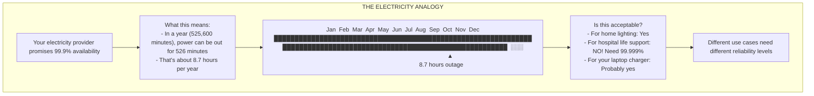
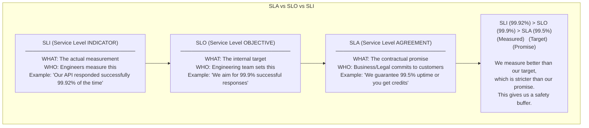
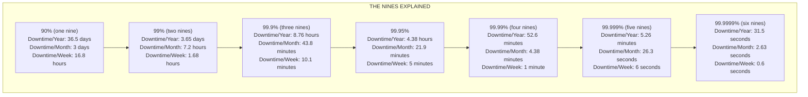
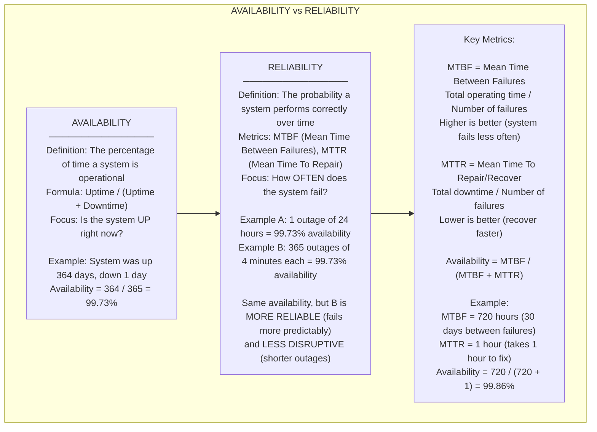
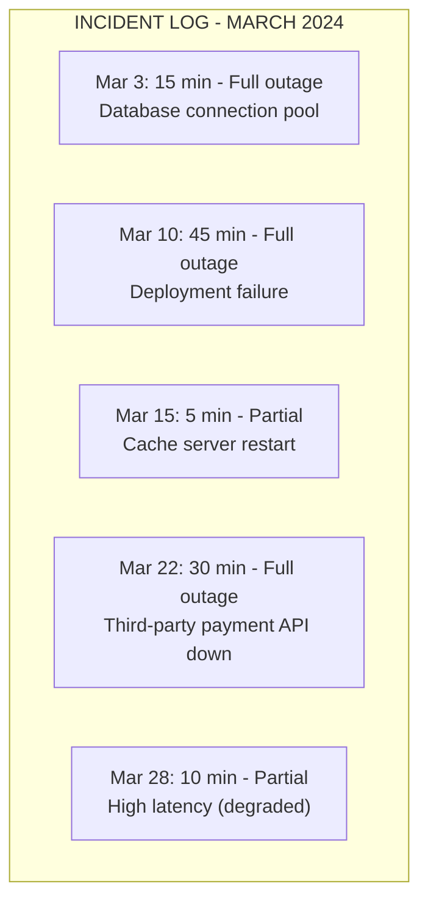
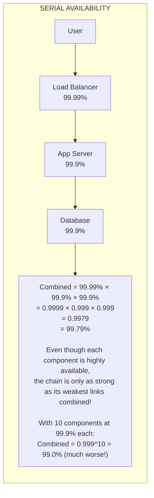
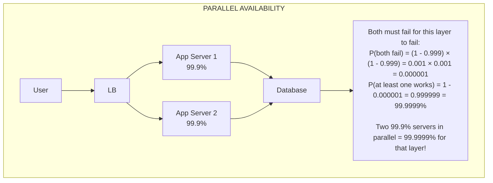
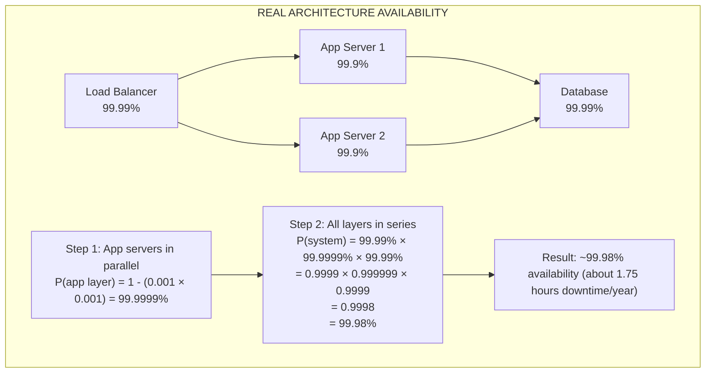
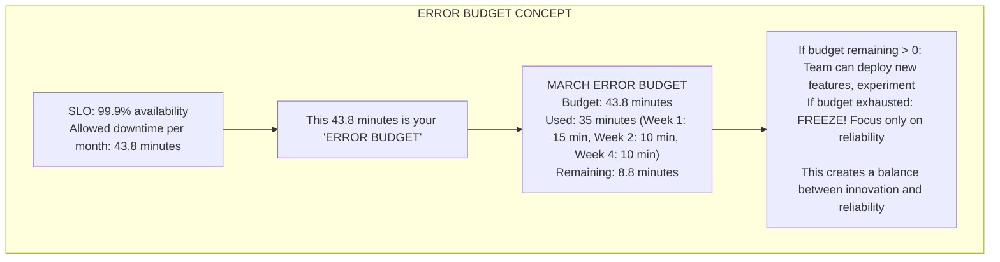

# 🛡️ Availability & Reliability: SLAs, SLOs, and the Nines

---

## 0️⃣ Prerequisites

Before understanding availability and reliability, you need to know:

- **Uptime**: The time a system is operational and accessible.
- **Downtime**: The time a system is not operational or accessible.
- **Percentage**: A way to express a part of a whole (99% means 99 out of 100).
- **Minutes/Hours/Year**: Basic time units for measuring downtime.

If you understand that systems can be "up" or "down" and we measure how often they're up, you're ready.

---

## 1️⃣ What Problem Does This Exist to Solve?

### The Pain Point

You're running an e-commerce site. The CEO asks: "How reliable is our system?"

You answer: "Pretty reliable. It rarely goes down."

CEO: "What does 'rarely' mean? Can you guarantee it won't go down during Black Friday?"

You: "..."

**The problem**: Without precise definitions, we can't:

- Set expectations with customers
- Measure improvement over time
- Make informed tradeoffs (cost vs reliability)
- Hold teams accountable

### What Systems Looked Like Before

Before formal availability metrics:

- "Best effort" reliability
- No contractual guarantees
- Customers had no recourse when systems failed
- No systematic approach to improving reliability

### What Breaks Without It

1. **Customer trust erodes**: Users don't know what to expect
2. **No accountability**: Teams can't be measured
3. **Wrong priorities**: Engineers might over-invest or under-invest in reliability
4. **Legal exposure**: No clear terms for service failures
5. **Business planning fails**: Can't predict impact of outages

### Real Examples of the Problem

**Amazon's Calculation**: 1 second of downtime costs Amazon approximately $220,000 in lost sales. They need to know exactly how much downtime is acceptable.

**Google's SRE Book**: Google pioneered the concept of "error budgets" because they realized that 100% reliability is impossible and uneconomical. They needed a framework to balance reliability with feature development.

---

## 2️⃣ Intuition and Mental Model

### The Electricity Analogy

Think of system availability like electricity in your home:



<details>
<summary>ASCII diagram (reference)</summary>

```text
┌─────────────────────────────────────────────────────────────────────────┐
│                    THE ELECTRICITY ANALOGY                               │
│                                                                          │
│  Your electricity provider promises 99.9% availability                  │
│                                                                          │
│  What this means:                                                        │
│  - In a year (525,600 minutes), power can be out for 526 minutes        │
│  - That's about 8.7 hours per year                                      │
│                                                                          │
│  ┌─────────────────────────────────────────────────────────────────┐    │
│  │ Jan  Feb  Mar  Apr  May  Jun  Jul  Aug  Sep  Oct  Nov  Dec      │    │
│  │ ██████████████████████████████████████████████████████████████ │    │
│  │ ████████████████████████████████████████████████████████  ░░░  │    │
│  │                                                          ▲      │    │
│  │                                               8.7 hours outage  │    │
│  └─────────────────────────────────────────────────────────────────┘    │
│                                                                          │
│  Is this acceptable?                                                     │
│  - For home lighting: Yes                                               │
│  - For hospital life support: NO! Need 99.999%                          │
│  - For your laptop charger: Probably yes                                │
│                                                                          │
│  Different use cases need different reliability levels                  │
│                                                                          │
└─────────────────────────────────────────────────────────────────────────┘
```
</details>

**Key insight**: The right availability level depends on the cost of downtime vs the cost of preventing it.

---

## 3️⃣ How It Works Internally

### The Three Key Terms: SLA, SLO, SLI



<details>
<summary>ASCII diagram (reference)</summary>

```text
┌─────────────────────────────────────────────────────────────────────────┐
│                    SLA vs SLO vs SLI                                     │
│                                                                          │
│  SLI (Service Level INDICATOR)                                          │
│  ─────────────────────────────                                          │
│  WHAT: The actual measurement                                           │
│  WHO: Engineers measure this                                            │
│  Example: "Our API responded successfully 99.92% of the time"           │
│                                                                          │
│                              │                                          │
│                              ▼                                          │
│                                                                          │
│  SLO (Service Level OBJECTIVE)                                          │
│  ─────────────────────────────                                          │
│  WHAT: The internal target                                              │
│  WHO: Engineering team sets this                                        │
│  Example: "We aim for 99.9% successful responses"                       │
│                                                                          │
│                              │                                          │
│                              ▼                                          │
│                                                                          │
│  SLA (Service Level AGREEMENT)                                          │
│  ─────────────────────────────                                          │
│  WHAT: The contractual promise                                          │
│  WHO: Business/Legal commits to customers                               │
│  Example: "We guarantee 99.5% uptime or you get credits"               │
│                                                                          │
│  ┌─────────────────────────────────────────────────────────────────┐    │
│  │                                                                  │    │
│  │    SLI (99.92%)  >  SLO (99.9%)  >  SLA (99.5%)                │    │
│  │    (Measured)       (Target)        (Promise)                   │    │
│  │                                                                  │    │
│  │    We measure better than our target,                           │    │
│  │    which is stricter than our promise.                          │    │
│  │    This gives us a safety buffer.                               │    │
│  │                                                                  │    │
│  └─────────────────────────────────────────────────────────────────┘    │
│                                                                          │
└─────────────────────────────────────────────────────────────────────────┘
```
</details>

### The "Nines" of Availability



<details>
<summary>ASCII diagram (reference)</summary>

```text
┌─────────────────────────────────────────────────────────────────────────┐
│                    THE NINES EXPLAINED                                   │
│                                                                          │
│  Availability  │ Downtime/Year │ Downtime/Month │ Downtime/Week        │
│  ─────────────────────────────────────────────────────────────────────  │
│  90%           │ 36.5 days     │ 3 days         │ 16.8 hours           │
│  (one nine)    │               │                │                       │
│  ─────────────────────────────────────────────────────────────────────  │
│  99%           │ 3.65 days     │ 7.2 hours      │ 1.68 hours           │
│  (two nines)   │               │                │                       │
│  ─────────────────────────────────────────────────────────────────────  │
│  99.9%         │ 8.76 hours    │ 43.8 minutes   │ 10.1 minutes         │
│  (three nines) │               │                │                       │
│  ─────────────────────────────────────────────────────────────────────  │
│  99.95%        │ 4.38 hours    │ 21.9 minutes   │ 5 minutes            │
│  ─────────────────────────────────────────────────────────────────────  │
│  99.99%        │ 52.6 minutes  │ 4.38 minutes   │ 1 minute             │
│  (four nines)  │               │                │                       │
│  ─────────────────────────────────────────────────────────────────────  │
│  99.999%       │ 5.26 minutes  │ 26.3 seconds   │ 6 seconds            │
│  (five nines)  │               │                │                       │
│  ─────────────────────────────────────────────────────────────────────  │
│  99.9999%      │ 31.5 seconds  │ 2.63 seconds   │ 0.6 seconds          │
│  (six nines)   │               │                │                       │
│                                                                          │
└─────────────────────────────────────────────────────────────────────────┘
```
</details>

### Calculating Downtime

```
Formula: Downtime = Total Time × (1 - Availability)

Example: 99.9% availability over 1 year

Year in minutes = 365 × 24 × 60 = 525,600 minutes

Allowed downtime = 525,600 × (1 - 0.999)
                 = 525,600 × 0.001
                 = 525.6 minutes
                 = 8.76 hours

Per month: 43.8 minutes (525.6 / 12)
Per week: 10.1 minutes (525.6 / 52)
Per day: 1.44 minutes (525.6 / 365)
```

### Availability vs Reliability



<details>
<summary>ASCII diagram (reference)</summary>

```text
┌─────────────────────────────────────────────────────────────────────────┐
│                    AVAILABILITY vs RELIABILITY                           │
│                                                                          │
│  AVAILABILITY                                                            │
│  ────────────                                                            │
│  Definition: The percentage of time a system is operational             │
│  Formula: Uptime / (Uptime + Downtime)                                  │
│  Focus: Is the system UP right now?                                     │
│                                                                          │
│  Example: System was up 364 days, down 1 day                            │
│  Availability = 364 / 365 = 99.73%                                      │
│                                                                          │
│  ───────────────────────────────────────────────────────────────────    │
│                                                                          │
│  RELIABILITY                                                             │
│  ──────────                                                              │
│  Definition: The probability a system performs correctly over time      │
│  Metrics: MTBF (Mean Time Between Failures), MTTR (Mean Time To Repair)│
│  Focus: How OFTEN does the system fail?                                 │
│                                                                          │
│  Example A: 1 outage of 24 hours = 99.73% availability                  │
│  Example B: 365 outages of 4 minutes each = 99.73% availability         │
│                                                                          │
│  Same availability, but B is MORE RELIABLE (fails more predictably)    │
│  and LESS DISRUPTIVE (shorter outages)                                  │
│                                                                          │
│  ───────────────────────────────────────────────────────────────────    │
│                                                                          │
│  Key Metrics:                                                            │
│                                                                          │
│  MTBF = Mean Time Between Failures                                      │
│         Total operating time / Number of failures                       │
│         Higher is better (system fails less often)                      │
│                                                                          │
│  MTTR = Mean Time To Repair/Recover                                     │
│         Total downtime / Number of failures                             │
│         Lower is better (recover faster)                                │
│                                                                          │
│  Availability = MTBF / (MTBF + MTTR)                                    │
│                                                                          │
│  Example:                                                                │
│  MTBF = 720 hours (30 days between failures)                            │
│  MTTR = 1 hour (takes 1 hour to fix)                                    │
│  Availability = 720 / (720 + 1) = 99.86%                                │
│                                                                          │
└─────────────────────────────────────────────────────────────────────────┘
```
</details>

### Cost of Each Nine

```mermaid
graph LR
    subgraph "COST OF AVAILABILITY"
        Note1["Each additional 'nine' roughly 10x the cost!"]
        Cost99["99%: Basic monitoring, manual recovery<br>Cost: $"]
        Cost999["99.9%: Redundancy, automated failover, good monitoring<br>Cost: $$"]
        Cost9999["99.99%: Multi-region, sophisticated automation, 24/7 on-call<br>Cost: $$$"]
        Cost99999["99.999%: Active-active multi-region, chaos engineering, large team<br>Cost: $$$$"]
        Cost999999["99.9999%: Custom hardware, dedicated teams, extreme redundancy<br>Cost: $$$$$ (Only critical systems like 911, nuclear)"]
        
        Cost99 -->|"10x"| Cost999 -->|"10x"| Cost9999 -->|"10x"| Cost99999 -->|"10x"| Cost999999
        Note1 --> Cost99
    end
```

<details>
<summary>ASCII diagram (reference)</summary>

```text
┌─────────────────────────────────────────────────────────────────────────┐
│                    COST OF AVAILABILITY                                  │
│                                                                          │
│  Each additional "nine" roughly 10x the cost!                           │
│                                                                          │
│  Cost │                                                    ╱            │
│       │                                                 ╱               │
│       │                                              ╱                  │
│       │                                           ╱                     │
│       │                                        ╱                        │
│       │                                     ╱                           │
│       │                                  ╱                              │
│       │                               ╱                                 │
│       │                            ╱                                    │
│       │                         ╱                                       │
│       │                      ╱                                          │
│       │                   ╱                                             │
│       │                ╱                                                │
│       │             ╱                                                   │
│       │          ╱                                                      │
│       │       ╱                                                         │
│       │    ╱                                                            │
│       │ ╱                                                               │
│       └──────────────────────────────────────────────────────────────   │
│         99%     99.9%    99.99%   99.999%  99.9999%                     │
│                                                                          │
│  What you need for each level:                                          │
│                                                                          │
│  99%:     Basic monitoring, manual recovery                             │
│           Cost: $                                                        │
│                                                                          │
│  99.9%:   Redundancy, automated failover, good monitoring               │
│           Cost: $$                                                       │
│                                                                          │
│  99.99%:  Multi-region, sophisticated automation, 24/7 on-call          │
│           Cost: $$$                                                      │
│                                                                          │
│  99.999%: Active-active multi-region, chaos engineering, large team     │
│           Cost: $$$$                                                     │
│                                                                          │
│  99.9999%: Custom hardware, dedicated teams, extreme redundancy         │
│            Cost: $$$$$  (Only critical systems like 911, nuclear)       │
│                                                                          │
└─────────────────────────────────────────────────────────────────────────┘
```
</details>
```

---

## 4️⃣ Simulation-First Explanation

### Calculating Your System's Availability

**Scenario**: Your e-commerce site had these incidents last month:



<details>
<summary>ASCII diagram (reference)</summary>

```text
┌─────────────────────────────────────────────────────────────────────────┐
│                    INCIDENT LOG - MARCH 2024                             │
│                                                                          │
│  Date       │ Duration │ Impact      │ Cause                            │
│  ───────────────────────────────────────────────────────────────────    │
│  Mar 3      │ 15 min   │ Full outage │ Database connection pool         │
│  Mar 10     │ 45 min   │ Full outage │ Deployment failure               │
│  Mar 15     │ 5 min    │ Partial     │ Cache server restart             │
│  Mar 22     │ 30 min   │ Full outage │ Third-party payment API down     │
│  Mar 28     │ 10 min   │ Partial     │ High latency (degraded)          │
│                                                                          │
└─────────────────────────────────────────────────────────────────────────┘
```
</details>

**Calculation**:

```
Total minutes in March = 31 × 24 × 60 = 44,640 minutes

Full outage minutes = 15 + 45 + 30 = 90 minutes
Partial outage minutes = 5 + 10 = 15 minutes

Option 1: Count only full outages
Availability = (44,640 - 90) / 44,640 = 99.80%

Option 2: Count partial as half impact
Availability = (44,640 - 90 - 7.5) / 44,640 = 99.78%

Option 3: Count all outages equally
Availability = (44,640 - 105) / 44,640 = 99.76%

Your SLO was 99.9% (43.8 minutes allowed)
You used 90-105 minutes
Result: SLO VIOLATED ❌
```

### Serial vs Parallel Availability

**Serial (Chain)**: If ANY component fails, the system fails.



<details>
<summary>ASCII diagram (reference)</summary>

```text
┌─────────────────────────────────────────────────────────────────────────┐
│                    SERIAL AVAILABILITY                                   │
│                                                                          │
│  User ──► Load Balancer ──► App Server ──► Database                    │
│              99.99%           99.9%         99.9%                        │
│                                                                          │
│  Combined = 99.99% × 99.9% × 99.9%                                      │
│           = 0.9999 × 0.999 × 0.999                                      │
│           = 0.9979                                                       │
│           = 99.79%                                                       │
│                                                                          │
│  Even though each component is highly available,                        │
│  the chain is only as strong as its weakest links combined!            │
│                                                                          │
│  With 10 components at 99.9% each:                                      │
│  Combined = 0.999^10 = 99.0% (much worse!)                              │
│                                                                          │
└─────────────────────────────────────────────────────────────────────────┘
```
</details>

**Parallel (Redundant)**: ALL redundant components must fail for system to fail.



<details>
<summary>ASCII diagram (reference)</summary>

```text
┌─────────────────────────────────────────────────────────────────────────┐
│                    PARALLEL AVAILABILITY                                 │
│                                                                          │
│                    ┌─────────────┐                                      │
│                 ┌─►│ App Server 1│──┐                                   │
│                 │  │   99.9%     │  │                                   │
│  User ──► LB ──┤  └─────────────┘  ├──► Database                       │
│                 │  ┌─────────────┐  │                                   │
│                 └─►│ App Server 2│──┘                                   │
│                    │   99.9%     │                                       │
│                    └─────────────┘                                       │
│                                                                          │
│  Both must fail for this layer to fail:                                 │
│  P(both fail) = (1 - 0.999) × (1 - 0.999) = 0.001 × 0.001 = 0.000001   │
│  P(at least one works) = 1 - 0.000001 = 0.999999 = 99.9999%            │
│                                                                          │
│  Two 99.9% servers in parallel = 99.9999% for that layer!              │
│                                                                          │
└─────────────────────────────────────────────────────────────────────────┘
```
</details>

**Combined Example**:



<details>
<summary>ASCII diagram (reference)</summary>

```text
┌─────────────────────────────────────────────────────────────────────────┐
│                    REAL ARCHITECTURE AVAILABILITY                        │
│                                                                          │
│                         ┌──────────────┐                                │
│                      ┌─►│ App Server 1 │─┐                              │
│                      │  │   (99.9%)    │ │                              │
│  ┌──────────────┐    │  └──────────────┘ │    ┌──────────────┐         │
│  │Load Balancer │────┤                   ├────│   Database   │         │
│  │   (99.99%)   │    │  ┌──────────────┐ │    │   (99.99%)   │         │
│  └──────────────┘    └─►│ App Server 2 │─┘    └──────────────┘         │
│                         │   (99.9%)    │                                │
│                         └──────────────┘                                │
│                                                                          │
│  Step 1: App servers in parallel                                        │
│  P(app layer) = 1 - (0.001 × 0.001) = 99.9999%                         │
│                                                                          │
│  Step 2: All layers in series                                           │
│  P(system) = 99.99% × 99.9999% × 99.99%                                │
│            = 0.9999 × 0.999999 × 0.9999                                │
│            = 0.9998                                                      │
│            = 99.98%                                                      │
│                                                                          │
│  Result: ~99.98% availability (about 1.75 hours downtime/year)         │
│                                                                          │
└─────────────────────────────────────────────────────────────────────────┘
```
</details>

---

## 5️⃣ How Engineers Actually Use This in Production

### Real Systems at Real Companies

**AWS SLAs**:

- EC2: 99.99% (monthly)
- S3: 99.9% (monthly)
- RDS Multi-AZ: 99.95%
- If SLA violated, customers get service credits (10-30%)

**Google Cloud SLAs**:

- Compute Engine: 99.99%
- Cloud Storage: 99.95%
- Cloud SQL: 99.95%

**Stripe**:

- API availability: 99.99%+
- Actual performance: Often 99.999%
- They publish real-time status at status.stripe.com

### Error Budgets

Google's SRE team invented the concept of "error budgets":



<details>
<summary>ASCII diagram (reference)</summary>

```text
┌─────────────────────────────────────────────────────────────────────────┐
│                    ERROR BUDGET CONCEPT                                  │
│                                                                          │
│  SLO: 99.9% availability                                                │
│  Allowed downtime per month: 43.8 minutes                               │
│                                                                          │
│  This 43.8 minutes is your "ERROR BUDGET"                               │
│                                                                          │
│  ┌─────────────────────────────────────────────────────────────────┐    │
│  │                     MARCH ERROR BUDGET                           │    │
│  │                                                                  │    │
│  │  Budget: 43.8 minutes                                           │    │
│  │  ████████████████████████████████████████████████░░░░░░░░░░░░  │    │
│  │  Used: 35 minutes                    Remaining: 8.8 minutes     │    │
│  │                                                                  │    │
│  │  Week 1: Deployment issue (15 min)   ████████                   │    │
│  │  Week 2: Database spike (10 min)     █████                      │    │
│  │  Week 3: (nothing)                                              │    │
│  │  Week 4: Config error (10 min)       █████                      │    │
│  │                                                                  │    │
│  └─────────────────────────────────────────────────────────────────┘    │
│                                                                          │
│  If budget remaining > 0: Team can deploy new features, experiment     │
│  If budget exhausted: FREEZE! Focus only on reliability                │
│                                                                          │
│  This creates a balance between innovation and reliability              │
│                                                                          │
└─────────────────────────────────────────────────────────────────────────┘
```
</details>

### Real Workflows and Tooling

**Status Page (Statuspage.io, Atlassian)**:

```
┌─────────────────────────────────────────────────────────────────────────┐
│                    STATUS PAGE EXAMPLE                                   │
│                                                                          │
│  ┌─────────────────────────────────────────────────────────────────┐    │
│  │  ACME Corp System Status                                        │    │
│  │  ─────────────────────────────────────────────────────────────  │    │
│  │                                                                  │    │
│  │  API                    ●  Operational                          │    │
│  │  Web Application        ●  Operational                          │    │
│  │  Database               ●  Operational                          │    │
│  │  Payment Processing     ◐  Degraded Performance                 │    │
│  │  Email Notifications    ○  Major Outage                         │    │
│  │                                                                  │    │
│  │  ─────────────────────────────────────────────────────────────  │    │
│  │  Uptime last 90 days: 99.94%                                    │    │
│  │                                                                  │    │
│  │  Mar: ██████████████████████████████████████████████████░ 99.9% │    │
│  │  Feb: █████████████████████████████████████████████████░░ 99.8% │    │
│  │  Jan: ███████████████████████████████████████████████████ 100%  │    │
│  │                                                                  │    │
│  └─────────────────────────────────────────────────────────────────┘    │
│                                                                          │
└─────────────────────────────────────────────────────────────────────────┘
```

---

## 6️⃣ How to Implement Availability Monitoring

### Spring Boot Health Checks

```java
// CustomHealthIndicator.java
package com.example.health;

import org.springframework.boot.actuate.health.Health;
import org.springframework.boot.actuate.health.HealthIndicator;
import org.springframework.stereotype.Component;

/**
 * Custom health indicator for critical dependencies.
 *
 * Spring Actuator aggregates all health indicators.
 * If ANY indicator returns DOWN, the overall status is DOWN.
 */
@Component
public class DatabaseHealthIndicator implements HealthIndicator {

    private final DataSource dataSource;

    public DatabaseHealthIndicator(DataSource dataSource) {
        this.dataSource = dataSource;
    }

    @Override
    public Health health() {
        try {
            // Try to get a connection and run a simple query
            try (Connection conn = dataSource.getConnection()) {
                try (Statement stmt = conn.createStatement()) {
                    stmt.execute("SELECT 1");
                }
            }

            return Health.up()
                .withDetail("database", "PostgreSQL")
                .withDetail("status", "Connected")
                .build();

        } catch (SQLException e) {
            return Health.down()
                .withDetail("database", "PostgreSQL")
                .withDetail("error", e.getMessage())
                .build();
        }
    }
}
```

```java
// ExternalServiceHealthIndicator.java
package com.example.health;

import org.springframework.boot.actuate.health.Health;
import org.springframework.boot.actuate.health.HealthIndicator;
import org.springframework.stereotype.Component;
import org.springframework.web.client.RestTemplate;

import java.time.Duration;
import java.time.Instant;

@Component
public class PaymentServiceHealthIndicator implements HealthIndicator {

    private final RestTemplate restTemplate;
    private final String paymentServiceUrl;

    public PaymentServiceHealthIndicator(
            RestTemplate restTemplate,
            @Value("${payment.service.url}") String paymentServiceUrl) {
        this.restTemplate = restTemplate;
        this.paymentServiceUrl = paymentServiceUrl;
    }

    @Override
    public Health health() {
        Instant start = Instant.now();

        try {
            // Call payment service health endpoint
            restTemplate.getForObject(
                paymentServiceUrl + "/health",
                String.class
            );

            long latency = Duration.between(start, Instant.now()).toMillis();

            // Consider degraded if response is slow
            if (latency > 1000) {
                return Health.status("DEGRADED")
                    .withDetail("service", "payment")
                    .withDetail("latency_ms", latency)
                    .withDetail("message", "Slow response")
                    .build();
            }

            return Health.up()
                .withDetail("service", "payment")
                .withDetail("latency_ms", latency)
                .build();

        } catch (Exception e) {
            return Health.down()
                .withDetail("service", "payment")
                .withDetail("error", e.getMessage())
                .build();
        }
    }
}
```

### Availability Tracking Service

```java
// AvailabilityTracker.java
package com.example.availability;

import io.micrometer.core.instrument.MeterRegistry;
import io.micrometer.core.instrument.Timer;
import org.springframework.scheduling.annotation.Scheduled;
import org.springframework.stereotype.Service;

import java.time.Duration;
import java.time.Instant;
import java.util.concurrent.atomic.AtomicLong;

/**
 * Tracks and calculates availability metrics.
 */
@Service
public class AvailabilityTracker {

    private final MeterRegistry registry;

    // Counters for availability calculation
    private final AtomicLong totalChecks = new AtomicLong(0);
    private final AtomicLong successfulChecks = new AtomicLong(0);
    private final AtomicLong failedChecks = new AtomicLong(0);

    // Track downtime
    private Instant lastDownTime = null;
    private final AtomicLong totalDowntimeSeconds = new AtomicLong(0);

    public AvailabilityTracker(MeterRegistry registry) {
        this.registry = registry;

        // Register gauges for real-time monitoring
        registry.gauge("availability.percentage", this,
            tracker -> tracker.calculateAvailability() * 100);

        registry.gauge("availability.total_downtime_seconds", totalDowntimeSeconds);
    }

    /**
     * Record a successful health check
     */
    public void recordSuccess() {
        totalChecks.incrementAndGet();
        successfulChecks.incrementAndGet();

        // If we were down, calculate downtime
        if (lastDownTime != null) {
            long downtimeSeconds = Duration.between(lastDownTime, Instant.now()).getSeconds();
            totalDowntimeSeconds.addAndGet(downtimeSeconds);
            lastDownTime = null;

            // Log recovery
            System.out.println("Service recovered after " + downtimeSeconds + " seconds");
        }
    }

    /**
     * Record a failed health check
     */
    public void recordFailure() {
        totalChecks.incrementAndGet();
        failedChecks.incrementAndGet();

        // Mark start of downtime
        if (lastDownTime == null) {
            lastDownTime = Instant.now();
            System.out.println("Service DOWN at " + lastDownTime);
        }
    }

    /**
     * Calculate current availability percentage
     */
    public double calculateAvailability() {
        long total = totalChecks.get();
        if (total == 0) return 1.0;

        return (double) successfulChecks.get() / total;
    }

    /**
     * Calculate MTBF (Mean Time Between Failures)
     */
    public Duration calculateMTBF(Duration totalOperatingTime, long numberOfFailures) {
        if (numberOfFailures == 0) {
            return totalOperatingTime; // No failures yet
        }
        return totalOperatingTime.dividedBy(numberOfFailures);
    }

    /**
     * Calculate MTTR (Mean Time To Repair)
     */
    public Duration calculateMTTR(long numberOfFailures) {
        if (numberOfFailures == 0) {
            return Duration.ZERO;
        }
        return Duration.ofSeconds(totalDowntimeSeconds.get() / numberOfFailures);
    }

    /**
     * Check if we're within SLO
     */
    public SLOStatus checkSLO(double sloTarget, Duration period) {
        double currentAvailability = calculateAvailability();

        // Calculate error budget
        double allowedDowntimePercent = 1 - sloTarget;
        long periodSeconds = period.getSeconds();
        long allowedDowntimeSeconds = (long) (periodSeconds * allowedDowntimePercent);
        long usedDowntimeSeconds = totalDowntimeSeconds.get();
        long remainingBudgetSeconds = allowedDowntimeSeconds - usedDowntimeSeconds;

        return new SLOStatus(
            sloTarget,
            currentAvailability,
            currentAvailability >= sloTarget,
            allowedDowntimeSeconds,
            usedDowntimeSeconds,
            remainingBudgetSeconds
        );
    }

    public record SLOStatus(
        double sloTarget,
        double currentAvailability,
        boolean withinSLO,
        long allowedDowntimeSeconds,
        long usedDowntimeSeconds,
        long remainingBudgetSeconds
    ) {}
}
```

### Configuration

```yaml
# application.yml
management:
  endpoints:
    web:
      exposure:
        include: health, metrics, prometheus
  endpoint:
    health:
      show-details: always
      show-components: always
      probes:
        enabled: true
  health:
    # Configure health check groups
    group:
      readiness:
        include: db, redis, payment
      liveness:
        include: ping

# Custom availability settings
availability:
  slo:
    target: 0.999 # 99.9%
    measurement-period: P30D # 30 days

  # Alert thresholds
  alerts:
    error-budget-warning: 0.5 # Alert at 50% budget consumed
    error-budget-critical: 0.8 # Critical at 80% budget consumed
```

### Prometheus Metrics for Grafana Dashboard

```yaml
# prometheus-rules.yml
groups:
  - name: availability
    rules:
      # Calculate availability over last 30 days
      - record: service:availability:30d
        expr: |
          sum(rate(http_server_requests_seconds_count{status!~"5.."}[30d]))
          /
          sum(rate(http_server_requests_seconds_count[30d]))

      # Error budget remaining
      - record: service:error_budget:remaining
        expr: |
          1 - (
            (1 - service:availability:30d) 
            / 
            (1 - 0.999)  # SLO target
          )

      # Alert when error budget is low
      - alert: ErrorBudgetLow
        expr: service:error_budget:remaining < 0.2
        for: 5m
        labels:
          severity: warning
        annotations:
          summary: "Error budget below 20%"
          description: "Only {{ $value | humanizePercentage }} of error budget remaining"

      # Alert when SLO is violated
      - alert: SLOViolation
        expr: service:availability:30d < 0.999
        for: 5m
        labels:
          severity: critical
        annotations:
          summary: "SLO violated"
          description: "Availability is {{ $value | humanizePercentage }}, below 99.9% SLO"
```

---

## 7️⃣ Tradeoffs, Pitfalls, and Common Mistakes

### Common Mistakes

**1. Promising more than you can deliver**

```
WRONG: SLA promises 99.99% but infrastructure only supports 99.9%
       Result: Constant SLA violations, customer refunds, legal issues

RIGHT: SLA promises 99.9%, internal SLO targets 99.95%
       Result: Buffer for incidents, rarely violate SLA
```

**2. Not counting all downtime**

```
WRONG: "We only count complete outages"
       Ignores: Degraded performance, partial failures, high latency

RIGHT: Define what "available" means clearly
       - Response time < 500ms
       - Error rate < 0.1%
       - All critical features working
```

**3. Measuring availability wrong**

```
WRONG: Check health every 5 minutes, calculate from that
       Problem: Miss short outages, overestimate availability

RIGHT: Use request-based availability
       Availability = Successful requests / Total requests
       Captures actual user experience
```

**4. Ignoring dependent services**

```
WRONG: "Our service is 99.99% available"
       But you depend on 5 services each at 99.9%
       Real availability: 99.99% × 99.9%^5 = 99.49%

RIGHT: Account for all dependencies in availability calculations
```

### The Cost-Benefit Analysis

```
┌─────────────────────────────────────────────────────────────────────────┐
│                    WHEN MORE NINES AREN'T WORTH IT                       │
│                                                                          │
│  Your e-commerce site makes $10,000/hour in revenue                     │
│                                                                          │
│  Cost of downtime:                                                       │
│  99.9% → 99.99% improvement saves 7.9 hours/year                        │
│  Value saved: 7.9 × $10,000 = $79,000/year                              │
│                                                                          │
│  Cost of improvement:                                                    │
│  - Multi-region deployment: $50,000/year                                │
│  - Additional engineers: $200,000/year                                  │
│  - 24/7 on-call: $50,000/year                                           │
│  Total: $300,000/year                                                   │
│                                                                          │
│  ROI: Spend $300,000 to save $79,000 = NEGATIVE ROI                     │
│                                                                          │
│  Conclusion: 99.9% is sufficient for this business                      │
│                                                                          │
│  ───────────────────────────────────────────────────────────────────    │
│                                                                          │
│  But for a hospital system at $1,000,000/hour (lives at stake):         │
│  Value saved: 7.9 × $1,000,000 = $7,900,000/year                        │
│  Cost: $300,000/year                                                    │
│  ROI: HIGHLY POSITIVE                                                   │
│                                                                          │
│  Conclusion: 99.99% is worth it, maybe even 99.999%                     │
│                                                                          │
└─────────────────────────────────────────────────────────────────────────┘
```

---

## 8️⃣ When NOT to Aim for High Availability

### Situations Where Lower Availability is Acceptable

1. **Internal tools**: Employees can wait; 99% might be fine
2. **Batch processing**: Can retry failed jobs; availability less critical
3. **Development/Staging environments**: Expected to have issues
4. **Non-critical features**: Analytics dashboards, reports
5. **Cost-constrained startups**: Ship features first, improve reliability later

### Signs You're Over-Engineering Availability

- Spending more on reliability than the downtime would cost
- No customers have complained about availability
- Your availability is already higher than competitors
- The additional nines require heroic effort to maintain

---

## 9️⃣ Comparison: Availability Strategies

### Strategy Comparison

| Strategy                    | Availability Gain | Cost  | Complexity |
| --------------------------- | ----------------- | ----- | ---------- |
| Single server               | 99%               | $     | Low        |
| Server + backup             | 99.9%             | $$    | Low        |
| Load balanced               | 99.9%             | $$    | Medium     |
| Multi-AZ                    | 99.95%            | $$$   | Medium     |
| Multi-region active-passive | 99.99%            | $$$$  | High       |
| Multi-region active-active  | 99.99%+           | $$$$$ | Very High  |

### Real Company Approaches

| Company      | Target | Strategy                                      |
| ------------ | ------ | --------------------------------------------- |
| Netflix      | 99.99% | Multi-region active-active, chaos engineering |
| Stripe       | 99.99% | Multi-region, extensive testing               |
| Slack        | 99.99% | Multi-cloud, careful deployments              |
| Your startup | 99.9%  | Single region, good monitoring                |

---

## 🔟 Interview Follow-Up Questions WITH Answers

### L4 (Entry-Level) Questions

**Q: What's the difference between SLA, SLO, and SLI?**

A: SLI (Service Level Indicator) is the actual measurement, like "99.92% of requests succeeded." SLO (Service Level Objective) is the internal target, like "we aim for 99.9% success rate." SLA (Service Level Agreement) is the contractual promise to customers, like "we guarantee 99.5% uptime or provide credits." The relationship is: SLI measures reality, SLO is our goal, SLA is our promise. We set SLO stricter than SLA to have a buffer.

**Q: What does "three nines" mean?**

A: Three nines means 99.9% availability. The "nines" refer to how many 9s are in the percentage. 99% is two nines, 99.9% is three nines, 99.99% is four nines. Each additional nine means 10x less downtime. Three nines allows about 8.76 hours of downtime per year, or about 43 minutes per month.

### L5 (Mid-Level) Questions

**Q: How would you calculate the availability of a system with multiple components?**

A: For components in series (all must work), I multiply their availabilities. If I have a load balancer at 99.99%, app server at 99.9%, and database at 99.9%, the combined availability is 0.9999 × 0.999 × 0.999 = 99.79%. For components in parallel (redundant), I calculate the probability that all fail and subtract from 1. Two app servers at 99.9% each: probability both fail is 0.001 × 0.001 = 0.000001, so availability is 99.9999%. Real systems combine both: parallel components for redundancy, in series with other layers.

**Q: Explain the concept of error budgets.**

A: An error budget is the amount of unreliability your SLO allows. If your SLO is 99.9%, you have a 0.1% error budget, which translates to about 43 minutes of allowed downtime per month. This budget can be "spent" on incidents or risky deployments. When budget remains, teams can ship features and take calculated risks. When budget is exhausted, teams freeze features and focus on reliability. It creates a balance: product teams want to ship fast, SRE teams want stability. Error budgets give both sides a shared metric to negotiate around.

### L6 (Senior) Questions

**Q: How would you design a system for 99.99% availability?**

A: Four nines requires about 52 minutes of downtime per year, or 4.3 minutes per month. My approach: (1) Multi-AZ deployment minimum, preferably multi-region. (2) No single points of failure: redundant load balancers, multiple app servers, database with synchronous replication. (3) Automated failover with health checks every few seconds. (4) Deployment strategy: canary releases, automated rollback on error spike. (5) Comprehensive monitoring with alerting on leading indicators (latency increase before errors). (6) 24/7 on-call with runbooks for common issues. (7) Regular game days and chaos engineering to verify failover works. (8) Careful dependency management: if a dependency is only 99.9%, we need caching or fallbacks. The key is defense in depth: assume any component can fail and design for graceful degradation.

**Q: How do you balance feature development with reliability work?**

A: I use error budgets as the primary mechanism. We set an SLO (say 99.9%), and track our error budget consumption. If we're well under budget, we can be more aggressive with features and accept some risk. If budget is low, we shift focus to reliability. I also advocate for "reliability as a feature": some sprints are dedicated to reducing tech debt, improving monitoring, or hardening the system. For planning, I use a rough 70/20/10 split: 70% features, 20% reliability/tech debt, 10% experimentation. But this flexes based on error budget status. Finally, I ensure reliability work is visible to leadership: track MTTR improvements, incident frequency, and availability trends alongside feature delivery.

---

## 1️⃣1️⃣ One Clean Mental Summary

Availability is about how often your system works. We measure it in "nines": 99.9% (three nines) means about 8 hours of downtime per year. SLI is what you measure, SLO is what you aim for internally, SLA is what you promise customers. Each additional nine costs roughly 10x more to achieve. The key insight is error budgets: if your SLO is 99.9%, you have 0.1% to "spend" on incidents and risky changes. When budget remains, ship features. When depleted, focus on reliability. The right availability target depends on the cost of downtime versus the cost of preventing it. A hospital needs five nines; your internal dashboard probably needs two.
