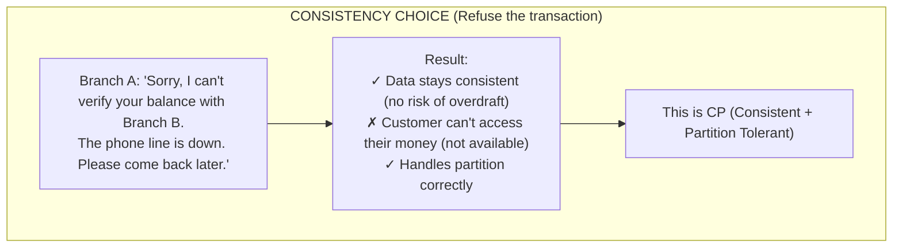
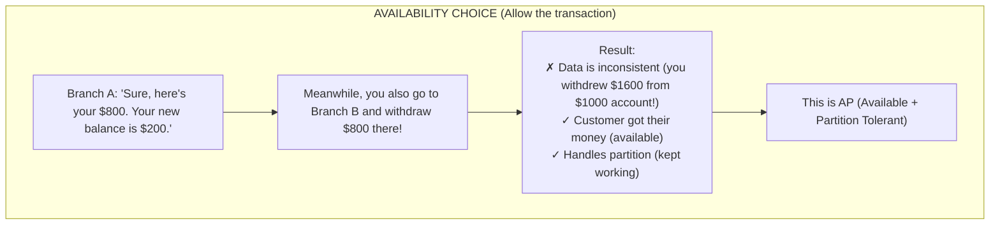
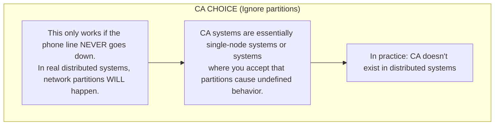
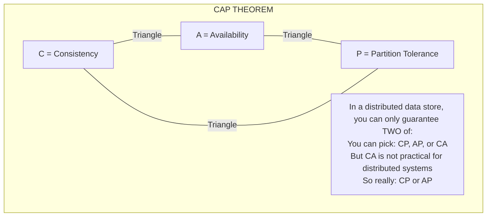
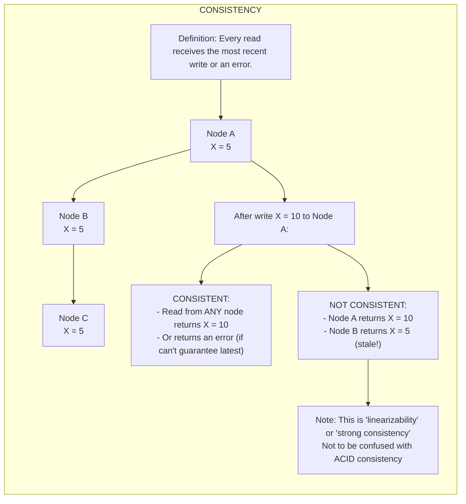
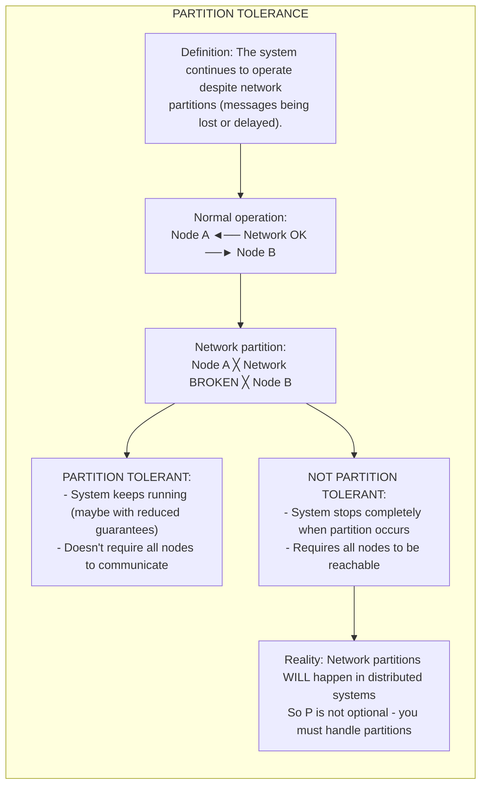
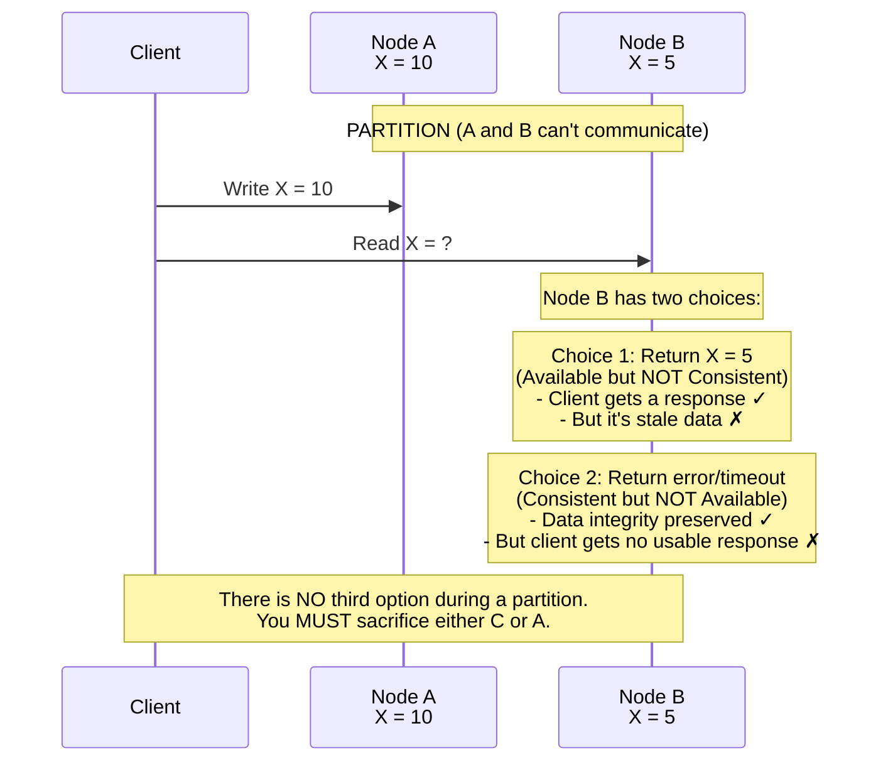

# ⚖️ CAP Theorem: The Fundamental Tradeoff

---

## 0️⃣ Prerequisites

Before understanding CAP theorem, you need to know:

- **Distributed System**: Multiple computers working together over a network (covered in Topic 1).
- **Database**: A system that stores and retrieves data.
- **Replication**: Keeping copies of data on multiple servers.
- **Network**: The communication pathway between computers that can fail or be slow.

If you understand that data can be stored on multiple computers and those computers communicate over a network, you're ready.

---

## 1️⃣ What Problem Does This Exist to Solve?

### The Pain Point

You're building a distributed database. You want:

1. **Always get the latest data** (Consistency)
2. **Always get a response** (Availability)
3. **Keep working even if network fails** (Partition Tolerance)

Sounds reasonable. But here's the problem: **you can't have all three**.

### What Systems Looked Like Before

Before CAP was formalized (2000), engineers would:

- Promise all three guarantees
- Be surprised when systems behaved unexpectedly during network issues
- Not understand why their "highly available" system sometimes returned stale data
- Build systems that froze completely during network partitions

### What Breaks Without Understanding CAP

1. **Wrong expectations**: Expecting guarantees that are impossible
2. **Poor design decisions**: Choosing the wrong database for your use case
3. **Incident confusion**: Not understanding why the system behaved a certain way
4. **Over-engineering**: Trying to achieve the impossible

### Real Examples of the Problem

**Amazon's Dynamo Paper (2007)**: Amazon explicitly chose availability over consistency for their shopping cart. They'd rather show you a slightly outdated cart than show you an error. This was a conscious CAP tradeoff.

**Google's Spanner**: Google built a globally distributed database that appears to violate CAP by using atomic clocks and GPS for time synchronization. But it still makes tradeoffs during partitions.

---

## 2️⃣ Intuition and Mental Model

### The Bank Teller Analogy

Imagine a bank with two branches (like two database nodes):

```mermaid
graph LR
    subgraph "THE BANK BRANCH ANALOGY"
        Account["You have $1000 in your account"]
        BranchA[Branch A<br>Balance: $1000]
        BranchB[Branch B<br>Balance: $1000]
        Phone[Phone Line<br>(the network)]
        Scenario["SCENARIO: The phone line goes down (network partition!)<br>You walk into Branch A to withdraw $800<br>Branch A has THREE options:"]
        
        BranchA <-->|Phone Line| BranchB
        Account --> BranchA
        Account --> BranchB
        Phone -.->|down| BranchA
        Phone -.->|down| BranchB
    end
```

<details>
<summary>ASCII diagram (reference)</summary>

```text
┌─────────────────────────────────────────────────────────────────────────┐
│                    THE BANK BRANCH ANALOGY                               │
│                                                                          │
│  You have $1000 in your account                                         │
│  Two bank branches: Branch A and Branch B                               │
│  They sync account balances via phone line (the network)                │
│                                                                          │
│  ┌───────────────┐                      ┌───────────────┐               │
│  │   Branch A    │◄────── Phone ───────►│   Branch B    │               │
│  │   Balance:    │        Line          │   Balance:    │               │
│  │   $1000       │                      │   $1000       │               │
│  └───────────────┘                      └───────────────┘               │
│                                                                          │
│  SCENARIO: The phone line goes down (network partition!)                │
│                                                                          │
│  You walk into Branch A to withdraw $800                                │
│                                                                          │
│  Branch A has THREE options:                                            │
│                                                                          │
└─────────────────────────────────────────────────────────────────────────┘
```
</details>

**Option 1: Choose CONSISTENCY**



<details>
<summary>ASCII diagram (reference)</summary>

```text
┌─────────────────────────────────────────────────────────────────────────┐
│  CONSISTENCY CHOICE (Refuse the transaction)                            │
│                                                                          │
│  Branch A: "Sorry, I can't verify your balance with Branch B.           │
│            The phone line is down. Please come back later."             │
│                                                                          │
│  Result:                                                                 │
│  ✓ Data stays consistent (no risk of overdraft)                        │
│  ✗ Customer can't access their money (not available)                   │
│  ✓ Handles partition correctly                                          │
│                                                                          │
│  This is CP (Consistent + Partition Tolerant)                           │
│                                                                          │
└─────────────────────────────────────────────────────────────────────────┘
```
</details>

**Option 2: Choose AVAILABILITY**



<details>
<summary>ASCII diagram (reference)</summary>

```text
┌─────────────────────────────────────────────────────────────────────────┐
│  AVAILABILITY CHOICE (Allow the transaction)                            │
│                                                                          │
│  Branch A: "Sure, here's your $800. Your new balance is $200."          │
│                                                                          │
│  Meanwhile, you also go to Branch B and withdraw $800 there!            │
│                                                                          │
│  Result:                                                                 │
│  ✗ Data is inconsistent (you withdrew $1600 from $1000 account!)       │
│  ✓ Customer got their money (available)                                 │
│  ✓ Handles partition (kept working)                                     │
│                                                                          │
│  This is AP (Available + Partition Tolerant)                            │
│                                                                          │
└─────────────────────────────────────────────────────────────────────────┘
```
</details>

**Option 3: Pretend Partitions Don't Happen (CA)**



<details>
<summary>ASCII diagram (reference)</summary>

```text
┌─────────────────────────────────────────────────────────────────────────┐
│  CA CHOICE (Ignore partitions)                                          │
│                                                                          │
│  This only works if the phone line NEVER goes down.                     │
│  In real distributed systems, network partitions WILL happen.           │
│                                                                          │
│  CA systems are essentially single-node systems or systems              │
│  where you accept that partitions cause undefined behavior.             │
│                                                                          │
│  In practice: CA doesn't exist in distributed systems                   │
│                                                                          │
└─────────────────────────────────────────────────────────────────────────┘
```
</details>

**Key insight**: When a partition happens, you MUST choose between C and A. You can't have both.

---

## 3️⃣ How It Works Internally

### The CAP Theorem Defined



<details>
<summary>ASCII diagram (reference)</summary>

```text
┌─────────────────────────────────────────────────────────────────────────┐
│                    CAP THEOREM                                           │
│                                                                          │
│  In a distributed data store, you can only guarantee TWO of:            │
│                                                                          │
│                         C                                                │
│                        /│\                                               │
│                       / │ \                                              │
│                      /  │  \                                             │
│                     /   │   \                                            │
│                    /    │    \                                           │
│                   /     │     \                                          │
│                  /      │      \                                         │
│                 /       │       \                                        │
│                A────────┴────────P                                       │
│                                                                          │
│  C = Consistency                                                         │
│  A = Availability                                                        │
│  P = Partition Tolerance                                                 │
│                                                                          │
│  You can pick: CP, AP, or CA                                            │
│  But CA is not practical for distributed systems                        │
│  So really: CP or AP                                                     │
│                                                                          │
└─────────────────────────────────────────────────────────────────────────┘
```
</details>

### Defining Each Property

**C - Consistency**



<details>
<summary>ASCII diagram (reference)</summary>

```text
┌─────────────────────────────────────────────────────────────────────────┐
│                    CONSISTENCY                                           │
│                                                                          │
│  Definition: Every read receives the most recent write or an error.     │
│                                                                          │
│  ┌─────────┐         ┌─────────┐         ┌─────────┐                   │
│  │ Node A  │         │ Node B  │         │ Node C  │                   │
│  │ X = 5   │         │ X = 5   │         │ X = 5   │                   │
│  └─────────┘         └─────────┘         └─────────┘                   │
│                                                                          │
│  After write X = 10 to Node A:                                          │
│                                                                          │
│  CONSISTENT:                                                             │
│  - Read from ANY node returns X = 10                                    │
│  - Or returns an error (if can't guarantee latest)                      │
│                                                                          │
│  NOT CONSISTENT:                                                         │
│  - Node A returns X = 10                                                │
│  - Node B returns X = 5 (stale!)                                        │
│                                                                          │
│  Note: This is "linearizability" or "strong consistency"                │
│        Not to be confused with ACID consistency                         │
│                                                                          │
└─────────────────────────────────────────────────────────────────────────┘
```
</details>

**A - Availability**

```mermaid
graph LR
    subgraph "AVAILABILITY"
        DefA["Definition: Every request receives a non-error response,<br>without guarantee that it's the most recent write."]
        NodeA_2[Node A<br>(up)]
        NodeB_2[Node B<br>(up)]
        NodeC_2[Node C<br>(down)]
        Available["AVAILABLE:<br>- Request to Node A → Response (maybe stale, but responds)<br>- Request to Node B → Response<br>- Request to Node C → This node is down, but A and B respond"]
        NotAvailable["NOT AVAILABLE:<br>- Request to Node A → 'Error: Cannot reach other nodes'<br>- Request to Node A → Timeout (no response)"]
        KeyA["Key: A response must be returned, even if the data might be stale"]
        
        DefA --> NodeA_2
        NodeA_2 --> NodeB_2 --> NodeC_2
        NodeA_2 --> Available
        NodeA_2 --> NotAvailable --> KeyA
    end
```

<details>
<summary>ASCII diagram (reference)</summary>

```text
┌─────────────────────────────────────────────────────────────────────────┐
│                    AVAILABILITY                                          │
│                                                                          │
│  Definition: Every request receives a non-error response,               │
│              without guarantee that it's the most recent write.         │
│                                                                          │
│  ┌─────────┐         ┌─────────┐         ┌─────────┐                   │
│  │ Node A  │         │ Node B  │         │ Node C  │                   │
│  │ (up)    │         │ (up)    │         │ (down)  │                   │
│  └─────────┘         └─────────┘         └─────────┘                   │
│                                                                          │
│  AVAILABLE:                                                              │
│  - Request to Node A → Response (maybe stale, but responds)            │
│  - Request to Node B → Response                                         │
│  - Request to Node C → This node is down, but A and B respond          │
│                                                                          │
│  NOT AVAILABLE:                                                          │
│  - Request to Node A → "Error: Cannot reach other nodes"               │
│  - Request to Node A → Timeout (no response)                           │
│                                                                          │
│  Key: A response must be returned, even if the data might be stale     │
│                                                                          │
└─────────────────────────────────────────────────────────────────────────┘
```
</details>

**P - Partition Tolerance**



<details>
<summary>ASCII diagram (reference)</summary>

```text
┌─────────────────────────────────────────────────────────────────────────┐
│                    PARTITION TOLERANCE                                   │
│                                                                          │
│  Definition: The system continues to operate despite network            │
│              partitions (messages being lost or delayed).               │
│                                                                          │
│  Normal operation:                                                       │
│  ┌─────────┐ ◄────────────────► ┌─────────┐                            │
│  │ Node A  │    Network OK      │ Node B  │                            │
│  └─────────┘                    └─────────┘                            │
│                                                                          │
│  Network partition:                                                      │
│  ┌─────────┐         ╳          ┌─────────┐                            │
│  │ Node A  │    Network BROKEN  │ Node B  │                            │
│  └─────────┘                    └─────────┘                            │
│                                                                          │
│  PARTITION TOLERANT:                                                     │
│  - System keeps running (maybe with reduced guarantees)                 │
│  - Doesn't require all nodes to communicate                             │
│                                                                          │
│  NOT PARTITION TOLERANT:                                                 │
│  - System stops completely when partition occurs                        │
│  - Requires all nodes to be reachable                                   │
│                                                                          │
│  Reality: Network partitions WILL happen in distributed systems         │
│           So P is not optional - you must handle partitions             │
│                                                                          │
└─────────────────────────────────────────────────────────────────────────┘
```
</details>

### Why You Can't Have All Three



<details>
<summary>ASCII diagram (reference)</summary>

```text
┌─────────────────────────────────────────────────────────────────────────┐
│                    THE PROOF (INTUITIVE)                                 │
│                                                                          │
│  Setup:                                                                  │
│  - Two nodes: A and B                                                   │
│  - Network partition occurs (A and B can't communicate)                 │
│  - Client writes X = 10 to Node A                                       │
│  - Client reads X from Node B                                           │
│                                                                          │
│  ┌─────────┐         ╳          ┌─────────┐                            │
│  │ Node A  │    PARTITION       │ Node B  │                            │
│  │ X = 10  │                    │ X = 5   │                            │
│  └─────────┘                    └─────────┘                            │
│       ▲                              ▲                                  │
│       │                              │                                  │
│   Write X=10                    Read X = ?                              │
│                                                                          │
│  Node B has two choices:                                                │
│                                                                          │
│  Choice 1: Return X = 5 (Available but NOT Consistent)                  │
│            - Client gets a response ✓                                   │
│            - But it's stale data ✗                                      │
│                                                                          │
│  Choice 2: Return error/timeout (Consistent but NOT Available)          │
│            - Data integrity preserved ✓                                 │
│            - But client gets no usable response ✗                       │
│                                                                          │
│  There is NO third option during a partition.                           │
│  You MUST sacrifice either C or A.                                      │
│                                                                          │
└─────────────────────────────────────────────────────────────────────────┘
```
</details>

### CP vs AP Systems

```
┌─────────────────────────────────────────────────────────────────────────┐
│                    CP SYSTEMS                                            │
│                    (Consistency + Partition Tolerance)                   │
│                                                                          │
│  Behavior during partition:                                              │
│  - Refuse writes/reads that can't be verified                           │
│  - May become unavailable for some operations                           │
│  - Guarantees you never see stale data                                  │
│                                                                          │
│  Examples:                                                               │
│  - MongoDB (with majority write concern)                                │
│  - HBase                                                                 │
│  - Redis Cluster (for certain operations)                               │
│  - Zookeeper                                                             │
│  - etcd                                                                  │
│                                                                          │
│  Use cases:                                                              │
│  - Financial transactions                                                │
│  - Inventory management (can't oversell)                                │
│  - Leader election                                                       │
│  - Configuration management                                              │
│                                                                          │
└─────────────────────────────────────────────────────────────────────────┘

┌─────────────────────────────────────────────────────────────────────────┐
│                    AP SYSTEMS                                            │
│                    (Availability + Partition Tolerance)                  │
│                                                                          │
│  Behavior during partition:                                              │
│  - Always respond to requests                                           │
│  - May return stale data                                                │
│  - Resolves conflicts later (eventual consistency)                      │
│                                                                          │
│  Examples:                                                               │
│  - Cassandra                                                             │
│  - DynamoDB                                                              │
│  - CouchDB                                                               │
│  - Riak                                                                  │
│                                                                          │
│  Use cases:                                                              │
│  - Shopping carts (better to show old cart than error)                  │
│  - Social media feeds (slightly stale is OK)                            │
│  - DNS (availability critical)                                          │
│  - Caching layers                                                        │
│                                                                          │
└─────────────────────────────────────────────────────────────────────────┘
```

---

## 4️⃣ Simulation-First Explanation

### Scenario: Distributed Shopping Cart

Let's trace what happens with a shopping cart during a network partition.

**Setup**:

- 2 data centers: US-East and US-West
- User's cart data replicated to both
- Network partition occurs between data centers

```
┌─────────────────────────────────────────────────────────────────────────┐
│                    BEFORE PARTITION                                      │
│                                                                          │
│  User's Cart: [iPhone, AirPods]                                         │
│                                                                          │
│  ┌─────────────────────┐         ┌─────────────────────┐               │
│  │     US-EAST         │◄───────►│     US-WEST         │               │
│  │                     │  Sync   │                     │               │
│  │  Cart: [iPhone,     │         │  Cart: [iPhone,     │               │
│  │         AirPods]    │         │         AirPods]    │               │
│  └─────────────────────┘         └─────────────────────┘               │
│                                                                          │
│  Both data centers have identical data. All is well.                    │
│                                                                          │
└─────────────────────────────────────────────────────────────────────────┘
```

**Partition Occurs**:

```
┌─────────────────────────────────────────────────────────────────────────┐
│                    PARTITION OCCURS                                      │
│                                                                          │
│  ┌─────────────────────┐    ╳    ┌─────────────────────┐               │
│  │     US-EAST         │ BROKEN │     US-WEST         │               │
│  │                     │        │                     │               │
│  │  Cart: [iPhone,     │        │  Cart: [iPhone,     │               │
│  │         AirPods]    │        │         AirPods]    │               │
│  └─────────────────────┘        └─────────────────────┘               │
│                                                                          │
│  Network between data centers is down.                                  │
│  They can't sync anymore.                                               │
│                                                                          │
└─────────────────────────────────────────────────────────────────────────┘
```

**CP System Behavior (Consistency Priority)**:

```
┌─────────────────────────────────────────────────────────────────────────┐
│                    CP SYSTEM BEHAVIOR                                    │
│                                                                          │
│  User in California tries to add MacBook to cart:                       │
│                                                                          │
│  ┌─────────────────────┐    ╳    ┌─────────────────────┐               │
│  │     US-EAST         │        │     US-WEST         │               │
│  │                     │        │                     │               │
│  │  Cart: [iPhone,     │        │  "Cannot modify     │               │
│  │         AirPods]    │        │   cart - service    │               │
│  │                     │        │   unavailable"      │               │
│  └─────────────────────┘        └─────────────────────┘               │
│                                        ▲                                │
│                                        │                                │
│                               User in California                        │
│                               sees error page                           │
│                                                                          │
│  Result:                                                                 │
│  - User can't add to cart (bad UX)                                     │
│  - But cart data stays consistent                                       │
│  - No risk of lost items or duplicates                                 │
│                                                                          │
└─────────────────────────────────────────────────────────────────────────┘
```

**AP System Behavior (Availability Priority)**:

```
┌─────────────────────────────────────────────────────────────────────────┐
│                    AP SYSTEM BEHAVIOR                                    │
│                                                                          │
│  User in California adds MacBook:                                       │
│  User in New York removes AirPods:                                      │
│                                                                          │
│  ┌─────────────────────┐    ╳    ┌─────────────────────┐               │
│  │     US-EAST         │        │     US-WEST         │               │
│  │                     │        │                     │               │
│  │  Cart: [iPhone]     │        │  Cart: [iPhone,     │               │
│  │  (removed AirPods)  │        │   AirPods, MacBook] │               │
│  │                     │        │  (added MacBook)    │               │
│  └─────────────────────┘        └─────────────────────┘               │
│         ▲                              ▲                                │
│         │                              │                                │
│  User in New York              User in California                       │
│  sees: [iPhone]                sees: [iPhone, AirPods, MacBook]        │
│                                                                          │
│  Both users got responses! But carts are different (inconsistent)      │
│                                                                          │
└─────────────────────────────────────────────────────────────────────────┘
```

**After Partition Heals (AP System)**:

```
┌─────────────────────────────────────────────────────────────────────────┐
│                    CONFLICT RESOLUTION                                   │
│                                                                          │
│  Network restored. Now we have conflicting data:                        │
│  - US-East: [iPhone]                                                    │
│  - US-West: [iPhone, AirPods, MacBook]                                  │
│                                                                          │
│  Resolution strategies:                                                  │
│                                                                          │
│  1. Last Write Wins (LWW):                                              │
│     - Most recent timestamp wins                                        │
│     - Simple but can lose data                                          │
│     - Result: Depends on which write was "last"                        │
│                                                                          │
│  2. Merge (Union):                                                       │
│     - Combine all items                                                 │
│     - Result: [iPhone, AirPods, MacBook]                               │
│     - May resurrect deleted items                                       │
│                                                                          │
│  3. Application-specific logic:                                          │
│     - Let user resolve conflicts                                        │
│     - "We found changes from multiple devices, which cart?"            │
│                                                                          │
│  Amazon's approach: Merge (union) for carts                             │
│  - Better to have extra items than missing items                        │
│  - User can remove unwanted items at checkout                           │
│                                                                          │
└─────────────────────────────────────────────────────────────────────────┘
```

---

## 5️⃣ How Engineers Actually Use This in Production

### Real Systems at Real Companies

**Amazon DynamoDB (AP)**:

- Chose availability for shopping carts
- "Always writable" design
- Uses vector clocks for conflict detection
- Application resolves conflicts (usually merge)

**Google Spanner (CP with caveats)**:

- Uses TrueTime (atomic clocks + GPS)
- Provides external consistency
- During partitions, chooses consistency (may be unavailable)
- Used for AdWords, Google Play

**Netflix (Mostly AP)**:

- Uses Cassandra (AP) for most data
- Accepts eventual consistency for viewing history
- User sees slightly stale "continue watching" list
- Better than showing error

### Real Workflows: Choosing Your Database

```
┌─────────────────────────────────────────────────────────────────────────┐
│                    DECISION FLOWCHART                                    │
│                                                                          │
│  Start: What are you storing?                                           │
│                                                                          │
│  ┌─────────────────────────────────────────────────────────────────┐    │
│  │                                                                  │    │
│  │  Financial transactions?                                         │    │
│  │  ├── Yes → Need strong consistency → CP (PostgreSQL, Spanner)   │    │
│  │  └── No ↓                                                        │    │
│  │                                                                  │    │
│  │  User sessions / carts?                                          │    │
│  │  ├── Yes → Need availability → AP (DynamoDB, Cassandra)         │    │
│  │  └── No ↓                                                        │    │
│  │                                                                  │    │
│  │  Configuration / coordination?                                   │    │
│  │  ├── Yes → Need consistency → CP (etcd, Zookeeper)              │    │
│  │  └── No ↓                                                        │    │
│  │                                                                  │    │
│  │  Social media posts / feeds?                                     │    │
│  │  ├── Yes → Availability matters more → AP (Cassandra)           │    │
│  │  └── No ↓                                                        │    │
│  │                                                                  │    │
│  │  Analytics / metrics?                                            │    │
│  │  ├── Yes → Availability + eventual consistency → AP             │    │
│  │  └── No → Evaluate your specific needs                          │    │
│  │                                                                  │    │
│  └─────────────────────────────────────────────────────────────────┘    │
│                                                                          │
└─────────────────────────────────────────────────────────────────────────┘
```

### What is Automated vs Manual

| Aspect              | Automated             | Manual                      |
| ------------------- | --------------------- | --------------------------- |
| Partition detection | Database handles      | Define timeout thresholds   |
| Failover            | Automatic in most DBs | Configure failover policies |
| Conflict resolution | LWW or merge          | Application-specific logic  |
| Consistency level   | Per-request tuning    | Choose default level        |

---

## 6️⃣ How to Implement CAP-Aware Systems

### Cassandra Example (AP System)

```java
// CassandraConsistencyExample.java
package com.example.cap;

import com.datastax.oss.driver.api.core.CqlSession;
import com.datastax.oss.driver.api.core.ConsistencyLevel;
import com.datastax.oss.driver.api.core.cql.*;

/**
 * Demonstrates tunable consistency in Cassandra.
 *
 * Cassandra is AP by default but allows you to tune consistency per query.
 * Higher consistency = more CP-like behavior (at cost of availability)
 */
public class CassandraConsistencyExample {

    private final CqlSession session;

    public CassandraConsistencyExample(CqlSession session) {
        this.session = session;
    }

    /**
     * Write with eventual consistency (AP behavior)
     *
     * ConsistencyLevel.ONE: Write succeeds if ANY one replica acknowledges
     * - Fastest writes
     * - Highest availability
     * - Risk: Data might not be on all replicas yet
     */
    public void writeEventualConsistency(String userId, String cartData) {
        SimpleStatement statement = SimpleStatement.builder(
            "INSERT INTO shopping_cart (user_id, cart_data, updated_at) VALUES (?, ?, toTimestamp(now()))")
            .addPositionalValues(userId, cartData)
            .setConsistencyLevel(ConsistencyLevel.ONE)  // AP: Just one node
            .build();

        session.execute(statement);
        System.out.println("Write completed (eventual consistency)");
    }

    /**
     * Write with strong consistency (CP behavior)
     *
     * ConsistencyLevel.QUORUM: Write succeeds if MAJORITY of replicas acknowledge
     * - Slower writes
     * - Lower availability during partitions
     * - Guarantee: Read with QUORUM will see this write
     */
    public void writeStrongConsistency(String userId, String cartData) {
        SimpleStatement statement = SimpleStatement.builder(
            "INSERT INTO shopping_cart (user_id, cart_data, updated_at) VALUES (?, ?, toTimestamp(now()))")
            .addPositionalValues(userId, cartData)
            .setConsistencyLevel(ConsistencyLevel.QUORUM)  // CP: Majority of nodes
            .build();

        session.execute(statement);
        System.out.println("Write completed (strong consistency)");
    }

    /**
     * Read with eventual consistency
     *
     * Might return stale data if recent write hasn't propagated
     */
    public String readEventualConsistency(String userId) {
        SimpleStatement statement = SimpleStatement.builder(
            "SELECT cart_data FROM shopping_cart WHERE user_id = ?")
            .addPositionalValues(userId)
            .setConsistencyLevel(ConsistencyLevel.ONE)
            .build();

        ResultSet rs = session.execute(statement);
        Row row = rs.one();
        return row != null ? row.getString("cart_data") : null;
    }

    /**
     * Read with strong consistency
     *
     * Guaranteed to return the most recent write (if write used QUORUM too)
     */
    public String readStrongConsistency(String userId) {
        SimpleStatement statement = SimpleStatement.builder(
            "SELECT cart_data FROM shopping_cart WHERE user_id = ?")
            .addPositionalValues(userId)
            .setConsistencyLevel(ConsistencyLevel.QUORUM)
            .build();

        ResultSet rs = session.execute(statement);
        Row row = rs.one();
        return row != null ? row.getString("cart_data") : null;
    }

    /**
     * Demonstrates the tradeoff in action
     */
    public static void demonstrateTradeoff() {
        /*
         * Scenario: 3-node Cassandra cluster, 1 node goes down
         *
         * With ConsistencyLevel.ONE:
         * - Writes succeed (only need 1 node)
         * - Reads succeed (only need 1 node)
         * - System stays AVAILABLE
         * - But might read stale data
         *
         * With ConsistencyLevel.QUORUM (need 2 of 3):
         * - Writes succeed (2 nodes available)
         * - Reads succeed (2 nodes available)
         * - System stays available (barely)
         *
         * With ConsistencyLevel.ALL:
         * - Writes FAIL (can't reach all 3)
         * - Reads FAIL (can't reach all 3)
         * - System becomes UNAVAILABLE
         * - But guarantees perfect consistency
         */
    }
}
```

### MongoDB Example (CP System)

```java
// MongoDBConsistencyExample.java
package com.example.cap;

import com.mongodb.client.*;
import com.mongodb.client.model.*;
import com.mongodb.*;
import org.bson.Document;

/**
 * Demonstrates MongoDB's CP behavior with write concerns.
 *
 * MongoDB defaults to CP: prioritizes consistency over availability.
 * During network partitions, writes may fail if majority can't be reached.
 */
public class MongoDBConsistencyExample {

    private final MongoCollection<Document> collection;

    public MongoDBConsistencyExample(MongoClient client) {
        MongoDatabase db = client.getDatabase("myapp");
        this.collection = db.getCollection("orders");
    }

    /**
     * Write with majority write concern (strong consistency)
     *
     * WriteConcern.MAJORITY: Write must be acknowledged by majority of replica set
     * - Guarantees durability
     * - May fail during partitions (CP behavior)
     */
    public void createOrderStrong(String orderId, double amount) {
        Document order = new Document()
            .append("orderId", orderId)
            .append("amount", amount)
            .append("status", "created")
            .append("createdAt", System.currentTimeMillis());

        // This will throw exception if majority can't be reached
        collection.withWriteConcern(WriteConcern.MAJORITY)
            .insertOne(order);

        System.out.println("Order created with strong consistency");
    }

    /**
     * Write with w:1 (weaker consistency, higher availability)
     *
     * WriteConcern.W1: Write acknowledged by primary only
     * - Faster
     * - More available
     * - Risk: Data loss if primary fails before replication
     */
    public void createOrderFast(String orderId, double amount) {
        Document order = new Document()
            .append("orderId", orderId)
            .append("amount", amount)
            .append("status", "created")
            .append("createdAt", System.currentTimeMillis());

        collection.withWriteConcern(WriteConcern.W1)
            .insertOne(order);

        System.out.println("Order created with eventual consistency");
    }

    /**
     * Read from primary only (strong consistency)
     *
     * ReadPreference.primary(): Always read from primary
     * - Guaranteed latest data
     * - Fails if primary is down
     */
    public Document readOrderStrong(String orderId) {
        return collection.withReadPreference(ReadPreference.primary())
            .find(Filters.eq("orderId", orderId))
            .first();
    }

    /**
     * Read from any node (higher availability)
     *
     * ReadPreference.secondaryPreferred(): Prefer secondary, fallback to primary
     * - Higher availability
     * - May return slightly stale data
     */
    public Document readOrderAvailable(String orderId) {
        return collection.withReadPreference(ReadPreference.secondaryPreferred())
            .find(Filters.eq("orderId", orderId))
            .first();
    }
}
```

### Application-Level CAP Handling

```java
// CAPAwareService.java
package com.example.cap;

import org.springframework.stereotype.Service;
import java.util.Optional;

/**
 * Service that handles CAP tradeoffs at the application level.
 *
 * Different operations can have different consistency requirements.
 */
@Service
public class OrderService {

    private final StrongConsistencyStore strongStore;  // CP - for critical data
    private final EventualConsistencyStore eventualStore;  // AP - for less critical
    private final CacheStore cache;

    /**
     * Creating an order requires strong consistency.
     * We can't risk duplicate orders or lost orders.
     */
    public Order createOrder(OrderRequest request) {
        // Use CP store - accept that this might fail during partitions
        try {
            Order order = strongStore.create(request);

            // Async update to eventual consistency store for read scaling
            eventualStore.updateAsync(order);

            return order;

        } catch (ConsistencyException e) {
            // During partition, we choose to fail rather than risk inconsistency
            throw new ServiceUnavailableException(
                "Order service temporarily unavailable. Please retry.", e);
        }
    }

    /**
     * Reading order history can use eventual consistency.
     * Slightly stale data is acceptable.
     */
    public List<Order> getOrderHistory(String userId) {
        // Try cache first (fastest, eventually consistent)
        Optional<List<Order>> cached = cache.get("orders:" + userId);
        if (cached.isPresent()) {
            return cached.get();
        }

        // Fall back to eventual consistency store
        // This will always respond (AP behavior)
        List<Order> orders = eventualStore.getByUser(userId);

        // Update cache
        cache.set("orders:" + userId, orders, Duration.ofMinutes(5));

        return orders;
    }

    /**
     * Checking inventory requires strong consistency.
     * We can't oversell products.
     */
    public boolean checkAndReserveInventory(String productId, int quantity) {
        // Use CP store with pessimistic locking
        try {
            return strongStore.reserveInventory(productId, quantity);
        } catch (ConsistencyException e) {
            // During partition, reject the purchase
            // Better to lose a sale than oversell
            return false;
        }
    }

    /**
     * Product recommendations can be eventually consistent.
     * Showing slightly outdated recommendations is fine.
     */
    public List<Product> getRecommendations(String userId) {
        // Always return something (AP behavior)
        // Even if data is stale or we fall back to generic recommendations
        try {
            return eventualStore.getRecommendations(userId);
        } catch (Exception e) {
            // Fallback to generic recommendations
            return getGenericRecommendations();
        }
    }
}
```

---

## 7️⃣ Tradeoffs, Pitfalls, and Common Mistakes

### Common Mistakes

**1. Thinking you can avoid the tradeoff**

```
WRONG: "We'll just make our system CAP-complete"
       (Impossible during partitions)

RIGHT: "We choose AP for this use case because availability matters more"
       (Explicit tradeoff decision)
```

**2. Ignoring partitions**

```
WRONG: "Network partitions are rare, we won't worry about them"
       (They WILL happen in production)

RIGHT: "We've tested our system's behavior during partitions"
       (Know what happens and accept it)
```

**3. One-size-fits-all approach**

```
WRONG: "Our whole system is CP because consistency is important"
       (Some data doesn't need strong consistency)

RIGHT: "Orders are CP, product views are AP, recommendations are AP"
       (Different consistency for different data)
```

**4. Confusing consistency types**

```
CAP Consistency ≠ ACID Consistency

CAP Consistency: All nodes see the same data at the same time
ACID Consistency: Database constraints are maintained (foreign keys, etc.)

A system can be ACID-consistent but CAP-inconsistent (eventual consistency)
```

### The PACELC Extension

CAP only describes behavior during partitions. PACELC extends it:

```
┌─────────────────────────────────────────────────────────────────────────┐
│                    PACELC THEOREM                                        │
│                                                                          │
│  If there is a Partition (P):                                           │
│    Choose between Availability (A) and Consistency (C)                  │
│                                                                          │
│  Else (E), when system is running normally:                             │
│    Choose between Latency (L) and Consistency (C)                       │
│                                                                          │
│  Examples:                                                               │
│                                                                          │
│  DynamoDB: PA/EL                                                        │
│  - During partition: Choose Availability                                │
│  - Normal operation: Choose Latency (fast reads from any replica)       │
│                                                                          │
│  MongoDB: PC/EC                                                          │
│  - During partition: Choose Consistency                                 │
│  - Normal operation: Choose Consistency (read from primary)             │
│                                                                          │
│  Cassandra: PA/EL (default) or PC/EC (with QUORUM)                     │
│  - Tunable per query                                                    │
│                                                                          │
└─────────────────────────────────────────────────────────────────────────┘
```

---

## 8️⃣ When NOT to Worry About CAP

### Situations Where CAP is Less Relevant

1. **Single-node databases**: No distribution = no partition = no CAP tradeoff
2. **Read-only data**: No writes = no consistency concerns
3. **Idempotent operations**: Can safely retry without side effects
4. **Human-in-the-loop**: User can resolve conflicts manually

### When to Accept Eventual Consistency

- User profile updates (seeing old profile briefly is OK)
- Social media likes/counts (approximate is fine)
- Analytics and metrics (eventual accuracy acceptable)
- Search indexes (slight delay in indexing is OK)
- Caching layers (stale cache is often acceptable)

---

## 9️⃣ Comparison: Database CAP Classifications

```
┌─────────────────────────────────────────────────────────────────────────┐
│                    DATABASE CAP CLASSIFICATIONS                          │
│                                                                          │
│  CP Systems (Consistency + Partition Tolerance):                        │
│  ┌─────────────────────────────────────────────────────────────────┐    │
│  │ Database      │ Notes                                           │    │
│  │───────────────────────────────────────────────────────────────│    │
│  │ MongoDB       │ With majority write concern                     │    │
│  │ HBase         │ Strong consistency by design                    │    │
│  │ Redis Cluster │ For certain operations                          │    │
│  │ Zookeeper     │ Coordination service, needs consistency         │    │
│  │ etcd          │ Kubernetes config store                         │    │
│  │ CockroachDB   │ Distributed SQL, CP by design                   │    │
│  │ Spanner       │ Google's globally distributed DB                │    │
│  └─────────────────────────────────────────────────────────────────┘    │
│                                                                          │
│  AP Systems (Availability + Partition Tolerance):                       │
│  ┌─────────────────────────────────────────────────────────────────┐    │
│  │ Database      │ Notes                                           │    │
│  │───────────────────────────────────────────────────────────────│    │
│  │ Cassandra     │ Tunable, defaults to AP                         │    │
│  │ DynamoDB      │ Amazon's key-value store                        │    │
│  │ CouchDB       │ Document store with replication                 │    │
│  │ Riak          │ Distributed key-value                           │    │
│  │ Voldemort     │ LinkedIn's distributed store                    │    │
│  └─────────────────────────────────────────────────────────────────┘    │
│                                                                          │
│  CA Systems (Not truly distributed):                                    │
│  ┌─────────────────────────────────────────────────────────────────┐    │
│  │ Database      │ Notes                                           │    │
│  │───────────────────────────────────────────────────────────────│    │
│  │ PostgreSQL    │ Single node (add replication for distribution) │    │
│  │ MySQL         │ Single node                                     │    │
│  │ Oracle        │ Single node (RAC is different)                  │    │
│  └─────────────────────────────────────────────────────────────────┘    │
│                                                                          │
└─────────────────────────────────────────────────────────────────────────┘
```

---

## 🔟 Interview Follow-Up Questions WITH Answers

### L4 (Entry-Level) Questions

**Q: What is the CAP theorem?**

A: CAP theorem states that in a distributed data store, you can only guarantee two of three properties: Consistency (all nodes see the same data), Availability (every request gets a response), and Partition Tolerance (system works despite network failures). Since network partitions are unavoidable in distributed systems, you effectively choose between consistency and availability during partitions. CP systems refuse requests they can't verify, while AP systems respond with potentially stale data.

**Q: Give an example of when you'd choose AP over CP.**

A: A shopping cart is a classic AP example. If there's a network partition, it's better to let users add items to their cart (even if it might cause conflicts later) than to show an error page. Amazon chose this approach. Users can resolve any conflicts at checkout. The cost of a slightly inconsistent cart is much lower than the cost of users abandoning their purchase because they couldn't add items.

### L5 (Mid-Level) Questions

**Q: How does Cassandra handle the CAP tradeoff?**

A: Cassandra is unique because it offers tunable consistency. By default, it's AP, always responding even with potentially stale data. But you can configure consistency levels per query. With ConsistencyLevel.ONE, only one replica needs to respond (highly available, eventually consistent). With ConsistencyLevel.QUORUM, a majority must respond (more consistent, less available). With ConsistencyLevel.ALL, all replicas must respond (strongly consistent but low availability). This lets you make different tradeoffs for different operations within the same system.

**Q: How would you design a system that needs both strong consistency for some operations and high availability for others?**

A: I'd use different data stores for different requirements. For example, in an e-commerce system: (1) Order creation and payment processing use a CP database like PostgreSQL or MongoDB with majority writes, because we can't risk duplicate charges or lost orders. (2) Product catalog and recommendations use an AP store like Cassandra or DynamoDB, because slightly stale data is acceptable and we need high read availability. (3) Shopping carts use an AP store with conflict resolution (like Amazon's Dynamo). (4) User sessions use Redis with eventual consistency. The key is analyzing each data type's consistency requirements separately rather than applying one approach everywhere.

### L6 (Senior) Questions

**Q: How do modern distributed databases like Spanner or CockroachDB claim to provide strong consistency with high availability?**

A: They don't violate CAP; they make clever engineering tradeoffs. Spanner uses TrueTime (atomic clocks and GPS) to bound clock uncertainty to a few milliseconds. This allows it to order transactions globally without coordination in most cases. During partitions, it still chooses consistency (CP). The innovation is minimizing the window where partitions affect availability. CockroachDB uses similar techniques with hybrid logical clocks. Both systems are still CP; they just minimize how often the "unavailable during partition" scenario occurs through geographic placement, fast networks, and clock synchronization. They also use consensus protocols (Paxos/Raft) that can make progress with a majority, so minor partitions don't cause unavailability.

**Q: How would you handle conflict resolution in an eventually consistent system?**

A: Several strategies exist: (1) Last Write Wins (LWW): Use timestamps; most recent write wins. Simple but can lose data. Need synchronized clocks (problematic in distributed systems). (2) Vector Clocks: Track causality to detect conflicts. Can identify concurrent writes that need resolution. Used by DynamoDB. (3) CRDTs (Conflict-free Replicated Data Types): Data structures designed to merge automatically. Examples: G-Counter (grow-only counter), OR-Set (observed-remove set). No conflicts possible by design. (4) Application-level resolution: Present conflicts to users or use domain-specific logic. For a shopping cart, merge (union) makes sense. For a document, might show diff to user. I'd choose based on the use case: LWW for simple cases where losing occasional updates is acceptable, CRDTs for counters and sets, application logic for complex business rules.

---

## 1️⃣1️⃣ One Clean Mental Summary

CAP theorem says that during a network partition, you must choose between consistency (all nodes agree) and availability (all requests get responses). You can't have both. Think of it like two bank branches that can't communicate: they can either refuse transactions (consistent but unavailable) or allow them and risk conflicts (available but inconsistent). Most systems are either CP (refuse when uncertain, like financial systems) or AP (respond with potentially stale data, like shopping carts). The key is choosing the right tradeoff for each type of data in your system, not applying one approach everywhere.
