# 💥 Failure Modes: Understanding How Systems Break

---

## 0️⃣ Prerequisites

Before understanding failure modes, you need to know:

- **Distributed System**: Multiple computers working together (covered in Topic 1).
- **Network**: The communication pathway between computers.
- **Timeout**: A limit on how long to wait for a response before giving up.
- **Dependency**: When one service relies on another to function.

If you understand that systems have multiple parts that communicate over networks, you're ready.

---

## 1️⃣ What Problem Does This Exist to Solve?

### The Pain Point

You build a system. It works perfectly in development. Then in production:

- A database query takes 30 seconds instead of 30 milliseconds
- A third-party API starts returning errors
- One server gets overloaded and slows down
- A network switch fails

Your entire system crashes. Users see errors. Revenue is lost.

**The problem**: You didn't design for failure.

### What Systems Looked Like Before

In the early days, engineers assumed:

- Networks are reliable
- Servers don't crash
- Dependencies always respond quickly
- Errors are rare exceptions

This led to brittle systems that worked in ideal conditions but collapsed under real-world stress.

### What Breaks Without Understanding Failures

1. **Cascading failures**: One component's failure brings down the entire system
2. **Resource exhaustion**: Threads, connections, memory depleted
3. **Unresponsive systems**: Users wait forever with no feedback
4. **Data corruption**: Partial failures leave data in inconsistent states
5. **Extended outages**: No recovery mechanism, manual intervention required

### Real Examples of the Problem

**Amazon's 2017 S3 Outage**: A typo in a command removed more servers than intended. The system couldn't recover automatically, causing a 4-hour outage affecting thousands of websites.

**Knight Capital (2012)**: A software deployment failure caused the trading system to execute erroneous trades. Lost $440 million in 45 minutes. No circuit breaker to stop the bleeding.

**Facebook's 2021 Outage**: A configuration change disconnected their data centers from the internet. The failure cascaded because internal tools also depended on the same infrastructure.

---

## 2️⃣ Intuition and Mental Model

### The Domino Effect Analogy

Think of your system as a chain of dominoes:

```mermaid
graph LR
    subgraph "THE DOMINO EFFECT"
        subgraph "BRITTLE SYSTEM (No failure handling)"
            User1[User] --> Web1[Web]
            Web1 --> API1[API]
            API1 --> Service1[Service]
            Service1 --> DB1[Database]
            Slow["Database slows down"]
            DB1 --> Slow
            Slow -->|ALL FALL DOWN| Service1
            Service1 -->|ALL FALL DOWN| API1
            API1 -->|ALL FALL DOWN| Web1
        end
        
        subgraph "RESILIENT SYSTEM (With failure handling)"
            User2[User] --> Web2[Web]
            Web2 --> API2[API]
            API2 --> Service2[Service]
            Service2 --> DB2[Database]
            Fail["Database fails ╳"]
            DB2 --> Fail
            Service2 -->|Circuit breaker OPENS| CB[Returns cached/fallback data]
            CB -->|System stays UP<br>(degraded but functional)| Service2
        end
    end
```

<details>
<summary>ASCII diagram (reference)</summary>

```text
┌─────────────────────────────────────────────────────────────────────────┐
│                    THE DOMINO EFFECT                                     │
│                                                                          │
│  BRITTLE SYSTEM (No failure handling):                                  │
│                                                                          │
│  User ──► Web ──► API ──► Service ──► Database                         │
│           │       │        │           │                                │
│           ▼       ▼        ▼           ▼                                │
│          ┌─┐     ┌─┐      ┌─┐         ┌─┐                              │
│          │█│────►│█│─────►│█│────────►│█│                              │
│          └─┘     └─┘      └─┘         └─┘                              │
│                                        ▲                                │
│                                        │                                │
│                              Database slows down                        │
│                                        │                                │
│                                        ▼                                │
│          ┌─┐     ┌─┐      ┌─┐         ┌─┐                              │
│          │░│◄────│░│◄─────│░│◄────────│░│  ALL FALL DOWN               │
│          └─┘     └─┘      └─┘         └─┘                              │
│                                                                          │
│  ───────────────────────────────────────────────────────────────────    │
│                                                                          │
│  RESILIENT SYSTEM (With failure handling):                              │
│                                                                          │
│  User ──► Web ──► API ──► Service ──► Database                         │
│           │       │        │           │                                │
│           ▼       ▼        ▼           ▼                                │
│          ┌─┐     ┌─┐      ┌─┐         ┌─┐                              │
│          │█│     │█│      │█│    ╳    │░│  Database fails              │
│          └─┘     └─┘      └─┘         └─┘                              │
│           │       │        │                                            │
│           │       │        └──► Circuit breaker OPENS                   │
│           │       │             Returns cached/fallback data            │
│           │       │                                                      │
│          ┌─┐     ┌─┐      ┌─┐                                          │
│          │█│     │█│      │█│         System stays UP                  │
│          └─┘     └─┘      └─┘         (degraded but functional)        │
│                                                                          │
└─────────────────────────────────────────────────────────────────────────┘
```
</details>

**Key insight**: Design systems to fail gracefully, not catastrophically.

---

## 3️⃣ How It Works Internally

### Types of Failures

```mermaid
graph TD
    subgraph "FAILURE TAXONOMY"
        Network["1. NETWORK FAILURES<br>├── Connection refused<br>├── Connection timeout<br>├── Read timeout<br>├── Network partition<br>└── DNS failure"]
        Service["2. SERVICE FAILURES<br>├── Crash<br>├── Hang<br>├── Slow response<br>├── Error response<br>└── Incorrect response"]
        Resource["3. RESOURCE FAILURES<br>├── Memory exhaustion (OOM)<br>├── CPU saturation<br>├── Disk full<br>├── File descriptor exhaustion<br>└── Thread pool exhaustion"]
        Dependency["4. DEPENDENCY FAILURES<br>├── Database down<br>├── Cache unavailable<br>├── Third-party API failure<br>├── Message queue full<br>└── Authentication service down"]
        Data["5. DATA FAILURES<br>├── Corruption<br>├── Inconsistency<br>├── Schema mismatch<br>└── Invalid input"]
        
        Network --> Service --> Resource --> Dependency --> Data
    end
```



<details>
<summary>ASCII diagram (reference)</summary>

```text
┌─────────────────────────────────────────────────────────────────────────┐
│                    FAILURE TAXONOMY                                      │
│                                                                          │
│  1. NETWORK FAILURES                                                     │
│     ├── Connection refused (server not listening)                       │
│     ├── Connection timeout (can't establish connection)                 │
│     ├── Read timeout (connected but no response)                        │
│     ├── Network partition (nodes can't communicate)                     │
│     └── DNS failure (can't resolve hostname)                            │
│                                                                          │
│  2. SERVICE FAILURES                                                     │
│     ├── Crash (process dies)                                            │
│     ├── Hang (process alive but not responding)                         │
│     ├── Slow response (responding but taking too long)                  │
│     ├── Error response (4xx, 5xx HTTP codes)                           │
│     └── Incorrect response (wrong data, corrupted)                      │
│                                                                          │
│  3. RESOURCE FAILURES                                                    │
│     ├── Memory exhaustion (OOM)                                         │
│     ├── CPU saturation (100% CPU)                                       │
│     ├── Disk full                                                        │
│     ├── File descriptor exhaustion                                       │
│     └── Thread pool exhaustion                                           │
│                                                                          │
│  4. DEPENDENCY FAILURES                                                  │
│     ├── Database down                                                    │
│     ├── Cache unavailable                                                │
│     ├── Third-party API failure                                          │
│     ├── Message queue full                                               │
│     └── Authentication service down                                      │
│                                                                          │
│  5. DATA FAILURES                                                        │
│     ├── Corruption                                                       │
│     ├── Inconsistency (between replicas)                                │
│     ├── Schema mismatch                                                  │
│     └── Invalid input                                                    │
│                                                                          │
└─────────────────────────────────────────────────────────────────────────┘
```
</details>

### Partial Failures

In distributed systems, failures are often partial:


<details>
<summary>ASCII diagram (reference)</summary>

```text
┌─────────────────────────────────────────────────────────────────────────┐
│                    PARTIAL FAILURE SCENARIOS                             │
│                                                                          │
│  Scenario 1: Request succeeds, response lost                            │
│  ┌─────────┐                      ┌─────────┐                           │
│  │ Client  │ ─── Request ───────► │ Server  │                           │
│  │         │                      │ (saves) │                           │
│  │         │ ◄─── Response ─ ╳    │         │  Response lost!           │
│  └─────────┘                      └─────────┘                           │
│                                                                          │
│  Client thinks: Failed                                                   │
│  Server thinks: Succeeded                                                │
│  Reality: Data WAS saved, but client doesn't know                       │
│                                                                          │
│  ───────────────────────────────────────────────────────────────────    │
│                                                                          │
│  Scenario 2: Timeout - Unknown state                                    │
│  ┌─────────┐                      ┌─────────┐                           │
│  │ Client  │ ─── Request ───────► │ Server  │                           │
│  │ (waits  │                      │ (slow   │                           │
│  │  5 sec) │                      │ process)│                           │
│  │ TIMEOUT │                      │         │                           │
│  └─────────┘                      └─────────┘                           │
│                                                                          │
│  Client gave up after 5 seconds                                         │
│  Server might still be processing                                       │
│  Client doesn't know if operation succeeded or failed                   │
│                                                                          │
│  ───────────────────────────────────────────────────────────────────    │
│                                                                          │
│  Scenario 3: Cascading failure                                          │
│                                                                          │
│  Service A ──► Service B ──► Service C ──► Database                    │
│                                              │                          │
│                                         (slow: 10s)                     │
│                                              │                          │
│  Service C: Threads waiting for DB                                      │
│  Service B: Threads waiting for C                                       │
│  Service A: Threads waiting for B                                       │
│                                                                          │
│  All thread pools exhausted!                                            │
│  Entire system becomes unresponsive                                     │
│                                                                          │
└─────────────────────────────────────────────────────────────────────────┘
```
</details>

### Timeouts and Retries

**Timeouts** prevent indefinite waiting:


<details>
<summary>ASCII diagram (reference)</summary>

```text
┌─────────────────────────────────────────────────────────────────────────┐
│                    TIMEOUT CONFIGURATION                                 │
│                                                                          │
│  Types of timeouts:                                                      │
│                                                                          │
│  1. Connection Timeout                                                   │
│     How long to wait to establish a connection                          │
│     Typical: 1-5 seconds                                                │
│     If exceeded: Server is probably down or unreachable                 │
│                                                                          │
│  2. Read/Response Timeout                                                │
│     How long to wait for data after connection established              │
│     Typical: 5-30 seconds (depends on operation)                        │
│     If exceeded: Server is processing slowly or hung                    │
│                                                                          │
│  3. Write Timeout                                                        │
│     How long to wait for server to accept data                          │
│     Typical: 5-30 seconds                                               │
│                                                                          │
│  4. Idle Timeout                                                         │
│     How long to keep unused connection open                             │
│     Typical: 30-300 seconds                                             │
│                                                                          │
│  Rule of thumb:                                                          │
│  - Connection timeout < Read timeout                                    │
│  - Downstream timeout < Upstream timeout                                │
│    (If A calls B calls C: timeout_A > timeout_B > timeout_C)           │
│                                                                          │
└─────────────────────────────────────────────────────────────────────────┘
```
</details>

**Retries** handle transient failures:

```mermaid
graph TD
    subgraph "RETRY STRATEGIES"
        R1["1. Immediate Retry (BAD)<br>Attempt 1: Fail → Attempt 2: Fail (0ms later) → Attempt 3: Fail (0ms later)<br>Problem: Hammers the already-struggling server"]
        R2["2. Fixed Delay Retry<br>Attempt 1: Fail → Wait 1s → Attempt 2: Fail → Wait 1s → Attempt 3: Success<br>Better, but all clients retry at same time (thundering herd)"]
        R3["3. Exponential Backoff (GOOD)<br>Attempt 1: Fail → Wait 1s → Attempt 2: Fail → Wait 2s → Attempt 3: Fail → Wait 4s → Attempt 4: Success<br>Gives server time to recover"]
        R4["4. Exponential Backoff with Jitter (BEST)<br>Attempt 1: Fail → Wait 1s + random(0-500ms) → Attempt 2: Fail → Wait 2s + random(0-500ms) → Attempt 3: Success<br>Prevents thundering herd by spreading out retries"]
        
        R1 --> R2 --> R3 --> R4
    end
```



<details>
<summary>ASCII diagram (reference)</summary>

```text
┌─────────────────────────────────────────────────────────────────────────┐
│                    RETRY STRATEGIES                                      │
│                                                                          │
│  1. Immediate Retry (BAD)                                               │
│     Attempt 1: Fail                                                      │
│     Attempt 2: Fail (0ms later)                                         │
│     Attempt 3: Fail (0ms later)                                         │
│     Problem: Hammers the already-struggling server                      │
│                                                                          │
│  2. Fixed Delay Retry                                                    │
│     Attempt 1: Fail                                                      │
│     Wait 1 second                                                        │
│     Attempt 2: Fail                                                      │
│     Wait 1 second                                                        │
│     Attempt 3: Success                                                   │
│     Better, but all clients retry at same time (thundering herd)       │
│                                                                          │
│  3. Exponential Backoff (GOOD)                                          │
│     Attempt 1: Fail                                                      │
│     Wait 1 second                                                        │
│     Attempt 2: Fail                                                      │
│     Wait 2 seconds                                                       │
│     Attempt 3: Fail                                                      │
│     Wait 4 seconds                                                       │
│     Attempt 4: Success                                                   │
│     Gives server time to recover                                        │
│                                                                          │
│  4. Exponential Backoff with Jitter (BEST)                              │
│     Attempt 1: Fail                                                      │
│     Wait 1 second + random(0-500ms)                                     │
│     Attempt 2: Fail                                                      │
│     Wait 2 seconds + random(0-500ms)                                    │
│     Attempt 3: Success                                                   │
│     Prevents thundering herd by spreading out retries                   │
│                                                                          │
└─────────────────────────────────────────────────────────────────────────┘
```
</details>

### Cascading Failures


<details>
<summary>ASCII diagram (reference)</summary>

```text
┌─────────────────────────────────────────────────────────────────────────┐
│                    CASCADING FAILURE ANATOMY                             │
│                                                                          │
│  Timeline of a cascading failure:                                       │
│                                                                          │
│  T+0:    Database becomes slow (10s response time)                      │
│                                                                          │
│  T+10s:  Service C threads blocked waiting for DB                       │
│          Thread pool: 10/100 available                                  │
│                                                                          │
│  T+30s:  Service C thread pool exhausted                                │
│          Thread pool: 0/100 available                                   │
│          New requests queue up, then timeout                            │
│                                                                          │
│  T+45s:  Service B threads blocked waiting for C                        │
│          Thread pool: 20/100 available                                  │
│                                                                          │
│  T+60s:  Service B thread pool exhausted                                │
│          Thread pool: 0/100 available                                   │
│                                                                          │
│  T+75s:  Service A threads blocked waiting for B                        │
│          Thread pool: 30/100 available                                  │
│                                                                          │
│  T+90s:  Service A thread pool exhausted                                │
│          ENTIRE SYSTEM DOWN                                              │
│                                                                          │
│  Health over time:                                                       │
│  100% ████████████████████                                              │
│       ████████████████████████                                          │
│       ████████████████████████████                                      │
│   50% ████████████████████████████████                                  │
│       ████████████████████████████████████                              │
│       ████████████████████████████████████████                          │
│    0% ████████████████████████████████████████████████████              │
│       T+0   T+30s  T+60s  T+90s  T+120s                                │
│                                                                          │
│  One slow database → Total system failure in 90 seconds                │
│                                                                          │
└─────────────────────────────────────────────────────────────────────────┘
```

### Circuit Breakers

A circuit breaker prevents cascading failures by "breaking" the circuit to a failing service:


<details>
<summary>ASCII diagram (reference)</summary>

```text
┌─────────────────────────────────────────────────────────────────────────┐
│                    CIRCUIT BREAKER PATTERN                               │
│                                                                          │
│  States:                                                                 │
│                                                                          │
│  ┌──────────────────────────────────────────────────────────────────┐   │
│  │                                                                   │   │
│  │    ┌────────┐         ┌────────┐         ┌────────────┐         │   │
│  │    │ CLOSED │────────►│  OPEN  │────────►│ HALF-OPEN  │         │   │
│  │    │        │ Failure │        │ Timeout │            │         │   │
│  │    │ Normal │ threshold│ Reject │ expires │ Test with  │         │   │
│  │    │ flow   │ exceeded │ all    │         │ limited    │         │   │
│  │    │        │         │ requests│         │ requests   │         │   │
│  │    └────────┘         └────────┘         └────────────┘         │   │
│  │        ▲                                       │                 │   │
│  │        │                                       │                 │   │
│  │        │              Success                  │                 │   │
│  │        └───────────────────────────────────────┘                 │   │
│  │                                                                   │   │
│  │        ▲                                       │                 │   │
│  │        │              Failure                  │                 │   │
│  │        │              ┌────────────────────────┘                 │   │
│  │        │              │                                          │   │
│  │        │              ▼                                          │   │
│  │        │         ┌────────┐                                      │   │
│  │        └─────────│  OPEN  │                                      │   │
│  │                  └────────┘                                      │   │
│  │                                                                   │   │
│  └──────────────────────────────────────────────────────────────────┘   │
│                                                                          │
│  CLOSED: Normal operation, requests flow through                        │
│          Track failure rate                                             │
│          If failures exceed threshold → OPEN                            │
│                                                                          │
│  OPEN:   Circuit is broken                                              │
│          Immediately reject all requests (fail fast)                    │
│          After timeout → HALF-OPEN                                      │
│                                                                          │
│  HALF-OPEN: Testing if service recovered                                │
│             Allow limited requests through                              │
│             If successful → CLOSED                                      │
│             If failed → OPEN                                            │
│                                                                          │
└─────────────────────────────────────────────────────────────────────────┘
```
</details>

---

## 4️⃣ Simulation-First Explanation

### Scenario: E-commerce Checkout Failure

Let's trace a failure scenario in an e-commerce checkout flow:


<details>
<summary>ASCII diagram (reference)</summary>

```text
┌─────────────────────────────────────────────────────────────────────────┐
│                    CHECKOUT FLOW                                         │
│                                                                          │
│  User clicks "Place Order"                                              │
│         │                                                                │
│         ▼                                                                │
│  ┌─────────────┐                                                        │
│  │ Order       │──► Validate cart                                       │
│  │ Service     │──► Check inventory ──► Inventory Service               │
│  │             │──► Process payment ──► Payment Service ──► Bank API    │
│  │             │──► Create order    ──► Database                        │
│  │             │──► Send confirmation ──► Email Service                 │
│  └─────────────┘                                                        │
│                                                                          │
└─────────────────────────────────────────────────────────────────────────┘
```
</details>

**Failure Scenario: Payment Service Timeout**


<details>
<summary>ASCII diagram (reference)</summary>

```text
┌─────────────────────────────────────────────────────────────────────────┐
│                    WITHOUT PROPER FAILURE HANDLING                       │
│                                                                          │
│  T+0:    User clicks "Place Order"                                      │
│  T+1s:   Cart validated ✓                                               │
│  T+2s:   Inventory checked and reserved ✓                               │
│  T+3s:   Payment request sent to Payment Service                        │
│  T+4s:   Payment Service calls Bank API                                 │
│  T+5s:   Bank API is slow today...                                      │
│  ...                                                                     │
│  T+30s:  User still waiting, sees spinning wheel                        │
│  ...                                                                     │
│  T+60s:  Connection timeout! Payment status UNKNOWN                     │
│                                                                          │
│  Problems:                                                               │
│  1. User waited 60 seconds with no feedback                             │
│  2. Inventory is reserved but order not created                         │
│  3. Did the payment go through? We don't know!                          │
│  4. User might try again → double charge risk                           │
│                                                                          │
└─────────────────────────────────────────────────────────────────────────┘
```
</details>

**With Proper Failure Handling**:


<details>
<summary>ASCII diagram (reference)</summary>

```text
┌─────────────────────────────────────────────────────────────────────────┐
│                    WITH PROPER FAILURE HANDLING                          │
│                                                                          │
│  T+0:    User clicks "Place Order"                                      │
│          Generate idempotency key: "order-123-abc"                      │
│                                                                          │
│  T+1s:   Cart validated ✓                                               │
│                                                                          │
│  T+2s:   Inventory checked (not reserved yet)                           │
│          Inventory Service has circuit breaker: CLOSED                  │
│                                                                          │
│  T+3s:   Payment request with idempotency key                           │
│          Timeout set: 10 seconds                                        │
│          Payment Service circuit breaker: CLOSED                        │
│                                                                          │
│  T+5s:   Bank API slow...                                               │
│                                                                          │
│  T+13s:  Timeout! Payment status unknown                                │
│          Circuit breaker failure count: 1 of 5                          │
│                                                                          │
│  T+13s:  Return to user: "Payment processing. We'll email confirmation"│
│          Create order in PENDING state                                  │
│          Queue async job to check payment status                        │
│                                                                          │
│  T+14s:  User sees: "Order received! Confirmation coming soon."         │
│                                                                          │
│  Background (T+15s to T+60s):                                           │
│  - Async job checks payment status with Bank API                        │
│  - Payment confirmed → Order status: CONFIRMED                          │
│  - Payment failed → Order status: FAILED, notify user                   │
│  - If user retries, idempotency key prevents double charge              │
│                                                                          │
└─────────────────────────────────────────────────────────────────────────┘
```
</details>

---

## 5️⃣ How Engineers Actually Use This in Production

### Real Systems at Real Companies

**Netflix**:

- Uses Hystrix (now Resilience4j) for circuit breakers
- Every service call has timeouts and fallbacks
- Chaos Monkey randomly kills instances to test resilience
- Fallback: Show cached recommendations if recommendation service is down

**Amazon**:

- Extensive use of timeouts and retries
- Cell-based architecture to limit blast radius
- Every team has runbooks for failure scenarios
- Automated rollback on deployment failures

**Google**:

- Deadline propagation: Timeouts cascade through service calls
- Graceful degradation: Search still works if some features fail
- Extensive load shedding during overload

### Real Workflows and Tooling

**Resilience4j Configuration**:

```yaml
# application.yml
resilience4j:
  circuitbreaker:
    instances:
      paymentService:
        slidingWindowSize: 10
        failureRateThreshold: 50
        waitDurationInOpenState: 30s
        permittedNumberOfCallsInHalfOpenState: 3

  retry:
    instances:
      paymentService:
        maxAttempts: 3
        waitDuration: 1s
        exponentialBackoffMultiplier: 2
        retryExceptions:
          - java.io.IOException
          - java.net.SocketTimeoutException
        ignoreExceptions:
          - com.example.BusinessException

  timelimiter:
    instances:
      paymentService:
        timeoutDuration: 10s
```

### What is Automated vs Manual

| Aspect                | Automated                      | Manual                   |
| --------------------- | ------------------------------ | ------------------------ |
| Circuit breaker state | Opens/closes based on metrics  | Threshold configuration  |
| Retries               | Automatic with backoff         | Retry policy definition  |
| Failover              | Automatic to healthy instances | Failover strategy design |
| Alerts                | Triggered on failure patterns  | Alert threshold setting  |
| Recovery              | Auto-heal if possible          | Root cause analysis      |

---

## 6️⃣ How to Implement Failure Handling

### Circuit Breaker with Resilience4j

```java
// PaymentService.java
package com.example.resilience;

import io.github.resilience4j.circuitbreaker.annotation.CircuitBreaker;
import io.github.resilience4j.retry.annotation.Retry;
import io.github.resilience4j.timelimiter.annotation.TimeLimiter;
import org.springframework.stereotype.Service;
import java.util.concurrent.CompletableFuture;

/**
 * Payment service with resilience patterns.
 *
 * Demonstrates: Circuit Breaker, Retry, Timeout, Fallback
 */
@Service
public class PaymentService {

    private final PaymentGateway paymentGateway;
    private final PaymentRepository paymentRepository;

    public PaymentService(PaymentGateway paymentGateway,
                          PaymentRepository paymentRepository) {
        this.paymentGateway = paymentGateway;
        this.paymentRepository = paymentRepository;
    }

    /**
     * Process payment with full resilience stack.
     *
     * Order of decorators (inside out):
     * 1. TimeLimiter - Fails if takes too long
     * 2. CircuitBreaker - Fails fast if service is down
     * 3. Retry - Retries transient failures
     *
     * @param request Payment request with idempotency key
     * @return Payment result
     */
    @CircuitBreaker(name = "paymentService", fallbackMethod = "paymentFallback")
    @Retry(name = "paymentService")
    @TimeLimiter(name = "paymentService")
    public CompletableFuture<PaymentResult> processPayment(PaymentRequest request) {
        return CompletableFuture.supplyAsync(() -> {
            // Check for duplicate using idempotency key
            var existing = paymentRepository.findByIdempotencyKey(request.idempotencyKey());
            if (existing.isPresent()) {
                return existing.get();  // Return cached result
            }

            // Process payment
            var result = paymentGateway.charge(request);

            // Save result for idempotency
            paymentRepository.save(request.idempotencyKey(), result);

            return result;
        });
    }

    /**
     * Fallback when payment service is unavailable.
     *
     * This is called when:
     * - Circuit breaker is OPEN
     * - All retries exhausted
     * - Timeout exceeded
     */
    public CompletableFuture<PaymentResult> paymentFallback(
            PaymentRequest request,
            Throwable throwable) {

        // Log the failure
        System.err.println("Payment fallback triggered: " + throwable.getMessage());

        // Option 1: Queue for later processing
        queueForRetry(request);

        // Option 2: Return pending status
        return CompletableFuture.completedFuture(
            new PaymentResult(
                null,  // No transaction ID yet
                PaymentStatus.PENDING,
                "Payment queued for processing"
            )
        );
    }

    private void queueForRetry(PaymentRequest request) {
        // Add to retry queue (e.g., SQS, RabbitMQ)
        // Background worker will process later
    }

    // Records
    public record PaymentRequest(
        String idempotencyKey,
        String customerId,
        double amount,
        String currency
    ) {}

    public record PaymentResult(
        String transactionId,
        PaymentStatus status,
        String message
    ) {}

    public enum PaymentStatus {
        SUCCESS, FAILED, PENDING
    }
}
```

### Timeout and Retry Configuration

```java
// RetryConfiguration.java
package com.example.resilience;

import org.springframework.context.annotation.Bean;
import org.springframework.context.annotation.Configuration;
import org.springframework.web.reactive.function.client.WebClient;
import java.time.Duration;

/**
 * Configures HTTP client with proper timeouts.
 */
@Configuration
public class HttpClientConfiguration {

    @Bean
    public WebClient paymentWebClient() {
        return WebClient.builder()
            .baseUrl("https://payment-gateway.example.com")
            // Connection timeout: How long to wait to establish connection
            .codecs(configurer -> configurer
                .defaultCodecs()
                .maxInMemorySize(1024 * 1024))  // 1MB max response
            .build();
    }
}
```

```java
// RetryableHttpClient.java
package com.example.resilience;

import io.github.resilience4j.retry.Retry;
import io.github.resilience4j.retry.RetryConfig;
import org.springframework.stereotype.Component;
import org.springframework.web.reactive.function.client.WebClient;
import org.springframework.web.reactive.function.client.WebClientResponseException;

import java.io.IOException;
import java.time.Duration;
import java.util.function.Supplier;

/**
 * HTTP client with retry logic.
 */
@Component
public class RetryableHttpClient {

    private final WebClient webClient;
    private final Retry retry;

    public RetryableHttpClient(WebClient webClient) {
        this.webClient = webClient;

        // Configure retry behavior
        RetryConfig config = RetryConfig.custom()
            .maxAttempts(3)
            .waitDuration(Duration.ofSeconds(1))
            .exponentialBackoffMultiplier(2)  // 1s, 2s, 4s
            .retryOnException(this::isRetryable)
            .build();

        this.retry = Retry.of("httpClient", config);
    }

    /**
     * Determine if an exception should trigger a retry.
     */
    private boolean isRetryable(Throwable throwable) {
        // Retry on network errors
        if (throwable instanceof IOException) {
            return true;
        }

        // Retry on 5xx server errors
        if (throwable instanceof WebClientResponseException e) {
            int status = e.getStatusCode().value();
            return status >= 500 && status < 600;
        }

        // Don't retry on 4xx client errors (our fault, not transient)
        return false;
    }

    /**
     * Execute request with retry.
     */
    public <T> T executeWithRetry(Supplier<T> request) {
        return Retry.decorateSupplier(retry, request).get();
    }
}
```

### Graceful Degradation

```java
// ProductService.java
package com.example.resilience;

import io.github.resilience4j.circuitbreaker.annotation.CircuitBreaker;
import org.springframework.cache.annotation.Cacheable;
import org.springframework.stereotype.Service;

import java.util.List;
import java.util.Collections;

/**
 * Product service with graceful degradation.
 *
 * When dependencies fail, returns degraded but usable responses.
 */
@Service
public class ProductService {

    private final RecommendationService recommendationService;
    private final InventoryService inventoryService;
    private final PricingService pricingService;

    /**
     * Get product details with graceful degradation.
     *
     * Even if some services fail, we return what we can.
     */
    public ProductDetails getProductDetails(String productId) {
        // Core product data - must succeed
        Product product = getProduct(productId);

        // Recommendations - optional, use fallback if fails
        List<Product> recommendations = getRecommendationsSafe(productId);

        // Inventory - optional, show "check availability" if fails
        InventoryStatus inventory = getInventorySafe(productId);

        // Price - optional, show "contact for price" if fails
        Price price = getPriceSafe(productId);

        return new ProductDetails(product, recommendations, inventory, price);
    }

    @CircuitBreaker(name = "recommendations", fallbackMethod = "recommendationsFallback")
    public List<Product> getRecommendationsSafe(String productId) {
        return recommendationService.getRecommendations(productId);
    }

    /**
     * Fallback: Return empty recommendations instead of error
     */
    public List<Product> recommendationsFallback(String productId, Throwable t) {
        // Log for monitoring
        logDegradation("recommendations", productId, t);

        // Return empty list - UI will hide recommendations section
        return Collections.emptyList();
    }

    @CircuitBreaker(name = "inventory", fallbackMethod = "inventoryFallback")
    @Cacheable(value = "inventory", key = "#productId")
    public InventoryStatus getInventorySafe(String productId) {
        return inventoryService.checkInventory(productId);
    }

    /**
     * Fallback: Return unknown status instead of error
     */
    public InventoryStatus inventoryFallback(String productId, Throwable t) {
        logDegradation("inventory", productId, t);

        // Return unknown - UI will show "Check availability"
        return new InventoryStatus(productId, InventoryState.UNKNOWN, 0);
    }

    @CircuitBreaker(name = "pricing", fallbackMethod = "pricingFallback")
    public Price getPriceSafe(String productId) {
        return pricingService.getPrice(productId);
    }

    /**
     * Fallback: Return cached price or null
     */
    public Price pricingFallback(String productId, Throwable t) {
        logDegradation("pricing", productId, t);

        // Try to get cached price
        Price cachedPrice = getCachedPrice(productId);
        if (cachedPrice != null) {
            return cachedPrice.withStaleWarning();
        }

        // Return null - UI will show "Contact for price"
        return null;
    }

    private void logDegradation(String service, String productId, Throwable t) {
        System.err.printf("Degradation: %s failed for product %s: %s%n",
            service, productId, t.getMessage());
    }

    // Records and enums
    public record ProductDetails(
        Product product,
        List<Product> recommendations,
        InventoryStatus inventory,
        Price price
    ) {}

    public enum InventoryState {
        IN_STOCK, OUT_OF_STOCK, LOW_STOCK, UNKNOWN
    }
}
```

### Idempotency for Safe Retries

```java
// IdempotencyService.java
package com.example.resilience;

import org.springframework.data.redis.core.RedisTemplate;
import org.springframework.stereotype.Service;

import java.time.Duration;
import java.util.Optional;
import java.util.UUID;

/**
 * Ensures operations can be safely retried without side effects.
 *
 * Idempotency key flow:
 * 1. Client generates unique key for each logical operation
 * 2. Server checks if key was seen before
 * 3. If seen: return cached result (no re-execution)
 * 4. If new: execute and cache result
 */
@Service
public class IdempotencyService {

    private final RedisTemplate<String, OperationResult> redis;
    private static final Duration TTL = Duration.ofHours(24);

    public IdempotencyService(RedisTemplate<String, OperationResult> redis) {
        this.redis = redis;
    }

    /**
     * Generate a new idempotency key.
     * Client should store this and send with request.
     */
    public String generateKey() {
        return UUID.randomUUID().toString();
    }

    /**
     * Check if operation was already executed.
     */
    public Optional<OperationResult> getExistingResult(String idempotencyKey) {
        String key = "idempotency:" + idempotencyKey;
        OperationResult result = redis.opsForValue().get(key);
        return Optional.ofNullable(result);
    }

    /**
     * Try to acquire lock for this operation.
     * Returns true if this is the first execution attempt.
     */
    public boolean tryAcquire(String idempotencyKey) {
        String key = "idempotency:" + idempotencyKey;
        // SETNX - only sets if key doesn't exist
        Boolean acquired = redis.opsForValue()
            .setIfAbsent(key, OperationResult.inProgress(), TTL);
        return Boolean.TRUE.equals(acquired);
    }

    /**
     * Store the result of a completed operation.
     */
    public void storeResult(String idempotencyKey, OperationResult result) {
        String key = "idempotency:" + idempotencyKey;
        redis.opsForValue().set(key, result, TTL);
    }

    /**
     * Execute operation with idempotency guarantee.
     */
    public <T> T executeIdempotent(
            String idempotencyKey,
            java.util.function.Supplier<T> operation,
            java.util.function.Function<T, OperationResult> resultMapper) {

        // Check for existing result
        Optional<OperationResult> existing = getExistingResult(idempotencyKey);
        if (existing.isPresent() && existing.get().isComplete()) {
            // Already executed, return cached result
            return (T) existing.get().data();
        }

        // Try to acquire lock
        if (!tryAcquire(idempotencyKey)) {
            // Another request is processing this
            // Wait and check again, or return "in progress" status
            throw new OperationInProgressException(
                "Operation already in progress. Please wait.");
        }

        try {
            // Execute the operation
            T result = operation.get();

            // Store result
            storeResult(idempotencyKey, resultMapper.apply(result));

            return result;

        } catch (Exception e) {
            // Store failure result
            storeResult(idempotencyKey, OperationResult.failed(e.getMessage()));
            throw e;
        }
    }

    public record OperationResult(
        OperationStatus status,
        Object data,
        String errorMessage
    ) {
        public static OperationResult inProgress() {
            return new OperationResult(OperationStatus.IN_PROGRESS, null, null);
        }

        public static OperationResult success(Object data) {
            return new OperationResult(OperationStatus.SUCCESS, data, null);
        }

        public static OperationResult failed(String error) {
            return new OperationResult(OperationStatus.FAILED, null, error);
        }

        public boolean isComplete() {
            return status == OperationStatus.SUCCESS || status == OperationStatus.FAILED;
        }
    }

    public enum OperationStatus {
        IN_PROGRESS, SUCCESS, FAILED
    }
}
```

---

## 7️⃣ Tradeoffs, Pitfalls, and Common Mistakes

### Common Mistakes

**1. No timeouts**

```java
// WRONG: Can hang forever
HttpResponse response = httpClient.send(request, BodyHandlers.ofString());

// RIGHT: Always set timeouts
HttpResponse response = httpClient.send(request, BodyHandlers.ofString());
// With HttpClient configured with timeouts:
// .connectTimeout(Duration.ofSeconds(5))
// .timeout(Duration.ofSeconds(30))
```

**2. Retry without backoff**

```java
// WRONG: Hammers failing service
for (int i = 0; i < 3; i++) {
    try {
        return callService();
    } catch (Exception e) {
        // Immediate retry
    }
}

// RIGHT: Exponential backoff with jitter
int delay = 1000;
for (int i = 0; i < 3; i++) {
    try {
        return callService();
    } catch (Exception e) {
        Thread.sleep(delay + random.nextInt(500));
        delay *= 2;
    }
}
```

**3. Retrying non-idempotent operations**

```java
// WRONG: May charge customer multiple times!
for (int i = 0; i < 3; i++) {
    try {
        return chargeCustomer(amount);
    } catch (TimeoutException e) {
        // Retry - but did the charge go through?
    }
}

// RIGHT: Use idempotency key
String idempotencyKey = generateKey();
for (int i = 0; i < 3; i++) {
    try {
        return chargeCustomer(amount, idempotencyKey);
    } catch (TimeoutException e) {
        // Safe to retry - server will deduplicate
    }
}
```

**4. Circuit breaker with wrong thresholds**

```java
// WRONG: Opens too easily
CircuitBreakerConfig.custom()
    .failureRateThreshold(10)  // Opens after 10% failures
    .slidingWindowSize(5)       // Only looks at 5 requests
    // 1 failure in 5 requests = OPEN (too sensitive!)

// RIGHT: Reasonable thresholds
CircuitBreakerConfig.custom()
    .failureRateThreshold(50)   // Opens after 50% failures
    .slidingWindowSize(20)      // Looks at 20 requests
    .minimumNumberOfCalls(10)   // Need at least 10 calls before opening
```

### The Thundering Herd Problem

```
┌─────────────────────────────────────────────────────────────────────────┐
│                    THUNDERING HERD                                       │
│                                                                          │
│  Scenario: Cache expires, 1000 requests hit simultaneously              │
│                                                                          │
│  WITHOUT protection:                                                     │
│  ┌─────────────────────────────────────────────────────────────────┐    │
│  │  Cache miss!                                                     │    │
│  │       │                                                          │    │
│  │       ▼                                                          │    │
│  │  1000 requests ──────────► Database                             │    │
│  │  simultaneously            (overloaded!)                        │    │
│  │                                                                  │    │
│  │  Database crashes or becomes very slow                          │    │
│  └─────────────────────────────────────────────────────────────────┘    │
│                                                                          │
│  WITH protection (request coalescing):                                  │
│  ┌─────────────────────────────────────────────────────────────────┐    │
│  │  Cache miss!                                                     │    │
│  │       │                                                          │    │
│  │       ▼                                                          │    │
│  │  First request ──────────► Database                             │    │
│  │       │                         │                                │    │
│  │  999 requests wait              │                                │    │
│  │       │                         ▼                                │    │
│  │       │◄─────────────────── Result                              │    │
│  │       │                                                          │    │
│  │  All 1000 get same result from single DB call                   │    │
│  └─────────────────────────────────────────────────────────────────┘    │
│                                                                          │
└─────────────────────────────────────────────────────────────────────────┘
```

---

## 8️⃣ When NOT to Add Failure Handling

### Situations Where Simpler is Better

1. **Local function calls**: No network = no network failures
2. **Prototype/MVP**: Ship first, add resilience later
3. **Batch jobs**: Can often just restart the whole job
4. **One-off scripts**: Not worth the complexity

### Signs You're Over-Engineering

- Every method has a circuit breaker
- Retry logic is more complex than the actual logic
- You have fallbacks for fallbacks
- Testing the failure handling takes longer than testing the feature

---

## 9️⃣ Comparison: Failure Handling Strategies

| Strategy        | Use Case              | Pros                        | Cons                              |
| --------------- | --------------------- | --------------------------- | --------------------------------- |
| Timeout         | All network calls     | Prevents hanging            | May timeout successful slow calls |
| Retry           | Transient failures    | Handles blips               | Can overload failing service      |
| Circuit Breaker | Repeated failures     | Fails fast, allows recovery | Complexity, needs tuning          |
| Fallback        | Non-critical features | Graceful degradation        | May hide real problems            |
| Bulkhead        | Resource isolation    | Limits blast radius         | Resource overhead                 |
| Rate Limiting   | Overload protection   | Prevents exhaustion         | May reject valid requests         |

---

## 🔟 Interview Follow-Up Questions WITH Answers

### L4 (Entry-Level) Questions

**Q: What is a timeout and why is it important?**

A: A timeout is a limit on how long to wait for an operation to complete. It's important because without timeouts, your application can hang indefinitely waiting for a response that may never come. If a database is slow or a network connection is broken, your threads will be stuck waiting, eventually exhausting your thread pool and making your entire application unresponsive. Always set connection timeouts (how long to establish connection) and read timeouts (how long to wait for response).

**Q: What is a circuit breaker?**

A: A circuit breaker is a pattern that prevents an application from repeatedly trying to call a failing service. Like an electrical circuit breaker, it "opens" when it detects failures, immediately rejecting requests instead of waiting for timeouts. It has three states: CLOSED (normal, requests flow through), OPEN (failing, requests rejected immediately), and HALF-OPEN (testing if service recovered). This prevents cascading failures and gives the failing service time to recover.

### L5 (Mid-Level) Questions

**Q: How do you handle partial failures in distributed systems?**

A: Partial failures are tricky because you don't know if the operation succeeded. My approach: (1) Use idempotency keys so operations can be safely retried. (2) Design for eventual consistency where possible. (3) Use timeouts with reasonable values. (4) Implement compensating transactions or sagas for multi-step operations. (5) Log extensively for debugging. (6) Return clear status to users: "succeeded," "failed," or "pending/unknown." For the unknown case, I'd queue a background job to check status and notify the user.

**Q: Explain exponential backoff with jitter.**

A: Exponential backoff means increasing the wait time between retries exponentially (1s, 2s, 4s, 8s). This gives the failing service more time to recover with each retry. Jitter adds randomness to the wait time (e.g., 1s + random 0-500ms). Without jitter, if 1000 clients all fail at the same time, they'll all retry at exactly the same times, creating "thundering herd" that overwhelms the recovering service. With jitter, retries are spread out, reducing load spikes.

### L6 (Senior) Questions

**Q: How would you design a system to be resilient to dependency failures?**

A: I'd apply defense in depth: (1) Identify critical vs non-critical dependencies. Critical failures should fail the request; non-critical should degrade gracefully. (2) Set appropriate timeouts for each dependency based on their SLAs. (3) Implement circuit breakers to fail fast when dependencies are down. (4) Use bulkheads to isolate failures (separate thread pools per dependency). (5) Cache aggressively for read operations. (6) Use async processing where possible to decouple from dependency availability. (7) Implement fallbacks: cached data, default values, or feature flags to disable features. (8) Monitor dependency health and alert on degradation before complete failure. (9) Regular chaos engineering to verify resilience. (10) Runbooks for common failure scenarios.

**Q: How do you prevent cascading failures?**

A: Cascading failures happen when one component's failure causes others to fail. Prevention strategies: (1) Timeouts: Don't wait forever; fail fast. (2) Circuit breakers: Stop calling failing services. (3) Bulkheads: Isolate resources so one slow dependency doesn't exhaust all threads. (4) Load shedding: Reject excess traffic before it overwhelms the system. (5) Backpressure: Slow down producers when consumers can't keep up. (6) Graceful degradation: Return partial results instead of failing completely. (7) Health checks: Remove unhealthy instances from load balancer. (8) Rate limiting: Prevent any single client from overwhelming the system. The key is failing fast and failing small, containing the blast radius of any single failure.

---

## 1️⃣1️⃣ One Clean Mental Summary

Systems fail. Networks drop packets, servers crash, databases slow down. The question isn't if failures will happen, but how your system responds. Use timeouts to avoid hanging forever, retries with exponential backoff for transient failures, and circuit breakers to fail fast when services are down. Design for partial failures: use idempotency keys so operations can be safely retried, and implement fallbacks for non-critical features. The goal isn't to prevent all failures (impossible), but to contain them: one slow database shouldn't bring down your entire system. Build systems that bend but don't break.
