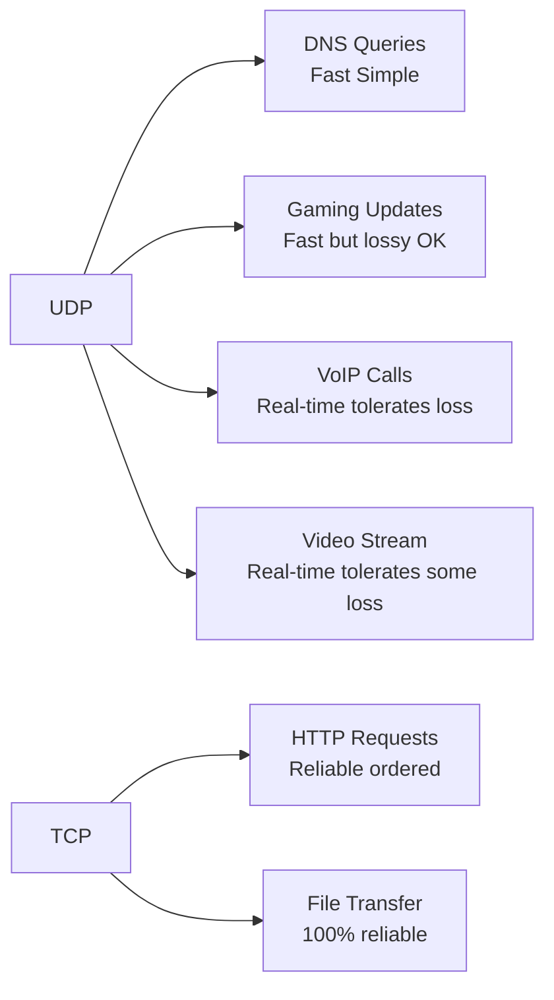
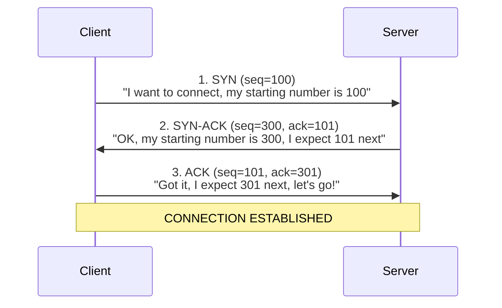
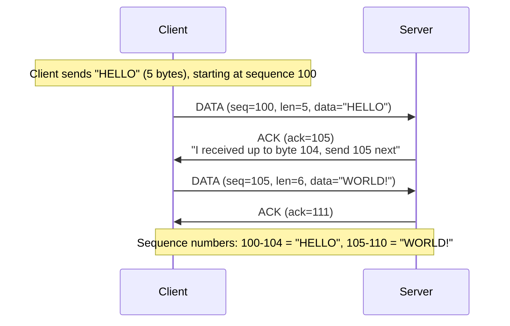
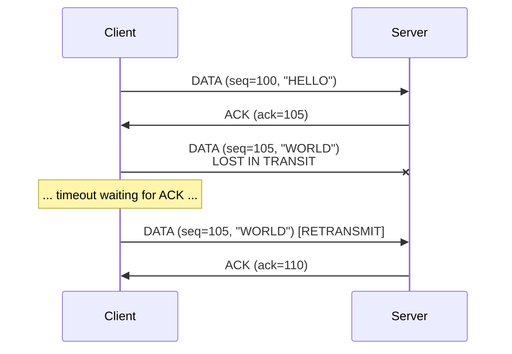
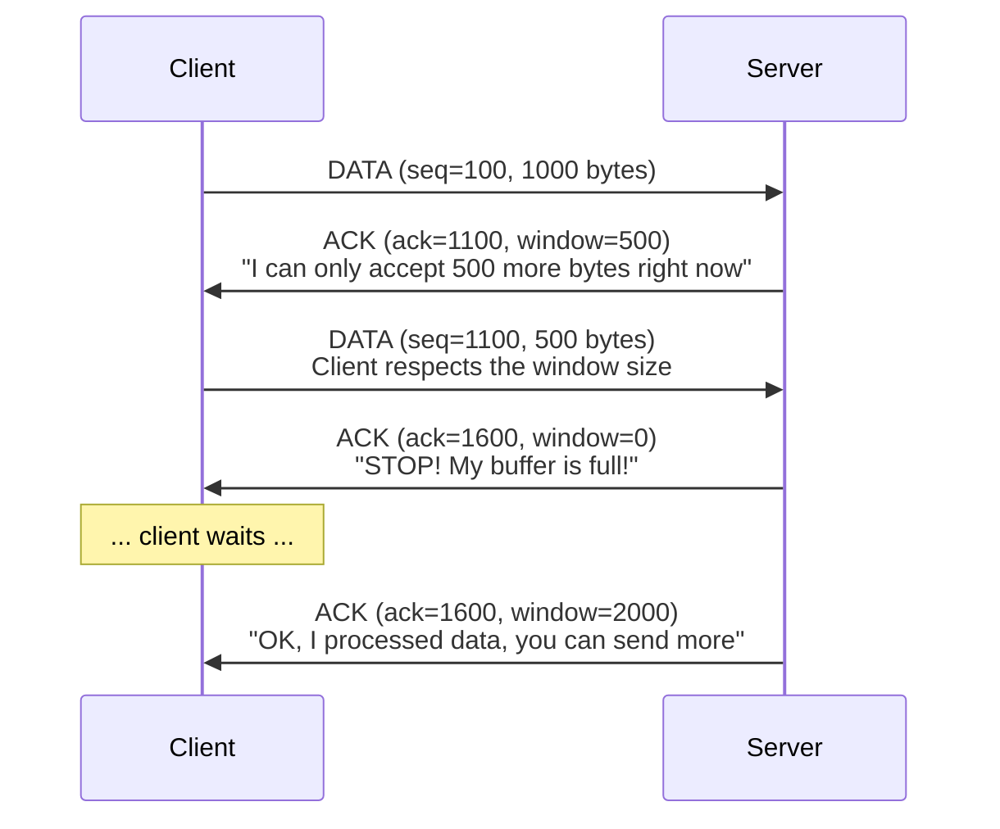
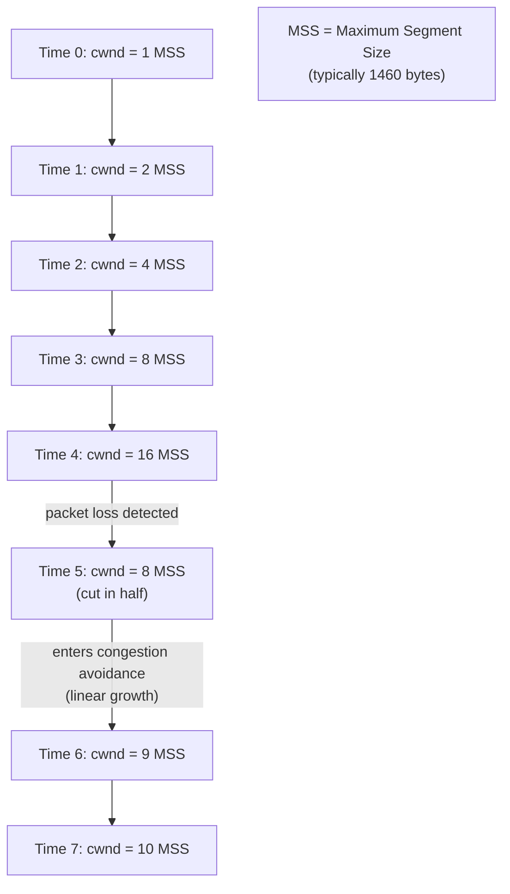
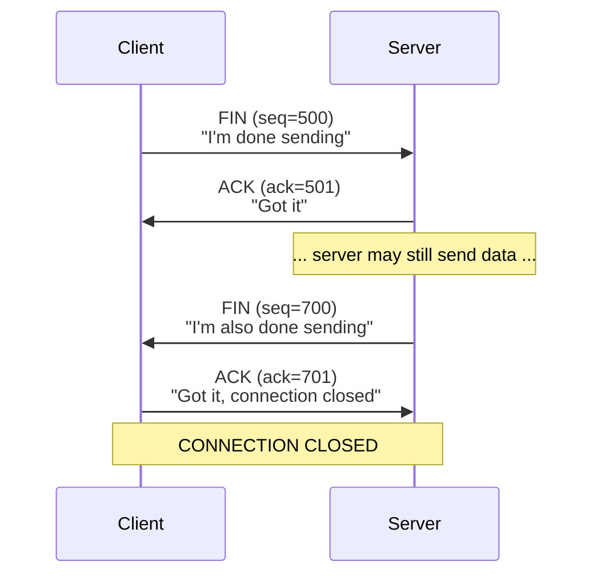

# 🔌 TCP vs UDP: Transport Layer Protocols

## 0️⃣ Prerequisites

Before diving into TCP and UDP, you should understand:

- **IP Address**: A numerical label assigned to every device on a network. IPv4 looks like `192.168.1.1`, IPv6 looks like `2001:0db8::1`. This is the "address" where packets are sent.

- **Port**: A 16-bit number (0-65535) that identifies a specific application or service on a machine. Think of IP as the building address and port as the apartment number. HTTP uses port 80, HTTPS uses port 443.

- **Network Packet**: Data sent over the internet is broken into small chunks called packets. Each packet travels independently and may take different routes to reach the destination.

- **OSI Model Basics**: The internet is organized in layers. From bottom to top: Physical → Data Link → Network (IP) → Transport (TCP/UDP) → Application (HTTP). Each layer has a specific job.

---

## 1️⃣ What Problem Do TCP and UDP Exist to Solve?

### The Specific Pain Point

IP (Internet Protocol) can deliver packets from one computer to another, but it makes no guarantees:
- Packets might arrive out of order
- Packets might be duplicated
- Packets might be lost entirely
- Packets might be corrupted
- There's no concept of a "connection" or "conversation"

**The Problem**: Applications need reliable communication, but IP only provides best-effort delivery.

### What Systems Looked Like Before TCP/UDP

In the earliest days of networking, applications had to handle all reliability concerns themselves:
- Detect lost packets and request retransmission
- Reorder packets that arrived out of sequence
- Detect and discard duplicates
- Verify data integrity

Every application reimplemented the same logic, poorly and inconsistently.

### What Breaks Without Transport Protocols

**Without TCP**:
- Web pages would load with missing images or corrupted text
- File downloads would be corrupted
- Database queries would return partial or wrong results
- Banking transactions could lose money

**Without UDP**:
- Video calls would have unacceptable latency (waiting for retransmissions)
- Online games would be unplayable (old position data is useless)
- DNS would be slower (TCP overhead for simple queries)
- Live streaming would buffer constantly

### Real Examples of the Problem

**Example 1: Downloading a 1GB file**
Without TCP, if packet #50,000 out of 700,000 is lost, you'd get a corrupted file. TCP automatically detects this and requests retransmission.

**Example 2: Video conference**
With TCP, if a video frame packet is lost, the system waits for retransmission. By the time it arrives, you're 500ms behind. With UDP, you skip the lost frame and stay in sync.

---

## 2️⃣ Intuition and Mental Model

### The Phone Call vs Postcard Analogy

**TCP is like a phone call**:
1. You dial and wait for the other person to answer (connection establishment)
2. You confirm they can hear you: "Hello? Can you hear me?" "Yes, I can hear you" (handshake)
3. You have a conversation where you take turns (ordered, reliable)
4. If they didn't hear something, they say "What? Can you repeat that?" (retransmission)
5. You say goodbye and hang up (connection termination)

**UDP is like sending postcards**:
1. You write a message and drop it in the mailbox (no connection)
2. You don't know if it arrived (no acknowledgment)
3. You might send 5 postcards, and they might arrive as 3, 1, 5, 2 (out of order)
4. Some might get lost (no retransmission)
5. But it's fast and simple (low overhead)

### The Key Insight

TCP and UDP represent a fundamental trade-off:
- **TCP**: Reliability over speed
- **UDP**: Speed over reliability

Neither is "better." The right choice depends on what your application needs.



<details>
<summary>ASCII diagram (reference)</summary>

```text
┌─────────────────────────────────────────────────────────────────────────────┐
│                     THE RELIABILITY vs SPEED SPECTRUM                        │
└─────────────────────────────────────────────────────────────────────────────┘

    UDP                                                                TCP
     │                                                                  │
     ▼                                                                  ▼
┌─────────┐  ┌─────────┐  ┌─────────┐  ┌─────────┐  ┌─────────┐  ┌─────────┐
│  DNS    │  │ Gaming  │  │  VoIP   │  │ Video   │  │  HTTP   │  │  File   │
│ Queries │  │ Updates │  │  Calls  │  │  Stream │  │ Requests│  │ Transfer│
└─────────┘  └─────────┘  └─────────┘  └─────────┘  └─────────┘  └─────────┘
     │            │            │            │            │            │
   Fast       Fast but      Real-time    Real-time   Reliable    100%
   Simple     lossy OK      tolerates    tolerates   ordered     reliable
                            loss         some loss
```
</details>

---

## 3️⃣ How TCP Works Internally

### TCP Header Structure

Every TCP segment (the name for a TCP packet) has a header with control information:

```
┌─────────────────────────────────────────────────────────────────────────────┐
│                           TCP HEADER (20-60 bytes)                           │
├─────────────────────────────────────────────────────────────────────────────┤
│  0                   1                   2                   3              │
│  0 1 2 3 4 5 6 7 8 9 0 1 2 3 4 5 6 7 8 9 0 1 2 3 4 5 6 7 8 9 0 1           │
│ +-+-+-+-+-+-+-+-+-+-+-+-+-+-+-+-+-+-+-+-+-+-+-+-+-+-+-+-+-+-+-+-+           │
│ |          Source Port          |       Destination Port        |           │
│ +-+-+-+-+-+-+-+-+-+-+-+-+-+-+-+-+-+-+-+-+-+-+-+-+-+-+-+-+-+-+-+-+           │
│ |                        Sequence Number                        |           │
│ +-+-+-+-+-+-+-+-+-+-+-+-+-+-+-+-+-+-+-+-+-+-+-+-+-+-+-+-+-+-+-+-+           │
│ |                    Acknowledgment Number                      |           │
│ +-+-+-+-+-+-+-+-+-+-+-+-+-+-+-+-+-+-+-+-+-+-+-+-+-+-+-+-+-+-+-+-+           │
│ | Offset|  Res  |C|E|U|A|P|R|S|F|           Window              |           │
│ +-+-+-+-+-+-+-+-+-+-+-+-+-+-+-+-+-+-+-+-+-+-+-+-+-+-+-+-+-+-+-+-+           │
│ |           Checksum            |         Urgent Pointer        |           │
│ +-+-+-+-+-+-+-+-+-+-+-+-+-+-+-+-+-+-+-+-+-+-+-+-+-+-+-+-+-+-+-+-+           │
│ |                    Options (if any)                           |           │
│ +-+-+-+-+-+-+-+-+-+-+-+-+-+-+-+-+-+-+-+-+-+-+-+-+-+-+-+-+-+-+-+-+           │
└─────────────────────────────────────────────────────────────────────────────┘

Key Fields:
- Source/Dest Port: Which application is sending/receiving
- Sequence Number: Position of this data in the stream
- Acknowledgment Number: What byte we expect to receive next
- Flags: SYN, ACK, FIN, RST, PSH, URG (control the connection)
- Window: How much data the receiver can accept (flow control)
- Checksum: Detects corruption
```

### The 3-Way Handshake

Before any data is sent, TCP establishes a connection:



<details>
<summary>ASCII diagram (reference)</summary>

```text
┌─────────────────────────────────────────────────────────────────────────────┐
│                         TCP 3-WAY HANDSHAKE                                  │
└─────────────────────────────────────────────────────────────────────────────┘

    Client                                                Server
       │                                                     │
       │  1. SYN (seq=100)                                   │
       │  "I want to connect, my starting number is 100"     │
       │ ─────────────────────────────────────────────────>  │
       │                                                     │
       │  2. SYN-ACK (seq=300, ack=101)                      │
       │  "OK, my starting number is 300, I expect 101 next" │
       │ <─────────────────────────────────────────────────  │
       │                                                     │
       │  3. ACK (seq=101, ack=301)                          │
       │  "Got it, I expect 301 next, let's go!"             │
       │ ─────────────────────────────────────────────────>  │
       │                                                     │
       │           CONNECTION ESTABLISHED                    │
       │                                                     │
```
</details>

**Why 3 steps?**
1. **SYN**: Client proves it can send
2. **SYN-ACK**: Server proves it can receive AND send
3. **ACK**: Client proves it can receive

This ensures both sides can send and receive before wasting resources on data transfer.

### Sequence Numbers and Acknowledgments

TCP tracks every byte sent using sequence numbers:



<details>
<summary>ASCII diagram (reference)</summary>

```text
┌─────────────────────────────────────────────────────────────────────────────┐
│                    SEQUENCE NUMBER TRACKING                                  │
└─────────────────────────────────────────────────────────────────────────────┘

Client sends "HELLO" (5 bytes), starting at sequence 100:

    Client                                                Server
       │                                                     │
       │  DATA (seq=100, len=5, data="HELLO")                │
       │ ─────────────────────────────────────────────────>  │
       │                                                     │
       │  ACK (ack=105)                                      │
       │  "I received up to byte 104, send 105 next"         │
       │ <─────────────────────────────────────────────────  │
       │                                                     │
       │  DATA (seq=105, len=6, data="WORLD!")               │
       │ ─────────────────────────────────────────────────>  │
       │                                                     │
       │  ACK (ack=111)                                      │
       │ <─────────────────────────────────────────────────  │
       │                                                     │

Sequence numbers: 100, 101, 102, 103, 104 = "HELLO"
                  105, 106, 107, 108, 109, 110 = "WORLD!"
```
</details>

### Retransmission: Handling Lost Packets

When a packet is lost, TCP detects and retransmits:



<details>
<summary>ASCII diagram (reference)</summary>

```text
┌─────────────────────────────────────────────────────────────────────────────┐
│                      TCP RETRANSMISSION                                      │
└─────────────────────────────────────────────────────────────────────────────┘

    Client                                                Server
       │                                                     │
       │  DATA (seq=100, "HELLO")                            │
       │ ─────────────────────────────────────────────────>  │
       │                                                     │
       │  ACK (ack=105)                                      │
       │ <─────────────────────────────────────────────────  │
       │                                                     │
       │  DATA (seq=105, "WORLD")                            │
       │ ──────────────X  LOST IN TRANSIT                    │
       │                                                     │
       │     ... timeout waiting for ACK ...                 │
       │                                                     │
       │  DATA (seq=105, "WORLD")  [RETRANSMIT]              │
       │ ─────────────────────────────────────────────────>  │
       │                                                     │
       │  ACK (ack=110)                                      │
       │ <─────────────────────────────────────────────────  │
       │                                                     │
```
</details>

**How TCP knows to retransmit**:
1. **Timeout**: No ACK received within RTO (Retransmission Timeout)
2. **Duplicate ACKs**: Receiving 3 identical ACKs indicates a gap (Fast Retransmit)

### Flow Control: Window Size

The receiver tells the sender how much data it can handle:



<details>
<summary>ASCII diagram (reference)</summary>

```text
┌─────────────────────────────────────────────────────────────────────────────┐
│                         FLOW CONTROL                                         │
└─────────────────────────────────────────────────────────────────────────────┘

    Client                                                Server
       │                                                     │
       │  DATA (seq=100, 1000 bytes)                         │
       │ ─────────────────────────────────────────────────>  │
       │                                                     │
       │  ACK (ack=1100, window=500)                         │
       │  "I can only accept 500 more bytes right now"       │
       │ <─────────────────────────────────────────────────  │
       │                                                     │
       │  DATA (seq=1100, 500 bytes)                         │
       │  Client respects the window size                    │
       │ ─────────────────────────────────────────────────>  │
       │                                                     │
       │  ACK (ack=1600, window=0)                           │
       │  "STOP! My buffer is full!"                         │
       │ <─────────────────────────────────────────────────  │
       │                                                     │
       │     ... client waits ...                            │
       │                                                     │
       │  ACK (ack=1600, window=2000)                        │
       │  "OK, I processed data, you can send more"          │
       │ <─────────────────────────────────────────────────  │
       │                                                     │
```
</details>

### Congestion Control: TCP Slow Start

TCP doesn't blast data immediately. It probes the network capacity:



<details>
<summary>ASCII diagram (reference)</summary>

```text
┌─────────────────────────────────────────────────────────────────────────────┐
│                      TCP SLOW START                                          │
└─────────────────────────────────────────────────────────────────────────────┘

Congestion Window (cwnd) grows exponentially until congestion detected:

Time 0:  cwnd = 1 MSS     │█
Time 1:  cwnd = 2 MSS     │██
Time 2:  cwnd = 4 MSS     │████
Time 3:  cwnd = 8 MSS     │████████
Time 4:  cwnd = 16 MSS    │████████████████
         ... packet loss detected ...
Time 5:  cwnd = 8 MSS     │████████  (cut in half)
         ... enters congestion avoidance (linear growth) ...
Time 6:  cwnd = 9 MSS     │█████████
Time 7:  cwnd = 10 MSS    │██████████

MSS = Maximum Segment Size (typically 1460 bytes)
```
</details>

**Why this matters**: On a new connection, TCP starts slow. This is why the first page load feels slower than subsequent ones, the connection is still "warming up."

### Connection Termination: 4-Way Handshake

Closing a TCP connection gracefully:



<details>
<summary>ASCII diagram (reference)</summary>

```text
┌─────────────────────────────────────────────────────────────────────────────┐
│                    TCP 4-WAY TERMINATION                                     │
└─────────────────────────────────────────────────────────────────────────────┘

    Client                                                Server
       │                                                     │
       │  FIN (seq=500)                                      │
       │  "I'm done sending"                                 │
       │ ─────────────────────────────────────────────────>  │
       │                                                     │
       │  ACK (ack=501)                                      │
       │  "Got it"                                           │
       │ <─────────────────────────────────────────────────  │
       │                                                     │
       │     ... server may still send data ...              │
       │                                                     │
       │  FIN (seq=700)                                      │
       │  "I'm also done sending"                            │
       │ <─────────────────────────────────────────────────  │
       │                                                     │
       │  ACK (ack=701)                                      │
       │  "Got it, connection closed"                        │
       │ ─────────────────────────────────────────────────>  │
       │                                                     │
       │           CONNECTION CLOSED                         │
       │                                                     │
```
</details>

---

## 4️⃣ How UDP Works Internally

### UDP Header Structure

UDP is dramatically simpler than TCP:

```
┌─────────────────────────────────────────────────────────────────────────────┐
│                         UDP HEADER (8 bytes only!)                           │
├─────────────────────────────────────────────────────────────────────────────┤
│  0                   1                   2                   3              │
│  0 1 2 3 4 5 6 7 8 9 0 1 2 3 4 5 6 7 8 9 0 1 2 3 4 5 6 7 8 9 0 1           │
│ +-+-+-+-+-+-+-+-+-+-+-+-+-+-+-+-+-+-+-+-+-+-+-+-+-+-+-+-+-+-+-+-+           │
│ |          Source Port          |       Destination Port        |           │
│ +-+-+-+-+-+-+-+-+-+-+-+-+-+-+-+-+-+-+-+-+-+-+-+-+-+-+-+-+-+-+-+-+           │
│ |            Length             |           Checksum            |           │
│ +-+-+-+-+-+-+-+-+-+-+-+-+-+-+-+-+-+-+-+-+-+-+-+-+-+-+-+-+-+-+-+-+           │
└─────────────────────────────────────────────────────────────────────────────┘

That's it! Just 8 bytes of header vs TCP's 20-60 bytes.
No sequence numbers, no acknowledgments, no window, no connection state.
```

### UDP Communication Flow

```
┌─────────────────────────────────────────────────────────────────────────────┐
│                         UDP COMMUNICATION                                    │
└─────────────────────────────────────────────────────────────────────────────┘

    Client                                                Server
       │                                                     │
       │  UDP Datagram (data="Query")                        │
       │ ─────────────────────────────────────────────────>  │
       │                                                     │
       │  UDP Datagram (data="Response")                     │
       │ <─────────────────────────────────────────────────  │
       │                                                     │

No handshake. No acknowledgment. No connection state.
Fire and forget!
```

### What UDP Does NOT Provide

| Feature | TCP | UDP |
|---------|-----|-----|
| Connection establishment | ✓ 3-way handshake | ✗ None |
| Ordered delivery | ✓ Sequence numbers | ✗ May arrive out of order |
| Reliable delivery | ✓ ACKs + retransmission | ✗ May be lost |
| Flow control | ✓ Window size | ✗ None |
| Congestion control | ✓ Slow start, AIMD | ✗ None |
| Duplicate detection | ✓ Sequence numbers | ✗ May receive duplicates |

---

## 5️⃣ Simulation: TCP vs UDP in Action

### Scenario 1: Loading a Web Page (TCP)

```
┌─────────────────────────────────────────────────────────────────────────────┐
│              LOADING https://example.com (TCP + TLS)                         │
└─────────────────────────────────────────────────────────────────────────────┘

Time    Client                              Server
─────────────────────────────────────────────────────────────────
0ms     SYN ─────────────────────────────>
50ms    <───────────────────────────────── SYN-ACK
100ms   ACK ─────────────────────────────>
        [TCP Connection Established]
        
100ms   TLS ClientHello ─────────────────>
150ms   <───────────────────────────────── TLS ServerHello
200ms   <───────────────────────────────── Certificate
250ms   TLS Finished ────────────────────>
300ms   <───────────────────────────────── TLS Finished
        [TLS Handshake Complete]
        
300ms   GET / HTTP/1.1 ──────────────────>
350ms   <───────────────────────────────── HTTP/1.1 200 OK
        <───────────────────────────────── [HTML content]
400ms   ACK ─────────────────────────────>

Total: ~400ms before first byte of content
       (RTT for TCP + RTT for TLS + RTT for HTTP)
```

### Scenario 2: DNS Query (UDP)

```
┌─────────────────────────────────────────────────────────────────────────────┐
│                    DNS QUERY FOR example.com (UDP)                           │
└─────────────────────────────────────────────────────────────────────────────┘

Time    Client                              DNS Server
─────────────────────────────────────────────────────────────────
0ms     Query: "A record for example.com" ─>
50ms    <─────────────────────────────────── Response: 93.184.216.34

Total: ~50ms (single round trip, no handshake!)
```

### Scenario 3: Video Call (UDP with Application-Level Reliability)

```
┌─────────────────────────────────────────────────────────────────────────────┐
│                    VIDEO CALL PACKET FLOW (UDP)                              │
└─────────────────────────────────────────────────────────────────────────────┘

Time    Sender                              Receiver
─────────────────────────────────────────────────────────────────
0ms     Frame 1 ────────────────────────>   Received, display
33ms    Frame 2 ────────────────────────>   Received, display
66ms    Frame 3 ────────────X (LOST)        
99ms    Frame 4 ────────────────────────>   Received, display
132ms   Frame 5 ────────────────────────>   Received, display

What happens to Frame 3?
- TCP: Wait for retransmission, delay everything by ~100ms
- UDP: Skip it, show Frame 4 (user sees tiny glitch, stays in sync)

For real-time video, losing a frame is better than delaying all future frames!
```

### Scenario 4: Online Game (UDP)

```
┌─────────────────────────────────────────────────────────────────────────────┐
│                    GAME POSITION UPDATES (UDP)                               │
└─────────────────────────────────────────────────────────────────────────────┘

Time    Client                              Server
─────────────────────────────────────────────────────────────────
0ms     Position: (100, 200) ────────────>  Update game state
16ms    Position: (102, 202) ────────────>  Update game state
32ms    Position: (104, 204) ────X (LOST)   
48ms    Position: (106, 206) ────────────>  Update game state

If packet at 32ms was lost:
- TCP: Server waits, game freezes, then jumps from (102,202) to (106,206)
- UDP: Server uses (106,206) directly, smooth movement continues

Old position data is USELESS in games. The latest state is all that matters!
```

---

## 6️⃣ How Engineers Use TCP and UDP in Production

### TCP Use Cases at Scale

**Netflix (Video Streaming over TCP)**
- Uses TCP for video delivery (contrary to intuition!)
- Reason: Adaptive bitrate streaming handles congestion
- TCP's reliability ensures no corrupted frames
- Buffer absorbs retransmission delays
- Reference: [Netflix Tech Blog](https://netflixtechblog.com/)

**Amazon (E-commerce over TCP)**
- All HTTP/HTTPS traffic uses TCP
- Database connections use TCP
- Message queues (SQS) use TCP
- Reliability is non-negotiable for transactions

### UDP Use Cases at Scale

**Discord (Voice Chat over UDP)**
- Voice uses UDP with Opus codec
- Can tolerate 5-10% packet loss
- Implements own reliability for critical messages
- Reference: [Discord Engineering Blog](https://discord.com/blog)

**Cloudflare (DNS over UDP)**
- Handles trillions of DNS queries
- UDP's low overhead is essential
- Falls back to TCP for large responses (>512 bytes)

**Riot Games (League of Legends)**
- Game state updates use UDP
- Critical events (kills, objectives) use reliable UDP
- Custom protocol on top of UDP for game-specific needs

### Connection Pooling (TCP)

Creating TCP connections is expensive (3-way handshake). Production systems reuse connections:

```java
// HikariCP connection pool for database
@Configuration
public class DatabaseConfig {
    
    @Bean
    public HikariDataSource dataSource() {
        HikariConfig config = new HikariConfig();
        config.setJdbcUrl("jdbc:postgresql://localhost:5432/mydb");
        config.setUsername("user");
        config.setPassword("password");
        
        // Connection pool settings
        config.setMinimumIdle(10);           // Keep 10 connections warm
        config.setMaximumPoolSize(50);       // Max 50 connections
        config.setConnectionTimeout(30000);  // 30 sec timeout
        config.setIdleTimeout(600000);       // Close idle after 10 min
        config.setMaxLifetime(1800000);      // Recycle after 30 min
        
        return new HikariDataSource(config);
    }
}
```

```java
// HTTP connection pooling with Apache HttpClient
@Configuration
public class HttpClientConfig {
    
    @Bean
    public CloseableHttpClient httpClient() {
        PoolingHttpClientConnectionManager connectionManager = 
            new PoolingHttpClientConnectionManager();
        
        // Pool settings
        connectionManager.setMaxTotal(200);           // Max total connections
        connectionManager.setDefaultMaxPerRoute(20);  // Max per host
        
        return HttpClients.custom()
            .setConnectionManager(connectionManager)
            .setKeepAliveStrategy((response, context) -> 30000) // 30 sec keep-alive
            .build();
    }
}
```

---

## 7️⃣ How to Implement TCP and UDP in Java

### Basic TCP Server and Client

```java
import java.io.*;
import java.net.*;

/**
 * Simple TCP Server that echoes messages back to clients.
 */
public class TCPServer {
    
    private final int port;
    private volatile boolean running = true;
    
    public TCPServer(int port) {
        this.port = port;
    }
    
    public void start() throws IOException {
        // ServerSocket listens for incoming connections
        try (ServerSocket serverSocket = new ServerSocket(port)) {
            System.out.println("TCP Server listening on port " + port);
            
            while (running) {
                // accept() blocks until a client connects
                // Returns a new Socket for this specific client
                Socket clientSocket = serverSocket.accept();
                
                // Handle each client in a separate thread
                new Thread(() -> handleClient(clientSocket)).start();
            }
        }
    }
    
    private void handleClient(Socket clientSocket) {
        String clientAddress = clientSocket.getInetAddress().getHostAddress();
        System.out.println("Client connected: " + clientAddress);
        
        try (
            // Get input stream to read from client
            BufferedReader in = new BufferedReader(
                new InputStreamReader(clientSocket.getInputStream())
            );
            // Get output stream to write to client
            PrintWriter out = new PrintWriter(
                clientSocket.getOutputStream(), true
            )
        ) {
            String inputLine;
            while ((inputLine = in.readLine()) != null) {
                System.out.println("Received from " + clientAddress + ": " + inputLine);
                
                // Echo back with prefix
                out.println("Echo: " + inputLine);
                
                if ("quit".equalsIgnoreCase(inputLine)) {
                    break;
                }
            }
        } catch (IOException e) {
            System.err.println("Error handling client: " + e.getMessage());
        } finally {
            try {
                clientSocket.close();
            } catch (IOException e) {
                // Ignore close errors
            }
            System.out.println("Client disconnected: " + clientAddress);
        }
    }
    
    public void stop() {
        running = false;
    }
    
    public static void main(String[] args) throws IOException {
        new TCPServer(8080).start();
    }
}
```

```java
import java.io.*;
import java.net.*;

/**
 * Simple TCP Client that sends messages and receives responses.
 */
public class TCPClient {
    
    private final String host;
    private final int port;
    
    public TCPClient(String host, int port) {
        this.host = host;
        this.port = port;
    }
    
    public void connect() throws IOException {
        // Socket constructor initiates 3-way handshake
        try (
            Socket socket = new Socket(host, port);
            PrintWriter out = new PrintWriter(socket.getOutputStream(), true);
            BufferedReader in = new BufferedReader(
                new InputStreamReader(socket.getInputStream())
            );
            BufferedReader console = new BufferedReader(
                new InputStreamReader(System.in)
            )
        ) {
            System.out.println("Connected to " + host + ":" + port);
            System.out.println("Type messages (or 'quit' to exit):");
            
            String userInput;
            while ((userInput = console.readLine()) != null) {
                // Send to server
                out.println(userInput);
                
                // Receive response
                String response = in.readLine();
                System.out.println("Server: " + response);
                
                if ("quit".equalsIgnoreCase(userInput)) {
                    break;
                }
            }
        }
    }
    
    public static void main(String[] args) throws IOException {
        new TCPClient("localhost", 8080).connect();
    }
}
```

### Basic UDP Server and Client

```java
import java.net.*;
import java.io.*;

/**
 * Simple UDP Server that echoes datagrams back to sender.
 */
public class UDPServer {
    
    private final int port;
    private final int bufferSize;
    private volatile boolean running = true;
    
    public UDPServer(int port, int bufferSize) {
        this.port = port;
        this.bufferSize = bufferSize;
    }
    
    public void start() throws IOException {
        // DatagramSocket for UDP (no connection concept)
        try (DatagramSocket socket = new DatagramSocket(port)) {
            System.out.println("UDP Server listening on port " + port);
            
            byte[] receiveBuffer = new byte[bufferSize];
            
            while (running) {
                // Prepare packet to receive data
                DatagramPacket receivePacket = new DatagramPacket(
                    receiveBuffer, receiveBuffer.length
                );
                
                // receive() blocks until a datagram arrives
                socket.receive(receivePacket);
                
                // Extract data and sender info
                String message = new String(
                    receivePacket.getData(), 0, receivePacket.getLength()
                );
                InetAddress clientAddress = receivePacket.getAddress();
                int clientPort = receivePacket.getPort();
                
                System.out.println("Received from " + clientAddress + ":" + 
                    clientPort + " - " + message);
                
                // Prepare response
                String response = "Echo: " + message;
                byte[] sendBuffer = response.getBytes();
                
                // Send response back to sender
                DatagramPacket sendPacket = new DatagramPacket(
                    sendBuffer, sendBuffer.length, clientAddress, clientPort
                );
                socket.send(sendPacket);
            }
        }
    }
    
    public void stop() {
        running = false;
    }
    
    public static void main(String[] args) throws IOException {
        new UDPServer(8081, 1024).start();
    }
}
```

```java
import java.net.*;
import java.io.*;

/**
 * Simple UDP Client that sends datagrams and receives responses.
 */
public class UDPClient {
    
    private final String host;
    private final int port;
    private final int bufferSize;
    private final int timeoutMs;
    
    public UDPClient(String host, int port, int bufferSize, int timeoutMs) {
        this.host = host;
        this.port = port;
        this.bufferSize = bufferSize;
        this.timeoutMs = timeoutMs;
    }
    
    public void run() throws IOException {
        try (DatagramSocket socket = new DatagramSocket()) {
            // Set timeout for receive (UDP has no guarantee of response)
            socket.setSoTimeout(timeoutMs);
            
            InetAddress serverAddress = InetAddress.getByName(host);
            BufferedReader console = new BufferedReader(
                new InputStreamReader(System.in)
            );
            
            System.out.println("UDP Client ready. Type messages:");
            
            String userInput;
            while ((userInput = console.readLine()) != null) {
                // Prepare and send datagram
                byte[] sendBuffer = userInput.getBytes();
                DatagramPacket sendPacket = new DatagramPacket(
                    sendBuffer, sendBuffer.length, serverAddress, port
                );
                socket.send(sendPacket);
                
                // Try to receive response
                try {
                    byte[] receiveBuffer = new byte[bufferSize];
                    DatagramPacket receivePacket = new DatagramPacket(
                        receiveBuffer, receiveBuffer.length
                    );
                    socket.receive(receivePacket);
                    
                    String response = new String(
                        receivePacket.getData(), 0, receivePacket.getLength()
                    );
                    System.out.println("Server: " + response);
                    
                } catch (SocketTimeoutException e) {
                    System.out.println("No response (timeout)");
                }
                
                if ("quit".equalsIgnoreCase(userInput)) {
                    break;
                }
            }
        }
    }
    
    public static void main(String[] args) throws IOException {
        new UDPClient("localhost", 8081, 1024, 5000).run();
    }
}
```

### Production-Grade TCP Server with NIO

```java
import java.io.IOException;
import java.net.InetSocketAddress;
import java.nio.ByteBuffer;
import java.nio.channels.*;
import java.util.Iterator;
import java.util.Set;

/**
 * Non-blocking TCP server using Java NIO.
 * Handles thousands of connections with a single thread.
 */
public class NIOTCPServer {
    
    private final int port;
    private Selector selector;
    private volatile boolean running = true;
    
    public NIOTCPServer(int port) {
        this.port = port;
    }
    
    public void start() throws IOException {
        // Selector allows monitoring multiple channels
        selector = Selector.open();
        
        // ServerSocketChannel for accepting connections
        ServerSocketChannel serverChannel = ServerSocketChannel.open();
        serverChannel.bind(new InetSocketAddress(port));
        serverChannel.configureBlocking(false);  // Non-blocking mode
        
        // Register for ACCEPT events
        serverChannel.register(selector, SelectionKey.OP_ACCEPT);
        
        System.out.println("NIO TCP Server listening on port " + port);
        
        while (running) {
            // Block until at least one channel is ready
            selector.select();
            
            Set<SelectionKey> selectedKeys = selector.selectedKeys();
            Iterator<SelectionKey> iterator = selectedKeys.iterator();
            
            while (iterator.hasNext()) {
                SelectionKey key = iterator.next();
                iterator.remove();  // Must remove to avoid reprocessing
                
                if (!key.isValid()) {
                    continue;
                }
                
                if (key.isAcceptable()) {
                    handleAccept(key);
                } else if (key.isReadable()) {
                    handleRead(key);
                }
            }
        }
    }
    
    private void handleAccept(SelectionKey key) throws IOException {
        ServerSocketChannel serverChannel = (ServerSocketChannel) key.channel();
        SocketChannel clientChannel = serverChannel.accept();
        
        if (clientChannel != null) {
            clientChannel.configureBlocking(false);
            // Register for READ events
            clientChannel.register(selector, SelectionKey.OP_READ);
            System.out.println("Accepted connection from " + 
                clientChannel.getRemoteAddress());
        }
    }
    
    private void handleRead(SelectionKey key) throws IOException {
        SocketChannel clientChannel = (SocketChannel) key.channel();
        ByteBuffer buffer = ByteBuffer.allocate(1024);
        
        int bytesRead = clientChannel.read(buffer);
        
        if (bytesRead == -1) {
            // Client closed connection
            System.out.println("Client disconnected: " + 
                clientChannel.getRemoteAddress());
            clientChannel.close();
            key.cancel();
            return;
        }
        
        if (bytesRead > 0) {
            buffer.flip();  // Prepare for reading
            byte[] data = new byte[buffer.remaining()];
            buffer.get(data);
            String message = new String(data).trim();
            
            System.out.println("Received: " + message);
            
            // Echo back
            String response = "Echo: " + message + "\n";
            ByteBuffer responseBuffer = ByteBuffer.wrap(response.getBytes());
            clientChannel.write(responseBuffer);
        }
    }
    
    public void stop() {
        running = false;
        if (selector != null) {
            selector.wakeup();
        }
    }
    
    public static void main(String[] args) throws IOException {
        new NIOTCPServer(8080).start();
    }
}
```

### Maven Dependencies for Advanced Networking

```xml
<!-- pom.xml -->
<dependencies>
    <!-- Netty for high-performance networking -->
    <dependency>
        <groupId>io.netty</groupId>
        <artifactId>netty-all</artifactId>
        <version>4.1.100.Final</version>
    </dependency>
    
    <!-- Apache HttpClient for HTTP over TCP -->
    <dependency>
        <groupId>org.apache.httpcomponents.client5</groupId>
        <artifactId>httpclient5</artifactId>
        <version>5.2.1</version>
    </dependency>
    
    <!-- HikariCP for database connection pooling -->
    <dependency>
        <groupId>com.zaxxer</groupId>
        <artifactId>HikariCP</artifactId>
        <version>5.0.1</version>
    </dependency>
</dependencies>
```

---

## 8️⃣ Tradeoffs, Pitfalls, and Common Mistakes

### Pitfall 1: Using TCP When UDP is Better

**Scenario**: Building a real-time multiplayer game.

**Mistake**: Using TCP for position updates because "reliability is important."

**Problem**: 
- Player at position (100, 100) sends update
- Packet lost, TCP waits for retransmission
- Meanwhile, player moved to (200, 200)
- Old update finally arrives, game state is wrong

**Solution**: Use UDP for ephemeral state, TCP (or reliable UDP) for critical events.

### Pitfall 2: Ignoring TCP Slow Start

**Scenario**: Microservice makes HTTP calls to another service.

**Mistake**: Creating a new TCP connection for each request.

**Problem**: 
- Each connection starts with slow start
- First few packets are throttled
- Latency is 2-3x higher than it needs to be

**Solution**: Use connection pooling. Keep connections warm.

```java
// BAD: New connection per request
HttpURLConnection conn = (HttpURLConnection) url.openConnection();

// GOOD: Pooled connections
private static final HttpClient client = HttpClient.newBuilder()
    .version(HttpClient.Version.HTTP_2)  // Multiplexed connections
    .connectTimeout(Duration.ofSeconds(10))
    .build();
```

### Pitfall 3: Not Handling Partial Reads (TCP)

**Scenario**: Sending JSON messages over TCP.

**Mistake**: Assuming one `read()` call returns one complete message.

**Problem**: TCP is a byte stream, not a message stream. One `read()` might return:
- Part of a message
- Multiple messages
- Part of one message and part of another

```java
// BAD: Assumes complete message
byte[] buffer = new byte[1024];
int bytesRead = socket.getInputStream().read(buffer);
String message = new String(buffer, 0, bytesRead);  // Might be incomplete!

// GOOD: Use length prefix or delimiter
// Option 1: Length-prefixed messages
DataInputStream in = new DataInputStream(socket.getInputStream());
int length = in.readInt();  // First 4 bytes = message length
byte[] messageBytes = new byte[length];
in.readFully(messageBytes);  // Read exactly 'length' bytes
String message = new String(messageBytes);

// Option 2: Newline-delimited (for text protocols)
BufferedReader reader = new BufferedReader(
    new InputStreamReader(socket.getInputStream())
);
String message = reader.readLine();  // Reads until \n
```

### Pitfall 4: UDP Message Size Limits

**Scenario**: Sending large data over UDP.

**Mistake**: Sending a 10KB UDP datagram.

**Problem**: 
- UDP datagrams over ~1400 bytes may be fragmented
- If any fragment is lost, the entire datagram is lost
- Fragmentation increases loss probability dramatically

**Solution**: Keep UDP datagrams under MTU (typically 1400-1500 bytes). For larger data, implement your own fragmentation and reassembly.

### Pitfall 5: Ignoring TIME_WAIT State

**Scenario**: Server handling many short-lived connections.

**Mistake**: Not understanding why ports are "stuck" after connections close.

**Problem**: After TCP connection closes, the port stays in TIME_WAIT for 2*MSL (typically 60 seconds). This prevents old packets from being misinterpreted. But it means ports aren't immediately reusable.

```bash
# Check TIME_WAIT connections
netstat -an | grep TIME_WAIT | wc -l
```

**Solutions**:
1. Enable `SO_REUSEADDR` socket option
2. Use connection pooling (fewer connections to close)
3. Tune kernel parameters (reduce TIME_WAIT duration)

```java
// Enable SO_REUSEADDR
ServerSocket serverSocket = new ServerSocket();
serverSocket.setReuseAddress(true);
serverSocket.bind(new InetSocketAddress(8080));
```

---

## 9️⃣ When NOT to Use Each Protocol

### When NOT to Use TCP

| Scenario | Why Not TCP | Better Alternative |
|----------|-------------|-------------------|
| Real-time gaming | Retransmissions cause lag | UDP with custom reliability |
| Live video streaming | Old frames useless | UDP with adaptive bitrate |
| VoIP / Voice calls | Latency > quality | UDP with Opus codec |
| DNS queries | Overhead for small queries | UDP (TCP for large responses) |
| IoT sensor data | Resource constrained | UDP or MQTT over UDP |

### When NOT to Use UDP

| Scenario | Why Not UDP | Better Alternative |
|----------|-------------|-------------------|
| File transfer | Must be complete and correct | TCP |
| Database queries | Partial results are useless | TCP |
| Financial transactions | Cannot lose or duplicate | TCP with application ACKs |
| Web browsing | Pages must load correctly | TCP (HTTP) |
| Email | Messages must be delivered | TCP (SMTP) |

### The Hybrid Approach

Many real-world systems use both:

```
┌─────────────────────────────────────────────────────────────────────────────┐
│                    GAME SERVER ARCHITECTURE                                  │
└─────────────────────────────────────────────────────────────────────────────┘

                         ┌──────────────────┐
                         │   Game Client    │
                         └────────┬─────────┘
                                  │
                    ┌─────────────┴─────────────┐
                    │                           │
                    ▼                           ▼
           ┌───────────────┐          ┌───────────────┐
           │  TCP Channel  │          │  UDP Channel  │
           │               │          │               │
           │ - Login       │          │ - Position    │
           │ - Chat        │          │ - Animation   │
           │ - Inventory   │          │ - Projectiles │
           │ - Purchases   │          │ - Audio       │
           └───────────────┘          └───────────────┘
                    │                           │
                    └─────────────┬─────────────┘
                                  │
                         ┌────────▼─────────┐
                         │   Game Server    │
                         └──────────────────┘
```

---

## 🔟 Comparison Table: TCP vs UDP

| Feature | TCP | UDP |
|---------|-----|-----|
| **Connection** | Connection-oriented (3-way handshake) | Connectionless |
| **Reliability** | Guaranteed delivery | Best effort |
| **Ordering** | In-order delivery | No ordering guarantee |
| **Speed** | Slower (overhead) | Faster (minimal overhead) |
| **Header Size** | 20-60 bytes | 8 bytes |
| **Flow Control** | Yes (window-based) | No |
| **Congestion Control** | Yes (slow start, AIMD) | No |
| **Use Cases** | HTTP, HTTPS, FTP, SMTP, SSH | DNS, VoIP, Gaming, Streaming |
| **Error Detection** | Checksum + sequence numbers | Checksum only |
| **Broadcast/Multicast** | No | Yes |

---

## 1️⃣1️⃣ Interview Follow-Up Questions

### L4 (Junior/Mid) Level Questions

**Q1: What is the difference between TCP and UDP?**

**A**: TCP is connection-oriented, reliable, and ordered. It uses a 3-way handshake to establish connections, sequence numbers for ordering, acknowledgments for reliability, and flow/congestion control. UDP is connectionless, unreliable, and unordered. It just sends datagrams with minimal overhead (8-byte header vs TCP's 20-60 bytes). Use TCP when you need reliability (web, email, file transfer). Use UDP when you need speed and can tolerate loss (gaming, VoIP, DNS).

**Q2: Explain the TCP 3-way handshake.**

**A**: 
1. **SYN**: Client sends SYN packet with initial sequence number (ISN)
2. **SYN-ACK**: Server responds with SYN-ACK, its own ISN, and ACK of client's ISN+1
3. **ACK**: Client sends ACK of server's ISN+1

This ensures both sides can send and receive before transferring data. It also synchronizes sequence numbers for tracking data.

**Q3: Why does TCP use sequence numbers?**

**A**: Sequence numbers serve multiple purposes:
1. **Ordering**: Receiver can reorder out-of-sequence packets
2. **Duplicate detection**: Same sequence number = duplicate
3. **Acknowledgment**: ACK tells sender which bytes were received
4. **Loss detection**: Gap in sequence numbers = lost packet
5. **Flow control**: Window specifies how many bytes can be in-flight

### L5 (Senior) Level Questions

**Q4: How does TCP congestion control work?**

**A**: TCP uses several mechanisms:

1. **Slow Start**: Start with cwnd=1 MSS, double each RTT until threshold
2. **Congestion Avoidance**: After threshold, grow linearly (add 1 MSS per RTT)
3. **Fast Retransmit**: 3 duplicate ACKs trigger immediate retransmit
4. **Fast Recovery**: After fast retransmit, halve cwnd instead of resetting to 1

Modern TCP variants (CUBIC, BBR) improve on this:
- **CUBIC** (Linux default): Uses cubic function for window growth
- **BBR** (Google): Models bandwidth and RTT, doesn't rely on packet loss

**Q5: Design a reliable protocol on top of UDP.**

**A**: Key components needed:

1. **Sequence numbers**: Add to each packet for ordering
2. **Acknowledgments**: Receiver sends ACKs for received packets
3. **Retransmission**: Sender retransmits if no ACK within timeout
4. **Selective ACK (SACK)**: ACK specific packets, not just cumulative
5. **Congestion control**: Implement AIMD or similar

Example: QUIC (HTTP/3) is exactly this, reliable transport over UDP with:
- Connection IDs (survives IP changes)
- 0-RTT connection establishment
- Multiplexed streams without head-of-line blocking
- Built-in encryption

### L6 (Staff+) Level Questions

**Q6: How would you optimize TCP for a high-throughput data pipeline?**

**A**: Several kernel and application tunings:

**Kernel Parameters**:
```bash
# Increase buffer sizes
net.core.rmem_max = 16777216
net.core.wmem_max = 16777216
net.ipv4.tcp_rmem = 4096 87380 16777216
net.ipv4.tcp_wmem = 4096 65536 16777216

# Enable window scaling
net.ipv4.tcp_window_scaling = 1

# Use BBR congestion control
net.ipv4.tcp_congestion_control = bbr

# Increase backlog for high connection rates
net.core.somaxconn = 65535
net.ipv4.tcp_max_syn_backlog = 65535
```

**Application Level**:
- Use connection pooling
- Enable TCP_NODELAY for latency-sensitive (disable Nagle's algorithm)
- Use larger socket buffers
- Consider kernel bypass (DPDK) for extreme cases
- Use io_uring for async I/O on Linux

**Q7: A service is experiencing TCP connection timeouts during peak traffic. How do you diagnose and fix?**

**A**: Systematic debugging approach:

1. **Check SYN queue**: `netstat -s | grep -i syn`
   - SYN floods or legitimate overload?
   - Increase `tcp_max_syn_backlog`

2. **Check accept queue**: `ss -ltn` (Recv-Q column)
   - Application not accepting fast enough?
   - Increase `somaxconn`, optimize accept loop

3. **Check TIME_WAIT**: `netstat -an | grep TIME_WAIT | wc -l`
   - Too many short-lived connections?
   - Enable `tcp_tw_reuse`, use connection pooling

4. **Check file descriptors**: `ulimit -n`
   - Running out of FDs?
   - Increase limits

5. **Check network**: `tcpdump`, `wireshark`
   - Packet loss? Retransmissions?
   - Network congestion? MTU issues?

6. **Check application**: Thread dumps, profiling
   - Slow accept loop? Blocking operations?
   - Connection handling bottleneck?

---

## 1️⃣2️⃣ Mental Summary

**TCP and UDP are the two main transport protocols**, sitting between IP (network layer) and applications (HTTP, DNS, etc.).

**TCP** provides reliable, ordered, connection-oriented communication. It's like a phone call: you establish a connection, have a conversation with guaranteed delivery, and hang up. Use TCP when correctness matters more than speed (web, email, databases).

**UDP** provides fast, unreliable, connectionless communication. It's like sending postcards: you drop them in the mail and hope they arrive. Use UDP when speed matters more than reliability (gaming, VoIP, DNS).

**In practice**, many systems use both: TCP for critical operations (login, purchases) and UDP for ephemeral data (position updates, voice). Modern protocols like QUIC build reliability on top of UDP to get the best of both worlds.

**For interviews**, be able to explain the 3-way handshake, sequence numbers, congestion control, and when to choose each protocol. Know that the choice isn't just "reliable vs fast" but involves nuanced tradeoffs around latency, throughput, and application requirements.

---

## 📚 Further Reading

- [TCP/IP Illustrated, Volume 1](https://www.amazon.com/TCP-Illustrated-Vol-Addison-Wesley-Professional/dp/0201633469) - The definitive reference
- [High Performance Browser Networking](https://hpbn.co/) - Free online book by Ilya Grigorik
- [Beej's Guide to Network Programming](https://beej.us/guide/bgnet/) - Practical C networking
- [QUIC Protocol](https://www.chromium.org/quic/) - Google's UDP-based transport
- [BBR Congestion Control](https://cloud.google.com/blog/products/networking/tcp-bbr-congestion-control-comes-to-gcp-your-internet-just-got-faster) - Google's approach

