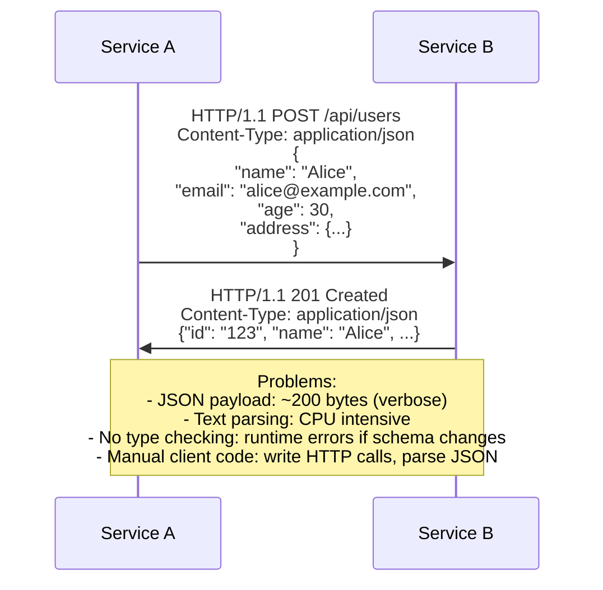
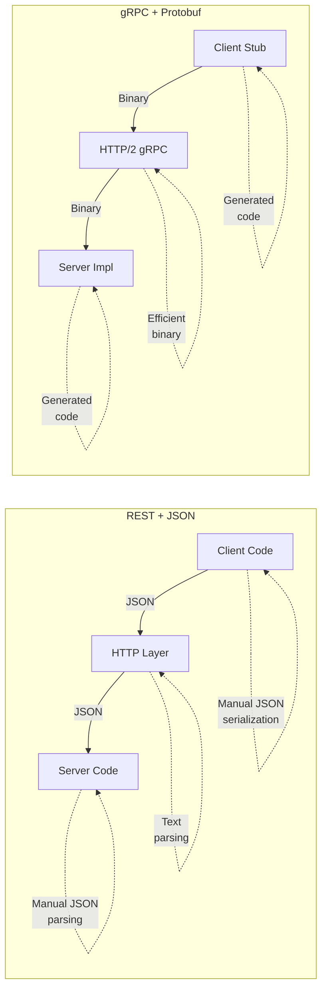
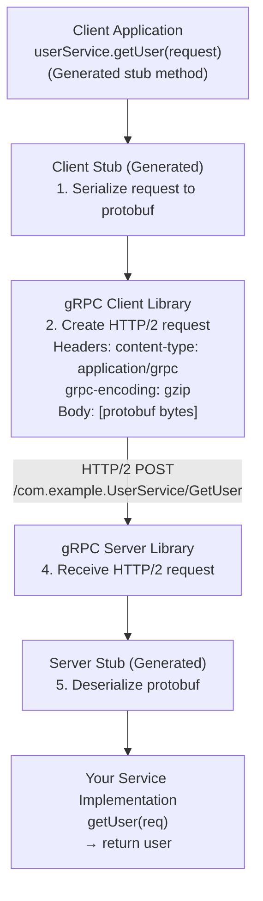
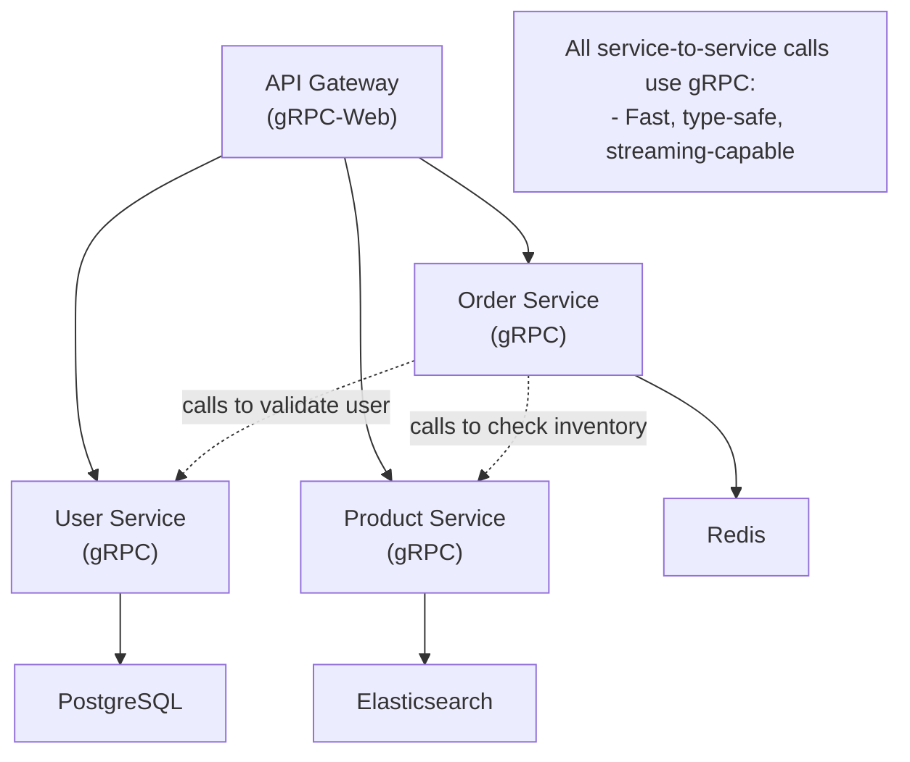
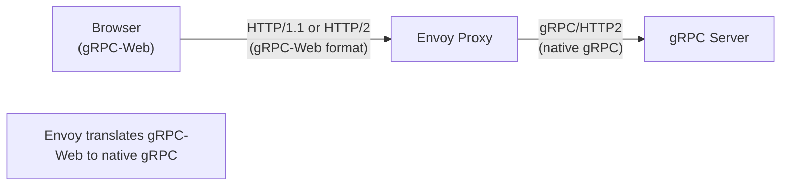

# ⚡ gRPC: High-Performance Remote Procedure Calls

## 0️⃣ Prerequisites

Before diving into gRPC, you should understand:

- **HTTP/2**: gRPC runs on HTTP/2, leveraging multiplexing, header compression, and bidirectional streaming. See `03-http-evolution.md` for details.

- **Serialization**: Converting objects to bytes for transmission. Common formats: JSON (text, human-readable), Protocol Buffers (binary, compact).

- **REST API**: The dominant API style using HTTP methods (GET, POST, PUT, DELETE) with JSON payloads. gRPC is an alternative to REST.

- **RPC (Remote Procedure Call)**: Calling a function on a remote server as if it were local. The network complexity is hidden from the developer.

- **Interface Definition**: A contract that defines what methods are available and what data they accept/return. Like a Java interface, but for network services.

---

## 1️⃣ What Problem Does gRPC Exist to Solve?

### The Specific Pain Point

REST APIs with JSON are great for many use cases, but they have limitations:

1. **Performance**: JSON is text-based, verbose, and slow to parse
2. **No Strong Typing**: JSON has no schema enforcement at runtime
3. **No Streaming**: REST is request-response, hard to stream data
4. **Code Generation**: Manual work to create client libraries
5. **HTTP/1.1 Overhead**: One request per connection (without HTTP/2)

**The Problem**: For high-performance microservices communication, REST+JSON adds unnecessary overhead and complexity.

### What Systems Looked Like Before gRPC



<details>
<summary>ASCII diagram (reference)</summary>

```text
┌─────────────────────────────────────────────────────────────────────────────┐
│                    REST API COMMUNICATION                                    │
└─────────────────────────────────────────────────────────────────────────────┘

Service A                                                 Service B
    │                                                         │
    │  HTTP/1.1 POST /api/users                               │
    │  Content-Type: application/json                         │
    │  {                                                      │
    │    "name": "Alice",                                     │
    │    "email": "alice@example.com",                        │
    │    "age": 30,                                           │
    │    "address": {                                         │
    │      "street": "123 Main St",                           │
    │      "city": "San Francisco",                           │
    │      "zip": "94102"                                     │
    │    }                                                    │
    │  }                                                      │
    │  ──────────────────────────────────────────────────────>│
    │                                                         │
    │  HTTP/1.1 201 Created                                   │
    │  Content-Type: application/json                         │
    │  {"id": "123", "name": "Alice", ...}                    │
    │  <──────────────────────────────────────────────────────│

Problems:
- JSON payload: ~200 bytes (verbose)
- Text parsing: CPU intensive
- No type checking: runtime errors if schema changes
- Manual client code: write HTTP calls, parse JSON
```
</details>

### What Breaks Without gRPC

**Without gRPC** (or similar):
- Microservices communication is slower (JSON parsing overhead)
- Schema changes cause runtime errors (no compile-time checking)
- Streaming is complex to implement
- Client libraries must be manually maintained
- Bandwidth wasted on verbose JSON

### Real Examples of the Problem

**Example 1: Google's Internal Services**
Google has thousands of microservices making billions of RPC calls daily. JSON overhead would cost millions in compute and bandwidth. They created Protocol Buffers in 2001 and gRPC in 2015.

**Example 2: Netflix**
Netflix's microservices communicate millions of times per second. They use gRPC for internal communication, saving significant CPU cycles on serialization.

**Example 3: Square**
Square processes payment transactions where every millisecond matters. gRPC's low latency is critical for their real-time payment processing.

---

## 2️⃣ Intuition and Mental Model

### The Translator Analogy

Imagine you're a business executive who only speaks English, and you need to communicate with partners who speak different languages.

**REST + JSON** is like using written letters:
- You write in English
- A translator converts to the partner's language
- They read, write a response
- Translator converts back to English
- Slow, verbose, but universally understood

**gRPC + Protocol Buffers** is like having a professional interpreter with a shared glossary:
- You and partners agree on a glossary (the .proto file)
- Interpreter knows exactly how to translate each term
- Communication is fast and precise
- Both sides know exactly what to expect
- But you need the interpreter (generated code)



<details>
<summary>ASCII diagram (reference)</summary>

```text
┌─────────────────────────────────────────────────────────────────────────────┐
│                    REST vs gRPC COMPARISON                                   │
└─────────────────────────────────────────────────────────────────────────────┘

REST + JSON:
┌──────────┐    JSON     ┌──────────┐    JSON     ┌──────────┐
│  Client  │ ──────────> │  HTTP    │ ──────────> │  Server  │
│  Code    │             │  Layer   │             │  Code    │
└──────────┘             └──────────┘             └──────────┘
     │                        │                        │
     │ Manual JSON            │ Text                   │ Manual JSON
     │ serialization          │ parsing                │ parsing
     │                        │                        │

gRPC + Protobuf:
┌──────────┐   Binary    ┌──────────┐   Binary    ┌──────────┐
│  Client  │ ──────────> │  HTTP/2  │ ──────────> │  Server  │
│  Stub    │             │  gRPC    │             │  Impl    │
└──────────┘             └──────────┘             └──────────┘
     │                        │                        │
     │ Generated              │ Efficient              │ Generated
     │ code                   │ binary                 │ code
     │                        │                        │
```
</details>

### The Key Insight

gRPC inverts the traditional approach:
1. **Define the contract first** (in a .proto file)
2. **Generate code** for both client and server
3. **Call remote methods** like local functions

This is called **Contract-First Development** or **Schema-First Development**.

---

## 3️⃣ How gRPC Works Internally

### Protocol Buffers (Protobuf)

Protocol Buffers is gRPC's serialization format. It's a binary format that's:
- **Compact**: 3-10x smaller than JSON
- **Fast**: 20-100x faster to parse than JSON
- **Typed**: Schema is defined and enforced
- **Evolvable**: Backward/forward compatible with field numbers

**Proto File Example**:

```protobuf
// user.proto
syntax = "proto3";

package com.example.user;

option java_multiple_files = true;
option java_package = "com.example.user";

// Message definition (like a class/struct)
message User {
  int64 id = 1;           // Field number 1
  string name = 2;        // Field number 2
  string email = 3;       // Field number 3
  int32 age = 4;          // Field number 4
  Address address = 5;    // Nested message
  repeated string tags = 6; // List of strings
}

message Address {
  string street = 1;
  string city = 2;
  string zip = 3;
  string country = 4;
}

// Service definition (the API contract)
service UserService {
  // Unary RPC: single request, single response
  rpc GetUser(GetUserRequest) returns (User);
  rpc CreateUser(CreateUserRequest) returns (User);
  
  // Server streaming: single request, stream of responses
  rpc ListUsers(ListUsersRequest) returns (stream User);
  
  // Client streaming: stream of requests, single response
  rpc UploadUsers(stream User) returns (UploadUsersResponse);
  
  // Bidirectional streaming: stream both ways
  rpc Chat(stream ChatMessage) returns (stream ChatMessage);
}

message GetUserRequest {
  int64 id = 1;
}

message CreateUserRequest {
  string name = 1;
  string email = 2;
  int32 age = 3;
  Address address = 4;
}

message ListUsersRequest {
  int32 page_size = 1;
  string page_token = 2;
}

message UploadUsersResponse {
  int32 count = 1;
}

message ChatMessage {
  string user = 1;
  string text = 2;
  int64 timestamp = 3;
}
```

### Binary Encoding

Protobuf encodes data efficiently using field numbers and wire types:

```
┌─────────────────────────────────────────────────────────────────────────────┐
│                    PROTOBUF BINARY ENCODING                                  │
└─────────────────────────────────────────────────────────────────────────────┘

JSON (text):
{"id": 123, "name": "Alice", "email": "alice@example.com"}
= 55 bytes

Protobuf (binary):
┌─────┬────────┬─────┬───────────┬─────┬─────────────────────┐
│08 7B│12 05 41│6C 69│63 65 1A 11│61 6C│69 63 65 40 65 78 ...│
└─────┴────────┴─────┴───────────┴─────┴─────────────────────┘
  │      │        │       │        │
  │      │        │       │        └─ "alice@example.com"
  │      │        │       └─ Field 3 (email), length 17
  │      │        └─ "Alice"
  │      └─ Field 2 (name), length 5
  └─ Field 1 (id), value 123

= 28 bytes (49% smaller!)

Wire Types:
0 = Varint (int32, int64, uint32, uint64, sint32, sint64, bool, enum)
1 = 64-bit (fixed64, sfixed64, double)
2 = Length-delimited (string, bytes, embedded messages, packed repeated)
5 = 32-bit (fixed32, sfixed32, float)
```

### gRPC Communication Flow



<details>
<summary>ASCII diagram (reference)</summary>

```text
┌─────────────────────────────────────────────────────────────────────────────┐
│                         gRPC REQUEST FLOW                                    │
└─────────────────────────────────────────────────────────────────────────────┘

Client Application                                    Server Application
        │                                                     │
        │  userService.getUser(request)                       │
        │  (Generated stub method)                            │
        ▼                                                     │
┌───────────────┐                                             │
│ Client Stub   │                                             │
│ (Generated)   │                                             │
├───────────────┤                                             │
│ 1. Serialize  │                                             │
│    request to │                                             │
│    protobuf   │                                             │
└───────┬───────┘                                             │
        │                                                     │
        ▼                                                     │
┌───────────────┐                                    ┌───────────────┐
│ gRPC Client   │                                    │ gRPC Server   │
│ Library       │                                    │ Library       │
├───────────────┤                                    ├───────────────┤
│ 2. Create     │     HTTP/2 POST                    │ 4. Receive    │
│    HTTP/2     │     /com.example.UserService/      │    HTTP/2     │
│    request    │     GetUser                        │    request    │
│               │ ─────────────────────────────────> │               │
│               │     Headers:                       │               │
│               │     content-type: application/grpc │               │
│               │     grpc-encoding: gzip            │               │
│               │                                    │               │
│               │     Body: [protobuf bytes]         │               │
└───────────────┘                                    └───────┬───────┘
                                                             │
                                                             ▼
                                                    ┌───────────────┐
                                                    │ Server Stub   │
                                                    │ (Generated)   │
                                                    ├───────────────┤
                                                    │ 5. Deserialize│
                                                    │    protobuf   │
                                                    └───────┬───────┘
                                                             │
                                                             ▼
                                                    ┌───────────────┐
                                                    │ Your Service  │
                                                    │ Implementation│
                                                    │               │
                                                    │ getUser(req)  │
                                                    │ → return user │
                                                    └───────────────┘
```
</details>

### Four Types of RPC

```mermaid
flowchart TD
    subgraph Unary["1. UNARY RPC (most common)"]
        U1["Client ────[Request]────> Server"]
        U2["Client <───[Response]──── Server"]
        U1 --> U2
        U3["Example: GetUser, CreateOrder"]
    end
    
    subgraph ServerStream["2. SERVER STREAMING RPC"]
        SS1["Client ────[Request]────────────────> Server"]
        SS2["Client <───[Response 1]────────────── Server"]
        SS3["Client <───[Response 2]────────────── Server"]
        SS4["Client <───[Response N]────────────── Server"]
        SS1 --> SS2 --> SS3 --> SS4
        SS5["Example: ListUsers, DownloadFile, StockPrices"]
    end
    
    subgraph ClientStream["3. CLIENT STREAMING RPC"]
        CS1["Client ────[Request 1]────────────> Server"]
        CS2["Client ────[Request 2]────────────> Server"]
        CS3["Client ────[Request N]────────────> Server"]
        CS4["Client <───[Response]───────────── Server"]
        CS1 --> CS2 --> CS3 --> CS4
        CS5["Example: UploadFile, BatchInsert"]
    end
    
    subgraph Bidir["4. BIDIRECTIONAL STREAMING RPC"]
        B1["Client ────[Request 1]────────────> Server"]
        B2["Client <───[Response 1]──────────── Server"]
        B3["Client ────[Request 2]────────────> Server"]
        B4["Client <───[Response 2]──────────── Server"]
        B1 --> B2 --> B3 --> B4
        B5["... (interleaved, either side can send anytime)"]
        B6["Example: Chat, GameState, RealTimeSync"]
    end
```



<details>
<summary>ASCII diagram (reference)</summary>

```text
┌─────────────────────────────────────────────────────────────────────────────┐
│                         gRPC COMMUNICATION PATTERNS                          │
└─────────────────────────────────────────────────────────────────────────────┘

1. UNARY RPC (most common)
   Client ────[Request]────> Server
   Client <───[Response]──── Server
   
   Example: GetUser, CreateOrder

2. SERVER STREAMING RPC
   Client ────[Request]────────────────> Server
   Client <───[Response 1]────────────── Server
   Client <───[Response 2]────────────── Server
   Client <───[Response N]────────────── Server
   
   Example: ListUsers, DownloadFile, StockPrices

3. CLIENT STREAMING RPC
   Client ────[Request 1]────────────> Server
   Client ────[Request 2]────────────> Server
   Client ────[Request N]────────────> Server
   Client <───[Response]───────────── Server
   
   Example: UploadFile, BatchInsert

4. BIDIRECTIONAL STREAMING RPC
   Client ────[Request 1]────────────> Server
   Client <───[Response 1]──────────── Server
   Client ────[Request 2]────────────> Server
   Client <───[Response 2]──────────── Server
   ... (interleaved, either side can send anytime)
   
   Example: Chat, GameState, RealTimeSync
```
</details>

---

## 4️⃣ Simulation: A Complete gRPC Call

Let's trace exactly what happens when a client calls `GetUser(id=123)`.

### Step 1: Client Code Calls Stub

```java
// Your application code
UserServiceGrpc.UserServiceBlockingStub stub = 
    UserServiceGrpc.newBlockingStub(channel);

GetUserRequest request = GetUserRequest.newBuilder()
    .setId(123)
    .build();

User user = stub.getUser(request);  // This line triggers everything below
```

### Step 2: Request Serialization

```
GetUserRequest { id: 123 }
        │
        ▼
┌─────────────────┐
│ Protobuf Encode │
└─────────────────┘
        │
        ▼
Binary: 08 7B (2 bytes)
        │
        │  08 = Field 1, wire type 0 (varint)
        │  7B = 123 in varint encoding
```

### Step 3: HTTP/2 Request

```
HTTP/2 Request:
┌─────────────────────────────────────────────────────────────────────────────┐
│ :method: POST                                                               │
│ :path: /com.example.user.UserService/GetUser                                │
│ :authority: server.example.com:443                                          │
│ content-type: application/grpc                                              │
│ grpc-encoding: identity                                                     │
│ grpc-accept-encoding: gzip                                                  │
│ te: trailers                                                                │
├─────────────────────────────────────────────────────────────────────────────┤
│ DATA frame:                                                                 │
│ ┌─────────┬─────────────────────────────────────────┐                       │
│ │ 00      │ Compressed flag (0 = not compressed)    │                       │
│ │ 00 00   │ Message length (2 bytes)                │                       │
│ │ 00 02   │                                         │                       │
│ │ 08 7B   │ Protobuf payload                        │                       │
│ └─────────┴─────────────────────────────────────────┘                       │
└─────────────────────────────────────────────────────────────────────────────┘
```

### Step 4: Server Processing

```java
// Server-side implementation
public class UserServiceImpl extends UserServiceGrpc.UserServiceImplBase {
    
    @Override
    public void getUser(GetUserRequest request, 
                        StreamObserver<User> responseObserver) {
        // request.getId() returns 123 (deserialized from protobuf)
        long userId = request.getId();
        
        // Your business logic
        User user = userRepository.findById(userId);
        
        // Send response
        responseObserver.onNext(user);
        responseObserver.onCompleted();
    }
}
```

### Step 5: Response Serialization

```
User { id: 123, name: "Alice", email: "alice@example.com" }
        │
        ▼
┌─────────────────┐
│ Protobuf Encode │
└─────────────────┘
        │
        ▼
Binary: 08 7B 12 05 41 6C 69 63 65 1A 11 61 6C 69 63 65 40 ... (28 bytes)
```

### Step 6: HTTP/2 Response

```
HTTP/2 Response:
┌─────────────────────────────────────────────────────────────────────────────┐
│ :status: 200                                                                │
│ content-type: application/grpc                                              │
├─────────────────────────────────────────────────────────────────────────────┤
│ DATA frame:                                                                 │
│ ┌─────────┬─────────────────────────────────────────┐                       │
│ │ 00      │ Compressed flag                         │                       │
│ │ 00 00   │ Message length (28 bytes)               │                       │
│ │ 00 1C   │                                         │                       │
│ │ 08 7B..│ Protobuf payload                        │                       │
│ └─────────┴─────────────────────────────────────────┘                       │
├─────────────────────────────────────────────────────────────────────────────┤
│ TRAILERS:                                                                   │
│ grpc-status: 0                                                              │
│ grpc-message: (empty, success)                                              │
└─────────────────────────────────────────────────────────────────────────────┘
```

### Step 7: Client Receives Response

```java
User user = stub.getUser(request);
// user.getId() → 123
// user.getName() → "Alice"
// user.getEmail() → "alice@example.com"
```

---

## 5️⃣ How Engineers Use gRPC in Production

### Real-World Usage

**Google**
- gRPC was created by Google, used internally for all services
- Handles billions of RPCs per second
- All Google Cloud APIs offer gRPC alongside REST

**Netflix**
- Uses gRPC for inter-service communication
- Migrated from REST for performance-critical paths
- Reference: [Netflix Tech Blog](https://netflixtechblog.com/)

**Uber**
- Uses gRPC for microservices
- Particularly for real-time features (driver location, matching)
- Custom load balancing and service mesh integration

**Dropbox**
- Migrated from REST to gRPC
- Reported 50% reduction in CPU usage
- Reference: [Dropbox Tech Blog](https://dropbox.tech/infrastructure/courier-dropbox-migration-to-grpc)

### Production Architecture



<details>
<summary>ASCII diagram (reference)</summary>

```text
┌─────────────────────────────────────────────────────────────────────────────┐
│                    gRPC MICROSERVICES ARCHITECTURE                           │
└─────────────────────────────────────────────────────────────────────────────┘

                              ┌─────────────────┐
                              │   API Gateway   │
                              │   (gRPC-Web)    │
                              └────────┬────────┘
                                       │
        ┌──────────────────────────────┼──────────────────────────────┐
        │                              │                              │
        ▼                              ▼                              ▼
┌───────────────┐            ┌───────────────┐            ┌───────────────┐
│ User Service  │            │ Order Service │            │Product Service│
│   (gRPC)      │            │   (gRPC)      │            │   (gRPC)      │
└───────┬───────┘            └───────┬───────┘            └───────┬───────┘
        │                            │                            │
        │  ┌─────────────────────────┼─────────────────────────┐  │
        │  │                         │                         │  │
        ▼  ▼                         ▼                         ▼  ▼
┌───────────────┐            ┌───────────────┐            ┌───────────────┐
│   PostgreSQL  │            │     Redis     │            │  Elasticsearch│
└───────────────┘            └───────────────┘            └───────────────┘

All service-to-service calls use gRPC:
- Order Service calls User Service to validate user
- Order Service calls Product Service to check inventory
- Fast, type-safe, streaming-capable
```
</details>

### gRPC-Web for Browsers

Browsers don't support HTTP/2 trailers required by gRPC. gRPC-Web is a variant that works in browsers:



<details>
<summary>ASCII diagram (reference)</summary>

```text
┌─────────────────────────────────────────────────────────────────────────────┐
│                         gRPC-WEB ARCHITECTURE                                │
└─────────────────────────────────────────────────────────────────────────────┘

┌──────────────┐     HTTP/1.1 or HTTP/2    ┌──────────────┐     gRPC/HTTP2
│   Browser    │ ─────────────────────────>│   Envoy      │ ──────────────>
│  (gRPC-Web)  │     (gRPC-Web format)     │   Proxy      │   (native gRPC)
└──────────────┘                           └──────────────┘
                                                  │
                                                  ▼
                                           ┌──────────────┐
                                           │ gRPC Server  │
                                           └──────────────┘

Envoy translates gRPC-Web to native gRPC
```
</details>

---

## 6️⃣ How to Implement gRPC in Java

### Project Setup

```xml
<!-- pom.xml -->
<properties>
    <grpc.version>1.59.0</grpc.version>
    <protobuf.version>3.24.0</protobuf.version>
</properties>

<dependencies>
    <!-- gRPC dependencies -->
    <dependency>
        <groupId>io.grpc</groupId>
        <artifactId>grpc-netty-shaded</artifactId>
        <version>${grpc.version}</version>
    </dependency>
    <dependency>
        <groupId>io.grpc</groupId>
        <artifactId>grpc-protobuf</artifactId>
        <version>${grpc.version}</version>
    </dependency>
    <dependency>
        <groupId>io.grpc</groupId>
        <artifactId>grpc-stub</artifactId>
        <version>${grpc.version}</version>
    </dependency>
    
    <!-- Required for Java 9+ -->
    <dependency>
        <groupId>javax.annotation</groupId>
        <artifactId>javax.annotation-api</artifactId>
        <version>1.3.2</version>
    </dependency>
</dependencies>

<build>
    <extensions>
        <extension>
            <groupId>kr.motd.maven</groupId>
            <artifactId>os-maven-plugin</artifactId>
            <version>1.7.1</version>
        </extension>
    </extensions>
    <plugins>
        <plugin>
            <groupId>org.xolstice.maven.plugins</groupId>
            <artifactId>protobuf-maven-plugin</artifactId>
            <version>0.6.1</version>
            <configuration>
                <protocArtifact>
                    com.google.protobuf:protoc:${protobuf.version}:exe:${os.detected.classifier}
                </protocArtifact>
                <pluginId>grpc-java</pluginId>
                <pluginArtifact>
                    io.grpc:protoc-gen-grpc-java:${grpc.version}:exe:${os.detected.classifier}
                </pluginArtifact>
            </configuration>
            <executions>
                <execution>
                    <goals>
                        <goal>compile</goal>
                        <goal>compile-custom</goal>
                    </goals>
                </execution>
            </executions>
        </plugin>
    </plugins>
</build>
```

### Proto File

```protobuf
// src/main/proto/user_service.proto
syntax = "proto3";

package com.example.grpc;

option java_multiple_files = true;
option java_package = "com.example.grpc";
option java_outer_classname = "UserServiceProto";

service UserService {
  rpc GetUser(GetUserRequest) returns (User);
  rpc CreateUser(CreateUserRequest) returns (User);
  rpc ListUsers(ListUsersRequest) returns (stream User);
  rpc UpdateUsers(stream User) returns (UpdateUsersResponse);
}

message User {
  int64 id = 1;
  string name = 2;
  string email = 3;
  int32 age = 4;
}

message GetUserRequest {
  int64 id = 1;
}

message CreateUserRequest {
  string name = 1;
  string email = 2;
  int32 age = 3;
}

message ListUsersRequest {
  int32 page_size = 1;
  string page_token = 2;
}

message UpdateUsersResponse {
  int32 updated_count = 1;
}
```

### Server Implementation

```java
package com.example.grpc;

import io.grpc.Server;
import io.grpc.ServerBuilder;
import io.grpc.stub.StreamObserver;
import java.io.IOException;
import java.util.Map;
import java.util.concurrent.ConcurrentHashMap;
import java.util.concurrent.TimeUnit;
import java.util.concurrent.atomic.AtomicLong;

/**
 * gRPC Server implementation for UserService.
 */
public class UserServer {
    
    private Server server;
    private final int port;
    
    public UserServer(int port) {
        this.port = port;
    }
    
    public void start() throws IOException {
        server = ServerBuilder.forPort(port)
            .addService(new UserServiceImpl())
            .build()
            .start();
        
        System.out.println("Server started on port " + port);
        
        // Shutdown hook for graceful termination
        Runtime.getRuntime().addShutdownHook(new Thread(() -> {
            System.out.println("Shutting down gRPC server...");
            try {
                UserServer.this.stop();
            } catch (InterruptedException e) {
                e.printStackTrace();
            }
        }));
    }
    
    public void stop() throws InterruptedException {
        if (server != null) {
            server.shutdown().awaitTermination(30, TimeUnit.SECONDS);
        }
    }
    
    public void blockUntilShutdown() throws InterruptedException {
        if (server != null) {
            server.awaitTermination();
        }
    }
    
    public static void main(String[] args) throws IOException, InterruptedException {
        UserServer server = new UserServer(50051);
        server.start();
        server.blockUntilShutdown();
    }
}

/**
 * Service implementation.
 */
class UserServiceImpl extends UserServiceGrpc.UserServiceImplBase {
    
    // In-memory storage (use database in production)
    private final Map<Long, User> users = new ConcurrentHashMap<>();
    private final AtomicLong idGenerator = new AtomicLong(1);
    
    /**
     * Unary RPC: Get a single user by ID.
     */
    @Override
    public void getUser(GetUserRequest request, StreamObserver<User> responseObserver) {
        long userId = request.getId();
        User user = users.get(userId);
        
        if (user != null) {
            responseObserver.onNext(user);
            responseObserver.onCompleted();
        } else {
            responseObserver.onError(
                io.grpc.Status.NOT_FOUND
                    .withDescription("User not found: " + userId)
                    .asRuntimeException()
            );
        }
    }
    
    /**
     * Unary RPC: Create a new user.
     */
    @Override
    public void createUser(CreateUserRequest request, StreamObserver<User> responseObserver) {
        long newId = idGenerator.getAndIncrement();
        
        User user = User.newBuilder()
            .setId(newId)
            .setName(request.getName())
            .setEmail(request.getEmail())
            .setAge(request.getAge())
            .build();
        
        users.put(newId, user);
        
        responseObserver.onNext(user);
        responseObserver.onCompleted();
    }
    
    /**
     * Server Streaming RPC: List all users.
     * Sends users one by one as a stream.
     */
    @Override
    public void listUsers(ListUsersRequest request, StreamObserver<User> responseObserver) {
        int pageSize = request.getPageSize() > 0 ? request.getPageSize() : 10;
        
        users.values().stream()
            .limit(pageSize)
            .forEach(responseObserver::onNext);
        
        responseObserver.onCompleted();
    }
    
    /**
     * Client Streaming RPC: Receive stream of users to update.
     * Returns count of updated users.
     */
    @Override
    public StreamObserver<User> updateUsers(StreamObserver<UpdateUsersResponse> responseObserver) {
        return new StreamObserver<User>() {
            private int count = 0;
            
            @Override
            public void onNext(User user) {
                // Update user in storage
                users.put(user.getId(), user);
                count++;
                System.out.println("Updated user: " + user.getId());
            }
            
            @Override
            public void onError(Throwable t) {
                System.err.println("Error in updateUsers: " + t.getMessage());
            }
            
            @Override
            public void onCompleted() {
                // Client finished sending, return response
                UpdateUsersResponse response = UpdateUsersResponse.newBuilder()
                    .setUpdatedCount(count)
                    .build();
                responseObserver.onNext(response);
                responseObserver.onCompleted();
            }
        };
    }
}
```

### Client Implementation

```java
package com.example.grpc;

import io.grpc.ManagedChannel;
import io.grpc.ManagedChannelBuilder;
import io.grpc.stub.StreamObserver;
import java.util.Iterator;
import java.util.concurrent.CountDownLatch;
import java.util.concurrent.TimeUnit;

/**
 * gRPC Client for UserService.
 */
public class UserClient {
    
    private final ManagedChannel channel;
    private final UserServiceGrpc.UserServiceBlockingStub blockingStub;
    private final UserServiceGrpc.UserServiceStub asyncStub;
    
    public UserClient(String host, int port) {
        // Create channel (connection to server)
        channel = ManagedChannelBuilder.forAddress(host, port)
            .usePlaintext()  // Disable TLS for demo (use TLS in production!)
            .build();
        
        // Create stubs
        blockingStub = UserServiceGrpc.newBlockingStub(channel);
        asyncStub = UserServiceGrpc.newStub(channel);
    }
    
    public void shutdown() throws InterruptedException {
        channel.shutdown().awaitTermination(5, TimeUnit.SECONDS);
    }
    
    /**
     * Unary RPC: Create a user (blocking).
     */
    public User createUser(String name, String email, int age) {
        CreateUserRequest request = CreateUserRequest.newBuilder()
            .setName(name)
            .setEmail(email)
            .setAge(age)
            .build();
        
        return blockingStub.createUser(request);
    }
    
    /**
     * Unary RPC: Get a user by ID (blocking).
     */
    public User getUser(long id) {
        GetUserRequest request = GetUserRequest.newBuilder()
            .setId(id)
            .build();
        
        return blockingStub.getUser(request);
    }
    
    /**
     * Server Streaming RPC: List users (blocking iterator).
     */
    public void listUsers(int pageSize) {
        ListUsersRequest request = ListUsersRequest.newBuilder()
            .setPageSize(pageSize)
            .build();
        
        Iterator<User> users = blockingStub.listUsers(request);
        
        System.out.println("Listing users:");
        while (users.hasNext()) {
            User user = users.next();
            System.out.println("  - " + user.getName() + " (" + user.getEmail() + ")");
        }
    }
    
    /**
     * Client Streaming RPC: Update multiple users (async).
     */
    public void updateUsers(User... usersToUpdate) throws InterruptedException {
        CountDownLatch latch = new CountDownLatch(1);
        
        StreamObserver<UpdateUsersResponse> responseObserver = 
            new StreamObserver<UpdateUsersResponse>() {
                @Override
                public void onNext(UpdateUsersResponse response) {
                    System.out.println("Updated " + response.getUpdatedCount() + " users");
                }
                
                @Override
                public void onError(Throwable t) {
                    System.err.println("Error: " + t.getMessage());
                    latch.countDown();
                }
                
                @Override
                public void onCompleted() {
                    System.out.println("Update complete");
                    latch.countDown();
                }
            };
        
        StreamObserver<User> requestObserver = asyncStub.updateUsers(responseObserver);
        
        // Send users one by one
        for (User user : usersToUpdate) {
            requestObserver.onNext(user);
        }
        
        // Signal completion
        requestObserver.onCompleted();
        
        // Wait for server response
        latch.await(10, TimeUnit.SECONDS);
    }
    
    public static void main(String[] args) throws InterruptedException {
        UserClient client = new UserClient("localhost", 50051);
        
        try {
            // Create users
            User alice = client.createUser("Alice", "alice@example.com", 30);
            System.out.println("Created: " + alice);
            
            User bob = client.createUser("Bob", "bob@example.com", 25);
            System.out.println("Created: " + bob);
            
            // Get user
            User retrieved = client.getUser(alice.getId());
            System.out.println("Retrieved: " + retrieved);
            
            // List users (server streaming)
            client.listUsers(10);
            
            // Update users (client streaming)
            User updatedAlice = alice.toBuilder().setAge(31).build();
            User updatedBob = bob.toBuilder().setAge(26).build();
            client.updateUsers(updatedAlice, updatedBob);
            
        } finally {
            client.shutdown();
        }
    }
}
```

### Spring Boot Integration

```java
// Using grpc-spring-boot-starter
// pom.xml
/*
<dependency>
    <groupId>net.devh</groupId>
    <artifactId>grpc-server-spring-boot-starter</artifactId>
    <version>2.15.0.RELEASE</version>
</dependency>
*/

import net.devh.boot.grpc.server.service.GrpcService;

@GrpcService
public class UserServiceImpl extends UserServiceGrpc.UserServiceImplBase {
    
    @Autowired
    private UserRepository userRepository;
    
    @Override
    public void getUser(GetUserRequest request, StreamObserver<User> responseObserver) {
        // Use Spring-managed beans
        UserEntity entity = userRepository.findById(request.getId())
            .orElseThrow(() -> Status.NOT_FOUND
                .withDescription("User not found")
                .asRuntimeException());
        
        User user = convertToProto(entity);
        responseObserver.onNext(user);
        responseObserver.onCompleted();
    }
}

// application.yml
/*
grpc:
  server:
    port: 50051
    security:
      enabled: false  # Enable TLS in production
*/
```

---

## 7️⃣ Tradeoffs, Pitfalls, and Common Mistakes

### Pitfall 1: Using gRPC for Browser Clients Without Proxy

**Scenario**: Trying to call gRPC directly from browser JavaScript.

**Mistake**: Browsers don't support HTTP/2 trailers required by gRPC.

**Solution**: Use gRPC-Web with Envoy proxy:

```yaml
# envoy.yaml
static_resources:
  listeners:
    - address:
        socket_address:
          address: 0.0.0.0
          port_value: 8080
      filter_chains:
        - filters:
            - name: envoy.filters.network.http_connection_manager
              typed_config:
                "@type": type.googleapis.com/envoy.extensions.filters.network.http_connection_manager.v3.HttpConnectionManager
                codec_type: AUTO
                stat_prefix: ingress_http
                route_config:
                  name: local_route
                  virtual_hosts:
                    - name: local_service
                      domains: ["*"]
                      routes:
                        - match: { prefix: "/" }
                          route:
                            cluster: grpc_service
                            timeout: 0s
                            max_stream_duration:
                              grpc_timeout_header_max: 0s
                      cors:
                        allow_origin_string_match:
                          - prefix: "*"
                        allow_methods: GET, PUT, DELETE, POST, OPTIONS
                        allow_headers: "*"
                        expose_headers: grpc-status, grpc-message
                http_filters:
                  - name: envoy.filters.http.grpc_web
                  - name: envoy.filters.http.cors
                  - name: envoy.filters.http.router
```

### Pitfall 2: Not Handling Errors Properly

**Scenario**: Server throws exception, client gets cryptic error.

**Mistake**: Throwing raw exceptions instead of gRPC Status.

```java
// BAD: Raw exception
throw new RuntimeException("User not found");

// GOOD: gRPC Status with details
throw Status.NOT_FOUND
    .withDescription("User not found: " + userId)
    .asRuntimeException();

// EVEN BETTER: Include error details
ErrorInfo errorInfo = ErrorInfo.newBuilder()
    .setReason("USER_NOT_FOUND")
    .setDomain("user-service")
    .putMetadata("userId", String.valueOf(userId))
    .build();

throw Status.NOT_FOUND
    .withDescription("User not found")
    .asRuntimeException()
    .withTrailers(trailers -> {
        trailers.put(
            Metadata.Key.of("error-details-bin", Metadata.BINARY_BYTE_MARSHALLER),
            errorInfo.toByteArray()
        );
    });
```

### Pitfall 3: Ignoring Deadlines

**Scenario**: Client waits forever for slow server.

**Mistake**: Not setting deadlines on RPC calls.

```java
// BAD: No deadline, waits forever
User user = blockingStub.getUser(request);

// GOOD: Set deadline
User user = blockingStub
    .withDeadlineAfter(5, TimeUnit.SECONDS)
    .getUser(request);

// Or with absolute deadline
Deadline deadline = Deadline.after(5, TimeUnit.SECONDS);
User user = blockingStub
    .withDeadline(deadline)
    .getUser(request);
```

### Pitfall 4: Breaking Backward Compatibility

**Scenario**: Changing proto file breaks existing clients.

**Mistake**: Renumbering fields or changing types.

```protobuf
// Version 1
message User {
  int64 id = 1;
  string name = 2;
}

// Version 2 - BAD: Changed field number!
message User {
  int64 id = 1;
  string full_name = 3;  // Should keep field 2 or use new number
  string name = 2 [deprecated = true];  // Keep old field for compatibility
}

// Version 2 - GOOD: Add new fields, deprecate old
message User {
  int64 id = 1;
  string name = 2 [deprecated = true];
  string full_name = 3;  // New field with new number
}
```

**Rules for Backward Compatibility**:
1. Never change field numbers
2. Never change field types
3. Never remove required fields
4. Mark deprecated fields, don't delete
5. Use `reserved` for removed fields

```protobuf
message User {
  reserved 4, 5;  // These field numbers are retired
  reserved "old_field_name";  // This name is retired
  
  int64 id = 1;
  string name = 2;
  string email = 3;
  // Field 4 was 'phone', removed in v2
  // Field 5 was 'fax', removed in v3
}
```

### Pitfall 5: Not Using Streaming Appropriately

**Scenario**: Returning 10,000 users in a single response.

**Mistake**: Using unary RPC for large datasets.

```java
// BAD: Single response with all users
@Override
public void getAllUsers(Empty request, StreamObserver<UserList> responseObserver) {
    List<User> allUsers = repository.findAll();  // 10,000 users!
    UserList list = UserList.newBuilder().addAllUsers(allUsers).build();
    responseObserver.onNext(list);  // Huge message, memory spike
    responseObserver.onCompleted();
}

// GOOD: Stream users one by one
@Override
public void getAllUsers(Empty request, StreamObserver<User> responseObserver) {
    repository.findAll().forEach(user -> {
        responseObserver.onNext(user);  // Send each user as it's fetched
    });
    responseObserver.onCompleted();
}
```

---

## 8️⃣ When NOT to Use gRPC

### Anti-Patterns

| Scenario | Why Not gRPC | Alternative |
|----------|--------------|-------------|
| Public API for third parties | Harder to debug, less tooling | REST + JSON |
| Browser-only app | Requires proxy (gRPC-Web) | REST or GraphQL |
| Simple CRUD app | Overkill, more complexity | REST |
| Need human-readable payloads | Binary format | REST + JSON |
| Team unfamiliar with gRPC | Learning curve | REST |
| Need extensive caching | HTTP caching doesn't work well | REST |

### When REST is Better

1. **Public APIs**: Developers expect REST, better documentation tools (Swagger)
2. **Browser apps**: No proxy needed, simpler setup
3. **Caching**: HTTP caching works out of the box
4. **Debugging**: JSON is human-readable, easy to inspect
5. **Simple operations**: CRUD without streaming

### When gRPC Shines

1. **Microservices communication**: High performance, type safety
2. **Streaming data**: Real-time updates, large datasets
3. **Polyglot environments**: Generated clients for any language
4. **Mobile apps**: Smaller payloads, faster parsing
5. **Internal APIs**: Teams control both client and server

---

## 9️⃣ Comparison: gRPC vs REST vs GraphQL

| Feature | gRPC | REST | GraphQL |
|---------|------|------|---------|
| **Protocol** | HTTP/2 | HTTP/1.1 or HTTP/2 | HTTP |
| **Payload** | Protocol Buffers (binary) | JSON (text) | JSON (text) |
| **Schema** | .proto file (required) | OpenAPI (optional) | GraphQL schema (required) |
| **Code Generation** | Built-in | Third-party tools | Built-in |
| **Streaming** | Native support | Workarounds needed | Subscriptions |
| **Browser Support** | Via gRPC-Web proxy | Native | Native |
| **Caching** | Limited | HTTP caching | Application-level |
| **Tooling** | Growing | Mature | Growing |
| **Learning Curve** | Medium | Low | Medium |
| **Best For** | Microservices | Public APIs | Flexible queries |

---

## 🔟 Interview Follow-Up Questions

### L4 (Junior/Mid) Level Questions

**Q1: What is gRPC and how is it different from REST?**

**A**: gRPC is a high-performance RPC framework that uses Protocol Buffers for serialization and HTTP/2 for transport.

Key differences from REST:
- **Serialization**: gRPC uses binary Protocol Buffers (compact, fast). REST typically uses JSON (text, human-readable).
- **Contract**: gRPC requires a .proto file defining the API. REST uses OpenAPI/Swagger optionally.
- **Transport**: gRPC uses HTTP/2 (multiplexing, streaming). REST commonly uses HTTP/1.1.
- **Code Generation**: gRPC generates client/server code. REST requires manual implementation.
- **Streaming**: gRPC has native streaming support. REST needs workarounds.

**Q2: What are the four types of gRPC communication?**

**A**:
1. **Unary**: Single request, single response. Like REST. Most common.
2. **Server Streaming**: Single request, stream of responses. Good for: listing data, subscriptions.
3. **Client Streaming**: Stream of requests, single response. Good for: file upload, batch operations.
4. **Bidirectional Streaming**: Stream both ways. Good for: chat, real-time sync.

**Q3: What is Protocol Buffers?**

**A**: Protocol Buffers (protobuf) is Google's language-neutral, platform-neutral serialization format. It's:
- **Binary**: Compact, 3-10x smaller than JSON
- **Fast**: 20-100x faster to parse than JSON
- **Typed**: Schema defined in .proto files
- **Evolvable**: Backward/forward compatible using field numbers

### L5 (Senior) Level Questions

**Q4: How would you handle versioning in gRPC?**

**A**: Several strategies:

1. **Field-level versioning** (recommended):
   - Add new fields with new numbers
   - Mark old fields as deprecated
   - Never reuse field numbers
   ```protobuf
   message User {
     int64 id = 1;
     string name = 2 [deprecated = true];
     string full_name = 3;  // New in v2
   }
   ```

2. **Package versioning**:
   ```protobuf
   package myservice.v1;  // v1
   package myservice.v2;  // v2
   ```

3. **Service versioning**:
   ```protobuf
   service UserServiceV1 { ... }
   service UserServiceV2 { ... }
   ```

4. **Interceptors**: Route based on metadata/headers.

**Q5: How do you handle errors in gRPC?**

**A**: gRPC uses status codes similar to HTTP:

```java
// Standard status codes
Status.OK                  // Success
Status.INVALID_ARGUMENT    // Client sent bad data
Status.NOT_FOUND           // Resource doesn't exist
Status.ALREADY_EXISTS      // Conflict
Status.PERMISSION_DENIED   // Auth failed
Status.INTERNAL            // Server error
Status.UNAVAILABLE         // Service down
Status.DEADLINE_EXCEEDED   // Timeout

// Throwing errors
throw Status.NOT_FOUND
    .withDescription("User 123 not found")
    .asRuntimeException();

// Rich error details (google.rpc.Status)
com.google.rpc.Status status = com.google.rpc.Status.newBuilder()
    .setCode(Code.NOT_FOUND.getNumber())
    .setMessage("User not found")
    .addDetails(Any.pack(errorInfo))
    .build();
```

### L6 (Staff+) Level Questions

**Q6: Design a gRPC-based microservices architecture for an e-commerce platform.**

**A**: 
1. **Service Definition**:
   ```
   ├── user-service (gRPC)
   ├── product-service (gRPC)
   ├── order-service (gRPC)
   ├── payment-service (gRPC)
   ├── notification-service (gRPC streaming)
   └── api-gateway (REST/gRPC-Web → gRPC)
   ```

2. **Communication Patterns**:
   - Unary: CRUD operations
   - Server streaming: Order status updates, inventory changes
   - Client streaming: Batch product updates
   - Bidirectional: Real-time chat support

3. **Infrastructure**:
   - Service mesh (Istio) for mTLS, load balancing
   - gRPC-Web proxy (Envoy) for browser clients
   - Proto registry for schema management
   - Health checks using gRPC health protocol

4. **Resilience**:
   - Deadlines on all calls
   - Retry with exponential backoff
   - Circuit breakers
   - Rate limiting

**Q7: A gRPC service has high latency. How do you diagnose?**

**A**: Systematic approach:

1. **Check serialization**:
   - Large messages? Consider streaming
   - Complex nested structures? Flatten if possible

2. **Check network**:
   - HTTP/2 connection reuse working?
   - TLS handshake overhead?
   - DNS resolution time?

3. **Check server**:
   - Thread pool exhausted?
   - Database queries slow?
   - Blocking operations in handlers?

4. **Check client**:
   - Channel reuse? (Don't create per request)
   - Deadline set appropriately?
   - Proper error handling?

5. **Tooling**:
   - gRPC interceptors for timing
   - Distributed tracing (Jaeger, Zipkin)
   - Prometheus metrics for gRPC
   - grpcurl for manual testing

```java
// Interceptor for timing
public class TimingInterceptor implements ServerInterceptor {
    @Override
    public <ReqT, RespT> ServerCall.Listener<ReqT> interceptCall(
            ServerCall<ReqT, RespT> call,
            Metadata headers,
            ServerCallHandler<ReqT, RespT> next) {
        long start = System.nanoTime();
        return new ForwardingServerCallListener.SimpleForwardingServerCallListener<ReqT>(
                next.startCall(call, headers)) {
            @Override
            public void onComplete() {
                long duration = System.nanoTime() - start;
                metrics.recordLatency(call.getMethodDescriptor().getFullMethodName(), duration);
                super.onComplete();
            }
        };
    }
}
```

---

## 1️⃣1️⃣ Mental Summary

**gRPC is a high-performance RPC framework** that uses Protocol Buffers for serialization and HTTP/2 for transport. It's designed for efficient microservices communication.

**Key benefits**: Binary serialization (compact, fast), strong typing (compile-time checks), code generation (consistent clients), native streaming (real-time data), HTTP/2 (multiplexing, efficient).

**When to use**: Internal microservices, polyglot environments, streaming data, mobile apps with bandwidth constraints, high-performance requirements.

**When not to use**: Public APIs (REST is more accessible), browser-only apps (needs proxy), simple CRUD (overkill), need human-readable payloads.

**For production**: Use deadlines on all calls, implement proper error handling with status codes, version APIs carefully (never change field numbers), use interceptors for cross-cutting concerns (logging, auth, metrics).

**For interviews**: Understand the four RPC types, explain Protocol Buffers vs JSON tradeoffs, know when to choose gRPC vs REST, be able to design a gRPC-based microservices architecture.

---

## 📚 Further Reading

- [gRPC Official Documentation](https://grpc.io/docs/)
- [Protocol Buffers Language Guide](https://developers.google.com/protocol-buffers/docs/proto3)
- [gRPC Java Tutorial](https://grpc.io/docs/languages/java/quickstart/)
- [Google API Design Guide](https://cloud.google.com/apis/design)
- [Dropbox Migration to gRPC](https://dropbox.tech/infrastructure/courier-dropbox-migration-to-grpc)
- [Netflix gRPC](https://netflixtechblog.com/practical-api-design-at-netflix-part-1-using-protobuf-fieldmask-35cfdc606518)

