# 🔄 Reverse Proxy vs Forward Proxy

## 0️⃣ Prerequisites

Before diving into proxies, you should understand:

- **HTTP Protocol**: How clients send requests and servers send responses. Headers, methods, status codes. See `03-http-evolution.md`.

- **Load Balancing**: Distributing traffic across multiple servers. Proxies often perform load balancing. See `06-load-balancers.md`.

- **TLS/SSL**: Encryption for secure communication. Proxies often handle TLS termination.

- **Client-Server Model**: The basic pattern where clients initiate requests to servers. Proxies sit in between.

---

## 1️⃣ What Problem Do Proxies Exist to Solve?

### The Specific Pain Point

Direct client-to-server communication has limitations:

**For Clients**:
- No privacy (server sees your IP)
- No caching (repeated requests waste bandwidth)
- No access control bypass
- No content filtering

**For Servers**:
- Exposed to direct attacks
- No centralized SSL management
- No request buffering
- No single point for logging/monitoring

**The Problem**: Both clients and servers benefit from an intermediary that can add security, performance, and control features.

### What Systems Looked Like Before Proxies

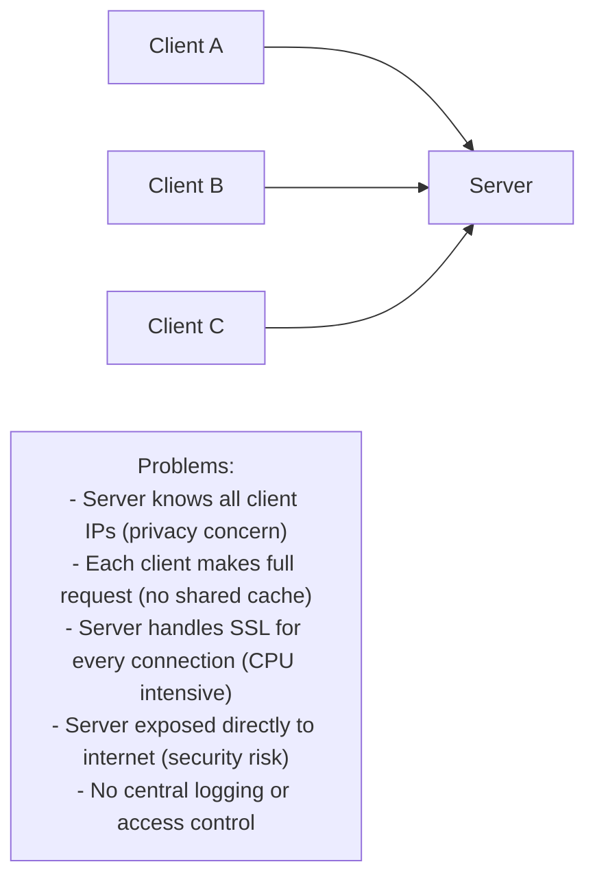

<details>
<summary>ASCII diagram (reference)</summary>

```text
┌─────────────────────────────────────────────────────────────────────────────┐
│                    DIRECT CLIENT-SERVER COMMUNICATION                        │
└─────────────────────────────────────────────────────────────────────────────┘

Client A ──────────────────────────────────────────────> Server
Client B ──────────────────────────────────────────────> Server
Client C ──────────────────────────────────────────────> Server

Problems:
- Server knows all client IPs (privacy concern)
- Each client makes full request (no shared cache)
- Server handles SSL for every connection (CPU intensive)
- Server exposed directly to internet (security risk)
- No central logging or access control
```
</details>

### Real Examples of the Problem

**Example 1: Corporate Network Security**
Without a forward proxy, companies can't monitor or filter employee internet access. Malware could be downloaded, sensitive data could be leaked.

**Example 2: High-Traffic Website**
Without a reverse proxy, each web server must handle SSL termination, static file serving, and request buffering. This wastes resources and creates inconsistent configurations.

**Example 3: API Gateway**
Without a reverse proxy, each microservice must implement its own authentication, rate limiting, and logging. Massive duplication of effort.

---

## 2️⃣ Intuition and Mental Model

### The Receptionist Analogy

**Forward Proxy** is like a company receptionist who makes calls on behalf of employees:
- Employee asks receptionist to call a vendor
- Receptionist dials the number
- Vendor sees receptionist's number, not employee's
- Receptionist can log calls, block certain numbers, cache information

**Reverse Proxy** is like a receptionist who answers calls for multiple departments:
- Customer calls main company number
- Receptionist answers and routes to correct department
- Customer doesn't know which specific person answered
- Receptionist can screen calls, take messages, handle common questions

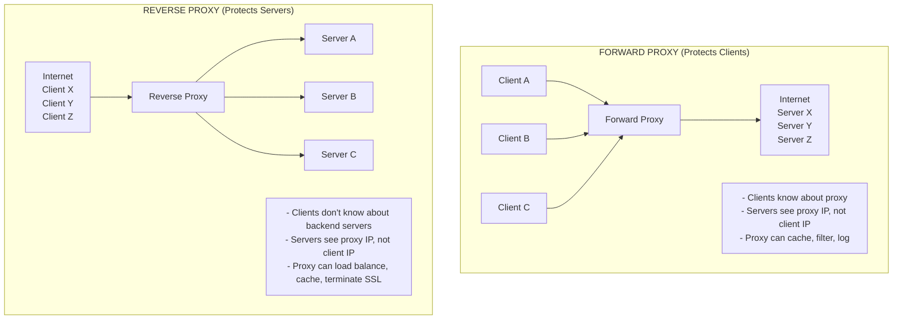

<details>
<summary>ASCII diagram (reference)</summary>

```text
┌─────────────────────────────────────────────────────────────────────────────┐
│                    FORWARD vs REVERSE PROXY                                  │
└─────────────────────────────────────────────────────────────────────────────┘

FORWARD PROXY (Protects Clients):
─────────────────────────────────
                                    ┌─────────────────┐
┌──────────┐    ┌──────────┐       │    Internet     │
│ Client A │───>│          │       │                 │
│          │    │  Forward │──────>│  Server X       │
│ Client B │───>│  Proxy   │──────>│  Server Y       │
│          │    │          │       │  Server Z       │
│ Client C │───>│          │       │                 │
└──────────┘    └──────────┘       └─────────────────┘

- Clients know about proxy
- Servers see proxy IP, not client IP
- Proxy can cache, filter, log


REVERSE PROXY (Protects Servers):
─────────────────────────────────
┌─────────────────┐    ┌──────────┐    ┌──────────────┐
│    Internet     │    │          │    │  Server A    │
│                 │───>│  Reverse │───>│              │
│  Client X       │    │  Proxy   │───>│  Server B    │
│  Client Y       │───>│          │───>│              │
│  Client Z       │    │          │    │  Server C    │
└─────────────────┘    └──────────┘    └──────────────┘

- Clients don't know about backend servers
- Servers see proxy IP, not client IP
- Proxy can load balance, cache, terminate SSL
```
</details>

### The Key Insight

**Forward Proxy**: Client-side. Client knows about proxy. Hides clients from servers.
**Reverse Proxy**: Server-side. Client doesn't know about proxy. Hides servers from clients.

---

## 3️⃣ How Forward Proxies Work

### Forward Proxy Architecture

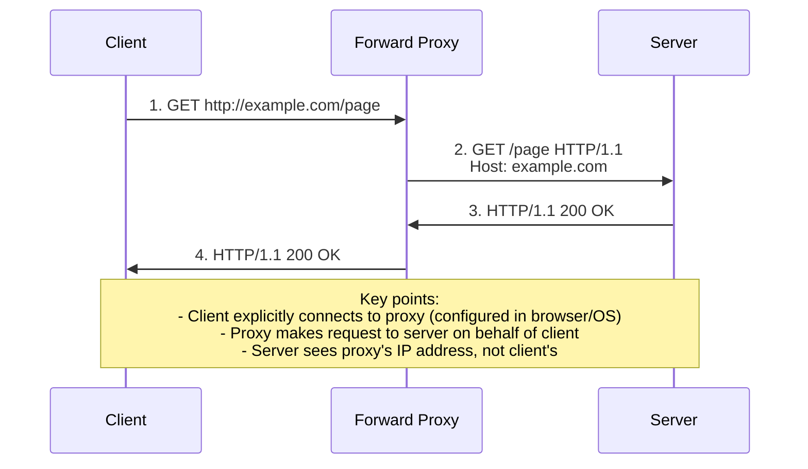

<details>
<summary>ASCII diagram (reference)</summary>

```text
┌─────────────────────────────────────────────────────────────────────────────┐
│                    FORWARD PROXY FLOW                                        │
└─────────────────────────────────────────────────────────────────────────────┘

Client                    Forward Proxy                    Server
   │                           │                             │
   │  1. GET http://example.com/page                         │
   │  ────────────────────────>│                             │
   │                           │                             │
   │                           │  2. GET /page HTTP/1.1      │
   │                           │  Host: example.com          │
   │                           │  ─────────────────────────> │
   │                           │                             │
   │                           │  3. HTTP/1.1 200 OK         │
   │                           │  <───────────────────────── │
   │                           │                             │
   │  4. HTTP/1.1 200 OK       │                             │
   │  <────────────────────────│                             │
   │                           │                             │

Key points:
- Client explicitly connects to proxy (configured in browser/OS)
- Proxy makes request to server on behalf of client
- Server sees proxy's IP address, not client's
```
</details>

### Forward Proxy Use Cases

#### 1. Corporate Internet Access Control

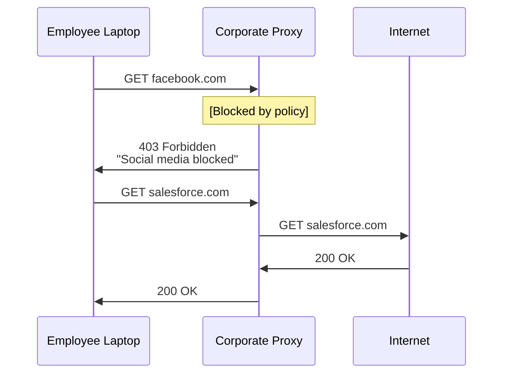

<details>
<summary>ASCII diagram (reference)</summary>

```text
┌─────────────────────────────────────────────────────────────────────────────┐
│                    CORPORATE PROXY                                           │
└─────────────────────────────────────────────────────────────────────────────┘

Employee Laptop                Corporate Proxy                  Internet
      │                              │                              │
      │  GET facebook.com            │                              │
      │  ───────────────────────────>│                              │
      │                              │                              │
      │  403 Forbidden               │  [Blocked by policy]         │
      │  "Social media blocked"      │                              │
      │  <───────────────────────────│                              │
      │                              │                              │
      │  GET salesforce.com          │                              │
      │  ───────────────────────────>│                              │
      │                              │  GET salesforce.com          │
      │                              │  ─────────────────────────>  │
      │                              │                              │
      │                              │  200 OK                      │
      │                              │  <─────────────────────────  │
      │  200 OK                      │                              │
      │  <───────────────────────────│                              │
```
</details>

#### 2. Caching Proxy

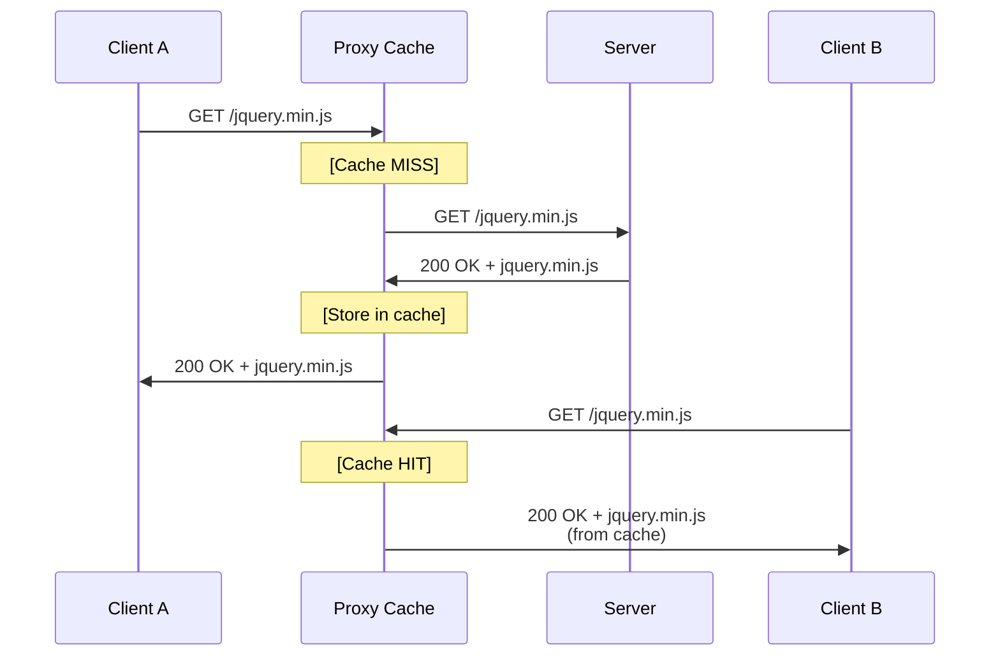

<details>
<summary>ASCII diagram (reference)</summary>

```text
┌─────────────────────────────────────────────────────────────────────────────┐
│                    CACHING FORWARD PROXY                                     │
└─────────────────────────────────────────────────────────────────────────────┘

Client A                     Proxy Cache                      Server
   │                              │                              │
   │  GET /jquery.min.js          │                              │
   │  ───────────────────────────>│                              │
   │                              │  [Cache MISS]                │
   │                              │  GET /jquery.min.js          │
   │                              │  ─────────────────────────>  │
   │                              │                              │
   │                              │  200 OK + jquery.min.js      │
   │                              │  [Store in cache]            │
   │                              │  <─────────────────────────  │
   │  200 OK + jquery.min.js      │                              │
   │  <───────────────────────────│                              │

Client B                          │                              │
   │                              │                              │
   │  GET /jquery.min.js          │                              │
   │  ───────────────────────────>│                              │
```
</details>
   │                              │  [Cache HIT!]                │
   │  200 OK + jquery.min.js      │  [No request to server]      │
   │  <───────────────────────────│                              │
```

#### 3. Anonymizing Proxy

```
Without Proxy:
  Server sees: Client IP = 192.168.1.100

With Anonymizing Proxy:
  Server sees: Client IP = 203.0.113.50 (proxy's IP)
  
With Multiple Proxies (Tor-like):
  Client → Proxy A → Proxy B → Proxy C → Server
  Server sees: Proxy C's IP only
```

### Forward Proxy Configuration

**Squid Proxy (Popular Open Source)**:

```squid
# /etc/squid/squid.conf

# Port to listen on
http_port 3128

# Access control lists
acl localnet src 192.168.0.0/16
acl SSL_ports port 443
acl Safe_ports port 80 443 8080

# Block social media
acl social_media dstdomain .facebook.com .twitter.com .instagram.com
http_access deny social_media

# Allow local network
http_access allow localnet
http_access deny all

# Caching settings
cache_dir ufs /var/spool/squid 10000 16 256
maximum_object_size 100 MB
cache_mem 256 MB

# Logging
access_log /var/log/squid/access.log squid
```

**Browser Configuration** (Programmatic):

```java
// Java: Configure HTTP client to use proxy
public class ProxyHttpClient {
    
    public HttpClient createProxiedClient() {
        return HttpClient.newBuilder()
            .proxy(ProxySelector.of(
                new InetSocketAddress("proxy.company.com", 3128)
            ))
            .build();
    }
    
    public String fetchViaProxy(String url) throws Exception {
        HttpClient client = createProxiedClient();
        
        HttpRequest request = HttpRequest.newBuilder()
            .uri(URI.create(url))
            .GET()
            .build();
        
        HttpResponse<String> response = client.send(
            request, 
            HttpResponse.BodyHandlers.ofString()
        );
        
        return response.body();
    }
}
```

---

## 4️⃣ How Reverse Proxies Work

### Reverse Proxy Architecture

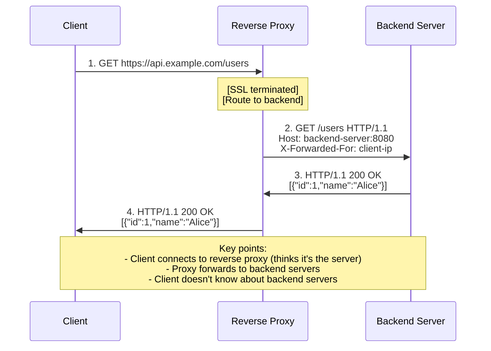

<details>
<summary>ASCII diagram (reference)</summary>

```text
┌─────────────────────────────────────────────────────────────────────────────┐
│                    REVERSE PROXY FLOW                                        │
└─────────────────────────────────────────────────────────────────────────────┘

Client                    Reverse Proxy                   Backend Server
   │                           │                               │
   │  1. GET https://api.example.com/users                     │
   │  ────────────────────────>│                               │
   │                           │                               │
   │                           │  [SSL terminated]             │
   │                           │  [Route to backend]           │
   │                           │                               │
   │                           │  2. GET /users HTTP/1.1       │
   │                           │  Host: backend-server:8080    │
   │                           │  X-Forwarded-For: client-ip   │
   │                           │  ───────────────────────────> │
   │                           │                               │
   │                           │  3. HTTP/1.1 200 OK           │
   │                           │  [{"id":1,"name":"Alice"}]    │
   │                           │  <─────────────────────────── │
   │                           │                               │
   │  4. HTTP/1.1 200 OK       │                               │
   │  [{"id":1,"name":"Alice"}]│                               │
   │  <────────────────────────│                               │

Key points:
- Client connects to reverse proxy (thinks it's the server)
- Proxy forwards to backend servers
- Client doesn't know about backend servers
```
</details>

### Reverse Proxy Use Cases

#### 1. SSL/TLS Termination

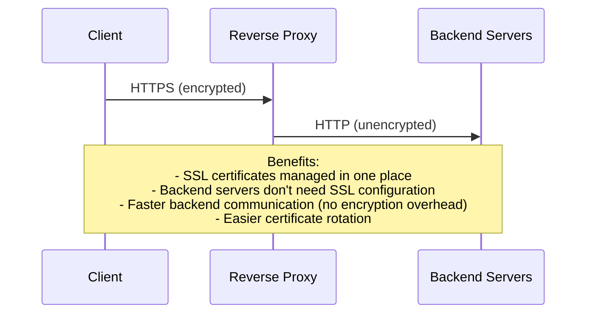

<details>
<summary>ASCII diagram (reference)</summary>

```text
┌─────────────────────────────────────────────────────────────────────────────┐
│                    SSL TERMINATION                                           │
└─────────────────────────────────────────────────────────────────────────────┘

Client                    Reverse Proxy                   Backend Servers
   │                           │                               │
   │  HTTPS (encrypted)        │                               │
   │  ════════════════════════>│                               │
   │                           │                               │
   │                           │  HTTP (unencrypted)           │
   │                           │  ───────────────────────────> │
   │                           │                               │

Benefits:
- SSL certificates managed in one place
- Backend servers don't need SSL configuration
- Faster backend communication (no encryption overhead)
- Easier certificate rotation
```
</details>

#### 2. Load Balancing

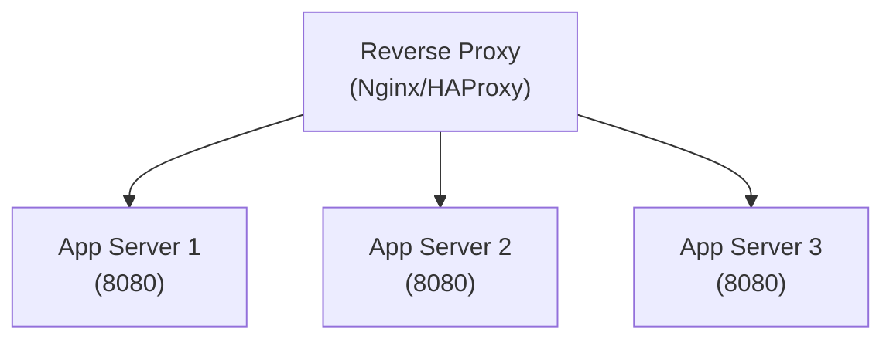

<details>
<summary>ASCII diagram (reference)</summary>

```text
┌─────────────────────────────────────────────────────────────────────────────┐
│                    REVERSE PROXY LOAD BALANCING                              │
└─────────────────────────────────────────────────────────────────────────────┘

                         ┌─────────────────┐
                         │  Reverse Proxy  │
                         │  (Nginx/HAProxy)│
                         └────────┬────────┘
                                  │
            ┌─────────────────────┼─────────────────────┐
            │                     │                     │
            ▼                     ▼                     ▼
    ┌───────────────┐    ┌───────────────┐    ┌───────────────┐
    │  App Server 1 │    │  App Server 2 │    │  App Server 3 │
    │  (8080)       │    │  (8080)       │    │  (8080)       │
    └───────────────┘    └───────────────┘    └───────────────┘
```
</details>

#### 3. Static Content Serving

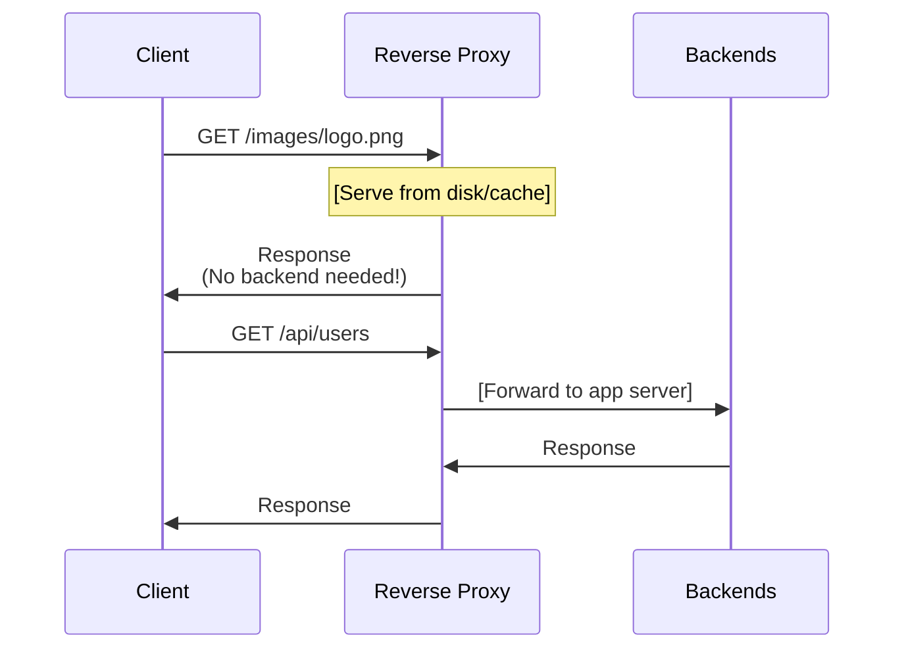

<details>
<summary>ASCII diagram (reference)</summary>

```text
┌─────────────────────────────────────────────────────────────────────────────┐
│                    STATIC vs DYNAMIC ROUTING                                 │
└─────────────────────────────────────────────────────────────────────────────┘

Client Request             Reverse Proxy                    Backends
      │                         │                              │
      │  GET /images/logo.png   │                              │
      │  ────────────────────>  │                              │
      │                         │  [Serve from disk/cache]     │
      │  <────────────────────  │                              │
      │  (No backend needed!)   │                              │
      │                         │                              │
      │  GET /api/users         │                              │
      │  ────────────────────>  │                              │
      │                         │  ─────────────────────────>  │
      │                         │  [Forward to app server]     │
      │                         │  <─────────────────────────  │
      │  <────────────────────  │                              │
```
</details>

#### 4. Request Buffering

```
┌─────────────────────────────────────────────────────────────────────────────┐
│                    REQUEST BUFFERING                                         │
└─────────────────────────────────────────────────────────────────────────────┘

Without Buffering:
  Slow Client ═══════════════════════════════> App Server
  (10 seconds to send request)                 (Blocked for 10 seconds!)

With Buffering (Reverse Proxy):
  Slow Client ═══════════════════════════════> Reverse Proxy ──> App Server
  (10 seconds to send to proxy)                (Proxy buffers)   (Instant!)
  
Benefits:
- App server connections freed quickly
- Protects against slow clients (Slowloris attacks)
- Better resource utilization
```

#### 5. Caching

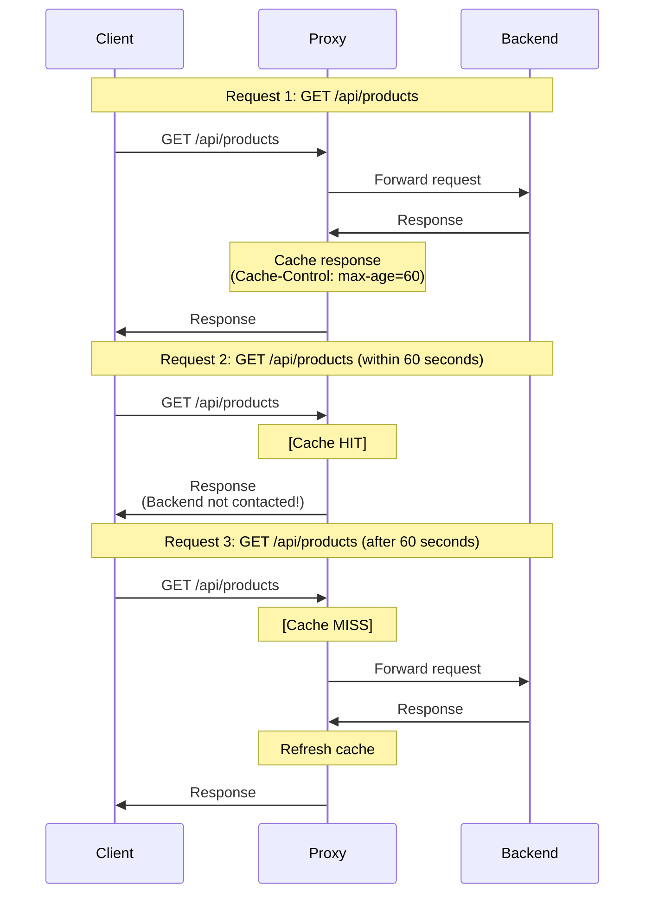

<details>
<summary>ASCII diagram (reference)</summary>

```text
┌─────────────────────────────────────────────────────────────────────────────┐
│                    REVERSE PROXY CACHING                                     │
└─────────────────────────────────────────────────────────────────────────────┘

Request 1: GET /api/products
  Client → Proxy → Backend → Response
  Proxy caches response (Cache-Control: max-age=60)

Request 2: GET /api/products (within 60 seconds)
  Client → Proxy → [Cache HIT] → Response
  Backend not contacted!

Request 3: GET /api/products (after 60 seconds)
  Client → Proxy → [Cache MISS] → Backend → Response
  Proxy refreshes cache
```
</details>

---

## 5️⃣ Nginx as Reverse Proxy: Complete Guide

### Basic Reverse Proxy Configuration

```nginx
# /etc/nginx/nginx.conf

# Worker processes (usually = CPU cores)
worker_processes auto;

events {
    worker_connections 1024;
}

http {
    # Logging
    log_format main '$remote_addr - $remote_user [$time_local] "$request" '
                    '$status $body_bytes_sent "$http_referer" '
                    '"$http_user_agent" "$http_x_forwarded_for"';
    
    access_log /var/log/nginx/access.log main;
    error_log /var/log/nginx/error.log warn;
    
    # Upstream servers (backend pool)
    upstream backend {
        least_conn;  # Load balancing algorithm
        
        server 192.168.1.10:8080 weight=3;
        server 192.168.1.11:8080 weight=2;
        server 192.168.1.12:8080 weight=1 backup;
        
        keepalive 32;  # Connection pooling
    }
    
    # Main server block
    server {
        listen 80;
        server_name example.com;
        
        # Redirect HTTP to HTTPS
        return 301 https://$server_name$request_uri;
    }
    
    server {
        listen 443 ssl http2;
        server_name example.com;
        
        # SSL Configuration
        ssl_certificate /etc/ssl/certs/example.com.crt;
        ssl_certificate_key /etc/ssl/private/example.com.key;
        ssl_protocols TLSv1.2 TLSv1.3;
        ssl_ciphers ECDHE-ECDSA-AES128-GCM-SHA256:ECDHE-RSA-AES128-GCM-SHA256;
        ssl_prefer_server_ciphers on;
        ssl_session_cache shared:SSL:10m;
        
        # Security headers
        add_header X-Frame-Options "SAMEORIGIN" always;
        add_header X-Content-Type-Options "nosniff" always;
        add_header X-XSS-Protection "1; mode=block" always;
        
        # Proxy to backend
        location / {
            proxy_pass http://backend;
            proxy_http_version 1.1;
            proxy_set_header Connection "";
            
            # Forward client information
            proxy_set_header Host $host;
            proxy_set_header X-Real-IP $remote_addr;
            proxy_set_header X-Forwarded-For $proxy_add_x_forwarded_for;
            proxy_set_header X-Forwarded-Proto $scheme;
            
            # Timeouts
            proxy_connect_timeout 5s;
            proxy_send_timeout 60s;
            proxy_read_timeout 60s;
            
            # Buffering
            proxy_buffering on;
            proxy_buffer_size 4k;
            proxy_buffers 8 4k;
            proxy_busy_buffers_size 8k;
        }
    }
}
```

### Path-Based Routing

```nginx
server {
    listen 443 ssl http2;
    server_name api.example.com;
    
    # API routes to API servers
    location /api/ {
        proxy_pass http://api_backend/;
        proxy_set_header Host $host;
        proxy_set_header X-Real-IP $remote_addr;
    }
    
    # Auth routes to auth service
    location /auth/ {
        proxy_pass http://auth_backend/;
        proxy_set_header Host $host;
        proxy_set_header X-Real-IP $remote_addr;
    }
    
    # Static files served directly
    location /static/ {
        alias /var/www/static/;
        expires 30d;
        add_header Cache-Control "public, immutable";
    }
    
    # WebSocket upgrade
    location /ws/ {
        proxy_pass http://websocket_backend;
        proxy_http_version 1.1;
        proxy_set_header Upgrade $http_upgrade;
        proxy_set_header Connection "upgrade";
        proxy_read_timeout 86400;  # 24 hours
    }
    
    # Default to frontend
    location / {
        proxy_pass http://frontend_backend;
    }
}

upstream api_backend {
    server 192.168.1.20:8080;
    server 192.168.1.21:8080;
}

upstream auth_backend {
    server 192.168.1.30:8080;
}

upstream websocket_backend {
    server 192.168.1.40:8080;
}

upstream frontend_backend {
    server 192.168.1.50:3000;
}
```

### Caching Configuration

```nginx
http {
    # Cache path configuration
    proxy_cache_path /var/cache/nginx 
        levels=1:2 
        keys_zone=my_cache:10m 
        max_size=10g 
        inactive=60m 
        use_temp_path=off;
    
    server {
        listen 443 ssl http2;
        
        location /api/ {
            proxy_pass http://backend;
            
            # Enable caching
            proxy_cache my_cache;
            proxy_cache_valid 200 10m;      # Cache 200 responses for 10 minutes
            proxy_cache_valid 404 1m;       # Cache 404 responses for 1 minute
            proxy_cache_use_stale error timeout updating;
            proxy_cache_lock on;            # Prevent cache stampede
            
            # Add cache status header
            add_header X-Cache-Status $upstream_cache_status;
            
            # Cache key
            proxy_cache_key $scheme$request_method$host$request_uri;
            
            # Bypass cache for certain requests
            proxy_cache_bypass $http_cache_control;
            proxy_no_cache $http_pragma;
        }
        
        # Don't cache POST requests
        location /api/write {
            proxy_pass http://backend;
            proxy_cache off;
        }
    }
}
```

### Rate Limiting

```nginx
http {
    # Define rate limit zones
    limit_req_zone $binary_remote_addr zone=api_limit:10m rate=10r/s;
    limit_req_zone $binary_remote_addr zone=login_limit:10m rate=1r/s;
    
    server {
        # API endpoints: 10 requests/second with burst
        location /api/ {
            limit_req zone=api_limit burst=20 nodelay;
            proxy_pass http://backend;
        }
        
        # Login: 1 request/second (prevent brute force)
        location /auth/login {
            limit_req zone=login_limit burst=5;
            proxy_pass http://auth_backend;
        }
    }
}
```

### Compression

```nginx
http {
    # Enable gzip compression
    gzip on;
    gzip_vary on;
    gzip_proxied any;
    gzip_comp_level 6;
    gzip_types text/plain text/css text/xml application/json 
               application/javascript application/xml+rss 
               application/atom+xml image/svg+xml;
    gzip_min_length 1000;
    
    # Brotli compression (requires module)
    # brotli on;
    # brotli_comp_level 6;
    # brotli_types text/plain text/css application/json application/javascript;
}
```

---

## 6️⃣ Production Configurations

### High Availability Nginx Setup

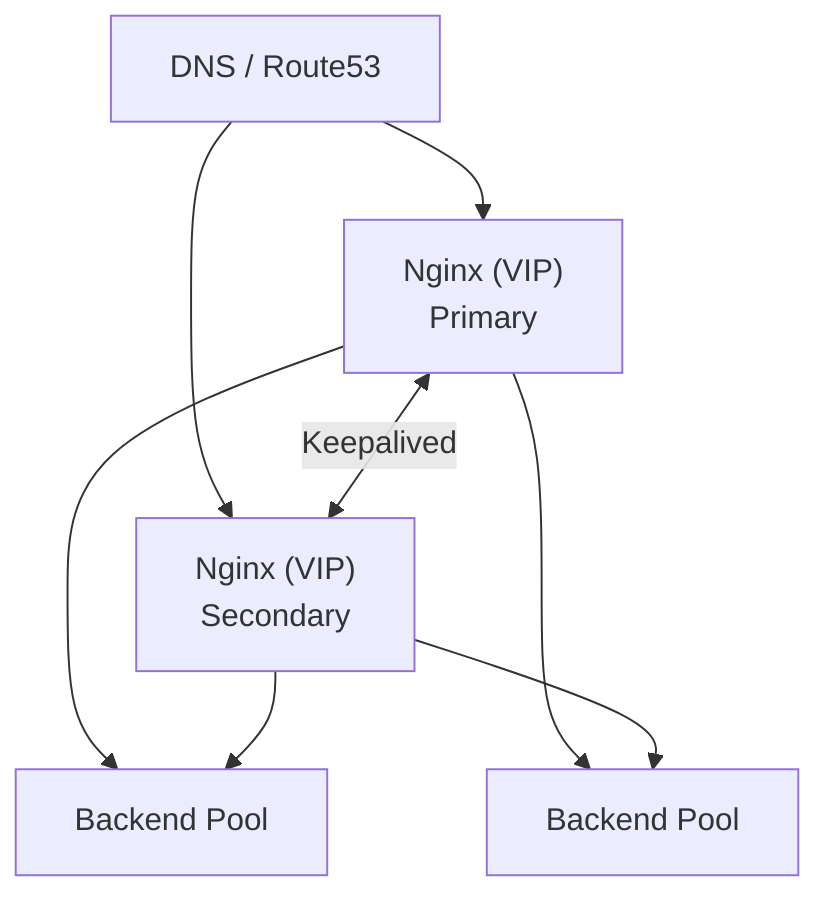

<details>
<summary>ASCII diagram (reference)</summary>

```text
┌─────────────────────────────────────────────────────────────────────────────┐
│                    HA REVERSE PROXY ARCHITECTURE                             │
└─────────────────────────────────────────────────────────────────────────────┘

                         ┌─────────────────┐
                         │   DNS / Route53 │
                         └────────┬────────┘
                                  │
                    ┌─────────────┴─────────────┐
                    │                           │
                    ▼                           ▼
           ┌───────────────┐           ┌───────────────┐
           │  Nginx (VIP)  │◄─────────►│  Nginx (VIP)  │
           │   Primary     │ Keepalived│   Secondary   │
           └───────┬───────┘           └───────┬───────┘
                   │                           │
                   └───────────┬───────────────┘
                               │
                    ┌──────────┴──────────┐
                    │                     │
                    ▼                     ▼
            ┌───────────────┐     ┌───────────────┐
            │  Backend Pool │     │  Backend Pool │
            └───────────────┘     └───────────────┘
```
</details>

**Keepalived Configuration** (for VIP failover):

```conf
# /etc/keepalived/keepalived.conf (Primary)
vrrp_script check_nginx {
    script "/usr/bin/pgrep nginx"
    interval 2
    weight 50
}

vrrp_instance VI_1 {
    state MASTER
    interface eth0
    virtual_router_id 51
    priority 101
    
    authentication {
        auth_type PASS
        auth_pass secret123
    }
    
    virtual_ipaddress {
        192.168.1.100/24
    }
    
    track_script {
        check_nginx
    }
}
```

### Spring Boot Behind Nginx

```java
// application.yml
server:
  port: 8080
  forward-headers-strategy: framework  # Trust X-Forwarded-* headers
  tomcat:
    remote-ip-header: X-Forwarded-For
    protocol-header: X-Forwarded-Proto

// Or with configuration class
@Configuration
public class WebConfig {
    
    @Bean
    public FilterRegistrationBean<ForwardedHeaderFilter> forwardedHeaderFilter() {
        FilterRegistrationBean<ForwardedHeaderFilter> bean = 
            new FilterRegistrationBean<>();
        bean.setFilter(new ForwardedHeaderFilter());
        return bean;
    }
}
```

```nginx
# Nginx configuration for Spring Boot
upstream spring_backend {
    server 127.0.0.1:8080;
    keepalive 32;
}

server {
    listen 443 ssl http2;
    server_name api.example.com;
    
    location / {
        proxy_pass http://spring_backend;
        proxy_http_version 1.1;
        proxy_set_header Connection "";
        
        proxy_set_header Host $host;
        proxy_set_header X-Real-IP $remote_addr;
        proxy_set_header X-Forwarded-For $proxy_add_x_forwarded_for;
        proxy_set_header X-Forwarded-Proto $scheme;
        proxy_set_header X-Forwarded-Port $server_port;
        
        # For actuator health checks
        proxy_connect_timeout 5s;
        proxy_read_timeout 60s;
    }
    
    # Spring Boot Actuator
    location /actuator/health {
        proxy_pass http://spring_backend;
        proxy_connect_timeout 2s;
        proxy_read_timeout 5s;
    }
}
```

---

## 7️⃣ Tradeoffs, Pitfalls, and Common Mistakes

### Pitfall 1: Not Forwarding Client IP

**Scenario**: Backend logs show proxy IP instead of client IP.

**Mistake**: Not setting X-Forwarded-For header.

**Solution**:

```nginx
# Nginx
proxy_set_header X-Real-IP $remote_addr;
proxy_set_header X-Forwarded-For $proxy_add_x_forwarded_for;
```

```java
// Spring Boot
@GetMapping("/api/data")
public String getData(HttpServletRequest request) {
    String clientIP = request.getHeader("X-Forwarded-For");
    if (clientIP == null || clientIP.isEmpty()) {
        clientIP = request.getRemoteAddr();
    }
    // Handle comma-separated list (multiple proxies)
    if (clientIP.contains(",")) {
        clientIP = clientIP.split(",")[0].trim();
    }
    return clientIP;
}
```

### Pitfall 2: Timeout Mismatch

**Scenario**: 502 Bad Gateway errors under load.

**Mistake**: Proxy timeout shorter than backend processing time.

```nginx
# BAD: Proxy gives up before backend responds
proxy_read_timeout 5s;   # Proxy timeout
# Backend takes 10s to respond → 502 error

# GOOD: Proxy timeout > backend timeout
proxy_read_timeout 65s;  # Proxy waits longer
# Backend has 60s timeout → Response returned
```

### Pitfall 3: WebSocket Connection Drops

**Scenario**: WebSocket connections close after 60 seconds.

**Mistake**: Not configuring WebSocket upgrade properly.

```nginx
# BAD: Missing upgrade headers
location /ws {
    proxy_pass http://backend;
}

# GOOD: Proper WebSocket configuration
location /ws {
    proxy_pass http://backend;
    proxy_http_version 1.1;
    proxy_set_header Upgrade $http_upgrade;
    proxy_set_header Connection "upgrade";
    proxy_read_timeout 86400s;  # Long timeout for persistent connections
    proxy_send_timeout 86400s;
}
```

### Pitfall 4: Cache Serving Stale User Data

**Scenario**: User A sees User B's data.

**Mistake**: Caching personalized responses.

```nginx
# BAD: Caching everything
location /api/ {
    proxy_cache my_cache;
    proxy_cache_valid 200 10m;
}

# GOOD: Exclude personalized endpoints
location /api/user/profile {
    proxy_pass http://backend;
    proxy_cache off;  # Don't cache user-specific data
}

location /api/products {
    proxy_pass http://backend;
    proxy_cache my_cache;
    proxy_cache_valid 200 5m;
}
```

### Pitfall 5: Single Proxy as SPOF

**Scenario**: Proxy server fails, entire service down.

**Mistake**: Running single proxy instance.

**Solution**: High availability setup with Keepalived or cloud load balancer in front.

---

## 8️⃣ When NOT to Use Proxies

### When Forward Proxy is Unnecessary

| Scenario | Why | Alternative |
|----------|-----|-------------|
| Home network | No corporate policies | Direct connection |
| Cloud-native apps | VPC provides isolation | Security groups |
| Mobile apps | Can't configure proxy | Direct connection |

### When Reverse Proxy is Unnecessary

| Scenario | Why | Alternative |
|----------|-----|-------------|
| Single server | No load balancing needed | Direct access |
| Development | Complexity not needed | Direct to app |
| Serverless (Lambda) | Managed by cloud | API Gateway |
| Service mesh | Sidecar handles routing | Envoy/Linkerd |

---

## 9️⃣ Comparison Table

| Feature | Forward Proxy | Reverse Proxy |
|---------|---------------|---------------|
| **Position** | Client-side | Server-side |
| **Client Awareness** | Client knows about proxy | Client doesn't know |
| **Protects** | Clients (privacy) | Servers (security) |
| **SSL Termination** | Rare | Common |
| **Load Balancing** | No | Yes |
| **Caching** | For clients | For servers |
| **Access Control** | Outbound filtering | Inbound routing |
| **Examples** | Squid, corporate proxies | Nginx, HAProxy, Envoy |

---

## 🔟 Interview Follow-Up Questions

### L4 (Junior/Mid) Level Questions

**Q1: What is the difference between a forward proxy and a reverse proxy?**

**A**: 
- **Forward Proxy**: Sits in front of clients. Client knows about proxy and configures it. Hides client identity from servers. Used for: privacy, caching, access control.
- **Reverse Proxy**: Sits in front of servers. Client doesn't know about it. Hides server identity from clients. Used for: load balancing, SSL termination, caching.

Key difference: Forward proxy protects clients, reverse proxy protects servers.

**Q2: What is SSL termination and why is it useful?**

**A**: SSL termination is when the reverse proxy handles SSL/TLS encryption, and communicates with backend servers over plain HTTP.

Benefits:
1. Centralized certificate management (one place to update)
2. Reduced CPU load on backend servers
3. Easier debugging (can inspect traffic at proxy)
4. Backend servers don't need SSL configuration

**Q3: How does Nginx handle load balancing?**

**A**: Nginx uses the `upstream` block to define backend servers and load balancing algorithm:

```nginx
upstream backend {
    least_conn;  # Algorithm: least_conn, round_robin, ip_hash
    server server1:8080 weight=3;
    server server2:8080 weight=1;
    server server3:8080 backup;
}
```

Nginx distributes requests according to the algorithm, respects weights, and automatically removes failed servers (with health checks).

### L5 (Senior) Level Questions

**Q4: How would you configure Nginx for a microservices architecture?**

**A**: 
1. **Path-based routing**: Route `/api/users` to user service, `/api/orders` to order service
2. **Load balancing per service**: Separate upstream blocks
3. **Health checks**: Active health checks to each service
4. **Circuit breaking**: Limit connections, fail fast
5. **Rate limiting**: Per-service rate limits
6. **Caching**: Cache appropriate responses
7. **Security**: mTLS between proxy and services

```nginx
upstream user_service {
    zone user_service 64k;
    server user-svc:8080;
    health_check interval=5s;
}

upstream order_service {
    zone order_service 64k;
    server order-svc:8080;
    health_check interval=5s;
}

server {
    location /api/users {
        proxy_pass http://user_service;
        limit_req zone=user_limit burst=10;
    }
    
    location /api/orders {
        proxy_pass http://order_service;
        limit_req zone=order_limit burst=20;
    }
}
```

**Q5: How do you handle WebSocket connections through a reverse proxy?**

**A**: WebSocket requires special handling because it upgrades from HTTP to a persistent connection:

1. **Upgrade headers**: Must forward `Upgrade` and `Connection` headers
2. **HTTP/1.1**: WebSocket requires HTTP/1.1 (not HTTP/2)
3. **Long timeouts**: Connection stays open, need long read/write timeouts
4. **No buffering**: Disable proxy buffering for real-time communication

```nginx
location /ws {
    proxy_pass http://websocket_backend;
    proxy_http_version 1.1;
    proxy_set_header Upgrade $http_upgrade;
    proxy_set_header Connection "upgrade";
    proxy_buffering off;
    proxy_read_timeout 86400s;
    proxy_send_timeout 86400s;
}
```

### L6 (Staff+) Level Questions

**Q6: Design a global reverse proxy architecture for a multi-region application.**

**A**: 
1. **Edge Layer**:
   - CDN (Cloudflare, CloudFront) at edge
   - GeoDNS routes to nearest region
   - DDoS protection at edge

2. **Regional Layer**:
   - Nginx/HAProxy in each region
   - SSL termination at regional proxy
   - Path-based routing to services

3. **Service Layer**:
   - Service mesh (Istio) for internal routing
   - mTLS between services
   - Circuit breakers and retries

4. **Cross-Region**:
   - Global load balancer for failover
   - Latency-based routing
   - Data replication between regions

```
User → CDN (Edge) → Regional LB → Nginx → Service Mesh → Services
                                      ↓
                              (Cross-region failover)
```

**Q7: A reverse proxy is causing intermittent 504 Gateway Timeout errors. How do you diagnose?**

**A**: 
1. **Check proxy logs**:
   ```bash
   tail -f /var/log/nginx/error.log | grep 504
   ```
   Look for: upstream timed out, connection refused

2. **Check timeout configuration**:
   - `proxy_connect_timeout`: Time to establish connection
   - `proxy_read_timeout`: Time waiting for response
   - Compare with backend response times

3. **Check backend health**:
   - Are backends overloaded?
   - Connection pool exhausted?
   - Slow database queries?

4. **Check network**:
   - Network latency between proxy and backend
   - Firewall rules
   - Connection limits

5. **Common fixes**:
   - Increase proxy timeouts (but not too much)
   - Add more backend servers
   - Implement circuit breakers
   - Add caching for slow endpoints

---

## 1️⃣1️⃣ Mental Summary

**Proxies are intermediaries** that add security, performance, and control features to network communication.

**Forward Proxy**: Client-side, protects clients. Used for: corporate access control, caching, anonymity. Client must be configured to use it.

**Reverse Proxy**: Server-side, protects servers. Used for: load balancing, SSL termination, caching, security. Client doesn't know about it.

**Nginx is the most common reverse proxy** in production. Key configurations: upstream blocks for backends, location blocks for routing, proxy_pass for forwarding, proper headers for client IP forwarding.

**For production**: Always use HTTPS, forward client IP headers, configure appropriate timeouts, implement health checks, consider high availability setup.

**For interviews**: Know the difference between forward and reverse proxy, understand SSL termination benefits, be able to configure Nginx for common scenarios (load balancing, WebSocket, caching).

---

## 📚 Further Reading

- [Nginx Documentation](https://nginx.org/en/docs/)
- [HAProxy Documentation](https://www.haproxy.com/documentation/)
- [Envoy Proxy](https://www.envoyproxy.io/docs/envoy/latest/)
- [Squid Proxy](http://www.squid-cache.org/Doc/)
- [Nginx Cookbook](https://www.nginx.com/resources/library/complete-nginx-cookbook/)

