# 🌍 CDN (Content Delivery Network)

## 0️⃣ Prerequisites

Before diving into CDNs, you should understand:

- **DNS**: How domain names resolve to IP addresses. CDNs use DNS for routing users to edge servers. See `01-dns-deep-dive.md`.

- **HTTP Caching**: Cache-Control headers, ETags, and how browsers cache content. CDNs extend this caching to edge servers.

- **Latency**: The time for data to travel between two points. Physical distance matters. Light in fiber travels ~200,000 km/s, so NYC to Tokyo (~11,000 km) has ~55ms minimum latency one way.

- **Reverse Proxy**: CDNs are essentially globally distributed reverse proxies. See `07-reverse-proxy-forward-proxy.md`.

---

## 1️⃣ What Problem Does a CDN Exist to Solve?

### The Specific Pain Point

Your server is in one location. Your users are everywhere. Physics is unforgiving.

**The Problem**: A user in Sydney requesting content from a server in New York experiences at least 150ms latency just for the speed of light, plus routing, processing, and return trip. For a web page with 50 resources, this adds up to seconds of delay.

### What Systems Looked Like Before CDNs

```mermaid
flowchart TD
    Origin["Origin Server<br/>(New York)"]
    UserNYC["User in NYC<br/>Latency: 20ms"]
    UserLondon["User in London<br/>Latency: 75ms"]
    UserSydney["User in Sydney<br/>Latency: 200ms"]
    
    Origin --> UserNYC
    Origin --> UserLondon
    Origin --> UserSydney
    
    Note1["Every request travels to NYC:<br/>- NYC user: Fast (20ms)<br/>- London user: Slow (75ms × 2 = 150ms round trip)<br/>- Sydney user: Very slow (200ms × 2 = 400ms round trip)"]
```



<details>
<summary>ASCII diagram (reference)</summary>

```text
┌─────────────────────────────────────────────────────────────────────────────┐
│                    SINGLE ORIGIN SERVER                                      │
└─────────────────────────────────────────────────────────────────────────────┘

                              ┌─────────────────┐
                              │  Origin Server  │
                              │  (New York)     │
                              └────────┬────────┘
                                       │
        ┌──────────────────────────────┼──────────────────────────────┐
        │                              │                              │
        │                              │                              │
   User in NYC                  User in London               User in Sydney
   Latency: 20ms               Latency: 75ms                Latency: 200ms
   
Every request travels to NYC:
- NYC user: Fast (20ms)
- London user: Slow (75ms × 2 = 150ms round trip)
- Sydney user: Very slow (200ms × 2 = 400ms round trip)
```
</details>

### What Breaks Without CDN

**Without a CDN**:
- Global users experience high latency
- Origin server overwhelmed during traffic spikes
- Single point of failure
- High bandwidth costs (all traffic from origin)
- Poor user experience for distant users

### Real Examples of the Problem

**Example 1: Netflix**
Netflix streams 15% of global internet traffic. Without CDN (Open Connect), their origin servers would need impossibly high bandwidth, and users would buffer constantly.

**Example 2: Black Friday Sales**
E-commerce sites experience 10-100x normal traffic. Without CDN caching, origin servers would crash. CDN absorbs the spike by serving cached content.

**Example 3: Breaking News**
When major news breaks, millions simultaneously request the same article. CNN's origin could never handle this. CDN serves the cached article from thousands of edge servers.

---

## 2️⃣ Intuition and Mental Model

### The Library Branch Analogy

Imagine a library system:

**Without CDN (Single Central Library)**:
- One main library in New York
- Everyone travels to NYC to borrow books
- Long lines, long travel times
- If the library closes, no one gets books

**With CDN (Branch Libraries)**:
- Main library in NYC (origin server)
- Branch libraries in every city (edge servers)
- Popular books copied to all branches (cached content)
- Rare books only at main library (dynamic content)
- Users go to nearest branch (edge routing)


<details>
<summary>ASCII diagram (reference)</summary>

```text
┌─────────────────────────────────────────────────────────────────────────────┐
│                    CDN AS LIBRARY BRANCHES                                   │
└─────────────────────────────────────────────────────────────────────────────┘

                              ┌─────────────────┐
                              │  Main Library   │
                              │  (Origin)       │
                              └────────┬────────┘
                                       │
                    ┌──────────────────┼──────────────────┐
                    │                  │                  │
                    ▼                  ▼                  ▼
           ┌───────────────┐  ┌───────────────┐  ┌───────────────┐
           │ NYC Branch    │  │ London Branch │  │ Sydney Branch │
           │ (Edge Server) │  │ (Edge Server) │  │ (Edge Server) │
           └───────────────┘  └───────────────┘  └───────────────┘
                    │                  │                  │
                    ▼                  ▼                  ▼
           NYC Users: 5ms      London Users: 5ms   Sydney Users: 5ms
           (local branch)      (local branch)      (local branch)
```
</details>

### The Key Insight

CDN = **Cache + Geographic Distribution + Smart Routing**

1. **Cache**: Store copies of content closer to users
2. **Geographic Distribution**: Edge servers worldwide
3. **Smart Routing**: Direct users to optimal edge server

---

## 3️⃣ How CDNs Work Internally

### CDN Architecture


<details>
<summary>ASCII diagram (reference)</summary>

```text
┌─────────────────────────────────────────────────────────────────────────────┐
│                         CDN ARCHITECTURE                                     │
└─────────────────────────────────────────────────────────────────────────────┘

                              ┌─────────────────┐
                              │  Origin Server  │
                              │  (Your Server)  │
                              └────────┬────────┘
                                       │
                              ┌────────▼────────┐
                              │  CDN Control    │
                              │  Plane          │
                              │  (Configuration,│
                              │   Routing)      │
                              └────────┬────────┘
                                       │
        ┌──────────────────────────────┼──────────────────────────────┐
        │                              │                              │
        ▼                              ▼                              ▼
┌───────────────┐            ┌───────────────┐            ┌───────────────┐
│     PoP       │            │     PoP       │            │     PoP       │
│  (New York)   │            │   (London)    │            │   (Tokyo)     │
│               │            │               │            │               │
│ ┌───────────┐ │            │ ┌───────────┐ │            │ ┌───────────┐ │
│ │Edge Server│ │            │ │Edge Server│ │            │ │Edge Server│ │
│ │Edge Server│ │            │ │Edge Server│ │            │ │Edge Server│ │
│ │Edge Server│ │            │ │Edge Server│ │            │ │Edge Server│ │
│ └───────────┘ │            │ └───────────┘ │            │ └───────────┘ │
└───────────────┘            └───────────────┘            └───────────────┘

PoP = Point of Presence (data center with edge servers)
```
</details>

### CDN Request Flow


<details>
<summary>ASCII diagram (reference)</summary>

```text
┌─────────────────────────────────────────────────────────────────────────────┐
│                         CDN REQUEST FLOW                                     │
└─────────────────────────────────────────────────────────────────────────────┘

User in London                CDN Edge (London)              Origin (NYC)
      │                              │                            │
      │  1. DNS: cdn.example.com     │                            │
      │  ─────────────────────────>  │                            │
      │  IP: 203.0.113.50 (London)   │                            │
      │  <─────────────────────────  │                            │
      │                              │                            │
      │  2. GET /images/logo.png     │                            │
      │  ─────────────────────────>  │                            │
      │                              │                            │
      │                              │  [Cache HIT]               │
      │  3. 200 OK + logo.png        │  (Content in cache)        │
      │  <─────────────────────────  │                            │
      │                              │                            │
      │  Total latency: ~10ms        │                            │
      │                              │                            │

─────────────────────────────────────────────────────────────────────────────

User in London                CDN Edge (London)              Origin (NYC)
      │                              │                            │
      │  GET /api/user/123           │                            │
      │  ─────────────────────────>  │                            │
      │                              │                            │
      │                              │  [Cache MISS]              │
      │                              │  3. GET /api/user/123      │
      │                              │  ─────────────────────────>│
      │                              │                            │
      │                              │  4. 200 OK + user data     │
      │                              │  <─────────────────────────│
      │                              │                            │
      │                              │  [Store in cache?          │
      │                              │   Depends on headers]      │
      │                              │                            │
      │  5. 200 OK + user data       │                            │
      │  <─────────────────────────  │                            │
      │                              │                            │
      │  Total latency: ~80ms        │                            │
      │  (Still faster than direct   │                            │
      │   150ms to origin)           │                            │
```
</details>

### How CDN Routing Works

CDNs use multiple techniques to route users to the optimal edge server:

#### 1. DNS-Based Routing


<details>
<summary>ASCII diagram (reference)</summary>

```text
┌─────────────────────────────────────────────────────────────────────────────┐
│                         DNS-BASED CDN ROUTING                                │
└─────────────────────────────────────────────────────────────────────────────┘

User (London)                 CDN DNS                    Edge Servers
      │                          │                            │
      │  Query: cdn.example.com  │                            │
      │  ────────────────────────>                            │
      │                          │                            │
      │  [CDN DNS sees:          │                            │
      │   - Resolver IP (London) │                            │
      │   - EDNS Client Subnet]  │                            │
      │                          │                            │
      │  Response: 203.0.113.50  │  ← London Edge IP          │
      │  <────────────────────────                            │
      │                          │                            │

CDN DNS considers:
- Geographic location of resolver/client
- Edge server health and capacity
- Current load on each edge
- Network conditions
```
</details>

#### 2. Anycast Routing


<details>
<summary>ASCII diagram (reference)</summary>

```text
┌─────────────────────────────────────────────────────────────────────────────┐
│                         ANYCAST ROUTING                                      │
└─────────────────────────────────────────────────────────────────────────────┘

Same IP advertised from multiple locations:

                    IP: 203.0.113.50
                           │
        ┌──────────────────┼──────────────────┐
        │                  │                  │
        ▼                  ▼                  ▼
   NYC announces      London announces   Tokyo announces
   203.0.113.50       203.0.113.50       203.0.113.50
        │                  │                  │
        ▼                  ▼                  ▼
   NYC Users          London Users       Tokyo Users
   route here         route here         route here

BGP routing automatically sends packets to nearest location
announcing the same IP address.
```
</details>

### Push vs Pull CDN

#### Pull CDN (Most Common)


<details>
<summary>ASCII diagram (reference)</summary>

```text
┌─────────────────────────────────────────────────────────────────────────────┐
│                         PULL CDN                                             │
└─────────────────────────────────────────────────────────────────────────────┘

1. User requests content
2. Edge checks cache
3. If MISS, edge fetches from origin
4. Edge caches and returns to user
5. Subsequent requests served from cache

User ──> Edge (cache miss) ──> Origin
              │
              ▼
         [Cache content]
              │
              ▼
User <── Edge (cache hit)

Pros:
- Simple setup (just point DNS to CDN)
- Only caches what's actually requested
- Automatic cache population

Cons:
- First request always goes to origin
- Cache stampede possible
```
</details>

#### Push CDN


<details>
<summary>ASCII diagram (reference)</summary>

```text
┌─────────────────────────────────────────────────────────────────────────────┐
│                         PUSH CDN                                             │
└─────────────────────────────────────────────────────────────────────────────┘

1. You upload content to CDN
2. CDN distributes to all edges
3. Content ready before first request

You ──> CDN API ──> All Edge Servers
                         │
                    [Pre-populated]
                         │
User ──> Edge (cache hit immediately)

Pros:
- No cache miss on first request
- Predictable performance
- Good for large files (videos)

Cons:
- More complex setup
- Must manage uploads
- May cache content never requested
```
</details>

### Cache Invalidation

The hardest problem in CDN management: how to update cached content?

#### 1. TTL-Based Expiration

```
Cache-Control: max-age=3600  # Cache for 1 hour

Timeline:
T=0:     Content cached
T=30min: User requests, cache hit (fresh)
T=60min: Cache expires
T=61min: User requests, cache miss, fetch from origin
```

#### 2. Purge/Invalidation API

```bash
# Cloudflare purge example
curl -X POST "https://api.cloudflare.com/client/v4/zones/{zone_id}/purge_cache" \
     -H "Authorization: Bearer {token}" \
     -H "Content-Type: application/json" \
     --data '{"files":["https://example.com/images/logo.png"]}'

# AWS CloudFront invalidation
aws cloudfront create-invalidation \
    --distribution-id E1234567890 \
    --paths "/images/*" "/css/*"
```

#### 3. Versioned URLs (Cache Busting)

```html
<!-- Old version -->
<link rel="stylesheet" href="/css/style.css">

<!-- New version (cache busted) -->
<link rel="stylesheet" href="/css/style.css?v=2.0.1">
<!-- or -->
<link rel="stylesheet" href="/css/style.a1b2c3d4.css">
```

#### 4. Stale-While-Revalidate

```
Cache-Control: max-age=60, stale-while-revalidate=3600

Timeline:
T=0:     Content cached (fresh for 60s)
T=30s:   Cache hit (fresh)
T=90s:   Cache hit (stale but served), background revalidation
T=91s:   Cache updated from origin
```

---

## 4️⃣ Simulation: CDN Serving a Web Page

Let's trace loading a web page with 20 resources through a CDN.

### Without CDN

```
User in Sydney, Origin in NYC
RTT to origin: 200ms

Page Load:
1. HTML:        200ms (fetch)
2. Parse HTML, discover resources
3. CSS (3):     200ms × 3 = 600ms (sequential or limited parallel)
4. JS (5):      200ms × 5 = 1000ms
5. Images (12): 200ms × 12 = 2400ms (limited by connections)

Total: ~4+ seconds (simplified, actual depends on parallelism)
```

### With CDN (Cache Hit)

```
User in Sydney, CDN Edge in Sydney
RTT to edge: 10ms

Page Load:
1. HTML:        10ms (from edge cache)
2. Parse HTML, discover resources
3. CSS (3):     10ms × 3 = 30ms
4. JS (5):      10ms × 5 = 50ms
5. Images (12): 10ms × 12 = 120ms

Total: ~200ms (20x faster!)
```

### With CDN (Cache Miss, then Hit)

```
First User (Cache Miss):
1. HTML:        10ms (edge) + 200ms (origin) = 210ms
2. Resources:   Similar pattern, edge fetches from origin
Total: ~4+ seconds (same as no CDN)
BUT: Content now cached at edge

Second User (Cache Hit):
1. HTML:        10ms (from edge)
2. Resources:   10ms each (from edge)
Total: ~200ms

The first user "warms" the cache for everyone else.
```

---

## 5️⃣ How Engineers Use CDNs in Production

### Real-World CDN Usage

**Netflix (Open Connect)**
- Custom CDN with 17,000+ servers
- Servers placed inside ISP networks
- Pre-positions content during off-peak hours
- Handles 15% of global internet traffic
- Reference: [Netflix Open Connect](https://openconnect.netflix.com/)

**Cloudflare**
- 300+ data centers globally
- Serves 20% of web traffic
- DDoS protection + CDN combined
- Workers for edge compute

**Akamai**
- Pioneer of CDN (1998)
- 365,000+ servers
- Serves 15-30% of web traffic
- Enterprise focus

### Common CDN Providers

| Provider | Strengths | Best For |
|----------|-----------|----------|
| **Cloudflare** | Free tier, DDoS, Workers | General web, security |
| **AWS CloudFront** | AWS integration, Lambda@Edge | AWS users |
| **Fastly** | Real-time purge, VCL | Dynamic content, APIs |
| **Akamai** | Enterprise, global reach | Large enterprises |
| **Google Cloud CDN** | GCP integration | GCP users |
| **Azure CDN** | Azure integration | Azure users |

### CDN Configuration Examples

**Cloudflare (via Dashboard or API)**:

```yaml
# Cloudflare Page Rules (conceptual)
rules:
  - match: "*.example.com/static/*"
    settings:
      cache_level: cache_everything
      edge_cache_ttl: 2592000  # 30 days
      browser_cache_ttl: 86400  # 1 day
      
  - match: "*.example.com/api/*"
    settings:
      cache_level: bypass
      security_level: high
```

**AWS CloudFront (Terraform)**:

```hcl
resource "aws_cloudfront_distribution" "main" {
  enabled             = true
  is_ipv6_enabled     = true
  default_root_object = "index.html"
  price_class         = "PriceClass_All"  # All edge locations
  
  # Origin (your server)
  origin {
    domain_name = "origin.example.com"
    origin_id   = "myOrigin"
    
    custom_origin_config {
      http_port              = 80
      https_port             = 443
      origin_protocol_policy = "https-only"
      origin_ssl_protocols   = ["TLSv1.2"]
    }
  }
  
  # Default cache behavior
  default_cache_behavior {
    allowed_methods  = ["GET", "HEAD", "OPTIONS"]
    cached_methods   = ["GET", "HEAD"]
    target_origin_id = "myOrigin"
    
    forwarded_values {
      query_string = false
      cookies {
        forward = "none"
      }
    }
    
    viewer_protocol_policy = "redirect-to-https"
    min_ttl                = 0
    default_ttl            = 86400     # 1 day
    max_ttl                = 31536000  # 1 year
    compress               = true
  }
  
  # Cache behavior for static assets
  ordered_cache_behavior {
    path_pattern     = "/static/*"
    allowed_methods  = ["GET", "HEAD"]
    cached_methods   = ["GET", "HEAD"]
    target_origin_id = "myOrigin"
    
    forwarded_values {
      query_string = false
      cookies {
        forward = "none"
      }
    }
    
    min_ttl                = 0
    default_ttl            = 2592000   # 30 days
    max_ttl                = 31536000  # 1 year
    compress               = true
    viewer_protocol_policy = "redirect-to-https"
  }
  
  # Cache behavior for API (no caching)
  ordered_cache_behavior {
    path_pattern     = "/api/*"
    allowed_methods  = ["DELETE", "GET", "HEAD", "OPTIONS", "PATCH", "POST", "PUT"]
    cached_methods   = ["GET", "HEAD"]
    target_origin_id = "myOrigin"
    
    forwarded_values {
      query_string = true
      headers      = ["Authorization", "Origin"]
      cookies {
        forward = "all"
      }
    }
    
    min_ttl                = 0
    default_ttl            = 0
    max_ttl                = 0
    viewer_protocol_policy = "https-only"
  }
  
  # SSL certificate
  viewer_certificate {
    acm_certificate_arn      = aws_acm_certificate.main.arn
    ssl_support_method       = "sni-only"
    minimum_protocol_version = "TLSv1.2_2021"
  }
  
  # Geo restrictions (optional)
  restrictions {
    geo_restriction {
      restriction_type = "none"
    }
  }
}
```

**Nginx as CDN Edge (Self-Hosted)**:

```nginx
# Nginx caching configuration
proxy_cache_path /var/cache/nginx levels=1:2 keys_zone=cdn_cache:100m 
                 max_size=10g inactive=60d use_temp_path=off;

server {
    listen 443 ssl http2;
    server_name cdn.example.com;
    
    ssl_certificate /etc/ssl/certs/cdn.crt;
    ssl_certificate_key /etc/ssl/private/cdn.key;
    
    # Static assets - aggressive caching
    location ~* \.(jpg|jpeg|png|gif|ico|css|js|woff2)$ {
        proxy_pass https://origin.example.com;
        proxy_cache cdn_cache;
        proxy_cache_valid 200 30d;
        proxy_cache_valid 404 1m;
        proxy_cache_use_stale error timeout updating;
        proxy_cache_lock on;
        
        add_header X-Cache-Status $upstream_cache_status;
        add_header Cache-Control "public, max-age=2592000, immutable";
        
        expires 30d;
    }
    
    # HTML - short cache
    location ~* \.html$ {
        proxy_pass https://origin.example.com;
        proxy_cache cdn_cache;
        proxy_cache_valid 200 5m;
        
        add_header X-Cache-Status $upstream_cache_status;
        add_header Cache-Control "public, max-age=300";
    }
    
    # API - no cache
    location /api/ {
        proxy_pass https://origin.example.com;
        proxy_cache off;
        
        add_header Cache-Control "no-store";
    }
}
```

---

## 6️⃣ CDN for Dynamic Content

CDNs aren't just for static files. Modern CDNs can accelerate dynamic content too.

### Dynamic Site Acceleration (DSA)

```
┌─────────────────────────────────────────────────────────────────────────────┐
│                    DYNAMIC SITE ACCELERATION                                 │
└─────────────────────────────────────────────────────────────────────────────┘

Without DSA:
User (Sydney) ═══════════════════════════════════════════> Origin (NYC)
              (Public internet, unpredictable routing)
              RTT: 200-400ms

With DSA:
User (Sydney) ──> CDN Edge (Sydney) ═══════════════════> Origin (NYC)
              10ms    (CDN's optimized backbone)         
              RTT: 100-150ms

DSA optimizations:
1. TCP connection pooling (pre-established connections to origin)
2. Optimized routing (CDN's private network)
3. Connection multiplexing
4. Compression
5. Protocol optimization (HTTP/2, HTTP/3)
```

### Edge Compute (Cloudflare Workers, Lambda@Edge)

Run code at the edge, closer to users:

```javascript
// Cloudflare Worker example
addEventListener('fetch', event => {
  event.respondWith(handleRequest(event.request))
})

async function handleRequest(request) {
  const url = new URL(request.url)
  
  // A/B testing at edge
  const bucket = Math.random() < 0.5 ? 'A' : 'B'
  
  // Personalization at edge
  const country = request.cf.country
  
  // Modify request before sending to origin
  const modifiedUrl = new URL(request.url)
  modifiedUrl.searchParams.set('bucket', bucket)
  modifiedUrl.searchParams.set('country', country)
  
  // Fetch from origin with modifications
  const response = await fetch(modifiedUrl.toString(), request)
  
  // Modify response
  const newResponse = new Response(response.body, response)
  newResponse.headers.set('X-AB-Bucket', bucket)
  
  return newResponse
}
```

```java
// AWS Lambda@Edge example (Java)
public class EdgeFunction implements RequestHandler<CloudFrontRequestEvent, CloudFrontRequestEvent> {
    
    @Override
    public CloudFrontRequestEvent handleRequest(CloudFrontRequestEvent event, Context context) {
        CloudFrontRequest request = event.getRecords().get(0).getCf().getRequest();
        
        // Get viewer country from CloudFront
        String country = request.getHeaders()
            .getOrDefault("cloudfront-viewer-country", List.of(Map.of("value", "US")))
            .get(0).get("value");
        
        // Redirect to country-specific origin
        if ("DE".equals(country) || "FR".equals(country)) {
            request.setOrigin(Map.of(
                "custom", Map.of(
                    "domainName", "eu-origin.example.com",
                    "port", 443,
                    "protocol", "https"
                )
            ));
        }
        
        return event;
    }
}
```

---

## 7️⃣ Multi-CDN Strategies

Large organizations often use multiple CDNs for reliability and performance.

```
┌─────────────────────────────────────────────────────────────────────────────┐
│                    MULTI-CDN ARCHITECTURE                                    │
└─────────────────────────────────────────────────────────────────────────────┘

                         ┌─────────────────┐
                         │  DNS / Traffic  │
                         │   Manager       │
                         └────────┬────────┘
                                  │
                    ┌─────────────┼─────────────┐
                    │             │             │
                    ▼             ▼             ▼
           ┌───────────────┐ ┌───────────┐ ┌───────────────┐
           │  Cloudflare   │ │  Fastly   │ │  CloudFront   │
           │  (Primary)    │ │ (Backup)  │ │  (Overflow)   │
           └───────────────┘ └───────────┘ └───────────────┘
                    │             │             │
                    └─────────────┼─────────────┘
                                  │
                         ┌────────▼────────┐
                         │     Origin      │
                         └─────────────────┘

Routing strategies:
1. Performance-based: Route to fastest CDN per region
2. Cost-based: Route to cheapest CDN with acceptable performance
3. Failover: Primary CDN fails → switch to backup
4. Load balancing: Distribute across CDNs
```

### Multi-CDN Implementation

```java
// Multi-CDN routing service
@Service
public class MultiCDNRouter {
    
    private final Map<String, CDNProvider> providers;
    private final HealthChecker healthChecker;
    private final PerformanceMonitor perfMonitor;
    
    public String getCDNUrl(String assetPath, String userRegion) {
        // Get healthy CDNs
        List<CDNProvider> healthyCDNs = providers.values().stream()
            .filter(cdn -> healthChecker.isHealthy(cdn))
            .collect(Collectors.toList());
        
        if (healthyCDNs.isEmpty()) {
            // Fallback to origin
            return "https://origin.example.com" + assetPath;
        }
        
        // Select best CDN for region based on latency
        CDNProvider bestCDN = healthyCDNs.stream()
            .min(Comparator.comparingDouble(
                cdn -> perfMonitor.getLatency(cdn, userRegion)
            ))
            .orElse(healthyCDNs.get(0));
        
        return bestCDN.getUrl(assetPath);
    }
}
```

---

## 8️⃣ Tradeoffs, Pitfalls, and Common Mistakes

### Pitfall 1: Caching Personalized Content

**Scenario**: User A sees User B's personalized dashboard.

**Mistake**: Caching pages with user-specific content.

```nginx
# BAD: Caching everything
location / {
    proxy_cache cdn_cache;
    proxy_cache_valid 200 1h;
}

# GOOD: Don't cache personalized content
location /dashboard {
    proxy_cache off;
    add_header Cache-Control "private, no-store";
}

location /static/ {
    proxy_cache cdn_cache;
    proxy_cache_valid 200 30d;
}
```

### Pitfall 2: Not Setting Proper Cache Headers

**Scenario**: CDN doesn't cache content, always goes to origin.

**Mistake**: Origin doesn't send Cache-Control headers.

```java
// Spring Boot - Set proper cache headers
@GetMapping("/static/{filename}")
public ResponseEntity<Resource> getStaticFile(@PathVariable String filename) {
    Resource resource = loadResource(filename);
    
    return ResponseEntity.ok()
        .cacheControl(CacheControl.maxAge(30, TimeUnit.DAYS)
            .cachePublic()
            .immutable())
        .body(resource);
}

@GetMapping("/api/data")
public ResponseEntity<Data> getData() {
    Data data = fetchData();
    
    return ResponseEntity.ok()
        .cacheControl(CacheControl.noStore())  // Don't cache API responses
        .body(data);
}
```

### Pitfall 3: Cache Stampede

**Scenario**: Popular content expires, thousands of requests hit origin simultaneously.

**Mistake**: No protection against cache stampede.

```nginx
# Solution: Cache lock
proxy_cache_lock on;
proxy_cache_lock_timeout 5s;

# With stale-while-revalidate
proxy_cache_use_stale updating error timeout;
```

### Pitfall 4: Not Invalidating Cache After Deploy

**Scenario**: Deploy new version, users still see old cached content.

**Mistake**: Not invalidating or using versioned URLs.

**Solutions**:
1. **Versioned URLs**: `/app.v2.0.1.js`
2. **Content hash**: `/app.a1b2c3d4.js`
3. **Purge on deploy**: API call to invalidate cache
4. **Short TTL for HTML**: HTML has short cache, references versioned assets

```bash
# Deploy script with cache invalidation
#!/bin/bash
# 1. Deploy new assets with hashed names
aws s3 sync ./dist s3://my-bucket --cache-control "max-age=31536000"

# 2. Deploy HTML with short cache
aws s3 cp ./dist/index.html s3://my-bucket --cache-control "max-age=300"

# 3. Invalidate CDN cache for HTML
aws cloudfront create-invalidation \
    --distribution-id $CDN_ID \
    --paths "/index.html" "/"
```

### Pitfall 5: Ignoring CORS with CDN

**Scenario**: JavaScript can't load fonts/assets from CDN due to CORS.

**Mistake**: Not configuring CORS headers.

```nginx
# Add CORS headers for CDN
location ~* \.(woff|woff2|ttf|eot)$ {
    add_header Access-Control-Allow-Origin "*";
    add_header Access-Control-Allow-Methods "GET, OPTIONS";
    add_header Access-Control-Max-Age 86400;
    
    proxy_pass https://origin.example.com;
    proxy_cache cdn_cache;
}
```

---

## 9️⃣ When NOT to Use CDN

### Scenarios Where CDN May Be Unnecessary

| Scenario | Why | Alternative |
|----------|-----|-------------|
| Internal applications | Users on same network | Direct server access |
| Small user base in one region | No geographic distribution needed | Single server |
| Highly dynamic, personalized content | Can't cache | Direct to origin |
| Real-time data (WebSocket) | Can't cache | Direct connection |
| Development/staging | Caching complicates testing | Direct access |

### When CDN Adds Complexity Without Benefit

1. **All users in one location**: No latency benefit
2. **Mostly POST/PUT requests**: Can't cache writes
3. **Personalized for every request**: Nothing to cache
4. **Rapidly changing content**: Cache invalidation overhead
5. **Small traffic**: Cost not justified

---

## 🔟 Comparison: CDN Providers

| Feature | Cloudflare | CloudFront | Fastly | Akamai |
|---------|------------|------------|--------|--------|
| **Edge Locations** | 300+ | 400+ | 70+ | 4000+ |
| **Free Tier** | Yes (generous) | 1TB/month | No | No |
| **Purge Speed** | ~30s | ~10min | ~150ms | ~5s |
| **Edge Compute** | Workers | Lambda@Edge | Compute@Edge | EdgeWorkers |
| **DDoS Protection** | Included | Shield ($) | Signal Sciences | Kona |
| **Best For** | General web | AWS users | Real-time | Enterprise |

---

## 1️⃣1️⃣ Interview Follow-Up Questions

### L4 (Junior/Mid) Level Questions

**Q1: What is a CDN and why is it useful?**

**A**: A CDN (Content Delivery Network) is a globally distributed network of servers that cache and serve content from locations close to users. It's useful because:
1. **Reduced latency**: Content served from nearby edge server
2. **Reduced origin load**: Edge servers handle most requests
3. **Improved availability**: Multiple edge servers provide redundancy
4. **Better user experience**: Faster page loads

**Q2: What is the difference between Push and Pull CDN?**

**A**: 
- **Pull CDN**: Content is fetched from origin on first request, then cached. Simpler setup, only caches what's requested, but first request is slow.
- **Push CDN**: You upload content to CDN, which distributes to all edges. No cache miss on first request, but requires managing uploads.

Most CDNs are Pull by default. Push is used for large files like videos.

**Q3: How does cache invalidation work in a CDN?**

**A**: Several methods:
1. **TTL expiration**: Content expires after set time (Cache-Control: max-age)
2. **Purge API**: Manually invalidate specific URLs or patterns
3. **Versioned URLs**: Change filename when content changes (app.v2.js)
4. **Stale-while-revalidate**: Serve stale content while fetching fresh

### L5 (Senior) Level Questions

**Q4: How would you design a CDN strategy for a global e-commerce site?**

**A**: 
1. **Static assets**: Long TTL (30 days), versioned filenames, immutable
2. **Product pages**: Short TTL (5 min), vary by currency/region
3. **Product images**: Long TTL, multiple sizes for responsive
4. **API responses**: Selective caching (product catalog yes, cart no)
5. **User-specific**: No caching (cart, account, checkout)
6. **Multi-CDN**: Primary + failover for reliability
7. **Edge compute**: A/B testing, personalization at edge

**Q5: How do you handle cache invalidation for a high-traffic news site?**

**A**: 
1. **Breaking news**: Purge API with low TTL (1-5 min) for articles
2. **Stale-while-revalidate**: Serve stale during revalidation
3. **Cache lock**: Prevent stampede on popular articles
4. **Versioned assets**: CSS/JS with content hash
5. **Soft purge**: Mark as stale, don't delete (Fastly feature)
6. **Surrogate keys**: Tag content for group invalidation

### L6 (Staff+) Level Questions

**Q6: Design a CDN architecture for Netflix-scale video streaming.**

**A**: 
1. **Open Connect Appliances (OCA)**:
   - Custom servers placed inside ISPs
   - Pre-position content during off-peak
   - Handle 90%+ of traffic

2. **Content Tiering**:
   - Popular content on all edges
   - Long-tail content on regional servers
   - Origin for rare content

3. **Encoding**:
   - Multiple bitrates per title
   - Adaptive streaming (HLS/DASH)
   - Pre-encode during ingest

4. **Routing**:
   - Client-side steering (Open Connect)
   - Measure throughput, switch servers
   - BGP anycast for DNS

5. **Capacity Planning**:
   - Predict popular content (ML)
   - Pre-warm caches before release
   - Overflow to cloud CDN

**Q7: A CDN is serving stale content after a deploy. How do you diagnose and fix?**

**A**: 
1. **Check cache headers**:
   ```bash
   curl -I https://cdn.example.com/app.js
   # Look for: X-Cache, Age, Cache-Control
   ```

2. **Verify invalidation**:
   - Did purge complete successfully?
   - Check CDN dashboard for purge status

3. **Check origin headers**:
   - Is origin sending correct Cache-Control?
   - Is ETag/Last-Modified changing?

4. **Browser cache**:
   - CDN might be fresh, browser cached
   - Hard refresh (Ctrl+Shift+R)

5. **Fix**:
   - Use versioned URLs (app.v2.js)
   - Implement proper cache headers
   - Automate purge in deploy pipeline

---

## 1️⃣2️⃣ Mental Summary

**CDN = Global Cache Network**. It stores copies of your content on servers worldwide, serving users from the nearest location. This reduces latency, offloads your origin, and improves reliability.

**Key concepts**: Edge servers (where content is cached), origin (your server), PoP (data center with edges), TTL (how long to cache), purge (force refresh).

**Cache strategy**: Static assets (long TTL, versioned), dynamic pages (short TTL or no cache), APIs (usually no cache), personalized content (never cache).

**For production**: Use CDN for all static assets. Set proper Cache-Control headers. Use versioned URLs for cache busting. Implement purge in deploy pipeline. Consider multi-CDN for reliability.

**For interviews**: Understand pull vs push, cache invalidation strategies, how CDN routing works (DNS, anycast), and when NOT to use CDN (personalized content, real-time data).

---

## 📚 Further Reading

- [Cloudflare Learning Center](https://www.cloudflare.com/learning/cdn/what-is-a-cdn/)
- [AWS CloudFront Developer Guide](https://docs.aws.amazon.com/AmazonCloudFront/latest/DeveloperGuide/)
- [Netflix Open Connect](https://openconnect.netflix.com/)
- [Fastly Documentation](https://docs.fastly.com/)
- [Web.dev - Caching Best Practices](https://web.dev/http-cache/)
- [HTTP Caching - MDN](https://developer.mozilla.org/en-US/docs/Web/HTTP/Caching)

