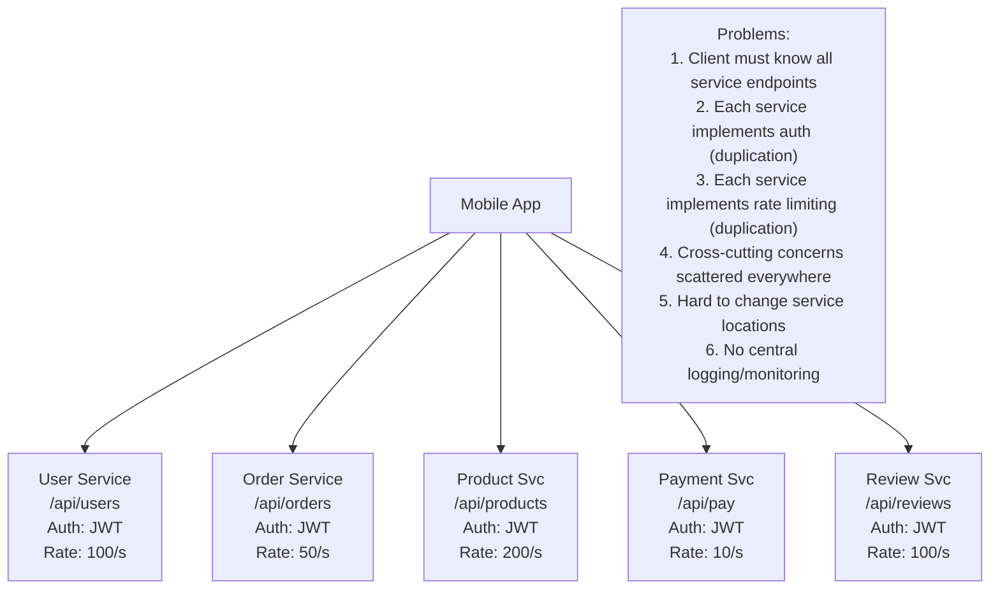
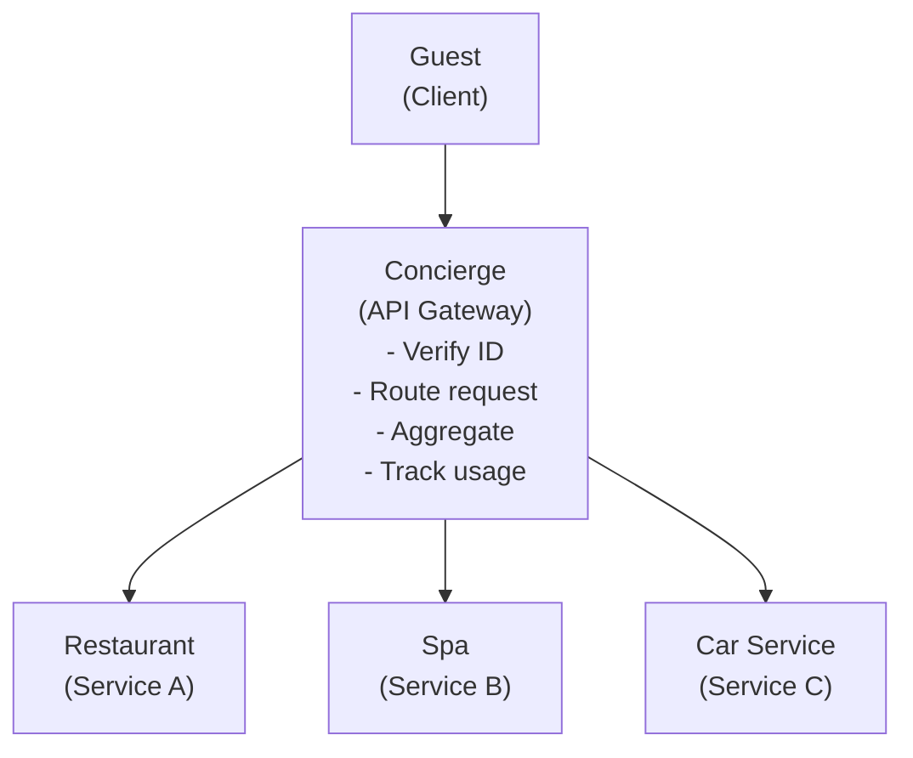
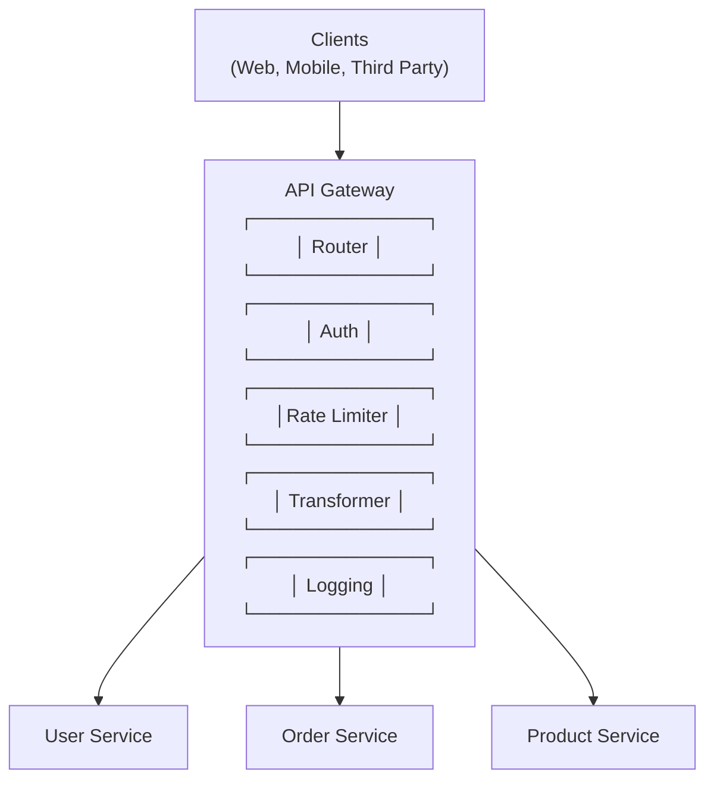
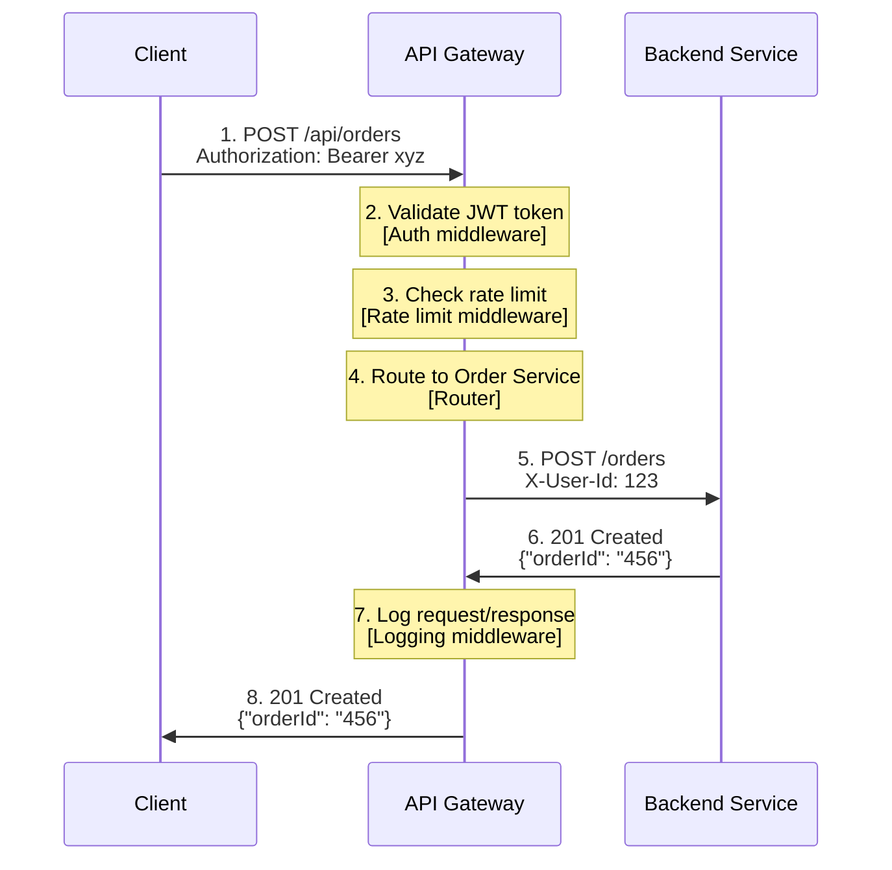

# 🚪 API Gateway: The Front Door to Your Microservices

## 0️⃣ Prerequisites

Before diving into API Gateways, you should understand:

- **Microservices Architecture**: Breaking applications into small, independent services. Each service handles one business capability. Services communicate over the network.

- **REST APIs**: The common pattern for exposing services over HTTP. Resources, methods (GET, POST, PUT, DELETE), JSON payloads.

- **Load Balancing**: Distributing traffic across multiple server instances. See `06-load-balancers.md`.

- **Reverse Proxy**: A server that sits in front of backend services. See `07-reverse-proxy-forward-proxy.md`.

- **Authentication vs Authorization**: Authentication = who are you? (identity). Authorization = what can you do? (permissions).

---

## 1️⃣ What Problem Does an API Gateway Exist to Solve?

### The Specific Pain Point

In a microservices architecture, you might have dozens or hundreds of services. Each service has its own:
- Endpoint
- Authentication logic
- Rate limiting
- Logging
- Protocol

**The Problem**: How do clients interact with all these services? Should they know about every service? Should every service implement authentication?

### What Systems Looked Like Before API Gateways



<details>
<summary>ASCII diagram (reference)</summary>

```text
┌─────────────────────────────────────────────────────────────────────────────┐
│                    DIRECT CLIENT-TO-SERVICE COMMUNICATION                    │
└─────────────────────────────────────────────────────────────────────────────┘

                              ┌─────────────────┐
                              │   Mobile App    │
                              └────────┬────────┘
                                       │
        ┌──────────────────────────────┼──────────────────────────────┐
        │              │               │               │              │
        ▼              ▼               ▼               ▼              ▼
┌─────────────┐ ┌─────────────┐ ┌─────────────┐ ┌─────────────┐ ┌─────────────┐
│User Service │ │Order Service│ │Product Svc  │ │Payment Svc  │ │Review Svc   │
│ /api/users  │ │ /api/orders │ │ /api/products│ │ /api/pay   │ │ /api/reviews│
│ Auth: JWT   │ │ Auth: JWT   │ │ Auth: JWT   │ │ Auth: JWT   │ │ Auth: JWT   │
│ Rate: 100/s │ │ Rate: 50/s  │ │ Rate: 200/s │ │ Rate: 10/s  │ │ Rate: 100/s │
└─────────────┘ └─────────────┘ └─────────────┘ └─────────────┘ └─────────────┘

Problems:
1. Client must know all service endpoints
2. Each service implements auth (duplication)
3. Each service implements rate limiting (duplication)
4. Cross-cutting concerns scattered everywhere
5. Hard to change service locations
6. No central logging/monitoring
```
</details>

### What Breaks Without an API Gateway

**Without API Gateway**:
- Clients tightly coupled to service locations
- Authentication logic duplicated in every service
- Rate limiting inconsistent across services
- No single point for monitoring/logging
- Difficult to implement cross-cutting concerns
- Protocol translation impossible (REST ↔ gRPC)
- API versioning nightmare

### Real Examples of the Problem

**Example 1: Netflix**
Netflix has 700+ microservices. Without Zuul (their API Gateway), mobile apps would need to know about and authenticate with hundreds of services.

**Example 2: Amazon**
Amazon's retail site calls dozens of services to render a single page. API Gateway (and BFF pattern) aggregates these calls, reducing client complexity.

**Example 3: Uber**
Uber's mobile app needs data from ride, driver, payment, and map services. API Gateway handles routing, authentication, and request aggregation.

---

## 2️⃣ Intuition and Mental Model

### The Hotel Concierge Analogy

Think of an API Gateway as a **hotel concierge**:

**Without Concierge (No API Gateway)**:
- Guest calls restaurant directly for dinner reservation
- Guest calls spa directly for appointment
- Guest calls car service directly for airport transfer
- Guest must know all phone numbers
- Each department verifies guest identity separately

**With Concierge (API Gateway)**:
- Guest tells concierge what they need
- Concierge knows all departments
- Concierge verifies guest identity once
- Concierge coordinates between departments
- Guest has single point of contact



<details>
<summary>ASCII diagram (reference)</summary>

```text
┌─────────────────────────────────────────────────────────────────────────────┐
│                    API GATEWAY AS CONCIERGE                                  │
└─────────────────────────────────────────────────────────────────────────────┘

                              ┌─────────────────┐
                              │     Guest       │
                              │   (Client)      │
                              └────────┬────────┘
                                       │
                              ┌────────▼────────┐
                              │    Concierge    │
                              │  (API Gateway)  │
                              │                 │
                              │ - Verify ID     │
                              │ - Route request │
                              │ - Aggregate     │
                              │ - Track usage   │
                              └────────┬────────┘
                                       │
        ┌──────────────────────────────┼──────────────────────────────┐
        │                              │                              │
        ▼                              ▼                              ▼
┌───────────────┐            ┌───────────────┐            ┌───────────────┐
│  Restaurant   │            │     Spa       │            │  Car Service  │
│  (Service A)  │            │  (Service B)  │            │  (Service C)  │
└───────────────┘            └───────────────┘            └───────────────┘
```
</details>

### The Key Insight

API Gateway is a **single entry point** that handles cross-cutting concerns:
1. **Routing**: Direct requests to appropriate services
2. **Authentication**: Verify identity once at the edge
3. **Authorization**: Check permissions before routing
4. **Rate Limiting**: Protect services from overload
5. **Transformation**: Convert protocols, aggregate responses
6. **Observability**: Centralized logging and metrics

---

## 3️⃣ How API Gateways Work Internally

### API Gateway Architecture



<details>
<summary>ASCII diagram (reference)</summary>

```text
┌─────────────────────────────────────────────────────────────────────────────┐
│                         API GATEWAY ARCHITECTURE                             │
└─────────────────────────────────────────────────────────────────────────────┘

                              ┌─────────────────┐
                              │     Clients     │
                              │ (Web, Mobile,   │
                              │  Third Party)   │
                              └────────┬────────┘
                                       │
                              ┌────────▼────────┐
                              │   API Gateway   │
                              │                 │
                              │ ┌─────────────┐ │
                              │ │   Router    │ │
                              │ └─────────────┘ │
                              │ ┌─────────────┐ │
                              │ │    Auth     │ │
                              │ └─────────────┘ │
                              │ ┌─────────────┐ │
                              │ │Rate Limiter │ │
                              │ └─────────────┘ │
                              │ ┌─────────────┐ │
                              │ │ Transformer │ │
                              │ └─────────────┘ │
                              │ ┌─────────────┐ │
                              │ │  Logging    │ │
                              │ └─────────────┘ │
                              └────────┬────────┘
                                       │
        ┌──────────────────────────────┼──────────────────────────────┐
        │                              │                              │
        ▼                              ▼                              ▼
┌───────────────┐            ┌───────────────┐            ┌───────────────┐
│ User Service  │            │ Order Service │            │Product Service│
└───────────────┘            └───────────────┘            └───────────────┘
```
</details>

### Request Flow Through API Gateway



<details>
<summary>ASCII diagram (reference)</summary>

```text
┌─────────────────────────────────────────────────────────────────────────────┐
│                    API GATEWAY REQUEST FLOW                                  │
└─────────────────────────────────────────────────────────────────────────────┘

Client                      API Gateway                        Backend Service
   │                             │                                   │
   │  1. POST /api/orders        │                                   │
   │  Authorization: Bearer xyz  │                                   │
   │  ─────────────────────────> │                                   │
   │                             │                                   │
   │                             │  2. Validate JWT token            │
   │                             │  [Auth middleware]                │
   │                             │                                   │
   │                             │  3. Check rate limit              │
   │                             │  [Rate limit middleware]          │
   │                             │                                   │
   │                             │  4. Route to Order Service        │
   │                             │  [Router]                         │
   │                             │                                   │
   │                             │  5. POST /orders                  │
   │                             │  X-User-Id: 123                   │
   │                             │  ─────────────────────────────────>
   │                             │                                   │
   │                             │  6. 201 Created                   │
   │                             │  {"orderId": "456"}               │
   │                             │  <─────────────────────────────────
   │                             │                                   │
   │                             │  7. Log request/response          │
   │                             │  [Logging middleware]             │
```
</details>
   │                             │                                   │
   │  8. 201 Created             │                                   │
   │  {"orderId": "456"}         │                                   │
   │  <───────────────────────── │                                   │
```

### Core API Gateway Functions

#### 1. Request Routing

```
┌─────────────────────────────────────────────────────────────────────────────┐
│                         REQUEST ROUTING                                      │
└─────────────────────────────────────────────────────────────────────────────┘

Route Configuration:
─────────────────────
/api/users/*     → user-service:8080
/api/orders/*    → order-service:8080
/api/products/*  → product-service:8080
/api/v2/*        → new-api-service:8080

Request: GET /api/users/123
         │
         ▼
    [Match /api/users/*]
         │
         ▼
    Forward to user-service:8080/users/123
```

#### 2. Authentication/Authorization

```
┌─────────────────────────────────────────────────────────────────────────────┐
│                    AUTHENTICATION FLOW                                       │
└─────────────────────────────────────────────────────────────────────────────┘

Client                      API Gateway                    Auth Service
   │                             │                              │
   │  Request + JWT Token        │                              │
   │  ─────────────────────────> │                              │
   │                             │                              │
   │                             │  Validate JWT signature      │
   │                             │  (local validation)          │
   │                             │                              │
   │                             │  OR: Introspect token        │
   │                             │  ─────────────────────────>  │
   │                             │  <─────────────────────────  │
   │                             │  {valid: true, user: {...}}  │
   │                             │                              │
   │                             │  Check permissions           │
   │                             │  (RBAC/ABAC)                 │
   │                             │                              │
   │                             │  Forward with user context   │
   │                             │  ─────────────────────────>  │
```

#### 3. Rate Limiting

```
┌─────────────────────────────────────────────────────────────────────────────┐
│                         RATE LIMITING                                        │
└─────────────────────────────────────────────────────────────────────────────┘

Rate Limit Configuration:
─────────────────────────
Global:     1000 req/sec
Per User:   100 req/min
Per IP:     50 req/min
Per Route:  /api/search → 10 req/min

Request from User 123:
         │
         ▼
    [Check user bucket: 45/100]
         │
         ▼
    [Under limit, allow]
         │
         ▼
    [Increment: 46/100]
         │
         ▼
    [Add headers: X-RateLimit-Remaining: 54]

Request from User 123 (at limit):
         │
         ▼
    [Check user bucket: 100/100]
         │
         ▼
    [Over limit, reject]
         │
         ▼
    429 Too Many Requests
    Retry-After: 30
```

#### 4. Request/Response Transformation

```
┌─────────────────────────────────────────────────────────────────────────────┐
│                    REQUEST TRANSFORMATION                                    │
└─────────────────────────────────────────────────────────────────────────────┘

Example: Mobile app sends simplified request, gateway enriches it

Mobile Request:
{
  "productId": "123",
  "quantity": 2
}

Gateway Transforms to:
{
  "productId": "123",
  "quantity": 2,
  "userId": "456",        ← Added from JWT
  "timestamp": "2024-...", ← Added by gateway
  "correlationId": "abc"   ← Added for tracing
}

─────────────────────────────────────────────────────────────────────────────

Example: Response aggregation

Backend Response 1 (User Service):
{"name": "Alice", "email": "alice@example.com"}

Backend Response 2 (Order Service):
{"orders": [{"id": 1}, {"id": 2}]}

Gateway Aggregates to:
{
  "user": {"name": "Alice", "email": "alice@example.com"},
  "orders": [{"id": 1}, {"id": 2}]
}
```

#### 5. Circuit Breaker Integration

```
┌─────────────────────────────────────────────────────────────────────────────┐
│                    CIRCUIT BREAKER                                           │
└─────────────────────────────────────────────────────────────────────────────┘

States:
─────────
CLOSED:      Normal operation, requests pass through
OPEN:        Service failing, requests rejected immediately
HALF-OPEN:   Testing if service recovered

Flow:
─────
Request → [Circuit CLOSED] → Backend → Response
Request → [Circuit CLOSED] → Backend → Error
Request → [Circuit CLOSED] → Backend → Error
Request → [Circuit CLOSED] → Backend → Error
[5 errors in 10 seconds, threshold reached]
Request → [Circuit OPEN] → 503 Service Unavailable (no backend call)
[After 30 seconds]
Request → [Circuit HALF-OPEN] → Backend → Response
[Success, circuit closes]
Request → [Circuit CLOSED] → Backend → Response
```

---

## 4️⃣ Simulation: E-Commerce API Gateway

Let's trace a complete user journey through an API Gateway.

### Scenario: User Places an Order

```
┌─────────────────────────────────────────────────────────────────────────────┐
│                    ORDER PLACEMENT FLOW                                      │
└─────────────────────────────────────────────────────────────────────────────┘

Mobile App                  API Gateway                    Microservices
    │                            │                              │
    │  1. POST /api/orders       │                              │
    │  {productId: "P123",       │                              │
    │   quantity: 2}             │                              │
    │  Authorization: Bearer xxx │                              │
    │  ──────────────────────────>                              │
    │                            │                              │
    │                            │  2. Validate JWT             │
    │                            │  Extract: userId=U456        │
    │                            │                              │
    │                            │  3. Check rate limit         │
    │                            │  User U456: 45/100 ✓         │
    │                            │                              │
    │                            │  4. Get product price        │
    │                            │  ─────────────────────────>  │ Product Svc
    │                            │  {price: 29.99}              │
    │                            │  <─────────────────────────  │
    │                            │                              │
    │                            │  5. Check inventory          │
    │                            │  ─────────────────────────>  │ Inventory Svc
    │                            │  {available: 50}             │
    │                            │  <─────────────────────────  │
    │                            │                              │
    │                            │  6. Create order             │
    │                            │  {userId: U456,              │
    │                            │   productId: P123,           │
    │                            │   quantity: 2,               │
    │                            │   total: 59.98}              │
    │                            │  ─────────────────────────>  │ Order Svc
    │                            │  {orderId: O789}             │
    │                            │  <─────────────────────────  │
    │                            │                              │
    │                            │  7. Log request              │
    │                            │  {method: POST,              │
    │                            │   path: /api/orders,         │
    │                            │   userId: U456,              │
    │                            │   latency: 150ms,            │
    │                            │   status: 201}               │
    │                            │                              │
    │  8. 201 Created            │                              │
    │  {orderId: "O789",         │                              │
    │   total: 59.98}            │                              │
    │  <──────────────────────────                              │
```

---

## 5️⃣ How Engineers Use API Gateways in Production

### Real-World Usage

**Netflix Zuul**
- Handles 50+ billion requests per day
- Provides dynamic routing, monitoring, security
- Filters for authentication, rate limiting, logging
- Reference: [Netflix Zuul](https://github.com/Netflix/zuul)

**Amazon API Gateway**
- Managed service for REST, HTTP, WebSocket APIs
- Integrates with Lambda, EC2, any HTTP endpoint
- Built-in throttling, caching, authorization

**Kong**
- Open-source, built on Nginx
- Plugin architecture (auth, rate limiting, logging)
- Used by Nasdaq, Honeywell, Cisco

### Common API Gateway Products

| Product | Type | Best For |
|---------|------|----------|
| **AWS API Gateway** | Managed | AWS users, serverless |
| **Kong** | Open Source | Flexibility, plugins |
| **Apigee** | Managed | Enterprise, analytics |
| **Azure API Management** | Managed | Azure users |
| **Nginx Plus** | Software | High performance |
| **Spring Cloud Gateway** | Framework | Java/Spring ecosystem |
| **Envoy** | Proxy | Service mesh, Kubernetes |

### Production Configuration Examples

**Spring Cloud Gateway**:

```java
// pom.xml
/*
<dependency>
    <groupId>org.springframework.cloud</groupId>
    <artifactId>spring-cloud-starter-gateway</artifactId>
</dependency>
<dependency>
    <groupId>org.springframework.cloud</groupId>
    <artifactId>spring-cloud-starter-circuitbreaker-reactor-resilience4j</artifactId>
</dependency>
*/

// application.yml
spring:
  cloud:
    gateway:
      routes:
        # User Service Route
        - id: user-service
          uri: lb://user-service
          predicates:
            - Path=/api/users/**
          filters:
            - StripPrefix=1
            - name: CircuitBreaker
              args:
                name: userServiceCB
                fallbackUri: forward:/fallback/users
            - name: RequestRateLimiter
              args:
                redis-rate-limiter.replenishRate: 10
                redis-rate-limiter.burstCapacity: 20
                key-resolver: "#{@userKeyResolver}"
        
        # Order Service Route
        - id: order-service
          uri: lb://order-service
          predicates:
            - Path=/api/orders/**
          filters:
            - StripPrefix=1
            - AddRequestHeader=X-Request-Source, gateway
            - name: Retry
              args:
                retries: 3
                statuses: BAD_GATEWAY
        
        # Product Service Route
        - id: product-service
          uri: lb://product-service
          predicates:
            - Path=/api/products/**
          filters:
            - StripPrefix=1
            - name: CircuitBreaker
              args:
                name: productServiceCB

      # Global filters
      default-filters:
        - name: RequestRateLimiter
          args:
            redis-rate-limiter.replenishRate: 100
            redis-rate-limiter.burstCapacity: 200
```

```java
// Custom Filters
@Component
public class AuthenticationFilter implements GlobalFilter, Ordered {
    
    @Autowired
    private JwtTokenProvider tokenProvider;
    
    @Override
    public Mono<Void> filter(ServerWebExchange exchange, GatewayFilterChain chain) {
        ServerHttpRequest request = exchange.getRequest();
        
        // Skip auth for public endpoints
        if (isPublicEndpoint(request.getPath().toString())) {
            return chain.filter(exchange);
        }
        
        // Extract and validate token
        String token = extractToken(request);
        if (token == null || !tokenProvider.validateToken(token)) {
            exchange.getResponse().setStatusCode(HttpStatus.UNAUTHORIZED);
            return exchange.getResponse().setComplete();
        }
        
        // Add user info to request headers
        String userId = tokenProvider.getUserId(token);
        ServerHttpRequest modifiedRequest = request.mutate()
            .header("X-User-Id", userId)
            .build();
        
        return chain.filter(exchange.mutate().request(modifiedRequest).build());
    }
    
    @Override
    public int getOrder() {
        return -100; // Run early in filter chain
    }
    
    private String extractToken(ServerHttpRequest request) {
        String bearerToken = request.getHeaders().getFirst("Authorization");
        if (bearerToken != null && bearerToken.startsWith("Bearer ")) {
            return bearerToken.substring(7);
        }
        return null;
    }
    
    private boolean isPublicEndpoint(String path) {
        return path.startsWith("/api/public") || 
               path.equals("/api/health") ||
               path.startsWith("/api/auth/login");
    }
}

// Rate Limiter Key Resolver
@Component
public class UserKeyResolver implements KeyResolver {
    
    @Override
    public Mono<String> resolve(ServerWebExchange exchange) {
        // Rate limit by user ID if authenticated, else by IP
        String userId = exchange.getRequest().getHeaders().getFirst("X-User-Id");
        if (userId != null) {
            return Mono.just("user:" + userId);
        }
        return Mono.just("ip:" + exchange.getRequest().getRemoteAddress().getHostString());
    }
}

// Circuit Breaker Configuration
@Configuration
public class CircuitBreakerConfig {
    
    @Bean
    public Customizer<ReactiveResilience4jCircuitBreakerFactory> defaultCustomizer() {
        return factory -> factory.configureDefault(id -> new Resilience4jConfigBuilder(id)
            .circuitBreakerConfig(CircuitBreakerConfig.custom()
                .failureRateThreshold(50)  // Open circuit if 50% requests fail
                .waitDurationInOpenState(Duration.ofSeconds(30))  // Wait 30s before retry
                .slidingWindowSize(10)  // Last 10 requests
                .minimumNumberOfCalls(5)  // Need 5 calls before opening
                .build())
            .timeLimiterConfig(TimeLimiterConfig.custom()
                .timeoutDuration(Duration.ofSeconds(5))  // 5s timeout
                .build())
            .build());
    }
}

// Retry Configuration with Exponential Backoff
@Component
public class RetryFilter implements GlobalFilter, Ordered {
    
    @Override
    public Mono<Void> filter(ServerWebExchange exchange, GatewayFilterChain chain) {
        return chain.filter(exchange)
            .retryWhen(Retry.backoff(3, Duration.ofSeconds(1))
                .filter(throwable -> throwable instanceof TimeoutException ||
                                    throwable instanceof ConnectException)
                .doBeforeRetry(retrySignal -> 
                    log.warn("Retrying request: {}", retrySignal.totalRetries()))
                .onRetryExhaustedThrow((retryBackoffSpec, retrySignal) -> {
                    log.error("Retries exhausted for request");
                    return new ServiceUnavailableException("Service temporarily unavailable");
                }));
    }
    
    @Override
    public int getOrder() {
        return -50;
    }
}

// Request/Response Logging Filter
@Component
public class LoggingFilter implements GlobalFilter, Ordered {
    
    private static final Logger log = LoggerFactory.getLogger(LoggingFilter.class);
    
    @Override
    public Mono<Void> filter(ServerWebExchange exchange, GatewayFilterChain chain) {
        ServerHttpRequest request = exchange.getRequest();
        long startTime = System.currentTimeMillis();
        
        // Log request
        log.info("Incoming request: {} {} from {}", 
            request.getMethod(), 
            request.getURI(), 
            request.getRemoteAddress());
        
        // Capture response
        ServerHttpResponseDecorator responseDecorator = new ServerHttpResponseDecorator(
            exchange.getResponse()) {
            @Override
            public Mono<Void> writeWith(org.reactivestreams.Publisher<? extends org.springframework.core.io.buffer.DataBuffer> body) {
                return super.writeWith(body).doFinally(signalType -> {
                    long duration = System.currentTimeMillis() - startTime;
                    log.info("Request completed: {} {} - Status: {} - Duration: {}ms",
                        request.getMethod(),
                        request.getURI(),
                        getStatusCode(),
                        duration);
                });
            }
        };
        
        return chain.filter(exchange.mutate().response(responseDecorator).build());
    }
    
    @Override
    public int getOrder() {
        return -200;
    }
}

// Request ID Propagation
@Component
public class RequestIdFilter implements GlobalFilter, Ordered {
    
    private static final String REQUEST_ID_HEADER = "X-Request-Id";
    
    @Override
    public Mono<Void> filter(ServerWebExchange exchange, GatewayFilterChain chain) {
        ServerHttpRequest request = exchange.getRequest();
        
        // Get or generate request ID
        String requestId = request.getHeaders().getFirst(REQUEST_ID_HEADER);
        if (requestId == null) {
            requestId = UUID.randomUUID().toString();
        }
        
        // Add to MDC for logging
        MDC.put("requestId", requestId);
        
        // Add to downstream requests
        ServerHttpRequest modifiedRequest = request.mutate()
            .header(REQUEST_ID_HEADER, requestId)
            .build();
        
        // Add to response
        exchange.getResponse().getHeaders().add(REQUEST_ID_HEADER, requestId);
        
        return chain.filter(exchange.mutate().request(modifiedRequest).build())
            .doFinally(signalType -> MDC.clear());
    }
    
    @Override
    public int getOrder() {
        return -150;
    }
}

// Health Check Aggregation
@RestController
@RequestMapping("/gateway")
public class GatewayHealthController {
    
    private final DiscoveryClient discoveryClient;
    private final RestTemplate restTemplate;
    
    @GetMapping("/health")
    public ResponseEntity<Map<String, Object>> health() {
        Map<String, Object> health = new HashMap<>();
        health.put("status", "UP");
        health.put("timestamp", Instant.now());
        
        // Check downstream services
        Map<String, String> services = new HashMap<>();
        List<String> serviceNames = discoveryClient.getServices();
        
        for (String serviceName : serviceNames) {
            try {
                List<ServiceInstance> instances = discoveryClient.getInstances(serviceName);
                long healthyCount = instances.stream()
                    .filter(this::isHealthy)
                    .count();
                services.put(serviceName, 
                    healthyCount + "/" + instances.size() + " healthy");
            } catch (Exception e) {
                services.put(serviceName, "ERROR: " + e.getMessage());
            }
        }
        
        health.put("services", services);
        return ResponseEntity.ok(health);
    }
    
    private boolean isHealthy(ServiceInstance instance) {
        try {
            String url = "http://" + instance.getHost() + ":" + 
                        instance.getPort() + "/actuator/health";
            ResponseEntity<String> response = restTemplate.getForEntity(url, String.class);
            return response.getStatusCode().is2xxSuccessful();
        } catch (Exception e) {
            return false;
        }
    }
}

// Fallback Controller
@RestController
@RequestMapping("/fallback")
public class FallbackController {
    
    @GetMapping("/users")
    public ResponseEntity<Map<String, String>> usersFallback() {
        return ResponseEntity.status(HttpStatus.SERVICE_UNAVAILABLE)
            .body(Map.of(
                "message", "User service is temporarily unavailable",
                "fallback", "true"
            ));
    }
}
```

**Kong Configuration**:

```yaml
# kong.yml (declarative configuration)
_format_version: "2.1"

services:
  - name: user-service
    url: http://user-service:8080
    routes:
      - name: user-route
        paths:
          - /api/users
        strip_path: true
    plugins:
      - name: rate-limiting
        config:
          minute: 100
          policy: redis
          redis_host: redis
      - name: jwt
        config:
          secret_is_base64: false
      - name: request-transformer
        config:
          add:
            headers:
              - X-Request-Source:gateway

  - name: order-service
    url: http://order-service:8080
    routes:
      - name: order-route
        paths:
          - /api/orders
        strip_path: true
    plugins:
      - name: rate-limiting
        config:
          minute: 50
      - name: circuit-breaker
        config:
          error_threshold: 5
          window_size: 10

consumers:
  - username: mobile-app
    jwt_secrets:
      - key: mobile-app-key
        secret: your-secret-key

plugins:
  - name: correlation-id
    config:
      header_name: X-Correlation-ID
      generator: uuid
  - name: prometheus
  - name: file-log
    config:
      path: /var/log/kong/access.log
```

**AWS API Gateway (Terraform)**:

```hcl
# API Gateway REST API
resource "aws_api_gateway_rest_api" "main" {
  name        = "main-api"
  description = "Main API Gateway"
  
  endpoint_configuration {
    types = ["REGIONAL"]
  }
}

# /users resource
resource "aws_api_gateway_resource" "users" {
  rest_api_id = aws_api_gateway_rest_api.main.id
  parent_id   = aws_api_gateway_rest_api.main.root_resource_id
  path_part   = "users"
}

# GET /users
resource "aws_api_gateway_method" "get_users" {
  rest_api_id   = aws_api_gateway_rest_api.main.id
  resource_id   = aws_api_gateway_resource.users.id
  http_method   = "GET"
  authorization = "COGNITO_USER_POOLS"
  authorizer_id = aws_api_gateway_authorizer.cognito.id
}

# Integration with backend
resource "aws_api_gateway_integration" "users_integration" {
  rest_api_id = aws_api_gateway_rest_api.main.id
  resource_id = aws_api_gateway_resource.users.id
  http_method = aws_api_gateway_method.get_users.http_method
  
  type                    = "HTTP_PROXY"
  integration_http_method = "GET"
  uri                     = "http://${var.backend_host}/users"
  
  request_parameters = {
    "integration.request.header.X-User-Id" = "context.authorizer.claims.sub"
  }
}

# Cognito Authorizer
resource "aws_api_gateway_authorizer" "cognito" {
  name          = "cognito-authorizer"
  rest_api_id   = aws_api_gateway_rest_api.main.id
  type          = "COGNITO_USER_POOLS"
  provider_arns = [aws_cognito_user_pool.main.arn]
}

# Usage Plan (Rate Limiting)
resource "aws_api_gateway_usage_plan" "standard" {
  name = "standard-plan"
  
  api_stages {
    api_id = aws_api_gateway_rest_api.main.id
    stage  = aws_api_gateway_stage.prod.stage_name
  }
  
  throttle_settings {
    burst_limit = 100
    rate_limit  = 50
  }
  
  quota_settings {
    limit  = 10000
    period = "DAY"
  }
}
```

---

## 6️⃣ API Gateway Patterns

### Backend for Frontend (BFF)

Different clients need different APIs. BFF creates specialized gateways.

```
┌─────────────────────────────────────────────────────────────────────────────┐
│                    BACKEND FOR FRONTEND (BFF)                                │
└─────────────────────────────────────────────────────────────────────────────┘

┌──────────────┐    ┌──────────────┐    ┌──────────────┐
│  Mobile App  │    │   Web App    │    │  Third Party │
└──────┬───────┘    └──────┬───────┘    └──────┬───────┘
       │                   │                   │
       ▼                   ▼                   ▼
┌──────────────┐    ┌──────────────┐    ┌──────────────┐
│ Mobile BFF   │    │   Web BFF    │    │  Public API  │
│              │    │              │    │   Gateway    │
│ - Optimized  │    │ - Full data  │    │ - Rate limits│
│   payloads   │    │ - Rich UI    │    │ - API keys   │
│ - Offline    │    │   support    │    │ - Versioning │
│   support    │    │              │    │              │
└──────┬───────┘    └──────┬───────┘    └──────┬───────┘
       │                   │                   │
       └───────────────────┼───────────────────┘
                           │
                           ▼
                  ┌─────────────────┐
                  │  Microservices  │
                  └─────────────────┘
```

### API Composition/Aggregation

Gateway combines multiple service calls into one response.

```
┌─────────────────────────────────────────────────────────────────────────────┐
│                    API COMPOSITION                                           │
└─────────────────────────────────────────────────────────────────────────────┘

Client Request: GET /api/dashboard

API Gateway:
    │
    ├──> User Service: GET /users/123
    │    Response: {name: "Alice", email: "..."}
    │
    ├──> Order Service: GET /orders?userId=123&limit=5
    │    Response: [{orderId: 1}, {orderId: 2}]
    │
    └──> Notification Service: GET /notifications?userId=123&unread=true
         Response: [{id: 1, message: "..."}]

Aggregated Response:
{
  "user": {name: "Alice", email: "..."},
  "recentOrders": [{orderId: 1}, {orderId: 2}],
  "notifications": [{id: 1, message: "..."}]
}
```

```java
// Spring Cloud Gateway with API Composition
@RestController
@RequestMapping("/api/dashboard")
public class DashboardController {
    
    @Autowired
    private WebClient.Builder webClientBuilder;
    
    @GetMapping
    public Mono<DashboardResponse> getDashboard(
            @RequestHeader("X-User-Id") String userId) {
        
        Mono<User> userMono = webClientBuilder.build()
            .get()
            .uri("http://user-service/users/{id}", userId)
            .retrieve()
            .bodyToMono(User.class);
        
        Mono<List<Order>> ordersMono = webClientBuilder.build()
            .get()
            .uri("http://order-service/orders?userId={id}&limit=5", userId)
            .retrieve()
            .bodyToFlux(Order.class)
            .collectList();
        
        Mono<List<Notification>> notificationsMono = webClientBuilder.build()
            .get()
            .uri("http://notification-service/notifications?userId={id}&unread=true", userId)
            .retrieve()
            .bodyToFlux(Notification.class)
            .collectList();
        
        // Combine all responses
        return Mono.zip(userMono, ordersMono, notificationsMono)
            .map(tuple -> new DashboardResponse(
                tuple.getT1(),
                tuple.getT2(),
                tuple.getT3()
            ));
    }
}
```

### API Versioning at Gateway

```
┌─────────────────────────────────────────────────────────────────────────────┐
│                    API VERSIONING STRATEGIES                                 │
└─────────────────────────────────────────────────────────────────────────────┘

1. URL Path Versioning:
   /api/v1/users → user-service-v1
   /api/v2/users → user-service-v2

2. Header Versioning:
   GET /api/users
   Accept-Version: v2
   → Route to v2 service

3. Query Parameter:
   /api/users?version=2
   → Route to v2 service

Gateway Configuration (Spring Cloud Gateway):
─────────────────────────────────────────────
routes:
  - id: users-v1
    uri: lb://user-service-v1
    predicates:
      - Path=/api/v1/users/**
      
  - id: users-v2
    uri: lb://user-service-v2
    predicates:
      - Path=/api/v2/users/**
      
  - id: users-header-version
    uri: lb://user-service-v2
    predicates:
      - Path=/api/users/**
      - Header=Accept-Version, v2
```

---

## 7️⃣ Tradeoffs, Pitfalls, and Common Mistakes

### Pitfall 1: API Gateway as Single Point of Failure

**Scenario**: Gateway goes down, entire system is inaccessible.

**Mistake**: Running single gateway instance.

**Solution**: 
- Multiple gateway instances behind load balancer
- Health checks and auto-scaling
- Regional redundancy

```
┌─────────────────────────────────────────────────────────────────────────────┐
│                    HA API GATEWAY                                            │
└─────────────────────────────────────────────────────────────────────────────┘

                         ┌─────────────────┐
                         │  Load Balancer  │
                         └────────┬────────┘
                                  │
            ┌─────────────────────┼─────────────────────┐
            │                     │                     │
            ▼                     ▼                     ▼
    ┌───────────────┐    ┌───────────────┐    ┌───────────────┐
    │  Gateway 1    │    │  Gateway 2    │    │  Gateway 3    │
    └───────────────┘    └───────────────┘    └───────────────┘
```

### Pitfall 2: Gateway Becoming a Bottleneck

**Scenario**: All traffic through gateway, gateway can't keep up.

**Mistake**: Not scaling gateway or doing too much in gateway.

**Solution**:
- Keep gateway logic simple (routing, auth, rate limiting)
- Move heavy processing to services
- Scale gateway horizontally
- Use async/non-blocking I/O

### Pitfall 3: Too Much Logic in Gateway

**Scenario**: Gateway becomes a monolith with business logic.

**Mistake**: Adding business rules, data transformation, orchestration to gateway.

**Solution**: Gateway should only handle cross-cutting concerns:
- ✅ Authentication/Authorization
- ✅ Rate limiting
- ✅ Logging/Monitoring
- ✅ Simple routing
- ❌ Business logic
- ❌ Complex data transformation
- ❌ Database access

### Pitfall 4: Not Handling Partial Failures

**Scenario**: One backend service fails, entire request fails.

**Mistake**: Not implementing circuit breakers or fallbacks.

**Solution**:
```java
// Circuit breaker with fallback
@GetMapping("/dashboard")
@CircuitBreaker(name = "dashboard", fallbackMethod = "dashboardFallback")
public DashboardResponse getDashboard() {
    // Normal flow
}

public DashboardResponse dashboardFallback(Exception e) {
    // Return cached or partial data
    return DashboardResponse.builder()
        .user(cachedUser)
        .orders(Collections.emptyList())  // Graceful degradation
        .error("Some features temporarily unavailable")
        .build();
}
```

### Pitfall 5: Ignoring Latency Added by Gateway

**Scenario**: Gateway adds 50ms to every request.

**Mistake**: Not optimizing gateway performance.

**Solution**:
- Use async/non-blocking I/O (Netty, WebFlux)
- Connection pooling to backends
- Minimize middleware chain
- Cache authentication tokens
- Monitor gateway latency percentiles

---

## 8️⃣ When NOT to Use API Gateway

### Scenarios Where API Gateway May Be Overkill

| Scenario | Why | Alternative |
|----------|-----|-------------|
| Monolithic application | No services to route | Direct access |
| Simple 2-3 services | Complexity not justified | Simple reverse proxy |
| Internal services only | No external clients | Service mesh |
| Very low traffic | Overhead not needed | Direct access |

### When Service Mesh is Better

For pure service-to-service communication within Kubernetes:
- **Service Mesh** (Istio, Linkerd): Sidecar proxies, no central gateway
- **API Gateway**: External client access, edge concerns

```
┌─────────────────────────────────────────────────────────────────────────────┐
│                    API GATEWAY vs SERVICE MESH                               │
└─────────────────────────────────────────────────────────────────────────────┘

External Traffic:
  Client → API Gateway → Services

Internal Traffic (Service Mesh):
  Service A → Sidecar → Sidecar → Service B
  (No central gateway for internal calls)
```

---

## 9️⃣ Comparison: API Gateway Products

| Feature | AWS API Gateway | Kong | Spring Cloud Gateway | Envoy |
|---------|-----------------|------|---------------------|-------|
| **Type** | Managed | Open Source | Framework | Proxy |
| **Protocol** | REST, WebSocket | REST, gRPC | REST, WebSocket | HTTP, gRPC, TCP |
| **Auth** | Cognito, Lambda | Plugins | Spring Security | External |
| **Rate Limiting** | Built-in | Plugin | Redis-based | External |
| **Best For** | AWS, Serverless | Flexibility | Java/Spring | Kubernetes |
| **Pricing** | Per request | Free/Enterprise | Free | Free |

---

## 🔟 Interview Follow-Up Questions

### L4 (Junior/Mid) Level Questions

**Q1: What is an API Gateway and why do we need it?**

**A**: An API Gateway is a single entry point for all client requests in a microservices architecture. It handles:
1. **Routing**: Directs requests to appropriate services
2. **Authentication**: Validates identity once at the edge
3. **Rate Limiting**: Protects services from overload
4. **Logging**: Centralized request/response logging

We need it because without it, clients would need to know about every service, and each service would duplicate cross-cutting concerns.

**Q2: What is the difference between API Gateway and Load Balancer?**

**A**: 
- **Load Balancer**: Distributes traffic across instances of the same service. Operates at L4 (TCP) or L7 (HTTP). Simple routing based on algorithms.
- **API Gateway**: Routes to different services based on path/headers. Adds authentication, rate limiting, transformation. Higher-level abstraction.

API Gateway often uses load balancers internally to distribute traffic to service instances.

**Q3: How does rate limiting work in an API Gateway?**

**A**: Rate limiting tracks request counts per client (user ID, API key, IP) within time windows. Common algorithms:
1. **Token Bucket**: Tokens added at fixed rate, request consumes token
2. **Sliding Window**: Count requests in rolling time window
3. **Fixed Window**: Count requests in fixed time periods

When limit exceeded, gateway returns 429 Too Many Requests with Retry-After header.

### L5 (Senior) Level Questions

**Q4: How would you design an API Gateway for a high-traffic e-commerce platform?**

**A**: 
1. **Architecture**:
   - Multiple gateway instances behind load balancer
   - Regional deployment for low latency
   - Separate gateways for web, mobile, third-party (BFF pattern)

2. **Features**:
   - JWT validation (cached public keys)
   - Redis-based rate limiting (distributed)
   - Circuit breakers for each backend service
   - Request/response logging to Kafka

3. **Performance**:
   - Non-blocking I/O (Netty/WebFlux)
   - Connection pooling to backends
   - Response caching for GET requests

4. **Resilience**:
   - Fallbacks for non-critical services
   - Graceful degradation
   - Health checks and auto-scaling

**Q5: How do you handle authentication in an API Gateway?**

**A**: Multiple approaches:

1. **JWT Validation** (Stateless):
   - Gateway validates JWT signature
   - Extracts claims (user ID, roles)
   - Forwards user context to services
   - No external call needed

2. **Token Introspection** (Stateful):
   - Gateway calls auth service to validate token
   - Auth service returns user info
   - More secure but adds latency

3. **OAuth2/OIDC**:
   - Gateway acts as resource server
   - Validates access tokens
   - Supports refresh token flow

Best practice: JWT for most cases, introspection for sensitive operations.

### L6 (Staff+) Level Questions

**Q6: Design the API Gateway architecture for a global, multi-tenant SaaS platform.**

**A**: 
1. **Multi-Region**:
   - Gateway deployed in each region
   - GeoDNS routes to nearest gateway
   - Cross-region failover

2. **Multi-Tenancy**:
   - Tenant identification from subdomain/header
   - Per-tenant rate limits and quotas
   - Tenant-specific routing rules
   - Data isolation at gateway level

3. **API Management**:
   - Developer portal for API documentation
   - API key management
   - Usage analytics per tenant
   - Versioning strategy (URL path)

4. **Security**:
   - mTLS between gateway and services
   - WAF integration for attack protection
   - API key rotation
   - Audit logging

5. **Scalability**:
   - Stateless gateways (shared Redis for rate limits)
   - Auto-scaling based on request rate
   - Connection pooling and keep-alive

**Q7: The API Gateway is adding 100ms latency to requests. How do you diagnose and optimize?**

**A**: 
1. **Diagnose**:
   - Distributed tracing (Jaeger/Zipkin) to find slow components
   - Profile gateway code for CPU hotspots
   - Check network latency to backends
   - Monitor connection pool utilization

2. **Common Causes**:
   - Synchronous auth calls (cache tokens)
   - DNS resolution (use IP or DNS caching)
   - TLS handshake (connection pooling)
   - Too many middleware (simplify chain)
   - Logging overhead (async logging)

3. **Optimizations**:
   - Cache JWT public keys locally
   - Use connection pooling (keep-alive)
   - Async logging (write to buffer, flush async)
   - Reduce middleware chain
   - Use non-blocking I/O throughout

4. **Measurement**:
   - p50, p95, p99 latency metrics
   - Breakdown by middleware component
   - Before/after comparison for each change

---

## 1️⃣1️⃣ Mental Summary

**API Gateway is the front door** to your microservices. It's the single entry point that handles routing, authentication, rate limiting, and other cross-cutting concerns.

**Core functions**: Route requests to services, authenticate users, enforce rate limits, transform requests/responses, log everything, protect with circuit breakers.

**Key patterns**: BFF (Backend for Frontend) for different clients, API composition for aggregating responses, versioning at gateway level.

**For production**: Run multiple instances behind load balancer, use non-blocking I/O, cache authentication, implement circuit breakers, keep gateway logic simple.

**For interviews**: Understand the difference from load balancer, know the core functions, be able to design for high availability and performance, understand when to use vs service mesh.

---

## 📚 Further Reading

- [AWS API Gateway Documentation](https://docs.aws.amazon.com/apigateway/)
- [Kong Documentation](https://docs.konghq.com/)
- [Spring Cloud Gateway](https://spring.io/projects/spring-cloud-gateway)
- [Netflix Zuul](https://github.com/Netflix/zuul)
- [Microservices Patterns - API Gateway](https://microservices.io/patterns/apigateway.html)
- [Building Microservices - Sam Newman](https://www.oreilly.com/library/view/building-microservices-2nd/9781492034018/)

