```mermaid
flowchart LR
    subgraph ClientFrame["WebSocket Frame (Client → Server)"]
        CF1["FIN=1, RSV=000, Opcode=0x1 (text)"]
        CF2["MASK=1 (client must mask)"]
        CF3["Payload Length=47"]
        CF4["Masking Key=0x12345678"]
        CF5["Payload (masked): [masked JSON bytes]"]
        CF1 --> CF2 --> CF3 --> CF4 --> CF5
    end
```

```mermaid
flowchart LR
    subgraph ServerFrame["WebSocket Frame (Server → Client)"]
        SF1["FIN=1, RSV=000, Opcode=0x1 (text)"]
        SF2["MASK=0 (server doesn't mask)"]
        SF3["Payload Length=52"]
        SF4["Payload: {'type':'message','from':'alice','text':'Hello!'}"]
        SF1 --> SF2 --> SF3 --> SF4
    end
```

# 🔌 WebSockets Deep Dive: Real-Time Bidirectional Communication

## 0️⃣ Prerequisites

Before diving deep into WebSockets, you should understand:

- **HTTP Protocol**: Request-response model, headers, status codes. WebSocket starts as HTTP before upgrading. See `03-http-evolution.md`.

- **TCP**: WebSocket runs over TCP. Persistent connections, reliable delivery. See `02-tcp-vs-udp.md`.

- **Long Polling vs SSE vs WebSocket basics**: High-level differences covered in `04-long-polling-websockets-sse.md`. This topic goes deeper into WebSocket specifically.

- **Stateful vs Stateless**: HTTP is stateless (each request independent). WebSocket is stateful (connection maintained with state).

---

## 1️⃣ What Problem Does WebSocket Solve?

### The Specific Pain Point

HTTP was designed for document retrieval: client asks, server responds. But modern applications need **real-time, bidirectional communication**:
- Chat applications: instant message delivery
- Gaming: real-time state synchronization
- Financial trading: live price updates
- Collaborative editing: instant sync between users

**The Problem**: HTTP requires the client to initiate every exchange. Server can't push data to client without a request. Workarounds (polling, long polling) are inefficient.

### What Systems Looked Like Before WebSocket


<details>
<summary>ASCII diagram (reference)</summary>

```text
┌─────────────────────────────────────────────────────────────────────────────┐
│                    POLLING FOR REAL-TIME UPDATES                             │
└─────────────────────────────────────────────────────────────────────────────┘

Chat Application with Polling:

Client A                     Server                      Client B
    │                           │                            │
    │  POST /send               │                            │
    │  {"to":"B","msg":"Hi"}    │                            │
    │  ─────────────────────────>                            │
    │                           │  [Store message]           │
    │  <───────────────────────── 200 OK                     │
    │                           │                            │
    │                           │                            │
    │                           │  GET /messages (polling)   │
    │                           │  <─────────────────────────│
    │                           │  200 OK []                 │
    │                           │  ─────────────────────────>│
    │                           │                            │
    │                           │  [5 seconds later...]      │
    │                           │                            │
    │                           │  GET /messages (polling)   │
    │                           │  <─────────────────────────│
    │                           │  200 OK [{"msg":"Hi"}]     │
    │                           │  ─────────────────────────>│
    │                           │                            │

Problems:
- 5 second delay before Client B sees message
- Constant polling wastes bandwidth
- Server load from empty responses
```
</details>

### What Breaks Without WebSocket

**Without WebSocket**:
- Real-time features feel laggy (polling delays)
- Server resources wasted on empty poll responses
- Mobile battery drain from constant polling
- Complex workarounds for bidirectional communication
- Scalability challenges with long polling

### Real Examples of the Problem

**Example 1: Slack**
Slack needs instant message delivery. With polling, messages would be delayed by the poll interval. WebSocket enables instant delivery.

**Example 2: Online Gaming**
Games like Fortnite need 60+ updates per second. HTTP polling would be impossibly slow and bandwidth-intensive.

**Example 3: Stock Trading**
Traders need real-time price updates. Even 1-second delay can mean significant losses. WebSocket enables sub-100ms updates.

---

## 2️⃣ Intuition and Mental Model

### The Phone Call vs Text Message Analogy

**HTTP** is like sending text messages:
- You send a message (request)
- You wait for a reply (response)
- To get updates, you keep asking "Any news?"
- One-sided: you always initiate

**WebSocket** is like a phone call:
- You dial once (handshake)
- Connection stays open
- Either side can talk anytime
- Conversation flows naturally
- Hang up when done (close)

```mermaid
flowchart TD
    subgraph HTTP["HTTP (Request-Response)"]
        H1["Client: 'Any messages?' ──────────> Server: 'No'"]
        H2["Client: 'Any messages?' ──────────> Server: 'No'"]
        H3["Client: 'Any messages?' ──────────> Server: 'Yes, here's one'"]
        H4["Client: 'Any messages?' ──────────> Server: 'No'"]
        H1 --> H2 --> H3 --> H4
        NoteH["(Client always asks, server only responds)"]
    end
    
    subgraph WS["WebSocket (Bidirectional)"]
        W1["Client: 'Let's connect' ══════════> Server: 'Connected'"]
        W2["Client: <══════════════════════════ Server: 'New message for you'"]
        W3["Client: 'Here's my reply' ════════> Server"]
        W4["Client: <══════════════════════════ Server: 'Another update'"]
        W1 --> W2 --> W3 --> W4
        NoteW["(Either side can send anytime)"]
    end
```



<details>
<summary>ASCII diagram (reference)</summary>

```text
┌─────────────────────────────────────────────────────────────────────────────┐
│                    HTTP vs WEBSOCKET                                         │
└─────────────────────────────────────────────────────────────────────────────┘

HTTP (Request-Response):
    Client: "Any messages?" ──────────> Server: "No"
    Client: "Any messages?" ──────────> Server: "No"
    Client: "Any messages?" ──────────> Server: "Yes, here's one"
    Client: "Any messages?" ──────────> Server: "No"
    (Client always asks, server only responds)

WebSocket (Bidirectional):
    Client: "Let's connect" ══════════> Server: "Connected"
    Client: <══════════════════════════ Server: "New message for you"
    Client: "Here's my reply" ════════> Server
    Client: <══════════════════════════ Server: "Another update"
    (Either side can send anytime)
```
</details>

### The Key Insight

WebSocket provides a **persistent, full-duplex connection** over a single TCP socket. After the initial HTTP handshake, the connection stays open and both sides can send data frames at any time.

---

## 3️⃣ How WebSocket Works Internally

### WebSocket Handshake

WebSocket starts as HTTP, then "upgrades" to WebSocket protocol.


<details>
<summary>ASCII diagram (reference)</summary>

```text
┌─────────────────────────────────────────────────────────────────────────────┐
│                    WEBSOCKET HANDSHAKE                                       │
└─────────────────────────────────────────────────────────────────────────────┘

Client                                                    Server
   │                                                         │
   │  HTTP Request (Upgrade Request):                        │
   │  GET /chat HTTP/1.1                                     │
   │  Host: server.example.com                               │
   │  Upgrade: websocket                                     │
   │  Connection: Upgrade                                    │
   │  Sec-WebSocket-Key: dGhlIHNhbXBsZSBub25jZQ==           │
   │  Sec-WebSocket-Version: 13                              │
   │  Sec-WebSocket-Protocol: chat, superchat                │
   │  ──────────────────────────────────────────────────────>│
   │                                                         │
   │  HTTP Response (Upgrade Response):                      │
   │  HTTP/1.1 101 Switching Protocols                       │
   │  Upgrade: websocket                                     │
   │  Connection: Upgrade                                    │
   │  Sec-WebSocket-Accept: s3pPLMBiTxaQ9kYGzzhZRbK+xOo=    │
   │  Sec-WebSocket-Protocol: chat                           │
   │  <──────────────────────────────────────────────────────│
   │                                                         │
   │  ═══════════════════════════════════════════════════════│
   │            WebSocket Connection Established             │
   │  ═══════════════════════════════════════════════════════│
```
</details>

**Key Headers**:
- `Upgrade: websocket`: Request to switch protocols
- `Sec-WebSocket-Key`: Random base64 string for handshake validation
- `Sec-WebSocket-Accept`: Server's proof it received the key (SHA-1 hash)
- `Sec-WebSocket-Protocol`: Subprotocol negotiation (optional)

**Sec-WebSocket-Accept Calculation**:
```
Sec-WebSocket-Accept = Base64(SHA1(Sec-WebSocket-Key + "258EAFA5-E914-47DA-95CA-C5AB0DC85B11"))
```

### WebSocket Frame Format

After handshake, data is sent in **frames** (not HTTP anymore).


<details>
<summary>ASCII diagram (reference)</summary>

```text
┌─────────────────────────────────────────────────────────────────────────────┐
│                    WEBSOCKET FRAME FORMAT                                    │
└─────────────────────────────────────────────────────────────────────────────┘

 0                   1                   2                   3
 0 1 2 3 4 5 6 7 8 9 0 1 2 3 4 5 6 7 8 9 0 1 2 3 4 5 6 7 8 9 0 1
+-+-+-+-+-------+-+-------------+-------------------------------+
|F|R|R|R| opcode|M| Payload len |    Extended payload length    |
|I|S|S|S|  (4)  |A|     (7)     |             (16/64)           |
|N|V|V|V|       |S|             |   (if payload len==126/127)   |
| |1|2|3|       |K|             |                               |
+-+-+-+-+-------+-+-------------+ - - - - - - - - - - - - - - - +
|     Extended payload length continued, if payload len == 127  |
+ - - - - - - - - - - - - - - - +-------------------------------+
|                               |Masking-key, if MASK set to 1  |
+-------------------------------+-------------------------------+
| Masking-key (continued)       |          Payload Data         |
+-------------------------------- - - - - - - - - - - - - - - - +
:                     Payload Data continued ...                :
+---------------------------------------------------------------+

Fields:
- FIN (1 bit): Is this the final fragment?
- RSV1-3 (3 bits): Reserved for extensions
- Opcode (4 bits): Frame type
- MASK (1 bit): Is payload masked? (client→server must be masked)
- Payload length (7 bits): 0-125 = actual length
                          126 = next 2 bytes are length
                          127 = next 8 bytes are length
- Masking key (4 bytes): XOR key for payload (if masked)
- Payload: The actual data

Opcodes:
- 0x0: Continuation frame
- 0x1: Text frame (UTF-8)
- 0x2: Binary frame
- 0x8: Connection close
- 0x9: Ping
- 0xA: Pong
```
</details>

### Frame Types


<details>
<summary>ASCII diagram (reference)</summary>

```text
┌─────────────────────────────────────────────────────────────────────────────┐
│                    WEBSOCKET FRAME TYPES                                     │
└─────────────────────────────────────────────────────────────────────────────┘

1. TEXT FRAME (opcode 0x1):
   - UTF-8 encoded text
   - Most common for JSON messages
   
2. BINARY FRAME (opcode 0x2):
   - Raw binary data
   - Used for files, images, protobuf
   
3. PING FRAME (opcode 0x9):
   - Heartbeat from either side
   - Receiver must respond with PONG
   
4. PONG FRAME (opcode 0xA):
   - Response to PING
   - Confirms connection is alive
   
5. CLOSE FRAME (opcode 0x8):
   - Initiates connection close
   - Contains status code and reason
   
6. CONTINUATION FRAME (opcode 0x0):
   - Continues a fragmented message
   - FIN=0 means more fragments coming
```
</details>

### Connection Lifecycle


<details>
<summary>ASCII diagram (reference)</summary>

```text
┌─────────────────────────────────────────────────────────────────────────────┐
│                    WEBSOCKET CONNECTION LIFECYCLE                            │
└─────────────────────────────────────────────────────────────────────────────┘

1. CONNECTING
   Client sends HTTP upgrade request
   
2. OPEN
   Server accepts, connection established
   Both sides can send/receive frames
   
3. CLOSING
   Either side sends CLOSE frame
   Other side responds with CLOSE frame
   
4. CLOSED
   TCP connection terminated

State Diagram:
─────────────────
              ┌─────────────┐
              │ CONNECTING  │
              └──────┬──────┘
                     │ (101 Switching Protocols)
                     ▼
              ┌─────────────┐
              │    OPEN     │◄────────────────┐
              └──────┬──────┘                 │
                     │                        │
              (CLOSE frame sent/received)     │ (data frames)
                     │                        │
                     ▼                        │
              ┌─────────────┐                 │
              │   CLOSING   │─────────────────┘
              └──────┬──────┘
                     │ (CLOSE frame acknowledged)
                     ▼
              ┌─────────────┐
              │   CLOSED    │
              └─────────────┘
```
</details>

### Heartbeat (Ping/Pong)

Connections can silently die (network issues, NAT timeouts). Heartbeats detect dead connections.


<details>
<summary>ASCII diagram (reference)</summary>

```text
┌─────────────────────────────────────────────────────────────────────────────┐
│                    WEBSOCKET HEARTBEAT                                       │
└─────────────────────────────────────────────────────────────────────────────┘

Client                                                    Server
   │                                                         │
   │  [Connection established]                               │
   │                                                         │
   │  ... 25 seconds of silence ...                          │
   │                                                         │
   │  PING frame ───────────────────────────────────────────>│
   │                                                         │
   │  <─────────────────────────────────────────── PONG frame│
   │  [Connection confirmed alive]                           │
   │                                                         │
   │  ... 25 seconds later ...                               │
   │                                                         │
   │  PING frame ───────────────────────────────────────────>│
   │                                                         │
   │  [No PONG received within timeout]                      │
   │                                                         │
   │  [Connection considered dead, close and reconnect]      │

Typical intervals:
- Ping every 25-30 seconds
- Pong timeout: 10 seconds
- If no pong, close connection and reconnect
```
</details>

---

## 4️⃣ Simulation: Building a Chat Application

Let's trace the complete flow of a chat message through WebSocket.

### Scenario: Alice sends "Hello!" to Bob

```mermaid
sequenceDiagram
    participant Alice as Alice's Browser
    participant Server
    participant Bob as Bob's Browser
    
    Note over Alice,Bob: [Already connected]
    Alice->>Server: TEXT Frame:<br/>{"type":"message",<br/>"to":"bob",<br/>"text":"Hello!"}
    Note over Server: [Parse message]<br/>[Find Bob's connection]
    Server->>Bob: TEXT Frame:<br/>{"type":"message",<br/>"from":"alice",<br/>"text":"Hello!"}
    Note over Bob: [Display message]
    Server->>Alice: TEXT Frame:<br/>{"type":"ack",<br/>"status":"delivered"}
    Note over Alice: [Show "delivered" ✓]
    
    Note over Alice,Bob: Timeline:<br/>- T=0ms: Alice sends message<br/>- T=1ms: Server receives<br/>- T=2ms: Server routes to Bob<br/>- T=3ms: Bob receives<br/>- T=4ms: Server sends ACK to Alice<br/><br/>Total: ~4ms (vs 5+ seconds with polling!)
```



<details>
<summary>ASCII diagram (reference)</summary>

```text
┌─────────────────────────────────────────────────────────────────────────────┐
│                    CHAT MESSAGE FLOW                                         │
└─────────────────────────────────────────────────────────────────────────────┘

Alice's Browser              Server                    Bob's Browser
      │                         │                            │
      │  [Already connected]    │    [Already connected]     │
      │                         │                            │
      │  TEXT Frame:            │                            │
      │  {"type":"message",     │                            │
      │   "to":"bob",           │                            │
      │   "text":"Hello!"}      │                            │
      │  ════════════════════════>                           │
      │                         │                            │
      │                         │  [Parse message]           │
      │                         │  [Find Bob's connection]   │
      │                         │                            │
      │                         │  TEXT Frame:               │
      │                         │  {"type":"message",        │
      │                         │   "from":"alice",          │
      │                         │   "text":"Hello!"}         │
      │                         │  ════════════════════════> │
      │                         │                            │
      │                         │                            │  [Display message]
      │                         │                            │
      │  TEXT Frame:            │                            │
      │  {"type":"ack",         │                            │
      │   "status":"delivered"} │                            │
      │  <════════════════════════                           │
      │                         │                            │
      │  [Show "delivered" ✓]   │                            │

Timeline:
- T=0ms:    Alice sends message
- T=1ms:    Server receives
- T=2ms:    Server routes to Bob
- T=3ms:    Bob receives
- T=4ms:    Server sends ACK to Alice

Total: ~4ms (vs 5+ seconds with polling!)
```
</details>

### Frame-Level Detail

```
Alice sends: {"type":"message","to":"bob","text":"Hello!"}



Server sends to Bob: {"type":"message","from":"alice","text":"Hello!"}



<details>
<summary>ASCII diagram (reference)</summary>

```text
Alice sends: {"type":"message","to":"bob","text":"Hello!"}

WebSocket Frame (Client → Server):
┌─────────────────────────────────────────────────────────────────────────────┐
│ FIN=1, RSV=000, Opcode=0x1 (text)                                           │
│ MASK=1 (client must mask)                                                   │
│ Payload Length=47                                                           │
│ Masking Key=0x12345678                                                      │
│ Payload (masked): [masked JSON bytes]                                       │
└─────────────────────────────────────────────────────────────────────────────┘

Server sends to Bob: {"type":"message","from":"alice","text":"Hello!"}

WebSocket Frame (Server → Client):
┌─────────────────────────────────────────────────────────────────────────────┐
│ FIN=1, RSV=000, Opcode=0x1 (text)                                           │
│ MASK=0 (server doesn't mask)                                                │
│ Payload Length=52                                                           │
│ Payload: {"type":"message","from":"alice","text":"Hello!"}                  │
└─────────────────────────────────────────────────────────────────────────────┘
```
</details>
```

---

## 5️⃣ How Engineers Use WebSocket in Production

### Real-World Usage

**Slack**
- WebSocket for real-time messaging
- Fallback to long polling when WebSocket blocked
- Millions of concurrent connections
- Reference: [Slack Engineering](https://slack.engineering/)

**Discord**
- WebSocket for voice, video, and text
- Custom protocol over WebSocket
- Handles millions of concurrent users
- Reference: [Discord Engineering](https://discord.com/blog)

**Coinbase**
- WebSocket for real-time price feeds
- Handles millions of price updates per second
- Critical for trading applications

### Common WebSocket Libraries

| Library | Language | Features |
|---------|----------|----------|
| **Socket.IO** | JavaScript | Fallbacks, rooms, namespaces |
| **ws** | Node.js | Lightweight, fast |
| **Spring WebSocket** | Java | Spring integration, STOMP |
| **Gorilla WebSocket** | Go | High performance |
| **websockets** | Python | asyncio support |

### Production Architecture


<details>
<summary>ASCII diagram (reference)</summary>

```text
┌─────────────────────────────────────────────────────────────────────────────┐
│                    WEBSOCKET PRODUCTION ARCHITECTURE                         │
└─────────────────────────────────────────────────────────────────────────────┘

                         ┌─────────────────┐
                         │  Load Balancer  │
                         │  (L7, Sticky)   │
                         └────────┬────────┘
                                  │
            ┌─────────────────────┼─────────────────────┐
            │                     │                     │
            ▼                     ▼                     ▼
    ┌───────────────┐    ┌───────────────┐    ┌───────────────┐
    │  WS Server 1  │    │  WS Server 2  │    │  WS Server 3  │
    │  (50K conns)  │    │  (50K conns)  │    │  (50K conns)  │
    └───────┬───────┘    └───────┬───────┘    └───────┬───────┘
            │                     │                     │
            └─────────────────────┼─────────────────────┘
                                  │
                         ┌────────▼────────┐
                         │  Redis Pub/Sub  │
                         │  (Message Bus)  │
                         └────────┬────────┘
                                  │
                    ┌─────────────┼─────────────┐
                    │             │             │
                    ▼             ▼             ▼
            ┌───────────┐ ┌───────────┐ ┌───────────┐
            │ Database  │ │  Cache    │ │  Queue    │
            └───────────┘ └───────────┘ └───────────┘

Key Components:
1. Load Balancer: Sticky sessions (same user → same server)
2. WS Servers: Handle connections, stateful
3. Redis Pub/Sub: Cross-server message routing
4. Database: Persist messages, user data
```
</details>

---

## 6️⃣ Complete Implementation in Java

### Spring WebSocket Server

```java
// pom.xml dependencies
/*
<dependency>
    <groupId>org.springframework.boot</groupId>
    <artifactId>spring-boot-starter-websocket</artifactId>
</dependency>
<dependency>
    <groupId>org.springframework.boot</groupId>
    <artifactId>spring-boot-starter-data-redis</artifactId>
</dependency>
*/

// WebSocket Configuration
@Configuration
@EnableWebSocket
public class WebSocketConfig implements WebSocketConfigurer {
    
    @Autowired
    private ChatWebSocketHandler chatHandler;
    
    @Autowired
    private AuthHandshakeInterceptor authInterceptor;
    
    @Override
    public void registerWebSocketHandlers(WebSocketHandlerRegistry registry) {
        registry.addHandler(chatHandler, "/ws/chat")
            .addInterceptors(authInterceptor)
            .setAllowedOrigins("*");
    }
}

// Authentication Interceptor
@Component
public class AuthHandshakeInterceptor implements HandshakeInterceptor {
    
    @Autowired
    private JwtTokenProvider tokenProvider;
    
    @Override
    public boolean beforeHandshake(ServerHttpRequest request, 
                                   ServerHttpResponse response,
                                   WebSocketHandler wsHandler, 
                                   Map<String, Object> attributes) {
        // Extract token from query parameter or header
        String token = extractToken(request);
        
        if (token == null || !tokenProvider.validateToken(token)) {
            return false; // Reject connection
        }
        
        // Store user info in session attributes
        String userId = tokenProvider.getUserId(token);
        attributes.put("userId", userId);
        
        return true;
    }
    
    @Override
    public void afterHandshake(ServerHttpRequest request, 
                               ServerHttpResponse response,
                               WebSocketHandler wsHandler, 
                               Exception exception) {
        // Post-handshake logic if needed
    }
    
    private String extractToken(ServerHttpRequest request) {
        // Try query parameter first
        String query = request.getURI().getQuery();
        if (query != null && query.contains("token=")) {
            return query.split("token=")[1].split("&")[0];
        }
        
        // Try header
        List<String> authHeaders = request.getHeaders().get("Authorization");
        if (authHeaders != null && !authHeaders.isEmpty()) {
            String bearer = authHeaders.get(0);
            if (bearer.startsWith("Bearer ")) {
                return bearer.substring(7);
            }
        }
        
        return null;
    }
}

// WebSocket Handler
@Component
public class ChatWebSocketHandler extends TextWebSocketHandler {
    
    private static final Logger log = LoggerFactory.getLogger(ChatWebSocketHandler.class);
    
    // User ID → WebSocket Session mapping
    private final ConcurrentHashMap<String, WebSocketSession> sessions = 
        new ConcurrentHashMap<>();
    
    // Session ID → User ID mapping (for cleanup)
    private final ConcurrentHashMap<String, String> sessionToUser = 
        new ConcurrentHashMap<>();
    
    @Autowired
    private RedisTemplate<String, String> redisTemplate;
    
    @Autowired
    private ObjectMapper objectMapper;
    
    @Override
    public void afterConnectionEstablished(WebSocketSession session) {
        String userId = (String) session.getAttributes().get("userId");
        
        // Store session
        sessions.put(userId, session);
        sessionToUser.put(session.getId(), userId);
        
        // Subscribe to Redis channel for this user
        subscribeToUserChannel(userId);
        
        log.info("WebSocket connected: userId={}, sessionId={}", userId, session.getId());
        
        // Send connection acknowledgment
        sendMessage(session, new ConnectionAck(userId, "connected"));
    }
    
    @Override
    protected void handleTextMessage(WebSocketSession session, TextMessage message) {
        String userId = sessionToUser.get(session.getId());
        
        try {
            ChatMessage chatMessage = objectMapper.readValue(
                message.getPayload(), 
                ChatMessage.class
            );
            
            chatMessage.setFrom(userId);
            chatMessage.setTimestamp(System.currentTimeMillis());
            
            handleChatMessage(chatMessage);
            
        } catch (Exception e) {
            log.error("Error processing message", e);
            sendError(session, "Invalid message format");
        }
    }
    
    private void handleChatMessage(ChatMessage message) {
        String targetUserId = message.getTo();
        
        // Check if target user is on this server
        WebSocketSession targetSession = sessions.get(targetUserId);
        
        if (targetSession != null && targetSession.isOpen()) {
            // User is on this server, send directly
            sendMessage(targetSession, message);
        } else {
            // User might be on another server, publish to Redis
            publishToRedis(targetUserId, message);
        }
        
        // Send delivery acknowledgment to sender
        WebSocketSession senderSession = sessions.get(message.getFrom());
        if (senderSession != null) {
            sendMessage(senderSession, new DeliveryAck(message.getId(), "sent"));
        }
    }
    
    private void publishToRedis(String targetUserId, ChatMessage message) {
        try {
            String channel = "user:" + targetUserId;
            String payload = objectMapper.writeValueAsString(message);
            redisTemplate.convertAndSend(channel, payload);
        } catch (Exception e) {
            log.error("Error publishing to Redis", e);
        }
    }
    
    private void subscribeToUserChannel(String userId) {
        // This would typically be done with a Redis message listener
        // Simplified here for clarity
    }
    
    @Override
    public void afterConnectionClosed(WebSocketSession session, CloseStatus status) {
        String userId = sessionToUser.remove(session.getId());
        if (userId != null) {
            sessions.remove(userId);
            log.info("WebSocket disconnected: userId={}, status={}", userId, status);
        }
    }
    
    @Override
    public void handleTransportError(WebSocketSession session, Throwable exception) {
        log.error("WebSocket transport error: sessionId={}", session.getId(), exception);
        
        try {
            session.close(CloseStatus.SERVER_ERROR);
        } catch (IOException e) {
            log.error("Error closing session", e);
        }
    }
    
    private void sendMessage(WebSocketSession session, Object message) {
        try {
            String json = objectMapper.writeValueAsString(message);
            session.sendMessage(new TextMessage(json));
        } catch (Exception e) {
            log.error("Error sending message", e);
        }
    }
    
    private void sendError(WebSocketSession session, String error) {
        sendMessage(session, Map.of("type", "error", "message", error));
    }
    
    // Called by Redis subscriber when message arrives for a user on this server
    public void onRedisMessage(String userId, String payload) {
        WebSocketSession session = sessions.get(userId);
        if (session != null && session.isOpen()) {
            try {
                session.sendMessage(new TextMessage(payload));
            } catch (IOException e) {
                log.error("Error forwarding Redis message", e);
            }
        }
    }
}

// Message DTOs
@Data
@NoArgsConstructor
@AllArgsConstructor
public class ChatMessage {
    private String id;
    private String type = "message";
    private String from;
    private String to;
    private String text;
    private long timestamp;
}

@Data
@AllArgsConstructor
public class ConnectionAck {
    private String userId;
    private String status;
}

@Data
@AllArgsConstructor
public class DeliveryAck {
    private String messageId;
    private String status;
}
```

### Heartbeat Implementation

```java
@Component
public class WebSocketHeartbeat {
    
    private static final Logger log = LoggerFactory.getLogger(WebSocketHeartbeat.class);
    
    @Autowired
    private ChatWebSocketHandler chatHandler;
    
    private final ScheduledExecutorService scheduler = 
        Executors.newSingleThreadScheduledExecutor();
    
    @PostConstruct
    public void startHeartbeat() {
        scheduler.scheduleAtFixedRate(
            this::sendHeartbeats,
            30, // Initial delay
            30, // Period
            TimeUnit.SECONDS
        );
    }
    
    private void sendHeartbeats() {
        chatHandler.getSessions().forEach((userId, session) -> {
            if (session.isOpen()) {
                try {
                    // Send ping frame
                    session.sendMessage(new PingMessage(ByteBuffer.wrap("ping".getBytes())));
                } catch (IOException e) {
                    log.warn("Failed to send heartbeat to user: {}", userId);
                    // Connection might be dead, close it
                    try {
                        session.close(CloseStatus.GOING_AWAY);
                    } catch (IOException ex) {
                        // Ignore
                    }
                }
            }
        });
    }
    
    @PreDestroy
    public void shutdown() {
        scheduler.shutdown();
    }
}
```

### Redis Pub/Sub for Cross-Server Messaging

```java
@Configuration
public class RedisConfig {
    
    @Bean
    public RedisMessageListenerContainer redisMessageListenerContainer(
            RedisConnectionFactory connectionFactory,
            MessageListenerAdapter listenerAdapter) {
        
        RedisMessageListenerContainer container = new RedisMessageListenerContainer();
        container.setConnectionFactory(connectionFactory);
        
        // Subscribe to user channels dynamically
        // In practice, you'd subscribe when users connect
        container.addMessageListener(listenerAdapter, new PatternTopic("user:*"));
        
        return container;
    }
    
    @Bean
    public MessageListenerAdapter listenerAdapter(RedisMessageSubscriber subscriber) {
        return new MessageListenerAdapter(subscriber, "onMessage");
    }
}

@Component
public class RedisMessageSubscriber {
    
    @Autowired
    private ChatWebSocketHandler chatHandler;
    
    public void onMessage(String message, String channel) {
        // channel format: "user:userId"
        String userId = channel.split(":")[1];
        chatHandler.onRedisMessage(userId, message);
    }
}
```

### JavaScript Client

```javascript
class ChatClient {
    constructor(serverUrl, token) {
        this.serverUrl = serverUrl;
        this.token = token;
        this.socket = null;
        this.reconnectAttempts = 0;
        this.maxReconnectAttempts = 5;
        this.reconnectDelay = 1000;
        this.messageHandlers = new Map();
        this.pendingMessages = [];
    }
    
    connect() {
        return new Promise((resolve, reject) => {
            const url = `${this.serverUrl}?token=${this.token}`;
            this.socket = new WebSocket(url);
            
            this.socket.onopen = () => {
                console.log('WebSocket connected');
                this.reconnectAttempts = 0;
                this.flushPendingMessages();
                resolve();
            };
            
            this.socket.onmessage = (event) => {
                this.handleMessage(JSON.parse(event.data));
            };
            
            this.socket.onclose = (event) => {
                console.log('WebSocket closed:', event.code, event.reason);
                this.handleDisconnect();
            };
            
            this.socket.onerror = (error) => {
                console.error('WebSocket error:', error);
                reject(error);
            };
        });
    }
    
    handleMessage(message) {
        const handler = this.messageHandlers.get(message.type);
        if (handler) {
            handler(message);
        } else {
            console.log('Unhandled message type:', message.type);
        }
    }
    
    on(type, handler) {
        this.messageHandlers.set(type, handler);
    }
    
    send(message) {
        if (this.socket && this.socket.readyState === WebSocket.OPEN) {
            this.socket.send(JSON.stringify(message));
        } else {
            // Queue message for when connection is restored
            this.pendingMessages.push(message);
        }
    }
    
    sendMessage(to, text) {
        const message = {
            id: this.generateId(),
            type: 'message',
            to: to,
            text: text,
            timestamp: Date.now()
        };
        this.send(message);
        return message.id;
    }
    
    handleDisconnect() {
        if (this.reconnectAttempts < this.maxReconnectAttempts) {
            this.reconnectAttempts++;
            const delay = this.reconnectDelay * Math.pow(2, this.reconnectAttempts - 1);
            console.log(`Reconnecting in ${delay}ms (attempt ${this.reconnectAttempts})`);
            
            setTimeout(() => {
                this.connect().catch(() => {
                    // Will trigger another reconnect attempt
                });
            }, delay);
        } else {
            console.error('Max reconnect attempts reached');
            this.messageHandlers.get('disconnected')?.();
        }
    }
    
    flushPendingMessages() {
        while (this.pendingMessages.length > 0) {
            const message = this.pendingMessages.shift();
            this.send(message);
        }
    }
    
    generateId() {
        return Math.random().toString(36).substr(2, 9);
    }
    
    close() {
        if (this.socket) {
            this.socket.close(1000, 'Client closing');
        }
    }
}

// Usage
const chat = new ChatClient('wss://api.example.com/ws/chat', 'jwt-token-here');

chat.on('message', (msg) => {
    console.log(`${msg.from}: ${msg.text}`);
    displayMessage(msg);
});

chat.on('ack', (ack) => {
    console.log(`Message ${ack.messageId} ${ack.status}`);
    updateMessageStatus(ack.messageId, ack.status);
});

chat.on('error', (error) => {
    console.error('Server error:', error.message);
});

await chat.connect();
chat.sendMessage('bob', 'Hello!');
```

---

## 7️⃣ Scaling WebSocket Connections

### The Scaling Challenge

WebSocket is stateful. Each connection is tied to a specific server. This creates challenges:

1. **Memory**: Each connection uses memory (~10-50KB)
2. **File Descriptors**: OS limits open connections
3. **Routing**: How to reach a user on another server?

### Scaling Strategies

#### 1. Vertical Scaling (Bigger Servers)

```
Single Server Limits:
- 10K connections (default Linux)
- 100K connections (tuned Linux)
- 1M connections (highly optimized, C10M problem)

Tuning:
- Increase file descriptor limits
- Tune TCP buffer sizes
- Use efficient event loops (epoll, kqueue)
```

```bash
# Linux tuning for high connection counts
# /etc/sysctl.conf

# Increase file descriptor limits
fs.file-max = 2097152

# Increase TCP buffer sizes
net.core.rmem_max = 16777216
net.core.wmem_max = 16777216

# Increase connection tracking
net.netfilter.nf_conntrack_max = 1048576

# Reduce TIME_WAIT
net.ipv4.tcp_tw_reuse = 1
net.ipv4.tcp_fin_timeout = 15
```

#### 2. Horizontal Scaling (More Servers)


<details>
<summary>ASCII diagram (reference)</summary>

```text
┌─────────────────────────────────────────────────────────────────────────────┐
│                    HORIZONTAL WEBSOCKET SCALING                              │
└─────────────────────────────────────────────────────────────────────────────┘

                         ┌─────────────────┐
                         │  Load Balancer  │
                         │  (Sticky)       │
                         └────────┬────────┘
                                  │
        ┌─────────────────────────┼─────────────────────────┐
        │                         │                         │
        ▼                         ▼                         ▼
┌───────────────┐        ┌───────────────┐        ┌───────────────┐
│  WS Server 1  │        │  WS Server 2  │        │  WS Server 3  │
│  Users: A,B,C │        │  Users: D,E,F │        │  Users: G,H,I │
└───────┬───────┘        └───────┬───────┘        └───────┬───────┘
        │                         │                         │
        └─────────────────────────┼─────────────────────────┘
                                  │
                         ┌────────▼────────┐
                         │  Redis Pub/Sub  │
                         └─────────────────┘

Message from A to D:
1. A sends to WS Server 1
2. Server 1 doesn't have D's connection
3. Server 1 publishes to Redis channel "user:D"
4. Server 2 receives from Redis
5. Server 2 sends to D's WebSocket
```
</details>

#### 3. Consistent Hashing for Routing

```java
// Consistent hashing to route users to servers
public class WebSocketRouter {
    
    private final ConsistentHash<String> consistentHash;
    
    public WebSocketRouter(List<String> serverIds) {
        this.consistentHash = new ConsistentHash<>(
            serverIds,
            150  // Virtual nodes per server
        );
    }
    
    public String getServerForUser(String userId) {
        return consistentHash.get(userId);
    }
    
    public void addServer(String serverId) {
        consistentHash.add(serverId);
    }
    
    public void removeServer(String serverId) {
        consistentHash.remove(serverId);
    }
}
```

---

## 8️⃣ WebSocket vs Socket.IO

### Socket.IO Overview

Socket.IO is a library that provides WebSocket-like functionality with additional features.


<details>
<summary>ASCII diagram (reference)</summary>

```text
┌─────────────────────────────────────────────────────────────────────────────┐
│                    WEBSOCKET vs SOCKET.IO                                    │
└─────────────────────────────────────────────────────────────────────────────┘

WebSocket:
- Raw protocol
- Binary and text frames
- No automatic reconnection
- No fallbacks
- Lightweight

Socket.IO:
- Library on top of WebSocket
- Automatic reconnection
- Fallback transports (polling)
- Rooms and namespaces
- Acknowledgments built-in
- Heavier (more features)
```
</details>

### Socket.IO Features

```javascript
// Socket.IO Server (Node.js)
const io = require('socket.io')(server);

// Namespaces (separate channels)
const chatNamespace = io.of('/chat');
const notificationNamespace = io.of('/notifications');

chatNamespace.on('connection', (socket) => {
    // Rooms (groups of sockets)
    socket.join('room-123');
    
    // Broadcast to room
    socket.to('room-123').emit('message', { text: 'Hello room!' });
    
    // Acknowledgments
    socket.emit('message', { text: 'Hello' }, (ack) => {
        console.log('Client acknowledged:', ack);
    });
});

// Socket.IO Client
const socket = io('/chat', {
    reconnection: true,
    reconnectionAttempts: 5,
    reconnectionDelay: 1000,
    transports: ['websocket', 'polling']  // Fallback
});

socket.on('connect', () => {
    console.log('Connected');
});

socket.emit('message', { text: 'Hello' }, (ack) => {
    console.log('Server acknowledged:', ack);
});
```

### When to Use Which

| Use Case | WebSocket | Socket.IO |
|----------|-----------|-----------|
| Simple real-time | ✓ | ✓ |
| Need fallbacks | ✗ | ✓ |
| Rooms/namespaces | Implement yourself | ✓ Built-in |
| Binary data | ✓ Native | ✓ |
| Minimal overhead | ✓ | ✗ |
| Browser support | Modern only | All (with fallback) |
| Mobile apps | ✓ | ✓ |

---

## 9️⃣ Tradeoffs, Pitfalls, and Common Mistakes

### Pitfall 1: Not Implementing Reconnection

**Scenario**: Connection drops, user sees stale data forever.

**Mistake**: Assuming connection stays open.

**Solution**: Implement robust reconnection with exponential backoff.

```javascript
class ReconnectingWebSocket {
    constructor(url) {
        this.url = url;
        this.reconnectDelay = 1000;
        this.maxDelay = 30000;
        this.connect();
    }
    
    connect() {
        this.ws = new WebSocket(this.url);
        
        this.ws.onclose = () => {
            setTimeout(() => {
                this.reconnectDelay = Math.min(
                    this.reconnectDelay * 2, 
                    this.maxDelay
                );
                this.connect();
            }, this.reconnectDelay);
        };
        
        this.ws.onopen = () => {
            this.reconnectDelay = 1000; // Reset on success
        };
    }
}
```

### Pitfall 2: Not Handling Message Ordering

**Scenario**: Messages arrive out of order.

**Mistake**: Assuming messages arrive in send order.

**Solution**: Add sequence numbers and reorder on client.

```java
@Data
public class OrderedMessage {
    private long sequenceNumber;
    private String content;
}

// Client-side reordering
class MessageBuffer {
    private long expectedSequence = 0;
    private TreeMap<Long, Message> buffer = new TreeMap<>();
    
    void receive(OrderedMessage message) {
        if (message.getSequenceNumber() == expectedSequence) {
            // In order, process immediately
            process(message);
            expectedSequence++;
            
            // Process any buffered messages that are now in order
            while (buffer.containsKey(expectedSequence)) {
                process(buffer.remove(expectedSequence));
                expectedSequence++;
            }
        } else {
            // Out of order, buffer it
            buffer.put(message.getSequenceNumber(), message);
        }
    }
}
```

### Pitfall 3: Memory Leaks from Unclosed Connections

**Scenario**: Server memory grows over time.

**Mistake**: Not cleaning up dead connections.

**Solution**: Heartbeats + cleanup on disconnect.

```java
@Override
public void afterConnectionClosed(WebSocketSession session, CloseStatus status) {
    // Always clean up
    String userId = sessionToUser.remove(session.getId());
    if (userId != null) {
        sessions.remove(userId);
        // Clean up any other resources
        cleanupUserState(userId);
    }
}

// Periodic cleanup of zombie connections
@Scheduled(fixedRate = 60000)
public void cleanupDeadConnections() {
    sessions.entrySet().removeIf(entry -> {
        WebSocketSession session = entry.getValue();
        if (!session.isOpen()) {
            cleanupUserState(entry.getKey());
            return true;
        }
        return false;
    });
}
```

### Pitfall 4: Blocking the WebSocket Thread

**Scenario**: One slow operation blocks all WebSocket messages.

**Mistake**: Doing heavy work in message handler.

**Solution**: Offload to worker threads.

```java
@Override
protected void handleTextMessage(WebSocketSession session, TextMessage message) {
    // DON'T do this - blocks WebSocket thread
    // heavyDatabaseOperation(message);
    
    // DO this - offload to worker
    CompletableFuture.runAsync(() -> {
        processMessage(message);
    }, executorService);
}
```

### Pitfall 5: Not Handling Backpressure

**Scenario**: Slow client can't keep up with messages.

**Mistake**: Sending unlimited messages to slow client.

**Solution**: Implement backpressure handling.

```java
public void sendToClient(WebSocketSession session, String message) {
    if (!session.isOpen()) {
        return;
    }
    
    // Check if send buffer is full
    // This is simplified - real implementation depends on WebSocket library
    if (session.getBufferSize() > MAX_BUFFER_SIZE) {
        log.warn("Client {} buffer full, dropping message", session.getId());
        return; // Or queue with limit
    }
    
    session.sendMessage(new TextMessage(message));
}
```

---

## 🔟 Interview Follow-Up Questions

### L4 (Junior/Mid) Level Questions

**Q1: How does WebSocket differ from HTTP?**

**A**: 
- **HTTP**: Request-response, client initiates, stateless, connection closes after response
- **WebSocket**: Persistent connection, bidirectional, either side can send anytime, stateful

WebSocket starts as HTTP (upgrade handshake), then switches to WebSocket protocol. After upgrade, it's no longer HTTP.

**Q2: What is the WebSocket handshake?**

**A**: The handshake upgrades HTTP to WebSocket:
1. Client sends HTTP request with `Upgrade: websocket` header and `Sec-WebSocket-Key`
2. Server responds with `101 Switching Protocols` and `Sec-WebSocket-Accept`
3. Connection upgraded, both sides can now send WebSocket frames

**Q3: What are ping/pong frames for?**

**A**: Ping/pong frames are heartbeats to detect dead connections. Either side can send PING, the other must respond with PONG. If no PONG received within timeout, connection is considered dead. Typical interval: 25-30 seconds.

### L5 (Senior) Level Questions

**Q4: How would you scale WebSocket to 1 million concurrent connections?**

**A**: 
1. **Horizontal scaling**: Multiple WebSocket servers (each handles ~50-100K connections)
2. **Sticky sessions**: Load balancer routes user to same server
3. **Message bus**: Redis Pub/Sub for cross-server messaging
4. **Connection state**: Store in Redis for failover
5. **OS tuning**: Increase file descriptors, TCP buffers
6. **Efficient runtime**: Use Netty/epoll for high concurrency

Architecture: Users → LB (sticky) → WS Servers → Redis Pub/Sub → Persistence

**Q5: How do you handle WebSocket authentication?**

**A**: Several approaches:
1. **Query parameter**: `ws://server/chat?token=jwt` (simple, but token in logs)
2. **First message**: Connect, send auth message, server validates
3. **HTTP header**: Set during upgrade (not all clients support)
4. **Cookie**: If same domain, cookies sent with upgrade request

Best practice: JWT in query parameter for initial connection, validate during handshake interceptor.

### L6 (Staff+) Level Questions

**Q6: Design a real-time collaboration system (like Google Docs) using WebSocket.**

**A**: 
1. **Architecture**:
   - WebSocket servers for real-time sync
   - Operational Transformation (OT) or CRDT for conflict resolution
   - Redis for cross-server messaging
   - Database for persistence

2. **Message Types**:
   - `operation`: Insert, delete, format operations
   - `cursor`: User cursor position
   - `presence`: User online/offline status
   - `ack`: Operation acknowledgment

3. **Conflict Resolution**:
   - Each operation has version number
   - Server transforms concurrent operations
   - Clients apply transformed operations

4. **Scaling**:
   - Partition by document (all editors of doc X on same server)
   - Consistent hashing for document → server mapping
   - Failover with state in Redis

**Q7: WebSocket connections are dropping after 60 seconds. How do you diagnose?**

**A**: 
1. **Check proxy/LB timeout**: Nginx, HAProxy, AWS ALB have idle timeouts
   - Solution: Increase timeout or implement heartbeats

2. **Check NAT timeout**: Network devices drop idle connections
   - Solution: Heartbeats every 25-30 seconds

3. **Check application heartbeat**: Is ping/pong implemented?
   - Solution: Implement proper heartbeat

4. **Check server logs**: Any errors before disconnect?

5. **Check client reconnection**: Is client reconnecting properly?

Common fix: Add heartbeat (ping every 25s) + configure proxy timeout (> heartbeat interval).

---

## 1️⃣1️⃣ Mental Summary

**WebSocket provides persistent, bidirectional communication** over a single TCP connection. It starts as HTTP, upgrades to WebSocket protocol, then both sides can send frames anytime.

**Key concepts**: Handshake (HTTP upgrade), frames (text, binary, ping, pong, close), heartbeats (detect dead connections), stateful (connection tied to server).

**Scaling challenges**: Stateful nature requires sticky sessions, cross-server messaging (Redis Pub/Sub), and careful resource management.

**For production**: Implement heartbeats, reconnection with backoff, message acknowledgments, and cross-server routing. Monitor connection counts and message latency.

**For interviews**: Understand handshake process, frame types, scaling strategies, and comparison with polling/SSE. Be able to design chat or real-time collaboration systems.

---

## 📚 Further Reading

- [WebSocket RFC 6455](https://tools.ietf.org/html/rfc6455)
- [Socket.IO Documentation](https://socket.io/docs/)
- [Spring WebSocket Guide](https://spring.io/guides/gs/messaging-stomp-websocket/)
- [Scaling WebSockets - Ably](https://ably.com/topic/scaling-websockets)
- [Discord Engineering Blog](https://discord.com/blog)
- [The C10K Problem](http://www.kegel.com/c10k.html)

