# 📊 GraphQL: Flexible API Queries

## 0️⃣ Prerequisites

Before diving into GraphQL, you should understand:

- **REST APIs**: The dominant API style using HTTP methods and resources. GraphQL is an alternative to REST. See `12-api-design-principles.md` for REST details.

- **JSON**: JavaScript Object Notation, the data format used by both REST and GraphQL responses.

- **HTTP**: GraphQL typically runs over HTTP POST requests, though the protocol is transport-agnostic.

- **Client-Server Model**: Client sends queries, server returns data. GraphQL changes HOW clients request data.

---

## 1️⃣ What Problem Does GraphQL Exist to Solve?

### The Specific Pain Point

REST APIs are resource-centric. Each endpoint returns a fixed structure. This creates problems:

1. **Over-fetching**: Getting more data than needed
2. **Under-fetching**: Not getting enough data, requiring multiple requests
3. **Rigid endpoints**: Backend changes for every new client need
4. **Multiple round trips**: Fetching related data requires multiple requests

**The Problem**: Mobile apps need different data than web apps. Different screens need different fields. REST forces clients to accept whatever the server returns.

### What Systems Looked Like Before GraphQL

```mermaid
flowchart TD
    Need["Mobile App needs:<br/>User name and avatar for a list"]
    REST["REST Response from GET /users/123:<br/>{<br/>  'id': 123,<br/>  'name': 'Alice' ✓ Need<br/>  'email': 'alice@example.com' ✗ Don't need<br/>  'avatar': 'https://...' ✓ Need<br/>  'address': {...} ✗ Don't need<br/>  'preferences': {...} ✗ Don't need<br/>  'createdAt': '2024-01-01' ✗ Don't need<br/>  'lastLogin': '2024-12-01' ✗ Don't need<br/>}"]
    Problem["Problem:<br/>80% of response data is wasted bandwidth<br/>Especially painful on mobile networks"]
    
    Need --> REST --> Problem
```



<details>
<summary>ASCII diagram (reference)</summary>

```text
┌─────────────────────────────────────────────────────────────────────────────┐
│                    REST API OVER-FETCHING                                    │
└─────────────────────────────────────────────────────────────────────────────┘

Mobile App needs: User name and avatar for a list

REST Response from GET /users/123:
{
  "id": 123,
  "name": "Alice",                    ← Need this
  "email": "alice@example.com",       ← Don't need
  "avatar": "https://...",            ← Need this
  "address": {                        ← Don't need
    "street": "123 Main St",
    "city": "San Francisco",
    "zip": "94102"
  },
  "preferences": {...},               ← Don't need
  "createdAt": "2024-01-01",          ← Don't need
  "lastLogin": "2024-12-01"           ← Don't need
}

Problem: 80% of response data is wasted bandwidth
         Especially painful on mobile networks
```
</details>


<details>
<summary>ASCII diagram (reference)</summary>

```text
┌─────────────────────────────────────────────────────────────────────────────┐
│                    REST API UNDER-FETCHING                                   │
└─────────────────────────────────────────────────────────────────────────────┘

Web App needs: User with their posts and each post's comments

Request 1: GET /users/123
Response: {id: 123, name: "Alice", ...}

Request 2: GET /users/123/posts
Response: [{id: 1, title: "Post 1"}, {id: 2, title: "Post 2"}]

Request 3: GET /posts/1/comments
Response: [{id: 1, text: "Comment 1"}, ...]

Request 4: GET /posts/2/comments
Response: [{id: 2, text: "Comment 2"}, ...]

Problem: 4 round trips to get one screen's data
         N+1 problem: 1 user + N posts + N comment requests
         Slow, especially on high-latency networks
```
</details>

### What Breaks Without GraphQL

**Without GraphQL** (in REST):
- Mobile apps waste bandwidth on unused fields
- Multiple endpoints for different client needs
- Backend teams become bottleneck for frontend changes
- N+1 request problem for nested data
- API versioning complexity

### Real Examples of the Problem

**Example 1: Facebook (GraphQL's Creator)**
Facebook's mobile app needed different data than web. Creating custom endpoints for each screen was unsustainable. GraphQL lets clients specify exactly what they need.

**Example 2: GitHub**
GitHub's REST API required multiple requests to get repository, issues, and contributors. Their GraphQL API returns all in one request.

**Example 3: Shopify**
Shopify's merchants have vastly different needs. GraphQL lets each merchant query only the data they need, reducing API calls by 50%+.

---

## 2️⃣ Intuition and Mental Model

### The Restaurant Menu Analogy

**REST** is like a fixed menu restaurant:
- Menu has set dishes (endpoints)
- Each dish has fixed ingredients (response structure)
- Want chicken without sauce? Order the dish, scrape off sauce (over-fetching)
- Want sides from two dishes? Order both dishes (under-fetching)
- Want something custom? Ask chef to create new dish (new endpoint)

**GraphQL** is like a build-your-own-bowl restaurant:
- You specify exactly what ingredients you want
- Kitchen prepares only what you ordered
- One order can combine ingredients from different sections
- No waste, no extra trips

```mermaid
flowchart TD
    subgraph REST["REST (Multiple Endpoints, Fixed Structure)"]
        R1["GET /users/123<br/>→ {id, name, email, avatar, address, ...}"]
        R2["GET /users/123/posts<br/>→ [{id, title, body, createdAt, ...}, ...]"]
        R3["GET /posts/1/comments<br/>→ [{id, text, author, ...}, ...]"]
        R1 --> R2 --> R3
        NoteR["3 requests, lots of unused data"]
    end
    
    subgraph GraphQL["GraphQL (One Endpoint, Flexible Structure)"]
        G1["POST /graphql<br/>{<br/>  user(id: 123) {<br/>    name<br/>    avatar<br/>    posts {<br/>      title<br/>      comments {<br/>        text<br/>      }<br/>    }<br/>  }<br/>}"]
        NoteG["1 request, exactly the data needed"]
    end
```



<details>
<summary>ASCII diagram (reference)</summary>

```text
┌─────────────────────────────────────────────────────────────────────────────┐
│                    REST vs GRAPHQL                                           │
└─────────────────────────────────────────────────────────────────────────────┘

REST (Multiple Endpoints, Fixed Structure):
─────────────────────────────────────────────
GET /users/123        → {id, name, email, avatar, address, ...}
GET /users/123/posts  → [{id, title, body, createdAt, ...}, ...]
GET /posts/1/comments → [{id, text, author, ...}, ...]

3 requests, lots of unused data

GraphQL (One Endpoint, Flexible Structure):
─────────────────────────────────────────────
POST /graphql
{
  user(id: 123) {
    name
    avatar
    posts {
      title
      comments {
        text
      }
    }
  }
}

1 request, exactly the data needed
```
</details>

### The Key Insight

GraphQL inverts the control:
- **REST**: Server decides what data to return
- **GraphQL**: Client decides what data to request

---

## 3️⃣ How GraphQL Works Internally

### GraphQL Architecture

```mermaid
flowchart TD
    Client["Client<br/>(Web/Mobile)"]
    Server["GraphQL Server<br/>┌─────────────┐<br/>│   Schema    │ ← Type definitions<br/>└─────────────┘<br/>┌─────────────┐<br/>│  Resolvers  │ ← Data fetching logic<br/>└─────────────┘<br/>┌─────────────┐<br/>│ Validation  │ ← Query validation<br/>└─────────────┘<br/>┌─────────────┐<br/>│ Execution   │ ← Query execution<br/>└─────────────┘"]
    DB["Database"]
    REST["REST API"]
    Service["Service"]
    
    Client -->|"GraphQL Query<br/>POST /graphql"| Server
    Server --> DB
    Server --> REST
    Server --> Service
```



<details>
<summary>ASCII diagram (reference)</summary>

```text
┌─────────────────────────────────────────────────────────────────────────────┐
│                         GRAPHQL ARCHITECTURE                                 │
└─────────────────────────────────────────────────────────────────────────────┘

                              ┌─────────────────┐
                              │     Client      │
                              │  (Web/Mobile)   │
                              └────────┬────────┘
                                       │
                                       │ GraphQL Query
                                       │ POST /graphql
                                       ▼
                              ┌─────────────────┐
                              │ GraphQL Server  │
                              │                 │
                              │ ┌─────────────┐ │
                              │ │   Schema    │ │ ← Type definitions
                              │ └─────────────┘ │
                              │ ┌─────────────┐ │
                              │ │  Resolvers  │ │ ← Data fetching logic
                              │ └─────────────┘ │
                              │ ┌─────────────┐ │
                              │ │ Validation  │ │ ← Query validation
                              │ └─────────────┘ │
                              │ ┌─────────────┐ │
                              │ │ Execution   │ │ ← Query execution
                              │ └─────────────┘ │
                              └────────┬────────┘
                                       │
        ┌──────────────────────────────┼──────────────────────────────┐
        │                              │                              │
        ▼                              ▼                              ▼
┌───────────────┐            ┌───────────────┐            ┌───────────────┐
│   Database    │            │  REST API     │            │   Service     │
└───────────────┘            └───────────────┘            └───────────────┘
```
</details>

### GraphQL Schema

The schema defines what queries are possible and what types exist.

```graphql
# Schema Definition Language (SDL)

# Object Types
type User {
  id: ID!                    # ! means non-nullable
  name: String!
  email: String!
  avatar: String
  posts: [Post!]!            # List of Posts
  friends: [User!]!          # Self-referential
  createdAt: DateTime!
}

type Post {
  id: ID!
  title: String!
  body: String!
  author: User!              # Relationship to User
  comments: [Comment!]!
  likes: Int!
  createdAt: DateTime!
}

type Comment {
  id: ID!
  text: String!
  author: User!
  post: Post!
  createdAt: DateTime!
}

# Query Type (Read operations)
type Query {
  user(id: ID!): User
  users(limit: Int, offset: Int): [User!]!
  post(id: ID!): Post
  posts(authorId: ID, limit: Int): [Post!]!
  search(query: String!): [SearchResult!]!
}

# Mutation Type (Write operations)
type Mutation {
  createUser(input: CreateUserInput!): User!
  updateUser(id: ID!, input: UpdateUserInput!): User!
  deleteUser(id: ID!): Boolean!
  createPost(input: CreatePostInput!): Post!
  likePost(postId: ID!): Post!
}

# Subscription Type (Real-time updates)
type Subscription {
  postCreated: Post!
  commentAdded(postId: ID!): Comment!
}

# Input Types (for mutations)
input CreateUserInput {
  name: String!
  email: String!
  avatar: String
}

input UpdateUserInput {
  name: String
  email: String
  avatar: String
}

input CreatePostInput {
  title: String!
  body: String!
}

# Union Types (polymorphism)
union SearchResult = User | Post | Comment

# Enum Types
enum PostStatus {
  DRAFT
  PUBLISHED
  ARCHIVED
}

# Custom Scalars
scalar DateTime
scalar URL
```

### Query Execution Flow

```mermaid
flowchart TD
    Step1["1. CLIENT SENDS QUERY:<br/>query {<br/>  user(id: '123') {<br/>    name<br/>    posts {<br/>      title<br/>    }<br/>  }<br/>}"]
    Step2["2. PARSE & VALIDATE:<br/>- Parse query into AST<br/>- Validate against schema<br/>- Check field exists, types match"]
    Step3["3. EXECUTE RESOLVERS:<br/>Query.user(id: '123')<br/>  ↓<br/>User.name → 'Alice'<br/>User.posts → [Post{id:1}, Post{id:2}]<br/>  ↓<br/>Post.title → ['First Post', 'Second Post']"]
    Step4["4. BUILD RESPONSE:<br/>{<br/>  'data': {<br/>    'user': {<br/>      'name': 'Alice',<br/>      'posts': [<br/>        {'title': 'First Post'},<br/>        {'title': 'Second Post'}<br/>      ]<br/>    }<br/>  }<br/>}"]
    
    Step1 --> Step2 --> Step3 --> Step4
```



<details>
<summary>ASCII diagram (reference)</summary>

```text
┌─────────────────────────────────────────────────────────────────────────────┐
│                    GRAPHQL QUERY EXECUTION                                   │
└─────────────────────────────────────────────────────────────────────────────┘

1. CLIENT SENDS QUERY:
   ─────────────────────
   query {
     user(id: "123") {
       name
       posts {
         title
       }
     }
   }

2. PARSE & VALIDATE:
   ─────────────────────
   - Parse query into AST (Abstract Syntax Tree)
   - Validate against schema
   - Check field exists, types match, required args present

3. EXECUTE RESOLVERS:
   ─────────────────────
   Query.user(id: "123")
        │
        ▼
   User.name ─────────────────────> "Alice"
   User.posts ────────────────────> [Post{id:1}, Post{id:2}]
        │
        ▼
   Post.title (for each post) ────> ["First Post", "Second Post"]

4. BUILD RESPONSE:
   ─────────────────────
   {
     "data": {
       "user": {
         "name": "Alice",
         "posts": [
           {"title": "First Post"},
           {"title": "Second Post"}
         ]
       }
     }
   }
```
</details>

### Resolvers

Resolvers are functions that fetch data for each field.

```java
// Java GraphQL Resolvers (using graphql-java)
@Component
public class QueryResolver implements GraphQLQueryResolver {
    
    @Autowired
    private UserRepository userRepository;
    
    @Autowired
    private PostRepository postRepository;
    
    // Resolver for Query.user(id: ID!)
    public User user(String id) {
        return userRepository.findById(id)
            .orElseThrow(() -> new NotFoundException("User not found: " + id));
    }
    
    // Resolver for Query.users(limit: Int, offset: Int)
    public List<User> users(Integer limit, Integer offset) {
        int l = limit != null ? limit : 10;
        int o = offset != null ? offset : 0;
        return userRepository.findAll(PageRequest.of(o / l, l)).getContent();
    }
    
    // Resolver for Query.post(id: ID!)
    public Post post(String id) {
        return postRepository.findById(id)
            .orElseThrow(() -> new NotFoundException("Post not found: " + id));
    }
}

@Component
public class UserResolver implements GraphQLResolver<User> {
    
    @Autowired
    private PostRepository postRepository;
    
    // Resolver for User.posts field
    // Only called if client requests posts field
    public List<Post> posts(User user) {
        return postRepository.findByAuthorId(user.getId());
    }
    
    // Resolver for User.friends field
    public List<User> friends(User user) {
        return userRepository.findFriendsByUserId(user.getId());
    }
}

@Component
public class PostResolver implements GraphQLResolver<Post> {
    
    @Autowired
    private UserRepository userRepository;
    
    @Autowired
    private CommentRepository commentRepository;
    
    // Resolver for Post.author field
    public User author(Post post) {
        return userRepository.findById(post.getAuthorId())
            .orElse(null);
    }
    
    // Resolver for Post.comments field
    public List<Comment> comments(Post post) {
        return commentRepository.findByPostId(post.getId());
    }
}
```

---

## 4️⃣ The N+1 Problem and DataLoader

### The N+1 Problem Explained


<details>
<summary>ASCII diagram (reference)</summary>

```text
┌─────────────────────────────────────────────────────────────────────────────┐
│                    N+1 PROBLEM IN GRAPHQL                                    │
└─────────────────────────────────────────────────────────────────────────────┘

Query:
{
  posts {          # 1 query to get posts
    title
    author {       # N queries to get each author!
      name
    }
  }
}

Without optimization:
─────────────────────
1. SELECT * FROM posts                           # 1 query
2. SELECT * FROM users WHERE id = 1              # Post 1's author
3. SELECT * FROM users WHERE id = 2              # Post 2's author
4. SELECT * FROM users WHERE id = 1              # Post 3's author (duplicate!)
5. SELECT * FROM users WHERE id = 3              # Post 4's author
... N more queries

Total: 1 + N queries (could be 1 + 100 = 101 queries!)

With DataLoader:
─────────────────────
1. SELECT * FROM posts                           # 1 query
2. SELECT * FROM users WHERE id IN (1, 2, 3)     # 1 batched query

Total: 2 queries (regardless of N)
```
</details>

### DataLoader Implementation

```java
// DataLoader batches and caches data fetching
@Component
public class DataLoaderRegistry {
    
    @Autowired
    private UserRepository userRepository;
    
    @Autowired
    private PostRepository postRepository;
    
    public DataLoader<String, User> userLoader() {
        return DataLoaderFactory.newDataLoader(
            (List<String> userIds) -> {
                // Batch load all users in one query
                Map<String, User> usersById = userRepository
                    .findAllById(userIds)
                    .stream()
                    .collect(Collectors.toMap(User::getId, u -> u));
                
                // Return in same order as requested
                return CompletableFuture.completedFuture(
                    userIds.stream()
                        .map(usersById::get)
                        .collect(Collectors.toList())
                );
            }
        );
    }
    
    public DataLoader<String, List<Post>> postsByAuthorLoader() {
        return DataLoaderFactory.newMappedDataLoader(
            (Set<String> authorIds) -> {
                // Batch load all posts for all authors
                List<Post> posts = postRepository.findByAuthorIdIn(authorIds);
                
                // Group by author
                Map<String, List<Post>> postsByAuthor = posts.stream()
                    .collect(Collectors.groupingBy(Post::getAuthorId));
                
                return CompletableFuture.completedFuture(postsByAuthor);
            }
        );
    }
}

// Using DataLoader in resolver
@Component
public class PostResolver implements GraphQLResolver<Post> {
    
    // Instead of direct database call:
    // public User author(Post post) {
    //     return userRepository.findById(post.getAuthorId());
    // }
    
    // Use DataLoader:
    public CompletableFuture<User> author(Post post, DataFetchingEnvironment env) {
        DataLoader<String, User> userLoader = env.getDataLoader("userLoader");
        return userLoader.load(post.getAuthorId());
    }
}
```

### DataLoader Flow

```mermaid
flowchart TD
    Step1["1. Resolve posts<br/>→ [Post1, Post2, Post3, Post4]"]
    Step2["2. For each post, resolve author:<br/>- Post1.author → userLoader.load('user1') [queued]<br/>- Post2.author → userLoader.load('user2') [queued]<br/>- Post3.author → userLoader.load('user1') [queued, same as Post1]<br/>- Post4.author → userLoader.load('user3') [queued]"]
    Step3["3. End of execution tick, DataLoader dispatches:<br/>- Batch: ['user1', 'user2', 'user3'] (deduplicated)<br/>- Query: SELECT * FROM users WHERE id IN ('user1', 'user2', 'user3')"]
    Step4["4. DataLoader returns results:<br/>- Post1.author → User1 (from cache)<br/>- Post2.author → User2<br/>- Post3.author → User1 (from cache, same as Post1)<br/>- Post4.author → User3"]
    
    Step1 --> Step2 --> Step3 --> Step4
```



<details>
<summary>ASCII diagram (reference)</summary>

```text
┌─────────────────────────────────────────────────────────────────────────────┐
│                    DATALOADER BATCHING                                       │
└─────────────────────────────────────────────────────────────────────────────┘

Query Execution:
────────────────
1. Resolve posts → [Post1, Post2, Post3, Post4]

2. For each post, resolve author:
   - Post1.author → userLoader.load("user1")  [queued]
   - Post2.author → userLoader.load("user2")  [queued]
   - Post3.author → userLoader.load("user1")  [queued, same as Post1]
   - Post4.author → userLoader.load("user3")  [queued]

3. End of execution tick, DataLoader dispatches:
   - Batch: ["user1", "user2", "user3"]  (deduplicated)
   - Query: SELECT * FROM users WHERE id IN ("user1", "user2", "user3")

4. DataLoader returns results:
   - Post1.author → User1 (from cache)
   - Post2.author → User2
   - Post3.author → User1 (from cache, same as Post1)
   - Post4.author → User3
```
</details>

---

## 5️⃣ Simulation: Building a Social Media API

### Schema

```graphql
type Query {
  me: User
  user(id: ID!): User
  feed(limit: Int = 10, cursor: String): FeedConnection!
  post(id: ID!): Post
}

type Mutation {
  createPost(input: CreatePostInput!): Post!
  likePost(postId: ID!): Post!
  addComment(postId: ID!, text: String!): Comment!
  followUser(userId: ID!): User!
}

type Subscription {
  newFeedPost: Post!
  newNotification: Notification!
}

type User {
  id: ID!
  username: String!
  displayName: String!
  avatar: String
  bio: String
  posts(limit: Int = 10): [Post!]!
  followers: [User!]!
  following: [User!]!
  followerCount: Int!
  followingCount: Int!
}

type Post {
  id: ID!
  content: String!
  author: User!
  likes: Int!
  likedByMe: Boolean!
  comments(limit: Int = 10): [Comment!]!
  commentCount: Int!
  createdAt: DateTime!
}

type Comment {
  id: ID!
  text: String!
  author: User!
  post: Post!
  createdAt: DateTime!
}

type FeedConnection {
  edges: [PostEdge!]!
  pageInfo: PageInfo!
}

type PostEdge {
  node: Post!
  cursor: String!
}

type PageInfo {
  hasNextPage: Boolean!
  endCursor: String
}
```

### Query Examples

```graphql
# Get current user's feed
query GetFeed {
  feed(limit: 20) {
    edges {
      node {
        id
        content
        author {
          username
          avatar
        }
        likes
        likedByMe
        commentCount
        createdAt
      }
      cursor
    }
    pageInfo {
      hasNextPage
      endCursor
    }
  }
}

# Get user profile with posts
query GetUserProfile($userId: ID!) {
  user(id: $userId) {
    username
    displayName
    avatar
    bio
    followerCount
    followingCount
    posts(limit: 10) {
      id
      content
      likes
      commentCount
    }
  }
}

# Create a post
mutation CreatePost {
  createPost(input: {content: "Hello GraphQL!"}) {
    id
    content
    createdAt
  }
}

# Subscribe to new posts
subscription OnNewPost {
  newFeedPost {
    id
    content
    author {
      username
    }
  }
}
```

### Request/Response Flow


<details>
<summary>ASCII diagram (reference)</summary>

```text
┌─────────────────────────────────────────────────────────────────────────────┐
│                    GRAPHQL REQUEST FLOW                                      │
└─────────────────────────────────────────────────────────────────────────────┘

Client                      GraphQL Server                    Database
   │                              │                              │
   │  POST /graphql               │                              │
   │  {                           │                              │
   │    "query": "query {         │                              │
   │      user(id: \"123\") {     │                              │
   │        username              │                              │
   │        posts { title }       │                              │
   │      }                       │                              │
   │    }"                        │                              │
   │  }                           │                              │
   │  ────────────────────────────>                              │
   │                              │                              │
   │                              │  1. Parse query              │
   │                              │  2. Validate against schema  │
   │                              │  3. Execute resolvers:       │
   │                              │                              │
   │                              │  Query.user("123")           │
   │                              │  ─────────────────────────>  │
   │                              │  SELECT * FROM users...      │
   │                              │  <─────────────────────────  │
   │                              │                              │
   │                              │  User.posts (via DataLoader) │
   │                              │  ─────────────────────────>  │
   │                              │  SELECT * FROM posts...      │
   │                              │  <─────────────────────────  │
   │                              │                              │
   │  {                           │                              │
   │    "data": {                 │                              │
   │      "user": {               │                              │
   │        "username": "alice",  │                              │
   │        "posts": [            │                              │
   │          {"title": "Post 1"},│                              │
   │          {"title": "Post 2"} │                              │
   │        ]                     │                              │
   │      }                       │                              │
   │    }                         │                              │
   │  }                           │                              │
   │  <────────────────────────────                              │
```
</details>

---

## 6️⃣ How Engineers Use GraphQL in Production

### Real-World Usage

**Facebook**
- Created GraphQL in 2012, open-sourced in 2015
- Powers all Facebook mobile apps
- Handles billions of queries per day

**GitHub**
- GraphQL API v4 (REST is v3)
- Reduced API calls by 10x for some operations
- Reference: [GitHub GraphQL API](https://docs.github.com/en/graphql)

**Shopify**
- GraphQL for Storefront API
- Partners can query exactly what they need
- Reduced payload sizes significantly

**Netflix**
- Uses GraphQL for internal services
- Federation for microservices
- Reference: [Netflix Tech Blog](https://netflixtechblog.com/)

### Common GraphQL Libraries

| Library | Language | Features |
|---------|----------|----------|
| **Apollo Server** | JavaScript | Full-featured, federation |
| **graphql-java** | Java | Spring integration |
| **Sangria** | Scala | Functional, async |
| **Graphene** | Python | Django integration |
| **gqlgen** | Go | Code generation |

### Production Configuration

**Spring Boot with GraphQL**:

```xml
<!-- pom.xml -->
<dependencies>
    <dependency>
        <groupId>org.springframework.boot</groupId>
        <artifactId>spring-boot-starter-graphql</artifactId>
    </dependency>
    <dependency>
        <groupId>org.springframework.boot</groupId>
        <artifactId>spring-boot-starter-web</artifactId>
    </dependency>
</dependencies>
```

```java
// Schema: src/main/resources/graphql/schema.graphqls
// (Same schema as above)

// Controller
@Controller
public class GraphQLController {
    
    @Autowired
    private UserService userService;
    
    @Autowired
    private PostService postService;
    
    @QueryMapping
    public User user(@Argument String id) {
        return userService.findById(id);
    }
    
    @QueryMapping
    public List<User> users(@Argument Integer limit, @Argument Integer offset) {
        return userService.findAll(limit, offset);
    }
    
    @SchemaMapping(typeName = "User", field = "posts")
    public List<Post> userPosts(User user, @Argument Integer limit) {
        return postService.findByAuthorId(user.getId(), limit);
    }
    
    @MutationMapping
    public Post createPost(@Argument CreatePostInput input, 
                          @AuthenticationPrincipal User currentUser) {
        return postService.create(input, currentUser);
    }
    
    @SubscriptionMapping
    public Flux<Post> newFeedPost(@AuthenticationPrincipal User currentUser) {
        return postService.subscribeToFeed(currentUser.getId());
    }
}

// DataLoader configuration
@Configuration
public class DataLoaderConfig {
    
    @Bean
    public BatchLoaderRegistry batchLoaderRegistry(UserRepository userRepo) {
        return registry -> {
            registry.forTypePair(String.class, User.class)
                .registerBatchLoader((userIds, env) -> {
                    return Flux.fromIterable(userRepo.findAllById(userIds));
                });
        };
    }
}

// application.yml
spring:
  graphql:
    graphiql:
      enabled: true
      path: /graphiql
    schema:
      printer:
        enabled: true
    websocket:
      path: /graphql
```

**Apollo Server (Node.js)**:

```javascript
const { ApolloServer } = require('@apollo/server');
const { expressMiddleware } = require('@apollo/server/express4');
const { makeExecutableSchema } = require('@graphql-tools/schema');
const DataLoader = require('dataloader');

const typeDefs = `
  type Query {
    user(id: ID!): User
    posts(limit: Int): [Post!]!
  }
  
  type User {
    id: ID!
    name: String!
    posts: [Post!]!
  }
  
  type Post {
    id: ID!
    title: String!
    author: User!
  }
`;

const resolvers = {
  Query: {
    user: (_, { id }, { dataSources }) => dataSources.users.getUser(id),
    posts: (_, { limit }, { dataSources }) => dataSources.posts.getPosts(limit),
  },
  User: {
    posts: (user, _, { loaders }) => loaders.postsByAuthor.load(user.id),
  },
  Post: {
    author: (post, _, { loaders }) => loaders.user.load(post.authorId),
  },
};

const server = new ApolloServer({
  schema: makeExecutableSchema({ typeDefs, resolvers }),
});

// Express middleware with DataLoader per request
app.use('/graphql', expressMiddleware(server, {
  context: async ({ req }) => ({
    user: await getUser(req.headers.authorization),
    loaders: {
      user: new DataLoader(ids => batchGetUsers(ids)),
      postsByAuthor: new DataLoader(ids => batchGetPostsByAuthor(ids)),
    },
  }),
}));
```

---

## 7️⃣ GraphQL Federation (Microservices)

For large systems, a single GraphQL server becomes a bottleneck. Federation allows multiple services to contribute to one graph.


<details>
<summary>ASCII diagram (reference)</summary>

```text
┌─────────────────────────────────────────────────────────────────────────────┐
│                    GRAPHQL FEDERATION                                        │
└─────────────────────────────────────────────────────────────────────────────┘

                              ┌─────────────────┐
                              │     Client      │
                              └────────┬────────┘
                                       │
                              ┌────────▼────────┐
                              │    Gateway      │
                              │  (Apollo Router)│
                              └────────┬────────┘
                                       │
        ┌──────────────────────────────┼──────────────────────────────┐
        │                              │                              │
        ▼                              ▼                              ▼
```
</details>
    UserSubgraph["Users Subgraph<br/>type User<br/>  @key(id)"]
    PostSubgraph["Posts Subgraph<br/>type Post<br/>  @key(id)<br/>  author: User"]
    ReviewSubgraph["Reviews Subgraph<br/>type Review<br/>  @key(id)<br/>  product: ..."]
    
    Gateway --> UserSubgraph
    Gateway --> PostSubgraph
    Gateway --> ReviewSubgraph
    
    Note1["Each subgraph:<br/>- Owns specific types<br/>- Can extend types from other subgraphs<br/>- Runs independently<br/>- Gateway composes into unified schema"]
```

### Federation Schema Example

```graphql
# Users Subgraph
type User @key(fields: "id") {
  id: ID!
  username: String!
  email: String!
}

type Query {
  me: User
  user(id: ID!): User
}

# Posts Subgraph
type Post @key(fields: "id") {
  id: ID!
  title: String!
  content: String!
  author: User!
}

# Extend User from Users subgraph
extend type User @key(fields: "id") {
  id: ID! @external
  posts: [Post!]!
}

type Query {
  post(id: ID!): Post
  posts: [Post!]!
}

# Reviews Subgraph
type Review @key(fields: "id") {
  id: ID!
  rating: Int!
  comment: String!
  author: User!
}

extend type User @key(fields: "id") {
  id: ID! @external
  reviews: [Review!]!
}
```

---

## 8️⃣ Tradeoffs, Pitfalls, and Common Mistakes

### Pitfall 1: Not Implementing DataLoader

**Scenario**: Query returns 100 posts, each with author, causing 101 queries.

**Mistake**: Direct database calls in resolvers.

**Solution**: Always use DataLoader for relationships.

### Pitfall 2: Allowing Unbounded Queries

**Scenario**: Malicious query requests deeply nested data, crashes server.

```graphql
# Malicious query
{
  user(id: "1") {
    friends {
      friends {
        friends {
          friends {
            # ... 100 levels deep
          }
        }
      }
    }
  }
}
```

**Solution**: Implement query complexity limits.

```java
// Query complexity analysis
@Configuration
public class GraphQLConfig {
    
    @Bean
    public Instrumentation complexityInstrumentation() {
        return new MaxQueryComplexityInstrumentation(100); // Max complexity score
    }
    
    @Bean
    public Instrumentation depthInstrumentation() {
        return new MaxQueryDepthInstrumentation(10); // Max depth
    }
}
```

### Pitfall 3: Over-Fetching in Resolvers

**Scenario**: Resolver fetches all user fields even when client only requests `name`.

**Mistake**: Not checking what fields are requested.

**Solution**: Use field selection to optimize queries.

```java
@QueryMapping
public User user(@Argument String id, DataFetchingEnvironment env) {
    Set<String> requestedFields = env.getSelectionSet()
        .getFields()
        .stream()
        .map(SelectedField::getName)
        .collect(Collectors.toSet());
    
    // Only fetch requested fields from database
    return userRepository.findByIdWithFields(id, requestedFields);
}
```

### Pitfall 4: No Caching Strategy

**Scenario**: Same data fetched repeatedly, hitting database unnecessarily.

**Solution**: Implement caching at multiple levels.

```java
// Response caching
@QueryMapping
@Cacheable(value = "users", key = "#id")
public User user(@Argument String id) {
    return userRepository.findById(id);
}

// HTTP caching with Apollo
// Client can cache responses based on query + variables
```

### Pitfall 5: Exposing Internal Schema

**Scenario**: Introspection reveals sensitive types/fields.

**Solution**: Disable introspection in production.

```yaml
# application.yml
spring:
  graphql:
    schema:
      introspection:
        enabled: false  # Disable in production
```

---

## 9️⃣ When NOT to Use GraphQL

### Scenarios Where REST is Better

| Scenario | Why REST | Why Not GraphQL |
|----------|----------|-----------------|
| Simple CRUD | REST is simpler | GraphQL overhead not justified |
| File uploads | REST handles natively | GraphQL needs workarounds |
| Caching critical | HTTP caching works | GraphQL caching complex |
| Public API | REST more familiar | GraphQL learning curve |
| Small team | Less infrastructure | Federation/tooling overhead |

### When GraphQL Shines

| Scenario | Why GraphQL |
|----------|-------------|
| Mobile apps | Reduce bandwidth, flexible queries |
| Multiple clients | Each client gets what it needs |
| Rapid iteration | Frontend changes without backend |
| Complex relationships | Nested data in one request |
| Real-time features | Subscriptions built-in |

---

## 🔟 Comparison: GraphQL vs REST

| Feature | GraphQL | REST |
|---------|---------|------|
| **Endpoint** | Single `/graphql` | Multiple `/resources` |
| **Data Fetching** | Client specifies | Server decides |
| **Over-fetching** | No | Common |
| **Under-fetching** | No | Common (N+1) |
| **Versioning** | Schema evolution | URL/header versioning |
| **Caching** | Complex | HTTP caching |
| **File Upload** | Workarounds | Native |
| **Learning Curve** | Steeper | Gentler |
| **Tooling** | GraphiQL, Apollo | Postman, Swagger |

---

## 1️⃣1️⃣ Interview Follow-Up Questions

### L4 (Junior/Mid) Level Questions

**Q1: What is GraphQL and how is it different from REST?**

**A**: GraphQL is a query language for APIs that lets clients request exactly the data they need. Key differences:
- **REST**: Multiple endpoints, server decides response structure, over/under-fetching common
- **GraphQL**: Single endpoint, client specifies fields, no over/under-fetching

GraphQL is not a replacement for REST but an alternative for specific use cases (mobile apps, complex data needs).

**Q2: What is the N+1 problem in GraphQL?**

**A**: When fetching a list of items with related data, naive implementation causes N+1 database queries:
- 1 query for the list (N items)
- N queries for each item's related data

Solution: DataLoader batches and caches requests, turning N+1 into 2 queries.

**Q3: What are GraphQL mutations and subscriptions?**

**A**: 
- **Mutations**: Write operations (create, update, delete). Like POST/PUT/DELETE in REST.
- **Subscriptions**: Real-time updates via WebSocket. Server pushes data when events occur.

### L5 (Senior) Level Questions

**Q4: How would you secure a GraphQL API?**

**A**: Multiple layers:
1. **Authentication**: Validate JWT/session before query execution
2. **Authorization**: Field-level permissions in resolvers
3. **Query Complexity**: Limit depth and complexity to prevent DoS
4. **Rate Limiting**: Per-user/IP limits
5. **Introspection**: Disable in production
6. **Input Validation**: Validate all arguments

```java
// Field-level authorization
@SchemaMapping
@PreAuthorize("hasRole('ADMIN')")
public String email(User user) {
    return user.getEmail();
}
```

**Q5: How do you handle performance in a GraphQL API?**

**A**: 
1. **DataLoader**: Batch and cache database calls
2. **Query Complexity**: Reject expensive queries
3. **Persisted Queries**: Pre-approve queries, reduce parsing
4. **Caching**: Response caching, CDN for public data
5. **Database Optimization**: Indexes, query optimization
6. **Monitoring**: Track resolver performance, slow queries

### L6 (Staff+) Level Questions

**Q6: Design a GraphQL architecture for a large e-commerce platform.**

**A**: 
1. **Federation**: Separate subgraphs for products, orders, users, inventory
2. **Gateway**: Apollo Router for query planning and execution
3. **Caching**: Redis for DataLoader, CDN for product queries
4. **Security**: Per-field authorization, query complexity limits
5. **Performance**: Persisted queries, automatic query optimization
6. **Monitoring**: Distributed tracing, resolver metrics

**Q7: When would you choose REST over GraphQL?**

**A**: Choose REST when:
1. **Simple API**: CRUD without complex relationships
2. **Caching Critical**: HTTP caching is essential
3. **File Handling**: Heavy file upload/download
4. **Public API**: Wider developer familiarity
5. **Team Experience**: Team knows REST, learning curve concern
6. **Microservices**: Each service simple enough for REST

Choose GraphQL when:
1. Multiple clients with different data needs
2. Mobile apps (bandwidth sensitive)
3. Complex, nested data relationships
4. Rapid frontend iteration needed

---

## 1️⃣2️⃣ Mental Summary

**GraphQL is a query language** that lets clients request exactly the data they need. Unlike REST's fixed endpoints, GraphQL has one endpoint where clients specify fields.

**Key concepts**: Schema (type definitions), Resolvers (data fetching), Queries (read), Mutations (write), Subscriptions (real-time).

**N+1 Problem**: Naive resolvers cause N+1 database queries. DataLoader solves this by batching and caching.

**For production**: Always use DataLoader, implement query complexity limits, secure with authentication and field-level authorization, monitor resolver performance.

**For interviews**: Understand GraphQL vs REST tradeoffs, know how to solve N+1 problem, be able to design schema for complex domains, know when NOT to use GraphQL.

---

## 📚 Further Reading

- [GraphQL Official Documentation](https://graphql.org/learn/)
- [Apollo GraphQL](https://www.apollographql.com/docs/)
- [Spring for GraphQL](https://spring.io/projects/spring-graphql)
- [GraphQL Best Practices](https://graphql.org/learn/best-practices/)
- [GitHub GraphQL API](https://docs.github.com/en/graphql)
- [Netflix GraphQL Federation](https://netflixtechblog.com/how-netflix-scales-its-api-with-graphql-federation-part-1-ae3557c187e2)

