# 🔍 Service Discovery: Finding Services in a Dynamic World

## 0️⃣ Prerequisites

Before diving into Service Discovery, you should understand:

- **Microservices Architecture**: Applications split into small, independent services. Each service runs as a separate process.

- **Load Balancing**: Distributing requests across multiple service instances. See `06-load-balancers.md`.

- **DNS**: Domain Name System for resolving names to IP addresses. See `01-dns-deep-dive.md`.

- **Health Checks**: Verifying if a service instance is healthy and can handle requests.

---

## 1️⃣ What Problem Does Service Discovery Solve?

### The Specific Pain Point

In a microservices architecture, services need to communicate with each other. But:
- Services run on multiple instances for scalability
- Instances are created and destroyed dynamically (auto-scaling, deployments)
- IP addresses change frequently
- Services move between hosts

**The Problem**: How does Service A find Service B when Service B's location keeps changing?

### What Systems Looked Like Before Service Discovery

```mermaid
flowchart TD
    Config["Order Service Configuration:<br/>payment.service.url=http://192.168.1.10:8080<br/>inventory.service.url=http://192.168.1.11:8080<br/>shipping.service.url=http://192.168.1.12:8080"]
    
    Problems["Problems:<br/>1. IP changes → Update all configs → Redeploy all services<br/>2. New instance added → Manual config update<br/>3. Instance dies → Manual removal from config<br/>4. No automatic failover<br/>5. Doesn't scale"]
    
    Scenario["What happens when Payment Service moves?<br/>1. DevOps notices Payment Service moved to 192.168.1.20<br/>2. Update Order Service config<br/>3. Update Notification Service config<br/>4. Update Analytics Service config<br/>5. Redeploy all services<br/>6. Hope nothing breaks during update"]
    
    Config --> Problems
    Problems --> Scenario
```



<details>
<summary>ASCII diagram (reference)</summary>

```text
┌─────────────────────────────────────────────────────────────────────────────┐
│                    HARDCODED CONFIGURATION (OLD WAY)                         │
└─────────────────────────────────────────────────────────────────────────────┘

Order Service Configuration:
─────────────────────────────────
payment.service.url=http://192.168.1.10:8080
inventory.service.url=http://192.168.1.11:8080
shipping.service.url=http://192.168.1.12:8080

Problems:
─────────────────────────────────
1. IP changes → Update all configs → Redeploy all services
2. New instance added → Manual config update
3. Instance dies → Manual removal from config
4. No automatic failover
5. Doesn't scale

What happens when Payment Service moves?
─────────────────────────────────────────
1. DevOps notices Payment Service moved to 192.168.1.20
2. Update Order Service config
3. Update Notification Service config
4. Update Analytics Service config
5. Redeploy all services
6. Hope nothing breaks during update
```
</details>

### What Breaks Without Service Discovery

**Without Service Discovery**:
- Manual configuration management
- Downtime during instance changes
- No automatic load balancing across instances
- No health-aware routing
- Deployment complexity increases with services

### Real Examples of the Problem

**Example 1: Netflix**
Netflix has 1000+ microservices with thousands of instances. Manual configuration would be impossible. They created Eureka for service discovery.

**Example 2: Uber**
Uber's services scale up during peak hours and down during quiet times. Service discovery enables dynamic scaling without configuration changes.

**Example 3: Kubernetes**
Pods are ephemeral—they're created and destroyed constantly. Kubernetes built-in service discovery makes this transparent to applications.

---

## 2️⃣ Intuition and Mental Model

### The Phone Book Analogy

**Without Service Discovery** (Memorizing Numbers):
- You memorize your friend's phone number
- Friend changes number → You can't reach them
- Friend gets second phone → You don't know about it

**With Service Discovery** (Phone Book):
- Look up friend's name in phone book
- Phone book always has current numbers
- Friend changes number → Phone book updated
- You always find the right number


<details>
<summary>ASCII diagram (reference)</summary>

```text
┌─────────────────────────────────────────────────────────────────────────────┐
│                    SERVICE DISCOVERY CONCEPT                                 │
└─────────────────────────────────────────────────────────────────────────────┘

Without Service Discovery:
─────────────────────────────────────────────────────────────────────────────
Order Service ──────────────────> Payment Service @ 192.168.1.10:8080
                                         │
                                         ▼
                                  IP Changed to 192.168.1.20
                                         │
                                         ▼
Order Service ─────X────────────> Payment Service @ 192.168.1.10:8080
                   │                     (Connection Failed!)
                   │
                   └── Doesn't know new address

With Service Discovery:
─────────────────────────────────────────────────────────────────────────────
Order Service ──> "Where is Payment Service?" ──> Service Registry
                                                        │
                                                        ▼
                                                  [192.168.1.20:8080,
                                                   192.168.1.21:8080]
                                                        │
                                                        ▼
Order Service ──────────────────────────────────> Payment Service
                                                  @ 192.168.1.20:8080
```
</details>

### The Key Insight

Service Discovery has three components:
1. **Service Registration**: Services register themselves with a registry
2. **Service Registry**: Central database of service locations
3. **Service Discovery**: Clients query registry to find services

---

## 3️⃣ How Service Discovery Works Internally

### Service Discovery Patterns


<details>
<summary>ASCII diagram (reference)</summary>

```text
┌─────────────────────────────────────────────────────────────────────────────┐
│                    CLIENT-SIDE DISCOVERY                                     │
└─────────────────────────────────────────────────────────────────────────────┘

                              ┌─────────────────┐
                              │ Service Registry│
                              │   (Eureka,      │
                              │    Consul)      │
                              └────────┬────────┘
                                   ▲   │
                        1. Query   │   │ 2. Return instances
                                   │   ▼
┌─────────────────┐           ┌─────────────────┐
│  Order Service  │           │  Client-Side    │
│                 │──────────>│  Load Balancer  │
│                 │           │  (Ribbon)       │
└─────────────────┘           └────────┬────────┘
                                       │
                                       │ 3. Route to instance
                                       ▼
                    ┌──────────────────────────────────────┐
                    │         Payment Service              │
                    │  ┌─────────┐  ┌─────────┐  ┌───────┐│
                    │  │Instance1│  │Instance2│  │Inst...││
                    │  └─────────┘  └─────────┘  └───────┘│
                    └──────────────────────────────────────┘

Flow:
1. Order Service queries registry for "payment-service"
2. Registry returns list of healthy instances
3. Client-side load balancer picks one instance
4. Order Service calls chosen instance directly

Pros:
- No single point of failure (registry can be cached)
- Client can implement custom load balancing
- Fewer network hops

Cons:
- Client complexity (needs discovery library)
- Each language needs its own implementation
- Client must handle instance failures
```
</details>


<details>
<summary>ASCII diagram (reference)</summary>

```text
┌─────────────────────────────────────────────────────────────────────────────┐
│                    SERVER-SIDE DISCOVERY                                     │
└─────────────────────────────────────────────────────────────────────────────┘

                              ┌─────────────────┐
                              │ Service Registry│
                              └────────┬────────┘
                                       │
                                       │ 2. Query instances
                                       ▼
┌─────────────────┐           ┌─────────────────┐
│  Order Service  │──────────>│  Load Balancer  │
│                 │ 1. Request│  / API Gateway  │
│                 │           │                 │
└─────────────────┘           └────────┬────────┘
                                       │
                                       │ 3. Route to instance
                                       ▼
                    ┌──────────────────────────────────────┐
                    │         Payment Service              │
                    │  ┌─────────┐  ┌─────────┐  ┌───────┐│
                    │  │Instance1│  │Instance2│  │Inst...││
                    │  └─────────┘  └─────────┘  └───────┘│
                    └──────────────────────────────────────┘

Flow:
1. Order Service calls load balancer/gateway
2. Load balancer queries registry for instances
3. Load balancer routes to healthy instance
4. Response flows back through load balancer

Pros:
- Simple clients (just HTTP calls)
- Language agnostic
- Centralized load balancing logic

Cons:
- Load balancer is single point of failure
- Extra network hop
- Load balancer can become bottleneck
```
</details>


┌─────────────────────────────────────────────────────────────────────────────┐
│                    DNS-BASED DISCOVERY                                       │
└─────────────────────────────────────────────────────────────────────────────┘

┌─────────────────┐           ┌─────────────────┐
│  Order Service  │──────────>│   DNS Server    │
│                 │ 1. Resolve│ (Consul DNS,    │
│ payment-service │   DNS     │  CoreDNS)       │
│    .local       │           └────────┬────────┘
└─────────────────┘                    │
        │                              │ 2. Return A/SRV records
        │                              ▼
        │                    ┌─────────────────┐
        │ 3. Connect         │  192.168.1.20   │
        └───────────────────>│  192.168.1.21   │
                             │  192.168.1.22   │
                             └─────────────────┘

Flow:
1. Order Service resolves "payment-service.local"
2. DNS returns list of IPs (A records) or IPs+ports (SRV records)
3. Order Service connects to one of the IPs

Pros:
- Works with any language (DNS is universal)
- No special libraries needed
- Simple to understand

Cons:
- DNS caching can cause stale data
- Limited health checking
- TTL trade-off (low TTL = more DNS queries)
```

### Service Registration


<details>
<summary>ASCII diagram (reference)</summary>

```text
┌─────────────────────────────────────────────────────────────────────────────┐
│                    SERVICE REGISTRATION PATTERNS                             │
└─────────────────────────────────────────────────────────────────────────────┘

Self-Registration:
─────────────────────────────────────────────────────────────────────────────
┌─────────────────┐                    ┌─────────────────┐
│ Payment Service │───────────────────>│ Service Registry│
│                 │ 1. Register        │                 │
│ On startup:     │    (name, IP, port)│                 │
│ - Register self │                    │                 │
│ - Send heartbeat│<───────────────────│                 │
│ - Deregister on │ 2. Heartbeat check │                 │
│   shutdown      │                    │                 │
└─────────────────┘                    └─────────────────┘

Service is responsible for:
- Registering on startup
- Sending periodic heartbeats
- Deregistering on shutdown

Third-Party Registration:
─────────────────────────────────────────────────────────────────────────────
┌─────────────────┐                    ┌─────────────────┐
│ Payment Service │<───────────────────│    Registrar    │
│                 │ 1. Health check    │  (Kubernetes,   │
│ Just runs,      │                    │   Consul Agent) │
│ no registration │                    │                 │
│ logic           │                    │        │        │
└─────────────────┘                    └────────┼────────┘
                                                │
                                                │ 2. Register healthy
                                                │    instances
                                                ▼
                                       ┌─────────────────┐
                                       │ Service Registry│
                                       └─────────────────┘

Registrar is responsible for:
- Monitoring service health
- Registering healthy instances
- Deregistering unhealthy instances

Pros: Service doesn't need discovery library
Cons: Additional component to manage
```
</details>

### Health Checking

```mermaid
flowchart TD
    HealthChecks["Health Check Mechanisms"]
    
    TTL["TTL (Time-To-Live) Based:<br/>Service → Registry: 'I'm alive' (every 30 seconds)<br/>If no heartbeat for 90 seconds → Mark unhealthy<br/>If no heartbeat for 180 seconds → Remove from registry"]
    
    HTTP["HTTP Health Check:<br/>Registry → Service: GET /health<br/>200 OK → Healthy<br/>503 Service Unavailable → Unhealthy<br/>No response → Unhealthy<br/><br/>Response: {'status': 'UP', 'checks': {'database': 'UP', 'redis': 'UP', 'disk': 'UP'}}"]
    
    TCP["TCP Health Check:<br/>Registry → Service: TCP connect to port 8080<br/>Connection successful → Healthy<br/>Connection refused → Unhealthy<br/>Timeout → Unhealthy"]
    
    gRPC["gRPC Health Check:<br/>Registry → Service: grpc.health.v1.Health/Check<br/>SERVING → Healthy<br/>NOT_SERVING → Unhealthy<br/>UNKNOWN → Unknown state"]
    
    HealthChecks --> TTL
    HealthChecks --> HTTP
    HealthChecks --> TCP
    HealthChecks --> gRPC
```



<details>
<summary>ASCII diagram (reference)</summary>

```text
┌─────────────────────────────────────────────────────────────────────────────┐
│                    HEALTH CHECK MECHANISMS                                   │
└─────────────────────────────────────────────────────────────────────────────┘

TTL (Time-To-Live) Based:
─────────────────────────────────────────────────────────────────────────────
Service ──> Registry: "I'm alive" (every 30 seconds)

If no heartbeat for 90 seconds → Mark unhealthy
If no heartbeat for 180 seconds → Remove from registry

HTTP Health Check:
─────────────────────────────────────────────────────────────────────────────
Registry ──> Service: GET /health

200 OK → Healthy
503 Service Unavailable → Unhealthy
No response → Unhealthy

Health Check Response:
{
  "status": "UP",
  "checks": {
    "database": "UP",
    "redis": "UP",
    "disk": "UP"
  }
}

TCP Health Check:
─────────────────────────────────────────────────────────────────────────────
Registry ──> Service: TCP connect to port 8080

Connection successful → Healthy
Connection refused → Unhealthy
Timeout → Unhealthy

gRPC Health Check:
─────────────────────────────────────────────────────────────────────────────
Registry ──> Service: grpc.health.v1.Health/Check

SERVING → Healthy
NOT_SERVING → Unhealthy
UNKNOWN → Unknown state
```
</details>

---

## 4️⃣ Service Discovery Technologies

### Comparison of Technologies

| Feature | Eureka | Consul | Kubernetes | ZooKeeper |
|---------|--------|--------|------------|-----------|
| **Type** | AP (Available) | CP (Consistent) | CP | CP |
| **Health Check** | Heartbeat | HTTP/TCP/gRPC | Probes | Session |
| **DNS Support** | No | Yes | Yes | No |
| **KV Store** | No | Yes | ConfigMaps | Yes |
| **Multi-DC** | Yes | Yes | Federation | No |
| **Language** | Java | Go | Go | Java |
| **Best For** | Spring Cloud | General | Kubernetes | Legacy |

### Netflix Eureka (Spring Cloud)


<details>
<summary>ASCII diagram (reference)</summary>

```text
┌─────────────────────────────────────────────────────────────────────────────┐
│                    EUREKA ARCHITECTURE                                       │
└─────────────────────────────────────────────────────────────────────────────┘

                    ┌─────────────────────────────────────┐
                    │         Eureka Server Cluster       │
                    │  ┌─────────┐  ┌─────────┐          │
                    │  │ Eureka  │◄─►│ Eureka  │          │
                    │  │Server 1 │   │Server 2 │          │
                    │  └────┬────┘   └────┬────┘          │
                    │       │             │               │
                    └───────┼─────────────┼───────────────┘
                            │             │
              ┌─────────────┴─────────────┴─────────────┐
              │                                         │
              ▼                                         ▼
    ┌─────────────────┐                     ┌─────────────────┐
    │ Order Service   │                     │ Payment Service │
    │ (Eureka Client) │                     │ (Eureka Client) │
    │                 │                     │                 │
    │ - Registers     │                     │ - Registers     │
    │ - Heartbeat     │                     │ - Heartbeat     │
    │ - Caches        │                     │ - Caches        │
    │   registry      │                     │   registry      │
    └─────────────────┘                     └─────────────────┘

Key Concepts:
- Eureka Server: Service registry (run 2+ for HA)
- Eureka Client: Library in each service
- Self-Preservation: If too many services fail heartbeat,
  Eureka assumes network issue, keeps stale data
```
</details>

### HashiCorp Consul


<details>
<summary>ASCII diagram (reference)</summary>

```text
┌─────────────────────────────────────────────────────────────────────────────┐
│                    CONSUL ARCHITECTURE                                       │
└─────────────────────────────────────────────────────────────────────────────┘

                    ┌─────────────────────────────────────┐
                    │         Consul Server Cluster       │
                    │  ┌─────────┐  ┌─────────┐          │
                    │  │ Server  │◄─►│ Server  │          │
                    │  │(Leader) │   │(Follower)│         │
                    │  └────┬────┘   └────┬────┘          │
                    │       │             │               │
                    └───────┼─────────────┼───────────────┘
                            │ Raft Consensus
              ┌─────────────┴─────────────┴─────────────┐
              │                                         │
              ▼                                         ▼
    ┌─────────────────┐                     ┌─────────────────┐
    │   Consul Agent  │                     │   Consul Agent  │
    │   (Client Mode) │                     │   (Client Mode) │
    │        │        │                     │        │        │
    │        ▼        │                     │        ▼        │
    │ ┌─────────────┐ │                     │ ┌─────────────┐ │
    │ │Order Service│ │                     │ │Payment Svc  │ │
    │ └─────────────┘ │                     │ └─────────────┘ │
    └─────────────────┘                     └─────────────────┘

Key Concepts:
- Consul Server: Stores data, Raft consensus (3-5 servers)
- Consul Agent: Runs on each node, local health checks
- DNS Interface: service.consul DNS queries
- KV Store: Configuration storage
- Connect: Service mesh with mTLS
```
</details>

### Kubernetes Service Discovery

```mermaid
flowchart TD
    subgraph K8s["Kubernetes Cluster"]
        API["Kubernetes API Server<br/>(Source of truth for services)"]
        CoreDNS["CoreDNS<br/>(DNS-based service discovery)<br/>payment-service.default.svc.cluster.local → ClusterIP"]
        
        Service1["Service: payment<br/>ClusterIP: 10.96.100.50"]
        Service2["Service: order<br/>ClusterIP: 10.96.100.51"]
        
        Pod1["Pod: payment-abc123<br/>IP: 10.244.1.5"]
        Pod2["Pod: payment-def456<br/>IP: 10.244.1.6"]
        Pod3["Pod: order-xyz789<br/>IP: 10.244.2.8"]
        
        API --> CoreDNS
        Service1 -->|"Endpoints"| Pod1
        Service1 -->|"Endpoints"| Pod2
        Service2 -->|"Endpoints"| Pod3
    end
```



<details>
<summary>ASCII diagram (reference)</summary>

```text
┌─────────────────────────────────────────────────────────────────────────────┐
│                    KUBERNETES SERVICE DISCOVERY                              │
└─────────────────────────────────────────────────────────────────────────────┘

┌─────────────────────────────────────────────────────────────────────────────┐
│                         Kubernetes Cluster                                   │
│                                                                              │
│  ┌──────────────────────────────────────────────────────────────────────┐  │
│  │                          Kubernetes API Server                        │  │
│  │                    (Source of truth for services)                     │  │
│  └──────────────────────────────────────────────────────────────────────┘  │
│                                    │                                        │
│                                    ▼                                        │
│  ┌──────────────────────────────────────────────────────────────────────┐  │
│  │                              CoreDNS                                  │  │
│  │              (DNS-based service discovery)                            │  │
│  │                                                                       │  │
│  │  payment-service.default.svc.cluster.local → ClusterIP               │  │
│  └──────────────────────────────────────────────────────────────────────┘  │
│                                                                              │
│  ┌─────────────────────┐              ┌─────────────────────┐              │
│  │   Service: payment  │              │   Service: order    │              │
│  │   ClusterIP:        │              │   ClusterIP:        │              │
│  │   10.96.100.50      │              │   10.96.100.51      │              │
│  └──────────┬──────────┘              └──────────┬──────────┘              │
│             │                                    │                          │
│             │ Endpoints                          │ Endpoints                │
│             ▼                                    ▼                          │
│  ┌─────────────────────┐              ┌─────────────────────┐              │
│  │ Pod: payment-abc123 │              │ Pod: order-xyz789   │              │
│  │ IP: 10.244.1.5      │              │ IP: 10.244.2.8      │              │
│  ├─────────────────────┤              └─────────────────────┘              │
│  │ Pod: payment-def456 │                                                    │
│  │ IP: 10.244.1.6      │                                                    │
│  └─────────────────────┘                                                    │
└─────────────────────────────────────────────────────────────────────────────┘
```
</details>

How it works:
1. Service created → Kubernetes assigns ClusterIP
2. Pods with matching labels → Added to Service endpoints
3. DNS record created: payment-service.default.svc.cluster.local
4. Other pods resolve DNS → Get ClusterIP
5. kube-proxy routes ClusterIP → Pod IPs (iptables/IPVS)

DNS Formats:
- <service>.<namespace>.svc.cluster.local  (full)
- <service>.<namespace>                     (within cluster)
- <service>                                 (same namespace)
```

---

## 5️⃣ Implementation Examples

### Spring Cloud with Eureka

**Eureka Server:**

```java
// pom.xml
<dependency>
    <groupId>org.springframework.cloud</groupId>
    <artifactId>spring-cloud-starter-netflix-eureka-server</artifactId>
</dependency>

// EurekaServerApplication.java
@SpringBootApplication
@EnableEurekaServer
public class EurekaServerApplication {
    public static void main(String[] args) {
        SpringApplication.run(EurekaServerApplication.class, args);
    }
}

// application.yml
server:
  port: 8761

eureka:
  instance:
    hostname: localhost
  client:
    registerWithEureka: false  # Server doesn't register itself
    fetchRegistry: false
    serviceUrl:
      defaultZone: http://${eureka.instance.hostname}:${server.port}/eureka/
  server:
    enableSelfPreservation: true
    renewalPercentThreshold: 0.85
```

**Eureka Client (Service):**

```java
// pom.xml
<dependency>
    <groupId>org.springframework.cloud</groupId>
    <artifactId>spring-cloud-starter-netflix-eureka-client</artifactId>
</dependency>

// PaymentServiceApplication.java
@SpringBootApplication
@EnableDiscoveryClient
public class PaymentServiceApplication {
    public static void main(String[] args) {
        SpringApplication.run(PaymentServiceApplication.class, args);
    }
}

// application.yml
spring:
  application:
    name: payment-service  # Service name for registration

server:
  port: 8080

eureka:
  client:
    serviceUrl:
      defaultZone: http://localhost:8761/eureka/
  instance:
    preferIpAddress: true
    leaseRenewalIntervalInSeconds: 30      # Heartbeat interval
    leaseExpirationDurationInSeconds: 90   # Expiration if no heartbeat
```

**Service Consumer with Load Balancing:**

```java
// OrderServiceApplication.java
@SpringBootApplication
@EnableDiscoveryClient
public class OrderServiceApplication {
    
    @Bean
    @LoadBalanced  // Enables client-side load balancing
    public RestTemplate restTemplate() {
        return new RestTemplate();
    }
    
    public static void main(String[] args) {
        SpringApplication.run(OrderServiceApplication.class, args);
    }
}

// Custom Service Discovery Client Implementation
@Service
public class PaymentServiceClient {
    
    private final DiscoveryClient discoveryClient;
    private final RestTemplate restTemplate;
    private final LoadBalancerClient loadBalancer;
    private final Cache<String, List<ServiceInstance>> instanceCache;
    
    public PaymentServiceClient(DiscoveryClient discoveryClient,
                                 RestTemplate restTemplate,
                                 LoadBalancerClient loadBalancer) {
        this.discoveryClient = discoveryClient;
        this.restTemplate = restTemplate;
        this.loadBalancer = loadBalancer;
        this.instanceCache = Caffeine.newBuilder()
            .maximumSize(1000)
            .expireAfterWrite(30, TimeUnit.SECONDS)
            .build();
    }
    
    /**
     * Get service instances with caching and health filtering
     */
    public List<ServiceInstance> getHealthyInstances(String serviceName) {
        // Check cache first
        List<ServiceInstance> cached = instanceCache.getIfPresent(serviceName);
        if (cached != null && !cached.isEmpty()) {
            return filterHealthy(cached);
        }
        
        // Query discovery service
        List<ServiceInstance> instances = discoveryClient.getInstances(serviceName);
        
        // Filter healthy instances
        List<ServiceInstance> healthy = filterHealthy(instances);
        
        // Cache for 30 seconds
        instanceCache.put(serviceName, healthy);
        
        return healthy;
    }
    
    /**
     * Filter instances by health status
     */
    private List<ServiceInstance> filterHealthy(List<ServiceInstance> instances) {
        return instances.stream()
            .filter(instance -> {
                // Check health endpoint
                try {
                    String healthUrl = "http://" + instance.getHost() + ":" + 
                                     instance.getPort() + "/actuator/health";
                    ResponseEntity<String> response = restTemplate.getForEntity(
                        healthUrl, String.class);
                    return response.getStatusCode().is2xxSuccessful();
                } catch (Exception e) {
                    return false;
                }
            })
            .collect(Collectors.toList());
    }
    
    /**
     * Call service with retry and failover
     */
    public <T> T callWithRetry(String serviceName, 
                               Function<ServiceInstance, T> operation,
                               int maxRetries) {
        List<ServiceInstance> instances = getHealthyInstances(serviceName);
        
        if (instances.isEmpty()) {
            throw new ServiceUnavailableException("No healthy instances for " + serviceName);
        }
        
        // Shuffle for load distribution
        Collections.shuffle(instances);
        
        Exception lastException = null;
        for (int i = 0; i < Math.min(maxRetries, instances.size()); i++) {
            ServiceInstance instance = instances.get(i);
            try {
                return operation.apply(instance);
            } catch (Exception e) {
                lastException = e;
                // Remove failed instance from cache
                instances.remove(instance);
                instanceCache.invalidate(serviceName);
            }
        }
        
        throw new ServiceUnavailableException(
            "All instances failed for " + serviceName, lastException);
    }
    
    /**
     * Example: Call payment service
     */
    public PaymentResponse processPayment(PaymentRequest request) {
        return callWithRetry("payment-service", instance -> {
            String url = "http://" + instance.getHost() + ":" + 
                        instance.getPort() + "/api/payments";
            return restTemplate.postForObject(url, request, PaymentResponse.class);
        }, 3);
    }
}

// OrderService.java
@Service
public class OrderService {
    
    @Autowired
    private RestTemplate restTemplate;
    
    public PaymentResponse processPayment(PaymentRequest request) {
        // Use service name instead of IP:port
        // Load balancer resolves "payment-service" to actual instance
        return restTemplate.postForObject(
            "http://payment-service/api/payments",  // Service name!
            request,
            PaymentResponse.class
        );
    }
}

// With WebClient (reactive)
@Service
public class OrderServiceReactive {
    
    private final WebClient.Builder webClientBuilder;
    
    public OrderServiceReactive(WebClient.Builder webClientBuilder) {
        this.webClientBuilder = webClientBuilder;
    }
    
    public Mono<PaymentResponse> processPayment(PaymentRequest request) {
        return webClientBuilder.build()
            .post()
            .uri("http://payment-service/api/payments")
            .bodyValue(request)
            .retrieve()
            .bodyToMono(PaymentResponse.class);
    }
}
```

### Consul with Spring Cloud

```java
// pom.xml
<dependency>
    <groupId>org.springframework.cloud</groupId>
    <artifactId>spring-cloud-starter-consul-discovery</artifactId>
</dependency>

// application.yml
spring:
  application:
    name: payment-service
  cloud:
    consul:
      host: localhost
      port: 8500
      discovery:
        enabled: true
        instanceId: ${spring.application.name}:${random.value}
        healthCheckPath: /actuator/health
        healthCheckInterval: 10s
        tags:
          - version=1.0
          - environment=production
```

### Kubernetes Service Discovery (Native)

```yaml
# payment-deployment.yaml
apiVersion: apps/v1
kind: Deployment
metadata:
  name: payment-service
spec:
  replicas: 3
  selector:
    matchLabels:
      app: payment-service
  template:
    metadata:
      labels:
        app: payment-service
    spec:
      containers:
      - name: payment-service
        image: payment-service:1.0
        ports:
        - containerPort: 8080
        readinessProbe:
          httpGet:
            path: /actuator/health
            port: 8080
          initialDelaySeconds: 10
          periodSeconds: 5
        livenessProbe:
          httpGet:
            path: /actuator/health
            port: 8080
          initialDelaySeconds: 30
          periodSeconds: 10

---
# payment-service.yaml
apiVersion: v1
kind: Service
metadata:
  name: payment-service
spec:
  selector:
    app: payment-service
  ports:
  - port: 80
    targetPort: 8080
  type: ClusterIP
```

```java
// Java service calling payment-service in Kubernetes
@Service
public class OrderService {
    
    private final WebClient webClient;
    
    public OrderService() {
        this.webClient = WebClient.builder()
            // Use Kubernetes DNS name
            .baseUrl("http://payment-service")  // or payment-service.default.svc.cluster.local
            .build();
    }
    
    public Mono<PaymentResponse> processPayment(PaymentRequest request) {
        return webClient.post()
            .uri("/api/payments")
            .bodyValue(request)
            .retrieve()
            .bodyToMono(PaymentResponse.class);
    }
}
```

---

## 6️⃣ How Engineers Use Service Discovery in Production

### Netflix (Eureka)

- **Scale**: 1000+ services, millions of instances
- **Pattern**: Client-side discovery with Ribbon
- **Self-Preservation**: Keeps stale data during network partitions
- **Zone Awareness**: Prefer same availability zone

### Uber (Custom + Consul)

- **Scale**: Thousands of services
- **Pattern**: Server-side discovery
- **Multi-Region**: Consul federation across data centers

### Kubernetes Environments

- **Pattern**: DNS-based discovery (CoreDNS)
- **Service Mesh**: Istio/Linkerd for advanced routing
- **Headless Services**: Direct pod-to-pod discovery

### Best Practices

```
┌─────────────────────────────────────────────────────────────────────────────┐
│                    PRODUCTION BEST PRACTICES                                 │
└─────────────────────────────────────────────────────────────────────────────┘

1. Health Checks:
   - Use meaningful health endpoints
   - Check dependencies (DB, cache)
   - Don't just return 200 OK

2. Graceful Shutdown:
   - Deregister before stopping
   - Drain existing connections
   - Allow in-flight requests to complete

3. Caching:
   - Cache registry locally
   - Handle registry unavailability
   - Refresh cache periodically

4. Retry Logic:
   - Retry failed requests to different instance
   - Implement circuit breaker
   - Use exponential backoff

5. Monitoring:
   - Track registration/deregistration events
   - Monitor health check failures
   - Alert on service unavailability
```

---

## 7️⃣ Tradeoffs, Pitfalls, and Common Mistakes

### Pitfall 1: Not Handling Registry Unavailability

**Scenario**: Service registry goes down, services can't discover each other.

**Mistake**: No local caching of registry data.

**Solution**: Cache registry locally, use stale data when registry unavailable.

```java
// Spring Cloud Eureka caching
eureka:
  client:
    registryFetchIntervalSeconds: 30  # Refresh cache every 30s
    cacheRefreshExecutorThreadPoolSize: 2
```

### Pitfall 2: Aggressive Health Check Timeouts

**Scenario**: Health check times out during GC pause, instance marked unhealthy.

**Mistake**: Short timeouts without considering application behavior.

**Solution**: Set reasonable timeouts, consider application characteristics.

```yaml
# Consul health check with reasonable timeout
check:
  http: "http://localhost:8080/health"
  interval: "10s"
  timeout: "5s"  # Allow for GC pauses
  deregister_critical_service_after: "1m"  # Don't deregister immediately
```

### Pitfall 3: Not Implementing Graceful Shutdown

**Scenario**: Service stops abruptly, clients get connection errors.

**Mistake**: Not deregistering before shutdown.

**Solution**: Implement graceful shutdown.

```java
@Component
public class GracefulShutdown implements DisposableBean {
    
    @Autowired
    private EurekaClient eurekaClient;
    
    @Override
    public void destroy() throws Exception {
        // 1. Deregister from Eureka
        eurekaClient.shutdown();
        
        // 2. Wait for in-flight requests
        Thread.sleep(5000);
        
        // 3. Now shutdown
    }
}

// Or use Spring Boot's graceful shutdown
server:
  shutdown: graceful
  
spring:
  lifecycle:
    timeout-per-shutdown-phase: 30s
```

### Pitfall 4: DNS Caching Issues

**Scenario**: Service instance dies, but clients still try to connect (cached DNS).

**Mistake**: Not considering DNS TTL.

**Solution**: Use low TTL or client-side discovery.

```java
// Java DNS caching (disable for dynamic environments)
java.security.Security.setProperty("networkaddress.cache.ttl", "0");
java.security.Security.setProperty("networkaddress.cache.negative.ttl", "0");
```

### Pitfall 5: Single Point of Failure

**Scenario**: Single registry server, it goes down, everything breaks.

**Mistake**: Not running registry in HA mode.

**Solution**: Run multiple registry instances.

```yaml
# Eureka server cluster
eureka:
  client:
    serviceUrl:
      defaultZone: http://eureka1:8761/eureka/,http://eureka2:8762/eureka/
```

---

## 8️⃣ When NOT to Use Service Discovery

### Scenarios Where It's Overkill

| Scenario | Why Not | Alternative |
|----------|---------|-------------|
| Monolithic application | Single deployment, no services to discover | Direct calls |
| Static infrastructure | IPs don't change | Configuration files |
| Small number of services | Overhead not justified | Load balancer with static config |
| Serverless (Lambda) | Platform handles routing | API Gateway |

### When Service Discovery Shines

| Scenario | Why |
|----------|-----|
| Microservices at scale | Dynamic instances, auto-scaling |
| Kubernetes | Pods are ephemeral |
| Multi-region | Services across data centers |
| Frequent deployments | Instances change often |

---

## 9️⃣ Comparison: Service Discovery Approaches

| Feature | Client-Side | Server-Side | DNS-Based |
|---------|-------------|-------------|-----------|
| **Complexity** | Client needs library | Simple client | Simplest client |
| **Performance** | Fastest (direct) | Extra hop | DNS lookup |
| **Load Balancing** | Client controls | Centralized | Round-robin only |
| **Failure Handling** | Client retries | LB handles | Limited |
| **Language Support** | Per-language | Any | Any |
| **Example** | Eureka + Ribbon | Consul + HAProxy | Kubernetes DNS |

---

## 🔟 Interview Follow-Up Questions

### L4 (Junior/Mid) Level Questions

**Q1: What is service discovery and why is it needed?**

**A**: Service discovery is a mechanism for services to find each other in a dynamic environment. It's needed because:
1. Services run on multiple instances that scale up/down
2. IP addresses change frequently
3. Manual configuration doesn't scale
4. Health-aware routing requires knowing which instances are healthy

**Q2: What's the difference between client-side and server-side discovery?**

**A**: 
- **Client-side**: Client queries registry, gets list of instances, picks one. Client does load balancing. Example: Eureka + Ribbon.
- **Server-side**: Client calls load balancer, LB queries registry and routes. Simpler client, extra hop. Example: Kubernetes Services.

### L5 (Senior) Level Questions

**Q3: How would you handle service discovery in a multi-region deployment?**

**A**: 
1. **Registry per region**: Each region has its own registry cluster
2. **Federation**: Registries sync across regions (Consul federation)
3. **Zone preference**: Prefer same-zone instances for latency
4. **Failover**: Fall back to other regions if local instances unavailable
5. **Global load balancer**: Route to nearest healthy region

**Q4: How do you ensure service discovery doesn't become a single point of failure?**

**A**: 
1. **HA Registry**: Run 3-5 registry servers with consensus
2. **Client Caching**: Cache registry locally, use stale data if registry down
3. **Self-Preservation**: Don't remove instances during network partition (Eureka)
4. **DNS Fallback**: Fall back to DNS if registry unavailable
5. **Circuit Breaker**: Protect against cascade failures

### L6 (Staff+) Level Questions

**Q5: Design service discovery for a system with 10,000 services and 100,000 instances.**

**A**: 
1. **Hierarchical Discovery**: Regional registries with global aggregation
2. **Sharding**: Shard registry by service name
3. **Caching**: Aggressive client-side caching with incremental updates
4. **Push vs Pull**: Push updates for critical services, pull for others
5. **Monitoring**: Track registration latency, cache hit rates, failover events
6. **Graceful Degradation**: Work with stale data rather than fail

**Q6: Compare Kubernetes service discovery with Consul. When would you use each?**

**A**: 
**Kubernetes**:
- Native to K8s, no additional components
- DNS-based, simple
- Limited to K8s cluster
- Good for: K8s-only environments

**Consul**:
- Works across K8s, VMs, bare metal
- Health checks, KV store, Connect (service mesh)
- Multi-datacenter federation
- Good for: Hybrid environments, advanced features

Choose Kubernetes if fully on K8s. Choose Consul for hybrid or multi-DC.

---

## 1️⃣1️⃣ Mental Summary

**Service Discovery** solves the problem of finding services in dynamic environments where IP addresses change constantly.

**Three components**: Registration (services register), Registry (stores locations), Discovery (clients find services).

**Two patterns**: Client-side (client queries registry, picks instance) vs Server-side (load balancer queries registry, routes request).

**For production**: Run registry in HA, cache locally, implement graceful shutdown, use meaningful health checks, monitor registration events.

**For interviews**: Understand client vs server-side discovery, know how to handle registry failures, be able to compare technologies (Eureka, Consul, Kubernetes).

---

## 📚 Further Reading

- [Netflix Eureka Wiki](https://github.com/Netflix/eureka/wiki)
- [HashiCorp Consul Documentation](https://www.consul.io/docs)
- [Kubernetes Service Discovery](https://kubernetes.io/docs/concepts/services-networking/service/)
- [Spring Cloud Netflix](https://spring.io/projects/spring-cloud-netflix)
- [Microservices Patterns - Service Discovery](https://microservices.io/patterns/service-registry.html)
- [Building Microservices by Sam Newman](https://www.oreilly.com/library/view/building-microservices-2nd/9781492034018/)

