# 🔐 mTLS (Mutual TLS): Zero-Trust Service Security

## 0️⃣ Prerequisites

Before diving into mTLS, you should understand:

- **TLS (Transport Layer Security)**: Encryption protocol for secure communication. HTTPS = HTTP + TLS.

- **Asymmetric Cryptography**: Public/private key pairs. Public key encrypts, private key decrypts.

- **X.509 Certificates**: Digital certificates that bind a public key to an identity. Contains: subject, issuer, validity period, public key.

- **Certificate Authority (CA)**: Trusted entity that issues and signs certificates.

- **Microservices Architecture**: Services communicating over the network. See `13-service-discovery.md`.

---

## 1️⃣ What Problem Does mTLS Solve?

### The Specific Pain Point

In a microservices architecture, services communicate over the network. This creates security challenges:

1. **Eavesdropping**: Attackers can intercept traffic between services
2. **Impersonation**: Malicious service pretends to be legitimate
3. **Man-in-the-Middle**: Attacker intercepts and modifies traffic
4. **Unauthorized Access**: Any service can call any other service

**The Problem**: How do you ensure that only authorized services can communicate, and that communication is encrypted and authentic?

### What Systems Looked Like Before mTLS


<details>
<summary>ASCII diagram (reference)</summary>

```text
┌─────────────────────────────────────────────────────────────────────────────┐
│                    INSECURE SERVICE COMMUNICATION                            │
└─────────────────────────────────────────────────────────────────────────────┘

Traditional Setup (No mTLS):
─────────────────────────────────────────────────────────────────────────────

┌─────────────────┐                    ┌─────────────────┐
│  Order Service  │───── HTTP ────────>│ Payment Service │
│                 │    (plaintext)     │                 │
└─────────────────┘                    └─────────────────┘
        │
        │ Problems:
        │
        ├── 1. Traffic is unencrypted (anyone can read)
        ├── 2. No authentication (anyone can call Payment Service)
        ├── 3. No integrity (traffic can be modified)
        └── 4. No identity verification (is this really Payment Service?)


With Regular TLS (One-Way):
─────────────────────────────────────────────────────────────────────────────

┌─────────────────┐                    ┌─────────────────┐
│  Order Service  │───── HTTPS ───────>│ Payment Service │
│    (Client)     │    (encrypted)     │    (Server)     │
│                 │                    │  [Certificate]  │
└─────────────────┘                    └─────────────────┘

What happens:
1. Payment Service presents certificate
2. Order Service verifies certificate
3. Encrypted channel established

Problems:
- Order Service is NOT authenticated
- Payment Service doesn't know WHO is calling
- Any client can connect if they trust the CA
```
</details>

### What Breaks Without mTLS

**Without mTLS**:
- Compromised service can access all other services
- No audit trail of which service called which
- Network segmentation is the only defense
- Lateral movement easy for attackers

### Real Examples of the Problem

**Example 1: Capital One Breach (2019)**
Attacker exploited misconfigured firewall, then moved laterally between services. mTLS would have required valid certificates for service-to-service calls.

**Example 2: SolarWinds Attack (2020)**
Attackers inserted malicious code that communicated with internal services. mTLS would have blocked unauthorized service communication.

---

## 2️⃣ Intuition and Mental Model

### The ID Badge Analogy

**Regular TLS** (One-Way):
- You visit a bank
- Bank shows you their license (certificate)
- You verify it's a real bank
- Bank doesn't verify who you are

**mTLS** (Mutual):
- You visit a secure facility
- Facility shows their credentials
- YOU show your ID badge
- Both parties verified before entry

```mermaid
sequenceDiagram
    participant Client
    participant Server
    
    Note over Client,Server: Regular TLS (One-Way Authentication)
    Client->>Server: "Hello"
    Server->>Client: Server Certificate (Server proves identity)
    Client->>Server: "Certificate looks good" (Client trusts server)
    Client<->>Server: Encrypted Communication
    Note over Client,Server: Server is authenticated, client is NOT.
    
    Note over Client,Server: mTLS (Mutual Authentication)
    Client->>Server: "Hello"
    Server->>Client: Server Certificate (Server proves identity)
    Client->>Server: Client Certificate (Client proves identity)
    Server->>Client: "Certificate looks good" (Server trusts client)
    Client<->>Server: Encrypted Communication
    Note over Client,Server: BOTH parties are authenticated.
```

<details>
<summary>ASCII diagram (reference)</summary>

```text
┌─────────────────────────────────────────────────────────────────────────────┐
│                    TLS vs mTLS                                               │
└─────────────────────────────────────────────────────────────────────────────┘

Regular TLS (One-Way Authentication):
─────────────────────────────────────────────────────────────────────────────
Client                                Server
   │                                    │
   │ ──── "Hello" ────────────────────> │
   │                                    │
   │ <─── Server Certificate ────────── │  Server proves identity
   │                                    │
   │ ──── "Certificate looks good" ───> │  Client trusts server
   │                                    │
   │ <════ Encrypted Communication ═══> │
   │                                    │

Server is authenticated, client is NOT.


mTLS (Mutual Authentication):
─────────────────────────────────────────────────────────────────────────────
Client                                Server
   │                                    │
   │ ──── "Hello" ────────────────────> │
   │                                    │
   │ <─── Server Certificate ────────── │  Server proves identity
   │                                    │
   │ ──── Client Certificate ─────────> │  Client proves identity
   │                                    │
   │ <─── "Certificate looks good" ──── │  Server trusts client
   │                                    │
   │ <════ Encrypted Communication ═══> │
   │                                    │

BOTH parties are authenticated.
```
</details>

### The Key Insight

mTLS provides:
1. **Encryption**: Traffic is encrypted
2. **Authentication**: Both parties prove identity
3. **Authorization**: Only services with valid certificates can communicate
4. **Integrity**: Traffic cannot be modified without detection

---

## 3️⃣ How mTLS Works Internally

### Certificate Chain of Trust


<details>
<summary>ASCII diagram (reference)</summary>

```text
┌─────────────────────────────────────────────────────────────────────────────┐
│                    CERTIFICATE CHAIN OF TRUST                                │
└─────────────────────────────────────────────────────────────────────────────┘

                    ┌─────────────────────────────────────┐
                    │         Root CA Certificate         │
                    │    (Self-signed, highly protected)  │
                    │                                     │
                    │  Subject: "MyCompany Root CA"       │
                    │  Issuer: "MyCompany Root CA"        │
                    │  Validity: 10 years                 │
                    └──────────────────┬──────────────────┘
                                       │
                                       │ Signs
                                       ▼
                    ┌─────────────────────────────────────┐
                    │     Intermediate CA Certificate     │
                    │    (Used for day-to-day signing)    │
                    │                                     │
                    │  Subject: "MyCompany Intermediate"  │
                    │  Issuer: "MyCompany Root CA"        │
                    │  Validity: 3 years                  │
                    └──────────────────┬──────────────────┘
                                       │
                    ┌──────────────────┼──────────────────┐
                    │                  │                  │
                    ▼                  ▼                  ▼
         ┌─────────────────┐ ┌─────────────────┐ ┌─────────────────┐
         │ Order Service   │ │ Payment Service │ │ Inventory Svc   │
         │ Certificate     │ │ Certificate     │ │ Certificate     │
         │                 │ │                 │ │                 │
         │ Subject: order  │ │ Subject: payment│ │ Subject: inv    │
         │ Issuer: Inter.  │ │ Issuer: Inter.  │ │ Issuer: Inter.  │
         │ Validity: 1 year│ │ Validity: 1 year│ │ Validity: 1 year│
         └─────────────────┘ └─────────────────┘ └─────────────────┘

Verification Process:
1. Service presents its certificate
2. Verifier checks certificate signature against Intermediate CA
3. Verifier checks Intermediate CA signature against Root CA
4. Root CA is in trusted store → Chain is valid
```
</details>

### mTLS Handshake Flow

```mermaid
sequenceDiagram
    participant Client as Order Service (Client)
    participant Server as Payment Service (Server)
    
    Client->>Server: 1. ClientHello<br/>- Supported cipher suites<br/>- Random number<br/>- Supported TLS versions
    Server->>Client: 2. ServerHello + Certificate + CertificateRequest<br/>- Selected cipher suite<br/>- Server's certificate<br/>- Request for client certificate
    Note over Client: 3. Verify Server Certificate<br/>- Check signature chain<br/>- Check validity period<br/>- Check revocation status
    Client->>Server: 4. Client Certificate + Finished<br/>- Client's certificate<br/>- Proof of private key ownership
    Note over Server: 5. Verify Client Certificate<br/>- Check signature chain<br/>- Check validity period<br/>- Check revocation status
    Server->>Client: 6. Finished
    Note over Client,Server: ═══════════ Encrypted Application Data ═══════════<br/>Total: 1-RTT for TLS 1.3 (vs 2-RTT for TLS 1.2)
```



<details>
<summary>ASCII diagram (reference)</summary>

```text
┌─────────────────────────────────────────────────────────────────────────────┐
│                    mTLS HANDSHAKE (TLS 1.3)                                  │
└─────────────────────────────────────────────────────────────────────────────┘

Order Service (Client)                              Payment Service (Server)
        │                                                    │
        │ 1. ClientHello                                     │
        │    - Supported cipher suites                       │
        │    - Random number                                 │
        │    - Supported TLS versions                        │
        │ ─────────────────────────────────────────────────> │
        │                                                    │
        │ 2. ServerHello + Certificate + CertificateRequest  │
        │    - Selected cipher suite                         │
        │    - Server's certificate                          │
        │    - Request for client certificate                │
        │ <───────────────────────────────────────────────── │
        │                                                    │
        │ 3. Verify Server Certificate                       │
        │    - Check signature chain                         │
        │    - Check validity period                         │
        │    - Check revocation status                       │
        │                                                    │
        │ 4. Client Certificate + Finished                   │
        │    - Client's certificate                          │
        │    - Proof of private key ownership                │
        │ ─────────────────────────────────────────────────> │
        │                                                    │
        │                    5. Verify Client Certificate    │
        │                       - Check signature chain      │
        │                       - Check validity period      │
        │                       - Check revocation status    │
        │                                                    │
        │ 6. Finished                                        │
        │ <───────────────────────────────────────────────── │
        │                                                    │
        │ ═══════════ Encrypted Application Data ═══════════ │
        │                                                    │

Total: 1-RTT for TLS 1.3 (vs 2-RTT for TLS 1.2)
```
</details>

### Certificate Contents

```
┌─────────────────────────────────────────────────────────────────────────────┐
│                    X.509 CERTIFICATE STRUCTURE                               │
└─────────────────────────────────────────────────────────────────────────────┘

Certificate:
    Data:
        Version: 3 (0x2)
        Serial Number: 1234567890
        Signature Algorithm: sha256WithRSAEncryption
        
        Issuer: CN=MyCompany Intermediate CA, O=MyCompany, C=US
        
        Validity:
            Not Before: Jan  1 00:00:00 2024 GMT
            Not After : Jan  1 00:00:00 2025 GMT
        
        Subject: CN=payment-service, O=MyCompany, C=US
        
        Subject Public Key Info:
            Public Key Algorithm: rsaEncryption
            RSA Public-Key: (2048 bit)
            Modulus: 00:ab:cd:ef:...
            Exponent: 65537 (0x10001)
        
        X509v3 Extensions:
            X509v3 Subject Alternative Name:
                DNS:payment-service
                DNS:payment-service.default.svc.cluster.local
                DNS:*.payment-service.default.svc.cluster.local
            
            X509v3 Key Usage: critical
                Digital Signature, Key Encipherment
            
            X509v3 Extended Key Usage:
                TLS Web Server Authentication
                TLS Web Client Authentication  ← Needed for mTLS
    
    Signature Algorithm: sha256WithRSAEncryption
    Signature Value: 12:34:56:78:...
```

### SPIFFE/SPIRE Identity Framework


<details>
<summary>ASCII diagram (reference)</summary>

```text
┌─────────────────────────────────────────────────────────────────────────────┐
│                    SPIFFE IDENTITY                                           │
└─────────────────────────────────────────────────────────────────────────────┘

SPIFFE (Secure Production Identity Framework For Everyone):
- Standard for service identity
- SPIFFE ID format: spiffe://trust-domain/path

Examples:
  spiffe://mycompany.com/ns/production/sa/payment-service
  spiffe://mycompany.com/region/us-east/service/order-service

SVID (SPIFFE Verifiable Identity Document):
- X.509 certificate with SPIFFE ID in SAN
- Short-lived (hours, not years)
- Automatically rotated

SPIRE (SPIFFE Runtime Environment):
─────────────────────────────────────────────────────────────────────────────

┌─────────────────────────────────────────────────────────────────────────────┐
│                         SPIRE Server                                         │
│  - Issues SVIDs                                                              │
│  - Manages trust bundles                                                     │
│  - Defines workload registration                                             │
└─────────────────────────────────────────────────────────────────────────────┘
                                    │
                                    │ Attestation
                                    ▼
┌─────────────────┐     ┌─────────────────┐     ┌─────────────────┐
│  SPIRE Agent    │     │  SPIRE Agent    │     │  SPIRE Agent    │
│  (Node 1)       │     │  (Node 2)       │     │  (Node 3)       │
└────────┬────────┘     └────────┬────────┘     └────────┬────────┘
         │                       │                       │
         ▼                       ▼                       ▼
┌─────────────────┐     ┌─────────────────┐     ┌─────────────────┐
│ Order Service   │     │ Payment Service │     │ Inventory Svc   │
│ SVID: spiffe:// │     │ SVID: spiffe:// │     │ SVID: spiffe:// │
│ .../order-svc   │     │ .../payment-svc │     │ .../inventory   │
└─────────────────┘     └─────────────────┘     └─────────────────┘
```
</details>

---

## 4️⃣ Certificate Management

### Certificate Lifecycle


<details>
<summary>ASCII diagram (reference)</summary>

```text
┌─────────────────────────────────────────────────────────────────────────────┐
│                    CERTIFICATE LIFECYCLE                                     │
└─────────────────────────────────────────────────────────────────────────────┘

1. Generation
   ─────────────────────────────────────────────────────────────────────────
   - Generate private key (keep secret!)
   - Create Certificate Signing Request (CSR)
   - CSR contains: subject, public key, requested extensions

2. Signing
   ─────────────────────────────────────────────────────────────────────────
   - CA validates request
   - CA signs certificate with its private key
   - Certificate issued to service

3. Distribution
   ─────────────────────────────────────────────────────────────────────────
   - Certificate + private key deployed to service
   - Trust bundle (CA certificates) distributed to all services

4. Rotation (Before Expiry)
   ─────────────────────────────────────────────────────────────────────────
   - Generate new key pair
   - Request new certificate
   - Deploy new certificate
   - Old certificate still valid during transition

5. Revocation (If Compromised)
   ─────────────────────────────────────────────────────────────────────────
   - Add to Certificate Revocation List (CRL)
   - Or use OCSP (Online Certificate Status Protocol)
   - Services check revocation status during handshake
```
</details>

### Certificate Rotation Strategies


<details>
<summary>ASCII diagram (reference)</summary>

```text
┌─────────────────────────────────────────────────────────────────────────────┐
│                    CERTIFICATE ROTATION                                      │
└─────────────────────────────────────────────────────────────────────────────┘

Manual Rotation (Don't Do This):
─────────────────────────────────────────────────────────────────────────────
1. Generate new certificate
2. Update secret/config
3. Restart all services
4. Hope nothing breaks

Problems:
- Human error
- Downtime during rotation
- Often forgotten until expiry

Automated Rotation (Best Practice):
─────────────────────────────────────────────────────────────────────────────

Timeline:
─────────────────────────────────────────────────────────────────────────────
Certificate Validity: 90 days

Day 0:   Certificate issued
         │
Day 60:  │ Rotation starts (2/3 of validity)
         │ - New certificate requested
         │ - New certificate deployed
         │ - Old certificate still valid
         │
Day 75:  │ Grace period ends
         │ - All services should have new cert
         │ - Old certificate still valid (safety)
         │
Day 90:  Certificate expires
         │
         └── If rotation failed, old cert stops working
             (but you have 30 days to notice!)


Rolling Rotation (Zero Downtime):
─────────────────────────────────────────────────────────────────────────────

┌─────────────────┐
│ Service Pod 1   │ ─── Has Cert A (valid until Day 90)
├─────────────────┤
│ Service Pod 2   │ ─── Gets Cert B (valid until Day 180)
├─────────────────┤
│ Service Pod 3   │ ─── Gets Cert B
└─────────────────┘

Both Cert A and Cert B are valid
Clients accept both
Gradual rollout, no downtime
```
</details>

---

## 5️⃣ Implementation Examples

### Java with Spring Boot

**Server Configuration (Payment Service):**

```java
// application.yml
server:
  port: 8443
  ssl:
    enabled: true
    key-store: classpath:payment-service.p12
    key-store-password: ${SSL_KEYSTORE_PASSWORD}
    key-store-type: PKCS12
    key-alias: payment-service
    
    # mTLS: Require client certificate
    client-auth: need  # 'need' = required, 'want' = optional
    
    trust-store: classpath:truststore.p12
    trust-store-password: ${SSL_TRUSTSTORE_PASSWORD}
    trust-store-type: PKCS12
    
    # Protocol settings
    protocol: TLS
    enabled-protocols: TLSv1.3,TLSv1.2
    ciphers:
      - TLS_AES_256_GCM_SHA384
      - TLS_AES_128_GCM_SHA256
      - TLS_ECDHE_RSA_WITH_AES_256_GCM_SHA384

// Extract client certificate info
@RestController
public class PaymentController {
    
    @GetMapping("/api/payments")
    public ResponseEntity<List<Payment>> getPayments(
            HttpServletRequest request) {
        
        // Get client certificate
        X509Certificate[] certs = (X509Certificate[]) 
            request.getAttribute("javax.servlet.request.X509Certificate");
        
        if (certs != null && certs.length > 0) {
            X509Certificate clientCert = certs[0];
            String clientCN = extractCN(clientCert.getSubjectDN().getName());
            
            log.info("Request from service: {}", clientCN);
            
            // Authorization based on client identity
            if (!isAuthorized(clientCN, "getPayments")) {
                return ResponseEntity.status(HttpStatus.FORBIDDEN).build();
            }
        }
        
        return ResponseEntity.ok(paymentService.getAllPayments());
    }
    
    private String extractCN(String dn) {
        // Extract Common Name from Distinguished Name
        // DN format: CN=order-service,O=MyCompany,C=US
        return Arrays.stream(dn.split(","))
            .filter(part -> part.trim().startsWith("CN="))
            .map(part -> part.trim().substring(3))
            .findFirst()
            .orElse("unknown");
    }
}
```

**Client Configuration (Order Service):**

```java
// RestTemplate with mTLS
@Configuration
public class RestTemplateConfig {
    
    @Value("${client.ssl.key-store}")
    private Resource keyStore;
    
    @Value("${client.ssl.key-store-password}")
    private String keyStorePassword;
    
    @Value("${client.ssl.trust-store}")
    private Resource trustStore;
    
    @Value("${client.ssl.trust-store-password}")
    private String trustStorePassword;
    
    @Bean
    public RestTemplate restTemplate() throws Exception {
        SSLContext sslContext = SSLContextBuilder.create()
            // Client certificate (for mTLS)
            .loadKeyMaterial(
                keyStore.getURL(),
                keyStorePassword.toCharArray(),
                keyStorePassword.toCharArray()
            )
            // Trust store (CA certificates)
            .loadTrustMaterial(
                trustStore.getURL(),
                trustStorePassword.toCharArray()
            )
            .build();
        
        HttpClient httpClient = HttpClients.custom()
            .setSSLContext(sslContext)
            .setSSLHostnameVerifier(new DefaultHostnameVerifier())
            .build();
        
        HttpComponentsClientHttpRequestFactory factory = 
            new HttpComponentsClientHttpRequestFactory(httpClient);
        
        return new RestTemplate(factory);
    }
}

// WebClient with mTLS (Reactive)
@Configuration
public class WebClientConfig {
    
    @Bean
    public WebClient webClient() throws Exception {
        SslContext sslContext = SslContextBuilder.forClient()
            .keyManager(
                new FileInputStream("order-service.crt"),
                new FileInputStream("order-service.key")
            )
            .trustManager(new FileInputStream("ca.crt"))
            .build();
        
        HttpClient httpClient = HttpClient.create()
            .secure(spec -> spec.sslContext(sslContext));
        
        return WebClient.builder()
            .clientConnector(new ReactorClientHttpConnector(httpClient))
            .build();
    }
}

// Using the client
@Service
public class OrderService {
    
    private final RestTemplate restTemplate;
    
    public PaymentResponse processPayment(PaymentRequest request) {
        return restTemplate.postForObject(
            "https://payment-service:8443/api/payments",
            request,
            PaymentResponse.class
        );
    }
}
```

### Generating Certificates with OpenSSL

```bash
#!/bin/bash
# generate-certs.sh

# 1. Generate Root CA
openssl genrsa -out ca.key 4096
openssl req -new -x509 -days 3650 -key ca.key -out ca.crt \
    -subj "/CN=MyCompany Root CA/O=MyCompany/C=US"

# 2. Generate Intermediate CA
openssl genrsa -out intermediate.key 4096
openssl req -new -key intermediate.key -out intermediate.csr \
    -subj "/CN=MyCompany Intermediate CA/O=MyCompany/C=US"
openssl x509 -req -days 1825 -in intermediate.csr \
    -CA ca.crt -CAkey ca.key -CAcreateserial \
    -out intermediate.crt \
    -extfile <(echo "basicConstraints=CA:TRUE,pathlen:0")

# 3. Generate Service Certificate (Payment Service)
openssl genrsa -out payment-service.key 2048
openssl req -new -key payment-service.key -out payment-service.csr \
    -subj "/CN=payment-service/O=MyCompany/C=US"

# Create extension file for SAN
cat > payment-service.ext << EOF
authorityKeyIdentifier=keyid,issuer
basicConstraints=CA:FALSE
keyUsage = digitalSignature, keyEncipherment
extendedKeyUsage = serverAuth, clientAuth
subjectAltName = @alt_names

[alt_names]
DNS.1 = payment-service
DNS.2 = payment-service.default.svc.cluster.local
DNS.3 = localhost
IP.1 = 127.0.0.1
EOF

openssl x509 -req -days 365 -in payment-service.csr \
    -CA intermediate.crt -CAkey intermediate.key -CAcreateserial \
    -out payment-service.crt \
    -extfile payment-service.ext

# 4. Create certificate chain
cat payment-service.crt intermediate.crt > payment-service-chain.crt

# 5. Create PKCS12 keystore for Java
openssl pkcs12 -export \
    -in payment-service-chain.crt \
    -inkey payment-service.key \
    -out payment-service.p12 \
    -name payment-service \
    -password pass:changeit

# 6. Create truststore with CA certificates
keytool -importcert -file ca.crt -alias root-ca \
    -keystore truststore.p12 -storetype PKCS12 \
    -storepass changeit -noprompt

keytool -importcert -file intermediate.crt -alias intermediate-ca \
    -keystore truststore.p12 -storetype PKCS12 \
    -storepass changeit -noprompt

echo "Certificates generated successfully!"
```

### Kubernetes with cert-manager

```yaml
# Install cert-manager
# kubectl apply -f https://github.com/cert-manager/cert-manager/releases/download/v1.13.0/cert-manager.yaml

# issuer.yaml - Self-signed CA for internal services
apiVersion: cert-manager.io/v1
kind: ClusterIssuer
metadata:
  name: selfsigned-issuer
spec:
  selfSigned: {}

---
# ca-certificate.yaml - Root CA
apiVersion: cert-manager.io/v1
kind: Certificate
metadata:
  name: mycompany-ca
  namespace: cert-manager
spec:
  isCA: true
  commonName: mycompany-ca
  secretName: mycompany-ca-secret
  privateKey:
    algorithm: ECDSA
    size: 256
  issuerRef:
    name: selfsigned-issuer
    kind: ClusterIssuer

---
# ca-issuer.yaml - Issuer using our CA
apiVersion: cert-manager.io/v1
kind: ClusterIssuer
metadata:
  name: mycompany-ca-issuer
spec:
  ca:
    secretName: mycompany-ca-secret

---
# payment-service-certificate.yaml
apiVersion: cert-manager.io/v1
kind: Certificate
metadata:
  name: payment-service-cert
  namespace: default
spec:
  secretName: payment-service-tls
  duration: 2160h    # 90 days
  renewBefore: 360h  # Renew 15 days before expiry
  
  subject:
    organizations:
      - MyCompany
  
  commonName: payment-service
  
  dnsNames:
    - payment-service
    - payment-service.default
    - payment-service.default.svc
    - payment-service.default.svc.cluster.local
  
  privateKey:
    algorithm: RSA
    encoding: PKCS1
    size: 2048
  
  usages:
    - server auth
    - client auth  # Required for mTLS
  
  issuerRef:
    name: mycompany-ca-issuer
    kind: ClusterIssuer

---
# payment-service-deployment.yaml
apiVersion: apps/v1
kind: Deployment
metadata:
  name: payment-service
spec:
  replicas: 3
  selector:
    matchLabels:
      app: payment-service
  template:
    metadata:
      labels:
        app: payment-service
    spec:
      containers:
      - name: payment-service
        image: payment-service:1.0
        ports:
        - containerPort: 8443
        volumeMounts:
        - name: tls-certs
          mountPath: /etc/tls
          readOnly: true
        - name: ca-certs
          mountPath: /etc/ca
          readOnly: true
        env:
        - name: SSL_KEYSTORE_PATH
          value: /etc/tls/tls.p12
        - name: SSL_TRUSTSTORE_PATH
          value: /etc/ca/ca.crt
      volumes:
      - name: tls-certs
        secret:
          secretName: payment-service-tls
      - name: ca-certs
        secret:
          secretName: mycompany-ca-secret
```

### Istio Service Mesh (Automatic mTLS)

```yaml
# Istio automatically handles mTLS between services
# Just enable it:

# peer-authentication.yaml
apiVersion: security.istio.io/v1beta1
kind: PeerAuthentication
metadata:
  name: default
  namespace: default
spec:
  mtls:
    mode: STRICT  # All traffic must be mTLS

---
# destination-rule.yaml
apiVersion: networking.istio.io/v1beta1
kind: DestinationRule
metadata:
  name: default
  namespace: default
spec:
  host: "*.default.svc.cluster.local"
  trafficPolicy:
    tls:
      mode: ISTIO_MUTUAL  # Use Istio's automatic mTLS

---
# authorization-policy.yaml - Fine-grained access control
apiVersion: security.istio.io/v1beta1
kind: AuthorizationPolicy
metadata:
  name: payment-service-policy
  namespace: default
spec:
  selector:
    matchLabels:
      app: payment-service
  rules:
  - from:
    - source:
        principals:
          - "cluster.local/ns/default/sa/order-service"
          - "cluster.local/ns/default/sa/admin-service"
    to:
    - operation:
        methods: ["GET", "POST"]
        paths: ["/api/payments/*"]
```

---

## 6️⃣ How Engineers Use mTLS in Production

### Service Mesh Adoption

| Company | Solution | Notes |
|---------|----------|-------|
| **Google** | Istio | Created Istio, uses internally |
| **Netflix** | Custom + Envoy | mTLS between all services |
| **Uber** | Custom | Mutual authentication for all RPCs |
| **Airbnb** | Envoy + SPIFFE | Zero-trust architecture |

### Common Patterns


<details>
<summary>ASCII diagram (reference)</summary>

```text
┌─────────────────────────────────────────────────────────────────────────────┐
│                    MTLS DEPLOYMENT PATTERNS                                  │
└─────────────────────────────────────────────────────────────────────────────┘

Pattern 1: Application-Level mTLS
─────────────────────────────────────────────────────────────────────────────
┌─────────────────┐                    ┌─────────────────┐
│  Order Service  │═══════════════════>│ Payment Service │
│  [TLS Config]   │      mTLS          │  [TLS Config]   │
└─────────────────┘                    └─────────────────┘

- Application handles TLS
- More control
- More complexity

Pattern 2: Sidecar Proxy (Service Mesh)
─────────────────────────────────────────────────────────────────────────────
┌────────────────────────────┐        ┌────────────────────────────┐
│ Pod                        │        │ Pod                        │
│ ┌─────────────────┐        │        │        ┌─────────────────┐ │
│ │  Order Service  │        │        │        │ Payment Service │ │
│ │  (plaintext)    │        │        │        │  (plaintext)    │ │
│ └────────┬────────┘        │        │        └────────▲────────┘ │
│          │ localhost       │        │ localhost       │          │
│          ▼                 │        │                 │          │
│ ┌─────────────────┐        │        │        ┌───────┴─────────┐ │
│ │  Envoy Sidecar  │════════════════════════>│  Envoy Sidecar  │ │
│ │  [mTLS]         │  mTLS  │        │  mTLS  │  [mTLS]         │ │
│ └─────────────────┘        │        │        └─────────────────┘ │
└────────────────────────────┘        └────────────────────────────┘

- Transparent to application
- Centralized certificate management
- Consistent policy enforcement

Pattern 3: API Gateway Termination
─────────────────────────────────────────────────────────────────────────────
External         API Gateway              Internal Services
  │                  │                         │
  │     HTTPS        │        mTLS             │
  │  (public cert)   │   (internal certs)      │
  │ ═══════════════> │ ═══════════════════════>│
  │                  │                         │

- Gateway terminates external TLS
- Internal traffic uses mTLS
- Different trust domains
```
</details>

---

## 7️⃣ Tradeoffs, Pitfalls, and Common Mistakes

### Pitfall 1: Certificate Expiry

**Scenario**: Certificate expires, services can't communicate.

**Mistake**: No monitoring or automated rotation.

**Solution**: 
- Implement automated rotation (cert-manager, SPIRE)
- Monitor certificate expiry
- Alert 30 days before expiry

```java
// Monitor certificate expiry
@Scheduled(fixedRate = 86400000) // Daily
public void checkCertificateExpiry() {
    X509Certificate cert = loadCertificate();
    Date expiryDate = cert.getNotAfter();
    long daysUntilExpiry = ChronoUnit.DAYS.between(
        Instant.now(), expiryDate.toInstant()
    );
    
    if (daysUntilExpiry < 30) {
        alertOps("Certificate expires in " + daysUntilExpiry + " days");
    }
}
```

### Pitfall 2: Trust Store Not Updated

**Scenario**: New service can't connect because its CA isn't in trust store.

**Mistake**: Manually managing trust stores.

**Solution**: Automate trust store distribution, use service mesh.

### Pitfall 3: Performance Overhead

**Scenario**: mTLS handshake adds latency to every request.

**Mistake**: Not using connection pooling.

**Solution**: 
- Connection pooling (reuse TLS connections)
- Session resumption (TLS 1.3)
- Keep-alive connections

```java
// Connection pooling with Apache HttpClient
PoolingHttpClientConnectionManager connManager = 
    new PoolingHttpClientConnectionManager();
connManager.setMaxTotal(200);
connManager.setDefaultMaxPerRoute(20);

HttpClient httpClient = HttpClients.custom()
    .setConnectionManager(connManager)
    .setKeepAliveStrategy((response, context) -> 30000) // 30s keep-alive
    .build();
```

### Pitfall 4: Debugging Difficulties

**Scenario**: mTLS connection fails, hard to diagnose.

**Mistake**: No logging or visibility.

**Solution**: Enable TLS debug logging, use tools like `openssl s_client`.

```bash
# Debug TLS connection
openssl s_client -connect payment-service:8443 \
    -cert order-service.crt \
    -key order-service.key \
    -CAfile ca.crt \
    -state -debug

# Java TLS debugging
java -Djavax.net.debug=ssl:handshake -jar myapp.jar
```

### Pitfall 5: Private Key Exposure

**Scenario**: Private key committed to Git or logged.

**Mistake**: Poor secret management.

**Solution**: 
- Use secret management (Vault, K8s Secrets)
- Never log certificates or keys
- Rotate immediately if exposed

---

## 8️⃣ When NOT to Use mTLS

### Scenarios Where mTLS is Overkill

| Scenario | Why Not | Alternative |
|----------|---------|-------------|
| Monolithic app | No service-to-service calls | Regular TLS |
| Trusted network | Network already secured | Network policies |
| Development/testing | Complexity overhead | Skip or use self-signed |
| Public APIs | Clients can't get certs | API keys + TLS |

### When mTLS Shines

| Scenario | Why |
|----------|-----|
| Zero-trust network | No implicit trust |
| Microservices | Service-to-service auth |
| Multi-tenant | Tenant isolation |
| Compliance (PCI, HIPAA) | Required by regulations |
| Financial services | High security requirements |

---

## 9️⃣ Comparison: Authentication Methods

| Method | Authentication | Encryption | Complexity | Use Case |
|--------|---------------|------------|------------|----------|
| **Plain HTTP** | None | None | Low | Never in production |
| **TLS** | Server only | Yes | Medium | Public websites |
| **mTLS** | Both parties | Yes | High | Service-to-service |
| **API Keys** | Client (weak) | TLS | Low | Public APIs |
| **JWT** | Client (token) | TLS | Medium | User authentication |

---

## 🔟 Interview Follow-Up Questions

### L4 (Junior/Mid) Level Questions

**Q1: What is the difference between TLS and mTLS?**

**A**: 
- **TLS (One-way)**: Only server presents certificate. Client verifies server identity. Client is anonymous.
- **mTLS (Mutual)**: Both client AND server present certificates. Both parties verify each other's identity.

mTLS adds client authentication to the TLS handshake.

**Q2: Why do we need mTLS in microservices?**

**A**: 
1. **Authentication**: Verify which service is calling
2. **Encryption**: Protect data in transit
3. **Authorization**: Only allow specific services to communicate
4. **Zero-trust**: Don't trust network, verify every call

Without mTLS, any service on the network can call any other service.

### L5 (Senior) Level Questions

**Q3: How would you implement certificate rotation without downtime?**

**A**: 
1. **Overlap Period**: New cert valid before old expires
2. **Rolling Update**: Deploy new cert to pods gradually
3. **Both Certs Valid**: Services accept both during transition
4. **Automation**: Use cert-manager or SPIRE for automatic rotation
5. **Monitoring**: Alert on rotation failures

Key: Never have a moment where only expired cert exists.

**Q4: How do you handle mTLS in a service mesh vs application-level?**

**A**: 
**Service Mesh (Istio/Linkerd)**:
- Transparent to application
- Sidecar handles TLS
- Centralized policy
- Automatic cert rotation
- Pros: Simpler apps, consistent security

**Application-Level**:
- App manages certificates
- More control over TLS settings
- No sidecar overhead
- Pros: Flexibility, no mesh dependency

Choose mesh for large deployments, app-level for specific requirements.

### L6 (Staff+) Level Questions

**Q5: Design a certificate management system for 1000+ services.**

**A**: 
1. **PKI Hierarchy**: Root CA (offline) → Intermediate CAs (per region/env)
2. **Automation**: SPIRE or custom CA service for issuance
3. **Short-Lived Certs**: Hours/days, not years
4. **Rotation**: Automatic, before 2/3 of validity
5. **Distribution**: K8s secrets, Vault, or sidecar injection
6. **Revocation**: CRL/OCSP for compromised certs
7. **Monitoring**: Expiry alerts, issuance metrics, failed handshakes
8. **Audit**: Log all certificate operations

**Q6: How do you debug mTLS issues in production?**

**A**: 
1. **Logging**: Enable TLS debug logs temporarily
2. **Metrics**: Track handshake failures, certificate errors
3. **Tools**: `openssl s_client`, `curl --cert`, Wireshark
4. **Common Issues**:
   - Certificate expired → Check expiry dates
   - CA not trusted → Verify trust store
   - SAN mismatch → Check DNS names
   - Wrong key → Verify key matches cert
5. **Dashboards**: Grafana for TLS metrics (handshake time, errors)

---

## 1️⃣1️⃣ Mental Summary

**mTLS (Mutual TLS)** is TLS where BOTH client and server authenticate with certificates. It provides encryption, authentication, and authorization for service-to-service communication.

**Key components**: Certificate Authority (issues certs), certificates (prove identity), private keys (kept secret), trust store (trusted CAs).

**For production**: Automate certificate rotation, use short-lived certificates, implement monitoring for expiry, use service mesh for simplicity.

**For interviews**: Understand TLS vs mTLS difference, know certificate chain of trust, be able to explain certificate rotation strategies, know when mTLS is appropriate.

---

## 📚 Further Reading

- [Cloudflare: What is mTLS?](https://www.cloudflare.com/learning/access-management/what-is-mutual-tls/)
- [SPIFFE/SPIRE Documentation](https://spiffe.io/docs/)
- [cert-manager Documentation](https://cert-manager.io/docs/)
- [Istio Security](https://istio.io/latest/docs/concepts/security/)
- [HashiCorp Vault PKI](https://www.vaultproject.io/docs/secrets/pki)
- [OpenSSL Cookbook](https://www.feistyduck.com/library/openssl-cookbook/)

