```mermaid
flowchart TD
    subgraph HashTable["Hash Index"]
        Bucket0["Bucket 0: (empty)"]
        Bucket1["Bucket 1: (empty)"]
        Bucket2["Bucket 2: (empty)"]
        Bucket3["Bucket 3: bob@example.com → row5"]
        Bucket4["Bucket 4: (empty)"]
        Bucket5["Bucket 5: (empty)"]
        Bucket6["Bucket 6: (empty)"]
        Bucket7["Bucket 7: alice@... → row1<br/>carol@... → row8<br/>(Collision handled)"]
    end
```

# Database Indexing: Making Queries Fast

## 0️⃣ Prerequisites

Before diving into database indexing, you should understand:

- **Database Table**: A collection of rows (records) and columns (fields). Think of it as a spreadsheet where each row is one entity (like a user) and each column is an attribute (like name, email).
- **Query**: A request to find or modify data. "Find all users named Alice" is a query.
- **Primary Key**: A unique identifier for each row. Like a student ID that uniquely identifies each student.
- **Big O Notation**: A way to describe how performance scales. O(n) means time grows linearly with data size. O(log n) means time grows very slowly even as data grows.

**Quick refresher on why queries can be slow**: Without any organization, finding a specific row requires scanning every row in the table. With 1 million rows, that's 1 million comparisons. With proper indexing, it can be reduced to about 20 comparisons.

---

## 1️⃣ What Problem Does This Exist to Solve?

### The Specific Pain Point

Imagine you have a `users` table with 10 million rows:

```sql
SELECT * FROM users WHERE email = 'alice@example.com';
```

**Without an index**:
- Database scans all 10 million rows
- Checks each row: "Is email = 'alice@example.com'?"
- Takes 5-30 seconds depending on hardware

**With an index**:
- Database looks up 'alice@example.com' in the index
- Index points directly to the row
- Takes 1-5 milliseconds

That's a **1000x to 10000x improvement**.

### What Systems Looked Like Before Indexing

In the earliest databases, every query was a **full table scan**:

```mermaid
flowchart TD
    Query["Query: Find user with email 'alice@example.com'"]
    
    Row1["Row 1: bob@example.com<br/>← Check. No match."]
    Row2["Row 2: carol@example.com<br/>← Check. No match."]
    Row3["Row 3: david@example.com<br/>← Check. No match."]
    RowFound["Row 4,567,891: alice@example.com<br/>← Found it!"]
    RowLast["Row 10,000,000: zach@example.com<br/>← Still checking..."]
    
    Time["Time: O(n) = 10 million comparisons"]
    
    Query --> Row1 --> Row2 --> Row3 --> RowFound --> RowLast --> Time
```



<details>
<summary>ASCII diagram (reference)</summary>

```text
Query: Find user with email 'alice@example.com'

┌─────────────────────────────────────────────────────────┐
│                    FULL TABLE SCAN                       │
│                                                          │
│  Row 1: bob@example.com      ← Check. No match.         │
│  Row 2: carol@example.com    ← Check. No match.         │
│  Row 3: david@example.com    ← Check. No match.         │
│  ...                                                     │
│  Row 4,567,891: alice@example.com  ← Found it!          │
│  ...                                                     │
│  Row 10,000,000: zach@example.com  ← Still checking...  │
│                                                          │
│  Time: O(n) = 10 million comparisons                    │
└─────────────────────────────────────────────────────────┘
```
</details>

### What Breaks Without Proper Indexing

**1. Query Timeouts**
```
User clicks "Search"
→ Query takes 30 seconds
→ User sees timeout error
→ User leaves your site
```

**2. Database CPU Overload**
```
100 users search simultaneously
→ 100 full table scans
→ Database CPU at 100%
→ All queries slow down
→ Application becomes unusable
```

**3. Lock Contention**
```
Full table scan holds locks longer
→ Write operations wait
→ Deadlocks occur
→ Transactions fail
```

### Real Examples of the Problem

**GitHub (2012)**: A missing index on a frequently-queried column caused a 24-hour outage. A single slow query cascaded into database overload.

**Shopify (2019)**: During Black Friday, a query without proper indexing caused response times to spike from 50ms to 30 seconds, affecting thousands of merchants.

**Common Pattern**: "It worked fine in development" (1,000 rows) but breaks in production (10 million rows).

---

## 2️⃣ Intuition and Mental Model

### The Library Analogy

**Without Index = Unorganized Library**

```mermaid
flowchart TD
    subgraph Unorganized["UNORGANIZED LIBRARY"]
        Books["📚📚📚📚📚📚📚📚📚📚📚📚📚📚📚📚📚📚📚📚<br/>📚📚📚📚📚📚📚📚📚📚📚📚📚📚📚📚📚📚📚📚<br/>📚📚📚📚📚📚📚📚📚📚📚📚📚📚📚📚📚📚📚📚"]
        Task["Task: Find 'Database Design' by Alice Smith"]
        Method["Method: Check every book, one by one"]
        Time["Time: Hours (depends on how many books)"]
    end
```



<details>
<summary>ASCII diagram (reference)</summary>

```text
┌─────────────────────────────────────────────────────────┐
│              UNORGANIZED LIBRARY                         │
│                                                          │
│  📚📚📚📚📚📚📚📚📚📚📚📚📚📚📚📚📚📚📚📚            │
│  📚📚📚📚📚📚📚📚📚📚📚📚📚📚📚📚📚📚📚📚            │
│  📚📚📚📚📚📚📚📚📚📚📚📚📚📚📚📚📚📚📚📚            │
│                                                          │
│  Task: Find "Database Design" by Alice Smith             │
│                                                          │
│  Method: Check every book, one by one                    │
│  Time: Hours (depends on how many books)                 │
└─────────────────────────────────────────────────────────┘
```
</details>

**With Index = Library Card Catalog**

```mermaid
flowchart TD
    subgraph Organized["ORGANIZED LIBRARY"]
        subgraph Catalog["CARD CATALOG (Index by Author)"]
            A["A: Adams → Shelf 1, Row 2"]
            B["B: Brown → Shelf 3, Row 1"]
            S["S: Smith, Alice → Shelf 7, Row 4"]
            Dots["..."]
        end
        
        Task2["Task: Find 'Database Design' by Alice Smith"]
        Step1["1. Look up 'Smith, Alice' in card catalog"]
        Step2["2. Go directly to Shelf 7, Row 4"]
        Time2["Time: Seconds (regardless of library size)"]
        
        Task2 --> Step1 --> Step2 --> Time2
    end
```



<details>
<summary>ASCII diagram (reference)</summary>

```text
┌─────────────────────────────────────────────────────────┐
│              ORGANIZED LIBRARY                           │
│                                                          │
│  CARD CATALOG (Index by Author):                        │
│  ┌─────────────────────────────────────────────────┐    │
│  │ A: Adams → Shelf 1, Row 2                       │    │
│  │ B: Brown → Shelf 3, Row 1                       │    │
│  │ ...                                              │    │
│  │ S: Smith, Alice → Shelf 7, Row 4                │    │
│  │ ...                                              │    │
│  └─────────────────────────────────────────────────┘    │
│                                                          │
│  Task: Find "Database Design" by Alice Smith             │
│                                                          │
│  Method:                                                 │
│  1. Look up "Smith, Alice" in card catalog              │
│  2. Go directly to Shelf 7, Row 4                       │
│                                                          │
│  Time: Seconds (regardless of library size)             │
└─────────────────────────────────────────────────────────┘
```
</details>

### The Key Insight

An **index** is a separate data structure that:
1. Stores a subset of data (the indexed columns)
2. Keeps that data sorted/organized
3. Points back to the full rows

**Tradeoff**: Indexes speed up reads but slow down writes (because the index must be updated too).

This analogy will be referenced throughout. Remember:
- Table = Books on shelves (unsorted)
- Index = Card catalog (sorted, with pointers)
- Query = Finding a specific book

---

## 3️⃣ How It Works Internally

### B-Tree Index (The Most Common)

**What is a B-Tree?**

A B-Tree (Balanced Tree) is a self-balancing tree data structure that keeps data sorted and allows searches, insertions, and deletions in O(log n) time.

**Why "B"?** The B doesn't officially stand for anything (though some say "Balanced" or "Bayer" after the inventor).

**Structure**:

```
                        [50]                     ← Root node
                       /    \
                      /      \
              [25, 35]        [75, 90]           ← Internal nodes
              /   |   \       /   |   \
             /    |    \     /    |    \
          [10,20][30,32][40,45][60,70][80,85][95,99]  ← Leaf nodes
```

**Properties**:
- All leaf nodes are at the same depth (balanced)
- Each node can have multiple keys (not just 2 like binary trees)
- Keys within a node are sorted
- Nodes have pointers to children

**How Search Works**:

```
Query: Find key = 32

Step 1: Start at root [50]
        32 < 50, go left

Step 2: At node [25, 35]
        25 < 32 < 35, go to middle child

Step 3: At leaf [30, 32]
        Found 32!

Total comparisons: ~3 (instead of scanning all values)
```

**Why O(log n)?**

```
If each node holds ~100 keys (typical for databases):

Level 0 (root):     1 node      = 100 keys
Level 1:            100 nodes   = 10,000 keys
Level 2:            10,000 nodes = 1,000,000 keys
Level 3:            1M nodes    = 100,000,000 keys

To search 100 million records: only 4 levels = 4 disk reads!
```

### B+ Tree Index (What Databases Actually Use)

**Difference from B-Tree**:
- All data is stored in leaf nodes only
- Leaf nodes are linked together (like a linked list)
- Internal nodes only store keys (not data)

```
                        [50]                     ← Only keys, no data
                       /    \
                      /      \
              [25, 35]        [75, 90]           ← Only keys, no data
              /   |   \       /   |   \
             ▼    ▼    ▼     ▼    ▼    ▼
          [10→][25→][35→][50→][75→][90→]        ← Data + linked list
           ↓    ↓    ↓    ↓    ↓    ↓
          row  row  row  row  row  row          ← Actual table rows
```

**Why B+ Tree is Better for Databases**:

1. **Range queries are fast**:
   ```sql
   SELECT * FROM users WHERE age BETWEEN 25 AND 35;
   ```
   - Find 25 in tree
   - Follow linked list to 35
   - No need to traverse tree multiple times

2. **Internal nodes are smaller**:
   - More keys fit in memory
   - Fewer disk reads

3. **Predictable performance**:
   - All lookups traverse same number of levels
   - No data in internal nodes means consistent node sizes

### Hash Index

**How it works**:

```
hash("alice@example.com") = 7
hash("bob@example.com") = 3
hash("carol@example.com") = 7  ← Collision!

Hash Table:


<details>
<summary>ASCII diagram (reference)</summary>

```text
Hash Table:
┌───────┬─────────────────────────┐
│ Bucket│ Values                  │
├───────┼─────────────────────────┤
│   0   │ (empty)                 │
│   1   │ (empty)                 │
│   2   │ (empty)                 │
│   3   │ bob@example.com → row5  │
│   4   │ (empty)                 │
│   5   │ (empty)                 │
│   6   │ (empty)                 │
│   7   │ alice@... → row1        │
│       │ carol@... → row8        │  ← Collision handled
└───────┴─────────────────────────┘
```
</details>
```

**Characteristics**:
- O(1) average lookup time (faster than B-Tree!)
- Only works for equality queries (`=`)
- Cannot do range queries (`<`, `>`, `BETWEEN`)
- Cannot do sorting

**When to use**:
- Primary key lookups
- Exact match queries
- When you never need ranges

```sql
-- Hash index is perfect for:
SELECT * FROM users WHERE id = 123;

-- Hash index is useless for:
SELECT * FROM users WHERE id > 100;
SELECT * FROM users ORDER BY id;
```

### Bitmap Index

**How it works**:

For a column with few distinct values (low cardinality):

```
Table: orders (1 million rows)
Column: status (only 4 possible values)

Bitmap for status = 'pending':
Row 1: 1  (is pending)
Row 2: 0  (not pending)
Row 3: 1  (is pending)
Row 4: 0  (not pending)
...
Bitmap: 1010001100010...  (1 million bits = 125 KB)

Bitmap for status = 'shipped':
Bitmap: 0100110011100...

Bitmap for status = 'delivered':
Bitmap: 0001000100001...
```

**Why it's efficient**:

```sql
-- Find orders that are pending AND from region 'west'
SELECT * FROM orders 
WHERE status = 'pending' AND region = 'west';

-- Computation:
pending_bitmap:  1010001100010...
west_bitmap:     1100001000010...
                 ─────────────────
AND result:      1000001000010...  ← Bitwise AND is FAST

-- Only check rows where result bit = 1
```

**When to use**:
- Low cardinality columns (gender, status, country)
- Data warehouse queries with multiple filters
- Read-heavy workloads (bitmap updates are expensive)

**When NOT to use**:
- High cardinality columns (email, user_id)
- OLTP systems with frequent updates

### Covering Index

**Definition**: An index that contains all columns needed by a query, so the database never needs to read the actual table.

```sql
-- Query
SELECT name, email FROM users WHERE email = 'alice@example.com';

-- Regular index on email:
1. Look up email in index → get row pointer
2. Go to table, read row → get name, email
   (2 operations)

-- Covering index on (email, name):
1. Look up email in index → get email AND name directly
   (1 operation, table never touched!)
```

**Creating a covering index**:

```sql
-- PostgreSQL: INCLUDE clause
CREATE INDEX idx_users_email_covering 
ON users (email) 
INCLUDE (name, created_at);

-- MySQL: Just include all needed columns
CREATE INDEX idx_users_email_name 
ON users (email, name, created_at);
```

**When to use**:
- Frequently run queries that select specific columns
- Performance-critical queries
- When table rows are large but query needs few columns

### Composite Index (Multi-Column)

**Definition**: An index on multiple columns.

```sql
CREATE INDEX idx_orders_user_date ON orders (user_id, order_date);
```

**How it's stored**:

```
Index structure (sorted by user_id, then order_date):

user_id | order_date | row_pointer
--------|------------|------------
   1    | 2024-01-01 | row_45
   1    | 2024-01-15 | row_12
   1    | 2024-02-01 | row_78
   2    | 2024-01-05 | row_23
   2    | 2024-01-20 | row_56
   3    | 2024-01-10 | row_34
```

**Column Order Matters!**

```sql
-- Index: (user_id, order_date)

-- ✅ Can use index (leftmost prefix)
SELECT * FROM orders WHERE user_id = 1;

-- ✅ Can use index (both columns)
SELECT * FROM orders WHERE user_id = 1 AND order_date > '2024-01-01';

-- ❌ Cannot use index efficiently (missing leftmost column)
SELECT * FROM orders WHERE order_date > '2024-01-01';

-- Why? The index is sorted by user_id first.
-- Without user_id, we'd have to scan all user_ids.
```

**Rule of thumb for column order**:
1. Equality conditions first (`WHERE user_id = 1`)
2. Range conditions last (`WHERE date > '2024-01-01'`)
3. Most selective columns first (columns that filter out most rows)

---

## 4️⃣ Simulation-First Explanation

Let's trace through how a query uses different indexes.

### Scenario: E-commerce Order Search

**Table**: `orders` (10 million rows)

```sql
CREATE TABLE orders (
    id BIGINT PRIMARY KEY,
    user_id BIGINT,
    status VARCHAR(20),
    total_amount DECIMAL(10,2),
    created_at TIMESTAMP
);
```

### Query 1: Find Order by ID (Primary Key / B+ Tree)

```sql
SELECT * FROM orders WHERE id = 5000000;
```

**Execution with B+ Tree index**:

```
B+ Tree on id:

Level 0 (root): [2500000, 5000000, 7500000]
                     |
                     ▼ (5000000 is in this range)
Level 1:        [4000000, 4500000, 5000000, 5500000]
                                    |
                                    ▼
Level 2 (leaf): [..., 4999999, 5000000, 5000001, ...]
                              |
                              ▼
                        Row pointer → Actual row data

Disk reads: 3 (one per level)
Time: ~3ms
```

### Query 2: Find Orders by User (Secondary Index)

```sql
SELECT * FROM orders WHERE user_id = 12345;
```

**Without index**: Scan 10 million rows. Time: ~30 seconds.

**With index on user_id**:

```sql
CREATE INDEX idx_orders_user ON orders (user_id);
```

```
B+ Tree on user_id:

1. Find user_id = 12345 in index
   → Returns list of row pointers: [row_123, row_456, row_789, ...]

2. For each row pointer, fetch actual row from table
   → 50 orders for this user = 50 additional reads

Disk reads: 3 (index) + 50 (table) = 53
Time: ~50ms
```

### Query 3: Range Query (B+ Tree Advantage)

```sql
SELECT * FROM orders 
WHERE user_id = 12345 
AND created_at BETWEEN '2024-01-01' AND '2024-01-31';
```

**With composite index**:

```sql
CREATE INDEX idx_orders_user_date ON orders (user_id, created_at);
```

```
B+ Tree on (user_id, created_at):

1. Find user_id = 12345, created_at = 2024-01-01
   → Lands at first matching leaf node

2. Scan linked list until created_at > 2024-01-31
   → All matching rows are contiguous!

user_id | created_at | row_pointer
--------|------------|------------
 12345  | 2024-01-01 | row_123    ← Start here
 12345  | 2024-01-05 | row_456
 12345  | 2024-01-15 | row_789
 12345  | 2024-01-28 | row_012    ← Stop here
 12345  | 2024-02-01 | row_345    ← Past range, stop

Disk reads: 3 (find start) + 4 (scan range) = 7
Time: ~10ms
```

### Query 4: Covering Index (No Table Access)

```sql
SELECT user_id, created_at, total_amount 
FROM orders 
WHERE user_id = 12345;
```

**With covering index**:

```sql
CREATE INDEX idx_orders_covering 
ON orders (user_id) 
INCLUDE (created_at, total_amount);
```

```
Index contains all needed columns:

user_id | created_at | total_amount | row_pointer
--------|------------|--------------|------------
 12345  | 2024-01-01 |    99.99     | (not needed!)
 12345  | 2024-01-05 |   149.99     |
 12345  | 2024-01-15 |    29.99     |

All data retrieved from index alone!
No table access needed.

Disk reads: 3 (index only)
Time: ~5ms
```

### Query 5: Bitmap Index for Analytics

```sql
SELECT COUNT(*) FROM orders 
WHERE status = 'shipped' 
AND created_at >= '2024-01-01';
```

**With bitmap indexes**:

```sql
CREATE BITMAP INDEX idx_orders_status ON orders (status);
CREATE BITMAP INDEX idx_orders_year ON orders (YEAR(created_at));
```

```
Bitmap for status = 'shipped':     1010110010...
Bitmap for year = 2024:            0011111111...
                                   ─────────────
Bitwise AND:                       0010110010...

Count 1s in result = answer!

Operations: Pure CPU bitwise operations
Time: ~100ms for 10 million rows (very fast for analytics)
```

---

## 5️⃣ How Engineers Actually Use This in Production

### At Major Companies

**Google (Bigtable/Spanner)**:
- Uses LSM trees (variation of B-trees) for write-heavy workloads
- Automatic index management
- Global secondary indexes in Spanner

**Amazon (DynamoDB)**:
- Primary key (hash) index by default
- Global Secondary Indexes (GSI) for additional access patterns
- Local Secondary Indexes (LSI) for range queries within partition

**Uber**:
- PostgreSQL with carefully tuned indexes
- Composite indexes for common query patterns
- Regular index analysis and optimization

### Index Selection Strategy


<details>
<summary>ASCII diagram (reference)</summary>

```text
┌─────────────────────────────────────────────────────────────┐
│              INDEX SELECTION DECISION TREE                   │
├─────────────────────────────────────────────────────────────┤
│                                                              │
│  1. Is this column in WHERE clauses frequently?             │
│     └── NO → Don't index (indexes have write cost)          │
│     └── YES → Continue                                       │
│                                                              │
│  2. What type of queries?                                   │
│     ├── Equality only (=) → Consider Hash index             │
│     ├── Range queries (<, >, BETWEEN) → B-Tree index        │
│     └── Both → B-Tree index                                 │
│                                                              │
│  3. Multiple columns in WHERE?                              │
│     └── YES → Composite index (order matters!)              │
│               Put equality columns first, range last        │
│                                                              │
│  4. Query selects few columns?                              │
│     └── YES → Consider covering index                       │
│                                                              │
│  5. Low cardinality column (few distinct values)?           │
│     └── YES → Consider bitmap index (OLAP only)             │
│                                                              │
│  6. Full-text search needed?                                │
│     └── YES → Full-text index or Elasticsearch              │
│                                                              │
└─────────────────────────────────────────────────────────────┘
```
</details>

### Real Production Patterns

**Pattern 1: Query Analysis Before Indexing**

```sql
-- PostgreSQL: Find slow queries
SELECT query, calls, mean_time, total_time
FROM pg_stat_statements
ORDER BY total_time DESC
LIMIT 10;

-- Find queries not using indexes
SELECT relname, seq_scan, seq_tup_read, 
       idx_scan, idx_tup_fetch
FROM pg_stat_user_tables
WHERE seq_scan > 0
ORDER BY seq_tup_read DESC;
```

**Pattern 2: EXPLAIN Before Creating Index**

```sql
-- See how query executes
EXPLAIN ANALYZE 
SELECT * FROM orders 
WHERE user_id = 12345 
AND created_at > '2024-01-01';

-- Output shows:
-- Seq Scan on orders  (cost=0.00..250000.00 rows=50 width=100)
--   Filter: ((user_id = 12345) AND (created_at > '2024-01-01'))
--   Rows Removed by Filter: 9999950
--   Planning Time: 0.1 ms
--   Execution Time: 30000 ms  ← SLOW!

-- After adding index:
-- Index Scan using idx_orders_user_date on orders
--   Index Cond: ((user_id = 12345) AND (created_at > '2024-01-01'))
--   Planning Time: 0.2 ms
--   Execution Time: 5 ms  ← FAST!
```

**Pattern 3: Index Monitoring**

```sql
-- Find unused indexes (PostgreSQL)
SELECT schemaname, relname, indexrelname, 
       idx_scan, idx_tup_read, idx_tup_fetch
FROM pg_stat_user_indexes
WHERE idx_scan = 0
AND indexrelname NOT LIKE '%pkey%';

-- Unused indexes waste:
-- 1. Disk space
-- 2. Write performance (must update on every INSERT/UPDATE)
-- 3. Backup time
```

---

## 6️⃣ How to Implement or Apply It

### Creating Indexes in PostgreSQL

```sql
-- Basic B-Tree index
CREATE INDEX idx_users_email ON users (email);

-- Unique index (also enforces uniqueness)
CREATE UNIQUE INDEX idx_users_email_unique ON users (email);

-- Composite index
CREATE INDEX idx_orders_user_date ON orders (user_id, created_at);

-- Covering index (PostgreSQL 11+)
CREATE INDEX idx_orders_covering ON orders (user_id) 
INCLUDE (status, total_amount);

-- Partial index (index only some rows)
CREATE INDEX idx_orders_pending ON orders (created_at) 
WHERE status = 'pending';

-- Expression index
CREATE INDEX idx_users_lower_email ON users (LOWER(email));

-- Concurrent index creation (doesn't lock table)
CREATE INDEX CONCURRENTLY idx_users_name ON users (name);
```

### Creating Indexes in MySQL

```sql
-- Basic index
CREATE INDEX idx_users_email ON users (email);

-- Composite index
CREATE INDEX idx_orders_user_date ON orders (user_id, created_at);

-- Prefix index (for long strings)
CREATE INDEX idx_users_email_prefix ON users (email(50));

-- Full-text index
CREATE FULLTEXT INDEX idx_products_description 
ON products (name, description);
```

### Java/Spring Data JPA Index Annotations

```java
package com.example.demo.entity;

import jakarta.persistence.*;

@Entity
@Table(name = "users", indexes = {
    // Single column index
    @Index(name = "idx_users_email", columnList = "email", unique = true),
    
    // Composite index
    @Index(name = "idx_users_status_created", columnList = "status, created_at"),
    
    // Index for foreign key
    @Index(name = "idx_users_department", columnList = "department_id")
})
public class User {
    
    @Id
    @GeneratedValue(strategy = GenerationType.IDENTITY)
    private Long id;
    
    @Column(nullable = false, length = 255)
    private String email;
    
    @Column(nullable = false, length = 20)
    private String status;
    
    @Column(name = "created_at", nullable = false)
    private java.time.Instant createdAt;
    
    @ManyToOne(fetch = FetchType.LAZY)
    @JoinColumn(name = "department_id")
    private Department department;
    
    // Constructors, getters, setters...
}
```

### Query Optimization with EXPLAIN

```java
package com.example.demo.service;

import jakarta.persistence.EntityManager;
import jakarta.persistence.Query;
import org.springframework.stereotype.Service;
import java.util.List;

@Service
public class QueryAnalysisService {
    
    private final EntityManager entityManager;
    
    public QueryAnalysisService(EntityManager entityManager) {
        this.entityManager = entityManager;
    }
    
    /**
     * Analyze a query's execution plan.
     * Useful for debugging slow queries.
     */
    public List<Object[]> explainQuery(String jpql) {
        // Convert JPQL to SQL
        Query query = entityManager.createQuery(jpql);
        String sql = query.unwrap(org.hibernate.query.Query.class)
            .getQueryString();
        
        // Run EXPLAIN ANALYZE
        String explainSql = "EXPLAIN ANALYZE " + sql;
        return entityManager.createNativeQuery(explainSql)
            .getResultList();
    }
    
    /**
     * Find queries that would benefit from indexes.
     */
    public void analyzeSlowQueries() {
        String sql = """
            SELECT query, calls, mean_exec_time, total_exec_time
            FROM pg_stat_statements
            WHERE mean_exec_time > 100  -- queries taking > 100ms
            ORDER BY total_exec_time DESC
            LIMIT 20
            """;
        
        List<Object[]> results = entityManager
            .createNativeQuery(sql)
            .getResultList();
        
        for (Object[] row : results) {
            System.out.println("Query: " + row[0]);
            System.out.println("Calls: " + row[1]);
            System.out.println("Avg time: " + row[2] + "ms");
            System.out.println("Total time: " + row[3] + "ms");
            System.out.println("---");
        }
    }
}
```

### Index Maintenance Script

```sql
-- PostgreSQL: Reindex to fix bloat
REINDEX INDEX idx_users_email;

-- Reindex entire table
REINDEX TABLE users;

-- Check index size
SELECT indexrelname, 
       pg_size_pretty(pg_relation_size(indexrelid)) as size
FROM pg_stat_user_indexes
WHERE schemaname = 'public'
ORDER BY pg_relation_size(indexrelid) DESC;

-- Check index health (bloat)
SELECT schemaname, tablename, indexname,
       pg_size_pretty(pg_relation_size(indexrelid)) as index_size,
       idx_scan as index_scans
FROM pg_stat_user_indexes
JOIN pg_index ON indexrelid = pg_index.indexrelid
WHERE NOT indisunique  -- exclude primary keys
ORDER BY pg_relation_size(indexrelid) DESC;
```

### Docker Compose for Testing

```yaml
# docker-compose.yml
version: '3.8'

services:
  postgres:
    image: postgres:16
    environment:
      POSTGRES_DB: indexing_demo
      POSTGRES_USER: demo
      POSTGRES_PASSWORD: demo
    ports:
      - "5432:5432"
    volumes:
      - ./init.sql:/docker-entrypoint-initdb.d/init.sql
    command: >
      postgres 
      -c shared_preload_libraries=pg_stat_statements
      -c pg_stat_statements.track=all
```

```sql
-- init.sql: Create test data
CREATE EXTENSION IF NOT EXISTS pg_stat_statements;

CREATE TABLE users (
    id SERIAL PRIMARY KEY,
    email VARCHAR(255) NOT NULL,
    name VARCHAR(100) NOT NULL,
    status VARCHAR(20) DEFAULT 'active',
    created_at TIMESTAMP DEFAULT NOW()
);

-- Insert 1 million test rows
INSERT INTO users (email, name, status, created_at)
SELECT 
    'user' || i || '@example.com',
    'User ' || i,
    CASE WHEN random() < 0.8 THEN 'active' ELSE 'inactive' END,
    NOW() - (random() * interval '365 days')
FROM generate_series(1, 1000000) i;

-- Test without index
EXPLAIN ANALYZE SELECT * FROM users WHERE email = 'user500000@example.com';
-- Seq Scan: ~500ms

-- Add index
CREATE INDEX idx_users_email ON users (email);

-- Test with index
EXPLAIN ANALYZE SELECT * FROM users WHERE email = 'user500000@example.com';
-- Index Scan: ~1ms
```

---

## 7️⃣ Tradeoffs, Pitfalls, and Common Mistakes

### Common Mistake 1: Over-Indexing

```sql
-- DON'T: Index every column
CREATE INDEX idx_users_email ON users (email);
CREATE INDEX idx_users_name ON users (name);
CREATE INDEX idx_users_status ON users (status);
CREATE INDEX idx_users_created ON users (created_at);
CREATE INDEX idx_users_updated ON users (updated_at);
CREATE INDEX idx_users_email_name ON users (email, name);
CREATE INDEX idx_users_name_email ON users (name, email);
-- ... 20 more indexes

-- Problems:
-- 1. Every INSERT updates ALL indexes
-- 2. Every UPDATE on indexed column updates index
-- 3. Disk space wasted
-- 4. Query planner confused by too many options
```

**Rule of thumb**: Start with no indexes (except primary key). Add indexes only for proven slow queries.

### Common Mistake 2: Wrong Column Order in Composite Index

```sql
-- Query pattern
SELECT * FROM orders 
WHERE status = 'pending' 
AND created_at > '2024-01-01';

-- WRONG: Range column first
CREATE INDEX idx_wrong ON orders (created_at, status);
-- Can't use index efficiently for status filter

-- RIGHT: Equality column first
CREATE INDEX idx_right ON orders (status, created_at);
-- Uses index for both conditions
```

### Common Mistake 3: Indexing Low-Selectivity Columns

```sql
-- DON'T: Index boolean or low-cardinality columns alone
CREATE INDEX idx_users_active ON users (is_active);
-- Only 2 possible values! Index doesn't help much.

-- Most queries still need to scan ~50% of rows.

-- BETTER: Partial index if you only query one value
CREATE INDEX idx_users_active_only ON users (created_at) 
WHERE is_active = true;
```

### Common Mistake 4: Forgetting Index Maintenance

```sql
-- After many updates/deletes, indexes become bloated

-- Check bloat
SELECT schemaname, tablename, indexname,
       pg_size_pretty(pg_relation_size(indexrelid)) as size
FROM pg_stat_user_indexes;

-- Rebuild bloated indexes
REINDEX INDEX CONCURRENTLY idx_users_email;

-- Or use pg_repack for zero-downtime rebuild
```

### Performance Gotchas

**1. Index Not Used Due to Type Mismatch**

```sql
-- Column is VARCHAR
CREATE INDEX idx_users_phone ON users (phone);

-- Query uses integer (implicit cast)
SELECT * FROM users WHERE phone = 5551234;
-- Index NOT used! Database casts every row.

-- Fix: Use correct type
SELECT * FROM users WHERE phone = '5551234';
```

**2. Index Not Used Due to Function**

```sql
-- Index on email
CREATE INDEX idx_users_email ON users (email);

-- Query with function
SELECT * FROM users WHERE LOWER(email) = 'alice@example.com';
-- Index NOT used! Function applied to every row.

-- Fix: Expression index
CREATE INDEX idx_users_email_lower ON users (LOWER(email));
```

**3. Index Not Used Due to OR**

```sql
-- Indexes on both columns
CREATE INDEX idx_users_email ON users (email);
CREATE INDEX idx_users_phone ON users (phone);

-- Query with OR
SELECT * FROM users 
WHERE email = 'alice@example.com' 
OR phone = '555-1234';
-- May not use indexes efficiently

-- Fix: UNION
SELECT * FROM users WHERE email = 'alice@example.com'
UNION
SELECT * FROM users WHERE phone = '555-1234';
```

### Write Performance Impact

```
Benchmark: INSERT 100,000 rows

No indexes:           2 seconds
1 index:              3 seconds (+50%)
5 indexes:            8 seconds (+300%)
10 indexes:          15 seconds (+650%)

Each index must be updated on every INSERT!
```

---

## 8️⃣ When NOT to Use This

### When NOT to Add More Indexes

1. **Write-heavy workloads**
   - Each index slows down INSERT/UPDATE/DELETE
   - Consider: fewer indexes, batch writes

2. **Small tables (<10,000 rows)**
   - Full table scan is fast enough
   - Index overhead not worth it

3. **Columns rarely in WHERE clause**
   - Index is never used
   - Just wastes space and write performance

4. **Frequently updated columns**
   - Index must be updated on every change
   - Consider: partial index or no index

5. **Low-selectivity columns (alone)**
   - Boolean, status with 3 values
   - Index doesn't filter enough rows

### When Hash Index is Wrong

```sql
-- DON'T use hash index for:
SELECT * FROM users WHERE id > 1000;  -- Range query
SELECT * FROM users ORDER BY id;       -- Sorting
SELECT * FROM users WHERE id IN (1, 2, 3);  -- Multiple values

-- Hash only works for:
SELECT * FROM users WHERE id = 1000;  -- Exact match
```

### When Bitmap Index is Wrong

```sql
-- DON'T use bitmap index for:
-- 1. OLTP (transactional) workloads
-- 2. Frequently updated columns
-- 3. High-cardinality columns

-- Bitmap updates are expensive and cause contention
```

### Signs Your Indexing Strategy is Wrong

- Queries still slow despite many indexes
- Write performance degraded significantly
- Disk space growing faster than data
- Query planner choosing wrong indexes
- Index scans slower than sequential scans (small result sets)

---

## 9️⃣ Comparison with Alternatives

### Index Type Comparison

| Index Type | Best For | Lookup | Range | Sort | Space |
|------------|----------|--------|-------|------|-------|
| B-Tree | General purpose | O(log n) | Yes | Yes | Medium |
| B+ Tree | Databases (default) | O(log n) | Excellent | Yes | Medium |
| Hash | Exact match | O(1) | No | No | Small |
| Bitmap | Low cardinality | O(1) | No | No | Small |
| GiST | Geometric/text | O(log n) | Yes | No | Large |
| GIN | Full-text/arrays | O(log n) | Partial | No | Large |

### When to Choose Each

| Use Case | Best Index Type |
|----------|-----------------|
| Primary key lookup | B-Tree (default) |
| Email lookup | B-Tree or Hash |
| Date range queries | B-Tree |
| Status filtering (few values) | Bitmap (OLAP) or B-Tree |
| Full-text search | GIN or external (Elasticsearch) |
| Geospatial queries | GiST or R-Tree |
| JSON field queries | GIN |

### Database-Specific Considerations

| Database | Default Index | Special Indexes |
|----------|---------------|-----------------|
| PostgreSQL | B-Tree | GiST, GIN, BRIN, Hash |
| MySQL (InnoDB) | B+ Tree | Full-text, Spatial |
| MongoDB | B-Tree | Text, Geospatial, Hashed |
| Cassandra | B-Tree (per partition) | SASI (experimental) |
| DynamoDB | Hash (partition key) | GSI, LSI |

---

## 🔟 Interview Follow-Up Questions WITH Answers

### L4 (Entry-Level) Questions

**Q1: What is a database index and why do we need it?**

**Answer:**
A database index is a data structure that improves the speed of data retrieval. Think of it like an index in a book. Instead of reading every page to find a topic, you look it up in the index and go directly to the right page.

Without an index, the database must scan every row to find matches (called a full table scan). With 10 million rows, this can take seconds or minutes. With an index, the database can find the data in milliseconds because the index is sorted and uses efficient search algorithms like binary search.

The tradeoff is that indexes take up disk space and slow down writes because the index must be updated whenever data changes.

**Q2: What's the difference between a primary key index and a secondary index?**

**Answer:**
A primary key index is automatically created on the primary key column. It uniquely identifies each row and is typically clustered, meaning the actual table data is stored in the order of the primary key. There can only be one primary key index per table.

A secondary index is created on non-primary-key columns. It's a separate structure that contains the indexed column values and pointers back to the actual rows. You can have many secondary indexes on a table. Secondary indexes are useful for queries that filter or sort by columns other than the primary key.

### L5 (Mid-Level) Questions

**Q3: How would you decide whether to add an index to a column?**

**Answer:**
I would consider several factors:

1. **Query patterns**: Is this column frequently used in WHERE, JOIN, or ORDER BY clauses? If not, don't index it.

2. **Selectivity**: Does the column have many distinct values? High selectivity (like email) benefits from indexing. Low selectivity (like boolean) usually doesn't.

3. **Read vs write ratio**: If the table has many more reads than writes, indexes are beneficial. If it's write-heavy, each index adds overhead.

4. **Table size**: For small tables (<10K rows), indexes may not help much. For large tables, they're essential.

5. **Query analysis**: I'd use EXPLAIN to see if the query is doing a full table scan. If so, and the query is important, an index would help.

I'd also check if an existing composite index could cover the query, rather than adding a new index. Too many indexes hurt write performance.

**Q4: Explain composite indexes and when column order matters.**

**Answer:**
A composite index is an index on multiple columns. The column order is critical because the index is sorted by the first column, then by the second column within each first-column value, and so on.

For example, an index on (user_id, created_at) is sorted first by user_id, then by created_at within each user_id.

This means:
- `WHERE user_id = 1` can use the index (leftmost prefix)
- `WHERE user_id = 1 AND created_at > '2024-01-01'` can use the index fully
- `WHERE created_at > '2024-01-01'` cannot use the index efficiently (missing leftmost column)

The rule for column order:
1. Put equality conditions first (=)
2. Put range conditions last (<, >, BETWEEN)
3. Put most selective columns first

If I have `WHERE status = 'active' AND created_at > '2024-01-01'`, the index should be (status, created_at), not (created_at, status).

### L6 (Senior) Questions

**Q5: How would you approach indexing for a high-traffic e-commerce application?**

**Answer:**
I'd take a systematic approach:

**1. Identify critical queries**:
- Product search and listing
- Order creation and lookup
- User authentication
- Inventory checks

**2. Analyze query patterns**:
```sql
-- Use pg_stat_statements to find slow queries
SELECT query, calls, mean_exec_time
FROM pg_stat_statements
ORDER BY total_exec_time DESC;
```

**3. Design indexes for each pattern**:

For product search:
```sql
-- Composite index for category + price filtering
CREATE INDEX idx_products_category_price ON products (category_id, price);

-- Full-text index for search
CREATE INDEX idx_products_search ON products USING gin(to_tsvector('english', name || ' ' || description));
```

For orders:
```sql
-- User's order history
CREATE INDEX idx_orders_user_date ON orders (user_id, created_at DESC);

-- Order status queries (covering index)
CREATE INDEX idx_orders_status ON orders (status) INCLUDE (user_id, total);
```

**4. Consider partial indexes**:
```sql
-- Only index pending orders (they're queried most)
CREATE INDEX idx_orders_pending ON orders (created_at) WHERE status = 'pending';
```

**5. Monitor and iterate**:
- Track index usage with pg_stat_user_indexes
- Remove unused indexes
- Rebuild bloated indexes periodically

**6. Consider read replicas**:
- Heavy analytical queries on replica
- Keeps primary fast for writes

**Q6: How do you handle index maintenance in a production system with zero downtime?**

**Answer:**
Several strategies:

**1. Concurrent index creation**:
```sql
-- PostgreSQL: Doesn't lock table for writes
CREATE INDEX CONCURRENTLY idx_users_email ON users (email);
```
This takes longer but doesn't block operations.

**2. Online schema changes**:
- Tools like pt-online-schema-change (MySQL) or pg_repack (PostgreSQL)
- Creates a shadow table, copies data, then swaps

**3. Blue-green deployment for major changes**:
- Build new indexes on replica
- Promote replica to primary
- Old primary becomes replica for rebuild

**4. Scheduled maintenance windows**:
- For operations that can't be done online
- During lowest traffic periods
- With proper alerting and rollback plans

**5. Index rebuild strategy**:
```sql
-- PostgreSQL: Rebuild without blocking
REINDEX INDEX CONCURRENTLY idx_users_email;
```

**6. Monitoring during changes**:
- Watch query latency
- Monitor lock waits
- Have rollback ready

For critical systems, I'd test the index change in staging with production-like data first, measure the impact, and have a rollback plan ready.

---

## 1️⃣1️⃣ One Clean Mental Summary

A database index is like a book's index. It tells you exactly where to find what you're looking for without reading every page. The most common type is the B+ Tree, which keeps data sorted and allows both exact lookups and range queries in O(log n) time. Instead of scanning 10 million rows (seconds), you traverse a tree of maybe 4 levels (milliseconds).

The key tradeoffs: indexes speed up reads but slow down writes (because indexes must be updated too) and use disk space. The art is choosing which columns to index based on your query patterns.

For composite indexes, column order matters. Put equality conditions first, range conditions last. A covering index includes all columns a query needs, avoiding table access entirely.

Start with no indexes except the primary key. Add indexes only for proven slow queries. Use EXPLAIN to verify indexes are being used. Monitor for unused indexes and remove them. Too many indexes is as bad as too few.

