# Normalization vs Denormalization: Structuring Your Data

## 0️⃣ Prerequisites

Before diving into normalization and denormalization, you should understand:

- **Database Table**: A collection of rows (records) organized into columns (fields). Each row represents one entity.
- **Primary Key**: A column (or combination of columns) that uniquely identifies each row.
- **Foreign Key**: A column that references the primary key of another table, creating a relationship.
- **JOIN**: A SQL operation that combines rows from two or more tables based on a related column.

**Quick refresher on relationships**: In a database, data is often related. A user can have many orders. An order belongs to one user. We represent this by storing the user's ID in the orders table (foreign key).

---

## 1️⃣ What Problem Does This Exist to Solve?

### The Specific Pain Point

Imagine you're storing order data for an e-commerce site:

**Approach A: Everything in One Table (Denormalized)**

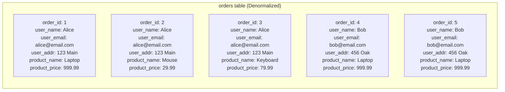

<details>
<summary>ASCII diagram (reference)</summary>

```text
orders table:
┌─────────┬───────────┬─────────────────┬───────────┬──────────────┬─────────────┐
│order_id │ user_name │ user_email      │ user_addr │ product_name │ product_price│
├─────────┼───────────┼─────────────────┼───────────┼──────────────┼─────────────┤
│ 1       │ Alice     │ alice@email.com │ 123 Main  │ Laptop       │ 999.99      │
│ 2       │ Alice     │ alice@email.com │ 123 Main  │ Mouse        │ 29.99       │
│ 3       │ Alice     │ alice@email.com │ 123 Main  │ Keyboard     │ 79.99       │
│ 4       │ Bob       │ bob@email.com   │ 456 Oak   │ Laptop       │ 999.99      │
│ 5       │ Bob       │ bob@email.com   │ 456 Oak   │ Laptop       │ 999.99      │
└─────────┴───────────┴─────────────────┴───────────┴──────────────┴─────────────┘
```
</details>

**Problems**:
1. **Data Redundancy**: Alice's info repeated 3 times, Laptop price repeated 3 times
2. **Update Anomaly**: If Alice changes her email, must update 3 rows. Miss one? Inconsistent data.
3. **Insert Anomaly**: Can't add a new user without an order
4. **Delete Anomaly**: If we delete Bob's orders, we lose Bob's information entirely
5. **Storage Waste**: Same data stored multiple times

**Approach B: Separate Tables (Normalized)**

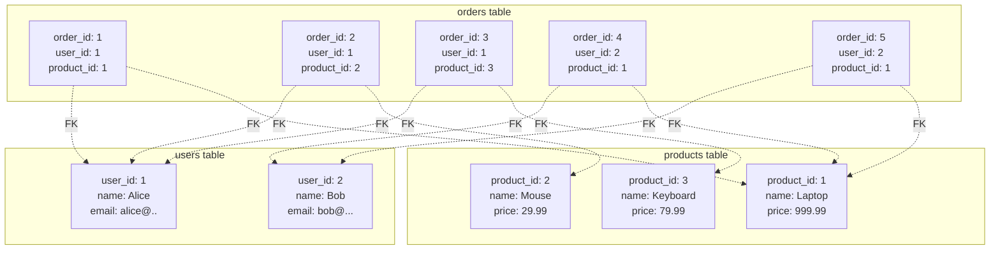

<details>
<summary>ASCII diagram (reference)</summary>

```text
users table:                    products table:
┌─────────┬───────┬─────────┐   ┌────────────┬────────┬───────┐
│ user_id │ name  │ email   │   │ product_id │ name   │ price │
├─────────┼───────┼─────────┤   ├────────────┼────────┼───────┤
│ 1       │ Alice │ alice@..│   │ 1          │ Laptop │ 999.99│
│ 2       │ Bob   │ bob@... │   │ 2          │ Mouse  │ 29.99 │
└─────────┴───────┴─────────┘   │ 3          │ Keyboard│ 79.99│
                                └────────────┴────────┴───────┘

orders table:
┌──────────┬─────────┬────────────┐
│ order_id │ user_id │ product_id │
├──────────┼─────────┼────────────┤
│ 1        │ 1       │ 1          │
│ 2        │ 1       │ 2          │
│ 3        │ 1       │ 3          │
│ 4        │ 2       │ 1          │
│ 5        │ 2       │ 1          │
└──────────┴─────────┴────────────┘
```
</details>

**Benefits**:
1. **No Redundancy**: Each fact stored once
2. **Easy Updates**: Change Alice's email in one place
3. **Data Integrity**: Can't have orphan orders (foreign keys)
4. **Storage Efficient**: Less disk space

**Tradeoff**: To get a full order with user and product details, you need JOINs.

### What Systems Looked Like Before Normalization Theory

In the 1960s-70s, data was stored in flat files or hierarchical databases. Data redundancy was rampant:

```
// Flat file approach
RECORD: ORDER-001, ALICE, ALICE@EMAIL.COM, 123 MAIN ST, LAPTOP, 999.99
RECORD: ORDER-002, ALICE, ALICE@EMAIL.COM, 123 MAIN ST, MOUSE, 29.99
// Alice's info duplicated everywhere
// No way to ensure consistency
```

Edgar Codd introduced the relational model and normalization in 1970 to solve these problems systematically.

### Real Examples of the Problem

**Early Amazon (1990s)**: Product information was duplicated across order records. When a product description changed, thousands of order records had stale data. This led to customer complaints about mismatched product info.

**Banking Systems**: Before normalization, customer addresses were stored with each account. A customer with 5 accounts had their address stored 5 times. Address updates were error-prone and often incomplete.

---

## 2️⃣ Intuition and Mental Model

### The Spreadsheet vs Database Analogy

**Denormalized = One Giant Spreadsheet**

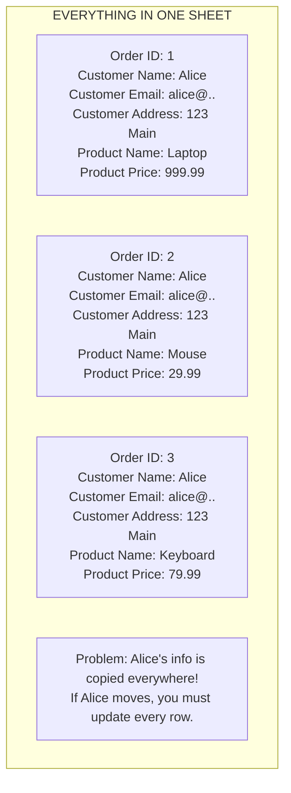

<details>
<summary>ASCII diagram (reference)</summary>

```text
┌─────────────────────────────────────────────────────────────┐
│              EVERYTHING IN ONE SHEET                         │
│                                                              │
│  Order│ Customer │ Customer │ Customer │ Product │ Product  │
│  ID   │ Name     │ Email    │ Address  │ Name    │ Price    │
│  ─────┼──────────┼──────────┼──────────┼─────────┼─────────│
│  1    │ Alice    │ alice@.. │ 123 Main │ Laptop  │ 999.99  │
│  2    │ Alice    │ alice@.. │ 123 Main │ Mouse   │ 29.99   │
│  3    │ Alice    │ alice@.. │ 123 Main │ Keyboard│ 79.99   │
│                                                              │
│  Problem: Alice's info is copied everywhere!                │
│  If Alice moves, you must update every row.                 │
└─────────────────────────────────────────────────────────────┘
```
</details>

**Normalized = Multiple Linked Sheets**

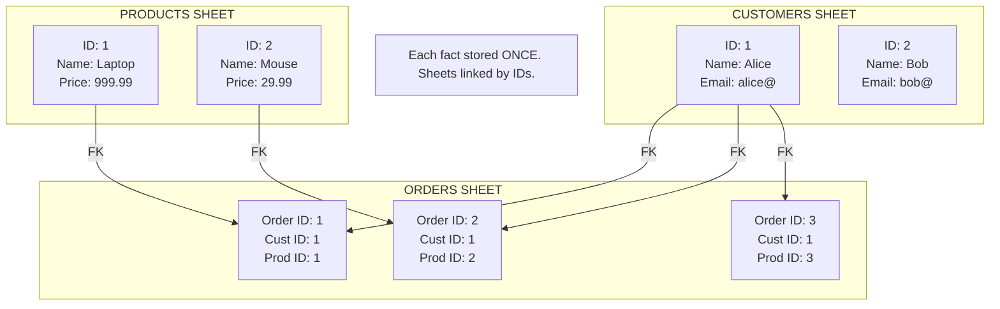

<details>
<summary>ASCII diagram (reference)</summary>

```text
┌────────────────────┐     ┌────────────────────┐
│   CUSTOMERS SHEET  │     │   PRODUCTS SHEET   │
│                    │     │                    │
│  ID │ Name │ Email │     │  ID │ Name │ Price │
│  ───┼──────┼───────│     │  ───┼──────┼───────│
│  1  │Alice │alice@ │     │  1  │Laptop│999.99 │
│  2  │Bob   │bob@   │     │  2  │Mouse │29.99  │
└─────────┬──────────┘     └──────────┬─────────┘
          │                           │
          │         ORDERS SHEET      │
          │    ┌─────────────────┐    │
          └───►│ Order│Cust│Prod │◄───┘
               │ ID   │ ID │ ID  │
               │ ─────┼────┼─────│
               │ 1    │ 1  │ 1   │
               │ 2    │ 1  │ 2   │
               │ 3    │ 1  │ 3   │
               └─────────────────┘

Each fact stored ONCE. Sheets linked by IDs.
```
</details>

### The Key Insight

**Normalization** = Organizing data to minimize redundancy and dependency
**Denormalization** = Intentionally adding redundancy for performance

Neither is universally "better." The right choice depends on your read/write patterns.

This analogy will be referenced throughout. Remember:
- Normalized = Multiple linked sheets (less redundancy, more JOINs)
- Denormalized = One big sheet (more redundancy, faster reads)

---

## 3️⃣ How It Works Internally

### Normal Forms Explained

Normal forms are progressive levels of data organization. Each level eliminates specific types of redundancy.

#### First Normal Form (1NF)

**Rule**: Each column contains only atomic (indivisible) values. No repeating groups.

**Violation**:
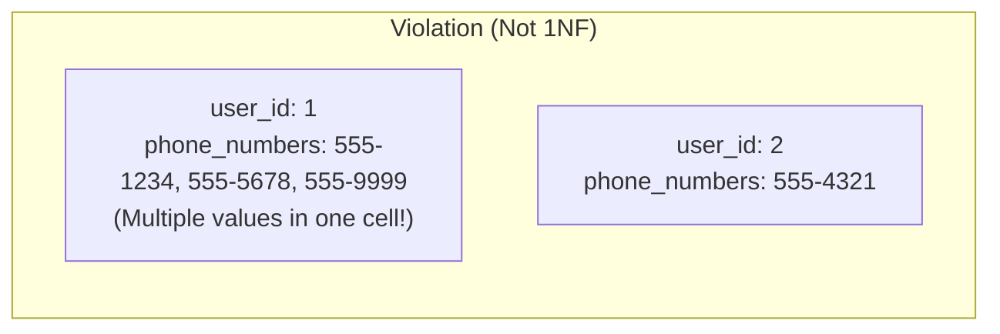

<details>
<summary>ASCII diagram (reference)</summary>

```text
┌─────────┬────────────────────────────┐
│ user_id │ phone_numbers              │
├─────────┼────────────────────────────┤
│ 1       │ 555-1234, 555-5678, 555-9999│  ← Multiple values in one cell!
│ 2       │ 555-4321                    │
└─────────┴────────────────────────────┘
```
</details>

**Fixed (1NF)**:
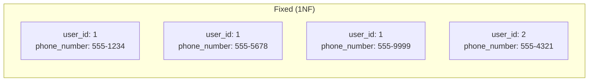

<details>
<summary>ASCII diagram (reference)</summary>

```text
┌─────────┬──────────────┐
│ user_id │ phone_number │
├─────────┼──────────────┤
│ 1       │ 555-1234     │
│ 1       │ 555-5678     │
│ 1       │ 555-9999     │
│ 2       │ 555-4321     │
└─────────┴──────────────┘
```
</details>

Or better, a separate table:
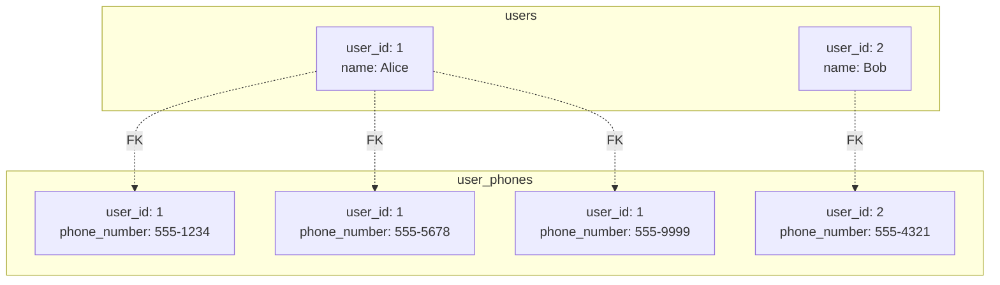

<details>
<summary>ASCII diagram (reference)</summary>

```text
users:                    user_phones:
┌─────────┬───────┐      ┌─────────┬──────────────┐
│ user_id │ name  │      │ user_id │ phone_number │
├─────────┼───────┤      ├─────────┼──────────────┤
│ 1       │ Alice │      │ 1       │ 555-1234     │
│ 2       │ Bob   │      │ 1       │ 555-5678     │
└─────────┴───────┘      │ 1       │ 555-9999     │
                         │ 2       │ 555-4321     │
                         └─────────┴──────────────┘
```
</details>

#### Second Normal Form (2NF)

**Rule**: Must be in 1NF AND every non-key column depends on the ENTIRE primary key.

This matters when you have a composite primary key.

**Violation**:
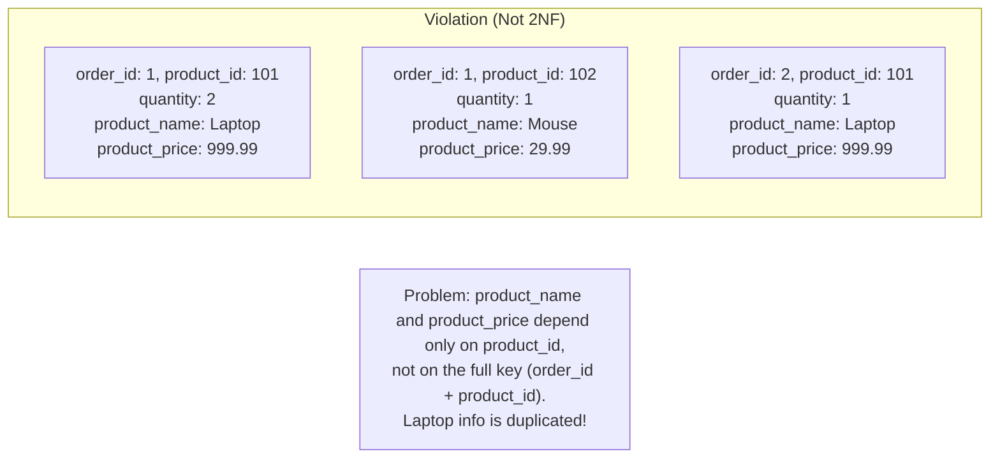

<details>
<summary>ASCII diagram (reference)</summary>

```text
order_items table (composite key: order_id + product_id):
┌──────────┬────────────┬──────────┬───────────────┬──────────────┐
│ order_id │ product_id │ quantity │ product_name  │ product_price│
├──────────┼────────────┼──────────┼───────────────┼──────────────┤
│ 1        │ 101        │ 2        │ Laptop        │ 999.99       │
│ 1        │ 102        │ 1        │ Mouse         │ 29.99        │
│ 2        │ 101        │ 1        │ Laptop        │ 999.99       │
└──────────┴────────────┴──────────┴───────────────┴──────────────┘

Problem: product_name and product_price depend only on product_id,
         not on the full key (order_id + product_id).
         Laptop info is duplicated!
```
</details>

**Fixed (2NF)**:
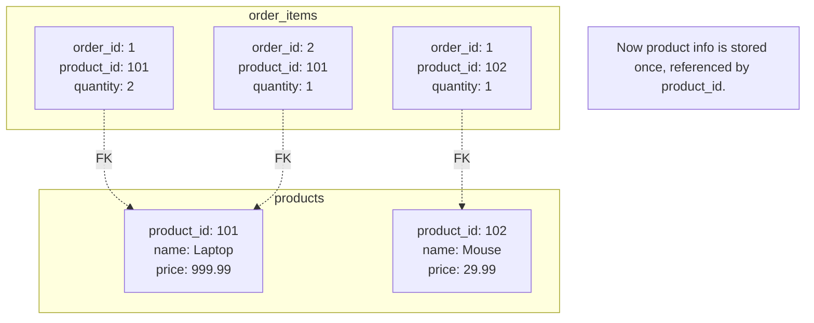

<details>
<summary>ASCII diagram (reference)</summary>

```text
order_items:                      products:
┌──────────┬────────────┬────────┐  ┌────────────┬────────┬───────┐
│ order_id │ product_id │quantity│  │ product_id │ name   │ price │
├──────────┼────────────┼────────┤  ├────────────┼────────┼───────┤
│ 1        │ 101        │ 2      │  │ 101        │ Laptop │ 999.99│
│ 1        │ 102        │ 1      │  │ 102        │ Mouse  │ 29.99 │
│ 2        │ 101        │ 1      │  └────────────┴────────┴───────┘
└──────────┴────────────┴────────┘

Now product info is stored once, referenced by product_id.
```
</details>

#### Third Normal Form (3NF)

**Rule**: Must be in 2NF AND no non-key column depends on another non-key column (no transitive dependencies).

**Violation**:
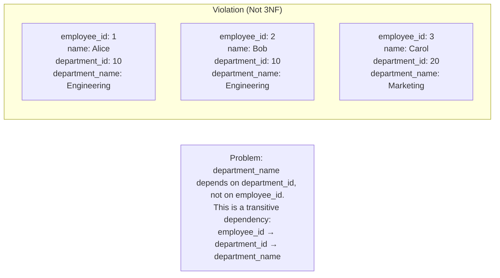

<details>
<summary>ASCII diagram (reference)</summary>

```text
employees table:
┌─────────────┬───────┬───────────────┬─────────────────┐
│ employee_id │ name  │ department_id │ department_name │
├─────────────┼───────┼───────────────┼─────────────────┤
│ 1           │ Alice │ 10            │ Engineering     │
│ 2           │ Bob   │ 10            │ Engineering     │
│ 3           │ Carol │ 20            │ Marketing       │
└─────────────┴───────┴───────────────┴─────────────────┘

Problem: department_name depends on department_id, not on employee_id.
         This is a transitive dependency:
         employee_id → department_id → department_name
```
</details>

**Fixed (3NF)**:
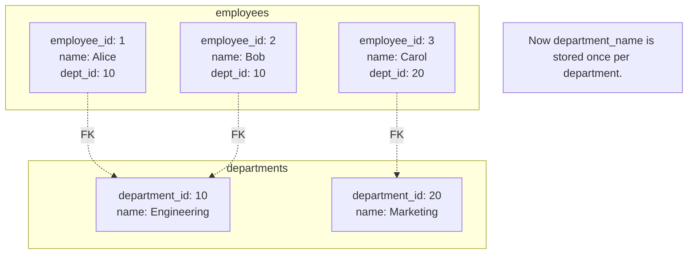

<details>
<summary>ASCII diagram (reference)</summary>

```text
employees:                        departments:
┌─────────────┬───────┬───────────┐  ┌───────────────┬─────────────┐
│ employee_id │ name  │ dept_id   │  │ department_id │ name        │
├─────────────┼───────┼───────────┤  ├───────────────┼─────────────┤
│ 1           │ Alice │ 10        │  │ 10            │ Engineering │
│ 2           │ Bob   │ 10        │  │ 20            │ Marketing   │
│ 3           │ Carol │ 20        │  └───────────────┴─────────────┘
└─────────────┴───────┴───────────┘

Now department_name is stored once per department.
```
</details>

#### Boyce-Codd Normal Form (BCNF)

**Rule**: Must be in 3NF AND every determinant is a candidate key.

A **determinant** is any column (or set of columns) on which another column is fully functionally dependent.

**Violation** (rare but tricky):
```
student_courses:
┌─────────────┬─────────┬─────────────┐
│ student_id  │ course  │ instructor  │
├─────────────┼─────────┼─────────────┤
│ 1           │ Math    │ Dr. Smith   │
│ 2           │ Math    │ Dr. Smith   │
│ 1           │ Physics │ Dr. Jones   │
│ 3           │ Math    │ Dr. Brown   │  ← Different instructor for same course!
└─────────────┴─────────┴─────────────┘

Assumption: Each instructor teaches only ONE course.
So: instructor → course (instructor determines course)

But instructor is not a candidate key (student_id + course is).
This violates BCNF.
```

**Fixed (BCNF)**:
```
instructor_courses:              student_instructors:
┌─────────────┬─────────┐        ┌─────────────┬─────────────┐
│ instructor  │ course  │        │ student_id  │ instructor  │
├─────────────┼─────────┤        ├─────────────┼─────────────┤
│ Dr. Smith   │ Math    │        │ 1           │ Dr. Smith   │
│ Dr. Jones   │ Physics │        │ 2           │ Dr. Smith   │
│ Dr. Brown   │ Math    │        │ 1           │ Dr. Jones   │
└─────────────┴─────────┘        │ 3           │ Dr. Brown   │
                                 └─────────────┴─────────────┘
```

### When to Stop Normalizing

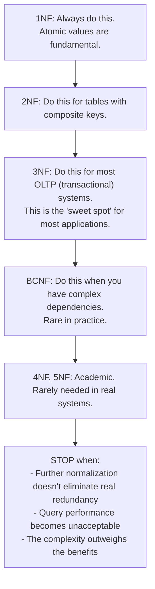

<details>
<summary>ASCII diagram (reference)</summary>

```text
┌─────────────────────────────────────────────────────────────┐
│              NORMALIZATION DECISION GUIDE                    │
├─────────────────────────────────────────────────────────────┤
│                                                              │
│  1NF: Always do this. Atomic values are fundamental.        │
│                                                              │
│  2NF: Do this for tables with composite keys.               │
│                                                              │
│  3NF: Do this for most OLTP (transactional) systems.        │
│       This is the "sweet spot" for most applications.       │
│                                                              │
│  BCNF: Do this when you have complex dependencies.          │
│        Rare in practice.                                     │
│                                                              │
│  4NF, 5NF: Academic. Rarely needed in real systems.         │
│                                                              │
│  STOP when:                                                  │
│  - Further normalization doesn't eliminate real redundancy  │
│  - Query performance becomes unacceptable                   │
│  - The complexity outweighs the benefits                    │
│                                                              │
└─────────────────────────────────────────────────────────────┘
```
</details>

### Denormalization Techniques

#### 1. Adding Redundant Columns

```sql
-- Normalized: Must JOIN to get user's order count
SELECT u.name, COUNT(o.id) as order_count
FROM users u
LEFT JOIN orders o ON u.id = o.user_id
GROUP BY u.id;

-- Denormalized: Store count directly
ALTER TABLE users ADD COLUMN order_count INT DEFAULT 0;

-- Update on each order (via trigger or application)
UPDATE users SET order_count = order_count + 1 WHERE id = ?;

-- Now query is instant
SELECT name, order_count FROM users WHERE id = ?;
```

#### 2. Pre-computed Aggregates

```sql
-- Instead of computing daily sales each time
SELECT DATE(created_at), SUM(amount)
FROM orders
WHERE created_at >= '2024-01-01'
GROUP BY DATE(created_at);

-- Pre-compute and store
CREATE TABLE daily_sales (
    date DATE PRIMARY KEY,
    total_amount DECIMAL(12,2),
    order_count INT
);

-- Update daily (via scheduled job)
INSERT INTO daily_sales (date, total_amount, order_count)
SELECT DATE(created_at), SUM(amount), COUNT(*)
FROM orders
WHERE DATE(created_at) = CURRENT_DATE - 1
ON CONFLICT (date) DO UPDATE SET
    total_amount = EXCLUDED.total_amount,
    order_count = EXCLUDED.order_count;
```

#### 3. Materialized Views

A **materialized view** is a database object that stores the result of a query physically. Unlike regular views, the data is actually stored on disk.

```sql
-- Create materialized view
CREATE MATERIALIZED VIEW product_stats AS
SELECT 
    p.id,
    p.name,
    COUNT(oi.id) as times_ordered,
    SUM(oi.quantity) as total_quantity,
    AVG(oi.quantity) as avg_quantity
FROM products p
LEFT JOIN order_items oi ON p.id = oi.product_id
GROUP BY p.id, p.name;

-- Query is instant (reads from stored data)
SELECT * FROM product_stats WHERE id = 123;

-- Refresh when data changes
REFRESH MATERIALIZED VIEW product_stats;

-- Or refresh concurrently (doesn't lock reads)
REFRESH MATERIALIZED VIEW CONCURRENTLY product_stats;
```

---

## 4️⃣ Simulation-First Explanation

Let's trace through real scenarios to understand when to normalize vs denormalize.

### Scenario 1: Blog Platform

**Requirements**:
- Users write posts
- Posts have comments
- Need to show post with author info and comment count

**Normalized Design**:

```sql
users:
┌─────────┬───────┬─────────────────┐
│ id      │ name  │ email           │
├─────────┼───────┼─────────────────┤
│ 1       │ Alice │ alice@email.com │
└─────────┴───────┴─────────────────┘

posts:
┌─────────┬───────────┬─────────────────────┬────────────┐
│ id      │ user_id   │ title               │ content    │
├─────────┼───────────┼─────────────────────┼────────────┤
│ 1       │ 1         │ My First Post       │ Hello...   │
└─────────┴───────────┴─────────────────────┴────────────┘

comments:
┌─────────┬─────────┬───────────┬─────────────┐
│ id      │ post_id │ user_id   │ content     │
├─────────┼─────────┼───────────┼─────────────┤
│ 1       │ 1       │ 2         │ Great post! │
│ 2       │ 1       │ 3         │ Thanks!     │
│ 3       │ 1       │ 2         │ More please │
└─────────┴─────────┴───────────┴─────────────┘
```

**Query to display post**:

```sql
SELECT 
    p.id,
    p.title,
    p.content,
    u.name as author_name,
    (SELECT COUNT(*) FROM comments c WHERE c.post_id = p.id) as comment_count
FROM posts p
JOIN users u ON p.user_id = u.id
WHERE p.id = 1;
```

**Problem**: For a popular blog with millions of posts, counting comments for each post is slow.

**Denormalized Solution**:

```sql
-- Add comment_count to posts table
ALTER TABLE posts ADD COLUMN comment_count INT DEFAULT 0;

-- Update via trigger
CREATE FUNCTION update_comment_count() RETURNS TRIGGER AS $$
BEGIN
    IF TG_OP = 'INSERT' THEN
        UPDATE posts SET comment_count = comment_count + 1 
        WHERE id = NEW.post_id;
    ELSIF TG_OP = 'DELETE' THEN
        UPDATE posts SET comment_count = comment_count - 1 
        WHERE id = OLD.post_id;
    END IF;
    RETURN NULL;
END;
$$ LANGUAGE plpgsql;

CREATE TRIGGER comment_count_trigger
AFTER INSERT OR DELETE ON comments
FOR EACH ROW EXECUTE FUNCTION update_comment_count();

-- Now query is simple and fast
SELECT p.*, u.name as author_name
FROM posts p
JOIN users u ON p.user_id = u.id
WHERE p.id = 1;
```

### Scenario 2: E-commerce Product Listing

**Requirements**:
- Show product with category name, brand name, average rating
- High read volume (millions of page views)
- Moderate write volume (product updates are infrequent)

**Normalized Design**:

```sql
products:     categories:    brands:       reviews:
┌────┬──────┐ ┌────┬──────┐ ┌────┬──────┐ ┌────┬────────┬────────┐
│ id │ name │ │ id │ name │ │ id │ name │ │ id │prod_id │ rating │
├────┼──────┤ ├────┼──────┤ ├────┼──────┤ ├────┼────────┼────────┤
│ 1  │Laptop│ │ 1  │Electr│ │ 1  │ Dell │ │ 1  │ 1      │ 5      │
└────┴──────┘ └────┴──────┘ └────┴──────┘ │ 2  │ 1      │ 4      │
                                          │ 3  │ 1      │ 5      │
                                          └────┴────────┴────────┘
```

**Query for product page**:

```sql
SELECT 
    p.name,
    c.name as category,
    b.name as brand,
    AVG(r.rating) as avg_rating,
    COUNT(r.id) as review_count
FROM products p
JOIN categories c ON p.category_id = c.id
JOIN brands b ON p.brand_id = b.id
LEFT JOIN reviews r ON p.id = r.product_id
WHERE p.id = 1
GROUP BY p.id, c.name, b.name;
```

**Problem**: 4 tables, 3 JOINs, aggregation. Slow for high traffic.

**Denormalized Solution with Materialized View**:

```sql
CREATE MATERIALIZED VIEW product_display AS
SELECT 
    p.id,
    p.name,
    p.price,
    p.description,
    c.name as category_name,
    b.name as brand_name,
    COALESCE(AVG(r.rating), 0) as avg_rating,
    COUNT(r.id) as review_count
FROM products p
JOIN categories c ON p.category_id = c.id
JOIN brands b ON p.brand_id = b.id
LEFT JOIN reviews r ON p.id = r.product_id
GROUP BY p.id, p.name, p.price, p.description, c.name, b.name;

-- Create index on materialized view
CREATE UNIQUE INDEX idx_product_display_id ON product_display (id);

-- Query is now a simple lookup
SELECT * FROM product_display WHERE id = 1;

-- Refresh periodically (e.g., every 5 minutes)
REFRESH MATERIALIZED VIEW CONCURRENTLY product_display;
```

### Scenario 3: Financial Reporting

**Requirements**:
- Generate monthly revenue reports
- Data must be accurate (no approximations)
- Reports run infrequently but must be fast

**Normalized Design**: Orders and order_items tables (as shown earlier)

**Problem**: Aggregating millions of orders for reports is slow.

**Denormalized Solution with Summary Tables**:

```sql
-- Summary table for monthly revenue
CREATE TABLE monthly_revenue (
    year INT,
    month INT,
    category_id INT,
    revenue DECIMAL(15,2),
    order_count INT,
    PRIMARY KEY (year, month, category_id)
);

-- Populate via scheduled job (runs nightly)
INSERT INTO monthly_revenue (year, month, category_id, revenue, order_count)
SELECT 
    EXTRACT(YEAR FROM o.created_at),
    EXTRACT(MONTH FROM o.created_at),
    p.category_id,
    SUM(oi.quantity * oi.price),
    COUNT(DISTINCT o.id)
FROM orders o
JOIN order_items oi ON o.id = oi.order_id
JOIN products p ON oi.product_id = p.id
WHERE o.created_at >= DATE_TRUNC('month', CURRENT_DATE - INTERVAL '1 month')
AND o.created_at < DATE_TRUNC('month', CURRENT_DATE)
GROUP BY 1, 2, 3
ON CONFLICT (year, month, category_id) DO UPDATE SET
    revenue = EXCLUDED.revenue,
    order_count = EXCLUDED.order_count;

-- Report query is instant
SELECT * FROM monthly_revenue 
WHERE year = 2024 AND month = 1;
```

---

## 5️⃣ How Engineers Actually Use This in Production

### At Major Companies

**Facebook**:
- Highly denormalized for read-heavy social graph
- User's feed is pre-computed and stored
- Trade consistency for speed (eventual consistency)

**Amazon**:
- Product catalog: Denormalized for fast reads
- Order processing: Normalized for ACID guarantees
- Reporting: Separate data warehouse with aggregates

**Netflix**:
- User profiles: Denormalized in Cassandra
- Viewing history: Denormalized for fast writes
- Recommendations: Pre-computed and cached

### Decision Framework

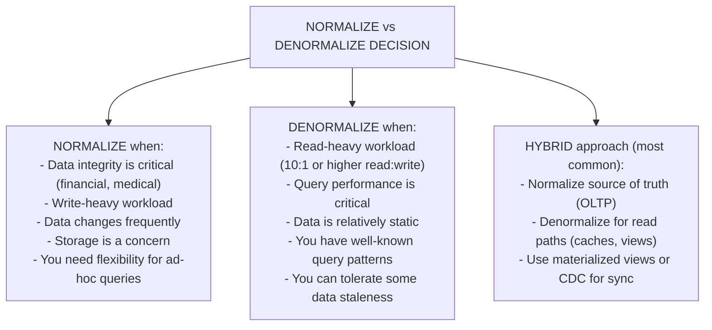

<details>
<summary>ASCII diagram (reference)</summary>

```text
┌─────────────────────────────────────────────────────────────┐
│           NORMALIZE vs DENORMALIZE DECISION                  │
├─────────────────────────────────────────────────────────────┤
│                                                              │
│  NORMALIZE when:                                             │
│  ├── Data integrity is critical (financial, medical)        │
│  ├── Write-heavy workload                                   │
│  ├── Data changes frequently                                │
│  ├── Storage is a concern                                   │
│  └── You need flexibility for ad-hoc queries                │
│                                                              │
│  DENORMALIZE when:                                           │
│  ├── Read-heavy workload (10:1 or higher read:write)        │
│  ├── Query performance is critical                          │
│  ├── Data is relatively static                              │
│  ├── You have well-known query patterns                     │
│  └── You can tolerate some data staleness                   │
│                                                              │
│  HYBRID approach (most common):                              │
│  ├── Normalize source of truth (OLTP)                       │
│  ├── Denormalize for read paths (caches, views)             │
│  └── Use materialized views or CDC for sync                 │
│                                                              │
└─────────────────────────────────────────────────────────────┘
```
</details>

### Real Production Patterns

**Pattern 1: CQRS (Command Query Responsibility Segregation)**

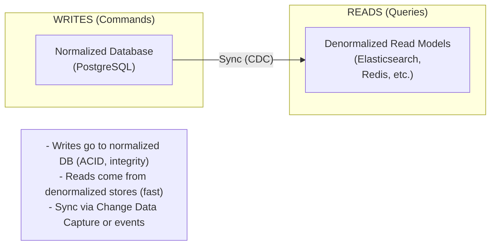

<details>
<summary>ASCII diagram (reference)</summary>

```text
┌─────────────────────────────────────────────────────────────┐
│                      CQRS PATTERN                            │
│                                                              │
│  WRITES (Commands)              READS (Queries)             │
│  ┌─────────────────┐           ┌─────────────────┐          │
│  │   Normalized    │           │  Denormalized   │          │
│  │   Database      │──────────▶│  Read Models    │          │
│  │   (PostgreSQL)  │   Sync    │  (Elasticsearch,│          │
│  │                 │   (CDC)   │   Redis, etc.)  │          │
│  └─────────────────┘           └─────────────────┘          │
│                                                              │
│  - Writes go to normalized DB (ACID, integrity)             │
│  - Reads come from denormalized stores (fast)               │
│  - Sync via Change Data Capture or events                   │
└─────────────────────────────────────────────────────────────┘
```
</details>

**Pattern 2: Materialized Views for Hot Paths**

```sql
-- Identify hot queries
SELECT query, calls, mean_exec_time
FROM pg_stat_statements
ORDER BY calls DESC
LIMIT 10;

-- Create materialized view for top query
CREATE MATERIALIZED VIEW hot_products AS
SELECT p.*, c.name as category_name, 
       COUNT(v.id) as view_count
FROM products p
JOIN categories c ON p.category_id = c.id
LEFT JOIN product_views v ON p.id = v.product_id
WHERE v.created_at > NOW() - INTERVAL '7 days'
GROUP BY p.id, c.name;

-- Refresh every hour
-- (via pg_cron or application scheduler)
```

---

## 6️⃣ How to Implement or Apply It

### Implementing Normalization in Java/Spring

```java
package com.example.demo.entity;

import jakarta.persistence.*;
import java.math.BigDecimal;
import java.util.List;

/**
 * Normalized entity design.
 * Each entity represents one concept with no redundant data.
 */

// Users table - stores user info once
@Entity
@Table(name = "users")
public class User {
    @Id
    @GeneratedValue(strategy = GenerationType.IDENTITY)
    private Long id;
    
    @Column(nullable = false)
    private String name;
    
    @Column(nullable = false, unique = true)
    private String email;
    
    // One user has many orders (relationship, not embedded data)
    @OneToMany(mappedBy = "user", fetch = FetchType.LAZY)
    private List<Order> orders;
    
    // Getters, setters...
}

// Products table - stores product info once
@Entity
@Table(name = "products")
public class Product {
    @Id
    @GeneratedValue(strategy = GenerationType.IDENTITY)
    private Long id;
    
    @Column(nullable = false)
    private String name;
    
    @Column(nullable = false)
    private BigDecimal price;
    
    // Product belongs to one category (foreign key)
    @ManyToOne(fetch = FetchType.LAZY)
    @JoinColumn(name = "category_id")
    private Category category;
    
    // Getters, setters...
}

// Orders table - references users and contains order items
@Entity
@Table(name = "orders")
public class Order {
    @Id
    @GeneratedValue(strategy = GenerationType.IDENTITY)
    private Long id;
    
    @ManyToOne(fetch = FetchType.LAZY)
    @JoinColumn(name = "user_id", nullable = false)
    private User user;
    
    @OneToMany(mappedBy = "order", cascade = CascadeType.ALL)
    private List<OrderItem> items;
    
    private java.time.Instant createdAt;
    
    // Getters, setters...
}

// Order items - junction table with additional data
@Entity
@Table(name = "order_items")
public class OrderItem {
    @Id
    @GeneratedValue(strategy = GenerationType.IDENTITY)
    private Long id;
    
    @ManyToOne(fetch = FetchType.LAZY)
    @JoinColumn(name = "order_id", nullable = false)
    private Order order;
    
    @ManyToOne(fetch = FetchType.LAZY)
    @JoinColumn(name = "product_id", nullable = false)
    private Product product;
    
    private Integer quantity;
    
    // Store price at time of order (intentional denormalization)
    // Product price may change, but order price should not
    private BigDecimal priceAtPurchase;
    
    // Getters, setters...
}
```

### Implementing Denormalization Strategies

**Strategy 1: Redundant Column with Trigger**

```sql
-- Add denormalized column
ALTER TABLE posts ADD COLUMN comment_count INT DEFAULT 0;

-- Create trigger to maintain it
CREATE OR REPLACE FUNCTION maintain_comment_count()
RETURNS TRIGGER AS $$
BEGIN
    IF TG_OP = 'INSERT' THEN
        UPDATE posts 
        SET comment_count = comment_count + 1 
        WHERE id = NEW.post_id;
        RETURN NEW;
    ELSIF TG_OP = 'DELETE' THEN
        UPDATE posts 
        SET comment_count = comment_count - 1 
        WHERE id = OLD.post_id;
        RETURN OLD;
    END IF;
END;
$$ LANGUAGE plpgsql;

CREATE TRIGGER trg_comment_count
AFTER INSERT OR DELETE ON comments
FOR EACH ROW EXECUTE FUNCTION maintain_comment_count();
```

**Strategy 2: Application-Level Denormalization**

```java
package com.example.demo.service;

import org.springframework.stereotype.Service;
import org.springframework.transaction.annotation.Transactional;

@Service
public class CommentService {
    
    private final CommentRepository commentRepository;
    private final PostRepository postRepository;
    
    public CommentService(CommentRepository commentRepository,
                          PostRepository postRepository) {
        this.commentRepository = commentRepository;
        this.postRepository = postRepository;
    }
    
    /**
     * Add comment and update denormalized count.
     * Both operations in same transaction for consistency.
     */
    @Transactional
    public Comment addComment(Long postId, String content, Long userId) {
        // Create comment
        Comment comment = new Comment();
        comment.setPostId(postId);
        comment.setUserId(userId);
        comment.setContent(content);
        commentRepository.save(comment);
        
        // Update denormalized count
        postRepository.incrementCommentCount(postId);
        
        return comment;
    }
    
    @Transactional
    public void deleteComment(Long commentId) {
        Comment comment = commentRepository.findById(commentId)
            .orElseThrow();
        
        Long postId = comment.getPostId();
        
        commentRepository.delete(comment);
        
        // Update denormalized count
        postRepository.decrementCommentCount(postId);
    }
}
```

**Strategy 3: Materialized View with Refresh**

```java
package com.example.demo.service;

import org.springframework.jdbc.core.JdbcTemplate;
import org.springframework.scheduling.annotation.Scheduled;
import org.springframework.stereotype.Service;

@Service
public class MaterializedViewService {
    
    private final JdbcTemplate jdbcTemplate;
    
    public MaterializedViewService(JdbcTemplate jdbcTemplate) {
        this.jdbcTemplate = jdbcTemplate;
    }
    
    /**
     * Refresh materialized view every 5 minutes.
     * CONCURRENTLY allows reads during refresh.
     */
    @Scheduled(fixedRate = 300000)  // 5 minutes
    public void refreshProductStats() {
        jdbcTemplate.execute(
            "REFRESH MATERIALIZED VIEW CONCURRENTLY product_stats"
        );
    }
    
    /**
     * Manual refresh for immediate consistency.
     * Call after significant data changes.
     */
    public void forceRefresh() {
        jdbcTemplate.execute(
            "REFRESH MATERIALIZED VIEW CONCURRENTLY product_stats"
        );
    }
}
```

### SQL for Creating Materialized View

```sql
-- Create the materialized view
CREATE MATERIALIZED VIEW product_stats AS
SELECT 
    p.id,
    p.name,
    p.price,
    c.name as category_name,
    COALESCE(AVG(r.rating), 0)::DECIMAL(3,2) as avg_rating,
    COUNT(r.id) as review_count,
    COALESCE(SUM(oi.quantity), 0) as total_sold
FROM products p
LEFT JOIN categories c ON p.category_id = c.id
LEFT JOIN reviews r ON p.id = r.product_id
LEFT JOIN order_items oi ON p.id = oi.product_id
GROUP BY p.id, p.name, p.price, c.name
WITH DATA;

-- Create unique index (required for CONCURRENTLY refresh)
CREATE UNIQUE INDEX idx_product_stats_id ON product_stats (id);

-- Create additional indexes for common queries
CREATE INDEX idx_product_stats_category ON product_stats (category_name);
CREATE INDEX idx_product_stats_rating ON product_stats (avg_rating DESC);
```

---

## 7️⃣ Tradeoffs, Pitfalls, and Common Mistakes

### Common Mistake 1: Over-Normalizing

```sql
-- TOO normalized: separate table for every attribute
addresses:     cities:        states:        countries:
┌────┬──────┐  ┌────┬──────┐  ┌────┬──────┐  ┌────┬──────┐
│ id │street│  │ id │ name │  │ id │ name │  │ id │ name │
└────┴──────┘  └────┴──────┘  └────┴──────┘  └────┴──────┘

-- Query requires 4 JOINs just to get an address!
SELECT a.street, c.name, s.name, co.name
FROM addresses a
JOIN cities c ON a.city_id = c.id
JOIN states s ON c.state_id = s.id
JOIN countries co ON s.country_id = co.id;

-- BETTER: Keep related data together
addresses:
┌────┬────────┬──────┬───────┬─────────┐
│ id │ street │ city │ state │ country │
└────┴────────┴──────┴───────┴─────────┘
```

### Common Mistake 2: Denormalizing Prematurely

```
Developer: "Let's denormalize everything for performance!"
Result: 
- Data inconsistencies everywhere
- Complex update logic
- Bugs when denormalized data gets out of sync
- No actual performance problem existed in the first place

RULE: Normalize first. Denormalize only when you have measured performance problems.
```

### Common Mistake 3: Forgetting to Update Denormalized Data

```java
// WRONG: Update product but forget denormalized data
public void updateProductPrice(Long productId, BigDecimal newPrice) {
    Product product = productRepository.findById(productId).orElseThrow();
    product.setPrice(newPrice);
    productRepository.save(product);
    // Forgot to update product_stats materialized view!
    // Now reads show stale price.
}

// RIGHT: Update all locations
@Transactional
public void updateProductPrice(Long productId, BigDecimal newPrice) {
    Product product = productRepository.findById(productId).orElseThrow();
    product.setPrice(newPrice);
    productRepository.save(product);
    
    // Refresh materialized view
    materializedViewService.refreshProductStats();
    
    // Or invalidate cache
    cacheService.evict("product:" + productId);
}
```

### Common Mistake 4: Wrong Granularity for Summary Tables

```sql
-- TOO granular: hourly summaries for data queried monthly
CREATE TABLE hourly_sales (
    hour TIMESTAMP,
    revenue DECIMAL
);
-- 8,760 rows per year, still need aggregation for monthly reports

-- TOO coarse: yearly summaries when weekly is needed
CREATE TABLE yearly_sales (
    year INT,
    revenue DECIMAL
);
-- Can't drill down to weekly patterns

-- RIGHT: Match granularity to query patterns
CREATE TABLE daily_sales (...);  -- For weekly/monthly reports
CREATE TABLE monthly_sales (...); -- For yearly reports
```

### Performance Gotchas

**1. Materialized View Refresh Blocking**

```sql
-- WRONG: Blocks all reads during refresh
REFRESH MATERIALIZED VIEW product_stats;

-- RIGHT: Allows reads during refresh (requires unique index)
REFRESH MATERIALIZED VIEW CONCURRENTLY product_stats;
```

**2. Trigger Performance**

```sql
-- WRONG: Complex trigger that queries other tables
CREATE FUNCTION complex_trigger() RETURNS TRIGGER AS $$
BEGIN
    -- This runs for EVERY row insert!
    SELECT ... FROM large_table WHERE ...;
    UPDATE another_table SET ...;
    RETURN NEW;
END;
$$ LANGUAGE plpgsql;

-- BETTER: Batch updates via scheduled job
-- Or use async processing (message queue)
```

---

## 8️⃣ When NOT to Use This

### When NOT to Normalize

1. **Read-heavy analytics workloads**
   - JOINs are expensive at scale
   - Denormalized star/snowflake schemas are standard

2. **Document-oriented data**
   - User profiles with nested preferences
   - Product catalogs with varying attributes
   - Better fit for document databases (MongoDB)

3. **Time-series data**
   - Sensor readings, logs, metrics
   - Optimized for append-only, not relationships

4. **Caching layers**
   - Cache the full object, not normalized pieces
   - Denormalization is the point of caching

### When NOT to Denormalize

1. **Write-heavy OLTP systems**
   - Updating multiple copies is slow and error-prone
   - Risk of inconsistency

2. **Frequently changing data**
   - Denormalized copies become stale quickly
   - Maintenance overhead is high

3. **Unknown query patterns**
   - Can't optimize for queries you don't know yet
   - Normalized data is more flexible

4. **Small datasets**
   - JOINs on small tables are fast
   - Denormalization adds unnecessary complexity

### Signs Your Approach is Wrong

**Over-normalized**:
- Simple queries require 5+ JOINs
- Query performance is poor despite indexes
- Application code is complex to avoid JOINs

**Over-denormalized**:
- Data inconsistencies appear regularly
- Updates require changing multiple tables
- Storage costs are excessive
- Sync jobs are complex and error-prone

---

## 9️⃣ Comparison with Alternatives

### Normalization Levels Comparison

| Level | Eliminates | Tradeoff | When to Use |
|-------|------------|----------|-------------|
| 1NF | Repeating groups | More rows | Always |
| 2NF | Partial dependencies | More tables | Composite keys |
| 3NF | Transitive dependencies | More JOINs | Most OLTP |
| BCNF | All anomalies | Complex design | Complex domains |

### Denormalization Techniques Comparison

| Technique | Pros | Cons | Best For |
|-----------|------|------|----------|
| Redundant columns | Simple, fast reads | Update complexity | Stable data |
| Materialized views | Automatic, flexible | Refresh overhead | Complex aggregates |
| Summary tables | Very fast reads | Manual maintenance | Reporting |
| Caching (Redis) | Fastest reads | Cache invalidation | Hot data |
| CQRS | Optimal for both | Infrastructure complexity | High-scale systems |

### Storage Model Comparison

| Model | Normalization | Best For |
|-------|---------------|----------|
| OLTP (PostgreSQL) | High (3NF) | Transactions |
| OLAP (Star Schema) | Low (denormalized) | Analytics |
| Document (MongoDB) | None (embedded) | Flexible schemas |
| Wide-column (Cassandra) | Query-driven | High write volume |

---

## 🔟 Interview Follow-Up Questions WITH Answers

### L4 (Entry-Level) Questions

**Q1: What is database normalization and why do we do it?**

**Answer:**
Normalization is the process of organizing database tables to reduce redundancy and improve data integrity. We do it to:

1. **Eliminate redundancy**: Store each fact once. If a customer's address is stored with every order, changing the address requires updating many rows.

2. **Prevent anomalies**: 
   - Update anomaly: Changing data in one place but not others
   - Insert anomaly: Can't add data without unrelated data
   - Delete anomaly: Deleting data accidentally removes other data

3. **Ensure consistency**: With data in one place, it can't become inconsistent.

The tradeoff is that normalized data often requires JOINs to reassemble, which can be slower for reads.

**Q2: What's the difference between 2NF and 3NF?**

**Answer:**
Both build on 1NF (atomic values, no repeating groups).

**2NF** eliminates partial dependencies. This matters when you have a composite primary key. Every non-key column must depend on the ENTIRE key, not just part of it.

Example violation: In an order_items table with key (order_id, product_id), if product_name depends only on product_id (not the full key), that violates 2NF.

**3NF** eliminates transitive dependencies. No non-key column should depend on another non-key column.

Example violation: In an employees table, if department_name depends on department_id (not directly on employee_id), that's a transitive dependency and violates 3NF.

In practice, 3NF is the target for most transactional systems.

### L5 (Mid-Level) Questions

**Q3: When would you choose to denormalize data?**

**Answer:**
I would denormalize when:

1. **Read performance is critical and reads vastly outnumber writes**. If a query runs millions of times per day but the underlying data changes rarely, pre-computing and storing the result makes sense.

2. **JOINs are becoming a bottleneck**. When normalized queries require joining many large tables, denormalization can eliminate those JOINs.

3. **The query pattern is well-known and stable**. I need to know exactly what queries to optimize for. Denormalization optimizes specific queries at the cost of flexibility.

4. **I can accept some staleness**. Denormalized data may lag behind source data. If real-time accuracy isn't required, this is acceptable.

I would NOT denormalize for:
- Write-heavy workloads (updates become complex)
- Frequently changing data (sync overhead)
- Unknown query patterns (lose flexibility)

The safest approach is often: normalize the source of truth, denormalize for read paths (via materialized views, caches, or separate read models).

**Q4: How would you implement and maintain a materialized view?**

**Answer:**
Implementation:

```sql
-- Create with initial data
CREATE MATERIALIZED VIEW product_summary AS
SELECT p.id, p.name, AVG(r.rating) as avg_rating
FROM products p
LEFT JOIN reviews r ON p.id = r.product_id
GROUP BY p.id;

-- Create unique index for concurrent refresh
CREATE UNIQUE INDEX ON product_summary (id);
```

Maintenance strategies:

1. **Scheduled refresh**: Use a cron job or scheduler to refresh periodically.
   ```sql
   REFRESH MATERIALIZED VIEW CONCURRENTLY product_summary;
   ```

2. **Event-driven refresh**: Trigger refresh when underlying data changes significantly.

3. **Incremental refresh**: For large views, some databases support refreshing only changed rows (Oracle, not PostgreSQL natively).

Considerations:
- Use CONCURRENTLY to avoid blocking reads during refresh
- Monitor refresh duration and adjust frequency
- Have alerting if refresh fails
- Consider the staleness tolerance of your use case

### L6 (Senior) Questions

**Q5: Design the data model for a social media feed that must handle millions of users.**

**Answer:**
This is a classic denormalization problem. I'd use a hybrid approach:

**Normalized source of truth (PostgreSQL)**:
```sql
users (id, name, email)
posts (id, user_id, content, created_at)
follows (follower_id, following_id)
likes (user_id, post_id)
```

**Denormalized feed storage (Cassandra or Redis)**:

Option 1: Fan-out on write (Twitter's original approach)
- When user posts, write to all followers' feeds
- Read is simple: get user's feed from one partition
- Problem: Celebrity with 10M followers = 10M writes

Option 2: Fan-out on read
- Store posts by user
- On read, fetch posts from all followed users and merge
- Problem: User following 1000 people = 1000 reads

Option 3: Hybrid (what Twitter evolved to)
- Fan-out on write for users with < 10K followers
- Fan-out on read for celebrities
- Cache hot feeds in Redis

**Feed table structure (Cassandra)**:
```
CREATE TABLE user_feed (
    user_id UUID,
    post_time TIMESTAMP,
    post_id UUID,
    author_id UUID,
    content TEXT,
    PRIMARY KEY (user_id, post_time)
) WITH CLUSTERING ORDER BY (post_time DESC);
```

This denormalizes post content into the feed for fast reads. The tradeoff is storage and write amplification.

**Q6: How would you migrate a system from a normalized to denormalized design with zero downtime?**

**Answer:**
I'd use a phased approach:

**Phase 1: Dual-write**
- Add the denormalized structure (new table/view)
- Modify writes to update both normalized and denormalized
- Reads still use normalized data
- Verify denormalized data matches

**Phase 2: Shadow reads**
- Read from both sources
- Compare results, log discrepancies
- Fix any sync issues
- Build confidence in denormalized data

**Phase 3: Switch reads**
- Switch reads to denormalized source
- Keep writes to both
- Monitor for issues
- Have quick rollback ready

**Phase 4: Clean up**
- Once stable, optionally stop writing to old structure
- Or keep for backup/audit

**Key considerations**:
- Use feature flags to control which path is active
- Have comprehensive monitoring and alerting
- Test rollback procedure before starting
- Do it during low-traffic periods
- Communicate with stakeholders about potential issues

For materialized views specifically:
```sql
-- Create view alongside existing queries
CREATE MATERIALIZED VIEW new_product_view AS ...;

-- Application uses feature flag
if (featureFlags.useNewView()) {
    return queryNewView();
} else {
    return queryOldWay();
}
```

---

## 1️⃣1️⃣ One Clean Mental Summary

Normalization organizes data to eliminate redundancy: each fact is stored once, in one place. This prevents update anomalies (changing data in one place but not others), ensures consistency, and saves storage. The cost is that reassembling data requires JOINs, which can be slow.

Denormalization intentionally adds redundancy to speed up reads. Instead of JOINing 5 tables, you pre-compute and store the result. The cost is complexity: you must keep redundant copies in sync, and updates become more expensive.

The practical approach is hybrid: normalize your source of truth (the authoritative data), then denormalize for specific read paths using materialized views, summary tables, or caches. This gives you data integrity where it matters and performance where it's needed.

For most OLTP systems, aim for Third Normal Form (3NF). Denormalize only when you have measured performance problems with specific queries. Start normalized, add denormalization surgically, and always have a strategy for keeping denormalized data in sync.

