# Database Replication: Keeping Copies in Sync

## 0️⃣ Prerequisites

Before diving into database replication, you should understand:

- **Database**: A system that stores and retrieves data persistently.
- **Primary/Leader**: The main database server that accepts writes.
- **Replica/Follower**: A copy of the database that receives updates from the primary.
- **Consistency Models**: How and when different parts of a system see the same data (covered in Phase 1, Topic 12).
- **CAP Theorem**: The tradeoff between Consistency, Availability, and Partition Tolerance (covered in Phase 1, Topic 6).

**Quick refresher on why we need copies**: If your database is on one server and that server dies, your data is gone. If you have copies on other servers, you can recover. Also, one server can only handle so many requests. Multiple copies can share the read load.

---

## 1️⃣ What Problem Does This Exist to Solve?

### The Specific Pain Point

Imagine you're running a popular e-commerce site with a single database server:

**Problem 1: Single Point of Failure**

```mermaid
flowchart LR
    App["Application"]
    DB["Database Server<br/>(all data here)"]
    
    App --> DB
    
    Problems["What if this server:<br/>- Hard drive fails? → ALL DATA LOST<br/>- Network goes down? → ENTIRE SITE DOWN<br/>- Needs maintenance? → SCHEDULED DOWNTIME"]
```


<details>
<summary>ASCII diagram (reference)</summary>

```text
┌──────────────────────────────────────────────────────────┐
│                    SINGLE DATABASE                        │
│                                                           │
│  Application ──────────▶ Database Server                 │
│                          (all data here)                 │
│                                                           │
│  What if this server:                                    │
│  - Hard drive fails?     → ALL DATA LOST                │
│  - Network goes down?    → ENTIRE SITE DOWN             │
│  - Needs maintenance?    → SCHEDULED DOWNTIME           │
└──────────────────────────────────────────────────────────┘
```
</details>

**Problem 2: Read Scalability**


<details>
<summary>ASCII diagram (reference)</summary>

```text
┌──────────────────────────────────────────────────────────┐
│                    SINGLE DATABASE                        │
│                                                           │
│  1000 users reading ────┐                                │
│  1000 users reading ────┼────▶ Database Server          │
│  1000 users reading ────┤      (overwhelmed!)           │
│  1000 users reading ────┘                                │
│                                                           │
│  One server can handle ~10,000 queries/second           │
│  You need 100,000 queries/second                        │
│  Result: Slow responses, timeouts, angry users          │
└──────────────────────────────────────────────────────────┘
```
</details>

**Problem 3: Geographic Latency**

```mermaid
flowchart TD
    DB["Database in New York"]
    
    NY["User in New York<br/>10ms latency ✓"]
    London["User in London<br/>80ms latency 😐"]
    Tokyo["User in Tokyo<br/>150ms latency 😞"]
    Sydney["User in Sydney<br/>200ms latency 😢"]
    
    NY --> DB
    London --> DB
    Tokyo --> DB
    Sydney --> DB
    
    Note["Physics limit: Light takes ~67ms NYC → Tokyo"]
```


<details>
<summary>ASCII diagram (reference)</summary>

```text
┌──────────────────────────────────────────────────────────┐
│                    SINGLE DATABASE                        │
│                                                           │
│  Database in New York                                    │
│                                                           │
│  User in New York:  10ms latency  ✓                     │
│  User in London:    80ms latency  😐                    │
│  User in Tokyo:     150ms latency 😞                    │
│  User in Sydney:    200ms latency 😢                    │
│                                                           │
│  Physics limit: Light takes ~67ms NYC → Tokyo           │
└──────────────────────────────────────────────────────────┘
```
</details>

### What Systems Looked Like Before Replication

**Backup-only approach**:


<details>
<summary>ASCII diagram (reference)</summary>

```text
┌──────────────────────────────────────────────────────────┐
│                    NIGHTLY BACKUP                         │
│                                                           │
│  Database ──────▶ Backup (once per day)                  │
│                                                           │
│  Problem: If server dies at 5 PM, you lose              │
│           everything since last night's backup.          │
│           That's potentially 17 hours of data!           │
└──────────────────────────────────────────────────────────┘
```
</details>

**Manual failover**:


<details>
<summary>ASCII diagram (reference)</summary>

```text
┌──────────────────────────────────────────────────────────┐
│                    MANUAL FAILOVER                        │
│                                                           │
│  Primary dies → Page on-call engineer                    │
│              → Engineer wakes up (30 min)                │
│              → Engineer diagnoses (30 min)               │
│              → Engineer restores from backup (2 hours)   │
│              → Site back online (3+ hours later)         │
│                                                           │
│  3 hours of downtime = $millions lost for big sites     │
└──────────────────────────────────────────────────────────┘
```
</details>

### Real Examples of the Problem

**GitLab (2017)**: A database administrator accidentally deleted the production database. Their replication was misconfigured and hadn't been working for hours. They lost 6 hours of data and were down for 18 hours. The incident report became famous in the industry.

**Amazon S3 (2017)**: A typo in a command took down S3 in US-East-1. Thousands of websites went offline. This highlighted how even replicated systems can fail if not designed carefully.

**Knight Capital (2012)**: Not replication-related, but shows the cost of system failures. A software bug caused $440 million in losses in 45 minutes. Proper redundancy and failover could have limited the damage.

---

## 2️⃣ Intuition and Mental Model

### The Newspaper Analogy

**Single Database = One Reporter Taking Notes**

```mermaid
flowchart LR
    Event["Event happens"]
    Reporter["Reporter writes it down"]
    
    Event --> Reporter
    
    Problems["Problems:<br/>- Reporter gets sick → No one covers the story<br/>- Reporter is slow → Stories delayed<br/>- Reporter's notebook lost → Story gone forever"]
```



<details>
<summary>ASCII diagram (reference)</summary>

```text
┌──────────────────────────────────────────────────────────┐
│              ONE REPORTER (Single Database)               │
│                                                           │
│  Event happens → Reporter writes it down                 │
│                                                           │
│  Problems:                                               │
│  - Reporter gets sick → No one covers the story         │
│  - Reporter is slow → Stories delayed                   │
│  - Reporter's notebook lost → Story gone forever        │
└──────────────────────────────────────────────────────────┘
```
</details>

**Leader-Follower Replication = Head Reporter + Copy Editors**


<details>
<summary>ASCII diagram (reference)</summary>

```text
┌──────────────────────────────────────────────────────────┐
│         HEAD REPORTER + COPY EDITORS (Leader-Follower)   │
│                                                           │
│  Event → Head Reporter writes story                      │
│              │                                            │
│              ├──▶ Copy Editor 1 (copies the story)       │
│              ├──▶ Copy Editor 2 (copies the story)       │
│              └──▶ Copy Editor 3 (copies the story)       │
│                                                           │
│  Benefits:                                               │
│  - Head reporter sick? Promote a copy editor            │
│  - Need more readers? Copy editors can serve them       │
│  - One copy lost? Others still have it                  │
└──────────────────────────────────────────────────────────┘
```
</details>

**Multi-Leader Replication = Multiple Head Reporters**


<details>
<summary>ASCII diagram (reference)</summary>

```text
┌──────────────────────────────────────────────────────────┐
│         MULTIPLE HEAD REPORTERS (Multi-Leader)           │
│                                                           │
│  NYC Office:  Reporter A writes stories                  │
│  London Office: Reporter B writes stories                │
│  Tokyo Office:  Reporter C writes stories                │
│                                                           │
│  They share stories with each other                      │
│                                                           │
│  Problem: What if A and B write conflicting stories     │
│           about the same event?                          │
│           → Need conflict resolution!                    │
└──────────────────────────────────────────────────────────┘
```
</details>

### The Key Insight

Replication is about **copying data to multiple places** so that:
1. If one copy is lost, others survive
2. Multiple copies can serve read requests
3. Copies can be geographically distributed

The tradeoff is **consistency**: How do you keep all copies in sync?

---

## 3️⃣ How It Works Internally

### Leader-Follower (Primary-Replica) Replication

**The most common replication topology.**


<details>
<summary>ASCII diagram (reference)</summary>

```text
┌─────────────────────────────────────────────────────────────┐
│              LEADER-FOLLOWER REPLICATION                     │
│                                                              │
│                    ┌──────────────┐                         │
│   Writes ─────────▶│    LEADER    │                         │
│                    │  (Primary)   │                         │
│                    └──────┬───────┘                         │
│                           │                                  │
│              Replication  │  (WAL / Binlog)                 │
│                           │                                  │
│         ┌─────────────────┼─────────────────┐               │
│         ▼                 ▼                 ▼               │
│   ┌──────────┐      ┌──────────┐      ┌──────────┐         │
│   │ FOLLOWER │      │ FOLLOWER │      │ FOLLOWER │         │
│   │ (Replica)│      │ (Replica)│      │ (Replica)│         │
│   └──────────┘      └──────────┘      └──────────┘         │
│         ▲                 ▲                 ▲               │
│         │                 │                 │               │
│   Reads ─────────────────────────────────────               │
│                                                              │
└─────────────────────────────────────────────────────────────┘
```
</details>

**How it works step by step**:

1. **Write arrives at leader**
   ```
   Client: INSERT INTO users (name) VALUES ('Alice');
   Leader: Executes the write, stores in local storage
   ```

2. **Leader writes to transaction log**
   ```
   Leader's WAL (Write-Ahead Log):
   [LSN: 1001] INSERT INTO users (name) VALUES ('Alice');
   [LSN: 1002] UPDATE users SET email = 'alice@...' WHERE id = 1;
   [LSN: 1003] DELETE FROM sessions WHERE expired = true;
   ```

3. **Followers receive and apply the log**
   ```
   Follower: "I'm at LSN 1000, send me everything after that"
   Leader: Sends LSN 1001, 1002, 1003...
   Follower: Applies each change in order
   ```

4. **Reads can go to any follower**
   ```
   Client: SELECT * FROM users WHERE id = 1;
   Load Balancer: Routes to Follower 2 (least busy)
   Follower 2: Returns the data
   ```

### Synchronous vs Asynchronous Replication

**Synchronous Replication**:

```mermaid
sequenceDiagram
    participant Client
    participant Leader
    participant Followers
    
    Note over Client,Followers: SYNCHRONOUS REPLICATION
    Client->>Leader: 1. Send write
    Leader->>Leader: 2. Write locally
    Leader->>Followers: 3. Send to Followers
    Followers->>Leader: 4. Confirm (WAIT)
    Leader->>Client: 5. Respond
    
    Note over Client,Followers: ✅ Guarantee: If leader says "done", followers have it<br/>❌ Tradeoff: Slow (must wait for followers)<br/>❌ Tradeoff: If any follower is slow/down, writes block
```



<details>
<summary>ASCII diagram (reference)</summary>

```text
┌─────────────────────────────────────────────────────────────┐
│              SYNCHRONOUS REPLICATION                         │
│                                                              │
│  1. Client sends write to Leader                            │
│  2. Leader writes locally                                   │
│  3. Leader sends to Followers                               │
│  4. Leader WAITS for Followers to confirm                   │
│  5. Leader responds to Client                               │
│                                                              │
│  Timeline:                                                   │
│  Client ──▶ Leader ──▶ Followers ──▶ Leader ──▶ Client     │
│        write     replicate    confirm    respond            │
│                                                              │
│  ✅ Guarantee: If leader says "done", followers have it    │
│  ❌ Tradeoff: Slow (must wait for followers)               │
│  ❌ Tradeoff: If any follower is slow/down, writes block   │
└─────────────────────────────────────────────────────────────┘
```
</details>

**Asynchronous Replication**:

```mermaid
sequenceDiagram
    participant Client
    participant Leader
    participant Followers
    
    Note over Client,Followers: ASYNCHRONOUS REPLICATION
    Client->>Leader: 1. Send write
    Leader->>Leader: 2. Write locally
    Leader->>Client: 3. Respond immediately
    Leader->>Followers: 4. Send to Followers (async, later)
    
    Note over Client,Followers: ✅ Fast (no waiting)<br/>❌ Risk: Leader can fail before replicating<br/>❌ Risk: Followers may lag behind
```



<details>
<summary>ASCII diagram (reference)</summary>

```text
┌─────────────────────────────────────────────────────────────┐
│              ASYNCHRONOUS REPLICATION                        │
│                                                              │
│  1. Client sends write to Leader                            │
│  2. Leader writes locally                                   │
│  3. Leader responds to Client immediately                   │
│  4. Leader sends to Followers (in background)               │
│                                                              │
│  Timeline:                                                   │
│  Client ──▶ Leader ──▶ Client                               │
│        write     respond                                     │
│                    │                                         │
│                    └──▶ Followers (async, later)            │
│                                                              │
│  ✅ Benefit: Fast (don't wait for followers)               │
│  ✅ Benefit: Followers being slow doesn't affect writes    │
│  ❌ Tradeoff: Data loss if leader dies before replication  │
│  ❌ Tradeoff: Followers may have stale data                │
└─────────────────────────────────────────────────────────────┘
```

**Semi-Synchronous (Practical Compromise)**:

```mermaid
flowchart TD
    Leader["Leader"]
    
    Follower1["Follower 1<br/>(sync, must confirm)"]
    Follower2["Follower 2<br/>(async)"]
    Follower3["Follower 3<br/>(async)"]
    
    Leader -->|"sync"| Follower1
    Leader -->|"async"| Follower2
    Leader -->|"async"| Follower3
    
    Benefits["✅ At least 2 copies before acknowledging<br/>✅ Not as slow as full sync<br/>✅ Can tolerate slow followers (except the sync one)"]
```



<details>
<summary>ASCII diagram (reference)</summary>

```text
┌─────────────────────────────────────────────────────────────┐
│              SEMI-SYNCHRONOUS REPLICATION                    │
│                                                              │
│  Wait for at least ONE follower to confirm                  │
│  Other followers replicate asynchronously                   │
│                                                              │
│  Leader ──▶ Follower 1 (sync, must confirm)                │
│         └──▶ Follower 2 (async)                             │
│         └──▶ Follower 3 (async)                             │
│                                                              │
│  ✅ At least 2 copies before acknowledging                 │
│  ✅ Not as slow as full sync                               │
│  ✅ Can tolerate slow followers (except the sync one)      │
└─────────────────────────────────────────────────────────────┘
```
</details>

### Multi-Leader Replication

**When you need writes in multiple locations.**


<details>
<summary>ASCII diagram (reference)</summary>

```text
┌─────────────────────────────────────────────────────────────┐
│              MULTI-LEADER REPLICATION                        │
│                                                              │
│     NYC Datacenter          London Datacenter               │
│    ┌──────────────┐        ┌──────────────┐                │
│    │   Leader 1   │◀──────▶│   Leader 2   │                │
│    │  (accepts    │  sync  │  (accepts    │                │
│    │   writes)    │        │   writes)    │                │
│    └──────────────┘        └──────────────┘                │
│           │                        │                        │
│           ▼                        ▼                        │
│    ┌──────────────┐        ┌──────────────┐                │
│    │  Followers   │        │  Followers   │                │
│    └──────────────┘        └──────────────┘                │
│                                                              │
│  Use cases:                                                 │
│  - Multi-datacenter deployment                              │
│  - Offline-capable apps (each device is a leader)          │
│  - Collaborative editing (Google Docs)                      │
└─────────────────────────────────────────────────────────────┘
```
</details>

**The Conflict Problem**:


<details>
<summary>ASCII diagram (reference)</summary>

```text
┌─────────────────────────────────────────────────────────────┐
│                    WRITE CONFLICT                            │
│                                                              │
│  Time 0: User record: {name: "Alice", title: "Engineer"}   │
│                                                              │
│  Time 1: NYC Leader receives:                               │
│          UPDATE users SET title = 'Senior Engineer'         │
│                                                              │
│  Time 1: London Leader receives (same time!):               │
│          UPDATE users SET title = 'Staff Engineer'          │
│                                                              │
│  Time 2: Leaders sync with each other                       │
│          NYC has: 'Senior Engineer'                         │
│          London has: 'Staff Engineer'                       │
│                                                              │
│  CONFLICT! Which one wins?                                  │
└─────────────────────────────────────────────────────────────┘
```
</details>

**Conflict Resolution Strategies**:

1. **Last-Write-Wins (LWW)**:
   ```
   Use timestamps. Latest timestamp wins.
   
   NYC: {title: 'Senior', timestamp: 1000}
   London: {title: 'Staff', timestamp: 1001}
   
   Winner: London (higher timestamp)
   
   Problem: Clocks can be out of sync!
   Problem: Earlier write is silently lost!
   ```

2. **Merge Values**:
   ```
   For certain data types, merge instead of overwrite.
   
   Example: Shopping cart
   NYC: cart = ['apple', 'banana']
   London: cart = ['apple', 'orange']
   
   Merged: cart = ['apple', 'banana', 'orange']
   ```

3. **Custom Resolution**:
   ```
   Let the application decide.
   
   Store both versions, show user:
   "Conflict detected. Which title do you want?"
   - Senior Engineer
   - Staff Engineer
   ```

### Leaderless Replication (Dynamo-Style)

**No designated leader. Any node can accept writes.**


<details>
<summary>ASCII diagram (reference)</summary>

```text
┌─────────────────────────────────────────────────────────────┐
│              LEADERLESS REPLICATION                          │
│                                                              │
│         ┌──────────┐                                        │
│         │  Node A  │                                        │
│         └──────────┘                                        │
│              │                                               │
│    ┌─────────┼─────────┐                                    │
│    │         │         │                                    │
│    ▼         ▼         ▼                                    │
│ ┌──────┐ ┌──────┐ ┌──────┐                                 │
│ │Node B│ │Node C│ │Node D│                                 │
│ └──────┘ └──────┘ └──────┘                                 │
│                                                              │
│  Client writes to multiple nodes simultaneously             │
│  Client reads from multiple nodes simultaneously            │
│  Uses quorum to determine success                           │
└─────────────────────────────────────────────────────────────┘
```
</details>

**Quorum Reads and Writes**:

```
Configuration: N=3 (3 replicas), W=2 (write quorum), R=2 (read quorum)

WRITE:
  Client: "Write value X"
  → Send to all 3 nodes
  → Wait for 2 confirmations (W=2)
  → If 2+ confirm, write succeeds
  
  Node A: ✅ Confirmed
  Node B: ✅ Confirmed
  Node C: ❌ Failed (network issue)
  
  Result: Success (2 >= W)

READ:
  Client: "Read value X"
  → Send to all 3 nodes
  → Wait for 2 responses (R=2)
  → Return the most recent value
  
  Node A: Returns X (version 5)
  Node B: Returns X (version 5)
  Node C: Returns X (version 4)  ← stale!
  
  Result: Return version 5 (most recent among responses)
```

**Why W + R > N guarantees consistency**:

```
N = 3 nodes
W = 2 (write to at least 2)
R = 2 (read from at least 2)

W + R = 4 > 3 = N

This means: At least one node in read set 
            must have the latest write.

Write went to: {A, B}
Read from:     {B, C}
Overlap:       {B} ← has latest value!
```

### Replication Lag

**The delay between write on leader and availability on follower.**

```mermaid
sequenceDiagram
    participant Client
    participant Leader
    participant F1 as Follower 1
    participant F2 as Follower 2
    
    Note over Client,F2: REPLICATION LAG
    Client->>Leader: T=0: Write
    Leader->>Leader: T=1ms: Confirm write
    Leader->>F1: T=5ms: Send to Follower 1
    F1->>F1: T=10ms: Apply write (lag: 10ms)
    Leader->>F2: T=50ms: Send to Follower 2<br/>(busy network)
    F2->>F2: T=100ms: Apply write (lag: 100ms)
    
    Note over Client,F2: If client reads from Follower 2 at T=50ms:<br/>→ Gets STALE data (write not yet applied)
```



<details>
<summary>ASCII diagram (reference)</summary>

```text
┌─────────────────────────────────────────────────────────────┐
│                    REPLICATION LAG                           │
│                                                              │
│  Timeline:                                                   │
│                                                              │
│  T=0:    Client writes to Leader                            │
│  T=1ms:  Leader confirms write                              │
│  T=5ms:  Leader sends to Follower 1                         │
│  T=10ms: Follower 1 applies write                           │
│  T=50ms: Leader sends to Follower 2 (busy network)          │
│  T=100ms: Follower 2 applies write                          │
│                                                              │
│  Replication lag:                                            │
│  - Follower 1: 10ms                                         │
│  - Follower 2: 100ms                                        │
│                                                              │
│  If client reads from Follower 2 at T=50ms:                 │
│  → Gets STALE data (write not yet applied)                  │
└─────────────────────────────────────────────────────────────┘
```
</details>

**Problems caused by replication lag**:

1. **Read-your-writes inconsistency**:
   ```
   User: POST "Hello World" → Leader
   User: GET posts → Follower (stale)
   User sees: Nothing! "Where's my post?!"
   ```

2. **Monotonic reads violation**:
   ```
   User: GET balance → Follower 1 → $100
   User: GET balance → Follower 2 → $80 (older!)
   User: "Where did my $20 go?!"
   ```

3. **Causal consistency violation**:
   ```
   User A: POST "I'm quitting!" → Leader
   User A: POST "Just kidding!" → Leader
   User B: Reads from stale follower
   User B sees: "I'm quitting!" (but not "Just kidding!")
   ```

---

## 4️⃣ Simulation-First Explanation

Let's trace through replication scenarios step by step.

### Scenario 1: Normal Leader-Follower Operation

```
Setup: 1 Leader, 2 Followers, Async replication

Initial state:
  Leader:    users = [{id:1, name:'Alice'}]
  Follower1: users = [{id:1, name:'Alice'}]
  Follower2: users = [{id:1, name:'Alice'}]

T=0ms: Client sends INSERT INTO users VALUES (2, 'Bob') to Leader

T=1ms: Leader executes write
  Leader:    users = [{id:1, name:'Alice'}, {id:2, name:'Bob'}]
  Follower1: users = [{id:1, name:'Alice'}]  ← stale
  Follower2: users = [{id:1, name:'Alice'}]  ← stale

T=2ms: Leader responds "Success" to Client

T=5ms: Leader sends WAL entry to Follower1
  WAL: [LSN:101] INSERT INTO users VALUES (2, 'Bob')

T=8ms: Follower1 applies WAL entry
  Leader:    users = [{id:1, name:'Alice'}, {id:2, name:'Bob'}]
  Follower1: users = [{id:1, name:'Alice'}, {id:2, name:'Bob'}]  ← caught up
  Follower2: users = [{id:1, name:'Alice'}]  ← still stale

T=10ms: Leader sends WAL entry to Follower2

T=15ms: Follower2 applies WAL entry
  All nodes now consistent!
```

### Scenario 2: Leader Failure and Failover

```
Setup: 1 Leader, 2 Followers, Semi-sync replication

T=0: Normal operation
  Leader (NYC):     LSN = 1000
  Follower1 (LA):   LSN = 1000 (sync)
  Follower2 (CHI):  LSN = 998  (async, 2 behind)

T=100ms: Leader receives write, sends to Follower1 (sync)
  Leader:    LSN = 1001
  Follower1: LSN = 1001 (confirmed)
  Follower2: LSN = 998  (not yet received)

T=150ms: Leader crashes! 💥

T=151ms: Health check detects Leader is down

T=200ms: Failover decision
  Option A: Promote Follower1 (LSN 1001) - no data loss
  Option B: Promote Follower2 (LSN 998) - lose 3 transactions!
  
  Decision: Promote Follower1

T=250ms: Follower1 becomes new Leader
  New Leader (LA):  LSN = 1001
  Follower2 (CHI):  LSN = 998

T=300ms: Follower2 catches up from new Leader
  New Leader (LA):  LSN = 1001
  Follower2 (CHI):  LSN = 1001

T=350ms: Old Leader (NYC) comes back online
  → Becomes a Follower
  → Syncs from new Leader

Total downtime: ~200ms (time to detect + failover)
Data loss: 0 transactions (thanks to sync replication to Follower1)
```

### Scenario 3: Multi-Leader Conflict

```
Setup: 2 Leaders (NYC, London), bidirectional sync

T=0: Initial state
  NYC:    user.title = 'Engineer'
  London: user.title = 'Engineer'

T=100ms: NYC receives update
  UPDATE users SET title = 'Senior Engineer' WHERE id = 1
  NYC:    user.title = 'Senior Engineer'
  London: user.title = 'Engineer'

T=100ms: London receives update (same time!)
  UPDATE users SET title = 'Staff Engineer' WHERE id = 1
  NYC:    user.title = 'Senior Engineer'
  London: user.title = 'Staff Engineer'

T=150ms: NYC sends its change to London
T=150ms: London sends its change to NYC

T=200ms: Both detect conflict!
  NYC received: title = 'Staff Engineer' (from London)
  London received: title = 'Senior Engineer' (from NYC)
  
  Conflict resolution (Last-Write-Wins):
  NYC change timestamp:    1000
  London change timestamp: 1001
  
  Winner: London's change ('Staff Engineer')

T=250ms: Both apply resolution
  NYC:    user.title = 'Staff Engineer'
  London: user.title = 'Staff Engineer'
  
  Note: NYC's change was silently lost!
```

### Scenario 4: Quorum Read/Write (Leaderless)

```
Setup: N=3 nodes, W=2, R=2

T=0: Initial state
  Node A: balance = 100, version = 1
  Node B: balance = 100, version = 1
  Node C: balance = 100, version = 1

T=100ms: Client writes balance = 150
  → Sends to all 3 nodes
  
T=105ms: Node A confirms write
  Node A: balance = 150, version = 2 ✅
  
T=110ms: Node B confirms write
  Node B: balance = 150, version = 2 ✅
  
  W=2 achieved! Client gets success response.
  
T=200ms: Node C still hasn't received write (network slow)
  Node C: balance = 100, version = 1 (stale)

T=300ms: Client reads balance
  → Sends to all 3 nodes
  
T=305ms: Node A responds: balance = 150, version = 2
T=310ms: Node C responds: balance = 100, version = 1 (stale!)

  R=2 achieved! Compare versions.
  Version 2 > Version 1
  Return: balance = 150 ✅

T=350ms: Read repair triggered
  Client notices Node C is stale
  Client sends update to Node C
  Node C: balance = 150, version = 2
  
  All nodes now consistent!
```

---

## 5️⃣ How Engineers Actually Use This in Production

### At Major Companies

**Amazon (DynamoDB)**:
- Leaderless replication with configurable consistency
- Default: Eventually consistent reads (fast)
- Option: Strongly consistent reads (slower, reads from leader)
- Global tables: Multi-region, multi-leader

**Google (Spanner)**:
- Synchronous replication with Paxos consensus
- TrueTime for global ordering
- Strong consistency globally (but higher latency)

**Facebook (MySQL)**:
- Leader-follower with semi-sync replication
- Automated failover with orchestrator
- Read replicas in multiple regions

**Netflix (Cassandra)**:
- Leaderless, tunable consistency
- Typically: LOCAL_QUORUM for writes, LOCAL_ONE for reads
- Multi-datacenter active-active

### Replication Topology Patterns

**Pattern 1: Single Leader with Read Replicas**


<details>
<summary>ASCII diagram (reference)</summary>

```text
┌─────────────────────────────────────────────────────────────┐
│         SINGLE LEADER + READ REPLICAS                        │
│                                                              │
│  ┌──────────────────────────────────────────────────────┐   │
│  │                   APPLICATION                         │   │
│  │                                                       │   │
│  │   Writes ─────────────────┐                          │   │
│  │                           ▼                          │   │
│  │                    ┌──────────┐                      │   │
│  │                    │  LEADER  │                      │   │
│  │                    └────┬─────┘                      │   │
│  │                         │                            │   │
│  │         ┌───────────────┼───────────────┐            │   │
│  │         ▼               ▼               ▼            │   │
│  │   ┌──────────┐   ┌──────────┐   ┌──────────┐        │   │
│  │   │ Replica  │   │ Replica  │   │ Replica  │        │   │
│  │   └──────────┘   └──────────┘   └──────────┘        │   │
│  │         ▲               ▲               ▲            │   │
│  │         └───────────────┼───────────────┘            │   │
│  │                         │                            │   │
│  │   Reads ────────────────┘                            │   │
│  └──────────────────────────────────────────────────────┘   │
│                                                              │
│  Use case: Read-heavy workloads (90%+ reads)                │
│  Example: Content sites, product catalogs                   │
└─────────────────────────────────────────────────────────────┘
```
</details>

**Pattern 2: Multi-Region Active-Passive**


<details>
<summary>ASCII diagram (reference)</summary>

```text
┌─────────────────────────────────────────────────────────────┐
│         MULTI-REGION ACTIVE-PASSIVE                          │
│                                                              │
│   US-EAST (Active)              US-WEST (Passive)           │
│  ┌──────────────────┐         ┌──────────────────┐          │
│  │    ┌────────┐    │         │    ┌────────┐    │          │
│  │    │ LEADER │────┼────────▶│    │STANDBY │    │          │
│  │    └───┬────┘    │  async  │    └────────┘    │          │
│  │        │         │         │                  │          │
│  │    ┌───┴────┐    │         │    ┌────────┐    │          │
│  │    │Replicas│    │         │    │Replicas│    │          │
│  │    └────────┘    │         │    └────────┘    │          │
│  └──────────────────┘         └──────────────────┘          │
│                                                              │
│  Normal: All traffic to US-EAST                             │
│  Disaster: Failover to US-WEST                              │
│                                                              │
│  Use case: Disaster recovery                                │
│  RPO: Minutes (async replication lag)                       │
│  RTO: Minutes to hours (failover time)                      │
└─────────────────────────────────────────────────────────────┘
```
</details>

**Pattern 3: Multi-Region Active-Active**


<details>
<summary>ASCII diagram (reference)</summary>

```text
┌─────────────────────────────────────────────────────────────┐
│         MULTI-REGION ACTIVE-ACTIVE                           │
│                                                              │
│   US-EAST                       EU-WEST                     │
│  ┌──────────────────┐         ┌──────────────────┐          │
│  │    ┌────────┐    │◀───────▶│    ┌────────┐    │          │
│  │    │ LEADER │    │  sync   │    │ LEADER │    │          │
│  │    └───┬────┘    │         │    └───┬────┘    │          │
│  │        │         │         │        │         │          │
│  │    ┌───┴────┐    │         │    ┌───┴────┐    │          │
│  │    │Replicas│    │         │    │Replicas│    │          │
│  │    └────────┘    │         │    └────────┘    │          │
│  └──────────────────┘         └──────────────────┘          │
│                                                              │
│  Both regions accept writes                                 │
│  Conflict resolution required                               │
│                                                              │
│  Use case: Global applications, low latency everywhere      │
│  Challenge: Conflict resolution, complexity                 │
└─────────────────────────────────────────────────────────────┘
```
</details>

---

## 6️⃣ How to Implement or Apply It

### PostgreSQL Streaming Replication Setup

**Primary Server Configuration** (`postgresql.conf`):

```ini
# Enable WAL archiving
wal_level = replica
max_wal_senders = 10
wal_keep_size = 1GB

# Synchronous replication (optional)
synchronous_commit = on
synchronous_standby_names = 'replica1'
```

**Primary Server Authentication** (`pg_hba.conf`):

```
# Allow replication connections from replica
host replication replicator 10.0.0.0/24 md5
```

**Create Replication User**:

```sql
CREATE ROLE replicator WITH REPLICATION LOGIN PASSWORD 'secret';
```

**Replica Server Setup**:

```bash
# Stop PostgreSQL on replica
sudo systemctl stop postgresql

# Remove existing data
rm -rf /var/lib/postgresql/16/main/*

# Copy data from primary using pg_basebackup
pg_basebackup -h primary-host -D /var/lib/postgresql/16/main \
  -U replicator -P -R -X stream

# The -R flag creates standby.signal and configures recovery
```

**Replica Configuration** (`postgresql.conf`):

```ini
# Connection to primary
primary_conninfo = 'host=primary-host port=5432 user=replicator password=secret'
hot_standby = on
```

### Spring Boot with Read Replicas

**Maven Dependencies**:

```xml
<dependencies>
    <dependency>
        <groupId>org.springframework.boot</groupId>
        <artifactId>spring-boot-starter-data-jpa</artifactId>
    </dependency>
    <dependency>
        <groupId>org.postgresql</groupId>
        <artifactId>postgresql</artifactId>
    </dependency>
</dependencies>
```

**Application Configuration** (`application.yml`):

```yaml
spring:
  datasource:
    primary:
      url: jdbc:postgresql://primary-host:5432/mydb
      username: app_user
      password: ${DB_PASSWORD}
      hikari:
        maximum-pool-size: 10
    replica:
      url: jdbc:postgresql://replica-host:5432/mydb
      username: app_user
      password: ${DB_PASSWORD}
      hikari:
        maximum-pool-size: 20  # More connections for reads
```

**DataSource Configuration**:

```java
package com.example.demo.config;

import com.zaxxer.hikari.HikariDataSource;
import org.springframework.boot.context.properties.ConfigurationProperties;
import org.springframework.context.annotation.Bean;
import org.springframework.context.annotation.Configuration;
import org.springframework.context.annotation.Primary;
import org.springframework.jdbc.datasource.lookup.AbstractRoutingDataSource;
import javax.sql.DataSource;
import java.util.HashMap;
import java.util.Map;

@Configuration
public class DataSourceConfig {
    
    @Bean
    @ConfigurationProperties("spring.datasource.primary")
    public DataSource primaryDataSource() {
        return new HikariDataSource();
    }
    
    @Bean
    @ConfigurationProperties("spring.datasource.replica")
    public DataSource replicaDataSource() {
        return new HikariDataSource();
    }
    
    @Bean
    @Primary
    public DataSource routingDataSource() {
        RoutingDataSource routingDataSource = new RoutingDataSource();
        
        Map<Object, Object> dataSources = new HashMap<>();
        dataSources.put(DataSourceType.PRIMARY, primaryDataSource());
        dataSources.put(DataSourceType.REPLICA, replicaDataSource());
        
        routingDataSource.setTargetDataSources(dataSources);
        routingDataSource.setDefaultTargetDataSource(primaryDataSource());
        
        return routingDataSource;
    }
}

enum DataSourceType {
    PRIMARY, REPLICA
}

class RoutingDataSource extends AbstractRoutingDataSource {
    @Override
    protected Object determineCurrentLookupKey() {
        return DataSourceContextHolder.getDataSourceType();
    }
}

class DataSourceContextHolder {
    private static final ThreadLocal<DataSourceType> contextHolder = 
        new ThreadLocal<>();
    
    public static void setDataSourceType(DataSourceType type) {
        contextHolder.set(type);
    }
    
    public static DataSourceType getDataSourceType() {
        return contextHolder.get();
    }
    
    public static void clear() {
        contextHolder.remove();
    }
}
```

**Read-Only Annotation and Aspect**:

```java
package com.example.demo.config;

import org.aspectj.lang.ProceedingJoinPoint;
import org.aspectj.lang.annotation.Around;
import org.aspectj.lang.annotation.Aspect;
import org.springframework.stereotype.Component;
import org.springframework.transaction.annotation.Transactional;
import java.lang.annotation.*;

// Custom annotation for read-only operations
@Target({ElementType.METHOD, ElementType.TYPE})
@Retention(RetentionPolicy.RUNTIME)
@Transactional(readOnly = true)
public @interface ReadOnlyQuery {
}

// Aspect to route read-only queries to replica
@Aspect
@Component
public class DataSourceRoutingAspect {
    
    @Around("@annotation(ReadOnlyQuery)")
    public Object routeToReplica(ProceedingJoinPoint joinPoint) throws Throwable {
        try {
            DataSourceContextHolder.setDataSourceType(DataSourceType.REPLICA);
            return joinPoint.proceed();
        } finally {
            DataSourceContextHolder.clear();
        }
    }
}
```

**Service Usage**:

```java
package com.example.demo.service;

import com.example.demo.config.ReadOnlyQuery;
import com.example.demo.entity.User;
import com.example.demo.repository.UserRepository;
import org.springframework.stereotype.Service;
import org.springframework.transaction.annotation.Transactional;
import java.util.List;

@Service
public class UserService {
    
    private final UserRepository userRepository;
    
    public UserService(UserRepository userRepository) {
        this.userRepository = userRepository;
    }
    
    // Writes go to primary
    @Transactional
    public User createUser(String name, String email) {
        User user = new User(name, email);
        return userRepository.save(user);
    }
    
    // Reads go to replica
    @ReadOnlyQuery
    public List<User> getAllUsers() {
        return userRepository.findAll();
    }
    
    // Read-your-writes: Use primary for consistency
    @Transactional
    public User getUserAfterUpdate(Long id) {
        // This ensures we read from primary
        return userRepository.findById(id).orElseThrow();
    }
}
```

### Monitoring Replication Lag

```sql
-- PostgreSQL: Check replication status on primary
SELECT 
    client_addr,
    state,
    sent_lsn,
    write_lsn,
    flush_lsn,
    replay_lsn,
    pg_wal_lsn_diff(sent_lsn, replay_lsn) AS replication_lag_bytes
FROM pg_stat_replication;

-- PostgreSQL: Check lag on replica
SELECT 
    CASE 
        WHEN pg_last_wal_receive_lsn() = pg_last_wal_replay_lsn() 
        THEN 0 
        ELSE EXTRACT(EPOCH FROM now() - pg_last_xact_replay_timestamp()) 
    END AS replication_lag_seconds;
```

**Java Monitoring Service**:

```java
package com.example.demo.service;

import org.springframework.jdbc.core.JdbcTemplate;
import org.springframework.scheduling.annotation.Scheduled;
import org.springframework.stereotype.Service;
import io.micrometer.core.instrument.MeterRegistry;
import io.micrometer.core.instrument.Gauge;

@Service
public class ReplicationMonitorService {
    
    private final JdbcTemplate replicaJdbcTemplate;
    private final MeterRegistry meterRegistry;
    private volatile double replicationLagSeconds = 0;
    
    public ReplicationMonitorService(JdbcTemplate replicaJdbcTemplate,
                                      MeterRegistry meterRegistry) {
        this.replicaJdbcTemplate = replicaJdbcTemplate;
        this.meterRegistry = meterRegistry;
        
        // Register metric
        Gauge.builder("db.replication.lag.seconds", () -> replicationLagSeconds)
            .description("Replication lag in seconds")
            .register(meterRegistry);
    }
    
    @Scheduled(fixedRate = 5000)  // Check every 5 seconds
    public void checkReplicationLag() {
        String sql = """
            SELECT CASE 
                WHEN pg_last_wal_receive_lsn() = pg_last_wal_replay_lsn() THEN 0 
                ELSE EXTRACT(EPOCH FROM now() - pg_last_xact_replay_timestamp()) 
            END AS lag_seconds
            """;
        
        Double lag = replicaJdbcTemplate.queryForObject(sql, Double.class);
        this.replicationLagSeconds = lag != null ? lag : 0;
        
        // Alert if lag is too high
        if (replicationLagSeconds > 30) {
            // Send alert
            System.err.println("WARNING: Replication lag is " + 
                               replicationLagSeconds + " seconds!");
        }
    }
}
```

---

## 7️⃣ Tradeoffs, Pitfalls, and Common Mistakes

### Common Mistake 1: Assuming Replicas Are Always Current

```java
// WRONG: Write then immediately read from replica
public User updateAndGet(Long userId, String newName) {
    userRepository.save(new User(userId, newName));  // Goes to primary
    return userRepository.findById(userId);  // Goes to replica - might be stale!
}

// RIGHT: Read from primary after write
@Transactional
public User updateAndGet(Long userId, String newName) {
    User user = userRepository.findById(userId).orElseThrow();
    user.setName(newName);
    return userRepository.save(user);  // Returns the saved entity
}

// OR: Explicitly read from primary
public User updateAndGet(Long userId, String newName) {
    userRepository.save(new User(userId, newName));
    DataSourceContextHolder.setDataSourceType(DataSourceType.PRIMARY);
    try {
        return userRepository.findById(userId);
    } finally {
        DataSourceContextHolder.clear();
    }
}
```

### Common Mistake 2: Not Handling Failover Gracefully

```java
// WRONG: No retry, no failover handling
public User getUser(Long id) {
    return userRepository.findById(id).orElseThrow();
    // If replica is down, this fails immediately
}

// RIGHT: Retry with fallback
@Retryable(maxAttempts = 3, backoff = @Backoff(delay = 100))
public User getUser(Long id) {
    try {
        return userRepository.findById(id).orElseThrow();
    } catch (DataAccessException e) {
        // Log and potentially fall back to primary
        log.warn("Replica read failed, falling back to primary");
        DataSourceContextHolder.setDataSourceType(DataSourceType.PRIMARY);
        try {
            return userRepository.findById(id).orElseThrow();
        } finally {
            DataSourceContextHolder.clear();
        }
    }
}
```

### Common Mistake 3: Ignoring Replication Lag in Business Logic

```java
// WRONG: Business logic assumes immediate consistency
public void processOrder(Order order) {
    orderRepository.save(order);  // Write to primary
    
    // Immediately query for analytics (goes to replica)
    long todayOrders = orderRepository.countByDateToday();  // Might miss the order!
    
    if (todayOrders >= 1000) {
        triggerCapacityAlert();
    }
}

// RIGHT: Use primary for critical reads after writes
@Transactional
public void processOrder(Order order) {
    orderRepository.save(order);
    
    // Force read from primary for accurate count
    long todayOrders = orderRepository.countByDateTodayFromPrimary();
    
    if (todayOrders >= 1000) {
        triggerCapacityAlert();
    }
}
```

### Common Mistake 4: Synchronous Replication Without Timeouts

```sql
-- WRONG: Synchronous replication can block forever if replica is slow
synchronous_commit = on
synchronous_standby_names = 'replica1'

-- If replica1 is slow or down, ALL writes block!
```

```sql
-- RIGHT: Set timeout for synchronous replication
synchronous_commit = on
synchronous_standby_names = 'FIRST 1 (replica1, replica2)'
wal_sender_timeout = 60s

-- If replica1 is slow, replica2 can satisfy sync requirement
-- If both are slow, writes timeout after 60s
```

### Performance Gotchas

**1. Too Many Replicas**
```
Each replica = More replication traffic from primary
10 replicas = Primary sends WAL 10 times

Solution: Use cascading replication
Primary → Replica1 → Replica2, Replica3
```

**2. Large Transactions**
```
Large transaction = Large WAL record
Large WAL record = Slow replication

Solution: Break large operations into smaller batches
```

**3. Network Latency**
```
Cross-region replication:
NYC → London = 80ms round trip
Synchronous replication = 80ms added to every write!

Solution: Use async replication cross-region
         Use sync replication only within region
```

---

## 8️⃣ When NOT to Use This

### When NOT to Use Leader-Follower

1. **Write-heavy workloads**
   - All writes go to one server
   - Leader becomes bottleneck
   - Consider: Sharding or leaderless

2. **Need for multi-region writes**
   - Can't write to leader from remote regions (latency)
   - Consider: Multi-leader or leaderless

3. **Extremely low latency requirements**
   - Even async replication adds some overhead
   - Consider: Single node with good backups

### When NOT to Use Multi-Leader

1. **Strong consistency requirements**
   - Conflict resolution is complex
   - Some data loss possible
   - Consider: Single leader with sync replication

2. **Simple applications**
   - Complexity not worth it
   - Consider: Single leader

3. **When you can't handle conflicts**
   - Conflict resolution is hard
   - Last-write-wins loses data
   - Consider: Single leader

### When NOT to Use Leaderless

1. **Need for strong consistency**
   - Even with quorums, edge cases exist
   - Consider: Single leader with sync replication

2. **Simple read/write patterns**
   - Quorum logic is complex
   - Consider: Single leader

3. **Low write volume**
   - Leaderless overhead not justified
   - Consider: Single leader

### Signs Your Replication Strategy is Wrong

- Frequent data inconsistencies between nodes
- Replication lag constantly growing
- Failovers causing data loss
- Write performance degraded due to sync replication
- Application complexity to handle consistency issues

---

## 9️⃣ Comparison with Alternatives

### Replication Topology Comparison

| Topology | Consistency | Write Latency | Read Scale | Complexity | Use Case |
|----------|-------------|---------------|------------|------------|----------|
| Single Leader (sync) | Strong | High | Good | Low | Financial |
| Single Leader (async) | Eventual | Low | Good | Low | Most apps |
| Multi-Leader | Eventual | Low | Good | High | Multi-region |
| Leaderless | Tunable | Low | Excellent | High | High availability |

### Database Replication Features

| Database | Default Mode | Sync Option | Multi-Leader | Leaderless |
|----------|--------------|-------------|--------------|------------|
| PostgreSQL | Async | Yes | BDR (extension) | No |
| MySQL | Async | Semi-sync | Group Replication | No |
| MongoDB | Async | Write concern | No | No |
| Cassandra | N/A | N/A | N/A | Yes (native) |
| CockroachDB | Sync (Raft) | Always | Yes | No |
| DynamoDB | Async | Strong read option | Global Tables | No |

### Consistency vs Availability Trade-off

```
                    CONSISTENCY
                         ▲
                         │
    Synchronous          │
    Single Leader ───────┼──────── Highest consistency
                         │         Lowest availability
                         │
    Semi-Synchronous ────┼──────── Good balance
                         │
    Asynchronous ────────┼──────── Lower consistency
    Single Leader        │         Higher availability
                         │
    Multi-Leader ────────┼──────── Eventual consistency
                         │         High availability
                         │
    Leaderless ──────────┼──────── Tunable consistency
                         │         Highest availability
                         │
                         └──────────────────────▶ AVAILABILITY
```

---

## 🔟 Interview Follow-Up Questions WITH Answers

### L4 (Entry-Level) Questions

**Q1: What is database replication and why do we need it?**

**Answer:**
Database replication is copying data from one database server to one or more other servers. We need it for three main reasons:

1. **High Availability**: If the primary server dies, a replica can take over. Without replication, a server failure means downtime until we restore from backup.

2. **Read Scalability**: One server can only handle so many queries. With replicas, we can distribute read queries across multiple servers, handling more total load.

3. **Geographic Distribution**: We can place replicas closer to users in different regions, reducing latency. A user in Tokyo gets faster responses from a Tokyo replica than from a New York server.

The main tradeoff is consistency: keeping all copies perfectly in sync is expensive, so most systems accept some delay (replication lag) between the primary and replicas.

**Q2: What's the difference between synchronous and asynchronous replication?**

**Answer:**
In **synchronous replication**, the primary waits for the replica to confirm it received and stored the data before acknowledging the write to the client. This guarantees the data exists in at least two places before the client thinks it's saved. The tradeoff is higher latency (must wait for replica) and reduced availability (if replica is slow or down, writes block).

In **asynchronous replication**, the primary acknowledges the write immediately after storing locally, then sends to replicas in the background. This is faster and more available, but if the primary crashes before replication completes, that data is lost.

Most production systems use semi-synchronous: wait for at least one replica, replicate to others asynchronously. This balances durability and performance.

### L5 (Mid-Level) Questions

**Q3: How would you handle replication lag in an application?**

**Answer:**
Several strategies depending on the use case:

1. **Read-your-writes consistency**: After a user writes data, ensure their subsequent reads come from the primary (or a replica known to be up-to-date). This prevents the confusing experience of writing something and not seeing it.

2. **Monotonic reads**: Track which replica version a user has seen, and ensure subsequent reads come from replicas at least as up-to-date. This prevents seeing data "go backwards."

3. **Critical reads from primary**: For operations where consistency is critical (checking balance before withdrawal), always read from the primary.

4. **Lag monitoring and alerting**: Monitor replication lag. If it exceeds a threshold, either alert ops or automatically route more traffic to the primary.

5. **Application-level caching**: After writing, cache the written value in application memory or Redis. Serve reads from cache until we're confident the replica has caught up.

The key is understanding which operations can tolerate staleness and which cannot, then designing the routing accordingly.

**Q4: Explain how failover works and what can go wrong.**

**Answer:**
Failover is promoting a replica to become the new primary when the old primary fails.

**How it works:**
1. Detect primary failure (health checks, heartbeats)
2. Choose a replica to promote (usually the most up-to-date)
3. Reconfigure the chosen replica as primary
4. Point other replicas and applications to new primary
5. Optionally, demote old primary to replica when it recovers

**What can go wrong:**

1. **Split-brain**: Both old and new primary think they're the leader. Clients write to both, causing divergent data. Solution: Use fencing (STONITH - Shoot The Other Node In The Head) to ensure old primary can't accept writes.

2. **Data loss**: If using async replication, the promoted replica might be behind. Transactions on the old primary that weren't replicated are lost. Solution: Use sync replication for critical data, or accept some data loss.

3. **Cascading failures**: Failover process itself can fail or cause additional load. Solution: Test failover regularly, have runbooks, automate where possible.

4. **Stale reads during transition**: Clients might still read from old replicas not yet pointed to new primary. Solution: Use service discovery with short TTLs, implement connection draining.

### L6 (Senior) Questions

**Q5: Design a replication strategy for a global e-commerce platform.**

**Answer:**
I'd use a tiered approach:

**Tier 1: Regional Leaders (Multi-Leader)**
- One leader per major region (US, EU, APAC)
- Each region handles local writes with low latency
- Cross-region async replication with conflict resolution
- Conflicts resolved by: Last-write-wins for most data, custom merge for shopping carts

**Tier 2: Read Replicas per Region**
- Multiple read replicas in each region
- Handle read-heavy product browsing
- Async replication from regional leader
- Can tolerate 1-2 second lag for product data

**Tier 3: Critical Data Handling**
- Inventory: Single global leader with sync replication to one standby
  - Can't oversell, so strong consistency required
  - Accept higher latency for inventory updates
- Payments: Single leader, sync to standby
  - Use distributed transactions or saga pattern

**Data Routing:**
```
User in Tokyo:
- Browse products → APAC read replica (fast)
- Add to cart → APAC leader (fast, conflict-free via CRDT)
- Checkout inventory check → Global inventory leader (slower, consistent)
- Payment → Global payment leader (slower, consistent)
```

**Failover Strategy:**
- Regional leader fails → Promote local replica
- Global leader fails → Promote sync standby, accept brief unavailability
- Entire region fails → Route to nearest region

**Q6: How would you migrate from single-leader to multi-leader replication with zero downtime?**

**Answer:**
This is a complex migration. Here's my approach:

**Phase 1: Preparation**
- Set up new leaders in target regions
- Configure them as replicas of current leader
- Verify replication is working
- Implement conflict resolution logic (but don't activate yet)

**Phase 2: Shadow Mode**
- Enable bidirectional replication between leaders
- But: All writes still go to original leader
- New leaders replicate from original and to each other
- Verify data consistency across all leaders

**Phase 3: Gradual Traffic Shift**
- Use feature flags to route some writes to regional leaders
- Start with low-risk, low-volume write paths
- Monitor for conflicts, data inconsistencies
- Gradually increase percentage

**Phase 4: Full Multi-Leader**
- Route all writes to nearest regional leader
- Keep monitoring for conflicts
- Have rollback plan ready

**Phase 5: Cleanup**
- Remove old single-leader routing logic
- Optimize conflict resolution based on observed patterns
- Document the new architecture

**Key Considerations:**
- Conflict resolution must be tested extensively before Phase 3
- Have comprehensive monitoring for data divergence
- Plan for rollback at each phase
- Communicate with stakeholders about potential consistency changes
- Consider a "big bang" cutover during low-traffic window if gradual is too risky

---

## 1️⃣1️⃣ One Clean Mental Summary

Database replication copies data to multiple servers for three purposes: high availability (if one dies, others survive), read scalability (distribute load across copies), and geographic distribution (place data closer to users).

The main topology is leader-follower: one server accepts writes, others copy from it and serve reads. Synchronous replication waits for copies before confirming writes (safe but slow). Asynchronous replication confirms immediately and copies in background (fast but can lose data if leader dies).

Multi-leader allows writes in multiple locations but requires conflict resolution when the same data is modified in different places. Leaderless (Dynamo-style) has no designated leader; clients write to multiple nodes and use quorums to determine success.

The fundamental tradeoff is consistency vs. availability/performance. Strong consistency requires coordination (slow, can block). Eventual consistency is fast but clients may see stale data. Most systems use async replication with strategies to handle lag: read-your-writes from primary, monotonic reads tracking, and critical operations always hitting the primary.

