# Database Sharding: Scaling Beyond a Single Machine

## 0️⃣ Prerequisites

Before diving into database sharding, you should understand:

- **Database Replication**: Copying data to multiple servers for availability and read scaling (covered in Topic 4).
- **Primary Key**: A unique identifier for each row in a table.
- **Horizontal vs Vertical Scaling**: Vertical = bigger machine. Horizontal = more machines.
- **Hash Function**: A function that converts input into a fixed-size value. Same input always produces same output.

**Quick refresher on scaling limits**: Replication helps with read scaling (more replicas = more read capacity) and availability, but ALL writes still go to one server. If you have more writes than one server can handle, or more data than fits on one server, you need a different solution.

---

## 1️⃣ What Problem Does This Exist to Solve?

### The Specific Pain Point

Imagine you're running a social media platform that's growing rapidly:

**Problem 1: Data Volume**
```
Year 1: 1 million users, 100 GB of data
        → Fits on one server easily

Year 3: 100 million users, 10 TB of data
        → One server's disk is full!
        → Can't add more disk (hardware limits)
        → Can't fit all data in memory (queries slow)
```

**Problem 2: Write Throughput**
```
Year 1: 100 writes/second
        → One server handles it easily

Year 3: 100,000 writes/second
        → One server maxes out at ~10,000 writes/second
        → Replication doesn't help (all writes go to leader)
        → Users see timeouts, failed posts
```

**Problem 3: Query Performance**
```
Year 1: Query scans 1 million rows
        → Returns in 100ms

Year 3: Query scans 1 billion rows
        → Returns in 100 seconds (timeout!)
        → Even with indexes, B-tree depth increases
```

### What Systems Looked Like Before Sharding

**Vertical Scaling (Scale Up)**:


<details>
<summary>ASCII diagram (reference)</summary>

```text
┌─────────────────────────────────────────────────────────────┐
│                    VERTICAL SCALING                          │
│                                                              │
│  Year 1: Small server                                       │
│          4 CPU, 16 GB RAM, 500 GB disk                      │
│          Cost: $500/month                                   │
│                                                              │
│  Year 2: Medium server                                      │
│          16 CPU, 64 GB RAM, 2 TB disk                       │
│          Cost: $2,000/month                                 │
│                                                              │
│  Year 3: Large server                                       │
│          64 CPU, 256 GB RAM, 10 TB disk                     │
│          Cost: $10,000/month                                │
│                                                              │
│  Year 4: Maximum server                                     │
│          128 CPU, 1 TB RAM, 50 TB disk                      │
│          Cost: $50,000/month                                │
│                                                              │
│  Year 5: ??? No bigger server exists!                       │
│          Hardware limits reached.                            │
└─────────────────────────────────────────────────────────────┘
```
</details>

### What Breaks Without Sharding

**1. Single Point of Bottleneck**

```mermaid
flowchart TD
    Writes["All writes"]
    Leader["Leader<br/>← ALL writes (bottleneck!)"]
    Replicas["Replicas<br/>← Only help with reads"]
    
    Writes --> Leader
    Leader --> Replicas
    
    Note["Even with replicas, all writes go to one leader"]
```


<details>
<summary>ASCII diagram (reference)</summary>

```text
All writes → One server → Overwhelmed

Even with replicas:
┌────────────┐
│   Leader   │ ← ALL writes (bottleneck!)
└─────┬──────┘
      │
┌─────┴──────┐
│  Replicas  │ ← Only help with reads
└────────────┘
```
</details>

**2. Backup and Recovery Nightmares**
```
10 TB database:
- Full backup: 10+ hours
- Restore from backup: 10+ hours
- During restore: Site is DOWN

With sharding (10 x 1 TB shards):
- Each shard backs up independently
- Restore one shard: 1 hour
- Other shards still serving traffic
```

**3. Schema Changes Become Impossible**
```
ALTER TABLE users ADD COLUMN new_field VARCHAR(100);

On 10 TB table:
- Locks table for hours
- All queries blocked
- Essentially a full outage

On sharded tables:
- Run on each shard independently
- Or use online schema change tools
- Much smaller impact per shard
```

### Real Examples of the Problem

**Pinterest (2012)**: Started with one MySQL server. At 10 million users, they hit scaling limits. Moved to sharded MySQL across hundreds of servers. Their engineering blog details the painful migration.

**Instagram (2012)**: Before Facebook acquisition, they ran on a single PostgreSQL server. Rapid growth forced them to implement sharding. They chose to shard by user_id.

**Notion (2021)**: Experienced a major outage when their single PostgreSQL database couldn't handle the load. Post-incident, they implemented sharding to prevent recurrence.

---

## 2️⃣ Intuition and Mental Model

### The Library Analogy

**Single Database = One Giant Library**

```mermaid
flowchart TD
    subgraph GiantLibrary["ONE GIANT LIBRARY"]
        Books["📚📚📚📚📚📚📚📚📚📚📚📚📚📚📚📚📚📚📚📚📚📚📚📚📚<br/>📚📚📚📚📚📚📚📚📚📚📚📚📚📚📚📚📚📚📚📚📚📚📚📚📚<br/>📚📚📚📚📚📚📚📚📚📚📚📚📚📚📚📚📚📚📚📚📚📚📚📚📚<br/>(1 billion books)"]
        
        Problems["Problems:<br/>- Building is full, can't add more shelves<br/>- One librarian can't handle all requests<br/>- Finding a book takes forever (too many to search)"]
    end
```



<details>
<summary>ASCII diagram (reference)</summary>

```text
┌─────────────────────────────────────────────────────────────┐
│                    ONE GIANT LIBRARY                         │
│                                                              │
│  📚📚📚📚📚📚📚📚📚📚📚📚📚📚📚📚📚📚📚📚📚📚📚📚📚📚📚│
│  📚📚📚📚📚📚📚📚📚📚📚📚📚📚📚📚📚📚📚📚📚📚📚📚📚📚📚│
│  📚📚📚📚📚📚📚📚📚📚📚📚📚📚📚📚📚📚📚📚📚📚📚📚📚📚📚│
│  (1 billion books)                                          │
│                                                              │
│  Problems:                                                   │
│  - Building is full, can't add more shelves                 │
│  - One librarian can't handle all requests                  │
│  - Finding a book takes forever (too many to search)        │
└─────────────────────────────────────────────────────────────┘
```
</details>

**Sharded Database = Multiple Branch Libraries**

```mermaid
flowchart LR
    BranchA["Branch A (Authors A-F)<br/>📚📚📚📚📚📚📚📚<br/>(170M books)<br/>Own librarians"]
    BranchB["Branch B (Authors G-M)<br/>📚📚📚📚📚📚📚📚<br/>(170M books)<br/>Own librarians"]
    BranchC["Branch C (Authors N-S)<br/>📚📚📚📚📚📚📚📚<br/>(170M books)<br/>Own librarians"]
    BranchD["Branch D (Authors T-Z)<br/>📚📚📚📚📚📚📚📚<br/>(170M books)<br/>Own librarians"]
    
    Benefits["Benefits:<br/>- Each branch has room to grow<br/>- Multiple librarians work in parallel<br/>- Finding a book: Go to right branch, search smaller set"]
```



<details>
<summary>ASCII diagram (reference)</summary>

```text
┌─────────────────────────────────────────────────────────────┐
│                 BRANCH LIBRARY SYSTEM                        │
│                                                              │
│  Branch A (Authors A-F)    Branch B (Authors G-M)           │
│  ┌───────────────────┐     ┌───────────────────┐            │
│  │ 📚📚📚📚📚📚📚📚 │     │ 📚📚📚📚📚📚📚📚 │            │
│  │ (170M books)      │     │ (170M books)      │            │
│  │ Own librarians    │     │ Own librarians    │            │
│  └───────────────────┘     └───────────────────┘            │
│                                                              │
│  Branch C (Authors N-S)    Branch D (Authors T-Z)           │
│  ┌───────────────────┐     ┌───────────────────┐            │
│  │ 📚📚📚📚📚📚📚📚 │     │ 📚📚📚📚📚📚📚📚 │            │
│  │ (170M books)      │     │ (170M books)      │            │
│  │ Own librarians    │     │ Own librarians    │            │
│  └───────────────────┘     └───────────────────┘            │
│                                                              │
│  Benefits:                                                   │
│  - Each branch has room to grow                             │
│  - Multiple librarians work in parallel                     │
│  - Finding a book: Go to right branch, search smaller set   │
└─────────────────────────────────────────────────────────────┘
```
</details>

### The Key Insight

**Sharding** = Splitting data across multiple databases based on a **shard key**.

Each shard:
- Contains a subset of the data
- Can be on its own server
- Operates independently
- Can be scaled independently

The tradeoff: You must know which shard has your data. Cross-shard operations become complex.

---

## 3️⃣ How It Works Internally

### Sharding Strategies

#### 1. Hash-Based Sharding

**How it works**: Apply a hash function to the shard key, then use modulo to determine the shard.

```
shard_number = hash(shard_key) % number_of_shards

Example with 4 shards:
  hash("user_123") = 7823456
  7823456 % 4 = 0
  → Goes to Shard 0

  hash("user_456") = 2345671
  2345671 % 4 = 3
  → Goes to Shard 3
```

**Visual representation**:


<details>
<summary>ASCII diagram (reference)</summary>

```text
┌─────────────────────────────────────────────────────────────┐
│                   HASH-BASED SHARDING                        │
│                                                              │
│  User Request: Get user_123                                 │
│       │                                                      │
│       ▼                                                      │
│  ┌─────────────────┐                                        │
│  │ hash("user_123")│ = 7823456                              │
│  │ 7823456 % 4     │ = 0                                    │
│  └────────┬────────┘                                        │
│           │                                                  │
│           ▼                                                  │
│  ┌────────────────────────────────────────────────────────┐ │
│  │ Shard 0 │ Shard 1 │ Shard 2 │ Shard 3 │                │ │
│  │   ✓     │         │         │         │                │ │
│  │user_123 │user_456 │user_789 │user_012 │                │ │
│  │user_234 │user_567 │user_890 │user_345 │                │ │
│  └────────────────────────────────────────────────────────┘ │
│                                                              │
│  Pros: Even distribution, simple                            │
│  Cons: Adding shards requires rehashing ALL data            │
└─────────────────────────────────────────────────────────────┘
```
</details>

**Consistent Hashing** (Better version):


<details>
<summary>ASCII diagram (reference)</summary>

```text
┌─────────────────────────────────────────────────────────────┐
│                  CONSISTENT HASHING                          │
│                                                              │
│  Hash ring (0 to 2^32):                                     │
│                                                              │
│                    Shard A                                   │
│                      ●                                       │
│                 ╱         ╲                                  │
│               ╱             ╲                                │
│  Shard D   ●                 ● Shard B                      │
│               ╲             ╱                                │
│                 ╲         ╱                                  │
│                      ●                                       │
│                    Shard C                                   │
│                                                              │
│  Key "user_123" hashes to position X                        │
│  Walk clockwise to find first shard                         │
│                                                              │
│  Adding Shard E:                                             │
│  - Only keys between D and E need to move                   │
│  - Other shards unaffected!                                 │
└─────────────────────────────────────────────────────────────┘
```
</details>

#### 2. Range-Based Sharding

**How it works**: Divide data into ranges based on the shard key value.

```
Shard 0: user_id 1 - 1,000,000
Shard 1: user_id 1,000,001 - 2,000,000
Shard 2: user_id 2,000,001 - 3,000,000
...
```

**Visual representation**:


<details>
<summary>ASCII diagram (reference)</summary>

```text
┌─────────────────────────────────────────────────────────────┐
│                   RANGE-BASED SHARDING                       │
│                                                              │
│  User Request: Get user_1500000                             │
│       │                                                      │
│       ▼                                                      │
│  ┌─────────────────┐                                        │
│  │ 1500000 is in   │                                        │
│  │ range 1M - 2M   │                                        │
│  └────────┬────────┘                                        │
│           │                                                  │
│           ▼                                                  │
│  ┌────────────────────────────────────────────────────────┐ │
│  │  Shard 0   │  Shard 1   │  Shard 2   │  Shard 3   │    │ │
│  │  1 - 1M   │  1M - 2M   │  2M - 3M   │  3M - 4M   │    │ │
│  │           │     ✓      │            │            │    │ │
│  └────────────────────────────────────────────────────────┘ │
│                                                              │
│  Pros: Range queries efficient, easy to understand          │
│  Cons: Hot spots if recent data accessed more               │
└─────────────────────────────────────────────────────────────┘
```
</details>

**Time-based range example**:

```
Shard by month:
  Shard 2024_01: January 2024 data
  Shard 2024_02: February 2024 data
  Shard 2024_03: March 2024 data

Problem: Current month's shard gets ALL writes!
         (Hot partition)
```

#### 3. Directory-Based Sharding

**How it works**: Maintain a lookup table that maps keys to shards.

```mermaid
flowchart TD
    subgraph LookupTable["Lookup Table (in separate service/database)"]
        Row1["user_1-100 → Shard A"]
        Row2["user_101-500 → Shard B"]
        Row3["user_501-800 → Shard A<br/>(Can split ranges!)"]
        Row4["user_801+ → Shard C"]
    end
    
    Request3["User Request: Get user_600"]
    Lookup["Lookup: user_600 → Shard A"]
    ShardA2["Shard A"]
    
    Request3 --> Lookup --> ShardA2
    LookupTable --> Lookup
    
    ProsCons3["Pros: Flexible, can rebalance without rehashing<br/>Cons: Lookup table is single point of failure<br/>Extra hop for every query"]
```



<details>
<summary>ASCII diagram (reference)</summary>

```text
┌─────────────────────────────────────────────────────────────┐
│                 DIRECTORY-BASED SHARDING                     │
│                                                              │
│  Lookup Table (in separate service/database):               │
│  ┌─────────────┬─────────┐                                  │
│  │ Key Range   │ Shard   │                                  │
│  ├─────────────┼─────────┤                                  │
│  │ user_1-100  │ Shard A │                                  │
│  │ user_101-500│ Shard B │                                  │
│  │ user_501-800│ Shard A │  ← Can split ranges!            │
│  │ user_801+   │ Shard C │                                  │
│  └─────────────┴─────────┘                                  │
│                                                              │
│  User Request: Get user_600                                 │
│       │                                                      │
│       ▼                                                      │
│  ┌─────────────────┐                                        │
│  │ Lookup: user_600│ → Shard A                              │
│  └────────┬────────┘                                        │
│           │                                                  │
│           ▼                                                  │
│       Shard A                                                │
│                                                              │
│  Pros: Flexible, can rebalance without rehashing            │
│  Cons: Lookup table is single point of failure              │
│        Extra hop for every query                            │
└─────────────────────────────────────────────────────────────┘
```
</details>

### Choosing a Shard Key

**The shard key determines EVERYTHING about your sharding strategy.**

**Good shard key properties**:
1. **High cardinality**: Many distinct values (user_id: good, country: bad)
2. **Even distribution**: Values spread evenly across shards
3. **Query alignment**: Most queries include the shard key
4. **Write distribution**: Writes spread across shards

**Examples**:

```
E-commerce platform:

✅ Good shard key: user_id
   - High cardinality (millions of users)
   - Even distribution (users spread out)
   - Queries usually include user_id
   - Writes distributed (different users)

❌ Bad shard key: country
   - Low cardinality (< 200 countries)
   - Uneven (US has 50% of users)
   - Creates hot partitions

❌ Bad shard key: created_at
   - All new writes go to "current" shard
   - Hot partition problem

⚠️ Tricky: order_id
   - Good for order queries
   - Bad for "get all orders for user" (cross-shard)
```

### The Hot Partition Problem (Celebrity Problem)

```mermaid
flowchart LR
    Scenario["Scenario: Twitter sharded by user_id<br/><br/>Normal users: ~100 followers, ~10 tweets/day<br/>Celebrity: 50 million followers, 100 tweets/day"]
    
    Shard0_3["Shard 0<br/>10% load"]
    Shard1_3["Shard 1<br/>10% load"]
    Shard2_3["Shard 2<br/>70% 🔥 load<br/>Celebrity here!"]
    Shard3_3["Shard 3<br/>10% load"]
    
    Problem["Shard containing celebrity:<br/>- 50 million timeline updates per tweet<br/>- 1000x more load than other shards<br/>- Becomes bottleneck"]
    
    Solutions["Solutions:<br/>1. Add random suffix to celebrity keys (spread writes)<br/>2. Special handling for celebrities (dedicated shard)<br/>3. Cache celebrity data aggressively<br/>4. Rate limit celebrity operations"]
```



<details>
<summary>ASCII diagram (reference)</summary>

```text
┌─────────────────────────────────────────────────────────────┐
│                    HOT PARTITION PROBLEM                     │
│                                                              │
│  Scenario: Twitter sharded by user_id                       │
│                                                              │
│  Normal users: ~100 followers, ~10 tweets/day               │
│  Celebrity: 50 million followers, 100 tweets/day            │
│                                                              │
│  Shard containing celebrity:                                │
│  - 50 million timeline updates per tweet                    │
│  - 1000x more load than other shards                        │
│  - Becomes bottleneck                                       │
│                                                              │
│  ┌──────────┐ ┌──────────┐ ┌──────────┐ ┌──────────┐       │
│  │ Shard 0  │ │ Shard 1  │ │ Shard 2  │ │ Shard 3  │       │
│  │  10%     │ │  10%     │ │  70% 🔥  │ │  10%     │       │
│  │  load    │ │  load    │ │  load    │ │  load    │       │
│  └──────────┘ └──────────┘ └──────────┘ └──────────┘       │
│                             Celebrity                        │
│                             here!                            │
│                                                              │
│  Solutions:                                                  │
│  1. Add random suffix to celebrity keys (spread writes)     │
│  2. Special handling for celebrities (dedicated shard)      │
│  3. Cache celebrity data aggressively                       │
│  4. Rate limit celebrity operations                         │
└─────────────────────────────────────────────────────────────┘
```
</details>

### Cross-Shard Queries

**The biggest challenge with sharding.**


<details>
<summary>ASCII diagram (reference)</summary>

```text
┌─────────────────────────────────────────────────────────────┐
│                   CROSS-SHARD QUERY                          │
│                                                              │
│  Query: SELECT * FROM orders WHERE total > 100              │
│         ORDER BY created_at LIMIT 10                        │
│                                                              │
│  Problem: Data is spread across all shards!                 │
│                                                              │
│  Execution:                                                  │
│  1. Send query to ALL shards                                │
│  2. Each shard returns its top 10                           │
│  3. Application merges results                              │
│  4. Application sorts and takes final top 10                │
│                                                              │
│  ┌─────────┐  ┌─────────┐  ┌─────────┐  ┌─────────┐        │
│  │ Shard 0 │  │ Shard 1 │  │ Shard 2 │  │ Shard 3 │        │
│  │ Top 10  │  │ Top 10  │  │ Top 10  │  │ Top 10  │        │
│  └────┬────┘  └────┬────┘  └────┬────┘  └────┬────┘        │
│       │            │            │            │              │
│       └────────────┴─────┬──────┴────────────┘              │
│                          │                                   │
│                          ▼                                   │
│                  ┌───────────────┐                          │
│                  │  Application  │                          │
│                  │  Merge & Sort │                          │
│                  │  Return Top 10│                          │
│                  └───────────────┘                          │
│                                                              │
│  Performance: 4x slower than single shard                   │
│  Complexity: Application must handle merging                │
└─────────────────────────────────────────────────────────────┘
```
</details>

**Cross-shard JOIN** (Even harder):

```sql
-- This query is a nightmare with sharding:
SELECT u.name, COUNT(o.id) as order_count
FROM users u
JOIN orders o ON u.id = o.user_id
GROUP BY u.id
ORDER BY order_count DESC
LIMIT 10;

-- If users and orders are sharded differently:
-- Must fetch ALL users, ALL orders, join in application
-- Essentially defeats the purpose of sharding
```

**Solution: Co-locate related data**

```
Shard by user_id for BOTH tables:

Shard 0: users 1-1M, orders for users 1-1M
Shard 1: users 1M-2M, orders for users 1M-2M

Now JOIN within shard is local!
```

---

## 4️⃣ Simulation-First Explanation

Let's trace through sharding scenarios step by step.

### Scenario 1: Hash-Based Sharding Write

```
Setup: 4 shards, hash-based sharding on user_id

Request: Create user with id = "user_abc123"

Step 1: Calculate shard
  hash("user_abc123") = 2847561
  2847561 % 4 = 1
  Target: Shard 1

Step 2: Route to shard
  Application → Shard 1

Step 3: Execute on shard
  Shard 1: INSERT INTO users VALUES ("user_abc123", "Alice", ...)

Step 4: Confirm
  Shard 1 → Application: Success

Total time: ~5ms (similar to non-sharded)
```

### Scenario 2: Cross-Shard Query

```
Setup: 4 shards, users sharded by user_id

Query: SELECT * FROM users WHERE country = 'US' LIMIT 10

Problem: country is not the shard key!
         Users from US are spread across ALL shards.

Step 1: Scatter query to all shards
  Application → Shard 0: SELECT * FROM users WHERE country='US' LIMIT 10
  Application → Shard 1: SELECT * FROM users WHERE country='US' LIMIT 10
  Application → Shard 2: SELECT * FROM users WHERE country='US' LIMIT 10
  Application → Shard 3: SELECT * FROM users WHERE country='US' LIMIT 10

Step 2: Gather results
  Shard 0 returns: 10 users
  Shard 1 returns: 10 users
  Shard 2 returns: 10 users
  Shard 3 returns: 10 users

Step 3: Merge in application
  Application has 40 users
  Take first 10

Total time: ~50ms (10x slower due to scatter-gather)
Network calls: 4 (instead of 1)
```

### Scenario 3: Resharding (Adding a Shard)

```
Setup: 4 shards, need to add 5th shard

With simple modulo hashing:
  Old: hash(key) % 4
  New: hash(key) % 5

Problem: Almost ALL data moves!
  hash("user_123") % 4 = 3
  hash("user_123") % 5 = 1
  → Must move from Shard 3 to Shard 1

Data movement:
  Shard 0: 75% of data moves
  Shard 1: 75% of data moves
  Shard 2: 75% of data moves
  Shard 3: 75% of data moves

Total: ~75% of ALL data must be moved!
Time: Hours to days for large databases
During migration: Performance degraded, risk of inconsistency
```

```
With consistent hashing:

Hash ring before:
  Shard A at position 0
  Shard B at position 90
  Shard C at position 180
  Shard D at position 270

Adding Shard E at position 45:
  Only keys between 0 and 45 move from A to E
  That's ~12.5% of data (1/8 of ring)
  Other 87.5% stays in place!

Much better!
```

### Scenario 4: Hot Partition Mitigation

```
Problem: Celebrity user "famous_person" causes hot partition

Original:
  hash("famous_person") % 4 = 2
  All 50 million followers hit Shard 2

Solution: Add random suffix for writes, aggregate for reads

Write (new follower):
  key = "famous_person_" + random(0-99)
  hash("famous_person_42") % 4 = 0
  hash("famous_person_17") % 4 = 3
  → Writes spread across shards!

Read (get follower count):
  Query all shards for "famous_person_*"
  Sum the counts
  → More expensive read, but writes don't overload one shard

Trade-off: Faster writes, slower reads
           Good for write-heavy celebrity operations
```

---

## 5️⃣ How Engineers Actually Use This in Production

### At Major Companies

**Instagram**:
- Sharded PostgreSQL by user_id
- Thousands of shards
- Uses Vitess-like routing layer
- Co-locates user data with their posts, comments

**Pinterest**:
- Sharded MySQL
- Shard key: object_id (pins, boards, users)
- 64-bit IDs encode shard info: `shard_id + local_id`
- Blog post: "Sharding Pinterest: How we scaled our MySQL fleet"

**Notion**:
- After 2021 outage, implemented sharding
- Sharded by workspace_id
- Uses Citus (PostgreSQL extension)

**Uber**:
- Sharded by city for trip data
- Sharded by user for user data
- Different sharding strategies for different data

### Sharding Approaches

**Approach 1: Application-Level Sharding**

```java
// Application determines shard
public class ShardRouter {
    private final List<DataSource> shards;
    
    public DataSource getShardForUser(String userId) {
        int shardIndex = Math.abs(userId.hashCode()) % shards.size();
        return shards.get(shardIndex);
    }
}
```

Pros: Full control, no middleware
Cons: Complex application code, hard to change

**Approach 2: Proxy-Based Sharding (Vitess, ProxySQL)**


<details>
<summary>ASCII diagram (reference)</summary>

```text
┌─────────────────────────────────────────────────────────────┐
│                    PROXY-BASED SHARDING                      │
│                                                              │
│  Application                                                 │
│       │                                                      │
│       ▼                                                      │
│  ┌─────────────────┐                                        │
│  │   Vitess Proxy  │  ← Handles routing, query rewriting   │
│  └────────┬────────┘                                        │
│           │                                                  │
│  ┌────────┴────────────────────────────────────────┐        │
│  │        │            │            │              │        │
│  ▼        ▼            ▼            ▼              ▼        │
│ Shard0  Shard1      Shard2      Shard3         Shard4      │
│                                                              │
│  Application thinks it's talking to one database!           │
└─────────────────────────────────────────────────────────────┘
```
</details>

Pros: Transparent to application, handles cross-shard queries
Cons: Additional infrastructure, potential bottleneck

**Approach 3: Database-Native Sharding (Citus, CockroachDB)**

```sql
-- Citus example: Distribute table by user_id
SELECT create_distributed_table('orders', 'user_id');

-- Queries automatically routed
SELECT * FROM orders WHERE user_id = 123;
-- → Automatically goes to correct shard
```

Pros: Easiest to use, database handles complexity
Cons: Vendor lock-in, may not fit all use cases

---

## 6️⃣ How to Implement or Apply It

### Application-Level Sharding in Java

**Shard Configuration**:

```java
package com.example.sharding.config;

import com.zaxxer.hikari.HikariDataSource;
import org.springframework.context.annotation.Bean;
import org.springframework.context.annotation.Configuration;
import javax.sql.DataSource;
import java.util.ArrayList;
import java.util.List;

@Configuration
public class ShardingConfig {
    
    @Bean
    public List<DataSource> shardDataSources() {
        List<DataSource> shards = new ArrayList<>();
        
        // Configure each shard
        for (int i = 0; i < 4; i++) {
            HikariDataSource ds = new HikariDataSource();
            ds.setJdbcUrl("jdbc:postgresql://shard-" + i + ":5432/mydb");
            ds.setUsername("app_user");
            ds.setPassword(System.getenv("DB_PASSWORD"));
            ds.setMaximumPoolSize(10);
            shards.add(ds);
        }
        
        return shards;
    }
}
```

**Shard Router**:

```java
package com.example.sharding.router;

import org.springframework.stereotype.Component;
import javax.sql.DataSource;
import java.util.List;

@Component
public class ShardRouter {
    
    private final List<DataSource> shards;
    
    public ShardRouter(List<DataSource> shards) {
        this.shards = shards;
    }
    
    /**
     * Get the shard for a given user ID.
     * Uses consistent hashing for even distribution.
     */
    public DataSource getShardForUser(String userId) {
        int shardIndex = getShardIndex(userId);
        return shards.get(shardIndex);
    }
    
    /**
     * Get shard index using consistent hashing.
     * MurmurHash provides good distribution.
     */
    private int getShardIndex(String key) {
        // Simple hash - in production, use MurmurHash or similar
        int hash = Math.abs(key.hashCode());
        return hash % shards.size();
    }
    
    /**
     * Get all shards for scatter-gather queries.
     */
    public List<DataSource> getAllShards() {
        return shards;
    }
    
    /**
     * Get shard count for parallel execution.
     */
    public int getShardCount() {
        return shards.size();
    }
}
```

**Sharded Repository**:

```java
package com.example.sharding.repository;

import com.example.sharding.entity.User;
import com.example.sharding.router.ShardRouter;
import org.springframework.jdbc.core.JdbcTemplate;
import org.springframework.stereotype.Repository;
import javax.sql.DataSource;
import java.util.ArrayList;
import java.util.List;
import java.util.Optional;
import java.util.concurrent.CompletableFuture;
import java.util.concurrent.ExecutorService;
import java.util.concurrent.Executors;
import java.util.stream.Collectors;

@Repository
public class ShardedUserRepository {
    
    private final ShardRouter shardRouter;
    private final ExecutorService executor = Executors.newFixedThreadPool(10);
    
    public ShardedUserRepository(ShardRouter shardRouter) {
        this.shardRouter = shardRouter;
    }
    
    /**
     * Save user to appropriate shard.
     */
    public void save(User user) {
        DataSource shard = shardRouter.getShardForUser(user.getId());
        JdbcTemplate jdbc = new JdbcTemplate(shard);
        
        jdbc.update(
            "INSERT INTO users (id, name, email, country) VALUES (?, ?, ?, ?)",
            user.getId(), user.getName(), user.getEmail(), user.getCountry()
        );
    }
    
    /**
     * Find user by ID - single shard lookup.
     */
    public Optional<User> findById(String userId) {
        DataSource shard = shardRouter.getShardForUser(userId);
        JdbcTemplate jdbc = new JdbcTemplate(shard);
        
        List<User> users = jdbc.query(
            "SELECT * FROM users WHERE id = ?",
            (rs, rowNum) -> new User(
                rs.getString("id"),
                rs.getString("name"),
                rs.getString("email"),
                rs.getString("country")
            ),
            userId
        );
        
        return users.isEmpty() ? Optional.empty() : Optional.of(users.get(0));
    }
    
    /**
     * Find users by country - scatter-gather across all shards.
     */
    public List<User> findByCountry(String country, int limit) {
        List<DataSource> allShards = shardRouter.getAllShards();
        
        // Query all shards in parallel
        List<CompletableFuture<List<User>>> futures = allShards.stream()
            .map(shard -> CompletableFuture.supplyAsync(() -> {
                JdbcTemplate jdbc = new JdbcTemplate(shard);
                return jdbc.query(
                    "SELECT * FROM users WHERE country = ? LIMIT ?",
                    (rs, rowNum) -> new User(
                        rs.getString("id"),
                        rs.getString("name"),
                        rs.getString("email"),
                        rs.getString("country")
                    ),
                    country, limit
                );
            }, executor))
            .collect(Collectors.toList());
        
        // Wait for all and merge results
        List<User> allResults = futures.stream()
            .map(CompletableFuture::join)
            .flatMap(List::stream)
            .limit(limit)  // Take only requested limit
            .collect(Collectors.toList());
        
        return allResults;
    }
    
    /**
     * Count users across all shards.
     */
    public long countAll() {
        List<DataSource> allShards = shardRouter.getAllShards();
        
        return allShards.parallelStream()
            .mapToLong(shard -> {
                JdbcTemplate jdbc = new JdbcTemplate(shard);
                Long count = jdbc.queryForObject(
                    "SELECT COUNT(*) FROM users", 
                    Long.class
                );
                return count != null ? count : 0;
            })
            .sum();
    }
}
```

### Shard-Aware ID Generation

```java
package com.example.sharding.id;

import org.springframework.stereotype.Component;
import java.util.concurrent.atomic.AtomicLong;

/**
 * Generates IDs that encode shard information.
 * Format: [shard_id (4 bits)][timestamp (40 bits)][sequence (20 bits)]
 * 
 * This allows determining shard from ID without lookup.
 */
@Component
public class ShardAwareIdGenerator {
    
    private static final long EPOCH = 1704067200000L; // 2024-01-01
    private static final int SHARD_BITS = 4;
    private static final int SEQUENCE_BITS = 20;
    
    private final AtomicLong sequence = new AtomicLong(0);
    private long lastTimestamp = -1;
    
    public synchronized long generateId(int shardId) {
        long timestamp = System.currentTimeMillis() - EPOCH;
        
        if (timestamp == lastTimestamp) {
            long seq = sequence.incrementAndGet() & ((1L << SEQUENCE_BITS) - 1);
            if (seq == 0) {
                // Sequence exhausted, wait for next millisecond
                timestamp = waitNextMillis(lastTimestamp);
            }
        } else {
            sequence.set(0);
        }
        
        lastTimestamp = timestamp;
        
        // Compose ID: shard | timestamp | sequence
        return ((long) shardId << (64 - SHARD_BITS))
             | (timestamp << SEQUENCE_BITS)
             | sequence.get();
    }
    
    public int extractShardId(long id) {
        return (int) (id >>> (64 - SHARD_BITS));
    }
    
    private long waitNextMillis(long lastTimestamp) {
        long timestamp = System.currentTimeMillis() - EPOCH;
        while (timestamp <= lastTimestamp) {
            timestamp = System.currentTimeMillis() - EPOCH;
        }
        return timestamp;
    }
}
```

### Using Vitess (Proxy-Based Sharding)

**VSchema Configuration** (`vschema.json`):

```json
{
  "sharded": true,
  "vindexes": {
    "hash": {
      "type": "hash"
    }
  },
  "tables": {
    "users": {
      "column_vindexes": [
        {
          "column": "user_id",
          "name": "hash"
        }
      ]
    },
    "orders": {
      "column_vindexes": [
        {
          "column": "user_id",
          "name": "hash"
        }
      ]
    }
  }
}
```

**Application Connection** (looks like single database):

```yaml
# application.yml
spring:
  datasource:
    url: jdbc:mysql://vitess-vtgate:3306/mydb
    username: app_user
    password: ${DB_PASSWORD}
```

```java
// Application code - no sharding awareness needed!
@Repository
public interface UserRepository extends JpaRepository<User, String> {
    List<User> findByCountry(String country);
}

// Vitess handles routing automatically based on vschema
```

### Using Citus (PostgreSQL Extension)

```sql
-- Enable Citus extension
CREATE EXTENSION citus;

-- Add worker nodes (shards)
SELECT citus_add_node('shard-1', 5432);
SELECT citus_add_node('shard-2', 5432);
SELECT citus_add_node('shard-3', 5432);
SELECT citus_add_node('shard-4', 5432);

-- Create and distribute tables
CREATE TABLE users (
    user_id TEXT PRIMARY KEY,
    name TEXT,
    email TEXT,
    country TEXT
);

CREATE TABLE orders (
    order_id TEXT PRIMARY KEY,
    user_id TEXT,
    amount DECIMAL(10,2),
    created_at TIMESTAMP
);

-- Distribute by user_id (co-located for efficient joins)
SELECT create_distributed_table('users', 'user_id');
SELECT create_distributed_table('orders', 'user_id', colocate_with => 'users');

-- Queries work normally - Citus routes them
SELECT * FROM users WHERE user_id = 'user_123';  -- Single shard
SELECT * FROM users WHERE country = 'US';         -- Scatter-gather

-- Co-located join is efficient
SELECT u.name, COUNT(o.order_id)
FROM users u
JOIN orders o ON u.user_id = o.user_id
WHERE u.country = 'US'
GROUP BY u.user_id;
```

---

## 7️⃣ Tradeoffs, Pitfalls, and Common Mistakes

### Common Mistake 1: Wrong Shard Key

```
Scenario: E-commerce sharded by order_id

Problem queries:
  "Get all orders for user X" → Cross-shard (slow!)
  "Get user's order history" → Cross-shard (slow!)
  "User dashboard" → Cross-shard (slow!)

Better: Shard by user_id
  "Get all orders for user X" → Single shard (fast!)
  "Get user's order history" → Single shard (fast!)
  "User dashboard" → Single shard (fast!)
```

### Common Mistake 2: Ignoring Cross-Shard Query Cost

```java
// WRONG: Treats sharded database like single database
public List<Order> getRecentOrders(int limit) {
    // This hits ALL shards, returns limit from EACH, then merges
    // Very expensive!
    return orderRepository.findAllOrderByCreatedAtDesc(limit);
}

// RIGHT: Design queries around shard key
public List<Order> getRecentOrdersForUser(String userId, int limit) {
    // Single shard query
    return orderRepository.findByUserIdOrderByCreatedAtDesc(userId, limit);
}
```

### Common Mistake 3: Not Planning for Resharding

```
Year 1: 4 shards, works great
Year 2: 4 shards getting full, need to add more
Year 3: Resharding nightmare begins

Problems:
- Simple modulo hashing: 75% of data moves
- Application downtime during migration
- Data inconsistency during migration
- Took 3 months to complete

Prevention:
- Use consistent hashing from the start
- Over-provision shards initially (start with 64 virtual shards)
- Plan resharding process before you need it
```

### Common Mistake 4: Forgetting About Transactions

```java
// WRONG: Cross-shard transaction (doesn't work!)
@Transactional
public void transferCredits(String fromUser, String toUser, int amount) {
    // These might be on different shards!
    userRepository.decrementCredits(fromUser, amount);
    userRepository.incrementCredits(toUser, amount);
    // If second fails, first is NOT rolled back (different databases)
}

// RIGHT: Use saga pattern for cross-shard operations
public void transferCredits(String fromUser, String toUser, int amount) {
    // Step 1: Reserve credits (with timeout)
    String reservationId = creditService.reserve(fromUser, amount);
    
    try {
        // Step 2: Add credits
        creditService.add(toUser, amount);
        
        // Step 3: Confirm reservation
        creditService.confirmReservation(reservationId);
    } catch (Exception e) {
        // Compensate: Cancel reservation
        creditService.cancelReservation(reservationId);
        throw e;
    }
}
```

### Performance Gotchas

**1. Scatter-Gather Amplification**
```
Query: SELECT COUNT(*) FROM orders WHERE status = 'pending'

With 100 shards:
- 100 network calls
- 100 queries executed
- 100 results merged

Even if each shard responds in 5ms:
- Sequential: 500ms
- Parallel: Still ~50ms (network overhead)

Solution: Maintain aggregate tables for common queries
```

**2. Hot Partition from Sequential IDs**
```
Problem: Auto-increment IDs
  All new records go to "highest" shard
  One shard gets all writes

Solution: Use UUID or distributed ID generator
  Writes spread across shards
```

**3. Uneven Data Distribution**
```
Problem: Some users have 1000x more data than others
  Shard with power users is overloaded

Solution: 
  - Monitor shard sizes
  - Split hot shards
  - Use sub-sharding for large tenants
```

---

## 8️⃣ When NOT to Use This

### When NOT to Shard

1. **Data fits on one machine**
   - Sharding adds complexity
   - Modern servers handle terabytes
   - Consider: Vertical scaling first

2. **Write volume is manageable**
   - Single leader can handle 10K+ writes/sec
   - Sharding won't help reads (use replicas)
   - Consider: Replication instead

3. **Many cross-shard queries**
   - If most queries span shards, you lose benefits
   - Consider: Different data model or denormalization

4. **Small team**
   - Sharding requires operational expertise
   - Debugging is harder
   - Consider: Managed database services

5. **Transactions are critical**
   - Cross-shard transactions are complex
   - Consider: Single database with better hardware

### Signs You Need Sharding

- Single server disk is >80% full
- Write latency increasing despite optimization
- Backup/restore takes too long
- Single queries timing out due to data volume
- Vertical scaling costs are prohibitive

### Signs Sharding is Wrong for You

- Most queries need data from multiple shards
- Transaction boundaries cross shard boundaries
- Team lacks database operations expertise
- Data model changes frequently
- Read scaling is the only issue (use replicas)

---

## 9️⃣ Comparison with Alternatives

### Scaling Strategies Comparison

| Strategy | Write Scale | Read Scale | Complexity | Data Limit |
|----------|-------------|------------|------------|------------|
| Vertical Scaling | Limited | Limited | Low | Hardware max |
| Read Replicas | No | Yes | Low | Hardware max |
| Sharding | Yes | Yes | High | Unlimited |
| NewSQL (Spanner) | Yes | Yes | Medium | Unlimited |

### Sharding Approach Comparison

| Approach | Transparency | Flexibility | Operational Cost |
|----------|--------------|-------------|------------------|
| Application-level | None | High | High |
| Proxy (Vitess) | High | Medium | Medium |
| Database-native (Citus) | High | Medium | Low |
| NewSQL (CockroachDB) | Full | Low | Low |

### When to Choose Each

| Scenario | Recommendation |
|----------|----------------|
| < 1TB data, read-heavy | Read replicas |
| < 10TB data, write-heavy | Vertical scaling + replicas |
| > 10TB data | Sharding |
| Global distribution needed | NewSQL or multi-region sharding |
| Strong consistency required | NewSQL (Spanner, CockroachDB) |
| MySQL ecosystem | Vitess |
| PostgreSQL ecosystem | Citus |

---

## 🔟 Interview Follow-Up Questions WITH Answers

### L4 (Entry-Level) Questions

**Q1: What is database sharding and why do we need it?**

**Answer:**
Sharding is splitting a database into smaller pieces called shards, each on its own server. We need it when:

1. **Data volume exceeds single server capacity**: If you have 50TB of data and the biggest disk is 16TB, you need multiple servers.

2. **Write throughput exceeds single server capacity**: One server might handle 10,000 writes/second. If you need 100,000, you need to split the writes across servers.

3. **Query performance degrades**: Scanning billions of rows is slow even with indexes. Smaller shards mean faster scans.

The key idea is that each shard handles a portion of the data independently, so the system can scale horizontally by adding more shards.

**Q2: What's the difference between sharding and replication?**

**Answer:**
**Replication** copies the same data to multiple servers. Every replica has all the data. It helps with:
- Read scaling (distribute reads across replicas)
- High availability (if one dies, others have the data)
- But NOT write scaling (all writes go to leader)

**Sharding** splits data across servers. Each shard has different data. It helps with:
- Write scaling (writes go to different shards)
- Storage scaling (total storage = sum of all shards)
- Query performance (smaller data per shard)
- But adds complexity (must route to correct shard)

In practice, you often use both: shard for scale, replicate each shard for availability.

### L5 (Mid-Level) Questions

**Q3: How would you choose a shard key for a social media application?**

**Answer:**
For a social media app, I'd consider these access patterns:

1. **User profile views**: user_id
2. **User's posts**: user_id
3. **User's feed**: user_id (posts from followed users)
4. **Post by ID**: post_id

**My choice: user_id**

Reasoning:
- Most queries are user-centric (profile, posts, feed)
- High cardinality (millions of users = even distribution)
- Co-locate user data with their posts (efficient joins)

**Challenges to address:**
- "Get post by post_id" requires knowing which user posted it
- Solution: Encode user_id in post_id (e.g., post_id = user_id + timestamp + sequence)

- Celebrity hot partition problem
- Solution: Special handling for high-follower accounts (cache, dedicated resources)

- Feed generation (posts from many users)
- Solution: Fan-out on write (pre-compute feeds) or hybrid approach

**Q4: Explain the hot partition problem and how to solve it.**

**Answer:**
The hot partition problem occurs when one shard receives disproportionately more traffic than others, becoming a bottleneck.

**Causes:**
1. **Skewed data distribution**: One shard key value has much more data (celebrity with millions of followers)
2. **Skewed access patterns**: One shard key is accessed much more frequently (viral content)
3. **Poor shard key choice**: Time-based sharding where current time shard gets all writes

**Solutions:**

1. **Add randomness to hot keys**:
   ```
   Instead of: shard_key = "celebrity_user"
   Use: shard_key = "celebrity_user_" + random(0-99)
   Writes spread across 100 different shard keys
   Reads aggregate from all 100
   ```

2. **Special handling for known hot keys**:
   - Identify hot keys (celebrities, viral content)
   - Route to dedicated, more powerful shards
   - Or cache aggressively

3. **Sub-sharding**:
   - Split hot shard into multiple sub-shards
   - Route based on secondary attribute

4. **Application-level caching**:
   - Cache hot data in Redis
   - Reduce database load

5. **Rate limiting**:
   - Limit operations on hot keys
   - Queue excess requests

### L6 (Senior) Questions

**Q5: Design a sharding strategy for a multi-tenant SaaS application.**

**Answer:**
For multi-tenant SaaS, I'd use **tenant-based sharding** with considerations for tenant size variation.

**Basic Strategy:**
- Shard key: tenant_id
- Each tenant's data co-located on same shard
- Queries within tenant are single-shard

**Handling Tenant Size Variation:**

Small tenants (majority):
- Multiple tenants per shard
- Use consistent hashing to distribute
- ~1000 small tenants per shard

Medium tenants:
- Dedicated shard per tenant
- Can scale shard resources independently

Large tenants (enterprise):
- Multiple shards per tenant (sub-sharding)
- Shard by secondary key within tenant (e.g., department, project)

**Architecture:**


<details>
<summary>ASCII diagram (reference)</summary>

```text
┌─────────────────────────────────────────────────────────────┐
│                    TENANT ROUTING                            │
│                                                              │
│  Tenant Directory Service:                                  │
│  ┌────────────┬──────────────┬─────────────┐               │
│  │ tenant_id  │ tier         │ shard_info  │               │
│  ├────────────┼──────────────┼─────────────┤               │
│  │ small_1    │ small        │ shard_pool_1│               │
│  │ small_2    │ small        │ shard_pool_1│               │
│  │ medium_1   │ medium       │ shard_5     │               │
│  │ enterprise │ large        │ shards 10-15│               │
│  └────────────┴──────────────┴─────────────┘               │
│                                                              │
│  Routing:                                                   │
│  1. Look up tenant in directory                             │
│  2. Route to appropriate shard(s)                           │
│  3. For large tenants, also route by secondary key          │
└─────────────────────────────────────────────────────────────┘
```
</details>

**Cross-Tenant Queries** (admin/analytics):
- Separate analytics database
- CDC from shards to analytics store
- Or scatter-gather with caching

**Tenant Migration:**
- Small → Medium: Move to dedicated shard
- Medium → Large: Split across multiple shards
- Use logical replication for zero-downtime migration

**Q6: How would you handle a resharding operation with zero downtime?**

**Answer:**
Resharding with zero downtime requires careful planning. Here's my approach:

**Phase 1: Preparation**
- Set up new shard topology (more shards)
- Configure dual-write capability
- Implement shard routing that can handle both old and new topology

**Phase 2: Data Migration**
- Start background copy from old shards to new shards
- Use consistent hashing to determine new locations
- Track progress per shard

**Phase 3: Dual-Write**
- Enable dual-write: writes go to both old and new location
- Old shards continue serving reads
- New shards catch up via background copy + dual-writes

**Phase 4: Cutover Preparation**
- Verify data consistency between old and new
- Run read traffic against new shards in shadow mode
- Fix any discrepancies

**Phase 5: Read Cutover**
- Gradually shift read traffic to new shards (canary)
- Monitor for errors, latency
- Full cutover when confident

**Phase 6: Write Cutover**
- Stop dual-write to old shards
- All writes go to new shards only
- Old shards become read-only

**Phase 7: Cleanup**
- Verify no traffic to old shards
- Decommission old shards
- Update documentation

**Key Techniques:**
- **Consistent hashing**: Minimizes data movement
- **Dual-write**: Ensures no data loss during transition
- **Shadow reads**: Validates new topology before cutover
- **Gradual rollout**: Catches issues before full impact
- **Rollback plan**: At each phase, know how to go back

**Tooling:**
- Ghost (GitHub) for MySQL online schema changes
- pg_repack for PostgreSQL
- Custom scripts for data verification

---

## 1️⃣1️⃣ One Clean Mental Summary

Sharding splits your database across multiple servers, with each shard holding a portion of the data. Unlike replication (which copies all data everywhere), sharding divides data so each server handles less, enabling horizontal scaling for both storage and write throughput.

The shard key determines which shard holds each piece of data. Choose wisely: a good shard key has high cardinality, distributes data evenly, and aligns with your query patterns. Most queries should hit a single shard. Cross-shard queries are expensive (scatter-gather across all shards).

The main strategies are hash-based (even distribution, hard to reshard), range-based (efficient range queries, risk of hot partitions), and directory-based (flexible, extra lookup overhead). Consistent hashing is preferred over simple modulo because adding shards moves minimal data.

The hot partition problem occurs when one shard gets disproportionate load. Solutions include adding randomness to hot keys, special handling for known hot entities, and aggressive caching.

Sharding adds significant complexity: cross-shard queries, distributed transactions (use sagas), resharding operations, and operational overhead. Don't shard until you've exhausted vertical scaling and read replicas. When you do shard, plan for resharding from day one, because you will need to do it eventually.

