# Consistency Models (Database-Specific): Choosing Your Guarantees

## 0️⃣ Prerequisites

Before diving into database-specific consistency models, you should understand:

- **Consistency Models (Foundational)**: The general theory of consistency in distributed systems (covered in Phase 1, Topic 12). This topic builds on that foundation with database-specific implementations.
- **Database Replication**: How data is copied across multiple servers (covered in Topic 4).
- **CAP Theorem**: The tradeoff between Consistency, Availability, and Partition Tolerance (covered in Phase 1, Topic 6).

**Quick refresher**: Consistency in distributed systems answers the question: "When I read data, what value will I see?" Different consistency models make different promises about this, trading off between correctness and performance.

---

## 1️⃣ What Problem Does This Exist to Solve?

### The Specific Pain Point

Imagine you're building a banking application with a distributed database:

```
Scenario: User has $1,000 balance

Time 0:   User checks balance on phone → Sees $1,000
Time 1:   User withdraws $600 at ATM
Time 2:   User checks balance on phone → Sees $1,000 (stale!)
Time 3:   User tries to withdraw $500 → Should fail, but phone shows $1,000

What happens?
- Strong consistency: Phone would see $400 at Time 2
- Eventual consistency: Phone might see $1,000 for a while
```

**The fundamental question**: How much staleness can your application tolerate?

### Different Applications, Different Needs

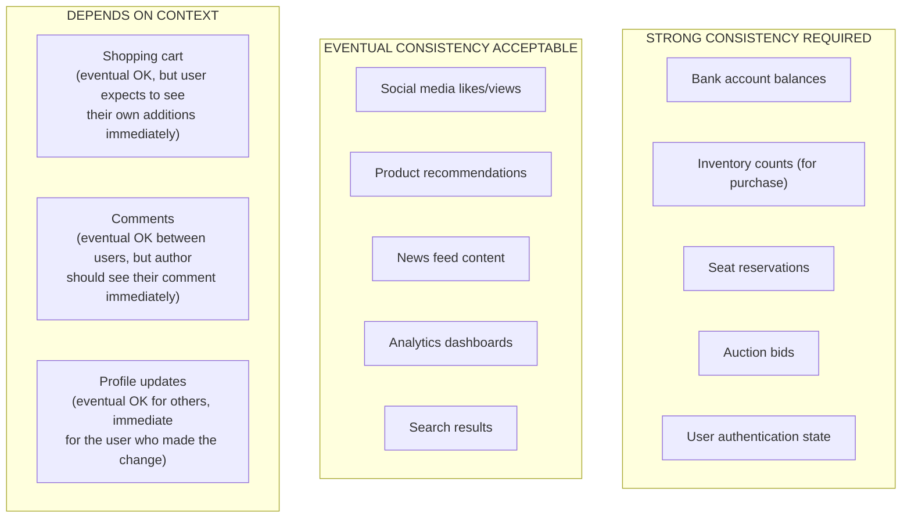

<details>
<summary>ASCII diagram (reference)</summary>

```text
┌─────────────────────────────────────────────────────────────┐
│           CONSISTENCY REQUIREMENTS BY USE CASE               │
├─────────────────────────────────────────────────────────────┤
│                                                              │
│  STRONG CONSISTENCY REQUIRED:                               │
│  ├── Bank account balances                                  │
│  ├── Inventory counts (for purchase)                        │
│  ├── Seat reservations                                      │
│  ├── Auction bids                                           │
│  └── User authentication state                              │
│                                                              │
│  EVENTUAL CONSISTENCY ACCEPTABLE:                           │
│  ├── Social media likes/views                               │
│  ├── Product recommendations                                │
│  ├── News feed content                                      │
│  ├── Analytics dashboards                                   │
│  └── Search results                                         │
│                                                              │
│  DEPENDS ON CONTEXT:                                        │
│  ├── Shopping cart (eventual OK, but user expects to see    │
│  │   their own additions immediately)                       │
│  ├── Comments (eventual OK between users, but author        │
│  │   should see their comment immediately)                  │
│  └── Profile updates (eventual OK for others, immediate     │
│       for the user who made the change)                     │
│                                                              │
└─────────────────────────────────────────────────────────────┘
```
</details>

### What Breaks Without Understanding Consistency

**1. Lost Updates**
```
User A reads balance: $1,000
User B reads balance: $1,000
User A withdraws $100, writes: $900
User B withdraws $200, writes: $800  ← Overwrites A's withdrawal!

Result: $200 disappeared!
```

**2. Dirty Reads**
```
Transaction A: UPDATE balance = balance - 100 (not committed yet)
Transaction B: SELECT balance → Sees $900
Transaction A: ROLLBACK

Transaction B made a decision based on data that never existed!
```

**3. Non-Repeatable Reads**
```
Transaction A: SELECT balance → $1,000
Transaction B: UPDATE balance = $900, COMMIT
Transaction A: SELECT balance → $900

Same transaction, two different values!
```

### Real Examples

**Amazon DynamoDB Design**: Amazon's Dynamo paper (2007) introduced tunable consistency because they realized different data has different needs. Shopping cart availability > consistency. Payment processing needs strong consistency.

**Facebook TAO**: Facebook's graph database uses eventual consistency for most reads but provides "read-your-writes" for the user who made the change. This balances performance with user experience.

---

## 2️⃣ Intuition and Mental Model

### The Newspaper Analogy (Revisited)

**Strong Consistency = Live News Broadcast**
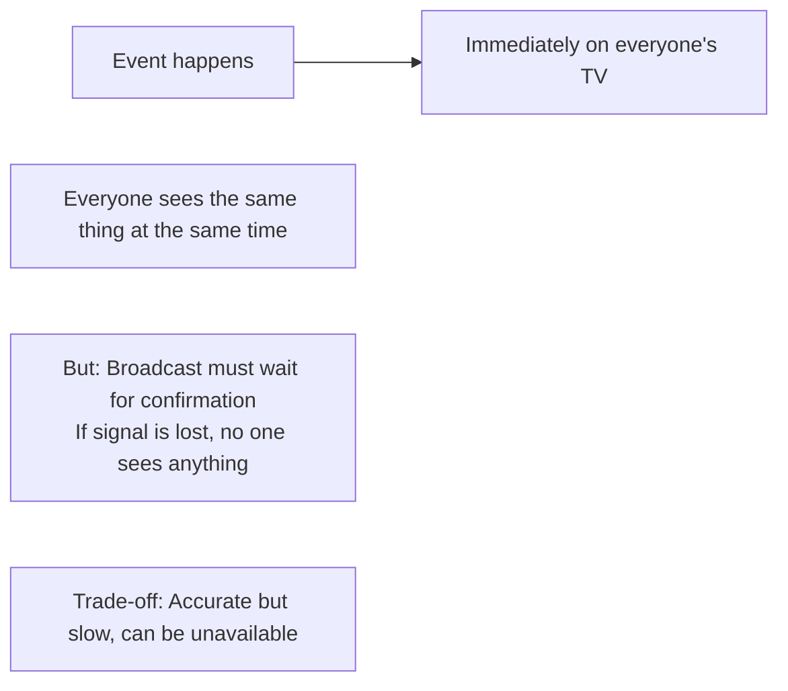

<details>
<summary>ASCII diagram (reference)</summary>

```text
┌─────────────────────────────────────────────────────────────┐
│                   LIVE NEWS BROADCAST                        │
│                                                              │
│  Event happens → Immediately on everyone's TV               │
│                                                              │
│  Everyone sees the same thing at the same time              │
│  But: Broadcast must wait for confirmation                  │
│       If signal is lost, no one sees anything               │
│                                                              │
│  Trade-off: Accurate but slow, can be unavailable          │
└─────────────────────────────────────────────────────────────┘
```
</details>

**Eventual Consistency = Newspaper Distribution**
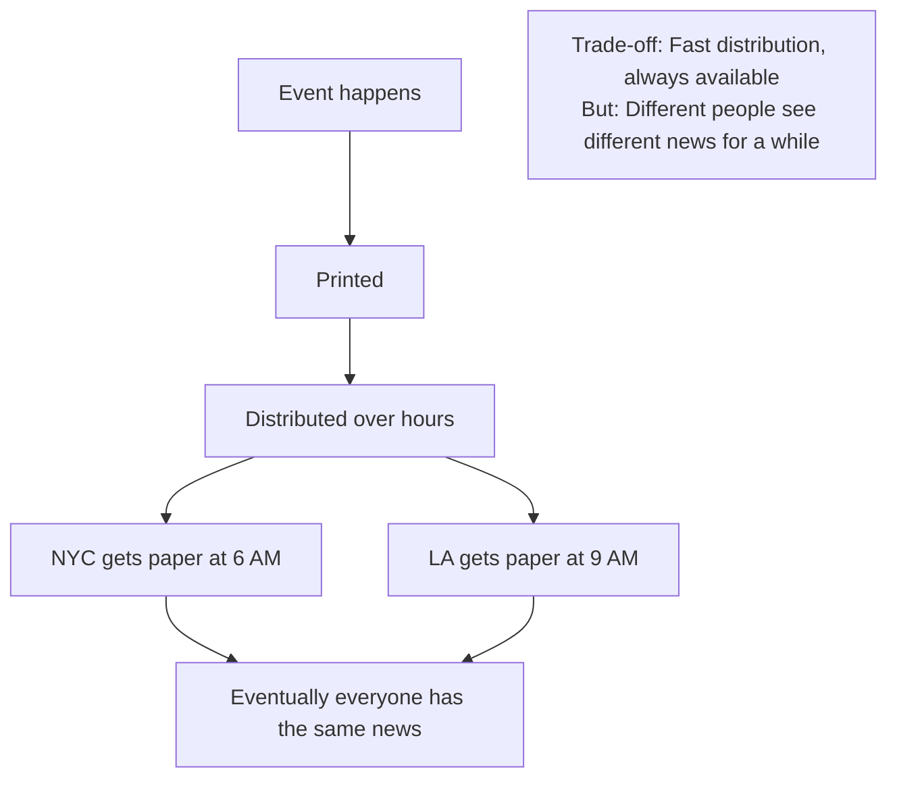

<details>
<summary>ASCII diagram (reference)</summary>

```text
┌─────────────────────────────────────────────────────────────┐
│                  NEWSPAPER DISTRIBUTION                      │
│                                                              │
│  Event happens → Printed → Distributed over hours           │
│                                                              │
│  NYC gets paper at 6 AM                                     │
│  LA gets paper at 9 AM                                      │
│  Eventually everyone has the same news                      │
│                                                              │
│  Trade-off: Fast distribution, always available             │
│             But: Different people see different news        │
│             for a while                                      │
└─────────────────────────────────────────────────────────────┘
```
</details>

**Causal Consistency = News with Context**
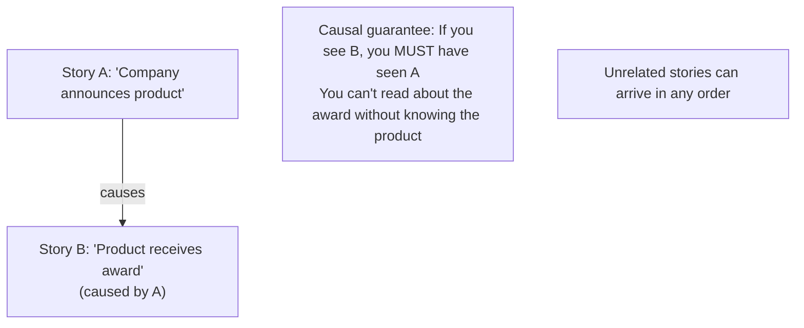

<details>
<summary>ASCII diagram (reference)</summary>

```text
┌─────────────────────────────────────────────────────────────┐
│                   NEWS WITH CONTEXT                          │
│                                                              │
│  Story A: "Company announces product"                       │
│  Story B: "Product receives award" (caused by A)            │
│                                                              │
│  Causal guarantee: If you see B, you MUST have seen A      │
│  You can't read about the award without knowing the product │
│                                                              │
│  Unrelated stories can arrive in any order                  │
└─────────────────────────────────────────────────────────────┘
```
</details>

---

## 3️⃣ How It Works Internally

### Strong Consistency (Linearizability)

**Definition**: Every read returns the most recent write. Operations appear to happen instantaneously at some point between their start and end.

**How databases implement it**:

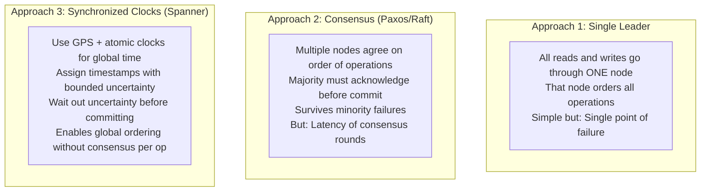

<details>
<summary>ASCII diagram (reference)</summary>

```text
┌─────────────────────────────────────────────────────────────┐
│            LINEARIZABILITY IMPLEMENTATION                    │
│                                                              │
│  Approach 1: Single Leader                                  │
│  ┌─────────────────────────────────────────────────────┐   │
│  │  All reads and writes go through ONE node           │   │
│  │  That node orders all operations                    │   │
│  │  Simple but: Single point of failure                │   │
│  └─────────────────────────────────────────────────────┘   │
│                                                              │
│  Approach 2: Consensus (Paxos/Raft)                         │
│  ┌─────────────────────────────────────────────────────┐   │
│  │  Multiple nodes agree on order of operations        │   │
│  │  Majority must acknowledge before commit            │   │
│  │  Survives minority failures                         │   │
│  │  But: Latency of consensus rounds                   │   │
│  └─────────────────────────────────────────────────────┘   │
│                                                              │
│  Approach 3: Synchronized Clocks (Spanner)                  │
│  ┌─────────────────────────────────────────────────────┐   │
│  │  Use GPS + atomic clocks for global time            │   │
│  │  Assign timestamps with bounded uncertainty         │   │
│  │  Wait out uncertainty before committing             │   │
│  │  Enables global ordering without consensus per op   │   │
│  └─────────────────────────────────────────────────────┘   │
│                                                              │
└─────────────────────────────────────────────────────────────┘
```
</details>

**Cost of linearizability**:

```
Single datacenter:
  Consensus round-trip: 1-5ms
  Total write latency: 5-20ms

Cross-datacenter (US East to West):
  Network round-trip: 60-80ms
  Consensus needs 2-3 round-trips
  Total write latency: 150-250ms

Global (US to Asia):
  Network round-trip: 150-200ms
  Total write latency: 400-600ms
```

### Eventual Consistency

**Definition**: If no new updates are made, all replicas will eventually converge to the same value. No guarantees about what you'll read in the meantime.

**How databases implement it**:

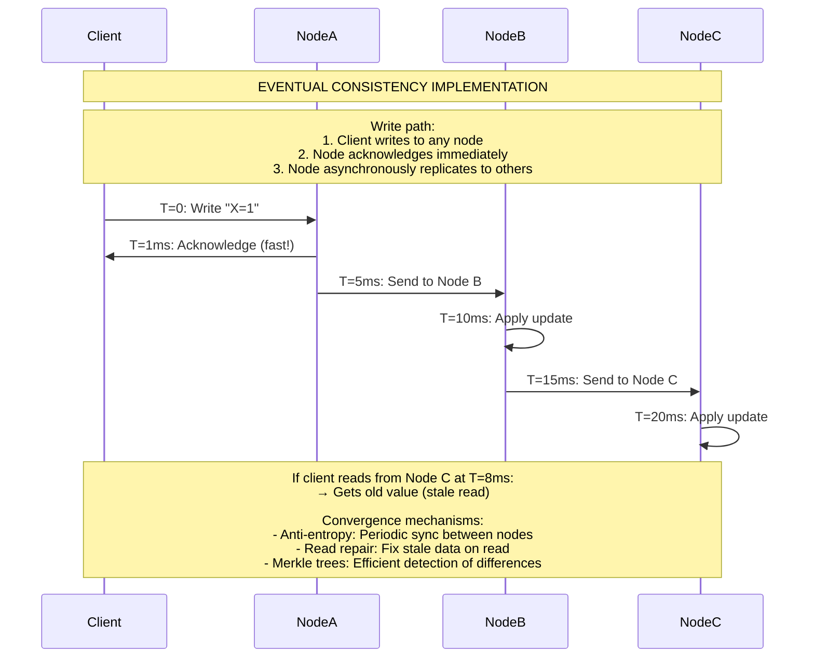

<details>
<summary>ASCII diagram (reference)</summary>

```text
┌─────────────────────────────────────────────────────────────┐
│            EVENTUAL CONSISTENCY IMPLEMENTATION               │
│                                                              │
│  Write path:                                                │
│  1. Client writes to any node                               │
│  2. Node acknowledges immediately                           │
│  3. Node asynchronously replicates to others                │
│                                                              │
│  Timeline:                                                   │
│  T=0:    Write "X=1" to Node A                              │
│  T=1ms:  Node A acknowledges (fast!)                        │
│  T=5ms:  Node A sends to Node B                             │
│  T=10ms: Node B applies update                              │
│  T=15ms: Node B sends to Node C                             │
│  T=20ms: Node C applies update                              │
│                                                              │
│  If client reads from Node C at T=8ms:                      │
│  → Gets old value (stale read)                              │
│                                                              │
│  Convergence mechanisms:                                     │
│  - Anti-entropy: Periodic sync between nodes                │
│  - Read repair: Fix stale data on read                      │
│  - Merkle trees: Efficient detection of differences         │
│                                                              │
└─────────────────────────────────────────────────────────────┘
```
</details>

### Causal Consistency

**Definition**: Operations that are causally related are seen by all nodes in the same order. Concurrent (unrelated) operations can be seen in any order.

**What is "causally related"?**:
- If A reads X, then writes Y, the write to Y depends on the read of X
- If A writes X, and B reads X then writes Y, B's write depends on A's write

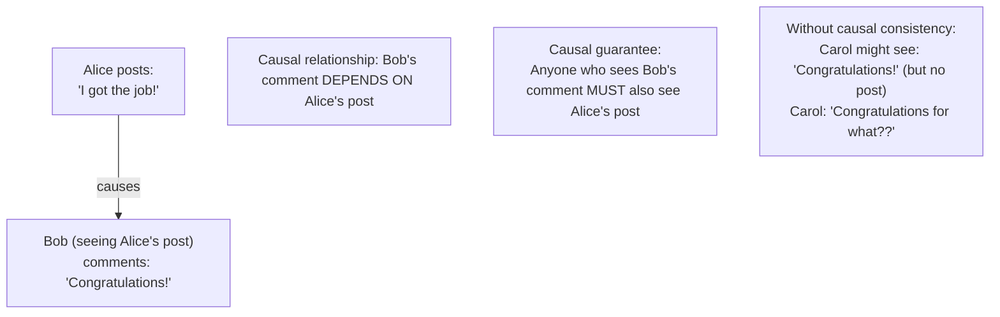

<details>
<summary>ASCII diagram (reference)</summary>

```text
┌─────────────────────────────────────────────────────────────┐
│            CAUSAL CONSISTENCY EXAMPLE                        │
│                                                              │
│  Alice posts: "I got the job!"                              │
│  Bob (seeing Alice's post) comments: "Congratulations!"     │
│                                                              │
│  Causal relationship: Bob's comment DEPENDS ON Alice's post │
│                                                              │
│  Causal guarantee:                                           │
│  Anyone who sees Bob's comment MUST also see Alice's post   │
│                                                              │
│  Without causal consistency:                                │
│  Carol might see: "Congratulations!" (but no post)          │
│  Carol: "Congratulations for what??"                        │
│                                                              │
└─────────────────────────────────────────────────────────────┘
```
</details>

**Implementation using vector clocks**:

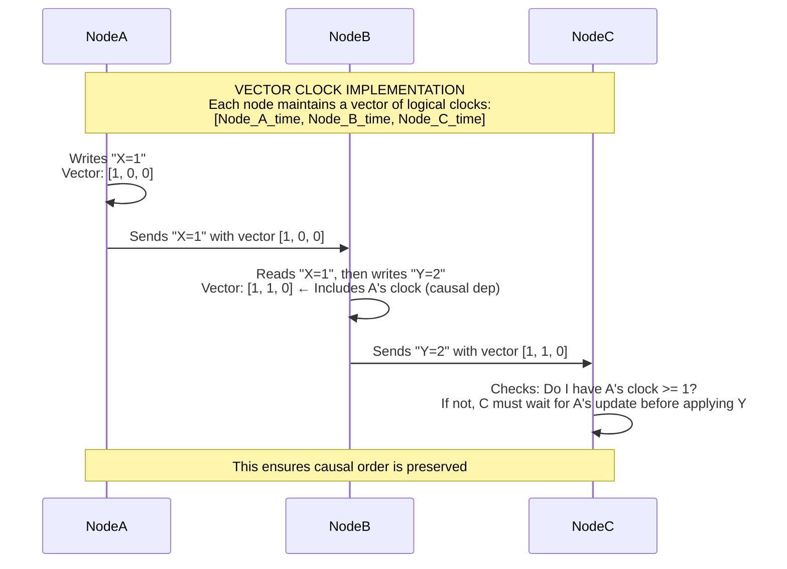

<details>
<summary>ASCII diagram (reference)</summary>

```text
┌─────────────────────────────────────────────────────────────┐
│            VECTOR CLOCK IMPLEMENTATION                       │
│                                                              │
│  Each node maintains a vector of logical clocks:            │
│  [Node_A_time, Node_B_time, Node_C_time]                    │
│                                                              │
│  Node A writes "X=1":                                        │
│  Vector: [1, 0, 0]                                          │
│                                                              │
│  Node B reads "X=1", then writes "Y=2":                     │
│  Vector: [1, 1, 0]  ← Includes A's clock (causal dep)       │
│                                                              │
│  Node C receives "Y=2" with vector [1, 1, 0]:               │
│  C checks: Do I have A's clock >= 1?                        │
│  If not, C must wait for A's update before applying Y       │
│                                                              │
│  This ensures causal order is preserved                     │
│                                                              │
└─────────────────────────────────────────────────────────────┘
```
</details>

### Read-Your-Writes Consistency

**Definition**: A client will always see their own writes. Other clients may not.

**Implementation strategies**:

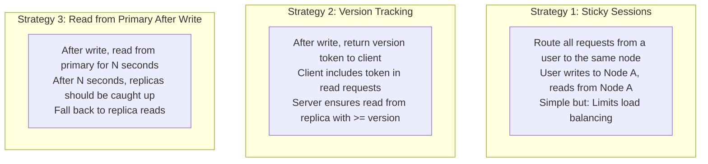

<details>
<summary>ASCII diagram (reference)</summary>

```text
┌─────────────────────────────────────────────────────────────┐
│         READ-YOUR-WRITES IMPLEMENTATION                      │
│                                                              │
│  Strategy 1: Sticky Sessions                                │
│  ┌─────────────────────────────────────────────────────┐   │
│  │  Route all requests from a user to the same node    │   │
│  │  User writes to Node A, reads from Node A           │   │
│  │  Simple but: Limits load balancing                  │   │
│  └─────────────────────────────────────────────────────┘   │
│                                                              │
│  Strategy 2: Version Tracking                               │
│  ┌─────────────────────────────────────────────────────┐   │
│  │  After write, return version token to client        │   │
│  │  Client includes token in read requests             │   │
│  │  Server ensures read from replica with >= version   │   │
│  └─────────────────────────────────────────────────────┘   │
│                                                              │
│  Strategy 3: Read from Primary After Write                  │
│  ┌─────────────────────────────────────────────────────┐   │
│  │  After write, read from primary for N seconds       │   │
│  │  After N seconds, replicas should be caught up      │   │
│  │  Fall back to replica reads                         │   │
│  └─────────────────────────────────────────────────────┘   │
│                                                              │
└─────────────────────────────────────────────────────────────┘
```
</details>

### Tunable Consistency (Cassandra Style)

**Definition**: Let the application choose consistency level per operation.

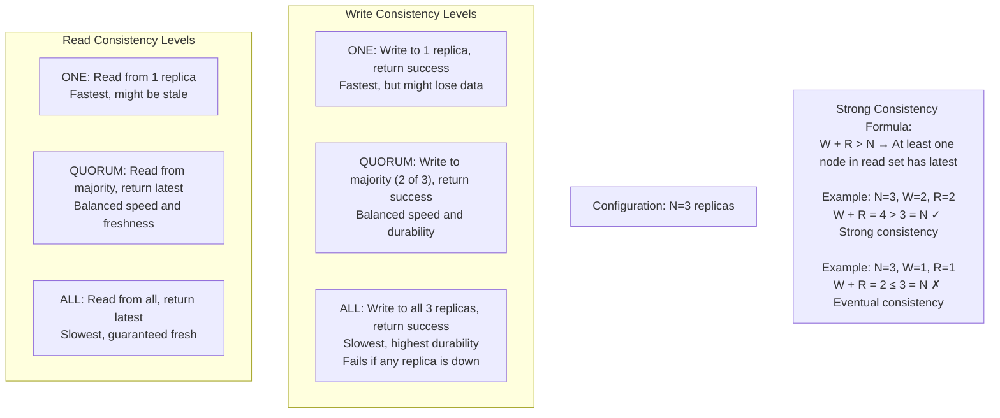

<details>
<summary>ASCII diagram (reference)</summary>

```text
┌─────────────────────────────────────────────────────────────┐
│            CASSANDRA CONSISTENCY LEVELS                      │
│                                                              │
│  Configuration: N=3 replicas                                │
│                                                              │
│  Write Consistency Levels:                                  │
│  ┌─────────────────────────────────────────────────────┐   │
│  │  ONE:    Write to 1 replica, return success         │   │
│  │          Fastest, but might lose data               │   │
│  │                                                      │   │
│  │  QUORUM: Write to majority (2 of 3), return success │   │
│  │          Balanced speed and durability              │   │
│  │                                                      │   │
│  │  ALL:    Write to all 3 replicas, return success    │   │
│  │          Slowest, highest durability                │   │
│  │          Fails if any replica is down               │   │
│  └─────────────────────────────────────────────────────┘   │
│                                                              │
│  Read Consistency Levels:                                   │
│  ┌─────────────────────────────────────────────────────┐   │
│  │  ONE:    Read from 1 replica                        │   │
│  │          Fastest, might be stale                    │   │
│  │                                                      │   │
│  │  QUORUM: Read from majority, return latest          │   │
│  │          Balanced speed and freshness               │   │
│  │                                                      │   │
│  │  ALL:    Read from all, return latest               │   │
│  │          Slowest, guaranteed fresh                  │   │
│  └─────────────────────────────────────────────────────┘   │
│                                                              │
│  Strong Consistency Formula:                                │
│  W + R > N  →  At least one node in read set has latest    │
│                                                              │
│  Example: N=3, W=2, R=2                                     │
│  W + R = 4 > 3 = N  ✓ Strong consistency                   │
│                                                              │
│  Example: N=3, W=1, R=1                                     │
│  W + R = 2 ≤ 3 = N  ✗ Eventual consistency                 │
│                                                              │
└─────────────────────────────────────────────────────────────┘
```
</details>

---

## 4️⃣ Simulation-First Explanation

### Scenario 1: Banking with Strong Consistency

```
Setup: 3-node cluster with Raft consensus
Initial balance: $1,000

T=0ms: User A initiates withdrawal of $600
  → Request goes to leader
  → Leader proposes: balance = $400
  → Leader waits for majority (2 of 3) to acknowledge
  
T=5ms: Node 2 acknowledges
T=8ms: Node 3 acknowledges (majority achieved)
T=10ms: Leader commits, responds to User A: "Success, balance: $400"

T=15ms: User B checks balance from Node 3
  → Node 3 has committed value
  → Returns: $400 ✓

Total write latency: 10ms
Guarantee: User B sees the withdrawal immediately
```

### Scenario 2: Social Media with Eventual Consistency

```
Setup: 3-node cluster with async replication
Initial likes: 100

T=0ms: User A likes post (request to Node 1)
  → Node 1 increments locally: 101
  → Node 1 responds immediately: "Liked!"
  → Node 1 queues replication to Node 2, 3

T=1ms: User A sees: 101 likes ✓ (reading from Node 1)

T=2ms: User B checks likes (request to Node 2)
  → Node 2 still has: 100 (replication not arrived)
  → User B sees: 100 likes (stale, but acceptable)

T=10ms: Replication arrives at Node 2
  → Node 2 updates: 101

T=15ms: User B refreshes
  → User B sees: 101 likes ✓

Total write latency: 1ms (fast!)
Staleness window: ~10ms
Acceptable for likes, not for bank balance
```

### Scenario 3: Shopping Cart with Tunable Consistency

```
Setup: Cassandra with N=3, configurable W and R

User adds item to cart:

Option A: W=1, R=1 (eventual consistency)
  T=0ms: Write to 1 node
  T=1ms: Response to user
  
  If user reads from different node immediately:
  → Might not see the item (stale)
  
  Use case: Background analytics, non-critical

Option B: W=QUORUM (2), R=QUORUM (2)
  T=0ms: Write to 2 nodes
  T=5ms: Both acknowledge
  T=6ms: Response to user
  
  If user reads from any 2 nodes:
  → At least 1 has the item → sees it
  
  Use case: Shopping cart (user expects to see their items)

Option C: W=ALL (3), R=ONE (1)
  T=0ms: Write to all 3 nodes
  T=10ms: All acknowledge
  T=11ms: Response to user
  
  Any read will see the item
  But: If any node is down, write fails
  
  Use case: Critical data, can tolerate write failures
```

### Scenario 4: Read-Your-Writes with Version Tracking

```
Setup: Primary + 2 replicas, async replication

T=0ms: User updates profile name to "Alice Smith"
  → Write to primary
  → Primary returns: version=42

T=1ms: User's client stores: last_write_version=42

T=2ms: User views profile (client includes version=42)
  → Load balancer routes to Replica 1
  → Replica 1 checks: my_version=40 < 42
  → Replica 1: "I'm behind, forwarding to primary"
  → Primary returns: "Alice Smith"

T=50ms: Replicas catch up to version 42

T=100ms: User views profile again (client includes version=42)
  → Load balancer routes to Replica 2
  → Replica 2 checks: my_version=45 >= 42
  → Replica 2 returns: "Alice Smith"
  → No need to hit primary!

Result: User always sees their own updates
        Other users might see stale data briefly
        System scales reads to replicas when possible
```

---

## 5️⃣ How Engineers Actually Use This in Production

### At Major Companies

**Amazon DynamoDB**:
```
Default: Eventually consistent reads
Option: Strongly consistent reads (2x cost, higher latency)

Usage pattern:
- Shopping cart: Eventually consistent (availability > consistency)
- Order placement: Strongly consistent (can't double-charge)
- Product catalog: Eventually consistent (stale price OK briefly)
```

**Google Spanner**:
```
Always: Externally consistent (linearizable)
How: TrueTime API with GPS + atomic clocks

Usage:
- AdWords billing: Must be consistent (money involved)
- Global transactions: Need ordering guarantees
- Trade-off: Higher latency (commit-wait for clock uncertainty)
```

**Facebook TAO**:
```
Default: Eventual consistency
Enhancement: Read-your-writes for the writing user

Usage:
- User posts status: Eventual to followers, immediate to poster
- Like counts: Eventual (approximate is fine)
- Friend relationships: Eventual with conflict resolution
```

**Cassandra at Netflix**:
```
Typical configuration:
- Writes: LOCAL_QUORUM (majority in local datacenter)
- Reads: LOCAL_ONE (single node in local datacenter)

Why LOCAL_QUORUM writes:
- Durability: Data on multiple nodes before ack
- Availability: Don't wait for cross-DC replication

Why LOCAL_ONE reads:
- Speed: Single node response
- Acceptable staleness: Viewing history can be slightly stale
```

### Decision Framework

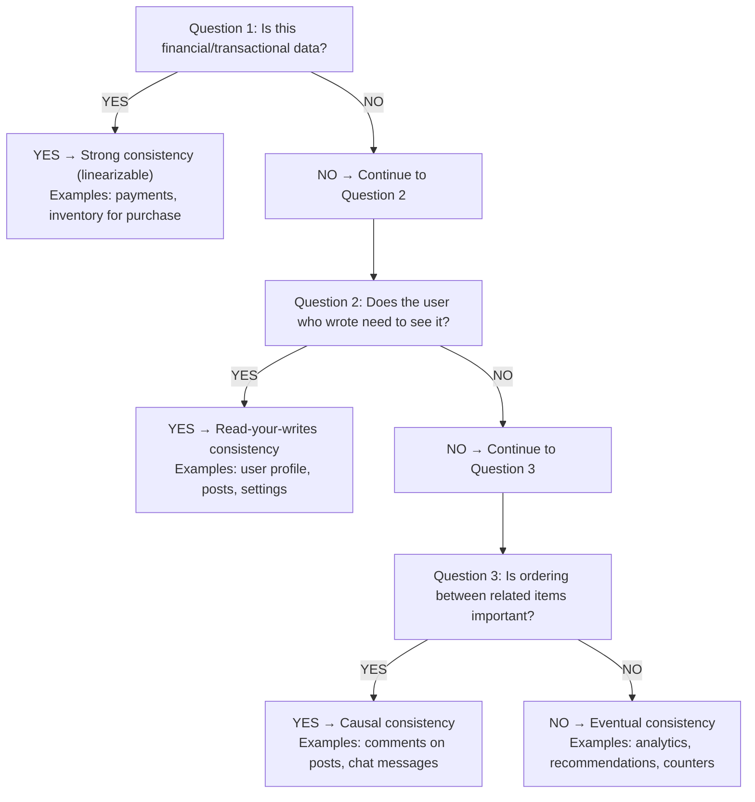

<details>
<summary>ASCII diagram (reference)</summary>

```text
┌─────────────────────────────────────────────────────────────┐
│         CONSISTENCY LEVEL DECISION FRAMEWORK                 │
├─────────────────────────────────────────────────────────────┤
│                                                              │
│  Question 1: Is this financial/transactional data?          │
│  ├── YES → Strong consistency (linearizable)                │
│  │         Examples: payments, inventory for purchase       │
│  │                                                          │
│  └── NO → Continue to Question 2                            │
│                                                              │
│  Question 2: Does the user who wrote need to see it?        │
│  ├── YES → Read-your-writes consistency                     │
│  │         Examples: user profile, posts, settings          │
│  │                                                          │
│  └── NO → Continue to Question 3                            │
│                                                              │
│  Question 3: Is ordering between related items important?   │
│  ├── YES → Causal consistency                               │
│  │         Examples: comments on posts, chat messages       │
│  │                                                          │
│  └── NO → Eventual consistency                              │
│           Examples: analytics, recommendations, counters    │
│                                                              │
└─────────────────────────────────────────────────────────────┘
```
</details>

---

## 6️⃣ How to Implement or Apply It

### Cassandra Tunable Consistency in Java

```java
package com.example.consistency;

import com.datastax.oss.driver.api.core.CqlSession;
import com.datastax.oss.driver.api.core.ConsistencyLevel;
import com.datastax.oss.driver.api.core.cql.*;

/**
 * Demonstrates tunable consistency in Cassandra.
 */
public class CassandraConsistencyExample {
    
    private final CqlSession session;
    
    public CassandraConsistencyExample(CqlSession session) {
        this.session = session;
    }
    
    /**
     * Write with strong consistency (QUORUM).
     * Use for important data that must be durable.
     */
    public void writeWithQuorum(String userId, String data) {
        PreparedStatement stmt = session.prepare(
            "INSERT INTO user_data (user_id, data, updated_at) VALUES (?, ?, toTimestamp(now()))"
        );
        
        BoundStatement bound = stmt.bind(userId, data)
            .setConsistencyLevel(ConsistencyLevel.QUORUM);  // Write to majority
        
        session.execute(bound);
    }
    
    /**
     * Write with eventual consistency (ONE).
     * Use for high-throughput, non-critical data.
     */
    public void writeWithOne(String userId, String data) {
        PreparedStatement stmt = session.prepare(
            "INSERT INTO user_data (user_id, data, updated_at) VALUES (?, ?, toTimestamp(now()))"
        );
        
        BoundStatement bound = stmt.bind(userId, data)
            .setConsistencyLevel(ConsistencyLevel.ONE);  // Write to single node
        
        session.execute(bound);
    }
    
    /**
     * Read with strong consistency.
     * Guarantees latest value if writes use QUORUM.
     */
    public String readWithQuorum(String userId) {
        PreparedStatement stmt = session.prepare(
            "SELECT data FROM user_data WHERE user_id = ?"
        );
        
        BoundStatement bound = stmt.bind(userId)
            .setConsistencyLevel(ConsistencyLevel.QUORUM);  // Read from majority
        
        ResultSet rs = session.execute(bound);
        Row row = rs.one();
        return row != null ? row.getString("data") : null;
    }
    
    /**
     * Read with eventual consistency.
     * Fast but might return stale data.
     */
    public String readWithOne(String userId) {
        PreparedStatement stmt = session.prepare(
            "SELECT data FROM user_data WHERE user_id = ?"
        );
        
        BoundStatement bound = stmt.bind(userId)
            .setConsistencyLevel(ConsistencyLevel.ONE);  // Read from single node
        
        ResultSet rs = session.execute(bound);
        Row row = rs.one();
        return row != null ? row.getString("data") : null;
    }
    
    /**
     * Local datacenter consistency.
     * Good for multi-DC deployments.
     */
    public void writeLocalQuorum(String userId, String data) {
        PreparedStatement stmt = session.prepare(
            "INSERT INTO user_data (user_id, data, updated_at) VALUES (?, ?, toTimestamp(now()))"
        );
        
        BoundStatement bound = stmt.bind(userId, data)
            .setConsistencyLevel(ConsistencyLevel.LOCAL_QUORUM);  // Majority in local DC
        
        session.execute(bound);
    }
}
```

### Read-Your-Writes in Spring Boot

```java
package com.example.consistency;

import org.springframework.stereotype.Service;
import org.springframework.web.context.request.RequestContextHolder;
import org.springframework.web.context.request.ServletRequestAttributes;
import jakarta.servlet.http.HttpSession;

/**
 * Implements read-your-writes consistency using session-based version tracking.
 */
@Service
public class ReadYourWritesService {
    
    private final UserRepository primaryRepo;      // Writes and consistent reads
    private final UserRepository replicaRepo;      // Fast reads
    
    public ReadYourWritesService(UserRepository primaryRepo, 
                                  UserRepository replicaRepo) {
        this.primaryRepo = primaryRepo;
        this.replicaRepo = replicaRepo;
    }
    
    /**
     * Write user data and track the version.
     */
    public User updateUser(String userId, UserUpdateRequest request) {
        // Write to primary
        User user = primaryRepo.findById(userId).orElseThrow();
        user.setName(request.getName());
        user.setEmail(request.getEmail());
        user.setVersion(user.getVersion() + 1);
        User saved = primaryRepo.save(user);
        
        // Store version in session
        HttpSession session = getSession();
        session.setAttribute("user_version_" + userId, saved.getVersion());
        
        return saved;
    }
    
    /**
     * Read user data with read-your-writes guarantee.
     */
    public User getUser(String userId) {
        HttpSession session = getSession();
        Long requiredVersion = (Long) session.getAttribute("user_version_" + userId);
        
        if (requiredVersion != null) {
            // User has written, need to check version
            User replicaUser = replicaRepo.findById(userId).orElse(null);
            
            if (replicaUser != null && replicaUser.getVersion() >= requiredVersion) {
                // Replica is up to date
                return replicaUser;
            } else {
                // Replica is behind, read from primary
                return primaryRepo.findById(userId).orElseThrow();
            }
        } else {
            // User hasn't written, replica is fine
            return replicaRepo.findById(userId).orElseThrow();
        }
    }
    
    private HttpSession getSession() {
        ServletRequestAttributes attr = (ServletRequestAttributes) 
            RequestContextHolder.currentRequestAttributes();
        return attr.getRequest().getSession();
    }
}
```

### DynamoDB Consistency Options

```java
package com.example.consistency;

import software.amazon.awssdk.services.dynamodb.DynamoDbClient;
import software.amazon.awssdk.services.dynamodb.model.*;
import java.util.Map;

/**
 * DynamoDB consistency options demonstration.
 */
public class DynamoDBConsistencyExample {
    
    private final DynamoDbClient client;
    
    public DynamoDBConsistencyExample(DynamoDbClient client) {
        this.client = client;
    }
    
    /**
     * Eventually consistent read (default, faster, cheaper).
     */
    public Map<String, AttributeValue> eventuallyConsistentRead(String tableName, 
                                                                  String key) {
        GetItemRequest request = GetItemRequest.builder()
            .tableName(tableName)
            .key(Map.of("id", AttributeValue.builder().s(key).build()))
            .consistentRead(false)  // Eventually consistent (default)
            .build();
        
        GetItemResponse response = client.getItem(request);
        return response.item();
    }
    
    /**
     * Strongly consistent read (slower, 2x cost).
     */
    public Map<String, AttributeValue> stronglyConsistentRead(String tableName, 
                                                                String key) {
        GetItemRequest request = GetItemRequest.builder()
            .tableName(tableName)
            .key(Map.of("id", AttributeValue.builder().s(key).build()))
            .consistentRead(true)  // Strongly consistent
            .build();
        
        GetItemResponse response = client.getItem(request);
        return response.item();
    }
    
    /**
     * Write with condition (optimistic locking).
     * Ensures we don't overwrite concurrent updates.
     */
    public void conditionalWrite(String tableName, String key, 
                                  String newValue, long expectedVersion) {
        PutItemRequest request = PutItemRequest.builder()
            .tableName(tableName)
            .item(Map.of(
                "id", AttributeValue.builder().s(key).build(),
                "value", AttributeValue.builder().s(newValue).build(),
                "version", AttributeValue.builder().n(String.valueOf(expectedVersion + 1)).build()
            ))
            .conditionExpression("version = :v")
            .expressionAttributeValues(Map.of(
                ":v", AttributeValue.builder().n(String.valueOf(expectedVersion)).build()
            ))
            .build();
        
        try {
            client.putItem(request);
        } catch (ConditionalCheckFailedException e) {
            throw new OptimisticLockException("Version mismatch, retry needed");
        }
    }
}
```

### MongoDB Read Preference and Write Concern

```java
package com.example.consistency;

import com.mongodb.ReadPreference;
import com.mongodb.WriteConcern;
import com.mongodb.client.MongoCollection;
import com.mongodb.client.MongoDatabase;
import org.bson.Document;

/**
 * MongoDB consistency configuration.
 */
public class MongoDBConsistencyExample {
    
    private final MongoDatabase database;
    
    public MongoDBConsistencyExample(MongoDatabase database) {
        this.database = database;
    }
    
    /**
     * Write with majority acknowledgment.
     * Data is durable on majority of replica set.
     */
    public void writeWithMajority(String collectionName, Document doc) {
        MongoCollection<Document> collection = database
            .getCollection(collectionName)
            .withWriteConcern(WriteConcern.MAJORITY);
        
        collection.insertOne(doc);
    }
    
    /**
     * Read from primary only (strong consistency).
     */
    public Document readFromPrimary(String collectionName, Document query) {
        MongoCollection<Document> collection = database
            .getCollection(collectionName)
            .withReadPreference(ReadPreference.primary());
        
        return collection.find(query).first();
    }
    
    /**
     * Read from nearest node (eventual consistency, low latency).
     */
    public Document readFromNearest(String collectionName, Document query) {
        MongoCollection<Document> collection = database
            .getCollection(collectionName)
            .withReadPreference(ReadPreference.nearest());
        
        return collection.find(query).first();
    }
    
    /**
     * Read from secondary preferred (offload primary).
     */
    public Document readFromSecondary(String collectionName, Document query) {
        MongoCollection<Document> collection = database
            .getCollection(collectionName)
            .withReadPreference(ReadPreference.secondaryPreferred());
        
        return collection.find(query).first();
    }
}
```

---

## 7️⃣ Tradeoffs, Pitfalls, and Common Mistakes

### Common Mistake 1: Using Eventual Consistency for Critical Data

```java
// WRONG: Bank balance with eventual consistency
public void withdraw(String accountId, BigDecimal amount) {
    BigDecimal balance = accountRepo.readEventually(accountId);  // Might be stale!
    if (balance.compareTo(amount) >= 0) {
        accountRepo.writeEventually(accountId, balance.subtract(amount));
    }
}

// Result: User might overdraw if stale read shows higher balance

// RIGHT: Strong consistency for financial operations
@Transactional
public void withdraw(String accountId, BigDecimal amount) {
    BigDecimal balance = accountRepo.readStrong(accountId);  // Latest value
    if (balance.compareTo(amount) >= 0) {
        accountRepo.writeStrong(accountId, balance.subtract(amount));
    } else {
        throw new InsufficientFundsException();
    }
}
```

### Common Mistake 2: Ignoring Read-Your-Writes

```java
// WRONG: User updates profile, then can't see their changes
public void updateProfile(String userId, ProfileUpdate update) {
    profileRepo.save(update);  // Goes to primary
}

public Profile getProfile(String userId) {
    return profileRepo.findById(userId);  // Goes to replica - might be stale!
}

// User experience:
// 1. User updates name to "Alice Smith"
// 2. User sees profile: "Alice Jones" (old name)
// 3. User confused, tries again
// 4. Eventually sees "Alice Smith"
// 5. User lost trust in the system

// RIGHT: Implement read-your-writes
public Profile getProfile(String userId, Long lastWriteVersion) {
    if (lastWriteVersion != null) {
        Profile profile = replicaRepo.findById(userId);
        if (profile.getVersion() < lastWriteVersion) {
            return primaryRepo.findById(userId);  // Read from primary
        }
        return profile;
    }
    return replicaRepo.findById(userId);
}
```

### Common Mistake 3: Assuming Quorum = Strong Consistency

```
WRONG assumption: W=2, R=2 with N=3 always gives strong consistency

Problem: Sloppy quorums

Scenario:
- Nodes: A, B, C (normal)
- Node C goes down
- System uses Node D as temporary replacement (sloppy quorum)
- Write goes to A, B (W=2 satisfied)
- Node C comes back, D hasn't synced yet
- Read from B, C (R=2 satisfied)
- C has old data!

Result: Read might miss the write even with W+R > N

Solution: Use strict quorums or understand your database's behavior
```

### Common Mistake 4: Over-Engineering Consistency

```
Scenario: Analytics dashboard

WRONG: Using strong consistency for page view counts
- Every view count read hits primary
- Primary becomes bottleneck
- Dashboard is slow
- Page views don't need to be exact!

RIGHT: Use eventual consistency
- Reads go to replicas
- Counts might be slightly off
- Dashboard is fast
- Users don't notice 5-second-old counts
```

### Performance Impact

```
Consistency Level Performance Comparison (typical):

Operation: Single read

Eventual (ONE):     1-5ms
Quorum:             10-30ms (wait for majority)
Strong (ALL):       20-50ms (wait for all)
Cross-DC Quorum:    100-200ms (network latency)

Operation: Single write

Eventual (ONE):     1-5ms
Quorum:             10-30ms
Strong (ALL):       20-100ms (slowest replica)
Cross-DC Quorum:    150-300ms

Choose based on requirements, not defaults!
```

---

## 8️⃣ When NOT to Use This

### When NOT to Use Strong Consistency

1. **High-throughput analytics**
   - Page views, click tracking
   - Approximate counts are fine
   - Strong consistency would bottleneck

2. **Social media feeds**
   - Slight delay in seeing posts is acceptable
   - Availability more important than freshness

3. **Caching layers**
   - Cache is inherently eventually consistent
   - Strong consistency defeats caching purpose

4. **Cross-datacenter reads**
   - Latency would be unacceptable
   - Use local eventual reads with async replication

### When NOT to Use Eventual Consistency

1. **Financial transactions**
   - Money transfers, payments
   - Can't have stale balance reads

2. **Inventory management (for purchase)**
   - Can't oversell limited items
   - Strong consistency required at purchase time

3. **Unique constraints**
   - Username registration
   - Must check globally, not eventually

4. **Security-critical data**
   - Permission changes should be immediate
   - Revoked access must be enforced immediately

### Signs Your Consistency Model is Wrong

**Too strong:**
- System is slow for no business reason
- Primary database is bottleneck
- Users complain about latency

**Too weak:**
- Users see confusing stale data
- Data anomalies in reports
- Race conditions causing bugs
- Financial discrepancies

---

## 9️⃣ Comparison with Alternatives

### Consistency Models Comparison

| Model | Guarantee | Latency | Use Case |
|-------|-----------|---------|----------|
| Linearizable | Latest value always | High | Financial |
| Sequential | Global order, not real-time | Medium | Distributed locks |
| Causal | Related ops ordered | Medium | Social features |
| Read-your-writes | See own writes | Low | User profiles |
| Eventual | Converges eventually | Lowest | Analytics, feeds |

### Database Consistency Defaults

| Database | Default | Options |
|----------|---------|---------|
| PostgreSQL | Strong (single node) | Async replication available |
| MySQL | Strong (single node) | Semi-sync, async replication |
| MongoDB | Eventual | Write concern, read preference |
| Cassandra | Eventual | Tunable per query |
| DynamoDB | Eventual | Strong read option |
| Spanner | Strong | Always linearizable |
| CockroachDB | Strong | Serializable by default |

### Cost Comparison

```
Consistency Level Costs (relative):

               Latency    Throughput    Availability
Eventual       1x         1x            Highest
Quorum         3-5x       0.3-0.5x      High
Strong         5-10x      0.1-0.3x      Lower

Cross-DC adds 10-50x latency to strong consistency!
```

---

## 🔟 Interview Follow-Up Questions WITH Answers

### L4 (Entry-Level) Questions

**Q1: What's the difference between strong and eventual consistency?**

**Answer:**
Strong consistency guarantees that after a write completes, all subsequent reads will return that value. It's like a single-server database where everyone sees the same data.

Eventual consistency only guarantees that if you stop writing, all replicas will eventually converge to the same value. In the meantime, different readers might see different values.

Strong consistency is easier to reason about but slower and less available. Eventual consistency is faster and more available but requires handling stale reads in application logic.

Example: Bank balance needs strong consistency (can't show wrong balance). Social media likes can use eventual consistency (off by a few for a second is fine).

**Q2: What is read-your-writes consistency?**

**Answer:**
Read-your-writes consistency guarantees that a user will always see their own writes. Other users might not see those writes immediately.

Example: You update your profile name. With read-your-writes, you'll always see your new name when you view your profile. But your friend might see your old name for a few seconds until replication catches up.

This is important for user experience. Without it, users get confused when they make a change and don't see it reflected.

Implementation: Track the version of a user's last write. When they read, ensure the replica has at least that version, or fall back to the primary.

### L5 (Mid-Level) Questions

**Q3: How would you implement tunable consistency in a distributed database?**

**Answer:**
Tunable consistency lets you choose the consistency level per operation. Here's how:

**Configuration:**
- N = total replicas (e.g., 3)
- W = write quorum (how many must acknowledge write)
- R = read quorum (how many to read from)

**Implementation:**

For writes:
1. Send write to all N replicas
2. Wait for W acknowledgments
3. Return success to client
4. Remaining replicas update asynchronously

For reads:
1. Send read to R replicas
2. Compare versions/timestamps
3. Return most recent value
4. Optionally trigger read repair for stale replicas

**Consistency guarantee:**
- If W + R > N, at least one node in read set has latest write
- This gives strong consistency

**Examples:**
- W=1, R=1: Eventual consistency, fastest
- W=2, R=2 (N=3): Strong consistency, balanced
- W=3, R=1: Strong writes, fast reads
- W=1, R=3: Fast writes, strong reads

The application chooses per operation based on requirements.

**Q4: How does Cassandra achieve tunable consistency?**

**Answer:**
Cassandra allows setting consistency level per query:

**Write path:**
```java
statement.setConsistencyLevel(ConsistencyLevel.QUORUM);
```

Cassandra sends write to all replicas but waits for QUORUM (majority) to acknowledge before returning success.

**Read path:**
```java
statement.setConsistencyLevel(ConsistencyLevel.QUORUM);
```

Cassandra reads from QUORUM replicas, compares timestamps, returns latest value.

**Special levels:**
- LOCAL_QUORUM: Majority in local datacenter only (avoids cross-DC latency)
- EACH_QUORUM: Quorum in each datacenter
- ALL: All replicas must respond

**Read repair:**
When Cassandra detects stale replicas during read, it asynchronously updates them.

**Anti-entropy:**
Background process (Merkle trees) detects and repairs inconsistencies.

This lets developers choose fast-but-stale or slow-but-fresh per use case.

### L6 (Senior) Questions

**Q5: Design a consistency strategy for a global e-commerce platform.**

**Answer:**
I'd use different consistency levels for different data types:

**Strong consistency (linearizable):**
- Inventory counts at purchase time
- Payment transactions
- Order state transitions
- User authentication tokens

Implementation: Use a strongly consistent database (Spanner, CockroachDB) or single-leader with synchronous replication for these tables.

**Read-your-writes consistency:**
- User profiles
- Shopping cart
- Order history for the ordering user
- User preferences

Implementation: Track user's last write version. Read from primary if replica is behind. Use sticky sessions as fallback.

**Eventual consistency:**
- Product catalog (prices, descriptions)
- Product reviews and ratings
- Recommendation data
- Analytics and reporting

Implementation: Async replication, cache aggressively, accept staleness.

**Causal consistency:**
- Comments on products (replies must appear after parent)
- Chat messages in customer support

Implementation: Vector clocks or explicit dependencies in data model.

**Architecture:**
```
┌─────────────────────────────────────────────────────────────┐
│  User in Tokyo                                               │
│       │                                                      │
│       ▼                                                      │
│  ┌─────────────────┐                                        │
│  │ Tokyo Edge      │ ← Cache (eventual)                     │
│  │ (CDN + Cache)   │                                        │
│  └────────┬────────┘                                        │
│           │                                                  │
│  ┌────────┴────────┐                                        │
│  │ Tokyo Region    │                                        │
│  │ ┌─────────────┐ │                                        │
│  │ │ Product DB  │ │ ← Eventual (local replica)            │
│  │ │ (replica)   │ │                                        │
│  │ └─────────────┘ │                                        │
│  │ ┌─────────────┐ │                                        │
│  │ │ User DB     │ │ ← Read-your-writes (version tracking) │
│  │ │ (replica)   │ │                                        │
│  │ └─────────────┘ │                                        │
│  └────────┬────────┘                                        │
│           │ (for purchases)                                  │
│  ┌────────┴────────┐                                        │
│  │ Global Primary  │ ← Strong consistency                   │
│  │ (Spanner/CRDB)  │                                        │
│  │ - Inventory     │                                        │
│  │ - Payments      │                                        │
│  └─────────────────┘                                        │
└─────────────────────────────────────────────────────────────┘
```

**Q6: How would you debug a consistency issue in production?**

**Answer:**
Systematic approach:

**1. Identify the symptom:**
- User reports seeing old data
- Data discrepancy in reports
- Race condition in logs

**2. Gather evidence:**
- Timestamps of operations
- Which nodes were involved
- Replication lag at the time
- Network partitions or failures

**3. Check replication health:**
```sql
-- PostgreSQL: Check replication lag
SELECT client_addr, state, 
       pg_wal_lsn_diff(sent_lsn, replay_lsn) AS lag_bytes
FROM pg_stat_replication;

-- Cassandra: Check node status
nodetool status
nodetool repair -pr  -- If inconsistency found
```

**4. Trace the request:**
- Add request IDs to all operations
- Log which node handled each operation
- Check if read went to stale replica

**5. Verify consistency configuration:**
- Check write concern / consistency level
- Verify quorum settings
- Check if application is using correct settings

**6. Test with strong consistency:**
- Temporarily force strong reads
- If problem disappears, it's a consistency issue
- Determine if strong consistency is needed or if app logic needs fixing

**7. Common root causes:**
- Application reading from replica after write to primary
- Missing read-your-writes implementation
- Quorum not actually achieving strong consistency (sloppy quorum)
- Clock skew affecting timestamp-based conflict resolution
- Network partition causing split-brain

**8. Fix and prevent:**
- Fix immediate issue
- Add monitoring for replication lag
- Add alerts for consistency anomalies
- Document consistency requirements per data type

---

## 1️⃣1️⃣ One Clean Mental Summary

Consistency models define what value a read can return given the writes that have happened. Strong consistency (linearizability) guarantees everyone sees the latest write, but it's slow and can be unavailable during partitions. Eventual consistency is fast and available but readers might see stale data temporarily.

Most applications need different consistency for different data. Financial transactions need strong consistency. Social media feeds can use eventual consistency. User-facing writes typically need read-your-writes so users see their own changes immediately.

Databases like Cassandra offer tunable consistency: choose per query based on requirements. The formula W + R > N (write quorum + read quorum > total replicas) gives strong consistency. Lower values trade consistency for performance.

The key skill is matching consistency level to business requirements. Not everything needs strong consistency (it's expensive). Not everything can tolerate eventual consistency (it causes bugs). Analyze each data type and access pattern separately.

