# Transactions: Ensuring Data Integrity

## 0️⃣ Prerequisites

Before diving into transactions, you should understand:

- **Database Basics**: Tables, rows, queries, and how databases store data.
- **Concurrency**: Multiple operations happening at the same time.
- **ACID Properties (Overview)**: Introduced in Topic 1 (SQL vs NoSQL). This topic goes deeper.
- **Distributed Systems**: Multiple servers working together (covered in Phase 1).

**Quick refresher on why transactions matter**: Without transactions, if your program crashes in the middle of updating multiple related records, your data can be left in an inconsistent state. Transactions ensure that either all changes happen or none do.

---

## 1️⃣ What Problem Does This Exist to Solve?

### The Specific Pain Point

Imagine you're building a banking application:

```
Transfer $100 from Account A to Account B:
  Step 1: Subtract $100 from Account A
  Step 2: Add $100 to Account B

What if the system crashes after Step 1 but before Step 2?
  Account A: Lost $100
  Account B: Didn't receive $100
  Result: $100 vanished! 💸
```

**Without transactions**:
- Partial updates can occur
- Data becomes inconsistent
- Money disappears or duplicates
- Business logic breaks

### What Systems Looked Like Before Transactions

**Manual Consistency (Error-Prone)**:
```
1. Read Account A balance
2. Check if sufficient funds
3. Update Account A (subtract)
4. Update Account B (add)
5. If step 4 fails, manually reverse step 3
6. Hope nothing else changed Account A in between
```

Problems:
- Race conditions everywhere
- Manual rollback is error-prone
- No isolation from other operations
- Crashes leave data corrupted

### Real Examples of the Problem

**Knight Capital (2012)**: A software bug caused $440 million in losses in 45 minutes. Trades were executed without proper transactional guarantees, leading to massive unintended positions.

**Therac-25 (1980s)**: Medical radiation machine. Race conditions in software caused patients to receive lethal radiation doses. Proper transaction/locking semantics could have prevented this.

**Double-Spending**: Without transactions, cryptocurrency exchanges have lost millions to double-spending attacks where the same funds are spent twice due to race conditions.

---

## 2️⃣ Intuition and Mental Model

### The Bank Vault Analogy

**Without Transactions = Open Office with Cash**


<details>
<summary>ASCII diagram (reference)</summary>

```text
┌─────────────────────────────────────────────────────────────┐
│                    OPEN OFFICE                               │
│                                                              │
│  Multiple clerks working on same cash drawer                │
│  No locks, no coordination                                  │
│                                                              │
│  Clerk A: Counts $1000, starts transfer                     │
│  Clerk B: Counts $1000, starts different transfer           │
│  Both think there's $1000 available                         │
│  Both transfer $800                                         │
│  Result: $600 overdraft!                                    │
│                                                              │
└─────────────────────────────────────────────────────────────┘
```
</details>

**With Transactions = Bank Vault with Procedures**


<details>
<summary>ASCII diagram (reference)</summary>

```text
┌─────────────────────────────────────────────────────────────┐
│                    BANK VAULT                                │
│                                                              │
│  1. Enter vault (BEGIN TRANSACTION)                         │
│  2. Lock the drawer you're working on                       │
│  3. Do your work (multiple operations)                      │
│  4. If everything OK: Record in ledger (COMMIT)             │
│  5. If problem: Put everything back (ROLLBACK)              │
│  6. Exit vault, release locks                               │
│                                                              │
│  Other clerks wait if they need the same drawer             │
│  Ledger is permanent record of completed transactions       │
│                                                              │
└─────────────────────────────────────────────────────────────┘
```
</details>

### The Key Insight

A **transaction** is a unit of work that:
1. Groups multiple operations together
2. Executes completely or not at all
3. Isolates from other concurrent operations
4. Persists once committed

---

## 3️⃣ How It Works Internally

### ACID Properties Deep Dive

#### Atomicity: All or Nothing

**Definition**: A transaction is an indivisible unit. Either all operations complete, or none do.

```mermaid
flowchart TD
    Begin["BEGIN TRANSACTION<br/>Transfer $100 from A to B"]
    Update1["UPDATE accounts SET balance = balance - 100<br/>WHERE id = A"]
    Update2["UPDATE accounts SET balance = balance + 100<br/>WHERE id = B"]
    Commit["COMMIT"]
    
    Begin --> Update1 --> Update2 --> Commit
    
    Scenario1["Scenario 1: Both succeed → COMMIT<br/>→ Both changes saved"]
    Scenario2["Scenario 2: Second fails → ROLLBACK<br/>→ First undone"]
    Scenario3["Scenario 3: Crash mid-way → Recovery<br/>→ First undone"]
    
    Never["NEVER: First saved, second not"]
    
    Update2 --> Scenario1
    Update2 --> Scenario2
    Update2 --> Scenario3
```



<details>
<summary>ASCII diagram (reference)</summary>

```text
┌─────────────────────────────────────────────────────────────┐
│                      ATOMICITY                               │
│                                                              │
│  Transaction: Transfer $100 from A to B                     │
│                                                              │
│  BEGIN TRANSACTION                                          │
│    UPDATE accounts SET balance = balance - 100 WHERE id = A │
│    UPDATE accounts SET balance = balance + 100 WHERE id = B │
│  COMMIT                                                     │
│                                                              │
│  Scenario 1: Both succeed → COMMIT → Both changes saved    │
│  Scenario 2: Second fails → ROLLBACK → First undone        │
│  Scenario 3: Crash mid-way → Recovery → First undone       │
│                                                              │
│  NEVER: First saved, second not                             │
│                                                              │
└─────────────────────────────────────────────────────────────┘
```
</details>

**How it's implemented (Write-Ahead Logging)**:


<details>
<summary>ASCII diagram (reference)</summary>

```text
┌─────────────────────────────────────────────────────────────┐
│              WRITE-AHEAD LOGGING (WAL)                       │
│                                                              │
│  Before modifying data, write intention to log:             │
│                                                              │
│  WAL Log:                                                    │
│  [LSN 1] BEGIN TXN 42                                       │
│  [LSN 2] TXN 42: UPDATE accounts SET balance=900 WHERE id=A │
│  [LSN 3] TXN 42: UPDATE accounts SET balance=1100 WHERE id=B│
│  [LSN 4] TXN 42: COMMIT                                     │
│                                                              │
│  On crash recovery:                                          │
│  - Scan WAL from last checkpoint                            │
│  - Redo committed transactions                              │
│  - Undo uncommitted transactions                            │
│                                                              │
│  Log is sequential writes (fast)                            │
│  Data pages are random writes (slower, can be deferred)     │
│                                                              │
└─────────────────────────────────────────────────────────────┘
```
</details>

#### Consistency: Valid State to Valid State

**Definition**: A transaction brings the database from one valid state to another. All constraints are satisfied.


<details>
<summary>ASCII diagram (reference)</summary>

```text
┌─────────────────────────────────────────────────────────────┐
│                     CONSISTENCY                              │
│                                                              │
│  Constraints:                                                │
│  - Account balance >= 0                                     │
│  - Total money in system is constant                        │
│  - Foreign keys are valid                                   │
│                                                              │
│  Transaction: Transfer $100 from A (balance: $50) to B      │
│                                                              │
│  Step 1: balance_A = 50 - 100 = -50                         │
│  Constraint violated! balance >= 0                          │
│                                                              │
│  Result: Transaction REJECTED                               │
│  Database remains in valid state                            │
│                                                              │
└─────────────────────────────────────────────────────────────┘
```
</details>

#### Isolation: Transactions Don't Interfere

**Definition**: Concurrent transactions execute as if they were serial (one after another).


<details>
<summary>ASCII diagram (reference)</summary>

```text
┌─────────────────────────────────────────────────────────────┐
│                      ISOLATION                               │
│                                                              │
│  Without Isolation:                                          │
│  T1: Read balance = 100                                     │
│  T2: Read balance = 100                                     │
│  T1: Write balance = 50 (withdrew 50)                       │
│  T2: Write balance = 80 (withdrew 20)                       │
│  Final: balance = 80 (T1's withdrawal lost!)                │
│                                                              │
│  With Isolation:                                             │
│  T1: Read balance = 100, LOCK                               │
│  T2: Try to read, BLOCKED (waiting for T1)                  │
│  T1: Write balance = 50, COMMIT, UNLOCK                     │
│  T2: Read balance = 50                                      │
│  T2: Write balance = 30, COMMIT                             │
│  Final: balance = 30 (both withdrawals applied)             │
│                                                              │
└─────────────────────────────────────────────────────────────┘
```
</details>

#### Durability: Committed = Permanent

**Definition**: Once a transaction commits, its changes survive any subsequent failure.

```mermaid
sequenceDiagram
    participant Client
    participant DB as Database
    participant Disk
    
    Note over Client,Disk: DURABILITY Timeline
    DB->>DB: T=0: Transaction commits
    DB->>Disk: Write WAL to disk BEFORE acknowledging
    Disk->>Disk: fsync() to ensure OS buffers are flushed
    DB->>Client: T=1ms: Database says "Success" to client
    Note over Client,Disk: T=2ms: POWER FAILURE! 💥
    Note over Client,Disk: T=1hr: Power restored, database restarts
    
    Question["Question: Is the transaction's data still there?<br/><br/>Without Durability: Maybe not (data was in memory)<br/>With Durability: YES! (WAL was on disk before 'Success')<br/><br/>Implementation:<br/>- Write WAL to disk BEFORE acknowledging commit<br/>- fsync() to ensure OS buffers are flushed<br/>- Replicate to multiple disks/servers for extra safety"]
```

<details>
<summary>ASCII diagram (reference)</summary>

```text
┌─────────────────────────────────────────────────────────────┐
│                      DURABILITY                              │
│                                                              │
│  Timeline:                                                   │
│  T=0:    Transaction commits                                │
│  T=1ms:  Database says "Success" to client                  │
│  T=2ms:  POWER FAILURE! 💥                                  │
│  T=1hr:  Power restored, database restarts                  │
│                                                              │
│  Question: Is the transaction's data still there?           │
│                                                              │
│  Without Durability: Maybe not (data was in memory)         │
│  With Durability: YES! (WAL was on disk before "Success")   │
│                                                              │
│  Implementation:                                             │
│  - Write WAL to disk BEFORE acknowledging commit            │
│  - fsync() to ensure OS buffers are flushed                 │
│  - Replicate to multiple disks/servers for extra safety     │
│                                                              │
└─────────────────────────────────────────────────────────────┘
```
</details>

### Isolation Levels

Different levels of isolation trade off correctness for performance.

#### Read Uncommitted (Lowest Isolation)

```mermaid
sequenceDiagram
    participant T1 as Transaction 1
    participant DB as Database
    participant T2 as Transaction 2
    
    Note over T1,T2: READ UNCOMMITTED
    T1->>DB: BEGIN
    T1->>DB: UPDATE balance = 50 (was 100)<br/>(not committed yet)
    T2->>DB: SELECT balance → Returns 50 (dirty read!)
    T1->>DB: ROLLBACK
    Note over T1,T2: T2: Made decision based on data that never existed!
    
    Problem["Problem: Dirty reads<br/>Use case: Almost never (only rough estimates)"]
```

<details>
<summary>ASCII diagram (reference)</summary>

```text
┌─────────────────────────────────────────────────────────────┐
│                  READ UNCOMMITTED                            │
│                                                              │
│  T1: BEGIN                                                  │
│  T1: UPDATE balance = 50 (was 100)                          │
│      (not committed yet)                                    │
│  T2: SELECT balance → Returns 50 (dirty read!)              │
│  T1: ROLLBACK                                               │
│  T2: Made decision based on data that never existed!        │
│                                                              │
│  Problem: Dirty reads                                        │
│  Use case: Almost never (only rough estimates)              │
│                                                              │
└─────────────────────────────────────────────────────────────┘
```
</details>

#### Read Committed

```mermaid
sequenceDiagram
    participant T1 as Transaction 1
    participant DB as Database
    participant T2 as Transaction 2
    
    Note over T1,T2: READ COMMITTED
    T1->>DB: BEGIN
    T1->>DB: UPDATE balance = 50 (was 100)
    T2->>DB: SELECT balance → Returns 100<br/>(sees committed value)
    T1->>DB: COMMIT
    T2->>DB: SELECT balance → Returns 50<br/>(sees new committed value)
    
    Note2["✓ No dirty reads<br/>✗ Non-repeatable reads (same query, different results)<br/><br/>Use case: Default in PostgreSQL, Oracle"]
```

<details>
<summary>ASCII diagram (reference)</summary>

```text
┌─────────────────────────────────────────────────────────────┐
│                    READ COMMITTED                            │
│                                                              │
│  T1: BEGIN                                                  │
│  T1: UPDATE balance = 50 (was 100)                          │
│  T2: SELECT balance → Returns 100 (sees committed value)    │
│  T1: COMMIT                                                 │
│  T2: SELECT balance → Returns 50 (sees new committed value) │
│                                                              │
│  ✓ No dirty reads                                           │
│  ✗ Non-repeatable reads (same query, different results)     │
│                                                              │
│  Use case: Default in PostgreSQL, Oracle                    │
│                                                              │
└─────────────────────────────────────────────────────────────┘
```
</details>

#### Repeatable Read

```mermaid
sequenceDiagram
    participant T1 as Transaction 1
    participant DB as Database
    participant T2 as Transaction 2
    
    Note over T1,T2: REPEATABLE READ
    T1->>DB: BEGIN
    T1->>DB: SELECT balance → Returns 100
    T2->>DB: UPDATE balance = 50, COMMIT
    T1->>DB: SELECT balance → Returns 100<br/>(same as before!)
    T1->>DB: COMMIT
    
    Note3["✓ No dirty reads<br/>✓ Repeatable reads (same query, same results)<br/>✗ Phantom reads (new rows can appear)<br/><br/>Use case: Default in MySQL InnoDB"]
```

<details>
<summary>ASCII diagram (reference)</summary>

```text
┌─────────────────────────────────────────────────────────────┐
│                   REPEATABLE READ                            │
│                                                              │
│  T1: BEGIN                                                  │
│  T1: SELECT balance → Returns 100                           │
│  T2: UPDATE balance = 50, COMMIT                            │
│  T1: SELECT balance → Returns 100 (same as before!)         │
│  T1: COMMIT                                                 │
│                                                              │
│  ✓ No dirty reads                                           │
│  ✓ Repeatable reads (same query, same results)              │
│  ✗ Phantom reads (new rows can appear)                      │
│                                                              │
│  Use case: Default in MySQL InnoDB                          │
│                                                              │
└─────────────────────────────────────────────────────────────┘
```
</details>

#### Serializable (Highest Isolation)


<details>
<summary>ASCII diagram (reference)</summary>

```text
┌─────────────────────────────────────────────────────────────┐
│                    SERIALIZABLE                              │
│                                                              │
│  Transactions execute as if they were serial                │
│  No anomalies possible                                      │
│                                                              │
│  Implementation options:                                     │
│  1. Actual serial execution (one at a time)                 │
│  2. Two-Phase Locking (2PL)                                 │
│  3. Serializable Snapshot Isolation (SSI)                   │
│                                                              │
│  ✓ No dirty reads                                           │
│  ✓ Repeatable reads                                         │
│  ✓ No phantom reads                                         │
│  ✗ Lowest performance (most blocking/aborts)                │
│                                                              │
│  Use case: Financial transactions, critical data            │
│                                                              │
└─────────────────────────────────────────────────────────────┘
```
</details>

### Isolation Level Comparison


<details>
<summary>ASCII diagram (reference)</summary>

```text
┌─────────────────────────────────────────────────────────────┐
│              ISOLATION LEVELS COMPARISON                     │
├─────────────────────────────────────────────────────────────┤
│                                                              │
│  Level              │ Dirty │ Non-Rep │ Phantom │ Perf     │
│                     │ Read  │ Read    │ Read    │          │
│  ───────────────────┼───────┼─────────┼─────────┼──────────│
│  Read Uncommitted   │  Yes  │   Yes   │   Yes   │ Fastest  │
│  Read Committed     │  No   │   Yes   │   Yes   │ Fast     │
│  Repeatable Read    │  No   │   No    │   Yes   │ Medium   │
│  Serializable       │  No   │   No    │   No    │ Slowest  │
│                                                              │
│  Default in PostgreSQL: Read Committed                      │
│  Default in MySQL:      Repeatable Read                     │
│                                                              │
└─────────────────────────────────────────────────────────────┘
```
</details>

### Distributed Transactions

When data spans multiple databases or services.

#### Two-Phase Commit (2PC)

```mermaid
sequenceDiagram
    participant Coord as Coordinator<br/>(Transaction Manager)
    participant DBA as DB A
    participant DBB as DB B
    
    Note over Coord,DBB: TWO-PHASE COMMIT (2PC)
    Note over Coord,DBB: Phase 1: PREPARE
    Coord->>DBA: PREPARE
    Coord->>DBB: PREPARE
    DBA->>DBA: Prepare (lock data)
    DBB->>DBB: Prepare (lock data)
    DBA->>Coord: Vote: YES (ready) or NO (abort)
    DBB->>Coord: Vote: YES (ready) or NO (abort)
    
    Note over Coord,DBB: Coordinator Decision:<br/>All YES → COMMIT<br/>Any NO → ABORT
    
    Note over Coord,DBB: Phase 2: COMMIT/ABORT
    Coord->>DBA: COMMIT (or ABORT)
    Coord->>DBB: COMMIT (or ABORT)
    DBA->>DBA: Commit (or Abort)
    DBB->>DBB: Commit (or Abort)
```



<details>
<summary>ASCII diagram (reference)</summary>

```text
┌─────────────────────────────────────────────────────────────┐
│                  TWO-PHASE COMMIT (2PC)                      │
│                                                              │
│  Coordinator (Transaction Manager)                          │
│       │                                                      │
│       │  Phase 1: PREPARE                                   │
│       ├──────────────────────────────────────┐              │
│       │                                      │              │
│       ▼                                      ▼              │
│  ┌─────────┐                           ┌─────────┐         │
│  │ DB A    │                           │ DB B    │         │
│  │         │                           │         │         │
│  │ Prepare │                           │ Prepare │         │
│  │ (lock   │                           │ (lock   │         │
│  │  data)  │                           │  data)  │         │
│  └────┬────┘                           └────┬────┘         │
│       │                                      │              │
│       │  Vote: YES (ready) or NO (abort)    │              │
│       ▼                                      ▼              │
│       └──────────────────┬───────────────────┘              │
│                          │                                   │
│                          ▼                                   │
│                    Coordinator                               │
│                    Decision:                                 │
│                    All YES → COMMIT                         │
│                    Any NO → ABORT                           │
│                          │                                   │
│       │  Phase 2: COMMIT/ABORT              │               │
│       ├──────────────────────────────────────┤              │
│       ▼                                      ▼              │
│  ┌─────────┐                           ┌─────────┐         │
│  │ DB A    │                           │ DB B    │         │
│  │ Commit  │                           │ Commit  │         │
│  │ (or     │                           │ (or     │         │
│  │ Abort)  │                           │ Abort)  │         │
│  └─────────┘                           └─────────┘         │
│                                                              │
└─────────────────────────────────────────────────────────────┘
```
</details>

**Problems with 2PC**:


<details>
<summary>ASCII diagram (reference)</summary>

```text
┌─────────────────────────────────────────────────────────────┐
│                    2PC PROBLEMS                              │
│                                                              │
│  1. Blocking: If coordinator crashes after PREPARE,         │
│     participants are stuck holding locks                    │
│                                                              │
│  2. Single point of failure: Coordinator crash = stuck      │
│                                                              │
│  3. Performance: Two round-trips, locks held throughout     │
│                                                              │
│  4. Availability: Any participant down = can't commit       │
│                                                              │
└─────────────────────────────────────────────────────────────┘
```
</details>

#### Three-Phase Commit (3PC)

Adds a PRE-COMMIT phase to reduce blocking:

```mermaid
sequenceDiagram
    participant Coord2 as Coordinator
    participant Part as Participants
    
    Note over Coord2,Part: THREE-PHASE COMMIT (3PC)
    Note over Coord2,Part: Phase 1: CAN-COMMIT<br/>- Coordinator asks: "Can you commit?"<br/>- Participants respond: Yes/No<br/>- No locks yet
    Coord2->>Part: "Can you commit?"
    Part->>Coord2: Yes/No
    
    Note over Coord2,Part: Phase 2: PRE-COMMIT<br/>- If all Yes: Coordinator sends PRE-COMMIT<br/>- Participants acquire locks, prepare<br/>- Respond: ACK
    Coord2->>Part: PRE-COMMIT (if all Yes)
    Part->>Part: Acquire locks, prepare
    Part->>Coord2: ACK
    
    Note over Coord2,Part: Phase 3: DO-COMMIT<br/>- Coordinator sends COMMIT<br/>- Participants commit and release locks
    Coord2->>Part: COMMIT
    Part->>Part: Commit and release locks
    
    Benefit["Benefit: If coordinator crashes after PRE-COMMIT,<br/>participants can elect new coordinator and complete the transaction<br/><br/>Still has issues: Network partitions can cause problems"]
```

<details>
<summary>ASCII diagram (reference)</summary>

```text
┌─────────────────────────────────────────────────────────────┐
│                 THREE-PHASE COMMIT (3PC)                     │
│                                                              │
│  Phase 1: CAN-COMMIT                                        │
│  - Coordinator asks: "Can you commit?"                      │
│  - Participants respond: Yes/No                             │
│  - No locks yet                                             │
│                                                              │
│  Phase 2: PRE-COMMIT                                        │
│  - If all Yes: Coordinator sends PRE-COMMIT                 │
│  - Participants acquire locks, prepare                      │
│  - Respond: ACK                                             │
│                                                              │
│  Phase 3: DO-COMMIT                                         │
│  - Coordinator sends COMMIT                                 │
│  - Participants commit and release locks                    │
│                                                              │
│  Benefit: If coordinator crashes after PRE-COMMIT,          │
│           participants can elect new coordinator and        │
│           complete the transaction                          │
│                                                              │
│  Still has issues: Network partitions can cause problems    │
│                                                              │
└─────────────────────────────────────────────────────────────┘
```
</details>

#### Saga Pattern (Modern Approach)

Instead of distributed ACID, use compensating transactions:

```mermaid
flowchart TD
    Book["Book a trip: Flight + Hotel + Car"]
    
    subgraph Forward["Forward transactions"]
        T1["T1: Book flight"]
        T2["T2: Book hotel"]
        T3["T3: Book car"]
    end
    
    subgraph Compensating["Compensating transactions"]
        C1["C1: Cancel flight"]
        C2["C2: Cancel hotel"]
        C3["C3: Cancel car"]
    end
    
    Execution["Execution:<br/>T1 → Success<br/>T2 → Success<br/>T3 → FAILURE"]
    
    Compensation["Compensation:<br/>C2 → Cancel hotel<br/>C1 → Cancel flight"]
    
    Result["Result: All-or-nothing semantics without distributed locks"]
    
    Book --> Forward
    Forward --> Execution
    Execution --> Compensation
    Compensation --> Compensating
    Compensating --> Result
```



<details>
<summary>ASCII diagram (reference)</summary>

```text
┌─────────────────────────────────────────────────────────────┐
│                     SAGA PATTERN                             │
│                                                              │
│  Book a trip: Flight + Hotel + Car                          │
│                                                              │
│  Forward transactions:                                       │
│  T1: Book flight                                            │
│  T2: Book hotel                                             │
│  T3: Book car                                               │
│                                                              │
│  Compensating transactions:                                  │
│  C1: Cancel flight                                          │
│  C2: Cancel hotel                                           │
│  C3: Cancel car                                             │
│                                                              │
│  Execution:                                                  │
│  T1 → Success                                               │
│  T2 → Success                                               │
│  T3 → FAILURE                                               │
│                                                              │
│  Compensation:                                               │
│  C2 → Cancel hotel                                          │
│  C1 → Cancel flight                                         │
│                                                              │
│  Result: All-or-nothing semantics without distributed locks │
│                                                              │
└─────────────────────────────────────────────────────────────┘
```
</details>

**Saga Orchestration vs Choreography**:


<details>
<summary>ASCII diagram (reference)</summary>

```text
┌─────────────────────────────────────────────────────────────┐
│  ORCHESTRATION (Central Coordinator)                        │
│                                                              │
│           ┌──────────────┐                                  │
│           │ Saga         │                                  │
│           │ Orchestrator │                                  │
│           └──────┬───────┘                                  │
│                  │                                           │
│      ┌───────────┼───────────┐                              │
│      ▼           ▼           ▼                              │
│  ┌───────┐  ┌───────┐  ┌───────┐                           │
│  │Flight │  │ Hotel │  │  Car  │                           │
│  │Service│  │Service│  │Service│                           │
│  └───────┘  └───────┘  └───────┘                           │
│                                                              │
│  Pros: Clear flow, easy to understand                       │
│  Cons: Single point of failure, coupling                    │
│                                                              │
├─────────────────────────────────────────────────────────────┤
│  CHOREOGRAPHY (Event-Driven)                                │
│                                                              │
│  ┌───────┐ ──event──▶ ┌───────┐ ──event──▶ ┌───────┐      │
│  │Flight │            │ Hotel │            │  Car  │       │
│  │Service│ ◀──event── │Service│ ◀──event── │Service│       │
│  └───────┘            └───────┘            └───────┘       │
│                                                              │
│  Pros: Decoupled, no single point of failure                │
│  Cons: Harder to understand flow, debugging complex         │
│                                                              │
└─────────────────────────────────────────────────────────────┘
```
</details>

### Transaction Deadlocks

```mermaid
sequenceDiagram
    participant T1 as Transaction 1
    participant RowA as Row A
    participant RowB as Row B
    participant T2 as Transaction 2
    
    Note over T1,T2: DEADLOCK SCENARIO
    T1->>RowA: Lock Row A
    T2->>RowB: Lock Row B
    T1->>RowB: Try to lock Row B → BLOCKED<br/>(T2 has it)
    T2->>RowA: Try to lock Row A → BLOCKED<br/>(T1 has it)
    
    Note over T1,T2: Both waiting for each other forever!
    
    Detection["Detection:<br/>- Build wait-for graph<br/>- Cycle in graph = deadlock"]
    
    Resolution["Resolution:<br/>- Abort one transaction (victim selection)<br/>- Victim retries"]
    
    Prevention["Prevention:<br/>- Always acquire locks in same order<br/>- Use lock timeout<br/>- Use optimistic concurrency (no locks)"]
```

<details>
<summary>ASCII diagram (reference)</summary>

```text
┌─────────────────────────────────────────────────────────────┐
│                    DEADLOCK SCENARIO                         │
│                                                              │
│  T1: Lock Row A                                             │
│  T2: Lock Row B                                             │
│  T1: Try to lock Row B → BLOCKED (T2 has it)               │
│  T2: Try to lock Row A → BLOCKED (T1 has it)               │
│                                                              │
│  Both waiting for each other forever!                       │
│                                                              │
│  Detection:                                                  │
│  - Build wait-for graph                                     │
│  - Cycle in graph = deadlock                                │
│                                                              │
│  Resolution:                                                 │
│  - Abort one transaction (victim selection)                 │
│  - Victim retries                                           │
│                                                              │
│  Prevention:                                                 │
│  - Always acquire locks in same order                       │
│  - Use lock timeout                                         │
│  - Use optimistic concurrency (no locks)                    │
│                                                              │
└─────────────────────────────────────────────────────────────┘
```
</details>

---

## 4️⃣ Simulation-First Explanation

### Scenario 1: Bank Transfer with ACID

```
Initial state:
  Account A: $1,000
  Account B: $500

Transaction: Transfer $200 from A to B

T=0ms: BEGIN TRANSACTION
  WAL: [TXN-1 BEGIN]

T=1ms: SELECT balance FROM accounts WHERE id = 'A' FOR UPDATE
  Lock acquired on row A
  Result: $1,000

T=2ms: Check: $1,000 >= $200? Yes, proceed

T=3ms: UPDATE accounts SET balance = 800 WHERE id = 'A'
  WAL: [TXN-1 UPDATE A: 1000 → 800]
  Row A modified in memory (not yet on disk)

T=4ms: SELECT balance FROM accounts WHERE id = 'B' FOR UPDATE
  Lock acquired on row B
  Result: $500

T=5ms: UPDATE accounts SET balance = 700 WHERE id = 'B'
  WAL: [TXN-1 UPDATE B: 500 → 700]
  Row B modified in memory

T=6ms: COMMIT
  WAL: [TXN-1 COMMIT]
  WAL flushed to disk (fsync)
  Locks released

Final state:
  Account A: $800
  Account B: $700
  Total: $1,500 (unchanged, consistent!)
```

### Scenario 2: Crash Recovery

```
Transaction: Transfer $200 from A to B

T=0ms: BEGIN TRANSACTION
T=3ms: UPDATE A (balance = 800)
T=5ms: UPDATE B (balance = 700)
T=5.5ms: CRASH! 💥

WAL on disk:
  [TXN-1 BEGIN]
  [TXN-1 UPDATE A: 1000 → 800]
  [TXN-1 UPDATE B: 500 → 700]
  (no COMMIT record)

Recovery process:
1. Scan WAL from last checkpoint
2. Find TXN-1: has BEGIN but no COMMIT
3. TXN-1 is incomplete → UNDO
4. Restore A to 1000, B to 500

Result after recovery:
  Account A: $1,000 (restored)
  Account B: $500 (restored)
  
Atomicity preserved! No partial update.
```

### Scenario 3: Isolation Level Effects

```
Initial: Account balance = $1,000

READ UNCOMMITTED:
  T1: BEGIN
  T1: UPDATE balance = 500
  T2: SELECT balance → $500 (dirty read!)
  T1: ROLLBACK
  T2: Used $500 for decision, but it never existed!

READ COMMITTED:
  T1: BEGIN
  T1: UPDATE balance = 500
  T2: SELECT balance → $1,000 (sees committed value)
  T1: COMMIT
  T2: SELECT balance → $500 (sees new committed value)
  T2: Same transaction, different values!

REPEATABLE READ:
  T1: BEGIN
  T1: SELECT balance → $1,000
  T2: UPDATE balance = 500, COMMIT
  T1: SELECT balance → $1,000 (snapshot from start)
  T1: COMMIT

SERIALIZABLE:
  T1: BEGIN
  T1: SELECT balance → $1,000
  T2: BEGIN
  T2: UPDATE balance = 500 → BLOCKED (T1 is reading)
  T1: UPDATE balance = 900
  T1: COMMIT
  T2: UNBLOCKED, but detects conflict → ABORT
  T2: Must retry
```

### Scenario 4: Saga Pattern Execution

```
Book Trip Saga: Flight ($500) + Hotel ($300) + Car ($100)

Happy path:
  Step 1: Reserve flight → Success, charged $500
  Step 2: Reserve hotel → Success, charged $300
  Step 3: Reserve car → Success, charged $100
  Result: Trip booked! Total: $900

Failure path:
  Step 1: Reserve flight → Success, charged $500
  Step 2: Reserve hotel → Success, charged $300
  Step 3: Reserve car → FAILURE (no cars available)
  
  Compensation:
  Step 2c: Cancel hotel → Refund $300
  Step 1c: Cancel flight → Refund $500
  
  Result: Trip not booked, customer refunded

Note: During compensation, customer briefly had $900 charged.
      This is "eventual consistency" - temporary inconsistency is OK.
```

---

## 5️⃣ How Engineers Actually Use This in Production

### At Major Companies

**Amazon**:
- Uses Saga pattern for order processing
- Each step (inventory, payment, shipping) is a separate service
- Compensating transactions for rollback
- DynamoDB transactions for single-table ACID

**Netflix**:
- Mostly eventual consistency
- Saga pattern for multi-service operations
- Idempotent operations to handle retries

**Uber**:
- Saga pattern for ride booking
- Separate transactions for driver matching, pricing, payment
- Strong consistency for payment processing

**Google Spanner**:
- True distributed ACID transactions
- Uses TrueTime for global ordering
- 2PC with Paxos for fault tolerance

### Transaction Patterns in Practice

**Pattern 1: Optimistic Locking**

```java
// Instead of locking, detect conflicts at commit time
@Version
private Long version;

// On update:
// 1. Read entity with version
// 2. Modify
// 3. Save with version check
// 4. If version changed, OptimisticLockException → retry
```

**Pattern 2: Pessimistic Locking**

```java
// Lock row when reading
@Lock(LockModeType.PESSIMISTIC_WRITE)
User findByIdForUpdate(Long id);

// Other transactions wait until lock released
```

**Pattern 3: Transactional Outbox**

```
For reliable event publishing with database transactions:

1. Transaction:
   - Update business data
   - Insert event into outbox table
   - COMMIT (both or neither)

2. Background process:
   - Read outbox table
   - Publish to message queue
   - Mark as published

Ensures: Event published if and only if data committed
```

---

## 6️⃣ How to Implement or Apply It

### Spring Boot Transaction Management

```java
package com.example.transactions;

import org.springframework.stereotype.Service;
import org.springframework.transaction.annotation.Transactional;
import org.springframework.transaction.annotation.Isolation;
import org.springframework.transaction.annotation.Propagation;

@Service
public class BankingService {
    
    private final AccountRepository accountRepository;
    
    public BankingService(AccountRepository accountRepository) {
        this.accountRepository = accountRepository;
    }
    
    /**
     * Transfer money between accounts.
     * 
     * @Transactional ensures:
     * - Atomicity: Both updates or neither
     * - Isolation: Other transactions don't see partial state
     * - Durability: Committed changes survive crashes
     */
    @Transactional(isolation = Isolation.SERIALIZABLE)
    public void transfer(Long fromId, Long toId, BigDecimal amount) {
        // Lock both accounts (pessimistic locking)
        Account from = accountRepository.findByIdWithLock(fromId)
            .orElseThrow(() -> new AccountNotFoundException(fromId));
        Account to = accountRepository.findByIdWithLock(toId)
            .orElseThrow(() -> new AccountNotFoundException(toId));
        
        // Validate
        if (from.getBalance().compareTo(amount) < 0) {
            throw new InsufficientFundsException();
        }
        
        // Update balances
        from.setBalance(from.getBalance().subtract(amount));
        to.setBalance(to.getBalance().add(amount));
        
        // Save (within same transaction)
        accountRepository.save(from);
        accountRepository.save(to);
        
        // If any exception thrown, entire transaction rolls back
    }
    
    /**
     * Read-only transaction for queries.
     * Optimization: No write locks, can use read replicas.
     */
    @Transactional(readOnly = true)
    public BigDecimal getBalance(Long accountId) {
        return accountRepository.findById(accountId)
            .map(Account::getBalance)
            .orElseThrow(() -> new AccountNotFoundException(accountId));
    }
    
    /**
     * Nested transaction example.
     * REQUIRES_NEW: Creates new transaction, suspends outer.
     */
    @Transactional
    public void processPayment(Payment payment) {
        // Main transaction
        updatePaymentStatus(payment, "PROCESSING");
        
        try {
            // This runs in separate transaction
            auditService.logPayment(payment);  // REQUIRES_NEW
        } catch (Exception e) {
            // Audit failure doesn't roll back payment
            log.warn("Audit failed", e);
        }
        
        // Continue main transaction
        chargeAccount(payment);
        updatePaymentStatus(payment, "COMPLETED");
    }
}

@Service
public class AuditService {
    
    @Transactional(propagation = Propagation.REQUIRES_NEW)
    public void logPayment(Payment payment) {
        // Separate transaction - commits independently
        auditRepository.save(new AuditLog(payment));
    }
}
```

### Repository with Locking

```java
package com.example.transactions;

import org.springframework.data.jpa.repository.JpaRepository;
import org.springframework.data.jpa.repository.Lock;
import org.springframework.data.jpa.repository.Query;
import jakarta.persistence.LockModeType;
import java.util.Optional;

public interface AccountRepository extends JpaRepository<Account, Long> {
    
    /**
     * Pessimistic write lock.
     * SELECT ... FOR UPDATE
     * Blocks other transactions from reading/writing this row.
     */
    @Lock(LockModeType.PESSIMISTIC_WRITE)
    @Query("SELECT a FROM Account a WHERE a.id = :id")
    Optional<Account> findByIdWithLock(Long id);
    
    /**
     * Pessimistic read lock.
     * SELECT ... FOR SHARE
     * Allows other reads but blocks writes.
     */
    @Lock(LockModeType.PESSIMISTIC_READ)
    @Query("SELECT a FROM Account a WHERE a.id = :id")
    Optional<Account> findByIdWithReadLock(Long id);
    
    /**
     * Optimistic locking using @Version field.
     * No database lock, checks version on update.
     */
    // Just use regular findById, entity has @Version field
}
```

### Entity with Optimistic Locking

```java
package com.example.transactions;

import jakarta.persistence.*;
import java.math.BigDecimal;

@Entity
@Table(name = "accounts")
public class Account {
    
    @Id
    @GeneratedValue(strategy = GenerationType.IDENTITY)
    private Long id;
    
    @Column(nullable = false)
    private BigDecimal balance;
    
    /**
     * Version field for optimistic locking.
     * Automatically incremented on each update.
     * If version doesn't match on update, OptimisticLockException thrown.
     */
    @Version
    private Long version;
    
    // Getters, setters...
}
```

### Saga Pattern Implementation

```java
package com.example.saga;

import org.springframework.stereotype.Service;
import java.util.ArrayList;
import java.util.List;

/**
 * Saga orchestrator for booking a trip.
 */
@Service
public class TripBookingSaga {
    
    private final FlightService flightService;
    private final HotelService hotelService;
    private final CarService carService;
    
    public TripBookingSaga(FlightService flightService,
                           HotelService hotelService,
                           CarService carService) {
        this.flightService = flightService;
        this.hotelService = hotelService;
        this.carService = carService;
    }
    
    public BookingResult bookTrip(TripRequest request) {
        List<Runnable> compensations = new ArrayList<>();
        
        try {
            // Step 1: Book flight
            FlightBooking flight = flightService.book(request.getFlight());
            compensations.add(() -> flightService.cancel(flight.getId()));
            
            // Step 2: Book hotel
            HotelBooking hotel = hotelService.book(request.getHotel());
            compensations.add(() -> hotelService.cancel(hotel.getId()));
            
            // Step 3: Book car
            CarBooking car = carService.book(request.getCar());
            compensations.add(() -> carService.cancel(car.getId()));
            
            // All succeeded!
            return BookingResult.success(flight, hotel, car);
            
        } catch (BookingException e) {
            // Something failed, compensate in reverse order
            compensate(compensations);
            return BookingResult.failure(e.getMessage());
        }
    }
    
    private void compensate(List<Runnable> compensations) {
        // Execute compensations in reverse order
        for (int i = compensations.size() - 1; i >= 0; i--) {
            try {
                compensations.get(i).run();
            } catch (Exception e) {
                // Log and continue with other compensations
                log.error("Compensation failed", e);
            }
        }
    }
}
```

### Transactional Outbox Pattern

```java
package com.example.outbox;

import org.springframework.stereotype.Service;
import org.springframework.transaction.annotation.Transactional;

@Service
public class OrderService {
    
    private final OrderRepository orderRepository;
    private final OutboxRepository outboxRepository;
    
    /**
     * Create order and queue event atomically.
     */
    @Transactional
    public Order createOrder(OrderRequest request) {
        // Create order
        Order order = new Order(request);
        orderRepository.save(order);
        
        // Add event to outbox (same transaction)
        OutboxEvent event = new OutboxEvent(
            "OrderCreated",
            order.getId().toString(),
            toJson(new OrderCreatedEvent(order))
        );
        outboxRepository.save(event);
        
        // Both committed together or neither
        return order;
    }
}

/**
 * Background job to publish outbox events.
 */
@Component
public class OutboxPublisher {
    
    private final OutboxRepository outboxRepository;
    private final MessagePublisher messagePublisher;
    
    @Scheduled(fixedDelay = 1000)
    @Transactional
    public void publishPendingEvents() {
        List<OutboxEvent> events = outboxRepository.findPending(100);
        
        for (OutboxEvent event : events) {
            try {
                messagePublisher.publish(event.getTopic(), event.getPayload());
                event.setStatus("PUBLISHED");
                outboxRepository.save(event);
            } catch (Exception e) {
                log.error("Failed to publish event", e);
                // Will retry on next run
            }
        }
    }
}
```

---

## 7️⃣ Tradeoffs, Pitfalls, and Common Mistakes

### Common Mistake 1: Transaction Too Long

```java
// WRONG: Long transaction holding locks
@Transactional
public void processOrder(Order order) {
    validateOrder(order);           // 10ms
    checkInventory(order);          // 50ms
    processPayment(order);          // 2000ms (external API!)
    updateInventory(order);         // 10ms
    sendConfirmationEmail(order);   // 500ms (external!)
}

// Transaction holds locks for 2.5+ seconds!
// Other transactions blocked, throughput tanks

// RIGHT: Minimize transaction scope
public void processOrder(Order order) {
    validateOrder(order);
    checkInventory(order);
    
    // External calls outside transaction
    PaymentResult payment = processPayment(order);
    
    // Short transaction for database updates only
    completeOrder(order, payment);
    
    // Async email (outside transaction)
    emailService.sendAsync(order);
}

@Transactional
public void completeOrder(Order order, PaymentResult payment) {
    updateInventory(order);
    saveOrder(order, payment);
    // Transaction: ~20ms
}
```

### Common Mistake 2: Swallowing Exceptions

```java
// WRONG: Exception swallowed, transaction commits partial state
@Transactional
public void transfer(Long fromId, Long toId, BigDecimal amount) {
    try {
        debit(fromId, amount);
        credit(toId, amount);
    } catch (Exception e) {
        log.error("Transfer failed", e);
        // Transaction still commits! Money debited but not credited!
    }
}

// RIGHT: Let exception propagate for rollback
@Transactional
public void transfer(Long fromId, Long toId, BigDecimal amount) {
    debit(fromId, amount);
    credit(toId, amount);
    // Exception propagates → automatic rollback
}

// Or explicit rollback
@Transactional
public void transfer(Long fromId, Long toId, BigDecimal amount) {
    try {
        debit(fromId, amount);
        credit(toId, amount);
    } catch (Exception e) {
        TransactionAspectSupport.currentTransactionStatus().setRollbackOnly();
        throw e;
    }
}
```

### Common Mistake 3: Wrong Isolation Level

```java
// WRONG: Default isolation for financial operations
@Transactional  // Default: READ_COMMITTED
public void transfer(Long fromId, Long toId, BigDecimal amount) {
    BigDecimal balance = getBalance(fromId);
    if (balance.compareTo(amount) >= 0) {
        // Another transaction could have changed balance here!
        debit(fromId, amount);
        credit(toId, amount);
    }
}

// RIGHT: Use appropriate isolation
@Transactional(isolation = Isolation.SERIALIZABLE)
public void transfer(Long fromId, Long toId, BigDecimal amount) {
    // Or use SELECT FOR UPDATE
    Account from = accountRepo.findByIdWithLock(fromId);
    if (from.getBalance().compareTo(amount) >= 0) {
        // Lock held, safe to proceed
        debit(fromId, amount);
        credit(toId, amount);
    }
}
```

### Common Mistake 4: Distributed Transaction Assumptions

```java
// WRONG: Assuming @Transactional works across services
@Transactional
public void bookTrip(TripRequest request) {
    flightService.book(request.getFlight());  // HTTP call to Flight Service
    hotelService.book(request.getHotel());    // HTTP call to Hotel Service
    // @Transactional doesn't span HTTP calls!
    // If hotel fails, flight is NOT rolled back!
}

// RIGHT: Use Saga pattern
public void bookTrip(TripRequest request) {
    String flightId = null;
    String hotelId = null;
    
    try {
        flightId = flightService.book(request.getFlight());
        hotelId = hotelService.book(request.getHotel());
    } catch (Exception e) {
        // Compensate
        if (flightId != null) flightService.cancel(flightId);
        throw e;
    }
}
```

### Deadlock Prevention

```java
// WRONG: Inconsistent lock order causes deadlocks
// Thread 1: lock(A), lock(B)
// Thread 2: lock(B), lock(A)
// Deadlock!

// RIGHT: Always lock in consistent order
@Transactional
public void transfer(Long fromId, Long toId, BigDecimal amount) {
    // Always lock lower ID first
    Long firstId = Math.min(fromId, toId);
    Long secondId = Math.max(fromId, toId);
    
    Account first = accountRepo.findByIdWithLock(firstId);
    Account second = accountRepo.findByIdWithLock(secondId);
    
    // Now safe to proceed
    if (fromId.equals(firstId)) {
        first.debit(amount);
        second.credit(amount);
    } else {
        second.debit(amount);
        first.credit(amount);
    }
}
```

---

## 8️⃣ When NOT to Use This

### When NOT to Use ACID Transactions

1. **High-throughput, low-consistency needs**
   - Page view counters
   - Like counts
   - Analytics events
   - Use eventual consistency instead

2. **Cross-service operations**
   - Microservices architecture
   - 2PC is too slow and fragile
   - Use Saga pattern instead

3. **Long-running processes**
   - Workflows spanning hours/days
   - Can't hold locks that long
   - Use state machines with compensation

4. **Global scale with low latency**
   - Strong consistency across continents is slow
   - Consider eventual consistency or CRDTs

### When NOT to Use Saga

1. **Single database operations**
   - ACID transaction is simpler and stronger
   - Don't over-engineer

2. **Requires immediate consistency**
   - Saga has temporary inconsistency during execution
   - Use synchronous transaction if possible

3. **Simple operations**
   - Two-step operations might not need full saga
   - Consider simpler patterns first

### Signs Your Transaction Strategy is Wrong

- Frequent deadlocks
- High lock wait times
- Transactions timing out
- Data inconsistencies despite transactions
- Throughput bottlenecks at database

---

## 9️⃣ Comparison with Alternatives

### Transaction Approaches Comparison

| Approach | Consistency | Performance | Complexity | Use Case |
|----------|-------------|-------------|------------|----------|
| Local ACID | Strong | Good | Low | Single DB |
| 2PC | Strong | Poor | Medium | Multi-DB (rare) |
| 3PC | Strong | Poor | High | Theoretical |
| Saga | Eventual | Good | Medium | Microservices |
| Event Sourcing | Eventual | Excellent | High | Audit, rebuild |

### Isolation Level Trade-offs

| Level | Anomalies Prevented | Performance | Lock Duration |
|-------|---------------------|-------------|---------------|
| Read Uncommitted | None | Fastest | None |
| Read Committed | Dirty reads | Fast | Short |
| Repeatable Read | + Non-repeatable | Medium | Medium |
| Serializable | All | Slowest | Long |

### Locking Strategy Comparison

| Strategy | Conflict Detection | Performance | Deadlock Risk |
|----------|-------------------|-------------|---------------|
| Pessimistic | Before conflict | Lower throughput | Yes |
| Optimistic | At commit | Higher throughput | No (aborts instead) |
| No locking | Application handles | Highest | No |

---

## 🔟 Interview Follow-Up Questions WITH Answers

### L4 (Entry-Level) Questions

**Q1: What is a database transaction and why do we need it?**

**Answer:**
A transaction is a sequence of database operations that are treated as a single unit. Either all operations complete successfully (commit), or none of them take effect (rollback).

We need transactions because:
1. **Atomicity**: If transferring money, we need both debit and credit to happen, or neither. Without transactions, a crash could leave money debited but not credited.

2. **Consistency**: Transactions ensure data constraints are maintained. If a rule says balance can't be negative, a transaction that would violate this is rejected.

3. **Isolation**: Multiple users accessing data simultaneously shouldn't interfere. Without isolation, two people might both think there's 1 item in stock and both buy it.

4. **Durability**: Once a transaction commits, the data is safe even if the server crashes immediately after.

**Q2: What's the difference between optimistic and pessimistic locking?**

**Answer:**
**Pessimistic locking** assumes conflicts will happen and prevents them by locking data when reading. Other transactions must wait to access locked data. It's like reserving a meeting room before you decide if you need it.

```sql
SELECT * FROM accounts WHERE id = 1 FOR UPDATE;
-- Row is locked, others wait
```

**Optimistic locking** assumes conflicts are rare and checks for them only at commit time. It's like editing a shared document and checking if someone else changed it before saving.

```java
@Version
private Long version;
// On update, checks if version matches
// If not, throws exception, retry needed
```

**When to use which:**
- Pessimistic: High contention, conflicts are common, can't afford retries
- Optimistic: Low contention, conflicts are rare, can retry on conflict

### L5 (Mid-Level) Questions

**Q3: Explain the different isolation levels and when to use each.**

**Answer:**
There are four standard isolation levels:

**Read Uncommitted**: Can see uncommitted changes from other transactions (dirty reads). Almost never used because it can cause serious bugs.

**Read Committed**: Only sees committed changes. But the same query might return different results within a transaction if other transactions commit in between (non-repeatable reads). Good for: Most OLTP applications where some inconsistency is acceptable.

**Repeatable Read**: Once you read a row, you'll always see the same value within your transaction. But new rows inserted by others might appear (phantom reads). Good for: Reports that need consistent snapshots.

**Serializable**: Transactions execute as if they were serial. No anomalies possible. Good for: Financial transactions, inventory management where correctness is critical.

Trade-off: Higher isolation = more locking/blocking = lower throughput. Choose the lowest level that meets your correctness requirements.

**Q4: What is the Saga pattern and when would you use it?**

**Answer:**
The Saga pattern is a way to manage distributed transactions across multiple services without using 2PC. Instead of one big transaction, you have a sequence of local transactions, each with a compensating transaction to undo it if needed.

**Example: Order processing**
1. Reserve inventory (compensate: release inventory)
2. Charge payment (compensate: refund payment)
3. Create shipment (compensate: cancel shipment)

If step 3 fails, we run compensations in reverse: refund payment, release inventory.

**When to use:**
- Microservices architecture where data is in different databases
- Operations that span multiple services
- When 2PC is too slow or complex

**When NOT to use:**
- Single database operations (use ACID)
- When you need immediate consistency (saga has temporary inconsistency)
- Simple operations that don't need full saga overhead

**Challenges:**
- Compensations must be idempotent (safe to retry)
- Temporary inconsistency during execution
- Complex to debug and monitor

### L6 (Senior) Questions

**Q5: Design a transaction strategy for an e-commerce order system.**

**Answer:**
I'd use a hybrid approach:

**Single-service ACID transactions for:**
- Inventory reservation within inventory service
- Payment processing within payment service
- Order state updates within order service

**Saga pattern for the overall order flow:**

```
Order Saga:
1. Create order (status: PENDING)
2. Reserve inventory → success/fail
3. Process payment → success/fail
4. Confirm order (status: CONFIRMED)
5. Trigger fulfillment

Compensations:
- Release inventory if payment fails
- Refund payment if fulfillment setup fails
```

**Implementation details:**

For inventory (critical, high contention):
```java
@Transactional(isolation = Isolation.SERIALIZABLE)
public void reserveInventory(String productId, int quantity) {
    Product product = productRepo.findByIdWithLock(productId);
    if (product.getStock() < quantity) {
        throw new InsufficientStockException();
    }
    product.setStock(product.getStock() - quantity);
    product.setReserved(product.getReserved() + quantity);
}
```

For order state (less contention):
```java
@Transactional
public void updateOrderStatus(String orderId, OrderStatus status) {
    Order order = orderRepo.findById(orderId);
    order.setStatus(status);
    
    // Transactional outbox for events
    outboxRepo.save(new OrderStatusChangedEvent(order));
}
```

**Monitoring:**
- Track saga completion rate
- Alert on stuck sagas (started but not completed)
- Monitor compensation execution

**Q6: How would you handle a scenario where compensating transactions can fail?**

**Answer:**
This is a critical edge case. Approaches:

**1. Retry with exponential backoff:**
```java
@Retryable(maxAttempts = 5, backoff = @Backoff(delay = 1000, multiplier = 2))
public void compensate(String transactionId) {
    // Attempt compensation
}
```

**2. Dead letter queue for failed compensations:**
```java
public void compensate(String transactionId) {
    try {
        doCompensation(transactionId);
    } catch (Exception e) {
        // Send to DLQ for manual intervention
        deadLetterQueue.send(new FailedCompensation(transactionId, e));
        alertOps("Compensation failed, manual intervention needed");
    }
}
```

**3. Idempotent compensations:**
```java
public void refundPayment(String paymentId) {
    Payment payment = paymentRepo.findById(paymentId);
    if (payment.getStatus() == REFUNDED) {
        return; // Already refunded, idempotent
    }
    // Process refund
    payment.setStatus(REFUNDED);
}
```

**4. State machine with stuck detection:**
```java
// Background job
@Scheduled(fixedRate = 60000)
public void detectStuckSagas() {
    List<Saga> stuck = sagaRepo.findByStatusAndUpdatedBefore(
        IN_PROGRESS, 
        Instant.now().minus(Duration.ofMinutes(30))
    );
    
    for (Saga saga : stuck) {
        // Attempt to resume or escalate
        sagaRecoveryService.recover(saga);
    }
}
```

**5. Human escalation:**
- Some failures require human judgment
- Create support tickets automatically
- Provide tools for manual resolution
- Maintain audit trail

The key is designing for failure from the start: make operations idempotent, track state persistently, and have clear escalation paths.

---

## 1️⃣1️⃣ One Clean Mental Summary

A transaction groups multiple database operations into a single unit of work that either completely succeeds (commit) or completely fails (rollback). This is essential for maintaining data integrity, like ensuring a money transfer debits one account and credits another, never just one.

ACID properties define transaction guarantees: Atomicity (all or nothing), Consistency (valid state to valid state), Isolation (transactions don't interfere), Durability (committed data survives crashes). Different isolation levels trade off between correctness and performance, from Read Uncommitted (fast but dangerous) to Serializable (safe but slow).

For distributed systems spanning multiple services, traditional transactions don't work well. The Saga pattern replaces one big transaction with a sequence of local transactions plus compensating transactions for rollback. It's eventually consistent but practical for microservices.

Key practices: Keep transactions short (don't hold locks during external calls), use appropriate isolation levels (not everything needs Serializable), prevent deadlocks (consistent lock ordering), and handle failures gracefully (idempotent operations, retry logic, dead letter queues).

