# Advanced Database Concepts: Under the Hood

## 0️⃣ Prerequisites

Before diving into advanced database concepts, you should understand:

- **Database Indexing**: B-Trees and how indexes speed up queries (covered in Topic 2).
- **Transactions**: ACID properties and how databases ensure data integrity (covered in Topic 7).
- **Disk I/O Basics**: Reading/writing to disk is slow (~10ms for HDD, ~0.1ms for SSD) compared to memory (~100ns).
- **Data Structures**: Basic understanding of trees, hash tables, and linked lists.

**Quick refresher on why this matters**: Databases are fundamentally about managing data on disk efficiently. Understanding internal data structures helps you choose the right database for your workload and optimize performance.

---

## 1️⃣ What Problem Does This Exist to Solve?

### The Specific Pain Point

Different workloads have fundamentally different access patterns:

**Workload A: OLTP (Online Transaction Processing)**
```
- Many small reads and writes
- Random access patterns
- Low latency requirements
- Examples: E-commerce orders, user profiles

Access pattern:
  Read user 12345
  Update user 12345
  Read user 67890
  Insert order for user 12345
  (Random locations on disk)
```

**Workload B: Write-Heavy (Logging, Time-Series)**
```
- Many writes, fewer reads
- Sequential write patterns
- High throughput requirements
- Examples: Logs, metrics, IoT data

Access pattern:
  Write log entry 1
  Write log entry 2
  Write log entry 3
  ...
  (Sequential, append-only)
```

**The problem**: A data structure optimized for one workload performs poorly for another.

### B-Tree Limitations for Write-Heavy Workloads

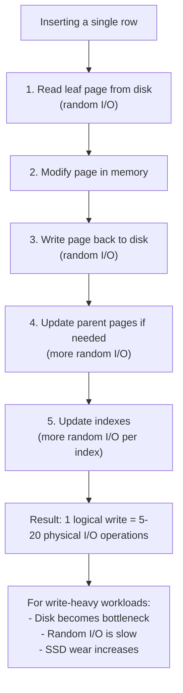

<details>
<summary>ASCII diagram (reference)</summary>

```text
┌─────────────────────────────────────────────────────────────┐
│              B-TREE WRITE AMPLIFICATION                      │
│                                                              │
│  Inserting a single row:                                    │
│                                                              │
│  1. Read leaf page from disk (random I/O)                   │
│  2. Modify page in memory                                   │
│  3. Write page back to disk (random I/O)                    │
│  4. Update parent pages if needed (more random I/O)         │
│  5. Update indexes (more random I/O per index)              │
│                                                              │
│  Result: 1 logical write = 5-20 physical I/O operations     │
│                                                              │
│  For write-heavy workloads:                                 │
│  - Disk becomes bottleneck                                  │
│  - Random I/O is slow                                       │
│  - SSD wear increases                                       │
│                                                              │
└─────────────────────────────────────────────────────────────┘
```
</details>

### Real Examples

**RocksDB at Facebook**: Facebook needed a database for high-write workloads. B-tree based databases couldn't keep up. They developed RocksDB using LSM trees, which converts random writes to sequential writes.

**Cassandra at Netflix**: Netflix stores billions of events per day. LSM-tree based Cassandra handles this write volume efficiently.

**InfluxDB**: Time-series database optimized for append-heavy workloads using LSM-tree variants.

---

## 2️⃣ Intuition and Mental Model

### The Library Analogy (Extended)

**B-Tree = Organized Library**

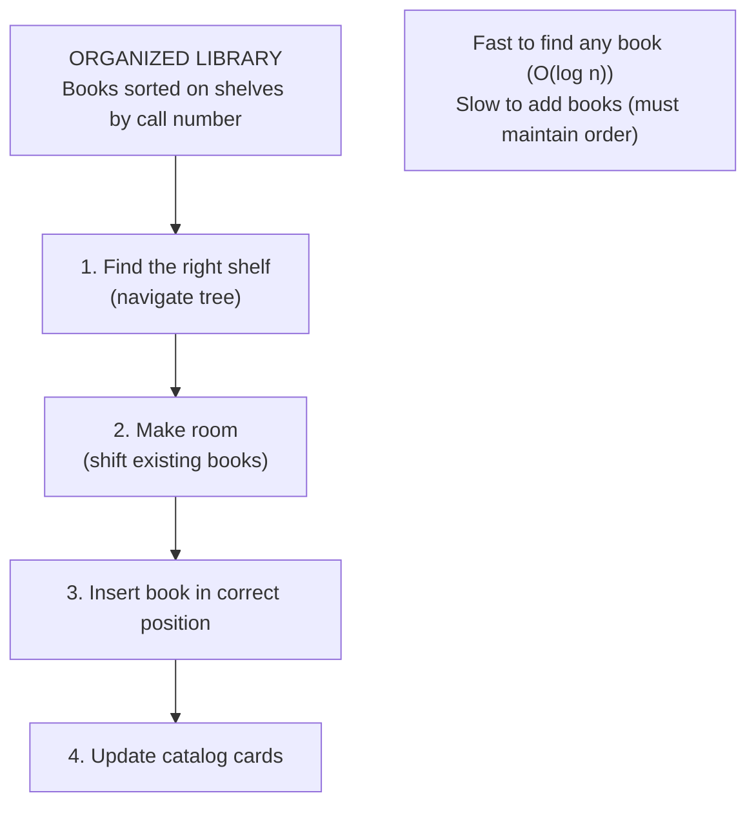

<details>
<summary>ASCII diagram (reference)</summary>

```text
┌─────────────────────────────────────────────────────────────┐
│                   ORGANIZED LIBRARY                          │
│                                                              │
│  Books sorted on shelves by call number                     │
│                                                              │
│  Adding a new book:                                         │
│  1. Find the right shelf (navigate tree)                    │
│  2. Make room (shift existing books)                        │
│  3. Insert book in correct position                         │
│  4. Update catalog cards                                    │
│                                                              │
│  Fast to find any book (O(log n))                          │
│  Slow to add books (must maintain order)                    │
│                                                              │
└─────────────────────────────────────────────────────────────┘
```
</details>

**LSM Tree = Library with Inbox System**

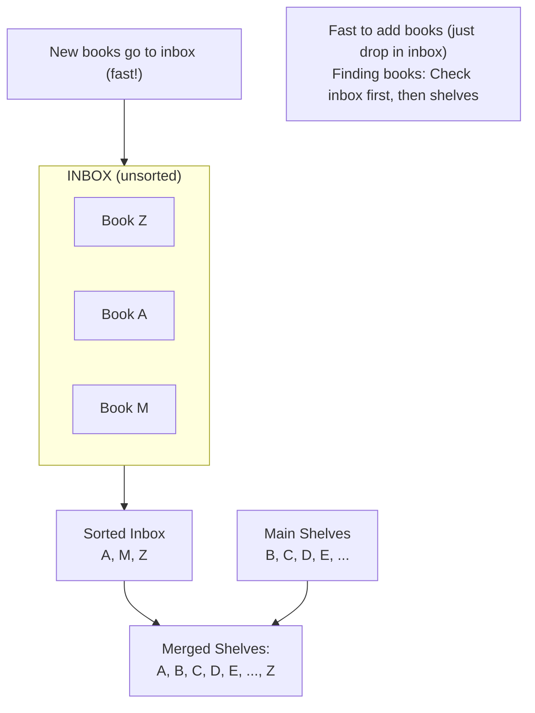

<details>
<summary>ASCII diagram (reference)</summary>

```text
┌─────────────────────────────────────────────────────────────┐
│                 LIBRARY WITH INBOX                           │
│                                                              │
│  New books go to inbox (fast!)                              │
│  ┌──────────────────┐                                       │
│  │ INBOX (unsorted) │ ← New books dropped here             │
│  │ Book Z           │                                       │
│  │ Book A           │                                       │
│  │ Book M           │                                       │
│  └──────────────────┘                                       │
│                                                              │
│  Periodically, librarian sorts inbox and merges with shelves│
│  ┌──────────────────┐    ┌──────────────────┐              │
│  │ Sorted Inbox     │ +  │ Main Shelves     │              │
│  │ A, M, Z          │    │ B, C, D, E, ...  │              │
│  └──────────────────┘    └──────────────────┘              │
│           ↓                                                  │
│  ┌─────────────────────────────────────────┐               │
│  │ Merged Shelves: A, B, C, D, E, ..., Z   │               │
│  └─────────────────────────────────────────┘               │
│                                                              │
│  Fast to add books (just drop in inbox)                     │
│  Finding books: Check inbox first, then shelves             │
│                                                              │
└─────────────────────────────────────────────────────────────┘
```
</details>

---

## 3️⃣ How It Works Internally

### LSM Trees (Log-Structured Merge Trees)

**Core Idea**: Convert random writes to sequential writes by buffering in memory and periodically flushing to disk.

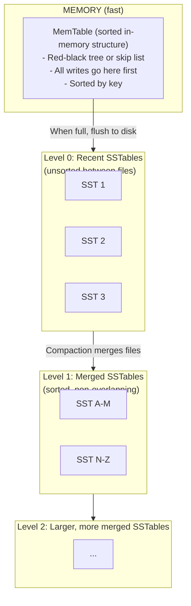

<details>
<summary>ASCII diagram (reference)</summary>

```text
┌─────────────────────────────────────────────────────────────┐
│                    LSM TREE STRUCTURE                        │
│                                                              │
│  MEMORY (fast):                                              │
│  ┌─────────────────────────────────────────────────────┐   │
│  │ MemTable (sorted in-memory structure)               │   │
│  │ - Red-black tree or skip list                       │   │
│  │ - All writes go here first                          │   │
│  │ - Sorted by key                                     │   │
│  └─────────────────────────────────────────────────────┘   │
│           │                                                  │
│           │ When full, flush to disk                        │
│           ▼                                                  │
│  DISK (persistent):                                          │
│  ┌─────────────────────────────────────────────────────┐   │
│  │ Level 0: Recent SSTables (unsorted between files)   │   │
│  │ ┌──────┐ ┌──────┐ ┌──────┐                         │   │
│  │ │SST 1 │ │SST 2 │ │SST 3 │                         │   │
│  │ └──────┘ └──────┘ └──────┘                         │   │
│  └─────────────────────────────────────────────────────┘   │
│           │                                                  │
│           │ Compaction merges files                         │
│           ▼                                                  │
│  ┌─────────────────────────────────────────────────────┐   │
│  │ Level 1: Merged SSTables (sorted, non-overlapping)  │   │
│  │ ┌──────────────┐ ┌──────────────┐                  │   │
│  │ │ SST A-M      │ │ SST N-Z      │                  │   │
│  │ └──────────────┘ └──────────────┘                  │   │
│  └─────────────────────────────────────────────────────┘   │
│           │                                                  │
│           ▼                                                  │
│  ┌─────────────────────────────────────────────────────┐   │
│  │ Level 2: Larger, more merged SSTables               │   │
│  │ ...                                                 │   │
│  └─────────────────────────────────────────────────────┘   │
│                                                              │
└─────────────────────────────────────────────────────────────┘
```
</details>

**SSTable (Sorted String Table)**:

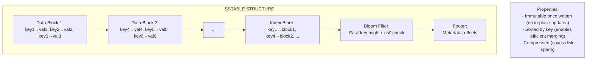

<details>
<summary>ASCII diagram (reference)</summary>

```text
┌─────────────────────────────────────────────────────────────┐
│                    SSTABLE STRUCTURE                         │
│                                                              │
│  ┌─────────────────────────────────────────────────────┐   │
│  │ Data Block 1: key1→val1, key2→val2, key3→val3      │   │
│  ├─────────────────────────────────────────────────────┤   │
│  │ Data Block 2: key4→val4, key5→val5, key6→val6      │   │
│  ├─────────────────────────────────────────────────────┤   │
│  │ ...                                                 │   │
│  ├─────────────────────────────────────────────────────┤   │
│  │ Index Block: key1→block1, key4→block2, ...         │   │
│  ├─────────────────────────────────────────────────────┤   │
│  │ Bloom Filter: Fast "key might exist" check         │   │
│  ├─────────────────────────────────────────────────────┤   │
│  │ Footer: Metadata, offsets                          │   │
│  └─────────────────────────────────────────────────────┘   │
│                                                              │
│  Properties:                                                 │
│  - Immutable once written (no in-place updates)             │
│  - Sorted by key (enables efficient merging)                │
│  - Compressed (saves disk space)                            │
│                                                              │
└─────────────────────────────────────────────────────────────┘
```
</details>

**Write Path**:

```
1. Write to MemTable (in-memory, fast)
2. Write to Write-Ahead Log (for durability)
3. When MemTable full (~64MB), flush to Level 0 SSTable
4. Background compaction merges SSTables

Write amplification: 1 write → eventually written multiple times
                     during compaction (but sequential!)
```

**Read Path**:

```
1. Check MemTable (most recent data)
2. Check Level 0 SSTables (check all, might overlap)
3. Check Level 1+ SSTables (binary search, no overlap)
4. Use Bloom filters to skip SSTables that don't have key

Read amplification: Might need to check multiple SSTables
```

### Write Amplification

**Definition**: The ratio of actual bytes written to disk vs. logical bytes written by the application.

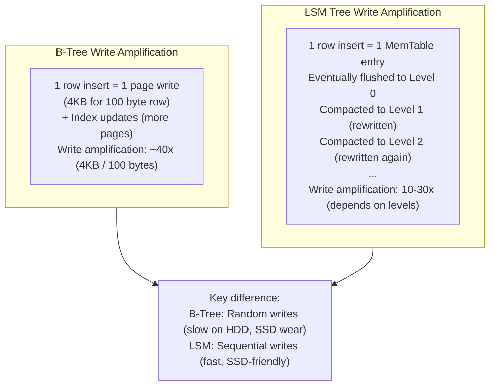

<details>
<summary>ASCII diagram (reference)</summary>

```text
┌─────────────────────────────────────────────────────────────┐
│                  WRITE AMPLIFICATION                         │
│                                                              │
│  B-Tree Write Amplification:                                │
│  ┌─────────────────────────────────────────────────────┐   │
│  │ 1 row insert = 1 page write (4KB for 100 byte row)  │   │
│  │ + Index updates (more pages)                        │   │
│  │ Write amplification: ~40x (4KB / 100 bytes)         │   │
│  └─────────────────────────────────────────────────────┘   │
│                                                              │
│  LSM Tree Write Amplification:                              │
│  ┌─────────────────────────────────────────────────────┐   │
│  │ 1 row insert = 1 MemTable entry                     │   │
│  │ Eventually flushed to Level 0                       │   │
│  │ Compacted to Level 1 (rewritten)                    │   │
│  │ Compacted to Level 2 (rewritten again)              │   │
│  │ ...                                                 │   │
│  │ Write amplification: 10-30x (depends on levels)     │   │
│  └─────────────────────────────────────────────────────┘   │
│                                                              │
│  Key difference:                                             │
│  B-Tree: Random writes (slow on HDD, SSD wear)              │
│  LSM: Sequential writes (fast, SSD-friendly)                │
│                                                              │
└─────────────────────────────────────────────────────────────┘
```
</details>

### Space Amplification

**Definition**: The ratio of actual disk space used vs. logical data size.

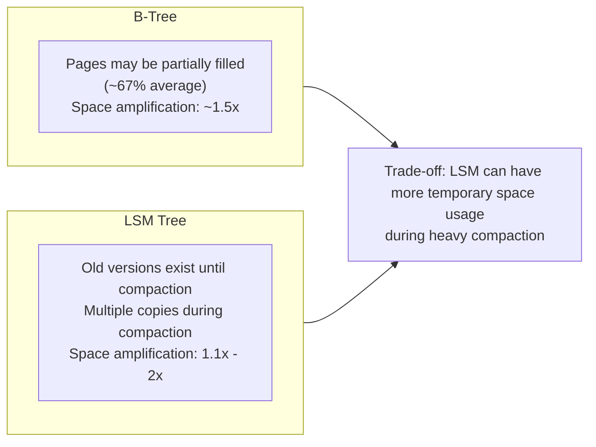

<details>
<summary>ASCII diagram (reference)</summary>

```text
┌─────────────────────────────────────────────────────────────┐
│                  SPACE AMPLIFICATION                         │
│                                                              │
│  B-Tree:                                                    │
│  - Pages may be partially filled (~67% average)             │
│  - Space amplification: ~1.5x                               │
│                                                              │
│  LSM Tree:                                                  │
│  - Old versions exist until compaction                      │
│  - Multiple copies during compaction                        │
│  - Space amplification: 1.1x - 2x                          │
│                                                              │
│  Trade-off: LSM can have more temporary space usage         │
│             during heavy compaction                          │
│                                                              │
└─────────────────────────────────────────────────────────────┘
```
</details>

### Read Amplification

**Definition**: The number of disk reads required to satisfy a query.

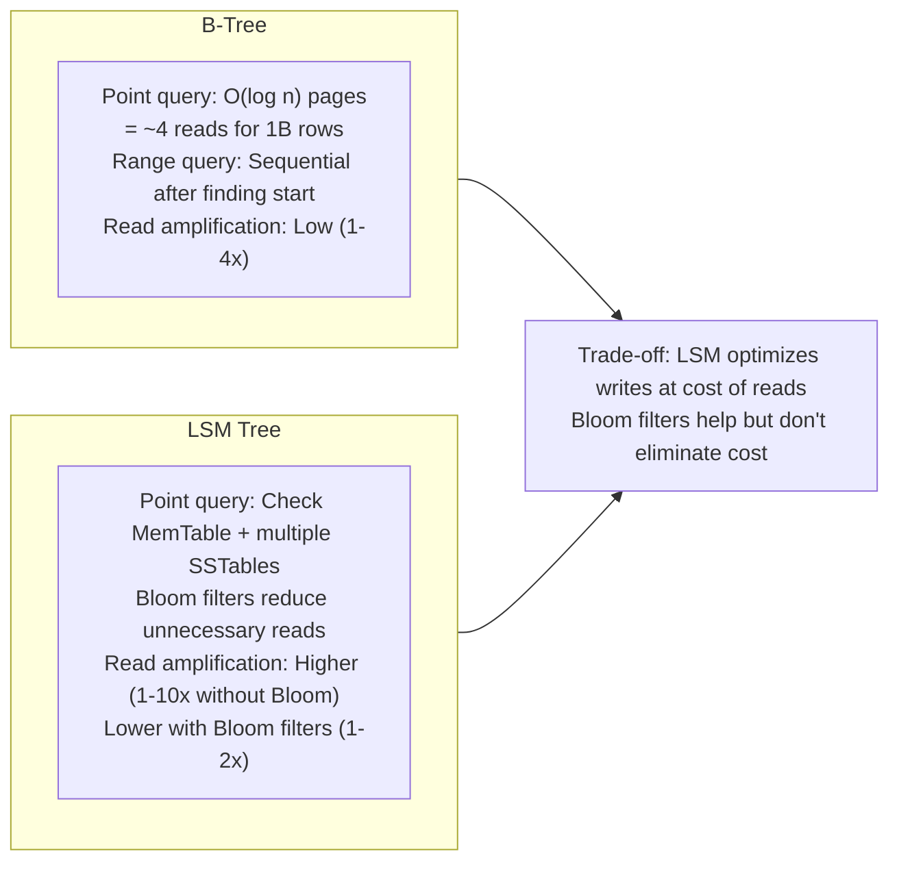

<details>
<summary>ASCII diagram (reference)</summary>

```text
┌─────────────────────────────────────────────────────────────┐
│                   READ AMPLIFICATION                         │
│                                                              │
│  B-Tree:                                                    │
│  - Point query: O(log n) pages = ~4 reads for 1B rows      │
│  - Range query: Sequential after finding start              │
│  - Read amplification: Low (1-4x)                          │
│                                                              │
│  LSM Tree:                                                  │
│  - Point query: Check MemTable + multiple SSTables         │
│  - Bloom filters reduce unnecessary reads                   │
│  - Read amplification: Higher (1-10x without Bloom)        │
│                        Lower with Bloom filters (1-2x)      │
│                                                              │
│  Trade-off: LSM optimizes writes at cost of reads          │
│             Bloom filters help but don't eliminate cost     │
│                                                              │
└─────────────────────────────────────────────────────────────┘
```
</details>

### Compaction Strategies

**Size-Tiered Compaction (STCS)**:

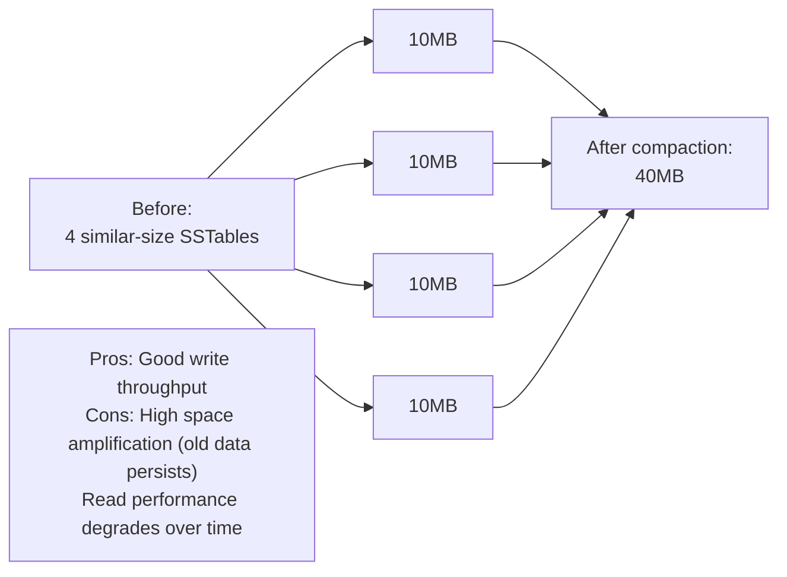

<details>
<summary>ASCII diagram (reference)</summary>

```text
┌─────────────────────────────────────────────────────────────┐
│              SIZE-TIERED COMPACTION                          │
│                                                              │
│  Group SSTables of similar size, merge when threshold met   │
│                                                              │
│  Before:                                                     │
│  ┌──────┐ ┌──────┐ ┌──────┐ ┌──────┐                       │
│  │ 10MB │ │ 10MB │ │ 10MB │ │ 10MB │  (4 similar-size)     │
│  └──────┘ └──────┘ └──────┘ └──────┘                       │
│                                                              │
│  After compaction:                                           │
│  ┌────────────────────────────────────┐                     │
│  │              40MB                   │                     │
│  └────────────────────────────────────┘                     │
│                                                              │
│  Pros: Good write throughput                                │
│  Cons: High space amplification (old data persists)         │
│        Read performance degrades over time                  │
│                                                              │
└─────────────────────────────────────────────────────────────┘
```
</details>

**Leveled Compaction (LCS)**:

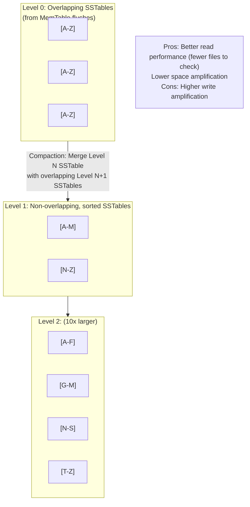

<details>
<summary>ASCII diagram (reference)</summary>

```text
┌─────────────────────────────────────────────────────────────┐
│                LEVELED COMPACTION                            │
│                                                              │
│  Level 0: Overlapping SSTables (from MemTable flushes)      │
│  Level 1+: Non-overlapping, sorted SSTables                 │
│                                                              │
│  Level 0:  [A-Z] [A-Z] [A-Z]  (overlapping)                │
│               ↓                                              │
│  Level 1:  [A-M] [N-Z]        (non-overlapping)             │
│               ↓                                              │
│  Level 2:  [A-F] [G-M] [N-S] [T-Z]  (10x larger)           │
│                                                              │
│  Compaction: Merge Level N SSTable with overlapping         │
│              Level N+1 SSTables                              │
│                                                              │
│  Pros: Better read performance (fewer files to check)       │
│        Lower space amplification                            │
│  Cons: Higher write amplification                           │
│                                                              │
└─────────────────────────────────────────────────────────────┘
```
</details>

### Query Optimization and Execution Plans

**Query Planner Components**:

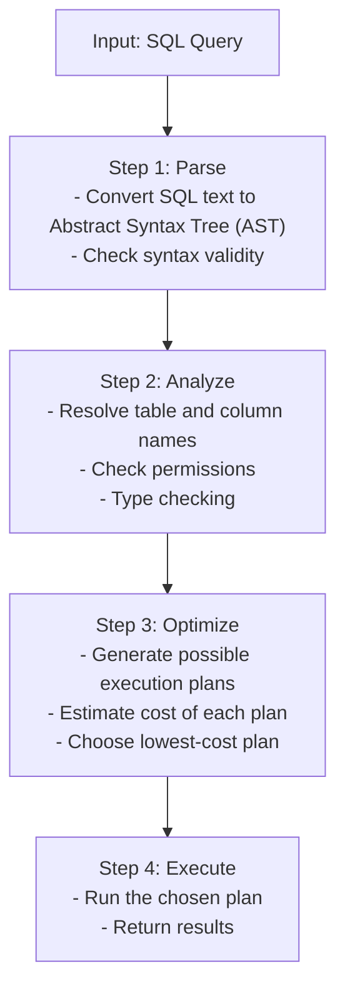

<details>
<summary>ASCII diagram (reference)</summary>

```text
┌─────────────────────────────────────────────────────────────┐
│                   QUERY PLANNER                              │
│                                                              │
│  Input: SQL Query                                           │
│                                                              │
│  Step 1: Parse                                              │
│  - Convert SQL text to Abstract Syntax Tree (AST)          │
│  - Check syntax validity                                    │
│                                                              │
│  Step 2: Analyze                                            │
│  - Resolve table and column names                          │
│  - Check permissions                                        │
│  - Type checking                                            │
│                                                              │
│  Step 3: Optimize                                           │
│  - Generate possible execution plans                        │
│  - Estimate cost of each plan                              │
│  - Choose lowest-cost plan                                  │
│                                                              │
│  Step 4: Execute                                            │
│  - Run the chosen plan                                      │
│  - Return results                                           │
│                                                              │
└─────────────────────────────────────────────────────────────┘
```
</details>

**Cost Estimation**:

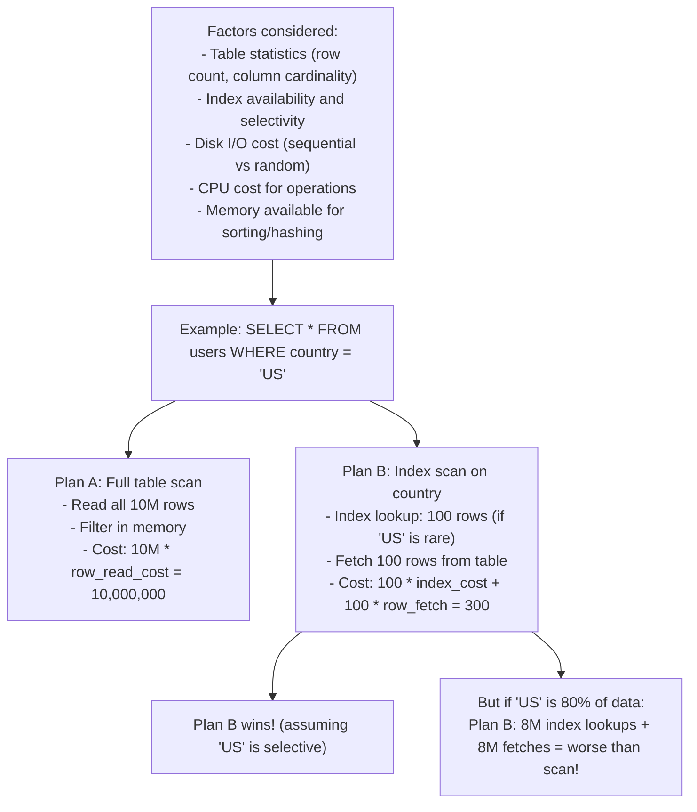

<details>
<summary>ASCII diagram (reference)</summary>

```text
┌─────────────────────────────────────────────────────────────┐
│                  COST ESTIMATION                             │
│                                                              │
│  Factors considered:                                         │
│  - Table statistics (row count, column cardinality)         │
│  - Index availability and selectivity                       │
│  - Disk I/O cost (sequential vs random)                     │
│  - CPU cost for operations                                  │
│  - Memory available for sorting/hashing                     │
│                                                              │
│  Example: SELECT * FROM users WHERE country = 'US'          │
│                                                              │
│  Plan A: Full table scan                                    │
│  - Read all 10M rows                                        │
│  - Filter in memory                                         │
│  - Cost: 10M * row_read_cost = 10,000,000                  │
│                                                              │
│  Plan B: Index scan on country                              │
│  - Index lookup: 100 rows (if 'US' is rare)                │
│  - Fetch 100 rows from table                               │
│  - Cost: 100 * index_cost + 100 * row_fetch = 300          │
│                                                              │
│  Plan B wins! (assuming 'US' is selective)                  │
│                                                              │
│  But if 'US' is 80% of data:                               │
│  Plan B: 8M index lookups + 8M fetches = worse than scan!  │
│                                                              │
└─────────────────────────────────────────────────────────────┘
```
</details>

### EXPLAIN Output Analysis

```sql
EXPLAIN ANALYZE SELECT * FROM orders 
WHERE user_id = 123 AND status = 'pending';
```

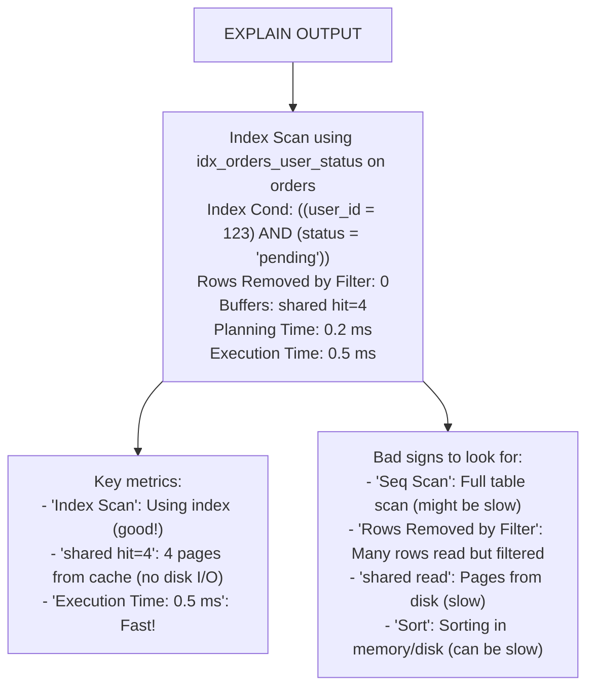

<details>
<summary>ASCII diagram (reference)</summary>

```text
┌─────────────────────────────────────────────────────────────┐
│                   EXPLAIN OUTPUT                             │
│                                                              │
│  Index Scan using idx_orders_user_status on orders          │
│    Index Cond: ((user_id = 123) AND (status = 'pending'))   │
│    Rows Removed by Filter: 0                                │
│    Buffers: shared hit=4                                    │
│    Planning Time: 0.2 ms                                    │
│    Execution Time: 0.5 ms                                   │
│                                                              │
│  Key metrics:                                                │
│  - "Index Scan": Using index (good!)                        │
│  - "shared hit=4": 4 pages from cache (no disk I/O)        │
│  - "Execution Time: 0.5 ms": Fast!                         │
│                                                              │
│  Bad signs to look for:                                      │
│  - "Seq Scan": Full table scan (might be slow)             │
│  - "Rows Removed by Filter": Many rows read but filtered   │
│  - "shared read": Pages from disk (slow)                   │
│  - "Sort": Sorting in memory/disk (can be slow)            │
│                                                              │
└─────────────────────────────────────────────────────────────┘
```
</details>

---

## 4️⃣ Simulation-First Explanation

### Scenario 1: LSM Tree Write Operation

```
Write: key="user:123", value="Alice"

Step 1: Write to Write-Ahead Log (WAL)
  WAL: [seq:1001] PUT user:123 = "Alice"
  (Synchronous write to disk for durability)

Step 2: Write to MemTable
  MemTable (Red-Black Tree):
    user:100 → "Bob"
    user:123 → "Alice"  ← Inserted here
    user:200 → "Carol"

Step 3: Acknowledge to client
  "Write successful"
  (Total latency: ~1-2ms)

Step 4: Background - MemTable full (64MB)
  Flush MemTable to Level 0 SSTable
  
  SSTable-001.sst:
    [user:100 → "Bob"]
    [user:123 → "Alice"]
    [user:200 → "Carol"]
    [Bloom filter]
    [Index]

Step 5: Background - Compaction
  Level 0 has 4 SSTables → Trigger compaction
  Merge into Level 1 SSTable
```

### Scenario 2: LSM Tree Read Operation

```
Read: key="user:123"

Step 1: Check MemTable
  MemTable doesn't have user:123
  Continue to disk...

Step 2: Check Level 0 SSTables (most recent first)
  SSTable-003: Bloom filter says "no" → Skip
  SSTable-002: Bloom filter says "maybe"
    → Binary search index → Not found → Skip
  SSTable-001: Bloom filter says "maybe"
    → Binary search index → Found in block 2
    → Read block 2 → Found user:123 = "Alice"

Step 3: Return result
  "Alice"
  (Total latency: ~5-10ms if on disk, <1ms if cached)

Note: Bloom filter false positives cause extra reads
      but false negatives never happen (won't miss data)
```

### Scenario 3: Query Plan Selection

```sql
SELECT * FROM orders o
JOIN users u ON o.user_id = u.id
WHERE u.country = 'US' AND o.status = 'pending'
ORDER BY o.created_at DESC
LIMIT 10;
```

```
Statistics:
  orders: 10M rows
  users: 1M rows
  users with country='US': 300K (30%)
  orders with status='pending': 100K (1%)
  orders for US users: ~3M

Plan A: Start with users
  1. Scan users WHERE country='US' → 300K rows
  2. For each user, lookup orders → 300K index lookups
  3. Filter status='pending'
  4. Sort by created_at
  5. Take top 10
  Cost: Very high (300K lookups)

Plan B: Start with orders
  1. Index scan orders WHERE status='pending' → 100K rows
  2. For each order, lookup user → 100K index lookups
  3. Filter country='US'
  4. Sort by created_at
  5. Take top 10
  Cost: Medium (100K lookups, but orders already sorted by created_at?)

Plan C: Use composite index
  1. If index on (status, created_at) exists:
     Index scan → Already sorted!
  2. Join with users
  3. Filter country='US'
  4. Stop after 10 matches
  Cost: Low (stop early due to LIMIT)

Planner chooses Plan C if index exists, otherwise Plan B
```

---

## 5️⃣ How Engineers Actually Use This in Production

### At Major Companies

**Facebook (RocksDB)**:
- LSM-tree based embedded database
- Used in MySQL (MyRocks storage engine)
- Reduced storage by 50% compared to InnoDB
- Better write throughput for their workload

**Google (Bigtable/LevelDB)**:
- LevelDB: Original LSM implementation
- Bigtable: Distributed LSM-based system
- Powers many Google services

**Apache Cassandra**:
- LSM trees for each node
- Tunable compaction strategies
- Used by Netflix, Apple, Instagram

### Choosing Between B-Tree and LSM

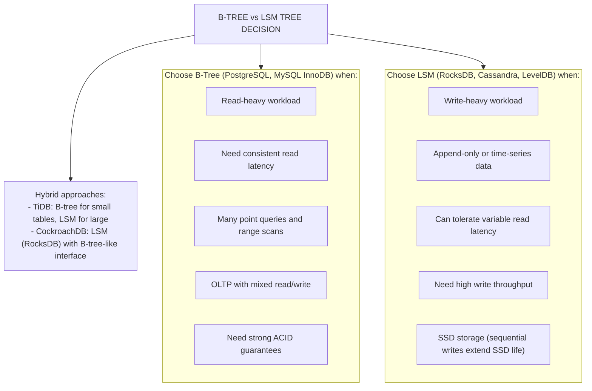

<details>
<summary>ASCII diagram (reference)</summary>

```text
┌─────────────────────────────────────────────────────────────┐
│            B-TREE vs LSM TREE DECISION                       │
├─────────────────────────────────────────────────────────────┤
│                                                              │
│  Choose B-Tree (PostgreSQL, MySQL InnoDB) when:             │
│  ├── Read-heavy workload                                    │
│  ├── Need consistent read latency                           │
│  ├── Many point queries and range scans                     │
│  ├── OLTP with mixed read/write                            │
│  └── Need strong ACID guarantees                            │
│                                                              │
│  Choose LSM (RocksDB, Cassandra, LevelDB) when:             │
│  ├── Write-heavy workload                                   │
│  ├── Append-only or time-series data                        │
│  ├── Can tolerate variable read latency                     │
│  ├── Need high write throughput                             │
│  └── SSD storage (sequential writes extend SSD life)        │
│                                                              │
│  Hybrid approaches:                                          │
│  - TiDB: B-tree for small tables, LSM for large            │
│  - CockroachDB: LSM (RocksDB) with B-tree-like interface   │
│                                                              │
└─────────────────────────────────────────────────────────────┘
```
</details>

### Query Optimization Best Practices

```sql
-- 1. Use EXPLAIN ANALYZE to understand query execution
EXPLAIN ANALYZE SELECT * FROM orders WHERE user_id = 123;

-- 2. Look for sequential scans on large tables
-- Bad: Seq Scan on orders (cost=0.00..250000.00)
-- Good: Index Scan using idx_orders_user on orders

-- 3. Check for index usage
-- Create index if frequently filtered column lacks one
CREATE INDEX idx_orders_user ON orders(user_id);

-- 4. Use covering indexes to avoid table lookups
CREATE INDEX idx_orders_covering ON orders(user_id) 
INCLUDE (status, total);

-- 5. Analyze table statistics for better plans
ANALYZE orders;

-- 6. Check for N+1 query patterns
-- Bad: Loop with individual queries
-- Good: Single query with JOIN or IN clause
```

---

## 6️⃣ How to Implement or Apply It

### RocksDB Configuration (Java)

```java
package com.example.rocksdb;

import org.rocksdb.*;
import java.nio.charset.StandardCharsets;

/**
 * RocksDB LSM-tree database example.
 */
public class RocksDBExample {
    
    static {
        RocksDB.loadLibrary();
    }
    
    public static void main(String[] args) throws RocksDBException {
        // Configure LSM tree options
        Options options = new Options()
            .setCreateIfMissing(true)
            // MemTable size (flush to L0 when full)
            .setWriteBufferSize(64 * 1024 * 1024)  // 64MB
            // Number of MemTables before stalling writes
            .setMaxWriteBufferNumber(3)
            // Level 0 compaction trigger
            .setLevel0FileNumCompactionTrigger(4)
            // Target file size for L1+
            .setTargetFileSizeBase(64 * 1024 * 1024)  // 64MB
            // Bloom filter for faster lookups
            .setTableFormatConfig(
                new BlockBasedTableConfig()
                    .setFilterPolicy(new BloomFilter(10, false))
                    .setBlockSize(4 * 1024)  // 4KB blocks
            )
            // Compression
            .setCompressionType(CompressionType.LZ4_COMPRESSION);
        
        try (RocksDB db = RocksDB.open(options, "/tmp/rocksdb")) {
            // Write
            byte[] key = "user:123".getBytes(StandardCharsets.UTF_8);
            byte[] value = "Alice".getBytes(StandardCharsets.UTF_8);
            db.put(key, value);
            
            // Read
            byte[] result = db.get(key);
            System.out.println("Value: " + new String(result, StandardCharsets.UTF_8));
            
            // Batch write (more efficient)
            try (WriteBatch batch = new WriteBatch();
                 WriteOptions writeOpts = new WriteOptions()) {
                batch.put("user:124".getBytes(), "Bob".getBytes());
                batch.put("user:125".getBytes(), "Carol".getBytes());
                db.write(writeOpts, batch);
            }
            
            // Range scan
            try (RocksIterator iter = db.newIterator()) {
                for (iter.seek("user:".getBytes()); iter.isValid(); iter.next()) {
                    String k = new String(iter.key(), StandardCharsets.UTF_8);
                    if (!k.startsWith("user:")) break;
                    String v = new String(iter.value(), StandardCharsets.UTF_8);
                    System.out.println(k + " = " + v);
                }
            }
        }
    }
}
```

### PostgreSQL Query Analysis

```java
package com.example.queryanalysis;

import org.springframework.jdbc.core.JdbcTemplate;
import org.springframework.stereotype.Service;
import java.util.List;
import java.util.Map;

@Service
public class QueryAnalysisService {
    
    private final JdbcTemplate jdbcTemplate;
    
    public QueryAnalysisService(JdbcTemplate jdbcTemplate) {
        this.jdbcTemplate = jdbcTemplate;
    }
    
    /**
     * Analyze a query and return execution plan.
     */
    public List<Map<String, Object>> explainQuery(String sql) {
        String explainSql = "EXPLAIN (ANALYZE, BUFFERS, FORMAT JSON) " + sql;
        return jdbcTemplate.queryForList(explainSql);
    }
    
    /**
     * Find slow queries from pg_stat_statements.
     */
    public List<Map<String, Object>> findSlowQueries() {
        String sql = """
            SELECT 
                query,
                calls,
                mean_exec_time,
                total_exec_time,
                rows,
                shared_blks_hit,
                shared_blks_read
            FROM pg_stat_statements
            WHERE mean_exec_time > 100  -- queries > 100ms
            ORDER BY total_exec_time DESC
            LIMIT 20
            """;
        return jdbcTemplate.queryForList(sql);
    }
    
    /**
     * Find missing indexes based on sequential scans.
     */
    public List<Map<String, Object>> findMissingIndexes() {
        String sql = """
            SELECT 
                schemaname,
                relname as table_name,
                seq_scan,
                seq_tup_read,
                idx_scan,
                seq_tup_read / NULLIF(seq_scan, 0) as avg_seq_tup_read
            FROM pg_stat_user_tables
            WHERE seq_scan > 100
            AND seq_tup_read / NULLIF(seq_scan, 0) > 10000
            ORDER BY seq_tup_read DESC
            LIMIT 20
            """;
        return jdbcTemplate.queryForList(sql);
    }
    
    /**
     * Check index usage.
     */
    public List<Map<String, Object>> checkIndexUsage() {
        String sql = """
            SELECT 
                schemaname,
                relname as table_name,
                indexrelname as index_name,
                idx_scan,
                idx_tup_read,
                idx_tup_fetch,
                pg_size_pretty(pg_relation_size(indexrelid)) as index_size
            FROM pg_stat_user_indexes
            ORDER BY idx_scan ASC
            LIMIT 20
            """;
        return jdbcTemplate.queryForList(sql);
    }
}
```

### Monitoring Write Amplification

```java
package com.example.monitoring;

import io.micrometer.core.instrument.MeterRegistry;
import io.micrometer.core.instrument.Timer;
import org.springframework.scheduling.annotation.Scheduled;
import org.springframework.stereotype.Component;

@Component
public class DatabaseMetricsCollector {
    
    private final MeterRegistry meterRegistry;
    private final JdbcTemplate jdbcTemplate;
    
    public DatabaseMetricsCollector(MeterRegistry meterRegistry, 
                                     JdbcTemplate jdbcTemplate) {
        this.meterRegistry = meterRegistry;
        this.jdbcTemplate = jdbcTemplate;
    }
    
    @Scheduled(fixedRate = 60000)
    public void collectMetrics() {
        // PostgreSQL: Check buffer cache hit ratio
        String sql = """
            SELECT 
                sum(heap_blks_read) as heap_read,
                sum(heap_blks_hit) as heap_hit,
                sum(heap_blks_hit) / NULLIF(sum(heap_blks_hit) + sum(heap_blks_read), 0) as ratio
            FROM pg_statio_user_tables
            """;
        
        Map<String, Object> result = jdbcTemplate.queryForMap(sql);
        Double cacheHitRatio = (Double) result.get("ratio");
        
        meterRegistry.gauge("db.cache.hit.ratio", cacheHitRatio != null ? cacheHitRatio : 0);
        
        // Check for long-running queries
        String longQuerySql = """
            SELECT count(*) FROM pg_stat_activity 
            WHERE state = 'active' 
            AND now() - query_start > interval '30 seconds'
            """;
        
        Long longQueries = jdbcTemplate.queryForObject(longQuerySql, Long.class);
        meterRegistry.gauge("db.long.running.queries", longQueries != null ? longQueries : 0);
    }
}
```

---

## 7️⃣ Tradeoffs, Pitfalls, and Common Mistakes

### Common Mistake 1: Ignoring Query Plans

```sql
-- WRONG: Assume query is efficient because it returns quickly on small data
SELECT * FROM orders WHERE status = 'pending';
-- Works fine with 1000 rows, but...

-- With 10M rows and no index:
EXPLAIN ANALYZE SELECT * FROM orders WHERE status = 'pending';
-- Seq Scan on orders  (cost=0.00..250000.00 rows=100000)
--   Filter: (status = 'pending')
--   Rows Removed by Filter: 9900000
--   Execution Time: 30000.000 ms  ← 30 seconds!

-- RIGHT: Add index and verify
CREATE INDEX idx_orders_status ON orders(status);
EXPLAIN ANALYZE SELECT * FROM orders WHERE status = 'pending';
-- Index Scan using idx_orders_status  (cost=0.42..1000.00)
--   Execution Time: 50.000 ms  ← 600x faster!
```

### Common Mistake 2: Wrong Compaction Strategy

```
Scenario: Time-series data with TTL

WRONG: Using Leveled Compaction
- Old data constantly rewritten during compaction
- High write amplification for data that will be deleted anyway

RIGHT: Using FIFO Compaction or Time-Window Compaction
- Old SSTables deleted without rewriting
- Much lower write amplification
```

### Common Mistake 3: Not Tuning MemTable Size

```
Scenario: Write-heavy workload

WRONG: Default MemTable size (4MB)
- Frequent flushes to Level 0
- High compaction overhead
- Write stalls

RIGHT: Larger MemTable for write-heavy workloads
- 64-256MB MemTable
- Fewer flushes
- Better write throughput
- Trade-off: Higher memory usage, longer recovery time
```

### Performance Gotchas

**1. Bloom Filter Configuration**

```
Too few bits per key:
- High false positive rate
- Many unnecessary disk reads

Too many bits per key:
- Wastes memory
- Bloom filters don't fit in cache

Sweet spot: 10 bits per key (~1% false positive rate)
```

**2. Compaction Stalls**

```
Symptom: Periodic write latency spikes

Cause: Compaction can't keep up with writes
       Level 0 fills up, writes stall

Solution:
- Increase compaction threads
- Tune compaction triggers
- Use rate limiting for compaction
- Consider different compaction strategy
```

---

## 8️⃣ When NOT to Use This

### When NOT to Use LSM Trees

1. **Read-heavy OLTP workloads**
   - B-trees have better read performance
   - LSM read amplification hurts latency

2. **Strict latency requirements**
   - Compaction can cause latency spikes
   - B-trees have more predictable latency

3. **Small datasets**
   - LSM overhead not worth it
   - Simple B-tree is sufficient

4. **Many range scans**
   - LSM must check multiple levels
   - B-tree range scans are more efficient

### When NOT to Obsess Over Query Plans

1. **Queries on small tables (<10K rows)**
   - Full scan is fast enough
   - Index overhead may not be worth it

2. **Infrequent queries**
   - One-off reports
   - Admin queries

3. **Development/testing**
   - Focus on correctness first
   - Optimize for production data volumes

---

## 9️⃣ Comparison with Alternatives

### Storage Engine Comparison

| Feature | B-Tree | LSM Tree | Hash Index |
|---------|--------|----------|------------|
| Point Read | O(log n) | O(log n) * levels | O(1) |
| Range Scan | Excellent | Good | Not supported |
| Write | O(log n) random | O(1) sequential | O(1) |
| Space | ~1.5x | ~1.1-2x | ~1.2x |
| Write Amp | High (random) | Medium (sequential) | Low |
| Read Amp | Low | Medium-High | Low |

### Database Engine Comparison

| Database | Storage | Best For |
|----------|---------|----------|
| PostgreSQL | B-Tree | General OLTP |
| MySQL InnoDB | B-Tree | General OLTP |
| RocksDB | LSM | Write-heavy, embedded |
| LevelDB | LSM | Embedded key-value |
| Cassandra | LSM | Distributed, write-heavy |
| Redis | In-memory | Caching, real-time |

---

## 🔟 Interview Follow-Up Questions WITH Answers

### L4 (Entry-Level) Questions

**Q1: What is write amplification and why does it matter?**

**Answer:**
Write amplification is the ratio of actual bytes written to storage versus the logical bytes written by the application. If you write 1KB of data but the database writes 10KB to disk, the write amplification is 10x.

It matters because:
1. **Performance**: More writes = slower throughput
2. **SSD lifespan**: SSDs have limited write cycles. Higher write amplification wears out SSDs faster.
3. **I/O bandwidth**: Write amplification consumes disk I/O that could be used for other operations.

B-trees have high write amplification because updating a single row requires rewriting entire pages. LSM trees reduce this by batching writes in memory and writing sequentially to disk.

**Q2: What is EXPLAIN and why should you use it?**

**Answer:**
EXPLAIN is a SQL command that shows how the database plans to execute a query. EXPLAIN ANALYZE actually runs the query and shows real execution statistics.

You should use it to:
1. **Identify slow queries**: See if a query is doing a full table scan when it should use an index.
2. **Verify index usage**: Confirm your indexes are being used.
3. **Understand query cost**: Compare different query approaches.
4. **Debug performance issues**: Find bottlenecks like sorting or joining large datasets.

Key things to look for:
- "Seq Scan" on large tables (usually bad)
- "Index Scan" (usually good)
- High "Rows Removed by Filter" (index might help)
- "Sort" operations (might need index for ordering)

### L5 (Mid-Level) Questions

**Q3: Compare B-trees and LSM trees. When would you choose each?**

**Answer:**
**B-trees:**
- Store data in sorted pages
- In-place updates (modify existing pages)
- Good read performance (O(log n) with single path)
- Higher write amplification (random I/O)
- More predictable latency

**LSM trees:**
- Buffer writes in memory (MemTable)
- Append-only (never modify existing files)
- Good write performance (sequential I/O)
- Higher read amplification (check multiple levels)
- Can have latency spikes during compaction

**Choose B-tree when:**
- Read-heavy workload (OLTP)
- Need consistent latency
- Mixed read/write operations
- Many range scans

**Choose LSM when:**
- Write-heavy workload
- Append-only data (logs, time-series)
- Can tolerate occasional latency spikes
- Using SSDs (sequential writes extend lifespan)

**Q4: How would you optimize a slow query?**

**Answer:**
Systematic approach:

1. **Analyze the query plan:**
```sql
EXPLAIN ANALYZE SELECT ...
```

2. **Identify the bottleneck:**
- Sequential scan on large table → Add index
- Many rows filtered → More selective index
- Sorting → Index on ORDER BY columns
- Join with many rows → Check join order, add index

3. **Check statistics:**
```sql
ANALYZE table_name;
```
Outdated statistics lead to bad plans.

4. **Consider query rewriting:**
- Break complex queries into simpler ones
- Use EXISTS instead of IN for subqueries
- Avoid SELECT * (fetch only needed columns)

5. **Index optimization:**
- Add missing indexes
- Create composite indexes for common filters
- Consider covering indexes

6. **Verify improvement:**
```sql
EXPLAIN ANALYZE -- after changes
```

### L6 (Senior) Questions

**Q5: Design a storage strategy for a system handling 1 million writes per second.**

**Answer:**
At 1M writes/second, single-node databases won't work. Here's my approach:

**Architecture:**
1. **Sharding**: Partition data across multiple nodes
   - 100 shards, each handling 10K writes/second
   - Shard by write key (user_id, device_id)

2. **Storage engine**: LSM-tree based (Cassandra, ScyllaDB)
   - Sequential writes handle high throughput
   - Tunable consistency for availability

3. **Write path optimization:**
   - Large MemTables (256MB) to batch writes
   - Async replication for lower latency
   - Write-ahead log on fast storage (NVMe)

4. **Compaction strategy:**
   - Size-tiered for write-heavy workload
   - Or time-window if data has TTL
   - Dedicated compaction threads

5. **Hardware:**
   - NVMe SSDs for WAL
   - High-capacity SSDs for data
   - Enough RAM for MemTables and caches

6. **Monitoring:**
   - Write latency percentiles
   - Compaction lag
   - Disk I/O utilization

**Trade-offs:**
- Eventual consistency (strong consistency can't scale this high)
- Higher read latency (LSM read amplification)
- Operational complexity (distributed system)

**Q6: How would you debug a query that suddenly became slow in production?**

**Answer:**
Systematic debugging approach:

**1. Gather information:**
- When did it start? (correlate with deployments, data growth)
- How slow? (p50, p95, p99 latencies)
- Is it one query or many?

**2. Check query plan:**
```sql
EXPLAIN ANALYZE <slow query>
```
Compare with historical plans if available.

**3. Check statistics:**
```sql
SELECT last_analyze FROM pg_stat_user_tables WHERE relname = 'table_name';
```
Stale statistics → Bad plans. Run ANALYZE.

**4. Check for locking:**
```sql
SELECT * FROM pg_locks WHERE NOT granted;
SELECT * FROM pg_stat_activity WHERE wait_event IS NOT NULL;
```

**5. Check resource usage:**
- CPU: Is the query CPU-bound?
- Memory: Is it spilling to disk?
- Disk I/O: Is storage saturated?
- Network: Cross-region queries?

**6. Check data distribution:**
- Did data grow significantly?
- Is there skew in the data?
- Did index selectivity change?

**7. Common causes:**
- Table grew, needs new index
- Statistics outdated
- Lock contention from other queries
- Resource exhaustion (connections, memory)
- Bloated tables/indexes (need VACUUM)

**8. Fix and prevent:**
- Add/modify indexes
- Update statistics
- Add monitoring for query latency
- Set up alerts for plan changes

---

## 1️⃣1️⃣ One Clean Mental Summary

Database storage engines make fundamental trade-offs between read and write performance. B-trees (PostgreSQL, MySQL) optimize for reads with sorted pages and in-place updates, but suffer from write amplification due to random I/O. LSM trees (RocksDB, Cassandra) optimize for writes by buffering in memory and writing sequentially, but have higher read amplification due to checking multiple levels.

Write amplification is the ratio of physical writes to logical writes. B-trees have high write amplification (random page rewrites). LSM trees have lower write amplification (sequential writes) but data is rewritten during compaction. Both matter for SSD lifespan and throughput.

Query optimization starts with EXPLAIN ANALYZE. Look for sequential scans on large tables (add indexes), high filter ratios (more selective indexes), and sorting (index on ORDER BY). Keep statistics updated with ANALYZE. The query planner can only be as good as its information.

Choose your storage engine based on workload: B-trees for read-heavy OLTP with consistent latency, LSM trees for write-heavy workloads where you can tolerate occasional latency spikes. Many modern databases offer both or hybrid approaches.

