# Conflict Resolution: Handling Concurrent Updates

## 0️⃣ Prerequisites

Before diving into conflict resolution, you should understand:

- **Database Replication**: How data is copied across multiple servers (covered in Topic 4).
- **Consistency Models**: Strong vs eventual consistency trade-offs (covered in Topic 6).
- **Distributed Systems Basics**: Why network partitions and concurrent updates happen (covered in Phase 1).
- **Vector Clocks**: Logical clocks for tracking causality (introduced in Phase 1, Topic 12).

**Quick refresher on why conflicts happen**: In distributed systems, the same data can be modified on different nodes simultaneously. When these updates need to be reconciled, we have a conflict. The challenge is deciding which value to keep or how to merge them.

---

## 1️⃣ What Problem Does This Exist to Solve?

### The Specific Pain Point

Imagine you're building a collaborative document editor like Google Docs:

```
User A (in New York):     User B (in London):
─────────────────────     ─────────────────────
Document: "Hello"         Document: "Hello"

Types: "Hello World"      Types: "Hello Everyone"
       (adds " World")           (adds " Everyone")

Network partition occurs...

Both save locally.

Partition heals. Now what?

Option 1: "Hello World" (A wins, B's work lost)
Option 2: "Hello Everyone" (B wins, A's work lost)
Option 3: "Hello World Everyone" (merge both)
Option 4: "Hello WorldEveryone" (wrong merge)
```

**The fundamental question**: When two people change the same data simultaneously, what should the final result be?

### Where Conflicts Occur

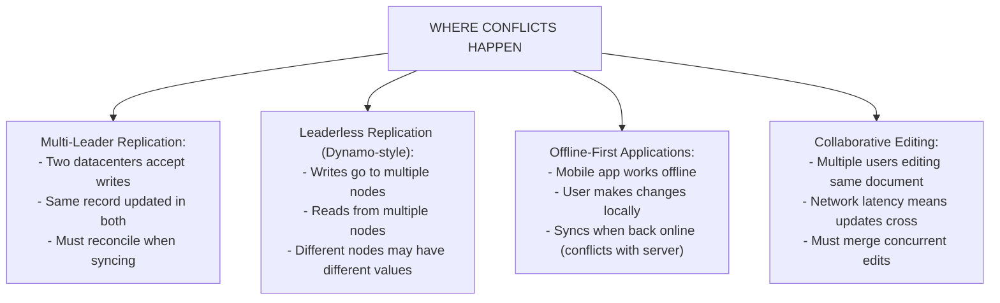

<details>
<summary>ASCII diagram (reference)</summary>

```text
┌─────────────────────────────────────────────────────────────┐
│              WHERE CONFLICTS HAPPEN                          │
│                                                              │
│  Multi-Leader Replication:                                  │
│  ├── Two datacenters accept writes                          │
│  ├── Same record updated in both                            │
│  └── Must reconcile when syncing                            │
│                                                              │
│  Leaderless Replication (Dynamo-style):                     │
│  ├── Writes go to multiple nodes                            │
│  ├── Reads from multiple nodes                              │
│  └── Different nodes may have different values              │
│                                                              │
│  Offline-First Applications:                                │
│  ├── Mobile app works offline                               │
│  ├── User makes changes locally                             │
│  └── Syncs when back online (conflicts with server)         │
│                                                              │
│  Collaborative Editing:                                      │
│  ├── Multiple users editing same document                   │
│  ├── Network latency means updates cross                    │
│  └── Must merge concurrent edits                            │
│                                                              │
└─────────────────────────────────────────────────────────────┘
```
</details>
```

### What Breaks Without Proper Conflict Resolution

**1. Data Loss**
```
User A: Sets inventory = 100
User B: Sets inventory = 50 (saw old value, made different decision)

With "last write wins":
Final: inventory = 50 (or 100, depending on timing)
One user's intent is completely lost
```

**2. Inconsistent State**
```
Shopping cart on phone: [Item A, Item B]
Shopping cart on laptop: [Item A, Item C]

Bad merge: [Item A] (lost B and C)
Bad merge: [Item A, Item B, Item C, Item A] (duplicated A)
Good merge: [Item A, Item B, Item C] (union of both)
```

**3. Violated Business Rules**
```
Bank account balance: $100

ATM 1: Withdraw $80 → Balance = $20
ATM 2: Withdraw $80 → Balance = $20 (didn't see ATM 1's withdrawal)

Both succeed. Customer withdrew $160 from $100 account!
```

### Real Examples

**Amazon DynamoDB/Dynamo**: Uses vector clocks to detect conflicts and returns all conflicting versions to the application for resolution.

**CouchDB**: Uses revision trees and lets applications define merge functions.

**Google Docs**: Uses Operational Transformation (OT) to merge concurrent text edits.

**Figma**: Uses CRDTs to enable real-time collaborative design without conflicts.

---

## 2️⃣ Intuition and Mental Model

### The Wiki Edit Analogy

**Last-Write-Wins (Simple but Lossy)**

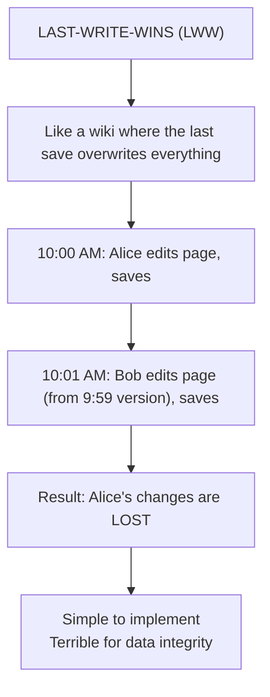

<details>
<summary>ASCII diagram (reference)</summary>

```text
┌─────────────────────────────────────────────────────────────┐
│              LAST-WRITE-WINS (LWW)                           │
│                                                              │
│  Like a wiki where the last save overwrites everything      │
│                                                              │
│  10:00 AM: Alice edits page, saves                          │
│  10:01 AM: Bob edits page (from 9:59 version), saves        │
│                                                              │
│  Result: Alice's changes are LOST                           │
│                                                              │
│  Simple to implement                                         │
│  Terrible for data integrity                                │
│                                                              │
└─────────────────────────────────────────────────────────────┘
```
</details>
```

**Conflict Detection + Manual Resolution**

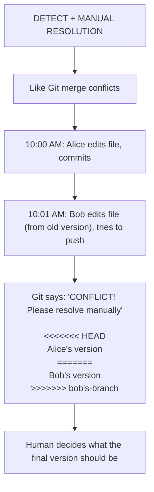

<details>
<summary>ASCII diagram (reference)</summary>

```text
┌─────────────────────────────────────────────────────────────┐
│              DETECT + MANUAL RESOLUTION                      │
│                                                              │
│  Like Git merge conflicts                                   │
│                                                              │
│  10:00 AM: Alice edits file, commits                        │
│  10:01 AM: Bob edits file (from old version), tries to push │
│                                                              │
│  Git says: "CONFLICT! Please resolve manually"              │
│                                                              │
│  <<<<<<< HEAD                                               │
│  Alice's version                                            │
│  =======                                                    │
│  Bob's version                                              │
│  >>>>>>> bob's-branch                                       │
│                                                              │
│  Human decides what the final version should be             │
│                                                              │
└─────────────────────────────────────────────────────────────┘
```
</details>
```

**Automatic Merge (CRDTs)**

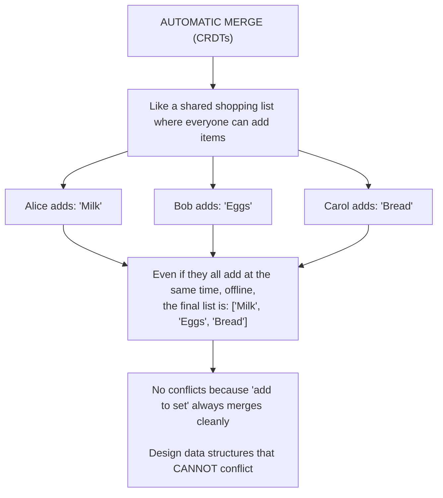

<details>
<summary>ASCII diagram (reference)</summary>

```text
┌─────────────────────────────────────────────────────────────┐
│              AUTOMATIC MERGE (CRDTs)                         │
│                                                              │
│  Like a shared shopping list where everyone can add items   │
│                                                              │
│  Alice adds: "Milk"                                         │
│  Bob adds: "Eggs"                                           │
│  Carol adds: "Bread"                                        │
│                                                              │
│  Even if they all add at the same time, offline,           │
│  the final list is: ["Milk", "Eggs", "Bread"]              │
│                                                              │
│  No conflicts because "add to set" always merges cleanly   │
│                                                              │
│  Design data structures that CANNOT conflict               │
│                                                              │
└─────────────────────────────────────────────────────────────┘
```
</details>
```

---

## 3️⃣ How It Works Internally

### Last-Write-Wins (LWW)

**Concept**: Attach a timestamp to each write. The write with the highest timestamp wins.

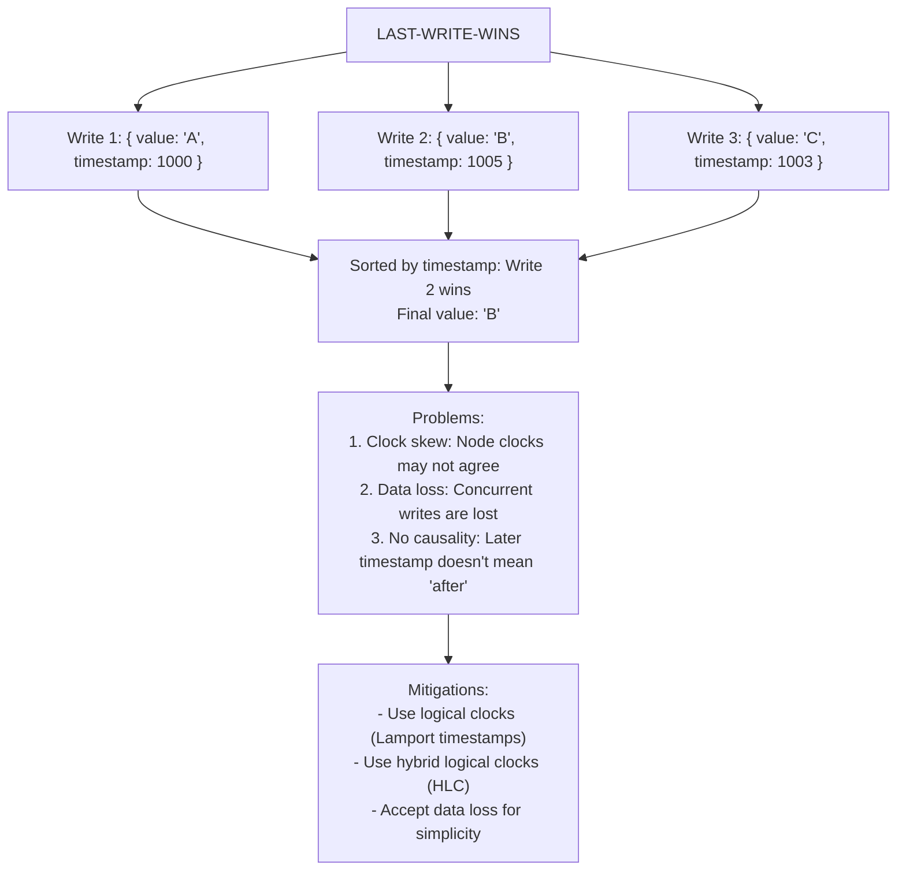

<details>
<summary>ASCII diagram (reference)</summary>

```text
┌─────────────────────────────────────────────────────────────┐
│                  LAST-WRITE-WINS                             │
│                                                              │
│  Write 1: { value: "A", timestamp: 1000 }                   │
│  Write 2: { value: "B", timestamp: 1005 }                   │
│  Write 3: { value: "C", timestamp: 1003 }                   │
│                                                              │
│  Sorted by timestamp: Write 2 wins                          │
│  Final value: "B"                                           │
│                                                              │
│  Problems:                                                   │
│  1. Clock skew: Node clocks may not agree                   │
│  2. Data loss: Concurrent writes are lost                   │
│  3. No causality: Later timestamp doesn't mean "after"      │
│                                                              │
│  Mitigations:                                                │
│  - Use logical clocks (Lamport timestamps)                  │
│  - Use hybrid logical clocks (HLC)                          │
│  - Accept data loss for simplicity                          │
│                                                              │
└─────────────────────────────────────────────────────────────┘
```
</details>
```

**Implementation**:

```java
public class LWWRegister<T> {
    private T value;
    private long timestamp;
    
    public synchronized void set(T newValue, long newTimestamp) {
        if (newTimestamp > this.timestamp) {
            this.value = newValue;
            this.timestamp = newTimestamp;
        }
        // Else: ignore (older write)
    }
    
    public synchronized void merge(LWWRegister<T> other) {
        if (other.timestamp > this.timestamp) {
            this.value = other.value;
            this.timestamp = other.timestamp;
        }
    }
}
```

### Vector Clocks for Conflict Detection

**Concept**: Track the version at each node. Compare vectors to detect concurrent updates.

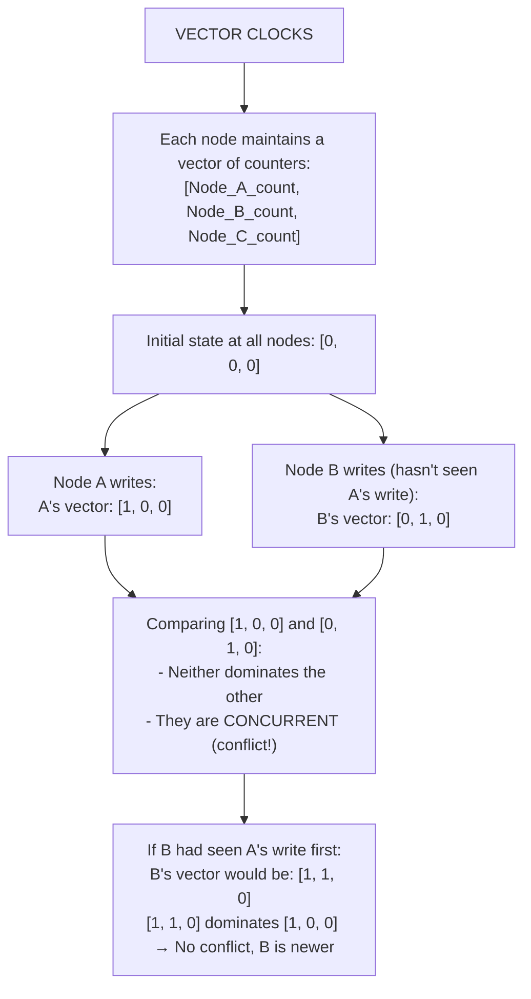

<details>
<summary>ASCII diagram (reference)</summary>

```text
┌─────────────────────────────────────────────────────────────┐
│                  VECTOR CLOCKS                               │
│                                                              │
│  Each node maintains a vector of counters:                  │
│  [Node_A_count, Node_B_count, Node_C_count]                 │
│                                                              │
│  Initial state at all nodes: [0, 0, 0]                      │
│                                                              │
│  Node A writes:                                              │
│  A's vector: [1, 0, 0]                                      │
│                                                              │
│  Node B writes (hasn't seen A's write):                     │
│  B's vector: [0, 1, 0]                                      │
│                                                              │
│  Comparing [1, 0, 0] and [0, 1, 0]:                         │
│  - Neither dominates the other                              │
│  - They are CONCURRENT (conflict!)                          │
│                                                              │
│  If B had seen A's write first:                             │
│  B's vector would be: [1, 1, 0]                             │
│  [1, 1, 0] dominates [1, 0, 0] → No conflict, B is newer    │
│                                                              │
└─────────────────────────────────────────────────────────────┘
```
</details>
```

**Comparison Rules**:

```
Vector A dominates B if:
  - Every element in A >= corresponding element in B
  - At least one element in A > corresponding element in B

Examples:
  [2, 1, 0] dominates [1, 1, 0] → A happened after B
  [1, 2, 0] dominates [1, 1, 0] → A happened after B
  [2, 1, 0] vs [1, 2, 0] → Concurrent (conflict!)
  [1, 1, 0] vs [1, 1, 0] → Same version
```

### CRDTs (Conflict-free Replicated Data Types)

**Concept**: Design data structures where all concurrent operations can be merged automatically without conflicts.

**G-Counter (Grow-only Counter)**:

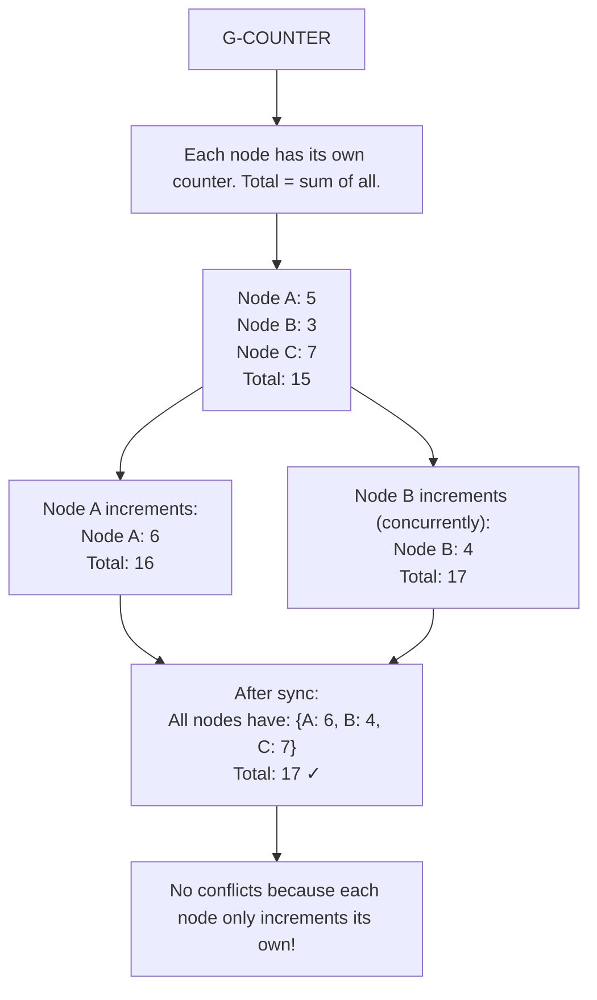

<details>
<summary>ASCII diagram (reference)</summary>

```text
┌─────────────────────────────────────────────────────────────┐
│                    G-COUNTER                                 │
│                                                              │
│  Each node has its own counter. Total = sum of all.         │
│                                                              │
│  Node A: 5                                                  │
│  Node B: 3                                                  │
│  Node C: 7                                                  │
│  Total: 15                                                  │
│                                                              │
│  Node A increments:                                          │
│  Node A: 6                                                  │
│  Total: 16                                                  │
│                                                              │
│  Node B increments (concurrently):                          │
│  Node B: 4                                                  │
│  Total: 17                                                  │
│                                                              │
│  After sync:                                                 │
│  All nodes have: {A: 6, B: 4, C: 7}                        │
│  Total: 17 ✓                                                │
│                                                              │
│  No conflicts because each node only increments its own!    │
│                                                              │
└─────────────────────────────────────────────────────────────┘
```
</details>
```

**PN-Counter (Positive-Negative Counter)**:

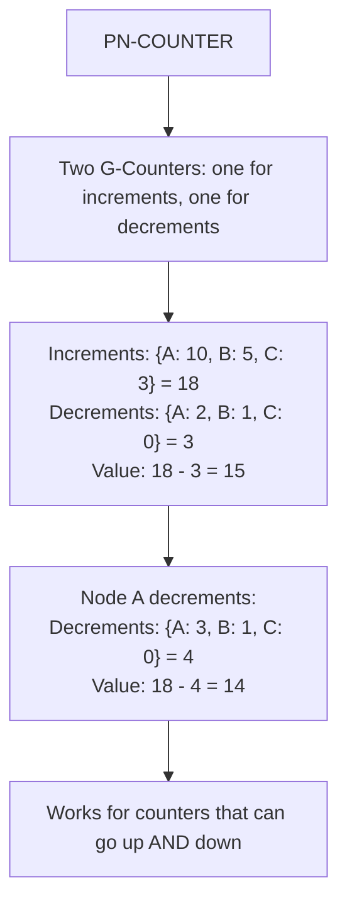

<details>
<summary>ASCII diagram (reference)</summary>

```text
┌─────────────────────────────────────────────────────────────┐
│                   PN-COUNTER                                 │
│                                                              │
│  Two G-Counters: one for increments, one for decrements     │
│                                                              │
│  Increments: {A: 10, B: 5, C: 3}  = 18                     │
│  Decrements: {A: 2, B: 1, C: 0}   = 3                      │
│  Value: 18 - 3 = 15                                        │
│                                                              │
│  Node A decrements:                                          │
│  Decrements: {A: 3, B: 1, C: 0}   = 4                      │
│  Value: 18 - 4 = 14                                        │
│                                                              │
│  Works for counters that can go up AND down                 │
│                                                              │
└─────────────────────────────────────────────────────────────┘
```
</details>
```

**LWW-Element-Set (Last-Writer-Wins Set)**:

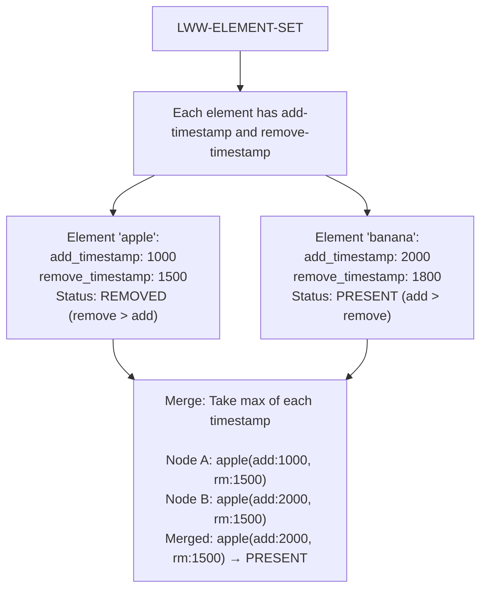

<details>
<summary>ASCII diagram (reference)</summary>

```text
┌─────────────────────────────────────────────────────────────┐
│                 LWW-ELEMENT-SET                              │
│                                                              │
│  Each element has add-timestamp and remove-timestamp        │
│                                                              │
│  Element "apple":                                            │
│    add_timestamp: 1000                                      │
│    remove_timestamp: 1500                                   │
│    Status: REMOVED (remove > add)                           │
│                                                              │
│  Element "banana":                                           │
│    add_timestamp: 2000                                      │
│    remove_timestamp: 1800                                   │
│    Status: PRESENT (add > remove)                           │
│                                                              │
│  Merge: Take max of each timestamp                          │
│                                                              │
│  Node A: apple(add:1000, rm:1500)                          │
│  Node B: apple(add:2000, rm:1500)                          │
│  Merged: apple(add:2000, rm:1500) → PRESENT                │
│                                                              │
└─────────────────────────────────────────────────────────────┘
```
</details>
```

**OR-Set (Observed-Remove Set)**:

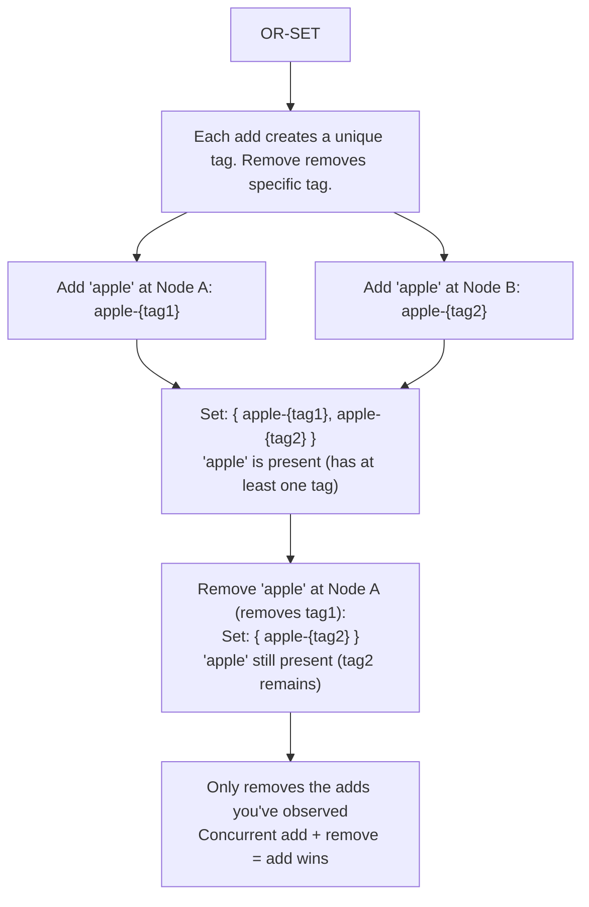

<details>
<summary>ASCII diagram (reference)</summary>

```text
┌─────────────────────────────────────────────────────────────┐
│                    OR-SET                                    │
│                                                              │
│  Each add creates a unique tag. Remove removes specific tag.│
│                                                              │
│  Add "apple" at Node A: apple-{tag1}                        │
│  Add "apple" at Node B: apple-{tag2}                        │
│                                                              │
│  Set: { apple-{tag1}, apple-{tag2} }                       │
│  "apple" is present (has at least one tag)                  │
│                                                              │
│  Remove "apple" at Node A (removes tag1):                   │
│  Set: { apple-{tag2} }                                     │
│  "apple" still present (tag2 remains)                       │
│                                                              │
│  Only removes the adds you've observed                      │
│  Concurrent add + remove = add wins                         │
│                                                              │
└─────────────────────────────────────────────────────────────┘
```
</details>
```

### Application-Level Resolution

**Concept**: Return all conflicting versions to the application. Let application logic decide.

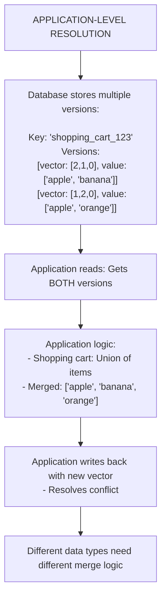

<details>
<summary>ASCII diagram (reference)</summary>

```text
┌─────────────────────────────────────────────────────────────┐
│           APPLICATION-LEVEL RESOLUTION                       │
│                                                              │
│  Database stores multiple versions:                          │
│                                                              │
│  Key: "shopping_cart_123"                                   │
│  Versions:                                                   │
│    [vector: [2,1,0], value: ["apple", "banana"]]           │
│    [vector: [1,2,0], value: ["apple", "orange"]]           │
│                                                              │
│  Application reads: Gets BOTH versions                      │
│                                                              │
│  Application logic:                                          │
│  - Shopping cart: Union of items                            │
│  - Merged: ["apple", "banana", "orange"]                   │
│                                                              │
│  Application writes back with new vector                    │
│  - Resolves conflict                                        │
│                                                              │
│  Different data types need different merge logic            │
│                                                              │
└─────────────────────────────────────────────────────────────┘
```
</details>
```

---

## 4️⃣ Simulation-First Explanation

### Scenario 1: Last-Write-Wins in Action

```
Setup: Two datacenters with multi-leader replication

Initial state: user.email = "old@example.com"

T=0ms:  User updates email in DC-East
        DC-East: email = "east@example.com", ts = 1000

T=5ms:  User updates email in DC-West (different device)
        DC-West: email = "west@example.com", ts = 1005

T=100ms: Replication syncs datacenters

DC-East receives: email = "west@example.com", ts = 1005
  1005 > 1000 → Accept West's value

DC-West receives: email = "east@example.com", ts = 1000
  1000 < 1005 → Reject (already have newer)

Final state (both DCs): email = "west@example.com"

User in East: "Why did my email change?!" 
              (Their update was silently lost)
```

### Scenario 2: Vector Clock Conflict Detection

```
Setup: Three-node Dynamo-style cluster

Initial: key="cart", value=[], vector=[0,0,0]

T=0ms:  Node A: Add "apple"
        value=["apple"], vector=[1,0,0]

T=5ms:  Node B: Add "banana" (hasn't seen A's update)
        value=["banana"], vector=[0,1,0]

T=10ms: Client reads from A and B

Comparing vectors:
  [1,0,0] vs [0,1,0]
  Neither dominates → CONFLICT DETECTED

Return to client:
  Version 1: ["apple"], vector=[1,0,0]
  Version 2: ["banana"], vector=[0,1,0]

Client merges: ["apple", "banana"]
Client writes: value=["apple","banana"], vector=[1,1,0]

Now all nodes converge to merged value
```

### Scenario 3: G-Counter Convergence

```
Setup: Three nodes tracking page views

Initial state:
  Node A: {A:0, B:0, C:0}
  Node B: {A:0, B:0, C:0}
  Node C: {A:0, B:0, C:0}

T=0ms:  100 views hit Node A
        Node A: {A:100, B:0, C:0}

T=1ms:  50 views hit Node B
        Node B: {A:0, B:50, C:0}

T=2ms:  30 views hit Node C
        Node C: {A:0, B:0, C:30}

T=100ms: Nodes sync (any order, any number of times)

After sync, all nodes have:
  {A:100, B:50, C:30}
  Total: 180 views

No conflicts! Each node only updates its own counter.
Merge = element-wise maximum
```

### Scenario 4: Shopping Cart with OR-Set

```
Setup: Shopping cart CRDT

Initial: cart = {}

User on phone (offline):
  Add "apple" → cart = {apple-{tag1}}
  Add "banana" → cart = {apple-{tag1}, banana-{tag2}}

User on laptop (offline):
  Add "apple" → cart = {apple-{tag3}}
  Remove "apple" → cart = {} (removes tag3)
  Add "orange" → cart = {orange-{tag4}}

Sync happens:

Phone state: {apple-{tag1}, banana-{tag2}}
Laptop state: {orange-{tag4}}

Merged state: {apple-{tag1}, banana-{tag2}, orange-{tag4}}

Result: ["apple", "banana", "orange"]

Note: "apple" survives because laptop only removed tag3,
      not tag1 (which it hadn't observed)
```

---

## 5️⃣ How Engineers Actually Use This in Production

### At Major Companies

**Amazon DynamoDB**:
- Uses vector clocks for conflict detection
- Returns all conflicting versions to application
- Shopping cart: Merge by union
- Recommends designing for conflict-free operations

**Riak**:
- Supports CRDTs natively (counters, sets, maps)
- Allows custom merge functions
- Vector clocks for causality tracking

**Redis (CRDTs in Redis Enterprise)**:
- Geo-distributed active-active
- G-Counter for distributed counters
- OR-Set for distributed sets

**Figma**:
- Custom CRDTs for design elements
- Real-time collaboration without conflicts
- Each object has its own CRDT

**Apple (CloudKit)**:
- Last-write-wins with timestamps
- Conflict resolution callbacks for apps
- Designed for offline-first mobile apps

### Choosing a Strategy

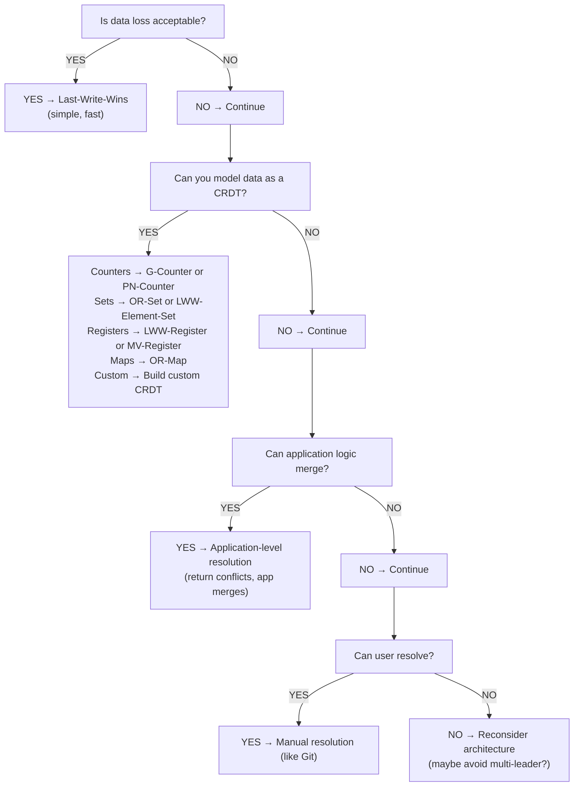

<details>
<summary>ASCII diagram (reference)</summary>

```text
┌─────────────────────────────────────────────────────────────┐
│           CONFLICT RESOLUTION DECISION TREE                  │
├─────────────────────────────────────────────────────────────┤
│                                                              │
│  Is data loss acceptable?                                   │
│  └── YES → Last-Write-Wins (simple, fast)                   │
│  └── NO → Continue                                          │
│                                                              │
│  Can you model data as a CRDT?                              │
│  └── Counters → G-Counter or PN-Counter                     │
│  └── Sets → OR-Set or LWW-Element-Set                       │
│  └── Registers → LWW-Register or MV-Register                │
│  └── Maps → OR-Map                                          │
│  └── Custom → Build custom CRDT                             │
│  └── NO → Continue                                          │
│                                                              │
│  Can application logic merge?                               │
│  └── YES → Application-level resolution                     │
│            (return conflicts, app merges)                   │
│  └── NO → Continue                                          │
│                                                              │
│  Can user resolve?                                          │
│  └── YES → Manual resolution (like Git)                     │
│  └── NO → Reconsider architecture                           │
│            (maybe avoid multi-leader?)                      │
│                                                              │
└─────────────────────────────────────────────────────────────┘
```
</details>
```

---

## 6️⃣ How to Implement or Apply It

### G-Counter Implementation

```java
package com.example.crdt;

import java.util.HashMap;
import java.util.Map;
import java.util.concurrent.ConcurrentHashMap;

/**
 * Grow-only counter CRDT.
 * Each node can only increment its own counter.
 * Total value is sum of all counters.
 */
public class GCounter {
    
    private final String nodeId;
    private final Map<String, Long> counters;
    
    public GCounter(String nodeId) {
        this.nodeId = nodeId;
        this.counters = new ConcurrentHashMap<>();
        this.counters.put(nodeId, 0L);
    }
    
    /**
     * Increment counter (only affects this node's count).
     */
    public void increment() {
        counters.merge(nodeId, 1L, Long::sum);
    }
    
    public void increment(long delta) {
        if (delta < 0) {
            throw new IllegalArgumentException("G-Counter can only grow");
        }
        counters.merge(nodeId, delta, Long::sum);
    }
    
    /**
     * Get total value (sum of all nodes).
     */
    public long getValue() {
        return counters.values().stream().mapToLong(Long::longValue).sum();
    }
    
    /**
     * Merge with another G-Counter.
     * Take element-wise maximum.
     */
    public void merge(GCounter other) {
        for (Map.Entry<String, Long> entry : other.counters.entrySet()) {
            counters.merge(entry.getKey(), entry.getValue(), Long::max);
        }
    }
    
    /**
     * Get state for replication.
     */
    public Map<String, Long> getState() {
        return new HashMap<>(counters);
    }
    
    /**
     * Apply state from replication.
     */
    public void applyState(Map<String, Long> state) {
        for (Map.Entry<String, Long> entry : state.entrySet()) {
            counters.merge(entry.getKey(), entry.getValue(), Long::max);
        }
    }
}
```

### PN-Counter Implementation

```java
package com.example.crdt;

/**
 * Positive-Negative counter CRDT.
 * Supports both increment and decrement.
 */
public class PNCounter {
    
    private final GCounter increments;
    private final GCounter decrements;
    
    public PNCounter(String nodeId) {
        this.increments = new GCounter(nodeId);
        this.decrements = new GCounter(nodeId);
    }
    
    public void increment() {
        increments.increment();
    }
    
    public void increment(long delta) {
        increments.increment(delta);
    }
    
    public void decrement() {
        decrements.increment();
    }
    
    public void decrement(long delta) {
        decrements.increment(delta);
    }
    
    public long getValue() {
        return increments.getValue() - decrements.getValue();
    }
    
    public void merge(PNCounter other) {
        increments.merge(other.increments);
        decrements.merge(other.decrements);
    }
}
```

### LWW-Register Implementation

```java
package com.example.crdt;

import java.time.Instant;

/**
 * Last-Writer-Wins Register.
 * Stores a single value, highest timestamp wins.
 */
public class LWWRegister<T> {
    
    private T value;
    private Instant timestamp;
    private final String nodeId;
    
    public LWWRegister(String nodeId) {
        this.nodeId = nodeId;
        this.timestamp = Instant.EPOCH;
    }
    
    public void set(T newValue) {
        set(newValue, Instant.now());
    }
    
    public synchronized void set(T newValue, Instant newTimestamp) {
        if (newTimestamp.isAfter(this.timestamp)) {
            this.value = newValue;
            this.timestamp = newTimestamp;
        }
        // If timestamps equal, use node ID as tiebreaker
        else if (newTimestamp.equals(this.timestamp)) {
            // Deterministic tiebreaker (e.g., lexicographic node ID)
            // This ensures all nodes converge to same value
        }
    }
    
    public T get() {
        return value;
    }
    
    public synchronized void merge(LWWRegister<T> other) {
        if (other.timestamp.isAfter(this.timestamp)) {
            this.value = other.value;
            this.timestamp = other.timestamp;
        }
    }
    
    public RegisterState<T> getState() {
        return new RegisterState<>(value, timestamp);
    }
    
    public record RegisterState<T>(T value, Instant timestamp) {}
}
```

### OR-Set Implementation

```java
package com.example.crdt;

import java.util.*;
import java.util.concurrent.ConcurrentHashMap;

/**
 * Observed-Remove Set CRDT.
 * Add wins over concurrent remove.
 */
public class ORSet<E> {
    
    private final String nodeId;
    private final Map<E, Set<String>> elements;  // Element -> Set of unique tags
    private long tagCounter = 0;
    
    public ORSet(String nodeId) {
        this.nodeId = nodeId;
        this.elements = new ConcurrentHashMap<>();
    }
    
    /**
     * Add element with unique tag.
     */
    public synchronized void add(E element) {
        String tag = nodeId + "-" + (++tagCounter);
        elements.computeIfAbsent(element, k -> ConcurrentHashMap.newKeySet())
                .add(tag);
    }
    
    /**
     * Remove element by removing all observed tags.
     */
    public synchronized void remove(E element) {
        elements.remove(element);
    }
    
    /**
     * Check if element is in set.
     */
    public boolean contains(E element) {
        Set<String> tags = elements.get(element);
        return tags != null && !tags.isEmpty();
    }
    
    /**
     * Get all elements in set.
     */
    public Set<E> getElements() {
        Set<E> result = new HashSet<>();
        for (Map.Entry<E, Set<String>> entry : elements.entrySet()) {
            if (!entry.getValue().isEmpty()) {
                result.add(entry.getKey());
            }
        }
        return result;
    }
    
    /**
     * Merge with another OR-Set.
     * Union of all element-tag pairs.
     */
    public synchronized void merge(ORSet<E> other) {
        for (Map.Entry<E, Set<String>> entry : other.elements.entrySet()) {
            elements.computeIfAbsent(entry.getKey(), k -> ConcurrentHashMap.newKeySet())
                    .addAll(entry.getValue());
        }
    }
    
    /**
     * Get state for replication.
     */
    public Map<E, Set<String>> getState() {
        Map<E, Set<String>> state = new HashMap<>();
        for (Map.Entry<E, Set<String>> entry : elements.entrySet()) {
            state.put(entry.getKey(), new HashSet<>(entry.getValue()));
        }
        return state;
    }
}
```

### Vector Clock Implementation

```java
package com.example.crdt;

import java.util.HashMap;
import java.util.Map;

/**
 * Vector clock for causality tracking and conflict detection.
 */
public class VectorClock {
    
    private final Map<String, Long> clock;
    
    public VectorClock() {
        this.clock = new HashMap<>();
    }
    
    public VectorClock(Map<String, Long> clock) {
        this.clock = new HashMap<>(clock);
    }
    
    /**
     * Increment this node's counter.
     */
    public void increment(String nodeId) {
        clock.merge(nodeId, 1L, Long::sum);
    }
    
    /**
     * Get counter for a node.
     */
    public long get(String nodeId) {
        return clock.getOrDefault(nodeId, 0L);
    }
    
    /**
     * Merge with another vector clock (element-wise max).
     */
    public void merge(VectorClock other) {
        for (Map.Entry<String, Long> entry : other.clock.entrySet()) {
            clock.merge(entry.getKey(), entry.getValue(), Long::max);
        }
    }
    
    /**
     * Compare two vector clocks.
     * Returns:
     *   BEFORE: this happened before other
     *   AFTER: this happened after other
     *   EQUAL: same version
     *   CONCURRENT: neither happened before the other (conflict!)
     */
    public Comparison compare(VectorClock other) {
        boolean thisGreater = false;
        boolean otherGreater = false;
        
        // Check all keys from both clocks
        Set<String> allKeys = new HashSet<>(this.clock.keySet());
        allKeys.addAll(other.clock.keySet());
        
        for (String key : allKeys) {
            long thisValue = this.get(key);
            long otherValue = other.get(key);
            
            if (thisValue > otherValue) {
                thisGreater = true;
            } else if (otherValue > thisValue) {
                otherGreater = true;
            }
        }
        
        if (thisGreater && otherGreater) {
            return Comparison.CONCURRENT;
        } else if (thisGreater) {
            return Comparison.AFTER;
        } else if (otherGreater) {
            return Comparison.BEFORE;
        } else {
            return Comparison.EQUAL;
        }
    }
    
    public Map<String, Long> getState() {
        return new HashMap<>(clock);
    }
    
    public enum Comparison {
        BEFORE,     // This happened before other
        AFTER,      // This happened after other
        EQUAL,      // Same version
        CONCURRENT  // Conflict - neither before nor after
    }
}
```

### Application-Level Resolution Example

```java
package com.example.conflict;

import java.util.*;

/**
 * Shopping cart with application-level conflict resolution.
 */
@Service
public class ShoppingCartService {
    
    private final CartRepository cartRepository;
    
    /**
     * Get cart, resolving conflicts if any.
     */
    public Cart getCart(String userId) {
        List<VersionedCart> versions = cartRepository.getAllVersions(userId);
        
        if (versions.size() == 1) {
            // No conflict
            return versions.get(0).getCart();
        }
        
        // Conflict! Merge all versions
        Cart merged = mergeCartVersions(versions);
        
        // Write merged version back (resolves conflict)
        VectorClock mergedClock = mergeClocks(versions);
        cartRepository.save(userId, merged, mergedClock);
        
        return merged;
    }
    
    /**
     * Merge conflicting cart versions.
     * Strategy: Union of all items, sum quantities.
     */
    private Cart mergeCartVersions(List<VersionedCart> versions) {
        Map<String, Integer> mergedItems = new HashMap<>();
        
        for (VersionedCart version : versions) {
            for (CartItem item : version.getCart().getItems()) {
                mergedItems.merge(item.getProductId(), item.getQuantity(), Integer::sum);
            }
        }
        
        List<CartItem> items = mergedItems.entrySet().stream()
            .map(e -> new CartItem(e.getKey(), e.getValue()))
            .toList();
        
        return new Cart(items);
    }
    
    /**
     * Merge vector clocks from all versions.
     */
    private VectorClock mergeClocks(List<VersionedCart> versions) {
        VectorClock merged = new VectorClock();
        for (VersionedCart version : versions) {
            merged.merge(version.getClock());
        }
        return merged;
    }
}
```

---

## 7️⃣ Tradeoffs, Pitfalls, and Common Mistakes

### Common Mistake 1: Using LWW for Important Data

```java
// WRONG: LWW for bank balance
public void updateBalance(String accountId, BigDecimal newBalance) {
    balanceStore.put(accountId, newBalance, System.currentTimeMillis());
    // Concurrent updates will lose data!
}

// RIGHT: Use proper transactions or CRDTs
@Transactional
public void updateBalance(String accountId, BigDecimal delta) {
    Account account = accountRepo.findByIdForUpdate(accountId);
    account.setBalance(account.getBalance().add(delta));
    accountRepo.save(account);
}

// Or use PN-Counter CRDT for distributed counters
public void adjustBalance(String accountId, BigDecimal delta) {
    PNCounter counter = counterStore.get(accountId);
    if (delta.compareTo(BigDecimal.ZERO) > 0) {
        counter.increment(delta.longValue());
    } else {
        counter.decrement(delta.abs().longValue());
    }
}
```

### Common Mistake 2: Clock Skew with LWW

```
Scenario: Two servers with clock skew

Server A clock: 10:00:00 (correct)
Server B clock: 10:00:05 (5 seconds ahead)

T=0 (real time):
  Server A writes: value="A", ts=10:00:00
  
T=1 second (real time):
  Server B writes: value="B", ts=10:00:06

LWW result: "B" wins (higher timestamp)
But "A" was actually written AFTER "B" in real time!

Solution: Use logical clocks or hybrid logical clocks
```

### Common Mistake 3: Not Handling All CRDT Cases

```java
// WRONG: Incomplete OR-Set merge
public void merge(ORSet<E> other) {
    // Only adding elements from other
    for (E element : other.getElements()) {
        this.add(element);
    }
    // WRONG! This doesn't properly merge tags
    // Removed elements might reappear
}

// RIGHT: Merge at the tag level
public void merge(ORSet<E> other) {
    for (Map.Entry<E, Set<String>> entry : other.elements.entrySet()) {
        elements.computeIfAbsent(entry.getKey(), k -> new HashSet<>())
                .addAll(entry.getValue());
    }
    // Properly merges tags, respects removes
}
```

### Common Mistake 4: Growing Vector Clocks

```
Problem: Vector clock size grows with number of nodes

10 nodes: 10 entries per clock
1000 nodes: 1000 entries per clock
1M nodes: 1M entries per clock (too big!)

Solutions:
1. Prune old entries (lose some causality info)
2. Use client IDs instead of server IDs
3. Use dotted version vectors
4. Use interval tree clocks
```

### CRDT Limitations

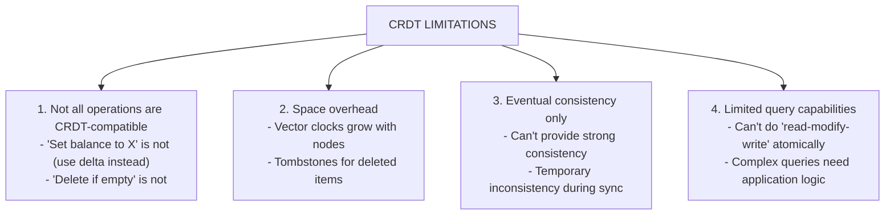

<details>
<summary>ASCII diagram (reference)</summary>

```text
┌─────────────────────────────────────────────────────────────┐
│                  CRDT LIMITATIONS                            │
│                                                              │
│  1. Not all operations are CRDT-compatible                  │
│     - "Set balance to X" is not (use delta instead)         │
│     - "Delete if empty" is not                              │
│                                                              │
│  2. Space overhead                                           │
│     - Vector clocks grow with nodes                         │
│     - Tombstones for deleted items                          │
│                                                              │
│  3. Eventual consistency only                                │
│     - Can't provide strong consistency                      │
│     - Temporary inconsistency during sync                   │
│                                                              │
│  4. Limited query capabilities                               │
│     - Can't do "read-modify-write" atomically              │
│     - Complex queries need application logic                │
│                                                              │
└─────────────────────────────────────────────────────────────┘
```
</details>
```

---

## 8️⃣ When NOT to Use This

### When NOT to Use LWW

1. **Financial data**
   - Can't afford to lose updates
   - Use proper transactions

2. **Inventory counts**
   - Lost updates = overselling
   - Use PN-Counter or transactions

3. **User-generated content**
   - Users expect their edits to persist
   - Use merge or manual resolution

### When NOT to Use CRDTs

1. **Strong consistency requirements**
   - CRDTs are eventually consistent
   - Use consensus protocols instead

2. **Complex business logic**
   - "Transfer $100 from A to B" isn't a CRDT
   - Use transactions or sagas

3. **Space-constrained systems**
   - CRDTs have overhead (tombstones, vectors)
   - May not fit in memory

### When NOT to Use Multi-Leader/Leaderless

1. **If you can avoid it**
   - Single-leader is simpler
   - Only use multi-leader if you need it

2. **Tightly coupled data**
   - Foreign keys across regions
   - Complex referential integrity

---

## 9️⃣ Comparison with Alternatives

### Conflict Resolution Strategy Comparison

| Strategy | Data Loss | Complexity | Automation | Use Case |
|----------|-----------|------------|------------|----------|
| LWW | High | Low | Full | Caching, non-critical |
| Vector Clocks + App | None | Medium | Partial | Shopping carts |
| CRDTs | None | High | Full | Counters, sets |
| Manual Resolution | None | Low | None | Documents, code |
| OT (Operational Transform) | None | Very High | Full | Text editing |

### CRDT Types Comparison

| CRDT | Operations | Merge | Use Case |
|------|------------|-------|----------|
| G-Counter | Increment | Sum | Page views |
| PN-Counter | Inc/Dec | Sum | Likes/dislikes |
| LWW-Register | Set | Latest | User profile |
| MV-Register | Set | All versions | Conflict-aware |
| G-Set | Add | Union | Tags |
| OR-Set | Add/Remove | Union | Shopping cart |
| LWW-Map | Put/Remove | Latest per key | Settings |

---

## 🔟 Interview Follow-Up Questions WITH Answers

### L4 (Entry-Level) Questions

**Q1: What is a conflict in distributed systems and why does it happen?**

**Answer:**
A conflict occurs when the same data is modified on different nodes simultaneously, and we need to decide which value to keep when synchronizing.

Conflicts happen because:
1. **Multi-leader replication**: Two datacenters both accept writes to the same record.
2. **Offline-first apps**: User edits on phone while offline, syncs later with server changes.
3. **Network partitions**: Nodes can't communicate, both continue accepting writes.

Example: User updates profile name on phone (offline) to "Alice" and on laptop to "Alicia". When they sync, which name should win?

**Q2: What is Last-Write-Wins and what are its problems?**

**Answer:**
Last-Write-Wins (LWW) resolves conflicts by keeping the value with the highest timestamp. Simple to implement but has problems:

1. **Data loss**: Concurrent writes are silently discarded. If two users edit a document, one loses their work.

2. **Clock skew**: If server clocks disagree, the "last" write might not be the most recent in real time.

3. **No merge**: Can't combine concurrent changes. Shopping cart example: User adds "apple" on phone, "banana" on laptop. LWW keeps one, loses the other.

LWW is acceptable for caching or when data loss is tolerable, but not for important user data.

### L5 (Mid-Level) Questions

**Q3: Explain how vector clocks work and how they detect conflicts.**

**Answer:**
Vector clocks are logical clocks that track causality across distributed nodes. Each node maintains a vector of counters, one per node in the system.

**How it works:**
1. When a node writes, it increments its own counter in the vector.
2. When nodes sync, they exchange vectors.
3. Comparing vectors tells us if one happened before the other or if they're concurrent.

**Comparison rules:**
- Vector A dominates B if every element in A ≥ B, and at least one is greater.
- If neither dominates, they're concurrent (conflict!).

**Example:**
```
Node A writes: vector = [1, 0, 0]
Node B writes: vector = [0, 1, 0]

Compare: [1,0,0] vs [0,1,0]
- A has higher first element
- B has higher second element
- Neither dominates → CONCURRENT → CONFLICT!
```

If B had seen A's write first:
```
B's vector would be [1, 1, 0]
[1,1,0] dominates [1,0,0] → B happened after A, no conflict
```

**Q4: What are CRDTs and when would you use them?**

**Answer:**
CRDTs (Conflict-free Replicated Data Types) are data structures designed so that concurrent operations can always be merged without conflicts.

**Key property**: Any two replicas that have seen the same set of operations will have the same state, regardless of the order they received them.

**Common CRDTs:**
- **G-Counter**: Grow-only counter. Each node has its own counter, total is sum. Great for page views.
- **PN-Counter**: Add/subtract. Two G-Counters (increments and decrements). Great for likes.
- **OR-Set**: Add/remove from set. Each add has unique tag, remove only removes observed tags. Great for shopping carts.

**When to use:**
- Real-time collaboration (Figma, Google Docs)
- Offline-first mobile apps
- Geo-distributed systems with multi-leader
- When you need high availability with eventual consistency

**When NOT to use:**
- Strong consistency requirements
- Complex transactions
- When operations aren't naturally CRDT-compatible

### L6 (Senior) Questions

**Q5: Design a conflict resolution strategy for a collaborative document editor.**

**Answer:**
For a collaborative document editor, I'd use a combination of approaches:

**For text content: Operational Transformation (OT) or CRDTs**

OT approach:
1. Each edit is an operation (insert char at position, delete char at position).
2. When concurrent operations arrive, transform them against each other.
3. Ensures all clients converge to same document.

CRDT approach (e.g., RGA - Replicated Growable Array):
1. Each character has a unique ID.
2. Insert operations specify "insert after ID X".
3. Concurrent inserts at same position get deterministic ordering.

**For document metadata: LWW-Register**
- Title, owner, permissions
- Last writer wins is acceptable

**For comments: OR-Set**
- Add/remove comments
- Concurrent add + remove = add wins

**Architecture:**
```
Client → Local CRDT state → Sync with server
                         ↓
              Server merges all client states
                         ↓
              Broadcast merged state to clients
```

**Conflict scenarios handled:**
1. Two users type at same position → Both characters appear (ordered by ID)
2. User A deletes text, User B edits it → Depends on timing (OT) or edit wins (CRDT)
3. User A and B both change title → LWW, last one wins

**Q6: How would you handle conflict resolution in a globally distributed banking system?**

**Answer:**
Banking requires strong consistency for balances, so I'd avoid conflicts rather than resolve them:

**Architecture: Single-leader per account region**
- Each account assigned to a home region
- All writes for that account go to home region leader
- No conflicts because single writer

**For cross-region transfers:**
- Use Saga pattern, not distributed transactions
- Step 1: Debit source account (in source region)
- Step 2: Credit destination account (in destination region)
- Compensate if either fails

**For read scalability:**
- Read replicas in each region
- Accept eventual consistency for balance display
- Strong consistency only for actual transactions

**For truly global accounts (rare):**
- Use consensus protocol (Paxos/Raft) across regions
- Accept higher latency for writes
- Or use CRDTs for specific use cases:
  - PN-Counter for reward points (not actual money)
  - OR-Set for transaction history (append-only)

**Why not multi-leader for banking:**
- Can't use LWW (money would disappear)
- CRDTs don't work for "transfer" operations
- Conflicts in banking = regulatory/legal issues

**Key insight**: The best conflict resolution is conflict avoidance. Design the system so conflicts can't happen for critical data.

---

## 1️⃣1️⃣ One Clean Mental Summary

Conflicts occur when the same data is modified on different nodes simultaneously in distributed systems. There are several resolution strategies:

**Last-Write-Wins (LWW)** is simple: highest timestamp wins. It's fast but loses data. Use only for caching or non-critical data.

**Vector clocks** detect conflicts by tracking causality. They tell you if operations are concurrent (conflict) or ordered (no conflict). Return conflicts to the application for resolution.

**CRDTs** are data structures designed to merge automatically without conflicts. G-Counters for counting, PN-Counters for up/down, OR-Sets for add/remove. They're powerful but limited to specific operations.

**Application-level resolution** returns all conflicting versions to the application. The app decides how to merge (e.g., union for shopping carts).

The best strategy depends on your data: LWW for caching, CRDTs for counters/sets, application logic for complex merges, and conflict avoidance (single-leader) for critical data like banking.

