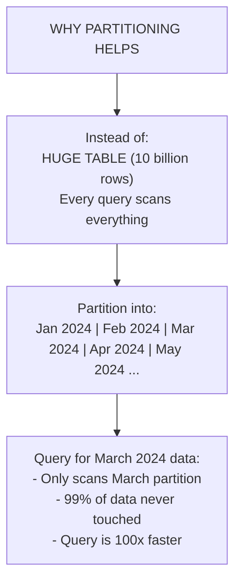
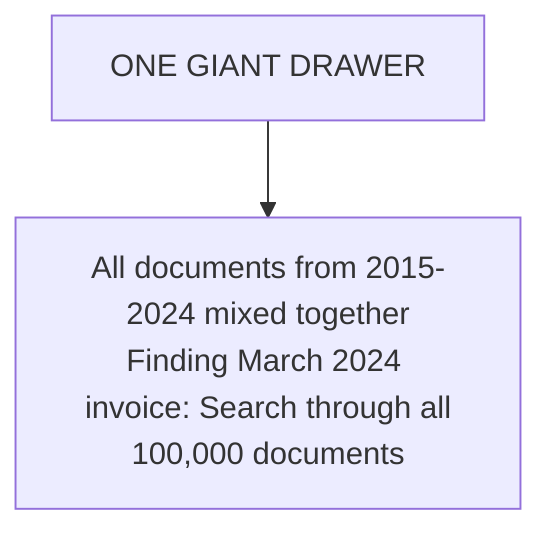
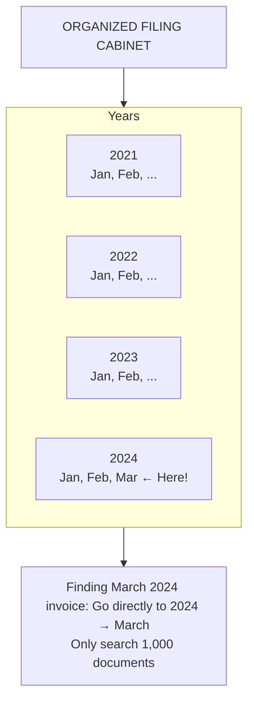
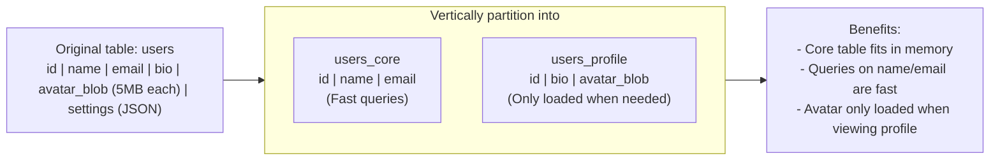
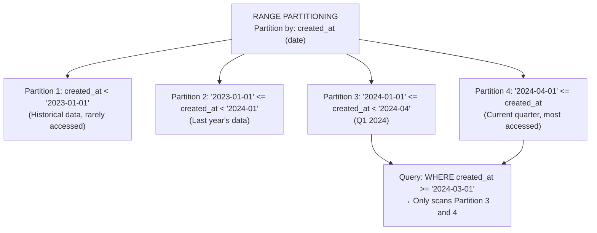
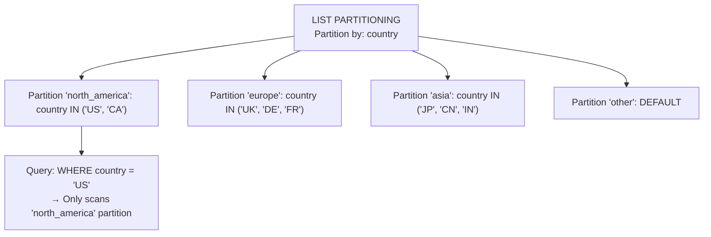
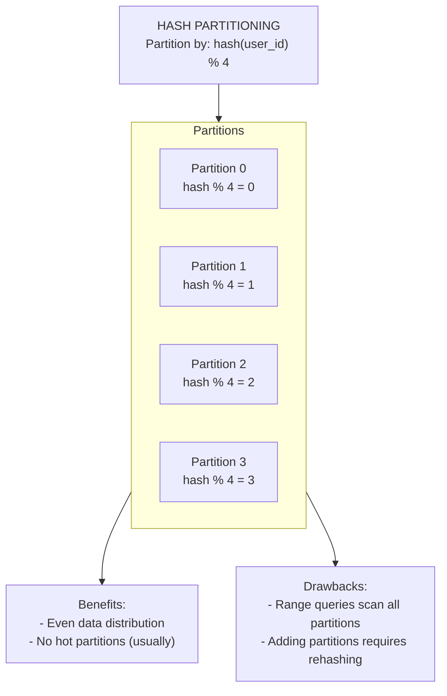

# Database Partitioning Strategies: Dividing Data for Scale

## 0️⃣ Prerequisites

Before diving into database partitioning, you should understand:

- **Database Sharding Basics**: Hash, range, and directory-based sharding (covered in Topic 5). This topic goes deeper into partitioning strategies.
- **Database Indexing**: How indexes work and affect query performance (covered in Topic 2).
- **Query Optimization**: Understanding execution plans (covered in Topic 8).

**Quick refresher on partitioning vs sharding**: Partitioning divides a table into smaller pieces. Sharding distributes those pieces across multiple servers. Partitioning can be done within a single database (for manageability) or across servers (for scale).

---

## 1️⃣ What Problem Does This Exist to Solve?

### The Specific Pain Point

Imagine you're running a logging system:

```
Table: application_logs
- 10 billion rows
- 5 TB of data
- Growing by 100 million rows per day

Problems:
1. Full table scan takes hours
2. Index maintenance slows writes
3. Backup takes forever
4. Can't fit in memory
5. Single disk is bottleneck
```

**Without partitioning**:
- Queries scan entire table
- Maintenance windows are huge
- Single point of failure
- Can't scale beyond one server

### The Key Insight



<details>
<summary>ASCII diagram (reference)</summary>

```text
┌─────────────────────────────────────────────────────────────┐
│              WHY PARTITIONING HELPS                          │
│                                                              │
│  Instead of:                                                 │
│  ┌─────────────────────────────────────────────────────┐   │
│  │           HUGE TABLE (10 billion rows)               │   │
│  │           Every query scans everything               │   │
│  └─────────────────────────────────────────────────────┘   │
│                                                              │
│  Partition into:                                             │
│  ┌───────┐ ┌───────┐ ┌───────┐ ┌───────┐ ┌───────┐        │
│  │ Jan   │ │ Feb   │ │ Mar   │ │ Apr   │ │ May   │ ...    │
│  │ 2024  │ │ 2024  │ │ 2024  │ │ 2024  │ │ 2024  │        │
│  └───────┘ └───────┘ └───────┘ └───────┘ └───────┘        │
│                                                              │
│  Query for March 2024 data:                                 │
│  - Only scans March partition                               │
│  - 99% of data never touched                               │
│  - Query is 100x faster                                     │
│                                                              │
└─────────────────────────────────────────────────────────────┘
```
</details>
```

### Real Examples

**Time-series data (logs, metrics)**: Partition by time. Query recent data without scanning history.

**Multi-tenant SaaS**: Partition by tenant. Each tenant's data isolated.

**E-commerce orders**: Partition by date. Archive old partitions to cold storage.

**Geographic data**: Partition by region. Queries for US data don't scan EU data.

---

## 2️⃣ Intuition and Mental Model

### The Filing Cabinet Analogy

**Unpartitioned Table = One Giant Drawer**



<details>
<summary>ASCII diagram (reference)</summary>

```text
┌─────────────────────────────────────────────────────────────┐
│                  ONE GIANT DRAWER                            │
│                                                              │
│  ┌─────────────────────────────────────────────────────┐   │
│  │ All documents from 2015-2024 mixed together         │   │
│  │ Finding March 2024 invoice: Search through all      │   │
│  │ 100,000 documents                                   │   │
│  └─────────────────────────────────────────────────────┘   │
│                                                              │
└─────────────────────────────────────────────────────────────┘
```
</details>
```

**Partitioned Table = Organized Filing Cabinet**



<details>
<summary>ASCII diagram (reference)</summary>

```text
┌─────────────────────────────────────────────────────────────┐
│              ORGANIZED FILING CABINET                        │
│                                                              │
│  ┌─────────┐ ┌─────────┐ ┌─────────┐ ┌─────────┐           │
│  │ 2021    │ │ 2022    │ │ 2023    │ │ 2024    │           │
│  │         │ │         │ │         │ │         │           │
│  │ ┌─────┐ │ │ ┌─────┐ │ │ ┌─────┐ │ │ ┌─────┐ │           │
│  │ │ Jan │ │ │ │ Jan │ │ │ │ Jan │ │ │ │ Jan │ │           │
│  │ ├─────┤ │ │ ├─────┤ │ │ ├─────┤ │ │ ├─────┤ │           │
│  │ │ Feb │ │ │ │ Feb │ │ │ │ Feb │ │ │ │ Feb │ │           │
│  │ ├─────┤ │ │ ├─────┤ │ │ ├─────┤ │ │ ├─────┤ │           │
│  │ │ ... │ │ │ │ ... │ │ │ │ ... │ │ │ │ Mar │ │ ← Here!  │
│  │ └─────┘ │ │ └─────┘ │ │ └─────┘ │ │ └─────┘ │           │
│  └─────────┘ └─────────┘ └─────────┘ └─────────┘           │
│                                                              │
│  Finding March 2024 invoice: Go directly to 2024 → March   │
│  Only search 1,000 documents                               │
│                                                              │
└─────────────────────────────────────────────────────────────┘
```
</details>
```

---

## 3️⃣ How It Works Internally

### Vertical Partitioning

**Concept**: Split table by columns. Keep frequently accessed columns together.



<details>
<summary>ASCII diagram (reference)</summary>

```text
┌─────────────────────────────────────────────────────────────┐
│                VERTICAL PARTITIONING                         │
│                                                              │
│  Original table: users                                       │
│  ┌────────────────────────────────────────────────────┐    │
│  │ id │ name │ email │ bio │ avatar_blob │ settings  │    │
│  │    │      │       │     │ (5MB each)  │ (JSON)    │    │
│  └────────────────────────────────────────────────────┘    │
│                                                              │
│  Most queries only need: id, name, email                    │
│  But table is huge because of avatar_blob                   │
│                                                              │
│  Vertically partition into:                                  │
│                                                              │
│  users_core:                  users_profile:                │
│  ┌─────────────────────┐     ┌──────────────────────────┐  │
│  │ id │ name │ email   │     │ id │ bio │ avatar_blob  │  │
│  └─────────────────────┘     └──────────────────────────┘  │
│  (Fast queries)              (Only loaded when needed)      │
│                                                              │
│  Benefits:                                                   │
│  - Core table fits in memory                                │
│  - Queries on name/email are fast                          │
│  - Avatar only loaded when viewing profile                  │
│                                                              │
└─────────────────────────────────────────────────────────────┘
```
</details>
```

### Horizontal Partitioning (Range)

**Concept**: Split table by rows based on value ranges.



<details>
<summary>ASCII diagram (reference)</summary>

```text
┌─────────────────────────────────────────────────────────────┐
│              RANGE PARTITIONING                              │
│                                                              │
│  Partition by: created_at (date)                            │
│                                                              │
│  ┌─────────────────────────────────────────────────────┐   │
│  │ Partition 1: created_at < '2023-01-01'              │   │
│  │ (Historical data, rarely accessed)                   │   │
│  ├─────────────────────────────────────────────────────┤   │
│  │ Partition 2: '2023-01-01' <= created_at < '2024-01' │   │
│  │ (Last year's data)                                   │   │
│  ├─────────────────────────────────────────────────────┤   │
│  │ Partition 3: '2024-01-01' <= created_at < '2024-04' │   │
│  │ (Q1 2024)                                            │   │
│  ├─────────────────────────────────────────────────────┤   │
│  │ Partition 4: '2024-04-01' <= created_at             │   │
│  │ (Current quarter, most accessed)                     │   │
│  └─────────────────────────────────────────────────────┘   │
│                                                              │
│  Query: WHERE created_at >= '2024-03-01'                    │
│  → Only scans Partition 3 and 4                            │
│                                                              │
└─────────────────────────────────────────────────────────────┘
```
</details>
```

### Horizontal Partitioning (List)

**Concept**: Split table by discrete values.



<details>
<summary>ASCII diagram (reference)</summary>

```text
┌─────────────────────────────────────────────────────────────┐
│               LIST PARTITIONING                              │
│                                                              │
│  Partition by: country                                       │
│                                                              │
│  ┌─────────────────────────────────────────────────────┐   │
│  │ Partition 'north_america': country IN ('US', 'CA')   │   │
│  ├─────────────────────────────────────────────────────┤   │
│  │ Partition 'europe': country IN ('UK', 'DE', 'FR')    │   │
│  ├─────────────────────────────────────────────────────┤   │
│  │ Partition 'asia': country IN ('JP', 'CN', 'IN')      │   │
│  ├─────────────────────────────────────────────────────┤   │
│  │ Partition 'other': DEFAULT                           │   │
│  └─────────────────────────────────────────────────────┘   │
│                                                              │
│  Query: WHERE country = 'US'                                │
│  → Only scans 'north_america' partition                     │
│                                                              │
└─────────────────────────────────────────────────────────────┘
```
</details>
```

### Horizontal Partitioning (Hash)

**Concept**: Split table by hash of partition key for even distribution.



<details>
<summary>ASCII diagram (reference)</summary>

```text
┌─────────────────────────────────────────────────────────────┐
│                HASH PARTITIONING                             │
│                                                              │
│  Partition by: hash(user_id) % 4                            │
│                                                              │
│  ┌───────────────┐ ┌───────────────┐                       │
│  │ Partition 0   │ │ Partition 1   │                       │
│  │ hash % 4 = 0  │ │ hash % 4 = 1  │                       │
│  └───────────────┘ └───────────────┘                       │
│  ┌───────────────┐ ┌───────────────┐                       │
│  │ Partition 2   │ │ Partition 3   │                       │
│  │ hash % 4 = 2  │ │ hash % 4 = 3  │                       │
│  └───────────────┘ └───────────────┘                       │
│                                                              │
│  Benefits:                                                   │
│  - Even data distribution                                   │
│  - No hot partitions (usually)                              │
│                                                              │
│  Drawbacks:                                                  │
│  - Range queries scan all partitions                        │
│  - Adding partitions requires rehashing                     │
│                                                              │
└─────────────────────────────────────────────────────────────┘
```
</details>
```

### Composite Partitioning

**Concept**: Combine multiple partitioning strategies.

```
┌─────────────────────────────────────────────────────────────┐
│              COMPOSITE PARTITIONING                          │
│                                                              │
│  Range-Hash: First by date range, then by hash              │
│                                                              │
│  ┌─────────────────────────────────────────────────────┐   │
│  │ 2024-Q1                                              │   │
│  │ ┌───────────┐ ┌───────────┐ ┌───────────┐          │   │
│  │ │ Hash 0    │ │ Hash 1    │ │ Hash 2    │          │   │
│  │ └───────────┘ └───────────┘ └───────────┘          │   │
│  ├─────────────────────────────────────────────────────┤   │
│  │ 2024-Q2                                              │   │
│  │ ┌───────────┐ ┌───────────┐ ┌───────────┐          │   │
│  │ │ Hash 0    │ │ Hash 1    │ │ Hash 2    │          │   │
│  │ └───────────┘ └───────────┘ └───────────┘          │   │
│  └─────────────────────────────────────────────────────┘   │
│                                                              │
│  Query: WHERE date IN Q1 AND user_id = 123                  │
│  → Only scans Q1 + hash(123) partition                      │
│                                                              │
└─────────────────────────────────────────────────────────────┘
```

### Partition Pruning

**Concept**: Database automatically skips partitions that can't contain matching rows.

```
┌─────────────────────────────────────────────────────────────┐
│                PARTITION PRUNING                             │
│                                                              │
│  Table: orders (partitioned by order_date)                  │
│                                                              │
│  Query: SELECT * FROM orders                                │
│         WHERE order_date >= '2024-03-01'                    │
│         AND order_date < '2024-04-01'                       │
│                                                              │
│  Partitions:                                                 │
│  ┌───────────┐                                              │
│  │ 2024-01   │ ← PRUNED (order_date < '2024-03-01')        │
│  ├───────────┤                                              │
│  │ 2024-02   │ ← PRUNED                                    │
│  ├───────────┤                                              │
│  │ 2024-03   │ ← SCANNED ✓                                 │
│  ├───────────┤                                              │
│  │ 2024-04   │ ← PRUNED (order_date >= '2024-04-01')       │
│  └───────────┘                                              │
│                                                              │
│  Only 1 of 4 partitions scanned = 75% less I/O             │
│                                                              │
│  EXPLAIN shows: "Partitions: 2024-03"                       │
│                                                              │
└─────────────────────────────────────────────────────────────┘
```

### Cross-Partition Queries

**Problem**: Queries that don't include partition key must scan all partitions.

```
┌─────────────────────────────────────────────────────────────┐
│              CROSS-PARTITION QUERIES                         │
│                                                              │
│  Table: orders (partitioned by user_id)                     │
│                                                              │
│  GOOD query (includes partition key):                       │
│  SELECT * FROM orders WHERE user_id = 123                   │
│  → Scans only 1 partition                                   │
│                                                              │
│  BAD query (no partition key):                              │
│  SELECT * FROM orders WHERE status = 'pending'              │
│  → Must scan ALL partitions!                                │
│                                                              │
│  Solutions:                                                  │
│  1. Add partition key to WHERE clause if possible           │
│  2. Create secondary index on status                        │
│  3. Use different partition key                             │
│  4. Accept the full scan for rare queries                   │
│                                                              │
└─────────────────────────────────────────────────────────────┘
```

---

## 4️⃣ Simulation-First Explanation

### Scenario 1: Time-Based Partitioning

```
Setup: Application logs table, 10 billion rows

Before partitioning:
  Query: SELECT * FROM logs WHERE timestamp > '2024-03-01'
  Execution:
    - Full table scan: 10 billion rows
    - Time: 45 minutes
    - I/O: 5 TB read

After partitioning (monthly):
  Partitions: logs_2023_01, logs_2023_02, ..., logs_2024_03
  
  Same query:
  Execution:
    - Partition pruning: Only logs_2024_03
    - Rows scanned: 100 million (1% of total)
    - Time: 30 seconds
    - I/O: 50 GB read

  Improvement: 90x faster!
```

### Scenario 2: Multi-Tenant Partitioning

```
Setup: SaaS application, 1000 tenants

Before partitioning:
  All tenants in one table
  Query for Tenant A's data scans all tenants' data
  Tenant isolation: None (security risk)

After list partitioning by tenant_id:
  Partition per tenant (or group of small tenants)
  
  Query: SELECT * FROM data WHERE tenant_id = 'A'
  → Only scans Tenant A's partition
  
  Benefits:
  - Tenant isolation (can't accidentally access other tenant)
  - Per-tenant backup/restore
  - Move tenant to different server easily
  - Delete tenant = drop partition (instant)
```

### Scenario 3: Partition Pruning in Action

```
Table: sales (partitioned by sale_date, 365 partitions for 2024)

Query: SELECT SUM(amount) FROM sales 
       WHERE sale_date BETWEEN '2024-03-01' AND '2024-03-31'

EXPLAIN output:
  Aggregate
    → Append
      → Seq Scan on sales_2024_03_01
      → Seq Scan on sales_2024_03_02
      → ...
      → Seq Scan on sales_2024_03_31
  
  Partitions scanned: 31 of 365 (8.5%)
  Partitions pruned: 334 (91.5%)

Without partitioning: Scan 365 days of data
With partitioning: Scan 31 days of data
Improvement: ~12x less I/O
```

---

## 5️⃣ How Engineers Actually Use This in Production

### At Major Companies

**PostgreSQL Partitioning at Instagram**:
- User activity partitioned by time
- Old partitions archived to cold storage
- Hot partitions on fast SSDs

**MySQL Partitioning at Uber**:
- Trip data partitioned by city
- Queries for SF trips don't scan NYC data
- Easy to add new cities

**Cassandra at Netflix**:
- Viewing history partitioned by user_id + date
- Composite partition key for time-bounded queries

### Partition Key Selection

```
┌─────────────────────────────────────────────────────────────┐
│           PARTITION KEY SELECTION GUIDE                      │
├─────────────────────────────────────────────────────────────┤
│                                                              │
│  Good partition keys:                                        │
│  ├── Columns frequently in WHERE clause                     │
│  ├── Columns with high cardinality                          │
│  ├── Columns that distribute data evenly                    │
│  └── Date/time for time-series data                         │
│                                                              │
│  Bad partition keys:                                         │
│  ├── Columns rarely filtered on                             │
│  ├── Low cardinality (e.g., boolean, status)               │
│  ├── Skewed distribution (celebrity problem)                │
│  └── Columns that change frequently                         │
│                                                              │
│  Questions to ask:                                           │
│  1. What's in most WHERE clauses?                           │
│  2. How is data distributed?                                │
│  3. What's the query pattern (point vs range)?              │
│  4. How will data grow?                                     │
│                                                              │
└─────────────────────────────────────────────────────────────┘
```

---

## 6️⃣ How to Implement or Apply It

### PostgreSQL Range Partitioning

```sql
-- Create partitioned table
CREATE TABLE orders (
    id BIGSERIAL,
    user_id BIGINT NOT NULL,
    order_date DATE NOT NULL,
    total DECIMAL(10, 2),
    status VARCHAR(20)
) PARTITION BY RANGE (order_date);

-- Create partitions
CREATE TABLE orders_2024_q1 PARTITION OF orders
    FOR VALUES FROM ('2024-01-01') TO ('2024-04-01');

CREATE TABLE orders_2024_q2 PARTITION OF orders
    FOR VALUES FROM ('2024-04-01') TO ('2024-07-01');

CREATE TABLE orders_2024_q3 PARTITION OF orders
    FOR VALUES FROM ('2024-07-01') TO ('2024-10-01');

CREATE TABLE orders_2024_q4 PARTITION OF orders
    FOR VALUES FROM ('2024-10-01') TO ('2025-01-01');

-- Create default partition for overflow
CREATE TABLE orders_default PARTITION OF orders DEFAULT;

-- Create indexes (on each partition automatically)
CREATE INDEX idx_orders_user ON orders (user_id);
CREATE INDEX idx_orders_status ON orders (status);

-- Query with partition pruning
EXPLAIN SELECT * FROM orders 
WHERE order_date >= '2024-04-01' AND order_date < '2024-05-01';
-- Shows: Scans only orders_2024_q2
```

### PostgreSQL List Partitioning

```sql
-- Create partitioned table by region
CREATE TABLE users (
    id BIGSERIAL,
    email VARCHAR(255) NOT NULL,
    region VARCHAR(20) NOT NULL,
    created_at TIMESTAMP DEFAULT NOW()
) PARTITION BY LIST (region);

-- Create partitions
CREATE TABLE users_na PARTITION OF users
    FOR VALUES IN ('US', 'CA', 'MX');

CREATE TABLE users_eu PARTITION OF users
    FOR VALUES IN ('UK', 'DE', 'FR', 'IT', 'ES');

CREATE TABLE users_apac PARTITION OF users
    FOR VALUES IN ('JP', 'CN', 'IN', 'AU', 'SG');

CREATE TABLE users_other PARTITION OF users DEFAULT;

-- Query with partition pruning
EXPLAIN SELECT * FROM users WHERE region = 'US';
-- Shows: Scans only users_na
```

### PostgreSQL Hash Partitioning

```sql
-- Create hash-partitioned table
CREATE TABLE sessions (
    id UUID PRIMARY KEY,
    user_id BIGINT NOT NULL,
    data JSONB,
    expires_at TIMESTAMP
) PARTITION BY HASH (user_id);

-- Create partitions (must specify modulus and remainder)
CREATE TABLE sessions_0 PARTITION OF sessions
    FOR VALUES WITH (MODULUS 4, REMAINDER 0);

CREATE TABLE sessions_1 PARTITION OF sessions
    FOR VALUES WITH (MODULUS 4, REMAINDER 1);

CREATE TABLE sessions_2 PARTITION OF sessions
    FOR VALUES WITH (MODULUS 4, REMAINDER 2);

CREATE TABLE sessions_3 PARTITION OF sessions
    FOR VALUES WITH (MODULUS 4, REMAINDER 3);

-- Query with partition pruning
EXPLAIN SELECT * FROM sessions WHERE user_id = 12345;
-- Shows: Scans only one partition (based on hash)
```

### Automatic Partition Management

```sql
-- Function to create monthly partitions
CREATE OR REPLACE FUNCTION create_monthly_partition(
    table_name TEXT,
    partition_date DATE
) RETURNS VOID AS $$
DECLARE
    partition_name TEXT;
    start_date DATE;
    end_date DATE;
BEGIN
    partition_name := table_name || '_' || TO_CHAR(partition_date, 'YYYY_MM');
    start_date := DATE_TRUNC('month', partition_date);
    end_date := start_date + INTERVAL '1 month';
    
    EXECUTE FORMAT(
        'CREATE TABLE IF NOT EXISTS %I PARTITION OF %I
         FOR VALUES FROM (%L) TO (%L)',
        partition_name, table_name, start_date, end_date
    );
END;
$$ LANGUAGE plpgsql;

-- Create partitions for next 3 months
SELECT create_monthly_partition('orders', CURRENT_DATE);
SELECT create_monthly_partition('orders', CURRENT_DATE + INTERVAL '1 month');
SELECT create_monthly_partition('orders', CURRENT_DATE + INTERVAL '2 months');
```

### Spring Boot with Partitioned Tables

```java
package com.example.partitioning;

import org.springframework.stereotype.Repository;
import org.springframework.jdbc.core.JdbcTemplate;
import java.time.LocalDate;

@Repository
public class OrderRepository {
    
    private final JdbcTemplate jdbcTemplate;
    
    /**
     * Query with partition key for pruning.
     */
    public List<Order> findByUserAndDateRange(
            Long userId, 
            LocalDate startDate, 
            LocalDate endDate) {
        
        // Include partition key (order_date) in WHERE clause
        String sql = """
            SELECT * FROM orders 
            WHERE user_id = ? 
            AND order_date >= ? 
            AND order_date < ?
            ORDER BY order_date DESC
            """;
        
        return jdbcTemplate.query(sql, orderRowMapper, 
            userId, startDate, endDate);
    }
    
    /**
     * Ensure new partitions exist before inserting.
     */
    @Transactional
    public void createPartitionIfNeeded(LocalDate date) {
        String partitionName = "orders_" + date.format(
            DateTimeFormatter.ofPattern("yyyy_MM"));
        
        String checkSql = """
            SELECT EXISTS (
                SELECT 1 FROM pg_tables 
                WHERE tablename = ?
            )
            """;
        
        Boolean exists = jdbcTemplate.queryForObject(
            checkSql, Boolean.class, partitionName);
        
        if (!exists) {
            LocalDate startDate = date.withDayOfMonth(1);
            LocalDate endDate = startDate.plusMonths(1);
            
            String createSql = String.format("""
                CREATE TABLE %s PARTITION OF orders
                FOR VALUES FROM ('%s') TO ('%s')
                """, partitionName, startDate, endDate);
            
            jdbcTemplate.execute(createSql);
        }
    }
    
    /**
     * Archive old partitions.
     */
    @Transactional
    public void archiveOldPartitions(int monthsToKeep) {
        LocalDate cutoff = LocalDate.now()
            .minusMonths(monthsToKeep)
            .withDayOfMonth(1);
        
        String sql = """
            SELECT tablename FROM pg_tables 
            WHERE tablename LIKE 'orders_%'
            AND tablename < ?
            """;
        
        String cutoffPartition = "orders_" + cutoff.format(
            DateTimeFormatter.ofPattern("yyyy_MM"));
        
        List<String> oldPartitions = jdbcTemplate.queryForList(
            sql, String.class, cutoffPartition);
        
        for (String partition : oldPartitions) {
            // Detach partition (keeps data, removes from table)
            jdbcTemplate.execute(
                "ALTER TABLE orders DETACH PARTITION " + partition);
            
            // Optionally move to archive schema
            jdbcTemplate.execute(
                "ALTER TABLE " + partition + " SET SCHEMA archive");
        }
    }
}
```

---

## 7️⃣ Tradeoffs, Pitfalls, and Common Mistakes

### Common Mistake 1: Queries Without Partition Key

```sql
-- WRONG: No partition key, scans all partitions
SELECT * FROM orders WHERE status = 'pending';

-- RIGHT: Include partition key
SELECT * FROM orders 
WHERE status = 'pending' 
AND order_date >= CURRENT_DATE - INTERVAL '7 days';
-- Only scans last 7 days of partitions
```

### Common Mistake 2: Too Many Partitions

```
Scenario: Daily partitions for 10 years

Partitions: 3,650
Problem: Query planning overhead, file handle limits

Better: Monthly partitions (120) or quarterly (40)
         with sub-partitioning if needed
```

### Common Mistake 3: Wrong Partition Key

```sql
-- WRONG: Partitioning by status (low cardinality)
CREATE TABLE orders (...) PARTITION BY LIST (status);
-- Only 3-5 partitions, uneven distribution

-- WRONG: Partitioning by column not in queries
CREATE TABLE orders (...) PARTITION BY RANGE (created_at);
-- But all queries filter by user_id, not created_at

-- RIGHT: Partition by frequently queried column
CREATE TABLE orders (...) PARTITION BY RANGE (order_date);
-- Most queries include date range
```

### Common Mistake 4: Not Creating Future Partitions

```
Scenario: Monthly partitions, no automation

December 31st, 11:59 PM:
  Insert order with date January 1st
  ERROR: No partition for value '2025-01-01'
  
Solution: Automate partition creation
  - Scheduled job creates partitions 3 months ahead
  - Or use DEFAULT partition as fallback
```

### Performance Gotchas

```
┌─────────────────────────────────────────────────────────────┐
│              PARTITIONING GOTCHAS                            │
│                                                              │
│  1. Cross-partition JOINs are expensive                     │
│     - Each partition joined separately                      │
│     - Consider denormalization                              │
│                                                              │
│  2. Unique constraints must include partition key           │
│     - Can't have global unique constraint                   │
│     - Use application-level uniqueness if needed            │
│                                                              │
│  3. Foreign keys to partitioned tables are tricky           │
│     - PostgreSQL 12+ supports it                            │
│     - Performance implications                              │
│                                                              │
│  4. Index maintenance per partition                          │
│     - Each partition has its own index                      │
│     - More indexes to maintain                              │
│                                                              │
└─────────────────────────────────────────────────────────────┘
```

---

## 8️⃣ When NOT to Use This

### When NOT to Partition

1. **Small tables**
   - Under 10 million rows
   - Partitioning overhead not worth it

2. **Uniform access patterns**
   - All data accessed equally
   - No pruning benefit

3. **Complex queries without partition key**
   - Most queries would scan all partitions anyway

4. **Frequent cross-partition operations**
   - JOINs across partitions
   - Aggregations without partition filter

### Signs Partitioning is Wrong

- Query plans show all partitions scanned
- Partition management is complex
- More partitions than necessary
- Queries slower than before partitioning

---

## 9️⃣ Comparison with Alternatives

### Partitioning Strategies Comparison

| Strategy | Best For | Pruning | Distribution |
|----------|----------|---------|--------------|
| Range | Time-series, ordered data | Excellent | Can be uneven |
| List | Categories, regions | Excellent | Defined by values |
| Hash | Even distribution | Point queries only | Very even |
| Composite | Complex access patterns | Best of both | Flexible |

### Partitioning vs Sharding

| Aspect | Partitioning | Sharding |
|--------|--------------|----------|
| Location | Single server | Multiple servers |
| Complexity | Lower | Higher |
| Scale | Vertical | Horizontal |
| Transactions | Full support | Limited |
| Use case | Manageability | Scale beyond one server |

---

## 🔟 Interview Follow-Up Questions WITH Answers

### L4 (Entry-Level) Questions

**Q1: What is database partitioning and why is it useful?**

**Answer:**
Partitioning divides a large table into smaller, more manageable pieces called partitions. Each partition contains a subset of the data.

Benefits:
1. **Query performance**: Queries only scan relevant partitions (partition pruning).
2. **Maintenance**: Can backup, restore, or archive individual partitions.
3. **Manageability**: Easier to manage smaller chunks of data.
4. **Storage tiering**: Put old partitions on slower, cheaper storage.

Example: A 10-year log table partitioned by month. Query for last month's data only scans 1 of 120 partitions instead of the entire table.

**Q2: What's the difference between vertical and horizontal partitioning?**

**Answer:**
**Vertical partitioning** splits by columns. Frequently accessed columns in one table, rarely accessed in another. Example: User table split into user_core (id, name, email) and user_profile (id, bio, avatar).

**Horizontal partitioning** splits by rows. Each partition has all columns but different rows. Example: Orders table split by date—each month in its own partition.

Vertical is about column access patterns. Horizontal is about row access patterns and data volume.

### L5 (Mid-Level) Questions

**Q3: How does partition pruning work and how do you ensure it happens?**

**Answer:**
Partition pruning is when the database automatically skips partitions that can't contain matching rows based on the WHERE clause.

**How it works:**
1. Query planner analyzes WHERE clause.
2. Compares conditions against partition boundaries.
3. Excludes partitions that can't match.

**Ensuring pruning happens:**
1. Include partition key in WHERE clause.
2. Use compatible operators (=, <, >, BETWEEN, IN).
3. Avoid functions on partition key: `WHERE YEAR(date) = 2024` won't prune, but `WHERE date >= '2024-01-01'` will.

**Verify with EXPLAIN:**
```sql
EXPLAIN SELECT * FROM orders WHERE order_date = '2024-03-15';
-- Should show: "Partitions: orders_2024_03"
```

**Q4: How would you choose a partition key?**

**Answer:**
Consider these factors:

1. **Query patterns**: What columns are in most WHERE clauses? Partition by those.

2. **Data distribution**: Will data be evenly distributed? Avoid keys that create hot partitions.

3. **Cardinality**: High cardinality (many unique values) is better. Low cardinality (like boolean) creates few large partitions.

4. **Growth pattern**: For time-series, date is natural. For multi-tenant, tenant_id.

5. **Maintenance needs**: Date partitioning makes archiving old data easy (drop partition).

Example decision:
- E-commerce orders: Partition by order_date (time-series queries, easy archival)
- Multi-tenant SaaS: Partition by tenant_id (isolation, per-tenant operations)
- User sessions: Hash by user_id (even distribution, point lookups)

### L6 (Senior) Questions

**Q5: Design a partitioning strategy for a high-volume time-series analytics system.**

**Answer:**
Requirements: 1 billion events/day, 2-year retention, queries mostly on recent data.

**Strategy: Composite partitioning (Range + Hash)**

```sql
-- First level: Range by date (monthly)
-- Second level: Hash by event_type for parallelism

CREATE TABLE events (
    id UUID,
    event_type VARCHAR(50),
    event_time TIMESTAMP,
    payload JSONB
) PARTITION BY RANGE (event_time);

-- Monthly partitions
CREATE TABLE events_2024_03 PARTITION OF events
    FOR VALUES FROM ('2024-03-01') TO ('2024-04-01')
    PARTITION BY HASH (event_type);

-- Sub-partitions for parallelism
CREATE TABLE events_2024_03_0 PARTITION OF events_2024_03
    FOR VALUES WITH (MODULUS 4, REMAINDER 0);
-- ... (4 sub-partitions per month)
```

**Storage tiering:**
- Last 3 months: NVMe SSD
- 3-12 months: Standard SSD
- 12-24 months: HDD or object storage

**Automation:**
- Cron job creates partitions 3 months ahead
- Cron job archives partitions older than 24 months
- Monitoring for partition sizes and query performance

**Indexes:**
- Local indexes per partition
- Partial indexes for common filters

**Q6: How would you handle a situation where partitioning is causing performance issues?**

**Answer:**
Diagnostic steps:

1. **Check partition pruning:**
```sql
EXPLAIN ANALYZE SELECT ...
-- Look for "Partitions scanned" vs "Partitions pruned"
```

2. **Identify problematic queries:**
- Queries without partition key
- Cross-partition JOINs
- Aggregations across all partitions

3. **Analyze partition sizes:**
- Are partitions uneven? (Hot partition problem)
- Too many small partitions? (Planning overhead)

**Solutions based on findings:**

**Problem: Queries not pruning**
- Add partition key to WHERE clause
- Create covering indexes
- Denormalize to avoid JOINs

**Problem: Too many partitions**
- Consolidate (monthly instead of daily)
- Use composite partitioning

**Problem: Hot partition**
- Change partition key
- Add hash sub-partitioning
- Consider different partitioning strategy

**Problem: Cross-partition queries slow**
- Parallel query execution
- Materialized views for aggregations
- Consider if partitioning is right for this table

---

## 1️⃣1️⃣ One Clean Mental Summary

Partitioning divides large tables into smaller, manageable pieces. Range partitioning by date is common for time-series data. List partitioning by category works for discrete values. Hash partitioning ensures even distribution.

The key benefit is partition pruning: queries only scan relevant partitions when the WHERE clause includes the partition key. A query for March 2024 data in a monthly-partitioned table skips all other months.

Choose partition key based on query patterns (what's in WHERE clauses), data distribution (avoid hot partitions), and maintenance needs (date makes archival easy).

Common mistakes: queries without partition key (scan all partitions), too many partitions (planning overhead), wrong partition key (no pruning benefit). Always verify pruning with EXPLAIN.

Partitioning is for manageability within one server. Sharding distributes partitions across servers for horizontal scale. Use partitioning first; add sharding when you outgrow one server.

