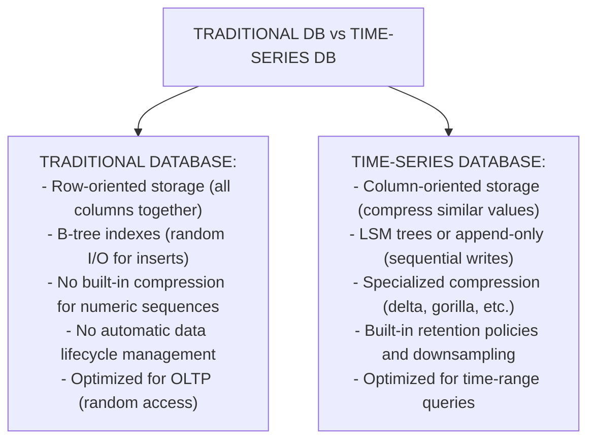
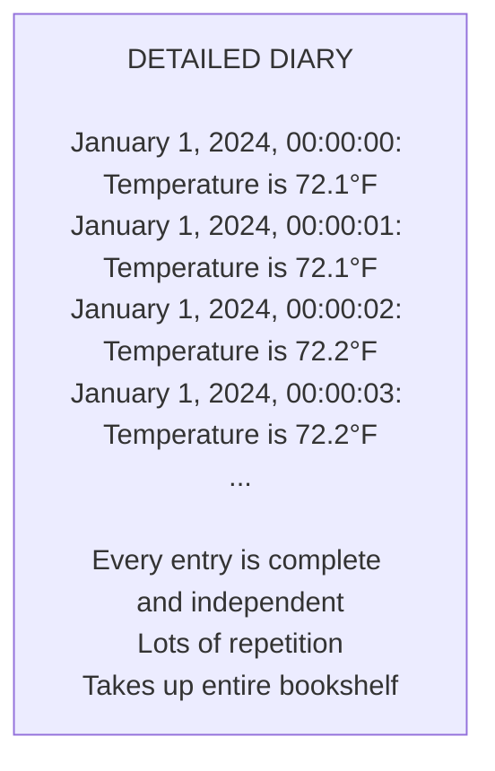
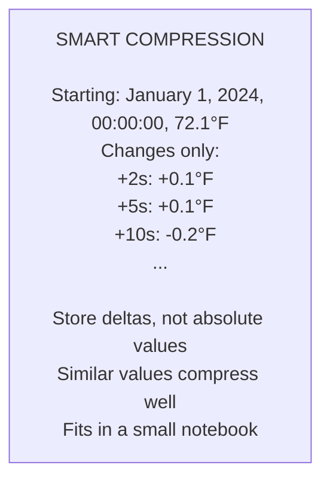
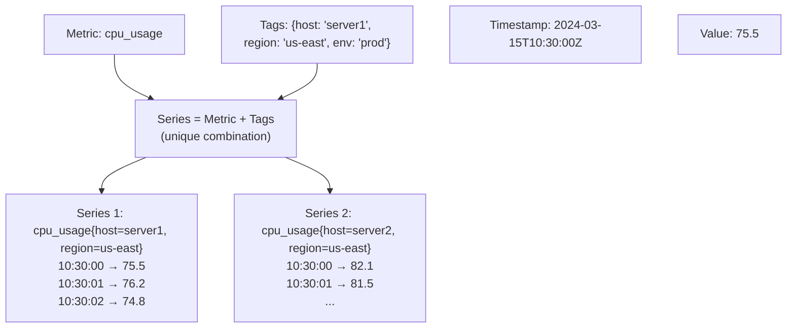
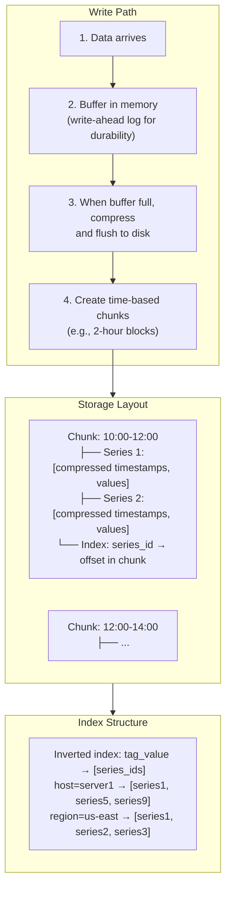
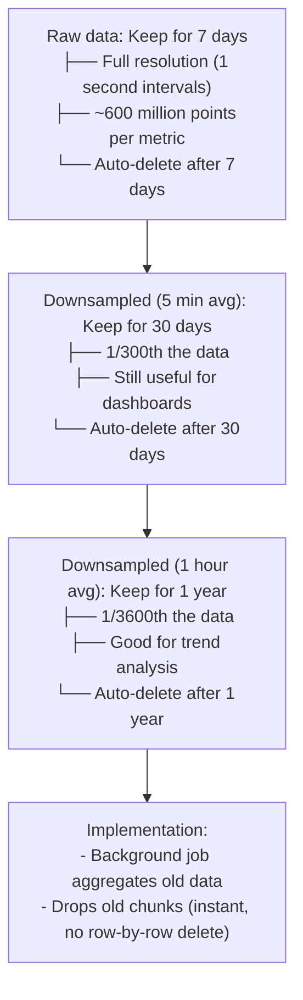
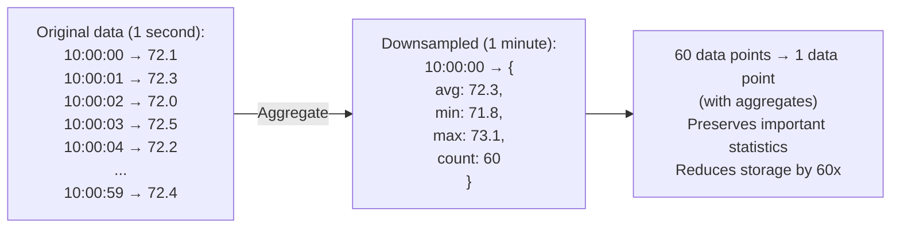
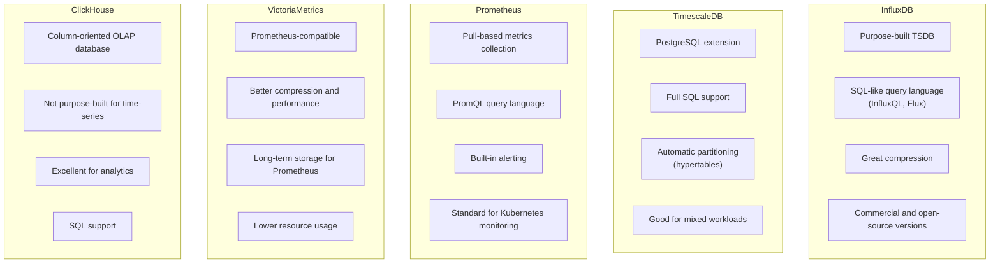
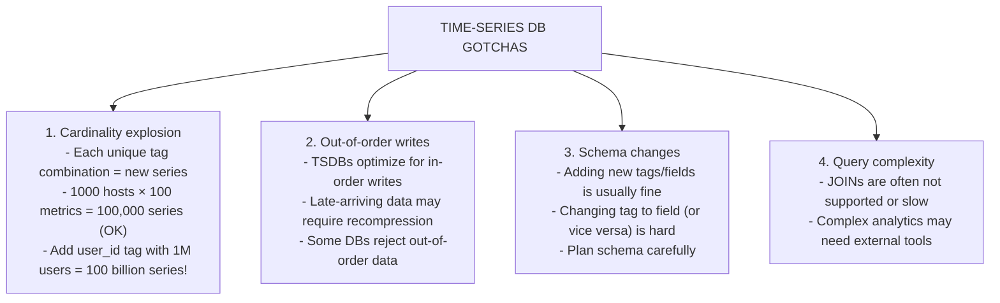

# Time-Series Databases: Optimized for Temporal Data

## 0️⃣ Prerequisites

Before diving into time-series databases, you should understand:

- **Database Indexing**: How B-trees and other indexes work (covered in Topic 2).
- **Database Partitioning**: Time-based partitioning concepts (covered in Topic 11).
- **LSM Trees**: Write-optimized storage engines (covered in Topic 8).
- **Data Compression**: Basic understanding of how compression reduces storage.

**Quick refresher on time-series data**: Time-series data is a sequence of data points indexed by time. Examples include server metrics (CPU, memory), IoT sensor readings, stock prices, and application logs. The key characteristic is that data is append-mostly and queries typically focus on recent data or time ranges.

---

## 1️⃣ What Problem Does This Exist to Solve?

### The Specific Pain Point

Imagine you're building a monitoring system:

```
Data characteristics:
- 10,000 servers
- 100 metrics per server
- 1 data point per second per metric
- Total: 1,000,000 data points per second

Storage requirements:
- Each data point: timestamp (8 bytes) + value (8 bytes) + tags (50 bytes)
- Per second: 66 MB
- Per day: 5.7 TB
- Per year: 2 PB

Query patterns:
- "Show CPU for server X in last hour"
- "Average memory across all servers in last 24 hours"
- "Alert if any server CPU > 90% in last 5 minutes"
```

**With a traditional RDBMS**:
- Insert 1M rows/second: Impossible (locks, indexes)
- Store 2 PB: Expensive (no compression)
- Query recent data: Slow (scanning huge tables)
- Retention: Manual deletion (slow, locks table)

### Why Traditional Databases Struggle



<details>
<summary>ASCII diagram (reference)</summary>

```text
┌─────────────────────────────────────────────────────────────┐
│         TRADITIONAL DB vs TIME-SERIES DB                     │
├─────────────────────────────────────────────────────────────┤
│                                                              │
│  TRADITIONAL DATABASE:                                       │
│  ┌─────────────────────────────────────────────────────┐   │
│  │ - Row-oriented storage (all columns together)       │   │
│  │ - B-tree indexes (random I/O for inserts)          │   │
│  │ - No built-in compression for numeric sequences     │   │
│  │ - No automatic data lifecycle management           │   │
│  │ - Optimized for OLTP (random access)               │   │
│  └─────────────────────────────────────────────────────┘   │
│                                                              │
│  TIME-SERIES DATABASE:                                       │
│  ┌─────────────────────────────────────────────────────┐   │
│  │ - Column-oriented storage (compress similar values) │   │
│  │ - LSM trees or append-only (sequential writes)      │   │
│  │ - Specialized compression (delta, gorilla, etc.)   │   │
│  │ - Built-in retention policies and downsampling     │   │
│  │ - Optimized for time-range queries                 │   │
│  └─────────────────────────────────────────────────────┘   │
│                                                              │
└─────────────────────────────────────────────────────────────┘
```
</details>

### Real Examples

**Prometheus at SoundCloud**: Created Prometheus because existing solutions couldn't handle their scale of metrics collection.

**InfluxDB at Tesla**: Stores telemetry from millions of vehicles, billions of data points per day.

**TimescaleDB at Fortune 500**: Financial services using TimescaleDB for tick data, millions of trades per second.

---

## 2️⃣ Intuition and Mental Model

### The Temperature Log Analogy

**Traditional Database = Detailed Diary**



<details>
<summary>ASCII diagram (reference)</summary>

```text
┌─────────────────────────────────────────────────────────────┐
│                   DETAILED DIARY                             │
│                                                              │
│  January 1, 2024, 00:00:00: Temperature is 72.1°F          │
│  January 1, 2024, 00:00:01: Temperature is 72.1°F          │
│  January 1, 2024, 00:00:02: Temperature is 72.2°F          │
│  January 1, 2024, 00:00:03: Temperature is 72.2°F          │
│  ...                                                         │
│                                                              │
│  Every entry is complete and independent                    │
│  Lots of repetition                                         │
│  Takes up entire bookshelf                                  │
│                                                              │
└─────────────────────────────────────────────────────────────┘
```
</details>

**Time-Series Database = Smart Compression**



<details>
<summary>ASCII diagram (reference)</summary>

```text
┌─────────────────────────────────────────────────────────────┐
│                   SMART COMPRESSION                          │
│                                                              │
│  Starting: January 1, 2024, 00:00:00, 72.1°F               │
│  Changes only:                                               │
│    +2s: +0.1°F                                              │
│    +5s: +0.1°F                                              │
│    +10s: -0.2°F                                             │
│  ...                                                         │
│                                                              │
│  Store deltas, not absolute values                          │
│  Similar values compress well                               │
│  Fits in a small notebook                                   │
│                                                              │
└─────────────────────────────────────────────────────────────┘
```
</details>

---

## 3️⃣ How It Works Internally

### Time-Series Data Model



<details>
<summary>ASCII diagram (reference)</summary>

```text
┌─────────────────────────────────────────────────────────────┐
│              TIME-SERIES DATA MODEL                          │
│                                                              │
│  Metric: cpu_usage                                          │
│  Tags: {host: "server1", region: "us-east", env: "prod"}   │
│  Timestamp: 2024-03-15T10:30:00Z                           │
│  Value: 75.5                                                │
│                                                              │
│  ┌─────────────────────────────────────────────────────┐   │
│  │ Series = Metric + Tags (unique combination)         │   │
│  │                                                      │   │
│  │ Series 1: cpu_usage{host=server1, region=us-east}   │   │
│  │   10:30:00 → 75.5                                   │   │
│  │   10:30:01 → 76.2                                   │   │
│  │   10:30:02 → 74.8                                   │   │
│  │                                                      │   │
│  │ Series 2: cpu_usage{host=server2, region=us-east}   │   │
│  │   10:30:00 → 82.1                                   │   │
│  │   10:30:01 → 81.5                                   │   │
│  │   ...                                               │   │
│  └─────────────────────────────────────────────────────┘   │
│                                                              │
└─────────────────────────────────────────────────────────────┘
```
</details>

### Compression Techniques

**Delta Encoding**:

```
┌─────────────────────────────────────────────────────────────┐
│                  DELTA ENCODING                              │
│                                                              │
│  Timestamps (nanoseconds since epoch):                      │
│  Raw:    1710500000000000000                                │
│          1710500001000000000                                │
│          1710500002000000000                                │
│          1710500003000000000                                │
│                                                              │
│  Delta:  1710500000000000000 (first value)                  │
│          1000000000 (delta from previous)                   │
│          1000000000                                         │
│          1000000000                                         │
│                                                              │
│  Delta-of-delta: 1710500000000000000                        │
│                  1000000000 (first delta)                   │
│                  0 (delta is constant!)                     │
│                  0                                          │
│                                                              │
│  Regular intervals → zeros → extreme compression!           │
│                                                              │
└─────────────────────────────────────────────────────────────┘
```

**Gorilla Compression (Facebook)**:

```
┌─────────────────────────────────────────────────────────────┐
│                GORILLA COMPRESSION                           │
│                                                              │
│  For floating-point values:                                  │
│                                                              │
│  Values: 72.1, 72.1, 72.2, 72.2, 72.3                       │
│                                                              │
│  XOR with previous value:                                    │
│  72.1 XOR 72.1 = 0 (same value, store 1 bit!)              │
│  72.1 XOR 72.2 = small difference (few bits)               │
│                                                              │
│  Insight: Consecutive values are often similar              │
│           XOR of similar floats has many leading zeros      │
│           Store only the meaningful bits                    │
│                                                              │
│  Result: 12x compression for typical metrics                │
│                                                              │
└─────────────────────────────────────────────────────────────┘
```

### Storage Architecture



<details>
<summary>ASCII diagram (reference)</summary>

```text
┌─────────────────────────────────────────────────────────────┐
│           TIME-SERIES STORAGE ARCHITECTURE                   │
│                                                              │
│  Write Path:                                                 │
│  ┌─────────────────────────────────────────────────────┐   │
│  │ 1. Data arrives                                      │   │
│  │ 2. Buffer in memory (write-ahead log for durability)│   │
│  │ 3. When buffer full, compress and flush to disk     │   │
│  │ 4. Create time-based chunks (e.g., 2-hour blocks)   │   │
│  └─────────────────────────────────────────────────────┘   │
│                                                              │
│  Storage Layout:                                             │
│  ┌─────────────────────────────────────────────────────┐   │
│  │ Chunk: 10:00-12:00                                   │   │
│  │ ├── Series 1: [compressed timestamps, values]       │   │
│  │ ├── Series 2: [compressed timestamps, values]       │   │
│  │ └── Index: series_id → offset in chunk              │   │
│  ├─────────────────────────────────────────────────────┤   │
│  │ Chunk: 12:00-14:00                                   │   │
│  │ ├── ...                                              │   │
│  └─────────────────────────────────────────────────────┘   │
│                                                              │
│  Index Structure:                                            │
│  ┌─────────────────────────────────────────────────────┐   │
│  │ Inverted index: tag_value → [series_ids]            │   │
│  │ host=server1 → [series1, series5, series9]          │   │
│  │ region=us-east → [series1, series2, series3]        │   │
│  └─────────────────────────────────────────────────────┘   │
│                                                              │
└─────────────────────────────────────────────────────────────┘
```
</details>

### Retention Policies



<details>
<summary>ASCII diagram (reference)</summary>

```text
┌─────────────────────────────────────────────────────────────┐
│                 RETENTION POLICIES                           │
│                                                              │
│  Raw data: Keep for 7 days                                  │
│  ├── Full resolution (1 second intervals)                   │
│  ├── ~600 million points per metric                        │
│  └── Auto-delete after 7 days                              │
│                                                              │
│  Downsampled (5 min avg): Keep for 30 days                 │
│  ├── 1/300th the data                                      │
│  ├── Still useful for dashboards                           │
│  └── Auto-delete after 30 days                             │
│                                                              │
│  Downsampled (1 hour avg): Keep for 1 year                 │
│  ├── 1/3600th the data                                     │
│  ├── Good for trend analysis                               │
│  └── Auto-delete after 1 year                              │
│                                                              │
│  Implementation:                                             │
│  - Background job aggregates old data                       │
│  - Drops old chunks (instant, no row-by-row delete)        │
│                                                              │
└─────────────────────────────────────────────────────────────┘
```
</details>

### Downsampling



<details>
<summary>ASCII diagram (reference)</summary>

```text
┌─────────────────────────────────────────────────────────────┐
│                    DOWNSAMPLING                              │
│                                                              │
│  Original data (1 second):                                   │
│  10:00:00 → 72.1                                            │
│  10:00:01 → 72.3                                            │
│  10:00:02 → 72.0                                            │
│  10:00:03 → 72.5                                            │
│  10:00:04 → 72.2                                            │
│  ...                                                         │
│  10:00:59 → 72.4                                            │
│                                                              │
│  Downsampled (1 minute):                                     │
│  10:00:00 → {                                               │
│    avg: 72.3,                                               │
│    min: 71.8,                                               │
│    max: 73.1,                                               │
│    count: 60                                                │
│  }                                                          │
│                                                              │
│  60 data points → 1 data point (with aggregates)           │
│  Preserves important statistics                             │
│  Reduces storage by 60x                                     │
│                                                              │
└─────────────────────────────────────────────────────────────┘
```
</details>

---

## 4️⃣ Simulation-First Explanation

### Scenario 1: High-Volume Ingestion

```
Setup: 10,000 servers, 100 metrics each, 1 second interval

Incoming data rate: 1,000,000 points/second

InfluxDB handling:
  1. Batch writes in memory (WAL for durability)
  2. When batch reaches 10MB, compress
  3. Write compressed chunk to disk
  
  Compression results:
  - Raw: 66 bytes/point × 1M = 66 MB/second
  - Compressed: ~5 bytes/point × 1M = 5 MB/second
  - 13x compression!
  
  Disk write rate: 5 MB/second (easily handled)
```

### Scenario 2: Time-Range Query

```
Query: Average CPU for server1 in last hour

Traditional DB approach:
  SELECT AVG(value) FROM metrics 
  WHERE host = 'server1' 
  AND metric = 'cpu'
  AND time > NOW() - INTERVAL '1 hour';
  
  Execution:
  - Scan index for matching rows
  - Read 3,600 rows from disk (scattered)
  - Calculate average
  - Time: ~500ms

Time-series DB approach:
  Execution:
  - Find chunk for last hour (single file)
  - Decompress series for server1.cpu
  - Values already contiguous in memory
  - Calculate average
  - Time: ~5ms
  
  100x faster!
```

### Scenario 3: Retention and Downsampling

```
Day 1: Collect 86.4 billion data points (1M/sec × 86400 sec)
       Compressed storage: 432 GB

Day 7: Retention policy triggers
  - Raw data (days 1-7): 432 GB × 7 = 3 TB
  - Delete day 1 raw data: DROP chunk (instant)
  - Downsampled day 1 (5 min avg): 1.4 GB
  
Day 30: 
  - Raw data (days 24-30): 3 TB
  - 5-min downsampled (days 1-30): 42 GB
  - Delete old 5-min data, create 1-hour samples
  
Year 1:
  - Raw: 3 TB (last 7 days)
  - 5-min: 42 GB (last 30 days)
  - 1-hour: 15 GB (full year)
  - Total: ~3.1 TB (vs 157 TB uncompressed raw)
```

---

## 5️⃣ How Engineers Actually Use This in Production

### At Major Companies

**Uber (M3)**:
- Custom time-series database
- Billions of metrics
- Sub-second query latency
- Handles 500M data points/second

**Netflix (Atlas)**:
- In-memory time-series database
- Real-time dashboards
- Alerting on streaming data

**Cloudflare (VictoriaMetrics)**:
- Stores metrics from edge servers globally
- Handles massive cardinality
- Long-term retention with downsampling

### Popular Time-Series Databases



<details>
<summary>ASCII diagram (reference)</summary>

```text
┌─────────────────────────────────────────────────────────────┐
│           TIME-SERIES DATABASE COMPARISON                    │
├─────────────────────────────────────────────────────────────┤
│                                                              │
│  InfluxDB:                                                   │
│  ├── Purpose-built TSDB                                     │
│  ├── SQL-like query language (InfluxQL, Flux)              │
│  ├── Great compression                                      │
│  └── Commercial and open-source versions                    │
│                                                              │
│  TimescaleDB:                                                │
│  ├── PostgreSQL extension                                   │
│  ├── Full SQL support                                       │
│  ├── Automatic partitioning (hypertables)                  │
│  └── Good for mixed workloads                              │
│                                                              │
│  Prometheus:                                                 │
│  ├── Pull-based metrics collection                         │
│  ├── PromQL query language                                 │
│  ├── Built-in alerting                                     │
│  └── Standard for Kubernetes monitoring                    │
│                                                              │
│  VictoriaMetrics:                                            │
│  ├── Prometheus-compatible                                  │
│  ├── Better compression and performance                    │
│  ├── Long-term storage for Prometheus                      │
│  └── Lower resource usage                                   │
│                                                              │
│  ClickHouse:                                                 │
│  ├── Column-oriented OLAP database                         │
│  ├── Not purpose-built for time-series                     │
│  ├── Excellent for analytics                               │
│  └── SQL support                                            │
│                                                              │
└─────────────────────────────────────────────────────────────┘
```
</details>

---

## 6️⃣ How to Implement or Apply It

### InfluxDB with Java

```java
package com.example.timeseries;

import com.influxdb.client.InfluxDBClient;
import com.influxdb.client.InfluxDBClientFactory;
import com.influxdb.client.WriteApiBlocking;
import com.influxdb.client.domain.WritePrecision;
import com.influxdb.client.write.Point;
import com.influxdb.query.FluxTable;

import java.time.Instant;
import java.util.List;

public class InfluxDBExample {
    
    private final InfluxDBClient client;
    private final String bucket;
    private final String org;
    
    public InfluxDBExample(String url, String token, String org, String bucket) {
        this.client = InfluxDBClientFactory.create(url, token.toCharArray(), org, bucket);
        this.bucket = bucket;
        this.org = org;
    }
    
    /**
     * Write a single metric point.
     */
    public void writeMetric(String measurement, String host, 
                            String metricName, double value) {
        WriteApiBlocking writeApi = client.getWriteApiBlocking();
        
        Point point = Point.measurement(measurement)
            .addTag("host", host)
            .addField(metricName, value)
            .time(Instant.now(), WritePrecision.NS);
        
        writeApi.writePoint(point);
    }
    
    /**
     * Write batch of metrics (more efficient).
     */
    public void writeBatch(List<MetricPoint> metrics) {
        WriteApiBlocking writeApi = client.getWriteApiBlocking();
        
        List<Point> points = metrics.stream()
            .map(m -> Point.measurement(m.measurement())
                .addTag("host", m.host())
                .addField(m.field(), m.value())
                .time(m.timestamp(), WritePrecision.NS))
            .toList();
        
        writeApi.writePoints(points);
    }
    
    /**
     * Query metrics for a time range.
     */
    public List<FluxTable> queryMetrics(String host, String field, 
                                         String duration) {
        String flux = String.format("""
            from(bucket: "%s")
              |> range(start: -%s)
              |> filter(fn: (r) => r["host"] == "%s")
              |> filter(fn: (r) => r["_field"] == "%s")
              |> aggregateWindow(every: 1m, fn: mean)
            """, bucket, duration, host, field);
        
        return client.getQueryApi().query(flux, org);
    }
    
    /**
     * Query with aggregation.
     */
    public Double getAverageMetric(String host, String field, 
                                    String duration) {
        String flux = String.format("""
            from(bucket: "%s")
              |> range(start: -%s)
              |> filter(fn: (r) => r["host"] == "%s")
              |> filter(fn: (r) => r["_field"] == "%s")
              |> mean()
            """, bucket, duration, host, field);
        
        List<FluxTable> tables = client.getQueryApi().query(flux, org);
        
        if (!tables.isEmpty() && !tables.get(0).getRecords().isEmpty()) {
            return (Double) tables.get(0).getRecords().get(0).getValue();
        }
        return null;
    }
    
    public record MetricPoint(
        String measurement, 
        String host, 
        String field, 
        double value, 
        Instant timestamp
    ) {}
}
```

### TimescaleDB with Spring Boot

```java
package com.example.timeseries;

import org.springframework.jdbc.core.JdbcTemplate;
import org.springframework.stereotype.Repository;
import java.time.Instant;
import java.util.List;

@Repository
public class TimeScaleRepository {
    
    private final JdbcTemplate jdbcTemplate;
    
    public TimeScaleRepository(JdbcTemplate jdbcTemplate) {
        this.jdbcTemplate = jdbcTemplate;
    }
    
    /**
     * Create hypertable (run once during setup).
     */
    public void createHypertable() {
        // Create regular table
        jdbcTemplate.execute("""
            CREATE TABLE IF NOT EXISTS metrics (
                time TIMESTAMPTZ NOT NULL,
                host TEXT NOT NULL,
                metric_name TEXT NOT NULL,
                value DOUBLE PRECISION NOT NULL
            )
            """);
        
        // Convert to hypertable (TimescaleDB magic)
        jdbcTemplate.execute("""
            SELECT create_hypertable('metrics', 'time', 
                chunk_time_interval => INTERVAL '1 day',
                if_not_exists => TRUE)
            """);
        
        // Create index for common queries
        jdbcTemplate.execute("""
            CREATE INDEX IF NOT EXISTS idx_metrics_host_time 
            ON metrics (host, time DESC)
            """);
    }
    
    /**
     * Insert metric (single).
     */
    public void insertMetric(String host, String metricName, double value) {
        jdbcTemplate.update("""
            INSERT INTO metrics (time, host, metric_name, value)
            VALUES (NOW(), ?, ?, ?)
            """, host, metricName, value);
    }
    
    /**
     * Insert batch of metrics.
     */
    public void insertBatch(List<MetricRecord> metrics) {
        jdbcTemplate.batchUpdate("""
            INSERT INTO metrics (time, host, metric_name, value)
            VALUES (?, ?, ?, ?)
            """,
            metrics,
            1000,  // batch size
            (ps, metric) -> {
                ps.setTimestamp(1, java.sql.Timestamp.from(metric.time()));
                ps.setString(2, metric.host());
                ps.setString(3, metric.metricName());
                ps.setDouble(4, metric.value());
            });
    }
    
    /**
     * Query with time bucket aggregation.
     */
    public List<AggregatedMetric> getAggregatedMetrics(
            String host, String metricName, String interval, String duration) {
        
        return jdbcTemplate.query("""
            SELECT 
                time_bucket(?, time) AS bucket,
                AVG(value) AS avg_value,
                MIN(value) AS min_value,
                MAX(value) AS max_value,
                COUNT(*) AS count
            FROM metrics
            WHERE host = ?
            AND metric_name = ?
            AND time > NOW() - ?::INTERVAL
            GROUP BY bucket
            ORDER BY bucket DESC
            """,
            (rs, rowNum) -> new AggregatedMetric(
                rs.getTimestamp("bucket").toInstant(),
                rs.getDouble("avg_value"),
                rs.getDouble("min_value"),
                rs.getDouble("max_value"),
                rs.getLong("count")
            ),
            interval, host, metricName, duration);
    }
    
    /**
     * Set up retention policy.
     */
    public void setupRetentionPolicy(int days) {
        jdbcTemplate.execute(String.format("""
            SELECT add_retention_policy('metrics', INTERVAL '%d days')
            """, days));
    }
    
    /**
     * Set up continuous aggregate for downsampling.
     */
    public void setupContinuousAggregate() {
        jdbcTemplate.execute("""
            CREATE MATERIALIZED VIEW metrics_hourly
            WITH (timescaledb.continuous) AS
            SELECT 
                time_bucket('1 hour', time) AS bucket,
                host,
                metric_name,
                AVG(value) AS avg_value,
                MIN(value) AS min_value,
                MAX(value) AS max_value
            FROM metrics
            GROUP BY bucket, host, metric_name
            """);
        
        // Refresh policy
        jdbcTemplate.execute("""
            SELECT add_continuous_aggregate_policy('metrics_hourly',
                start_offset => INTERVAL '3 hours',
                end_offset => INTERVAL '1 hour',
                schedule_interval => INTERVAL '1 hour')
            """);
    }
    
    public record MetricRecord(Instant time, String host, 
                                String metricName, double value) {}
    
    public record AggregatedMetric(Instant bucket, double avgValue, 
                                    double minValue, double maxValue, 
                                    long count) {}
}
```

### Prometheus Client (Metrics Exposition)

```java
package com.example.timeseries;

import io.micrometer.core.instrument.Counter;
import io.micrometer.core.instrument.Gauge;
import io.micrometer.core.instrument.MeterRegistry;
import io.micrometer.core.instrument.Timer;
import org.springframework.stereotype.Component;

import java.util.concurrent.atomic.AtomicInteger;

/**
 * Expose metrics for Prometheus to scrape.
 */
@Component
public class MetricsExporter {
    
    private final Counter requestCounter;
    private final Timer requestTimer;
    private final AtomicInteger activeConnections;
    
    public MetricsExporter(MeterRegistry registry) {
        // Counter: Monotonically increasing value
        this.requestCounter = Counter.builder("http_requests_total")
            .description("Total HTTP requests")
            .tag("endpoint", "/api")
            .register(registry);
        
        // Timer: Measures duration and count
        this.requestTimer = Timer.builder("http_request_duration_seconds")
            .description("HTTP request duration")
            .tag("endpoint", "/api")
            .register(registry);
        
        // Gauge: Current value that can go up or down
        this.activeConnections = new AtomicInteger(0);
        Gauge.builder("active_connections", activeConnections, AtomicInteger::get)
            .description("Current active connections")
            .register(registry);
    }
    
    public void recordRequest(Runnable operation) {
        requestCounter.increment();
        requestTimer.record(operation);
    }
    
    public void connectionOpened() {
        activeConnections.incrementAndGet();
    }
    
    public void connectionClosed() {
        activeConnections.decrementAndGet();
    }
}
```

---

## 7️⃣ Tradeoffs, Pitfalls, and Common Mistakes

### Common Mistake 1: High Cardinality Tags

```
// WRONG: Using high-cardinality values as tags
Point.measurement("requests")
    .addTag("request_id", UUID.randomUUID().toString())  // Millions of unique values!
    .addTag("user_id", userId)  // Millions of users!
    .addField("duration", duration)

// Creates millions of unique series
// Each series needs separate storage and indexing
// Database performance degrades severely

// RIGHT: Use fields for high-cardinality values
Point.measurement("requests")
    .addTag("endpoint", "/api/users")  // Low cardinality
    .addTag("status", "200")           // Low cardinality
    .addField("request_id", requestId) // High cardinality as field
    .addField("user_id", userId)       // High cardinality as field
    .addField("duration", duration)
```

### Common Mistake 2: No Retention Policy

```
Scenario: Metrics stored indefinitely

Day 1: 5 GB
Day 30: 150 GB
Day 365: 1.8 TB
Year 3: 5.4 TB (and growing)

Problems:
- Storage costs explode
- Query performance degrades
- Backup/restore takes forever

Solution: Define retention from day 1
- Raw data: 7 days
- 1-minute aggregates: 30 days
- 1-hour aggregates: 1 year
- Daily aggregates: Forever
```

### Common Mistake 3: Wrong Query Patterns

```sql
-- WRONG: Querying without time filter
SELECT AVG(value) FROM metrics WHERE host = 'server1';
-- Scans entire history!

-- WRONG: Very long time range at high resolution
SELECT * FROM metrics 
WHERE time > NOW() - INTERVAL '1 year'
AND host = 'server1';
-- Returns millions of rows

-- RIGHT: Always include time filter
SELECT AVG(value) FROM metrics 
WHERE host = 'server1'
AND time > NOW() - INTERVAL '1 hour';

-- RIGHT: Use aggregation for long ranges
SELECT time_bucket('1 day', time), AVG(value) 
FROM metrics 
WHERE host = 'server1'
AND time > NOW() - INTERVAL '1 year'
GROUP BY 1;
```

### Performance Gotchas



<details>
<summary>ASCII diagram (reference)</summary>

```text
┌─────────────────────────────────────────────────────────────┐
│              TIME-SERIES DB GOTCHAS                          │
│                                                              │
│  1. Cardinality explosion                                   │
│     - Each unique tag combination = new series              │
│     - 1000 hosts × 100 metrics = 100,000 series (OK)       │
│     - Add user_id tag with 1M users = 100 billion series!  │
│                                                              │
│  2. Out-of-order writes                                     │
│     - TSDBs optimize for in-order writes                    │
│     - Late-arriving data may require recompression          │
│     - Some DBs reject out-of-order data                     │
│                                                              │
│  3. Schema changes                                           │
│     - Adding new tags/fields is usually fine                │
│     - Changing tag to field (or vice versa) is hard         │
│     - Plan schema carefully                                  │
│                                                              │
│  4. Query complexity                                         │
│     - JOINs are often not supported or slow                 │
│     - Complex analytics may need external tools             │
│                                                              │
└─────────────────────────────────────────────────────────────┘
```
</details>

---

## 8️⃣ When NOT to Use This

### When NOT to Use Time-Series Databases

1. **Transactional data**
   - Orders, payments, user accounts
   - Need ACID guarantees
   - Use RDBMS instead

2. **Relational data with JOINs**
   - Complex relationships
   - Foreign keys
   - Use RDBMS

3. **Low-volume data**
   - Under 1000 writes/second
   - Traditional DB handles fine
   - Don't add complexity

4. **Random access patterns**
   - Not time-based queries
   - Need point lookups by various keys
   - Use key-value store

### Signs You Need a Time-Series DB

- Write volume > 10,000 points/second
- Data is naturally time-ordered
- Queries are time-range based
- Need automatic downsampling
- Storage costs are growing fast

---

## 9️⃣ Comparison with Alternatives

### Database Type Comparison

| Feature | TSDB | RDBMS | NoSQL |
|---------|------|-------|-------|
| Time-range queries | Excellent | Good | Varies |
| Write throughput | Excellent | Medium | Good |
| Compression | Excellent | Poor | Medium |
| SQL support | Limited | Full | None/Limited |
| ACID | Limited | Full | Varies |
| Retention policies | Built-in | Manual | Varies |

### Time-Series Database Comparison

| Database | Query Language | Best For | Limitations |
|----------|----------------|----------|-------------|
| InfluxDB | Flux, InfluxQL | General metrics | Cardinality limits |
| TimescaleDB | SQL | SQL users, mixed workloads | PostgreSQL overhead |
| Prometheus | PromQL | Kubernetes, alerting | Short retention |
| VictoriaMetrics | PromQL | Long-term Prometheus | Fewer features |
| ClickHouse | SQL | Analytics, logs | Not purpose-built |

---

## 🔟 Interview Follow-Up Questions WITH Answers

### L4 (Entry-Level) Questions

**Q1: What is a time-series database and when would you use one?**

**Answer:**
A time-series database is optimized for storing and querying data that changes over time, like metrics, sensor readings, or stock prices.

Key characteristics:
1. Data is timestamped and append-mostly
2. Queries are typically time-range based
3. High write throughput is required
4. Data can be compressed efficiently

Use when:
- Collecting server metrics (CPU, memory, disk)
- IoT sensor data
- Financial tick data
- Application performance monitoring

Don't use for:
- Transactional data (use RDBMS)
- Data with complex relationships (use RDBMS)
- Low-volume data (traditional DB is fine)

**Q2: How do time-series databases achieve better compression than traditional databases?**

**Answer:**
Time-series databases use specialized compression techniques:

1. **Delta encoding**: Store differences between consecutive timestamps instead of absolute values. Regular intervals (every second) become zeros, which compress extremely well.

2. **Gorilla compression**: For floating-point values, XOR consecutive values. Similar values produce small differences that need fewer bits.

3. **Column-oriented storage**: Store all timestamps together, all values together. Similar values in each column compress better than mixed rows.

4. **Run-length encoding**: Repeated values (like constant metrics) are stored as "value × count" instead of repeated entries.

Result: 10-20x compression compared to row-oriented storage. A metric that would take 66 bytes raw might only need 5 bytes compressed.

### L5 (Mid-Level) Questions

**Q3: Explain the concept of cardinality in time-series databases and why it matters.**

**Answer:**
Cardinality refers to the number of unique time series. A time series is defined by the combination of metric name and all tag values.

**Example:**
```
cpu_usage{host="server1", region="us-east"} → 1 series
cpu_usage{host="server2", region="us-east"} → 1 series
cpu_usage{host="server1", region="us-west"} → 1 series
```

**Why it matters:**
- Each series needs separate storage and indexing
- High cardinality = more memory for indexes
- Query performance degrades with more series

**Cardinality explosion example:**
- 100 hosts × 50 metrics = 5,000 series (fine)
- Add user_id tag with 1M users = 5 billion series (disaster!)

**Best practices:**
- Keep tags low-cardinality (host, region, status)
- Put high-cardinality data in fields (user_id, request_id)
- Monitor cardinality and set limits

**Q4: How would you design a metrics collection system for 10,000 servers?**

**Answer:**
**Architecture:**

1. **Collection layer:**
   - Agent on each server (Prometheus node_exporter, Telegraf)
   - Collects OS and application metrics
   - Buffers locally for resilience

2. **Ingestion layer:**
   - Multiple ingest nodes for load balancing
   - Write-ahead log for durability
   - Batch writes to TSDB

3. **Storage layer:**
   - Time-series database (InfluxDB, VictoriaMetrics)
   - Sharded by time and/or metric
   - Replication for durability

4. **Query layer:**
   - Query nodes with caching
   - Pre-computed aggregates for dashboards
   - Alerting on real-time data

**Capacity planning:**
- 10,000 servers × 100 metrics × 1/sec = 1M points/sec
- With compression: ~5 MB/sec = 432 GB/day
- 7-day retention: ~3 TB raw
- With downsampling: ~500 GB total

**Retention policy:**
- Raw: 7 days
- 5-min aggregates: 30 days
- 1-hour aggregates: 1 year

### L6 (Senior) Questions

**Q5: Design a multi-tenant metrics platform for a SaaS monitoring service.**

**Answer:**
**Requirements:**
- 1000 tenants
- Each tenant: 1-10,000 servers
- Isolation between tenants
- Different retention per pricing tier

**Architecture:**

```
┌─────────────────────────────────────────────────────────────┐
│                    MULTI-TENANT METRICS                      │
│                                                              │
│  Ingestion:                                                  │
│  ┌─────────────────────────────────────────────────────┐   │
│  │ API Gateway (auth, rate limiting, tenant routing)   │   │
│  │           ↓                                          │   │
│  │ Kafka (partitioned by tenant_id)                    │   │
│  │           ↓                                          │   │
│  │ Ingest Workers (validate, enrich, batch)            │   │
│  └─────────────────────────────────────────────────────┘   │
│                                                              │
│  Storage (per-tenant isolation):                            │
│  ┌─────────────────────────────────────────────────────┐   │
│  │ Option A: Separate database per tenant               │   │
│  │   + Strong isolation                                 │   │
│  │   - Operational overhead                             │   │
│  │                                                      │   │
│  │ Option B: Shared database with tenant_id tag         │   │
│  │   + Simpler operations                               │   │
│  │   - Noisy neighbor risk                              │   │
│  │                                                      │   │
│  │ Hybrid: Shared for small, dedicated for large       │   │
│  └─────────────────────────────────────────────────────┘   │
│                                                              │
│  Query:                                                      │
│  ┌─────────────────────────────────────────────────────┐   │
│  │ Query router (adds tenant filter to all queries)    │   │
│  │ Query cache (per-tenant)                            │   │
│  │ Rate limiting (per-tenant quotas)                   │   │
│  └─────────────────────────────────────────────────────┘   │
│                                                              │
└─────────────────────────────────────────────────────────────┘
```

**Tenant isolation:**
- All queries automatically include tenant_id filter
- Quotas on cardinality, write rate, query rate
- Separate retention policies per tier

**Scaling:**
- Shard by tenant for large tenants
- Time-based partitioning within each shard
- Auto-scaling based on write volume

**Q6: How would you handle a cardinality explosion incident in production?**

**Answer:**
**Immediate response:**

1. **Identify the source:**
```sql
-- Find high-cardinality series
SELECT metric_name, COUNT(DISTINCT series_id) as cardinality
FROM series_metadata
GROUP BY metric_name
ORDER BY cardinality DESC
LIMIT 10;
```

2. **Stop the bleeding:**
   - Rate limit writes from problematic source
   - Drop high-cardinality tag at ingestion
   - Alert the team that created the metric

3. **Clean up:**
   - Delete the problematic series
   - Compact storage to reclaim space

**Root cause analysis:**
- Was it a code change adding user_id as tag?
- Was it a misconfigured agent?
- Was it a cardinality bomb attack?

**Prevention:**
- Cardinality limits per metric
- Pre-ingestion validation
- Alerts on cardinality growth rate
- Documentation on tag vs field usage
- Code review for metric changes

---

## 1️⃣1️⃣ One Clean Mental Summary

Time-series databases are optimized for timestamped, append-mostly data like metrics and sensor readings. They achieve 10-20x compression through delta encoding (storing differences) and column-oriented storage (similar values together).

Key concepts: Series (metric + tags), cardinality (number of unique series), retention policies (auto-delete old data), and downsampling (aggregate old data to save space).

Common databases: InfluxDB (purpose-built), TimescaleDB (PostgreSQL extension), Prometheus (Kubernetes standard), VictoriaMetrics (Prometheus-compatible, better performance).

Critical mistake to avoid: High-cardinality tags (like user_id) create millions of series and kill performance. Use fields for high-cardinality data, tags for low-cardinality dimensions.

Use time-series databases when: High write volume (>10K/sec), time-range queries, need automatic retention. Don't use for: Transactional data, complex JOINs, low-volume data.

