# Change Data Capture (CDC): Streaming Database Changes

## 0️⃣ Prerequisites

Before diving into Change Data Capture, you should understand:

- **Database Replication**: How databases replicate data using logs (covered in Topic 4).
- **Message Queues**: Kafka basics and pub/sub patterns (covered in Phase 6).
- **Event-Driven Architecture**: Events as the source of truth (covered in Phase 6).
- **Database Transactions**: Write-ahead logs and how databases persist changes (covered in Topic 7).

**Quick refresher on the problem**: Applications often need to react to database changes—invalidate caches, update search indexes, sync data warehouses, or trigger workflows. Polling the database is inefficient. CDC captures changes as they happen and streams them to interested consumers.

---

## 1️⃣ What Problem Does This Exist to Solve?

### The Specific Pain Point

Imagine you're running an e-commerce platform:

```
When a product price changes:
1. Update the database ✓
2. Invalidate the cache (how?)
3. Update the search index (how?)
4. Notify the analytics system (how?)
5. Send price alert emails (how?)

Traditional approaches:

Approach 1: Application publishes events
  Problem: Dual-write problem
  - Write to DB succeeds
  - Publish to Kafka fails
  - Data is inconsistent!

Approach 2: Poll the database
  Problem: Inefficient and delayed
  - Query every second for changes
  - High database load
  - Still miss rapid changes

Approach 3: Database triggers
  Problem: Coupling and performance
  - Triggers slow down writes
  - Hard to maintain
  - Database becomes bottleneck
```

### The Dual-Write Problem

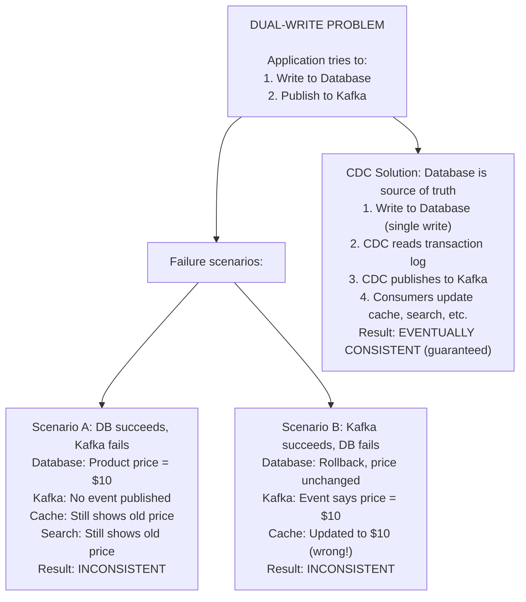

<details>
<summary>ASCII diagram (reference)</summary>

```text
┌─────────────────────────────────────────────────────────────┐
│                 DUAL-WRITE PROBLEM                           │
│                                                              │
│  Application tries to:                                       │
│  1. Write to Database                                       │
│  2. Publish to Kafka                                        │
│                                                              │
│  Failure scenarios:                                          │
│                                                              │
│  Scenario A: DB succeeds, Kafka fails                       │
│  ┌─────────────────────────────────────────────────────┐   │
│  │ Database: Product price = $10                       │   │
│  │ Kafka: No event published                           │   │
│  │ Cache: Still shows old price                        │   │
│  │ Search: Still shows old price                       │   │
│  │ Result: INCONSISTENT                                │   │
│  └─────────────────────────────────────────────────────┘   │
│                                                              │
│  Scenario B: Kafka succeeds, DB fails                       │
│  ┌─────────────────────────────────────────────────────┐   │
│  │ Database: Rollback, price unchanged                 │   │
│  │ Kafka: Event says price = $10                       │   │
│  │ Cache: Updated to $10 (wrong!)                      │   │
│  │ Result: INCONSISTENT                                │   │
│  └─────────────────────────────────────────────────────┘   │
│                                                              │
│  CDC Solution: Database is source of truth                  │
│  ┌─────────────────────────────────────────────────────┐   │
│  │ 1. Write to Database (single write)                 │   │
│  │ 2. CDC reads transaction log                        │   │
│  │ 3. CDC publishes to Kafka                           │   │
│  │ 4. Consumers update cache, search, etc.             │   │
│  │ Result: EVENTUALLY CONSISTENT (guaranteed)          │   │
│  └─────────────────────────────────────────────────────┘   │
│                                                              │
└─────────────────────────────────────────────────────────────┘
```
</details>

### What CDC Enables

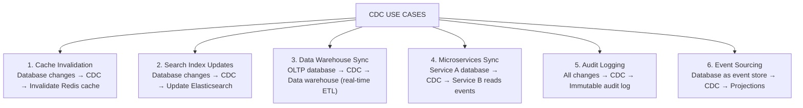

<details>
<summary>ASCII diagram (reference)</summary>

```text
┌─────────────────────────────────────────────────────────────┐
│                   CDC USE CASES                              │
│                                                              │
│  1. Cache Invalidation                                      │
│     Database changes → CDC → Invalidate Redis cache         │
│                                                              │
│  2. Search Index Updates                                    │
│     Database changes → CDC → Update Elasticsearch           │
│                                                              │
│  3. Data Warehouse Sync                                     │
│     OLTP database → CDC → Data warehouse (real-time ETL)    │
│                                                              │
│  4. Microservices Sync                                      │
│     Service A database → CDC → Service B reads events       │
│                                                              │
│  5. Audit Logging                                           │
│     All changes → CDC → Immutable audit log                 │
│                                                              │
│  6. Event Sourcing                                          │
│     Database as event store → CDC → Projections             │
│                                                              │
└─────────────────────────────────────────────────────────────┘
```
</details>

### Real Examples

**LinkedIn**: Uses CDC to keep search indexes in sync with the main database.

**Netflix**: CDC for real-time data replication across microservices.

**Uber**: CDC for syncing trip data to analytics systems.

**Airbnb**: CDC for cache invalidation and search updates.

---

## 2️⃣ Intuition and Mental Model

### The Security Camera Analogy

**Without CDC = Periodic Inventory Checks**

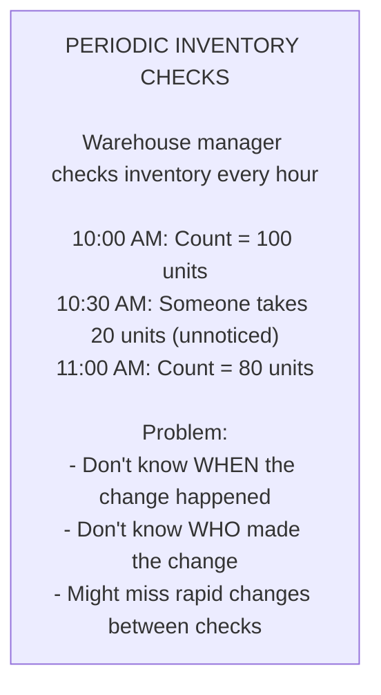

<details>
<summary>ASCII diagram (reference)</summary>

```text
┌─────────────────────────────────────────────────────────────┐
│              PERIODIC INVENTORY CHECKS                       │
│                                                              │
│  Warehouse manager checks inventory every hour              │
│                                                              │
│  10:00 AM: Count = 100 units                               │
│  10:30 AM: Someone takes 20 units (unnoticed)              │
│  11:00 AM: Count = 80 units                                │
│                                                              │
│  Problem: Don't know WHEN the change happened              │
│           Don't know WHO made the change                    │
│           Might miss rapid changes between checks           │
│                                                              │
└─────────────────────────────────────────────────────────────┘
```
</details>

**With CDC = Security Camera Recording**

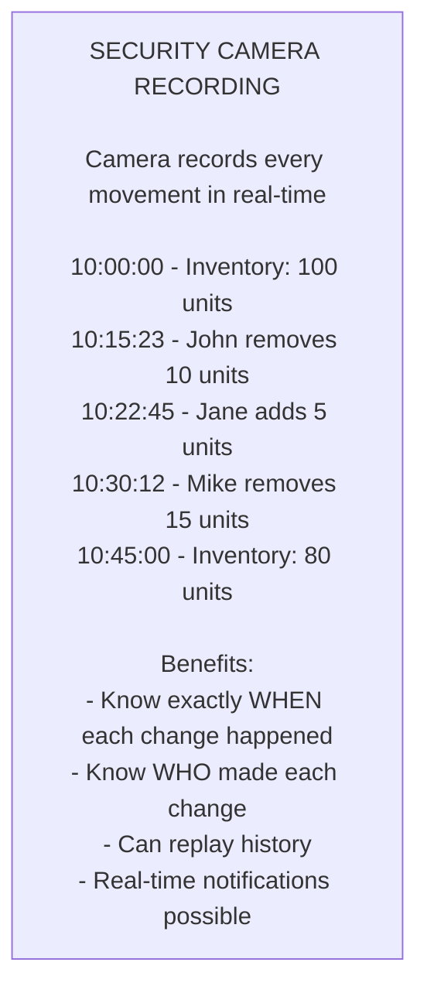

<details>
<summary>ASCII diagram (reference)</summary>

```text
┌─────────────────────────────────────────────────────────────┐
│              SECURITY CAMERA RECORDING                       │
│                                                              │
│  Camera records every movement in real-time                 │
│                                                              │
│  10:00:00 - Inventory: 100 units                           │
│  10:15:23 - John removes 10 units                          │
│  10:22:45 - Jane adds 5 units                              │
│  10:30:12 - Mike removes 15 units                          │
│  10:45:00 - Inventory: 80 units                            │
│                                                              │
│  Benefits:                                                   │
│  - Know exactly WHEN each change happened                  │
│  - Know WHO made each change                               │
│  - Can replay history                                       │
│  - Real-time notifications possible                        │
│                                                              │
└─────────────────────────────────────────────────────────────┘
```
</details>

---

## 3️⃣ How It Works Internally

### CDC Architecture

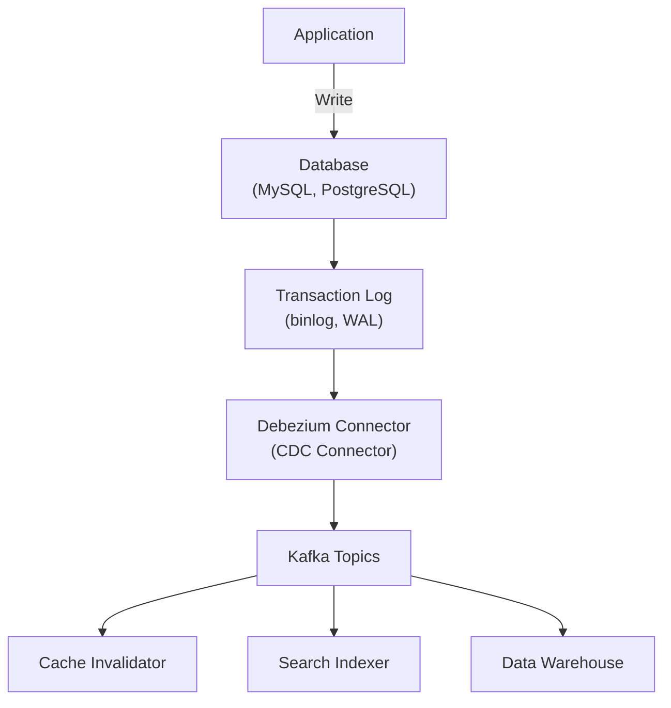

<details>
<summary>ASCII diagram (reference)</summary>

```text
┌─────────────────────────────────────────────────────────────┐
│                   CDC ARCHITECTURE                           │
│                                                              │
│  ┌─────────────┐                                            │
│  │ Application │                                            │
│  └──────┬──────┘                                            │
│         │ Write                                              │
│         ▼                                                    │
│  ┌─────────────┐     ┌─────────────┐                       │
│  │  Database   │────▶│ Transaction │                       │
│  │  (MySQL,    │     │    Log      │                       │
│  │  PostgreSQL)│     │ (binlog,WAL)│                       │
│  └─────────────┘     └──────┬──────┘                       │
│                             │                                │
│                             ▼                                │
│                      ┌─────────────┐                        │
│                      │  Debezium   │ (CDC Connector)        │
│                      │  Connector  │                        │
│                      └──────┬──────┘                        │
│                             │                                │
│                             ▼                                │
│                      ┌─────────────┐                        │
│                      │    Kafka    │                        │
│                      │   Topics    │                        │
│                      └──────┬──────┘                        │
│                             │                                │
│         ┌───────────────────┼───────────────────┐           │
│         ▼                   ▼                   ▼           │
│  ┌─────────────┐    ┌─────────────┐    ┌─────────────┐     │
│  │   Cache     │    │   Search    │    │    Data     │     │
│  │ Invalidator │    │   Indexer   │    │  Warehouse  │     │
│  └─────────────┘    └─────────────┘    └─────────────┘     │
│                                                              │
└─────────────────────────────────────────────────────────────┘
```
</details>

### How Databases Track Changes

**MySQL Binary Log (binlog)**:

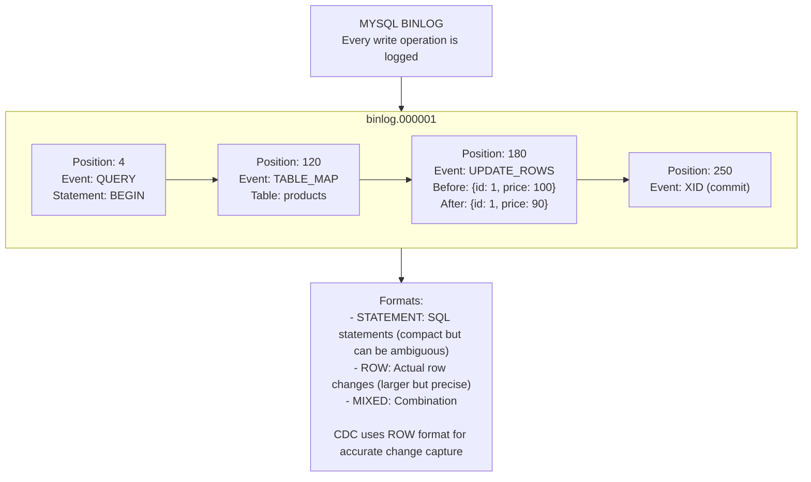

<details>
<summary>ASCII diagram (reference)</summary>

```text
┌─────────────────────────────────────────────────────────────┐
│                    MYSQL BINLOG                              │
│                                                              │
│  Every write operation is logged:                           │
│                                                              │
│  binlog.000001:                                             │
│  ┌─────────────────────────────────────────────────────┐   │
│  │ Position: 4                                          │   │
│  │ Event: QUERY                                         │   │
│  │ Statement: BEGIN                                     │   │
│  ├─────────────────────────────────────────────────────┤   │
│  │ Position: 120                                        │   │
│  │ Event: TABLE_MAP                                     │   │
│  │ Table: products                                      │   │
│  ├─────────────────────────────────────────────────────┤   │
│  │ Position: 180                                        │   │
│  │ Event: UPDATE_ROWS                                   │   │
│  │ Before: {id: 1, price: 100}                         │   │
│  │ After:  {id: 1, price: 90}                          │   │
│  ├─────────────────────────────────────────────────────┤   │
│  │ Position: 250                                        │   │
│  │ Event: XID (commit)                                  │   │
│  └─────────────────────────────────────────────────────┘   │
│                                                              │
│  Formats:                                                    │
│  - STATEMENT: SQL statements (compact but can be ambiguous)│
│  - ROW: Actual row changes (larger but precise)            │
│  - MIXED: Combination                                       │
│                                                              │
│  CDC uses ROW format for accurate change capture           │
│                                                              │
└─────────────────────────────────────────────────────────────┘
```
</details>
```

**PostgreSQL Write-Ahead Log (WAL)**:

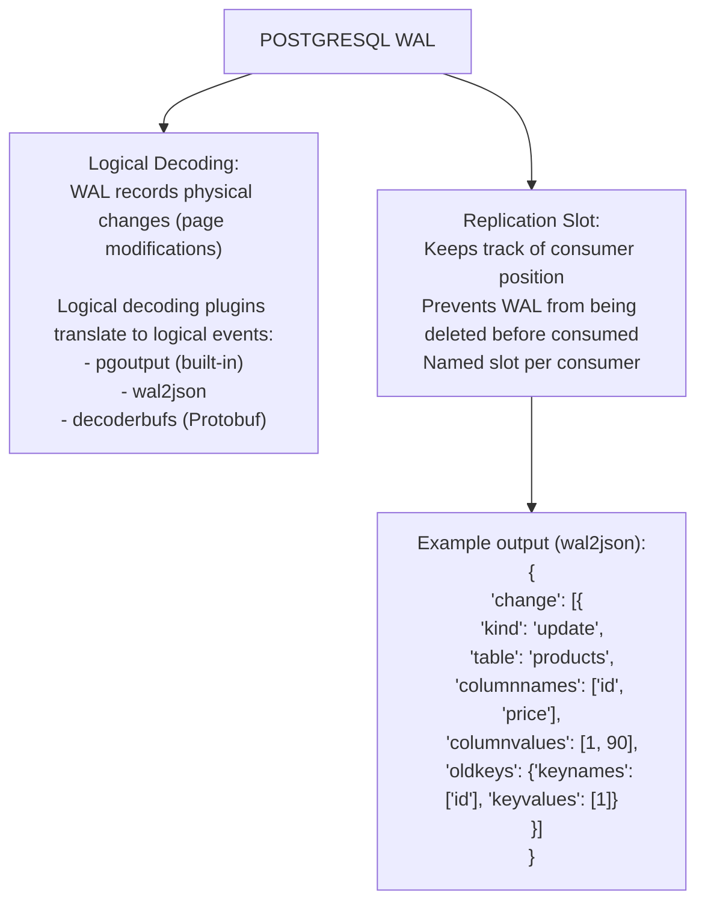

<details>
<summary>ASCII diagram (reference)</summary>

```text
┌─────────────────────────────────────────────────────────────┐
│                  POSTGRESQL WAL                              │
│                                                              │
│  Logical Decoding:                                           │
│  ┌─────────────────────────────────────────────────────┐   │
│  │ WAL records physical changes (page modifications)   │   │
│  │                                                      │   │
│  │ Logical decoding plugins translate to logical events│   │
│  │ - pgoutput (built-in)                               │   │
│  │ - wal2json                                          │   │
│  │ - decoderbufs (Protobuf)                           │   │
│  └─────────────────────────────────────────────────────┘   │
│                                                              │
│  Replication Slot:                                           │
│  ┌─────────────────────────────────────────────────────┐   │
│  │ Keeps track of consumer position                    │   │
│  │ Prevents WAL from being deleted before consumed     │   │
│  │ Named slot per consumer                             │   │
│  └─────────────────────────────────────────────────────┘   │
│                                                              │
│  Example output (wal2json):                                 │
│  {                                                          │
│    "change": [                                              │
│      {                                                      │
│        "kind": "update",                                    │
│        "table": "products",                                 │
│        "columnnames": ["id", "price"],                     │
│        "columnvalues": [1, 90],                            │
│        "oldkeys": {"keynames": ["id"], "keyvalues": [1]}   │
│      }                                                      │
│    ]                                                        │
│  }                                                          │
│                                                              │
└─────────────────────────────────────────────────────────────┘
```
</details>
```

### Debezium Architecture

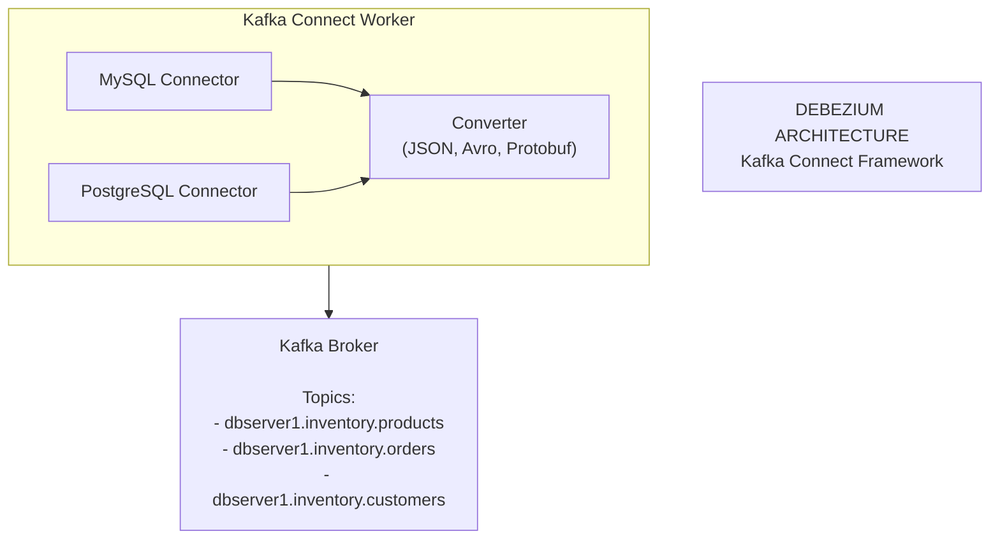

<details>
<summary>ASCII diagram (reference)</summary>

```text
┌─────────────────────────────────────────────────────────────┐
│                  DEBEZIUM ARCHITECTURE                       │
│                                                              │
│  Kafka Connect Framework:                                    │
│  ┌─────────────────────────────────────────────────────┐   │
│  │                                                      │   │
│  │  ┌──────────────────────────────────────────────┐  │   │
│  │  │ Kafka Connect Worker                          │  │   │
│  │  │                                               │  │   │
│  │  │  ┌────────────────┐  ┌────────────────┐     │  │   │
│  │  │  │ MySQL          │  │ PostgreSQL     │     │  │   │
│  │  │  │ Connector      │  │ Connector      │     │  │   │
│  │  │  └───────┬────────┘  └───────┬────────┘     │  │   │
│  │  │          │                    │              │  │   │
│  │  │          ▼                    ▼              │  │   │
│  │  │  ┌────────────────────────────────────────┐ │  │   │
│  │  │  │ Converter (JSON, Avro, Protobuf)       │ │  │   │
│  │  │  └───────────────────┬────────────────────┘ │  │   │
│  │  │                      │                       │  │   │
│  │  └──────────────────────┼───────────────────────┘  │   │
│  │                         │                           │   │
│  │                         ▼                           │   │
│  │  ┌──────────────────────────────────────────────┐  │   │
│  │  │ Kafka Broker                                  │  │   │
│  │  │                                               │  │   │
│  │  │ Topics:                                       │  │   │
│  │  │ - dbserver1.inventory.products               │  │   │
│  │  │ - dbserver1.inventory.orders                 │  │   │
│  │  │ - dbserver1.inventory.customers              │  │   │
│  │  └──────────────────────────────────────────────┘  │   │
│  │                                                      │   │
│  └─────────────────────────────────────────────────────┘   │
│                                                              │
└─────────────────────────────────────────────────────────────┘
```
</details>
```

### CDC Event Structure

```json
{
  "schema": { ... },
  "payload": {
    "before": {
      "id": 1,
      "name": "Widget",
      "price": 100.00
    },
    "after": {
      "id": 1,
      "name": "Widget",
      "price": 90.00
    },
    "source": {
      "version": "2.0.0",
      "connector": "mysql",
      "name": "dbserver1",
      "ts_ms": 1678901234567,
      "db": "inventory",
      "table": "products",
      "server_id": 1,
      "file": "binlog.000003",
      "pos": 12345
    },
    "op": "u",  // c=create, u=update, d=delete, r=read (snapshot)
    "ts_ms": 1678901234600
  }
}
```

---

## 4️⃣ Simulation-First Explanation

### Scenario 1: Cache Invalidation

```
Setup:
- MySQL database with products table
- Redis cache for product data
- Debezium capturing changes

T=0ms:   Application updates product price
         UPDATE products SET price = 90 WHERE id = 1;

T=1ms:   MySQL writes to binlog
         binlog: UPDATE products, id=1, price: 100→90

T=5ms:   Debezium reads binlog entry
         Creates change event

T=10ms:  Event published to Kafka
         Topic: dbserver1.inventory.products

T=15ms:  Cache invalidator consumes event
         Reads: op=update, table=products, id=1

T=20ms:  Cache invalidator deletes Redis key
         DEL product:1

T=25ms:  Next read request
         Cache miss → Fetch from DB → Cache new value

Total latency: ~25ms from DB write to cache invalidation
Guaranteed consistency (no dual-write problem)
```

### Scenario 2: Search Index Update

```
Setup:
- PostgreSQL with products table
- Elasticsearch for search
- Debezium + Kafka

T=0ms:   New product inserted
         INSERT INTO products (name, description, price) 
         VALUES ('Widget', 'A great widget', 99.99);

T=5ms:   PostgreSQL WAL entry created
         Logical decoding extracts change

T=10ms:  Debezium publishes to Kafka
         {
           "op": "c",
           "after": {
             "id": 123,
             "name": "Widget",
             "description": "A great widget",
             "price": 99.99
           }
         }

T=20ms:  Elasticsearch sink connector consumes
         Transforms to ES document

T=30ms:  Document indexed in Elasticsearch
         POST /products/_doc/123
         {
           "name": "Widget",
           "description": "A great widget",
           "price": 99.99
         }

T=35ms:  Product searchable!

User searches "widget" → Finds new product
```

### Scenario 3: Initial Snapshot + Streaming

```
Setup:
- Existing database with 1M products
- New Debezium connector

Phase 1: Snapshot (initial load)
  T=0:      Debezium starts
  T=1s:     Locks table (briefly) to get consistent snapshot point
  T=2s:     Starts reading all rows
  T=5min:   1M rows read and published to Kafka
            Each event has op="r" (read/snapshot)

Phase 2: Streaming (ongoing changes)
  T=5min+:  Debezium switches to binlog streaming
  T=5min+1s: New insert captured
            Event has op="c" (create)
  
  Continues indefinitely...

Consumers see:
1. All existing data (snapshot)
2. All new changes (streaming)
3. No gaps, no duplicates (exactly-once with proper config)
```

---

## 5️⃣ How Engineers Actually Use This in Production

### At Major Companies

**LinkedIn**:
- CDC for search index updates
- Databus (predecessor to Debezium)
- Billions of changes per day

**Uber**:
- CDC for real-time analytics
- Trip data synced to data warehouse
- Sub-minute latency

**Shopify**:
- CDC for inventory sync
- Multi-region data replication
- Cache invalidation

### Common Patterns

**Pattern 1: Outbox Pattern**

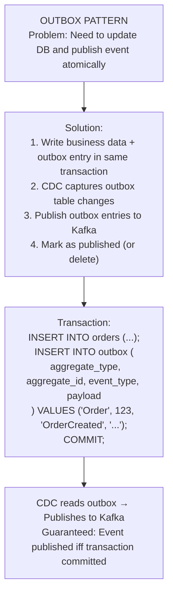

<details>
<summary>ASCII diagram (reference)</summary>

```text
┌─────────────────────────────────────────────────────────────┐
│                   OUTBOX PATTERN                             │
│                                                              │
│  Problem: Need to update DB and publish event atomically    │
│                                                              │
│  Solution:                                                   │
│  1. Write business data + outbox entry in same transaction │
│  2. CDC captures outbox table changes                       │
│  3. Publish outbox entries to Kafka                         │
│  4. Mark as published (or delete)                           │
│                                                              │
│  ┌─────────────────────────────────────────────────────┐   │
│  │ Transaction:                                         │   │
│  │   INSERT INTO orders (...);                         │   │
│  │   INSERT INTO outbox (                              │   │
│  │     aggregate_type, aggregate_id, event_type, payload│   │
│  │   ) VALUES ('Order', 123, 'OrderCreated', '...');   │   │
│  │   COMMIT;                                            │   │
│  └─────────────────────────────────────────────────────┘   │
│                                                              │
│  CDC reads outbox → Publishes to Kafka                     │
│  Guaranteed: Event published iff transaction committed     │
│                                                              │
└─────────────────────────────────────────────────────────────┘
```
</details>
```

**Pattern 2: CQRS with CDC**

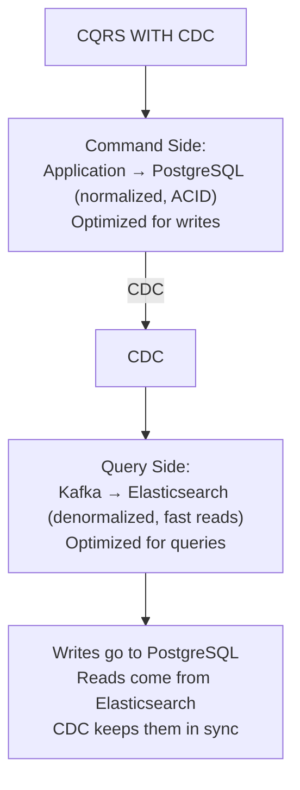

<details>
<summary>ASCII diagram (reference)</summary>

```text
┌─────────────────────────────────────────────────────────────┐
│                   CQRS WITH CDC                              │
│                                                              │
│  Command Side:                                               │
│  ┌─────────────────────────────────────────────────────┐   │
│  │ Application → PostgreSQL (normalized, ACID)         │   │
│  │ Optimized for writes                                │   │
│  └─────────────────────────────────────────────────────┘   │
│                          │                                   │
│                          │ CDC                               │
│                          ▼                                   │
│  Query Side:                                                 │
│  ┌─────────────────────────────────────────────────────┐   │
│  │ Kafka → Elasticsearch (denormalized, fast reads)    │   │
│  │ Optimized for queries                               │   │
│  └─────────────────────────────────────────────────────┘   │
│                                                              │
│  Writes go to PostgreSQL                                    │
│  Reads come from Elasticsearch                              │
│  CDC keeps them in sync                                     │
│                                                              │
└─────────────────────────────────────────────────────────────┘
```
</details>
```

---

## 6️⃣ How to Implement or Apply It

### Debezium with Docker Compose

```yaml
# docker-compose.yml
version: '3.8'
services:
  mysql:
    image: mysql:8.0
    environment:
      MYSQL_ROOT_PASSWORD: root
      MYSQL_DATABASE: inventory
    command: --server-id=1 --log-bin=mysql-bin --binlog-format=ROW
    ports:
      - "3306:3306"

  zookeeper:
    image: confluentinc/cp-zookeeper:7.0.0
    environment:
      ZOOKEEPER_CLIENT_PORT: 2181

  kafka:
    image: confluentinc/cp-kafka:7.0.0
    depends_on:
      - zookeeper
    environment:
      KAFKA_BROKER_ID: 1
      KAFKA_ZOOKEEPER_CONNECT: zookeeper:2181
      KAFKA_ADVERTISED_LISTENERS: PLAINTEXT://kafka:9092
      KAFKA_OFFSETS_TOPIC_REPLICATION_FACTOR: 1
    ports:
      - "9092:9092"

  connect:
    image: debezium/connect:2.0
    depends_on:
      - kafka
      - mysql
    environment:
      BOOTSTRAP_SERVERS: kafka:9092
      GROUP_ID: 1
      CONFIG_STORAGE_TOPIC: connect_configs
      OFFSET_STORAGE_TOPIC: connect_offsets
      STATUS_STORAGE_TOPIC: connect_statuses
    ports:
      - "8083:8083"
```

### Register Debezium Connector

```bash
# Register MySQL connector
curl -X POST http://localhost:8083/connectors \
  -H "Content-Type: application/json" \
  -d '{
    "name": "inventory-connector",
    "config": {
      "connector.class": "io.debezium.connector.mysql.MySqlConnector",
      "database.hostname": "mysql",
      "database.port": "3306",
      "database.user": "root",
      "database.password": "root",
      "database.server.id": "1",
      "topic.prefix": "dbserver1",
      "database.include.list": "inventory",
      "schema.history.internal.kafka.bootstrap.servers": "kafka:9092",
      "schema.history.internal.kafka.topic": "schema-changes.inventory"
    }
  }'
```

### Java Consumer for CDC Events

```java
package com.example.cdc;

import org.apache.kafka.clients.consumer.*;
import org.apache.kafka.common.serialization.StringDeserializer;
import com.fasterxml.jackson.databind.JsonNode;
import com.fasterxml.jackson.databind.ObjectMapper;

import java.time.Duration;
import java.util.Collections;
import java.util.Properties;

public class CDCConsumer {
    
    private final ObjectMapper objectMapper = new ObjectMapper();
    private final CacheService cacheService;
    private final SearchService searchService;
    
    public void consumeChanges() {
        Properties props = new Properties();
        props.put(ConsumerConfig.BOOTSTRAP_SERVERS_CONFIG, "localhost:9092");
        props.put(ConsumerConfig.GROUP_ID_CONFIG, "cdc-consumer");
        props.put(ConsumerConfig.KEY_DESERIALIZER_CLASS_CONFIG, 
            StringDeserializer.class.getName());
        props.put(ConsumerConfig.VALUE_DESERIALIZER_CLASS_CONFIG, 
            StringDeserializer.class.getName());
        props.put(ConsumerConfig.AUTO_OFFSET_RESET_CONFIG, "earliest");
        
        try (KafkaConsumer<String, String> consumer = 
                new KafkaConsumer<>(props)) {
            
            consumer.subscribe(Collections.singletonList(
                "dbserver1.inventory.products"));
            
            while (true) {
                ConsumerRecords<String, String> records = 
                    consumer.poll(Duration.ofMillis(100));
                
                for (ConsumerRecord<String, String> record : records) {
                    processChange(record.value());
                }
            }
        }
    }
    
    private void processChange(String eventJson) throws Exception {
        JsonNode event = objectMapper.readTree(eventJson);
        JsonNode payload = event.get("payload");
        
        String operation = payload.get("op").asText();
        String table = payload.get("source").get("table").asText();
        
        switch (operation) {
            case "c" -> handleCreate(table, payload.get("after"));
            case "u" -> handleUpdate(table, payload.get("before"), 
                                     payload.get("after"));
            case "d" -> handleDelete(table, payload.get("before"));
            case "r" -> handleSnapshot(table, payload.get("after"));
        }
    }
    
    private void handleCreate(String table, JsonNode after) {
        if ("products".equals(table)) {
            long productId = after.get("id").asLong();
            
            // Update cache
            cacheService.set("product:" + productId, after.toString());
            
            // Update search index
            searchService.index("products", productId, after);
        }
    }
    
    private void handleUpdate(String table, JsonNode before, JsonNode after) {
        if ("products".equals(table)) {
            long productId = after.get("id").asLong();
            
            // Invalidate cache (will be refreshed on next read)
            cacheService.delete("product:" + productId);
            
            // Update search index
            searchService.update("products", productId, after);
        }
    }
    
    private void handleDelete(String table, JsonNode before) {
        if ("products".equals(table)) {
            long productId = before.get("id").asLong();
            
            // Remove from cache
            cacheService.delete("product:" + productId);
            
            // Remove from search index
            searchService.delete("products", productId);
        }
    }
    
    private void handleSnapshot(String table, JsonNode after) {
        // Same as create, but during initial snapshot
        handleCreate(table, after);
    }
}
```

### Spring Boot with Debezium Embedded

```java
package com.example.cdc;

import io.debezium.config.Configuration;
import io.debezium.embedded.Connect;
import io.debezium.engine.DebeziumEngine;
import io.debezium.engine.RecordChangeEvent;
import io.debezium.engine.format.ChangeEventFormat;
import org.apache.kafka.connect.source.SourceRecord;
import org.springframework.stereotype.Component;

import jakarta.annotation.PostConstruct;
import jakarta.annotation.PreDestroy;
import java.util.concurrent.ExecutorService;
import java.util.concurrent.Executors;

/**
 * Embedded Debezium engine (no Kafka Connect needed).
 */
@Component
public class EmbeddedDebeziumEngine {
    
    private DebeziumEngine<RecordChangeEvent<SourceRecord>> engine;
    private final ExecutorService executor = Executors.newSingleThreadExecutor();
    
    @PostConstruct
    public void start() {
        Configuration config = Configuration.create()
            .with("name", "embedded-engine")
            .with("connector.class", 
                "io.debezium.connector.mysql.MySqlConnector")
            .with("offset.storage", 
                "org.apache.kafka.connect.storage.FileOffsetBackingStore")
            .with("offset.storage.file.filename", "/tmp/offsets.dat")
            .with("offset.flush.interval.ms", 60000)
            .with("database.hostname", "localhost")
            .with("database.port", 3306)
            .with("database.user", "root")
            .with("database.password", "root")
            .with("database.server.id", 1)
            .with("topic.prefix", "embedded")
            .with("database.include.list", "inventory")
            .with("schema.history.internal", 
                "io.debezium.storage.file.history.FileSchemaHistory")
            .with("schema.history.internal.file.filename", 
                "/tmp/schema-history.dat")
            .build();
        
        engine = DebeziumEngine.create(ChangeEventFormat.of(Connect.class))
            .using(config.asProperties())
            .notifying(this::handleEvent)
            .build();
        
        executor.execute(engine);
    }
    
    private void handleEvent(RecordChangeEvent<SourceRecord> event) {
        SourceRecord record = event.record();
        
        if (record.value() != null) {
            // Process the change event
            System.out.println("Change detected: " + record.value());
            
            // Extract and process...
        }
    }
    
    @PreDestroy
    public void stop() throws Exception {
        if (engine != null) {
            engine.close();
        }
        executor.shutdown();
    }
}
```

### Outbox Pattern Implementation

```java
package com.example.cdc.outbox;

import org.springframework.stereotype.Service;
import org.springframework.transaction.annotation.Transactional;
import com.fasterxml.jackson.databind.ObjectMapper;

@Entity
@Table(name = "outbox")
public class OutboxEvent {
    @Id
    @GeneratedValue(strategy = GenerationType.IDENTITY)
    private Long id;
    
    @Column(name = "aggregate_type")
    private String aggregateType;
    
    @Column(name = "aggregate_id")
    private String aggregateId;
    
    @Column(name = "event_type")
    private String eventType;
    
    @Column(name = "payload", columnDefinition = "JSON")
    private String payload;
    
    @Column(name = "created_at")
    private Instant createdAt = Instant.now();
}

@Service
public class OrderService {
    
    private final OrderRepository orderRepository;
    private final OutboxRepository outboxRepository;
    private final ObjectMapper objectMapper;
    
    @Transactional
    public Order createOrder(CreateOrderRequest request) {
        // Create order
        Order order = new Order(request);
        order = orderRepository.save(order);
        
        // Write to outbox (same transaction!)
        OutboxEvent event = new OutboxEvent();
        event.setAggregateType("Order");
        event.setAggregateId(order.getId().toString());
        event.setEventType("OrderCreated");
        event.setPayload(objectMapper.writeValueAsString(
            new OrderCreatedEvent(order)));
        outboxRepository.save(event);
        
        return order;
        // Debezium captures outbox insert
        // Publishes to Kafka
        // Guaranteed: Event published iff order created
    }
}

// Debezium connector config for outbox
// Uses outbox event router SMT (Single Message Transform)
```

---

## 7️⃣ Tradeoffs, Pitfalls, and Common Mistakes

### Common Mistake 1: Not Handling Schema Changes

```
Scenario: Add column to table

Before:
  products (id, name, price)

After:
  products (id, name, price, description)

Problem:
- Old events don't have 'description'
- Consumers expecting it will break

Solution:
- Use schema registry (Avro, Protobuf)
- Handle missing fields gracefully
- Version your events
```

### Common Mistake 2: Ignoring Ordering

```
Scenario: Rapid updates to same row

T=0ms: UPDATE price = 100
T=1ms: UPDATE price = 90
T=2ms: UPDATE price = 80

If consumer processes out of order:
  Process: 80, 100, 90
  Final cache value: 90 (WRONG!)

Solution:
- Kafka preserves order within partition
- Use record key = table + primary key
- Same key → same partition → ordered
```

### Common Mistake 3: Replication Slot Bloat

```
Scenario: PostgreSQL CDC with slow consumer

Problem:
- Replication slot holds WAL
- Consumer is slow or stopped
- WAL grows indefinitely
- Disk fills up!

Solution:
- Monitor replication slot lag
- Alert on growing lag
- Set max_slot_wal_keep_size (PostgreSQL 13+)
- Have runbook for slot cleanup
```

### Common Mistake 4: Missing Initial Snapshot

```
Scenario: New consumer for existing data

Problem:
- Consumer starts reading from "now"
- Misses all existing data
- Incomplete view of the world

Solution:
- Debezium does initial snapshot by default
- Consumer handles both snapshot (op=r) and streaming
- Or: Backfill from database before starting CDC
```

### Performance Gotchas

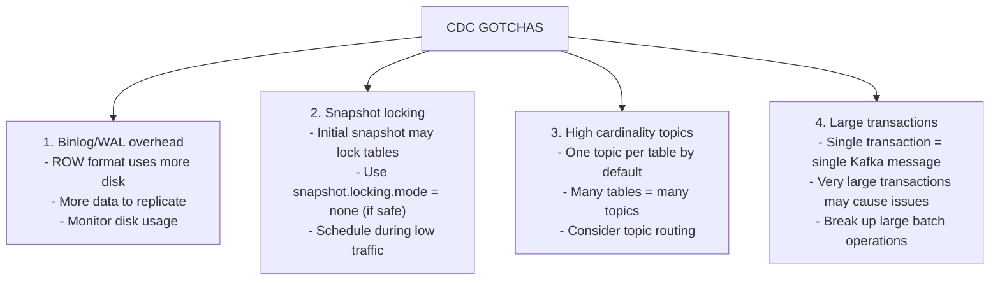

<details>
<summary>ASCII diagram (reference)</summary>

```text
┌─────────────────────────────────────────────────────────────┐
│                  CDC GOTCHAS                                 │
│                                                              │
│  1. Binlog/WAL overhead                                     │
│     - ROW format uses more disk                             │
│     - More data to replicate                                │
│     - Monitor disk usage                                    │
│                                                              │
│  2. Snapshot locking                                         │
│     - Initial snapshot may lock tables                      │
│     - Use snapshot.locking.mode = none (if safe)           │
│     - Schedule during low traffic                          │
│                                                              │
│  3. High cardinality topics                                  │
│     - One topic per table by default                        │
│     - Many tables = many topics                             │
│     - Consider topic routing                                │
│                                                              │
│  4. Large transactions                                       │
│     - Single transaction = single Kafka message             │
│     - Very large transactions may cause issues              │
│     - Break up large batch operations                       │
│                                                              │
└─────────────────────────────────────────────────────────────┘
```
</details>
```

---

## 8️⃣ When NOT to Use This

### When NOT to Use CDC

1. **Simple applications**
   - Single database, no external systems
   - Application can handle all logic

2. **Real-time not needed**
   - Batch ETL is sufficient
   - Nightly sync is acceptable

3. **Source database doesn't support**
   - No binlog/WAL access
   - Managed database with restrictions

4. **Team lacks expertise**
   - Kafka operations are complex
   - Debugging CDC issues is hard

### Signs You Need CDC

- Multiple consumers need database changes
- Dual-write problems causing inconsistencies
- Polling is overloading the database
- Need real-time data synchronization
- Building event-driven architecture

---

## 9️⃣ Comparison with Alternatives

### Data Sync Approaches

| Approach | Latency | Consistency | Complexity |
|----------|---------|-------------|------------|
| CDC | Seconds | Strong | High |
| Polling | Minutes | Weak | Low |
| Dual-write | Immediate | Weak | Medium |
| Triggers | Immediate | Strong | Medium |
| Batch ETL | Hours | Strong | Low |

### CDC Tools Comparison

| Tool | Databases | Deployment | License |
|------|-----------|------------|---------|
| Debezium | Many | Kafka Connect | Apache 2.0 |
| Maxwell | MySQL | Standalone | Apache 2.0 |
| DMS (AWS) | Many | Managed | Commercial |
| Striim | Many | Managed | Commercial |
| Fivetran | Many | Managed | Commercial |

---

## 🔟 Interview Follow-Up Questions WITH Answers

### L4 (Entry-Level) Questions

**Q1: What is CDC and why is it useful?**

**Answer:**
CDC (Change Data Capture) is a technique for capturing changes made to a database and streaming them to other systems in real-time.

**How it works:**
1. Database writes changes to a transaction log (binlog in MySQL, WAL in PostgreSQL)
2. CDC tool reads this log
3. Converts changes to events
4. Publishes to a message queue (like Kafka)
5. Consumers react to changes

**Why it's useful:**
- **Cache invalidation**: Automatically invalidate cache when data changes
- **Search sync**: Keep Elasticsearch in sync with database
- **Analytics**: Stream data to data warehouse in real-time
- **Microservices**: Share data between services without tight coupling

The key benefit is avoiding the dual-write problem: instead of writing to both database AND message queue (which can fail partially), you only write to the database and CDC handles the rest.

**Q2: What is the dual-write problem and how does CDC solve it?**

**Answer:**
The dual-write problem occurs when an application needs to update two systems atomically (e.g., database and message queue) but can't because they're separate systems.

**Example:**
```
1. Write to database → Success
2. Publish to Kafka → Fails (network error)
Result: Database updated, but no event published
        Other systems have stale data
```

**How CDC solves it:**
1. Application only writes to database (single write)
2. Database transaction either commits or rolls back (atomic)
3. CDC reads the transaction log
4. CDC publishes to Kafka
5. If CDC fails, it retries from the log (guaranteed delivery)

The database becomes the single source of truth. Events are guaranteed to be published for every committed transaction.

### L5 (Mid-Level) Questions

**Q3: How would you implement cache invalidation using CDC?**

**Answer:**
**Architecture:**
```
Database → Debezium → Kafka → Cache Invalidator → Redis
```

**Implementation steps:**

1. **Set up Debezium connector** for the database
2. **Create Kafka consumer** that subscribes to table topics
3. **Process change events:**
   - Extract table name and primary key
   - Delete corresponding cache key
   
4. **Handle edge cases:**
   - Batch deletes for efficiency
   - Handle consumer failures (Kafka handles retries)
   - Monitor lag between DB change and cache invalidation

**Code example:**
```java
void handleChange(ChangeEvent event) {
    if ("products".equals(event.getTable())) {
        String cacheKey = "product:" + event.getId();
        
        switch (event.getOperation()) {
            case CREATE, UPDATE -> redis.delete(cacheKey);
            case DELETE -> redis.delete(cacheKey);
        }
    }
}
```

**Why delete instead of update?**
- Simpler and safer
- Next read will fetch fresh data from DB
- Avoids race conditions with stale cache updates

**Q4: Explain the outbox pattern and when you would use it.**

**Answer:**
The outbox pattern ensures that database changes and event publishing happen atomically.

**How it works:**
1. In the same database transaction:
   - Write business data to main table
   - Write event to outbox table
2. CDC captures outbox table changes
3. CDC publishes events to Kafka
4. (Optional) Delete processed outbox entries

**Example:**
```sql
BEGIN;
INSERT INTO orders (id, user_id, total) VALUES (1, 123, 99.99);
INSERT INTO outbox (aggregate_type, aggregate_id, event_type, payload)
VALUES ('Order', '1', 'OrderCreated', '{"id":1,"userId":123}');
COMMIT;
```

**When to use:**
- Need guaranteed event publishing
- Building event-driven microservices
- Implementing saga pattern
- Can't afford inconsistency between DB and events

**Benefits:**
- Atomic: Event exists iff transaction committed
- Reliable: CDC handles retries
- Decoupled: Business logic doesn't know about Kafka

### L6 (Senior) Questions

**Q5: Design a CDC pipeline for a multi-region e-commerce platform.**

**Answer:**
**Requirements:**
- 3 regions: US, EU, Asia
- Product catalog updates need global sync
- Orders stay in region (data residency)
- Real-time inventory updates

**Architecture:**

```
┌─────────────────────────────────────────────────────────────┐
│                  MULTI-REGION CDC                            │
│                                                              │
│  US Region:                                                  │
│  ┌─────────────────────────────────────────────────────┐   │
│  │ Primary DB → Debezium → Kafka US                    │   │
│  │                           │                          │   │
│  │                           ├→ Local consumers         │   │
│  │                           └→ MirrorMaker → Kafka EU  │   │
│  └─────────────────────────────────────────────────────┘   │
│                                                              │
│  EU Region:                                                  │
│  ┌─────────────────────────────────────────────────────┐   │
│  │ Kafka EU → Consumers → Local cache/search           │   │
│  │         → DB Sync (products only)                   │   │
│  └─────────────────────────────────────────────────────┘   │
│                                                              │
│  Topic routing:                                              │
│  - products.* → Replicated globally                        │
│  - orders.* → Stay in origin region                        │
│  - inventory.* → Replicated for visibility                 │
│                                                              │
└─────────────────────────────────────────────────────────────┘
```

**Key decisions:**

1. **Selective replication**: Only replicate what's needed globally
2. **Conflict resolution**: Products use last-write-wins (single source of truth in US)
3. **Latency**: Accept ~100ms lag for cross-region sync
4. **Ordering**: Use product ID as partition key for order preservation

**Monitoring:**
- Replication lag per region
- Consumer lag per topic
- Debezium connector health
- Kafka MirrorMaker lag

**Q6: How would you handle a CDC pipeline that's falling behind?**

**Answer:**
**Diagnosis:**

1. **Identify the bottleneck:**
   - Debezium connector lag
   - Kafka consumer lag
   - Downstream system (Elasticsearch, cache) slow

2. **Check metrics:**
   - Connector: `MilliSecondsBehindSource`
   - Consumer: `records-lag-max`
   - Kafka: `UnderReplicatedPartitions`

**Solutions by cause:**

**If Debezium is slow:**
- Increase `max.batch.size`
- Add more tasks (if supported)
- Check database performance
- Verify network bandwidth

**If Kafka consumers are slow:**
- Add more consumer instances
- Increase partition count
- Optimize consumer processing
- Use batch processing

**If downstream is slow:**
- Batch writes to Elasticsearch
- Use bulk Redis operations
- Add backpressure mechanism
- Consider async processing

**Emergency measures:**
- Skip non-critical events
- Pause non-essential consumers
- Scale infrastructure
- Alert on-call team

**Prevention:**
- Capacity planning based on write volume
- Load testing CDC pipeline
- Alerts on lag thresholds
- Runbooks for common issues

---

## 1️⃣1️⃣ One Clean Mental Summary

Change Data Capture (CDC) reads the database transaction log and streams changes to other systems. This solves the dual-write problem: instead of writing to both database and message queue (which can fail partially), you only write to the database and CDC handles event publishing.

Common uses: cache invalidation, search index updates, data warehouse sync, microservices communication.

Key tools: Debezium (open-source, runs on Kafka Connect), AWS DMS (managed), and database-specific tools like Maxwell (MySQL).

The outbox pattern combines CDC with a dedicated outbox table: write business data and event in the same transaction, CDC publishes the event. This guarantees events are published if and only if the transaction commits.

Watch out for: schema changes breaking consumers, ordering issues with rapid updates, replication slot bloat (PostgreSQL), and initial snapshot handling. Always monitor CDC lag and have runbooks for when it falls behind.

