# Database Connection Management: Pooling and Optimization

## 0️⃣ Prerequisites

Before diving into connection management, you should understand:

- **Database Basics**: How applications connect to and query databases.
- **TCP/IP Networking**: Connection establishment, handshakes (covered in Phase 2).
- **Thread Pools**: Managing concurrent tasks with limited resources.
- **Read Replicas**: Scaling reads with multiple database instances (covered in Topic 9).

**Quick refresher on why connections matter**: Database connections are expensive to create (TCP handshake, authentication, session setup). Without pooling, each request creates a new connection, wasting time and resources. Connection pooling reuses connections, dramatically improving performance.

---

## 1️⃣ What Problem Does This Exist to Solve?

### The Specific Pain Point

Imagine a web application handling requests:

```
Without connection pooling:

Request 1 arrives:
  T=0ms:    Create TCP connection (3-way handshake)
  T=30ms:   SSL/TLS handshake
  T=60ms:   Database authentication
  T=70ms:   Session initialization
  T=80ms:   Execute query (10ms)
  T=90ms:   Close connection
  
Total: 90ms (80ms overhead, 10ms actual query!)

Request 2 arrives:
  Same process... another 90ms

100 concurrent requests:
  100 connections created simultaneously
  Database overwhelmed
  Connection errors
  Timeouts
```

**The core problems**:
1. **Latency**: Connection setup takes longer than the query
2. **Resource exhaustion**: Too many connections overwhelm the database
3. **Wasted work**: Creating and destroying connections repeatedly
4. **Scalability limits**: Can't handle traffic spikes

### Database Connection Limits

```mermaid
flowchart TD
    Limits["DATABASE CONNECTION LIMITS<br/>PostgreSQL default: max_connections = 100<br/>MySQL default: max_connections = 151"]
    
    Consumes["Each connection consumes:<br/>- Memory: ~10MB per connection (PostgreSQL)<br/>- File descriptors<br/>- Backend process (PostgreSQL) or thread (MySQL)"]
    
    Calc["100 connections × 10MB = 1GB just for connections!"]
    
    AppServers["Application servers:<br/>- 10 app servers<br/>- 20 connections each<br/>- Total: 200 connections needed<br/>- Database limit: 100<br/>- Result: Connection errors!"]
    
    Limits --> Consumes --> Calc --> AppServers
```



<details>
<summary>ASCII diagram (reference)</summary>

```text
┌─────────────────────────────────────────────────────────────┐
│              DATABASE CONNECTION LIMITS                      │
│                                                              │
│  PostgreSQL default: max_connections = 100                  │
│  MySQL default: max_connections = 151                       │
│                                                              │
│  Each connection consumes:                                   │
│  - Memory: ~10MB per connection (PostgreSQL)                │
│  - File descriptors                                          │
│  - Backend process (PostgreSQL) or thread (MySQL)           │
│                                                              │
│  100 connections × 10MB = 1GB just for connections!         │
│                                                              │
│  Application servers:                                        │
│  - 10 app servers                                           │
│  - 20 connections each                                      │
│  - Total: 200 connections needed                            │
│  - Database limit: 100                                      │
│  - Result: Connection errors!                               │
│                                                              │
└─────────────────────────────────────────────────────────────┘
```
</details>
```

### Real Examples

**Connection storms**: During traffic spikes, applications create many connections simultaneously, overwhelming the database.

**Connection leaks**: Forgotten connections that are never returned to the pool, eventually exhausting the pool.

**Serverless challenges**: AWS Lambda functions can create thousands of connections, each function instance needs its own.

---

## 2️⃣ Intuition and Mental Model

### The Restaurant Analogy

**Without Pooling = New Table for Every Bite**


<details>
<summary>ASCII diagram (reference)</summary>

```text
┌─────────────────────────────────────────────────────────────┐
│              WITHOUT CONNECTION POOLING                      │
│                                                              │
│  Customer wants to eat:                                      │
│  1. Reserve a table (connection setup)                      │
│  2. Wait for table to be prepared                           │
│  3. Sit down                                                │
│  4. Take one bite                                           │
│  5. Leave, table is cleared                                 │
│  6. For next bite, repeat from step 1                       │
│                                                              │
│  Incredibly wasteful!                                        │
│                                                              │
└─────────────────────────────────────────────────────────────┘
```
</details>
```

**With Pooling = Shared Tables**


<details>
<summary>ASCII diagram (reference)</summary>

```text
┌─────────────────────────────────────────────────────────────┐
│               WITH CONNECTION POOLING                        │
│                                                              │
│  Restaurant has 10 tables (pool size = 10)                  │
│                                                              │
│  Customer arrives:                                           │
│  1. Check if table available                                │
│  2. If yes: Sit immediately                                 │
│  3. If no: Wait in line                                     │
│  4. Eat entire meal                                         │
│  5. Leave, table available for next customer                │
│                                                              │
│  Tables are reused, not destroyed after each customer       │
│  Limited tables = controlled resource usage                 │
│                                                              │
└─────────────────────────────────────────────────────────────┘
```
</details>
```

---

## 3️⃣ How It Works Internally

### Connection Pool Architecture


<details>
<summary>ASCII diagram (reference)</summary>

```text
┌─────────────────────────────────────────────────────────────┐
│              CONNECTION POOL INTERNALS                       │
│                                                              │
│  Application Thread Pool                                     │
│  ┌─────────────────────────────────────────────────────┐   │
│  │ Thread 1  Thread 2  Thread 3  ...  Thread N         │   │
│  └─────────┬─────────┬─────────┬────────────┬──────────┘   │
│            │         │         │            │               │
│            ▼         ▼         ▼            ▼               │
│  ┌─────────────────────────────────────────────────────┐   │
│  │              Connection Pool                         │   │
│  │  ┌─────────────────────────────────────────────┐   │   │
│  │  │ Active Connections: [C1, C2, C3]             │   │   │
│  │  │ (currently in use)                           │   │   │
│  │  ├─────────────────────────────────────────────┤   │   │
│  │  │ Idle Connections: [C4, C5]                   │   │   │
│  │  │ (ready to be used)                           │   │   │
│  │  ├─────────────────────────────────────────────┤   │   │
│  │  │ Pending Requests: [R1, R2]                   │   │   │
│  │  │ (waiting for connection)                     │   │   │
│  │  └─────────────────────────────────────────────┘   │   │
│  └─────────────────────────────────────────────────────┘   │
│                            │                                 │
│                            ▼                                 │
│  ┌─────────────────────────────────────────────────────┐   │
│  │                    Database                          │   │
│  └─────────────────────────────────────────────────────┘   │
│                                                              │
└─────────────────────────────────────────────────────────────┘
```
</details>
```

### Pool Lifecycle


<details>
<summary>ASCII diagram (reference)</summary>

```text
┌─────────────────────────────────────────────────────────────┐
│              CONNECTION LIFECYCLE                            │
│                                                              │
│  1. INITIALIZATION                                          │
│     Pool starts with minimum connections (e.g., 5)          │
│     Connections are created and validated                   │
│                                                              │
│  2. BORROW                                                  │
│     Thread requests connection                              │
│     If idle available: Return immediately                   │
│     If none idle but < max: Create new connection          │
│     If at max: Wait in queue (with timeout)                │
│                                                              │
│  3. USE                                                     │
│     Thread executes queries                                 │
│     Connection marked as "active"                           │
│                                                              │
│  4. RETURN                                                  │
│     Thread returns connection to pool                       │
│     Connection validated (still alive?)                     │
│     Moved to idle pool                                      │
│                                                              │
│  5. EVICTION                                                │
│     Idle connections beyond minimum are closed              │
│     Connections exceeding max lifetime are closed           │
│     Broken connections are removed                          │
│                                                              │
└─────────────────────────────────────────────────────────────┘
```
</details>
```

### HikariCP Internals


<details>
<summary>ASCII diagram (reference)</summary>

```text
┌─────────────────────────────────────────────────────────────┐
│                  HIKARICP ARCHITECTURE                       │
│                                                              │
│  Key components:                                             │
│                                                              │
│  ConcurrentBag:                                              │
│  ┌─────────────────────────────────────────────────────┐   │
│  │ Thread-local list of connections                    │   │
│  │ - Each thread has preferred connections             │   │
│  │ - Reduces contention                                │   │
│  │ - Falls back to shared pool if needed              │   │
│  └─────────────────────────────────────────────────────┘   │
│                                                              │
│  Connection states:                                          │
│  - NOT_IN_USE: Available for borrowing                      │
│  - IN_USE: Currently borrowed by a thread                   │
│  - REMOVED: Being evicted                                   │
│  - RESERVED: Being created or validated                     │
│                                                              │
│  Fast path (no contention):                                 │
│  1. Check thread-local list                                │
│  2. CAS (Compare-And-Swap) to mark IN_USE                  │
│  3. Return connection                                       │
│  Time: ~250 nanoseconds                                     │
│                                                              │
│  Slow path (contention):                                     │
│  1. Scan shared list                                        │
│  2. Wait on semaphore if none available                    │
│  3. Create new connection if < max                         │
│                                                              │
└─────────────────────────────────────────────────────────────┘
```
</details>
```

### PgBouncer (External Pooler)

```mermaid
flowchart LR
    App1["App 1<br/>(20 conn)"]
    App2["App 2<br/>(20 conn)"]
    App3["App 3<br/>(20 conn)"]
    
    PgBouncer["PgBouncer<br/>Pool (50)"]
    
    PG["PostgreSQL<br/>(100)"]
    
    App1 --> PgBouncer
    App2 --> PgBouncer
    App3 --> PgBouncer
    PgBouncer --> PG
    
    Note["60 app connections → 50 PgBouncer pool → 50 DB connections"]
    
    subgraph Modes["Pool modes"]
        SESSION["SESSION: Connection held for entire client session<br/>(like no pooling, but with limits)"]
        TRANSACTION["TRANSACTION: Connection returned after each txn<br/>(best for most workloads)"]
        STATEMENT["STATEMENT: Connection returned after each statement<br/>(most aggressive, some limitations)"]
    end
```



<details>
<summary>ASCII diagram (reference)</summary>

```text
┌─────────────────────────────────────────────────────────────┐
│                  PGBOUNCER ARCHITECTURE                      │
│                                                              │
│  Application Servers          PgBouncer         PostgreSQL  │
│  ┌─────────────────┐         ┌─────────┐       ┌─────────┐ │
│  │ App 1 (20 conn) │────────▶│         │       │         │ │
│  ├─────────────────┤         │         │       │         │ │
│  │ App 2 (20 conn) │────────▶│  Pool   │──────▶│   DB    │ │
│  ├─────────────────┤         │  (50)   │       │  (100)  │ │
│  │ App 3 (20 conn) │────────▶│         │       │         │ │
│  └─────────────────┘         └─────────┘       └─────────┘ │
│                                                              │
│  60 app connections → 50 PgBouncer pool → 50 DB connections │
│                                                              │
│  Pool modes:                                                 │
│  ┌─────────────────────────────────────────────────────┐   │
│  │ SESSION: Connection held for entire client session  │   │
│  │          (like no pooling, but with limits)         │   │
│  │                                                      │   │
│  │ TRANSACTION: Connection returned after each txn     │   │
│  │              (best for most workloads)              │   │
│  │                                                      │   │
│  │ STATEMENT: Connection returned after each statement │   │
│  │            (most aggressive, some limitations)      │   │
│  └─────────────────────────────────────────────────────┘   │
│                                                              │
└─────────────────────────────────────────────────────────────┘
```
</details>
```

### Connection Validation


<details>
<summary>ASCII diagram (reference)</summary>

```text
┌─────────────────────────────────────────────────────────────┐
│              CONNECTION VALIDATION                           │
│                                                              │
│  Why validate?                                               │
│  - Network interruption may have closed connection          │
│  - Database may have terminated idle connections            │
│  - Firewall may have dropped the connection                 │
│                                                              │
│  Validation strategies:                                      │
│                                                              │
│  1. Test on borrow:                                         │
│     Before returning connection, run test query             │
│     Pros: Never get broken connection                       │
│     Cons: Adds latency to every borrow                      │
│                                                              │
│  2. Test while idle:                                         │
│     Background thread periodically tests idle connections   │
│     Pros: No latency on borrow                              │
│     Cons: Might miss recently broken connections            │
│                                                              │
│  3. Connection age:                                          │
│     Close connections older than max lifetime               │
│     Pros: Simple, prevents stale connections                │
│     Cons: Might close healthy connections                   │
│                                                              │
│  HikariCP approach:                                          │
│  - Uses JDBC4 isValid() (no query needed)                  │
│  - Validates on borrow if idle > 500ms                     │
│  - Max lifetime for connection rotation                     │
│                                                              │
└─────────────────────────────────────────────────────────────┘
```
</details>
```

---

## 4️⃣ Simulation-First Explanation

### Scenario 1: Pool Under Normal Load

```
Setup:
- Pool: min=5, max=20
- Incoming: 10 requests/second
- Query time: 50ms average

T=0ms:   Pool initialized with 5 connections
         Idle: [C1, C2, C3, C4, C5]
         Active: []

T=10ms:  Request 1 arrives
         Borrow C1 (instant, from idle)
         Active: [C1], Idle: [C2, C3, C4, C5]

T=20ms:  Requests 2-5 arrive
         Borrow C2, C3, C4, C5
         Active: [C1-C5], Idle: []

T=30ms:  Request 6 arrives
         No idle connections, pool < max
         Create C6 (50ms to create)
         Active: [C1-C5], Creating: [C6]

T=60ms:  Request 1 completes
         Return C1 to idle
         Active: [C2-C5], Idle: [C1]

T=80ms:  C6 created, given to Request 6
         Active: [C2-C6], Idle: [C1]

Steady state:
- ~5-6 connections active
- 0-1 connections idle
- No waiting, no timeouts
```

### Scenario 2: Traffic Spike

```
Setup:
- Pool: min=5, max=20, connectionTimeout=30s
- Sudden spike: 100 requests arrive at once

T=0ms:   100 requests arrive simultaneously
         
T=1ms:   5 requests get idle connections [C1-C5]
         15 requests trigger new connections [C6-C20]
         80 requests enter wait queue

T=50ms:  C6-C20 created (parallel creation)
         15 more requests served
         65 requests still waiting

T=100ms: First batch completes, connections returned
         More requests served from returned connections

T=500ms: All 100 requests served
         Peak: 20 active connections
         Some requests waited 400ms

If spike continues:
- Queue grows
- Some requests timeout (30s)
- Error: "Connection not available"
```

### Scenario 3: Connection Leak

```
Setup:
- Pool: max=10
- Bug: Some code paths don't close connections

T=0:     Pool healthy, 10 connections available

T=1min:  Leak occurs, connection not returned
         Available: 9

T=10min: 5 leaks accumulated
         Available: 5

T=30min: 10 leaks
         Available: 0
         All new requests timeout!

Detection:
- HikariCP leakDetectionThreshold: 60000 (60s)
- If connection held > 60s, log warning with stack trace
- "Connection leak detection triggered"

Prevention:
- Always use try-with-resources
- Set leak detection threshold
- Monitor active connection count
```

---

## 5️⃣ How Engineers Actually Use This in Production

### At Major Companies

**Netflix**:
- Uses HikariCP with careful tuning
- Monitors connection pool metrics
- Auto-scales based on traffic

**Uber**:
- PgBouncer for PostgreSQL
- Handles thousands of microservices
- Connection limits per service

**Shopify**:
- ProxySQL for MySQL
- Read/write splitting
- Connection multiplexing

### Pool Sizing Guidelines

```mermaid
flowchart TD
    Formula["POOL SIZING FORMULA<br/>connections = (core_count * 2) + effective_spindle_count"]
    
    Examples["For SSDs (spindle_count ≈ 1):<br/>- 4-core machine: (4 * 2) + 1 = 9 connections<br/>- 8-core machine: (8 * 2) + 1 = 17 connections"]
    
    Why["Why this formula?<br/>- CPU-bound: 2 threads per core (context switching)<br/>- I/O-bound: Add for disk parallelism"]
    
    Practical["Practical adjustments:<br/>- Start with 10-20 connections<br/>- Monitor wait time and active connections<br/>- Increase if wait time > 0<br/>- Decrease if many connections idle"]
    
    Limits["Database limits:<br/>- Total pool across all apps < database max_connections<br/>- Leave headroom for admin connections"]
    
    Formula --> Examples --> Why --> Practical --> Limits
```



<details>
<summary>ASCII diagram (reference)</summary>

```text
┌─────────────────────────────────────────────────────────────┐
│              POOL SIZING FORMULA                             │
│                                                              │
│  connections = (core_count * 2) + effective_spindle_count   │
│                                                              │
│  For SSDs (spindle_count ≈ 1):                              │
│  - 4-core machine: (4 * 2) + 1 = 9 connections             │
│  - 8-core machine: (8 * 2) + 1 = 17 connections            │
│                                                              │
│  Why this formula?                                           │
│  - CPU-bound: 2 threads per core (context switching)        │
│  - I/O-bound: Add for disk parallelism                      │
│                                                              │
│  Practical adjustments:                                      │
│  - Start with 10-20 connections                             │
│  - Monitor wait time and active connections                 │
│  - Increase if wait time > 0                                │
│  - Decrease if many connections idle                        │
│                                                              │
│  Database limits:                                            │
│  - Total pool across all apps < database max_connections   │
│  - Leave headroom for admin connections                     │
│                                                              │
└─────────────────────────────────────────────────────────────┘
```
</details>
```

---

## 6️⃣ How to Implement or Apply It

### HikariCP Configuration (Spring Boot)

```yaml
# application.yml
spring:
  datasource:
    url: jdbc:postgresql://localhost:5432/mydb
    username: app_user
    password: ${DB_PASSWORD}
    driver-class-name: org.postgresql.Driver
    
    hikari:
      # Pool sizing
      minimum-idle: 5              # Min connections to maintain
      maximum-pool-size: 20        # Max connections
      
      # Timeouts
      connection-timeout: 30000    # 30s to get connection
      idle-timeout: 600000         # 10min idle before close
      max-lifetime: 1800000        # 30min max connection life
      
      # Validation
      validation-timeout: 5000     # 5s to validate connection
      
      # Leak detection
      leak-detection-threshold: 60000  # Warn if held > 60s
      
      # Performance
      pool-name: MyAppPool
      register-mbeans: true        # JMX monitoring
```

### Programmatic HikariCP Configuration

```java
package com.example.connection;

import com.zaxxer.hikari.HikariConfig;
import com.zaxxer.hikari.HikariDataSource;
import org.springframework.context.annotation.Bean;
import org.springframework.context.annotation.Configuration;

import javax.sql.DataSource;

@Configuration
public class DataSourceConfig {
    
    @Bean
    public DataSource dataSource() {
        HikariConfig config = new HikariConfig();
        
        // Connection settings
        config.setJdbcUrl("jdbc:postgresql://localhost:5432/mydb");
        config.setUsername("app_user");
        config.setPassword(System.getenv("DB_PASSWORD"));
        config.setDriverClassName("org.postgresql.Driver");
        
        // Pool sizing
        config.setMinimumIdle(5);
        config.setMaximumPoolSize(20);
        
        // Timeouts
        config.setConnectionTimeout(30000);      // 30 seconds
        config.setIdleTimeout(600000);           // 10 minutes
        config.setMaxLifetime(1800000);          // 30 minutes
        
        // Validation
        config.setValidationTimeout(5000);
        
        // Leak detection
        config.setLeakDetectionThreshold(60000); // 60 seconds
        
        // Performance tuning
        config.setPoolName("MyAppPool");
        config.setRegisterMbeans(true);
        
        // PostgreSQL specific optimizations
        config.addDataSourceProperty("cachePrepStmts", "true");
        config.addDataSourceProperty("prepStmtCacheSize", "250");
        config.addDataSourceProperty("prepStmtCacheSqlLimit", "2048");
        
        return new HikariDataSource(config);
    }
}
```

### Connection Pool Monitoring

```java
package com.example.connection;

import com.zaxxer.hikari.HikariDataSource;
import com.zaxxer.hikari.HikariPoolMXBean;
import io.micrometer.core.instrument.Gauge;
import io.micrometer.core.instrument.MeterRegistry;
import org.springframework.scheduling.annotation.Scheduled;
import org.springframework.stereotype.Component;

@Component
public class ConnectionPoolMonitor {
    
    private final HikariDataSource dataSource;
    private final MeterRegistry meterRegistry;
    
    public ConnectionPoolMonitor(HikariDataSource dataSource,
                                  MeterRegistry meterRegistry) {
        this.dataSource = dataSource;
        this.meterRegistry = meterRegistry;
        
        registerMetrics();
    }
    
    private void registerMetrics() {
        HikariPoolMXBean pool = dataSource.getHikariPoolMXBean();
        
        // Active connections (in use)
        Gauge.builder("hikari.connections.active", pool::getActiveConnections)
            .tag("pool", dataSource.getPoolName())
            .description("Active connections")
            .register(meterRegistry);
        
        // Idle connections (available)
        Gauge.builder("hikari.connections.idle", pool::getIdleConnections)
            .tag("pool", dataSource.getPoolName())
            .description("Idle connections")
            .register(meterRegistry);
        
        // Total connections
        Gauge.builder("hikari.connections.total", pool::getTotalConnections)
            .tag("pool", dataSource.getPoolName())
            .description("Total connections")
            .register(meterRegistry);
        
        // Threads waiting for connection
        Gauge.builder("hikari.connections.pending", 
                      pool::getThreadsAwaitingConnection)
            .tag("pool", dataSource.getPoolName())
            .description("Threads waiting for connection")
            .register(meterRegistry);
    }
    
    @Scheduled(fixedRate = 30000)  // Every 30 seconds
    public void logPoolStats() {
        HikariPoolMXBean pool = dataSource.getHikariPoolMXBean();
        
        log.info("Pool stats - Active: {}, Idle: {}, Total: {}, Waiting: {}",
            pool.getActiveConnections(),
            pool.getIdleConnections(),
            pool.getTotalConnections(),
            pool.getThreadsAwaitingConnection());
        
        // Alert if threads are waiting
        if (pool.getThreadsAwaitingConnection() > 0) {
            log.warn("Threads waiting for database connection!");
        }
        
        // Alert if pool is exhausted
        if (pool.getActiveConnections() == dataSource.getMaximumPoolSize()) {
            log.warn("Connection pool exhausted!");
        }
    }
}
```

### PgBouncer Configuration

```ini
; /etc/pgbouncer/pgbouncer.ini

[databases]
; database = connection string
mydb = host=localhost port=5432 dbname=mydb

[pgbouncer]
; Connection pool settings
pool_mode = transaction           ; Return connection after each transaction
default_pool_size = 20            ; Connections per user/database pair
min_pool_size = 5                 ; Minimum connections to keep
reserve_pool_size = 5             ; Extra connections for spikes
reserve_pool_timeout = 3          ; Seconds to wait before using reserve

; Limits
max_client_conn = 1000            ; Max client connections to PgBouncer
max_db_connections = 100          ; Max connections to database

; Timeouts
server_idle_timeout = 600         ; Close idle server connections (10min)
client_idle_timeout = 0           ; Don't close idle clients
query_timeout = 0                 ; No query timeout (let app handle)
query_wait_timeout = 120          ; Max wait for connection (2min)

; Logging
log_connections = 1
log_disconnections = 1
log_pooler_errors = 1

; Authentication
auth_type = md5
auth_file = /etc/pgbouncer/userlist.txt

; Admin
admin_users = postgres
stats_users = monitoring

; Network
listen_addr = *
listen_port = 6432
```

### Read/Write Splitting

```java
package com.example.connection;

import org.springframework.jdbc.datasource.lookup.AbstractRoutingDataSource;
import org.springframework.transaction.support.TransactionSynchronizationManager;

import javax.sql.DataSource;
import java.util.HashMap;
import java.util.Map;

/**
 * Routes queries to primary or replica based on transaction type.
 */
public class ReadWriteRoutingDataSource extends AbstractRoutingDataSource {
    
    private static final String PRIMARY = "primary";
    private static final String REPLICA = "replica";
    
    @Override
    protected Object determineCurrentLookupKey() {
        return TransactionSynchronizationManager.isCurrentTransactionReadOnly()
            ? REPLICA
            : PRIMARY;
    }
    
    public static DataSource create(DataSource primary, DataSource replica) {
        ReadWriteRoutingDataSource router = new ReadWriteRoutingDataSource();
        
        Map<Object, Object> dataSources = new HashMap<>();
        dataSources.put(PRIMARY, primary);
        dataSources.put(REPLICA, replica);
        
        router.setTargetDataSources(dataSources);
        router.setDefaultTargetDataSource(primary);
        
        return router;
    }
}

// Usage in service
@Service
public class UserService {
    
    @Transactional(readOnly = true)  // Routes to replica
    public User findById(Long id) {
        return userRepository.findById(id).orElseThrow();
    }
    
    @Transactional  // Routes to primary
    public User save(User user) {
        return userRepository.save(user);
    }
}
```

### Connection Leak Detection

```java
package com.example.connection;

import org.aspectj.lang.ProceedingJoinPoint;
import org.aspectj.lang.annotation.Around;
import org.aspectj.lang.annotation.Aspect;
import org.springframework.stereotype.Component;

import java.sql.Connection;

@Aspect
@Component
public class ConnectionLeakDetector {
    
    private static final long WARN_THRESHOLD_MS = 30000;  // 30 seconds
    
    @Around("execution(* javax.sql.DataSource.getConnection(..))")
    public Object trackConnection(ProceedingJoinPoint joinPoint) throws Throwable {
        Connection connection = (Connection) joinPoint.proceed();
        
        long startTime = System.currentTimeMillis();
        String stackTrace = captureStackTrace();
        
        // Wrap connection to track when it's closed
        return new ConnectionWrapper(connection, () -> {
            long duration = System.currentTimeMillis() - startTime;
            if (duration > WARN_THRESHOLD_MS) {
                log.warn("Connection held for {}ms. Obtained at:\n{}", 
                    duration, stackTrace);
            }
        });
    }
    
    private String captureStackTrace() {
        StringBuilder sb = new StringBuilder();
        for (StackTraceElement element : Thread.currentThread().getStackTrace()) {
            sb.append("  at ").append(element).append("\n");
        }
        return sb.toString();
    }
}
```

---

## 7️⃣ Tradeoffs, Pitfalls, and Common Mistakes

### Common Mistake 1: Pool Too Large

```
Scenario: "More connections = better performance"

Configuration:
  maximum-pool-size: 200

Reality:
- Database can't handle 200 concurrent queries
- Context switching overhead
- Memory exhaustion
- Worse performance than smaller pool!

Solution:
- Use formula: (cores * 2) + spindles
- Monitor actual usage
- Start small, increase if needed
```

### Common Mistake 2: Pool Too Small

```
Scenario: Conservative pool sizing

Configuration:
  maximum-pool-size: 5

With 50 concurrent requests:
- 5 requests execute
- 45 requests wait
- Some timeout after 30s
- Users see errors

Solution:
- Monitor "threads awaiting connection"
- Increase pool if wait time > 0
- Consider traffic patterns
```

### Common Mistake 3: Not Closing Connections

```java
// WRONG: Connection leak
public User findUser(Long id) {
    Connection conn = dataSource.getConnection();
    PreparedStatement ps = conn.prepareStatement("SELECT * FROM users WHERE id = ?");
    ps.setLong(1, id);
    ResultSet rs = ps.executeQuery();
    // Forgot to close! Connection never returned to pool
    return mapUser(rs);
}

// RIGHT: Use try-with-resources
public User findUser(Long id) {
    try (Connection conn = dataSource.getConnection();
         PreparedStatement ps = conn.prepareStatement("SELECT * FROM users WHERE id = ?")) {
        ps.setLong(1, id);
        try (ResultSet rs = ps.executeQuery()) {
            return mapUser(rs);
        }
    }
}

// BEST: Use Spring's JdbcTemplate or JPA
public User findUser(Long id) {
    return jdbcTemplate.queryForObject(
        "SELECT * FROM users WHERE id = ?",
        userRowMapper,
        id);
}
```

### Common Mistake 4: Wrong Timeout Settings

```yaml
# WRONG: Timeout longer than database wait_timeout
hikari:
  idle-timeout: 3600000  # 1 hour

# MySQL default wait_timeout: 28800 (8 hours)
# But if firewall closes idle connections after 5 minutes...
# Connection appears valid but is actually dead

# RIGHT: Match infrastructure constraints
hikari:
  idle-timeout: 180000   # 3 minutes (less than firewall timeout)
  max-lifetime: 1740000  # 29 minutes (less than MySQL wait_timeout)
```

### Performance Gotchas


<details>
<summary>ASCII diagram (reference)</summary>

```text
┌─────────────────────────────────────────────────────────────┐
│           CONNECTION POOL GOTCHAS                            │
│                                                              │
│  1. Validation overhead                                     │
│     - Test-on-borrow adds latency                          │
│     - Use JDBC4 isValid() instead of test query            │
│     - HikariCP validates only if idle > 500ms              │
│                                                              │
│  2. Connection creation storm                               │
│     - All connections created at startup                    │
│     - Slow startup, spike on database                      │
│     - Use lazy initialization                               │
│                                                              │
│  3. Prepared statement cache                                │
│     - Each connection has its own cache                    │
│     - More connections = more memory                       │
│     - Balance pool size with cache size                    │
│                                                              │
│  4. Transaction isolation                                    │
│     - PgBouncer transaction mode resets session state      │
│     - SET commands don't persist                           │
│     - Use session mode if needed                           │
│                                                              │
└─────────────────────────────────────────────────────────────┘
```
</details>
```

---

## 8️⃣ When NOT to Use This

### When NOT to Use Application-Level Pooling

1. **Serverless functions**
   - Each invocation is short-lived
   - Pool can't be shared across invocations
   - Use external pooler (RDS Proxy, PgBouncer)

2. **Very short-lived processes**
   - CLI tools, batch scripts
   - Pool initialization overhead not worth it

3. **Single-threaded applications**
   - Only need one connection
   - Pool adds unnecessary complexity

### When to Use External Pooler

1. **Many application instances**
   - 100 app servers × 20 connections = 2000 connections
   - External pooler consolidates

2. **Serverless/Lambda**
   - Functions can't share pools
   - RDS Proxy or PgBouncer handles pooling

3. **Connection limits**
   - Database has low max_connections
   - Need to multiplex many clients

---

## 9️⃣ Comparison with Alternatives

### Pooling Solutions Comparison

| Solution | Type | Best For | Limitations |
|----------|------|----------|-------------|
| HikariCP | Application | Java apps | Per-instance pool |
| c3p0 | Application | Legacy apps | Slower than HikariCP |
| DBCP2 | Application | Apache projects | Moderate performance |
| PgBouncer | External | PostgreSQL | PostgreSQL only |
| ProxySQL | External | MySQL | MySQL only |
| RDS Proxy | Managed | AWS | AWS only, cost |

### Pool Mode Comparison (PgBouncer)

| Mode | Connection Reuse | Features | Use Case |
|------|------------------|----------|----------|
| Session | Per session | Full | Legacy apps |
| Transaction | Per transaction | Most | Web apps |
| Statement | Per statement | Limited | High throughput |

---

## 🔟 Interview Follow-Up Questions WITH Answers

### L4 (Entry-Level) Questions

**Q1: What is connection pooling and why is it important?**

**Answer:**
Connection pooling maintains a cache of database connections that can be reused, instead of creating new connections for each request.

**Why it's important:**
1. **Performance**: Creating a connection takes 50-100ms (TCP handshake, auth, session setup). Reusing takes <1ms.

2. **Resource management**: Databases have connection limits (e.g., PostgreSQL default is 100). Without pooling, you'd exhaust limits quickly.

3. **Scalability**: Handle more requests with fewer actual database connections.

**Example:**
Without pooling: 100 requests = 100 connections = 10 seconds of connection overhead
With pooling: 100 requests = 10 connections reused = <100ms overhead

**Q2: What are the key configuration parameters for a connection pool?**

**Answer:**
Key parameters:

1. **minimum-idle**: Minimum connections to keep ready. Set to expected baseline load.

2. **maximum-pool-size**: Maximum connections allowed. Based on database limits and workload.

3. **connection-timeout**: How long to wait for a connection. Prevents infinite waits.

4. **idle-timeout**: How long an idle connection stays open. Frees unused resources.

5. **max-lifetime**: Maximum age of a connection. Prevents stale connections.

6. **leak-detection-threshold**: Time before warning about unreturned connection. Helps find bugs.

**Example configuration:**
```yaml
hikari:
  minimum-idle: 5
  maximum-pool-size: 20
  connection-timeout: 30000
  idle-timeout: 600000
  max-lifetime: 1800000
```

### L5 (Mid-Level) Questions

**Q3: How would you size a connection pool?**

**Answer:**
Start with the formula: `connections = (cores * 2) + effective_spindles`

For a 4-core server with SSD: (4 * 2) + 1 = 9 connections

**Then adjust based on:**

1. **Measure actual usage:**
   - Monitor active vs idle connections
   - Check threads waiting for connections
   - Analyze query duration

2. **Consider the workload:**
   - Short queries: Fewer connections needed
   - Long queries: More connections needed
   - Mixed: Size for peak concurrent long queries

3. **Account for infrastructure:**
   - Total connections across all app instances < database max
   - Leave headroom for admin connections

4. **Iterate:**
   - Start conservative (10-20)
   - Monitor in production
   - Increase if wait times appear
   - Decrease if many idle

**Q4: What is a connection leak and how do you detect it?**

**Answer:**
A connection leak occurs when code borrows a connection from the pool but never returns it. Eventually, the pool is exhausted and new requests fail.

**Common causes:**
- Exception thrown before connection.close()
- Returning early without closing
- Storing connection in instance variable

**Detection:**

1. **Leak detection threshold:**
```yaml
hikari:
  leak-detection-threshold: 60000  # Warn if held > 60s
```

2. **Monitoring:**
- Active connections steadily increasing
- Idle connections at zero
- Timeout errors appearing

3. **Stack traces:**
- HikariCP logs stack trace where connection was obtained
- Shows exact code location of leak

**Prevention:**
- Always use try-with-resources
- Use frameworks that manage connections (JPA, JdbcTemplate)
- Code review for connection handling
- Automated tests for connection cleanup

### L6 (Senior) Questions

**Q5: Design a connection management strategy for a multi-region microservices architecture.**

**Answer:**
**Architecture:**
- 5 regions (US-East, US-West, EU, Asia, Australia)
- 50 microservices
- PostgreSQL with read replicas per region

**Strategy:**


<details>
<summary>ASCII diagram (reference)</summary>

```text
┌─────────────────────────────────────────────────────────────┐
│              MULTI-REGION CONNECTION STRATEGY                │
│                                                              │
│  Per Region:                                                 │
│  ┌─────────────────────────────────────────────────────┐   │
│  │ PgBouncer (transaction mode)                        │   │
│  │ - 100 connections to primary                        │   │
│  │ - 200 connections to local replica                  │   │
│  │ - Handles 1000+ app connections                     │   │
│  └─────────────────────────────────────────────────────┘   │
│                                                              │
│  Per Service:                                                │
│  ┌─────────────────────────────────────────────────────┐   │
│  │ HikariCP pools:                                      │   │
│  │ - Primary pool: 10 connections (writes)             │   │
│  │ - Replica pool: 20 connections (reads)              │   │
│  │ - Read/write routing based on @Transactional        │   │
│  └─────────────────────────────────────────────────────┘   │
│                                                              │
└─────────────────────────────────────────────────────────────┘
```
</details>
```

**Key decisions:**

1. **External pooler (PgBouncer):**
   - Consolidates connections from many services
   - Handles serverless functions
   - Transaction mode for efficiency

2. **Application-level pooling (HikariCP):**
   - Fast local pooling
   - Prepared statement caching
   - Leak detection

3. **Read/write splitting:**
   - Writes to primary
   - Reads to local replica
   - Reduces cross-region latency

4. **Monitoring:**
   - Pool metrics per service
   - PgBouncer stats
   - Alert on exhaustion

**Q6: How would you handle a connection pool exhaustion incident?**

**Answer:**
**Immediate response:**

1. **Assess impact:**
   - Which services affected?
   - What percentage of requests failing?
   - Is it spreading?

2. **Quick mitigations:**
   - Increase pool size (if database can handle)
   - Kill long-running queries
   - Enable connection timeout (fail fast)
   - Scale up affected services

3. **Identify cause:**
   ```sql
   -- Check active connections
   SELECT * FROM pg_stat_activity WHERE state = 'active';
   
   -- Check for blocked queries
   SELECT * FROM pg_stat_activity WHERE wait_event IS NOT NULL;
   ```

**Root cause analysis:**

1. **Connection leak:**
   - Check leak detection logs
   - Review recent code changes
   - Fix and deploy

2. **Slow queries:**
   - Identify slow queries
   - Add indexes or optimize
   - Consider read replicas

3. **Traffic spike:**
   - Review traffic patterns
   - Scale pool size
   - Add auto-scaling

4. **Database issue:**
   - Check database health
   - Review locks and blocking
   - Consider failover

**Prevention:**
- Alerts on pool utilization > 80%
- Alerts on wait time > 0
- Regular load testing
- Connection management code review
- Runbooks for common issues

---

## 1️⃣1️⃣ One Clean Mental Summary

Connection pooling maintains reusable database connections instead of creating new ones for each request. Creating connections is expensive (50-100ms for TCP, auth, session setup), while borrowing from a pool takes microseconds.

Key configurations: minimum-idle (baseline connections), maximum-pool-size (cap), connection-timeout (wait limit), idle-timeout (cleanup), max-lifetime (rotation), and leak-detection-threshold (debugging).

Pool sizing: Start with `(cores * 2) + 1`, then adjust based on monitoring. Watch for threads waiting (pool too small) or many idle connections (pool too large). Total connections across all app instances must stay under database limits.

Common issues: Connection leaks (use try-with-resources), pool exhaustion (monitor and alert), stale connections (set max-lifetime). For serverless or many app instances, use external poolers like PgBouncer or RDS Proxy.

HikariCP is the standard for Java applications. Use read/write splitting with separate pools for primary and replicas. Monitor pool metrics (active, idle, waiting) and alert on exhaustion.

