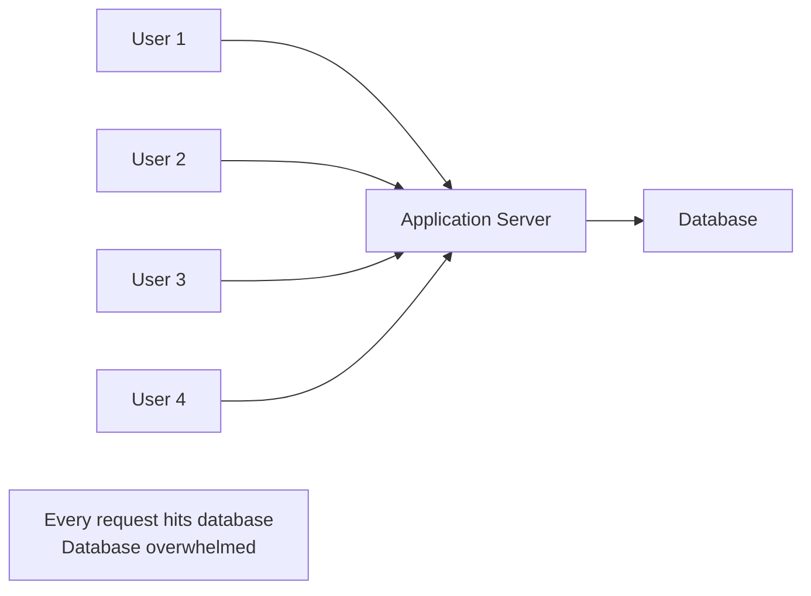
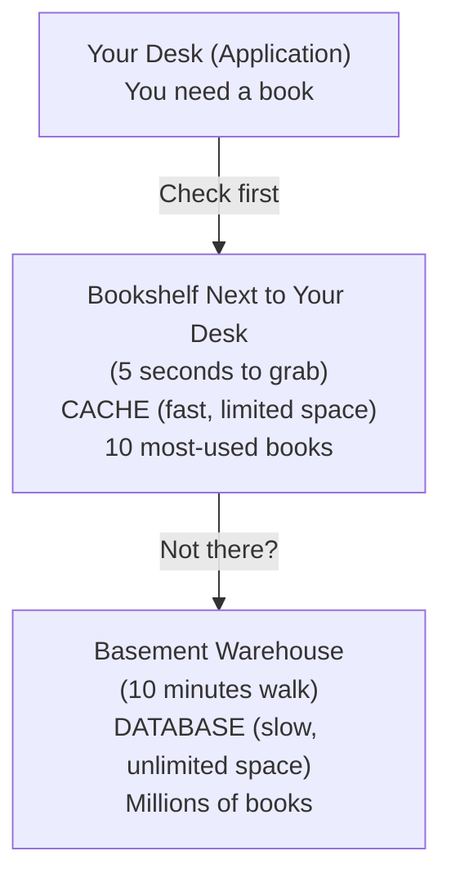
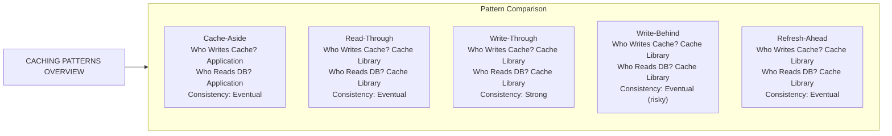
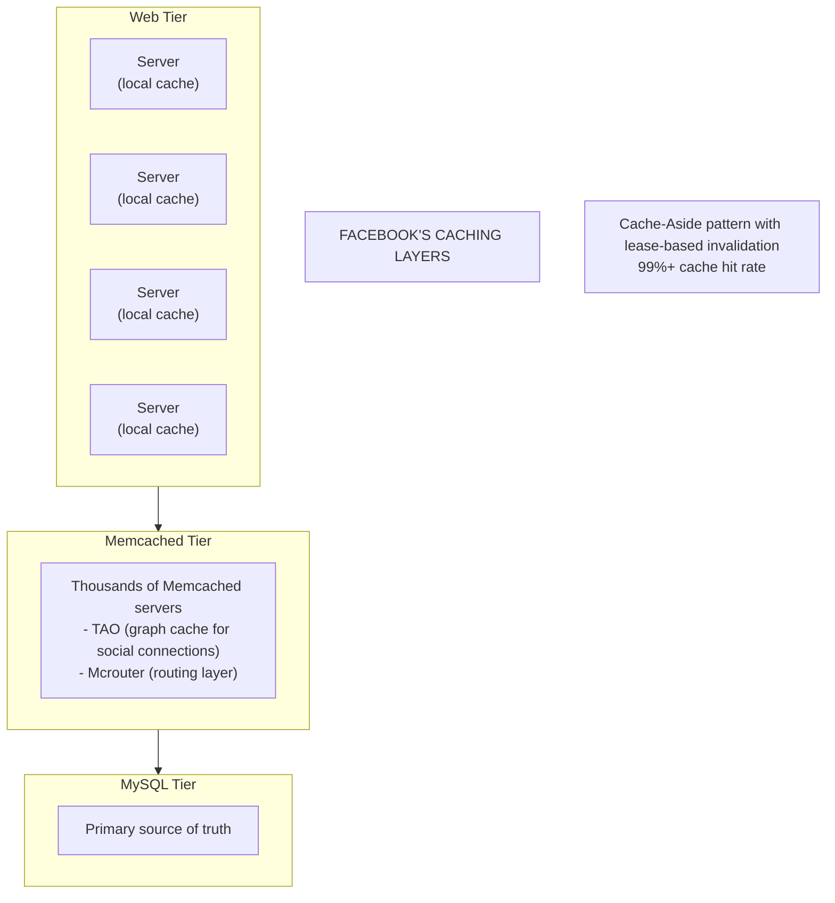
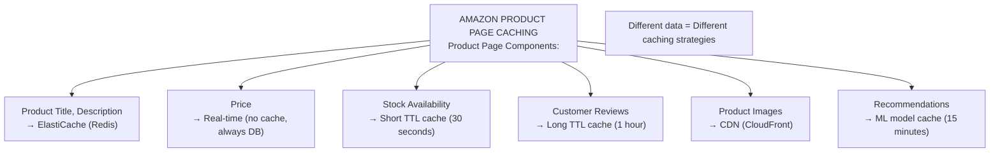

# ⚡ Caching Patterns

---

## 0️⃣ Prerequisites

Before diving into caching patterns, you need to understand:

- **Cache**: A temporary storage layer that holds frequently accessed data closer to where it's needed. Think of it as a "shortcut" to avoid expensive operations.
- **Latency**: The time delay between requesting something and receiving it. Lower latency means faster responses.
- **Database**: A persistent storage system where your actual data lives permanently.
- **Memory (RAM)**: Fast but limited storage that loses data when power is off. Much faster than disk-based databases.

If you understand that reading from memory is ~100x faster than reading from disk, you're ready.

---

## 1️⃣ What Problem Does This Exist to Solve?

### The Pain Point

Imagine you run an e-commerce website. Every time a user views a product page:

```
User clicks "View Product"
    → Your server receives request
    → Server queries database: "SELECT * FROM products WHERE id = 123"
    → Database reads from disk
    → Database returns data
    → Server formats response
    → User sees the page
```

**The problem**: Database queries are expensive.

- **Disk I/O**: Reading from disk takes ~10 milliseconds
- **Network round-trip**: Database might be on another server, adding ~1-5ms
- **Query processing**: Database parses SQL, creates execution plan, fetches data

Now imagine:
- **Day 1**: 100 users view the same popular product. You query the database 100 times for identical data.
- **Day 30**: 10,000 users view that product. 10,000 identical queries.
- **Black Friday**: 1,000,000 users. Your database melts.

### What Systems Looked Like Before Caching



<details>
<summary>ASCII diagram (reference)</summary>

```text
┌─────────────────────────────────────────────────────────────────┐
│                    WITHOUT CACHING                               │
│                                                                  │
│   User 1 ─┐                                                     │
│   User 2 ─┼──→ [Application Server] ──→ [Database]             │
│   User 3 ─┤         │                        │                  │
│   User 4 ─┘         │                        │                  │
│                     │                        │                  │
│              Every request                Database              │
│              hits database              overwhelmed             │
└─────────────────────────────────────────────────────────────────┘
```
</details>
```

### What Breaks Without Caching?

1. **Database Overload**: Databases have connection limits. PostgreSQL defaults to 100 connections. What happens with 10,000 concurrent users?

2. **Slow Response Times**: Users wait 100-500ms for every page load instead of 10-50ms.

3. **High Costs**: Database servers are expensive. You pay for CPU, memory, and I/O operations.

4. **Poor User Experience**: Amazon found that every 100ms of latency costs 1% in sales.

### Real Examples of the Problem

**Twitter (2008-2010)**: The "Fail Whale" appeared because every tweet view queried the database. They solved it by caching tweets in memory (Memcached).

**Facebook**: A single user's news feed might require data from 1000+ friends. Without caching, this would require 1000+ database queries per page load.

**Stack Overflow**: Serves 1.3 billion page views per month with just 9 web servers. How? Aggressive caching. They cache everything from questions to user profiles.

---

## 2️⃣ Intuition and Mental Model

### The Library Analogy

Think of your database as a **massive library warehouse** in the basement:



<details>
<summary>ASCII diagram (reference)</summary>

```text
┌────────────────────────────────────────────────────────────────┐
│                    THE LIBRARY SYSTEM                           │
│                                                                 │
│  Your Desk (Application)                                        │
│  ┌─────────────────────┐                                       │
│  │ You need a book     │                                       │
│  └──────────┬──────────┘                                       │
│             │                                                   │
│             ▼                                                   │
│  ┌─────────────────────┐                                       │
│  │ Bookshelf Next to   │  ← CACHE (fast, limited space)        │
│  │ Your Desk           │    10 most-used books                 │
│  │ (5 seconds to grab) │                                       │
│  └──────────┬──────────┘                                       │
│             │ Not there?                                        │
│             ▼                                                   │
│  ┌─────────────────────┐                                       │
│  │ Basement Warehouse  │  ← DATABASE (slow, unlimited space)   │
│  │ (10 minutes walk)   │    Millions of books                  │
│  └─────────────────────┘                                       │
└────────────────────────────────────────────────────────────────┘
```
</details>
```

**Key insight**: The bookshelf next to your desk is your cache. It's fast but has limited space. You keep the most frequently needed books there.

This analogy will be referenced throughout:
- **Cache Hit**: Book is on your desk shelf (fast!)
- **Cache Miss**: Book not on shelf, must go to warehouse (slow)
- **Eviction**: Removing an old book from shelf to make room for a new one
- **Invalidation**: Realizing the book on your shelf is outdated, need to get the new edition

---

## 3️⃣ How It Works Internally

### The Five Main Caching Patterns

There are five fundamental patterns for how applications interact with cache and database. Each solves different problems.



<details>
<summary>ASCII diagram (reference)</summary>

```text
┌───────────────────────────────────────────────────────────────────────────┐
│                        CACHING PATTERNS OVERVIEW                           │
│                                                                            │
│  Pattern          │ Who Writes Cache? │ Who Reads DB? │ Consistency       │
│  ─────────────────┼───────────────────┼───────────────┼─────────────────  │
│  Cache-Aside      │ Application       │ Application   │ Eventual          │
│  Read-Through     │ Cache Library     │ Cache Library │ Eventual          │
│  Write-Through    │ Cache Library     │ Cache Library │ Strong            │
│  Write-Behind     │ Cache Library     │ Cache Library │ Eventual (risky)  │
│  Refresh-Ahead    │ Cache Library     │ Cache Library │ Eventual          │
└───────────────────────────────────────────────────────────────────────────┘
```
</details>
```

Let's explore each pattern in depth.

---

### Pattern 1: Cache-Aside (Lazy Loading)

**Also called**: Lazy Loading, Look-Aside

**The Concept**: The application is responsible for managing the cache. It checks the cache first, and if data is missing, it fetches from the database and populates the cache.

```mermaid
flowchart LR
    Client["Client"]
    App["Application"]
    Cache["Cache<br/>(Redis)"]
    DB["Database"]
    
    Client -->|1. Request| App
    App -->|2. Get| Cache
    Cache -->|3. Return<br/>(if found)| App
    App -->|4. Query<br/>(if cache miss)| DB
    DB -->|5. Store in cache & return| App
    App --> Client
```

<details>
<summary>ASCII diagram (reference)</summary>

```text
┌─────────────────────────────────────────────────────────────────────────┐
│                         CACHE-ASIDE PATTERN                              │
│                                                                          │
│                        ┌─────────────┐                                  │
│                        │    Cache    │                                  │
│                        │   (Redis)   │                                  │
│                        └──────┬──────┘                                  │
│                          ▲    │                                         │
│                     2.Get│    │3. Return                                │
│                          │    ▼    (if found)                           │
│   ┌──────────┐     ┌─────────────────────┐     ┌──────────────┐        │
│   │  Client  │────▶│    Application      │────▶│   Database   │        │
│   └──────────┘  1. │                     │ 4.  └──────────────┘        │
│               Request│                   │Query                         │
│                      │                   │(if cache miss)               │
│                      │    5. Store in    │                              │
│                      │    cache & return │                              │
│                      └───────────────────┘                              │
└─────────────────────────────────────────────────────────────────────────┘
```
</details>
```

**Step-by-Step Flow**:

1. **Request arrives**: User wants product with ID 123
2. **Check cache**: Application asks cache "Do you have product:123?"
3. **Cache Hit**: If yes, return cached data immediately (fast path)
4. **Cache Miss**: If no, query the database
5. **Populate cache**: Store the database result in cache for future requests
6. **Return data**: Send response to user

**Why This Pattern Exists**:
- Application has full control over what gets cached
- Only caches data that is actually requested (no wasted memory)
- Simple to understand and implement

**What Breaks Without It**:
- If you cache everything upfront, you waste memory on rarely-used data
- If you never cache, every request hits the database

---

### Pattern 2: Read-Through

**The Concept**: The cache itself is responsible for loading data from the database. The application only talks to the cache, never directly to the database for reads.

```mermaid
flowchart LR
    Client["Client"]
    Cache["Cache<br/>(with loader)"]
    DB["Database"]
    
    Client -->|1. Request| Cache
    Cache -->|2. Check if cached| Cache
    Cache -->|3. Load data<br/>(if miss)| DB
    DB -->|4. Return data<br/>(from cache or freshly loaded)| Cache
    Cache --> Client
    
    Note["Application NEVER talks directly to database for reads"]
```

<details>
<summary>ASCII diagram (reference)</summary>

```text
┌─────────────────────────────────────────────────────────────────────────┐
│                        READ-THROUGH PATTERN                              │
│                                                                          │
│                                                                          │
│   ┌──────────┐     ┌─────────────────────┐     ┌──────────────┐        │
│   │  Client  │────▶│       Cache         │────▶│   Database   │        │
│   └──────────┘  1. │   (with loader)     │  3. └──────────────┘        │
│               Request│                   │Load data                     │
│                      │ 2. Check if       │(if miss)                     │
│                      │    cached         │                              │
│                      │                   │                              │
│                      │ 4. Return data    │                              │
│                      │    (from cache    │                              │
│                      │    or freshly     │                              │
│                      │    loaded)        │                              │
│                      └───────────────────┘                              │
│                                                                          │
│   Application NEVER talks directly to database for reads                │
└─────────────────────────────────────────────────────────────────────────┘
```
</details>
```

**Key Difference from Cache-Aside**:
- **Cache-Aside**: Application manages cache population
- **Read-Through**: Cache library manages cache population

**Why This Pattern Exists**:
- Cleaner application code (no cache management logic)
- Cache library handles all the complexity
- Consistent behavior across the application

---

### Pattern 3: Write-Through

**The Concept**: When data is written, it goes to both the cache AND the database synchronously. The write only succeeds when both are updated.

```mermaid
flowchart LR
    Client["Client"]
    App["Application"]
    Cache["Cache"]
    DB["Database"]
    
    Client -->|1. Write Request| App
    App -->|2. Write| Cache
    App -->|3. Write| DB
    DB -->|4. Return success<br/>(only if BOTH writes succeed)| App
    App --> Client
```

<details>
<summary>ASCII diagram (reference)</summary>

```text
┌─────────────────────────────────────────────────────────────────────────┐
│                       WRITE-THROUGH PATTERN                              │
│                                                                          │
│                        ┌─────────────┐                                  │
│                        │    Cache    │                                  │
│                        └──────┬──────┘                                  │
│                               │                                         │
│                          2. Write                                       │
│                               │                                         │
│   ┌──────────┐     ┌─────────────────────┐     ┌──────────────┐        │
│   │  Client  │────▶│    Application      │────▶│   Database   │        │
│   └──────────┘  1. │                     │  3. └──────────────┘        │
│               Write │                    │Write                         │
│              Request│                    │                              │
│                     │                    │                              │
│                     │ 4. Return success  │                              │
│                     │ (only if BOTH      │                              │
│                     │  writes succeed)   │                              │
│                     └────────────────────┘                              │
└─────────────────────────────────────────────────────────────────────────┘
```
</details>
```

**Step-by-Step Flow**:

1. **Write request arrives**: User updates their profile
2. **Write to cache**: Update the cache first
3. **Write to database**: Then update the database
4. **Both must succeed**: Only return success if both writes complete

**Why This Pattern Exists**:
- **Strong consistency**: Cache and database are always in sync
- **Reads are always fast**: Data is already in cache after write
- **No stale data**: Users always see their own writes

**The Tradeoff**:
- **Write latency increases**: Every write waits for both cache and database
- **Write amplification**: One logical write becomes two physical writes

---

### Pattern 4: Write-Behind (Write-Back)

**The Concept**: Writes go to the cache immediately, and the cache asynchronously writes to the database later. This is the opposite of write-through.

```mermaid
flowchart LR
    Client["Client"]
    App["Application"]
    Cache["Cache<br/>(primary)"]
    DB["Database"]
    
    Client -->|1. Write Request| App
    App -->|2. Write| Cache
    App -->|Returns immediately<br/>(doesn't wait for database)| Client
    Cache -->|3. Async write<br/>(batched)| DB
    
    Note["Eventually consistent"]
```

<details>
<summary>ASCII diagram (reference)</summary>

```text
┌─────────────────────────────────────────────────────────────────────────┐
│                       WRITE-BEHIND PATTERN                               │
│                                                                          │
│                        ┌─────────────┐                                  │
│                        │    Cache    │                                  │
│                        │  (primary)  │                                  │
│                        └──────┬──────┘                                  │
│                          ▲    │                                         │
│                     2.Write   │3. Async                                 │
│                          │    │   write                                 │
│                          │    │   (batched)                             │
│   ┌──────────┐     ┌─────────────────────┐     ┌──────────────┐        │
│   │  Client  │────▶│    Application      │     │   Database   │        │
│   └──────────┘  1. │                     │     └──────────────┘        │
│               Write │                    │           ▲                  │
│              Request│                    │           │                  │
│                     │ Returns immediately│      Eventually              │
│                     │ (doesn't wait for  │      consistent              │
│                     │  database)         │                              │
│                     └────────────────────┘                              │
└─────────────────────────────────────────────────────────────────────────┘
```
</details>
```

**Why This Pattern Exists**:
- **Extremely fast writes**: User doesn't wait for database
- **Batch efficiency**: Multiple writes can be combined into one database operation
- **Database protection**: Absorbs write spikes without overwhelming the database

**The Danger**:
- **Data loss risk**: If cache crashes before writing to database, data is lost
- **Eventual consistency**: Database might be behind cache for some time
- **Complex failure handling**: What if the async write fails?

**Real-World Use Case**: 
- Analytics counters (page views, likes) where losing a few counts is acceptable
- Gaming leaderboards where real-time updates matter more than persistence

---

### Pattern 5: Refresh-Ahead

**The Concept**: The cache proactively refreshes data BEFORE it expires. It predicts which data will be needed and refreshes it in the background.

```mermaid
gantt
    title REFRESH-AHEAD PATTERN Timeline
    dateFormat X
    axisFormat %Ls
    
    section Data Lifecycle
    Data cached (TTL=60s, Refresh threshold=80% = 48s) :0, 60
    Normal serving from cache :0, 48
    Background refresh triggered :48, 12
    Async DB query :48, 5
    Cache updated, TTL reset to 60s :53, 7
    Would have expired (but already fresh) :60, 0
    
    Note: Users NEVER experience cache miss for hot data
```



<details>
<summary>ASCII diagram (reference)</summary>

```text
┌─────────────────────────────────────────────────────────────────────────┐
│                      REFRESH-AHEAD PATTERN                               │
│                                                                          │
│   Timeline:                                                              │
│   ─────────────────────────────────────────────────────────────────────  │
│   │                                                                      │
│   │  Data cached                                                         │
│   │  TTL = 60 seconds                                                    │
│   │  Refresh threshold = 80% (48 seconds)                                │
│   │                                                                      │
│   ├─────────────────────┬─────────────────────┬─────────────────────    │
│   0s                   48s                    60s                        │
│   │                     │                      │                         │
│   │  Normal serving     │  Background refresh  │  Would have expired    │
│   │  from cache         │  triggered           │  (but already fresh)   │
│   │                     │  ↓                   │                         │
│   │                     │  Async DB query      │                         │
│   │                     │  Cache updated       │                         │
│   │                     │  TTL reset to 60s    │                         │
│                                                                          │
│   Result: Users NEVER experience cache miss for hot data                │
└─────────────────────────────────────────────────────────────────────────┘
```
</details>
```

**Why This Pattern Exists**:
- **Eliminates cache miss latency**: Hot data is always fresh
- **Predictable performance**: No sudden slow requests when cache expires
- **Better user experience**: Consistent response times

**When to Use**:
- Data that is accessed very frequently (hot data)
- When cache miss latency is unacceptable
- When you can predict access patterns

---

## 4️⃣ Simulation-First Explanation

Let's trace through a real scenario: A user views a product page on an e-commerce site.

### Scenario: Cache-Aside Pattern in Action

**Setup**:
- Product ID: 12345
- Cache: Redis (in-memory, ~1ms latency)
- Database: PostgreSQL (~50ms latency)
- Cache Key: `product:12345`
- TTL: 5 minutes

**First Request (Cache Miss)**:

```
Timeline:
─────────────────────────────────────────────────────────────────────────
0ms     User requests GET /products/12345
        │
1ms     Application checks Redis: GET product:12345
        │
2ms     Redis returns: (nil) - KEY NOT FOUND
        │
        │  ← This is a CACHE MISS
        │
3ms     Application queries PostgreSQL:
        SELECT * FROM products WHERE id = 12345
        │
53ms    PostgreSQL returns product data:
        {
          "id": 12345,
          "name": "Mechanical Keyboard",
          "price": 149.99,
          "stock": 47
        }
        │
54ms    Application stores in Redis:
        SET product:12345 '{"id":12345,...}' EX 300
        │
55ms    Application returns response to user
─────────────────────────────────────────────────────────────────────────
Total time: 55ms (slow, but now cached)
```

**Second Request (Cache Hit)**:

```
Timeline:
─────────────────────────────────────────────────────────────────────────
0ms     User requests GET /products/12345
        │
1ms     Application checks Redis: GET product:12345
        │
2ms     Redis returns:
        {
          "id": 12345,
          "name": "Mechanical Keyboard",
          "price": 149.99,
          "stock": 47
        }
        │
        │  ← This is a CACHE HIT
        │
3ms     Application returns response to user
─────────────────────────────────────────────────────────────────────────
Total time: 3ms (18x faster!)
```

### What the Bytes Actually Look Like

**Redis GET Command**:
```
*2\r\n$3\r\nGET\r\n$13\r\nproduct:12345\r\n

Breakdown:
*2       → Array of 2 elements
$3       → String of 3 bytes follows
GET      → The command
$13      → String of 13 bytes follows
product:12345 → The key
```

**Redis Response (Cache Hit)**:
```
$67\r\n{"id":12345,"name":"Mechanical Keyboard","price":149.99,"stock":47}\r\n

Breakdown:
$67      → Bulk string of 67 bytes follows
{...}    → The actual JSON data
```

**Redis Response (Cache Miss)**:
```
$-1\r\n

Breakdown:
$-1      → Null bulk string (key doesn't exist)
```

---

## 5️⃣ How Engineers Actually Use This in Production

### Real Systems at Real Companies

**Facebook's Cache Architecture**:



<details>
<summary>ASCII diagram (reference)</summary>

```text
┌─────────────────────────────────────────────────────────────────────────┐
│                    FACEBOOK'S CACHING LAYERS                             │
│                                                                          │
│   ┌─────────────────────────────────────────────────────────────────┐   │
│   │                         Web Tier                                 │   │
│   │   ┌─────────┐  ┌─────────┐  ┌─────────┐  ┌─────────┐           │   │
│   │   │ Server  │  │ Server  │  │ Server  │  │ Server  │           │   │
│   │   │ (local  │  │ (local  │  │ (local  │  │ (local  │           │   │
│   │   │  cache) │  │  cache) │  │  cache) │  │  cache) │           │   │
│   │   └────┬────┘  └────┬────┘  └────┬────┘  └────┬────┘           │   │
│   └────────┼────────────┼────────────┼────────────┼─────────────────┘   │
│            │            │            │            │                      │
│            └────────────┴─────┬──────┴────────────┘                      │
│                               │                                          │
│   ┌───────────────────────────┴───────────────────────────────────┐     │
│   │                     Memcached Tier                             │     │
│   │   Thousands of Memcached servers                               │     │
│   │   - TAO (graph cache for social connections)                   │     │
│   │   - Mcrouter (routing layer)                                   │     │
│   └───────────────────────────┬───────────────────────────────────┘     │
│                               │                                          │
│   ┌───────────────────────────┴───────────────────────────────────┐     │
│   │                     MySQL Tier                                 │     │
│   │   Primary source of truth                                      │     │
│   └───────────────────────────────────────────────────────────────┘     │
│                                                                          │
│   Cache-Aside pattern with lease-based invalidation                     │
│   99%+ cache hit rate                                                   │
└─────────────────────────────────────────────────────────────────────────┘
```
</details>
```

**Netflix's EVCache**:

Netflix built EVCache (Ephemeral Volatile Cache) on top of Memcached:
- Handles 30+ million requests per second
- Stores session data, user preferences, viewing history
- Uses Write-Through for critical data
- Uses Cache-Aside for recommendation data

**Amazon's Caching Strategy**:



<details>
<summary>ASCII diagram (reference)</summary>

```text
┌─────────────────────────────────────────────────────────────────────────┐
│                    AMAZON PRODUCT PAGE CACHING                           │
│                                                                          │
│   Product Page Components:                                               │
│   ┌─────────────────────────────────────────────────────────────────┐   │
│   │ Product Title, Description    → ElastiCache (Redis)             │   │
│   │ Price                         → Real-time (no cache, always DB) │   │
│   │ Stock Availability            → Short TTL cache (30 seconds)    │   │
│   │ Customer Reviews              → Long TTL cache (1 hour)         │   │
│   │ Product Images                → CDN (CloudFront)                │   │
│   │ Recommendations               → ML model cache (15 minutes)     │   │
│   └─────────────────────────────────────────────────────────────────┘   │
│                                                                          │
│   Different data = Different caching strategies                         │
└─────────────────────────────────────────────────────────────────────────┘
```
</details>
```

### Real Workflows and Tooling

**Typical Caching Setup in Production**:

```yaml
# docker-compose.yml for local development
version: '3.8'

services:
  redis:
    image: redis:7-alpine
    ports:
      - "6379:6379"
    command: redis-server --maxmemory 256mb --maxmemory-policy allkeys-lru
    # maxmemory-policy: What to do when memory is full
    # allkeys-lru: Remove least recently used keys

  app:
    build: .
    depends_on:
      - redis
    environment:
      - REDIS_HOST=redis
      - REDIS_PORT=6379
```

### Production War Stories

**Reddit's Cache Stampede (2021)**:
- Popular post's cache expired
- Thousands of users requested it simultaneously
- All requests hit the database at once
- Database overwhelmed, site went down
- **Lesson**: Need stampede prevention (covered in Topic 5)

**Twitter's Memcached Failure (2016)**:
- Memcached cluster had a network partition
- Some servers thought others were down
- Cache invalidation messages were lost
- Users saw stale data for hours
- **Lesson**: Cache invalidation in distributed systems is hard

---

## 6️⃣ How to Implement Each Pattern in Java

### Project Setup

```xml
<!-- pom.xml -->
<?xml version="1.0" encoding="UTF-8"?>
<project xmlns="http://maven.apache.org/POM/4.0.0"
         xmlns:xsi="http://www.w3.org/2001/XMLSchema-instance"
         xsi:schemaLocation="http://maven.apache.org/POM/4.0.0
         http://maven.apache.org/xsd/maven-4.0.0.xsd">
    <modelVersion>4.0.0</modelVersion>

    <parent>
        <groupId>org.springframework.boot</groupId>
        <artifactId>spring-boot-starter-parent</artifactId>
        <version>3.2.0</version>
    </parent>

    <groupId>com.example</groupId>
    <artifactId>caching-patterns</artifactId>
    <version>1.0.0</version>

    <properties>
        <java.version>17</java.version>
    </properties>

    <dependencies>
        <!-- Spring Boot Web -->
        <dependency>
            <groupId>org.springframework.boot</groupId>
            <artifactId>spring-boot-starter-web</artifactId>
        </dependency>

        <!-- Spring Data Redis for Redis integration -->
        <dependency>
            <groupId>org.springframework.boot</groupId>
            <artifactId>spring-boot-starter-data-redis</artifactId>
        </dependency>

        <!-- Lettuce - Modern Redis client (included with spring-data-redis) -->
        <!-- Provides connection pooling, async operations -->

        <!-- Spring Data JPA for database access -->
        <dependency>
            <groupId>org.springframework.boot</groupId>
            <artifactId>spring-boot-starter-data-jpa</artifactId>
        </dependency>

        <!-- PostgreSQL Driver -->
        <dependency>
            <groupId>org.postgresql</groupId>
            <artifactId>postgresql</artifactId>
            <scope>runtime</scope>
        </dependency>

        <!-- For JSON serialization in cache -->
        <dependency>
            <groupId>com.fasterxml.jackson.core</groupId>
            <artifactId>jackson-databind</artifactId>
        </dependency>

        <!-- Lombok to reduce boilerplate -->
        <dependency>
            <groupId>org.projectlombok</groupId>
            <artifactId>lombok</artifactId>
            <optional>true</optional>
        </dependency>
    </dependencies>
</project>
```

### Configuration

```yaml
# application.yml
spring:
  application:
    name: caching-patterns-demo

  # Redis Configuration
  data:
    redis:
      host: localhost
      port: 6379
      timeout: 2000ms  # Connection timeout
      lettuce:
        pool:
          max-active: 8   # Max connections in pool
          max-idle: 8     # Max idle connections
          min-idle: 2     # Min idle connections
          max-wait: -1ms  # Wait indefinitely for connection

  # Database Configuration
  datasource:
    url: jdbc:postgresql://localhost:5432/products_db
    username: postgres
    password: postgres

  jpa:
    hibernate:
      ddl-auto: update
    show-sql: true
```

### Domain Model

```java
// Product.java - The entity we'll be caching
package com.example.caching.domain;

import jakarta.persistence.*;
import lombok.Data;
import lombok.NoArgsConstructor;
import lombok.AllArgsConstructor;
import java.io.Serializable;
import java.math.BigDecimal;
import java.time.Instant;

@Entity
@Table(name = "products")
@Data  // Lombok: generates getters, setters, toString, equals, hashCode
@NoArgsConstructor
@AllArgsConstructor
public class Product implements Serializable {
    
    // Serializable is required for Redis serialization
    private static final long serialVersionUID = 1L;

    @Id
    @GeneratedValue(strategy = GenerationType.IDENTITY)
    private Long id;

    @Column(nullable = false)
    private String name;

    @Column(length = 2000)
    private String description;

    @Column(nullable = false, precision = 10, scale = 2)
    private BigDecimal price;

    @Column(nullable = false)
    private Integer stockQuantity;

    @Column(name = "created_at")
    private Instant createdAt;

    @Column(name = "updated_at")
    private Instant updatedAt;

    @PrePersist
    protected void onCreate() {
        createdAt = Instant.now();
        updatedAt = Instant.now();
    }

    @PreUpdate
    protected void onUpdate() {
        updatedAt = Instant.now();
    }
}
```

```java
// ProductRepository.java - JPA Repository for database access
package com.example.caching.repository;

import com.example.caching.domain.Product;
import org.springframework.data.jpa.repository.JpaRepository;
import org.springframework.stereotype.Repository;

@Repository
public interface ProductRepository extends JpaRepository<Product, Long> {
    // JpaRepository provides: findById, save, delete, findAll, etc.
    // Spring Data JPA generates the implementation automatically
}
```

### Pattern 1: Cache-Aside Implementation

```java
// CacheAsideProductService.java
package com.example.caching.service;

import com.example.caching.domain.Product;
import com.example.caching.repository.ProductRepository;
import com.fasterxml.jackson.core.JsonProcessingException;
import com.fasterxml.jackson.databind.ObjectMapper;
import lombok.RequiredArgsConstructor;
import lombok.extern.slf4j.Slf4j;
import org.springframework.data.redis.core.StringRedisTemplate;
import org.springframework.stereotype.Service;

import java.time.Duration;
import java.util.Optional;

/**
 * Cache-Aside Pattern Implementation
 * 
 * The application is responsible for:
 * 1. Checking the cache first
 * 2. Loading from database on cache miss
 * 3. Populating the cache after database read
 * 4. Invalidating the cache on writes
 */
@Service
@RequiredArgsConstructor  // Lombok: generates constructor for final fields
@Slf4j  // Lombok: generates logger
public class CacheAsideProductService {

    // StringRedisTemplate is type-safe for String keys and values
    private final StringRedisTemplate redisTemplate;
    
    // JPA repository for database access
    private final ProductRepository productRepository;
    
    // Jackson ObjectMapper for JSON serialization
    private final ObjectMapper objectMapper;

    // Cache configuration
    private static final String CACHE_PREFIX = "product:";
    private static final Duration CACHE_TTL = Duration.ofMinutes(5);

    /**
     * Get product by ID using Cache-Aside pattern
     * 
     * Flow:
     * 1. Check cache
     * 2. If hit, return cached data
     * 3. If miss, query database
     * 4. Store in cache
     * 5. Return data
     */
    public Optional<Product> getProduct(Long productId) {
        String cacheKey = CACHE_PREFIX + productId;
        
        // Step 1: Try to get from cache
        String cachedJson = redisTemplate.opsForValue().get(cacheKey);
        
        if (cachedJson != null) {
            // Cache HIT - deserialize and return
            log.info("Cache HIT for product {}", productId);
            try {
                Product product = objectMapper.readValue(cachedJson, Product.class);
                return Optional.of(product);
            } catch (JsonProcessingException e) {
                // If deserialization fails, treat as cache miss
                log.warn("Failed to deserialize cached product {}: {}", 
                         productId, e.getMessage());
                // Delete corrupted cache entry
                redisTemplate.delete(cacheKey);
            }
        }
        
        // Cache MISS - load from database
        log.info("Cache MISS for product {}", productId);
        
        Optional<Product> productOpt = productRepository.findById(productId);
        
        // If found in database, cache it
        productOpt.ifPresent(product -> {
            try {
                String json = objectMapper.writeValueAsString(product);
                // SET key value EX seconds
                redisTemplate.opsForValue().set(cacheKey, json, CACHE_TTL);
                log.info("Cached product {} with TTL {}", productId, CACHE_TTL);
            } catch (JsonProcessingException e) {
                log.error("Failed to serialize product {}: {}", 
                          productId, e.getMessage());
                // Continue without caching - database is source of truth
            }
        });
        
        return productOpt;
    }

    /**
     * Update product - must invalidate cache
     * 
     * Important: We DELETE from cache rather than UPDATE
     * This is safer because:
     * 1. Avoids race conditions between cache and DB updates
     * 2. Next read will get fresh data from DB
     */
    public Product updateProduct(Long productId, Product updatedProduct) {
        String cacheKey = CACHE_PREFIX + productId;
        
        // Step 1: Update database (source of truth)
        updatedProduct.setId(productId);
        Product saved = productRepository.save(updatedProduct);
        
        // Step 2: Invalidate cache (delete, don't update)
        Boolean deleted = redisTemplate.delete(cacheKey);
        log.info("Invalidated cache for product {}. Was cached: {}", 
                 productId, deleted);
        
        return saved;
    }

    /**
     * Delete product - must invalidate cache
     */
    public void deleteProduct(Long productId) {
        String cacheKey = CACHE_PREFIX + productId;
        
        // Delete from database
        productRepository.deleteById(productId);
        
        // Invalidate cache
        redisTemplate.delete(cacheKey);
        log.info("Deleted product {} and invalidated cache", productId);
    }

    /**
     * Create product - no cache action needed
     * Cache will be populated on first read
     */
    public Product createProduct(Product product) {
        return productRepository.save(product);
    }
}
```

### Pattern 2: Write-Through Implementation

```java
// WriteThroughProductService.java
package com.example.caching.service;

import com.example.caching.domain.Product;
import com.example.caching.repository.ProductRepository;
import com.fasterxml.jackson.core.JsonProcessingException;
import com.fasterxml.jackson.databind.ObjectMapper;
import lombok.RequiredArgsConstructor;
import lombok.extern.slf4j.Slf4j;
import org.springframework.data.redis.core.StringRedisTemplate;
import org.springframework.stereotype.Service;
import org.springframework.transaction.annotation.Transactional;

import java.time.Duration;
import java.util.Optional;

/**
 * Write-Through Pattern Implementation
 * 
 * Key characteristic: Writes go to BOTH cache and database synchronously
 * 
 * Benefits:
 * - Strong consistency between cache and database
 * - Reads after writes always see the updated data
 * 
 * Drawbacks:
 * - Higher write latency (must wait for both)
 * - Write amplification (one write becomes two)
 */
@Service
@RequiredArgsConstructor
@Slf4j
public class WriteThroughProductService {

    private final StringRedisTemplate redisTemplate;
    private final ProductRepository productRepository;
    private final ObjectMapper objectMapper;

    private static final String CACHE_PREFIX = "product:wt:";
    private static final Duration CACHE_TTL = Duration.ofMinutes(30);

    /**
     * Read operation - same as cache-aside
     */
    public Optional<Product> getProduct(Long productId) {
        String cacheKey = CACHE_PREFIX + productId;
        
        // Try cache first
        String cachedJson = redisTemplate.opsForValue().get(cacheKey);
        
        if (cachedJson != null) {
            log.info("Cache HIT for product {}", productId);
            try {
                return Optional.of(objectMapper.readValue(cachedJson, Product.class));
            } catch (JsonProcessingException e) {
                log.warn("Cache deserialization failed for {}", productId);
                redisTemplate.delete(cacheKey);
            }
        }
        
        // Cache miss - load from DB and cache
        log.info("Cache MISS for product {}", productId);
        Optional<Product> product = productRepository.findById(productId);
        product.ifPresent(p -> writeToCache(cacheKey, p));
        
        return product;
    }

    /**
     * Write-Through: Write to both cache and database
     * 
     * @Transactional ensures database write is atomic
     * If DB write fails, we rollback and don't update cache
     */
    @Transactional
    public Product saveProduct(Product product) {
        // Step 1: Write to database FIRST (source of truth)
        Product saved = productRepository.save(product);
        log.info("Saved product {} to database", saved.getId());
        
        // Step 2: Write to cache (only if DB succeeded)
        String cacheKey = CACHE_PREFIX + saved.getId();
        writeToCache(cacheKey, saved);
        log.info("Wrote product {} to cache (write-through)", saved.getId());
        
        return saved;
    }

    /**
     * Update with write-through
     */
    @Transactional
    public Product updateProduct(Long productId, Product updatedProduct) {
        // Verify product exists
        if (!productRepository.existsById(productId)) {
            throw new RuntimeException("Product not found: " + productId);
        }
        
        updatedProduct.setId(productId);
        
        // Write-through: DB first, then cache
        Product saved = productRepository.save(updatedProduct);
        
        String cacheKey = CACHE_PREFIX + productId;
        writeToCache(cacheKey, saved);
        
        log.info("Updated product {} with write-through", productId);
        return saved;
    }

    /**
     * Delete - remove from both
     */
    @Transactional
    public void deleteProduct(Long productId) {
        String cacheKey = CACHE_PREFIX + productId;
        
        // Delete from DB
        productRepository.deleteById(productId);
        
        // Delete from cache
        redisTemplate.delete(cacheKey);
        
        log.info("Deleted product {} from DB and cache", productId);
    }

    /**
     * Helper method to write to cache
     */
    private void writeToCache(String cacheKey, Product product) {
        try {
            String json = objectMapper.writeValueAsString(product);
            redisTemplate.opsForValue().set(cacheKey, json, CACHE_TTL);
        } catch (JsonProcessingException e) {
            // Log but don't fail - DB is source of truth
            log.error("Failed to cache product: {}", e.getMessage());
        }
    }
}
```

### Pattern 3: Write-Behind Implementation

```java
// WriteBehindProductService.java
package com.example.caching.service;

import com.example.caching.domain.Product;
import com.example.caching.repository.ProductRepository;
import com.fasterxml.jackson.core.JsonProcessingException;
import com.fasterxml.jackson.databind.ObjectMapper;
import lombok.RequiredArgsConstructor;
import lombok.extern.slf4j.Slf4j;
import org.springframework.data.redis.core.StringRedisTemplate;
import org.springframework.scheduling.annotation.Async;
import org.springframework.scheduling.annotation.Scheduled;
import org.springframework.stereotype.Service;

import java.time.Duration;
import java.util.Optional;
import java.util.Set;
import java.util.concurrent.ConcurrentHashMap;
import java.util.concurrent.ConcurrentMap;

/**
 * Write-Behind (Write-Back) Pattern Implementation
 * 
 * Key characteristic: Writes go to cache immediately, 
 * database is updated asynchronously later
 * 
 * Benefits:
 * - Extremely fast writes (user doesn't wait for DB)
 * - Can batch multiple writes to DB
 * - Absorbs write spikes
 * 
 * DANGER:
 * - Data loss if cache crashes before DB write
 * - Eventual consistency (DB lags behind cache)
 * - Complex failure handling
 * 
 * Use cases:
 * - Analytics counters
 * - Non-critical data
 * - High write throughput scenarios
 */
@Service
@RequiredArgsConstructor
@Slf4j
public class WriteBehindProductService {

    private final StringRedisTemplate redisTemplate;
    private final ProductRepository productRepository;
    private final ObjectMapper objectMapper;

    private static final String CACHE_PREFIX = "product:wb:";
    private static final String DIRTY_SET = "product:dirty";  // Track modified keys
    private static final Duration CACHE_TTL = Duration.ofHours(1);

    // In-memory tracking of dirty (modified but not persisted) products
    // In production, use Redis Set for distributed tracking
    private final ConcurrentMap<Long, Product> pendingWrites = new ConcurrentHashMap<>();

    /**
     * Read - same as other patterns
     */
    public Optional<Product> getProduct(Long productId) {
        String cacheKey = CACHE_PREFIX + productId;
        
        // Check pending writes first (might have unpersisted changes)
        Product pending = pendingWrites.get(productId);
        if (pending != null) {
            log.info("Returning pending write for product {}", productId);
            return Optional.of(pending);
        }
        
        // Then check cache
        String cachedJson = redisTemplate.opsForValue().get(cacheKey);
        if (cachedJson != null) {
            try {
                return Optional.of(objectMapper.readValue(cachedJson, Product.class));
            } catch (JsonProcessingException e) {
                redisTemplate.delete(cacheKey);
            }
        }
        
        // Finally, check database
        return productRepository.findById(productId);
    }

    /**
     * Write-Behind: Write to cache immediately, queue for DB write
     * 
     * Returns IMMEDIATELY - user doesn't wait for database
     */
    public Product saveProduct(Product product) {
        // Generate ID if new (in real system, use UUID or distributed ID)
        if (product.getId() == null) {
            product.setId(System.currentTimeMillis());  // Simple ID for demo
        }
        
        String cacheKey = CACHE_PREFIX + product.getId();
        
        // Step 1: Write to cache immediately
        try {
            String json = objectMapper.writeValueAsString(product);
            redisTemplate.opsForValue().set(cacheKey, json, CACHE_TTL);
            log.info("Wrote product {} to cache (write-behind)", product.getId());
        } catch (JsonProcessingException e) {
            throw new RuntimeException("Serialization failed", e);
        }
        
        // Step 2: Mark as dirty (needs DB write)
        redisTemplate.opsForSet().add(DIRTY_SET, product.getId().toString());
        pendingWrites.put(product.getId(), product);
        
        log.info("Queued product {} for async DB write", product.getId());
        
        // Return immediately - DB write happens later
        return product;
    }

    /**
     * Scheduled task to flush dirty entries to database
     * Runs every 5 seconds
     * 
     * In production:
     * - Use more sophisticated batching
     * - Handle failures with retry queue
     * - Consider using Kafka for durability
     */
    @Scheduled(fixedRate = 5000)  // Every 5 seconds
    public void flushToDatabase() {
        Set<String> dirtyIds = redisTemplate.opsForSet().members(DIRTY_SET);
        
        if (dirtyIds == null || dirtyIds.isEmpty()) {
            return;
        }
        
        log.info("Flushing {} dirty products to database", dirtyIds.size());
        
        for (String idStr : dirtyIds) {
            Long productId = Long.parseLong(idStr);
            
            try {
                Product product = pendingWrites.get(productId);
                if (product != null) {
                    // Write to database
                    productRepository.save(product);
                    log.info("Flushed product {} to database", productId);
                    
                    // Remove from dirty tracking
                    pendingWrites.remove(productId);
                    redisTemplate.opsForSet().remove(DIRTY_SET, idStr);
                }
            } catch (Exception e) {
                log.error("Failed to flush product {} to database: {}", 
                          productId, e.getMessage());
                // Leave in dirty set for retry
            }
        }
    }

    /**
     * Force immediate flush (for graceful shutdown)
     */
    public void forceFlush() {
        log.info("Forcing flush of all pending writes");
        flushToDatabase();
    }
}
```

### Pattern 4: Read-Through with Spring Cache Abstraction

```java
// ReadThroughProductService.java
package com.example.caching.service;

import com.example.caching.domain.Product;
import com.example.caching.repository.ProductRepository;
import lombok.RequiredArgsConstructor;
import lombok.extern.slf4j.Slf4j;
import org.springframework.cache.annotation.CacheEvict;
import org.springframework.cache.annotation.CachePut;
import org.springframework.cache.annotation.Cacheable;
import org.springframework.stereotype.Service;

import java.util.Optional;

/**
 * Read-Through Pattern using Spring Cache Abstraction
 * 
 * Spring's @Cacheable annotation provides read-through behavior:
 * - If data is in cache, return it
 * - If not, execute the method and cache the result
 * 
 * The application code doesn't manage the cache directly;
 * Spring handles it through AOP (Aspect-Oriented Programming)
 */
@Service
@RequiredArgsConstructor
@Slf4j
public class ReadThroughProductService {

    private final ProductRepository productRepository;

    /**
     * @Cacheable - Read-Through behavior
     * 
     * value = "products" : Name of the cache
     * key = "#productId" : Cache key (SpEL expression)
     * unless = "#result == null" : Don't cache null results
     * 
     * How it works:
     * 1. Spring intercepts this method call
     * 2. Checks if "products::123" exists in cache
     * 3. If yes, returns cached value WITHOUT calling the method
     * 4. If no, calls the method, caches result, returns it
     */
    @Cacheable(value = "products", key = "#productId", unless = "#result == null")
    public Product getProduct(Long productId) {
        log.info("Cache MISS - Loading product {} from database", productId);
        
        // This only executes on cache miss
        return productRepository.findById(productId)
                .orElse(null);
    }

    /**
     * @CachePut - Always execute method AND update cache
     * 
     * Unlike @Cacheable, this ALWAYS calls the method
     * Used for updates where we want to refresh the cache
     */
    @CachePut(value = "products", key = "#product.id")
    public Product updateProduct(Product product) {
        log.info("Updating product {} and refreshing cache", product.getId());
        return productRepository.save(product);
    }

    /**
     * @CacheEvict - Remove from cache
     * 
     * Used when deleting or when cache should be invalidated
     */
    @CacheEvict(value = "products", key = "#productId")
    public void deleteProduct(Long productId) {
        log.info("Deleting product {} and evicting from cache", productId);
        productRepository.deleteById(productId);
    }

    /**
     * @CacheEvict with allEntries - Clear entire cache
     * 
     * Useful for bulk operations or when data integrity is uncertain
     */
    @CacheEvict(value = "products", allEntries = true)
    public void clearProductCache() {
        log.info("Clearing entire products cache");
    }
}
```

### Spring Cache Configuration for Read-Through

```java
// CacheConfig.java
package com.example.caching.config;

import org.springframework.cache.annotation.EnableCaching;
import org.springframework.context.annotation.Bean;
import org.springframework.context.annotation.Configuration;
import org.springframework.data.redis.cache.RedisCacheConfiguration;
import org.springframework.data.redis.cache.RedisCacheManager;
import org.springframework.data.redis.connection.RedisConnectionFactory;
import org.springframework.data.redis.serializer.GenericJackson2JsonRedisSerializer;
import org.springframework.data.redis.serializer.RedisSerializationContext;
import org.springframework.data.redis.serializer.StringRedisSerializer;

import java.time.Duration;
import java.util.HashMap;
import java.util.Map;

/**
 * Redis Cache Configuration for Spring Cache Abstraction
 * 
 * This configures how Spring's @Cacheable annotations work with Redis
 */
@Configuration
@EnableCaching  // Enables Spring's cache annotations
public class CacheConfig {

    /**
     * Configure RedisCacheManager with custom settings per cache
     */
    @Bean
    public RedisCacheManager cacheManager(RedisConnectionFactory connectionFactory) {
        
        // Default cache configuration
        RedisCacheConfiguration defaultConfig = RedisCacheConfiguration
                .defaultCacheConfig()
                // TTL for cache entries
                .entryTtl(Duration.ofMinutes(10))
                // Prefix for all keys: "cacheName::"
                .prefixCacheNameWith("app::")
                // Use JSON serialization for values
                .serializeValuesWith(
                    RedisSerializationContext.SerializationPair
                        .fromSerializer(new GenericJackson2JsonRedisSerializer())
                )
                // Use String serialization for keys
                .serializeKeysWith(
                    RedisSerializationContext.SerializationPair
                        .fromSerializer(new StringRedisSerializer())
                )
                // Don't cache null values
                .disableCachingNullValues();

        // Per-cache configurations (different TTLs for different caches)
        Map<String, RedisCacheConfiguration> cacheConfigurations = new HashMap<>();
        
        // Products cache: 30 minute TTL
        cacheConfigurations.put("products", 
            defaultConfig.entryTtl(Duration.ofMinutes(30)));
        
        // Users cache: 1 hour TTL
        cacheConfigurations.put("users", 
            defaultConfig.entryTtl(Duration.ofHours(1)));
        
        // Sessions cache: 24 hour TTL
        cacheConfigurations.put("sessions", 
            defaultConfig.entryTtl(Duration.ofHours(24)));

        return RedisCacheManager.builder(connectionFactory)
                .cacheDefaults(defaultConfig)
                .withInitialCacheConfigurations(cacheConfigurations)
                .transactionAware()  // Respect @Transactional boundaries
                .build();
    }
}
```

### REST Controller to Test All Patterns

```java
// ProductController.java
package com.example.caching.controller;

import com.example.caching.domain.Product;
import com.example.caching.service.*;
import lombok.RequiredArgsConstructor;
import org.springframework.http.ResponseEntity;
import org.springframework.web.bind.annotation.*;

import java.util.Optional;

/**
 * REST Controller to demonstrate different caching patterns
 * 
 * Each endpoint uses a different caching pattern for comparison
 */
@RestController
@RequestMapping("/api/products")
@RequiredArgsConstructor
public class ProductController {

    private final CacheAsideProductService cacheAsideService;
    private final WriteThroughProductService writeThroughService;
    private final WriteBehindProductService writeBehindService;
    private final ReadThroughProductService readThroughService;

    // ==================== CACHE-ASIDE ====================
    
    @GetMapping("/cache-aside/{id}")
    public ResponseEntity<Product> getCacheAside(@PathVariable Long id) {
        return cacheAsideService.getProduct(id)
                .map(ResponseEntity::ok)
                .orElse(ResponseEntity.notFound().build());
    }

    @PostMapping("/cache-aside")
    public Product createCacheAside(@RequestBody Product product) {
        return cacheAsideService.createProduct(product);
    }

    @PutMapping("/cache-aside/{id}")
    public Product updateCacheAside(@PathVariable Long id, @RequestBody Product product) {
        return cacheAsideService.updateProduct(id, product);
    }

    // ==================== WRITE-THROUGH ====================
    
    @GetMapping("/write-through/{id}")
    public ResponseEntity<Product> getWriteThrough(@PathVariable Long id) {
        return writeThroughService.getProduct(id)
                .map(ResponseEntity::ok)
                .orElse(ResponseEntity.notFound().build());
    }

    @PostMapping("/write-through")
    public Product createWriteThrough(@RequestBody Product product) {
        return writeThroughService.saveProduct(product);
    }

    // ==================== WRITE-BEHIND ====================
    
    @GetMapping("/write-behind/{id}")
    public ResponseEntity<Product> getWriteBehind(@PathVariable Long id) {
        return writeBehindService.getProduct(id)
                .map(ResponseEntity::ok)
                .orElse(ResponseEntity.notFound().build());
    }

    @PostMapping("/write-behind")
    public Product createWriteBehind(@RequestBody Product product) {
        // Returns immediately - DB write is async
        return writeBehindService.saveProduct(product);
    }

    @PostMapping("/write-behind/flush")
    public void flushWriteBehind() {
        writeBehindService.forceFlush();
    }

    // ==================== READ-THROUGH ====================
    
    @GetMapping("/read-through/{id}")
    public ResponseEntity<Product> getReadThrough(@PathVariable Long id) {
        Product product = readThroughService.getProduct(id);
        return product != null 
                ? ResponseEntity.ok(product) 
                : ResponseEntity.notFound().build();
    }

    @PutMapping("/read-through/{id}")
    public Product updateReadThrough(@PathVariable Long id, @RequestBody Product product) {
        product.setId(id);
        return readThroughService.updateProduct(product);
    }
}
```

### Commands to Test

```bash
# Start Redis and PostgreSQL
docker-compose up -d

# Start the application
mvn spring-boot:run

# ==================== Test Cache-Aside ====================

# Create a product
curl -X POST http://localhost:8080/api/products/cache-aside \
  -H "Content-Type: application/json" \
  -d '{"name":"Keyboard","price":99.99,"stockQuantity":100}'

# First read (cache miss - check logs)
curl http://localhost:8080/api/products/cache-aside/1

# Second read (cache hit - check logs)
curl http://localhost:8080/api/products/cache-aside/1

# Verify in Redis
redis-cli GET "product:1"

# ==================== Test Write-Through ====================

# Create (writes to both cache and DB)
curl -X POST http://localhost:8080/api/products/write-through \
  -H "Content-Type: application/json" \
  -d '{"name":"Mouse","price":49.99,"stockQuantity":200}'

# Read (should be cache hit immediately)
curl http://localhost:8080/api/products/write-through/2

# ==================== Test Write-Behind ====================

# Create (returns immediately, DB write is async)
curl -X POST http://localhost:8080/api/products/write-behind \
  -H "Content-Type: application/json" \
  -d '{"name":"Monitor","price":299.99,"stockQuantity":50}'

# Check Redis (should exist)
redis-cli GET "product:wb:*"

# Wait 5 seconds, then check DB
# Or force flush
curl -X POST http://localhost:8080/api/products/write-behind/flush
```

---

## 7️⃣ Tradeoffs, Pitfalls, and Common Mistakes

### Pattern Comparison Matrix

| Aspect | Cache-Aside | Read-Through | Write-Through | Write-Behind |
|--------|-------------|--------------|---------------|--------------|
| **Read Latency** | Miss: High, Hit: Low | Miss: High, Hit: Low | Always Low (after write) | Low |
| **Write Latency** | Low (DB only) | Low (DB only) | High (DB + Cache) | Very Low (Cache only) |
| **Consistency** | Eventual | Eventual | Strong | Eventual |
| **Data Loss Risk** | None | None | None | HIGH |
| **Complexity** | Low | Medium | Medium | High |
| **Best For** | Read-heavy | Read-heavy | Read-after-write | Write-heavy |

### Common Mistakes

**1. Not Setting TTL**

```java
// WRONG: No expiration - stale data forever
redisTemplate.opsForValue().set(key, value);

// RIGHT: Always set TTL
redisTemplate.opsForValue().set(key, value, Duration.ofMinutes(5));
```

**2. Caching Null Values**

```java
// WRONG: Caching null causes repeated DB queries for non-existent items
if (product != null) {
    cache.put(key, product);
}
// Attacker can flood with requests for non-existent IDs

// RIGHT: Cache null with short TTL (negative caching)
if (product != null) {
    cache.put(key, product, Duration.ofMinutes(5));
} else {
    cache.put(key, NULL_MARKER, Duration.ofSeconds(30));
}
```

**3. Large Objects in Cache**

```java
// WRONG: Caching entire object graph
cache.put("user:123", userWithAllOrdersAndReviews);  // 10MB!

// RIGHT: Cache only what you need
cache.put("user:123", userBasicInfo);  // 1KB
cache.put("user:123:orders", orderIds);  // Separate cache for orders
```

**4. Not Handling Serialization Errors**

```java
// WRONG: Assumes serialization always works
String json = objectMapper.writeValueAsString(product);
cache.put(key, json);

// RIGHT: Handle errors gracefully
try {
    String json = objectMapper.writeValueAsString(product);
    cache.put(key, json);
} catch (JsonProcessingException e) {
    log.error("Serialization failed for {}: {}", key, e.getMessage());
    // Continue without caching - DB is source of truth
}
```

### Performance Gotchas

**1. Cache Key Collisions**

```java
// WRONG: Keys can collide across different object types
cache.put(String.valueOf(userId), user);
cache.put(String.valueOf(productId), product);
// If userId == productId, data is overwritten!

// RIGHT: Use prefixes
cache.put("user:" + userId, user);
cache.put("product:" + productId, product);
```

**2. Thundering Herd on Cache Miss**

When a popular item's cache expires, thousands of requests might hit the database simultaneously. This is covered in detail in Topic 5 (Cache Stampede).

**3. Hot Keys**

```
Problem:
  Key "product:popular-item" is accessed 100,000 times/second
  Single Redis node becomes bottleneck

Solutions:
  1. Local cache in front of Redis
  2. Key replication across Redis cluster
  3. Read replicas
```

---

## 8️⃣ When NOT to Use Each Pattern

### Cache-Aside: Don't Use When

- **Write-heavy workloads**: Every write invalidates cache, causing constant cache misses
- **Strong consistency required**: Stale reads are possible between write and cache invalidation
- **Complex cache logic**: If you need sophisticated cache population, read-through is cleaner

### Read-Through: Don't Use When

- **Custom cache population logic**: You need fine-grained control over what gets cached
- **Multiple data sources**: Cache library might not support your specific database
- **Debugging cache behavior**: Abstraction makes it harder to debug

### Write-Through: Don't Use When

- **High write throughput**: Double write latency is unacceptable
- **Write-heavy, read-light**: You're caching data that's rarely read
- **Cost-sensitive**: Paying for cache storage of rarely-accessed data

### Write-Behind: Don't Use When

- **Data loss is unacceptable**: Financial transactions, user data
- **Strong consistency required**: Users must see their writes immediately in DB
- **Audit requirements**: Regulators require immediate database persistence
- **Simple systems**: Complexity isn't worth the performance gain

---

## 9️⃣ Comparison: When to Choose Which Pattern

### Decision Tree

```
                    Start Here
                        │
                        ▼
            ┌───────────────────────┐
            │ Is data loss          │
            │ acceptable?           │
            └───────────┬───────────┘
                        │
            ┌───────────┴───────────┐
            │                       │
            ▼                       ▼
           YES                      NO
            │                       │
            ▼                       ▼
    ┌───────────────┐      ┌───────────────────┐
    │ Write-Behind  │      │ Need read-after-  │
    │ (fastest      │      │ write consistency?│
    │  writes)      │      └─────────┬─────────┘
    └───────────────┘                │
                          ┌─────────┴─────────┐
                          │                   │
                          ▼                   ▼
                         YES                  NO
                          │                   │
                          ▼                   ▼
                  ┌───────────────┐   ┌───────────────┐
                  │ Write-Through │   │ Is workload   │
                  │ (strong       │   │ read-heavy?   │
                  │  consistency) │   └───────┬───────┘
                  └───────────────┘           │
                                    ┌────────┴────────┐
                                    │                 │
                                    ▼                 ▼
                                   YES                NO
                                    │                 │
                                    ▼                 ▼
                            ┌───────────────┐ ┌───────────────┐
                            │ Cache-Aside   │ │ Consider not  │
                            │ or            │ │ caching       │
                            │ Read-Through  │ └───────────────┘
                            └───────────────┘
```

### Real-World Pattern Choices

| Company | Use Case | Pattern | Why |
|---------|----------|---------|-----|
| **Facebook** | News Feed | Cache-Aside | Read-heavy, can tolerate slight staleness |
| **Netflix** | Session Data | Write-Through | Must see own session changes immediately |
| **Twitter** | Like Counts | Write-Behind | High write volume, eventual consistency OK |
| **Amazon** | Product Catalog | Cache-Aside + CDN | Read-heavy, regional caching |
| **Uber** | Driver Location | Write-Behind | High-frequency updates, recent data matters |

---

## 🔟 Interview Follow-Up Questions WITH Answers

### L4 (Entry-Level) Questions

**Q: What is cache-aside pattern and when would you use it?**

A: Cache-aside is a caching pattern where the application is responsible for managing the cache. On read, the app checks the cache first. If the data is there (cache hit), it returns immediately. If not (cache miss), it queries the database, stores the result in cache, and returns. On write, the app updates the database and invalidates the cache. I would use it for read-heavy workloads where slight staleness is acceptable, like product catalogs or user profiles.

**Q: What's the difference between write-through and write-behind?**

A: Write-through writes to both cache and database synchronously. The user waits for both to complete. This gives strong consistency but higher latency. Write-behind writes to cache immediately and returns to the user. The database is updated asynchronously later. This gives very low latency but risks data loss if the cache crashes before the database write. Write-through is for critical data; write-behind is for high-throughput scenarios where some data loss is acceptable.

### L5 (Mid-Level) Questions

**Q: How do you handle cache invalidation in a distributed system?**

A: There are several strategies: (1) TTL-based: Set expiration time on cached data. Simple but can serve stale data. (2) Event-based: When data changes, publish an event that all cache instances subscribe to. More complex but more accurate. (3) Version-based: Include a version number in the cache key. When data changes, increment the version. Old versions naturally expire. (4) Hybrid: Use TTL as a safety net with event-based invalidation for critical updates. The choice depends on consistency requirements and system complexity.

**Q: A popular product's cache expires and 10,000 requests hit simultaneously. What happens and how do you prevent it?**

A: This is called cache stampede or thundering herd. All 10,000 requests see a cache miss and query the database simultaneously, potentially overwhelming it. Prevention strategies: (1) Locking: Only one request fetches from DB while others wait. (2) Probabilistic early expiration: Refresh cache slightly before TTL expires. (3) Request coalescing: Group identical requests, make one DB call, share the result. (4) Background refresh: Never let hot keys expire; refresh them proactively. I would use locking for simplicity or request coalescing for high-traffic systems.

### L6 (Senior) Questions

**Q: Design a caching strategy for a social media "like" counter that handles millions of likes per second.**

A: I would use a multi-layer approach:

1. **Write path (Write-Behind)**: Likes go to local in-memory counter first, then batched to Redis every second. Redis aggregates counts from all servers. A background job flushes Redis to the database every minute. This absorbs the write spike.

2. **Read path (Cache-Aside with local cache)**: Read requests first check local cache (Caffeine, 1-second TTL), then Redis, then database. Most reads hit local cache.

3. **Consistency**: Display "approximately X likes" to users. Exact counts only matter for analytics, which can read from the database.

4. **Failure handling**: If Redis fails, fall back to database reads (slower but correct). If database fails, serve stale counts from Redis.

5. **Hot key handling**: For viral posts, replicate the counter across multiple Redis keys and sum on read.

This design prioritizes availability and performance over strong consistency, which is appropriate for like counts.

**Q: How would you migrate from no caching to a caching layer without downtime?**

A: I would do it in phases:

1. **Phase 1 - Shadow mode**: Deploy cache infrastructure. Application writes to cache but doesn't read from it. Monitor cache hit rates and memory usage.

2. **Phase 2 - Gradual rollout**: Use feature flags to enable cache reads for a small percentage of traffic (1%, then 5%, 10%, etc.). Compare response times and correctness.

3. **Phase 3 - Full rollout**: Enable for 100% of traffic. Keep database queries as fallback.

4. **Phase 4 - Optimization**: Tune TTLs based on observed access patterns. Add local caching for hot keys. Implement cache warming for predictable traffic spikes.

Throughout, I would monitor: cache hit rate, latency percentiles, database load, and error rates. Rollback plan: disable cache reads via feature flag.

---

## 1️⃣1️⃣ One Clean Mental Summary

Caching patterns determine how your application interacts with the cache and database. **Cache-Aside** gives you full control: check cache, miss goes to database, you populate cache. **Read-Through** lets the cache library handle loading. **Write-Through** writes to both cache and database synchronously for strong consistency. **Write-Behind** writes to cache immediately and database later for maximum write speed, but risks data loss. **Refresh-Ahead** proactively refreshes hot data before expiration. Choose based on your consistency requirements, read/write ratio, and tolerance for complexity. Most systems use Cache-Aside for its simplicity and flexibility.

