# 🔄 Cache Invalidation

---

## 0️⃣ Prerequisites

Before diving into cache invalidation, you need to understand:

- **Cache**: A temporary storage layer that holds frequently accessed data. Covered in Topic 1.
- **TTL (Time To Live)**: How long data stays in cache before expiring. A countdown timer for cached data.
- **Caching Patterns**: Cache-Aside, Write-Through, etc. Covered in Topic 1.
- **Eventual Consistency**: A model where different parts of a system may temporarily have different views of data, but will eventually converge to the same state.

If you understand that cached data can become outdated when the source data changes, you're ready.

---

## 1️⃣ What Problem Does This Exist to Solve?

### The Pain Point

You cache a product's price as $99.99. The marketing team runs a flash sale and changes it to $79.99 in the database. What happens?

```
┌─────────────────────────────────────────────────────────────────────────┐
│                    THE STALE DATA PROBLEM                                │
│                                                                          │
│   Database:  Product price = $79.99 (UPDATED)                           │
│                                                                          │
│   Cache:     Product price = $99.99 (STALE!)                            │
│                                                                          │
│   User sees: $99.99                                                      │
│   User pays: $99.99                                                      │
│   User expected: $79.99                                                  │
│                                                                          │
│   Result: Angry customer, potential legal issues, lost trust            │
└─────────────────────────────────────────────────────────────────────────┘
```

**The fundamental problem**: Cache data becomes stale when the source of truth (database) changes.

### The Famous Quote

> "There are only two hard things in Computer Science: cache invalidation and naming things."
> — Phil Karlton

This quote exists because cache invalidation involves:
1. **Knowing when** data has changed
2. **Knowing what** cached data is affected
3. **Knowing how** to update or remove it
4. **Doing it consistently** across distributed systems

### What Systems Looked Like Before Proper Invalidation


<details>
<summary>ASCII diagram (reference)</summary>

```text
┌─────────────────────────────────────────────────────────────────────────┐
│                    NAIVE APPROACH: JUST USE TTL                          │
│                                                                          │
│   Timeline:                                                              │
│   ─────────────────────────────────────────────────────────────────────  │
│   │                                                                      │
│   │  0:00    Data cached (price = $99.99)                               │
│   │  0:30    Price changed to $79.99 in DB                              │
│   │  0:31    User sees $99.99 (stale!)                                  │
│   │  0:45    User sees $99.99 (still stale!)                            │
│   │  1:00    Cache expires (TTL = 1 hour)                               │
│   │  1:01    User sees $79.99 (finally correct)                         │
│   │                                                                      │
│   Problem: 30 minutes of serving wrong price!                           │
└─────────────────────────────────────────────────────────────────────────┘
```
</details>
```

### What Breaks Without Proper Invalidation?

1. **Data Inconsistency**: Users see outdated information
   - Wrong prices, wrong inventory counts, wrong user profiles

2. **Business Impact**: 
   - E-commerce: Selling at wrong prices
   - Social media: Showing deleted content
   - Banking: Displaying wrong balances

3. **User Trust**: Users learn they can't trust what they see

4. **Debugging Nightmares**: "It works sometimes" issues are the hardest to debug

### Real Examples of the Problem

**Twitter (2012)**: Users could see deleted tweets for hours after deletion. The cache invalidation wasn't propagating to all data centers.

**Amazon**: A pricing bug showed $0.01 for expensive items. Cache invalidation didn't trigger for some product categories. They honored some orders, losing significant money.

**Facebook**: Users saw posts from blocked users because the block list cache wasn't invalidated properly.

---

## 2️⃣ Intuition and Mental Model

### The Library Catalog Analogy

Imagine you're a librarian with a card catalog (cache) and a master database (actual book locations).

```mermaid
flowchart TD
    Catalog["THE LIBRARY CATALOG PROBLEM"]
    
    subgraph Card["Card Catalog (Cache)"]
        HP1["Harry Potter → Shelf A, Row 3"]
        LOTR1["Lord of the Rings → Shelf B, Row 7"]
    end
    
    subgraph Actual["Actual Library (Database)"]
        HP2["Harry Potter → Shelf C, Row 1 (MOVED!)"]
        LOTR2["Lord of the Rings → Shelf B, Row 7"]
    end
    
    Patron["Patron uses card catalog → Goes to Shelf A, Row 3 → Book not there!"]
    
    Catalog --> Card
    Catalog --> Actual
    Card --> Patron
```



<details>
<summary>ASCII diagram (reference)</summary>

```text
┌─────────────────────────────────────────────────────────────────────────┐
│                    THE LIBRARY CATALOG PROBLEM                           │
│                                                                          │
│   Card Catalog (Cache):                                                  │
│   ┌─────────────────────────────────────────────────────────────────┐   │
│   │  "Harry Potter" → Shelf A, Row 3                                │   │
│   │  "Lord of the Rings" → Shelf B, Row 7                           │   │
│   └─────────────────────────────────────────────────────────────────┘   │
│                                                                          │
│   Actual Library (Database):                                             │
│   ┌─────────────────────────────────────────────────────────────────┐   │
│   │  "Harry Potter" → Shelf C, Row 1  (MOVED!)                      │   │
│   │  "Lord of the Rings" → Shelf B, Row 7                           │   │
│   └─────────────────────────────────────────────────────────────────┘   │
│                                                                          │
│   Patron uses card catalog → Goes to Shelf A, Row 3 → Book not there!  │
└─────────────────────────────────────────────────────────────────────────┘
```
</details>
```

**Invalidation strategies are like different ways to keep the catalog updated**:

1. **TTL**: "Reprint the entire catalog every month"
   - Simple but books moved mid-month cause confusion

2. **Event-Based**: "When a book moves, immediately update that card"
   - Accurate but requires tracking every book movement

3. **Version-Based**: "Catalog v1, v2, v3... always use latest version"
   - Old catalogs naturally become obsolete

4. **Hybrid**: "Update cards when books move, but also reprint monthly as backup"
   - Most reliable, more complex

---

## 3️⃣ How It Works Internally

### The Three Core Invalidation Strategies


<details>
<summary>ASCII diagram (reference)</summary>

```text
┌─────────────────────────────────────────────────────────────────────────┐
│                    INVALIDATION STRATEGIES                               │
│                                                                          │
│   Strategy         │ Trigger           │ Staleness    │ Complexity      │
│   ─────────────────┼───────────────────┼──────────────┼───────────────  │
│   TTL-Based        │ Time passes       │ Up to TTL    │ Low             │
│   Event-Based      │ Data changes      │ Seconds      │ Medium-High     │
│   Version-Based    │ Version mismatch  │ Seconds      │ Medium          │
│   Hybrid           │ Both              │ Minimal      │ High            │
└─────────────────────────────────────────────────────────────────────────┘
```
</details>
```

---

### Strategy 1: TTL-Based Invalidation

**The Concept**: Every cached item has an expiration time. After that time, the item is automatically removed or marked stale.

```mermaid
flowchart TD
    TTL["TTL-BASED INVALIDATION"]
    
    Entry["Cache Entry:<br/>Key: 'product:123'<br/>Value: {'name': 'Keyboard', 'price': 99.99}<br/>Created: 10:00:00<br/>TTL: 300 seconds (5 minutes)<br/>Expires: 10:05:00"]
    
    Timeline["Timeline:<br/>10:00:00 Entry created<br/>10:03:00 Read → Returns cached value<br/>10:05:00 Entry expires<br/>10:05:01 Read → Cache miss → Fetch from DB → Re-cache"]
    
    TTL --> Entry --> Timeline
```



<details>
<summary>ASCII diagram (reference)</summary>

```text
┌─────────────────────────────────────────────────────────────────────────┐
│                    TTL-BASED INVALIDATION                                │
│                                                                          │
│   Cache Entry:                                                           │
│   ┌─────────────────────────────────────────────────────────────────┐   │
│   │  Key: "product:123"                                              │   │
│   │  Value: {"name": "Keyboard", "price": 99.99}                    │   │
│   │  Created: 10:00:00                                               │   │
│   │  TTL: 300 seconds (5 minutes)                                    │   │
│   │  Expires: 10:05:00                                               │   │
│   └─────────────────────────────────────────────────────────────────┘   │
│                                                                          │
│   Timeline:                                                              │
│   10:00:00  Entry created                                               │
│   10:03:00  Read → Returns cached value                                 │
│   10:05:00  Entry expires                                               │
│   10:05:01  Read → Cache miss → Fetch from DB → Re-cache               │
└─────────────────────────────────────────────────────────────────────────┘
```
</details>
```

**TTL Variants**:

**Fixed TTL**: Same expiration time for all entries
```java
// Every product cached for exactly 5 minutes
cache.set("product:123", productJson, Duration.ofMinutes(5));
```

**Sliding TTL**: Expiration resets on each access
```java
// Expires 5 minutes after LAST access
// If accessed frequently, stays in cache forever
cache.getAndTouch("product:123", Duration.ofMinutes(5));
```

**Adaptive TTL**: TTL based on data characteristics
```java
// Popular items get longer TTL
if (product.getViewCount() > 10000) {
    cache.set(key, value, Duration.ofHours(1));
} else {
    cache.set(key, value, Duration.ofMinutes(5));
}
```

**When to Use Fixed vs Sliding**:

| Scenario | Use Fixed TTL | Use Sliding TTL |
|----------|---------------|-----------------|
| Product prices | ✅ | ❌ (might never refresh) |
| User sessions | ❌ | ✅ (keep active users logged in) |
| Stock prices | ✅ (short TTL) | ❌ |
| Static config | ✅ (long TTL) | ❌ |

---

### Strategy 2: Event-Based Invalidation

**The Concept**: When data changes in the database, an event is published. Cache listeners receive the event and invalidate the affected cache entries.


<details>
<summary>ASCII diagram (reference)</summary>

```text
┌─────────────────────────────────────────────────────────────────────────┐
│                    EVENT-BASED INVALIDATION                              │
│                                                                          │
│   ┌──────────────┐                                                      │
│   │  Application │                                                      │
│   │  (writes)    │                                                      │
│   └──────┬───────┘                                                      │
│          │                                                               │
│          │ 1. UPDATE product SET price = 79.99 WHERE id = 123           │
│          ▼                                                               │
│   ┌──────────────┐      2. Publish event                                │
│   │   Database   │─────────────────────────────┐                        │
│   └──────────────┘                             │                        │
│                                                 ▼                        │
│                                         ┌──────────────┐                │
│                                         │ Message Bus  │                │
│                                         │ (Kafka/Redis)│                │
│                                         └──────┬───────┘                │
│                                                 │                        │
│                    ┌────────────────────────────┼────────────────────┐  │
│                    │                            │                    │  │
│                    ▼                            ▼                    ▼  │
│             ┌────────────┐              ┌────────────┐        ┌────────┐│
│             │  Cache     │              │  Cache     │        │ Cache  ││
│             │  Server 1  │              │  Server 2  │        │Server 3││
│             └────────────┘              └────────────┘        └────────┘│
│                    │                            │                    │  │
│             3. DELETE                    3. DELETE             3. DELETE│
│                product:123                  product:123           product:123
└─────────────────────────────────────────────────────────────────────────┘
```
</details>
```

**Event Sources**:

1. **Application-Level Events**: Application publishes event after database write
2. **Database Triggers**: Database publishes event on row change
3. **Change Data Capture (CDC)**: Tool reads database transaction log and publishes events

---

### Strategy 3: Version-Based Invalidation

**The Concept**: Include a version number in the cache key. When data changes, increment the version. Old versions naturally become orphaned and expire.

```mermaid
flowchart TD
    Version["VERSION-BASED INVALIDATION"]
    
    DB["Database:<br/>products table:<br/>id=123, name='Keyboard', price=99.99, version=1"]
    
    Pattern["Cache Key Pattern: 'product:{id}:v{version}'"]
    
    Step1["Step 1: Cache with version<br/>Cache: 'product:123:v1' → {'name': 'Keyboard', 'price': 99.99}"]
    
    Step2["Step 2: Update database (version increments)<br/>Database: id=123, price=79.99, version=2"]
    
    Step3["Step 3: Next read uses new version<br/>App looks for: 'product:123:v2' → Cache miss → Fetch from DB"]
    
    Expire["Old entry 'product:123:v1' naturally expires via TTL"]
    
    Version --> DB --> Pattern --> Step1 --> Step2 --> Step3 --> Expire
```



<details>
<summary>ASCII diagram (reference)</summary>

```text
┌─────────────────────────────────────────────────────────────────────────┐
│                    VERSION-BASED INVALIDATION                            │
│                                                                          │
│   Database:                                                              │
│   ┌─────────────────────────────────────────────────────────────────┐   │
│   │  products table:                                                 │   │
│   │  id=123, name="Keyboard", price=99.99, version=1                │   │
│   └─────────────────────────────────────────────────────────────────┘   │
│                                                                          │
│   Cache Key Pattern: "product:{id}:v{version}"                          │
│                                                                          │
│   Step 1: Cache with version                                            │
│   Cache: "product:123:v1" → {"name": "Keyboard", "price": 99.99}       │
│                                                                          │
│   Step 2: Update database (version increments)                          │
│   Database: id=123, price=79.99, version=2                              │
│                                                                          │
│   Step 3: Next read uses new version                                    │
│   App looks for: "product:123:v2" → Cache miss → Fetch from DB         │
│                                                                          │
│   Old entry "product:123:v1" naturally expires via TTL                  │
└─────────────────────────────────────────────────────────────────────────┘
```
</details>
```

**Advantages**:
- No need to find and delete old cache entries
- Works well in distributed systems
- Simple to implement

**Disadvantages**:
- Requires version tracking in database
- Old versions waste memory until TTL expires
- Need to know current version before reading cache

---

### Strategy 4: Hybrid Approach

**The Concept**: Combine multiple strategies for defense in depth.


<details>
<summary>ASCII diagram (reference)</summary>

```text
┌─────────────────────────────────────────────────────────────────────────┐
│                    HYBRID INVALIDATION                                   │
│                                                                          │
│   Layer 1: Event-Based (Primary)                                        │
│   ─────────────────────────────────                                     │
│   When data changes → Publish event → Invalidate cache immediately      │
│   Latency: ~100ms                                                        │
│                                                                          │
│   Layer 2: TTL (Safety Net)                                             │
│   ─────────────────────────────                                         │
│   Even if event is lost, cache expires in 5 minutes                     │
│   Maximum staleness: 5 minutes                                           │
│                                                                          │
│   Layer 3: Version Check (Verification)                                 │
│   ─────────────────────────────────────                                 │
│   On cache hit, verify version matches database                         │
│   If mismatch, treat as cache miss                                      │
│                                                                          │
│   Result: Fast invalidation + guaranteed eventual consistency           │
└─────────────────────────────────────────────────────────────────────────┘
```
</details>
```

---

## 4️⃣ Simulation-First Explanation

Let's trace through a real scenario: User updates their profile name.

### Scenario: Event-Based Invalidation Flow

**Setup**:
- User ID: 456
- Current name in DB: "John"
- Current name in cache: "John"
- User changes name to: "Johnny"

**Step-by-Step Flow**:

```
Timeline:
─────────────────────────────────────────────────────────────────────────
0ms     User submits form: "Change name to Johnny"
        │
        │  HTTP POST /users/456
        │  {"name": "Johnny"}
        │
10ms    Application receives request
        │
        │  UserService.updateUser(456, "Johnny")
        │
20ms    Database UPDATE executed
        │
        │  UPDATE users SET name = 'Johnny', updated_at = NOW() 
        │  WHERE id = 456
        │
25ms    Database triggers CDC event (or app publishes event)
        │
        │  Event: {
        │    "type": "USER_UPDATED",
        │    "userId": 456,
        │    "timestamp": "2024-01-15T10:30:00Z"
        │  }
        │
30ms    Event published to Kafka topic "user-events"
        │
35ms    Cache invalidation service receives event
        │
        │  Consumer: UserCacheInvalidator
        │  Received: USER_UPDATED for user 456
        │
40ms    Cache DELETE executed
        │
        │  Redis: DEL user:456
        │
45ms    Response sent to user: "Profile updated"
        │
─────────────────────────────────────────────────────────────────────────
```

**Next Read Request**:

```
Timeline:
─────────────────────────────────────────────────────────────────────────
0ms     Another user views profile of user 456
        │
        │  GET /users/456
        │
5ms     Application checks cache
        │
        │  Redis: GET user:456
        │  Response: (nil) - KEY NOT FOUND
        │
        │  ← Cache MISS (entry was invalidated)
        │
10ms    Application queries database
        │
        │  SELECT * FROM users WHERE id = 456
        │
60ms    Database returns: {"id": 456, "name": "Johnny", ...}
        │
65ms    Application caches new data
        │
        │  Redis: SET user:456 '{"name":"Johnny",...}' EX 300
        │
70ms    Response sent with fresh data: "Johnny"
─────────────────────────────────────────────────────────────────────────
```

### What the Kafka Event Looks Like

```json
{
  "header": {
    "eventId": "evt-789-abc",
    "eventType": "USER_UPDATED",
    "timestamp": "2024-01-15T10:30:00.123Z",
    "source": "user-service"
  },
  "payload": {
    "userId": 456,
    "changedFields": ["name"],
    "previousValues": {
      "name": "John"
    },
    "newValues": {
      "name": "Johnny"
    }
  }
}
```

---

## 5️⃣ How Engineers Actually Use This in Production

### Real Systems at Real Companies

**Facebook's Cache Invalidation Architecture**:

```mermaid
flowchart TD
    Facebook["FACEBOOK'S INVALIDATION SYSTEM"]
    
    MySQL["MySQL (Source of Truth)"]
    McSqueal["McSqueal (CDC Service)<br/>- Reads MySQL binlog<br/>- Extracts changed rows<br/>- Publishes invalidation events"]
    Mcrouter["Mcrouter (Routing Layer)<br/>- Routes invalidations to correct Memcached servers<br/>- Handles cross-region invalidation"]
    
    C1["Memcached Cluster 1"]
    C2["Memcached Cluster 2"]
    C3["Memcached Cluster 3"]
    
    MySQL -->|Binlog (transaction log)| McSqueal --> Mcrouter
    Mcrouter --> C1
    Mcrouter --> C2
    Mcrouter --> C3
    
    Note["Invalidation latency: ~50ms within region, ~200ms cross-region"]
```

<details>
<summary>ASCII diagram (reference)</summary>

```text
┌─────────────────────────────────────────────────────────────────────────┐
│                    FACEBOOK'S INVALIDATION SYSTEM                        │
│                                                                          │
│   ┌─────────────────────────────────────────────────────────────────┐   │
│   │                     MySQL (Source of Truth)                      │   │
│   └───────────────────────────────┬─────────────────────────────────┘   │
│                                   │                                      │
│                                   │ Binlog (transaction log)            │
│                                   ▼                                      │
│   ┌─────────────────────────────────────────────────────────────────┐   │
│   │                     McSqueal (CDC Service)                       │   │
│   │  - Reads MySQL binlog                                            │   │
│   │  - Extracts changed rows                                         │   │
│   │  - Publishes invalidation events                                 │   │
│   └───────────────────────────────┬─────────────────────────────────┘   │
│                                   │                                      │
│                                   ▼                                      │
│   ┌─────────────────────────────────────────────────────────────────┐   │
│   │                     Mcrouter (Routing Layer)                     │   │
│   │  - Routes invalidations to correct Memcached servers            │   │
│   │  - Handles cross-region invalidation                             │   │
│   └───────────────────────────────┬─────────────────────────────────┘   │
│                                   │                                      │
│           ┌───────────────────────┼───────────────────────┐             │
│           ▼                       ▼                       ▼             │
│   ┌───────────────┐       ┌───────────────┐       ┌───────────────┐    │
│   │  Memcached    │       │  Memcached    │       │  Memcached    │    │
│   │  Cluster 1    │       │  Cluster 2    │       │  Cluster 3    │    │
│   └───────────────┘       └───────────────┘       └───────────────┘    │
│                                                                          │
│   Invalidation latency: ~50ms within region, ~200ms cross-region        │
└─────────────────────────────────────────────────────────────────────────┘
```
</details>
```

**Netflix's EVCache Invalidation**:

Netflix uses a "lease" mechanism to prevent thundering herd during invalidation:

```mermaid
sequenceDiagram
    participant R1 as Request 1
    participant R2 as Request 2
    participant R3 as Request 3
    participant Cache as Cache
    participant DB as Database
    
    Note over R1,R3: Problem: 1000 requests hit cache miss simultaneously
    Note over R1,R3: Solution: Lease mechanism
    
    R1->>Cache: GET user:123
    Cache-->>R1: Miss
    R1->>Cache: Get lease
    R1->>DB: Query DB
    
    R2->>Cache: GET user:123
    Cache-->>R2: Miss
    R2->>Cache: No lease → Wait
    
    R3->>Cache: GET user:123
    Cache-->>R3: Miss
    R3->>Cache: No lease → Wait
    
    R1->>Cache: SET user:123
    R1->>Cache: Release lease
    
    Note over R1,R3: 1. First request gets a 'lease' (permission to fetch from DB)<br/>2. Other requests wait or get stale data<br/>3. First request updates cache and releases lease<br/>4. Waiting requests now get fresh data from cache
```



<details>
<summary>ASCII diagram (reference)</summary>

```text
┌─────────────────────────────────────────────────────────────────────────┐
│                    NETFLIX LEASE-BASED INVALIDATION                      │
│                                                                          │
│   Problem: 1000 requests hit cache miss simultaneously                  │
│                                                                          │
│   Solution: Lease mechanism                                              │
│                                                                          │
│   1. First request gets a "lease" (permission to fetch from DB)         │
│   2. Other requests wait or get stale data                              │
│   3. First request updates cache and releases lease                     │
│   4. Waiting requests now get fresh data from cache                     │
│                                                                          │
│   Timeline:                                                              │
│   ─────────────────────────────────────────────────────────────────────  │
│   Request 1: GET user:123 → Miss → Get lease → Query DB                 │
│   Request 2: GET user:123 → Miss → No lease → Wait                      │
│   Request 3: GET user:123 → Miss → No lease → Wait                      │
│   Request 1: Got data → SET user:123 → Release lease                    │
```
</details>
```
│   Request 2: GET user:123 → Hit → Return                                │
│   Request 3: GET user:123 → Hit → Return                                │
└─────────────────────────────────────────────────────────────────────────┘
```

### Real Workflows and Tooling

**Common CDC Tools**:

| Tool | Database Support | Use Case |
|------|------------------|----------|
| **Debezium** | MySQL, PostgreSQL, MongoDB, etc. | Most popular open-source CDC |
| **Maxwell** | MySQL only | Lightweight, simple |
| **AWS DMS** | Most databases | Managed service |
| **LinkedIn Databus** | Oracle, MySQL | High-scale enterprise |

### Production War Stories

**Slack's Cache Invalidation Bug (2022)**:
- Messages were cached with channel ID as key
- When a channel was renamed, cache wasn't invalidated
- Users saw messages in wrong channels
- **Lesson**: Cache keys must include all relevant identifiers

**GitHub's Stale Data Incident (2018)**:
- Repository settings were cached
- Invalidation event was lost due to network partition
- Users with revoked access could still view private repos
- **Lesson**: Security-sensitive data needs TTL as safety net

---

## 6️⃣ How to Implement Cache Invalidation in Java

### Project Setup

```xml
<!-- pom.xml additions for cache invalidation -->
<dependencies>
    <!-- Previous dependencies from Topic 1 -->
    
    <!-- Kafka for event-based invalidation -->
    <dependency>
        <groupId>org.springframework.kafka</groupId>
        <artifactId>spring-kafka</artifactId>
    </dependency>
    
    <!-- Debezium for CDC (optional, for database-level CDC) -->
    <dependency>
        <groupId>io.debezium</groupId>
        <artifactId>debezium-api</artifactId>
        <version>2.4.0.Final</version>
    </dependency>
</dependencies>
```

### Configuration

```yaml
# application.yml
spring:
  kafka:
    bootstrap-servers: localhost:9092
    consumer:
      group-id: cache-invalidation-service
      auto-offset-reset: earliest
      key-deserializer: org.apache.kafka.common.serialization.StringDeserializer
      value-deserializer: org.springframework.kafka.support.serializer.JsonDeserializer
      properties:
        spring.json.trusted.packages: "*"
    producer:
      key-serializer: org.apache.kafka.common.serialization.StringSerializer
      value-serializer: org.springframework.kafka.support.serializer.JsonSerializer

# Cache TTL configuration
cache:
  ttl:
    products: 300        # 5 minutes
    users: 600           # 10 minutes
    sessions: 86400      # 24 hours
    config: 3600         # 1 hour
```

### Domain Events

```java
// CacheInvalidationEvent.java
package com.example.caching.events;

import lombok.AllArgsConstructor;
import lombok.Data;
import lombok.NoArgsConstructor;

import java.time.Instant;
import java.util.List;

/**
 * Event published when data changes and cache needs invalidation
 */
@Data
@NoArgsConstructor
@AllArgsConstructor
public class CacheInvalidationEvent {
    
    /**
     * Type of entity that changed
     * Examples: "PRODUCT", "USER", "ORDER"
     */
    private String entityType;
    
    /**
     * ID of the changed entity
     */
    private String entityId;
    
    /**
     * Type of change
     */
    private ChangeType changeType;
    
    /**
     * When the change occurred
     */
    private Instant timestamp;
    
    /**
     * Which fields changed (for partial invalidation)
     */
    private List<String> changedFields;
    
    /**
     * Version number for version-based invalidation
     */
    private Long version;
    
    public enum ChangeType {
        CREATED,
        UPDATED,
        DELETED
    }
    
    // Factory methods for common cases
    public static CacheInvalidationEvent created(String entityType, String entityId) {
        return new CacheInvalidationEvent(
            entityType, 
            entityId, 
            ChangeType.CREATED, 
            Instant.now(), 
            null,
            1L
        );
    }
    
    public static CacheInvalidationEvent updated(String entityType, String entityId, 
                                                  List<String> changedFields, Long version) {
        return new CacheInvalidationEvent(
            entityType, 
            entityId, 
            ChangeType.UPDATED, 
            Instant.now(), 
            changedFields,
            version
        );
    }
    
    public static CacheInvalidationEvent deleted(String entityType, String entityId) {
        return new CacheInvalidationEvent(
            entityType, 
            entityId, 
            ChangeType.DELETED, 
            Instant.now(), 
            null,
            null
        );
    }
}
```

### Strategy 1: TTL-Based Invalidation Service

```java
// TtlBasedCacheService.java
package com.example.caching.service;

import com.example.caching.domain.Product;
import com.fasterxml.jackson.core.JsonProcessingException;
import com.fasterxml.jackson.databind.ObjectMapper;
import lombok.RequiredArgsConstructor;
import lombok.extern.slf4j.Slf4j;
import org.springframework.beans.factory.annotation.Value;
import org.springframework.data.redis.core.StringRedisTemplate;
import org.springframework.stereotype.Service;

import java.time.Duration;
import java.util.Optional;

/**
 * TTL-Based Cache Invalidation
 * 
 * Strategy: Set expiration time on all cache entries
 * Pros: Simple, automatic cleanup
 * Cons: Can serve stale data up to TTL duration
 */
@Service
@RequiredArgsConstructor
@Slf4j
public class TtlBasedCacheService {

    private final StringRedisTemplate redisTemplate;
    private final ObjectMapper objectMapper;

    // TTL values from configuration
    @Value("${cache.ttl.products:300}")
    private int productTtlSeconds;

    private static final String PRODUCT_PREFIX = "product:ttl:";

    /**
     * Fixed TTL: Same expiration for all products
     */
    public void cacheWithFixedTtl(Long productId, Product product) {
        String key = PRODUCT_PREFIX + productId;
        try {
            String json = objectMapper.writeValueAsString(product);
            
            // SET key value EX seconds
            redisTemplate.opsForValue().set(
                key, 
                json, 
                Duration.ofSeconds(productTtlSeconds)
            );
            
            log.info("Cached product {} with fixed TTL of {} seconds", 
                     productId, productTtlSeconds);
        } catch (JsonProcessingException e) {
            log.error("Failed to cache product {}: {}", productId, e.getMessage());
        }
    }

    /**
     * Adaptive TTL: TTL based on data characteristics
     * 
     * Hot items (frequently accessed) get longer TTL
     * Cold items get shorter TTL
     */
    public void cacheWithAdaptiveTtl(Long productId, Product product, int accessCount) {
        String key = PRODUCT_PREFIX + productId;
        
        // Calculate TTL based on popularity
        int ttl;
        if (accessCount > 10000) {
            ttl = 3600;  // 1 hour for very popular items
        } else if (accessCount > 1000) {
            ttl = 1800;  // 30 minutes for popular items
        } else if (accessCount > 100) {
            ttl = 600;   // 10 minutes for moderate items
        } else {
            ttl = 60;    // 1 minute for rarely accessed items
        }
        
        try {
            String json = objectMapper.writeValueAsString(product);
            redisTemplate.opsForValue().set(key, json, Duration.ofSeconds(ttl));
            
            log.info("Cached product {} with adaptive TTL of {} seconds (access count: {})", 
                     productId, ttl, accessCount);
        } catch (JsonProcessingException e) {
            log.error("Failed to cache product {}: {}", productId, e.getMessage());
        }
    }

    /**
     * Sliding TTL: Expiration resets on each access
     * 
     * Good for: Session data, active user data
     * Warning: Frequently accessed data might never expire!
     */
    public Optional<Product> getWithSlidingTtl(Long productId) {
        String key = PRODUCT_PREFIX + productId;
        
        String json = redisTemplate.opsForValue().get(key);
        
        if (json != null) {
            // Reset TTL on access (sliding window)
            redisTemplate.expire(key, Duration.ofSeconds(productTtlSeconds));
            
            try {
                Product product = objectMapper.readValue(json, Product.class);
                log.info("Cache hit for product {}. TTL reset.", productId);
                return Optional.of(product);
            } catch (JsonProcessingException e) {
                log.error("Failed to deserialize product {}: {}", productId, e.getMessage());
                redisTemplate.delete(key);
            }
        }
        
        return Optional.empty();
    }

    /**
     * Jittered TTL: Add randomness to prevent thundering herd
     * 
     * If all products cached at same time expire together,
     * all requests hit database simultaneously.
     * Adding jitter spreads out the expirations.
     */
    public void cacheWithJitteredTtl(Long productId, Product product) {
        String key = PRODUCT_PREFIX + productId;
        
        // Base TTL + random jitter (0-20% of base)
        int baseTtl = productTtlSeconds;
        int jitter = (int) (Math.random() * baseTtl * 0.2);
        int finalTtl = baseTtl + jitter;
        
        try {
            String json = objectMapper.writeValueAsString(product);
            redisTemplate.opsForValue().set(key, json, Duration.ofSeconds(finalTtl));
            
            log.info("Cached product {} with jittered TTL of {} seconds (base: {})", 
                     productId, finalTtl, baseTtl);
        } catch (JsonProcessingException e) {
            log.error("Failed to cache product {}: {}", productId, e.getMessage());
        }
    }
}
```

### Strategy 2: Event-Based Invalidation

```java
// CacheInvalidationPublisher.java
package com.example.caching.service;

import com.example.caching.events.CacheInvalidationEvent;
import lombok.RequiredArgsConstructor;
import lombok.extern.slf4j.Slf4j;
import org.springframework.kafka.core.KafkaTemplate;
import org.springframework.stereotype.Service;

import java.util.List;

/**
 * Publishes cache invalidation events to Kafka
 * 
 * Called by services when data changes
 */
@Service
@RequiredArgsConstructor
@Slf4j
public class CacheInvalidationPublisher {

    private final KafkaTemplate<String, CacheInvalidationEvent> kafkaTemplate;

    private static final String TOPIC = "cache-invalidation-events";

    /**
     * Publish invalidation event when entity is updated
     */
    public void publishUpdate(String entityType, String entityId, 
                              List<String> changedFields, Long version) {
        
        CacheInvalidationEvent event = CacheInvalidationEvent.updated(
            entityType, entityId, changedFields, version
        );
        
        // Use entityId as key for Kafka partitioning
        // This ensures events for same entity go to same partition (ordering)
        kafkaTemplate.send(TOPIC, entityId, event)
            .whenComplete((result, ex) -> {
                if (ex != null) {
                    log.error("Failed to publish invalidation event for {}:{}: {}", 
                              entityType, entityId, ex.getMessage());
                } else {
                    log.info("Published invalidation event for {}:{} to partition {}", 
                             entityType, entityId, 
                             result.getRecordMetadata().partition());
                }
            });
    }

    /**
     * Publish invalidation event when entity is deleted
     */
    public void publishDelete(String entityType, String entityId) {
        CacheInvalidationEvent event = CacheInvalidationEvent.deleted(entityType, entityId);
        
        kafkaTemplate.send(TOPIC, entityId, event)
            .whenComplete((result, ex) -> {
                if (ex != null) {
                    log.error("Failed to publish delete event for {}:{}: {}", 
                              entityType, entityId, ex.getMessage());
                } else {
                    log.info("Published delete event for {}:{}", entityType, entityId);
                }
            });
    }
}
```

```java
// CacheInvalidationConsumer.java
package com.example.caching.service;

import com.example.caching.events.CacheInvalidationEvent;
import lombok.RequiredArgsConstructor;
import lombok.extern.slf4j.Slf4j;
import org.springframework.data.redis.core.StringRedisTemplate;
import org.springframework.kafka.annotation.KafkaListener;
import org.springframework.stereotype.Service;

import java.util.Set;

/**
 * Consumes cache invalidation events and removes affected cache entries
 */
@Service
@RequiredArgsConstructor
@Slf4j
public class CacheInvalidationConsumer {

    private final StringRedisTemplate redisTemplate;

    /**
     * Listen for cache invalidation events
     * 
     * @KafkaListener automatically:
     * - Subscribes to the topic
     * - Deserializes messages
     * - Commits offsets after processing
     */
    @KafkaListener(
        topics = "cache-invalidation-events",
        groupId = "cache-invalidation-service"
    )
    public void handleInvalidationEvent(CacheInvalidationEvent event) {
        log.info("Received invalidation event: {} {} {}", 
                 event.getChangeType(), event.getEntityType(), event.getEntityId());
        
        try {
            switch (event.getEntityType()) {
                case "PRODUCT" -> invalidateProduct(event);
                case "USER" -> invalidateUser(event);
                case "ORDER" -> invalidateOrder(event);
                default -> log.warn("Unknown entity type: {}", event.getEntityType());
            }
        } catch (Exception e) {
            log.error("Failed to process invalidation event: {}", e.getMessage());
            // In production: send to dead letter queue for retry
            throw e;  // Let Kafka retry
        }
    }

    /**
     * Invalidate product cache entries
     * 
     * A product might be cached under multiple keys:
     * - product:123 (main cache)
     * - product:123:details (detailed view)
     * - category:electronics:products (list containing this product)
     */
    private void invalidateProduct(CacheInvalidationEvent event) {
        String productId = event.getEntityId();
        
        // Delete main product cache
        String mainKey = "product:" + productId;
        Boolean deleted = redisTemplate.delete(mainKey);
        log.info("Deleted cache key {}: {}", mainKey, deleted);
        
        // Delete related keys using pattern
        // WARNING: KEYS command is slow in production. Use SCAN instead.
        Set<String> relatedKeys = redisTemplate.keys("product:" + productId + ":*");
        if (relatedKeys != null && !relatedKeys.isEmpty()) {
            Long deletedCount = redisTemplate.delete(relatedKeys);
            log.info("Deleted {} related cache keys for product {}", 
                     deletedCount, productId);
        }
        
        // Invalidate category caches that might contain this product
        // This is expensive - consider using Redis Sets for membership tracking
        invalidateCategoryCache(productId);
    }

    private void invalidateUser(CacheInvalidationEvent event) {
        String userId = event.getEntityId();
        
        // Delete user cache
        redisTemplate.delete("user:" + userId);
        
        // Delete user's session cache
        redisTemplate.delete("session:user:" + userId);
        
        // Delete user's permissions cache
        redisTemplate.delete("permissions:" + userId);
        
        log.info("Invalidated all cache entries for user {}", userId);
    }

    private void invalidateOrder(CacheInvalidationEvent event) {
        String orderId = event.getEntityId();
        
        redisTemplate.delete("order:" + orderId);
        
        log.info("Invalidated cache for order {}", orderId);
    }

    private void invalidateCategoryCache(String productId) {
        // In a real system, you'd track which categories contain which products
        // For now, we'll just log that this should be done
        log.info("TODO: Invalidate category caches containing product {}", productId);
    }
}
```

### Strategy 3: Version-Based Invalidation

```java
// VersionedCacheService.java
package com.example.caching.service;

import com.example.caching.domain.Product;
import com.example.caching.repository.ProductRepository;
import com.fasterxml.jackson.core.JsonProcessingException;
import com.fasterxml.jackson.databind.ObjectMapper;
import lombok.RequiredArgsConstructor;
import lombok.extern.slf4j.Slf4j;
import org.springframework.data.redis.core.StringRedisTemplate;
import org.springframework.stereotype.Service;

import java.time.Duration;
import java.util.Optional;

/**
 * Version-Based Cache Invalidation
 * 
 * Strategy: Include version in cache key
 * When data changes, version increments
 * Old versions naturally expire via TTL
 * 
 * Requires: Version column in database
 */
@Service
@RequiredArgsConstructor
@Slf4j
public class VersionedCacheService {

    private final StringRedisTemplate redisTemplate;
    private final ProductRepository productRepository;
    private final ObjectMapper objectMapper;

    private static final String VERSION_PREFIX = "product:v:";
    private static final String CURRENT_VERSION_PREFIX = "product:current_version:";
    private static final Duration CACHE_TTL = Duration.ofHours(1);

    /**
     * Get product using version-based cache key
     * 
     * Flow:
     * 1. Get current version from database (or version cache)
     * 2. Build cache key with version: "product:v:123:v5"
     * 3. Check cache
     * 4. If miss, load from DB and cache
     */
    public Optional<Product> getProduct(Long productId) {
        // Step 1: Get current version
        Long currentVersion = getCurrentVersion(productId);
        
        if (currentVersion == null) {
            // Product doesn't exist
            return Optional.empty();
        }
        
        // Step 2: Build versioned cache key
        String cacheKey = VERSION_PREFIX + productId + ":v" + currentVersion;
        
        // Step 3: Check cache
        String cachedJson = redisTemplate.opsForValue().get(cacheKey);
        
        if (cachedJson != null) {
            log.info("Cache HIT for product {} version {}", productId, currentVersion);
            try {
                return Optional.of(objectMapper.readValue(cachedJson, Product.class));
            } catch (JsonProcessingException e) {
                log.error("Deserialization failed for {}: {}", cacheKey, e.getMessage());
                redisTemplate.delete(cacheKey);
            }
        }
        
        // Step 4: Cache miss - load from database
        log.info("Cache MISS for product {} version {}", productId, currentVersion);
        
        Optional<Product> product = productRepository.findById(productId);
        
        product.ifPresent(p -> cacheProduct(cacheKey, p));
        
        return product;
    }

    /**
     * Update product - version automatically increments in database
     * No explicit cache invalidation needed!
     * 
     * The old cache entry (with old version) will expire via TTL
     * New reads will use new version key
     */
    public Product updateProduct(Product product) {
        // Database should auto-increment version on update
        // Using @Version annotation in JPA
        Product saved = productRepository.save(product);
        
        // Update the current version cache
        String versionKey = CURRENT_VERSION_PREFIX + saved.getId();
        redisTemplate.opsForValue().set(
            versionKey, 
            saved.getVersion().toString(),
            Duration.ofMinutes(5)  // Short TTL for version lookup
        );
        
        log.info("Updated product {} to version {}", saved.getId(), saved.getVersion());
        
        return saved;
    }

    /**
     * Get current version from cache or database
     */
    private Long getCurrentVersion(Long productId) {
        String versionKey = CURRENT_VERSION_PREFIX + productId;
        
        // Try cache first
        String cachedVersion = redisTemplate.opsForValue().get(versionKey);
        if (cachedVersion != null) {
            return Long.parseLong(cachedVersion);
        }
        
        // Cache miss - get from database
        return productRepository.findById(productId)
            .map(product -> {
                // Cache the version
                redisTemplate.opsForValue().set(
                    versionKey, 
                    product.getVersion().toString(),
                    Duration.ofMinutes(5)
                );
                return product.getVersion();
            })
            .orElse(null);
    }

    private void cacheProduct(String cacheKey, Product product) {
        try {
            String json = objectMapper.writeValueAsString(product);
            redisTemplate.opsForValue().set(cacheKey, json, CACHE_TTL);
            log.info("Cached product at key {}", cacheKey);
        } catch (JsonProcessingException e) {
            log.error("Failed to cache product: {}", e.getMessage());
        }
    }
}
```

### Strategy 4: Hybrid Invalidation (Production-Grade)

```java
// HybridCacheService.java
package com.example.caching.service;

import com.example.caching.domain.Product;
import com.example.caching.events.CacheInvalidationEvent;
import com.example.caching.repository.ProductRepository;
import com.fasterxml.jackson.core.JsonProcessingException;
import com.fasterxml.jackson.databind.ObjectMapper;
import lombok.RequiredArgsConstructor;
import lombok.extern.slf4j.Slf4j;
import org.springframework.data.redis.core.StringRedisTemplate;
import org.springframework.kafka.core.KafkaTemplate;
import org.springframework.stereotype.Service;
import org.springframework.transaction.annotation.Transactional;

import java.time.Duration;
import java.util.List;
import java.util.Optional;

/**
 * Hybrid Cache Invalidation Strategy
 * 
 * Combines multiple strategies for defense in depth:
 * 1. Event-based: Immediate invalidation on data change
 * 2. TTL-based: Safety net if events are lost
 * 3. Version-based: Verification on cache hit
 * 
 * This is what production systems typically use
 */
@Service
@RequiredArgsConstructor
@Slf4j
public class HybridCacheService {

    private final StringRedisTemplate redisTemplate;
    private final ProductRepository productRepository;
    private final ObjectMapper objectMapper;
    private final KafkaTemplate<String, CacheInvalidationEvent> kafkaTemplate;

    private static final String CACHE_PREFIX = "product:hybrid:";
    private static final Duration CACHE_TTL = Duration.ofMinutes(30);  // Safety net TTL
    private static final String INVALIDATION_TOPIC = "cache-invalidation-events";

    /**
     * Get product with version verification
     * 
     * Even if data is in cache, verify version matches database
     * This catches cases where invalidation event was lost
     */
    public Optional<Product> getProduct(Long productId) {
        String cacheKey = CACHE_PREFIX + productId;
        
        // Try cache
        String cachedJson = redisTemplate.opsForValue().get(cacheKey);
        
        if (cachedJson != null) {
            try {
                Product cached = objectMapper.readValue(cachedJson, Product.class);
                
                // Verify version (lightweight DB query)
                Long currentVersion = productRepository.getVersionById(productId);
                
                if (currentVersion != null && currentVersion.equals(cached.getVersion())) {
                    // Version matches - cache is valid
                    log.info("Cache HIT for product {} (version verified)", productId);
                    return Optional.of(cached);
                } else {
                    // Version mismatch - cache is stale
                    log.warn("Cache STALE for product {} (cached v{}, current v{})", 
                             productId, cached.getVersion(), currentVersion);
                    redisTemplate.delete(cacheKey);
                    // Fall through to load fresh data
                }
            } catch (JsonProcessingException e) {
                log.error("Deserialization failed: {}", e.getMessage());
                redisTemplate.delete(cacheKey);
            }
        }
        
        // Cache miss or stale - load from database
        log.info("Loading product {} from database", productId);
        
        Optional<Product> product = productRepository.findById(productId);
        product.ifPresent(p -> cacheProduct(cacheKey, p));
        
        return product;
    }

    /**
     * Update product with hybrid invalidation
     * 
     * 1. Update database (with version increment)
     * 2. Delete from local cache
     * 3. Publish invalidation event for distributed caches
     */
    @Transactional
    public Product updateProduct(Long productId, Product updates) {
        // Step 1: Load current product
        Product existing = productRepository.findById(productId)
            .orElseThrow(() -> new RuntimeException("Product not found: " + productId));
        
        // Step 2: Apply updates
        existing.setName(updates.getName());
        existing.setPrice(updates.getPrice());
        existing.setDescription(updates.getDescription());
        // Version is auto-incremented by JPA @Version
        
        // Step 3: Save to database
        Product saved = productRepository.save(existing);
        
        // Step 4: Invalidate local cache immediately
        String cacheKey = CACHE_PREFIX + productId;
        redisTemplate.delete(cacheKey);
        log.info("Deleted local cache for product {}", productId);
        
        // Step 5: Publish invalidation event for distributed caches
        publishInvalidationEvent(saved);
        
        return saved;
    }

    /**
     * Publish invalidation event to Kafka
     * 
     * Other services/instances will receive this and invalidate their caches
     */
    private void publishInvalidationEvent(Product product) {
        CacheInvalidationEvent event = CacheInvalidationEvent.updated(
            "PRODUCT",
            product.getId().toString(),
            List.of("name", "price", "description"),
            product.getVersion()
        );
        
        kafkaTemplate.send(INVALIDATION_TOPIC, product.getId().toString(), event)
            .whenComplete((result, ex) -> {
                if (ex != null) {
                    log.error("Failed to publish invalidation event: {}", ex.getMessage());
                    // Event lost - TTL will eventually invalidate
                    // In production: retry or send to dead letter queue
                } else {
                    log.info("Published invalidation event for product {}", product.getId());
                }
            });
    }

    /**
     * Cache product with TTL as safety net
     */
    private void cacheProduct(String cacheKey, Product product) {
        try {
            String json = objectMapper.writeValueAsString(product);
            
            // Add jitter to TTL to prevent thundering herd
            long jitterSeconds = (long) (Math.random() * 60);  // 0-60 seconds
            Duration ttlWithJitter = CACHE_TTL.plusSeconds(jitterSeconds);
            
            redisTemplate.opsForValue().set(cacheKey, json, ttlWithJitter);
            log.info("Cached product {} with TTL {} seconds", 
                     product.getId(), ttlWithJitter.getSeconds());
        } catch (JsonProcessingException e) {
            log.error("Failed to cache product: {}", e.getMessage());
        }
    }
}
```

### Add Version Column to Product Entity

```java
// Updated Product.java with version for optimistic locking
package com.example.caching.domain;

import jakarta.persistence.*;
import lombok.Data;
import lombok.NoArgsConstructor;
import lombok.AllArgsConstructor;
import java.io.Serializable;
import java.math.BigDecimal;
import java.time.Instant;

@Entity
@Table(name = "products")
@Data
@NoArgsConstructor
@AllArgsConstructor
public class Product implements Serializable {
    
    private static final long serialVersionUID = 1L;

    @Id
    @GeneratedValue(strategy = GenerationType.IDENTITY)
    private Long id;

    @Column(nullable = false)
    private String name;

    @Column(length = 2000)
    private String description;

    @Column(nullable = false, precision = 10, scale = 2)
    private BigDecimal price;

    @Column(nullable = false)
    private Integer stockQuantity;

    /**
     * Version field for optimistic locking
     * 
     * @Version tells JPA to:
     * 1. Auto-increment this field on every update
     * 2. Check version hasn't changed before updating (optimistic lock)
     * 3. Throw OptimisticLockException if concurrent modification detected
     */
    @Version
    private Long version;

    @Column(name = "created_at")
    private Instant createdAt;

    @Column(name = "updated_at")
    private Instant updatedAt;

    @PrePersist
    protected void onCreate() {
        createdAt = Instant.now();
        updatedAt = Instant.now();
    }

    @PreUpdate
    protected void onUpdate() {
        updatedAt = Instant.now();
    }
}
```

### Repository Update for Version Query

```java
// ProductRepository.java - add version query
package com.example.caching.repository;

import com.example.caching.domain.Product;
import org.springframework.data.jpa.repository.JpaRepository;
import org.springframework.data.jpa.repository.Query;
import org.springframework.data.repository.query.Param;
import org.springframework.stereotype.Repository;

@Repository
public interface ProductRepository extends JpaRepository<Product, Long> {
    
    /**
     * Lightweight query to get only the version
     * Used for cache validation without loading entire entity
     */
    @Query("SELECT p.version FROM Product p WHERE p.id = :id")
    Long getVersionById(@Param("id") Long id);
}
```

---

## 7️⃣ Tradeoffs, Pitfalls, and Common Mistakes

### Strategy Comparison

| Strategy | Staleness Window | Complexity | Network Overhead | Memory Overhead |
|----------|------------------|------------|------------------|-----------------|
| TTL Only | Up to TTL | Low | None | None |
| Event-Based | ~100ms | High | Events | None |
| Version-Based | ~100ms | Medium | Version lookups | Old versions |
| Hybrid | Minimal | Very High | Both | Old versions |

### Common Mistakes

**1. Not Invalidating Related Caches**

```java
// WRONG: Only invalidate the product
public void updateProduct(Product product) {
    productRepository.save(product);
    cache.delete("product:" + product.getId());
    // What about category listings? Search results? Recommendations?
}

// RIGHT: Invalidate all affected caches
public void updateProduct(Product product) {
    productRepository.save(product);
    cache.delete("product:" + product.getId());
    cache.delete("product:" + product.getId() + ":details");
    cache.delete("category:" + product.getCategoryId() + ":products");
    cache.delete("search:products:*");  // Or use more targeted invalidation
    publishInvalidationEvent(product);  // Let other services know
}
```

**2. Race Condition: Read-Modify-Write**

```
Timeline (WRONG):
─────────────────────────────────────────────────────────────────────────
Thread A: Read product from cache (price = $100)
Thread B: Update product in DB (price = $90)
Thread B: Delete from cache
Thread A: Write product to cache (price = $100)  ← STALE DATA CACHED!
─────────────────────────────────────────────────────────────────────────
```

```java
// Solution: Use version or timestamp checks
public void cacheProduct(Product product) {
    String key = "product:" + product.getId();
    
    // Use Lua script for atomic check-and-set
    String script = """
        local current = redis.call('GET', KEYS[1])
        if current then
            local currentVersion = cjson.decode(current).version
            local newVersion = tonumber(ARGV[2])
            if newVersion <= currentVersion then
                return 0  -- Don't overwrite with older version
            end
        end
        redis.call('SETEX', KEYS[1], ARGV[3], ARGV[1])
        return 1
        """;
    
    redisTemplate.execute(script, List.of(key), json, version, ttl);
}
```

**3. Thundering Herd on Invalidation**

```
Problem:
  Popular item's cache is invalidated
  1000 concurrent requests all see cache miss
  1000 database queries simultaneously

Solution: Use locking or request coalescing (covered in Topic 5)
```

**4. Ignoring Partial Failures**

```java
// WRONG: Assumes invalidation always succeeds
public void updateProduct(Product product) {
    productRepository.save(product);
    cache.delete("product:" + product.getId());  // What if this fails?
}

// RIGHT: Handle failures
public void updateProduct(Product product) {
    productRepository.save(product);
    
    try {
        cache.delete("product:" + product.getId());
    } catch (Exception e) {
        log.error("Cache invalidation failed: {}", e.getMessage());
        // Options:
        // 1. Retry with backoff
        // 2. Queue for later retry
        // 3. Set short TTL as fallback
        cache.setWithShortTtl("product:" + product.getId(), product, 30);
    }
}
```

### Performance Gotchas

**1. Using KEYS Command in Production**

```java
// WRONG: KEYS is O(N) and blocks Redis
Set<String> keys = redisTemplate.keys("product:*");

// RIGHT: Use SCAN for large keyspaces
Cursor<String> cursor = redisTemplate.scan(
    ScanOptions.scanOptions().match("product:*").count(100).build()
);
while (cursor.hasNext()) {
    String key = cursor.next();
    redisTemplate.delete(key);
}
```

**2. Synchronous Invalidation Blocking Writes**

```java
// WRONG: User waits for all invalidations
public Product updateProduct(Product product) {
    Product saved = productRepository.save(product);
    cache.delete("product:" + product.getId());
    cache.delete("category:" + product.getCategoryId());
    cache.delete("search:results:*");  // Slow!
    notifyAllServices();  // Even slower!
    return saved;
}

// RIGHT: Async invalidation
public Product updateProduct(Product product) {
    Product saved = productRepository.save(product);
    
    // Immediate local invalidation
    cache.delete("product:" + product.getId());
    
    // Async distributed invalidation
    CompletableFuture.runAsync(() -> {
        publishInvalidationEvent(saved);
    });
    
    return saved;  // Return quickly to user
}
```

---

## 8️⃣ When NOT to Use Each Strategy

### TTL-Only: Don't Use When

- **Strong consistency required**: Financial data, inventory counts
- **Data changes frequently**: TTL window causes many stale reads
- **Regulatory requirements**: Must show accurate data at all times

### Event-Based: Don't Use When

- **Simple system**: Overhead of message broker not justified
- **Single instance**: No distributed caches to coordinate
- **Unreliable messaging**: If events can be lost without detection

### Version-Based: Don't Use When

- **No version column**: Can't add version to legacy schema
- **High read volume**: Extra DB query for version check adds latency
- **Write-heavy workload**: Frequent version changes cause cache churn

### Hybrid: Don't Use When

- **Early stage product**: Complexity not justified
- **Low traffic**: Simple TTL is sufficient
- **Cost sensitive**: Multiple systems increase infrastructure cost

---

## 9️⃣ Comparison: Choosing the Right Strategy

### Decision Matrix

```
                                    Start Here
                                        │
                                        ▼
                          ┌─────────────────────────────┐
                          │ Is strong consistency       │
                          │ required?                   │
                          └──────────────┬──────────────┘
                                         │
                    ┌────────────────────┴────────────────────┐
                    │                                         │
                    ▼                                         ▼
                   YES                                        NO
                    │                                         │
                    ▼                                         ▼
        ┌───────────────────────┐               ┌───────────────────────┐
        │ Use Hybrid or         │               │ Is the system         │
        │ Write-Through +       │               │ distributed?          │
        │ Event-Based           │               └───────────┬───────────┘
        └───────────────────────┘                           │
                                              ┌─────────────┴─────────────┐
                                              │                           │
                                              ▼                           ▼
                                             YES                          NO
                                              │                           │
                                              ▼                           ▼
                                  ┌───────────────────────┐   ┌───────────────────┐
                                  │ Use Event-Based       │   │ Use TTL-Based     │
                                  │ + TTL as safety net   │   │ (simple and       │
                                  └───────────────────────┘   │  sufficient)      │
                                                              └───────────────────┘
```

### Real-World Strategy Choices

| Company | Use Case | Strategy | Why |
|---------|----------|----------|-----|
| **Facebook** | User profiles | Event-based + TTL | Must propagate changes globally |
| **Netflix** | Session data | Event-based | Security: revoked sessions must invalidate immediately |
| **Amazon** | Product catalog | Hybrid | Price changes must reflect quickly |
| **Twitter** | Tweet cache | TTL + Event-based | Deleted tweets must disappear |
| **Stripe** | Payment status | No cache | Too critical to risk staleness |

---

## 🔟 Interview Follow-Up Questions WITH Answers

### L4 (Entry-Level) Questions

**Q: What is cache invalidation and why is it hard?**

A: Cache invalidation is the process of removing or updating cached data when the source data changes. It's hard because: (1) You need to know when data changed, which requires tracking all writes. (2) You need to know what cache entries are affected, which can be complex with derived or aggregated data. (3) In distributed systems, you need to invalidate across multiple cache servers, which introduces network delays and potential failures. (4) There's always a window where stale data might be served, and minimizing this window while maintaining performance is a constant tradeoff.

**Q: What's the difference between TTL-based and event-based invalidation?**

A: TTL-based invalidation sets an expiration time on cached data. After that time, the data is automatically removed. It's simple but can serve stale data up to the TTL duration. Event-based invalidation publishes an event when data changes, and cache listeners remove the affected entries immediately. It provides fresher data but requires additional infrastructure (message broker) and is more complex to implement. Most production systems use both: events for immediate invalidation and TTL as a safety net.

### L5 (Mid-Level) Questions

**Q: How would you handle cache invalidation in a microservices architecture?**

A: I would use event-driven invalidation with a message broker like Kafka: (1) When a service updates data, it publishes an invalidation event to a topic. (2) All services that cache that data subscribe to the topic. (3) On receiving the event, each service invalidates its local cache. (4) I'd also use TTL as a safety net in case events are lost. (5) For critical data, I might add version checking where the cache verifies the version matches the database before returning data. The key challenges are ensuring event delivery, handling event ordering, and managing the complexity of tracking which caches need invalidation for each data change.

**Q: A user updates their profile but sees old data on refresh. How do you debug this?**

A: I would investigate in this order: (1) Check if the database was actually updated (query directly). (2) Check if the invalidation event was published (Kafka logs). (3) Check if the event was consumed (consumer lag, consumer logs). (4) Check if the cache was actually deleted (Redis CLI). (5) Check if there's a CDN or browser cache serving stale data. (6) Check for race conditions where another request cached stale data after invalidation. (7) Check if there are multiple cache keys for user data that weren't all invalidated. Common causes: event was lost, wrong cache key was invalidated, CDN caching, or race condition between read and write.

### L6 (Senior) Questions

**Q: Design a cache invalidation system for a global e-commerce platform with data centers on three continents.**

A: I would design a multi-layer system:

**Layer 1 - Local Invalidation**: Each data center has its own cache cluster. When data is written, the local cache is invalidated immediately.

**Layer 2 - Cross-DC Invalidation**: Use a global message bus (Kafka with MirrorMaker or Pulsar with geo-replication). Invalidation events are published to the local Kafka cluster and replicated to other regions. Latency: 100-300ms.

**Layer 3 - TTL Safety Net**: All cache entries have TTL (5-30 minutes depending on data type). Even if events are lost, data eventually refreshes.

**Layer 4 - Version Verification**: For critical data (prices, inventory), verify version on cache hit. This catches any stale data that slipped through.

**Handling Network Partitions**: If a region is partitioned, it continues serving from local cache. When partition heals, events catch up. TTL ensures maximum staleness is bounded.

**Monitoring**: Track cache hit rates, invalidation latency, event lag, and stale data incidents. Alert on anomalies.

**Tradeoffs**: Cross-DC invalidation adds 100-300ms latency. For some data (like product descriptions), this is acceptable. For others (like inventory), we might use synchronous cross-DC writes or accept eventual consistency with clear user messaging.

---

## 1️⃣1️⃣ One Clean Mental Summary

Cache invalidation ensures cached data stays consistent with the source of truth. **TTL-based** invalidation is simple: set an expiration, and data automatically refreshes. But users might see stale data until TTL expires. **Event-based** invalidation publishes events when data changes, allowing immediate cache removal, but requires messaging infrastructure. **Version-based** invalidation includes a version in the cache key; when data changes, the version increments, and old cache entries naturally expire. **Hybrid** approaches combine these strategies: events for immediate invalidation, TTL as a safety net, and version checks for verification. The right choice depends on your consistency requirements, system complexity, and tolerance for stale data.

