# 🔴 Redis Deep Dive

---

## 0️⃣ Prerequisites

Before diving into Redis, you need to understand:

- **In-Memory Storage**: Data stored in RAM rather than disk. RAM is ~100,000x faster than disk but loses data on power loss.
- **Key-Value Store**: A database where you store and retrieve data using unique keys, like a dictionary or hash map.
- **Caching Concepts**: Why we cache, TTL, cache invalidation. Covered in Topics 1-2.
- **TCP/IP Networking**: How computers communicate over networks. Redis uses TCP connections.

If you understand that RAM is fast but volatile, and that key-value stores are like giant hash maps, you're ready.

---

## 1️⃣ What Problem Does This Exist to Solve?

### The Pain Point

You have a web application that queries a database. Every request takes 50-100ms for database queries. You add caching using a HashMap in your application:

```java
// Simple in-memory cache
private Map<String, User> userCache = new ConcurrentHashMap<>();

public User getUser(Long userId) {
    return userCache.computeIfAbsent(userId.toString(), 
        key -> userRepository.findById(userId).orElse(null));
}
```

**This works until...**

```mermaid
flowchart LR
    Problem["THE LOCAL CACHE PROBLEM"]
    
    subgraph S1["Server 1"]
        C1["Local Cache:<br/>user:123 = John"]
    end
    
    subgraph S2["Server 2"]
        C2["Local Cache:<br/>user:123 = ???<br/>← Different data!"]
    end
    
    User["User updates<br/>name to 'Johnny'"]
    LB["Load balancer sends<br/>request to Server 2"]
    
    User --> S1
    S1 -->|Server 1 cache<br/>updated to 'Johnny'| C1
    LB --> S2
    S2 -->|Server 2 returns<br/>'John' (stale!)| C2
    
    Note["Problem: Each server has its own cache. They're not synchronized."]
```

<details>
<summary>ASCII diagram (reference)</summary>

```text
┌─────────────────────────────────────────────────────────────────────────┐
│                    THE LOCAL CACHE PROBLEM                               │
│                                                                          │
│   Server 1                    Server 2                                   │
│   ┌──────────────────┐       ┌──────────────────┐                       │
│   │ Local Cache:     │       │ Local Cache:     │                       │
│   │ user:123 = John  │       │ user:123 = ???   │  ← Different data!    │
│   └──────────────────┘       └──────────────────┘                       │
│           │                          │                                   │
│   User updates                Load balancer sends                        │
│   name to "Johnny"            request to Server 2                        │
│           │                          │                                   │
│           ▼                          ▼                                   │
│   Server 1 cache              Server 2 returns                           │
│   updated to "Johnny"         "John" (stale!)                            │
│                                                                          │
│   Problem: Each server has its own cache. They're not synchronized.     │
└─────────────────────────────────────────────────────────────────────────┘
```
</details>
```

**The fundamental problems**:
1. **Multiple servers can't share a HashMap**: Each server has its own memory
2. **Application restart loses cache**: HashMap is gone when JVM restarts
3. **Memory limits**: One server's RAM might not be enough for the entire cache
4. **No built-in features**: Expiration, persistence, data structures need custom code

### What Systems Looked Like Before Redis

**Option 1: Database for everything**
- Every read hits the database
- Slow (50-100ms per query)
- Database becomes bottleneck

**Option 2: Memcached**
- Simple key-value cache
- Fast but limited data structures (only strings)
- No persistence
- No clustering built-in

**Option 3: Custom distributed cache**
- Complex to build correctly
- Consistency issues
- Maintenance burden

### What Breaks Without a Distributed Cache Like Redis?

1. **Inconsistent User Experience**: User sees different data depending on which server handles their request

2. **Cache Stampede**: When local cache expires on one server, it queries DB. Meanwhile, other servers still have cached data. No coordination.

3. **Wasted Memory**: Same data cached on every server. 10 servers = 10 copies of popular data.

4. **Session Management Nightmare**: User logs in on Server 1, next request goes to Server 2, user appears logged out.

### Real Examples

**Twitter**: Before adopting Redis, Twitter used MySQL for everything. The database couldn't handle the load. They added Memcached, then migrated to Redis for richer data structures (timelines, follower lists).

**Instagram**: Used Redis from early days for storing feed data, session information, and counters. Redis's sorted sets were perfect for chronological feeds.

**GitHub**: Uses Redis for job queues (Resque), caching, and real-time features.

---

## 2️⃣ Intuition and Mental Model

### The Shared Whiteboard Analogy

Think of Redis as a **giant whiteboard in a shared office**:


<details>
<summary>ASCII diagram (reference)</summary>

```text
┌─────────────────────────────────────────────────────────────────────────┐
│                    THE SHARED WHITEBOARD                                 │
│                                                                          │
│   Without Redis (Local Caches):                                          │
│   ┌─────────────┐  ┌─────────────┐  ┌─────────────┐                     │
│   │ Developer A │  │ Developer B │  │ Developer C │                     │
│   │ [notepad]   │  │ [notepad]   │  │ [notepad]   │                     │
│   │ user:123=   │  │ user:123=   │  │ user:123=   │                     │
│   │ "John"      │  │ "Johnny"    │  │ ???         │                     │
│   └─────────────┘  └─────────────┘  └─────────────┘                     │
│   Each has their own notes. They don't match!                           │
│                                                                          │
│   ─────────────────────────────────────────────────────────────────────  │
│                                                                          │
│   With Redis (Shared Whiteboard):                                        │
│                                                                          │
│   ┌───────────────────────────────────────────────────────────────┐     │
│   │                    SHARED WHITEBOARD                           │     │
│   │                                                                │     │
│   │   user:123 = "Johnny"                                         │     │
│   │   session:abc = {userId: 123, expires: ...}                   │     │
│   │   product:456 = {name: "Keyboard", price: 99.99}              │     │
│   │                                                                │     │
│   └───────────────────────────────────────────────────────────────┘     │
│           ▲               ▲               ▲                              │
│           │               │               │                              │
│   ┌───────┴───┐   ┌───────┴───┐   ┌───────┴───┐                         │
│   │Developer A│   │Developer B│   │Developer C│                         │
│   └───────────┘   └───────────┘   └───────────┘                         │
│   Everyone reads and writes to the same whiteboard!                     │
└─────────────────────────────────────────────────────────────────────────┘
```
</details>
```

**Key insights**:
- **Single source of truth**: Everyone sees the same data
- **Fast access**: Whiteboard is in the room (RAM), not in storage (disk)
- **Rich content**: Can draw tables, lists, diagrams (data structures)
- **Temporary by nature**: Whiteboard gets erased (TTL), but can take photos (persistence)

---

## 3️⃣ How It Works Internally

### Redis Architecture


<details>
<summary>ASCII diagram (reference)</summary>

```text
┌─────────────────────────────────────────────────────────────────────────┐
│                    REDIS ARCHITECTURE                                    │
│                                                                          │
│   ┌─────────────────────────────────────────────────────────────────┐   │
│   │                     CLIENT CONNECTIONS                           │   │
│   │   App 1 ──┐                                                     │   │
│   │   App 2 ──┼──▶ TCP Connection Pool                              │   │
│   │   App 3 ──┘                                                     │   │
│   └──────────────────────────────┬──────────────────────────────────┘   │
│                                  │                                       │
│                                  ▼                                       │
│   ┌─────────────────────────────────────────────────────────────────┐   │
│   │                     REDIS SERVER                                 │   │
│   │                                                                  │   │
│   │   ┌─────────────────┐    ┌─────────────────────────────────┐   │   │
│   │   │  Event Loop     │    │         Memory                   │   │   │
│   │   │  (Single Thread)│    │  ┌─────────────────────────┐    │   │   │
│   │   │                 │    │  │   Key-Value Store       │    │   │   │
│   │   │  - Read request │    │  │                         │    │   │   │
│   │   │  - Process      │    │  │   "user:123" → String   │    │   │   │
│   │   │  - Write response│   │  │   "cart:456" → Hash     │    │   │   │
│   │   │                 │    │  │   "feed:789" → List     │    │   │   │
│   │   │  ~100K ops/sec  │    │  │   "tags:abc" → Set      │    │   │   │
│   │   │  per core       │    │  │   "leaderboard" → ZSet  │    │   │   │
│   │   └─────────────────┘    │  └─────────────────────────┘    │   │   │
│   │                          └─────────────────────────────────┘   │   │
│   └─────────────────────────────────────────────────────────────────┘   │
│                                  │                                       │
│                                  ▼                                       │
│   ┌─────────────────────────────────────────────────────────────────┐   │
│   │                     PERSISTENCE (Optional)                       │   │
│   │   ┌───────────────┐              ┌───────────────┐              │   │
│   │   │  RDB Snapshot │              │  AOF Log      │              │   │
│   │   │  (Point-in-time)             │  (Every write)│              │   │
│   │   └───────────────┘              └───────────────┘              │   │
│   └─────────────────────────────────────────────────────────────────┘   │
└─────────────────────────────────────────────────────────────────────────┘
```
</details>
```

### Why Single-Threaded?

Redis uses a **single-threaded event loop** for command processing. This seems counterintuitive, but it's a deliberate design choice:

**Advantages**:
1. **No locks needed**: Single thread means no race conditions, no mutex overhead
2. **Predictable latency**: No context switching between threads
3. **Simpler code**: Easier to reason about, fewer bugs
4. **CPU is rarely the bottleneck**: Network I/O and memory access are the limits

**How it achieves high throughput**:
- **I/O Multiplexing**: Uses `epoll` (Linux) or `kqueue` (macOS) to handle thousands of connections with one thread
- **Non-blocking I/O**: Never waits for network; always doing useful work
- **In-memory operations**: Most commands complete in microseconds

```
Single-Threaded Event Loop:
─────────────────────────────────────────────────────────────────────────
│ Check for ready connections (epoll_wait)                               │
│     │                                                                   │
│     ▼                                                                   │
│ Connection 1 ready → Read command → Execute → Write response           │
│     │                                                                   │
│     ▼                                                                   │
│ Connection 2 ready → Read command → Execute → Write response           │
│     │                                                                   │
│     ▼                                                                   │
│ Connection 3 ready → Read command → Execute → Write response           │
│     │                                                                   │
│     └──────────────────────────────────────────────────────────────────│
│                                                                         │
│ Repeat (100,000+ times per second)                                     │
─────────────────────────────────────────────────────────────────────────
```

### Redis Data Structures

Redis is not just a key-value store. It's a **data structure server**. Each value can be one of several types:


<details>
<summary>ASCII diagram (reference)</summary>

```text
┌─────────────────────────────────────────────────────────────────────────┐
│                    REDIS DATA STRUCTURES                                 │
│                                                                          │
│  1. STRING                                                               │
│     Key: "user:123:name"                                                │
│     Value: "John Doe"                                                   │
│     Use: Simple values, counters, JSON blobs                            │
│                                                                          │
│  2. HASH                                                                 │
│     Key: "user:123"                                                     │
│     Value: {name: "John", email: "john@example.com", age: 30}          │
│     Use: Objects with fields (like a row in a table)                    │
│                                                                          │
│  3. LIST                                                                 │
│     Key: "notifications:123"                                            │
│     Value: ["New message", "Friend request", "Like on post"]           │
│     Use: Queues, recent items, activity feeds                           │
│                                                                          │
│  4. SET                                                                  │
│     Key: "user:123:followers"                                           │
│     Value: {456, 789, 101, 102}  (unique, unordered)                   │
│     Use: Tags, unique items, membership testing                         │
│                                                                          │
│  5. SORTED SET (ZSET)                                                   │
│     Key: "leaderboard:game1"                                            │
│     Value: {(player1, 1000), (player2, 950), (player3, 900)}           │
│     Use: Rankings, time-series, priority queues                         │
│                                                                          │
│  6. STREAM                                                               │
│     Key: "events:orders"                                                │
│     Value: Append-only log of events with IDs                          │
│     Use: Event sourcing, message queues, activity streams               │
└─────────────────────────────────────────────────────────────────────────┘
```
</details>
```

---

## 4️⃣ Simulation-First Explanation

Let's trace through common Redis operations.

### Scenario 1: Caching a User Profile

```
Client                              Redis Server
   │                                     │
   │  SET user:123 '{"name":"John"}'    │
   │  EX 3600                            │
   │────────────────────────────────────▶│
   │                                     │
   │                                     │ 1. Parse command
   │                                     │ 2. Store in hash table
   │                                     │ 3. Set expiry timer
   │                                     │
   │  +OK                                │
   │◀────────────────────────────────────│
   │                                     │
   │  GET user:123                       │
   │────────────────────────────────────▶│
   │                                     │
   │                                     │ 1. Hash lookup: O(1)
   │                                     │ 2. Check not expired
   │                                     │ 3. Return value
   │                                     │
   │  '{"name":"John"}'                  │
   │◀────────────────────────────────────│
```

### Scenario 2: Implementing a Leaderboard

```
# Add players with scores
ZADD leaderboard 1000 "player:alice"
ZADD leaderboard 1500 "player:bob"
ZADD leaderboard 1200 "player:charlie"

# Internal representation (skip list + hash table):

```mermaid
flowchart LR
    SkipList["Skip List (sorted by score)"]
    
    subgraph Levels["Levels"]
        L3["Level 3: HEAD ─────────────────────────────────────────▶ 1500 (bob)"]
        L2["Level 2: HEAD ────────────────────▶ 1200 (charlie) ───────▶ 1500"]
        L1["Level 1: HEAD ──▶ 1000 (alice) ───────▶ 1200 ────────────▶ 1500"]
        L0["Level 0: HEAD ──▶ 1000 ───────────────▶ 1200 ────────────▶ 1500"]
    end
    
    HashTable["Hash Table (for O(1) score lookup):<br/>'player:alice' → 1000<br/>'player:bob' → 1500<br/>'player:charlie' → 1200"]
    
    SkipList --> Levels
    SkipList --> HashTable
```


<details>
<summary>ASCII diagram (reference)</summary>

```text
┌─────────────────────────────────────────────────────────────────────────┐
│  Skip List (sorted by score):                                           │
│                                                                          │
│  Level 3:  HEAD ─────────────────────────────────────────▶ 1500 (bob)  │
│                                                               │         │
│  Level 2:  HEAD ────────────────────▶ 1200 (charlie) ───────▶ 1500     │
│                                           │                    │         │
│  Level 1:  HEAD ──▶ 1000 (alice) ───────▶ 1200 ────────────▶ 1500     │
│                        │                    │                  │         │
│  Level 0:  HEAD ──▶ 1000 ───────────────▶ 1200 ────────────▶ 1500     │
│                                                                          │
│  Hash Table (for O(1) score lookup):                                    │
│  "player:alice" → 1000                                                  │
│  "player:bob" → 1500                                                    │
│  "player:charlie" → 1200                                                │
└─────────────────────────────────────────────────────────────────────────┘
```
</details>
```

# Get top 3 players
ZREVRANGE leaderboard 0 2 WITHSCORES
# Returns: ["player:bob", "1500", "player:charlie", "1200", "player:alice", "1000"]

# Get player's rank
ZREVRANK leaderboard "player:alice"
# Returns: 2 (0-indexed, so 3rd place)
```

### Scenario 3: Rate Limiting with Sliding Window

```
# Check if user can make API request (100 requests per minute)

Timeline:
─────────────────────────────────────────────────────────────────────────
10:00:00  User makes request #1
          │
          │  MULTI
          │  ZADD ratelimit:user:123 1000000 "req1"  (timestamp as score)
          │  ZREMRANGEBYSCORE ratelimit:user:123 0 940000  (remove old)
          │  ZCARD ratelimit:user:123  (count requests)
          │  EXPIRE ratelimit:user:123 60
          │  EXEC
          │
          │  Result: count = 1, allowed (< 100)
          │
10:00:30  User makes request #50
          │
          │  Same commands...
          │  Result: count = 50, allowed (< 100)
          │
10:00:45  User makes request #101
          │
          │  Same commands...
          │  Result: count = 101, DENIED (>= 100)
          │
10:01:00  Old requests expire (sliding window moves)
          │
          │  Same commands...
          │  Result: count = 51, allowed (requests from 10:00:00-10:00:30 expired)
─────────────────────────────────────────────────────────────────────────
```

---

## 5️⃣ How Engineers Actually Use This in Production

### Real Systems at Real Companies

**Twitter's Timeline Service**:

```
┌─────────────────────────────────────────────────────────────────────────┐
│                    TWITTER TIMELINE ARCHITECTURE                         │
│                                                                          │
│   User posts tweet                                                       │
│        │                                                                 │
│        ▼                                                                 │
│   ┌─────────────────────────────────────────────────────────────────┐   │
│   │  Fan-out Service                                                 │   │
│   │  - Get follower list                                             │   │
│   │  - For each follower: LPUSH timeline:{followerId} {tweetId}     │   │
│   │  - Trim to last 800 tweets: LTRIM timeline:{followerId} 0 799   │   │
│   └─────────────────────────────────────────────────────────────────┘   │
│                                                                          │
│   User views timeline                                                    │
│        │                                                                 │
│        ▼                                                                 │
│   LRANGE timeline:{userId} 0 19  → Get last 20 tweet IDs               │
│   MGET tweet:{id1} tweet:{id2} ... → Get tweet content                 │
│                                                                          │
│   Redis stores: 300M+ timelines, billions of entries                    │
└─────────────────────────────────────────────────────────────────────────┘
```

**Instagram's Feed Service**:

```
┌─────────────────────────────────────────────────────────────────────────┐
│                    INSTAGRAM FEED ARCHITECTURE                           │
│                                                                          │
│   Data Structures Used:                                                  │
│                                                                          │
│   1. Sorted Sets for feeds (score = timestamp)                          │
│      ZADD feed:{userId} {timestamp} {mediaId}                           │
│                                                                          │
│   2. Hashes for media metadata                                          │
│      HSET media:{mediaId} likes 1000 comments 50 user_id 123           │
│                                                                          │
│   3. Sets for like tracking                                             │
│      SADD likes:{mediaId} {userId}                                      │
│      SISMEMBER likes:{mediaId} {currentUserId}  → "Have I liked this?" │
│                                                                          │
│   4. HyperLogLog for unique view counts                                 │
│      PFADD views:{mediaId} {viewerId}                                   │
│      PFCOUNT views:{mediaId}  → Approximate unique views                │
└─────────────────────────────────────────────────────────────────────────┘
```

### Production Configuration

```conf
# redis.conf - Production settings

# Memory
maxmemory 4gb
maxmemory-policy allkeys-lru

# Persistence
save 900 1        # Snapshot if 1 key changed in 900 seconds
save 300 10       # Snapshot if 10 keys changed in 300 seconds
save 60 10000     # Snapshot if 10000 keys changed in 60 seconds

appendonly yes
appendfsync everysec

# Network
bind 10.0.0.1     # Only bind to internal IP
protected-mode yes
requirepass your-strong-password

# Limits
maxclients 10000
timeout 300

# Slow log
slowlog-log-slower-than 10000  # Log commands slower than 10ms
slowlog-max-len 128
```

### Production War Stories

**GitHub's Redis Incident (2020)**:
- Redis cluster had a hot key (popular repository)
- Single node handling millions of requests per second
- Solution: Implemented local caching in front of Redis for hot keys

**Coinbase's Memory Issue**:
- Redis memory grew unexpectedly
- Cause: Forgot to set TTL on session keys
- Millions of expired sessions accumulated
- Solution: Added TTL to all keys, implemented memory monitoring

---

## 6️⃣ How to Implement Redis in Java

### Project Setup

```xml
<!-- pom.xml -->
<dependencies>
    <!-- Spring Data Redis -->
    <dependency>
        <groupId>org.springframework.boot</groupId>
        <artifactId>spring-boot-starter-data-redis</artifactId>
    </dependency>

    <!-- Lettuce - Async Redis client (included with spring-data-redis) -->
    <!-- Alternative: Jedis (synchronous) -->
    
    <!-- Connection pooling -->
    <dependency>
        <groupId>org.apache.commons</groupId>
        <artifactId>commons-pool2</artifactId>
    </dependency>
</dependencies>
```

### Configuration

```yaml
# application.yml
spring:
  data:
    redis:
      host: localhost
      port: 6379
      password: ${REDIS_PASSWORD:}
      timeout: 2000ms
      
      # Connection pooling
      lettuce:
        pool:
          max-active: 8     # Max connections
          max-idle: 8       # Max idle connections
          min-idle: 2       # Min idle connections
          max-wait: -1ms    # Wait indefinitely for connection
        
        # Cluster configuration (if using Redis Cluster)
        # cluster:
        #   refresh:
        #     adaptive: true
        #     period: 30s
```

### Redis Configuration Class

```java
// RedisConfig.java
package com.example.redis.config;

import com.fasterxml.jackson.annotation.JsonTypeInfo;
import com.fasterxml.jackson.databind.ObjectMapper;
import com.fasterxml.jackson.databind.jsontype.impl.LaissezFaireSubTypeValidator;
import com.fasterxml.jackson.datatype.jsr310.JavaTimeModule;
import org.springframework.context.annotation.Bean;
import org.springframework.context.annotation.Configuration;
import org.springframework.data.redis.connection.RedisConnectionFactory;
import org.springframework.data.redis.core.RedisTemplate;
import org.springframework.data.redis.core.StringRedisTemplate;
import org.springframework.data.redis.serializer.GenericJackson2JsonRedisSerializer;
import org.springframework.data.redis.serializer.StringRedisSerializer;

/**
 * Redis Configuration
 * 
 * Configures RedisTemplate with proper serializers for different use cases
 */
@Configuration
public class RedisConfig {

    /**
     * StringRedisTemplate - For simple string operations
     * 
     * Use when: Keys and values are both strings
     * Example: SET user:123:name "John"
     */
    @Bean
    public StringRedisTemplate stringRedisTemplate(RedisConnectionFactory connectionFactory) {
        return new StringRedisTemplate(connectionFactory);
    }

    /**
     * RedisTemplate<String, Object> - For complex object storage
     * 
     * Use when: Values are Java objects that need serialization
     * Example: SET user:123 {User object as JSON}
     */
    @Bean
    public RedisTemplate<String, Object> redisTemplate(RedisConnectionFactory connectionFactory) {
        RedisTemplate<String, Object> template = new RedisTemplate<>();
        template.setConnectionFactory(connectionFactory);
        
        // Use String serializer for keys (human-readable in Redis CLI)
        template.setKeySerializer(new StringRedisSerializer());
        template.setHashKeySerializer(new StringRedisSerializer());
        
        // Use JSON serializer for values
        ObjectMapper objectMapper = new ObjectMapper();
        objectMapper.registerModule(new JavaTimeModule());  // Support Java 8 date/time
        objectMapper.activateDefaultTyping(
            LaissezFaireSubTypeValidator.instance,
            ObjectMapper.DefaultTyping.NON_FINAL,
            JsonTypeInfo.As.PROPERTY
        );
        
        GenericJackson2JsonRedisSerializer jsonSerializer = 
            new GenericJackson2JsonRedisSerializer(objectMapper);
        
        template.setValueSerializer(jsonSerializer);
        template.setHashValueSerializer(jsonSerializer);
        
        template.afterPropertiesSet();
        return template;
    }
}
```

### Working with Each Data Structure

```java
// RedisDataStructureExamples.java
package com.example.redis.service;

import lombok.RequiredArgsConstructor;
import lombok.extern.slf4j.Slf4j;
import org.springframework.data.redis.core.*;
import org.springframework.stereotype.Service;

import java.time.Duration;
import java.util.*;
import java.util.concurrent.TimeUnit;

/**
 * Examples of working with each Redis data structure
 */
@Service
@RequiredArgsConstructor
@Slf4j
public class RedisDataStructureExamples {

    private final StringRedisTemplate stringRedisTemplate;
    private final RedisTemplate<String, Object> redisTemplate;

    // ==================== STRING OPERATIONS ====================

    /**
     * STRING: Simple key-value storage
     * 
     * Use cases:
     * - Caching simple values
     * - Counters
     * - Session tokens
     * - JSON blobs
     */
    public void stringExamples() {
        ValueOperations<String, String> ops = stringRedisTemplate.opsForValue();
        
        // Basic SET/GET
        ops.set("user:123:name", "John Doe");
        String name = ops.get("user:123:name");
        log.info("Name: {}", name);
        
        // SET with TTL
        ops.set("session:abc123", "user:123", Duration.ofHours(24));
        
        // SET if not exists (for distributed locks)
        Boolean wasSet = ops.setIfAbsent("lock:resource1", "owner:server1", Duration.ofSeconds(30));
        if (Boolean.TRUE.equals(wasSet)) {
            log.info("Acquired lock!");
        }
        
        // Atomic increment (for counters)
        Long newCount = ops.increment("pageviews:homepage");
        log.info("Page views: {}", newCount);
        
        // Increment by specific amount
        ops.increment("user:123:points", 100);
        
        // MGET - Get multiple keys at once
        List<String> values = ops.multiGet(Arrays.asList(
            "user:123:name", 
            "user:456:name", 
            "user:789:name"
        ));
        log.info("Multiple values: {}", values);
    }

    // ==================== HASH OPERATIONS ====================

    /**
     * HASH: Store objects with fields
     * 
     * Use cases:
     * - User profiles
     * - Product details
     * - Any object with multiple fields
     * 
     * Advantage over JSON string:
     * - Can update individual fields without reading entire object
     * - More memory efficient for objects with many fields
     */
    public void hashExamples() {
        HashOperations<String, String, String> ops = stringRedisTemplate.opsForHash();
        
        // Set individual field
        ops.put("user:123", "name", "John Doe");
        ops.put("user:123", "email", "john@example.com");
        ops.put("user:123", "age", "30");
        
        // Set multiple fields at once
        Map<String, String> userFields = new HashMap<>();
        userFields.put("name", "Jane Doe");
        userFields.put("email", "jane@example.com");
        userFields.put("age", "28");
        ops.putAll("user:456", userFields);
        
        // Get single field
        String email = ops.get("user:123", "email");
        log.info("Email: {}", email);
        
        // Get multiple fields
        List<String> fields = ops.multiGet("user:123", Arrays.asList("name", "email"));
        log.info("Fields: {}", fields);
        
        // Get all fields (entire object)
        Map<String, String> user = ops.entries("user:123");
        log.info("User: {}", user);
        
        // Increment numeric field
        ops.increment("user:123", "login_count", 1);
        
        // Check if field exists
        Boolean hasField = ops.hasKey("user:123", "phone");
        log.info("Has phone: {}", hasField);
        
        // Delete specific field
        ops.delete("user:123", "temporary_field");
    }

    // ==================== LIST OPERATIONS ====================

    /**
     * LIST: Ordered collection (linked list)
     * 
     * Use cases:
     * - Message queues
     * - Recent activity feeds
     * - Notification lists
     * - Chat history
     * 
     * Operations are O(1) at head/tail, O(N) in middle
     */
    public void listExamples() {
        ListOperations<String, String> ops = stringRedisTemplate.opsForList();
        
        // Push to left (newest first)
        ops.leftPush("notifications:123", "You have a new follower");
        ops.leftPush("notifications:123", "Someone liked your post");
        ops.leftPush("notifications:123", "New comment on your photo");
        
        // Push multiple
        ops.leftPushAll("queue:emails", "email1", "email2", "email3");
        
        // Get range (0 to -1 means all)
        List<String> notifications = ops.range("notifications:123", 0, -1);
        log.info("Notifications: {}", notifications);
        
        // Get last 10 notifications
        List<String> recent = ops.range("notifications:123", 0, 9);
        
        // Pop from right (oldest first) - for queue processing
        String nextEmail = ops.rightPop("queue:emails");
        log.info("Processing email: {}", nextEmail);
        
        // Blocking pop (wait for item if queue empty)
        String item = ops.rightPop("queue:emails", Duration.ofSeconds(5));
        
        // Trim list (keep only last 100 items)
        ops.trim("notifications:123", 0, 99);
        
        // Get list length
        Long size = ops.size("notifications:123");
        log.info("Notification count: {}", size);
    }

    // ==================== SET OPERATIONS ====================

    /**
     * SET: Unordered collection of unique elements
     * 
     * Use cases:
     * - Tags
     * - Followers/Following
     * - Unique visitors
     * - Set operations (intersection, union)
     */
    public void setExamples() {
        SetOperations<String, String> ops = stringRedisTemplate.opsForSet();
        
        // Add members
        ops.add("user:123:followers", "user:456", "user:789", "user:101");
        ops.add("user:456:followers", "user:123", "user:789", "user:102");
        
        // Check membership
        Boolean isFollower = ops.isMember("user:123:followers", "user:456");
        log.info("Is follower: {}", isFollower);
        
        // Get all members
        Set<String> followers = ops.members("user:123:followers");
        log.info("Followers: {}", followers);
        
        // Get count
        Long followerCount = ops.size("user:123:followers");
        log.info("Follower count: {}", followerCount);
        
        // Remove member
        ops.remove("user:123:followers", "user:456");
        
        // Set operations
        // Mutual followers (intersection)
        Set<String> mutualFollowers = ops.intersect(
            "user:123:followers", 
            "user:456:followers"
        );
        log.info("Mutual followers: {}", mutualFollowers);
        
        // All unique followers (union)
        Set<String> allFollowers = ops.union(
            "user:123:followers", 
            "user:456:followers"
        );
        
        // Followers of 123 but not 456 (difference)
        Set<String> uniqueFollowers = ops.difference(
            "user:123:followers", 
            "user:456:followers"
        );
        
        // Random member (for sampling)
        String randomFollower = ops.randomMember("user:123:followers");
    }

    // ==================== SORTED SET OPERATIONS ====================

    /**
     * SORTED SET (ZSET): Set with scores for ordering
     * 
     * Use cases:
     * - Leaderboards
     * - Priority queues
     * - Time-series data (timestamp as score)
     * - Rate limiting (sliding window)
     */
    public void sortedSetExamples() {
        ZSetOperations<String, String> ops = stringRedisTemplate.opsForZSet();
        
        // Add with scores
        ops.add("leaderboard:game1", "player:alice", 1000);
        ops.add("leaderboard:game1", "player:bob", 1500);
        ops.add("leaderboard:game1", "player:charlie", 1200);
        
        // Add multiple
        Set<ZSetOperations.TypedTuple<String>> players = new HashSet<>();
        players.add(ZSetOperations.TypedTuple.of("player:dave", 900.0));
        players.add(ZSetOperations.TypedTuple.of("player:eve", 1100.0));
        ops.add("leaderboard:game1", players);
        
        // Get top 3 (highest scores first)
        Set<String> top3 = ops.reverseRange("leaderboard:game1", 0, 2);
        log.info("Top 3: {}", top3);
        
        // Get top 3 with scores
        Set<ZSetOperations.TypedTuple<String>> top3WithScores = 
            ops.reverseRangeWithScores("leaderboard:game1", 0, 2);
        top3WithScores.forEach(tuple -> 
            log.info("{}: {}", tuple.getValue(), tuple.getScore()));
        
        // Get player's rank (0-indexed)
        Long rank = ops.reverseRank("leaderboard:game1", "player:alice");
        log.info("Alice's rank: {}", rank + 1);  // +1 for human-readable
        
        // Get player's score
        Double score = ops.score("leaderboard:game1", "player:alice");
        log.info("Alice's score: {}", score);
        
        // Increment score
        ops.incrementScore("leaderboard:game1", "player:alice", 50);
        
        // Get players with scores in range
        Set<String> midTier = ops.rangeByScore("leaderboard:game1", 1000, 1200);
        
        // Count players in score range
        Long count = ops.count("leaderboard:game1", 1000, 1500);
        
        // Remove players below threshold
        ops.removeRangeByScore("leaderboard:game1", 0, 500);
    }

    // ==================== STREAM OPERATIONS ====================

    /**
     * STREAM: Append-only log (like Kafka)
     * 
     * Use cases:
     * - Event sourcing
     * - Activity streams
     * - Message queues with consumer groups
     */
    public void streamExamples() {
        StreamOperations<String, String, String> ops = stringRedisTemplate.opsForStream();
        
        // Add event to stream
        Map<String, String> event = new HashMap<>();
        event.put("type", "ORDER_CREATED");
        event.put("orderId", "12345");
        event.put("userId", "user:123");
        event.put("amount", "99.99");
        
        RecordId recordId = ops.add("events:orders", event);
        log.info("Event added with ID: {}", recordId);
        
        // Read events (last 10)
        List<MapRecord<String, String, String>> events = ops.range(
            "events:orders",
            Range.unbounded(),
            Limit.limit().count(10)
        );
        
        events.forEach(record -> {
            log.info("Event {}: {}", record.getId(), record.getValue());
        });
        
        // Trim stream to last 1000 entries
        ops.trim("events:orders", 1000);
    }
}
```

### Implementing Common Patterns

```java
// RedisPatterns.java
package com.example.redis.service;

import lombok.RequiredArgsConstructor;
import lombok.extern.slf4j.Slf4j;
import org.springframework.data.redis.core.StringRedisTemplate;
import org.springframework.data.redis.core.script.DefaultRedisScript;
import org.springframework.stereotype.Service;

import java.time.Duration;
import java.time.Instant;
import java.util.Collections;
import java.util.UUID;

/**
 * Common Redis patterns used in production
 */
@Service
@RequiredArgsConstructor
@Slf4j
public class RedisPatterns {

    private final StringRedisTemplate redisTemplate;

    // ==================== DISTRIBUTED LOCK ====================

    /**
     * Acquire a distributed lock
     * 
     * Pattern: SET key value NX EX seconds
     * - NX: Only set if key doesn't exist
     * - EX: Set expiration
     * 
     * Returns lock token if acquired, null if not
     */
    public String acquireLock(String resource, Duration timeout) {
        String lockKey = "lock:" + resource;
        String lockToken = UUID.randomUUID().toString();
        
        Boolean acquired = redisTemplate.opsForValue()
            .setIfAbsent(lockKey, lockToken, timeout);
        
        if (Boolean.TRUE.equals(acquired)) {
            log.info("Acquired lock for {} with token {}", resource, lockToken);
            return lockToken;
        }
        
        log.info("Failed to acquire lock for {}", resource);
        return null;
    }

    /**
     * Release a distributed lock
     * 
     * IMPORTANT: Only release if we own the lock (check token)
     * Use Lua script for atomic check-and-delete
     */
    public boolean releaseLock(String resource, String lockToken) {
        String lockKey = "lock:" + resource;
        
        // Lua script: Check if we own the lock, then delete
        String script = """
            if redis.call('GET', KEYS[1]) == ARGV[1] then
                return redis.call('DEL', KEYS[1])
            else
                return 0
            end
            """;
        
        DefaultRedisScript<Long> redisScript = new DefaultRedisScript<>(script, Long.class);
        Long result = redisTemplate.execute(redisScript, 
            Collections.singletonList(lockKey), 
            lockToken);
        
        boolean released = result != null && result == 1;
        log.info("Release lock for {}: {}", resource, released);
        return released;
    }

    // ==================== RATE LIMITING ====================

    /**
     * Sliding window rate limiter
     * 
     * Uses sorted set with timestamp as score
     * Allows N requests per time window
     */
    public boolean isAllowed(String userId, int maxRequests, Duration window) {
        String key = "ratelimit:" + userId;
        long now = Instant.now().toEpochMilli();
        long windowStart = now - window.toMillis();
        
        // Lua script for atomic rate limit check
        String script = """
            -- Remove old entries outside the window
            redis.call('ZREMRANGEBYSCORE', KEYS[1], 0, ARGV[1])
            
            -- Count current requests in window
            local count = redis.call('ZCARD', KEYS[1])
            
            -- Check if under limit
            if count < tonumber(ARGV[2]) then
                -- Add this request
                redis.call('ZADD', KEYS[1], ARGV[3], ARGV[4])
                -- Set expiry on the key
                redis.call('EXPIRE', KEYS[1], ARGV[5])
                return 1
            else
                return 0
            end
            """;
        
        DefaultRedisScript<Long> redisScript = new DefaultRedisScript<>(script, Long.class);
        Long result = redisTemplate.execute(
            redisScript,
            Collections.singletonList(key),
            String.valueOf(windowStart),           // ARGV[1]: window start
            String.valueOf(maxRequests),           // ARGV[2]: max requests
            String.valueOf(now),                   // ARGV[3]: current timestamp (score)
            UUID.randomUUID().toString(),          // ARGV[4]: unique request ID (member)
            String.valueOf(window.toSeconds())     // ARGV[5]: TTL
        );
        
        boolean allowed = result != null && result == 1;
        log.debug("Rate limit check for {}: {}", userId, allowed ? "allowed" : "denied");
        return allowed;
    }

    // ==================== CACHE STAMPEDE PREVENTION ====================

    /**
     * Probabilistic early expiration to prevent cache stampede
     * 
     * Instead of all requests hitting DB when cache expires,
     * randomly refresh cache slightly before expiration
     */
    public String getWithEarlyExpiration(String key, Duration ttl) {
        String value = redisTemplate.opsForValue().get(key);
        
        if (value == null) {
            return null;  // Cache miss, caller should fetch from DB
        }
        
        // Check TTL remaining
        Long ttlRemaining = redisTemplate.getExpire(key);
        
        if (ttlRemaining != null && ttlRemaining > 0) {
            // Calculate probability of early refresh
            // As TTL approaches 0, probability increases
            double remainingRatio = (double) ttlRemaining / ttl.getSeconds();
            double refreshProbability = Math.pow(1 - remainingRatio, 2);  // Quadratic
            
            if (Math.random() < refreshProbability) {
                log.info("Triggering early refresh for key {} (TTL: {}s)", key, ttlRemaining);
                return null;  // Trigger refresh
            }
        }
        
        return value;
    }

    // ==================== UNIQUE COUNTING (HYPERLOGLOG) ====================

    /**
     * Count unique visitors using HyperLogLog
     * 
     * HyperLogLog uses ~12KB regardless of cardinality
     * Accuracy: ~0.81% standard error
     * 
     * Perfect for: Unique visitors, unique searches, cardinality estimation
     */
    public void trackUniqueVisitor(String page, String visitorId) {
        String key = "unique_visitors:" + page;
        redisTemplate.opsForHyperLogLog().add(key, visitorId);
    }

    public long getUniqueVisitorCount(String page) {
        String key = "unique_visitors:" + page;
        return redisTemplate.opsForHyperLogLog().size(key);
    }

    /**
     * Merge multiple HyperLogLogs (e.g., daily counts into monthly)
     */
    public long getUniqueVisitorsAcrossPages(String... pages) {
        String[] keys = new String[pages.length];
        for (int i = 0; i < pages.length; i++) {
            keys[i] = "unique_visitors:" + pages[i];
        }
        
        // Union into temporary key
        String tempKey = "temp:unique_visitors:" + UUID.randomUUID();
        redisTemplate.opsForHyperLogLog().union(tempKey, keys);
        
        long count = redisTemplate.opsForHyperLogLog().size(tempKey);
        redisTemplate.delete(tempKey);
        
        return count;
    }
}
```

---

## 7️⃣ Redis Persistence

### RDB (Snapshotting)


<details>
<summary>ASCII diagram (reference)</summary>

```text
┌─────────────────────────────────────────────────────────────────────────┐
│                    RDB PERSISTENCE                                       │
│                                                                          │
│   Point-in-time snapshots of the entire dataset                         │
│                                                                          │
│   Timeline:                                                              │
│   ─────────────────────────────────────────────────────────────────────  │
│   │                                                                      │
│   │  10:00  Snapshot created (dump.rdb)                                 │
│   │  10:15  100 writes happen                                           │
│   │  10:30  Snapshot created (dump.rdb)                                 │
│   │  10:35  Redis crashes!                                              │
│   │                                                                      │
│   │  Recovery: Load 10:30 snapshot                                      │
│   │  Data loss: ~5 minutes of writes                                    │
│   │                                                                      │
│   Configuration:                                                         │
│   save 900 1      # Snapshot if 1 key changed in 15 minutes            │
│   save 300 10     # Snapshot if 10 keys changed in 5 minutes           │
│   save 60 10000   # Snapshot if 10000 keys changed in 1 minute         │
│                                                                          │
│   Pros:                                                                  │
│   - Compact file format                                                  │
│   - Fast recovery                                                        │
│   - Good for backups                                                     │
│                                                                          │
│   Cons:                                                                  │
│   - Data loss between snapshots                                          │
│   - Fork can be slow with large datasets                                │
└─────────────────────────────────────────────────────────────────────────┘
```
</details>
```

### AOF (Append Only File)


<details>
<summary>ASCII diagram (reference)</summary>

```text
┌─────────────────────────────────────────────────────────────────────────┐
│                    AOF PERSISTENCE                                       │
│                                                                          │
│   Logs every write operation                                             │
│                                                                          │
│   AOF File Contents:                                                     │
│   ─────────────────────────────────────────────────────────────────────  │
│   *3                                                                     │
│   $3                                                                     │
│   SET                                                                    │
│   $9                                                                     │
│   user:123                                                               │
│   $4                                                                     │
│   John                                                                   │
│   *3                                                                     │
│   $3                                                                     │
│   SET                                                                    │
│   $9                                                                     │
│   user:456                                                               │
│   $4                                                                     │
│   Jane                                                                   │
│   ─────────────────────────────────────────────────────────────────────  │
│                                                                          │
│   Sync Options:                                                          │
│   appendfsync always    # Every write (safest, slowest)                 │
│   appendfsync everysec  # Every second (good balance)                   │
│   appendfsync no        # OS decides (fastest, risky)                   │
│                                                                          │
│   Pros:                                                                  │
│   - Minimal data loss (1 second with everysec)                          │
│   - Human-readable log                                                   │
│   - Can be edited to fix corruption                                      │
│                                                                          │
│   Cons:                                                                  │
│   - Larger file size than RDB                                            │
│   - Slower recovery (replays all commands)                               │
│   - Can grow very large without rewriting                               │
└─────────────────────────────────────────────────────────────────────────┘
```
</details>
```

### Hybrid Persistence (Recommended)


<details>
<summary>ASCII diagram (reference)</summary>

```text
┌─────────────────────────────────────────────────────────────────────────┐
│                    HYBRID PERSISTENCE (Redis 4.0+)                       │
│                                                                          │
│   Combines RDB and AOF benefits                                          │
│                                                                          │
│   AOF File Structure:                                                    │
│   ┌─────────────────────────────────────────────────────────────────┐   │
│   │  [RDB Snapshot]  │  [AOF Commands since snapshot]               │   │
│   │  (binary, fast)  │  (text, incremental)                         │   │
│   └─────────────────────────────────────────────────────────────────┘   │
│                                                                          │
│   Configuration:                                                         │
│   aof-use-rdb-preamble yes                                              │
│                                                                          │
│   Benefits:                                                              │
│   - Fast recovery (RDB part loads quickly)                              │
│   - Minimal data loss (AOF part has recent writes)                      │
│   - Compact file size (RDB + recent AOF)                                │
└─────────────────────────────────────────────────────────────────────────┘
```
</details>
```

---

## 8️⃣ Redis High Availability

### Redis Sentinel

```
┌─────────────────────────────────────────────────────────────────────────┐
│                    REDIS SENTINEL                                        │
│                                                                          │
│   Provides automatic failover for Redis                                  │
│                                                                          │
│   ┌─────────────────────────────────────────────────────────────────┐   │
│   │                     SENTINEL CLUSTER                             │   │
│   │                                                                  │   │
│   │   ┌──────────┐    ┌──────────┐    ┌──────────┐                 │   │
│   │   │Sentinel 1│    │Sentinel 2│    │Sentinel 3│                 │   │
│   │   └────┬─────┘    └────┬─────┘    └────┬─────┘                 │   │
│   │        │               │               │                        │   │
│   │        └───────────────┼───────────────┘                        │   │
│   │                        │ Monitor                                │   │
│   │                        ▼                                        │   │
│   └─────────────────────────────────────────────────────────────────┘   │
│                                                                          │
│   ┌─────────────────────────────────────────────────────────────────┐   │
│   │                     REDIS NODES                                  │   │
│   │                                                                  │   │
│   │   ┌──────────────┐                                              │   │
│   │   │    MASTER    │ ◀─── Writes                                  │   │
│   │   │  (Primary)   │                                              │   │
│   │   └──────┬───────┘                                              │   │
│   │          │ Replication                                          │   │
│   │    ┌─────┴─────┐                                                │   │
│   │    ▼           ▼                                                │   │
│   │ ┌──────────┐ ┌──────────┐                                      │   │
│   │ │ REPLICA 1│ │ REPLICA 2│ ◀─── Reads (optional)                │   │
│   │ └──────────┘ └──────────┘                                      │   │
│   │                                                                  │   │
│   └─────────────────────────────────────────────────────────────────┘   │
│                                                                          │
│   Failover Process:                                                      │
│   1. Sentinels detect master is down (quorum vote)                      │
│   2. Sentinels elect a leader sentinel                                  │
│   3. Leader promotes a replica to master                                │
│   4. Other replicas reconfigure to follow new master                    │
│   5. Clients are notified of new master                                 │
└─────────────────────────────────────────────────────────────────────────┘
```

### Redis Cluster

```
┌─────────────────────────────────────────────────────────────────────────┐
│                    REDIS CLUSTER                                         │
│                                                                          │
│   Automatic sharding across multiple nodes                               │
│                                                                          │
│   Hash Slots: 16384 slots distributed across nodes                      │
│   Key → CRC16(key) mod 16384 → Slot → Node                             │
│                                                                          │
│   ┌─────────────────────────────────────────────────────────────────┐   │
│   │                                                                  │   │
│   │   ┌─────────────────┐  ┌─────────────────┐  ┌─────────────────┐│   │
│   │   │     NODE A      │  │     NODE B      │  │     NODE C      ││   │
│   │   │  Slots 0-5460   │  │ Slots 5461-10922│  │Slots 10923-16383││   │
│   │   │                 │  │                 │  │                 ││   │
│   │   │ Master ◀─────── │  │ Master ◀─────── │  │ Master ◀─────── ││   │
│   │   │    │            │  │    │            │  │    │            ││   │
│   │   │    ▼            │  │    ▼            │  │    ▼            ││   │
│   │   │ Replica         │  │ Replica         │  │ Replica         ││   │
│   │   └─────────────────┘  └─────────────────┘  └─────────────────┘│   │
│   │                                                                  │   │
│   └─────────────────────────────────────────────────────────────────┘   │
│                                                                          │
│   Example:                                                               │
│   SET user:123 "John"                                                   │
│   CRC16("user:123") mod 16384 = 5678                                   │
│   Slot 5678 → Node B                                                    │
│   Command routed to Node B                                              │
│                                                                          │
│   Multi-key operations require keys in same slot:                       │
│   MGET user:123 user:456  ← Might fail if different slots              │
│   MGET {user}:123 {user}:456  ← Hash tags force same slot              │
└─────────────────────────────────────────────────────────────────────────┘
```

---

## 9️⃣ Tradeoffs, Pitfalls, and Common Mistakes

### Common Mistakes

**1. Using KEYS in Production**

```java
// WRONG: KEYS is O(N) and blocks Redis
Set<String> keys = redisTemplate.keys("user:*");  // Scans ALL keys!

// RIGHT: Use SCAN for iteration
Cursor<String> cursor = redisTemplate.scan(
    ScanOptions.scanOptions().match("user:*").count(100).build()
);
```

**2. Large Values**

```java
// WRONG: Storing large objects
redisTemplate.opsForValue().set("user:123", hugeObjectWith10MBOfData);

// RIGHT: Store references, fetch details separately
redisTemplate.opsForValue().set("user:123:basic", basicUserInfo);
redisTemplate.opsForValue().set("user:123:extended", extendedInfo);
```

**3. Not Setting TTL**

```java
// WRONG: Data stays forever
redisTemplate.opsForValue().set("session:" + sessionId, sessionData);

// RIGHT: Always set TTL for non-permanent data
redisTemplate.opsForValue().set("session:" + sessionId, sessionData, 
    Duration.ofHours(24));
```

**4. Hot Keys**

```
Problem: One key accessed millions of times per second
         Single Redis node becomes bottleneck

Solutions:
1. Local cache in front of Redis
2. Key replication (read from replicas)
3. Key sharding (user:123:0, user:123:1, ...)
```

### Performance Gotchas

| Operation | Time Complexity | Watch Out |
|-----------|-----------------|-----------|
| GET/SET | O(1) | Safe |
| KEYS | O(N) | NEVER in production |
| HGETALL | O(N) | Large hashes |
| SMEMBERS | O(N) | Large sets |
| LRANGE 0 -1 | O(N) | Large lists |
| ZRANGE | O(log N + M) | Large result sets |

---

## 🔟 Interview Follow-Up Questions WITH Answers

### L4 (Entry-Level) Questions

**Q: What is Redis and why would you use it?**

A: Redis is an in-memory data structure store that can be used as a cache, database, and message broker. I would use it for: (1) Caching to reduce database load and improve response times. (2) Session storage for web applications. (3) Real-time features like leaderboards and counters. (4) Rate limiting. (5) Pub/sub messaging. It's fast because data is stored in memory, and it supports rich data structures like lists, sets, and sorted sets that make certain operations very efficient.

**Q: What's the difference between Redis and Memcached?**

A: Both are in-memory caches, but Redis has more features: (1) Redis supports multiple data structures (strings, hashes, lists, sets, sorted sets), while Memcached only supports strings. (2) Redis has built-in persistence options (RDB, AOF), Memcached doesn't. (3) Redis supports replication and clustering natively. (4) Redis has Lua scripting for atomic operations. (5) Memcached is simpler and can be faster for simple string caching. I'd choose Memcached for simple caching needs and Redis when I need data structures or persistence.

### L5 (Mid-Level) Questions

**Q: How would you implement a distributed lock using Redis?**

A: I would use the SET command with NX (only set if not exists) and EX (expiration): `SET lock:resource owner_id NX EX 30`. This atomically acquires the lock only if it doesn't exist and sets a 30-second expiration to prevent deadlocks. To release, I'd use a Lua script that checks if I own the lock before deleting: `if redis.call('GET', key) == owner_id then redis.call('DEL', key)`. This prevents accidentally releasing someone else's lock. For production, I'd consider using Redlock algorithm for multi-master setups, which requires acquiring locks on a majority of Redis instances.

**Q: How does Redis achieve high availability?**

A: Redis has two main approaches: (1) Redis Sentinel provides automatic failover for master-replica setups. Sentinel nodes monitor the master, and if it fails, they elect a new master from the replicas. Clients connect through Sentinel to get the current master address. (2) Redis Cluster provides both sharding and high availability. Data is sharded across multiple masters using hash slots, and each master has replicas. If a master fails, its replica is promoted. Cluster also handles resharding when adding/removing nodes.

### L6 (Senior) Questions

**Q: Design a real-time leaderboard for a game with millions of players.**

A: I would use Redis Sorted Sets as the core data structure:

**Data Model**:
- Key: `leaderboard:game1`
- Members: player IDs
- Scores: player scores

**Operations**:
- Update score: `ZINCRBY leaderboard:game1 points player:123` - O(log N)
- Get rank: `ZREVRANK leaderboard:game1 player:123` - O(log N)
- Get top 100: `ZREVRANGE leaderboard:game1 0 99 WITHSCORES` - O(log N + 100)

**Scaling for millions of players**:
1. Use Redis Cluster to shard by game ID
2. For hot games, use local caching for top 100 (refresh every second)
3. For player's own rank, query Redis directly (fast enough)

**Additional features**:
- Daily/weekly leaderboards: Use separate keys with TTL
- Regional leaderboards: Separate keys per region
- Friends leaderboard: Use `ZINTERSTORE` with friend set

**Estimated capacity**: Single Redis node can handle 100K+ ZINCRBY/sec. For millions of concurrent score updates, use 10+ shards.

---

## 1️⃣1️⃣ One Clean Mental Summary

Redis is an in-memory data structure server that provides sub-millisecond access to data. Unlike simple key-value stores, Redis supports rich data structures: Strings for simple values and counters, Hashes for objects with fields, Lists for queues and feeds, Sets for unique collections and membership testing, Sorted Sets for leaderboards and time-series data, and Streams for event logs. Redis achieves high performance through single-threaded event loop (no locking), in-memory storage, and efficient data structures. For durability, it offers RDB snapshots and AOF logging. For high availability, use Sentinel for failover or Cluster for sharding. Redis excels at caching, session storage, real-time analytics, rate limiting, and pub/sub messaging.

