# 📈 Cache Optimization

---

## 0️⃣ Prerequisites

Before diving into cache optimization, you need to understand:

- **Cache Hit Rate**: Percentage of requests served from cache vs total requests. Higher is better.
- **Cache Miss**: When requested data is not in cache, requiring a database query.
- **Latency**: Time to serve a request. Cache hits are fast, misses are slow.
- **Cache Eviction**: Removing items from cache when it's full. Covered in Topic 4.

If you understand that higher hit rates mean better performance and lower database load, you're ready.

---

## 1️⃣ What Problem Does This Exist to Solve?

### The Pain Point

You added caching to your application. Great! But your cache hit rate is only 60%. That means 40% of requests still hit the database.

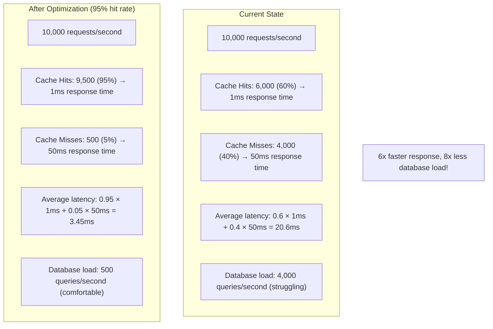

<details>
<summary>ASCII diagram (reference)</summary>

```text
┌─────────────────────────────────────────────────────────────────────────┐
│                    THE OPTIMIZATION PROBLEM                              │
│                                                                          │
│   Current State:                                                         │
│   ┌─────────────────────────────────────────────────────────────────┐   │
│   │   10,000 requests/second                                         │   │
│   │                                                                  │   │
│   │   Cache Hits:  6,000 (60%)  → 1ms response time                 │   │
│   │   Cache Misses: 4,000 (40%) → 50ms response time                │   │
│   │                                                                  │   │
│   │   Average latency: 0.6 × 1ms + 0.4 × 50ms = 20.6ms              │   │
│   │                                                                  │   │
│   │   Database load: 4,000 queries/second (struggling)              │   │
│   └─────────────────────────────────────────────────────────────────┘   │
│                                                                          │
│   After Optimization (95% hit rate):                                    │
│   ┌─────────────────────────────────────────────────────────────────┐   │
│   │   10,000 requests/second                                         │   │
│   │                                                                  │   │
│   │   Cache Hits:  9,500 (95%)  → 1ms response time                 │   │
│   │   Cache Misses:  500 (5%)   → 50ms response time                │   │
│   │                                                                  │   │
│   │   Average latency: 0.95 × 1ms + 0.05 × 50ms = 3.45ms            │   │
│   │                                                                  │   │
│   │   Database load: 500 queries/second (comfortable)               │   │
│   └─────────────────────────────────────────────────────────────────┘   │
│                                                                          │
│   6x faster response, 8x less database load!                            │
└─────────────────────────────────────────────────────────────────────────┘
```
</details>

### Why Optimization Matters

**Every 1% improvement in hit rate**:
- Reduces database load
- Reduces average latency
- Reduces infrastructure costs
- Improves user experience

**The impact is non-linear**: Going from 95% to 99% hit rate is massive.

```
Hit Rate │ DB Queries (per 10K requests) │ Relative DB Load
─────────┼───────────────────────────────┼──────────────────
60%      │ 4,000                         │ 100%
70%      │ 3,000                         │ 75%
80%      │ 2,000                         │ 50%
90%      │ 1,000                         │ 25%
95%      │ 500                           │ 12.5%
99%      │ 100                           │ 2.5%
99.9%    │ 10                            │ 0.25%
```

### Real Examples

**Stack Overflow**: Achieved 99%+ cache hit rate. Serves 1.3 billion page views/month with just 9 web servers.

**Discord**: Optimized their cache to handle 250,000 concurrent users per server. Key: aggressive caching of user presence data.

**Cloudflare**: CDN cache hit rate optimization directly impacts their costs. Every 1% improvement saves millions.

---

## 2️⃣ Intuition and Mental Model

### The Grocery Store Analogy

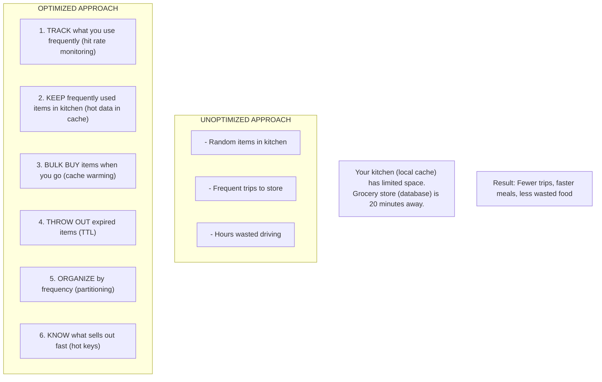

<details>
<summary>ASCII diagram (reference)</summary>

```text
┌─────────────────────────────────────────────────────────────────────────┐
│                    THE GROCERY STORE ANALOGY                             │
│                                                                          │
│   Your kitchen (local cache) has limited space.                         │
│   Grocery store (database) is 20 minutes away.                          │
│                                                                          │
│   UNOPTIMIZED APPROACH:                                                  │
│   - Random items in kitchen                                              │
│   - Frequent trips to store                                              │
│   - Hours wasted driving                                                 │
│                                                                          │
│   OPTIMIZED APPROACH:                                                    │
│   1. TRACK what you use frequently (hit rate monitoring)                │
│   2. KEEP frequently used items in kitchen (hot data in cache)          │
│   3. BULK BUY items when you go (cache warming)                         │
│   4. THROW OUT expired items (TTL)                                      │
│   5. ORGANIZE by frequency (partitioning)                               │
│   6. KNOW what sells out fast (hot keys)                                │
│                                                                          │
│   Result: Fewer trips, faster meals, less wasted food                   │
└─────────────────────────────────────────────────────────────────────────┘
```
</details>

---

## 3️⃣ How It Works Internally

### Cache Optimization Strategies

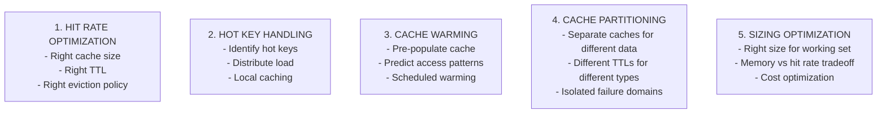

<details>
<summary>ASCII diagram (reference)</summary>

```text
┌─────────────────────────────────────────────────────────────────────────┐
│                    OPTIMIZATION STRATEGIES                               │
│                                                                          │
│   1. HIT RATE OPTIMIZATION                                               │
│      - Right cache size                                                  │
│      - Right TTL                                                         │
│      - Right eviction policy                                             │
│                                                                          │
│   2. HOT KEY HANDLING                                                    │
│      - Identify hot keys                                                 │
│      - Distribute load                                                   │
│      - Local caching                                                     │
│                                                                          │
│   3. CACHE WARMING                                                       │
│      - Pre-populate cache                                                │
│      - Predict access patterns                                           │
│      - Scheduled warming                                                 │
│                                                                          │
│   4. CACHE PARTITIONING                                                  │
│      - Separate caches for different data                               │
│      - Different TTLs for different types                               │
│      - Isolated failure domains                                          │
│                                                                          │
│   5. SIZING OPTIMIZATION                                                 │
│      - Right size for working set                                       │
│      - Memory vs hit rate tradeoff                                      │
│      - Cost optimization                                                 │
└─────────────────────────────────────────────────────────────────────────┘
```
</details>

---

### Strategy 1: Hit Rate Optimization

**Understanding Your Cache Performance**

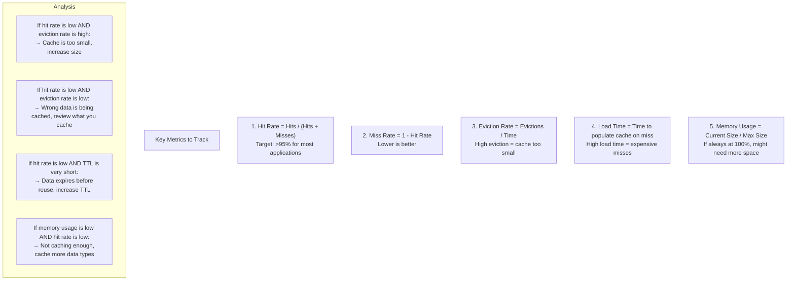

<details>
<summary>ASCII diagram (reference)</summary>

```text
┌─────────────────────────────────────────────────────────────────────────┐
│                    HIT RATE METRICS                                      │
│                                                                          │
│   Key Metrics to Track:                                                  │
│                                                                          │
│   1. Hit Rate = Hits / (Hits + Misses)                                  │
│      Target: >95% for most applications                                 │
│                                                                          │
│   2. Miss Rate = 1 - Hit Rate                                           │
│      Lower is better                                                     │
│                                                                          │
│   3. Eviction Rate = Evictions / Time                                   │
│      High eviction = cache too small                                    │
│                                                                          │
│   4. Load Time = Time to populate cache on miss                         │
│      High load time = expensive misses                                  │
│                                                                          │
│   5. Memory Usage = Current Size / Max Size                             │
│      If always at 100%, might need more space                           │
│                                                                          │
│   Analysis:                                                              │
│   ┌─────────────────────────────────────────────────────────────────┐   │
│   │   If hit rate is low AND eviction rate is high:                  │   │
│   │   → Cache is too small, increase size                            │   │
│   │                                                                  │   │
│   │   If hit rate is low AND eviction rate is low:                   │   │
│   │   → Wrong data is being cached, review what you cache            │   │
│   │                                                                  │   │
│   │   If hit rate is low AND TTL is very short:                      │   │
│   │   → Data expires before reuse, increase TTL                      │   │
│   │                                                                  │   │
│   │   If memory usage is low AND hit rate is low:                    │   │
│   │   → Not caching enough, cache more data types                    │   │
│   └─────────────────────────────────────────────────────────────────┘   │
└─────────────────────────────────────────────────────────────────────────┘
```
</details>

**Optimizing TTL**

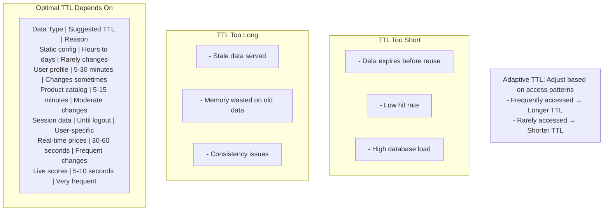

<details>
<summary>ASCII diagram (reference)</summary>

```text
┌─────────────────────────────────────────────────────────────────────────┐
│                    TTL OPTIMIZATION                                      │
│                                                                          │
│   TTL Too Short:                                                         │
│   - Data expires before reuse                                            │
│   - Low hit rate                                                         │
│   - High database load                                                   │
│                                                                          │
│   TTL Too Long:                                                          │
│   - Stale data served                                                    │
│   - Memory wasted on old data                                            │
│   - Consistency issues                                                   │
│                                                                          │
│   Optimal TTL Depends On:                                                │
│   ┌─────────────────────────────────────────────────────────────────┐   │
│   │   Data Type              │ Suggested TTL    │ Reason            │   │
│   │   ───────────────────────┼──────────────────┼─────────────────  │   │
│   │   Static config          │ Hours to days    │ Rarely changes    │   │
│   │   User profile           │ 5-30 minutes     │ Changes sometimes │   │
│   │   Product catalog        │ 5-15 minutes     │ Moderate changes  │   │
│   │   Session data           │ Until logout     │ User-specific     │   │
│   │   Real-time prices       │ 30-60 seconds    │ Frequent changes  │   │
│   │   Live scores            │ 5-10 seconds     │ Very frequent     │   │
│   └─────────────────────────────────────────────────────────────────┘   │
│                                                                          │
│   Adaptive TTL: Adjust based on access patterns                         │
│   - Frequently accessed → Longer TTL                                    │
│   - Rarely accessed → Shorter TTL                                       │
└─────────────────────────────────────────────────────────────────────────┘
```
</details>

---

### Strategy 2: Hot Key Problem and Solutions

**What is a Hot Key?**

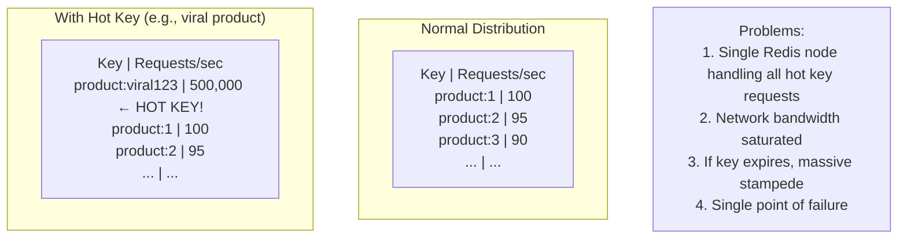

<details>
<summary>ASCII diagram (reference)</summary>

```text
┌─────────────────────────────────────────────────────────────────────────┐
│                    THE HOT KEY PROBLEM                                   │
│                                                                          │
│   Normal Distribution:                                                   │
│   ┌─────────────────────────────────────────────────────────────────┐   │
│   │   Key         │ Requests/sec                                     │   │
│   │   ────────────┼────────────                                     │   │
│   │   product:1   │ 100                                             │   │
│   │   product:2   │ 95                                              │   │
│   │   product:3   │ 90                                              │   │
│   │   ...         │ ...                                             │   │
│   └─────────────────────────────────────────────────────────────────┘   │
│                                                                          │
│   With Hot Key (e.g., viral product):                                   │
│   ┌─────────────────────────────────────────────────────────────────┐   │
│   │   Key               │ Requests/sec                               │   │
│   │   ──────────────────┼────────────                               │   │
│   │   product:viral123  │ 500,000  ← HOT KEY!                       │   │
│   │   product:1         │ 100                                       │   │
│   │   product:2         │ 95                                        │   │
│   │   ...               │ ...                                       │   │
│   └─────────────────────────────────────────────────────────────────┘   │
│                                                                          │
│   Problems:                                                              │
│   1. Single Redis node handling all hot key requests                    │
│   2. Network bandwidth saturated                                         │
│   3. If key expires, massive stampede                                   │
│   4. Single point of failure                                            │
└─────────────────────────────────────────────────────────────────────────┘
```
</details>

**Hot Key Solutions**

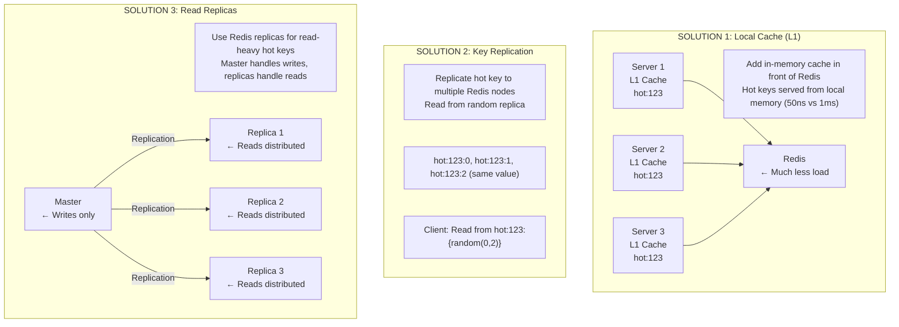

<details>
<summary>ASCII diagram (reference)</summary>

```text
┌─────────────────────────────────────────────────────────────────────────┐
│                    HOT KEY SOLUTIONS                                     │
│                                                                          │
│   SOLUTION 1: Local Cache (L1)                                          │
│   ─────────────────────────────                                         │
│   Add in-memory cache in front of Redis                                 │
│   Hot keys served from local memory (50ns vs 1ms)                       │
│                                                                          │
│   Server 1         Server 2         Server 3                            │
│   ┌──────────┐    ┌──────────┐    ┌──────────┐                         │
│   │ L1 Cache │    │ L1 Cache │    │ L1 Cache │                         │
│   │ hot:123  │    │ hot:123  │    │ hot:123  │                         │
│   └──────────┘    └──────────┘    └──────────┘                         │
│        │              │              │                                   │
│        └──────────────┼──────────────┘                                   │
│                       ▼                                                  │
│               ┌──────────────┐                                          │
│               │    Redis     │  ← Much less load                        │
│               └──────────────┘                                          │
│                                                                          │
│   ─────────────────────────────────────────────────────────────────────  │
│                                                                          │
│   SOLUTION 2: Key Replication                                           │
│   ───────────────────────────                                           │
│   Replicate hot key to multiple Redis nodes                             │
│   Read from random replica                                               │
│                                                                          │
│   hot:123:0, hot:123:1, hot:123:2 (same value)                         │
│                                                                          │
│   Client: Read from hot:123:{random(0,2)}                               │
│                                                                          │
│   ─────────────────────────────────────────────────────────────────────  │
│                                                                          │
│   SOLUTION 3: Read Replicas                                             │
│   ─────────────────────────                                             │
│   Use Redis replicas for read-heavy hot keys                            │
│   Master handles writes, replicas handle reads                          │
│                                                                          │
│              ┌──────────────┐                                           │
│              │    Master    │ ← Writes only                             │
│              └──────┬───────┘                                           │
│                     │ Replication                                        │
│         ┌───────────┼───────────┐                                       │
│         ▼           ▼           ▼                                       │
│   ┌──────────┐ ┌──────────┐ ┌──────────┐                               │
│   │ Replica 1│ │ Replica 2│ │ Replica 3│ ← Reads distributed           │
│   └──────────┘ └──────────┘ └──────────┘                               │
└─────────────────────────────────────────────────────────────────────────┘
```
</details>

---

### Strategy 3: Cache Warming

**What is Cache Warming?**

```mermaid
flowchart TD
    Problem["Problem: Cold cache after deployment or restart"]
    
    subgraph Before["Before Warming"]
        B1["9:00 AM Deploy new version"]
        B2["9:01 AM Cache is empty"]
        B3["9:02 AM Traffic spike, all requests hit database"]
        B4["9:03 AM Database overwhelmed"]
        B5["9:05 AM Site slow or down"]
        B1 --> B2 --> B3 --> B4 --> B5
    end
    
    subgraph After["After Warming"]
        A1["9:00 AM Deploy new version"]
        A2["9:00 AM Cache warming starts (background)"]
        A3["9:01 AM Top 10,000 products pre-loaded"]
        A4["9:02 AM Traffic spike, 95% cache hits"]
        A5["9:03 AM Everything runs smoothly"]
        A1 --> A2 --> A3 --> A4 --> A5
    end
    
    Strategies["Warming Strategies:<br/>1. Pre-deploy warming: Load cache before switching traffic<br/>2. Gradual traffic shift: Slowly increase traffic to new instances<br/>3. Scheduled warming: Pre-load before known traffic spikes<br/>4. On-demand warming: Warm specific keys based on predictions"]
```

<details>
<summary>ASCII diagram (reference)</summary>

```text
┌─────────────────────────────────────────────────────────────────────────┐
│                    CACHE WARMING                                         │
│                                                                          │
│   Problem: Cold cache after deployment or restart                       │
│                                                                          │
│   Before Warming:                                                        │
│   ┌─────────────────────────────────────────────────────────────────┐   │
│   │   9:00 AM  Deploy new version                                    │   │
│   │   9:01 AM  Cache is empty                                        │   │
│   │   9:02 AM  Traffic spike, all requests hit database             │   │
│   │   9:03 AM  Database overwhelmed                                  │   │
│   │   9:05 AM  Site slow or down                                     │   │
│   └─────────────────────────────────────────────────────────────────┘   │
│                                                                          │
│   After Warming:                                                         │
│   ┌─────────────────────────────────────────────────────────────────┐   │
│   │   9:00 AM  Deploy new version                                    │   │
│   │   9:00 AM  Cache warming starts (background)                    │   │
│   │   9:01 AM  Top 10,000 products pre-loaded                       │   │
│   │   9:02 AM  Traffic spike, 95% cache hits                        │   │
│   │   9:03 AM  Everything runs smoothly                             │   │
│   └─────────────────────────────────────────────────────────────────┘   │
│                                                                          │
│   Warming Strategies:                                                    │
│   1. Pre-deploy warming: Load cache before switching traffic           │
│   2. Gradual traffic shift: Slowly increase traffic to new instances   │
│   3. Scheduled warming: Pre-load before known traffic spikes           │
│   4. On-demand warming: Warm specific keys based on predictions        │
└─────────────────────────────────────────────────────────────────────────┘
```
</details>

---

### Strategy 4: Cache Partitioning

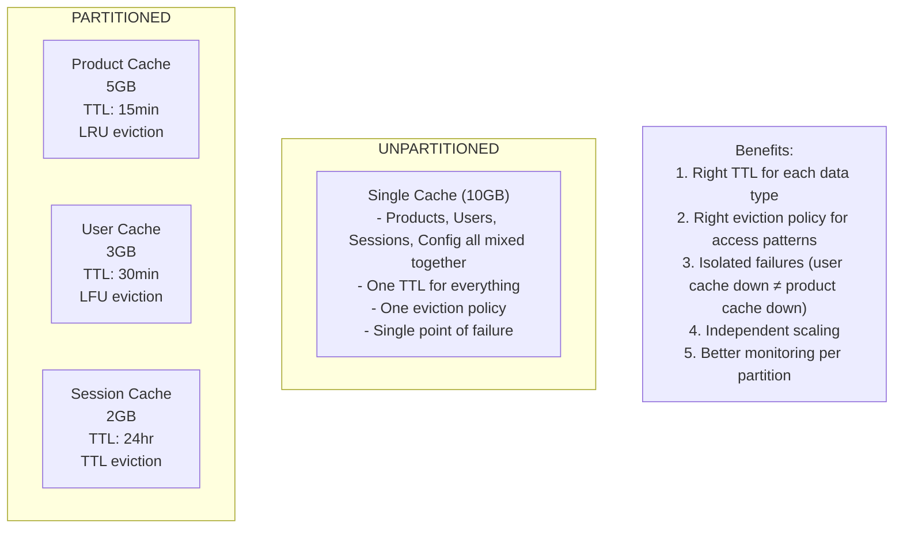

<details>
<summary>ASCII diagram (reference)</summary>

```text
┌─────────────────────────────────────────────────────────────────────────┐
│                    CACHE PARTITIONING                                    │
│                                                                          │
│   Instead of one big cache, use multiple specialized caches             │
│                                                                          │
│   UNPARTITIONED:                                                         │
│   ┌─────────────────────────────────────────────────────────────────┐   │
│   │   Single Cache (10GB)                                            │   │
│   │   - Products, Users, Sessions, Config all mixed together        │   │
│   │   - One TTL for everything                                       │   │
│   │   - One eviction policy                                          │   │
│   │   - Single point of failure                                      │   │
│   └─────────────────────────────────────────────────────────────────┘   │
│                                                                          │
│   PARTITIONED:                                                           │
│   ┌─────────────────────────────────────────────────────────────────┐   │
│   │                                                                  │   │
│   │   ┌───────────────┐  ┌───────────────┐  ┌───────────────┐      │   │
│   │   │ Product Cache │  │  User Cache   │  │ Session Cache │      │   │
│   │   │ 5GB           │  │ 3GB           │  │ 2GB           │      │   │
│   │   │ TTL: 15min    │  │ TTL: 30min    │  │ TTL: 24hr     │      │   │
│   │   │ LRU eviction  │  │ LFU eviction  │  │ TTL eviction  │      │   │
│   │   └───────────────┘  └───────────────┘  └───────────────┘      │   │
│   │                                                                  │   │
│   └─────────────────────────────────────────────────────────────────┘   │
│                                                                          │
│   Benefits:                                                              │
│   1. Right TTL for each data type                                       │
│   2. Right eviction policy for access patterns                          │
│   3. Isolated failures (user cache down ≠ product cache down)          │
│   4. Independent scaling                                                 │
│   5. Better monitoring per partition                                    │
└─────────────────────────────────────────────────────────────────────────┘
```
</details>

---

### Strategy 5: Cache Sizing

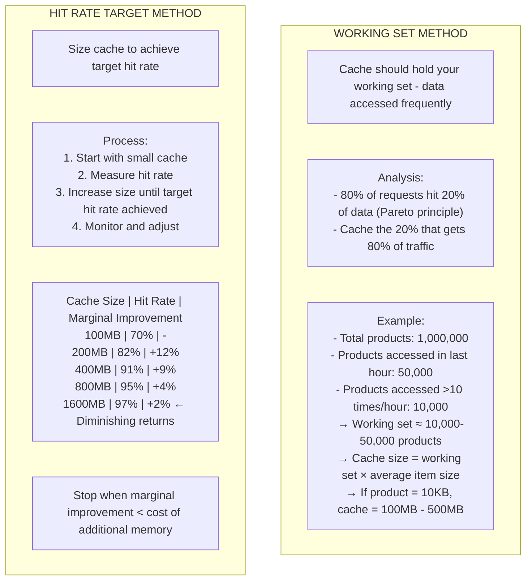

<details>
<summary>ASCII diagram (reference)</summary>

```text
┌─────────────────────────────────────────────────────────────────────────┐
│                    CACHE SIZING STRATEGIES                               │
│                                                                          │
│   WORKING SET METHOD:                                                    │
│   ─────────────────────                                                 │
│   Cache should hold your "working set" - data accessed frequently       │
│                                                                          │
│   Analysis:                                                              │
│   - 80% of requests hit 20% of data (Pareto principle)                 │
│   - Cache the 20% that gets 80% of traffic                             │
│                                                                          │
│   Example:                                                               │
│   - Total products: 1,000,000                                           │
│   - Products accessed in last hour: 50,000                              │
│   - Products accessed >10 times/hour: 10,000                            │
│   → Working set ≈ 10,000-50,000 products                                │
│   → Cache size = working set × average item size                        │
│   → If product = 10KB, cache = 100MB - 500MB                            │
│                                                                          │
│   ─────────────────────────────────────────────────────────────────────  │
│                                                                          │
│   HIT RATE TARGET METHOD:                                                │
│   ─────────────────────────                                             │
│   Size cache to achieve target hit rate                                 │
│                                                                          │
│   Process:                                                               │
│   1. Start with small cache                                             │
│   2. Measure hit rate                                                    │
│   3. Increase size until target hit rate achieved                       │
│   4. Monitor and adjust                                                  │
│                                                                          │
│   Cache Size │ Hit Rate │ Marginal Improvement                          │
│   ───────────┼──────────┼───────────────────                            │
│   100MB      │ 70%      │ -                                             │
│   200MB      │ 82%      │ +12%                                          │
│   400MB      │ 91%      │ +9%                                           │
│   800MB      │ 95%      │ +4%                                           │
│   1600MB     │ 97%      │ +2%  ← Diminishing returns                    │
│                                                                          │
│   Stop when marginal improvement < cost of additional memory            │
└─────────────────────────────────────────────────────────────────────────┘
```
</details>

---

## 4️⃣ Simulation-First Explanation

### Scenario: Optimizing an E-commerce Product Cache

**Initial State** (Unoptimized):

```
Configuration:
- Cache size: 1GB
- TTL: 1 hour (fixed for all)
- Eviction: Random
- No warming
- No partitioning

Metrics:
- Hit rate: 65%
- Average latency: 25ms
- Database queries: 3,500/sec

Analysis:
─────────────────────────────────────────────────────────────────────────
Problem 1: Random eviction removing hot products
Problem 2: 1-hour TTL too long for inventory (stale counts)
Problem 3: 1-hour TTL too short for descriptions (unnecessary refreshes)
Problem 4: No local caching for super-hot products
Problem 5: Cold cache after daily deployment
```

**After Optimization**:

```
Changes Applied:
─────────────────────────────────────────────────────────────────────────
1. Partitioned cache:
   - Product details: 500MB, TTL 30min, LFU eviction
   - Inventory counts: 200MB, TTL 30sec, LRU eviction
   - Product images URLs: 300MB, TTL 24hr, LRU eviction

2. Added L1 local cache:
   - Top 1000 products cached locally (Caffeine)
   - 1-minute TTL
   - Handles hot products

3. Switched to LFU eviction:
   - Keeps frequently accessed products
   - Removes one-time lookups

4. Added cache warming:
   - Pre-load top 10,000 products after deployment
   - Pre-load seasonal products before sales

5. Hot key detection:
   - Monitor request rates per key
   - Auto-replicate keys with >10K requests/min

Results:
─────────────────────────────────────────────────────────────────────────
- Hit rate: 65% → 94%
- Average latency: 25ms → 4ms
- Database queries: 3,500/sec → 600/sec

Impact:
- 6x faster response times
- 83% reduction in database load
- Better handling of traffic spikes
```

---

## 5️⃣ How Engineers Actually Use This in Production

### Stack Overflow's Optimization

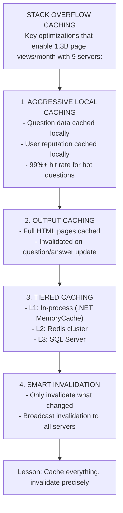

<details>
<summary>ASCII diagram (reference)</summary>

```text
┌─────────────────────────────────────────────────────────────────────────┐
│                    STACK OVERFLOW CACHING                                │
│                                                                          │
│   Key optimizations that enable 1.3B page views/month with 9 servers:  │
│                                                                          │
│   1. AGGRESSIVE LOCAL CACHING                                           │
│      - Question data cached locally                                      │
│      - User reputation cached locally                                    │
│      - 99%+ hit rate for hot questions                                  │
│                                                                          │
│   2. OUTPUT CACHING                                                      │
│      - Full HTML pages cached                                            │
│      - Invalidated on question/answer update                            │
│                                                                          │
│   3. TIERED CACHING                                                      │
│      - L1: In-process (.NET MemoryCache)                                │
│      - L2: Redis cluster                                                 │
│      - L3: SQL Server                                                    │
│                                                                          │
│   4. SMART INVALIDATION                                                  │
│      - Only invalidate what changed                                      │
│      - Broadcast invalidation to all servers                            │
│                                                                          │
│   Lesson: Cache everything, invalidate precisely                        │
└─────────────────────────────────────────────────────────────────────────┘
```
</details>

### Netflix's Caching Optimization

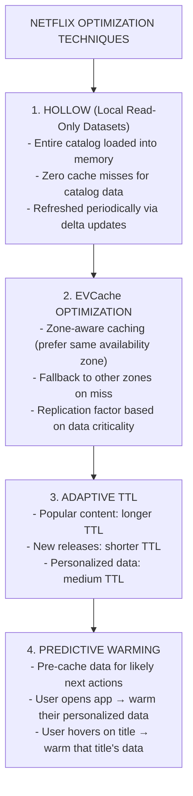

<details>
<summary>ASCII diagram (reference)</summary>

```text
┌─────────────────────────────────────────────────────────────────────────┐
│                    NETFLIX OPTIMIZATION TECHNIQUES                       │
│                                                                          │
│   1. HOLLOW (Local Read-Only Datasets)                                  │
│      - Entire catalog loaded into memory                                │
│      - Zero cache misses for catalog data                               │
│      - Refreshed periodically via delta updates                         │
│                                                                          │
│   2. EVCache OPTIMIZATION                                                │
│      - Zone-aware caching (prefer same availability zone)               │
│      - Fallback to other zones on miss                                  │
│      - Replication factor based on data criticality                     │
│                                                                          │
│   3. ADAPTIVE TTL                                                        │
│      - Popular content: longer TTL                                      │
│      - New releases: shorter TTL                                        │
│      - Personalized data: medium TTL                                    │
│                                                                          │
│   4. PREDICTIVE WARMING                                                  │
│      - Pre-cache data for likely next actions                           │
│      - User opens app → warm their personalized data                   │
│      - User hovers on title → warm that title's data                   │
└─────────────────────────────────────────────────────────────────────────┘
```
</details>

---

## 6️⃣ How to Implement Cache Optimization in Java

### Cache Metrics Collection

```java
// CacheMetricsCollector.java
package com.example.cache.optimization;

import io.micrometer.core.instrument.MeterRegistry;
import io.micrometer.core.instrument.Timer;
import io.micrometer.core.instrument.Counter;
import lombok.RequiredArgsConstructor;
import org.springframework.stereotype.Component;

import java.util.concurrent.TimeUnit;
import java.util.function.Supplier;

/**
 * Collects cache metrics for monitoring and optimization
 */
@Component
@RequiredArgsConstructor
public class CacheMetricsCollector {

    private final MeterRegistry meterRegistry;

    /**
     * Record a cache hit
     */
    public void recordHit(String cacheName) {
        Counter.builder("cache.hits")
            .tag("cache", cacheName)
            .register(meterRegistry)
            .increment();
    }

    /**
     * Record a cache miss
     */
    public void recordMiss(String cacheName) {
        Counter.builder("cache.misses")
            .tag("cache", cacheName)
            .register(meterRegistry)
            .increment();
    }

    /**
     * Record cache operation latency
     */
    public <T> T recordLatency(String cacheName, String operation, Supplier<T> supplier) {
        Timer timer = Timer.builder("cache.latency")
            .tag("cache", cacheName)
            .tag("operation", operation)
            .register(meterRegistry);
        
        return timer.record(supplier);
    }

    /**
     * Record eviction
     */
    public void recordEviction(String cacheName, String reason) {
        Counter.builder("cache.evictions")
            .tag("cache", cacheName)
            .tag("reason", reason)
            .register(meterRegistry)
            .increment();
    }

    /**
     * Record cache size
     */
    public void recordSize(String cacheName, long size) {
        meterRegistry.gauge("cache.size", 
            io.micrometer.core.instrument.Tags.of("cache", cacheName), 
            size);
    }
}
```

### Hot Key Detection

```java
// HotKeyDetector.java
package com.example.cache.optimization;

import com.github.benmanes.caffeine.cache.Cache;
import com.github.benmanes.caffeine.cache.Caffeine;
import lombok.extern.slf4j.Slf4j;
import org.springframework.scheduling.annotation.Scheduled;
import org.springframework.stereotype.Component;

import java.time.Duration;
import java.util.*;
import java.util.concurrent.ConcurrentHashMap;
import java.util.concurrent.atomic.AtomicLong;

/**
 * Detects hot keys that need special handling
 */
@Component
@Slf4j
public class HotKeyDetector {

    // Track request counts per key
    private final Cache<String, AtomicLong> requestCounts;
    
    // Threshold for "hot" classification (requests per minute)
    private static final long HOT_THRESHOLD = 10_000;
    
    // Currently identified hot keys
    private final Set<String> hotKeys = ConcurrentHashMap.newKeySet();

    public HotKeyDetector() {
        this.requestCounts = Caffeine.newBuilder()
            .expireAfterWrite(Duration.ofMinutes(1))
            .maximumSize(100_000)
            .build();
    }

    /**
     * Record access to a key
     */
    public void recordAccess(String key) {
        AtomicLong count = requestCounts.get(key, k -> new AtomicLong(0));
        long currentCount = count.incrementAndGet();
        
        // Check if newly hot
        if (currentCount >= HOT_THRESHOLD && !hotKeys.contains(key)) {
            hotKeys.add(key);
            log.warn("Hot key detected: {} ({} requests/min)", key, currentCount);
            onHotKeyDetected(key);
        }
    }

    /**
     * Check if a key is hot
     */
    public boolean isHotKey(String key) {
        return hotKeys.contains(key);
    }

    /**
     * Get all current hot keys
     */
    public Set<String> getHotKeys() {
        return Collections.unmodifiableSet(hotKeys);
    }

    /**
     * Periodic cleanup of hot keys that are no longer hot
     */
    @Scheduled(fixedRate = 60000)  // Every minute
    public void cleanupColdKeys() {
        Iterator<String> iterator = hotKeys.iterator();
        while (iterator.hasNext()) {
            String key = iterator.next();
            AtomicLong count = requestCounts.getIfPresent(key);
            
            if (count == null || count.get() < HOT_THRESHOLD) {
                iterator.remove();
                log.info("Key no longer hot: {}", key);
                onHotKeyCooled(key);
            }
        }
    }

    /**
     * Hook for when a key becomes hot
     */
    protected void onHotKeyDetected(String key) {
        // Override to add custom handling
        // e.g., replicate key, add to local cache, alert ops
    }

    /**
     * Hook for when a key cools down
     */
    protected void onHotKeyCooled(String key) {
        // Override to clean up hot key handling
    }
}
```

### Cache Warming Service

```java
// CacheWarmingService.java
package com.example.cache.optimization;

import lombok.RequiredArgsConstructor;
import lombok.extern.slf4j.Slf4j;
import org.springframework.boot.context.event.ApplicationReadyEvent;
import org.springframework.context.event.EventListener;
import org.springframework.data.redis.core.RedisTemplate;
import org.springframework.scheduling.annotation.Async;
import org.springframework.scheduling.annotation.Scheduled;
import org.springframework.stereotype.Service;

import java.time.Duration;
import java.util.List;

/**
 * Warms cache on startup and before predicted traffic spikes
 */
@Service
@RequiredArgsConstructor
@Slf4j
public class CacheWarmingService {

    private final RedisTemplate<String, Object> redisTemplate;
    private final ProductRepository productRepository;
    private final AnalyticsService analyticsService;

    /**
     * Warm cache on application startup
     */
    @EventListener(ApplicationReadyEvent.class)
    @Async
    public void warmOnStartup() {
        log.info("Starting cache warming on startup");
        
        long start = System.currentTimeMillis();
        
        // Warm top products
        warmTopProducts(10_000);
        
        // Warm featured products
        warmFeaturedProducts();
        
        // Warm category data
        warmCategories();
        
        long duration = System.currentTimeMillis() - start;
        log.info("Cache warming completed in {}ms", duration);
    }

    /**
     * Warm top products by popularity
     */
    public void warmTopProducts(int count) {
        log.info("Warming top {} products", count);
        
        List<Long> topProductIds = analyticsService.getTopProductIds(count);
        
        int warmed = 0;
        for (Long productId : topProductIds) {
            try {
                Product product = productRepository.findById(productId).orElse(null);
                if (product != null) {
                    String key = "product:" + productId;
                    redisTemplate.opsForValue().set(key, product, Duration.ofMinutes(30));
                    warmed++;
                }
            } catch (Exception e) {
                log.warn("Failed to warm product {}: {}", productId, e.getMessage());
            }
        }
        
        log.info("Warmed {}/{} top products", warmed, count);
    }

    /**
     * Warm featured/promoted products
     */
    public void warmFeaturedProducts() {
        List<Product> featured = productRepository.findFeaturedProducts();
        
        for (Product product : featured) {
            String key = "product:" + product.getId();
            redisTemplate.opsForValue().set(key, product, Duration.ofHours(1));
        }
        
        log.info("Warmed {} featured products", featured.size());
    }

    /**
     * Warm category data
     */
    public void warmCategories() {
        List<Category> categories = categoryRepository.findAll();
        
        for (Category category : categories) {
            String key = "category:" + category.getId();
            redisTemplate.opsForValue().set(key, category, Duration.ofHours(24));
        }
        
        log.info("Warmed {} categories", categories.size());
    }

    /**
     * Scheduled warming before known traffic spike (e.g., 9 AM)
     */
    @Scheduled(cron = "0 45 8 * * *")  // 8:45 AM daily
    public void warmBeforeMorningSpike() {
        log.info("Pre-warming cache before morning traffic spike");
        warmTopProducts(50_000);
    }

    /**
     * Warm specific products (e.g., for flash sale)
     */
    public void warmForFlashSale(List<Long> productIds) {
        log.info("Warming {} products for flash sale", productIds.size());
        
        for (Long productId : productIds) {
            Product product = productRepository.findById(productId).orElse(null);
            if (product != null) {
                String key = "product:" + productId;
                // Longer TTL for sale products
                redisTemplate.opsForValue().set(key, product, Duration.ofHours(2));
            }
        }
    }
}
```

### Partitioned Cache Configuration

```java
// PartitionedCacheConfig.java
package com.example.cache.optimization;

import com.github.benmanes.caffeine.cache.Caffeine;
import org.springframework.cache.CacheManager;
import org.springframework.cache.caffeine.CaffeineCache;
import org.springframework.cache.support.SimpleCacheManager;
import org.springframework.context.annotation.Bean;
import org.springframework.context.annotation.Configuration;

import java.time.Duration;
import java.util.List;

/**
 * Configures partitioned caches with different settings
 */
@Configuration
public class PartitionedCacheConfig {

    @Bean
    public CacheManager cacheManager() {
        SimpleCacheManager cacheManager = new SimpleCacheManager();
        
        cacheManager.setCaches(List.of(
            // Product details: Moderate TTL, LFU for popular items
            createCache("products", 10_000, Duration.ofMinutes(15)),
            
            // Inventory: Short TTL for accuracy
            createCache("inventory", 50_000, Duration.ofSeconds(30)),
            
            // User profiles: Medium TTL
            createCache("users", 20_000, Duration.ofMinutes(30)),
            
            // Sessions: Long TTL, until logout
            createCache("sessions", 100_000, Duration.ofHours(24)),
            
            // Config: Very long TTL, rarely changes
            createCache("config", 1_000, Duration.ofHours(1)),
            
            // Hot keys: Short TTL, high volume
            createCache("hotkeys", 1_000, Duration.ofMinutes(1))
        ));
        
        return cacheManager;
    }

    private CaffeineCache createCache(String name, int maxSize, Duration ttl) {
        return new CaffeineCache(name,
            Caffeine.newBuilder()
                .maximumSize(maxSize)
                .expireAfterWrite(ttl)
                .recordStats()
                .build()
        );
    }
}
```

### Adaptive TTL Implementation

```java
// AdaptiveTtlCache.java
package com.example.cache.optimization;

import lombok.extern.slf4j.Slf4j;
import org.springframework.data.redis.core.RedisTemplate;
import org.springframework.stereotype.Service;

import java.time.Duration;
import java.util.concurrent.ConcurrentHashMap;
import java.util.concurrent.atomic.AtomicInteger;

/**
 * Cache with adaptive TTL based on access frequency
 */
@Service
@Slf4j
public class AdaptiveTtlCache<V> {

    private final RedisTemplate<String, V> redisTemplate;
    
    // Track access counts
    private final ConcurrentHashMap<String, AtomicInteger> accessCounts = new ConcurrentHashMap<>();
    
    // TTL configuration
    private static final Duration BASE_TTL = Duration.ofMinutes(5);
    private static final Duration MIN_TTL = Duration.ofMinutes(1);
    private static final Duration MAX_TTL = Duration.ofHours(1);
    
    // Access thresholds
    private static final int HIGH_ACCESS_THRESHOLD = 100;  // per minute
    private static final int LOW_ACCESS_THRESHOLD = 10;

    public AdaptiveTtlCache(RedisTemplate<String, V> redisTemplate) {
        this.redisTemplate = redisTemplate;
    }

    /**
     * Get value and track access
     */
    public V get(String key) {
        trackAccess(key);
        return redisTemplate.opsForValue().get(key);
    }

    /**
     * Put value with adaptive TTL
     */
    public void put(String key, V value) {
        Duration ttl = calculateTtl(key);
        redisTemplate.opsForValue().set(key, value, ttl);
        log.debug("Cached {} with adaptive TTL of {} seconds", key, ttl.getSeconds());
    }

    /**
     * Track access for a key
     */
    private void trackAccess(String key) {
        accessCounts.computeIfAbsent(key, k -> new AtomicInteger(0)).incrementAndGet();
    }

    /**
     * Calculate TTL based on access frequency
     */
    private Duration calculateTtl(String key) {
        AtomicInteger count = accessCounts.get(key);
        if (count == null) {
            return BASE_TTL;
        }
        
        int accessCount = count.get();
        
        if (accessCount >= HIGH_ACCESS_THRESHOLD) {
            // Frequently accessed: longer TTL
            return MAX_TTL;
        } else if (accessCount <= LOW_ACCESS_THRESHOLD) {
            // Rarely accessed: shorter TTL (don't waste memory)
            return MIN_TTL;
        } else {
            // Linear interpolation between min and max
            double ratio = (double) (accessCount - LOW_ACCESS_THRESHOLD) / 
                          (HIGH_ACCESS_THRESHOLD - LOW_ACCESS_THRESHOLD);
            long ttlSeconds = (long) (MIN_TTL.getSeconds() + 
                             ratio * (MAX_TTL.getSeconds() - MIN_TTL.getSeconds()));
            return Duration.ofSeconds(ttlSeconds);
        }
    }

    /**
     * Reset access counts periodically (call from scheduled task)
     */
    public void resetAccessCounts() {
        accessCounts.clear();
        log.debug("Reset access counts for adaptive TTL");
    }
}
```

---

## 7️⃣ Tradeoffs, Pitfalls, and Common Mistakes

### Common Optimization Mistakes

**1. Over-Caching**
```java
// WRONG: Cache everything, even rarely accessed data
public User getUser(Long id) {
    return cache.get("user:" + id, () -> userRepository.findById(id));
}
// 99% of users accessed once per month, wasting memory

// RIGHT: Only cache hot data
public User getUser(Long id) {
    if (isFrequentlyAccessed(id)) {
        return cache.get("user:" + id, () -> userRepository.findById(id));
    }
    return userRepository.findById(id);
}
```

**2. Cache Too Large**
```java
// WRONG: Huge cache eating all memory
.maximumSize(10_000_000)  // 10 million items

// RIGHT: Size based on working set + budget
.maximumSize(100_000)     // Fits in heap comfortably
// Or use weight-based sizing
.maximumWeight(500_000_000)  // 500MB
```

**3. Ignoring Hit Rate Metrics**
```java
// WRONG: No monitoring
Cache<String, Object> cache = Caffeine.newBuilder().build();

// RIGHT: Enable stats and monitor
Cache<String, Object> cache = Caffeine.newBuilder()
    .recordStats()
    .build();

// Check periodically
CacheStats stats = cache.stats();
if (stats.hitRate() < 0.8) {
    alert("Cache hit rate below 80%: " + stats.hitRate());
}
```

---

## 8️⃣ When NOT to Optimize

- **Premature optimization**: Don't optimize before you have metrics
- **Low-traffic systems**: Simple caching is sufficient
- **Frequently changing data**: Optimization effort wasted if data changes constantly
- **When cost > benefit**: Don't spend engineering time for marginal gains

---

## 9️⃣ Interview Follow-Up Questions WITH Answers

### L4 Questions

**Q: How do you improve cache hit rate?**

A: Several strategies: (1) Increase cache size to fit more of the working set. (2) Use appropriate TTL, not too short or too long. (3) Use smart eviction policies like LFU that keep frequently accessed items. (4) Add cache warming to pre-populate on startup. (5) Use multi-level caching with L1 local cache for hot data. Monitor hit rate continuously and adjust.

### L5 Questions

**Q: How would you handle a hot key problem?**

A: First, detect hot keys by monitoring per-key request rates. Then apply solutions: (1) Add local L1 cache to serve hot keys without hitting Redis. (2) Replicate the hot key across multiple Redis keys and read randomly. (3) Use Redis read replicas. (4) Extend TTL for hot keys to prevent stampede on expiration. For prediction, analyze access patterns and pre-warm keys expected to become hot.

### L6 Questions

**Q: Design a cache optimization strategy for a flash sale with 1M concurrent users.**

A: Pre-sale: (1) Identify all sale products and warm them hours before. (2) Set extended TTLs for sale products. (3) Deploy additional Redis read replicas. (4) Pre-scale application servers. During sale: (1) Use local L1 cache aggressively for product details. (2) Replicate the hottest product keys. (3) Use probabilistic early refresh to prevent synchronized expiration. (4) Monitor hot keys in real-time and auto-replicate. (5) Have circuit breakers to handle Redis overload. Post-sale: (1) Gradually reduce TTLs. (2) Scale down replicas. (3) Analyze metrics for next time.

---

## 🔟 One Clean Mental Summary

Cache optimization maximizes hit rate while minimizing resource usage. Monitor metrics (hit rate, eviction rate, latency) to guide decisions. Key strategies: right-size your cache for the working set, use appropriate TTLs per data type, implement LFU eviction for frequency-based access patterns, warm cache before known traffic spikes, use local L1 cache for hot keys, and partition caches by data type. Detect and handle hot keys specially. The goal is 95%+ hit rate with efficient memory usage. Always measure before and after optimization to prove value.

