# ⚔️ Memcached vs Redis

---

## 0️⃣ Prerequisites

Before diving into Memcached vs Redis comparison, you need to understand:

- **In-Memory Caching**: Storing data in RAM for fast access. Both Memcached and Redis do this.
- **Key-Value Store**: A database where you store and retrieve data using unique keys.
- **Redis Basics**: Data structures, persistence, clustering. Covered in Topic 3.
- **Distributed Systems**: Multiple servers working together.

If you understand that both are in-memory caches but have different features and tradeoffs, you're ready.

---

## 1️⃣ What Problem Does This Exist to Solve?

### The Pain Point

You need a distributed cache. You've heard of both Memcached and Redis. Which one should you choose?

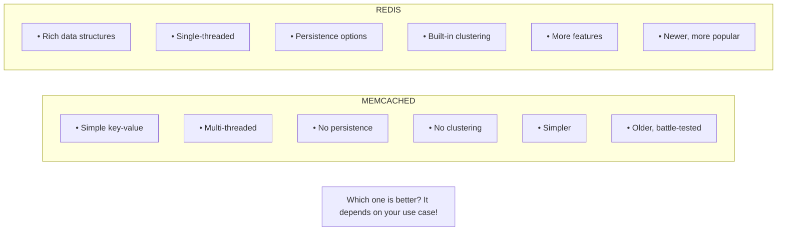

<details>
<summary>ASCII diagram (reference)</summary>

```text
┌─────────────────────────────────────────────────────────────────────────┐
│                    THE CHOICE                                            │
│                                                                          │
│   MEMCACHED                              REDIS                           │
│   ┌─────────────────────────┐           ┌─────────────────────────┐     │
│   │ • Simple key-value      │           │ • Rich data structures  │     │
│   │ • Multi-threaded        │           │ • Single-threaded       │     │
│   │ • No persistence        │           │ • Persistence options   │     │
│   │ • No clustering         │           │ • Built-in clustering   │     │
│   │ • Simpler               │           │ • More features         │     │
│   │ • Older, battle-tested  │           │ • Newer, more popular   │     │
│   └─────────────────────────┘           └─────────────────────────┘     │
│                                                                          │
│   Which one is "better"? It depends on your use case!                   │
└─────────────────────────────────────────────────────────────────────────┘
```
</details>

### Brief History

**Memcached (2003)**:
- Created by Brad Fitzpatrick for LiveJournal
- Designed to solve one problem: caching database queries
- Simple, fast, focused

**Redis (2009)**:
- Created by Salvatore Sanfilippo
- Started as a project to improve real-time analytics
- Evolved into a "data structure server"
- More features, more use cases

### Why Both Still Exist

Both have survived because they excel at different things:
- **Memcached**: When you need simple, blazing-fast caching
- **Redis**: When you need rich features and data structures

---

## 2️⃣ Intuition and Mental Model

### The Tool Analogy

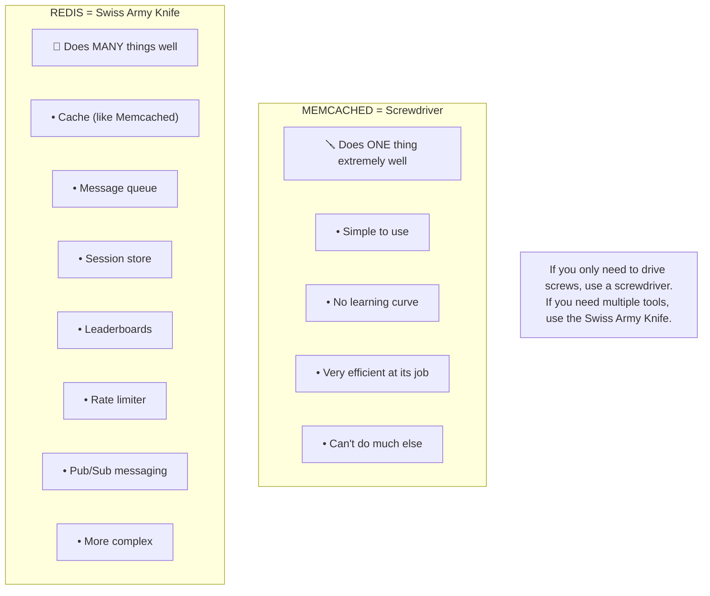

<details>
<summary>ASCII diagram (reference)</summary>

```text
┌─────────────────────────────────────────────────────────────────────────┐
│                    THE TOOL ANALOGY                                      │
│                                                                          │
│   MEMCACHED = Screwdriver                                               │
│   ┌─────────────────────────────────────────────────────────────────┐   │
│   │                                                                  │   │
│   │   🪛 Does ONE thing extremely well                              │   │
│   │   • Simple to use                                                │   │
│   │   • No learning curve                                            │   │
│   │   • Very efficient at its job                                    │   │
│   │   • Can't do much else                                           │   │
│   │                                                                  │   │
│   └─────────────────────────────────────────────────────────────────┘   │
│                                                                          │
│   REDIS = Swiss Army Knife                                              │
│   ┌─────────────────────────────────────────────────────────────────┐   │
│   │                                                                  │   │
│   │   🔧 Does MANY things well                                      │   │
│   │   • Cache (like Memcached)                                       │   │
│   │   • Message queue                                                │   │
│   │   • Session store                                                │   │
│   │   • Leaderboards                                                 │   │
│   │   • Rate limiter                                                 │   │
│   │   • Pub/Sub messaging                                            │   │
│   │   • More complex                                                 │   │
│   │                                                                  │   │
│   └─────────────────────────────────────────────────────────────────┘   │
│                                                                          │
│   If you only need to drive screws, use a screwdriver.                 │
│   If you need multiple tools, use the Swiss Army Knife.                │
└─────────────────────────────────────────────────────────────────────────┘
```
</details>

---

## 3️⃣ How It Works Internally

### Architecture Comparison

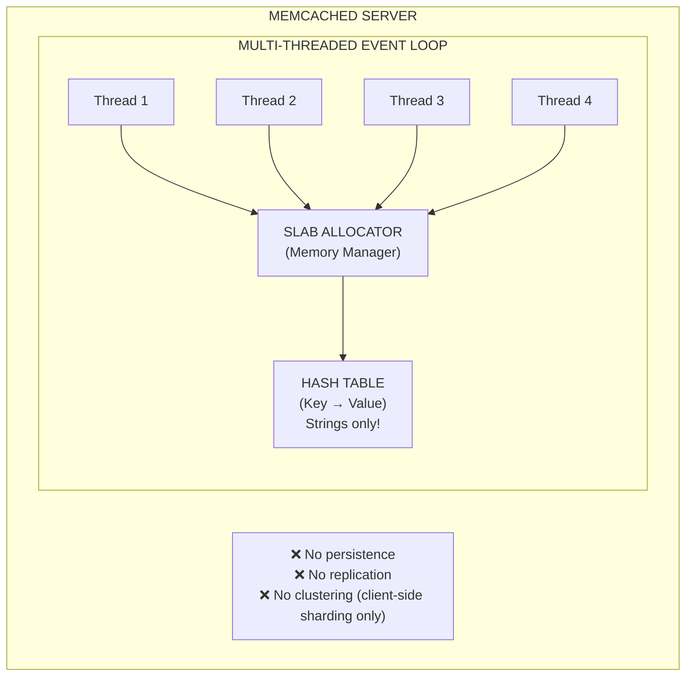

<details>
<summary>ASCII diagram (reference)</summary>

```text
┌─────────────────────────────────────────────────────────────────────────┐
│                    MEMCACHED ARCHITECTURE                                │
│                                                                          │
│   ┌─────────────────────────────────────────────────────────────────┐   │
│   │                     MEMCACHED SERVER                             │   │
│   │                                                                  │   │
│   │   ┌─────────────────────────────────────────────────────────┐   │   │
│   │   │              MULTI-THREADED EVENT LOOP                   │   │   │
│   │   │                                                          │   │   │
│   │   │   Thread 1    Thread 2    Thread 3    Thread 4          │   │   │
│   │   │      │           │           │           │               │   │   │
│   │   │      └───────────┴───────────┴───────────┘               │   │   │
│   │   │                      │                                    │   │   │
│   │   │                      ▼                                    │   │   │
│   │   │           ┌─────────────────────┐                        │   │   │
│   │   │           │   SLAB ALLOCATOR    │                        │   │   │
│   │   │           │   (Memory Manager)  │                        │   │   │
│   │   │           └─────────────────────┘                        │   │   │
│   │   │                      │                                    │   │   │
│   │   │                      ▼                                    │   │   │
│   │   │           ┌─────────────────────┐                        │   │   │
│   │   │           │    HASH TABLE       │                        │   │   │
│   │   │           │   (Key → Value)     │                        │   │   │
│   │   │           │   Strings only!     │                        │   │   │
│   │   │           └─────────────────────┘                        │   │   │
│   │   └─────────────────────────────────────────────────────────┘   │   │
│   │                                                                  │   │
│   │   ❌ No persistence                                              │   │
│   │   ❌ No replication                                              │   │
│   │   ❌ No clustering (client-side sharding only)                  │   │
│   │                                                                  │   │
│   └─────────────────────────────────────────────────────────────────┘   │
└─────────────────────────────────────────────────────────────────────────┘
```
</details>

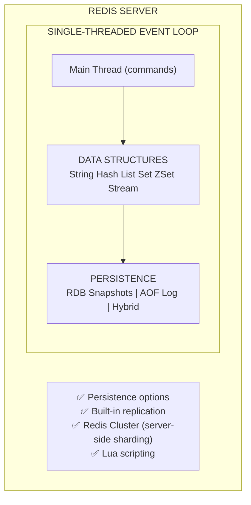

<details>
<summary>ASCII diagram (reference)</summary>

```text
┌─────────────────────────────────────────────────────────────────────────┐
│                    REDIS ARCHITECTURE                                    │
│                                                                          │
│   ┌─────────────────────────────────────────────────────────────────┐   │
│   │                       REDIS SERVER                               │   │
│   │                                                                  │   │
│   │   ┌─────────────────────────────────────────────────────────┐   │   │
│   │   │            SINGLE-THREADED EVENT LOOP                    │   │   │
│   │   │                                                          │   │   │
│   │   │   Main Thread (commands)                                 │   │   │
│   │   │        │                                                  │   │   │
│   │   │        ▼                                                  │   │   │
│   │   │   ┌─────────────────────────────────────────────────┐   │   │   │
│   │   │   │              DATA STRUCTURES                     │   │   │   │
│   │   │   │                                                  │   │   │   │
│   │   │   │   String   Hash   List   Set   ZSet   Stream    │   │   │   │
│   │   │   │                                                  │   │   │   │
│   │   │   └─────────────────────────────────────────────────┘   │   │   │
│   │   │        │                                                  │   │   │
│   │   │        ▼                                                  │   │   │
│   │   │   ┌─────────────────────────────────────────────────┐   │   │   │
│   │   │   │              PERSISTENCE                         │   │   │   │
│   │   │   │   RDB Snapshots  │  AOF Log  │  Hybrid          │   │   │   │
│   │   │   └─────────────────────────────────────────────────┘   │   │   │
│   │   └─────────────────────────────────────────────────────────┘   │   │
│   │                                                                  │   │
│   │   ✅ Persistence options                                         │   │
│   │   ✅ Built-in replication                                        │   │
│   │   ✅ Redis Cluster (server-side sharding)                       │   │
│   │   ✅ Lua scripting                                               │   │
│   │                                                                  │   │
│   └─────────────────────────────────────────────────────────────────┘   │
└─────────────────────────────────────────────────────────────────────────┘
```
</details>
```

### Threading Model

**Memcached: Multi-threaded**
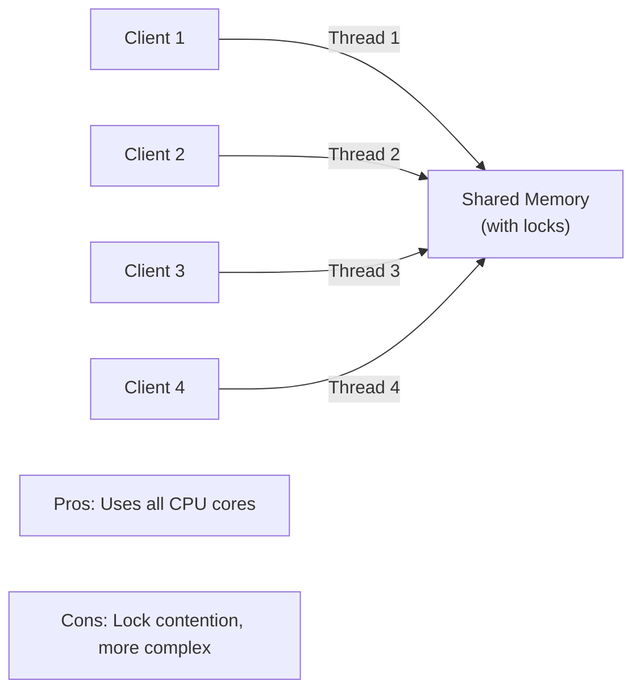

<details>
<summary>ASCII diagram (reference)</summary>

```text
┌─────────────────────────────────────────────────────────────────────────┐
│   Client 1 ──────▶ Thread 1 ──┐                                         │
│   Client 2 ──────▶ Thread 2 ──┼──▶ Shared Memory (with locks)          │
│   Client 3 ──────▶ Thread 3 ──┤                                         │
│   Client 4 ──────▶ Thread 4 ──┘                                         │
│                                                                          │
│   Pros: Uses all CPU cores                                              │
│   Cons: Lock contention, more complex                                   │
└─────────────────────────────────────────────────────────────────────────┘
```
</details>

**Redis: Single-threaded (mostly)**
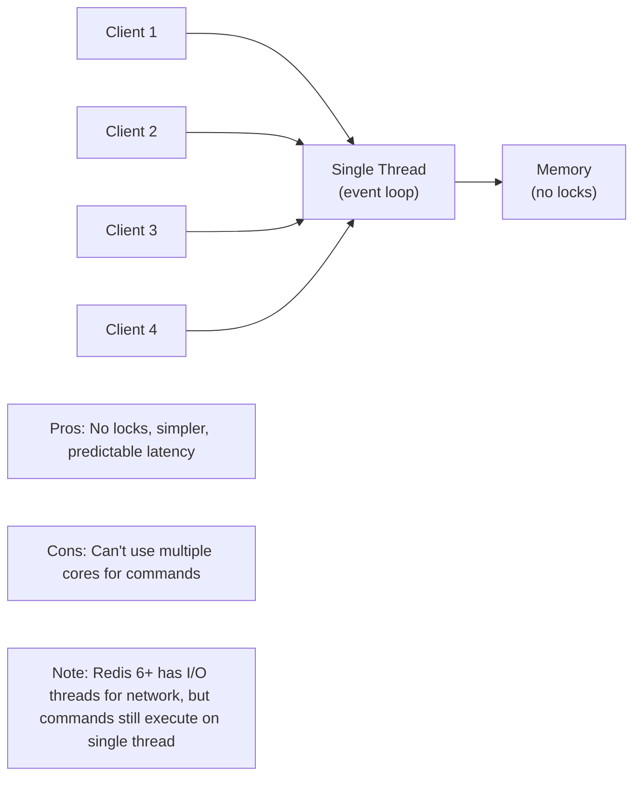

<details>
<summary>ASCII diagram (reference)</summary>

```text
┌─────────────────────────────────────────────────────────────────────────┐
│   Client 1 ──┐                                                          │
│   Client 2 ──┼──▶ Single Thread (event loop) ──▶ Memory (no locks)     │
│   Client 3 ──┤                                                          │
│   Client 4 ──┘                                                          │
│                                                                          │
│   Pros: No locks, simpler, predictable latency                         │
│   Cons: Can't use multiple cores for commands                          │
│                                                                          │
│   Note: Redis 6+ has I/O threads for network, but commands still       │
│         execute on single thread                                        │
└─────────────────────────────────────────────────────────────────────────┘
```
</details>

### Memory Management

**Memcached: Slab Allocator**
```mermaid
flowchart TD
    Title["Memory divided into slabs of fixed sizes"]
    
    SC1["Slab Class 1: 96 bytes<br/>[■][■][■][■][■][■][ ][ ]"]
    SC2["Slab Class 2: 120 bytes<br/>[■][■][■][ ][ ][ ][ ][ ]"]
    SC3["Slab Class 3: 152 bytes<br/>[■][■][ ][ ][ ][ ][ ][ ]"]
    SC4["Slab Class 4: 192 bytes<br/>[■][ ][ ][ ][ ][ ][ ][ ]"]
    
    Example["Item of 100 bytes → Goes into 120-byte slab (wastes 20 bytes)"]
    
    Pros["Pros: No memory fragmentation, O(1) allocation"]
    Cons["Cons: Some internal waste, can't resize slabs"]
```

<details>
<summary>ASCII diagram (reference)</summary>

```text
┌─────────────────────────────────────────────────────────────────────────┐
│                    MEMCACHED SLAB ALLOCATOR                              │
│                                                                          │
│   Memory divided into "slabs" of fixed sizes:                           │
│                                                                          │
│   Slab Class 1: 96 bytes   [■][■][■][■][■][■][ ][ ]                    │
│   Slab Class 2: 120 bytes  [■][■][■][ ][ ][ ][ ][ ]                    │
│   Slab Class 3: 152 bytes  [■][■][ ][ ][ ][ ][ ][ ]                    │
│   Slab Class 4: 192 bytes  [■][ ][ ][ ][ ][ ][ ][ ]                    │
│   ...                                                                    │
│                                                                          │
│   Item of 100 bytes → Goes into 120-byte slab (wastes 20 bytes)        │
│                                                                          │
│   Pros: No memory fragmentation, O(1) allocation                        │
│   Cons: Some internal waste, can't resize slabs                        │
└─────────────────────────────────────────────────────────────────────────┘
```
</details>

**Redis: jemalloc**
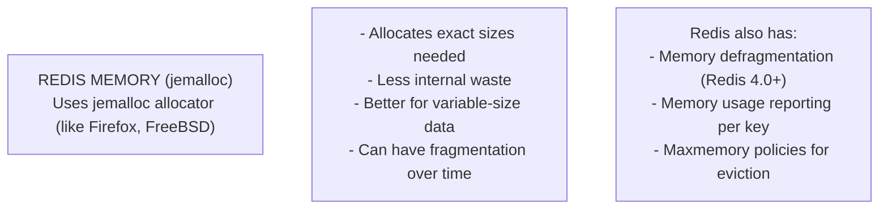

<details>
<summary>ASCII diagram (reference)</summary>

```text
┌─────────────────────────────────────────────────────────────────────────┐
│                    REDIS MEMORY (jemalloc)                               │
│                                                                          │
│   Uses jemalloc allocator (like Firefox, FreeBSD)                       │
│                                                                          │
│   - Allocates exact sizes needed                                        │
│   - Less internal waste                                                  │
│   - Better for variable-size data                                       │
│   - Can have fragmentation over time                                    │
│                                                                          │
│   Redis also has:                                                        │
│   - Memory defragmentation (Redis 4.0+)                                 │
│   - Memory usage reporting per key                                      │
│   - Maxmemory policies for eviction                                     │
└─────────────────────────────────────────────────────────────────────────┘
```
</details>

---

## 4️⃣ Feature Comparison

### Comprehensive Comparison Table

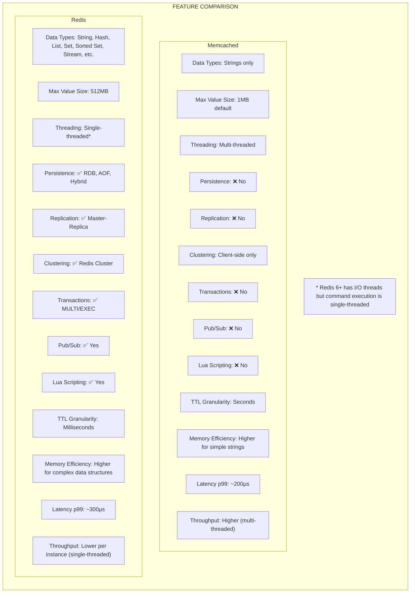

<details>
<summary>ASCII diagram (reference)</summary>

```text
┌─────────────────────────────────────────────────────────────────────────┐
│                    FEATURE COMPARISON                                    │
│                                                                          │
│   Feature              │ Memcached        │ Redis                       │
│   ─────────────────────┼──────────────────┼───────────────────────────  │
│   Data Types           │ Strings only     │ String, Hash, List, Set,   │
│                        │                  │ Sorted Set, Stream, etc.   │
│   ─────────────────────┼──────────────────┼───────────────────────────  │
│   Max Value Size       │ 1MB default      │ 512MB                       │
│   ─────────────────────┼──────────────────┼───────────────────────────  │
│   Threading            │ Multi-threaded   │ Single-threaded*            │
│   ─────────────────────┼──────────────────┼───────────────────────────  │
│   Persistence          │ ❌ No            │ ✅ RDB, AOF, Hybrid        │
│   ─────────────────────┼──────────────────┼───────────────────────────  │
│   Replication          │ ❌ No            │ ✅ Master-Replica          │
│   ─────────────────────┼──────────────────┼───────────────────────────  │
│   Clustering           │ Client-side only │ ✅ Redis Cluster           │
│   ─────────────────────┼──────────────────┼───────────────────────────  │
│   Transactions         │ ❌ No            │ ✅ MULTI/EXEC              │
│   ─────────────────────┼──────────────────┼───────────────────────────  │
│   Pub/Sub              │ ❌ No            │ ✅ Yes                      │
│   ─────────────────────┼──────────────────┼───────────────────────────  │
│   Lua Scripting        │ ❌ No            │ ✅ Yes                      │
│   ─────────────────────┼──────────────────┼───────────────────────────  │
│   TTL Granularity      │ Seconds          │ Milliseconds                │
│   ─────────────────────┼──────────────────┼───────────────────────────  │
│   Memory Efficiency    │ Higher for       │ Higher for complex         │
│                        │ simple strings   │ data structures            │
│   ─────────────────────┼──────────────────┼───────────────────────────  │
│   Latency (p99)        │ ~200μs           │ ~300μs                      │
│   ─────────────────────┼──────────────────┼───────────────────────────  │
│   Throughput           │ Higher (multi-   │ Lower per instance         │
│   (single instance)    │ threaded)        │ (single-threaded)          │
│                                                                          │
│   * Redis 6+ has I/O threads but command execution is single-threaded  │
└─────────────────────────────────────────────────────────────────────────┘
```
</details>

### Performance Characteristics

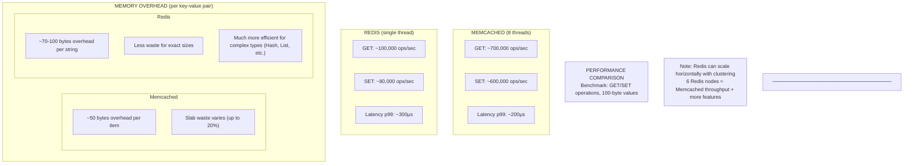

<details>
<summary>ASCII diagram (reference)</summary>

```text
┌─────────────────────────────────────────────────────────────────────────┐
│                    PERFORMANCE COMPARISON                                │
│                                                                          │
│   Benchmark: GET/SET operations, 100-byte values                        │
│                                                                          │
│   MEMCACHED (8 threads):                                                │
│   - GET: ~700,000 ops/sec                                               │
│   - SET: ~600,000 ops/sec                                               │
│   - Latency p99: ~200μs                                                 │
│                                                                          │
│   REDIS (single thread):                                                │
│   - GET: ~100,000 ops/sec                                               │
│   - SET: ~80,000 ops/sec                                                │
│   - Latency p99: ~300μs                                                 │
│                                                                          │
│   Note: Redis can scale horizontally with clustering                    │
│         6 Redis nodes ≈ Memcached throughput + more features           │
│                                                                          │
│   ─────────────────────────────────────────────────────────────────────  │
│                                                                          │
│   MEMORY OVERHEAD (per key-value pair):                                 │
│                                                                          │
│   Memcached:                                                             │
│   - ~50 bytes overhead per item                                         │
│   - Slab waste varies (up to 20%)                                       │
│                                                                          │
│   Redis:                                                                 │
│   - ~70-100 bytes overhead per string                                   │
│   - Less waste for exact sizes                                          │
│   - Much more efficient for complex types (Hash, List, etc.)           │
└─────────────────────────────────────────────────────────────────────────┘
```
</details>

---

## 5️⃣ When to Use Each

### Decision Matrix

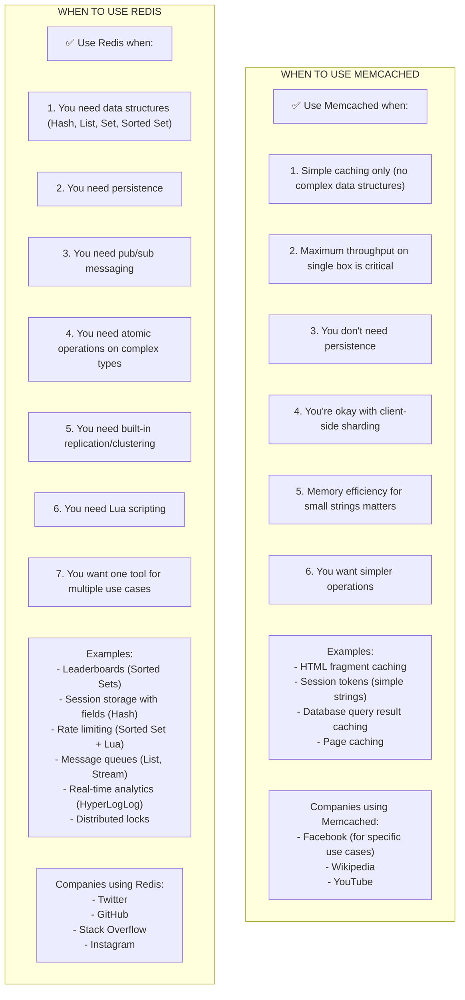

<details>
<summary>ASCII diagram (reference)</summary>

```text
┌─────────────────────────────────────────────────────────────────────────┐
│                    WHEN TO USE MEMCACHED                                 │
│                                                                          │
│   ✅ Use Memcached when:                                                │
│                                                                          │
│   1. Simple caching only (no complex data structures)                   │
│   2. Maximum throughput on single box is critical                       │
│   3. You don't need persistence                                         │
│   4. You're okay with client-side sharding                             │
│   5. Memory efficiency for small strings matters                        │
│   6. You want simpler operations                                        │
│                                                                          │
│   Examples:                                                              │
│   - HTML fragment caching                                                │
│   - Session tokens (simple strings)                                     │
│   - Database query result caching                                       │
│   - Page caching                                                         │
│                                                                          │
│   Companies using Memcached:                                             │
│   - Facebook (for specific use cases)                                   │
│   - Wikipedia                                                            │
│   - YouTube                                                              │
└─────────────────────────────────────────────────────────────────────────┘

┌─────────────────────────────────────────────────────────────────────────┐
│                    WHEN TO USE REDIS                                     │
│                                                                          │
│   ✅ Use Redis when:                                                    │
│                                                                          │
│   1. You need data structures (Hash, List, Set, Sorted Set)            │
│   2. You need persistence                                                │
│   3. You need pub/sub messaging                                         │
│   4. You need atomic operations on complex types                        │
│   5. You need built-in replication/clustering                          │
│   6. You need Lua scripting                                             │
│   7. You want one tool for multiple use cases                          │
│                                                                          │
│   Examples:                                                              │
│   - Leaderboards (Sorted Sets)                                          │
│   - Session storage with fields (Hash)                                  │
│   - Rate limiting (Sorted Set + Lua)                                    │
│   - Message queues (List, Stream)                                       │
│   - Real-time analytics (HyperLogLog)                                   │
│   - Distributed locks                                                    │
│                                                                          │
│   Companies using Redis:                                                 │
│   - Twitter                                                              │
│   - GitHub                                                               │
│   - Stack Overflow                                                       │
│   - Instagram                                                            │
└─────────────────────────────────────────────────────────────────────────┘
```
</details>

### Decision Flowchart

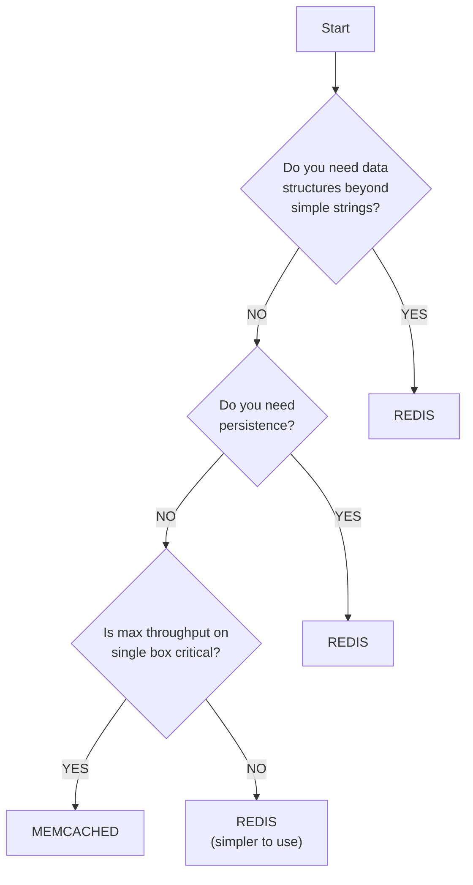

<details>
<summary>ASCII diagram (reference)</summary>

```text
                              Start
                                │
                                ▼
                    ┌───────────────────────┐
                    │ Do you need data      │
                    │ structures beyond     │
                    │ simple strings?       │
                    └───────────┬───────────┘
                                │
                    ┌───────────┴───────────┐
                    │                       │
                    ▼                       ▼
                   YES                      NO
                    │                       │
                    ▼                       ▼
              ┌──────────┐        ┌───────────────────────┐
              │  REDIS   │        │ Do you need           │
              └──────────┘        │ persistence?          │
                                  └───────────┬───────────┘
                                              │
                                  ┌───────────┴───────────┐
                                  │                       │
                                  ▼                       ▼
                                 YES                      NO
                                  │                       │
                                  ▼                       ▼
                            ┌──────────┐        ┌───────────────────────┐
                            │  REDIS   │        │ Is max throughput on  │
                            └──────────┘        │ single box critical?  │
                                                └───────────┬───────────┘
                                                            │
                                                ┌───────────┴───────────┐
                                                │                       │
                                                ▼                       ▼
                                               YES                      NO
                                                │                       │
                                                ▼                       ▼
                                          ┌───────────┐           ┌──────────┐
                                          │ MEMCACHED │           │  REDIS   │
                                          └───────────┘           │ (simpler │
                                                                  │  to use) │
                                                                  └──────────┘
```
</details>

---

## 6️⃣ How to Implement in Java

### Memcached with Spymemcached

```java
// MemcachedCacheService.java
package com.example.cache.memcached;

import net.spy.memcached.MemcachedClient;
import net.spy.memcached.AddrUtil;
import lombok.extern.slf4j.Slf4j;
import org.springframework.stereotype.Service;

import jakarta.annotation.PostConstruct;
import jakarta.annotation.PreDestroy;
import java.io.IOException;
import java.util.concurrent.Future;
import java.util.concurrent.TimeUnit;

/**
 * Memcached cache service using Spymemcached client
 */
@Service
@Slf4j
public class MemcachedCacheService {

    private MemcachedClient client;
    
    private static final int DEFAULT_TTL = 3600;  // 1 hour in seconds
    private static final long OPERATION_TIMEOUT = 1000;  // 1 second

    @PostConstruct
    public void init() throws IOException {
        // Connect to Memcached servers
        // Format: "host1:port1 host2:port2"
        client = new MemcachedClient(
            AddrUtil.getAddresses("localhost:11211")
        );
        log.info("Connected to Memcached");
    }

    @PreDestroy
    public void shutdown() {
        if (client != null) {
            client.shutdown();
            log.info("Memcached client shutdown");
        }
    }

    /**
     * Get value from cache
     */
    public Object get(String key) {
        try {
            return client.get(key);
        } catch (Exception e) {
            log.error("Memcached GET error for {}: {}", key, e.getMessage());
            return null;
        }
    }

    /**
     * Set value with default TTL
     */
    public boolean set(String key, Object value) {
        return set(key, value, DEFAULT_TTL);
    }

    /**
     * Set value with custom TTL
     */
    public boolean set(String key, Object value, int ttlSeconds) {
        try {
            Future<Boolean> future = client.set(key, ttlSeconds, value);
            return future.get(OPERATION_TIMEOUT, TimeUnit.MILLISECONDS);
        } catch (Exception e) {
            log.error("Memcached SET error for {}: {}", key, e.getMessage());
            return false;
        }
    }

    /**
     * Add value only if key doesn't exist (for distributed locks)
     */
    public boolean add(String key, Object value, int ttlSeconds) {
        try {
            Future<Boolean> future = client.add(key, ttlSeconds, value);
            return future.get(OPERATION_TIMEOUT, TimeUnit.MILLISECONDS);
        } catch (Exception e) {
            log.error("Memcached ADD error for {}: {}", key, e.getMessage());
            return false;
        }
    }

    /**
     * Delete key
     */
    public boolean delete(String key) {
        try {
            Future<Boolean> future = client.delete(key);
            return future.get(OPERATION_TIMEOUT, TimeUnit.MILLISECONDS);
        } catch (Exception e) {
            log.error("Memcached DELETE error for {}: {}", key, e.getMessage());
            return false;
        }
    }

    /**
     * Increment counter
     */
    public long increment(String key, int delta) {
        return client.incr(key, delta);
    }

    /**
     * Decrement counter
     */
    public long decrement(String key, int delta) {
        return client.decr(key, delta);
    }

    /**
     * Get with CAS (Check-And-Set) for optimistic locking
     */
    public CasValue getCas(String key) {
        net.spy.memcached.CASValue<Object> casValue = client.gets(key);
        if (casValue == null) return null;
        return new CasValue(casValue.getCas(), casValue.getValue());
    }

    /**
     * CAS update (only succeeds if CAS value hasn't changed)
     */
    public boolean cas(String key, long casId, Object value, int ttlSeconds) {
        try {
            net.spy.memcached.CASResponse response = client.cas(key, casId, ttlSeconds, value);
            return response == net.spy.memcached.CASResponse.OK;
        } catch (Exception e) {
            log.error("Memcached CAS error for {}: {}", key, e.getMessage());
            return false;
        }
    }

    public record CasValue(long casId, Object value) {}
}
```

### Redis with Spring Data Redis (for comparison)

```java
// RedisCacheService.java
package com.example.cache.redis;

import lombok.RequiredArgsConstructor;
import lombok.extern.slf4j.Slf4j;
import org.springframework.data.redis.core.RedisTemplate;
import org.springframework.stereotype.Service;

import java.time.Duration;
import java.util.List;
import java.util.Map;
import java.util.Set;

/**
 * Redis cache service showing features not available in Memcached
 */
@Service
@RequiredArgsConstructor
@Slf4j
public class RedisCacheService {

    private final RedisTemplate<String, Object> redisTemplate;

    // ==================== STRING (Same as Memcached) ====================
    
    public void setString(String key, Object value, Duration ttl) {
        redisTemplate.opsForValue().set(key, value, ttl);
    }

    public Object getString(String key) {
        return redisTemplate.opsForValue().get(key);
    }

    // ==================== HASH (Not in Memcached) ====================
    
    /**
     * Store object fields separately (update one field without reading entire object)
     */
    public void setHashField(String key, String field, Object value) {
        redisTemplate.opsForHash().put(key, field, value);
    }

    public Object getHashField(String key, String field) {
        return redisTemplate.opsForHash().get(key, field);
    }

    public Map<Object, Object> getHash(String key) {
        return redisTemplate.opsForHash().entries(key);
    }

    // ==================== LIST (Not in Memcached) ====================
    
    /**
     * Implement a queue
     */
    public void pushToQueue(String queueName, Object item) {
        redisTemplate.opsForList().leftPush(queueName, item);
    }

    public Object popFromQueue(String queueName) {
        return redisTemplate.opsForList().rightPop(queueName);
    }

    public Object blockingPop(String queueName, Duration timeout) {
        return redisTemplate.opsForList().rightPop(queueName, timeout);
    }

    // ==================== SET (Not in Memcached) ====================
    
    /**
     * Track unique items
     */
    public void addToSet(String key, Object... values) {
        redisTemplate.opsForSet().add(key, values);
    }

    public boolean isMember(String key, Object value) {
        return Boolean.TRUE.equals(redisTemplate.opsForSet().isMember(key, value));
    }

    public Set<Object> getSetMembers(String key) {
        return redisTemplate.opsForSet().members(key);
    }

    // ==================== SORTED SET (Not in Memcached) ====================
    
    /**
     * Implement leaderboard
     */
    public void addToLeaderboard(String key, String member, double score) {
        redisTemplate.opsForZSet().add(key, member, score);
    }

    public Long getRank(String key, String member) {
        return redisTemplate.opsForZSet().reverseRank(key, member);
    }

    public Set<Object> getTopN(String key, int n) {
        return redisTemplate.opsForZSet().reverseRange(key, 0, n - 1);
    }

    // ==================== PUB/SUB (Not in Memcached) ====================
    
    public void publish(String channel, Object message) {
        redisTemplate.convertAndSend(channel, message);
    }

    // ==================== TRANSACTIONS (Not in Memcached) ====================
    
    public void executeTransaction(Runnable operations) {
        redisTemplate.execute(session -> {
            session.multi();
            operations.run();
            return session.exec();
        });
    }
}
```

### Choosing Between Them at Runtime

```java
// UnifiedCacheService.java
package com.example.cache;

import com.example.cache.memcached.MemcachedCacheService;
import com.example.cache.redis.RedisCacheService;
import lombok.RequiredArgsConstructor;
import org.springframework.stereotype.Service;

import java.time.Duration;

/**
 * Unified cache service that can use either Memcached or Redis
 * based on use case
 */
@Service
@RequiredArgsConstructor
public class UnifiedCacheService {

    private final MemcachedCacheService memcached;
    private final RedisCacheService redis;

    /**
     * Simple string caching - use Memcached for best performance
     */
    public void cacheSimpleValue(String key, String value, int ttlSeconds) {
        memcached.set(key, value, ttlSeconds);
    }

    public String getSimpleValue(String key) {
        return (String) memcached.get(key);
    }

    /**
     * Object with multiple fields - use Redis Hash
     */
    public void cacheUserProfile(String userId, Map<String, Object> profile) {
        String key = "user:" + userId;
        profile.forEach((field, value) -> redis.setHashField(key, field, value));
        redis.expire(key, Duration.ofMinutes(30));
    }

    public Map<Object, Object> getUserProfile(String userId) {
        return redis.getHash("user:" + userId);
    }

    /**
     * Leaderboard - must use Redis Sorted Set
     */
    public void updateScore(String leaderboard, String playerId, double score) {
        redis.addToLeaderboard(leaderboard, playerId, score);
    }

    public Set<Object> getTopPlayers(String leaderboard, int count) {
        return redis.getTopN(leaderboard, count);
    }

    /**
     * Rate limiting - use Redis for atomic operations
     */
    public boolean checkRateLimit(String userId, int maxRequests, Duration window) {
        // Implementation using Redis Sorted Set
        // (See Topic 3 for full implementation)
        return true;
    }

    /**
     * Simple counter - either works, but Memcached is slightly faster
     */
    public long incrementCounter(String key) {
        return memcached.increment(key, 1);
    }
}
```

---

## 7️⃣ Real-World Usage

### Facebook's Approach

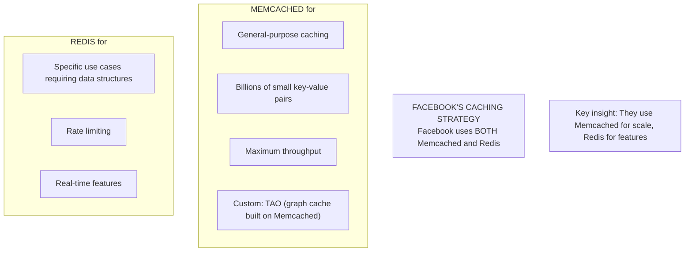

<details>
<summary>ASCII diagram (reference)</summary>

```text
┌─────────────────────────────────────────────────────────────────────────┐
│                    FACEBOOK'S CACHING STRATEGY                           │
│                                                                          │
│   Facebook uses BOTH Memcached and Redis:                               │
│                                                                          │
│   MEMCACHED for:                                                         │
│   - General-purpose caching                                              │
│   - Billions of small key-value pairs                                   │
│   - Maximum throughput                                                   │
│   - Custom: TAO (graph cache built on Memcached)                        │
│                                                                          │
│   REDIS for:                                                             │
│   - Specific use cases requiring data structures                        │
│   - Rate limiting                                                        │
│   - Real-time features                                                   │
│                                                                          │
│   Key insight: They use Memcached for scale, Redis for features         │
└─────────────────────────────────────────────────────────────────────────┘
```
</details>

### Twitter's Approach

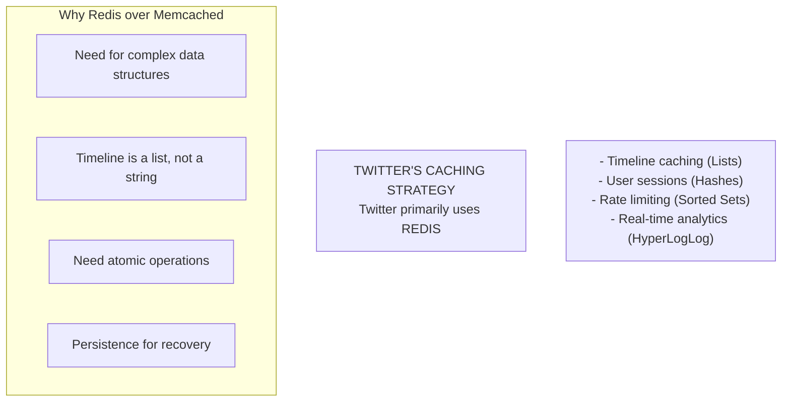

<details>
<summary>ASCII diagram (reference)</summary>

```text
┌─────────────────────────────────────────────────────────────────────────┐
│                    TWITTER'S CACHING STRATEGY                            │
│                                                                          │
│   Twitter primarily uses REDIS:                                          │
│                                                                          │
│   - Timeline caching (Lists)                                             │
│   - User sessions (Hashes)                                               │
│   - Rate limiting (Sorted Sets)                                          │
│   - Real-time analytics (HyperLogLog)                                   │
│                                                                          │
│   Why Redis over Memcached:                                              │
│   - Need for complex data structures                                     │
│   - Timeline is a list, not a string                                    │
│   - Need atomic operations                                               │
│   - Persistence for recovery                                             │
└─────────────────────────────────────────────────────────────────────────┘
```
</details>

---

## 8️⃣ Tradeoffs and Common Mistakes

### Common Mistakes

**1. Using Memcached when you need data structures**
```java
// WRONG: Storing list as JSON string in Memcached
String json = objectMapper.writeValueAsString(items);
memcached.set("user:123:cart", json);

// To add item: read entire list, parse, add, serialize, write
String existing = (String) memcached.get("user:123:cart");
List<Item> items = objectMapper.readValue(existing, new TypeReference<>(){});
items.add(newItem);
memcached.set("user:123:cart", objectMapper.writeValueAsString(items));

// RIGHT: Use Redis List
redis.opsForList().leftPush("user:123:cart", newItem);  // O(1) operation
```

**2. Using Redis when Memcached would be faster**
```java
// If you only need simple string caching and maximum throughput,
// Memcached might be 2-3x faster per instance
```

**3. Not considering operational complexity**
```
Memcached: Simple to operate, but you need to handle:
- Client-side sharding
- No automatic failover
- No persistence (cold restart = empty cache)

Redis: More features, but more complex:
- Cluster configuration
- Persistence tuning
- Memory management
```

---

## 9️⃣ Interview Follow-Up Questions WITH Answers

### L4 Questions

**Q: What's the main difference between Memcached and Redis?**

A: Memcached is a simple, multi-threaded key-value cache that only stores strings. Redis is a single-threaded data structure server that supports strings, hashes, lists, sets, sorted sets, and more. Memcached is faster for simple string caching on a single box, but Redis offers persistence, replication, clustering, and rich data structures. Use Memcached for pure caching, Redis when you need features beyond simple key-value storage.

### L5 Questions

**Q: When would you choose Memcached over Redis?**

A: I'd choose Memcached when: (1) I only need simple string caching. (2) Maximum single-box throughput is critical, as Memcached's multi-threading can handle more ops/sec. (3) I don't need persistence, replication, or complex data structures. (4) I want simpler operations. Examples include HTML fragment caching, database query result caching, and session tokens. However, for most modern applications, Redis is more versatile and the throughput difference can be overcome with Redis clustering.

### L6 Questions

**Q: Design a caching strategy for a social media feed that needs to handle 1M requests/second.**

A: I'd use a hybrid approach: 

For the feed itself, I'd use Redis Sorted Sets because feeds are ordered by timestamp and need efficient insertion and range queries. Redis handles this natively.

For user profile data that's accessed with the feed, I'd consider Memcached for the raw caching layer because of its higher throughput, with Redis for any data needing structure.

Architecture: (1) L1 local cache (Caffeine) for hot feeds. (2) L2 Redis cluster for feed data (Sorted Sets). (3) L2 Memcached cluster for user profile strings. (4) Database as source of truth.

For 1M req/sec: 10-node Redis cluster + 10-node Memcached cluster, with L1 local cache handling 80% of requests. This gives us the best of both: Redis features for feeds, Memcached speed for simple lookups.

---

## 🔟 One Clean Mental Summary

Memcached is a simple, fast, multi-threaded cache for string values only. Redis is a feature-rich data structure server with persistence, replication, and clustering. Choose Memcached when you need maximum throughput for simple caching. Choose Redis when you need data structures (lists, sets, sorted sets), persistence, or features like pub/sub and Lua scripting. Most modern applications choose Redis because its versatility outweighs Memcached's raw speed advantage, and Redis can scale horizontally with clustering. When in doubt, start with Redis; it can do everything Memcached does plus much more.

