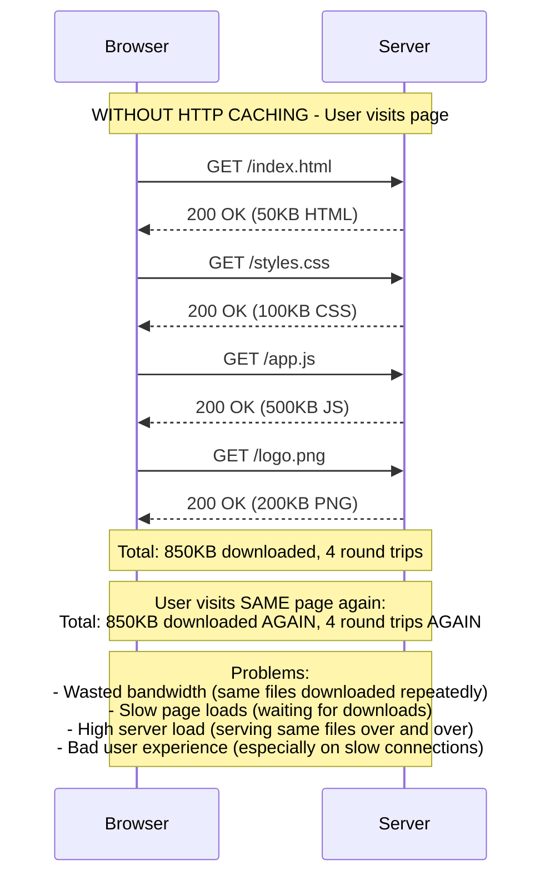

# 🌐 HTTP Caching

---

## 0️⃣ Prerequisites

Before diving into HTTP caching, you need to understand:

- **HTTP Protocol**: The protocol browsers use to communicate with servers. Request-response model.
- **HTTP Headers**: Metadata sent with requests and responses. Key-value pairs.
- **Web Server**: A server that handles HTTP requests (e.g., Nginx, Apache, Spring Boot).
- **Browser**: The client that makes HTTP requests and renders responses.

If you understand that browsers make HTTP requests and servers send responses with headers, you're ready.

---

## 1️⃣ What Problem Does This Exist to Solve?

### The Pain Point

Every time a user visits your website:



<details>
<summary>ASCII diagram (reference)</summary>

```text
┌─────────────────────────────────────────────────────────────────────────┐
│                    WITHOUT HTTP CACHING                                  │
│                                                                          │
│   User visits page:                                                      │
│                                                                          │
│   Browser ──────────────────────────────────────────────────▶ Server    │
│           GET /index.html                                                │
│           ◀────────────────────────────────────────────────── 200 OK    │
│                                                              50KB HTML   │
│                                                                          │
│   Browser ──────────────────────────────────────────────────▶ Server    │
│           GET /styles.css                                                │
│           ◀────────────────────────────────────────────────── 200 OK    │
│                                                              100KB CSS   │
│                                                                          │
│   Browser ──────────────────────────────────────────────────▶ Server    │
│           GET /app.js                                                    │
│           ◀────────────────────────────────────────────────── 200 OK    │
│                                                              500KB JS    │
│                                                                          │
│   Browser ──────────────────────────────────────────────────▶ Server    │
│           GET /logo.png                                                  │
│           ◀────────────────────────────────────────────────── 200 OK    │
│                                                              200KB PNG   │
│                                                                          │
│   Total: 850KB downloaded, 4 round trips                                │
│                                                                          │
│   User visits SAME page again:                                          │
│   Total: 850KB downloaded AGAIN, 4 round trips AGAIN                    │
│                                                                          │
│   Problems:                                                              │
│   - Wasted bandwidth (same files downloaded repeatedly)                 │
│   - Slow page loads (waiting for downloads)                             │
│   - High server load (serving same files over and over)                │
│   - Bad user experience (especially on slow connections)                │
└─────────────────────────────────────────────────────────────────────────┘
```
</details>

### With HTTP Caching

```mermaid
flowchart TD
    First["First visit (same as before):<br/>Total: 850KB downloaded, 4 round trips<br/>BUT: Browser stores files in cache with instructions"]
    
    Second["Second visit:"]
    
    subgraph Cache["Browser checks cache"]
        C1["styles.css: Valid for 1 year → Use cached (0 bytes)"]
        C2["app.js: Valid for 1 year → Use cached (0 bytes)"]
        C3["logo.png: Valid for 1 year → Use cached (0 bytes)"]
        C4["index.html: Check with server → 304 Not Modified (0 bytes)"]
    end
    
    Total["Total: 0KB downloaded, 1 round trip (just to check HTML)"]
    
    Results["Results:<br/>- 99%+ bandwidth saved<br/>- Near-instant page load<br/>- Server load reduced dramatically<br/>- Great user experience"]
    
    First --> Second --> Cache --> Total --> Results
```



<details>
<summary>ASCII diagram (reference)</summary>

```text
┌─────────────────────────────────────────────────────────────────────────┐
│                    WITH HTTP CACHING                                     │
│                                                                          │
│   First visit (same as before):                                         │
│   Total: 850KB downloaded, 4 round trips                                │
│   BUT: Browser stores files in cache with instructions                  │
│                                                                          │
│   Second visit:                                                          │
│   ┌─────────────────────────────────────────────────────────────────┐   │
│   │   Browser checks cache:                                          │   │
│   │   - styles.css: Valid for 1 year → Use cached (0 bytes)         │   │
│   │   - app.js: Valid for 1 year → Use cached (0 bytes)             │   │
│   │   - logo.png: Valid for 1 year → Use cached (0 bytes)           │   │
│   │   - index.html: Check with server → 304 Not Modified (0 bytes)  │   │
│   └─────────────────────────────────────────────────────────────────┘   │
│                                                                          │
│   Total: 0KB downloaded, 1 round trip (just to check HTML)              │
│                                                                          │
│   Results:                                                               │
│   - 99%+ bandwidth saved                                                │
│   - Near-instant page load                                              │
│   - Server load reduced dramatically                                    │
│   - Great user experience                                               │
└─────────────────────────────────────────────────────────────────────────┘
```
</details>

### Real Impact

**Google found**: 
- 1 second delay in page load = 7% reduction in conversions
- HTTP caching can reduce page load time by 80%+

**Amazon found**:
- Every 100ms of latency costs 1% in sales
- Proper caching is essential for performance

---

## 2️⃣ Intuition and Mental Model

### The Newspaper Analogy

```mermaid
flowchart TD
    Title["THE NEWSPAPER ANALOGY"]
    
    Without["WITHOUT CACHING:<br/>Every morning, you walk to the newsstand to check if there's<br/>a new newspaper. Even if it's the same as yesterday."]
    
    With["WITH CACHING:"]
    
    CC["Cache-Control: max-age=86400 (1 day)<br/>─────────────────────────────────────<br/>This newspaper is valid for 24 hours.<br/>Don't bother checking the newsstand until tomorrow."]
    
    ETag["ETag: edition-2024-01-15<br/>─────────────────────────────────────<br/>This is edition 2024-01-15.<br/>When you check tomorrow, ask: 'Is there a newer edition<br/>than 2024-01-15?' If not, I'll just say 'No changes.'"]
    
    LM["Last-Modified: Mon, 15 Jan 2024 08:00:00 GMT<br/>─────────────────────────────────────<br/>This was printed on Jan 15 at 8 AM.<br/>When you check, ask: 'Anything newer than Jan 15 8 AM?'"]
    
    Vary["Vary: Accept-Language<br/>─────────────────────────────────────<br/>The newspaper content varies by language.<br/>Cache the English and Spanish versions separately."]
    
    Title --> Without
    Title --> With
    With --> CC
    With --> ETag
    With --> LM
    With --> Vary
```



<details>
<summary>ASCII diagram (reference)</summary>

```text
┌─────────────────────────────────────────────────────────────────────────┐
│                    THE NEWSPAPER ANALOGY                                 │
│                                                                          │
│   WITHOUT CACHING:                                                       │
│   Every morning, you walk to the newsstand to check if there's          │
│   a new newspaper. Even if it's the same as yesterday.                  │
│                                                                          │
│   WITH CACHING:                                                          │
│                                                                          │
│   Cache-Control: max-age=86400 (1 day)                                  │
│   ─────────────────────────────────────                                 │
│   "This newspaper is valid for 24 hours.                                │
│    Don't bother checking the newsstand until tomorrow."                 │
│                                                                          │
│   ETag: "edition-2024-01-15"                                            │
│   ─────────────────────────────────────                                 │
│   "This is edition 2024-01-15.                                          │
│    When you check tomorrow, ask: 'Is there a newer edition              │
│    than 2024-01-15?' If not, I'll just say 'No changes.'"              │
│                                                                          │
│   Last-Modified: Mon, 15 Jan 2024 08:00:00 GMT                         │
│   ─────────────────────────────────────                                 │
│   "This was printed on Jan 15 at 8 AM.                                  │
│    When you check, ask: 'Anything newer than Jan 15 8 AM?'"            │
│                                                                          │
│   Vary: Accept-Language                                                  │
│   ─────────────────────────────────────                                 │
│   "The newspaper content varies by language.                            │
│    Cache the English and Spanish versions separately."                  │
└─────────────────────────────────────────────────────────────────────────┘
```
</details>

---

## 3️⃣ How It Works Internally

### HTTP Caching Headers

```mermaid
flowchart TD
    Title["KEY HTTP CACHING HEADERS"]
    
    subgraph Response["RESPONSE HEADERS (Server → Browser)"]
        CC["Cache-Control: max-age=3600, public<br/>│              │              │<br/>│              │              └── Can be cached by proxies/CDNs<br/>│              └── Valid for 3600 seconds (1 hour)<br/>└── Main caching directive"]
        
        ETag["ETag: abc123<br/>│      │<br/>│      └── Unique identifier for this version of the resource<br/>└── Entity Tag"]
        
        LM["Last-Modified: Wed, 15 Jan 2024 10:00:00 GMT<br/>│              │<br/>│              └── When the resource was last changed<br/>└── Timestamp header"]
        
        Vary["Vary: Accept-Encoding, Accept-Language<br/>│     │<br/>│     └── Cache varies by these request headers<br/>└── Tells caches to store different versions"]
    end
    
    Divider["─────────────────────────────────"]
    
    subgraph Request["REQUEST HEADERS (Browser → Server)"]
        INM["If-None-Match: abc123<br/>│              │<br/>│              └── ETag from cached version<br/>└── Give me new version only if ETag changed"]
        
        IMS["If-Modified-Since: Wed, 15 Jan 2024 10:00:00 GMT<br/>│                  │<br/>│                  └── Last-Modified from cached version<br/>└── Give me new version only if modified since this time"]
    end
```



<details>
<summary>ASCII diagram (reference)</summary>

```text
┌─────────────────────────────────────────────────────────────────────────┐
│                    KEY HTTP CACHING HEADERS                              │
│                                                                          │
│   RESPONSE HEADERS (Server → Browser):                                  │
│   ─────────────────────────────────────                                 │
│                                                                          │
│   Cache-Control: max-age=3600, public                                   │
│   │              │              │                                        │
│   │              │              └── Can be cached by proxies/CDNs       │
│   │              └── Valid for 3600 seconds (1 hour)                    │
│   └── Main caching directive                                            │
│                                                                          │
│   ETag: "abc123"                                                        │
│   │      │                                                               │
│   │      └── Unique identifier for this version of the resource        │
│   └── Entity Tag                                                         │
│                                                                          │
│   Last-Modified: Wed, 15 Jan 2024 10:00:00 GMT                         │
│   │              │                                                       │
│   │              └── When the resource was last changed                 │
│   └── Timestamp header                                                   │
│                                                                          │
│   Vary: Accept-Encoding, Accept-Language                                │
│   │     │                                                                │
│   │     └── Cache varies by these request headers                       │
│   └── Tells caches to store different versions                          │
│                                                                          │
│   ─────────────────────────────────────────────────────────────────────  │
│                                                                          │
│   REQUEST HEADERS (Browser → Server):                                   │
│   ─────────────────────────────────────                                 │
│                                                                          │
│   If-None-Match: "abc123"                                               │
│   │              │                                                       │
│   │              └── ETag from cached version                           │
│   └── "Give me new version only if ETag changed"                        │
│                                                                          │
│   If-Modified-Since: Wed, 15 Jan 2024 10:00:00 GMT                     │
│   │                  │                                                   │
│   │                  └── Last-Modified from cached version              │
│   └── "Give me new version only if modified since this time"            │
└─────────────────────────────────────────────────────────────────────────┘
```
</details>

### Cache-Control Directives

```mermaid
flowchart TD
    Title["CACHE-CONTROL DIRECTIVES"]
    
    subgraph Freshness["FRESHNESS DIRECTIVES"]
        F1["max-age=N → Cache for N seconds"]
        F2["s-maxage=N → Cache for N seconds (shared caches only)"]
        F3["no-cache → Must revalidate before using cached version"]
        F4["no-store → Don't cache at all"]
    end
    
    subgraph Revalidation["REVALIDATION DIRECTIVES"]
        R1["must-revalidate → Must check with server when stale"]
        R2["proxy-revalidate → Must check with server (proxies only)"]
        R3["stale-while-revalidate=N → Serve stale while fetching fresh"]
        R4["stale-if-error=N → Serve stale if server error"]
    end
    
    subgraph Visibility["VISIBILITY DIRECTIVES"]
        V1["public → Can be cached by any cache (CDN, proxy, browser)"]
        V2["private → Only browser can cache (not CDN/proxy)"]
        V3["no-transform → Don't modify content (no compression changes)"]
    end
    
    subgraph Examples["EXAMPLES"]
        E1["Static assets: Cache-Control: public, max-age=31536000"]
        E2["API responses: Cache-Control: private, max-age=0, must-revalidate"]
        E3["User-specific: Cache-Control: private, max-age=300"]
        E4["Never cache: Cache-Control: no-store"]
        E5["Always validate: Cache-Control: no-cache"]
    end
```



<details>
<summary>ASCII diagram (reference)</summary>

```text
┌─────────────────────────────────────────────────────────────────────────┐
│                    CACHE-CONTROL DIRECTIVES                              │
│                                                                          │
│   FRESHNESS DIRECTIVES:                                                  │
│   ─────────────────────                                                 │
│   max-age=N        Cache for N seconds                                  │
│   s-maxage=N       Cache for N seconds (shared caches only)            │
│   no-cache         Must revalidate before using cached version          │
│   no-store         Don't cache at all                                   │
│                                                                          │
│   REVALIDATION DIRECTIVES:                                               │
│   ────────────────────────                                              │
│   must-revalidate  Must check with server when stale                    │
│   proxy-revalidate Must check with server (proxies only)               │
│   stale-while-revalidate=N  Serve stale while fetching fresh           │
│   stale-if-error=N         Serve stale if server error                 │
│                                                                          │
│   VISIBILITY DIRECTIVES:                                                 │
│   ──────────────────────                                                │
│   public           Can be cached by any cache (CDN, proxy, browser)    │
│   private          Only browser can cache (not CDN/proxy)              │
│   no-transform     Don't modify content (no compression changes)        │
│                                                                          │
│   EXAMPLES:                                                              │
│   ─────────                                                             │
│   Static assets:     Cache-Control: public, max-age=31536000           │
│   API responses:     Cache-Control: private, max-age=0, must-revalidate│
│   User-specific:     Cache-Control: private, max-age=300               │
│   Never cache:       Cache-Control: no-store                            │
│   Always validate:   Cache-Control: no-cache                            │
└─────────────────────────────────────────────────────────────────────────┘
```
</details>

### Caching Flow

```mermaid
flowchart TD
    Start["Request for /styles.css"]
    
    Check["Is /styles.css in cache?"]
    
    No["NO → Fetch from server"]
    
    Yes["YES → Is it fresh (within max-age)?"]
    
    Fresh["YES → Use cached version (no network!)"]
    
    Stale["NO → Revalidate with server"]
    
    Send["Send: If-None-Match: etag123<br/>If-Modified-Since: ..."]
    
    Response["Server response:"]
    
    NotModified["304 Not Modified<br/>(Use cached, 0 bytes)"]
    
    OK["200 OK + new content<br/>(Update cache)"]
    
    Start --> Check
    Check -->|NO| No
    Check -->|YES| Yes
    Yes -->|YES| Fresh
    Yes -->|NO| Stale
    Stale --> Send
    Send --> Response
    Response --> NotModified
    Response --> OK
```



<details>
<summary>ASCII diagram (reference)</summary>

```text
┌─────────────────────────────────────────────────────────────────────────┐
│                    HTTP CACHING FLOW                                     │
│                                                                          │
│   Request for /styles.css                                               │
│                                                                          │
│   ┌─────────────────────────────────────────────────────────────────┐   │
│   │                    BROWSER CACHE CHECK                           │   │
│   │                                                                  │   │
│   │   Is /styles.css in cache?                                      │   │
│   │        │                                                         │   │
│   │        ├── NO → Fetch from server                               │   │
│   │        │                                                         │   │
│   │        └── YES → Is it fresh (within max-age)?                  │   │
│   │                   │                                              │   │
│   │                   ├── YES → Use cached version (no network!)    │   │
│   │                   │                                              │   │
│   │                   └── NO → Revalidate with server               │   │
│   │                            │                                     │   │
│   │                            │ Send: If-None-Match: "etag123"     │   │
│   │                            │       If-Modified-Since: ...       │   │
│   │                            │                                     │   │
│   │                            └── Server response:                 │   │
│   │                                 │                                │   │
│   │                                 ├── 304 Not Modified            │   │
│   │                                 │   (Use cached, 0 bytes)       │   │
│   │                                 │                                │   │
│   │                                 └── 200 OK + new content        │   │
│   │                                     (Update cache)              │   │
│   └─────────────────────────────────────────────────────────────────┘   │
└─────────────────────────────────────────────────────────────────────────┘
```
</details>

---

## 4️⃣ Simulation-First Explanation

### Scenario: Loading a Web Page

**First Visit**:

```
GET /app.js HTTP/1.1
Host: example.com

─────────────────────────────────────────────────────────────────────────

HTTP/1.1 200 OK
Content-Type: application/javascript
Content-Length: 500000
Cache-Control: public, max-age=31536000
ETag: "v2.1.0-abc123"
Last-Modified: Mon, 15 Jan 2024 10:00:00 GMT

[500KB of JavaScript code]

─────────────────────────────────────────────────────────────────────────

Browser stores:
- Key: https://example.com/app.js
- Value: [500KB JavaScript]
- ETag: "v2.1.0-abc123"
- Last-Modified: Mon, 15 Jan 2024 10:00:00 GMT
- Expires: Mon, 15 Jan 2025 10:00:00 GMT (max-age=31536000 = 1 year)
```

**Second Visit (within max-age)**:

```
Browser: "Is /app.js in cache?" → YES
Browser: "Is it still fresh?" → YES (within 1 year)
Browser: Uses cached version immediately

Network traffic: 0 bytes
Latency: 0ms (instant from disk/memory)
```

**Visit After Content Changes (with same URL)**:

```
Developer deploys new app.js but URL is same.
Browser still has cached version (valid for 1 year).
User sees OLD version!

This is why we use cache busting:
/app.js → /app.v2.2.0.js  (new URL = new cache entry)
```

### Conditional Request Example

```
GET /api/user/123 HTTP/1.1
Host: api.example.com
If-None-Match: "user123-v5"
If-Modified-Since: Mon, 15 Jan 2024 10:00:00 GMT

─────────────────────────────────────────────────────────────────────────

Case 1: User data hasn't changed

HTTP/1.1 304 Not Modified
ETag: "user123-v5"
Cache-Control: private, max-age=60

[No body - use cached version]

─────────────────────────────────────────────────────────────────────────

Case 2: User data has changed

HTTP/1.1 200 OK
ETag: "user123-v6"
Cache-Control: private, max-age=60
Content-Type: application/json

{"id": 123, "name": "John Updated", "email": "john@example.com"}
```

---

## 5️⃣ How Engineers Actually Use This in Production

### Static Assets Strategy

```mermaid
flowchart TD
    Title["STATIC ASSETS CACHING<br/>Strategy: Long cache + cache busting"]
    
    Steps["1. Set very long max-age (1 year)<br/>2. Include version/hash in filename<br/>3. When content changes, filename changes"]
    
    Example["Example:<br/>/static/app.abc123.js → Cache-Control: max-age=31536000<br/>/static/styles.def456.css → Cache-Control: max-age=31536000"]
    
    Build["Build process generates hashed filenames:<br/>app.js → app.abc123.js (hash of content)"]
    
    Update["When you update app.js:<br/>app.js → app.xyz789.js (new hash)<br/>Browser fetches new file (different URL)<br/>Old file naturally expires from cache"]
    
    Tools["Tools: Webpack, Vite, esbuild all support this"]
    
    Title --> Steps --> Example --> Build --> Update --> Tools
```



<details>
<summary>ASCII diagram (reference)</summary>

```text
┌─────────────────────────────────────────────────────────────────────────┐
│                    STATIC ASSETS CACHING                                 │
│                                                                          │
│   Strategy: Long cache + cache busting                                  │
│                                                                          │
│   1. Set very long max-age (1 year)                                     │
│   2. Include version/hash in filename                                   │
│   3. When content changes, filename changes                             │
│                                                                          │
│   Example:                                                               │
│   /static/app.abc123.js    → Cache-Control: max-age=31536000           │
│   /static/styles.def456.css → Cache-Control: max-age=31536000          │
│                                                                          │
│   Build process generates hashed filenames:                             │
│   app.js → app.abc123.js (hash of content)                             │
│                                                                          │
│   When you update app.js:                                               │
│   app.js → app.xyz789.js (new hash)                                    │
│   Browser fetches new file (different URL)                              │
│   Old file naturally expires from cache                                 │
│                                                                          │
│   Tools: Webpack, Vite, esbuild all support this                       │
└─────────────────────────────────────────────────────────────────────────┘
```
</details>

### API Response Caching

```mermaid
flowchart TD
    Title["API CACHING STRATEGIES"]
    
    subgraph Public["PUBLIC DATA (e.g., product catalog)"]
        P1["Cache-Control: public, max-age=300, stale-while-revalidate=60"]
        P2["ETag: catalog-v123"]
        P3["- CDN can cache<br/>- 5 minute freshness<br/>- Serve stale for 60s while fetching fresh"]
    end
    
    Divider1["─────────────────────────────────"]
    
    subgraph Private["PRIVATE DATA (e.g., user profile)"]
        PR1["Cache-Control: private, max-age=0, must-revalidate"]
        PR2["ETag: user123-v5"]
        PR3["- Only browser caches (not CDN)<br/>- Always revalidate with server<br/>- But can use 304 to save bandwidth"]
    end
    
    Divider2["─────────────────────────────────"]
    
    subgraph Sensitive["SENSITIVE DATA (e.g., banking)"]
        S1["Cache-Control: no-store"]
        S2["- Never cache anywhere<br/>- Always fetch fresh"]
    end
```



<details>
<summary>ASCII diagram (reference)</summary>

```text
┌─────────────────────────────────────────────────────────────────────────┐
│                    API CACHING STRATEGIES                                │
│                                                                          │
│   PUBLIC DATA (e.g., product catalog):                                  │
│   ─────────────────────────────────────                                 │
│   Cache-Control: public, max-age=300, stale-while-revalidate=60        │
│   ETag: "catalog-v123"                                                  │
│                                                                          │
│   - CDN can cache                                                        │
│   - 5 minute freshness                                                   │
│   - Serve stale for 60s while fetching fresh                           │
│                                                                          │
│   ─────────────────────────────────────────────────────────────────────  │
│                                                                          │
│   PRIVATE DATA (e.g., user profile):                                    │
│   ─────────────────────────────────────                                 │
│   Cache-Control: private, max-age=0, must-revalidate                   │
│   ETag: "user123-v5"                                                    │
│                                                                          │
│   - Only browser caches (not CDN)                                       │
│   - Always revalidate with server                                       │
│   - But can use 304 to save bandwidth                                   │
│                                                                          │
│   ─────────────────────────────────────────────────────────────────────  │
│                                                                          │
│   SENSITIVE DATA (e.g., banking):                                       │
│   ─────────────────────────────────────                                 │
│   Cache-Control: no-store                                               │
│                                                                          │
│   - Never cache anywhere                                                 │
│   - Always fetch fresh                                                   │
└─────────────────────────────────────────────────────────────────────────┘
```
</details>

---

## 6️⃣ How to Implement in Java

### Spring Boot Configuration

```java
// WebConfig.java
package com.example.config;

import org.springframework.context.annotation.Configuration;
import org.springframework.http.CacheControl;
import org.springframework.web.servlet.config.annotation.ResourceHandlerRegistry;
import org.springframework.web.servlet.config.annotation.WebMvcConfigurer;

import java.util.concurrent.TimeUnit;

/**
 * Configure HTTP caching for static resources
 */
@Configuration
public class WebConfig implements WebMvcConfigurer {

    @Override
    public void addResourceHandlers(ResourceHandlerRegistry registry) {
        // Static assets with cache busting (1 year cache)
        registry.addResourceHandler("/static/**")
            .addResourceLocations("classpath:/static/")
            .setCacheControl(CacheControl
                .maxAge(365, TimeUnit.DAYS)
                .cachePublic());

        // Images (1 month cache)
        registry.addResourceHandler("/images/**")
            .addResourceLocations("classpath:/static/images/")
            .setCacheControl(CacheControl
                .maxAge(30, TimeUnit.DAYS)
                .cachePublic());
    }
}
```

### Controller with Caching Headers

```java
// ProductController.java
package com.example.controller;

import com.example.domain.Product;
import com.example.service.ProductService;
import lombok.RequiredArgsConstructor;
import org.springframework.http.CacheControl;
import org.springframework.http.HttpStatus;
import org.springframework.http.ResponseEntity;
import org.springframework.web.bind.annotation.*;
import org.springframework.web.context.request.WebRequest;

import java.time.Instant;
import java.util.concurrent.TimeUnit;

@RestController
@RequestMapping("/api/products")
@RequiredArgsConstructor
public class ProductController {

    private final ProductService productService;

    /**
     * Public product data - cacheable by CDN
     */
    @GetMapping("/{id}")
    public ResponseEntity<Product> getProduct(
            @PathVariable Long id,
            WebRequest request) {
        
        Product product = productService.findById(id);
        if (product == null) {
            return ResponseEntity.notFound().build();
        }

        // Generate ETag from product version
        String etag = "\"product-" + id + "-v" + product.getVersion() + "\"";

        // Check if client has current version
        if (request.checkNotModified(etag)) {
            // Return 304 Not Modified
            return ResponseEntity.status(HttpStatus.NOT_MODIFIED).build();
        }

        return ResponseEntity.ok()
            .cacheControl(CacheControl
                .maxAge(5, TimeUnit.MINUTES)
                .cachePublic()
                .staleWhileRevalidate(60, TimeUnit.SECONDS))
            .eTag(etag)
            .lastModified(product.getUpdatedAt())
            .body(product);
    }

    /**
     * Product list - shorter cache, public
     */
    @GetMapping
    public ResponseEntity<List<Product>> listProducts() {
        List<Product> products = productService.findAll();
        
        // ETag based on latest update across all products
        Instant latestUpdate = products.stream()
            .map(Product::getUpdatedAt)
            .max(Instant::compareTo)
            .orElse(Instant.now());
        
        String etag = "\"products-" + latestUpdate.toEpochMilli() + "\"";

        return ResponseEntity.ok()
            .cacheControl(CacheControl
                .maxAge(1, TimeUnit.MINUTES)
                .cachePublic())
            .eTag(etag)
            .body(products);
    }

    /**
     * User-specific data - private cache only
     */
    @GetMapping("/recommendations")
    public ResponseEntity<List<Product>> getRecommendations(
            @RequestHeader("Authorization") String auth) {
        
        List<Product> recommendations = productService.getRecommendations(auth);

        return ResponseEntity.ok()
            .cacheControl(CacheControl
                .maxAge(5, TimeUnit.MINUTES)
                .cachePrivate()  // Browser only, not CDN
                .mustRevalidate())
            .body(recommendations);
    }

    /**
     * Sensitive data - no caching
     */
    @GetMapping("/{id}/pricing")
    public ResponseEntity<PricingInfo> getPricing(@PathVariable Long id) {
        PricingInfo pricing = productService.getPricing(id);

        return ResponseEntity.ok()
            .cacheControl(CacheControl.noStore())  // Never cache
            .body(pricing);
    }
}
```

### ETag Generation Service

```java
// ETagService.java
package com.example.service;

import org.springframework.stereotype.Service;
import org.springframework.util.DigestUtils;

import java.nio.charset.StandardCharsets;

/**
 * Generate ETags for resources
 */
@Service
public class ETagService {

    /**
     * Generate ETag from object version
     */
    public String generateETag(Object entity, Long version) {
        return "\"" + entity.getClass().getSimpleName() + "-v" + version + "\"";
    }

    /**
     * Generate ETag from content hash
     */
    public String generateContentETag(String content) {
        String hash = DigestUtils.md5DigestAsHex(
            content.getBytes(StandardCharsets.UTF_8)
        );
        return "\"" + hash + "\"";
    }

    /**
     * Generate weak ETag (for semantically equivalent content)
     */
    public String generateWeakETag(Object entity, Long version) {
        return "W/\"" + entity.getClass().getSimpleName() + "-v" + version + "\"";
    }
}
```

### Interceptor for Automatic Caching

```java
// CacheControlInterceptor.java
package com.example.interceptor;

import jakarta.servlet.http.HttpServletRequest;
import jakarta.servlet.http.HttpServletResponse;
import org.springframework.http.CacheControl;
import org.springframework.stereotype.Component;
import org.springframework.web.servlet.HandlerInterceptor;

import java.util.concurrent.TimeUnit;

/**
 * Automatically add cache headers based on URL patterns
 */
@Component
public class CacheControlInterceptor implements HandlerInterceptor {

    @Override
    public boolean preHandle(HttpServletRequest request, 
                            HttpServletResponse response, 
                            Object handler) {
        
        String path = request.getRequestURI();

        if (path.startsWith("/api/public/")) {
            // Public API endpoints
            response.setHeader("Cache-Control", 
                CacheControl.maxAge(5, TimeUnit.MINUTES)
                    .cachePublic()
                    .getHeaderValue());
        } else if (path.startsWith("/api/user/")) {
            // User-specific endpoints
            response.setHeader("Cache-Control",
                CacheControl.maxAge(1, TimeUnit.MINUTES)
                    .cachePrivate()
                    .getHeaderValue());
        } else if (path.startsWith("/api/admin/")) {
            // Admin endpoints - no cache
            response.setHeader("Cache-Control",
                CacheControl.noStore().getHeaderValue());
        }

        return true;
    }
}
```

### Nginx Configuration

```nginx
# nginx.conf - HTTP caching configuration

server {
    listen 80;
    server_name example.com;

    # Static assets with cache busting (1 year)
    location /static/ {
        alias /var/www/static/;
        
        # Long cache for versioned files
        location ~* \.[a-f0-9]{8,}\.(js|css|png|jpg|gif|ico|woff2?)$ {
            expires 1y;
            add_header Cache-Control "public, immutable";
        }
        
        # Shorter cache for non-versioned files
        expires 1d;
        add_header Cache-Control "public";
    }

    # API proxy with caching
    location /api/ {
        proxy_pass http://backend;
        
        # Respect backend cache headers
        proxy_cache_valid 200 5m;
        proxy_cache_valid 404 1m;
        
        # Add cache status header for debugging
        add_header X-Cache-Status $upstream_cache_status;
    }

    # HTML pages - short cache with revalidation
    location / {
        root /var/www/html;
        
        expires 5m;
        add_header Cache-Control "public, must-revalidate";
        
        # Enable ETag
        etag on;
    }
}
```

---

## 7️⃣ Tradeoffs and Common Mistakes

### Common Mistakes

**1. Caching without cache busting**
```html
<!-- WRONG: Same URL, can't update -->
<script src="/app.js"></script>

<!-- RIGHT: Version in filename -->
<script src="/app.abc123.js"></script>

<!-- OR: Version as query param (less reliable) -->
<script src="/app.js?v=2.1.0"></script>
```

**2. Caching private data publicly**
```java
// WRONG: User data cached by CDN
return ResponseEntity.ok()
    .cacheControl(CacheControl.maxAge(5, TimeUnit.MINUTES).cachePublic())
    .body(userProfile);  // User A might see User B's data!

// RIGHT: Private cache only
return ResponseEntity.ok()
    .cacheControl(CacheControl.maxAge(5, TimeUnit.MINUTES).cachePrivate())
    .body(userProfile);
```

**3. Not using Vary header**
```java
// WRONG: Same cache for all Accept-Language
return ResponseEntity.ok()
    .cacheControl(CacheControl.maxAge(1, TimeUnit.HOURS))
    .body(localizedContent);

// RIGHT: Vary by language
return ResponseEntity.ok()
    .cacheControl(CacheControl.maxAge(1, TimeUnit.HOURS))
    .varyBy("Accept-Language")
    .body(localizedContent);
```

**4. no-cache vs no-store confusion**
```
no-cache: Cache it, but ALWAYS revalidate before using
no-store: Don't cache AT ALL

// For sensitive data, use no-store, not no-cache
Cache-Control: no-store
```

---

## 8️⃣ When NOT to Use HTTP Caching

- **Real-time data**: Stock prices, live scores
- **Highly personalized content**: Unless using Vary carefully
- **Sensitive data**: Banking, medical records (use no-store)
- **Frequently changing data**: When stale data is unacceptable

---

## 9️⃣ Interview Follow-Up Questions WITH Answers

### L4 Questions

**Q: What's the difference between ETag and Last-Modified?**

A: Both are used for conditional requests, but they work differently. Last-Modified is a timestamp of when the resource was last changed. ETag is a unique identifier (often a hash) for a specific version of the resource. ETag is more precise because it changes only when content changes, while Last-Modified might miss changes within the same second. Use ETag for APIs, Last-Modified for static files. You can use both together for maximum compatibility.

### L5 Questions

**Q: How would you implement caching for an API that returns user-specific data?**

A: I'd use private caching with ETags: (1) Set `Cache-Control: private, max-age=300` so only the browser caches, not CDNs. (2) Generate an ETag based on the user's data version. (3) On subsequent requests, check `If-None-Match` header and return 304 if unchanged. (4) For highly sensitive data, use `no-store` instead. (5) Use `Vary: Authorization` if the same URL returns different data for different users. This saves bandwidth while ensuring users only see their own data.

### L6 Questions

**Q: Design a caching strategy for a news website with millions of users.**

A: Multi-layer approach:

**Static assets** (JS, CSS, images): `Cache-Control: public, max-age=31536000, immutable` with content-hash filenames. Served from CDN.

**Article pages**: `Cache-Control: public, max-age=60, stale-while-revalidate=300`. CDN caches for 1 minute, serves stale up to 5 minutes while refreshing. ETag based on article version.

**Homepage**: `Cache-Control: public, max-age=30, stale-while-revalidate=60`. More frequent updates, shorter cache.

**Personalized sections** (recommended articles): `Cache-Control: private, max-age=300`. Browser-only cache. Or use edge-side includes (ESI) to cache the page shell publicly and personalized parts privately.

**Breaking news**: Shorter TTL or cache invalidation via CDN API when news breaks.

**Comments**: `Cache-Control: private, no-cache` with ETag. Always revalidate but use 304 to save bandwidth.

---

## 🔟 One Clean Mental Summary

HTTP caching reduces bandwidth and latency by storing responses and reusing them. `Cache-Control` header controls freshness (`max-age`), visibility (`public`/`private`), and behavior (`no-cache`/`no-store`). ETags and `Last-Modified` enable conditional requests that return 304 Not Modified when content hasn't changed. For static assets, use long `max-age` with content-hash filenames (cache busting). For APIs, use appropriate TTLs with ETags. For private data, use `private` or `no-store`. The `Vary` header ensures different versions are cached for different request headers. Proper HTTP caching can reduce server load by 90%+ and dramatically improve user experience.

