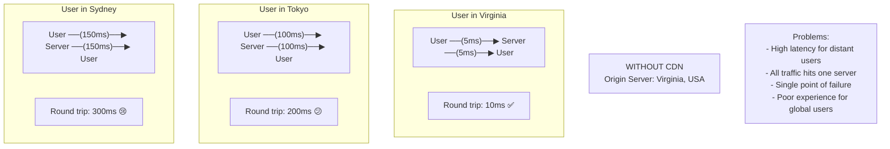
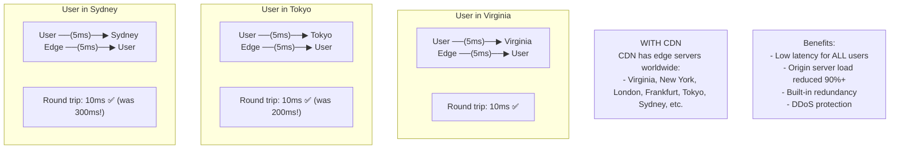
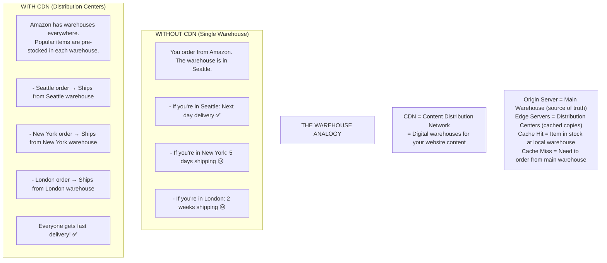
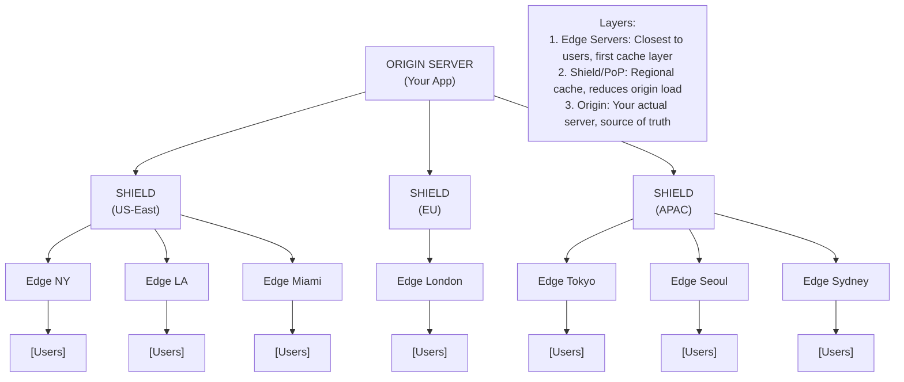
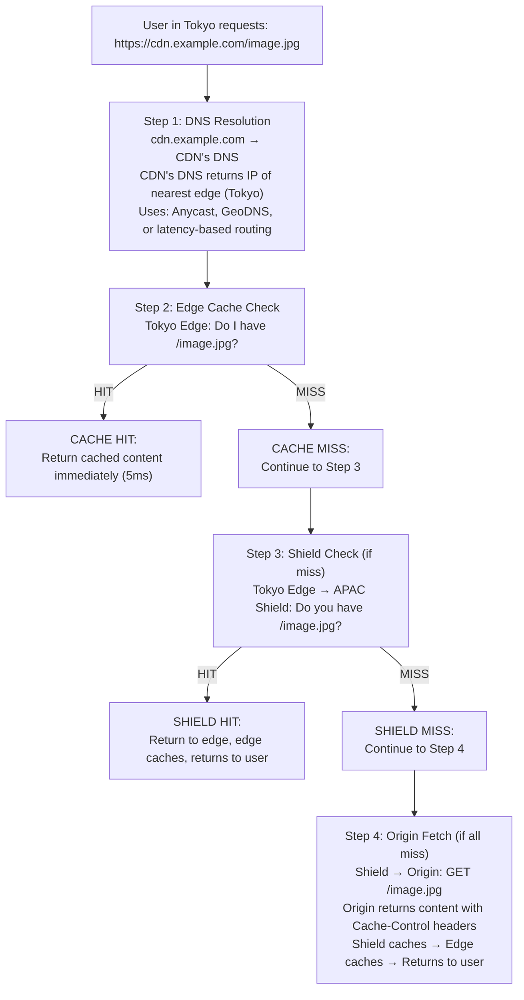
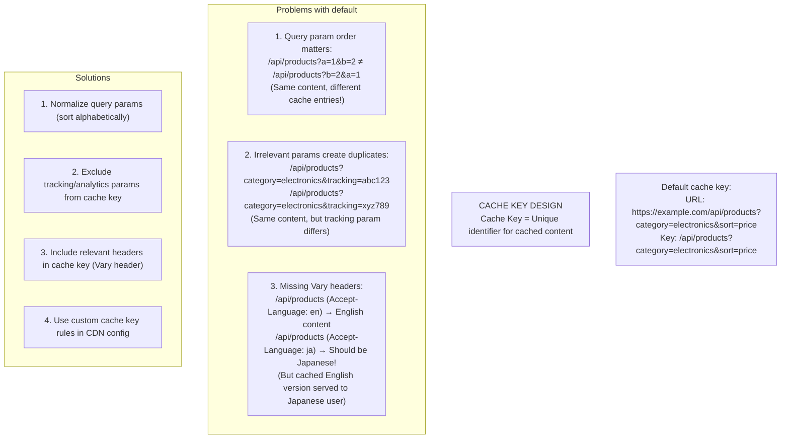
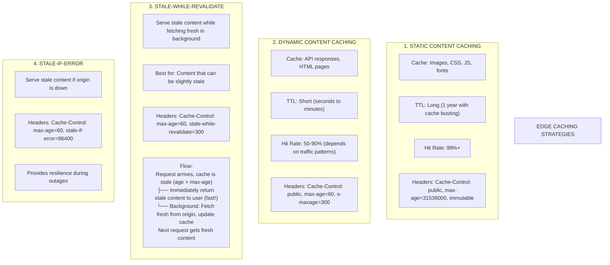
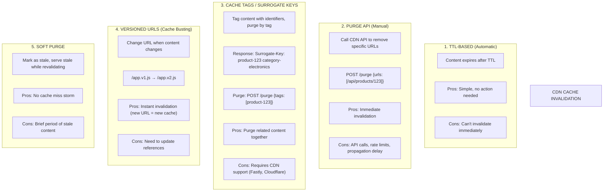
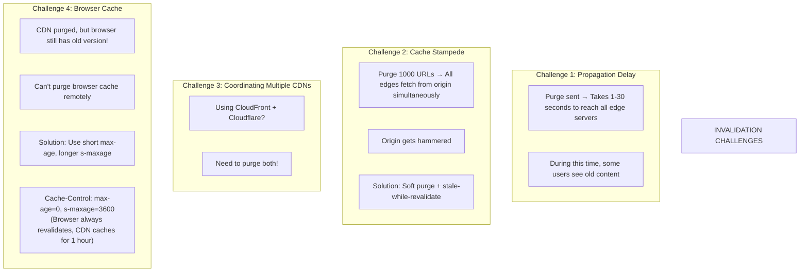

# 🌍 CDN Caching

---

## 0️⃣ Prerequisites

Before diving into CDN caching, you need to understand:

- **HTTP Caching**: Cache-Control headers, ETags, conditional requests. Covered in Topic 10.
- **DNS**: How domain names resolve to IP addresses.
- **Latency**: The time it takes for data to travel across networks.
- **Geographic Distribution**: Users are spread across the world.

If you understand that a CDN is a network of servers distributed globally to serve content closer to users, you're ready.

---

## 1️⃣ What Problem Does This Exist to Solve?

### The Pain Point

Your origin server is in Virginia. Users are everywhere.



<details>
<summary>ASCII diagram (reference)</summary>

```text
┌─────────────────────────────────────────────────────────────────────────┐
│                    WITHOUT CDN                                           │
│                                                                          │
│   Origin Server: Virginia, USA                                          │
│                                                                          │
│   User in Virginia:                                                      │
│   ┌──────────────────────────────────────────────────────────────────┐  │
│   │  User ──(5ms)──▶ Server ──(5ms)──▶ User                          │  │
│   │  Round trip: 10ms ✅                                              │  │
│   └──────────────────────────────────────────────────────────────────┘  │
│                                                                          │
│   User in Tokyo:                                                         │
│   ┌──────────────────────────────────────────────────────────────────┐  │
│   │  User ──(100ms)──▶ Server ──(100ms)──▶ User                      │  │
│   │  Round trip: 200ms 😕                                             │  │
│   └──────────────────────────────────────────────────────────────────┘  │
│                                                                          │
│   User in Sydney:                                                        │
│   ┌──────────────────────────────────────────────────────────────────┐  │
│   │  User ──(150ms)──▶ Server ──(150ms)──▶ User                      │  │
│   │  Round trip: 300ms 😢                                             │  │
│   └──────────────────────────────────────────────────────────────────┘  │
│                                                                          │
│   Problems:                                                              │
│   - High latency for distant users                                      │
│   - All traffic hits one server                                         │
│   - Single point of failure                                             │
│   - Poor experience for global users                                    │
└─────────────────────────────────────────────────────────────────────────┘
```
</details>

### With CDN



<details>
<summary>ASCII diagram (reference)</summary>

```text
┌─────────────────────────────────────────────────────────────────────────┐
│                    WITH CDN                                              │
│                                                                          │
│   CDN has edge servers worldwide:                                       │
│   - Virginia, New York, London, Frankfurt, Tokyo, Sydney, etc.          │
│                                                                          │
│   User in Virginia:                                                      │
│   ┌──────────────────────────────────────────────────────────────────┐  │
│   │  User ──(5ms)──▶ Virginia Edge ──(5ms)──▶ User                   │  │
│   │  Round trip: 10ms ✅                                              │  │
│   └──────────────────────────────────────────────────────────────────┘  │
│                                                                          │
│   User in Tokyo:                                                         │
│   ┌──────────────────────────────────────────────────────────────────┐  │
│   │  User ──(5ms)──▶ Tokyo Edge ──(5ms)──▶ User                      │  │
│   │  Round trip: 10ms ✅ (was 200ms!)                                 │  │
│   └──────────────────────────────────────────────────────────────────┘  │
│                                                                          │
│   User in Sydney:                                                        │
│   ┌──────────────────────────────────────────────────────────────────┐  │
│   │  User ──(5ms)──▶ Sydney Edge ──(5ms)──▶ User                     │  │
│   │  Round trip: 10ms ✅ (was 300ms!)                                 │  │
│   └──────────────────────────────────────────────────────────────────┘  │
│                                                                          │
│   Benefits:                                                              │
│   - Low latency for ALL users                                           │
│   - Origin server load reduced 90%+                                     │
│   - Built-in redundancy                                                 │
│   - DDoS protection                                                     │
└─────────────────────────────────────────────────────────────────────────┘
```
</details>

### Real Impact

**Netflix**: 
- Uses CDN to serve 15% of global internet traffic
- Without CDN, streaming would be impossible at scale

**Shopify**:
- CDN reduced page load time by 50%
- Increased conversion rates by 10%

---

## 2️⃣ Intuition and Mental Model

### The Warehouse Analogy



<details>
<summary>ASCII diagram (reference)</summary>

```text
┌─────────────────────────────────────────────────────────────────────────┐
│                    THE WAREHOUSE ANALOGY                                 │
│                                                                          │
│   WITHOUT CDN (Single Warehouse):                                       │
│   ─────────────────────────────────                                     │
│   You order from Amazon. The warehouse is in Seattle.                   │
│   - If you're in Seattle: Next day delivery ✅                          │
│   - If you're in New York: 5 days shipping 😕                           │
│   - If you're in London: 2 weeks shipping 😢                            │
│                                                                          │
│   WITH CDN (Distribution Centers):                                      │
│   ─────────────────────────────────                                     │
│   Amazon has warehouses everywhere.                                      │
│   Popular items are pre-stocked in each warehouse.                      │
│   - Seattle order → Ships from Seattle warehouse                        │
│   - New York order → Ships from New York warehouse                      │
│   - London order → Ships from London warehouse                          │
│   Everyone gets fast delivery! ✅                                        │
│                                                                          │
│   CDN = Content Distribution Network                                    │
│   = Digital "warehouses" for your website content                       │
│                                                                          │
│   ┌─────────────────────────────────────────────────────────────────┐   │
│   │                                                                  │   │
│   │   Origin Server = Main Warehouse (source of truth)              │   │
│   │   Edge Servers = Distribution Centers (cached copies)           │   │
│   │   Cache Hit = Item in stock at local warehouse                  │   │
│   │   Cache Miss = Need to order from main warehouse                │   │
│   │                                                                  │   │
│   └─────────────────────────────────────────────────────────────────┘   │
└─────────────────────────────────────────────────────────────────────────┘
```
</details>

---

## 3️⃣ How It Works Internally

### CDN Architecture



<details>
<summary>ASCII diagram (reference)</summary>

```text
┌─────────────────────────────────────────────────────────────────────────┐
│                    CDN ARCHITECTURE                                      │
│                                                                          │
│                         ┌─────────────────┐                             │
│                         │  ORIGIN SERVER  │                             │
│                         │   (Your App)    │                             │
│                         └────────┬────────┘                             │
│                                  │                                       │
│                    ┌─────────────┼─────────────┐                        │
│                    │             │             │                         │
│                    ▼             ▼             ▼                         │
│            ┌───────────┐ ┌───────────┐ ┌───────────┐                   │
│            │   SHIELD  │ │   SHIELD  │ │   SHIELD  │                   │
│            │  (US-East)│ │  (EU)     │ │  (APAC)   │                   │
│            └─────┬─────┘ └─────┬─────┘ └─────┬─────┘                   │
│                  │             │             │                           │
│         ┌────────┼────────┐    │    ┌────────┼────────┐                 │
│         │        │        │    │    │        │        │                 │
│         ▼        ▼        ▼    ▼    ▼        ▼        ▼                 │
│      ┌─────┐ ┌─────┐ ┌─────┐ ┌─────┐ ┌─────┐ ┌─────┐ ┌─────┐          │
│      │Edge │ │Edge │ │Edge │ │Edge │ │Edge │ │Edge │ │Edge │          │
│      │ NY  │ │ LA  │ │Miami│ │London│ │Tokyo│ │Seoul│ │Sydney│         │
│      └──┬──┘ └──┬──┘ └──┬──┘ └──┬──┘ └──┬──┘ └──┬──┘ └──┬──┘          │
│         │       │       │       │       │       │       │               │
│         ▼       ▼       ▼       ▼       ▼       ▼       ▼               │
│      [Users] [Users] [Users] [Users] [Users] [Users] [Users]           │
│                                                                          │
│   Layers:                                                                │
│   1. Edge Servers: Closest to users, first cache layer                 │
│   2. Shield/PoP: Regional cache, reduces origin load                   │
│   3. Origin: Your actual server, source of truth                       │
└─────────────────────────────────────────────────────────────────────────┘
```
</details>

### Request Flow



<details>
<summary>ASCII diagram (reference)</summary>

```text
┌─────────────────────────────────────────────────────────────────────────┐
│                    CDN REQUEST FLOW                                      │
│                                                                          │
│   User in Tokyo requests: https://cdn.example.com/image.jpg             │
│                                                                          │
│   Step 1: DNS Resolution                                                │
│   ┌─────────────────────────────────────────────────────────────────┐   │
│   │   cdn.example.com → CDN's DNS                                    │   │
│   │   CDN's DNS returns IP of nearest edge (Tokyo)                  │   │
│   │   Uses: Anycast, GeoDNS, or latency-based routing               │   │
│   └─────────────────────────────────────────────────────────────────┘   │
│                                                                          │
│   Step 2: Edge Cache Check                                              │
│   ┌─────────────────────────────────────────────────────────────────┐   │
│   │   Tokyo Edge: "Do I have /image.jpg?"                           │   │
│   │                                                                  │   │
│   │   CACHE HIT:                                                     │   │
│   │   └── Return cached content immediately (5ms)                   │   │
│   │                                                                  │   │
│   │   CACHE MISS:                                                    │   │
│   │   └── Continue to Step 3                                        │   │
│   └─────────────────────────────────────────────────────────────────┘   │
│                                                                          │
│   Step 3: Shield Check (if miss)                                        │
│   ┌─────────────────────────────────────────────────────────────────┐   │
│   │   Tokyo Edge → APAC Shield: "Do you have /image.jpg?"           │   │
│   │                                                                  │   │
│   │   SHIELD HIT:                                                    │   │
│   │   └── Return to edge, edge caches, returns to user              │   │
│   │                                                                  │   │
│   │   SHIELD MISS:                                                   │   │
│   │   └── Continue to Step 4                                        │   │
│   └─────────────────────────────────────────────────────────────────┘   │
│                                                                          │
│   Step 4: Origin Fetch (if all miss)                                    │
│   ┌─────────────────────────────────────────────────────────────────┐   │
│   │   Shield → Origin: GET /image.jpg                               │   │
│   │   Origin returns content with Cache-Control headers             │   │
│   │   Shield caches → Edge caches → Returns to user                 │   │
│   └─────────────────────────────────────────────────────────────────┘   │
└─────────────────────────────────────────────────────────────────────────┘
```
</details>

### Cache Key Design



<details>
<summary>ASCII diagram (reference)</summary>

```text
┌─────────────────────────────────────────────────────────────────────────┐
│                    CACHE KEY DESIGN                                      │
│                                                                          │
│   Cache Key = Unique identifier for cached content                      │
│                                                                          │
│   Default cache key:                                                     │
│   URL: https://example.com/api/products?category=electronics&sort=price │
│   Key: /api/products?category=electronics&sort=price                    │
│                                                                          │
│   Problems with default:                                                │
│   ─────────────────────                                                 │
│   1. Query param order matters:                                         │
│      /api/products?a=1&b=2  ≠  /api/products?b=2&a=1                   │
│      (Same content, different cache entries!)                           │
│                                                                          │
│   2. Irrelevant params create duplicates:                               │
│      /api/products?category=electronics&tracking=abc123                 │
│      /api/products?category=electronics&tracking=xyz789                 │
│      (Same content, but tracking param differs)                         │
│                                                                          │
│   3. Missing Vary headers:                                              │
│      /api/products (Accept-Language: en) → English content              │
│      /api/products (Accept-Language: ja) → Should be Japanese!          │
│      (But cached English version served to Japanese user)               │
│                                                                          │
│   Solutions:                                                             │
│   ──────────                                                            │
│   1. Normalize query params (sort alphabetically)                       │
│   2. Exclude tracking/analytics params from cache key                   │
│   3. Include relevant headers in cache key (Vary header)               │
│   4. Use custom cache key rules in CDN config                          │
└─────────────────────────────────────────────────────────────────────────┘
```
</details>

---

## 4️⃣ Edge Caching Strategies

### Strategy Comparison



<details>
<summary>ASCII diagram (reference)</summary>

```text
┌─────────────────────────────────────────────────────────────────────────┐
│                    EDGE CACHING STRATEGIES                               │
│                                                                          │
│   1. STATIC CONTENT CACHING                                             │
│   ─────────────────────────────                                         │
│   Cache: Images, CSS, JS, fonts                                         │
│   TTL: Long (1 year with cache busting)                                 │
│   Hit Rate: 99%+                                                         │
│   Headers: Cache-Control: public, max-age=31536000, immutable           │
│                                                                          │
│   2. DYNAMIC CONTENT CACHING                                            │
│   ─────────────────────────────                                         │
│   Cache: API responses, HTML pages                                      │
│   TTL: Short (seconds to minutes)                                       │
│   Hit Rate: 50-90% (depends on traffic patterns)                        │
│   Headers: Cache-Control: public, max-age=60, s-maxage=300              │
│                                                                          │
│   3. STALE-WHILE-REVALIDATE                                             │
│   ─────────────────────────────                                         │
│   Serve stale content while fetching fresh in background                │
│   Best for: Content that can be slightly stale                          │
│   Headers: Cache-Control: max-age=60, stale-while-revalidate=300        │
│                                                                          │
│   Flow:                                                                  │
│   ┌─────────────────────────────────────────────────────────────────┐   │
│   │   Request arrives, cache is stale (age > max-age)               │   │
│   │   ├── Immediately return stale content to user (fast!)          │   │
│   │   └── Background: Fetch fresh from origin, update cache         │   │
│   │   Next request gets fresh content                               │   │
│   └─────────────────────────────────────────────────────────────────┘   │
│                                                                          │
│   4. STALE-IF-ERROR                                                     │
│   ─────────────────────────────                                         │
│   Serve stale content if origin is down                                 │
│   Headers: Cache-Control: max-age=60, stale-if-error=86400              │
│   Provides resilience during outages                                    │
└─────────────────────────────────────────────────────────────────────────┘
```
</details>

---

## 5️⃣ Cache Invalidation at CDN

### Invalidation Methods



<details>
<summary>ASCII diagram (reference)</summary>

```text
┌─────────────────────────────────────────────────────────────────────────┐
│                    CDN CACHE INVALIDATION                                │
│                                                                          │
│   1. TTL-BASED (Automatic)                                              │
│   ─────────────────────────                                             │
│   Content expires after TTL                                              │
│   Pros: Simple, no action needed                                        │
│   Cons: Can't invalidate immediately                                    │
│                                                                          │
│   2. PURGE API (Manual)                                                 │
│   ─────────────────────────                                             │
│   Call CDN API to remove specific URLs                                  │
│   POST /purge {"urls": ["/api/products/123"]}                          │
│   Pros: Immediate invalidation                                          │
│   Cons: API calls, rate limits, propagation delay                      │
│                                                                          │
│   3. CACHE TAGS / SURROGATE KEYS                                        │
│   ─────────────────────────────────                                     │
│   Tag content with identifiers, purge by tag                           │
│   Response: Surrogate-Key: product-123 category-electronics            │
│   Purge: POST /purge {"tags": ["product-123"]}                         │
│   Pros: Purge related content together                                  │
│   Cons: Requires CDN support (Fastly, Cloudflare)                      │
│                                                                          │
│   4. VERSIONED URLS (Cache Busting)                                     │
│   ─────────────────────────────────                                     │
│   Change URL when content changes                                        │
│   /app.v1.js → /app.v2.js                                              │
│   Pros: Instant "invalidation" (new URL = new cache)                   │
│   Cons: Need to update references                                       │
│                                                                          │
│   5. SOFT PURGE                                                         │
│   ─────────────────────────────                                         │
│   Mark as stale, serve stale while revalidating                        │
│   Pros: No cache miss storm                                             │
│   Cons: Brief period of stale content                                   │
└─────────────────────────────────────────────────────────────────────────┘
```
</details>

### Cache Invalidation Challenges



<details>
<summary>ASCII diagram (reference)</summary>

```text
┌─────────────────────────────────────────────────────────────────────────┐
│                    INVALIDATION CHALLENGES                               │
│                                                                          │
│   Challenge 1: Propagation Delay                                        │
│   ─────────────────────────────────                                     │
│   Purge sent → Takes 1-30 seconds to reach all edge servers            │
│   During this time, some users see old content                          │
│                                                                          │
│   Challenge 2: Cache Stampede                                           │
│   ─────────────────────────────────                                     │
│   Purge 1000 URLs → All edges fetch from origin simultaneously         │
│   Origin gets hammered                                                   │
│                                                                          │
│   Solution: Soft purge + stale-while-revalidate                        │
│                                                                          │
│   Challenge 3: Coordinating Multiple CDNs                               │
│   ─────────────────────────────────                                     │
│   Using CloudFront + Cloudflare?                                        │
│   Need to purge both!                                                    │
│                                                                          │
│   Challenge 4: Browser Cache                                            │
│   ─────────────────────────────────                                     │
│   CDN purged, but browser still has old version!                        │
│   Can't purge browser cache remotely                                    │
│   Solution: Use short max-age, longer s-maxage                         │
│   Cache-Control: max-age=0, s-maxage=3600                              │
│   (Browser always revalidates, CDN caches for 1 hour)                  │
└─────────────────────────────────────────────────────────────────────────┘
```
</details>

---

## 6️⃣ How to Implement in Java

### Spring Boot with CDN Headers

```java
// CdnCacheController.java
package com.example.controller;

import com.example.domain.Product;
import com.example.service.ProductService;
import lombok.RequiredArgsConstructor;
import org.springframework.http.CacheControl;
import org.springframework.http.ResponseEntity;
import org.springframework.web.bind.annotation.*;

import java.util.concurrent.TimeUnit;

@RestController
@RequestMapping("/api/products")
@RequiredArgsConstructor
public class CdnCacheController {

    private final ProductService productService;

    /**
     * Product endpoint optimized for CDN caching
     */
    @GetMapping("/{id}")
    public ResponseEntity<Product> getProduct(@PathVariable Long id) {
        Product product = productService.findById(id);
        
        if (product == null) {
            return ResponseEntity.notFound()
                .cacheControl(CacheControl.maxAge(1, TimeUnit.MINUTES))
                .build();
        }

        String etag = "\"product-" + id + "-v" + product.getVersion() + "\"";
        
        // Surrogate keys for tag-based purging (Fastly, Cloudflare)
        String surrogateKeys = String.format(
            "product-%d category-%s all-products",
            id, product.getCategory()
        );

        return ResponseEntity.ok()
            // Browser caches for 1 minute, CDN for 1 hour
            .cacheControl(CacheControl
                .maxAge(1, TimeUnit.MINUTES)      // Browser
                .sMaxAge(1, TimeUnit.HOURS)       // CDN (s-maxage)
                .staleWhileRevalidate(5, TimeUnit.MINUTES)
                .staleIfError(1, TimeUnit.DAYS)
                .cachePublic())
            .eTag(etag)
            // Surrogate keys for cache invalidation
            .header("Surrogate-Key", surrogateKeys)
            // Cloudflare cache tags
            .header("Cache-Tag", surrogateKeys.replace(" ", ","))
            .body(product);
    }

    /**
     * Category listing with CDN caching
     */
    @GetMapping("/category/{category}")
    public ResponseEntity<List<Product>> getByCategory(@PathVariable String category) {
        List<Product> products = productService.findByCategory(category);
        
        return ResponseEntity.ok()
            .cacheControl(CacheControl
                .maxAge(30, TimeUnit.SECONDS)
                .sMaxAge(5, TimeUnit.MINUTES)
                .staleWhileRevalidate(1, TimeUnit.MINUTES)
                .cachePublic())
            .header("Surrogate-Key", "category-" + category + " all-products")
            .header("Vary", "Accept-Encoding")
            .body(products);
    }
}
```

### CDN Invalidation Service

```java
// CdnInvalidationService.java
package com.example.service;

import lombok.RequiredArgsConstructor;
import lombok.extern.slf4j.Slf4j;
import org.springframework.beans.factory.annotation.Value;
import org.springframework.stereotype.Service;
import org.springframework.web.reactive.function.client.WebClient;
import reactor.core.publisher.Mono;

import java.util.List;
import java.util.Map;

/**
 * Service to invalidate CDN cache
 * Supports multiple CDN providers
 */
@Service
@RequiredArgsConstructor
@Slf4j
public class CdnInvalidationService {

    @Value("${cdn.cloudflare.zone-id}")
    private String cloudflareZoneId;

    @Value("${cdn.cloudflare.api-token}")
    private String cloudflareApiToken;

    @Value("${cdn.fastly.service-id}")
    private String fastlyServiceId;

    @Value("${cdn.fastly.api-key}")
    private String fastlyApiKey;

    private final WebClient webClient;

    /**
     * Purge specific URLs from Cloudflare
     */
    public Mono<Void> purgeCloudflareUrls(List<String> urls) {
        String apiUrl = String.format(
            "https://api.cloudflare.com/client/v4/zones/%s/purge_cache",
            cloudflareZoneId
        );

        return webClient.post()
            .uri(apiUrl)
            .header("Authorization", "Bearer " + cloudflareApiToken)
            .bodyValue(Map.of("files", urls))
            .retrieve()
            .bodyToMono(Void.class)
            .doOnSuccess(v -> log.info("Purged {} URLs from Cloudflare", urls.size()))
            .doOnError(e -> log.error("Cloudflare purge failed: {}", e.getMessage()));
    }

    /**
     * Purge by cache tags from Cloudflare
     */
    public Mono<Void> purgeCloudflareByTags(List<String> tags) {
        String apiUrl = String.format(
            "https://api.cloudflare.com/client/v4/zones/%s/purge_cache",
            cloudflareZoneId
        );

        return webClient.post()
            .uri(apiUrl)
            .header("Authorization", "Bearer " + cloudflareApiToken)
            .bodyValue(Map.of("tags", tags))
            .retrieve()
            .bodyToMono(Void.class)
            .doOnSuccess(v -> log.info("Purged tags {} from Cloudflare", tags))
            .doOnError(e -> log.error("Cloudflare tag purge failed: {}", e.getMessage()));
    }

    /**
     * Purge by surrogate key from Fastly
     */
    public Mono<Void> purgeFastlyBySurrogateKey(String surrogateKey) {
        String apiUrl = String.format(
            "https://api.fastly.com/service/%s/purge/%s",
            fastlyServiceId, surrogateKey
        );

        return webClient.post()
            .uri(apiUrl)
            .header("Fastly-Key", fastlyApiKey)
            .retrieve()
            .bodyToMono(Void.class)
            .doOnSuccess(v -> log.info("Purged surrogate key {} from Fastly", surrogateKey))
            .doOnError(e -> log.error("Fastly purge failed: {}", e.getMessage()));
    }

    /**
     * Soft purge from Fastly (mark stale, don't delete)
     */
    public Mono<Void> softPurgeFastly(String surrogateKey) {
        String apiUrl = String.format(
            "https://api.fastly.com/service/%s/purge/%s",
            fastlyServiceId, surrogateKey
        );

        return webClient.post()
            .uri(apiUrl)
            .header("Fastly-Key", fastlyApiKey)
            .header("Fastly-Soft-Purge", "1")  // Soft purge
            .retrieve()
            .bodyToMono(Void.class)
            .doOnSuccess(v -> log.info("Soft purged {} from Fastly", surrogateKey));
    }

    /**
     * Purge all caches (use sparingly!)
     */
    public Mono<Void> purgeAll() {
        Mono<Void> cloudflare = webClient.post()
            .uri("https://api.cloudflare.com/client/v4/zones/{zoneId}/purge_cache", cloudflareZoneId)
            .header("Authorization", "Bearer " + cloudflareApiToken)
            .bodyValue(Map.of("purge_everything", true))
            .retrieve()
            .bodyToMono(Void.class);

        Mono<Void> fastly = webClient.post()
            .uri("https://api.fastly.com/service/{serviceId}/purge_all", fastlyServiceId)
            .header("Fastly-Key", fastlyApiKey)
            .retrieve()
            .bodyToMono(Void.class);

        return Mono.when(cloudflare, fastly)
            .doOnSuccess(v -> log.warn("Purged ALL caches!"));
    }
}
```

### Event-Driven Cache Invalidation

```java
// ProductEventListener.java
package com.example.listener;

import com.example.event.ProductUpdatedEvent;
import com.example.service.CdnInvalidationService;
import lombok.RequiredArgsConstructor;
import lombok.extern.slf4j.Slf4j;
import org.springframework.context.event.EventListener;
import org.springframework.scheduling.annotation.Async;
import org.springframework.stereotype.Component;

import java.util.List;

/**
 * Automatically invalidate CDN cache when products change
 */
@Component
@RequiredArgsConstructor
@Slf4j
public class ProductEventListener {

    private final CdnInvalidationService cdnService;

    @Async
    @EventListener
    public void onProductUpdated(ProductUpdatedEvent event) {
        Long productId = event.getProductId();
        String category = event.getCategory();

        log.info("Product {} updated, invalidating CDN cache", productId);

        // Invalidate by surrogate keys
        List<String> tags = List.of(
            "product-" + productId,
            "category-" + category
        );

        // Use soft purge to avoid cache stampede
        cdnService.softPurgeFastly("product-" + productId)
            .then(cdnService.purgeCloudflareByTags(tags))
            .subscribe(
                null,
                error -> log.error("CDN invalidation failed: {}", error.getMessage()),
                () -> log.info("CDN cache invalidated for product {}", productId)
            );
    }

    @Async
    @EventListener
    public void onCategoryUpdated(CategoryUpdatedEvent event) {
        String category = event.getCategoryName();
        
        // Invalidate all products in category
        cdnService.softPurgeFastly("category-" + category)
            .subscribe();
    }
}
```

### Nginx CDN Configuration

```nginx
# nginx.conf - Acting as a CDN edge/cache

proxy_cache_path /var/cache/nginx levels=1:2 keys_zone=cdn_cache:100m 
                 max_size=10g inactive=60m use_temp_path=off;

server {
    listen 80;
    server_name cdn.example.com;

    # Cache static assets aggressively
    location ~* \.(js|css|png|jpg|jpeg|gif|ico|svg|woff2?)$ {
        proxy_pass http://origin;
        proxy_cache cdn_cache;
        proxy_cache_valid 200 1y;
        proxy_cache_valid 404 1m;
        
        # Add cache status header
        add_header X-Cache-Status $upstream_cache_status;
        
        # Ignore origin cache headers for static files
        proxy_ignore_headers Cache-Control Expires;
        
        # Set our own cache headers
        add_header Cache-Control "public, max-age=31536000, immutable";
    }

    # Cache API responses based on origin headers
    location /api/ {
        proxy_pass http://origin;
        proxy_cache cdn_cache;
        
        # Respect origin cache headers
        proxy_cache_valid 200 5m;
        proxy_cache_use_stale error timeout updating http_500 http_502 http_503;
        proxy_cache_background_update on;
        proxy_cache_lock on;
        
        # Include query string in cache key
        proxy_cache_key $scheme$proxy_host$request_uri;
        
        # Vary by these headers
        proxy_cache_bypass $http_authorization;
        
        add_header X-Cache-Status $upstream_cache_status;
    }

    # Purge endpoint (restrict access!)
    location /purge/ {
        allow 10.0.0.0/8;
        deny all;
        
        proxy_cache_purge cdn_cache $scheme$proxy_host$request_uri;
    }
}
```

---

## 7️⃣ Tradeoffs and Common Mistakes

### Common Mistakes

**1. Caching personalized content on CDN**
```java
// WRONG: User-specific data cached publicly
@GetMapping("/api/user/profile")
public ResponseEntity<UserProfile> getProfile() {
    return ResponseEntity.ok()
        .cacheControl(CacheControl.maxAge(1, TimeUnit.HOURS).cachePublic())
        .body(getCurrentUserProfile());  // User A sees User B's profile!
}

// RIGHT: Private cache or no CDN caching
@GetMapping("/api/user/profile")
public ResponseEntity<UserProfile> getProfile() {
    return ResponseEntity.ok()
        .cacheControl(CacheControl.maxAge(5, TimeUnit.MINUTES).cachePrivate())
        .body(getCurrentUserProfile());
}
```

**2. Not using Vary header**
```java
// WRONG: Same cache for all Accept-Encoding
// User with gzip gets uncompressed version cached by previous user

// RIGHT: Vary by compression
return ResponseEntity.ok()
    .header("Vary", "Accept-Encoding")
    .body(content);
```

**3. Cache key including irrelevant params**
```
// These should be same cache entry:
/api/products?category=electronics&utm_source=google
/api/products?category=electronics&utm_source=facebook

// Solution: Configure CDN to ignore utm_* params in cache key
```

**4. Not handling cache stampede on purge**
```java
// WRONG: Hard purge causes all edges to hit origin
cdnService.purgeAll();

// RIGHT: Soft purge + stale-while-revalidate
cdnService.softPurge(key);  // Mark stale, serve while revalidating
```

---

## 8️⃣ Interview Follow-Up Questions WITH Answers

### L4 Questions

**Q: What is a CDN and why do we use it?**

A: A CDN (Content Delivery Network) is a network of servers distributed globally that cache and serve content closer to users. We use CDNs to reduce latency (content served from nearby edge server instead of distant origin), reduce origin server load (90%+ of requests served from cache), improve availability (if origin is down, CDN can serve cached content), and provide DDoS protection. For static assets like images and JavaScript, CDNs can reduce load times from seconds to milliseconds.

### L5 Questions

**Q: How would you handle cache invalidation for a CDN?**

A: Multiple strategies depending on content type: (1) For static assets with cache busting (versioned filenames), no invalidation needed - new version = new URL. (2) For dynamic content, use short TTLs with stale-while-revalidate so content naturally refreshes. (3) For immediate invalidation, use surrogate keys/cache tags - tag related content together and purge by tag. (4) Use soft purge instead of hard purge to avoid cache stampede. (5) For critical updates, combine short browser cache (max-age=0) with longer CDN cache (s-maxage=3600) so CDN purge is effective. Always consider propagation delay (1-30 seconds for purge to reach all edges).

### L6 Questions

**Q: Design a CDN caching strategy for an e-commerce site with millions of products.**

A: Multi-tier approach:

**Product images**: Long cache (1 year) with content-hash filenames. Immutable once deployed.

**Product pages**: `Cache-Control: public, max-age=60, s-maxage=300, stale-while-revalidate=60`. CDN caches 5 minutes, serves stale for 1 minute while refreshing. Surrogate keys: `product-{id}`, `category-{name}`.

**Product API**: Same as pages. Use ETag based on product version for conditional requests.

**Search results**: `max-age=30, s-maxage=120`. Shorter TTL due to inventory changes.

**Cart/Checkout**: `Cache-Control: private, no-store`. Never cache on CDN.

**Invalidation**: Event-driven using surrogate keys. When product updates, soft-purge `product-{id}` tag. When category updates, purge `category-{name}`. Use Kafka to distribute invalidation events to all regions.

**Cache key design**: Normalize query params, exclude tracking params (utm_*), include Accept-Language for localized content.

**Shield layer**: Use regional shields to reduce origin load. 95% of requests should hit edge, 4% hit shield, 1% hit origin.

---

## 9️⃣ One Clean Mental Summary

CDN caching places your content on servers worldwide, serving users from the nearest location. Edge servers cache content based on Cache-Control headers. Use long TTLs with cache busting for static assets, shorter TTLs with stale-while-revalidate for dynamic content. Invalidate using surrogate keys/cache tags to purge related content together. Use soft purge to avoid cache stampede. Set s-maxage for CDN-specific TTL separate from browser cache. Always use Vary header for content that differs by request headers. CDN caching can reduce latency by 90%+ and origin load by 95%+, but requires careful cache key design and invalidation strategy to avoid serving stale or incorrect content.

