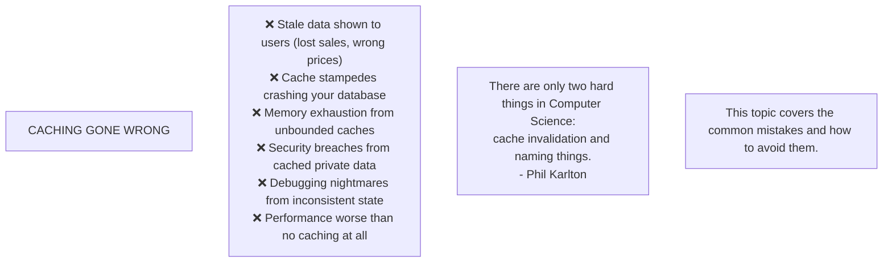
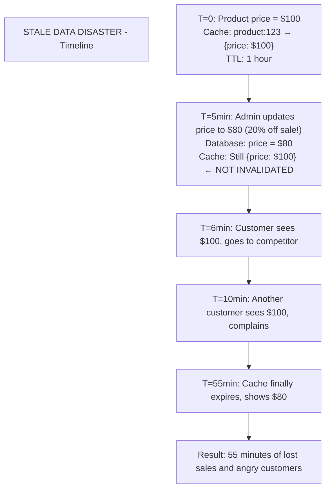
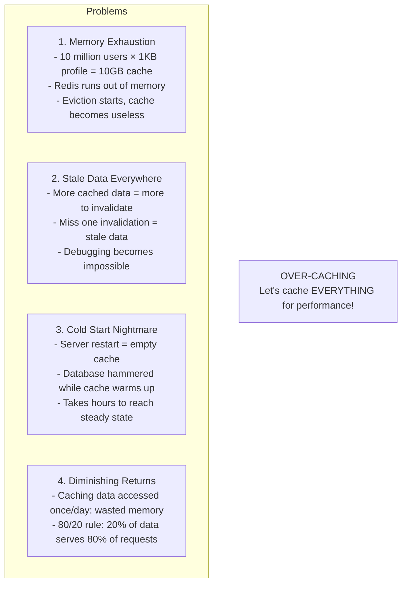
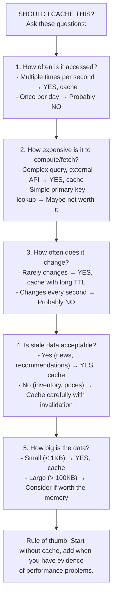
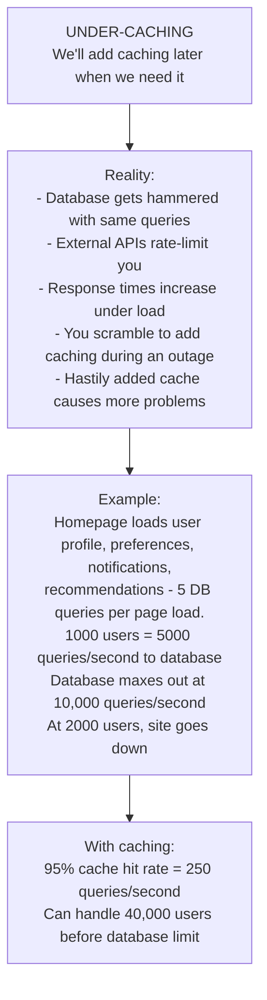
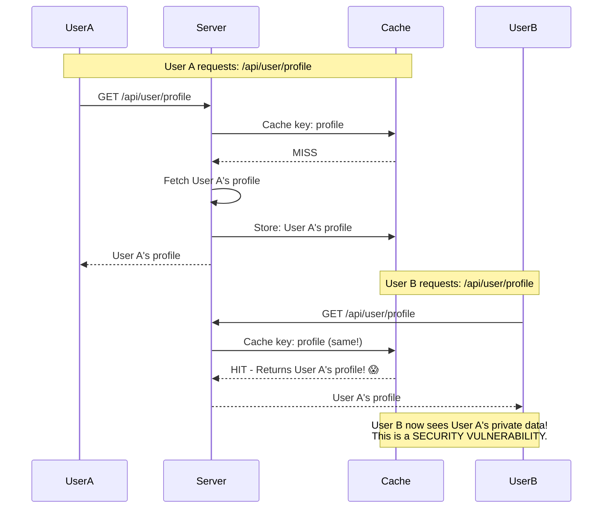
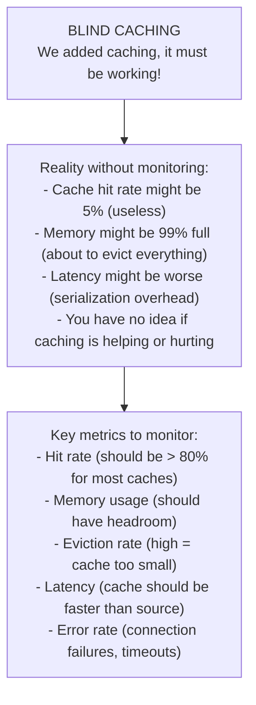
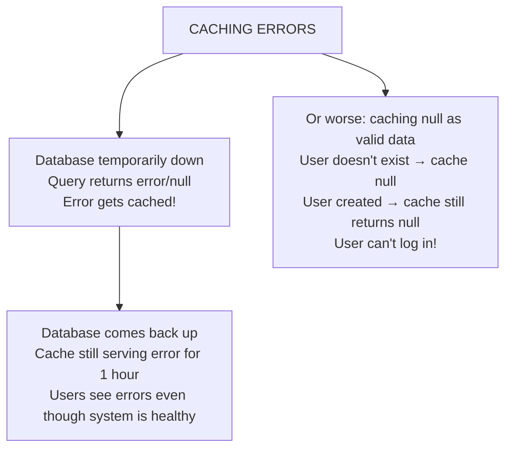
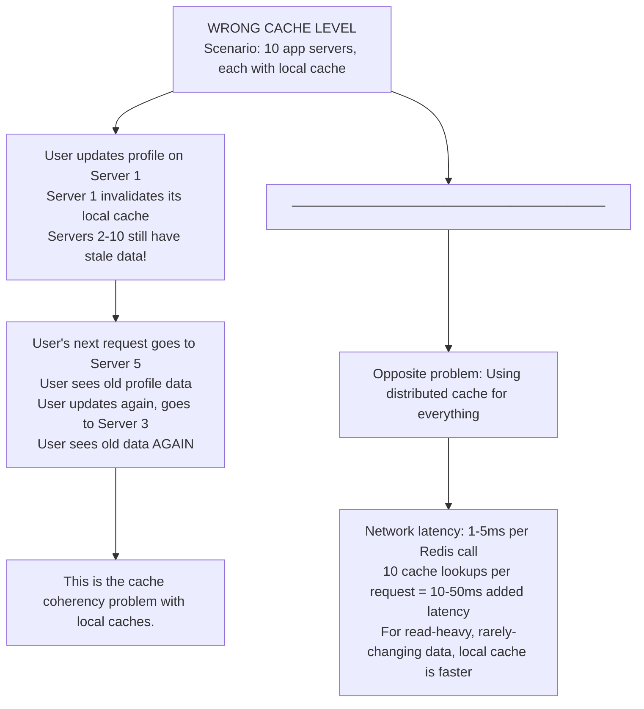
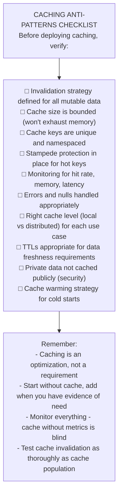

# ⚠️ Caching Anti-Patterns

---

## 0️⃣ Prerequisites

Before studying caching anti-patterns, you should understand:

- **Caching Patterns**: Cache-Aside, Write-Through, Write-Behind. Covered in Topic 1.
- **Cache Invalidation**: TTL, event-based, version-based. Covered in Topic 2.
- **Cache Stampede**: Thundering herd problem. Covered in Topic 5.
- **HTTP Caching**: Cache-Control headers. Covered in Topic 10.

If you've implemented caching before and want to avoid common pitfalls, you're ready.

---

## 1️⃣ What Problem Does This Exist to Solve?

### The Pain Point

Caching seems simple: store data, retrieve it faster. But incorrect caching can cause:



<details>
<summary>ASCII diagram (reference)</summary>

```text
┌─────────────────────────────────────────────────────────────────────────┐
│                    CACHING GONE WRONG                                    │
│                                                                          │
│   ❌ Stale data shown to users (lost sales, wrong prices)               │
│   ❌ Cache stampedes crashing your database                             │
│   ❌ Memory exhaustion from unbounded caches                            │
│   ❌ Security breaches from cached private data                         │
│   ❌ Debugging nightmares from inconsistent state                       │
│   ❌ Performance worse than no caching at all                           │
│                                                                          │
│   "There are only two hard things in Computer Science:                  │
│    cache invalidation and naming things."                               │
│                                    - Phil Karlton                        │
│                                                                          │
│   This topic covers the common mistakes and how to avoid them.          │
└─────────────────────────────────────────────────────────────────────────┘
```
</details>

---

## 2️⃣ Anti-Pattern #1: Caching Mutable Data Without Invalidation

### The Problem



<details>
<summary>ASCII diagram (reference)</summary>

```text
┌─────────────────────────────────────────────────────────────────────────┐
│                    STALE DATA DISASTER                                   │
│                                                                          │
│   Timeline:                                                              │
│                                                                          │
│   T=0:  Product price = $100                                            │
│         Cache: product:123 → {price: $100}                              │
│         TTL: 1 hour                                                      │
│                                                                          │
│   T=5min: Admin updates price to $80 (20% off sale!)                   │
│           Database: price = $80                                          │
│           Cache: Still {price: $100} ← NOT INVALIDATED                  │
│                                                                          │
│   T=6min: Customer sees $100, goes to competitor                        │
│   T=10min: Another customer sees $100, complains                        │
│   T=55min: Cache finally expires, shows $80                             │
│                                                                          │
│   Result: 55 minutes of lost sales and angry customers                  │
└─────────────────────────────────────────────────────────────────────────┘
```
</details>

### Bad Code

```java
// ❌ ANTI-PATTERN: Cache without invalidation
@Service
public class ProductService {
    
    @Cacheable(value = "products", key = "#id")
    public Product getProduct(Long id) {
        return productRepository.findById(id).orElse(null);
    }
    
    // NO @CacheEvict! Updates don't invalidate cache!
    public Product updateProduct(Long id, ProductUpdateRequest request) {
        Product product = productRepository.findById(id).orElseThrow();
        product.setPrice(request.getPrice());
        return productRepository.save(product);
        // Cache still has old price!
    }
}
```

### Good Code

```java
// ✅ CORRECT: Always invalidate on mutation
@Service
public class ProductService {
    
    @Cacheable(value = "products", key = "#id")
    public Product getProduct(Long id) {
        return productRepository.findById(id).orElse(null);
    }
    
    @CacheEvict(value = "products", key = "#id")
    public Product updateProduct(Long id, ProductUpdateRequest request) {
        Product product = productRepository.findById(id).orElseThrow();
        product.setPrice(request.getPrice());
        return productRepository.save(product);
    }
    
    @CacheEvict(value = "products", key = "#id")
    public void deleteProduct(Long id) {
        productRepository.deleteById(id);
    }
    
    // For batch updates, evict all
    @CacheEvict(value = "products", allEntries = true)
    public void bulkUpdatePrices(List<PriceUpdate> updates) {
        // ... bulk update logic
    }
}
```

### Even Better: Event-Driven Invalidation

```java
// ✅ BEST: Decouple invalidation from business logic
@Service
public class ProductService {
    
    private final ApplicationEventPublisher eventPublisher;
    
    public Product updateProduct(Long id, ProductUpdateRequest request) {
        Product product = productRepository.findById(id).orElseThrow();
        product.setPrice(request.getPrice());
        Product saved = productRepository.save(product);
        
        // Publish event - cache invalidation happens elsewhere
        eventPublisher.publishEvent(new ProductUpdatedEvent(id));
        
        return saved;
    }
}

@Component
public class CacheInvalidationListener {
    
    private final CacheManager cacheManager;
    
    @EventListener
    public void onProductUpdated(ProductUpdatedEvent event) {
        Cache cache = cacheManager.getCache("products");
        if (cache != null) {
            cache.evict(event.getProductId());
        }
    }
}
```

---

## 3️⃣ Anti-Pattern #2: Over-Caching (Everything in Cache)

### The Problem



<details>
<summary>ASCII diagram (reference)</summary>

```text
┌─────────────────────────────────────────────────────────────────────────┐
│                    OVER-CACHING                                          │
│                                                                          │
│   "Let's cache EVERYTHING for performance!"                             │
│                                                                          │
│   Problems:                                                              │
│                                                                          │
│   1. Memory Exhaustion                                                   │
│      - 10 million users × 1KB profile = 10GB cache                      │
│      - Redis runs out of memory                                          │
│      - Eviction starts, cache becomes useless                           │
│                                                                          │
│   2. Stale Data Everywhere                                              │
│      - More cached data = more to invalidate                            │
│      - Miss one invalidation = stale data                               │
│      - Debugging becomes impossible                                      │
│                                                                          │
│   3. Cold Start Nightmare                                               │
│      - Server restart = empty cache                                      │
│      - Database hammered while cache warms up                           │
│      - Takes hours to reach steady state                                │
│                                                                          │
│   4. Diminishing Returns                                                │
│      - Caching data accessed once/day: wasted memory                    │
│      - 80/20 rule: 20% of data serves 80% of requests                  │
└─────────────────────────────────────────────────────────────────────────┘
```
</details>

### Bad Code

```java
// ❌ ANTI-PATTERN: Cache everything
@Service
public class UserService {
    
    // Caches ALL user profiles - millions of entries!
    @Cacheable("users")
    public User getUser(Long id) {
        return userRepository.findById(id).orElse(null);
    }
    
    // Caches ALL user preferences
    @Cacheable("preferences")
    public UserPreferences getPreferences(Long userId) {
        return preferencesRepository.findByUserId(userId);
    }
    
    // Caches ALL user activity logs (huge!)
    @Cacheable("activity")
    public List<ActivityLog> getActivityLog(Long userId) {
        return activityRepository.findByUserId(userId);
    }
    
    // Caches rarely-accessed audit data
    @Cacheable("audit")
    public List<AuditEntry> getAuditHistory(Long userId) {
        return auditRepository.findByUserId(userId);
    }
}
```

### Good Code

```java
// ✅ CORRECT: Cache strategically based on access patterns
@Service
public class UserService {
    
    // Cache hot data with bounded size
    @Cacheable(value = "users", unless = "#result == null")
    public User getUser(Long id) {
        return userRepository.findById(id).orElse(null);
    }
    
    // Don't cache rarely accessed data
    public List<AuditEntry> getAuditHistory(Long userId) {
        // Accessed rarely, large data - don't cache
        return auditRepository.findByUserId(userId);
    }
}

// Configuration with bounded cache
@Configuration
public class CacheConfig {
    
    @Bean
    public CacheManager cacheManager() {
        CaffeineCacheManager manager = new CaffeineCacheManager();
        manager.setCaffeine(Caffeine.newBuilder()
            .maximumSize(10_000)        // Bound the cache size!
            .expireAfterWrite(Duration.ofMinutes(10))
            .recordStats());            // Monitor hit rates
        return manager;
    }
}
```

### Decision Framework



<details>
<summary>ASCII diagram (reference)</summary>

```text
┌─────────────────────────────────────────────────────────────────────────┐
│                    SHOULD I CACHE THIS?                                  │
│                                                                          │
│   Ask these questions:                                                   │
│                                                                          │
│   1. How often is it accessed?                                          │
│      - Multiple times per second → YES, cache                           │
│      - Once per day → Probably NO                                       │
│                                                                          │
│   2. How expensive is it to compute/fetch?                              │
│      - Complex query, external API → YES, cache                         │
│      - Simple primary key lookup → Maybe not worth it                   │
│                                                                          │
│   3. How often does it change?                                          │
│      - Rarely changes → YES, cache with long TTL                        │
│      - Changes every second → Probably NO                               │
│                                                                          │
│   4. Is stale data acceptable?                                          │
│      - Yes (news, recommendations) → YES, cache                         │
│      - No (inventory, prices) → Cache carefully with invalidation       │
│                                                                          │
│   5. How big is the data?                                               │
│      - Small (< 1KB) → YES, cache                                       │
│      - Large (> 100KB) → Consider if worth the memory                   │
│                                                                          │
│   Rule of thumb: Start without cache, add when you have evidence        │
│   of performance problems.                                               │
└─────────────────────────────────────────────────────────────────────────┘
```
</details>

---

## 4️⃣ Anti-Pattern #3: Under-Caching (No Cache Strategy)

### The Problem



<details>
<summary>ASCII diagram (reference)</summary>

```text
┌─────────────────────────────────────────────────────────────────────────┐
│                    UNDER-CACHING                                         │
│                                                                          │
│   "We'll add caching later when we need it"                             │
│                                                                          │
│   Reality:                                                               │
│                                                                          │
│   - Database gets hammered with same queries                            │
│   - External APIs rate-limit you                                        │
│   - Response times increase under load                                  │
│   - You scramble to add caching during an outage                        │
│   - Hastily added cache causes more problems                            │
│                                                                          │
│   Example:                                                               │
│   Homepage loads user profile, preferences, notifications,              │
│   recommendations - 5 DB queries per page load.                         │
│   1000 users = 5000 queries/second to database                          │
│   Database maxes out at 10,000 queries/second                           │
│   At 2000 users, site goes down                                         │
│                                                                          │
│   With caching:                                                          │
│   95% cache hit rate = 250 queries/second                               │
│   Can handle 40,000 users before database limit                         │
└─────────────────────────────────────────────────────────────────────────┘
```
</details>

### Bad Code

```java
// ❌ ANTI-PATTERN: No caching at all
@RestController
public class HomeController {
    
    @GetMapping("/home")
    public HomePageData getHomePage(@AuthUser User user) {
        // Every single request hits the database
        User profile = userService.getUser(user.getId());           // DB hit
        List<Notification> notifs = notificationService.get(user);  // DB hit
        List<Product> recommended = recommendationService.get(user); // DB hit + ML
        List<Order> orders = orderService.getRecent(user);          // DB hit
        
        return new HomePageData(profile, notifs, recommended, orders);
    }
}
```

### Good Code

```java
// ✅ CORRECT: Strategic caching
@RestController
public class HomeController {
    
    @GetMapping("/home")
    public HomePageData getHomePage(@AuthUser User user) {
        Long userId = user.getId();
        
        // User profile - cached, rarely changes
        User profile = userService.getUser(userId);
        
        // Notifications - cached briefly (1 min)
        List<Notification> notifs = notificationService.getCached(userId);
        
        // Recommendations - cached longer (computed daily)
        List<Product> recommended = recommendationService.getCached(userId);
        
        // Recent orders - cached briefly
        List<Order> orders = orderService.getRecentCached(userId);
        
        return new HomePageData(profile, notifs, recommended, orders);
    }
}

@Service
public class RecommendationService {
    
    // Expensive computation, cache for 1 hour
    @Cacheable(value = "recommendations", key = "#userId")
    public List<Product> getCached(Long userId) {
        // This expensive ML computation only runs on cache miss
        return computeRecommendations(userId);
    }
}
```

---

## 5️⃣ Anti-Pattern #4: Cache Key Collisions

### The Problem



<details>
<summary>ASCII diagram (reference)</summary>

```text
┌─────────────────────────────────────────────────────────────────────────┐
│                    CACHE KEY COLLISION                                   │
│                                                                          │
│   User A requests: /api/user/profile                                    │
│   Cache key: "profile"                                                   │
│   Stored: User A's profile                                              │
│                                                                          │
│   User B requests: /api/user/profile                                    │
│   Cache key: "profile" (same!)                                          │
│   Returns: User A's profile! 😱                                         │
│                                                                          │
│   User B now sees User A's private data!                                │
│   This is a SECURITY VULNERABILITY.                                     │
└─────────────────────────────────────────────────────────────────────────┘
```
</details>

### Bad Code

```java
// ❌ ANTI-PATTERN: Non-unique cache keys
@Service
public class UserService {
    
    // Key doesn't include user ID!
    @Cacheable(value = "profile")  // Same key for ALL users!
    public UserProfile getProfile(Long userId) {
        return profileRepository.findByUserId(userId);
    }
    
    // Key collision between different entities
    @Cacheable(value = "data", key = "#id")
    public Product getProduct(Long id) { ... }
    
    @Cacheable(value = "data", key = "#id")  // Same cache, same key pattern!
    public User getUser(Long id) { ... }
    // Product 123 and User 123 collide!
}
```

### Good Code

```java
// ✅ CORRECT: Unique, namespaced cache keys
@Service
public class UserService {
    
    // Include user ID in key
    @Cacheable(value = "profiles", key = "#userId")
    public UserProfile getProfile(Long userId) {
        return profileRepository.findByUserId(userId);
    }
}

@Service
public class ProductService {
    
    // Separate cache namespace
    @Cacheable(value = "products", key = "#id")
    public Product getProduct(Long id) { ... }
}

// Or use explicit key generation
@Service
public class DataService {
    
    @Cacheable(value = "data", key = "'product:' + #id")
    public Product getProduct(Long id) { ... }
    
    @Cacheable(value = "data", key = "'user:' + #id")
    public User getUser(Long id) { ... }
}
```

### Custom Key Generator

```java
// ✅ BEST: Custom key generator for complex scenarios
@Component
public class SecureCacheKeyGenerator implements KeyGenerator {
    
    @Override
    public Object generate(Object target, Method method, Object... params) {
        StringBuilder key = new StringBuilder();
        
        // Include class and method name
        key.append(target.getClass().getSimpleName());
        key.append(".");
        key.append(method.getName());
        
        // Include all parameters
        for (Object param : params) {
            key.append(":");
            key.append(param != null ? param.toString() : "null");
        }
        
        return key.toString();
    }
}

// Usage
@Cacheable(value = "data", keyGenerator = "secureCacheKeyGenerator")
public UserProfile getProfile(Long userId, String region) {
    // Key: "UserService.getProfile:123:us-east"
}
```

---

## 6️⃣ Anti-Pattern #5: Ignoring Cache Stampede

### The Problem

```mermaid
flowchart TD
    Title["CACHE STAMPEDE<br/>Popular item cached with 1-hour TTL<br/>1000 requests/second for this item"]
    
    T1["T=59:59 - Cache valid, all requests served from cache"]
    T2["T=60:00 - Cache expires"]
    T3["T=60:01 - 1000 requests all see cache miss<br/>1000 requests ALL hit database simultaneously!"]
    
    subgraph Stampede[""]
        R1["Request 1"]
        R2["Request 2"]
        R3["Request 3"]
        R1000["Request 1000"]
        
        CacheMiss["Cache Miss"]
        Database["Database"]
        Crash["CRASH!"]
        
        R1 & R2 & R3 & R1000 --> CacheMiss --> Database --> Crash
    end
    
    Note["All 1000 requests execute the same expensive query!<br/>This is covered in detail in Topic 5, but here's the summary:"]
    
    Title --> T1 --> T2 --> T3 --> Stampede --> Note
```

<details>
<summary>ASCII diagram (reference)</summary>

```text
┌─────────────────────────────────────────────────────────────────────────┐
│                    CACHE STAMPEDE                                        │
│                                                                          │
│   Popular item cached with 1-hour TTL                                   │
│   1000 requests/second for this item                                    │
│                                                                          │
│   T=59:59 - Cache valid, all requests served from cache                │
│   T=60:00 - Cache expires                                               │
│   T=60:01 - 1000 requests all see cache miss                           │
│             1000 requests ALL hit database simultaneously!              │
│                                                                          │
│   ┌─────────────────────────────────────────────────────────────────┐   │
│   │                                                                  │   │
│   │   Request 1 ──┐                                                  │   │
│   │   Request 2 ──┼──▶ Cache Miss ──┬──▶ Database ──▶ CRASH!       │   │
│   │   Request 3 ──┤                 │                                │   │
│   │   ...         │                 │                                │   │
│   │   Request 1000┘                 │                                │   │
│   │                                                                  │   │
│   │   All 1000 requests execute the same expensive query!           │   │
│   │                                                                  │   │
│   └─────────────────────────────────────────────────────────────────┘   │
│                                                                          │
│   This is covered in detail in Topic 5, but here's the summary:        │
└─────────────────────────────────────────────────────────────────────────┘
```
</details>

### Bad Code

```java
// ❌ ANTI-PATTERN: No stampede protection
@Service
public class ProductService {
    
    @Cacheable(value = "products", key = "#id")
    public Product getProduct(Long id) {
        // 1000 concurrent cache misses = 1000 DB queries
        return productRepository.findById(id).orElse(null);
    }
}
```

### Good Code

```java
// ✅ CORRECT: Stampede protection with locking
@Service
public class ProductService {
    
    private final RedisTemplate<String, Object> redis;
    private final ProductRepository repository;
    
    public Product getProduct(Long id) {
        String cacheKey = "product:" + id;
        String lockKey = "lock:" + cacheKey;
        
        // Try cache first
        Product cached = (Product) redis.opsForValue().get(cacheKey);
        if (cached != null) {
            return cached;
        }
        
        // Try to acquire lock
        Boolean acquired = redis.opsForValue()
            .setIfAbsent(lockKey, "1", Duration.ofSeconds(10));
        
        if (Boolean.TRUE.equals(acquired)) {
            try {
                // Double-check cache (another thread might have populated it)
                cached = (Product) redis.opsForValue().get(cacheKey);
                if (cached != null) {
                    return cached;
                }
                
                // Fetch from DB and cache
                Product product = repository.findById(id).orElse(null);
                if (product != null) {
                    redis.opsForValue().set(cacheKey, product, Duration.ofHours(1));
                }
                return product;
            } finally {
                redis.delete(lockKey);
            }
        } else {
            // Wait for other thread to populate cache
            for (int i = 0; i < 50; i++) {
                try { Thread.sleep(100); } catch (InterruptedException e) { break; }
                cached = (Product) redis.opsForValue().get(cacheKey);
                if (cached != null) {
                    return cached;
                }
            }
            // Timeout - fetch from DB as fallback
            return repository.findById(id).orElse(null);
        }
    }
}
```

---

## 7️⃣ Anti-Pattern #6: Caching Without Monitoring

### The Problem



<details>
<summary>ASCII diagram (reference)</summary>

```text
┌─────────────────────────────────────────────────────────────────────────┐
│                    BLIND CACHING                                         │
│                                                                          │
│   "We added caching, it must be working!"                               │
│                                                                          │
│   Reality without monitoring:                                            │
│                                                                          │
│   - Cache hit rate might be 5% (useless)                                │
│   - Memory might be 99% full (about to evict everything)                │
│   - Latency might be worse (serialization overhead)                     │
│   - You have no idea if caching is helping or hurting                   │
│                                                                          │
│   Key metrics to monitor:                                                │
│   - Hit rate (should be > 80% for most caches)                          │
│   - Memory usage (should have headroom)                                 │
│   - Eviction rate (high = cache too small)                              │
│   - Latency (cache should be faster than source)                        │
│   - Error rate (connection failures, timeouts)                          │
└─────────────────────────────────────────────────────────────────────────┘
```
</details>

### Good Code

```java
// ✅ CORRECT: Cache with monitoring
@Configuration
public class CacheConfig {
    
    @Bean
    public CacheManager cacheManager(MeterRegistry meterRegistry) {
        CaffeineCacheManager manager = new CaffeineCacheManager();
        manager.setCaffeine(Caffeine.newBuilder()
            .maximumSize(10_000)
            .expireAfterWrite(Duration.ofMinutes(10))
            .recordStats());  // Enable stats!
        
        // Expose metrics
        manager.getCacheNames().forEach(name -> {
            Cache cache = manager.getCache(name);
            if (cache != null && cache.getNativeCache() instanceof com.github.benmanes.caffeine.cache.Cache) {
                var caffeineCache = (com.github.benmanes.caffeine.cache.Cache<?, ?>) cache.getNativeCache();
                CaffeineCacheMetrics.monitor(meterRegistry, caffeineCache, name);
            }
        });
        
        return manager;
    }
}

// Custom metrics for Redis
@Component
public class RedisCacheMetrics {
    
    private final RedisTemplate<String, Object> redis;
    private final MeterRegistry meterRegistry;
    
    @Scheduled(fixedRate = 60000)
    public void recordMetrics() {
        RedisConnection connection = redis.getConnectionFactory().getConnection();
        Properties info = connection.info("stats");
        
        // Record hit rate
        long hits = Long.parseLong(info.getProperty("keyspace_hits", "0"));
        long misses = Long.parseLong(info.getProperty("keyspace_misses", "0"));
        double hitRate = hits + misses > 0 ? (double) hits / (hits + misses) : 0;
        
        meterRegistry.gauge("redis.cache.hit_rate", hitRate);
        meterRegistry.gauge("redis.cache.hits", hits);
        meterRegistry.gauge("redis.cache.misses", misses);
        
        // Record memory
        Properties memory = connection.info("memory");
        long usedMemory = Long.parseLong(memory.getProperty("used_memory", "0"));
        meterRegistry.gauge("redis.memory.used", usedMemory);
    }
}
```

---

## 8️⃣ Anti-Pattern #7: Caching Errors

### The Problem



<details>
<summary>ASCII diagram (reference)</summary>

```text
┌─────────────────────────────────────────────────────────────────────────┐
│                    CACHING ERRORS                                        │
│                                                                          │
│   Database temporarily down                                              │
│   Query returns error/null                                               │
│   Error gets cached!                                                     │
│                                                                          │
│   Database comes back up                                                 │
│   Cache still serving error for 1 hour                                  │
│   Users see errors even though system is healthy                        │
│                                                                          │
│   Or worse: caching null as valid data                                  │
│   User doesn't exist → cache null                                       │
│   User created → cache still returns null                               │
│   User can't log in!                                                     │
└─────────────────────────────────────────────────────────────────────────┘
```
</details>

### Bad Code

```java
// ❌ ANTI-PATTERN: Caching errors and nulls
@Service
public class UserService {
    
    @Cacheable("users")  // Caches null results!
    public User getUser(Long id) {
        try {
            return userRepository.findById(id).orElse(null);
        } catch (Exception e) {
            return null;  // Error cached as null!
        }
    }
}
```

### Good Code

```java
// ✅ CORRECT: Don't cache errors or nulls
@Service
public class UserService {
    
    // Don't cache null results
    @Cacheable(value = "users", unless = "#result == null")
    public User getUser(Long id) {
        return userRepository.findById(id).orElse(null);
    }
    
    // Or throw exception (not cached by default)
    @Cacheable("users")
    public User getUserOrThrow(Long id) {
        return userRepository.findById(id)
            .orElseThrow(() -> new UserNotFoundException(id));
    }
}

// For negative caching (cache "not found" briefly)
@Service
public class UserService {
    
    private final Cache<Long, Optional<User>> cache;
    
    public Optional<User> getUser(Long id) {
        return cache.get(id, key -> {
            User user = userRepository.findById(key).orElse(null);
            if (user == null) {
                // Cache "not found" for short time only
                // This prevents repeated DB lookups for non-existent users
                return Optional.empty();  // Cached for 1 minute
            }
            return Optional.of(user);  // Cached for 1 hour
        });
    }
    
    @Bean
    public Cache<Long, Optional<User>> userCache() {
        return Caffeine.newBuilder()
            .maximumSize(10_000)
            .expireAfter(new Expiry<Long, Optional<User>>() {
                @Override
                public long expireAfterCreate(Long key, Optional<User> value, long currentTime) {
                    // Short TTL for "not found", long TTL for found
                    return value.isPresent() 
                        ? TimeUnit.HOURS.toNanos(1) 
                        : TimeUnit.MINUTES.toNanos(1);
                }
                // ... other methods
            })
            .build();
    }
}
```

---

## 9️⃣ Anti-Pattern #8: Wrong Cache Level

### The Problem



<details>
<summary>ASCII diagram (reference)</summary>

```text
┌─────────────────────────────────────────────────────────────────────────┐
│                    WRONG CACHE LEVEL                                     │
│                                                                          │
│   Scenario: 10 app servers, each with local cache                       │
│                                                                          │
│   User updates profile on Server 1                                      │
│   Server 1 invalidates its local cache                                  │
│   Servers 2-10 still have stale data!                                   │
│                                                                          │
│   User's next request goes to Server 5                                  │
│   User sees old profile data                                            │
│   User updates again, goes to Server 3                                  │
│   User sees old data AGAIN                                              │
│                                                                          │
│   This is the "cache coherency" problem with local caches.              │
│                                                                          │
│   ─────────────────────────────────────────────────────────────────────  │
│                                                                          │
│   Opposite problem: Using distributed cache for everything              │
│                                                                          │
│   Network latency: 1-5ms per Redis call                                 │
│   10 cache lookups per request = 10-50ms added latency                 │
│   For read-heavy, rarely-changing data, local cache is faster          │
└─────────────────────────────────────────────────────────────────────────┘
```
</details>

### Good Code

```java
// ✅ CORRECT: Multi-level caching with appropriate levels
@Service
public class ProductService {
    
    private final Cache<Long, Product> localCache;  // L1: Local (Caffeine)
    private final RedisTemplate<String, Product> redis;  // L2: Distributed
    private final ProductRepository repository;  // L3: Database
    
    public Product getProduct(Long id) {
        // L1: Check local cache first (fastest)
        Product product = localCache.getIfPresent(id);
        if (product != null) {
            return product;
        }
        
        // L2: Check distributed cache
        String redisKey = "product:" + id;
        product = redis.opsForValue().get(redisKey);
        if (product != null) {
            // Populate L1 from L2
            localCache.put(id, product);
            return product;
        }
        
        // L3: Fetch from database
        product = repository.findById(id).orElse(null);
        if (product != null) {
            // Populate both caches
            redis.opsForValue().set(redisKey, product, Duration.ofHours(1));
            localCache.put(id, product);
        }
        
        return product;
    }
    
    // Invalidate all levels on update
    public void updateProduct(Long id, ProductUpdate update) {
        // Update database
        Product product = repository.findById(id).orElseThrow();
        product.apply(update);
        repository.save(product);
        
        // Invalidate distributed cache (affects all servers)
        redis.delete("product:" + id);
        
        // Invalidate local cache
        localCache.invalidate(id);
        
        // Publish event for other servers to invalidate their local caches
        eventPublisher.publishEvent(new ProductInvalidatedEvent(id));
    }
}

// Listen for invalidation events from other servers
@Component
public class CacheInvalidationListener {
    
    @Autowired
    private Cache<Long, Product> localCache;
    
    @RedisListener(topics = "cache-invalidation")
    public void onInvalidation(ProductInvalidatedEvent event) {
        localCache.invalidate(event.getProductId());
    }
}
```

---

## 🔟 Summary: Caching Anti-Patterns Checklist



<details>
<summary>ASCII diagram (reference)</summary>

```text
┌─────────────────────────────────────────────────────────────────────────┐
│                    CACHING ANTI-PATTERNS CHECKLIST                       │
│                                                                          │
│   Before deploying caching, verify:                                      │
│                                                                          │
│   □ Invalidation strategy defined for all mutable data                  │
│   □ Cache size is bounded (won't exhaust memory)                        │
│   □ Cache keys are unique and namespaced                                │
│   □ Stampede protection in place for hot keys                           │
│   □ Monitoring for hit rate, memory, latency                            │
│   □ Errors and nulls handled appropriately                              │
│   □ Right cache level (local vs distributed) for each use case          │
│   □ TTLs appropriate for data freshness requirements                    │
│   □ Private data not cached publicly (security)                         │
│   □ Cache warming strategy for cold starts                              │
│                                                                          │
│   Remember:                                                              │
│   - Caching is an optimization, not a requirement                       │
│   - Start without cache, add when you have evidence of need             │
│   - Monitor everything - cache without metrics is blind                 │
│   - Test cache invalidation as thoroughly as cache population           │
└─────────────────────────────────────────────────────────────────────────┘
```
</details>

---

## Interview Follow-Up Questions WITH Answers

### L4 Questions

**Q: What's a common caching mistake you've seen?**

A: The most common mistake is caching mutable data without invalidation. Developers add `@Cacheable` to speed up reads but forget to add `@CacheEvict` on updates. This leads to stale data being served to users. For example, a product price gets updated in the database but users see the old cached price for hours. The fix is simple: always pair cache reads with cache invalidation on writes, or use event-driven invalidation.

### L5 Questions

**Q: How do you decide what to cache and what not to cache?**

A: I use a decision framework based on four factors: (1) Access frequency - cache data accessed multiple times per second, not data accessed once per day. (2) Computation cost - cache expensive queries and API calls, not simple primary key lookups. (3) Change frequency - cache rarely-changing data with long TTLs, frequently-changing data needs careful invalidation. (4) Staleness tolerance - cache data where slightly stale is acceptable (recommendations), be careful with data requiring freshness (inventory, prices). I also monitor hit rates after deployment - if hit rate is below 80%, the cache might not be worth the complexity.

### L6 Questions

**Q: Design a caching strategy that avoids all the common anti-patterns.**

A: I'd implement a multi-level caching architecture with these safeguards:

**Cache selection**: L1 local cache (Caffeine) for hot, read-heavy data. L2 distributed cache (Redis) for shared state. Clear criteria for what goes where.

**Invalidation**: Event-driven using Kafka. When data changes, publish event. All services subscribe and invalidate their caches. Use surrogate keys for related data.

**Stampede protection**: Distributed locks with Redis for cache population. Stale-while-revalidate for non-critical data.

**Key design**: Namespace all keys (`product:123`, `user:456`). Use consistent key generation across services.

**Monitoring**: Prometheus metrics for hit rate, memory, latency. Alerts when hit rate drops below 70% or memory exceeds 80%.

**Error handling**: Never cache errors. Short TTL for "not found" (negative caching). Circuit breaker for cache failures.

**Bounded size**: All caches have maximum size limits. Eviction policies based on access patterns (LRU for most, LFU for skewed access).

This approach addresses each anti-pattern systematically while maintaining performance and reliability.

