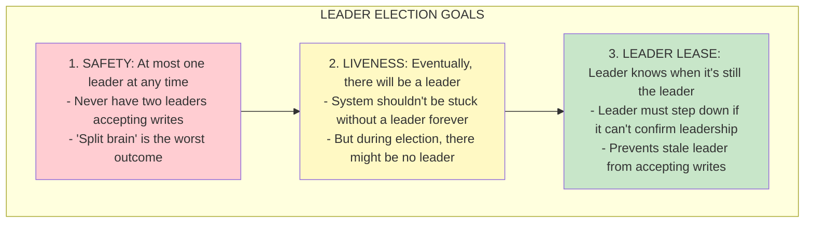
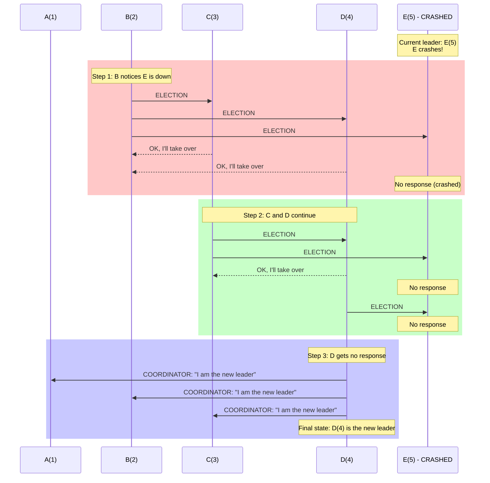

# Leader Election

## 0️⃣ Prerequisites

Before diving into leader election, you should understand:

- **Distributed Systems** (covered in Phase 1, Topic 01): Systems where multiple computers communicate over unreliable networks
- **Failure Modes** (covered in Phase 1, Topic 07): How nodes and networks can fail
- **Time & Clocks** (covered in this Phase, Topic 01): Why we can't rely on synchronized clocks
- **CAP Theorem** (covered in Phase 1, Topic 06): The tradeoff between consistency, availability, and partition tolerance

**Quick refresher on network partitions**: A network partition happens when some nodes in a distributed system can't communicate with other nodes, even though all nodes are still running. Imagine a cable being cut between two datacenters. Both datacenters are working, but they can't talk to each other. This is the most challenging failure mode for leader election.

---

## 1️⃣ What Problem Does This Exist to Solve?

### The Specific Pain Point

Imagine you're building a distributed database with three replicas. All three replicas need to agree on what data to store. But who decides?

**Option 1: Everyone decides**
- Node A accepts write "x = 1"
- Node B accepts write "x = 2" (at the same time)
- Node C accepts write "x = 3" (at the same time)
- Now you have three different values for x!

**Option 2: One node decides (the leader)**
- All writes go to one designated node (the leader)
- Leader decides the order of writes
- Other nodes (followers) replicate what the leader says
- Consistent data!

But here's the problem: **what if the leader crashes?** Someone needs to become the new leader. And what if the old leader didn't actually crash, but just had a slow network? Now you might have two leaders (split brain).

This is the **leader election problem**: how do you choose exactly one leader, even when nodes crash and networks partition?

### What Systems Looked Like Before Leader Election Was Solved

In early distributed systems:

1. **Manual failover**: An operator had to manually promote a new leader when the old one failed. This could take minutes or hours.
2. **Split brain**: Without proper election, multiple nodes would think they were the leader, causing data corruption.
3. **No failover**: Some systems just accepted that if the leader died, the system was down until someone fixed it.
4. **Heuristic approaches**: "If I can't reach the leader for 10 seconds, I'll become the leader." This caused chaos during network issues.

### What Breaks Without Proper Leader Election

**Without leader election:**

- **Databases**: Data corruption from conflicting writes
- **Distributed locks**: Multiple processes think they hold the same lock
- **Message queues**: Messages processed multiple times or lost
- **Coordination services**: Inconsistent configuration across nodes
- **Caching**: Cache invalidation fails, serving stale data

### Real Examples of the Problem

**GitHub's 2012 Outage**:
GitHub used MySQL with a master-slave setup. During a network issue, their failover system promoted a slave to master while the original master was still running. Both masters accepted writes, causing data divergence. It took hours to reconcile the data.

**MongoDB's Early Days**:
Before MongoDB improved its election algorithm, network partitions could cause multiple primaries. Applications would write to different primaries, and when the partition healed, data had to be manually reconciled or lost.

**Redis Sentinel**:
Redis Sentinel automates failover for Redis. Early versions had issues where network partitions could cause multiple masters. Redis addressed this with quorum-based election and better partition detection.

---

## 2️⃣ Intuition and Mental Model

### The Classroom Analogy

Imagine a classroom where students need to elect a class president.

**Scenario 1: Simple Voting (Bully Algorithm)**
- The tallest student says "I should be president because I'm tallest"
- Everyone shorter agrees
- If the tallest student is absent, the second tallest takes over
- Problem: What if two students are the same height? What if someone lies about their height?

**Scenario 2: Round-Robin Nomination (Ring Algorithm)**
- Students sit in a circle
- A message goes around: "Who wants to be president?"
- Each student adds their name if they want to be president
- When the message comes back to the start, the highest-ranked name wins
- Problem: What if a student leaves the circle mid-election?

**Scenario 3: Democratic Voting (Consensus-based)**
- A student proposes themselves as president
- Other students vote
- Need a majority (more than half) to win
- If no majority, try again with a new proposal
- This is how Raft and Paxos work!

### The Key Insight

Leader election is really about **agreement**: all nodes must agree on who the leader is. This is a special case of the consensus problem.

**Leader Election Goals**



<details>
<summary>ASCII diagram (reference)</summary>

```text
┌─────────────────────────────────────────────────────────────┐
│                  LEADER ELECTION GOALS                       │
├─────────────────────────────────────────────────────────────┤
│                                                              │
│  1. SAFETY: At most one leader at any time                  │
│     - Never have two leaders accepting writes               │
│     - "Split brain" is the worst outcome                    │
│                                                              │
│  2. LIVENESS: Eventually, there will be a leader            │
│     - System shouldn't be stuck without a leader forever    │
│     - But during election, there might be no leader         │
│                                                              │
│  3. LEADER LEASE: Leader knows when it's still the leader   │
│     - Leader must step down if it can't confirm leadership  │
│     - Prevents stale leader from accepting writes           │
│                                                              │
└─────────────────────────────────────────────────────────────┘
```
</details>

---

## 3️⃣ How It Works Internally

### The Bully Algorithm

The simplest leader election algorithm. Each node has a unique ID (like a number).

**Rules:**
1. The node with the highest ID becomes the leader
2. If a node thinks the leader is down, it starts an election
3. During election, a node sends "ELECTION" to all nodes with higher IDs
4. If no higher node responds, the node declares itself leader
5. If a higher node responds, it takes over the election

**Visual Example:**



<details>
<summary>ASCII diagram (reference)</summary>

```text
Nodes: A(1), B(2), C(3), D(4), E(5)
Current leader: E(5)

E crashes!

Step 1: B notices E is down, starts election
  B sends ELECTION to C, D, E
  C responds "OK, I'll take over"
  D responds "OK, I'll take over"
  E doesn't respond (crashed)

Step 2: C and D both continue election
  C sends ELECTION to D, E
  D responds "OK, I'll take over"
  
  D sends ELECTION to E
  E doesn't respond

Step 3: D gets no response from higher nodes
  D sends COORDINATOR to all: "I am the new leader"

Final state: D(4) is the new leader
```

</details>

**Java Implementation:**

```java
package com.systemdesign.election;

import java.util.*;
import java.util.concurrent.*;

/**
 * Bully algorithm implementation for leader election.
 * The node with the highest ID becomes the leader.
 */
public class BullyElection {
    
    private final int nodeId;
    private final Set<Integer> allNodes;
    private final NetworkSimulator network;
    
    private volatile Integer currentLeader;
    private volatile boolean electionInProgress;
    
    private static final long ELECTION_TIMEOUT_MS = 3000;
    private static final long COORDINATOR_TIMEOUT_MS = 5000;
    
    public BullyElection(int nodeId, Set<Integer> allNodes, NetworkSimulator network) {
        this.nodeId = nodeId;
        this.allNodes = new TreeSet<>(allNodes);
        this.network = network;
        this.electionInProgress = false;
    }
    
    /**
     * Start an election. Called when leader is suspected to be down.
     */
    public void startElection() {
        if (electionInProgress) {
            return; // Already electing
        }
        electionInProgress = true;
        
        System.out.println("Node " + nodeId + " starting election");
        
        // Find all nodes with higher IDs
        Set<Integer> higherNodes = new HashSet<>();
        for (Integer node : allNodes) {
            if (node > nodeId) {
                higherNodes.add(node);
            }
        }
        
        if (higherNodes.isEmpty()) {
            // I have the highest ID, I become leader
            becomeLeader();
            return;
        }
        
        // Send ELECTION message to all higher nodes
        boolean gotResponse = false;
        for (Integer higherNode : higherNodes) {
            try {
                Message response = network.sendAndWait(
                    higherNode, 
                    new Message(MessageType.ELECTION, nodeId),
                    ELECTION_TIMEOUT_MS
                );
                if (response != null && response.type == MessageType.OK) {
                    gotResponse = true;
                    // Higher node will take over, wait for COORDINATOR
                }
            } catch (TimeoutException e) {
                // Node didn't respond, might be down
            }
        }
        
        if (!gotResponse) {
            // No higher node responded, I become leader
            becomeLeader();
        } else {
            // Wait for COORDINATOR message
            waitForCoordinator();
        }
    }
    
    /**
     * Handle incoming election message.
     */
    public void handleMessage(Message message) {
        switch (message.type) {
            case ELECTION:
                // Someone with lower ID is holding election
                // Respond OK and start our own election
                network.send(message.senderId, new Message(MessageType.OK, nodeId));
                startElection();
                break;
                
            case COORDINATOR:
                // New leader announced
                currentLeader = message.senderId;
                electionInProgress = false;
                System.out.println("Node " + nodeId + " acknowledges leader: " + currentLeader);
                break;
                
            case OK:
                // Response to our election message
                // Handled in startElection()
                break;
        }
    }
    
    private void becomeLeader() {
        currentLeader = nodeId;
        electionInProgress = false;
        
        System.out.println("Node " + nodeId + " is now the LEADER");
        
        // Announce to all nodes
        for (Integer node : allNodes) {
            if (node != nodeId) {
                network.send(node, new Message(MessageType.COORDINATOR, nodeId));
            }
        }
    }
    
    private void waitForCoordinator() {
        // In a real implementation, this would be async with a timeout
        // If no COORDINATOR received within timeout, restart election
        ScheduledExecutorService scheduler = Executors.newSingleThreadScheduledExecutor();
        scheduler.schedule(() -> {
            if (electionInProgress) {
                System.out.println("Node " + nodeId + " didn't receive COORDINATOR, restarting election");
                electionInProgress = false;
                startElection();
            }
        }, COORDINATOR_TIMEOUT_MS, TimeUnit.MILLISECONDS);
    }
    
    public Integer getCurrentLeader() {
        return currentLeader;
    }
    
    public boolean isLeader() {
        return currentLeader != null && currentLeader == nodeId;
    }
    
    // Message types
    public enum MessageType {
        ELECTION,    // "I'm starting an election"
        OK,          // "I'm alive and will take over"
        COORDINATOR  // "I am the new leader"
    }
    
    public record Message(MessageType type, int senderId) {}
    
    // Network simulator interface (implementation would handle actual networking)
    public interface NetworkSimulator {
        void send(int targetNode, Message message);
        Message sendAndWait(int targetNode, Message message, long timeoutMs) throws TimeoutException;
    }
}
```

**Problems with Bully Algorithm:**
- Many messages: O(n²) in worst case
- Assumes reliable failure detection
- No protection against network partitions
- Highest ID node always becomes leader (even if it's slow or overloaded)

### The Ring Algorithm

Nodes are arranged in a logical ring. Election messages travel around the ring.

**Rules:**
1. Nodes are arranged in a ring (each node knows its successor)
2. To start election, a node sends ELECTION message with its ID to successor
3. Each node adds its ID to the message and forwards it
4. When message returns to initiator, the highest ID in the list is the leader
5. Initiator sends COORDINATOR message around the ring

**Visual Example:**

```
Ring: A(1) → B(2) → C(3) → D(4) → E(5) → A(1)

E crashes, A notices and starts election:

Step 1: A sends ELECTION [1] to B
Step 2: B adds itself: ELECTION [1, 2] to C
Step 3: C adds itself: ELECTION [1, 2, 3] to D
Step 4: D adds itself: ELECTION [1, 2, 3, 4] to E
        E is down! D skips to A
        D sends ELECTION [1, 2, 3, 4] to A
Step 5: A receives its own election back
        Highest ID in list: 4
        A sends COORDINATOR [leader=4] around ring

Final: D(4) is the new leader
```

**Problems with Ring Algorithm:**
- Single point of failure if ring breaks
- Slow: must traverse entire ring
- Complex ring maintenance when nodes join/leave

### Raft Leader Election (Production-Ready)

Raft is a consensus algorithm designed to be understandable. Its leader election is used in production systems like etcd, Consul, and CockroachDB.

**Key Concepts:**

```
┌─────────────────────────────────────────────────────────────┐
│                    RAFT TERMINOLOGY                          │
├─────────────────────────────────────────────────────────────┤
│                                                              │
│  TERM: A logical time period (like an election cycle)       │
│        - Increments when election starts                    │
│        - Used to detect stale leaders                       │
│                                                              │
│  STATES:                                                    │
│    - FOLLOWER: Passive, responds to leader/candidates       │
│    - CANDIDATE: Actively seeking votes                      │
│    - LEADER: Handles all client requests                    │
│                                                              │
│  HEARTBEAT: Leader sends periodic messages to followers     │
│             - Resets election timeout                       │
│             - Confirms leader is alive                      │
│                                                              │
│  ELECTION TIMEOUT: Time to wait before starting election    │
│                    - Randomized to prevent split votes      │
│                    - Typically 150-300ms                    │
│                                                              │
└─────────────────────────────────────────────────────────────┘
```

**Election Process:**

```
Initial state: All nodes are FOLLOWERS with term=0

Step 1: Election timeout expires on node B
  B increments term: term=1
  B becomes CANDIDATE
  B votes for itself
  B sends RequestVote(term=1, candidateId=B) to all nodes

Step 2: Other nodes receive RequestVote
  If their term < 1:
    Update term to 1
    If haven't voted in term 1:
      Vote for B
      Reset election timeout
  If their term >= 1 and already voted:
    Reject vote

Step 3: B counts votes
  If B gets majority (>50% of nodes):
    B becomes LEADER
    B sends heartbeats to all nodes
  If B doesn't get majority:
    B waits for election timeout
    B starts new election with term=2

Step 4: Leader maintains leadership
  Leader sends heartbeats every 50ms
  Followers reset election timeout on heartbeat
  If leader fails, some follower's timeout expires
  That follower starts new election
```

**Handling Split Votes:**

```
5 nodes: A, B, C, D, E
A and B both timeout at the same time

A: term=1, votes for self, sends RequestVote
B: term=1, votes for self, sends RequestVote

C receives A's request first, votes for A
D receives B's request first, votes for B
E receives A's request first, votes for A

Vote count:
  A: 3 votes (A, C, E) - MAJORITY! A wins!
  B: 2 votes (B, D)

If it was exactly split (2-2-1), no one wins.
Randomized timeouts make this rare.
After timeout, new election with term=2.
```

**Java Implementation:**

```java
package com.systemdesign.election;

import java.util.*;
import java.util.concurrent.*;
import java.util.concurrent.atomic.*;

/**
 * Simplified Raft leader election implementation.
 * Demonstrates the core election algorithm used in production systems.
 */
public class RaftElection {
    
    // Node state
    public enum State { FOLLOWER, CANDIDATE, LEADER }
    
    private final String nodeId;
    private final List<String> peers;
    private final RaftRPC rpc;
    
    private volatile State state = State.FOLLOWER;
    private volatile int currentTerm = 0;
    private volatile String votedFor = null;
    private volatile String currentLeader = null;
    
    // Timing
    private static final int HEARTBEAT_INTERVAL_MS = 50;
    private static final int MIN_ELECTION_TIMEOUT_MS = 150;
    private static final int MAX_ELECTION_TIMEOUT_MS = 300;
    
    private final ScheduledExecutorService scheduler = 
        Executors.newScheduledThreadPool(2);
    private ScheduledFuture<?> electionTimer;
    private ScheduledFuture<?> heartbeatTimer;
    
    private final Random random = new Random();
    
    public RaftElection(String nodeId, List<String> peers, RaftRPC rpc) {
        this.nodeId = nodeId;
        this.peers = new ArrayList<>(peers);
        this.rpc = rpc;
    }
    
    /**
     * Start the election process. Call this when the node starts.
     */
    public void start() {
        resetElectionTimer();
    }
    
    /**
     * Handle a vote request from a candidate.
     */
    public synchronized VoteResponse handleVoteRequest(VoteRequest request) {
        // If request term is higher, update our term and become follower
        if (request.term > currentTerm) {
            currentTerm = request.term;
            state = State.FOLLOWER;
            votedFor = null;
        }
        
        // Reject if request term is old
        if (request.term < currentTerm) {
            return new VoteResponse(currentTerm, false);
        }
        
        // Grant vote if we haven't voted or already voted for this candidate
        boolean voteGranted = (votedFor == null || votedFor.equals(request.candidateId));
        
        if (voteGranted) {
            votedFor = request.candidateId;
            resetElectionTimer(); // Reset timeout when granting vote
        }
        
        return new VoteResponse(currentTerm, voteGranted);
    }
    
    /**
     * Handle a heartbeat (AppendEntries) from the leader.
     */
    public synchronized AppendResponse handleAppendEntries(AppendRequest request) {
        // If request term is higher, update our term
        if (request.term > currentTerm) {
            currentTerm = request.term;
            state = State.FOLLOWER;
            votedFor = null;
        }
        
        // Reject if request term is old
        if (request.term < currentTerm) {
            return new AppendResponse(currentTerm, false);
        }
        
        // Valid heartbeat from leader
        state = State.FOLLOWER;
        currentLeader = request.leaderId;
        resetElectionTimer();
        
        return new AppendResponse(currentTerm, true);
    }
    
    /**
     * Start an election. Called when election timeout expires.
     */
    private synchronized void startElection() {
        if (state == State.LEADER) {
            return; // Already leader
        }
        
        // Become candidate
        state = State.CANDIDATE;
        currentTerm++;
        votedFor = nodeId;
        currentLeader = null;
        
        System.out.println(nodeId + " starting election for term " + currentTerm);
        
        int votesReceived = 1; // Vote for self
        int votesNeeded = (peers.size() + 1) / 2 + 1; // Majority
        
        // Request votes from all peers
        List<CompletableFuture<VoteResponse>> voteFutures = new ArrayList<>();
        
        for (String peer : peers) {
            VoteRequest request = new VoteRequest(currentTerm, nodeId);
            voteFutures.add(rpc.requestVote(peer, request));
        }
        
        // Count votes
        int finalTerm = currentTerm;
        AtomicInteger voteCount = new AtomicInteger(1);
        
        for (CompletableFuture<VoteResponse> future : voteFutures) {
            future.thenAccept(response -> {
                synchronized (this) {
                    // Check if we're still candidate for this term
                    if (state != State.CANDIDATE || currentTerm != finalTerm) {
                        return;
                    }
                    
                    if (response.term > currentTerm) {
                        // Discovered higher term, become follower
                        currentTerm = response.term;
                        state = State.FOLLOWER;
                        votedFor = null;
                        return;
                    }
                    
                    if (response.voteGranted) {
                        int votes = voteCount.incrementAndGet();
                        if (votes >= votesNeeded && state == State.CANDIDATE) {
                            becomeLeader();
                        }
                    }
                }
            }).exceptionally(e -> {
                // Peer didn't respond, ignore
                return null;
            });
        }
        
        // Reset election timer in case we don't win
        resetElectionTimer();
    }
    
    /**
     * Become the leader. Called when we win an election.
     */
    private void becomeLeader() {
        state = State.LEADER;
        currentLeader = nodeId;
        
        System.out.println(nodeId + " became LEADER for term " + currentTerm);
        
        // Cancel election timer
        if (electionTimer != null) {
            electionTimer.cancel(false);
        }
        
        // Start sending heartbeats
        heartbeatTimer = scheduler.scheduleAtFixedRate(
            this::sendHeartbeats,
            0,
            HEARTBEAT_INTERVAL_MS,
            TimeUnit.MILLISECONDS
        );
    }
    
    /**
     * Send heartbeats to all peers. Called periodically by leader.
     */
    private void sendHeartbeats() {
        if (state != State.LEADER) {
            if (heartbeatTimer != null) {
                heartbeatTimer.cancel(false);
            }
            return;
        }
        
        AppendRequest request = new AppendRequest(currentTerm, nodeId);
        
        for (String peer : peers) {
            rpc.appendEntries(peer, request).thenAccept(response -> {
                synchronized (this) {
                    if (response.term > currentTerm) {
                        // Discovered higher term, step down
                        currentTerm = response.term;
                        state = State.FOLLOWER;
                        votedFor = null;
                        if (heartbeatTimer != null) {
                            heartbeatTimer.cancel(false);
                        }
                        resetElectionTimer();
                    }
                }
            }).exceptionally(e -> null);
        }
    }
    
    /**
     * Reset the election timer with a random timeout.
     */
    private void resetElectionTimer() {
        if (electionTimer != null) {
            electionTimer.cancel(false);
        }
        
        int timeout = MIN_ELECTION_TIMEOUT_MS + 
            random.nextInt(MAX_ELECTION_TIMEOUT_MS - MIN_ELECTION_TIMEOUT_MS);
        
        electionTimer = scheduler.schedule(
            this::startElection,
            timeout,
            TimeUnit.MILLISECONDS
        );
    }
    
    // Getters
    public State getState() { return state; }
    public int getCurrentTerm() { return currentTerm; }
    public String getCurrentLeader() { return currentLeader; }
    public boolean isLeader() { return state == State.LEADER; }
    
    // Request/Response records
    public record VoteRequest(int term, String candidateId) {}
    public record VoteResponse(int term, boolean voteGranted) {}
    public record AppendRequest(int term, String leaderId) {}
    public record AppendResponse(int term, boolean success) {}
    
    // RPC interface
    public interface RaftRPC {
        CompletableFuture<VoteResponse> requestVote(String peer, VoteRequest request);
        CompletableFuture<AppendResponse> appendEntries(String peer, AppendRequest request);
    }
}
```

### Leader Lease

A leader lease is a time-bounded guarantee that a node is the leader.

**The Problem:**
Even with Raft, there's a window where the old leader might not know it's been replaced:

```
Time:     0ms      100ms     200ms     300ms
           │         │         │         │
Leader A:  │ ──────────────────│ (network partition starts)
           │         │         │         │
           │         │    New election happens
           │         │    B becomes leader
           │         │         │         │
Leader A:  │         │         │ Still thinks it's leader!
           │         │         │ Accepts a write!
```

**The Solution: Leader Lease**

```
Leader acquires a lease for duration T (e.g., 10 seconds)
Leader must renew lease before it expires
If leader can't renew (network issue), it steps down
Followers won't elect new leader until lease expires

Timeline:
  0s:   A acquires lease (valid until 10s)
  5s:   A renews lease (valid until 15s)
  8s:   Network partition starts
  10s:  A tries to renew, fails
  10s:  A steps down, stops accepting writes
  10s+: Followers start election
```

**Java Implementation:**

```java
package com.systemdesign.election;

import java.time.Instant;
import java.util.concurrent.*;

/**
 * Leader lease implementation to prevent stale leader writes.
 */
public class LeaderLease {
    
    private final long leaseDurationMs;
    private final long renewalMarginMs;
    private final LeaseRenewal renewalCallback;
    
    private volatile Instant leaseExpiry;
    private volatile boolean isLeader;
    private final ScheduledExecutorService scheduler;
    
    public LeaderLease(long leaseDurationMs, LeaseRenewal renewalCallback) {
        this.leaseDurationMs = leaseDurationMs;
        this.renewalMarginMs = leaseDurationMs / 3; // Renew at 2/3 of lease
        this.renewalCallback = renewalCallback;
        this.scheduler = Executors.newSingleThreadScheduledExecutor();
    }
    
    /**
     * Acquire leadership with a lease.
     */
    public synchronized boolean acquireLease() {
        if (isLeader) {
            return true; // Already leader
        }
        
        // Try to acquire lease (in real system, this would be distributed)
        leaseExpiry = Instant.now().plusMillis(leaseDurationMs);
        isLeader = true;
        
        // Schedule lease renewal
        scheduleRenewal();
        
        System.out.println("Acquired lease until " + leaseExpiry);
        return true;
    }
    
    /**
     * Check if we're still the valid leader.
     * Must be called before any leader operation.
     */
    public boolean isValidLeader() {
        if (!isLeader) {
            return false;
        }
        
        if (Instant.now().isAfter(leaseExpiry)) {
            // Lease expired, step down
            stepDown();
            return false;
        }
        
        return true;
    }
    
    /**
     * Step down from leadership.
     */
    public synchronized void stepDown() {
        isLeader = false;
        leaseExpiry = null;
        System.out.println("Stepped down from leadership");
    }
    
    /**
     * Schedule lease renewal before expiry.
     */
    private void scheduleRenewal() {
        long renewIn = leaseDurationMs - renewalMarginMs;
        
        scheduler.schedule(() -> {
            if (!isLeader) {
                return;
            }
            
            try {
                // Try to renew lease
                boolean renewed = renewalCallback.renewLease();
                
                if (renewed) {
                    synchronized (this) {
                        leaseExpiry = Instant.now().plusMillis(leaseDurationMs);
                        System.out.println("Renewed lease until " + leaseExpiry);
                        scheduleRenewal();
                    }
                } else {
                    // Couldn't renew, step down
                    stepDown();
                }
            } catch (Exception e) {
                // Error renewing, step down to be safe
                stepDown();
            }
        }, renewIn, TimeUnit.MILLISECONDS);
    }
    
    /**
     * Execute an operation only if we're the valid leader.
     */
    public <T> T executeAsLeader(Callable<T> operation) throws Exception {
        if (!isValidLeader()) {
            throw new NotLeaderException("Not the current leader");
        }
        
        // Double-check after acquiring any locks in the operation
        T result = operation.call();
        
        if (!isValidLeader()) {
            throw new NotLeaderException("Lost leadership during operation");
        }
        
        return result;
    }
    
    @FunctionalInterface
    public interface LeaseRenewal {
        boolean renewLease();
    }
    
    public static class NotLeaderException extends Exception {
        public NotLeaderException(String message) {
            super(message);
        }
    }
}
```

### ZooKeeper-Based Leader Election

ZooKeeper is a distributed coordination service that provides primitives for leader election.

**How it works:**

```
┌─────────────────────────────────────────────────────────────┐
│                ZOOKEEPER LEADER ELECTION                     │
├─────────────────────────────────────────────────────────────┤
│                                                              │
│  1. Each node creates an EPHEMERAL SEQUENTIAL node:         │
│     /election/node-0000000001  (Node A)                     │
│     /election/node-0000000002  (Node B)                     │
│     /election/node-0000000003  (Node C)                     │
│                                                              │
│  2. Node with LOWEST sequence number is the leader          │
│     Node A (0001) is leader                                 │
│                                                              │
│  3. Other nodes WATCH the node just before them             │
│     Node B watches Node A's znode                           │
│     Node C watches Node B's znode                           │
│                                                              │
│  4. If leader dies, its ephemeral node disappears           │
│     Node B sees watch trigger                               │
│     Node B checks if it's now the lowest                    │
│     Node B becomes leader                                   │
│                                                              │
│  Ephemeral: Node disappears if client disconnects           │
│  Sequential: ZooKeeper assigns incrementing numbers         │
│                                                              │
└─────────────────────────────────────────────────────────────┘
```

**Java Implementation with Apache Curator:**

```java
package com.systemdesign.election;

import org.apache.curator.framework.CuratorFramework;
import org.apache.curator.framework.CuratorFrameworkFactory;
import org.apache.curator.framework.recipes.leader.LeaderSelector;
import org.apache.curator.framework.recipes.leader.LeaderSelectorListenerAdapter;
import org.apache.curator.retry.ExponentialBackoffRetry;

/**
 * ZooKeeper-based leader election using Apache Curator.
 * This is how many production systems implement leader election.
 */
public class ZooKeeperLeaderElection extends LeaderSelectorListenerAdapter {
    
    private final String nodeId;
    private final CuratorFramework client;
    private final LeaderSelector leaderSelector;
    private final LeadershipCallback callback;
    
    private volatile boolean isLeader = false;
    
    public ZooKeeperLeaderElection(String zkConnectionString, 
                                    String electionPath,
                                    String nodeId,
                                    LeadershipCallback callback) {
        this.nodeId = nodeId;
        this.callback = callback;
        
        // Create ZooKeeper client
        this.client = CuratorFrameworkFactory.newClient(
            zkConnectionString,
            new ExponentialBackoffRetry(1000, 3)
        );
        
        // Create leader selector
        this.leaderSelector = new LeaderSelector(client, electionPath, this);
        
        // Automatically requeue when leadership is lost
        this.leaderSelector.autoRequeue();
    }
    
    /**
     * Start participating in leader election.
     */
    public void start() {
        client.start();
        leaderSelector.start();
        System.out.println(nodeId + " started leader election");
    }
    
    /**
     * Called when this node becomes the leader.
     * IMPORTANT: This method must not return until leadership should be released.
     */
    @Override
    public void takeLeadership(CuratorFramework client) throws Exception {
        isLeader = true;
        System.out.println(nodeId + " is now the LEADER");
        
        try {
            // Notify callback that we're now the leader
            callback.onLeadershipAcquired();
            
            // Stay leader until interrupted or we want to release
            // In a real application, this would run the leader's main loop
            while (isLeader && !Thread.currentThread().isInterrupted()) {
                callback.doLeaderWork();
                Thread.sleep(1000);
            }
        } finally {
            isLeader = false;
            callback.onLeadershipLost();
            System.out.println(nodeId + " released leadership");
        }
    }
    
    /**
     * Voluntarily release leadership.
     */
    public void releaseLeadership() {
        isLeader = false;
    }
    
    /**
     * Check if this node is currently the leader.
     */
    public boolean isLeader() {
        return isLeader;
    }
    
    /**
     * Stop participating in leader election.
     */
    public void stop() {
        leaderSelector.close();
        client.close();
    }
    
    /**
     * Callback interface for leadership events.
     */
    public interface LeadershipCallback {
        void onLeadershipAcquired();
        void onLeadershipLost();
        void doLeaderWork() throws InterruptedException;
    }
}
```

**Maven Dependencies for Curator:**

```xml
<dependencies>
    <dependency>
        <groupId>org.apache.curator</groupId>
        <artifactId>curator-framework</artifactId>
        <version>5.5.0</version>
    </dependency>
    <dependency>
        <groupId>org.apache.curator</groupId>
        <artifactId>curator-recipes</artifactId>
        <version>5.5.0</version>
    </dependency>
</dependencies>
```

---

## 4️⃣ Simulation-First Explanation

Let's trace through a complete Raft election scenario.

### Scenario: Three-Node Cluster with Leader Failure

**Setup:**
- Three nodes: A, B, C
- Initial state: A is leader (term 1)
- Election timeout: 150-300ms (randomized)
- Heartbeat interval: 50ms

### Normal Operation

```
Time:     0ms      50ms     100ms    150ms    200ms
           │        │        │        │        │
Leader A:  │──HB───>│──HB───>│──HB───>│──HB───>│
           │    B,C │    B,C │    B,C │    B,C │
           │ reset  │ reset  │ reset  │ reset  │
           │timeout │timeout │timeout │timeout │

B's timeout: 250ms (never reached, keeps resetting)
C's timeout: 180ms (never reached, keeps resetting)
```

### Leader Failure

```
Time:     200ms    250ms    300ms    350ms    400ms    450ms
           │        │        │        │        │        │
Leader A:  │───X────│ (crashes)
           │        │        │        │        │        │
Node B:    │        │ 250ms  │        │        │        │
           │        │timeout │        │        │        │
           │        │expires!│        │        │        │
           │        │        │        │        │        │
Node C:    │        │        │        │ 380ms  │        │
           │        │        │        │timeout │        │
           │        │        │        │would   │        │
           │        │        │        │expire  │        │

B's timeout expires first (at 250ms + 200ms = 450ms from start)
```

### Election Begins

```
Time:     450ms
           │
Node B:    │ term=1 → term=2
           │ state=FOLLOWER → state=CANDIDATE
           │ votedFor=B
           │ sends RequestVote(term=2, candidateId=B) to A, C

Time:     451ms
           │
Node A:    │ (crashed, no response)
           │
Node C:    │ receives RequestVote(term=2, candidateId=B)
           │ currentTerm=1 < 2, so update term=2
           │ haven't voted in term 2
           │ grant vote to B
           │ reset election timeout
           │ send VoteResponse(term=2, voteGranted=true)

Time:     455ms
           │
Node B:    │ receives vote from C
           │ votes: 2 (self + C)
           │ needed: 2 (majority of 3)
           │ 2 >= 2, WINS ELECTION!
           │ state=CANDIDATE → state=LEADER
           │ sends heartbeats to A, C
```

### New Leader Established

```
Time:     455ms    505ms    555ms
           │        │        │
Leader B:  │──HB───>│──HB───>│──HB───>
           │   C    │   C    │   C
           │        │        │
Node C:    │ accepts │ accepts │ accepts
           │ B as   │        │
           │ leader │        │

Node A is still down, but cluster is functional (2/3 nodes)
```

### Old Leader Comes Back

```
Time:     600ms
           │
Node A:    │ restarts
           │ state=LEADER, term=1 (stale!)
           │ tries to send heartbeat to B, C
           │
Node B:    │ receives heartbeat with term=1
           │ currentTerm=2 > 1
           │ rejects heartbeat
           │ sends AppendResponse(term=2, success=false)
           │
Node A:    │ receives response with term=2
           │ term=1 < 2, update term=2
           │ state=LEADER → state=FOLLOWER
           │ realizes it's not leader anymore

Final state:
  A: FOLLOWER, term=2
  B: LEADER, term=2
  C: FOLLOWER, term=2
```

---

## 5️⃣ How Engineers Actually Use This in Production

### At Major Companies

**etcd (Kubernetes)**:
- Uses Raft for leader election and consensus
- Stores cluster configuration and state
- Leader handles all writes, followers handle reads
- Typical cluster: 3 or 5 nodes

**Apache Kafka**:
- Uses ZooKeeper for controller election (legacy)
- KRaft mode: Uses Raft directly (new)
- Controller manages partition assignments
- Brokers elect partition leaders

**Redis Sentinel**:
- Monitors Redis master and replicas
- Sentinels elect a leader among themselves
- Leader Sentinel performs failover
- Quorum-based decision making

**CockroachDB**:
- Uses Raft for each range (data shard)
- Thousands of Raft groups per cluster
- Leaseholder optimization for reads
- Multi-Raft for efficiency

### Production Considerations

```
┌─────────────────────────────────────────────────────────────┐
│            PRODUCTION LEADER ELECTION CHECKLIST              │
├─────────────────────────────────────────────────────────────┤
│                                                              │
│  CLUSTER SIZE                                               │
│  □ Use odd number of nodes (3, 5, 7)                        │
│  □ 3 nodes: tolerates 1 failure                             │
│  □ 5 nodes: tolerates 2 failures                            │
│  □ More nodes = slower elections                            │
│                                                              │
│  TIMEOUTS                                                   │
│  □ Election timeout > 2× network RTT                        │
│  □ Heartbeat interval < election timeout / 3                │
│  □ Randomize election timeout (prevent split vote)          │
│                                                              │
│  FAILURE DETECTION                                          │
│  □ Don't be too aggressive (false positives)                │
│  □ Don't be too slow (long unavailability)                  │
│  □ Consider network conditions                              │
│                                                              │
│  MONITORING                                                 │
│  □ Track leader changes                                     │
│  □ Alert on frequent elections                              │
│  □ Monitor election duration                                │
│  □ Track split-brain incidents                              │
│                                                              │
└─────────────────────────────────────────────────────────────┘
```

### Choosing an Approach

```
┌─────────────────────────────────────────────────────────────┐
│              LEADER ELECTION DECISION TREE                   │
├─────────────────────────────────────────────────────────────┤
│                                                              │
│  Do you already have ZooKeeper/etcd?                        │
│  ├── YES → Use their leader election primitives             │
│  │         (Curator, etcd election API)                     │
│  │                                                          │
│  └── NO → Do you need consensus too?                        │
│           ├── YES → Implement Raft (or use a library)       │
│           │         Examples: etcd, Consul                  │
│           │                                                 │
│           └── NO → Is it okay to have brief unavailability? │
│                    ├── YES → Bully algorithm is fine        │
│                    │                                        │
│                    └── NO → Use Raft with leader lease      │
│                                                             │
└─────────────────────────────────────────────────────────────┘
```

---

## 6️⃣ How to Implement or Apply It

### Complete Spring Boot Service with Leader Election

#### Maven Dependencies

```xml
<dependencies>
    <dependency>
        <groupId>org.springframework.boot</groupId>
        <artifactId>spring-boot-starter-web</artifactId>
    </dependency>
    <dependency>
        <groupId>org.apache.curator</groupId>
        <artifactId>curator-framework</artifactId>
        <version>5.5.0</version>
    </dependency>
    <dependency>
        <groupId>org.apache.curator</groupId>
        <artifactId>curator-recipes</artifactId>
        <version>5.5.0</version>
    </dependency>
</dependencies>
```

#### Leader Election Service

```java
package com.systemdesign.election;

import org.apache.curator.framework.CuratorFramework;
import org.apache.curator.framework.CuratorFrameworkFactory;
import org.apache.curator.framework.recipes.leader.LeaderLatch;
import org.apache.curator.framework.recipes.leader.LeaderLatchListener;
import org.apache.curator.retry.ExponentialBackoffRetry;
import org.springframework.beans.factory.annotation.Value;
import org.springframework.stereotype.Service;

import jakarta.annotation.PostConstruct;
import jakarta.annotation.PreDestroy;
import java.util.concurrent.atomic.AtomicBoolean;

/**
 * Service that participates in leader election using ZooKeeper.
 * Only the leader performs certain tasks (like scheduled jobs).
 */
@Service
public class LeaderElectionService implements LeaderLatchListener {
    
    @Value("${zookeeper.connection-string:localhost:2181}")
    private String zkConnectionString;
    
    @Value("${election.path:/election/scheduler}")
    private String electionPath;
    
    @Value("${node.id:#{T(java.util.UUID).randomUUID().toString()}}")
    private String nodeId;
    
    private CuratorFramework client;
    private LeaderLatch leaderLatch;
    private final AtomicBoolean isLeader = new AtomicBoolean(false);
    
    @PostConstruct
    public void init() throws Exception {
        // Create ZooKeeper client
        client = CuratorFrameworkFactory.newClient(
            zkConnectionString,
            new ExponentialBackoffRetry(1000, 3)
        );
        client.start();
        
        // Create leader latch
        leaderLatch = new LeaderLatch(client, electionPath, nodeId);
        leaderLatch.addListener(this);
        leaderLatch.start();
        
        System.out.println("Node " + nodeId + " started leader election");
    }
    
    @Override
    public void isLeader() {
        isLeader.set(true);
        System.out.println("Node " + nodeId + " is now the LEADER");
        onLeadershipAcquired();
    }
    
    @Override
    public void notLeader() {
        isLeader.set(false);
        System.out.println("Node " + nodeId + " lost leadership");
        onLeadershipLost();
    }
    
    /**
     * Called when this node becomes the leader.
     * Start any leader-only tasks here.
     */
    protected void onLeadershipAcquired() {
        // Start scheduled tasks, background jobs, etc.
        // Example: Start processing a queue
    }
    
    /**
     * Called when this node loses leadership.
     * Stop any leader-only tasks here.
     */
    protected void onLeadershipLost() {
        // Stop scheduled tasks, release resources
        // Example: Stop processing queue
    }
    
    /**
     * Check if this node is the current leader.
     */
    public boolean isLeader() {
        return isLeader.get();
    }
    
    /**
     * Execute a task only if this node is the leader.
     */
    public <T> T executeAsLeader(java.util.concurrent.Callable<T> task) throws Exception {
        if (!isLeader()) {
            throw new NotLeaderException("This node is not the leader");
        }
        return task.call();
    }
    
    /**
     * Get the current leader's ID.
     */
    public String getCurrentLeaderId() {
        try {
            return leaderLatch.getLeader().getId();
        } catch (Exception e) {
            return null;
        }
    }
    
    @PreDestroy
    public void shutdown() throws Exception {
        if (leaderLatch != null) {
            leaderLatch.close();
        }
        if (client != null) {
            client.close();
        }
    }
    
    public static class NotLeaderException extends RuntimeException {
        public NotLeaderException(String message) {
            super(message);
        }
    }
}
```

#### Scheduled Task That Only Runs on Leader

```java
package com.systemdesign.election;

import org.springframework.scheduling.annotation.Scheduled;
import org.springframework.stereotype.Component;

/**
 * Example of a scheduled task that only runs on the leader node.
 * This prevents duplicate processing in a clustered environment.
 */
@Component
public class LeaderOnlyScheduledTask {
    
    private final LeaderElectionService leaderElection;
    
    public LeaderOnlyScheduledTask(LeaderElectionService leaderElection) {
        this.leaderElection = leaderElection;
    }
    
    /**
     * This task runs every minute, but only executes on the leader.
     */
    @Scheduled(fixedRate = 60000)
    public void processQueue() {
        if (!leaderElection.isLeader()) {
            // Not the leader, skip this execution
            return;
        }
        
        System.out.println("Leader processing queue...");
        
        try {
            // Do leader-only work here
            // Example: Process messages from a queue
            // Example: Run batch jobs
            // Example: Clean up expired data
            
            doLeaderWork();
            
        } catch (Exception e) {
            System.err.println("Error in leader task: " + e.getMessage());
        }
    }
    
    private void doLeaderWork() {
        // Actual work implementation
        System.out.println("Performing leader-only work");
    }
}
```

#### REST Controller to Check Leadership

```java
package com.systemdesign.election;

import org.springframework.http.ResponseEntity;
import org.springframework.web.bind.annotation.*;

import java.util.Map;

@RestController
@RequestMapping("/api/leader")
public class LeaderController {
    
    private final LeaderElectionService leaderElection;
    
    public LeaderController(LeaderElectionService leaderElection) {
        this.leaderElection = leaderElection;
    }
    
    /**
     * Check if this node is the leader.
     */
    @GetMapping("/status")
    public ResponseEntity<Map<String, Object>> getStatus() {
        return ResponseEntity.ok(Map.of(
            "isLeader", leaderElection.isLeader(),
            "currentLeader", leaderElection.getCurrentLeaderId()
        ));
    }
    
    /**
     * Endpoint that only works on the leader.
     */
    @PostMapping("/admin/task")
    public ResponseEntity<String> runAdminTask() {
        try {
            return leaderElection.executeAsLeader(() -> {
                // Perform admin task
                return ResponseEntity.ok("Task executed on leader");
            });
        } catch (LeaderElectionService.NotLeaderException e) {
            return ResponseEntity.status(503)
                .body("This node is not the leader. Try: " + 
                      leaderElection.getCurrentLeaderId());
        } catch (Exception e) {
            return ResponseEntity.internalServerError()
                .body("Error: " + e.getMessage());
        }
    }
}
```

#### Application Configuration

```yaml
# application.yml
spring:
  application:
    name: leader-election-demo

zookeeper:
  connection-string: localhost:2181

election:
  path: /election/my-service

node:
  id: ${HOSTNAME:node-1}

# Enable scheduling
scheduling:
  enabled: true
```

#### Docker Compose for Testing

```yaml
# docker-compose.yml
version: '3.8'

services:
  zookeeper:
    image: confluentinc/cp-zookeeper:7.5.0
    environment:
      ZOOKEEPER_CLIENT_PORT: 2181
    ports:
      - "2181:2181"

  app1:
    build: .
    environment:
      - HOSTNAME=node-1
      - ZOOKEEPER_CONNECTION_STRING=zookeeper:2181
    depends_on:
      - zookeeper
    ports:
      - "8081:8080"

  app2:
    build: .
    environment:
      - HOSTNAME=node-2
      - ZOOKEEPER_CONNECTION_STRING=zookeeper:2181
    depends_on:
      - zookeeper
    ports:
      - "8082:8080"

  app3:
    build: .
    environment:
      - HOSTNAME=node-3
      - ZOOKEEPER_CONNECTION_STRING=zookeeper:2181
    depends_on:
      - zookeeper
    ports:
      - "8083:8080"
```

---

## 7️⃣ Tradeoffs, Pitfalls, and Common Mistakes

### Common Mistakes

#### 1. Not Using Leader Lease

**Wrong:**
```java
// BAD: Leader might be stale
if (isLeader) {
    processWrite(data);
}
```

**Right:**
```java
// GOOD: Check lease before processing
if (leaderLease.isValidLeader()) {
    processWrite(data);
} else {
    throw new NotLeaderException();
}
```

#### 2. Using Even Number of Nodes

**Wrong:**
```
4 nodes: Need 3 for majority
If network splits 2-2, neither side has majority
System is unavailable!
```

**Right:**
```
3 nodes: Need 2 for majority
If network splits 2-1, the side with 2 can continue
System remains available!

5 nodes: Need 3 for majority
Can tolerate 2 failures
```

#### 3. Too Aggressive Failure Detection

**Wrong:**
```java
// BAD: 100ms timeout is too short
static final int ELECTION_TIMEOUT = 100;
// Network hiccup causes unnecessary election
// Frequent leader changes cause instability
```

**Right:**
```java
// GOOD: Reasonable timeout with randomization
static final int MIN_ELECTION_TIMEOUT = 300;
static final int MAX_ELECTION_TIMEOUT = 500;
// Tolerates brief network issues
// Randomization prevents split votes
```

#### 4. Ignoring Split Brain

**Wrong:**
```java
// BAD: No fencing
public void processWrite(Data data) {
    if (isLeader) {  // Might be stale!
        database.write(data);
    }
}
```

**Right:**
```java
// GOOD: Use fencing token
public void processWrite(Data data, long fencingToken) {
    // Database rejects writes with old fencing tokens
    database.writeWithFencing(data, fencingToken);
}
```

### Performance Gotchas

#### Election Storm

```
Problem: All nodes timeout at the same time, all start elections

Symptoms:
- Frequent leader changes
- High CPU from election messages
- Degraded performance

Causes:
- Non-randomized timeouts
- Synchronized clocks + same timeout value
- Network issues affecting all nodes

Solution:
- Randomize election timeout
- Use jitter: timeout = base + random(0, base/2)
- Back off on failed elections
```

#### ZooKeeper Session Timeout

```
Problem: ZooKeeper session expires, leadership lost

Symptoms:
- Unexpected leadership loss
- "Session expired" errors
- Frequent re-elections

Causes:
- GC pauses longer than session timeout
- Network issues to ZooKeeper
- ZooKeeper overloaded

Solution:
- Tune session timeout (default 30s might be too short)
- Monitor GC pauses
- Use dedicated ZooKeeper cluster
```

---

## 8️⃣ When NOT to Use This

### When Leader Election is Unnecessary

1. **Stateless services**: If all instances are identical and stateless, no leader needed
2. **Sharded systems**: Each shard has its own leader, but no global leader
3. **Event-driven systems**: Use partitioned message queues instead
4. **Read-only replicas**: For read scaling, no leader needed

### When Simpler Alternatives Work

1. **Single instance with restart**: If brief downtime is acceptable
2. **Database-backed locking**: For simple coordination
3. **Load balancer health checks**: For simple failover

### Anti-Patterns

1. **Leader election for load balancing**
   - Use a load balancer instead
   - Leader election is for coordination, not distribution

2. **Too many leaders**
   - If you have leaders for everything, you have a design problem
   - Consider event sourcing or CQRS

3. **Leader does all the work**
   - Leader should coordinate, not do all processing
   - Distribute work to followers

---

## 9️⃣ Comparison with Alternatives

### Algorithm Comparison

| Algorithm | Messages | Failure Tolerance | Complexity | Use Case |
|-----------|----------|-------------------|------------|----------|
| Bully | O(n²) | Node failures | Simple | Small clusters |
| Ring | O(n) | Node failures | Medium | Token ring networks |
| Raft | O(n) | Node + network | Medium | Production systems |
| Paxos | O(n) | Node + network | High | Theoretical foundation |
| ZK Election | O(n) | Node + network | Low (uses ZK) | When ZK available |

### Technology Comparison

| Technology | Leader Election | Consensus | Complexity | Latency |
|------------|-----------------|-----------|------------|---------|
| etcd | Built-in | Raft | Low | Low |
| ZooKeeper | Recipes | ZAB | Medium | Medium |
| Consul | Built-in | Raft | Low | Low |
| Redis Sentinel | Custom | Quorum | Medium | Low |
| Custom Raft | Manual | Raft | High | Low |

### When to Use Each

| Use Case | Recommended |
|----------|-------------|
| Kubernetes coordination | etcd |
| Java applications | ZooKeeper + Curator |
| Service mesh | Consul |
| Cache failover | Redis Sentinel |
| Database replication | Raft (built into DB) |
| Custom distributed system | etcd or Consul |

---

## 🔟 Interview Follow-Up Questions WITH Answers

### L4 (Entry-Level) Questions

**Q1: What is leader election and why do we need it?**

**Answer:**
Leader election is the process of choosing one node in a distributed system to be the "leader" that coordinates activities. We need it because:

1. **Consistency**: Without a leader, multiple nodes might make conflicting decisions. The leader ensures one source of truth.

2. **Coordination**: Some tasks should only happen once (like scheduled jobs). The leader ensures only one node does them.

3. **Ordering**: The leader can assign order to operations, which is necessary for replication.

For example, in a database cluster, the leader accepts all writes and replicates them to followers. This ensures all nodes have the same data in the same order.

**Q2: What happens if the leader crashes?**

**Answer:**
When the leader crashes, the system needs to elect a new leader. The process is:

1. **Detection**: Followers notice they're not receiving heartbeats from the leader. After a timeout (e.g., 300ms), they assume the leader is down.

2. **Election**: One or more followers start an election. In Raft, a follower becomes a candidate, increments the term, and requests votes.

3. **Voting**: Other nodes vote for the first candidate they see (in that term). A candidate needs a majority to win.

4. **New Leader**: The winning candidate becomes the new leader and starts sending heartbeats.

During this process (typically < 1 second), the system might be unavailable for writes. This is the tradeoff for consistency.

### L5 (Senior) Questions

**Q3: How does Raft prevent split brain?**

**Answer:**
Raft prevents split brain through several mechanisms:

1. **Majority quorum**: A leader needs votes from a majority of nodes. In a 5-node cluster, that's 3 nodes. If the network splits 2-3, only the side with 3 nodes can elect a leader.

2. **Term numbers**: Each election increments the term. If an old leader reconnects, it sees a higher term and steps down. Requests with old terms are rejected.

3. **Leader lease**: Leaders stop accepting writes if they can't confirm they're still the leader (by getting heartbeat responses from a majority).

4. **Single vote per term**: Each node can only vote once per term. This prevents multiple leaders in the same term.

Example: Network splits a 5-node cluster into [A,B] and [C,D,E].
- [A,B] has 2 nodes, can't get majority (need 3), no leader
- [C,D,E] has 3 nodes, can elect a leader
- When network heals, A and B see higher term and follow new leader

**Q4: How would you implement leader election without ZooKeeper?**

**Answer:**
I would implement a simplified Raft:

1. **State machine**: Each node is FOLLOWER, CANDIDATE, or LEADER

2. **Heartbeats**: Leader sends heartbeats every 50ms. Followers reset their election timer on heartbeat.

3. **Election timeout**: Randomized (150-300ms). If timeout expires without heartbeat, start election.

4. **Election process**:
   - Increment term
   - Vote for self
   - Send RequestVote to all peers
   - If majority votes received, become leader
   - If higher term seen, become follower

5. **Persistence**: Store currentTerm and votedFor to disk to survive restarts

6. **Leader lease**: Leader tracks when it last heard from a majority. If too long, step down.

The tricky parts are:
- Handling network partitions (rely on quorum)
- Preventing stale leaders (use terms and leases)
- Avoiding split votes (randomize timeouts)

### L6 (Staff) Questions

**Q5: Design a leader election system for a globally distributed database.**

**Answer:**
For global distribution, I'd use a hierarchical approach:

**Level 1: Regional Leaders**
- Each region (US-East, US-West, Europe) has its own Raft cluster
- Regional leader handles local writes
- Low latency for regional operations

**Level 2: Global Coordinator**
- One region is the "primary region"
- Primary region's leader is the global coordinator
- Handles cross-region transactions

**Election Process:**
1. Regional election uses standard Raft (latency < 10ms)
2. Global election uses modified Raft with longer timeouts (latency ~200ms)
3. Primary region is determined by configuration, not election

**Handling Partitions:**
- If a region is partitioned from global coordinator:
  - Regional operations continue (eventual consistency)
  - Cross-region transactions fail or queue
- When partition heals, reconcile using timestamps or vector clocks

**Tradeoffs:**
- Regional writes: low latency, eventually consistent globally
- Global writes: high latency, strongly consistent
- Applications choose based on requirements

**Q6: How would you test a leader election implementation?**

**Answer:**
I would test at multiple levels:

**Unit Tests:**
- State transitions (follower→candidate→leader)
- Vote counting logic
- Term handling
- Timeout calculations

**Integration Tests:**
- Three-node cluster election
- Leader failure and re-election
- Network partition simulation
- Split vote scenarios

**Chaos Tests:**
- Random node kills during election
- Network delays and packet loss
- Clock skew simulation
- Simultaneous failures

**Specific Scenarios:**
```
1. Happy path: Start cluster, verify leader elected
2. Leader crash: Kill leader, verify new election
3. Network partition: Split cluster, verify only majority side has leader
4. Partition heal: Reconnect, verify single leader
5. Stale leader: Partition leader, verify it steps down
6. Split vote: Force simultaneous elections, verify resolution
```

**Metrics to Monitor:**
- Time to elect leader
- Number of elections per hour
- Split brain incidents (should be 0)
- Leadership changes per failover

---

## 1️⃣1️⃣ One Clean Mental Summary

Leader election solves the problem of choosing exactly one coordinator in a distributed system. The key insight is that it's really a consensus problem: all nodes must agree on who the leader is. The Bully algorithm is simple but doesn't handle network partitions. The Ring algorithm is efficient but fragile. Raft is the production standard: it uses terms (logical time), randomized timeouts (to prevent split votes), and majority quorums (to handle partitions). A leader needs votes from a majority to be elected, and it must maintain that majority through heartbeats. If it can't, it steps down. Leader leases add time-bounded guarantees. In practice, use ZooKeeper or etcd for leader election unless you need custom behavior. The critical properties are safety (never two leaders) and liveness (eventually elect a leader). When designing, use odd-numbered clusters, randomize timeouts, and always consider what happens during network partitions.

---

## Quick Reference Card

```
┌─────────────────────────────────────────────────────────────┐
│              LEADER ELECTION CHEAT SHEET                     │
├─────────────────────────────────────────────────────────────┤
│ GOALS                                                        │
│   Safety: At most one leader at any time                    │
│   Liveness: Eventually elect a leader                       │
│   Lease: Leader knows when it's still valid                 │
├─────────────────────────────────────────────────────────────┤
│ RAFT ALGORITHM                                               │
│   States: FOLLOWER → CANDIDATE → LEADER                     │
│   Term: Logical time, increments each election              │
│   Quorum: Need majority (n/2 + 1) for election              │
│   Timeout: Randomized (150-300ms) to prevent split vote     │
│   Heartbeat: Leader sends every 50ms                        │
├─────────────────────────────────────────────────────────────┤
│ CLUSTER SIZING                                               │
│   3 nodes: Tolerates 1 failure (need 2 for quorum)          │
│   5 nodes: Tolerates 2 failures (need 3 for quorum)         │
│   7 nodes: Tolerates 3 failures (need 4 for quorum)         │
│   Always use ODD numbers!                                   │
├─────────────────────────────────────────────────────────────┤
│ SPLIT BRAIN PREVENTION                                       │
│   1. Majority quorum for election                           │
│   2. Term numbers detect stale leaders                      │
│   3. Leader lease with timeout                              │
│   4. Fencing tokens for storage                             │
├─────────────────────────────────────────────────────────────┤
│ PRODUCTION OPTIONS                                           │
│   ZooKeeper + Curator: Mature, widely used                  │
│   etcd: Kubernetes standard, built-in election              │
│   Consul: HashiCorp, service mesh integration               │
│   Custom Raft: When you need full control                   │
├─────────────────────────────────────────────────────────────┤
│ COMMON MISTAKES                                              │
│   ✗ Even number of nodes                                    │
│   ✗ Too short election timeout                              │
│   ✗ No leader lease                                         │
│   ✗ No fencing tokens                                       │
│   ✗ Non-randomized timeouts                                 │
└─────────────────────────────────────────────────────────────┘
```

