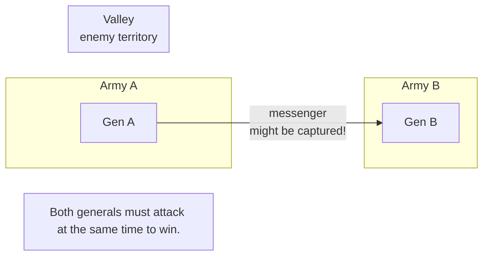

# Distributed Consensus

## 0️⃣ Prerequisites

Before diving into distributed consensus, you should understand:

- **Distributed Systems** (covered in Phase 1, Topic 01): Systems where multiple computers communicate over unreliable networks
- **CAP Theorem** (covered in Phase 1, Topic 06): The tradeoff between consistency, availability, and partition tolerance
- **Time & Clocks** (covered in this Phase, Topic 01): Why we can't rely on synchronized clocks
- **Leader Election** (covered in this Phase, Topic 02): How nodes agree on a single coordinator

**Quick refresher on leader election**: Leader election is a specific case of consensus where nodes agree on "who is the leader." Consensus is the more general problem: getting nodes to agree on any value. If you can solve consensus, you can solve leader election. But the reverse is also true: most consensus algorithms use a leader to coordinate agreement.

---

## 1️⃣ What Problem Does This Exist to Solve?

### The Specific Pain Point

Imagine you're building a distributed database. A client wants to commit a transaction. The transaction needs to be stored on multiple nodes for durability. But here's the problem:

```
Client: "Commit transaction T1"

Node A: "I'll store T1" ✓
Node B: "I'll store T1" ✓
Node C: (network timeout... did it store T1 or not?)

What do we tell the client?
- If we say "committed" and C didn't store it, we might lose data
- If we say "failed" and C did store it, we have inconsistency
```

This is the **consensus problem**: how do multiple nodes agree on a single value (like "T1 is committed") even when some nodes might fail or be unreachable?

### The Two Generals Problem

Before we solve consensus, let's understand why it's hard. The Two Generals Problem is a famous thought experiment:

**The Two Generals Problem**



<details>
<summary>ASCII diagram (reference)</summary>

```text
┌─────────────────────────────────────────────────────────────┐
│                 THE TWO GENERALS PROBLEM                     │
├─────────────────────────────────────────────────────────────┤
│                                                              │
│   Army A                Valley                    Army B     │
│   ┌─────┐            (enemy territory)           ┌─────┐    │
│   │     │                                        │     │    │
│   │ Gen │  ─────── messenger ───────────────────>│ Gen │    │
│   │  A  │     (might be captured!)               │  B  │    │
│   │     │                                        │     │    │
│   └─────┘                                        └─────┘    │
│                                                              │
│   Both generals must attack at the same time to win.        │
```
</details>
│   If only one attacks, they lose.                           │
│                                                              │
│   General A sends: "Attack at dawn"                         │
│   Did the message arrive? A doesn't know.                   │
│                                                              │
│   General B sends acknowledgment: "Message received"        │
│   Did the ack arrive? B doesn't know.                       │
│                                                              │
│   No matter how many messages, neither can be certain       │
│   the other will attack. This is PROVABLY UNSOLVABLE.       │
│                                                              │
└─────────────────────────────────────────────────────────────┘
```

**Key insight**: In a system where messages can be lost, you cannot achieve perfect agreement with 100% certainty. But we can achieve agreement with high probability, or agreement given certain failure assumptions.

### The FLP Impossibility Result

In 1985, Fischer, Lynch, and Paterson proved something surprising:

> In an asynchronous distributed system where even one node can fail, it's impossible to guarantee consensus will be reached.

**What this means:**
- "Asynchronous" = no bound on message delays or processing time
- "One node can fail" = crash failure (node stops responding)
- "Impossible to guarantee" = there's always a scenario where consensus isn't reached

**What this DOESN'T mean:**
- Consensus is impossible in practice
- We should give up on distributed systems

**The practical implication:**
Consensus algorithms must make tradeoffs:
1. **Assume synchrony**: Messages arrive within a time bound (Paxos, Raft)
2. **Accept probabilistic guarantees**: Usually works, might not (practical systems)
3. **Give up availability during uncertainty**: Stop accepting requests (CP systems)

### What Breaks Without Consensus

**Without consensus:**

- **Distributed databases**: Can't commit transactions reliably
- **Configuration management**: Nodes might have different configs
- **Distributed locks**: Multiple processes think they hold the lock
- **Leader election**: Multiple leaders (split brain)
- **Blockchain**: Can't agree on the canonical chain
- **Replicated state machines**: Replicas diverge

### Real Examples of the Problem

**Google Chubby**:
Google needed a distributed lock service for their infrastructure. They built Chubby, which uses Paxos for consensus. Without consensus, two processes might think they both hold a lock, leading to data corruption.

**Apache Kafka**:
Kafka needs to ensure that messages are replicated to multiple brokers before acknowledging. Without consensus, a message might be acknowledged but lost if the primary broker fails.

**etcd (Kubernetes)**:
Kubernetes stores all cluster state in etcd. If etcd nodes can't reach consensus, the cluster can't make progress. This is why Kubernetes requires a majority of etcd nodes to be healthy.

---

## 2️⃣ Intuition and Mental Model

### The Courtroom Analogy

Imagine a jury that must reach a unanimous verdict.

**Scenario 1: Simple Voting (Not Consensus)**
- Each juror votes independently
- Majority wins
- Problem: Jurors might vote based on different evidence

**Scenario 2: Deliberation (Consensus)**
- One juror proposes a verdict
- Others discuss and agree or disagree
- If disagreement, they discuss more
- Eventually, all agree on the same verdict
- Key: Everyone sees the same evidence and reaches the same conclusion

**Scenario 3: Foreman-Led (Paxos/Raft)**
- Foreman proposes a verdict
- Other jurors vote
- If majority agrees, verdict is reached
- If foreman is sick, elect a new foreman
- Key: One person coordinates, but majority must agree

### The Key Insight

Consensus is about making a **decision that sticks**:

```
┌─────────────────────────────────────────────────────────────┐
│                  CONSENSUS PROPERTIES                        │
├─────────────────────────────────────────────────────────────┤
│                                                              │
│  1. AGREEMENT: All correct nodes decide the same value      │
│     - If Node A decides "commit", Node B can't decide       │
│       "abort"                                               │
│                                                              │
│  2. VALIDITY: The decided value was proposed by some node   │
│     - Can't decide a value no one proposed                  │
│     - Prevents "making up" values                           │
│                                                              │
│  3. TERMINATION: All correct nodes eventually decide        │
│     - Can't wait forever                                    │
│     - (This is what FLP says we can't always guarantee)     │
│                                                              │
│  4. INTEGRITY: Each node decides at most once               │
│     - Can't change your mind after deciding                 │
│                                                              │
└─────────────────────────────────────────────────────────────┘
```

---

## 3️⃣ How It Works Internally

### Paxos: The Foundation

Paxos was invented by Leslie Lamport in 1989 (published 1998). It's the theoretical foundation for most consensus algorithms.

**The Setup:**

```
Roles (a node can play multiple roles):
- PROPOSER: Proposes values to be agreed upon
- ACCEPTOR: Votes on proposals
- LEARNER: Learns the decided value

Typical setup:
- 3 or 5 acceptors (odd number for majority)
- Any number of proposers and learners
```

**The Algorithm (Single-Decree Paxos):**

Paxos runs in two phases:

```
PHASE 1: PREPARE
─────────────────
Proposer wants to propose value V

1a. Proposer picks a unique proposal number N
    (higher than any it's seen)
    Sends PREPARE(N) to all acceptors

1b. Acceptor receives PREPARE(N):
    If N > highest_prepare_seen:
      highest_prepare_seen = N
      Reply PROMISE(N, accepted_proposal, accepted_value)
    Else:
      Ignore or reject

PHASE 2: ACCEPT
───────────────
Proposer receives PROMISE from majority

2a. If any PROMISE contained an accepted value:
      Use the value from the highest-numbered accepted proposal
    Else:
      Use the proposer's original value V
    Send ACCEPT(N, value) to all acceptors

2b. Acceptor receives ACCEPT(N, value):
    If N >= highest_prepare_seen:
      Accept the proposal
      accepted_proposal = N
      accepted_value = value
      Reply ACCEPTED(N, value)
    Else:
      Reject

VALUE IS CHOSEN
───────────────
When a majority of acceptors have accepted the same proposal,
that value is chosen. Learners can query acceptors to learn it.
```

**Visual Example:**

```
Proposer P1 wants to propose "commit"
Proposer P2 wants to propose "abort"
Acceptors: A1, A2, A3

Timeline:
─────────

P1: PREPARE(1) ──────────────────> A1, A2, A3
                                   A1: PROMISE(1, null, null)
                                   A2: PROMISE(1, null, null)
                                   A3: (slow, hasn't responded yet)

P1 has majority (2/3), proceeds to Phase 2

P1: ACCEPT(1, "commit") ─────────> A1, A2, A3
                                   A1: ACCEPTED(1, "commit")
                                   A2: ACCEPTED(1, "commit")

Majority accepted! "commit" is chosen.

Meanwhile, P2 tries:
P2: PREPARE(2) ──────────────────> A1, A2, A3
                                   A1: PROMISE(2, 1, "commit")
                                   A2: PROMISE(2, 1, "commit")
                                   A3: PROMISE(2, null, null)

P2 sees that A1 and A2 already accepted "commit"
P2 MUST propose "commit" (not "abort")!

P2: ACCEPT(2, "commit") ─────────> A1, A2, A3
                                   All accept "commit"

Result: Both proposers agree on "commit"
```

**Why Paxos Works:**

1. **Proposal numbers** ensure ordering
2. **Phase 1** discovers any already-accepted values
3. **Phase 2** only proposes values that won't conflict
4. **Majority** ensures overlap between any two quorums

### Multi-Paxos: Practical Paxos

Single-decree Paxos agrees on one value. Real systems need to agree on a sequence of values (like a log of operations). Multi-Paxos optimizes this:

```
Single-Paxos: 2 round-trips per value
  PREPARE → PROMISE → ACCEPT → ACCEPTED

Multi-Paxos: 1 round-trip per value (after leader elected)
  Leader does PREPARE once
  Then just ACCEPT → ACCEPTED for each value
```

**How Multi-Paxos Works:**

```
1. Elect a stable leader (using Paxos!)
2. Leader does PREPARE once for all future proposals
3. For each new value:
   - Leader sends ACCEPT
   - Acceptors reply ACCEPTED
   - Value is chosen
4. If leader fails, elect new leader, restart from step 1
```

### Raft: Understandable Consensus

Raft was designed in 2014 to be easier to understand than Paxos. It's equivalent in power but structured differently.

**Key Differences from Paxos:**

| Aspect | Paxos | Raft |
|--------|-------|------|
| Structure | Symmetric roles | Strong leader |
| Log | Implicit | Explicit |
| Leader election | Separate | Integrated |
| Understandability | Hard | Easier |

**Raft Components:**

```
┌─────────────────────────────────────────────────────────────┐
│                    RAFT STRUCTURE                            │
├─────────────────────────────────────────────────────────────┤
│                                                              │
│  1. LEADER ELECTION (covered in Topic 02)                   │
│     - Nodes are Follower, Candidate, or Leader              │
│     - Leader elected by majority vote                       │
│     - Terms provide logical time                            │
│                                                              │
│  2. LOG REPLICATION                                         │
│     - Leader receives client requests                       │
│     - Leader appends to its log                             │
│     - Leader sends AppendEntries to followers               │
│     - Followers append to their logs                        │
│     - When majority have entry, it's "committed"            │
│                                                              │
│  3. SAFETY                                                  │
│     - Only nodes with up-to-date logs can be leader         │
│     - Committed entries are never lost                      │
│     - All nodes apply same entries in same order            │
│                                                              │
└─────────────────────────────────────────────────────────────┘
```

**Raft Log Replication:**

```
Leader receives command "SET x=5"

Step 1: Leader appends to its log
  Leader log: [1: SET x=1] [2: SET y=2] [3: SET x=5]
                                        ↑ uncommitted

Step 2: Leader sends AppendEntries to followers
  AppendEntries(term=3, prevLogIndex=2, prevLogTerm=2, 
                entries=[{index=3, term=3, cmd="SET x=5"}])

Step 3: Followers append and respond
  Follower A: Appends entry, responds success
  Follower B: Appends entry, responds success
  Follower C: (slow)

Step 4: Leader sees majority (self + A + B = 3/5)
  Entry 3 is now "committed"
  Leader applies to state machine
  Leader responds to client: "OK"

Step 5: Leader notifies followers of commit
  Next AppendEntries includes: leaderCommit=3
  Followers apply entry 3 to their state machines
```

**Java Implementation of Raft Log:**

```java
package com.systemdesign.consensus;

import java.util.*;
import java.util.concurrent.*;

/**
 * Raft log implementation for consensus.
 * Manages log entries, commits, and application to state machine.
 */
public class RaftLog {
    
    private final List<LogEntry> log = new ArrayList<>();
    private volatile int commitIndex = 0;
    private volatile int lastApplied = 0;
    private final StateMachine stateMachine;
    private final Object lock = new Object();
    
    public RaftLog(StateMachine stateMachine) {
        this.stateMachine = stateMachine;
    }
    
    /**
     * Append a new entry (called by leader).
     */
    public int append(int term, String command) {
        synchronized (lock) {
            int index = log.size() + 1;
            log.add(new LogEntry(index, term, command));
            return index;
        }
    }
    
    /**
     * Append entries from leader (called by follower).
     * Returns true if successful, false if log doesn't match.
     */
    public boolean appendEntries(int prevLogIndex, int prevLogTerm, 
                                  List<LogEntry> entries) {
        synchronized (lock) {
            // Check if log matches at prevLogIndex
            if (prevLogIndex > 0) {
                if (prevLogIndex > log.size()) {
                    return false; // Missing entries
                }
                LogEntry prevEntry = log.get(prevLogIndex - 1);
                if (prevEntry.term != prevLogTerm) {
                    // Conflict: delete this and all following entries
                    log.subList(prevLogIndex - 1, log.size()).clear();
                    return false;
                }
            }
            
            // Append new entries (skip duplicates)
            for (LogEntry entry : entries) {
                if (entry.index > log.size()) {
                    log.add(entry);
                } else {
                    // Entry exists, check for conflict
                    LogEntry existing = log.get(entry.index - 1);
                    if (existing.term != entry.term) {
                        // Conflict: replace
                        log.set(entry.index - 1, entry);
                        // Delete all following entries
                        if (entry.index < log.size()) {
                            log.subList(entry.index, log.size()).clear();
                        }
                    }
                }
            }
            
            return true;
        }
    }
    
    /**
     * Update commit index and apply committed entries.
     */
    public void commitTo(int newCommitIndex) {
        synchronized (lock) {
            if (newCommitIndex > commitIndex) {
                commitIndex = Math.min(newCommitIndex, log.size());
                applyCommitted();
            }
        }
    }
    
    /**
     * Apply all committed but not yet applied entries.
     */
    private void applyCommitted() {
        while (lastApplied < commitIndex) {
            lastApplied++;
            LogEntry entry = log.get(lastApplied - 1);
            stateMachine.apply(entry.command);
        }
    }
    
    /**
     * Get entries starting from a given index.
     */
    public List<LogEntry> getEntriesFrom(int startIndex) {
        synchronized (lock) {
            if (startIndex > log.size()) {
                return Collections.emptyList();
            }
            return new ArrayList<>(log.subList(startIndex - 1, log.size()));
        }
    }
    
    /**
     * Get the last log index and term.
     */
    public int[] getLastLogInfo() {
        synchronized (lock) {
            if (log.isEmpty()) {
                return new int[]{0, 0};
            }
            LogEntry last = log.get(log.size() - 1);
            return new int[]{last.index, last.term};
        }
    }
    
    /**
     * Get term at a specific index.
     */
    public int getTermAt(int index) {
        synchronized (lock) {
            if (index <= 0 || index > log.size()) {
                return 0;
            }
            return log.get(index - 1).term;
        }
    }
    
    public int getCommitIndex() {
        return commitIndex;
    }
    
    public int getLastApplied() {
        return lastApplied;
    }
    
    public int size() {
        return log.size();
    }
    
    /**
     * A single log entry.
     */
    public record LogEntry(int index, int term, String command) {}
    
    /**
     * State machine interface.
     */
    public interface StateMachine {
        void apply(String command);
    }
}
```

**Complete Raft Node Implementation:**

```java
package com.systemdesign.consensus;

import java.util.*;
import java.util.concurrent.*;
import java.util.concurrent.atomic.*;

/**
 * Complete Raft consensus node implementation.
 * Handles leader election, log replication, and state machine.
 */
public class RaftNode {
    
    public enum State { FOLLOWER, CANDIDATE, LEADER }
    
    // Node identity
    private final String nodeId;
    private final List<String> peers;
    
    // Persistent state (would be saved to disk in production)
    private volatile int currentTerm = 0;
    private volatile String votedFor = null;
    private final RaftLog log;
    
    // Volatile state
    private volatile State state = State.FOLLOWER;
    private volatile String leaderId = null;
    
    // Leader state (reinitialized after election)
    private final Map<String, Integer> nextIndex = new ConcurrentHashMap<>();
    private final Map<String, Integer> matchIndex = new ConcurrentHashMap<>();
    
    // Timing
    private final ScheduledExecutorService scheduler = 
        Executors.newScheduledThreadPool(2);
    private ScheduledFuture<?> electionTimer;
    private ScheduledFuture<?> heartbeatTimer;
    private final Random random = new Random();
    
    private static final int HEARTBEAT_INTERVAL_MS = 50;
    private static final int MIN_ELECTION_TIMEOUT_MS = 150;
    private static final int MAX_ELECTION_TIMEOUT_MS = 300;
    
    // RPC interface
    private final RaftRPC rpc;
    
    // Client request handling
    private final Map<Integer, CompletableFuture<Boolean>> pendingRequests = 
        new ConcurrentHashMap<>();
    
    public RaftNode(String nodeId, List<String> peers, RaftRPC rpc, 
                    RaftLog.StateMachine stateMachine) {
        this.nodeId = nodeId;
        this.peers = new ArrayList<>(peers);
        this.rpc = rpc;
        this.log = new RaftLog(stateMachine);
    }
    
    /**
     * Start the Raft node.
     */
    public void start() {
        resetElectionTimer();
        System.out.println(nodeId + " started as FOLLOWER");
    }
    
    /**
     * Submit a command to the cluster.
     * Returns a future that completes when the command is committed.
     */
    public CompletableFuture<Boolean> submitCommand(String command) {
        if (state != State.LEADER) {
            CompletableFuture<Boolean> future = new CompletableFuture<>();
            future.completeExceptionally(
                new NotLeaderException("Not the leader. Leader is: " + leaderId));
            return future;
        }
        
        // Append to log
        int index = log.append(currentTerm, command);
        
        // Create future for this request
        CompletableFuture<Boolean> future = new CompletableFuture<>();
        pendingRequests.put(index, future);
        
        // Replicate to followers
        replicateToFollowers();
        
        return future;
    }
    
    // ==================== LEADER ELECTION ====================
    
    /**
     * Handle vote request from a candidate.
     */
    public synchronized VoteResponse handleVoteRequest(VoteRequest request) {
        // Update term if needed
        if (request.term > currentTerm) {
            currentTerm = request.term;
            state = State.FOLLOWER;
            votedFor = null;
        }
        
        // Reject if term is old
        if (request.term < currentTerm) {
            return new VoteResponse(currentTerm, false);
        }
        
        // Check if we can vote for this candidate
        boolean canVote = (votedFor == null || votedFor.equals(request.candidateId));
        
        // Check if candidate's log is at least as up-to-date as ours
        int[] lastLog = log.getLastLogInfo();
        boolean logOk = request.lastLogTerm > lastLog[1] ||
            (request.lastLogTerm == lastLog[1] && request.lastLogIndex >= lastLog[0]);
        
        if (canVote && logOk) {
            votedFor = request.candidateId;
            resetElectionTimer();
            return new VoteResponse(currentTerm, true);
        }
        
        return new VoteResponse(currentTerm, false);
    }
    
    /**
     * Start an election.
     */
    private synchronized void startElection() {
        if (state == State.LEADER) return;
        
        state = State.CANDIDATE;
        currentTerm++;
        votedFor = nodeId;
        
        System.out.println(nodeId + " starting election for term " + currentTerm);
        
        int[] lastLog = log.getLastLogInfo();
        VoteRequest request = new VoteRequest(
            currentTerm, nodeId, lastLog[0], lastLog[1]);
        
        AtomicInteger votes = new AtomicInteger(1); // Vote for self
        int votesNeeded = (peers.size() + 1) / 2 + 1;
        
        for (String peer : peers) {
            int electionTerm = currentTerm;
            rpc.requestVote(peer, request).thenAccept(response -> {
                synchronized (this) {
                    if (state != State.CANDIDATE || currentTerm != electionTerm) {
                        return;
                    }
                    
                    if (response.term > currentTerm) {
                        currentTerm = response.term;
                        state = State.FOLLOWER;
                        votedFor = null;
                        return;
                    }
                    
                    if (response.voteGranted) {
                        int totalVotes = votes.incrementAndGet();
                        if (totalVotes >= votesNeeded && state == State.CANDIDATE) {
                            becomeLeader();
                        }
                    }
                }
            });
        }
        
        resetElectionTimer();
    }
    
    /**
     * Become the leader.
     */
    private void becomeLeader() {
        state = State.LEADER;
        leaderId = nodeId;
        
        System.out.println(nodeId + " became LEADER for term " + currentTerm);
        
        // Initialize leader state
        int lastLogIndex = log.size();
        for (String peer : peers) {
            nextIndex.put(peer, lastLogIndex + 1);
            matchIndex.put(peer, 0);
        }
        
        // Cancel election timer
        if (electionTimer != null) {
            electionTimer.cancel(false);
        }
        
        // Start heartbeats
        heartbeatTimer = scheduler.scheduleAtFixedRate(
            this::sendHeartbeats, 0, HEARTBEAT_INTERVAL_MS, TimeUnit.MILLISECONDS);
    }
    
    // ==================== LOG REPLICATION ====================
    
    /**
     * Handle AppendEntries from leader.
     */
    public synchronized AppendResponse handleAppendEntries(AppendRequest request) {
        // Update term if needed
        if (request.term > currentTerm) {
            currentTerm = request.term;
            state = State.FOLLOWER;
            votedFor = null;
        }
        
        // Reject if term is old
        if (request.term < currentTerm) {
            return new AppendResponse(currentTerm, false, 0);
        }
        
        // Valid AppendEntries from leader
        state = State.FOLLOWER;
        leaderId = request.leaderId;
        resetElectionTimer();
        
        // Try to append entries
        boolean success = log.appendEntries(
            request.prevLogIndex, request.prevLogTerm, request.entries);
        
        if (!success) {
            return new AppendResponse(currentTerm, false, 0);
        }
        
        // Update commit index
        if (request.leaderCommit > log.getCommitIndex()) {
            log.commitTo(request.leaderCommit);
        }
        
        int matchIndex = request.prevLogIndex + request.entries.size();
        return new AppendResponse(currentTerm, true, matchIndex);
    }
    
    /**
     * Send heartbeats/AppendEntries to all followers.
     */
    private void sendHeartbeats() {
        if (state != State.LEADER) {
            if (heartbeatTimer != null) {
                heartbeatTimer.cancel(false);
            }
            return;
        }
        
        for (String peer : peers) {
            sendAppendEntries(peer);
        }
    }
    
    /**
     * Send AppendEntries to a specific follower.
     */
    private void sendAppendEntries(String peer) {
        int ni = nextIndex.getOrDefault(peer, 1);
        int prevLogIndex = ni - 1;
        int prevLogTerm = log.getTermAt(prevLogIndex);
        List<RaftLog.LogEntry> entries = log.getEntriesFrom(ni);
        
        AppendRequest request = new AppendRequest(
            currentTerm, nodeId, prevLogIndex, prevLogTerm, 
            entries, log.getCommitIndex());
        
        int requestTerm = currentTerm;
        rpc.appendEntries(peer, request).thenAccept(response -> {
            synchronized (this) {
                if (state != State.LEADER || currentTerm != requestTerm) {
                    return;
                }
                
                if (response.term > currentTerm) {
                    currentTerm = response.term;
                    state = State.FOLLOWER;
                    votedFor = null;
                    if (heartbeatTimer != null) {
                        heartbeatTimer.cancel(false);
                    }
                    resetElectionTimer();
                    return;
                }
                
                if (response.success) {
                    // Update nextIndex and matchIndex
                    nextIndex.put(peer, response.matchIndex + 1);
                    matchIndex.put(peer, response.matchIndex);
                    
                    // Check if we can advance commitIndex
                    advanceCommitIndex();
                } else {
                    // Decrement nextIndex and retry
                    nextIndex.put(peer, Math.max(1, ni - 1));
                }
            }
        });
    }
    
    /**
     * Replicate new entries to followers.
     */
    private void replicateToFollowers() {
        for (String peer : peers) {
            sendAppendEntries(peer);
        }
    }
    
    /**
     * Advance commit index if a majority has replicated.
     */
    private void advanceCommitIndex() {
        // Find the highest index replicated on a majority
        List<Integer> matchIndices = new ArrayList<>();
        matchIndices.add(log.size()); // Leader's own log
        for (String peer : peers) {
            matchIndices.add(matchIndex.getOrDefault(peer, 0));
        }
        Collections.sort(matchIndices, Collections.reverseOrder());
        
        int majorityIndex = matchIndices.get(matchIndices.size() / 2);
        
        // Only commit entries from current term
        if (majorityIndex > log.getCommitIndex() && 
            log.getTermAt(majorityIndex) == currentTerm) {
            
            int oldCommitIndex = log.getCommitIndex();
            log.commitTo(majorityIndex);
            
            // Complete pending requests
            for (int i = oldCommitIndex + 1; i <= majorityIndex; i++) {
                CompletableFuture<Boolean> future = pendingRequests.remove(i);
                if (future != null) {
                    future.complete(true);
                }
            }
        }
    }
    
    // ==================== TIMING ====================
    
    private void resetElectionTimer() {
        if (electionTimer != null) {
            electionTimer.cancel(false);
        }
        
        int timeout = MIN_ELECTION_TIMEOUT_MS + 
            random.nextInt(MAX_ELECTION_TIMEOUT_MS - MIN_ELECTION_TIMEOUT_MS);
        
        electionTimer = scheduler.schedule(
            this::startElection, timeout, TimeUnit.MILLISECONDS);
    }
    
    // ==================== GETTERS ====================
    
    public State getState() { return state; }
    public int getCurrentTerm() { return currentTerm; }
    public String getLeaderId() { return leaderId; }
    public boolean isLeader() { return state == State.LEADER; }
    
    // ==================== MESSAGES ====================
    
    public record VoteRequest(int term, String candidateId, 
                              int lastLogIndex, int lastLogTerm) {}
    public record VoteResponse(int term, boolean voteGranted) {}
    
    public record AppendRequest(int term, String leaderId, int prevLogIndex, 
                                int prevLogTerm, List<RaftLog.LogEntry> entries, 
                                int leaderCommit) {}
    public record AppendResponse(int term, boolean success, int matchIndex) {}
    
    public interface RaftRPC {
        CompletableFuture<VoteResponse> requestVote(String peer, VoteRequest request);
        CompletableFuture<AppendResponse> appendEntries(String peer, AppendRequest request);
    }
    
    public static class NotLeaderException extends RuntimeException {
        public NotLeaderException(String message) { super(message); }
    }
}
```

---

## 4️⃣ Simulation-First Explanation

Let's trace through a complete consensus scenario.

### Scenario: Committing a Transaction

**Setup:**
- Three nodes: A (leader), B, C
- Current term: 5
- Log state: All nodes have entries 1-10 committed

### Client Submits Command

```
Time 0ms: Client sends "SET x=100" to Leader A

Leader A:
  1. Appends to log: entry 11 = {term: 5, cmd: "SET x=100"}
  2. Entry 11 is uncommitted
  3. Sends AppendEntries to B and C:
     AppendEntries(term=5, prevLogIndex=10, prevLogTerm=5,
                   entries=[{index=11, term=5, cmd="SET x=100"}],
                   leaderCommit=10)
```

### Followers Receive and Respond

```
Time 5ms: B receives AppendEntries
  1. prevLogIndex=10, prevLogTerm=5 matches B's log ✓
  2. Appends entry 11 to log
  3. Responds: AppendResponse(term=5, success=true, matchIndex=11)

Time 8ms: C receives AppendEntries
  1. prevLogIndex=10, prevLogTerm=5 matches C's log ✓
  2. Appends entry 11 to log
  3. Responds: AppendResponse(term=5, success=true, matchIndex=11)
```

### Leader Commits

```
Time 10ms: A receives response from B
  matchIndex[B] = 11
  Majority check: A(11), B(11), C(?) 
  Not yet majority (need 2/3)

Time 12ms: A receives response from C
  matchIndex[C] = 11
  Majority check: A(11), B(11), C(11)
  All three have entry 11!
  
  Entry 11 is now COMMITTED
  A applies "SET x=100" to state machine
  A responds to client: "OK"
```

### Followers Learn of Commit

```
Time 50ms: Next heartbeat
  A sends AppendEntries(term=5, ..., leaderCommit=11)
  
  B receives: leaderCommit=11 > commitIndex=10
  B commits entry 11, applies to state machine
  
  C receives: leaderCommit=11 > commitIndex=10
  C commits entry 11, applies to state machine

All nodes now have x=100 in their state machine
```

### What If a Follower Was Slow?

```
Alternative timeline:

Time 0ms: A sends AppendEntries to B and C
Time 5ms: B responds success
Time ???: C is slow (network delay)

Time 10ms: A has 2/3 (A + B)
  Entry 11 is COMMITTED!
  A responds to client: "OK"

Time 500ms: C finally responds
  A updates matchIndex[C] = 11
  (Entry was already committed, no change)

Key insight: We only need a MAJORITY to commit.
Slow nodes don't block progress.
```

---

## 5️⃣ How Engineers Actually Use This in Production

### At Major Companies

**Google (Spanner, Chubby)**:
- Uses Paxos (and variants) for consensus
- Chubby: Distributed lock service using Paxos
- Spanner: Uses Paxos groups for each data shard
- TrueTime enables global ordering

**Amazon (DynamoDB)**:
- Uses Paxos for metadata coordination
- Data replication uses quorum-based eventual consistency
- Paxos only for critical coordination

**HashiCorp (Consul, Nomad)**:
- Uses Raft for consensus
- Consul: Service discovery and configuration
- Nomad: Job scheduling

**Cloudflare**:
- Uses Raft in their distributed systems
- Custom optimizations for global scale

### Production Considerations

```
┌─────────────────────────────────────────────────────────────┐
│           CONSENSUS IN PRODUCTION CHECKLIST                  │
├─────────────────────────────────────────────────────────────┤
│                                                              │
│  CLUSTER CONFIGURATION                                      │
│  □ Use 3 or 5 nodes (odd number)                            │
│  □ Spread across failure domains (racks, AZs)               │
│  □ Dedicated machines for consensus (not shared)            │
│                                                              │
│  PERFORMANCE                                                │
│  □ Use SSDs for log persistence                             │
│  □ Batch writes when possible                               │
│  □ Consider read-only queries to followers                  │
│  □ Monitor latency percentiles (p50, p99)                   │
│                                                              │
│  RELIABILITY                                                │
│  □ Test failure scenarios regularly                         │
│  □ Monitor leader changes                                   │
│  □ Alert on high election frequency                         │
│  □ Have runbooks for common issues                          │
│                                                              │
│  OPERATIONS                                                 │
│  □ Rolling upgrades without downtime                        │
│  □ Membership changes (adding/removing nodes)               │
│  □ Backup and restore procedures                            │
│  □ Disaster recovery plan                                   │
│                                                              │
└─────────────────────────────────────────────────────────────┘
```

### When to Use Consensus

```
┌─────────────────────────────────────────────────────────────┐
│              CONSENSUS DECISION TREE                         │
├─────────────────────────────────────────────────────────────┤
│                                                              │
│  Do you need strong consistency?                            │
│  ├── NO → Use eventual consistency (faster, simpler)        │
│  │                                                          │
│  └── YES → Is the data small and critical?                  │
│            ├── YES → Use consensus (etcd, ZooKeeper)        │
│            │         Examples: config, locks, leader info   │
│            │                                                │
│            └── NO → Consider other options                  │
│                     - Sharded consensus (Spanner)           │
│                     - Two-phase commit                      │
│                     - Saga pattern                          │
│                                                             │
└─────────────────────────────────────────────────────────────┘
```

---

## 6️⃣ How to Implement or Apply It

### Using etcd for Consensus

Instead of implementing Raft yourself, use etcd:

**Maven Dependencies:**

```xml
<dependencies>
    <dependency>
        <groupId>io.etcd</groupId>
        <artifactId>jetcd-core</artifactId>
        <version>0.7.5</version>
    </dependency>
</dependencies>
```

**Java Client:**

```java
package com.systemdesign.consensus;

import io.etcd.jetcd.*;
import io.etcd.jetcd.kv.GetResponse;
import io.etcd.jetcd.kv.PutResponse;
import io.etcd.jetcd.lease.LeaseGrantResponse;
import io.etcd.jetcd.options.GetOption;
import io.etcd.jetcd.options.PutOption;
import io.etcd.jetcd.watch.WatchEvent;

import java.nio.charset.StandardCharsets;
import java.util.concurrent.CompletableFuture;
import java.util.concurrent.ExecutionException;

/**
 * etcd client wrapper demonstrating consensus operations.
 */
public class EtcdConsensusClient implements AutoCloseable {
    
    private final Client client;
    private final KV kvClient;
    private final Lease leaseClient;
    private final Watch watchClient;
    
    public EtcdConsensusClient(String... endpoints) {
        this.client = Client.builder()
            .endpoints(endpoints)
            .build();
        this.kvClient = client.getKVClient();
        this.leaseClient = client.getLeaseClient();
        this.watchClient = client.getWatchClient();
    }
    
    /**
     * Put a value with consensus (linearizable write).
     */
    public void put(String key, String value) throws ExecutionException, InterruptedException {
        ByteSequence keyBs = ByteSequence.from(key, StandardCharsets.UTF_8);
        ByteSequence valueBs = ByteSequence.from(value, StandardCharsets.UTF_8);
        
        PutResponse response = kvClient.put(keyBs, valueBs).get();
        System.out.println("Put " + key + " at revision " + response.getHeader().getRevision());
    }
    
    /**
     * Get a value (linearizable read by default).
     */
    public String get(String key) throws ExecutionException, InterruptedException {
        ByteSequence keyBs = ByteSequence.from(key, StandardCharsets.UTF_8);
        
        GetResponse response = kvClient.get(keyBs).get();
        
        if (response.getKvs().isEmpty()) {
            return null;
        }
        
        return response.getKvs().get(0).getValue().toString(StandardCharsets.UTF_8);
    }
    
    /**
     * Put a value with a lease (TTL).
     * Value is automatically deleted when lease expires.
     */
    public long putWithLease(String key, String value, long ttlSeconds) 
            throws ExecutionException, InterruptedException {
        // Create lease
        LeaseGrantResponse leaseResponse = leaseClient.grant(ttlSeconds).get();
        long leaseId = leaseResponse.getID();
        
        // Put with lease
        ByteSequence keyBs = ByteSequence.from(key, StandardCharsets.UTF_8);
        ByteSequence valueBs = ByteSequence.from(value, StandardCharsets.UTF_8);
        
        kvClient.put(keyBs, valueBs, PutOption.newBuilder().withLeaseId(leaseId).build()).get();
        
        return leaseId;
    }
    
    /**
     * Compare-and-swap: only update if current value matches expected.
     * This is the foundation for distributed locks.
     */
    public boolean compareAndSwap(String key, String expectedValue, String newValue) 
            throws ExecutionException, InterruptedException {
        ByteSequence keyBs = ByteSequence.from(key, StandardCharsets.UTF_8);
        ByteSequence expectedBs = ByteSequence.from(expectedValue, StandardCharsets.UTF_8);
        ByteSequence newBs = ByteSequence.from(newValue, StandardCharsets.UTF_8);
        
        // Create transaction: if value == expected, then put new value
        Txn txn = kvClient.txn();
        
        io.etcd.jetcd.op.Cmp cmp = new io.etcd.jetcd.op.Cmp(
            keyBs, 
            io.etcd.jetcd.op.Cmp.Op.EQUAL, 
            io.etcd.jetcd.op.CmpTarget.value(expectedBs)
        );
        
        io.etcd.jetcd.options.PutOption putOption = io.etcd.jetcd.options.PutOption.DEFAULT;
        
        var response = txn
            .If(cmp)
            .Then(io.etcd.jetcd.op.Op.put(keyBs, newBs, putOption))
            .commit()
            .get();
        
        return response.isSucceeded();
    }
    
    /**
     * Watch for changes to a key.
     */
    public void watch(String key, java.util.function.Consumer<WatchEvent> callback) {
        ByteSequence keyBs = ByteSequence.from(key, StandardCharsets.UTF_8);
        
        watchClient.watch(keyBs, watchResponse -> {
            for (WatchEvent event : watchResponse.getEvents()) {
                callback.accept(event);
            }
        });
    }
    
    /**
     * Get all keys with a prefix.
     */
    public java.util.Map<String, String> getWithPrefix(String prefix) 
            throws ExecutionException, InterruptedException {
        ByteSequence prefixBs = ByteSequence.from(prefix, StandardCharsets.UTF_8);
        
        GetOption option = GetOption.newBuilder()
            .isPrefix(true)
            .build();
        
        GetResponse response = kvClient.get(prefixBs, option).get();
        
        java.util.Map<String, String> result = new java.util.HashMap<>();
        for (var kv : response.getKvs()) {
            String k = kv.getKey().toString(StandardCharsets.UTF_8);
            String v = kv.getValue().toString(StandardCharsets.UTF_8);
            result.put(k, v);
        }
        
        return result;
    }
    
    @Override
    public void close() {
        client.close();
    }
}
```

**Example Usage:**

```java
package com.systemdesign.consensus;

public class EtcdExample {
    
    public static void main(String[] args) throws Exception {
        try (EtcdConsensusClient client = new EtcdConsensusClient("http://localhost:2379")) {
            
            // Basic put/get
            client.put("config/database/host", "db.example.com");
            String host = client.get("config/database/host");
            System.out.println("Database host: " + host);
            
            // Put with TTL (for ephemeral data like service registration)
            long leaseId = client.putWithLease("services/api/instance-1", 
                "192.168.1.100:8080", 30);
            System.out.println("Registered service with lease " + leaseId);
            
            // Compare-and-swap (for distributed locks)
            boolean acquired = client.compareAndSwap("locks/my-resource", "", "owner-1");
            System.out.println("Lock acquired: " + acquired);
            
            // Watch for changes
            client.watch("config/", event -> {
                System.out.println("Config changed: " + event.getEventType() + 
                    " " + event.getKeyValue().getKey().toString());
            });
            
            // Get all config
            var configs = client.getWithPrefix("config/");
            System.out.println("All configs: " + configs);
        }
    }
}
```

### Distributed Lock Using Consensus

```java
package com.systemdesign.consensus;

import java.util.UUID;
import java.util.concurrent.*;

/**
 * Distributed lock implementation using etcd consensus.
 */
public class DistributedLock implements AutoCloseable {
    
    private final EtcdConsensusClient client;
    private final String lockPath;
    private final String ownerId;
    private final long ttlSeconds;
    
    private volatile long leaseId;
    private volatile boolean held;
    private final ScheduledExecutorService renewalExecutor;
    
    public DistributedLock(EtcdConsensusClient client, String lockName, long ttlSeconds) {
        this.client = client;
        this.lockPath = "/locks/" + lockName;
        this.ownerId = UUID.randomUUID().toString();
        this.ttlSeconds = ttlSeconds;
        this.renewalExecutor = Executors.newSingleThreadScheduledExecutor();
    }
    
    /**
     * Try to acquire the lock.
     * Returns true if lock was acquired, false otherwise.
     */
    public boolean tryAcquire() throws Exception {
        // Create a lease
        leaseId = client.putWithLease(lockPath, ownerId, ttlSeconds);
        
        // Check if we got the lock
        String currentOwner = client.get(lockPath);
        
        if (ownerId.equals(currentOwner)) {
            held = true;
            startLeaseRenewal();
            return true;
        }
        
        return false;
    }
    
    /**
     * Acquire the lock, waiting if necessary.
     */
    public void acquire() throws Exception {
        while (!tryAcquire()) {
            // Wait and retry
            Thread.sleep(100);
        }
    }
    
    /**
     * Acquire the lock with a timeout.
     */
    public boolean acquire(long timeout, TimeUnit unit) throws Exception {
        long deadline = System.currentTimeMillis() + unit.toMillis(timeout);
        
        while (System.currentTimeMillis() < deadline) {
            if (tryAcquire()) {
                return true;
            }
            Thread.sleep(100);
        }
        
        return false;
    }
    
    /**
     * Release the lock.
     */
    public void release() throws Exception {
        if (!held) {
            return;
        }
        
        // Only release if we still own it
        boolean released = client.compareAndSwap(lockPath, ownerId, "");
        
        if (released) {
            held = false;
            renewalExecutor.shutdown();
        }
    }
    
    /**
     * Check if this instance holds the lock.
     */
    public boolean isHeld() throws Exception {
        if (!held) {
            return false;
        }
        
        String currentOwner = client.get(lockPath);
        return ownerId.equals(currentOwner);
    }
    
    /**
     * Keep the lease alive while we hold the lock.
     */
    private void startLeaseRenewal() {
        long renewalInterval = (ttlSeconds * 1000) / 3;
        
        renewalExecutor.scheduleAtFixedRate(() -> {
            try {
                if (held) {
                    // Renew lease
                    client.putWithLease(lockPath, ownerId, ttlSeconds);
                }
            } catch (Exception e) {
                System.err.println("Failed to renew lease: " + e.getMessage());
                held = false;
            }
        }, renewalInterval, renewalInterval, TimeUnit.MILLISECONDS);
    }
    
    @Override
    public void close() throws Exception {
        release();
    }
}
```

---

## 7️⃣ Tradeoffs, Pitfalls, and Common Mistakes

### Common Mistakes

#### 1. Using Consensus for Everything

**Wrong:**
```java
// BAD: Using consensus for high-throughput data
for (Event event : events) {
    etcd.put("events/" + event.getId(), event.toJson());
}
// Consensus is slow! This will bottleneck at ~10K ops/sec
```

**Right:**
```java
// GOOD: Use consensus only for coordination
etcd.put("config/event-processor", "node-1"); // Who processes events

// Use Kafka/database for actual event storage
kafka.send("events", event);
```

#### 2. Not Handling Leader Failures

**Wrong:**
```java
// BAD: Assumes leader is always available
public void processRequest(Request request) {
    raftNode.submitCommand(request.toCommand());
    // What if we're not the leader?
}
```

**Right:**
```java
// GOOD: Handle not-leader case
public void processRequest(Request request) {
    try {
        raftNode.submitCommand(request.toCommand()).get();
    } catch (NotLeaderException e) {
        // Redirect to leader
        String leaderId = raftNode.getLeaderId();
        throw new RedirectException(leaderId);
    }
}
```

#### 3. Ignoring Membership Changes

**Wrong:**
```java
// BAD: Static cluster membership
List<String> peers = List.of("node1", "node2", "node3");
// What if we need to add node4?
```

**Right:**
```java
// GOOD: Dynamic membership via consensus
// Raft supports membership changes as log entries
raftNode.submitMembershipChange(AddNode("node4"));
```

### Performance Gotchas

#### Consensus Latency

```
Single-datacenter consensus:
  - Network RTT: 0.5ms
  - Disk fsync: 1-5ms
  - Total: 2-10ms per operation

Cross-datacenter consensus:
  - Network RTT: 50-200ms (depending on distance)
  - Total: 100-400ms per operation

Optimization strategies:
  - Batch writes
  - Pipeline requests
  - Read from followers (for eventual consistency)
  - Use leases for reads (bounded staleness)
```

#### Write Amplification

```
For each write:
  1. Leader writes to its log (1 disk write)
  2. Leader sends to all followers (N-1 network messages)
  3. Each follower writes to its log (N-1 disk writes)
  4. Followers respond (N-1 network messages)
  5. Leader commits (1 disk write)

Total: N disk writes + 2(N-1) network messages

For 5-node cluster: 5 disk writes + 8 network messages per operation
```

---

## 8️⃣ When NOT to Use This

### When Consensus is Overkill

1. **Single-node systems**: No need for consensus
2. **Stateless services**: Nothing to agree on
3. **Idempotent operations**: Retry is safe, no consensus needed
4. **Eventually consistent data**: Use simpler replication

### When Simpler Alternatives Work

1. **Primary-backup replication**: If you can tolerate brief unavailability
2. **Quorum reads/writes**: For key-value stores without transactions
3. **Conflict-free replicated data types (CRDTs)**: For specific data structures
4. **Event sourcing**: For append-only logs

### Anti-Patterns

1. **Consensus for user data**
   - Too slow for high-throughput
   - Use consensus for metadata, not data

2. **Global consensus**
   - Cross-continent consensus is very slow
   - Use regional consensus with async replication

3. **Consensus without persistence**
   - Must persist to disk before acknowledging
   - In-memory only loses durability

---

## 9️⃣ Comparison with Alternatives

### Consensus Algorithm Comparison

| Aspect | Paxos | Multi-Paxos | Raft | ZAB |
|--------|-------|-------------|------|-----|
| Understandability | Hard | Hard | Easy | Medium |
| Leader | Optional | Required | Required | Required |
| Rounds per decision | 2 | 1 (steady state) | 1 | 1 |
| Used by | Chubby, Spanner | Many | etcd, Consul | ZooKeeper |

### Consistency Approach Comparison

| Approach | Consistency | Availability | Latency | Use Case |
|----------|-------------|--------------|---------|----------|
| Consensus (Raft) | Strong | Majority | High | Metadata |
| Primary-Backup | Strong | Single point | Low | Simple replication |
| Quorum R/W | Tunable | High | Medium | Key-value stores |
| Eventual | Eventual | Very high | Very low | User data |

### Technology Comparison

| Technology | Algorithm | Language | Typical Use |
|------------|-----------|----------|-------------|
| etcd | Raft | Go | Kubernetes, config |
| ZooKeeper | ZAB | Java | Hadoop, Kafka |
| Consul | Raft | Go | Service discovery |
| CockroachDB | Raft | Go | Distributed SQL |
| TiKV | Raft | Rust | Distributed KV |

---

## 🔟 Interview Follow-Up Questions WITH Answers

### L4 (Entry-Level) Questions

**Q1: What is distributed consensus and why is it hard?**

**Answer:**
Distributed consensus is the problem of getting multiple computers to agree on a single value, even when some computers might fail or messages might be lost.

It's hard because of the FLP impossibility result: in an asynchronous system where even one node can fail, you cannot guarantee consensus will always be reached. The challenges are:

1. **No global clock**: You can't say "decide by 3pm" because clocks aren't synchronized
2. **Messages can be lost or delayed**: You can't tell if a node is dead or just slow
3. **Nodes can fail**: Any node might crash at any time

Practical systems work around this by making timing assumptions (messages arrive within some bound) and accepting that consensus might be delayed during failures.

**Q2: What's the difference between Paxos and Raft?**

**Answer:**
Both solve the same problem (consensus) with equivalent guarantees, but they're structured differently:

**Paxos:**
- More theoretical, harder to understand
- Roles are symmetric (any node can propose)
- Two phases: Prepare and Accept
- Log replication is a separate concern

**Raft:**
- Designed for understandability
- Strong leader: all requests go through leader
- Combines leader election and log replication
- Explicit log with indices and terms

In practice, Raft is more popular for new systems because it's easier to implement correctly. etcd, Consul, and CockroachDB all use Raft.

### L5 (Senior) Questions

**Q3: How does Raft ensure that committed entries are never lost?**

**Answer:**
Raft ensures committed entries survive through several mechanisms:

1. **Majority replication**: An entry is only committed when it's replicated to a majority of nodes. Any future majority will include at least one node with the entry.

2. **Leader election restriction**: A candidate can only win an election if its log is "at least as up-to-date" as a majority of voters. This means the new leader will have all committed entries.

3. **Log matching property**: If two logs have an entry with the same index and term, all preceding entries are identical. This prevents divergence.

4. **Persistence**: Nodes persist their log to disk before acknowledging. Even if a node crashes and restarts, it has its log.

The key insight is that "committed" means "replicated to a majority," and any future leader must have gotten votes from a majority, so there's always overlap.

**Q4: How would you handle a network partition in a Raft cluster?**

**Answer:**
In a 5-node Raft cluster that partitions into [A,B] and [C,D,E]:

**Minority partition [A,B]:**
- If A was the leader, it can no longer get majority acknowledgment
- A will eventually step down (can't commit new entries)
- B will start elections but can't win (only 2 votes)
- This partition is unavailable for writes

**Majority partition [C,D,E]:**
- Will elect a new leader (can get 3 votes)
- Can continue accepting writes
- New entries get committed with the new leader

**When partition heals:**
- A and B will see higher term from new leader
- They'll become followers
- Their uncommitted entries (if any) will be overwritten
- Cluster is back to normal

The key is that only the majority partition can make progress, preventing split-brain.

### L6 (Staff) Questions

**Q5: Design a globally distributed consensus system.**

**Answer:**
Global consensus is challenging because cross-continent latency is 100-200ms. Here's my approach:

**Architecture:**

```
Region 1 (US-East)     Region 2 (US-West)     Region 3 (Europe)
┌─────────────────┐    ┌─────────────────┐    ┌─────────────────┐
│ Raft Group 1    │    │ Raft Group 1    │    │ Raft Group 1    │
│ (local replica) │    │ (local replica) │    │ (local replica) │
└────────┬────────┘    └────────┬────────┘    └────────┬────────┘
         │                      │                      │
         └──────────────────────┼──────────────────────┘
                                │
                         Global Paxos
```

**Approach 1: Global Paxos (Spanner-style)**
- Single Paxos group spanning all regions
- Use TrueTime or HLC for ordering
- High latency (300-500ms) but strong consistency
- Good for: financial transactions, inventory

**Approach 2: Regional consensus with async replication**
- Each region has its own Raft cluster
- Async replication between regions
- Low latency for regional operations
- Eventual consistency globally
- Good for: user data, content

**Approach 3: Hierarchical consensus**
- Regional Raft for local operations
- Global Paxos for cross-region coordination
- Route requests based on data locality
- Good for: mixed workloads

For most systems, I'd recommend Approach 2 with conflict resolution, as it provides the best latency for users while still achieving eventual consistency.

**Q6: How would you debug a consensus system that's not making progress?**

**Answer:**
Systematic debugging approach:

**1. Check cluster health:**
```
- Are all nodes running?
- Can nodes communicate?
- Is there a leader?
```

**2. Examine leader election:**
```
- Is there a stable leader?
- Are there frequent elections? (indicates instability)
- Check term numbers across nodes
```

**3. Check log state:**
```
- Compare log lengths across nodes
- Look for gaps or mismatches
- Check commit index vs log length
```

**4. Network analysis:**
```
- Measure latency between nodes
- Check for packet loss
- Look for asymmetric partitions
```

**5. Common issues:**
```
- Clock skew causing election storms
- Disk I/O too slow (fsync latency)
- Network timeout too aggressive
- Split brain from misconfiguration
```

**Monitoring to have in place:**
- Leader changes per hour
- Election duration
- Log replication lag
- Commit latency (p50, p99)
- Disk fsync latency

---

## 1️⃣1️⃣ One Clean Mental Summary

Distributed consensus solves the problem of getting multiple nodes to agree on a value, even when some nodes fail or messages are lost. The FLP impossibility result proves this can't be guaranteed in a purely asynchronous system, so practical algorithms make timing assumptions. Paxos is the theoretical foundation: it uses proposal numbers and two phases (Prepare/Accept) to ensure agreement. Raft is the practical choice: it uses a strong leader, explicit log replication, and is designed to be understandable. Both require a majority (quorum) for any decision, which ensures that any two majorities overlap, preventing conflicting decisions. In production, use etcd or ZooKeeper rather than implementing consensus yourself. Use consensus for small, critical data (configuration, locks, leader election), not for high-throughput user data. The key tradeoff is latency: consensus requires multiple network round-trips, making it unsuitable for latency-sensitive operations.

---

## Quick Reference Card

```
┌─────────────────────────────────────────────────────────────┐
│             DISTRIBUTED CONSENSUS CHEAT SHEET                │
├─────────────────────────────────────────────────────────────┤
│ PROPERTIES                                                   │
│   Agreement: All correct nodes decide same value            │
│   Validity: Decided value was proposed by someone           │
│   Termination: Eventually a decision is made                │
│   Integrity: Each node decides at most once                 │
├─────────────────────────────────────────────────────────────┤
│ FLP IMPOSSIBILITY                                            │
│   In async system with one failure, consensus not guaranteed│
│   Practical systems: timing assumptions or probabilistic    │
├─────────────────────────────────────────────────────────────┤
│ PAXOS                                                        │
│   Phase 1: PREPARE(n) → PROMISE(n, accepted)                │
│   Phase 2: ACCEPT(n, v) → ACCEPTED(n, v)                    │
│   Value chosen when majority accepts                        │
├─────────────────────────────────────────────────────────────┤
│ RAFT                                                         │
│   Leader election: RequestVote, majority wins               │
│   Log replication: AppendEntries from leader                │
│   Commit: When majority has entry                           │
│   Terms: Logical time for leader validity                   │
├─────────────────────────────────────────────────────────────┤
│ QUORUM                                                       │
│   3 nodes: need 2 (tolerates 1 failure)                     │
│   5 nodes: need 3 (tolerates 2 failures)                    │
│   Any two majorities overlap → consistency                  │
├─────────────────────────────────────────────────────────────┤
│ PRODUCTION USE                                               │
│   etcd: Kubernetes, config management                       │
│   ZooKeeper: Kafka, Hadoop                                  │
│   Consul: Service discovery                                 │
│   Use for: metadata, locks, leader election                 │
│   Don't use for: high-throughput user data                  │
├─────────────────────────────────────────────────────────────┤
│ LATENCY                                                      │
│   Single DC: 2-10ms                                         │
│   Cross DC: 100-400ms                                       │
│   Optimization: batching, pipelining, follower reads        │
└─────────────────────────────────────────────────────────────┘
```

