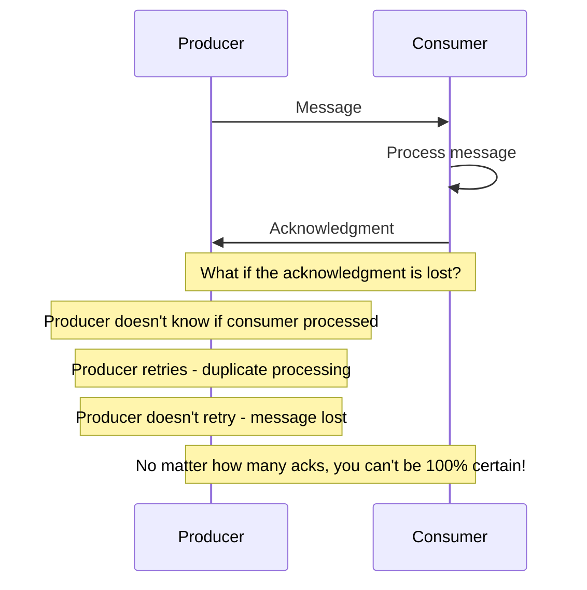

# Exactly-Once Semantics

## 0️⃣ Prerequisites

Before diving into exactly-once semantics, you should understand:

- **Idempotency** (covered in Phase 1, Topic 13 and this Phase, Topic 04): Operations that can be safely retried
- **Distributed Systems** (covered in Phase 1, Topic 01): Systems where multiple computers communicate over unreliable networks
- **Message Queues** (basic understanding): Systems like Kafka, RabbitMQ that deliver messages between services
- **Consistency Models** (covered in Phase 1, Topic 12): How different systems guarantee data consistency

**Quick refresher on message delivery**: When Service A sends a message to Service B through a message queue, there are three possible delivery guarantees:
- **At-most-once**: Message might be lost, but never duplicated
- **At-least-once**: Message might be duplicated, but never lost
- **Exactly-once**: Message is delivered exactly one time

This topic explains why exactly-once is hard, when it's possible, and how to achieve exactly-once semantics in practice.

---

## 1️⃣ What Problem Does This Exist to Solve?

### The Specific Pain Point

Consider a payment processing system:

```
Payment Service ──────> Message Queue ──────> Ledger Service

Payment Service sends: "Credit $100 to account A"

Scenario 1: At-most-once
  - Message is sent once
  - If queue loses it, account A never gets $100
  - Money disappears!

Scenario 2: At-least-once
  - Message is sent, acknowledgment lost
  - Payment Service retries
  - Ledger Service processes twice
  - Account A gets $200 instead of $100!

Scenario 3: Exactly-once (what we want)
  - Message is processed exactly once
  - Account A gets exactly $100
  - No money lost, no money duplicated
```

### Why Exactly-Once is Hard

The fundamental problem is the **Two Generals Problem** (covered in Topic 03):

**Why Exactly-Once Is Impossible**



<details>
<summary>ASCII diagram (reference)</summary>

```text
┌─────────────────────────────────────────────────────────────┐
│              WHY EXACTLY-ONCE IS IMPOSSIBLE                  │
├─────────────────────────────────────────────────────────────┤
│                                                              │
│  Producer                      Consumer                      │
│     │                             │                          │
│     │ ─── Message ───────────────>│                          │
│     │                             │ Process message          │
│     │ <─── Acknowledgment ────────│                          │
│     │                             │                          │
│  What if the acknowledgment is lost?                        │
│                                                              │
│  - Producer doesn't know if consumer processed              │
│  - Producer retries → duplicate processing                  │
│  - Producer doesn't retry → message lost                    │
│                                                              │
│  No matter how many acks, you can't be 100% certain!        │
│                                                              │
└─────────────────────────────────────────────────────────────┘
```
</details>

### The Key Insight: Exactly-Once Semantics vs Delivery

**True exactly-once delivery is impossible** in a distributed system where messages can be lost. But we can achieve **exactly-once semantics**, which means:

```
The EFFECT of the message is applied exactly once,
even if the message is delivered multiple times.
```

This is achieved by combining:
1. **At-least-once delivery** (retry until acknowledged)
2. **Idempotent processing** (duplicates have no effect)

```
At-least-once delivery + Idempotent processing = Exactly-once semantics
```

### What Breaks Without Exactly-Once Semantics

**Without exactly-once:**

- **Financial systems**: Double charges, lost payments
- **Inventory systems**: Incorrect stock counts
- **Analytics**: Inflated or deflated metrics
- **Order systems**: Duplicate orders
- **Notifications**: Spam from repeated messages
- **State machines**: Corrupted state from duplicate transitions

### Real Examples of the Problem

**LinkedIn's Kafka Journey**:
LinkedIn, the creators of Kafka, initially had at-least-once delivery. They discovered that duplicate messages caused significant issues in their data pipelines. Metrics were inflated, and downstream systems had to implement complex deduplication. This led to Kafka's exactly-once semantics feature in version 0.11.

**Uber's Payment Deduplication**:
Uber processes millions of payments daily. Early systems experienced duplicate charges due to at-least-once delivery. They built sophisticated deduplication layers, but this added latency and complexity. Moving to exactly-once semantics simplified their architecture.

**AWS Lambda Invocations**:
AWS Lambda uses at-least-once invocation. A Lambda function might be invoked multiple times for the same event. AWS explicitly recommends making Lambda functions idempotent. Many customers learned this the hard way when they saw duplicate database entries or double-sent emails.

---

## 2️⃣ Intuition and Mental Model

### The Package Delivery Analogy

Imagine you're sending a valuable package:

**At-Most-Once (Standard Mail)**
- You drop the package in the mailbox
- No tracking, no confirmation
- If it's lost, you never know
- Cheap but unreliable

**At-Least-Once (Tracked Delivery with Retry)**
- You send the package with tracking
- If no delivery confirmation in 3 days, you send another
- Recipient might get multiple packages
- Reliable but might duplicate

**Exactly-Once Semantics (Smart Recipient)**
- You send tracked packages with retry
- Each package has a unique ID
- Recipient checks: "Have I opened a package with this ID?"
- If yes, recipient discards the duplicate
- Reliable AND no duplicates

The key is the **recipient's deduplication**, not the delivery mechanism.

### The Three Levels of Exactly-Once

```
┌─────────────────────────────────────────────────────────────┐
│              LEVELS OF EXACTLY-ONCE                          │
├─────────────────────────────────────────────────────────────┤
│                                                              │
│  LEVEL 1: SINGLE PARTITION (Easiest)                        │
│  Producer → Single Partition → Consumer                     │
│  - Kafka idempotent producer                                │
│  - Sequence numbers detect duplicates                       │
│                                                              │
│  LEVEL 2: MULTIPLE PARTITIONS (Harder)                      │
│  Producer → Multiple Partitions → Consumer                  │
│  - Kafka transactions                                       │
│  - All-or-nothing across partitions                         │
│                                                              │
│  LEVEL 3: END-TO-END (Hardest)                              │
│  Producer → Queue → Consumer → External System              │
│  - Requires idempotent consumer                             │
│  - External system must support deduplication               │
│                                                              │
└─────────────────────────────────────────────────────────────┘
```

---

## 3️⃣ How It Works Internally

### At-Most-Once Delivery

The simplest approach: send once, don't retry.

```java
package com.systemdesign.messaging;

/**
 * At-most-once producer: fire and forget.
 * Message might be lost, but never duplicated.
 */
public class AtMostOnceProducer {
    
    private final MessageQueue queue;
    
    public AtMostOnceProducer(MessageQueue queue) {
        this.queue = queue;
    }
    
    /**
     * Send a message without waiting for acknowledgment.
     * If the send fails, the message is lost.
     */
    public void send(String topic, String message) {
        try {
            queue.send(topic, message);
            // Don't wait for ack, don't retry
        } catch (Exception e) {
            // Log and move on, message is lost
            System.err.println("Message lost: " + e.getMessage());
        }
    }
}
```

**When to use:**
- Metrics/logs where occasional loss is acceptable
- Real-time data where old data is worthless
- High-throughput scenarios where reliability isn't critical

### At-Least-Once Delivery

Retry until acknowledged:

```java
package com.systemdesign.messaging;

import java.time.Duration;

/**
 * At-least-once producer: retry until acknowledged.
 * Message might be duplicated, but never lost.
 */
public class AtLeastOnceProducer {
    
    private final MessageQueue queue;
    private final int maxRetries;
    private final Duration retryDelay;
    
    public AtLeastOnceProducer(MessageQueue queue, int maxRetries, Duration retryDelay) {
        this.queue = queue;
        this.maxRetries = maxRetries;
        this.retryDelay = retryDelay;
    }
    
    /**
     * Send a message, retrying until acknowledged.
     * Message might be sent multiple times if ack is lost.
     */
    public void send(String topic, String message) {
        int attempt = 0;
        
        while (attempt < maxRetries) {
            attempt++;
            try {
                // Send and wait for acknowledgment
                queue.sendAndWaitForAck(topic, message, Duration.ofSeconds(5));
                return; // Success!
                
            } catch (TimeoutException e) {
                // Ack not received, retry
                // But message might have been delivered!
                System.out.println("Retry " + attempt + " for message");
                sleep(retryDelay);
                
            } catch (Exception e) {
                // Other error, retry
                System.err.println("Error: " + e.getMessage());
                sleep(retryDelay);
            }
        }
        
        throw new RuntimeException("Failed to send after " + maxRetries + " attempts");
    }
    
    private void sleep(Duration duration) {
        try {
            Thread.sleep(duration.toMillis());
        } catch (InterruptedException e) {
            Thread.currentThread().interrupt();
        }
    }
}
```

**The problem with at-least-once:**

```
Producer                Queue                 Consumer
   │                      │                      │
   │ ── Send msg ────────>│                      │
   │                      │ ── Deliver ─────────>│
   │                      │                      │ Process ✓
   │                      │ <── Ack ─────────────│
   │ <── Ack ─────────────│                      │
   │    (ACK LOST!)       │                      │
   │                      │                      │
   │ (timeout, retry)     │                      │
   │ ── Send msg ────────>│                      │
   │                      │ ── Deliver ─────────>│
   │                      │                      │ Process again!
   │                      │                      │ DUPLICATE!
```

### Exactly-Once Semantics: Idempotent Consumer

The consumer detects and ignores duplicates:

```java
package com.systemdesign.messaging;

import java.util.Set;
import java.util.concurrent.ConcurrentHashMap;

/**
 * Idempotent consumer: processes each message exactly once.
 * Uses message IDs to detect and skip duplicates.
 */
public class IdempotentConsumer {
    
    private final Set<String> processedIds;
    private final MessageProcessor processor;
    private final ProcessedIdStore idStore;
    
    public IdempotentConsumer(MessageProcessor processor, ProcessedIdStore idStore) {
        this.processor = processor;
        this.idStore = idStore;
        this.processedIds = ConcurrentHashMap.newKeySet();
    }
    
    /**
     * Process a message exactly once.
     * If the message ID was already processed, skip it.
     */
    public void consume(Message message) {
        String messageId = message.getId();
        
        // Check if already processed
        if (processedIds.contains(messageId) || idStore.isProcessed(messageId)) {
            System.out.println("Skipping duplicate: " + messageId);
            return;
        }
        
        // Mark as processing (in-memory for speed)
        if (!processedIds.add(messageId)) {
            // Another thread is processing this message
            return;
        }
        
        try {
            // Process the message
            processor.process(message);
            
            // Persist the processed ID
            idStore.markProcessed(messageId);
            
        } catch (Exception e) {
            // Processing failed, allow retry
            processedIds.remove(messageId);
            throw e;
        }
    }
    
    public interface MessageProcessor {
        void process(Message message);
    }
    
    public interface ProcessedIdStore {
        boolean isProcessed(String messageId);
        void markProcessed(String messageId);
    }
    
    public record Message(String id, String topic, byte[] payload) {}
}
```

### Kafka's Exactly-Once Implementation

Kafka provides exactly-once semantics through two mechanisms:

#### 1. Idempotent Producer

```java
package com.systemdesign.messaging.kafka;

import org.apache.kafka.clients.producer.*;
import java.util.Properties;

/**
 * Kafka idempotent producer configuration.
 * Prevents duplicate messages within a single partition.
 */
public class KafkaIdempotentProducer {
    
    public static Producer<String, String> createIdempotentProducer(String bootstrapServers) {
        Properties props = new Properties();
        props.put(ProducerConfig.BOOTSTRAP_SERVERS_CONFIG, bootstrapServers);
        props.put(ProducerConfig.KEY_SERIALIZER_CLASS_CONFIG, 
            "org.apache.kafka.common.serialization.StringSerializer");
        props.put(ProducerConfig.VALUE_SERIALIZER_CLASS_CONFIG, 
            "org.apache.kafka.common.serialization.StringSerializer");
        
        // Enable idempotence
        props.put(ProducerConfig.ENABLE_IDEMPOTENCE_CONFIG, true);
        
        // These are automatically set with idempotence, but shown for clarity:
        // props.put(ProducerConfig.ACKS_CONFIG, "all");
        // props.put(ProducerConfig.RETRIES_CONFIG, Integer.MAX_VALUE);
        // props.put(ProducerConfig.MAX_IN_FLIGHT_REQUESTS_PER_CONNECTION, 5);
        
        return new KafkaProducer<>(props);
    }
}
```

**How Kafka idempotence works:**

```
┌─────────────────────────────────────────────────────────────┐
│              KAFKA IDEMPOTENT PRODUCER                       │
├─────────────────────────────────────────────────────────────┤
│                                                              │
│  Producer                           Broker                   │
│     │                                  │                     │
│     │ Producer ID: 123                 │                     │
│     │ Sequence: 0                      │                     │
│     │ ─── Message (seq=0) ────────────>│ Store seq=0         │
│     │ <── Ack ─────────────────────────│                     │
│     │                                  │                     │
│     │ Sequence: 1                      │                     │
│     │ ─── Message (seq=1) ────────────>│ Store seq=1         │
│     │    (Ack lost!)                   │                     │
│     │                                  │                     │
│     │ (Retry)                          │                     │
│     │ ─── Message (seq=1) ────────────>│ seq=1 already!      │
│     │ <── Ack (deduplicated) ──────────│ Return ack, no dup  │
│     │                                  │                     │
│  Broker tracks: (ProducerID, Sequence) per partition        │
│  Duplicate sequences are rejected/acknowledged              │
│                                                              │
└─────────────────────────────────────────────────────────────┘
```

#### 2. Kafka Transactions

For exactly-once across multiple partitions:

```java
package com.systemdesign.messaging.kafka;

import org.apache.kafka.clients.consumer.*;
import org.apache.kafka.clients.producer.*;
import org.apache.kafka.common.TopicPartition;

import java.time.Duration;
import java.util.*;

/**
 * Kafka exactly-once processing using transactions.
 * Reads from input topic, processes, writes to output topic atomically.
 */
public class KafkaExactlyOnceProcessor {
    
    private final KafkaConsumer<String, String> consumer;
    private final KafkaProducer<String, String> producer;
    private final String inputTopic;
    private final String outputTopic;
    private final MessageTransformer transformer;
    
    public KafkaExactlyOnceProcessor(String bootstrapServers, 
                                      String groupId,
                                      String inputTopic, 
                                      String outputTopic,
                                      MessageTransformer transformer) {
        this.inputTopic = inputTopic;
        this.outputTopic = outputTopic;
        this.transformer = transformer;
        
        // Consumer configuration
        Properties consumerProps = new Properties();
        consumerProps.put(ConsumerConfig.BOOTSTRAP_SERVERS_CONFIG, bootstrapServers);
        consumerProps.put(ConsumerConfig.GROUP_ID_CONFIG, groupId);
        consumerProps.put(ConsumerConfig.ENABLE_AUTO_COMMIT_CONFIG, false); // Manual commit
        consumerProps.put(ConsumerConfig.ISOLATION_LEVEL_CONFIG, "read_committed"); // Only read committed
        consumerProps.put(ConsumerConfig.KEY_DESERIALIZER_CLASS_CONFIG, 
            "org.apache.kafka.common.serialization.StringDeserializer");
        consumerProps.put(ConsumerConfig.VALUE_DESERIALIZER_CLASS_CONFIG, 
            "org.apache.kafka.common.serialization.StringDeserializer");
        
        this.consumer = new KafkaConsumer<>(consumerProps);
        
        // Producer configuration
        Properties producerProps = new Properties();
        producerProps.put(ProducerConfig.BOOTSTRAP_SERVERS_CONFIG, bootstrapServers);
        producerProps.put(ProducerConfig.ENABLE_IDEMPOTENCE_CONFIG, true);
        producerProps.put(ProducerConfig.TRANSACTIONAL_ID_CONFIG, "processor-" + groupId);
        producerProps.put(ProducerConfig.KEY_SERIALIZER_CLASS_CONFIG, 
            "org.apache.kafka.common.serialization.StringSerializer");
        producerProps.put(ProducerConfig.VALUE_SERIALIZER_CLASS_CONFIG, 
            "org.apache.kafka.common.serialization.StringSerializer");
        
        this.producer = new KafkaProducer<>(producerProps);
        
        // Initialize transactions
        producer.initTransactions();
    }
    
    /**
     * Process messages with exactly-once semantics.
     * Each batch is processed atomically: read, transform, write, commit.
     */
    public void processLoop() {
        consumer.subscribe(Collections.singletonList(inputTopic));
        
        while (true) {
            ConsumerRecords<String, String> records = consumer.poll(Duration.ofMillis(100));
            
            if (records.isEmpty()) {
                continue;
            }
            
            // Begin transaction
            producer.beginTransaction();
            
            try {
                // Process each record
                for (ConsumerRecord<String, String> record : records) {
                    String transformed = transformer.transform(record.value());
                    
                    // Send to output topic (within transaction)
                    producer.send(new ProducerRecord<>(outputTopic, record.key(), transformed));
                }
                
                // Commit consumer offsets within the transaction
                Map<TopicPartition, OffsetAndMetadata> offsets = getOffsetsToCommit(records);
                producer.sendOffsetsToTransaction(offsets, consumer.groupMetadata());
                
                // Commit transaction (atomic: output messages + offset commit)
                producer.commitTransaction();
                
            } catch (Exception e) {
                // Abort transaction (nothing is committed)
                producer.abortTransaction();
                System.err.println("Transaction aborted: " + e.getMessage());
            }
        }
    }
    
    private Map<TopicPartition, OffsetAndMetadata> getOffsetsToCommit(
            ConsumerRecords<String, String> records) {
        Map<TopicPartition, OffsetAndMetadata> offsets = new HashMap<>();
        
        for (TopicPartition partition : records.partitions()) {
            List<ConsumerRecord<String, String>> partitionRecords = records.records(partition);
            long lastOffset = partitionRecords.get(partitionRecords.size() - 1).offset();
            offsets.put(partition, new OffsetAndMetadata(lastOffset + 1));
        }
        
        return offsets;
    }
    
    @FunctionalInterface
    public interface MessageTransformer {
        String transform(String input);
    }
}
```

**How Kafka transactions work:**

```
┌─────────────────────────────────────────────────────────────┐
│              KAFKA TRANSACTION FLOW                          │
├─────────────────────────────────────────────────────────────┤
│                                                              │
│  1. BEGIN TRANSACTION                                       │
│     Producer registers with transaction coordinator         │
│                                                              │
│  2. PRODUCE MESSAGES                                        │
│     Messages are written to partitions                      │
│     Marked as "uncommitted"                                 │
│                                                              │
│  3. SEND OFFSETS                                            │
│     Consumer offsets included in transaction                │
│                                                              │
│  4. COMMIT TRANSACTION                                      │
│     Coordinator writes commit marker                        │
│     All messages become "committed"                         │
│     Offsets are committed                                   │
│                                                              │
│  IF FAILURE AT ANY STEP:                                    │
│     Abort transaction                                       │
│     Messages are discarded                                  │
│     Offsets are not committed                               │
│     Consumer re-reads same messages                         │
│                                                              │
│  Consumers with "read_committed" only see committed msgs    │
│                                                              │
└─────────────────────────────────────────────────────────────┘
```

### End-to-End Exactly-Once

For exactly-once from source to external system:

```java
package com.systemdesign.messaging;

import java.sql.Connection;
import java.sql.PreparedStatement;
import java.sql.SQLException;

/**
 * End-to-end exactly-once processing with database.
 * Uses transactional outbox pattern for atomicity.
 */
public class EndToEndExactlyOnce {
    
    private final Connection dbConnection;
    private final MessageQueue inputQueue;
    
    public EndToEndExactlyOnce(Connection dbConnection, MessageQueue inputQueue) {
        this.dbConnection = dbConnection;
        this.inputQueue = inputQueue;
    }
    
    /**
     * Process a message with exactly-once semantics.
     * Uses database transaction to ensure atomicity.
     */
    public void processMessage(Message message) throws SQLException {
        String messageId = message.getId();
        
        dbConnection.setAutoCommit(false);
        
        try {
            // Step 1: Check if already processed (idempotency)
            if (isAlreadyProcessed(messageId)) {
                System.out.println("Message already processed: " + messageId);
                dbConnection.rollback();
                return;
            }
            
            // Step 2: Process the message (update business state)
            processBusinessLogic(message);
            
            // Step 3: Mark as processed (in same transaction)
            markAsProcessed(messageId);
            
            // Step 4: Commit everything atomically
            dbConnection.commit();
            
            // Step 5: Acknowledge to queue (after commit!)
            inputQueue.acknowledge(message);
            
        } catch (Exception e) {
            dbConnection.rollback();
            throw e;
        } finally {
            dbConnection.setAutoCommit(true);
        }
    }
    
    private boolean isAlreadyProcessed(String messageId) throws SQLException {
        String sql = "SELECT 1 FROM processed_messages WHERE message_id = ?";
        try (PreparedStatement stmt = dbConnection.prepareStatement(sql)) {
            stmt.setString(1, messageId);
            return stmt.executeQuery().next();
        }
    }
    
    private void processBusinessLogic(Message message) throws SQLException {
        // Example: Update account balance
        String sql = "UPDATE accounts SET balance = balance + ? WHERE account_id = ?";
        try (PreparedStatement stmt = dbConnection.prepareStatement(sql)) {
            PaymentMessage payment = parsePayment(message);
            stmt.setBigDecimal(1, payment.amount());
            stmt.setString(2, payment.accountId());
            stmt.executeUpdate();
        }
    }
    
    private void markAsProcessed(String messageId) throws SQLException {
        String sql = "INSERT INTO processed_messages (message_id, processed_at) VALUES (?, NOW())";
        try (PreparedStatement stmt = dbConnection.prepareStatement(sql)) {
            stmt.setString(1, messageId);
            stmt.executeUpdate();
        }
    }
    
    private PaymentMessage parsePayment(Message message) {
        // Parse message payload
        return new PaymentMessage("account-123", new java.math.BigDecimal("100.00"));
    }
    
    public record Message(String id, byte[] payload) {}
    public record PaymentMessage(String accountId, java.math.BigDecimal amount) {}
    
    public interface MessageQueue {
        void acknowledge(Message message);
    }
}
```

**The Transactional Outbox Pattern:**

```
┌─────────────────────────────────────────────────────────────┐
│              TRANSACTIONAL OUTBOX PATTERN                    │
├─────────────────────────────────────────────────────────────┤
│                                                              │
│  PROBLEM:                                                   │
│  How to update database AND send message atomically?        │
│                                                              │
│  BAD APPROACH:                                              │
│  1. Update database                                         │
│  2. Send message                                            │
│  → If step 2 fails, database is updated but no message      │
│                                                              │
│  SOLUTION: Outbox table                                     │
│                                                              │
│  Database Transaction:                                      │
│  ┌────────────────────────────────────────────────────┐    │
│  │ 1. Update business table (e.g., orders)           │    │
│  │ 2. Insert into outbox table (message to send)     │    │
│  │ 3. COMMIT                                         │    │
│  └────────────────────────────────────────────────────┘    │
│                                                              │
│  Separate Process (Outbox Relay):                           │
│  ┌────────────────────────────────────────────────────┐    │
│  │ 1. Read from outbox table                         │    │
│  │ 2. Send to message queue                          │    │
│  │ 3. Mark as sent in outbox (or delete)             │    │
│  └────────────────────────────────────────────────────┘    │
│                                                              │
│  If relay fails, it retries (at-least-once)                 │
│  Consumer must be idempotent                                │
│                                                              │
└─────────────────────────────────────────────────────────────┘
```

```java
package com.systemdesign.messaging;

import java.sql.*;
import java.util.*;
import java.util.concurrent.*;

/**
 * Outbox pattern implementation for exactly-once messaging.
 */
public class OutboxPattern {
    
    private final Connection dbConnection;
    private final MessageQueue outputQueue;
    private final ScheduledExecutorService scheduler;
    
    public OutboxPattern(Connection dbConnection, MessageQueue outputQueue) {
        this.dbConnection = dbConnection;
        this.outputQueue = outputQueue;
        this.scheduler = Executors.newSingleThreadScheduledExecutor();
    }
    
    /**
     * Execute business logic and queue a message atomically.
     */
    public void executeWithOutbox(BusinessOperation operation, OutboxMessage message) 
            throws SQLException {
        dbConnection.setAutoCommit(false);
        
        try {
            // Execute business logic
            operation.execute(dbConnection);
            
            // Insert message into outbox (same transaction)
            insertIntoOutbox(message);
            
            // Commit both atomically
            dbConnection.commit();
            
        } catch (Exception e) {
            dbConnection.rollback();
            throw e;
        } finally {
            dbConnection.setAutoCommit(true);
        }
    }
    
    private void insertIntoOutbox(OutboxMessage message) throws SQLException {
        String sql = """
            INSERT INTO outbox (id, topic, payload, created_at, status)
            VALUES (?, ?, ?, NOW(), 'PENDING')
            """;
        try (PreparedStatement stmt = dbConnection.prepareStatement(sql)) {
            stmt.setString(1, message.id());
            stmt.setString(2, message.topic());
            stmt.setString(3, message.payload());
            stmt.executeUpdate();
        }
    }
    
    /**
     * Start the outbox relay process.
     * Reads pending messages and sends them to the queue.
     */
    public void startRelay() {
        scheduler.scheduleAtFixedRate(this::relayMessages, 0, 100, TimeUnit.MILLISECONDS);
    }
    
    private void relayMessages() {
        try {
            List<OutboxMessage> pending = getPendingMessages(100);
            
            for (OutboxMessage message : pending) {
                try {
                    // Send to queue
                    outputQueue.send(message.topic(), message.id(), message.payload());
                    
                    // Mark as sent
                    markAsSent(message.id());
                    
                } catch (Exception e) {
                    // Will retry on next iteration
                    System.err.println("Failed to relay message " + message.id() + ": " + e.getMessage());
                }
            }
        } catch (Exception e) {
            System.err.println("Relay error: " + e.getMessage());
        }
    }
    
    private List<OutboxMessage> getPendingMessages(int limit) throws SQLException {
        String sql = """
            SELECT id, topic, payload FROM outbox 
            WHERE status = 'PENDING' 
            ORDER BY created_at 
            LIMIT ?
            FOR UPDATE SKIP LOCKED
            """;
        
        List<OutboxMessage> messages = new ArrayList<>();
        try (PreparedStatement stmt = dbConnection.prepareStatement(sql)) {
            stmt.setInt(1, limit);
            ResultSet rs = stmt.executeQuery();
            while (rs.next()) {
                messages.add(new OutboxMessage(
                    rs.getString("id"),
                    rs.getString("topic"),
                    rs.getString("payload")
                ));
            }
        }
        return messages;
    }
    
    private void markAsSent(String messageId) throws SQLException {
        String sql = "UPDATE outbox SET status = 'SENT', sent_at = NOW() WHERE id = ?";
        try (PreparedStatement stmt = dbConnection.prepareStatement(sql)) {
            stmt.setString(1, messageId);
            stmt.executeUpdate();
        }
    }
    
    public record OutboxMessage(String id, String topic, String payload) {}
    
    @FunctionalInterface
    public interface BusinessOperation {
        void execute(Connection connection) throws SQLException;
    }
    
    public interface MessageQueue {
        void send(String topic, String key, String payload);
    }
}
```

---

## 4️⃣ Simulation-First Explanation

Let's trace through exactly-once processing in detail.

### Scenario: Payment Processing with Kafka

**Setup:**
- Payment requests come from an API
- Processed through Kafka
- Results stored in database

### Normal Flow

```
Time 0ms: API receives payment request
  - Generate message ID: "pay-123"
  - Send to Kafka topic "payments"

Time 5ms: Kafka producer
  - Producer ID: 1, Sequence: 42
  - Send to partition 0
  - Broker stores message with (PID=1, seq=42)
  - Ack sent to producer

Time 10ms: Consumer receives message
  - Read message "pay-123"
  - Check processed_messages table: not found
  - Begin database transaction

Time 15ms: Process payment
  - UPDATE accounts SET balance = balance + 100 WHERE id = 'A'
  - INSERT INTO processed_messages (message_id) VALUES ('pay-123')
  - COMMIT transaction

Time 20ms: Acknowledge to Kafka
  - Commit offset
  - Done!
```

### Failure Scenario 1: Producer Retry

```
Time 0ms: Producer sends message
  - Producer ID: 1, Sequence: 42
  - Network timeout, no ack received

Time 5000ms: Producer retries (same sequence)
  - Producer ID: 1, Sequence: 42
  - Broker checks: (PID=1, seq=42) already stored!
  - Broker returns ack, no duplicate stored

Result: Message stored exactly once in Kafka
```

### Failure Scenario 2: Consumer Crash

```
Time 10ms: Consumer receives message "pay-123"
  - Begin processing

Time 15ms: Consumer crashes!
  - Database transaction not committed
  - Offset not committed

Time 20ms: Consumer restarts
  - Reads from last committed offset
  - Receives message "pay-123" again

Time 25ms: Consumer processes
  - Check processed_messages: not found (tx was rolled back)
  - Process normally
  - Commit transaction
  - Commit offset

Result: Message processed exactly once
```

### Failure Scenario 3: Database Commit, Offset Fail

```
Time 15ms: Database transaction committed
  - processed_messages contains "pay-123"

Time 16ms: Consumer crashes before offset commit!

Time 20ms: Consumer restarts
  - Reads from last committed offset
  - Receives message "pay-123" again

Time 25ms: Consumer processes
  - Check processed_messages: FOUND!
  - Skip processing (already done)
  - Commit offset

Result: Message processed exactly once (idempotency saved us)
```

---

## 5️⃣ How Engineers Actually Use This in Production

### At Major Companies

**LinkedIn (Kafka)**:
- Invented Kafka with at-least-once
- Added exactly-once in Kafka 0.11
- Uses for metrics, activity tracking, data pipelines
- Billions of messages per day

**Uber**:
- Uses Kafka for event streaming
- Idempotent consumers for payment processing
- Deduplication at multiple levels
- Custom exactly-once for external systems

**Netflix**:
- Uses Kafka for data pipelines
- Exactly-once for billing and analytics
- Idempotent consumers for recommendations

### Production Configuration

**Kafka Producer (Exactly-Once):**

```properties
# Enable idempotence
enable.idempotence=true

# For transactions
transactional.id=my-app-instance-1

# Automatic with idempotence
acks=all
retries=2147483647
max.in.flight.requests.per.connection=5
```

**Kafka Consumer (Read Committed):**

```properties
# Only read committed messages
isolation.level=read_committed

# Manual offset management
enable.auto.commit=false

# Consumer group
group.id=my-consumer-group
```

### Production Checklist

```
┌─────────────────────────────────────────────────────────────┐
│           EXACTLY-ONCE PRODUCTION CHECKLIST                  │
├─────────────────────────────────────────────────────────────┤
│                                                              │
│  PRODUCER                                                   │
│  □ Enable idempotence (enable.idempotence=true)             │
│  □ Set transactional.id for transactions                    │
│  □ Use unique transactional.id per instance                 │
│  □ Handle ProducerFencedException                           │
│                                                              │
│  CONSUMER                                                   │
│  □ Set isolation.level=read_committed                       │
│  □ Disable auto-commit                                      │
│  □ Commit offsets in transaction (if using transactions)    │
│  □ Implement idempotent processing                          │
│                                                              │
│  END-TO-END                                                 │
│  □ Store message ID with business data                      │
│  □ Check for duplicates before processing                   │
│  □ Use database transactions                                │
│  □ Acknowledge after commit                                 │
│                                                              │
│  MONITORING                                                 │
│  □ Track duplicate detection rate                           │
│  □ Monitor transaction abort rate                           │
│  □ Alert on high retry rate                                 │
│                                                              │
└─────────────────────────────────────────────────────────────┘
```

---

## 6️⃣ How to Implement or Apply It

### Complete Spring Boot Implementation

#### Maven Dependencies

```xml
<dependencies>
    <dependency>
        <groupId>org.springframework.boot</groupId>
        <artifactId>spring-boot-starter</artifactId>
    </dependency>
    <dependency>
        <groupId>org.springframework.kafka</groupId>
        <artifactId>spring-kafka</artifactId>
    </dependency>
    <dependency>
        <groupId>org.springframework.boot</groupId>
        <artifactId>spring-boot-starter-data-jpa</artifactId>
    </dependency>
</dependencies>
```

#### Kafka Configuration

```java
package com.systemdesign.messaging.config;

import org.apache.kafka.clients.consumer.ConsumerConfig;
import org.apache.kafka.clients.producer.ProducerConfig;
import org.springframework.context.annotation.Bean;
import org.springframework.context.annotation.Configuration;
import org.springframework.kafka.config.ConcurrentKafkaListenerContainerFactory;
import org.springframework.kafka.core.*;
import org.springframework.kafka.transaction.KafkaTransactionManager;

import java.util.HashMap;
import java.util.Map;

@Configuration
public class KafkaExactlyOnceConfig {
    
    @Bean
    public ProducerFactory<String, String> producerFactory() {
        Map<String, Object> config = new HashMap<>();
        config.put(ProducerConfig.BOOTSTRAP_SERVERS_CONFIG, "localhost:9092");
        config.put(ProducerConfig.KEY_SERIALIZER_CLASS_CONFIG, 
            "org.apache.kafka.common.serialization.StringSerializer");
        config.put(ProducerConfig.VALUE_SERIALIZER_CLASS_CONFIG, 
            "org.apache.kafka.common.serialization.StringSerializer");
        
        // Enable exactly-once
        config.put(ProducerConfig.ENABLE_IDEMPOTENCE_CONFIG, true);
        config.put(ProducerConfig.TRANSACTIONAL_ID_CONFIG, "tx-");
        
        DefaultKafkaProducerFactory<String, String> factory = 
            new DefaultKafkaProducerFactory<>(config);
        factory.setTransactionIdPrefix("tx-");
        
        return factory;
    }
    
    @Bean
    public KafkaTemplate<String, String> kafkaTemplate() {
        return new KafkaTemplate<>(producerFactory());
    }
    
    @Bean
    public KafkaTransactionManager<String, String> kafkaTransactionManager() {
        return new KafkaTransactionManager<>(producerFactory());
    }
    
    @Bean
    public ConsumerFactory<String, String> consumerFactory() {
        Map<String, Object> config = new HashMap<>();
        config.put(ConsumerConfig.BOOTSTRAP_SERVERS_CONFIG, "localhost:9092");
        config.put(ConsumerConfig.KEY_DESERIALIZER_CLASS_CONFIG, 
            "org.apache.kafka.common.serialization.StringDeserializer");
        config.put(ConsumerConfig.VALUE_DESERIALIZER_CLASS_CONFIG, 
            "org.apache.kafka.common.serialization.StringDeserializer");
        
        // Read only committed messages
        config.put(ConsumerConfig.ISOLATION_LEVEL_CONFIG, "read_committed");
        config.put(ConsumerConfig.ENABLE_AUTO_COMMIT_CONFIG, false);
        
        return new DefaultKafkaConsumerFactory<>(config);
    }
    
    @Bean
    public ConcurrentKafkaListenerContainerFactory<String, String> kafkaListenerContainerFactory() {
        ConcurrentKafkaListenerContainerFactory<String, String> factory = 
            new ConcurrentKafkaListenerContainerFactory<>();
        factory.setConsumerFactory(consumerFactory());
        factory.getContainerProperties().setTransactionManager(kafkaTransactionManager());
        return factory;
    }
}
```

#### Idempotent Consumer Service

```java
package com.systemdesign.messaging.service;

import org.springframework.kafka.annotation.KafkaListener;
import org.springframework.stereotype.Service;
import org.springframework.transaction.annotation.Transactional;

import jakarta.persistence.*;

@Service
public class PaymentConsumerService {
    
    private final PaymentRepository paymentRepository;
    private final ProcessedMessageRepository processedMessageRepository;
    
    public PaymentConsumerService(PaymentRepository paymentRepository,
                                   ProcessedMessageRepository processedMessageRepository) {
        this.paymentRepository = paymentRepository;
        this.processedMessageRepository = processedMessageRepository;
    }
    
    /**
     * Process payment messages with exactly-once semantics.
     * Uses database transaction for atomicity.
     */
    @KafkaListener(topics = "payments", groupId = "payment-processor")
    @Transactional
    public void processPayment(String messageId, PaymentMessage message) {
        // Check if already processed (idempotency)
        if (processedMessageRepository.existsById(messageId)) {
            System.out.println("Skipping duplicate message: " + messageId);
            return;
        }
        
        // Process the payment
        Payment payment = new Payment();
        payment.setId(message.paymentId());
        payment.setAccountId(message.accountId());
        payment.setAmount(message.amount());
        payment.setStatus("COMPLETED");
        
        paymentRepository.save(payment);
        
        // Mark as processed (in same transaction)
        ProcessedMessage processed = new ProcessedMessage();
        processed.setMessageId(messageId);
        processedMessageRepository.save(processed);
        
        System.out.println("Processed payment: " + message.paymentId());
    }
    
    public record PaymentMessage(String paymentId, String accountId, double amount) {}
}

// JPA Entities

@Entity
@Table(name = "payments")
class Payment {
    @Id
    private String id;
    private String accountId;
    private double amount;
    private String status;
    
    // Getters and setters
    public String getId() { return id; }
    public void setId(String id) { this.id = id; }
    public String getAccountId() { return accountId; }
    public void setAccountId(String accountId) { this.accountId = accountId; }
    public double getAmount() { return amount; }
    public void setAmount(double amount) { this.amount = amount; }
    public String getStatus() { return status; }
    public void setStatus(String status) { this.status = status; }
}

@Entity
@Table(name = "processed_messages")
class ProcessedMessage {
    @Id
    private String messageId;
    
    public String getMessageId() { return messageId; }
    public void setMessageId(String messageId) { this.messageId = messageId; }
}

interface PaymentRepository extends org.springframework.data.jpa.repository.JpaRepository<Payment, String> {}
interface ProcessedMessageRepository extends org.springframework.data.jpa.repository.JpaRepository<ProcessedMessage, String> {}
```

---

## 7️⃣ Tradeoffs, Pitfalls, and Common Mistakes

### Common Mistakes

#### 1. Relying Only on Kafka Exactly-Once

**Wrong:**
```java
// BAD: Assumes Kafka exactly-once covers everything
@KafkaListener(topics = "payments")
public void process(PaymentMessage message) {
    // No idempotency check!
    paymentService.processPayment(message);
    // External API call might be duplicated!
    externalApi.notifyPayment(message);
}
```

**Right:**
```java
// GOOD: Idempotent processing for external calls
@KafkaListener(topics = "payments")
@Transactional
public void process(String messageId, PaymentMessage message) {
    if (processedRepository.existsById(messageId)) {
        return; // Already processed
    }
    
    paymentService.processPayment(message);
    externalApi.notifyPayment(message, messageId); // Pass ID for external idempotency
    
    processedRepository.save(new ProcessedMessage(messageId));
}
```

#### 2. Acknowledging Before Processing

**Wrong:**
```java
// BAD: Ack before processing
@KafkaListener(topics = "payments", ackMode = "RECORD")
public void process(PaymentMessage message, Acknowledgment ack) {
    ack.acknowledge(); // Acknowledged!
    paymentService.processPayment(message); // Might fail!
    // If processing fails, message is lost!
}
```

**Right:**
```java
// GOOD: Ack after processing
@KafkaListener(topics = "payments", ackMode = "MANUAL")
public void process(PaymentMessage message, Acknowledgment ack) {
    paymentService.processPayment(message); // Process first
    ack.acknowledge(); // Then acknowledge
}
```

#### 3. Not Handling Transaction Rollback

**Wrong:**
```java
// BAD: No rollback handling
@Transactional
public void process(PaymentMessage message) {
    paymentRepository.save(payment);
    processedRepository.save(processed);
    externalService.call(message); // If this fails, DB is rolled back
    // But external service might have been called!
}
```

**Right:**
```java
// GOOD: Separate external calls from transaction
@Transactional
public void process(PaymentMessage message) {
    paymentRepository.save(payment);
    processedRepository.save(processed);
    outboxRepository.save(new OutboxMessage(message)); // Queue for later
}

// Separate process sends to external service
```

### Performance Considerations

```
┌─────────────────────────────────────────────────────────────┐
│         EXACTLY-ONCE PERFORMANCE IMPACT                      │
├─────────────────────────────────────────────────────────────┤
│                                                              │
│  Kafka Transactions:                                        │
│  - ~3-5ms overhead per transaction                          │
│  - Batch messages to amortize cost                          │
│  - Transaction timeout: default 60s                         │
│                                                              │
│  Idempotent Producer:                                       │
│  - Minimal overhead (~1ms)                                  │
│  - Broker stores (PID, sequence) per partition              │
│  - Memory: ~10KB per producer per partition                 │
│                                                              │
│  Consumer Deduplication:                                    │
│  - Database lookup per message                              │
│  - Index on message_id critical                             │
│  - Consider in-memory cache for recent IDs                  │
│                                                              │
│  Throughput Impact:                                         │
│  - At-least-once: ~100K msgs/sec                            │
│  - Exactly-once (transactions): ~50K msgs/sec               │
│  - Exactly-once (idempotent only): ~90K msgs/sec            │
│                                                              │
└─────────────────────────────────────────────────────────────┘
```

---

## 8️⃣ When NOT to Use This

### When At-Most-Once is Fine

1. **Metrics and logs**: Occasional loss is acceptable
2. **Real-time dashboards**: Stale data is okay
3. **Cache updates**: Can be re-computed

### When At-Least-Once is Fine

1. **Naturally idempotent operations**: SET x = 5
2. **Operations with external idempotency**: Payment APIs with idempotency keys
3. **Event sourcing**: Events are deduplicated by sequence

### When Exactly-Once is Overkill

1. **High-throughput, low-value data**: Clickstream, page views
2. **Derived data**: Can be recomputed from source
3. **Non-critical notifications**: Marketing emails

---

## 9️⃣ Comparison with Alternatives

### Delivery Guarantee Comparison

| Aspect | At-Most-Once | At-Least-Once | Exactly-Once |
|--------|--------------|---------------|--------------|
| Message loss | Possible | No | No |
| Duplicates | No | Possible | No |
| Latency | Lowest | Low | Higher |
| Throughput | Highest | High | Lower |
| Complexity | Lowest | Low | Highest |
| Use case | Logs, metrics | Most apps | Financial |

### Technology Support

| Technology | At-Most-Once | At-Least-Once | Exactly-Once |
|------------|--------------|---------------|--------------|
| Kafka | Yes | Yes | Yes (0.11+) |
| RabbitMQ | Yes | Yes | With plugins |
| AWS SQS | Yes | Yes | FIFO queues |
| AWS Kinesis | Yes | Yes | With dedup |
| Pulsar | Yes | Yes | Yes |

---

## 🔟 Interview Follow-Up Questions WITH Answers

### L4 (Entry-Level) Questions

**Q1: What's the difference between exactly-once delivery and exactly-once semantics?**

**Answer:**
**Exactly-once delivery** means a message is physically delivered exactly one time. This is impossible in distributed systems because acknowledgments can be lost.

**Exactly-once semantics** means the effect of a message is applied exactly once, even if the message is delivered multiple times. This is achievable through:
1. At-least-once delivery (retry until ack)
2. Idempotent processing (duplicates have no effect)

Example: A payment message might be delivered twice, but the account is only credited once because the consumer checks if the payment ID was already processed.

**Q2: Why is true exactly-once delivery impossible?**

**Answer:**
Because of the acknowledgment problem:

1. Producer sends message to broker
2. Broker stores message
3. Broker sends acknowledgment
4. Acknowledgment is lost!

Now the producer doesn't know if the message was stored. If it retries, the message is duplicated. If it doesn't retry, the message might be lost.

No matter how many acknowledgments you add, there's always a final acknowledgment that could be lost. This is the Two Generals Problem.

### L5 (Senior) Questions

**Q3: How does Kafka achieve exactly-once semantics?**

**Answer:**
Kafka uses two mechanisms:

**1. Idempotent Producer:**
- Each producer gets a unique Producer ID (PID)
- Each message has a sequence number
- Broker stores (PID, sequence) per partition
- Duplicate sequences are rejected
- Prevents duplicates within a single partition

**2. Transactions:**
- Producer begins transaction
- Sends messages to multiple partitions
- Sends consumer offsets
- Commits or aborts atomically
- Consumers with `read_committed` only see committed messages

The combination ensures:
- No duplicates in Kafka (idempotent producer)
- Atomic writes across partitions (transactions)
- Consumer doesn't re-process (offset in transaction)

**Q4: How would you implement exactly-once for a service that calls an external API?**

**Answer:**
External APIs are outside Kafka's transaction boundary. Approach:

1. **If API supports idempotency:**
```java
@Transactional
public void process(String messageId, Message message) {
    if (isProcessed(messageId)) return;
    
    // Call external API with idempotency key
    externalApi.call(message, messageId);
    
    markProcessed(messageId);
}
```

2. **If API doesn't support idempotency:**
Use the outbox pattern:
```java
@Transactional
public void process(String messageId, Message message) {
    if (isProcessed(messageId)) return;
    
    // Don't call API directly
    // Store in outbox for later
    outbox.save(new OutboxMessage(messageId, message));
    
    markProcessed(messageId);
}

// Separate relay process
public void relay() {
    for (OutboxMessage msg : outbox.getPending()) {
        if (externalApi.call(msg)) {
            outbox.markSent(msg);
        }
    }
}
```

The relay might call the API multiple times, but that's okay if the business can handle it (or if you track sent IDs separately).

### L6 (Staff) Questions

**Q5: Design an exactly-once payment processing system.**

**Answer:**
Architecture:

```
┌─────────────────────────────────────────────────────────────┐
│                   EXACTLY-ONCE PAYMENTS                      │
├─────────────────────────────────────────────────────────────┤
│                                                              │
│  API Gateway                                                │
│     │                                                       │
│     │ Idempotency key in header                             │
│     ▼                                                       │
│  Payment Service                                            │
│     │                                                       │
│     │ 1. Check idempotency store (Redis)                    │
│     │ 2. If exists, return cached response                  │
│     │ 3. If new, acquire lock                               │
│     │                                                       │
│     ▼                                                       │
│  Kafka (exactly-once producer)                              │
│     │                                                       │
│     │ Transaction: message + idempotency record             │
│     ▼                                                       │
│  Ledger Service (exactly-once consumer)                     │
│     │                                                       │
│     │ 1. Check processed_messages table                     │
│     │ 2. In transaction: update balance + mark processed    │
│     │                                                       │
│     ▼                                                       │
│  Notification Service                                       │
│     │                                                       │
│     │ Outbox pattern for external notifications             │
│                                                              │
└─────────────────────────────────────────────────────────────┘
```

Key components:

1. **API Layer**: Idempotency key prevents duplicate requests
2. **Kafka Producer**: Idempotent + transactional
3. **Kafka Consumer**: read_committed + database deduplication
4. **External Calls**: Outbox pattern

Failure handling:
- API timeout: Client retries with same idempotency key
- Kafka failure: Transaction aborts, client retries
- Consumer failure: Reprocesses from last committed offset, dedup prevents duplicate
- External API failure: Outbox relay retries

**Q6: What are the tradeoffs of exactly-once vs at-least-once with idempotent consumers?**

**Answer:**

| Aspect | Kafka Exactly-Once | At-Least-Once + Idempotent |
|--------|-------------------|---------------------------|
| Throughput | ~50% of at-least-once | Full throughput |
| Latency | Higher (transaction overhead) | Lower |
| Complexity | Kafka handles it | Application handles it |
| Scope | Within Kafka | End-to-end |
| External calls | Still need idempotency | Same |

**When to use Kafka exactly-once:**
- Stream processing (read-process-write within Kafka)
- When you need atomic multi-partition writes
- When consumer offset must be atomic with output

**When to use at-least-once + idempotent:**
- Higher throughput requirements
- External system calls (need idempotency anyway)
- Simpler debugging (can see duplicates in logs)

In practice, most production systems use both:
- Kafka exactly-once for stream processing
- Idempotent consumers for database writes
- Idempotency keys for external APIs

---

## 1️⃣1️⃣ One Clean Mental Summary

Exactly-once semantics means the effect of a message is applied exactly once, even if the message is delivered multiple times. True exactly-once delivery is impossible because acknowledgments can be lost. Instead, we achieve exactly-once semantics by combining at-least-once delivery (retry until acknowledged) with idempotent processing (duplicates have no effect). Kafka provides exactly-once through idempotent producers (sequence numbers prevent duplicates) and transactions (atomic writes across partitions). For end-to-end exactly-once, consumers must also be idempotent, typically by storing processed message IDs in the same database transaction as the business logic. External API calls require the outbox pattern or API-level idempotency keys. The key insight is that exactly-once is not about preventing duplicate delivery; it's about ensuring duplicate delivery has no additional effect.

---

## Quick Reference Card

```
┌─────────────────────────────────────────────────────────────┐
│            EXACTLY-ONCE SEMANTICS CHEAT SHEET                │
├─────────────────────────────────────────────────────────────┤
│ THE FORMULA                                                  │
│   At-least-once + Idempotent = Exactly-once semantics       │
├─────────────────────────────────────────────────────────────┤
│ KAFKA EXACTLY-ONCE                                           │
│   Producer:                                                 │
│     enable.idempotence=true                                 │
│     transactional.id=unique-per-instance                    │
│   Consumer:                                                 │
│     isolation.level=read_committed                          │
│     enable.auto.commit=false                                │
├─────────────────────────────────────────────────────────────┤
│ IDEMPOTENT CONSUMER PATTERN                                  │
│   1. Check if message ID in processed_messages table        │
│   2. If yes, skip (already processed)                       │
│   3. If no, process in transaction:                         │
│      - Execute business logic                               │
│      - Insert into processed_messages                       │
│      - COMMIT                                               │
│   4. Acknowledge to broker                                  │
├─────────────────────────────────────────────────────────────┤
│ OUTBOX PATTERN (for external calls)                          │
│   1. In transaction: business logic + insert to outbox      │
│   2. Separate relay: read outbox → send → mark sent         │
│   3. Consumer of external call must be idempotent           │
├─────────────────────────────────────────────────────────────┤
│ COMMON MISTAKES                                              │
│   ✗ Ack before processing                                   │
│   ✗ External calls in transaction                           │
│   ✗ No idempotency check in consumer                        │
│   ✗ Relying only on Kafka exactly-once                      │
├─────────────────────────────────────────────────────────────┤
│ WHEN TO USE                                                  │
│   Financial transactions: YES                               │
│   Inventory updates: YES                                    │
│   Metrics/logs: NO (at-most-once is fine)                   │
│   Notifications: MAYBE (at-least-once often OK)             │
└─────────────────────────────────────────────────────────────┘
```

