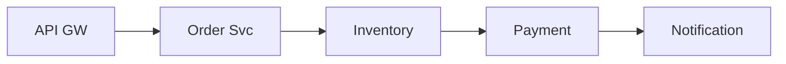
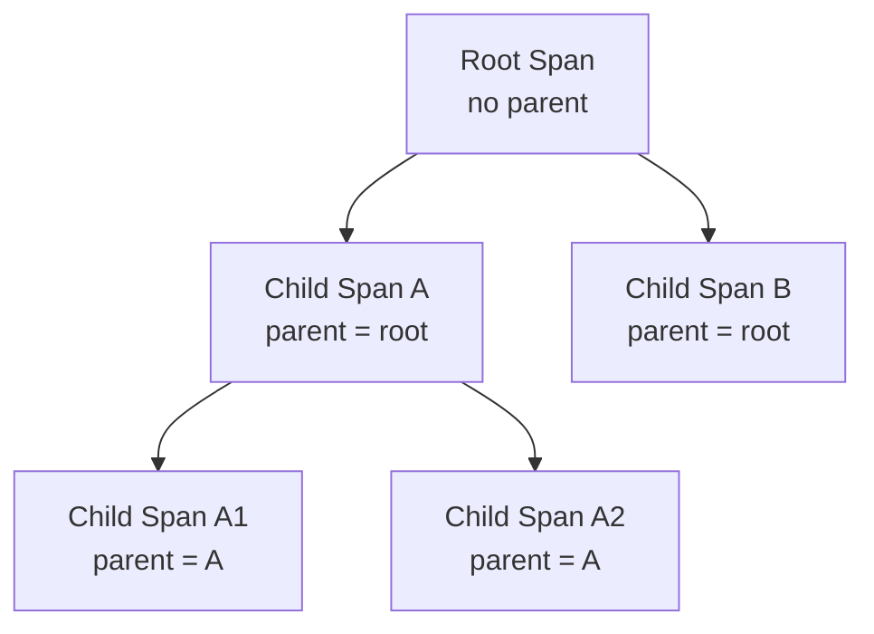
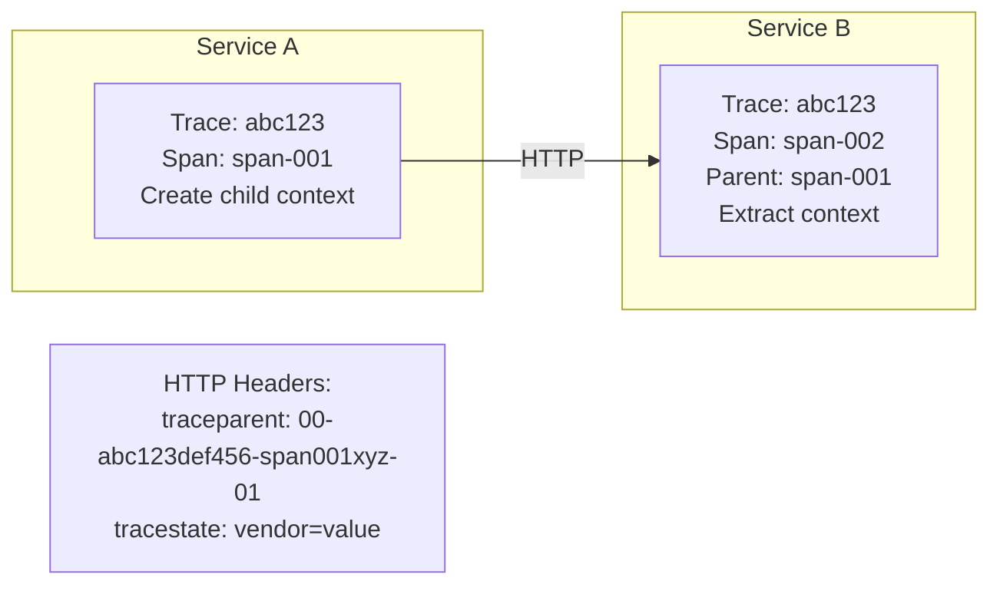
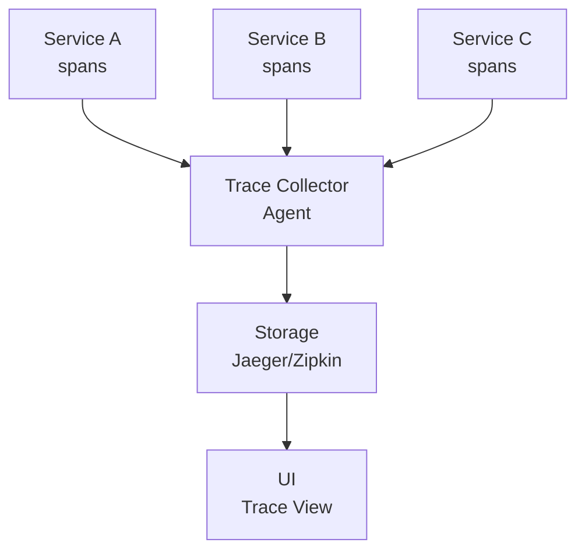

# 🔍 Distributed Tracing Basics

## 0️⃣ Prerequisites

Before diving into distributed tracing, you should understand:

- **Microservices Architecture**: Applications split into multiple independent services that communicate over the network (covered in Phase 10)
- **HTTP/REST APIs**: How services communicate using HTTP requests and responses
- **Logging**: Traditional approach of writing events to log files for debugging
- **Latency**: Time delay between request and response. In distributed systems, total latency is the sum of all service latencies plus network time

**Quick refresher**: In a monolithic application, when something goes wrong, you look at one log file. In microservices, a single user request might touch 10+ services. Each service has its own logs. Finding the problem is like finding a needle in 10 different haystacks. Distributed tracing solves this by connecting all the pieces together.

---

## 1️⃣ What Problem Does This Exist to Solve?

### The Specific Pain Point

Imagine debugging this scenario:

User complaint: "My order took 30 seconds to complete"

Your system:


<details>
<summary>ASCII diagram (reference)</summary>

```text
Your system:
┌──────┐    ┌──────┐    ┌──────┐    ┌──────┐    ┌──────┐
│ API  │───►│Order │───►│Inven-│───►│Pay-  │───►│Notif-│
│ GW   │    │ Svc  │    │tory  │    │ment  │    │ication│
└──────┘    └──────┘    └──────┘    └──────┘    └──────┘
```
</details>

**Questions you need to answer**:
- Which service was slow?
- Was it the service itself or the network between services?
- Did retries happen? How many?
- Were there any errors that were silently handled?
- What was the exact path the request took?

**Without distributed tracing**:
1. You check API Gateway logs: "Request completed in 30s"
2. You check Order Service logs: "Processed order in 28s" (but why?)
3. You check Inventory logs: "Responded in 50ms" (not the problem)
4. You check Payment logs: "Processed in 27s" (found it!)
5. But wait, which Payment log entry corresponds to this specific request?

With 1000 requests per second, correlating logs across services is nearly impossible.

### What Systems Looked Like Before

**Log-based debugging** (the old way):
```
# API Gateway log
2024-01-15 10:30:45.123 INFO  Request received: POST /orders
2024-01-15 10:31:15.456 INFO  Request completed: 200 OK

# Order Service log (different server, different timezone maybe?)
2024-01-15 10:30:45.234 INFO  Creating order for user 12345
2024-01-15 10:31:15.345 INFO  Order created: ORD-789

# Payment Service log
2024-01-15 10:30:46.111 INFO  Processing payment for $99.99
2024-01-15 10:31:14.222 INFO  Payment successful
```

Problems:
- No way to connect these log entries
- Clock drift between servers makes timestamps unreliable
- High-volume systems have thousands of entries per second
- Grep-ing through logs is slow and error-prone

### What Breaks Without Distributed Tracing

| Problem | Impact |
|---------|--------|
| Slow request debugging | Hours instead of minutes |
| Root cause analysis | Guesswork instead of facts |
| Performance optimization | Can't identify bottlenecks |
| Error correlation | Can't trace error propagation |
| Dependency mapping | Don't know what calls what |
| SLA monitoring | Can't measure end-to-end latency |

### Real Examples of the Problem

**Uber's Early Days**: Engineers spent hours correlating logs across services. A single debugging session could take a full day. After implementing distributed tracing, the same investigation took minutes.

**Twitter's Fail Whale Era**: When Twitter was frequently down, engineers couldn't quickly identify which service was causing cascading failures. They built Zipkin (now open source) to solve this.

**Google's Dapper**: Google built Dapper (the paper that inspired modern tracing) because with thousands of services, traditional debugging was impossible. One search query touches 100+ services.

---

## 2️⃣ Intuition and Mental Model

### The Detective Investigation Analogy

Think of distributed tracing like a detective investigating a crime that spans multiple locations:

**The Crime**: A user's request was slow (or failed)

**Without Tracing** (Bad Detective):
- Visits each location separately
- Asks "Did anything happen yesterday?"
- Gets hundreds of unrelated answers
- Can't connect the dots
- Spends days on the investigation

**With Tracing** (Good Detective):
- Every person involved wears a body camera
- All cameras are synchronized
- Each interaction is tagged with a case number
- Detective can replay the entire sequence
- Investigation takes minutes

**The Key Concepts**:

1. **Trace** = The entire investigation (one user request end-to-end)
2. **Span** = One location/interaction (one service call)
3. **Trace ID** = Case number (unique identifier connecting everything)
4. **Span ID** = Body camera footage ID (unique identifier for each interaction)
5. **Parent Span ID** = "Who sent you here?" (connects cause and effect)

```
Trace (Case #ABC123):
├── Span 1: API Gateway received request
│   └── Span 2: API Gateway called Order Service
│       ├── Span 3: Order Service called Inventory
│       └── Span 4: Order Service called Payment
│           └── Span 5: Payment called Fraud Detection
```

This analogy helps understand:
- Why we need unique identifiers (case numbers)
- Why we need parent-child relationships (who called whom)
- Why timing is important (sequence of events)
- Why context propagation matters (passing the case number along)

---

## 3️⃣ How It Works Internally

### Core Concepts

#### Trace

A **trace** represents the entire journey of a request through your system.

```
Trace ID: abc123def456

Timeline:
0ms      100ms    200ms    300ms    400ms    500ms
|--------|--------|--------|--------|--------|
[============ API Gateway (500ms) ============]
         [====== Order Service (350ms) ======]
              [= Inventory =]  [== Payment ==]
                   (50ms)         (200ms)
```

Properties of a trace:
- Unique identifier (Trace ID)
- Start time
- End time (calculated from spans)
- Collection of spans
- Metadata (user ID, request type, etc.)

#### Span

A **span** represents a single unit of work within a trace.

```java
// Conceptual span structure
class Span {
    String traceId;      // Which trace this belongs to
    String spanId;       // Unique ID for this span
    String parentSpanId; // ID of the span that created this one (null for root)
    String operationName; // What this span represents
    long startTime;      // When work started (microseconds since epoch)
    long duration;       // How long it took (microseconds)
    String serviceName;  // Which service created this span
    Map<String, String> tags;      // Key-value metadata
    List<LogEntry> logs;           // Time-stamped events within the span
    SpanContext context;           // Propagation context
}
```

Span relationships:


<details>
<summary>ASCII diagram (reference)</summary>

```text
Span relationships:
Root Span (no parent)
├── Child Span A (parent = root)
│   ├── Child Span A1 (parent = A)
│   └── Child Span A2 (parent = A)
└── Child Span B (parent = root)
```
</details>

#### Context Propagation

The trace context must be passed from service to service. This is called **context propagation**.



<details>
<summary>ASCII diagram (reference)</summary>

```text
Service A                    Service B
┌─────────────────┐         ┌─────────────────┐
│ Trace: abc123   │         │ Trace: abc123   │
│ Span: span-001  │         │ Span: span-002  │
│                 │  HTTP   │ Parent: span-001│
│ Create child    │────────►│                 │
│ context         │         │ Extract context │
└─────────────────┘         └─────────────────┘

HTTP Headers:
traceparent: 00-abc123def456-span001xyz-01
tracestate: vendor=value
```
</details>

**W3C Trace Context** (standard format):
```
traceparent: {version}-{trace-id}-{parent-span-id}-{flags}
             00-abc123def456789012345678901234-span001xyz789012-01

- version: 00 (current version)
- trace-id: 32 hex characters (128 bits)
- parent-span-id: 16 hex characters (64 bits)
- flags: 2 hex characters (sampling decision)
```

### Data Flow

#### Step 1: Request Arrives

```
User Request → API Gateway

API Gateway:
1. Check for existing trace context in headers
2. If none, generate new Trace ID: "abc123"
3. Create root span:
   - traceId: "abc123"
   - spanId: "span-001"
   - parentSpanId: null
   - operationName: "POST /orders"
   - startTime: 1705312245000000
```

#### Step 2: Service-to-Service Call

```
API Gateway → Order Service

API Gateway:
1. Create child span for outgoing call:
   - traceId: "abc123"
   - spanId: "span-002"
   - parentSpanId: "span-001"
   - operationName: "HTTP POST order-service/create"

2. Inject context into HTTP headers:
   traceparent: 00-abc123-span002-01

3. Make HTTP call

Order Service:
1. Extract context from headers
2. Create span with extracted parent:
   - traceId: "abc123"
   - spanId: "span-003"
   - parentSpanId: "span-002"
   - operationName: "createOrder"
```

#### Step 3: Span Completion and Export

```
When operation completes:
1. Record end time
2. Calculate duration
3. Add final tags/logs
4. Export span to collector

Span Export (to collector):
{
  "traceId": "abc123",
  "spanId": "span-003",
  "parentSpanId": "span-002",
  "operationName": "createOrder",
  "startTime": 1705312245100000,
  "duration": 350000,
  "tags": {
    "http.method": "POST",
    "http.status_code": "200",
    "order.id": "ORD-789"
  }
}
```

#### Step 4: Collection and Storage



<details>
<summary>ASCII diagram (reference)</summary>

```text
┌─────────────┐     ┌─────────────┐     ┌─────────────┐
│ Service A   │     │ Service B   │     │ Service C   │
│ (spans)     │     │ (spans)     │     │ (spans)     │
└──────┬──────┘     └──────┬──────┘     └──────┬──────┘
       │                   │                   │
       └───────────────────┼───────────────────┘
                           ▼
                    ┌─────────────┐
                    │  Collector  │
                    │  (Agent)    │
                    └──────┬──────┘
                           │
                           ▼
                    ┌─────────────┐
                    │  Storage    │
                    │(Jaeger/Zipkin)│
                    └──────┬──────┘
                           │
                           ▼
                    ┌─────────────┐
                    │     UI      │
                    │(Trace View) │
                    └─────────────┘
```
</details>

### Sampling Strategies

At high scale, tracing every request is expensive. Sampling decides which requests to trace.

#### Head-Based Sampling

Decision made at the start of the trace:

```
Request arrives at API Gateway:
- Generate random number: 0.15
- Sampling rate: 10% (0.1)
- 0.15 > 0.1 → Don't sample this request

All downstream services respect this decision (propagated in trace flags)
```

**Pros**: Simple, consistent (entire trace sampled or not)
**Cons**: Might miss important traces (errors, slow requests)

#### Tail-Based Sampling

Decision made after trace completes:

```
Collector receives all spans for trace:
- Check if any span has error
- Check if total duration > threshold
- Check if specific tag exists

If interesting → Keep
If boring → Discard
```

**Pros**: Captures all errors and slow requests
**Cons**: Higher resource usage (must buffer all spans)

#### Adaptive Sampling

Adjust sampling rate based on traffic:

```
Low traffic (100 req/s): Sample 100%
Medium traffic (1000 req/s): Sample 10%
High traffic (10000 req/s): Sample 1%

Always sample:
- Errors (100%)
- Requests > 5s (100%)
- Debug flag set (100%)
```

---

## 4️⃣ Simulation-First Explanation

Let's trace a single request through a simple e-commerce system.

### System Setup

```
┌─────────┐     ┌─────────┐     ┌─────────┐
│   API   │────►│  Order  │────►│Inventory│
│ Gateway │     │ Service │     │ Service │
└─────────┘     └─────────┘     └─────────┘
                     │
                     ▼
               ┌─────────┐
               │ Payment │
               │ Service │
               └─────────┘
```

### The Request

```
User: POST /orders
Body: { "productId": "LAPTOP-001", "quantity": 1 }
```

### Step-by-Step Trace

#### T=0ms: Request hits API Gateway

```
API Gateway receives request:
- No traceparent header → New trace
- Generate Trace ID: "4bf92f3577b34da6a3ce929d0e0e4736"
- Generate Span ID: "00f067aa0ba902b7"

Create ROOT SPAN:
{
  traceId: "4bf92f3577b34da6a3ce929d0e0e4736",
  spanId: "00f067aa0ba902b7",
  parentSpanId: null,
  operationName: "HTTP POST /orders",
  serviceName: "api-gateway",
  startTime: 1705312245000000,
  tags: {
    "http.method": "POST",
    "http.url": "/orders",
    "user.id": "user-123"
  }
}
```

#### T=5ms: API Gateway calls Order Service

```
API Gateway prepares outgoing request:

Create CHILD SPAN for HTTP client call:
{
  traceId: "4bf92f3577b34da6a3ce929d0e0e4736",
  spanId: "7a2190f7b0d14d3b",
  parentSpanId: "00f067aa0ba902b7",
  operationName: "HTTP POST order-service/orders",
  serviceName: "api-gateway",
  startTime: 1705312245005000
}

Inject context into HTTP headers:
traceparent: 00-4bf92f3577b34da6a3ce929d0e0e4736-7a2190f7b0d14d3b-01
```

#### T=10ms: Order Service receives request

```
Order Service extracts context from headers:
- traceId: "4bf92f3577b34da6a3ce929d0e0e4736"
- parentSpanId: "7a2190f7b0d14d3b"

Create SPAN:
{
  traceId: "4bf92f3577b34da6a3ce929d0e0e4736",
  spanId: "b7ad6b7169203331",
  parentSpanId: "7a2190f7b0d14d3b",
  operationName: "createOrder",
  serviceName: "order-service",
  startTime: 1705312245010000
}
```

#### T=15ms: Order Service calls Inventory Service

```
Create CHILD SPAN:
{
  traceId: "4bf92f3577b34da6a3ce929d0e0e4736",
  spanId: "e8f9a0b1c2d3e4f5",
  parentSpanId: "b7ad6b7169203331",
  operationName: "HTTP GET inventory-service/check",
  serviceName: "order-service",
  startTime: 1705312245015000
}

HTTP call with headers:
traceparent: 00-4bf92f3577b34da6a3ce929d0e0e4736-e8f9a0b1c2d3e4f5-01
```

#### T=20ms: Inventory Service processes

```
Inventory Service SPAN:
{
  traceId: "4bf92f3577b34da6a3ce929d0e0e4736",
  spanId: "1a2b3c4d5e6f7a8b",
  parentSpanId: "e8f9a0b1c2d3e4f5",
  operationName: "checkInventory",
  serviceName: "inventory-service",
  startTime: 1705312245020000,
  tags: {
    "product.id": "LAPTOP-001",
    "quantity.requested": "1",
    "quantity.available": "5"
  }
}
```

#### T=45ms: Inventory responds, Order calls Payment

```
Inventory span completed:
- duration: 25000 (25ms)

Order Service creates Payment span:
{
  traceId: "4bf92f3577b34da6a3ce929d0e0e4736",
  spanId: "9c8b7a6f5e4d3c2b",
  parentSpanId: "b7ad6b7169203331",
  operationName: "HTTP POST payment-service/charge",
  serviceName: "order-service",
  startTime: 1705312245045000
}
```

#### T=50ms: Payment Service processes

```
Payment Service SPAN:
{
  traceId: "4bf92f3577b34da6a3ce929d0e0e4736",
  spanId: "2d3e4f5a6b7c8d9e",
  parentSpanId: "9c8b7a6f5e4d3c2b",
  operationName: "processPayment",
  serviceName: "payment-service",
  startTime: 1705312245050000,
  tags: {
    "payment.amount": "999.99",
    "payment.currency": "USD",
    "payment.method": "credit_card"
  },
  logs: [
    { time: 1705312245055000, event: "fraud_check_started" },
    { time: 1705312245150000, event: "fraud_check_passed" },
    { time: 1705312245180000, event: "charge_submitted" },
    { time: 1705312245190000, event: "charge_confirmed" }
  ]
}
```

#### T=200ms: All responses return

```
Payment span completed: duration: 150ms
Order span completed: duration: 190ms
API Gateway span completed: duration: 200ms
```

### Final Trace Visualization

```
Trace: 4bf92f3577b34da6a3ce929d0e0e4736
Total Duration: 200ms

0ms                                                200ms
|                                                    |
[============== API Gateway (200ms) ================]
  [============ Order Service (190ms) ==============]
    [= Inventory (25ms) =]
                          [==== Payment (150ms) ====]
                            │ fraud_check_started
                            │ fraud_check_passed
                            │ charge_submitted
                            │ charge_confirmed
```

### What This Tells Us

1. **Total latency**: 200ms (acceptable)
2. **Bottleneck**: Payment service (150ms, 75% of total)
3. **Parallel opportunity**: Inventory and Payment could run in parallel
4. **Fraud check**: Takes 95ms (could be optimized)

---

## 5️⃣ How Engineers Actually Use This in Production

### Uber: Jaeger

Uber created Jaeger (now CNCF project) to handle their scale:

**Scale**: 
- 4000+ microservices
- Billions of spans per day
- Sub-second query latency

**How they use it**:
1. Every service auto-instrumented
2. Sampling: 0.1% of normal traffic, 100% of errors
3. Retention: 7 days hot storage, 90 days cold
4. Integration with alerting: Auto-create traces for alerts

**Key insight**: "Tracing isn't just for debugging. We use it for capacity planning, dependency mapping, and SLA enforcement."

### Netflix: Distributed Tracing at Scale

**Architecture**:
```
┌─────────────┐     ┌─────────────┐     ┌─────────────┐
│ Service     │────►│ Sidecar     │────►│ Collector   │
│ (App)       │     │ (Envoy)     │     │ (Zipkin)    │
└─────────────┘     └─────────────┘     └─────────────┘
                                              │
                                              ▼
                                        ┌───────────┐
                                        │Elasticsearch│
                                        └───────────┘
```

**Key practices**:
- Sidecar-based instrumentation (no code changes)
- Custom sampling: Always trace new deployments
- Trace-based alerting: Alert if P99 latency increases
- Chaos engineering integration: Trace during chaos experiments

### Google: Cloud Trace

Google Cloud Trace (based on Dapper) provides:

**Automatic instrumentation** for GCP services:
- App Engine
- Cloud Functions
- Cloud Run
- GKE

**Analysis features**:
- Automatic bottleneck detection
- Latency distribution analysis
- Trace comparison (before/after deployment)

### Production War Stories

**Stripe's Payment Latency Mystery**:
- Customer complained about 10s payment times
- Logs showed each service was fast
- Tracing revealed: 8 sequential HTTP calls that could be parallelized
- Fix: Parallel calls reduced latency to 2s

**Airbnb's Cascading Timeout**:
- Random 30s timeouts in production
- Tracing showed: Service A → B → C → D chain
- Each service had 10s timeout
- One slow response at D caused cascade
- Fix: Timeout budget propagation

---

## 6️⃣ How to Implement or Apply It

### Dependencies (Maven)

```xml
<!-- OpenTelemetry - The modern standard -->
<dependency>
    <groupId>io.opentelemetry</groupId>
    <artifactId>opentelemetry-api</artifactId>
    <version>1.32.0</version>
</dependency>

<dependency>
    <groupId>io.opentelemetry</groupId>
    <artifactId>opentelemetry-sdk</artifactId>
    <version>1.32.0</version>
</dependency>

<dependency>
    <groupId>io.opentelemetry</groupId>
    <artifactId>opentelemetry-exporter-otlp</artifactId>
    <version>1.32.0</version>
</dependency>

<!-- Spring Boot integration -->
<dependency>
    <groupId>io.opentelemetry.instrumentation</groupId>
    <artifactId>opentelemetry-spring-boot-starter</artifactId>
    <version>1.32.0-alpha</version>
</dependency>

<!-- Auto-instrumentation for common libraries -->
<dependency>
    <groupId>io.opentelemetry.instrumentation</groupId>
    <artifactId>opentelemetry-jdbc</artifactId>
    <version>1.32.0-alpha</version>
</dependency>
```

### Configuration (application.yml)

```yaml
# OpenTelemetry Configuration
otel:
  service:
    name: order-service
  
  traces:
    exporter: otlp
    
  exporter:
    otlp:
      endpoint: http://jaeger-collector:4317
      protocol: grpc
      
  resource:
    attributes:
      service.namespace: ecommerce
      deployment.environment: production
      
  # Sampling configuration
  traces:
    sampler:
      type: parentbased_traceidratio
      arg: 0.1  # Sample 10%

spring:
  application:
    name: order-service

# Logging correlation
logging:
  pattern:
    console: "%d{yyyy-MM-dd HH:mm:ss} [%thread] [traceId=%X{traceId} spanId=%X{spanId}] %-5level %logger{36} - %msg%n"
```

### Implementation: Basic Tracing Setup

```java
package com.example.tracing.config;

import io.opentelemetry.api.OpenTelemetry;
import io.opentelemetry.api.common.Attributes;
import io.opentelemetry.api.trace.Tracer;
import io.opentelemetry.api.trace.propagation.W3CTraceContextPropagator;
import io.opentelemetry.context.propagation.ContextPropagators;
import io.opentelemetry.exporter.otlp.trace.OtlpGrpcSpanExporter;
import io.opentelemetry.sdk.OpenTelemetrySdk;
import io.opentelemetry.sdk.resources.Resource;
import io.opentelemetry.sdk.trace.SdkTracerProvider;
import io.opentelemetry.sdk.trace.export.BatchSpanProcessor;
import io.opentelemetry.sdk.trace.samplers.Sampler;
import io.opentelemetry.semconv.resource.attributes.ResourceAttributes;
import org.springframework.beans.factory.annotation.Value;
import org.springframework.context.annotation.Bean;
import org.springframework.context.annotation.Configuration;

/**
 * OpenTelemetry configuration for distributed tracing.
 * 
 * This sets up:
 * 1. Resource attributes (service name, version, environment)
 * 2. Span exporter (where to send traces)
 * 3. Sampler (which traces to keep)
 * 4. Context propagation (how to pass trace context)
 */
@Configuration
public class TracingConfig {

    @Value("${otel.service.name:unknown-service}")
    private String serviceName;
    
    @Value("${otel.exporter.otlp.endpoint:http://localhost:4317}")
    private String otlpEndpoint;
    
    @Value("${otel.traces.sampler.ratio:1.0}")
    private double samplingRatio;

    /**
     * Configure OpenTelemetry SDK.
     * 
     * Components:
     * - Resource: Identifies this service
     * - SpanExporter: Sends spans to collector
     * - SpanProcessor: Batches spans for efficient export
     * - Sampler: Decides which traces to keep
     * - Propagator: Handles context propagation format
     */
    @Bean
    public OpenTelemetry openTelemetry() {
        // 1. Define resource attributes
        // These identify the service in trace data
        Resource resource = Resource.getDefault()
            .merge(Resource.create(Attributes.of(
                ResourceAttributes.SERVICE_NAME, serviceName,
                ResourceAttributes.SERVICE_VERSION, "1.0.0",
                ResourceAttributes.DEPLOYMENT_ENVIRONMENT, "production"
            )));

        // 2. Configure span exporter
        // OTLP (OpenTelemetry Protocol) is the standard format
        OtlpGrpcSpanExporter spanExporter = OtlpGrpcSpanExporter.builder()
            .setEndpoint(otlpEndpoint)
            .build();

        // 3. Configure span processor
        // BatchSpanProcessor batches spans for efficient network usage
        BatchSpanProcessor spanProcessor = BatchSpanProcessor.builder(spanExporter)
            .setMaxQueueSize(2048)           // Max spans to queue
            .setMaxExportBatchSize(512)      // Max spans per export
            .setScheduleDelay(java.time.Duration.ofSeconds(5)) // Export interval
            .build();

        // 4. Configure sampler
        // Parent-based: If parent is sampled, sample this span too
        // TraceIdRatio: Sample X% of new traces
        Sampler sampler = Sampler.parentBased(
            Sampler.traceIdRatioBased(samplingRatio)
        );

        // 5. Build tracer provider
        SdkTracerProvider tracerProvider = SdkTracerProvider.builder()
            .setResource(resource)
            .addSpanProcessor(spanProcessor)
            .setSampler(sampler)
            .build();

        // 6. Build OpenTelemetry instance
        return OpenTelemetrySdk.builder()
            .setTracerProvider(tracerProvider)
            .setPropagators(ContextPropagators.create(
                W3CTraceContextPropagator.getInstance()
            ))
            .buildAndRegisterGlobal();
    }

    /**
     * Create a tracer for manual instrumentation.
     */
    @Bean
    public Tracer tracer(OpenTelemetry openTelemetry) {
        return openTelemetry.getTracer(serviceName, "1.0.0");
    }
}
```

### Implementation: Manual Span Creation

```java
package com.example.tracing.service;

import io.opentelemetry.api.trace.Span;
import io.opentelemetry.api.trace.SpanKind;
import io.opentelemetry.api.trace.StatusCode;
import io.opentelemetry.api.trace.Tracer;
import io.opentelemetry.context.Context;
import io.opentelemetry.context.Scope;
import org.slf4j.Logger;
import org.slf4j.LoggerFactory;
import org.springframework.stereotype.Service;

/**
 * Order service with manual tracing instrumentation.
 * 
 * This demonstrates:
 * 1. Creating spans manually
 * 2. Adding attributes to spans
 * 3. Recording events (logs within spans)
 * 4. Error handling in spans
 * 5. Nested spans (parent-child relationships)
 */
@Service
public class OrderService {

    private static final Logger log = LoggerFactory.getLogger(OrderService.class);
    
    private final Tracer tracer;
    private final InventoryClient inventoryClient;
    private final PaymentClient paymentClient;

    public OrderService(Tracer tracer, 
                       InventoryClient inventoryClient,
                       PaymentClient paymentClient) {
        this.tracer = tracer;
        this.inventoryClient = inventoryClient;
        this.paymentClient = paymentClient;
    }

    /**
     * Create an order with full tracing.
     */
    public Order createOrder(OrderRequest request) {
        // Create a span for this operation
        // SpanKind.INTERNAL = internal processing (not a network call)
        Span span = tracer.spanBuilder("createOrder")
            .setSpanKind(SpanKind.INTERNAL)
            .startSpan();

        // Make this span the current span
        // Scope ensures span is properly closed
        try (Scope scope = span.makeCurrent()) {
            // Add attributes (searchable metadata)
            span.setAttribute("order.customer_id", request.getCustomerId());
            span.setAttribute("order.product_id", request.getProductId());
            span.setAttribute("order.quantity", request.getQuantity());

            // Record an event (timestamped log)
            span.addEvent("Order processing started");

            // Step 1: Check inventory
            span.addEvent("Checking inventory");
            boolean available = checkInventory(request.getProductId(), request.getQuantity());
            
            if (!available) {
                span.setStatus(StatusCode.ERROR, "Insufficient inventory");
                span.setAttribute("order.failure_reason", "insufficient_inventory");
                throw new InsufficientInventoryException("Product not available");
            }

            // Step 2: Process payment
            span.addEvent("Processing payment");
            PaymentResult payment = processPayment(request);
            
            if (!payment.isSuccessful()) {
                span.setStatus(StatusCode.ERROR, "Payment failed");
                span.setAttribute("order.failure_reason", "payment_failed");
                throw new PaymentFailedException("Payment declined");
            }

            // Step 3: Create order record
            span.addEvent("Creating order record");
            Order order = saveOrder(request, payment);

            // Success
            span.setAttribute("order.id", order.getId());
            span.setAttribute("order.total", order.getTotal());
            span.setStatus(StatusCode.OK);
            span.addEvent("Order created successfully");

            return order;

        } catch (Exception e) {
            // Record exception in span
            span.recordException(e);
            span.setStatus(StatusCode.ERROR, e.getMessage());
            throw e;
        } finally {
            // Always end the span
            span.end();
        }
    }

    /**
     * Check inventory with child span.
     */
    private boolean checkInventory(String productId, int quantity) {
        // Create child span (automatically linked to parent via Context)
        Span span = tracer.spanBuilder("checkInventory")
            .setSpanKind(SpanKind.CLIENT) // This is an outgoing call
            .startSpan();

        try (Scope scope = span.makeCurrent()) {
            span.setAttribute("inventory.product_id", productId);
            span.setAttribute("inventory.quantity_requested", quantity);

            // Make the actual call
            // The HTTP client should propagate context automatically
            InventoryResponse response = inventoryClient.check(productId, quantity);

            span.setAttribute("inventory.quantity_available", response.getAvailable());
            span.setStatus(StatusCode.OK);

            return response.getAvailable() >= quantity;

        } catch (Exception e) {
            span.recordException(e);
            span.setStatus(StatusCode.ERROR, "Inventory check failed");
            throw e;
        } finally {
            span.end();
        }
    }

    /**
     * Process payment with child span.
     */
    private PaymentResult processPayment(OrderRequest request) {
        Span span = tracer.spanBuilder("processPayment")
            .setSpanKind(SpanKind.CLIENT)
            .startSpan();

        try (Scope scope = span.makeCurrent()) {
            span.setAttribute("payment.amount", request.getAmount());
            span.setAttribute("payment.currency", request.getCurrency());
            span.setAttribute("payment.method", request.getPaymentMethod());

            // Sensitive data should NOT be in traces
            // BAD: span.setAttribute("payment.card_number", request.getCardNumber());

            PaymentResult result = paymentClient.charge(request);

            span.setAttribute("payment.transaction_id", result.getTransactionId());
            span.setAttribute("payment.status", result.getStatus());
            span.setStatus(StatusCode.OK);

            return result;

        } catch (Exception e) {
            span.recordException(e);
            span.setStatus(StatusCode.ERROR, "Payment processing failed");
            throw e;
        } finally {
            span.end();
        }
    }

    private Order saveOrder(OrderRequest request, PaymentResult payment) {
        // Implementation details...
        return new Order();
    }
}
```

### Implementation: HTTP Context Propagation

```java
package com.example.tracing.http;

import io.opentelemetry.api.OpenTelemetry;
import io.opentelemetry.api.trace.Span;
import io.opentelemetry.api.trace.SpanKind;
import io.opentelemetry.api.trace.Tracer;
import io.opentelemetry.context.Context;
import io.opentelemetry.context.Scope;
import io.opentelemetry.context.propagation.TextMapGetter;
import io.opentelemetry.context.propagation.TextMapSetter;
import jakarta.servlet.FilterChain;
import jakarta.servlet.ServletException;
import jakarta.servlet.http.HttpServletRequest;
import jakarta.servlet.http.HttpServletResponse;
import org.springframework.stereotype.Component;
import org.springframework.web.filter.OncePerRequestFilter;

import java.io.IOException;
import java.util.Collections;

/**
 * Filter that extracts trace context from incoming requests
 * and creates a server span.
 */
@Component
public class TracingFilter extends OncePerRequestFilter {

    private final OpenTelemetry openTelemetry;
    private final Tracer tracer;

    // TextMapGetter for extracting context from HTTP headers
    private static final TextMapGetter<HttpServletRequest> GETTER = 
        new TextMapGetter<>() {
            @Override
            public Iterable<String> keys(HttpServletRequest request) {
                return Collections.list(request.getHeaderNames());
            }

            @Override
            public String get(HttpServletRequest request, String key) {
                return request.getHeader(key);
            }
        };

    public TracingFilter(OpenTelemetry openTelemetry, Tracer tracer) {
        this.openTelemetry = openTelemetry;
        this.tracer = tracer;
    }

    @Override
    protected void doFilterInternal(HttpServletRequest request,
                                   HttpServletResponse response,
                                   FilterChain filterChain) 
            throws ServletException, IOException {

        // 1. Extract context from incoming request headers
        Context extractedContext = openTelemetry.getPropagators()
            .getTextMapPropagator()
            .extract(Context.current(), request, GETTER);

        // 2. Create server span with extracted context as parent
        String spanName = request.getMethod() + " " + request.getRequestURI();
        Span span = tracer.spanBuilder(spanName)
            .setParent(extractedContext)
            .setSpanKind(SpanKind.SERVER)
            .startSpan();

        // 3. Add standard HTTP attributes
        span.setAttribute("http.method", request.getMethod());
        span.setAttribute("http.url", request.getRequestURL().toString());
        span.setAttribute("http.target", request.getRequestURI());
        span.setAttribute("http.host", request.getServerName());
        span.setAttribute("http.user_agent", request.getHeader("User-Agent"));

        // 4. Make span current and continue filter chain
        try (Scope scope = span.makeCurrent()) {
            filterChain.doFilter(request, response);

            // 5. Record response status
            span.setAttribute("http.status_code", response.getStatus());
            
            if (response.getStatus() >= 400) {
                span.setStatus(io.opentelemetry.api.trace.StatusCode.ERROR);
            }

        } catch (Exception e) {
            span.recordException(e);
            span.setStatus(io.opentelemetry.api.trace.StatusCode.ERROR, e.getMessage());
            throw e;
        } finally {
            span.end();
        }
    }
}
```

### Implementation: RestTemplate with Context Propagation

```java
package com.example.tracing.http;

import io.opentelemetry.api.OpenTelemetry;
import io.opentelemetry.api.trace.Span;
import io.opentelemetry.api.trace.SpanKind;
import io.opentelemetry.api.trace.Tracer;
import io.opentelemetry.context.Context;
import io.opentelemetry.context.Scope;
import io.opentelemetry.context.propagation.TextMapSetter;
import org.springframework.http.HttpRequest;
import org.springframework.http.client.ClientHttpRequestExecution;
import org.springframework.http.client.ClientHttpRequestInterceptor;
import org.springframework.http.client.ClientHttpResponse;
import org.springframework.stereotype.Component;

import java.io.IOException;

/**
 * RestTemplate interceptor that:
 * 1. Creates a client span for outgoing requests
 * 2. Injects trace context into HTTP headers
 */
@Component
public class TracingRestTemplateInterceptor implements ClientHttpRequestInterceptor {

    private final OpenTelemetry openTelemetry;
    private final Tracer tracer;

    // TextMapSetter for injecting context into HTTP headers
    private static final TextMapSetter<HttpRequest> SETTER = 
        (request, key, value) -> request.getHeaders().set(key, value);

    public TracingRestTemplateInterceptor(OpenTelemetry openTelemetry, Tracer tracer) {
        this.openTelemetry = openTelemetry;
        this.tracer = tracer;
    }

    @Override
    public ClientHttpResponse intercept(HttpRequest request, 
                                        byte[] body,
                                        ClientHttpRequestExecution execution) 
            throws IOException {

        // 1. Create client span
        String spanName = "HTTP " + request.getMethod() + " " + request.getURI().getHost();
        Span span = tracer.spanBuilder(spanName)
            .setSpanKind(SpanKind.CLIENT)
            .startSpan();

        try (Scope scope = span.makeCurrent()) {
            // 2. Add HTTP attributes
            span.setAttribute("http.method", request.getMethod().name());
            span.setAttribute("http.url", request.getURI().toString());
            span.setAttribute("http.host", request.getURI().getHost());

            // 3. Inject trace context into headers
            openTelemetry.getPropagators()
                .getTextMapPropagator()
                .inject(Context.current(), request, SETTER);

            // 4. Execute request
            ClientHttpResponse response = execution.execute(request, body);

            // 5. Record response
            span.setAttribute("http.status_code", response.getStatusCode().value());
            
            if (response.getStatusCode().isError()) {
                span.setStatus(io.opentelemetry.api.trace.StatusCode.ERROR);
            }

            return response;

        } catch (IOException e) {
            span.recordException(e);
            span.setStatus(io.opentelemetry.api.trace.StatusCode.ERROR, e.getMessage());
            throw e;
        } finally {
            span.end();
        }
    }
}
```

### Implementation: Correlation ID in Logs

```java
package com.example.tracing.logging;

import io.opentelemetry.api.trace.Span;
import io.opentelemetry.api.trace.SpanContext;
import org.slf4j.MDC;
import org.springframework.stereotype.Component;
import jakarta.servlet.Filter;
import jakarta.servlet.FilterChain;
import jakarta.servlet.ServletException;
import jakarta.servlet.ServletRequest;
import jakarta.servlet.ServletResponse;

import java.io.IOException;

/**
 * Filter that adds trace and span IDs to the logging MDC.
 * 
 * This allows logs to include trace context:
 * 2024-01-15 10:30:45 [traceId=abc123 spanId=def456] INFO OrderService - Creating order
 * 
 * Now you can search logs by trace ID to find all logs for a request.
 */
@Component
public class TraceLoggingFilter implements Filter {

    @Override
    public void doFilter(ServletRequest request, 
                        ServletResponse response, 
                        FilterChain chain) 
            throws IOException, ServletException {
        
        try {
            // Get current span context
            Span currentSpan = Span.current();
            SpanContext spanContext = currentSpan.getSpanContext();

            if (spanContext.isValid()) {
                // Add to MDC (Mapped Diagnostic Context)
                MDC.put("traceId", spanContext.getTraceId());
                MDC.put("spanId", spanContext.getSpanId());
            }

            chain.doFilter(request, response);

        } finally {
            // Clean up MDC
            MDC.remove("traceId");
            MDC.remove("spanId");
        }
    }
}
```

### Docker Compose: Complete Tracing Stack

```yaml
# docker-compose.yml
version: '3.8'

services:
  # Your application
  order-service:
    build: .
    ports:
      - "8080:8080"
    environment:
      - OTEL_SERVICE_NAME=order-service
      - OTEL_EXPORTER_OTLP_ENDPOINT=http://jaeger:4317
    depends_on:
      - jaeger

  # Jaeger - All-in-one for development
  jaeger:
    image: jaegertracing/all-in-one:1.52
    ports:
      - "16686:16686"  # Jaeger UI
      - "4317:4317"    # OTLP gRPC
      - "4318:4318"    # OTLP HTTP
    environment:
      - COLLECTOR_OTLP_ENABLED=true

  # Alternative: Zipkin
  # zipkin:
  #   image: openzipkin/zipkin:latest
  #   ports:
  #     - "9411:9411"

  # For production: OpenTelemetry Collector
  otel-collector:
    image: otel/opentelemetry-collector-contrib:0.91.0
    command: ["--config=/etc/otel-collector-config.yaml"]
    volumes:
      - ./otel-collector-config.yaml:/etc/otel-collector-config.yaml
    ports:
      - "4317:4317"   # OTLP gRPC
      - "4318:4318"   # OTLP HTTP
      - "8888:8888"   # Prometheus metrics
```

### OpenTelemetry Collector Configuration

```yaml
# otel-collector-config.yaml
receivers:
  otlp:
    protocols:
      grpc:
        endpoint: 0.0.0.0:4317
      http:
        endpoint: 0.0.0.0:4318

processors:
  batch:
    timeout: 1s
    send_batch_size: 1024
    
  # Tail-based sampling
  tail_sampling:
    decision_wait: 10s
    num_traces: 100000
    policies:
      # Always sample errors
      - name: error-policy
        type: status_code
        status_code:
          status_codes: [ERROR]
      # Always sample slow traces
      - name: latency-policy
        type: latency
        latency:
          threshold_ms: 5000
      # Sample 10% of everything else
      - name: probabilistic-policy
        type: probabilistic
        probabilistic:
          sampling_percentage: 10

exporters:
  # Send to Jaeger
  jaeger:
    endpoint: jaeger:14250
    tls:
      insecure: true
      
  # Also send to logging for debugging
  logging:
    loglevel: debug

service:
  pipelines:
    traces:
      receivers: [otlp]
      processors: [batch, tail_sampling]
      exporters: [jaeger, logging]
```

---

## 7️⃣ Tradeoffs, Pitfalls, and Common Mistakes

### Tradeoffs

| Aspect | Benefit | Cost |
|--------|---------|------|
| Full tracing | Complete visibility | High storage, performance overhead |
| Sampling | Lower cost | Miss some traces |
| Head sampling | Simple, consistent | Miss errors/slow requests |
| Tail sampling | Capture important traces | Higher memory, complexity |
| Auto-instrumentation | Easy setup | Less control, larger payloads |
| Manual instrumentation | Fine control | More code, maintenance |

### Common Mistakes

**1. Not Propagating Context**
```java
// BAD: Context lost in async call
CompletableFuture.runAsync(() -> {
    // No trace context here!
    processOrder(order);
});

// GOOD: Capture and restore context
Context context = Context.current();
CompletableFuture.runAsync(() -> {
    try (Scope scope = context.makeCurrent()) {
        processOrder(order);
    }
});
```

**2. Sensitive Data in Traces**
```java
// BAD: PII in traces
span.setAttribute("user.email", user.getEmail());
span.setAttribute("user.ssn", user.getSsn());
span.setAttribute("payment.card_number", card.getNumber());

// GOOD: Only non-sensitive identifiers
span.setAttribute("user.id", user.getId());
span.setAttribute("payment.last_four", card.getLastFour());
```

**3. Too Many Spans**
```java
// BAD: Span for every loop iteration
for (Item item : items) {
    Span span = tracer.spanBuilder("processItem").startSpan();
    try {
        process(item);
    } finally {
        span.end();
    }
}

// GOOD: One span with count attribute
Span span = tracer.spanBuilder("processItems").startSpan();
span.setAttribute("item.count", items.size());
try {
    for (Item item : items) {
        process(item);
    }
} finally {
    span.end();
}
```

**4. Not Ending Spans**
```java
// BAD: Span never ended (memory leak, incorrect timing)
Span span = tracer.spanBuilder("operation").startSpan();
doSomething();
// Forgot span.end()!

// GOOD: Always end in finally
Span span = tracer.spanBuilder("operation").startSpan();
try {
    doSomething();
} finally {
    span.end();
}
```

**5. Ignoring Sampling in Tests**
```java
// BAD: Tests depend on traces existing
@Test
void testOrder() {
    orderService.createOrder(request);
    // This fails if sampling rate is 0%
    verify(traceExporter).export(any());
}

// GOOD: Test business logic, not tracing
@Test
void testOrder() {
    Order order = orderService.createOrder(request);
    assertThat(order.getId()).isNotNull();
}
```

### Performance Gotchas

**Span Creation Overhead**
- Each span: ~1-5 microseconds
- With attributes: ~10-50 microseconds
- At 100K req/s: 1-5 seconds of CPU per second

**Export Overhead**
- Synchronous export blocks request
- Use BatchSpanProcessor (async)
- Configure appropriate batch sizes

**Memory Usage**
- Each span: ~500 bytes - 2KB
- Tail sampling buffers: Can be GBs
- Monitor collector memory

### Security Considerations

**Data Exposure**
- Traces may contain sensitive data
- Restrict access to tracing UI
- Consider data retention policies

**Trace Injection**
- Malicious traceparent headers
- Validate trace IDs
- Don't trust client-provided context blindly

---

## 8️⃣ When NOT to Use This

### Skip Distributed Tracing When

**Single Service Applications**
- Monolithic applications
- Simple CRUD services
- No service-to-service calls

Better: Traditional logging with request IDs

**Extremely High Throughput, Low Latency**
- Sub-millisecond latency requirements
- Millions of requests per second
- Every microsecond matters

Better: Metrics-based monitoring, sampling-only tracing

**Simple Debugging Needs**
- Small team, few services
- Can correlate logs manually
- No complex request flows

Better: Structured logging with correlation IDs

**Cost Constraints**
- Limited infrastructure budget
- No dedicated observability team
- Storage costs prohibitive

Better: Start with metrics, add tracing later

### Signs You're Over-Engineering

- Tracing internal method calls (not service boundaries)
- Creating spans for every database query
- 100% sampling in production
- Storing traces for months

---

## 9️⃣ Comparison with Alternatives

### Tracing vs Logging vs Metrics

| Aspect | Logging | Metrics | Tracing |
|--------|---------|---------|---------|
| Granularity | Event-level | Aggregated | Request-level |
| Cardinality | High | Low | Medium |
| Storage cost | High | Low | Medium |
| Query speed | Slow | Fast | Medium |
| Best for | Debugging | Alerting | Request flow |

### Tracing Tools Comparison

| Tool | Pros | Cons | Best For |
|------|------|------|----------|
| Jaeger | CNCF, Kubernetes native | Complex setup | Cloud-native apps |
| Zipkin | Simple, mature | Less features | Getting started |
| Datadog APM | Full platform | Expensive | Enterprise |
| AWS X-Ray | AWS integration | AWS lock-in | AWS workloads |
| Honeycomb | Powerful queries | Learning curve | Complex debugging |

### OpenTelemetry vs Vendor SDKs

| Aspect | OpenTelemetry | Vendor SDK |
|--------|---------------|------------|
| Vendor lock-in | None | High |
| Feature completeness | Growing | Mature |
| Community | Large, active | Vendor-specific |
| Setup complexity | Medium | Low |
| Flexibility | High | Limited |

**Recommendation**: Use OpenTelemetry. It's the industry standard and allows switching backends without code changes.

---

## 🔟 Interview Follow-up Questions WITH Answers

### L4 (Entry Level) Questions

**Q1: What is the difference between a trace and a span?**

**A**: 
- A **trace** represents the entire journey of a request through a distributed system. It has a unique Trace ID and contains multiple spans.
- A **span** represents a single unit of work within a trace. It has its own Span ID, a reference to its parent span, timing information, and metadata.

Example:
```
Trace (ID: abc123) - User places order
├── Span 1: API Gateway receives request (root span)
│   └── Span 2: API Gateway calls Order Service
│       ├── Span 3: Order Service checks inventory
│       └── Span 4: Order Service processes payment
```

The trace is the whole tree. Each box is a span.

---

**Q2: How does trace context propagation work?**

**A**: Trace context propagation passes trace information from one service to another so all spans can be connected.

The process:
1. **Injection**: Before making an outgoing call, the calling service injects trace context into the request (usually HTTP headers)
2. **Extraction**: The receiving service extracts the context from the incoming request
3. **Continuation**: The receiving service creates new spans with the extracted context as parent

Standard format (W3C Trace Context):
```
traceparent: 00-{trace-id}-{parent-span-id}-{flags}
Example: traceparent: 00-abc123def456-span001xyz-01
```

This ensures all spans across all services share the same trace ID and maintain parent-child relationships.

---

### L5 (Mid Level) Questions

**Q3: Explain different sampling strategies and when to use each.**

**A**: Sampling decides which traces to keep (tracing everything is expensive).

**1. Head-Based Sampling**
- Decision made when trace starts
- Simple: random percentage (e.g., 10%)
- Pros: Low overhead, consistent (entire trace sampled or not)
- Cons: May miss important traces (errors, slow requests)
- Use when: Cost is primary concern, errors are rare

**2. Tail-Based Sampling**
- Decision made after trace completes
- Can sample based on: errors, latency, specific attributes
- Pros: Never miss important traces
- Cons: Higher memory (must buffer all spans), more complex
- Use when: Must capture all errors/slow requests

**3. Adaptive Sampling**
- Adjusts rate based on traffic
- High traffic: lower rate, Low traffic: higher rate
- Always sample errors (100%)
- Use when: Traffic varies significantly

**4. Priority Sampling**
- Different rates for different request types
- Example: 100% for payments, 1% for health checks
- Use when: Some requests are more important than others

Production recommendation: Tail-based sampling with always-sample rules for errors and high latency.

---

**Q4: How would you debug a slow request using distributed tracing?**

**A**: Step-by-step approach:

**1. Find the trace**
```
Search by: user ID, request ID, time range, endpoint
Filter: latency > 5s
```

**2. Analyze the waterfall view**
```
[====== API Gateway (5.2s) ======]
  [=== Order Service (5.0s) ===]
    [Inventory (50ms)]
    [======= Payment (4.9s) =======]
      [Fraud Check (4.8s)]  ← Bottleneck!
```

**3. Identify the bottleneck**
- Look for the longest span
- Check if it's the span itself or a child span
- In this case: Fraud Check is 4.8s of 5.2s total

**4. Examine span details**
```
Span: Fraud Check
Duration: 4800ms
Attributes:
  - fraud.model_version: v2.3
  - fraud.features_computed: 150
Events:
  - t+100ms: feature_extraction_started
  - t+4500ms: feature_extraction_completed  ← Slow!
  - t+4700ms: model_inference_completed
```

**5. Root cause**
Feature extraction took 4.4s (should be ~100ms). Check if this is:
- Data issue (too many features)
- Infrastructure issue (slow database)
- Code issue (inefficient algorithm)

**6. Verify with metrics**
Cross-reference with metrics to see if this is a pattern or one-off.

---

### L6 (Senior Level) Questions

**Q5: Design a distributed tracing system for a company processing 1 million requests per second.**

**A**: At this scale, we need a carefully designed architecture:

**1. Architecture Overview**
```
┌─────────────────────────────────────────────────────────────┐
│                     Services (1M req/s)                      │
│  ┌─────┐ ┌─────┐ ┌─────┐ ┌─────┐ ┌─────┐ ┌─────┐ ┌─────┐   │
│  │ Svc │ │ Svc │ │ Svc │ │ Svc │ │ Svc │ │ Svc │ │ Svc │   │
│  └──┬──┘ └──┬──┘ └──┬──┘ └──┬──┘ └──┬──┘ └──┬──┘ └──┬──┘   │
└─────┼───────┼───────┼───────┼───────┼───────┼───────┼───────┘
      │       │       │       │       │       │       │
      ▼       ▼       ▼       ▼       ▼       ▼       ▼
┌─────────────────────────────────────────────────────────────┐
│              Local Agents (one per host)                     │
│  - Buffer spans locally                                      │
│  - Head-based sampling (10%)                                 │
│  - Forward to collectors                                     │
└─────────────────────────────────────────────────────────────┘
                              │
                              ▼
┌─────────────────────────────────────────────────────────────┐
│                    Collector Cluster                         │
│  - Kafka for buffering (partitioned by trace ID)            │
│  - Tail-based sampling                                       │
│  - 100 collectors, auto-scaling                              │
└─────────────────────────────────────────────────────────────┘
                              │
                              ▼
┌─────────────────────────────────────────────────────────────┐
│                      Storage Layer                           │
│  - Hot: Elasticsearch (7 days)                               │
│  - Cold: S3 + Parquet (90 days)                              │
│  - Indexes: trace_id, service, time, error                   │
└─────────────────────────────────────────────────────────────┘
```

**2. Sampling Strategy**
```
Layer 1 (Head): 10% random sampling at service
Layer 2 (Tail): At collector
  - Keep 100% of errors
  - Keep 100% of latency > P99
  - Keep 100% of specific tags (debug=true)
  - Keep 1% of remaining

Effective rate: ~1.5% of all traces stored
```

**3. Capacity Planning**
```
1M req/s, avg 5 spans/request = 5M spans/s
After sampling (1.5%): 75K spans/s
Avg span size: 1KB
Storage: 75MB/s = 6.5TB/day = 45TB/week

Collector capacity:
- 100 collectors
- Each handles 750 spans/s
- 3x headroom for spikes
```

**4. High Availability**
```
- Collectors: Kubernetes deployment, auto-scaling
- Kafka: 3 brokers, replication factor 3
- Elasticsearch: 3 master, 10 data nodes
- Cross-region replication for DR
```

**5. Query Optimization**
```
- Trace ID lookup: O(1) via hash index
- Time-range queries: Time-based partitioning
- Service queries: Service-based sharding
- Full-text search: Limited to recent data
```

**6. Cost Optimization**
```
- Tiered storage: Hot (SSD) → Warm (HDD) → Cold (S3)
- Compression: 10:1 for cold storage
- TTL: Auto-delete after 90 days
- Sampling adjustment: Increase during cost overruns
```

---

**Q6: How would you implement trace-based alerting?**

**A**: Trace-based alerting uses trace data to trigger alerts, providing richer context than metrics alone.

**1. Architecture**
```
┌─────────────┐     ┌─────────────┐     ┌─────────────┐
│  Collector  │────►│   Stream    │────►│   Alert     │
│  (traces)   │     │  Processor  │     │   Manager   │
└─────────────┘     └─────────────┘     └─────────────┘
                           │
                           ▼
                    ┌─────────────┐
                    │   Rules     │
                    │   Engine    │
                    └─────────────┘
```

**2. Alert Types**

**Latency Alerts**
```yaml
- name: high_latency_payment
  condition: |
    trace.service == "payment-service" AND
    trace.duration > 5000ms AND
    trace.status == "OK"
  threshold: 10 traces in 5 minutes
  action: page_oncall
  context: Include full trace
```

**Error Rate Alerts**
```yaml
- name: error_spike
  condition: |
    trace.status == "ERROR" AND
    trace.service == "order-service"
  threshold: error_rate > 5% (baseline: 0.1%)
  action: slack_channel
  context: Include error message, stack trace
```

**Dependency Alerts**
```yaml
- name: downstream_degradation
  condition: |
    span.kind == "CLIENT" AND
    span.peer_service == "inventory-service" AND
    span.duration > 1000ms
  threshold: 50% of calls slow
  action: notify_inventory_team
  context: Include calling service, affected traces
```

**3. Implementation**
```java
public class TraceAlertProcessor {
    
    public void processTrace(Trace trace) {
        // Check each alert rule
        for (AlertRule rule : alertRules) {
            if (rule.matches(trace)) {
                AlertContext context = AlertContext.builder()
                    .traceId(trace.getTraceId())
                    .traceUrl(buildTraceUrl(trace))
                    .affectedServices(trace.getServices())
                    .rootCause(identifyRootCause(trace))
                    .build();
                    
                alertManager.fire(rule, context);
            }
        }
    }
    
    private String identifyRootCause(Trace trace) {
        // Find the span that caused the issue
        return trace.getSpans().stream()
            .filter(span -> span.getStatus() == ERROR || 
                           span.getDuration() > span.getExpectedDuration())
            .findFirst()
            .map(Span::getOperationName)
            .orElse("unknown");
    }
}
```

**4. Benefits Over Metric Alerts**
- Alert includes full trace context
- Can identify root cause automatically
- Reduces MTTR (Mean Time To Resolution)
- Fewer false positives (can check multiple conditions)

---

## 1️⃣1️⃣ One Clean Mental Summary

Distributed tracing is like GPS tracking for requests in your microservices. Each request gets a unique **Trace ID** that follows it through every service. Each service creates **spans** (timestamped records of work done) that are linked together by parent-child relationships.

When something goes wrong, instead of searching through logs from 20 different services, you look up the trace and see exactly what happened: which services were called, how long each took, where errors occurred, and in what order.

The key components are: **context propagation** (passing the trace ID in HTTP headers), **span collection** (gathering timing and metadata), and **sampling** (deciding which traces to keep at scale).

In production, use **OpenTelemetry** (the industry standard), export to **Jaeger** or similar, and implement **tail-based sampling** to capture all errors while controlling costs. The result: debugging that takes minutes instead of hours.

---

## Quick Reference Card

```
┌─────────────────────────────────────────────────────────────┐
│                  DISTRIBUTED TRACING                         │
├─────────────────────────────────────────────────────────────┤
│ Concept         │ Description                                │
├─────────────────────────────────────────────────────────────┤
│ Trace           │ End-to-end request journey                 │
│ Span            │ Single unit of work                        │
│ Trace ID        │ Unique identifier for trace                │
│ Span ID         │ Unique identifier for span                 │
│ Parent Span ID  │ Links child to parent                      │
├─────────────────────────────────────────────────────────────┤
│                    CONTEXT PROPAGATION                       │
├─────────────────────────────────────────────────────────────┤
│ W3C Header      │ traceparent: 00-{trace}-{span}-{flags}    │
│ Inject          │ Add context to outgoing request            │
│ Extract         │ Read context from incoming request         │
├─────────────────────────────────────────────────────────────┤
│                    SAMPLING STRATEGIES                       │
├─────────────────────────────────────────────────────────────┤
│ Head-based      │ Decide at start, simple, may miss errors  │
│ Tail-based      │ Decide at end, captures all errors        │
│ Adaptive        │ Adjust rate based on traffic              │
├─────────────────────────────────────────────────────────────┤
│                    TOOLS                                     │
├─────────────────────────────────────────────────────────────┤
│ OpenTelemetry   │ Standard SDK (use this)                   │
│ Jaeger          │ CNCF tracing backend                      │
│ Zipkin          │ Simple tracing backend                    │
│ OTel Collector  │ Receives, processes, exports traces       │
└─────────────────────────────────────────────────────────────┘
```

