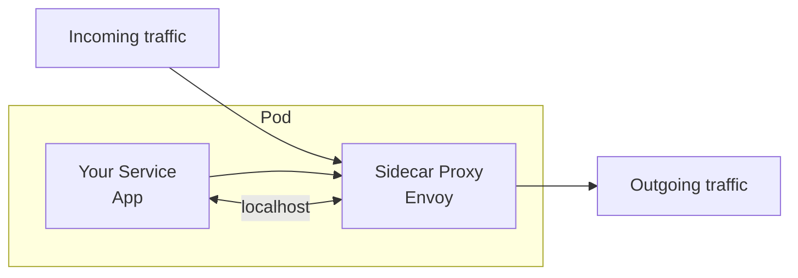
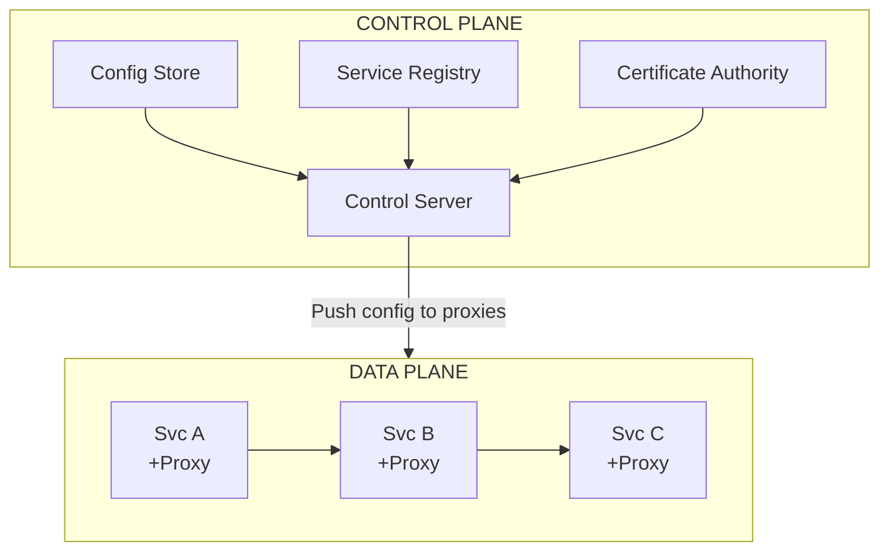

# 🕸️ Service Mesh Concepts

## 0️⃣ Prerequisites

Before diving into service mesh, you should understand:

- **Microservices Architecture**: Applications split into multiple independent services (covered in Phase 10)
- **Containers and Kubernetes**: How applications are packaged and orchestrated. A container is a lightweight, isolated runtime environment. Kubernetes manages containers at scale.
- **Load Balancing**: Distributing traffic across multiple service instances (covered in Phase 2)
- **TLS/mTLS**: Transport Layer Security encrypts network traffic. Mutual TLS (mTLS) means both client and server authenticate each other.
- **Proxies**: Software that sits between client and server, intercepting and potentially modifying traffic

**Quick refresher**: In a microservices architecture, services need to discover each other, communicate securely, handle failures gracefully, and be observable. Without a service mesh, each service must implement these concerns individually. A service mesh extracts these concerns into infrastructure, letting developers focus on business logic.

---

## 1️⃣ What Problem Does This Exist to Solve?

### The Specific Pain Point

Imagine you have 100 microservices. Each service needs to:

1. **Discover** other services (where is the payment service?)
2. **Load balance** across instances (which of the 10 payment pods?)
3. **Encrypt** traffic (TLS between services)
4. **Authenticate** callers (is this really the order service?)
5. **Handle failures** (retry, circuit breaker, timeout)
6. **Observe** traffic (metrics, traces, logs)
7. **Control traffic** (canary deployments, A/B testing)

**Without a service mesh**, each service implements these in application code:

```java
// Every service has code like this
@Service
public class OrderService {
    
    @CircuitBreaker(name = "payment")
    @Retry(name = "payment")
    @TimeLimiter(name = "payment")
    public PaymentResponse callPayment(PaymentRequest request) {
        // Service discovery
        String paymentUrl = serviceRegistry.lookup("payment-service");
        
        // Load balancing
        String instance = loadBalancer.choose(paymentUrl);
        
        // TLS configuration
        SSLContext ssl = sslContextBuilder.build();
        
        // Add authentication
        request.addHeader("Authorization", authToken);
        
        // Add tracing
        request.addHeader("X-Trace-Id", traceContext.getTraceId());
        
        // Make call with all the above
        return httpClient.post(instance, request);
    }
}
```

**Problems with this approach**:

| Problem | Impact |
|---------|--------|
| Code duplication | Same logic in 100 services |
| Language lock-in | Libraries only for some languages |
| Inconsistent implementation | Each team does it differently |
| Hard to update | Change requires redeploying all services |
| Mixed concerns | Business logic mixed with infrastructure |
| Testing complexity | Must mock all infrastructure concerns |

### What Systems Looked Like Before

**Era 1: Monolith**
- One application, one process
- No network between components
- Simple, but doesn't scale organizationally

**Era 2: Early Microservices**
- Services communicate over network
- Each service handles its own networking concerns
- "Smart endpoints, dumb pipes"
- Netflix OSS stack: Eureka, Ribbon, Hystrix, Zuul

**Era 3: Kubernetes**
- Container orchestration
- Service discovery via DNS
- But still needed application-level resilience

**Era 4: Service Mesh**
- Infrastructure handles networking concerns
- Application code is pure business logic
- "Smart pipes, simple endpoints"

### What Breaks Without Service Mesh

| Scenario | Without Service Mesh | With Service Mesh |
|----------|---------------------|-------------------|
| New language | Rewrite all libraries | Just deploy, mesh handles it |
| Security audit | Check 100 services | Check mesh config |
| Traffic shift | Code change + deploy | Config change |
| mTLS rollout | Months of work | Flip a switch |
| Observability | Instrument each service | Automatic |

### Real Examples of the Problem

**Lyft's Challenge**: Lyft had services in Python, Go, and Java. Implementing consistent retry logic, circuit breaking, and observability across all languages was a maintenance nightmare. They created Envoy (now the foundation of most service meshes) to solve this.

**Monzo's Security Requirement**: As a bank, Monzo needed mTLS between all services. Implementing this in application code for 1500+ services was impractical. Service mesh made it a configuration change.

**Airbnb's Observability Gap**: With hundreds of services, Airbnb couldn't get consistent metrics and traces. Some services had great observability, others had none. Service mesh provided uniform observability without code changes.

---

## 2️⃣ Intuition and Mental Model

### The Airport Security Analogy

Think of your microservices as an airport terminal with many gates (services). Passengers (requests) need to move between gates.

**Without Service Mesh** (Old Airport):
- Each gate has its own security checkpoint
- Each gate handles its own boarding passes
- Each gate manages its own delays and rebooking
- Inconsistent experience, duplicated staff

**With Service Mesh** (Modern Airport):
- Centralized security (authentication)
- Central flight information system (service discovery)
- Central delay management (circuit breakers)
- Gate agents focus only on boarding (business logic)

**The Key Insight**: The service mesh is like airport infrastructure. Gates (services) focus on their job (boarding passengers/business logic). Infrastructure handles everything else.

### The Sidecar Pattern

The core of a service mesh is the **sidecar proxy**:



<details>
<summary>ASCII diagram (reference)</summary>

```text
┌─────────────────────────────────────┐
│              Pod                     │
│  ┌─────────────┐  ┌──────────────┐  │
│  │   Your      │  │   Sidecar    │  │
│  │   Service   │◄─┤   Proxy      │◄─┼── Incoming traffic
│  │   (App)     │  │   (Envoy)    │  │
│  │             │──►│              │──┼── Outgoing traffic
│  └─────────────┘  └──────────────┘  │
│       localhost        │            │
└────────────────────────┼────────────┘
                         │
                    All traffic goes
                    through proxy
```
</details>

**Why "sidecar"?** Like a motorcycle sidecar, it's attached to the main vehicle (your service) and travels with it everywhere.

**How it works**:
1. Your service sends request to localhost (thinks it's talking directly)
2. Sidecar intercepts the request
3. Sidecar handles: service discovery, load balancing, TLS, retries, metrics
4. Sidecar forwards to destination's sidecar
5. Destination sidecar delivers to the actual service

Your application code just makes a simple HTTP call. The mesh handles everything else.

---

## 3️⃣ How It Works Internally

### Architecture Components



<details>
<summary>ASCII diagram (reference)</summary>

```text
┌─────────────────────────────────────────────────────────────┐
│                      CONTROL PLANE                           │
│  ┌─────────────┐  ┌─────────────┐  ┌─────────────────────┐  │
│  │   Config    │  │  Service    │  │    Certificate      │  │
│  │   Store     │  │  Registry   │  │    Authority        │  │
│  └─────────────┘  └─────────────┘  └─────────────────────┘  │
│         │               │                    │               │
│         └───────────────┼────────────────────┘               │
│                         │                                    │
│                    ┌────┴────┐                               │
│                    │ Control │                               │
│                    │ Server  │                               │
│                    └────┬────┘                               │
└─────────────────────────┼───────────────────────────────────┘
                          │ Push config
                          │ to proxies
┌─────────────────────────┼───────────────────────────────────┐
│                    DATA PLANE                                │
│                          │                                   │
│    ┌─────────────────────┼─────────────────────┐            │
│    │                     ▼                     │            │
│    │  ┌───────┐     ┌───────┐     ┌───────┐   │            │
│    │  │Svc A  │────►│Svc B  │────►│Svc C  │   │            │
│    │  │+Proxy │     │+Proxy │     │+Proxy │   │            │
│    │  └───────┘     └───────┘     └───────┘   │            │
│    │       ▲             ▲             ▲      │            │
│    │       └─────────────┴─────────────┘      │            │
│    │              Proxy-to-proxy              │            │
│    │              communication               │            │
│    └──────────────────────────────────────────┘            │
└─────────────────────────────────────────────────────────────┘
```
</details>

### Control Plane

The **control plane** is the brain of the service mesh. It doesn't handle traffic directly but configures the data plane.

**Components**:

1. **Configuration Store**: Stores mesh configuration (traffic rules, policies)
2. **Service Registry**: Tracks all services and their endpoints
3. **Certificate Authority (CA)**: Issues certificates for mTLS
4. **Control Server**: Pushes configuration to proxies

**In Istio** (popular service mesh):
- **Istiod**: Single binary containing all control plane components
- **Pilot**: Service discovery, traffic management
- **Citadel**: Certificate management
- **Galley**: Configuration validation

### Data Plane

The **data plane** handles actual traffic. It consists of sidecar proxies deployed alongside each service.

**Proxy responsibilities**:

1. **Traffic interception**: Capture all inbound/outbound traffic
2. **Service discovery**: Know where to send requests
3. **Load balancing**: Distribute traffic across instances
4. **TLS termination/origination**: Encrypt/decrypt traffic
5. **Authentication**: Verify caller identity
6. **Authorization**: Check if caller is allowed
7. **Observability**: Emit metrics, traces, logs
8. **Resilience**: Retries, timeouts, circuit breaking

**Envoy Proxy** is the most common data plane proxy:
- Created by Lyft, now CNCF project
- High performance (C++)
- Extensible via filters
- Hot reload configuration

### Traffic Flow (Detailed)

Let's trace a request from Service A to Service B:

```
Step 1: Service A makes HTTP call to Service B
        App thinks it's calling: http://service-b:8080/api
        
Step 2: iptables rules redirect traffic to local Envoy (port 15001)
        
Step 3: Envoy A processes outbound request:
        a. Lookup "service-b" in service registry
        b. Get list of endpoints: [10.0.1.5:8080, 10.0.1.6:8080, 10.0.1.7:8080]
        c. Apply load balancing (e.g., round-robin)
        d. Selected: 10.0.1.6:8080
        e. Establish mTLS connection to Envoy B
        f. Add tracing headers
        g. Forward request

Step 4: Envoy B processes inbound request:
        a. Terminate TLS
        b. Verify client certificate (is this really Service A?)
        c. Check authorization policy (can Service A call this endpoint?)
        d. Record metrics
        e. Forward to local Service B (localhost:8080)

Step 5: Service B processes and responds

Step 6: Response travels back through both Envoys
        (metrics recorded, traces completed)
```

### Configuration Distribution

The control plane pushes configuration to proxies using **xDS APIs**:

- **LDS (Listener Discovery Service)**: What ports to listen on
- **RDS (Route Discovery Service)**: How to route requests
- **CDS (Cluster Discovery Service)**: What backends exist
- **EDS (Endpoint Discovery Service)**: IP addresses of backends
- **SDS (Secret Discovery Service)**: TLS certificates

```
Control Plane                    Data Plane (Envoy)
     │                                 │
     │◄─── Subscribe to LDS ───────────│
     │                                 │
     │──── LDS Response ──────────────►│
     │     (listeners config)          │
     │                                 │
     │◄─── Subscribe to CDS ───────────│
     │                                 │
     │──── CDS Response ──────────────►│
     │     (clusters config)           │
     │                                 │
     │◄─── Subscribe to EDS ───────────│
     │                                 │
     │──── EDS Response ──────────────►│
     │     (endpoints list)            │
     │                                 │
     │──── Push updates when ─────────►│
     │     config changes              │
```

### mTLS (Mutual TLS)

Service mesh automates mTLS between services:

```
Traditional TLS (one-way):
Client ──────────────────────► Server
        Server proves identity
        Client is anonymous

Mutual TLS (two-way):
Client ◄─────────────────────► Server
        Both prove identity
        Both verified
```

**How service mesh handles mTLS**:

1. **Certificate Authority (CA)** in control plane
2. Each proxy gets a certificate identifying its service
3. Certificates auto-rotated (typically every 24 hours)
4. Proxies handle all TLS negotiation
5. Application code doesn't know TLS exists

```
┌──────────────┐                    ┌──────────────┐
│  Service A   │                    │  Service B   │
│  (plaintext) │                    │  (plaintext) │
└──────┬───────┘                    └──────┬───────┘
       │ localhost                         │ localhost
       ▼                                   ▼
┌──────────────┐    mTLS tunnel    ┌──────────────┐
│   Envoy A    │◄─────────────────►│   Envoy B    │
│  Cert: A     │                   │  Cert: B     │
└──────────────┘                   └──────────────┘
```

---

## 4️⃣ Simulation-First Explanation

Let's trace a request through a service mesh step by step.

### Setup

```
Kubernetes Cluster with Istio Service Mesh

Services:
- frontend (3 replicas)
- api-gateway (2 replicas)  
- order-service (3 replicas)
- payment-service (2 replicas)

Each pod has:
- Application container
- Envoy sidecar container
```

### Scenario: User Places an Order

```
User → frontend → api-gateway → order-service → payment-service
```

### Step 1: Request Enters the Mesh

```
User browser sends:
POST https://shop.example.com/api/orders
Body: { "productId": "LAPTOP-001", "quantity": 1 }

Istio Ingress Gateway receives request:
- Terminates external TLS
- Looks up routing rules
- Routes to frontend service
```

### Step 2: Frontend to API Gateway

```
Frontend pod (10.0.1.10):
┌─────────────────────────────────────────┐
│  Frontend App                           │
│  Makes call: http://api-gateway/orders  │
│                    │                    │
│                    ▼                    │
│  iptables redirects to Envoy (15001)    │
│                    │                    │
│  Envoy Sidecar:    ▼                    │
│  1. Intercept outbound request          │
│  2. Lookup api-gateway endpoints:       │
│     - 10.0.2.20:8080                    │
│     - 10.0.2.21:8080                    │
│  3. Load balance: select 10.0.2.20      │
│  4. Initiate mTLS to 10.0.2.20:15006    │
│  5. Add headers:                        │
│     x-request-id: uuid-123              │
│     x-b3-traceid: abc456                │
│  6. Forward request                     │
└─────────────────────────────────────────┘
          │
          │ mTLS encrypted
          ▼
┌─────────────────────────────────────────┐
│  API Gateway pod (10.0.2.20)            │
│                                         │
│  Envoy Sidecar:                         │
│  1. Receive on port 15006               │
│  2. Terminate mTLS                      │
│  3. Verify: caller is "frontend"        │
│  4. Check AuthorizationPolicy:          │
│     frontend → api-gateway: ALLOW       │
│  5. Record metrics:                     │
│     istio_requests_total{               │
│       source="frontend",                │
│       destination="api-gateway"         │
│     }                                   │
│  6. Forward to localhost:8080           │
│                    │                    │
│                    ▼                    │
│  API Gateway App receives request       │
└─────────────────────────────────────────┘
```

### Step 3: API Gateway to Order Service

```
API Gateway App:
- Validates request
- Makes call: http://order-service/orders

Same flow:
1. Envoy intercepts
2. Discovers order-service endpoints
3. Applies traffic policy:
   - Retry: 3 attempts
   - Timeout: 5s
   - Circuit breaker: 5 consecutive 5xx → open
4. Selects instance via load balancing
5. mTLS to destination Envoy
6. Destination Envoy delivers to order-service app
```

### Step 4: Order Service to Payment Service

```
Order Service needs to call payment:

Envoy checks VirtualService rules:
┌─────────────────────────────────────────┐
│ VirtualService: payment-service         │
│                                         │
│ Traffic split:                          │
│   90% → payment-v1 (stable)             │
│   10% → payment-v2 (canary)             │
│                                         │
│ Retry policy:                           │
│   attempts: 3                           │
│   perTryTimeout: 2s                     │
│   retryOn: 5xx,reset,connect-failure    │
└─────────────────────────────────────────┘

Envoy selects payment-v1 (90% probability)
Routes to one of payment-v1 endpoints
```

### Step 5: Payment Service Responds

```
Payment Service processes payment
Returns: 200 OK { "transactionId": "TXN-789" }

Response travels back through each Envoy:
- Each Envoy records response metrics
- Each Envoy completes trace span
- Response reaches user
```

### What the Mesh Provided (Without Application Code)

1. **Service Discovery**: Envoy knew all endpoints
2. **Load Balancing**: Distributed across instances
3. **mTLS**: All traffic encrypted and authenticated
4. **Authorization**: Verified caller permissions
5. **Observability**: Metrics and traces automatic
6. **Traffic Management**: Canary deployment to payment-v2
7. **Resilience**: Retries and timeouts configured

### Observability Output

```
Metrics (Prometheus):
istio_requests_total{
  source_workload="frontend",
  destination_workload="api-gateway",
  response_code="200"
} 1

istio_request_duration_milliseconds_bucket{
  source_workload="order-service",
  destination_workload="payment-service",
  le="100"
} 1

Trace (Jaeger):
Trace ID: abc456
├── frontend: 250ms
│   └── api-gateway: 200ms
│       └── order-service: 150ms
│           └── payment-service: 50ms
```

---

## 5️⃣ How Engineers Actually Use This in Production

### Lyft: Envoy Origin Story

**Problem**: Lyft had 100+ services in Python, Go, Java. Each needed:
- Service discovery
- Load balancing
- Circuit breaking
- Observability

**Solution**: Built Envoy proxy, deployed as sidecar

**Scale**:
- 10,000+ Envoy proxies
- Millions of requests per second
- Sub-millisecond added latency

**Key insight**: "Moving networking concerns out of application code was transformational. Our developers went from spending 30% of time on infrastructure to nearly 0%."

### Airbnb: Service Mesh for Observability

**Problem**: Inconsistent observability across 1000+ services

**Solution**: Istio service mesh with custom telemetry

**Benefits**:
- Automatic distributed tracing (100% of requests)
- Consistent metrics across all services
- Service dependency mapping (auto-generated)

**War story**: During an outage, the service graph immediately showed which service was the root cause. Before mesh, this took hours of log correlation.

### Monzo: mTLS for Banking Security

**Problem**: As a bank, needed encrypted, authenticated communication between all services

**Solution**: Linkerd service mesh with automatic mTLS

**Implementation**:
- Zero application code changes
- Certificates rotated every 24 hours
- Audit logs for all service-to-service calls

**Quote**: "We went from 'mTLS is a multi-year project' to 'mTLS is done' in weeks."

### Pinterest: Traffic Management

**Problem**: Needed safe deployments for services handling billions of requests

**Solution**: Istio for traffic management

**Use cases**:
- Canary deployments (1% → 10% → 50% → 100%)
- A/B testing (route by header)
- Traffic mirroring (shadow traffic to new version)

```yaml
# Pinterest-style canary deployment
apiVersion: networking.istio.io/v1beta1
kind: VirtualService
metadata:
  name: recommendations
spec:
  hosts:
  - recommendations
  http:
  - match:
    - headers:
        x-canary:
          exact: "true"
    route:
    - destination:
        host: recommendations
        subset: v2
  - route:
    - destination:
        host: recommendations
        subset: v1
      weight: 95
    - destination:
        host: recommendations
        subset: v2
      weight: 5
```

### Production Lessons Learned

**1. Start Small**
- Don't mesh everything at once
- Start with non-critical services
- Learn operational patterns

**2. Resource Overhead**
- Each sidecar uses ~50-100MB RAM
- ~1-2ms latency added per hop
- Plan for 10-20% more resources

**3. Debugging Complexity**
- More components = more failure modes
- Invest in observability from day one
- Train team on mesh concepts

**4. Configuration Management**
- Mesh config is infrastructure as code
- Version control all policies
- Test config changes in staging

---

## 6️⃣ How to Implement or Apply It

### Installing Istio on Kubernetes

```bash
# Download Istio
curl -L https://istio.io/downloadIstio | sh -
cd istio-1.20.0
export PATH=$PWD/bin:$PATH

# Install Istio with demo profile (includes all features)
istioctl install --set profile=demo -y

# Enable sidecar injection for default namespace
kubectl label namespace default istio-injection=enabled

# Verify installation
kubectl get pods -n istio-system
```

### Basic Service Deployment

```yaml
# deployment.yaml
apiVersion: apps/v1
kind: Deployment
metadata:
  name: order-service
  labels:
    app: order-service
    version: v1
spec:
  replicas: 3
  selector:
    matchLabels:
      app: order-service
      version: v1
  template:
    metadata:
      labels:
        app: order-service
        version: v1
      # Istio automatically injects sidecar when namespace is labeled
    spec:
      containers:
      - name: order-service
        image: myregistry/order-service:1.0.0
        ports:
        - containerPort: 8080
        resources:
          requests:
            memory: "256Mi"
            cpu: "100m"
          limits:
            memory: "512Mi"
            cpu: "500m"
---
apiVersion: v1
kind: Service
metadata:
  name: order-service
  labels:
    app: order-service
spec:
  ports:
  - port: 80
    targetPort: 8080
    name: http  # Name is important for Istio protocol detection
  selector:
    app: order-service
```

### Traffic Management: Virtual Service

```yaml
# virtual-service.yaml
apiVersion: networking.istio.io/v1beta1
kind: VirtualService
metadata:
  name: order-service
spec:
  hosts:
  - order-service  # Kubernetes service name
  http:
  # Route based on header (for testing)
  - match:
    - headers:
        x-debug:
          exact: "true"
    route:
    - destination:
        host: order-service
        subset: v2  # Debug version
    timeout: 30s  # Longer timeout for debugging
    
  # Default route with traffic split
  - route:
    - destination:
        host: order-service
        subset: v1
      weight: 90
    - destination:
        host: order-service
        subset: v2
      weight: 10
    
    # Retry configuration
    retries:
      attempts: 3
      perTryTimeout: 2s
      retryOn: 5xx,reset,connect-failure,retriable-4xx
    
    # Timeout
    timeout: 10s
```

### Traffic Management: Destination Rule

```yaml
# destination-rule.yaml
apiVersion: networking.istio.io/v1beta1
kind: DestinationRule
metadata:
  name: order-service
spec:
  host: order-service
  
  # Define subsets (versions)
  subsets:
  - name: v1
    labels:
      version: v1
  - name: v2
    labels:
      version: v2
  
  # Traffic policy
  trafficPolicy:
    # Load balancing
    loadBalancer:
      simple: LEAST_REQUEST  # or ROUND_ROBIN, RANDOM
    
    # Connection pool settings
    connectionPool:
      tcp:
        maxConnections: 100
        connectTimeout: 5s
      http:
        h2UpgradePolicy: UPGRADE
        http1MaxPendingRequests: 100
        http2MaxRequests: 1000
        maxRequestsPerConnection: 100
        maxRetries: 3
    
    # Circuit breaker
    outlierDetection:
      consecutive5xxErrors: 5
      interval: 10s
      baseEjectionTime: 30s
      maxEjectionPercent: 50
      minHealthPercent: 30
```

### Security: mTLS Configuration

```yaml
# peer-authentication.yaml
apiVersion: security.istio.io/v1beta1
kind: PeerAuthentication
metadata:
  name: default
  namespace: default  # Apply to entire namespace
spec:
  mtls:
    mode: STRICT  # Require mTLS for all traffic
    
# Options:
# - STRICT: Only accept mTLS traffic
# - PERMISSIVE: Accept both mTLS and plaintext (for migration)
# - DISABLE: No mTLS
```

### Security: Authorization Policy

```yaml
# authorization-policy.yaml
apiVersion: security.istio.io/v1beta1
kind: AuthorizationPolicy
metadata:
  name: order-service-policy
  namespace: default
spec:
  selector:
    matchLabels:
      app: order-service
  
  # Default deny all
  action: ALLOW
  
  rules:
  # Allow api-gateway to call order-service
  - from:
    - source:
        principals: ["cluster.local/ns/default/sa/api-gateway"]
    to:
    - operation:
        methods: ["GET", "POST"]
        paths: ["/orders/*"]
  
  # Allow monitoring to call health endpoints
  - from:
    - source:
        namespaces: ["monitoring"]
    to:
    - operation:
        methods: ["GET"]
        paths: ["/health", "/metrics"]
```

### Observability: Telemetry Configuration

```yaml
# telemetry.yaml
apiVersion: telemetry.istio.io/v1alpha1
kind: Telemetry
metadata:
  name: default
  namespace: istio-system  # Apply mesh-wide
spec:
  # Access logging
  accessLogging:
  - providers:
    - name: envoy
    
  # Tracing
  tracing:
  - providers:
    - name: jaeger
    randomSamplingPercentage: 10.0  # Sample 10% of traces
    
  # Metrics
  metrics:
  - providers:
    - name: prometheus
    overrides:
    - match:
        metric: REQUEST_COUNT
      tagOverrides:
        request_path:
          operation: UPSERT
```

### Ingress Gateway

```yaml
# gateway.yaml
apiVersion: networking.istio.io/v1beta1
kind: Gateway
metadata:
  name: main-gateway
spec:
  selector:
    istio: ingressgateway
  servers:
  - port:
      number: 443
      name: https
      protocol: HTTPS
    tls:
      mode: SIMPLE
      credentialName: shop-tls-cert  # Kubernetes secret
    hosts:
    - "shop.example.com"
  - port:
      number: 80
      name: http
      protocol: HTTP
    hosts:
    - "shop.example.com"
    # Redirect HTTP to HTTPS
    tls:
      httpsRedirect: true
---
# Route traffic from gateway to services
apiVersion: networking.istio.io/v1beta1
kind: VirtualService
metadata:
  name: shop-routes
spec:
  hosts:
  - "shop.example.com"
  gateways:
  - main-gateway
  http:
  - match:
    - uri:
        prefix: /api/orders
    route:
    - destination:
        host: order-service
        port:
          number: 80
  - match:
    - uri:
        prefix: /api/products
    route:
    - destination:
        host: product-service
        port:
          number: 80
```

### Java Application (No Mesh-Specific Code!)

```java
package com.example.order;

import org.springframework.boot.SpringApplication;
import org.springframework.boot.autoconfigure.SpringBootApplication;
import org.springframework.web.bind.annotation.*;
import org.springframework.web.client.RestTemplate;

/**
 * Order Service - Notice: NO service mesh specific code!
 * 
 * The service mesh handles:
 * - Service discovery (just use service name)
 * - Load balancing (automatic)
 * - mTLS (transparent)
 * - Retries (configured in VirtualService)
 * - Tracing (headers propagated automatically)
 */
@SpringBootApplication
@RestController
@RequestMapping("/orders")
public class OrderServiceApplication {

    private final RestTemplate restTemplate;
    
    public OrderServiceApplication(RestTemplate restTemplate) {
        this.restTemplate = restTemplate;
    }

    public static void main(String[] args) {
        SpringApplication.run(OrderServiceApplication.class, args);
    }

    @PostMapping
    public Order createOrder(@RequestBody OrderRequest request) {
        // Simple HTTP call - mesh handles everything else
        // No circuit breaker annotation needed
        // No retry annotation needed
        // No service discovery code needed
        
        // Check inventory (mesh handles discovery, mTLS, retries)
        InventoryResponse inventory = restTemplate.getForObject(
            "http://inventory-service/inventory/" + request.getProductId(),
            InventoryResponse.class);
        
        if (inventory.getAvailable() < request.getQuantity()) {
            throw new InsufficientInventoryException();
        }
        
        // Process payment (mesh handles all networking concerns)
        PaymentResponse payment = restTemplate.postForObject(
            "http://payment-service/payments",
            new PaymentRequest(request.getAmount()),
            PaymentResponse.class);
        
        // Create order
        Order order = new Order();
        order.setId(generateOrderId());
        order.setProductId(request.getProductId());
        order.setQuantity(request.getQuantity());
        order.setPaymentId(payment.getTransactionId());
        
        return orderRepository.save(order);
    }
    
    @GetMapping("/{id}")
    public Order getOrder(@PathVariable String id) {
        return orderRepository.findById(id)
            .orElseThrow(() -> new OrderNotFoundException(id));
    }
}
```

### RestTemplate Configuration (Header Propagation)

```java
package com.example.order.config;

import org.springframework.context.annotation.Bean;
import org.springframework.context.annotation.Configuration;
import org.springframework.http.client.ClientHttpRequestInterceptor;
import org.springframework.web.client.RestTemplate;
import jakarta.servlet.http.HttpServletRequest;
import org.springframework.web.context.request.RequestContextHolder;
import org.springframework.web.context.request.ServletRequestAttributes;

import java.util.List;

/**
 * Configure RestTemplate to propagate tracing headers.
 * 
 * Istio uses these headers for distributed tracing:
 * - x-request-id
 * - x-b3-traceid
 * - x-b3-spanid
 * - x-b3-parentspanid
 * - x-b3-sampled
 * - x-b3-flags
 */
@Configuration
public class RestTemplateConfig {

    // Headers to propagate for tracing
    private static final List<String> PROPAGATE_HEADERS = List.of(
        "x-request-id",
        "x-b3-traceid",
        "x-b3-spanid",
        "x-b3-parentspanid",
        "x-b3-sampled",
        "x-b3-flags",
        "x-ot-span-context"
    );

    @Bean
    public RestTemplate restTemplate() {
        RestTemplate restTemplate = new RestTemplate();
        
        // Add interceptor to propagate headers
        restTemplate.getInterceptors().add(headerPropagationInterceptor());
        
        return restTemplate;
    }

    private ClientHttpRequestInterceptor headerPropagationInterceptor() {
        return (request, body, execution) -> {
            // Get current HTTP request
            ServletRequestAttributes attributes = 
                (ServletRequestAttributes) RequestContextHolder.getRequestAttributes();
            
            if (attributes != null) {
                HttpServletRequest servletRequest = attributes.getRequest();
                
                // Copy tracing headers to outgoing request
                for (String header : PROPAGATE_HEADERS) {
                    String value = servletRequest.getHeader(header);
                    if (value != null) {
                        request.getHeaders().add(header, value);
                    }
                }
            }
            
            return execution.execute(request, body);
        };
    }
}
```

---

## 7️⃣ Tradeoffs, Pitfalls, and Common Mistakes

### Tradeoffs

| Aspect | Benefit | Cost |
|--------|---------|------|
| Centralized control | Consistent policies | Single point of config |
| Automatic mTLS | Security without code | Certificate management complexity |
| Observability | Uniform metrics/traces | Storage and processing overhead |
| Traffic management | Flexible routing | Learning curve |
| Sidecar model | Language agnostic | Resource overhead per pod |

### Resource Overhead

```
Per Pod Overhead:
┌────────────────────────────────────────┐
│ Component          │ Memory │ CPU     │
├────────────────────────────────────────┤
│ Envoy sidecar      │ 50-100MB│ 10-50m │
│ istio-init (once)  │ 10MB   │ 10m    │
├────────────────────────────────────────┤
│ Total per pod      │ ~100MB │ ~50m   │
└────────────────────────────────────────┘

For 1000 pods:
- Memory: ~100GB additional
- CPU: ~50 cores additional
```

### Latency Overhead

```
Request path without mesh:
App A → Network → App B
Latency: ~1ms

Request path with mesh:
App A → Envoy A → Network → Envoy B → App B
Latency: ~2-3ms (1-2ms added)

For deep call chains (10 hops):
Without mesh: ~10ms
With mesh: ~20-30ms
```

### Common Mistakes

**1. Enabling STRICT mTLS Too Early**
```yaml
# DON'T do this on day one
apiVersion: security.istio.io/v1beta1
kind: PeerAuthentication
metadata:
  name: default
  namespace: default
spec:
  mtls:
    mode: STRICT  # Breaks non-mesh services!

# DO: Start with PERMISSIVE
spec:
  mtls:
    mode: PERMISSIVE  # Accept both mTLS and plaintext
```

**2. Forgetting to Propagate Headers**
```java
// BAD: Tracing breaks here
public void callDownstream() {
    // Headers not propagated, trace ends
    restTemplate.getForObject("http://downstream/api", Response.class);
}

// GOOD: Propagate tracing headers
public void callDownstream(HttpServletRequest incomingRequest) {
    HttpHeaders headers = new HttpHeaders();
    headers.set("x-b3-traceid", incomingRequest.getHeader("x-b3-traceid"));
    // ... other headers
    
    HttpEntity<?> entity = new HttpEntity<>(headers);
    restTemplate.exchange("http://downstream/api", HttpMethod.GET, entity, Response.class);
}
```

**3. Overly Aggressive Circuit Breaking**
```yaml
# BAD: Opens circuit too easily
outlierDetection:
  consecutive5xxErrors: 1  # One error = ejected
  interval: 1s
  baseEjectionTime: 5m    # Ejected for 5 minutes!

# GOOD: More tolerant
outlierDetection:
  consecutive5xxErrors: 5
  interval: 10s
  baseEjectionTime: 30s
  maxEjectionPercent: 50  # Never eject more than 50%
```

**4. Not Setting Resource Limits**
```yaml
# Envoy can consume unbounded resources without limits
# Always set in Istio installation:
meshConfig:
  defaultConfig:
    proxyMetadata:
      ISTIO_META_PROXY_CPU_LIMIT: "500m"
      ISTIO_META_PROXY_MEM_LIMIT: "256Mi"
```

**5. Ignoring Protocol Detection**
```yaml
# BAD: Istio can't detect protocol
apiVersion: v1
kind: Service
spec:
  ports:
  - port: 8080  # No name, protocol unknown

# GOOD: Name indicates protocol
spec:
  ports:
  - port: 8080
    name: http  # or grpc, tcp, https
```

### Security Considerations

**Certificate Expiry**: Default Istio certs expire in 24 hours. If control plane is down too long, services can't communicate.

**Sidecar Bypass**: If someone gets shell access to a pod, they can bypass the sidecar by calling localhost directly.

**Configuration Exposure**: VirtualService and DestinationRule configs may reveal internal architecture. Restrict RBAC access.

---

## 8️⃣ When NOT to Use This

### Skip Service Mesh When

**Small Number of Services (<10)**
- Overhead not justified
- Manual configuration is manageable
- Better: Use application-level libraries (Resilience4j)

**Monolithic Application**
- No service-to-service communication
- Single deployment unit
- Better: Traditional load balancer

**Extremely Latency-Sensitive**
- Sub-millisecond requirements
- Every microsecond matters
- Better: Direct communication, custom protocols

**Simple Request Patterns**
- No need for traffic splitting
- No canary deployments
- Basic retry is sufficient
- Better: Kubernetes Services + Ingress

**Resource-Constrained Environment**
- Limited memory/CPU budget
- Can't afford sidecar overhead
- Better: Lightweight alternatives or none

### Signs You Don't Need Service Mesh

- You have fewer than 5 services
- All services are in the same language
- You don't need mTLS
- Traffic management is simple (no canary, A/B)
- Team is small and can manage without

### Alternatives to Consider

| Need | Alternative |
|------|-------------|
| Service discovery | Kubernetes DNS |
| Load balancing | Kubernetes Service |
| mTLS | Application-level TLS |
| Retries | Resilience4j/Polly |
| Observability | OpenTelemetry SDK |
| Traffic management | Kubernetes Ingress |

---

## 9️⃣ Comparison with Alternatives

### Service Mesh Options

| Feature | Istio | Linkerd | Consul Connect |
|---------|-------|---------|----------------|
| Proxy | Envoy | linkerd2-proxy | Envoy |
| Complexity | High | Low | Medium |
| Resource usage | High | Low | Medium |
| Features | Most | Essential | Good |
| Learning curve | Steep | Gentle | Moderate |
| Best for | Large orgs | Getting started | HashiCorp stack |

### Istio vs Linkerd

**Istio**:
- More features (traffic management, security, observability)
- Higher resource usage (~100MB per sidecar)
- Steeper learning curve
- Better for complex requirements

**Linkerd**:
- Simpler, focused on essentials
- Lower resource usage (~20MB per sidecar)
- Easier to learn and operate
- Better for getting started

### Service Mesh vs API Gateway

| Aspect | Service Mesh | API Gateway |
|--------|--------------|-------------|
| Scope | East-west (internal) | North-south (external) |
| Deployment | Per-service sidecar | Centralized |
| Protocol | Any (HTTP, gRPC, TCP) | Usually HTTP |
| Features | mTLS, observability | Auth, rate limiting |
| Use together? | Yes, complementary | Yes, complementary |

### Service Mesh vs Application Libraries

| Aspect | Service Mesh | Libraries (e.g., Resilience4j) |
|--------|--------------|--------------------------------|
| Code changes | None | Required |
| Language support | Any | Language-specific |
| Consistency | Guaranteed | Depends on implementation |
| Overhead | Sidecar resources | In-process |
| Flexibility | Config-based | Code-based |
| Debugging | More complex | Simpler |

---

## 🔟 Interview Follow-up Questions WITH Answers

### L4 (Entry Level) Questions

**Q1: What is a service mesh and what problem does it solve?**

**A**: A service mesh is a dedicated infrastructure layer that handles service-to-service communication in a microservices architecture.

**Problem it solves**: In microservices, each service needs to handle:
- Service discovery (finding other services)
- Load balancing (distributing traffic)
- Security (encryption, authentication)
- Resilience (retries, circuit breakers)
- Observability (metrics, traces)

Without a service mesh, each service implements these in application code, leading to:
- Code duplication across services
- Inconsistent implementations
- Language-specific solutions
- Mixed business and infrastructure logic

**How it solves it**: The service mesh uses sidecar proxies deployed alongside each service. These proxies intercept all network traffic and handle the infrastructure concerns, letting application code focus purely on business logic.

---

**Q2: What is the sidecar pattern?**

**A**: The sidecar pattern deploys a helper container alongside the main application container in the same pod.

```
┌─────────────────────────────────┐
│            Pod                   │
│  ┌───────────┐  ┌────────────┐  │
│  │   Main    │  │  Sidecar   │  │
│  │   App     │◄─┤  (Envoy)   │◄─┼── Traffic
│  │           │──►│            │──┼──
│  └───────────┘  └────────────┘  │
│     localhost                    │
└─────────────────────────────────┘
```

**Key characteristics**:
- Sidecar shares lifecycle with main app (deployed/scaled together)
- Communicates via localhost (fast)
- Intercepts all network traffic
- Main app is unaware of sidecar

**Benefits**:
- Separation of concerns (app doesn't know about mesh)
- Language-agnostic (works with any app)
- Independent updates (update proxy without changing app)

---

### L5 (Mid Level) Questions

**Q3: Explain how mTLS works in a service mesh.**

**A**: Mutual TLS (mTLS) in a service mesh provides encrypted, authenticated communication between services.

**How it works**:

1. **Certificate Authority (CA)**: The control plane runs a CA that issues certificates
2. **Certificate Provisioning**: Each sidecar proxy receives a certificate identifying its service
3. **Certificate Rotation**: Certificates are automatically rotated (typically every 24 hours)

**Connection flow**:
```
Service A (client)              Service B (server)
     │                               │
     │◄── TLS Handshake ────────────►│
     │    1. A sends ClientHello     │
     │    2. B sends cert (I am B)   │
     │    3. A verifies B's cert     │
     │    4. A sends cert (I am A)   │
     │    5. B verifies A's cert     │
     │    6. Encrypted channel       │
     │◄─────────────────────────────►│
```

**Service mesh advantages**:
- **Zero code changes**: Proxies handle all TLS
- **Automatic rotation**: No manual cert management
- **Identity-based**: Certs tied to service identity, not IP
- **Transparent**: Apps use plaintext, proxies add encryption

**SPIFFE identity**: Service mesh uses SPIFFE (Secure Production Identity Framework for Everyone) for service identity:
```
spiffe://cluster.local/ns/default/sa/order-service
```

---

**Q4: How would you implement a canary deployment using a service mesh?**

**A**: A canary deployment gradually shifts traffic from the old version to the new version, allowing you to detect problems before full rollout.

**Step 1: Deploy both versions**
```yaml
# v1 deployment (existing)
apiVersion: apps/v1
kind: Deployment
metadata:
  name: order-service-v1
spec:
  replicas: 3
  template:
    metadata:
      labels:
        app: order-service
        version: v1
---
# v2 deployment (canary)
apiVersion: apps/v1
kind: Deployment
metadata:
  name: order-service-v2
spec:
  replicas: 1  # Start small
  template:
    metadata:
      labels:
        app: order-service
        version: v2
```

**Step 2: Define subsets**
```yaml
apiVersion: networking.istio.io/v1beta1
kind: DestinationRule
metadata:
  name: order-service
spec:
  host: order-service
  subsets:
  - name: v1
    labels:
      version: v1
  - name: v2
    labels:
      version: v2
```

**Step 3: Configure traffic split**
```yaml
apiVersion: networking.istio.io/v1beta1
kind: VirtualService
metadata:
  name: order-service
spec:
  hosts:
  - order-service
  http:
  - route:
    - destination:
        host: order-service
        subset: v1
      weight: 95
    - destination:
        host: order-service
        subset: v2
      weight: 5  # 5% to canary
```

**Step 4: Monitor and adjust**
```bash
# Check error rates
kubectl exec -it deploy/prometheus -- \
  promtool query instant 'rate(istio_requests_total{destination_version="v2",response_code=~"5.."}[5m])'

# If healthy, increase traffic
# Edit VirtualService: v1=90, v2=10
# Then: v1=50, v2=50
# Finally: v1=0, v2=100
```

**Step 5: Complete or rollback**
```yaml
# Complete: All traffic to v2
- route:
  - destination:
      host: order-service
      subset: v2
    weight: 100

# Rollback: All traffic back to v1
- route:
  - destination:
      host: order-service
      subset: v1
    weight: 100
```

---

### L6 (Senior Level) Questions

**Q5: Design a multi-cluster service mesh architecture for a globally distributed application.**

**A**: For a globally distributed application, we need a multi-cluster mesh that provides:
- Cross-cluster service discovery
- Geographic load balancing
- Disaster recovery
- Compliance (data residency)

**Architecture**:

```
                    ┌─────────────────────┐
                    │   Global Control    │
                    │   Plane (Primary)   │
                    └──────────┬──────────┘
                               │
        ┌──────────────────────┼──────────────────────┐
        │                      │                      │
        ▼                      ▼                      ▼
┌───────────────┐    ┌───────────────┐    ┌───────────────┐
│  US-East      │    │  EU-West      │    │  APAC         │
│  Cluster      │    │  Cluster      │    │  Cluster      │
│               │    │               │    │               │
│ ┌───────────┐ │    │ ┌───────────┐ │    │ ┌───────────┐ │
│ │ Istiod    │ │    │ │ Istiod    │ │    │ │ Istiod    │ │
│ │ (replica) │ │    │ │ (replica) │ │    │ │ (replica) │ │
│ └───────────┘ │    │ └───────────┘ │    │ └───────────┘ │
│               │    │               │    │               │
│ Services:     │    │ Services:     │    │ Services:     │
│ - order-svc   │    │ - order-svc   │    │ - order-svc   │
│ - payment-svc │    │ - payment-svc │    │ - payment-svc │
│ - user-svc    │    │ - user-svc    │    │ - user-svc    │
└───────────────┘    └───────────────┘    └───────────────┘
        │                      │                      │
        └──────────────────────┴──────────────────────┘
                    Cross-cluster communication
```

**Key Components**:

**1. Multi-Primary Architecture**
```yaml
# Each cluster has its own Istiod
# Clusters share a root CA for mTLS
apiVersion: install.istio.io/v1alpha1
kind: IstioOperator
metadata:
  name: istio-us-east
spec:
  values:
    global:
      meshID: global-mesh
      multiCluster:
        clusterName: us-east
      network: network-us
    pilot:
      env:
        EXTERNAL_ISTIOD: false
```

**2. Cross-Cluster Service Discovery**
```yaml
# ServiceEntry for remote cluster services
apiVersion: networking.istio.io/v1beta1
kind: ServiceEntry
metadata:
  name: order-service-eu
spec:
  hosts:
  - order-service.eu-west.global
  location: MESH_INTERNAL
  ports:
  - number: 80
    name: http
    protocol: HTTP
  resolution: DNS
  endpoints:
  - address: order-service.eu-west.svc.cluster.local
    network: network-eu
```

**3. Locality-Aware Load Balancing**
```yaml
apiVersion: networking.istio.io/v1beta1
kind: DestinationRule
metadata:
  name: order-service
spec:
  host: order-service
  trafficPolicy:
    connectionPool:
      http:
        h2UpgradePolicy: UPGRADE
    loadBalancer:
      simple: ROUND_ROBIN
      localityLbSetting:
        enabled: true
        failover:
        - from: us-east
          to: us-west
        - from: eu-west
          to: us-east
    outlierDetection:
      consecutive5xxErrors: 5
      interval: 30s
      baseEjectionTime: 30s
```

**4. Global Traffic Management**
```yaml
# Route based on user location
apiVersion: networking.istio.io/v1beta1
kind: VirtualService
metadata:
  name: order-service-global
spec:
  hosts:
  - order-service
  http:
  - match:
    - headers:
        x-user-region:
          exact: "EU"
    route:
    - destination:
        host: order-service.eu-west.global
  - match:
    - headers:
        x-user-region:
          exact: "APAC"
    route:
    - destination:
        host: order-service.apac.global
  - route:
    - destination:
        host: order-service  # Default to local
```

**5. Disaster Recovery**
```yaml
# Automatic failover when region is unhealthy
trafficPolicy:
  loadBalancer:
    localityLbSetting:
      enabled: true
      distribute:
      - from: "us-east/*"
        to:
          "us-east/*": 80
          "us-west/*": 20  # 20% to backup region
      failover:
      - from: us-east
        to: us-west
```

**Operational Considerations**:
- Shared root CA across clusters
- Network connectivity (VPN, direct peering)
- Consistent configuration (GitOps)
- Monitoring per-cluster and global metrics

---

**Q6: How would you troubleshoot a service mesh performance issue where latency has increased by 50%?**

**A**: Systematic approach to troubleshooting mesh performance:

**Step 1: Identify the scope**
```bash
# Check if it's mesh-wide or specific services
kubectl exec -it deploy/prometheus -- promtool query instant \
  'histogram_quantile(0.99, rate(istio_request_duration_milliseconds_bucket[5m]))'

# Compare with baseline
# If all services affected → mesh issue
# If specific services → service/config issue
```

**Step 2: Check control plane health**
```bash
# Istiod status
kubectl get pods -n istio-system
kubectl logs -n istio-system deploy/istiod

# Check for config push latency
kubectl exec -it deploy/istiod -n istio-system -- \
  curl localhost:15014/metrics | grep pilot_proxy_convergence_time
```

**Step 3: Check data plane (Envoy) health**
```bash
# Envoy stats for a specific pod
kubectl exec -it deploy/order-service -c istio-proxy -- \
  curl localhost:15000/stats | grep -E "(upstream_rq|downstream_rq)"

# Check for connection pool exhaustion
kubectl exec -it deploy/order-service -c istio-proxy -- \
  curl localhost:15000/clusters | grep -E "(cx_active|rq_pending)"
```

**Step 4: Analyze specific request path**
```bash
# Get trace for slow request
# In Jaeger UI, filter by duration > 500ms

# Check Envoy access logs
kubectl logs deploy/order-service -c istio-proxy | grep "response_time"
```

**Step 5: Common causes and fixes**

**Cause 1: Connection pool exhaustion**
```yaml
# Symptom: High pending requests
# Fix: Increase connection pool
trafficPolicy:
  connectionPool:
    http:
      http1MaxPendingRequests: 1024  # Increase from default 1024
      http2MaxRequests: 1024
```

**Cause 2: Circuit breaker too aggressive**
```yaml
# Symptom: Many ejected hosts
# Fix: Relax outlier detection
outlierDetection:
  consecutive5xxErrors: 10  # Was 5
  interval: 30s             # Was 10s
  baseEjectionTime: 30s
```

**Cause 3: Sidecar resource limits**
```yaml
# Symptom: Envoy CPU throttling
# Fix: Increase sidecar resources
spec:
  template:
    metadata:
      annotations:
        sidecar.istio.io/proxyCPU: "500m"
        sidecar.istio.io/proxyMemory: "256Mi"
```

**Cause 4: mTLS handshake overhead**
```bash
# Check TLS handshake time
kubectl exec -it deploy/order-service -c istio-proxy -- \
  curl localhost:15000/stats | grep ssl.handshake

# If high, check certificate issues
istioctl proxy-config secret deploy/order-service
```

**Cause 5: Config propagation delay**
```bash
# Check config sync status
istioctl proxy-status

# If out of sync, check Istiod logs
kubectl logs -n istio-system deploy/istiod | grep -i error
```

**Step 6: Performance tuning**
```yaml
# Optimize for high throughput
apiVersion: networking.istio.io/v1beta1
kind: DestinationRule
spec:
  trafficPolicy:
    connectionPool:
      tcp:
        maxConnections: 1000
        connectTimeout: 10s
      http:
        h2UpgradePolicy: UPGRADE  # Use HTTP/2
        http2MaxRequests: 1000
        maxRequestsPerConnection: 0  # Unlimited
    loadBalancer:
      simple: LEAST_REQUEST  # Better than ROUND_ROBIN under load
```

---

## 1️⃣1️⃣ One Clean Mental Summary

A service mesh is infrastructure that handles service-to-service communication in microservices. It works by deploying a **sidecar proxy** (like Envoy) alongside each service. The proxy intercepts all network traffic and handles **service discovery**, **load balancing**, **mTLS encryption**, **retries**, **circuit breaking**, and **observability** automatically.

The **control plane** (like Istiod) configures all the proxies. The **data plane** (the proxies) handles actual traffic. Your application code just makes simple HTTP calls. The mesh handles everything else.

Use a service mesh when you have many services, need consistent security/observability, and want to separate infrastructure concerns from business logic. Skip it for simple architectures or when latency overhead is unacceptable.

The key benefit: **developers write business logic, operators configure infrastructure, and the mesh ensures consistency across all services regardless of language or framework**.

---

## Quick Reference Card

```
┌─────────────────────────────────────────────────────────────┐
│                    SERVICE MESH                              │
├─────────────────────────────────────────────────────────────┤
│ Component        │ Description                               │
├─────────────────────────────────────────────────────────────┤
│ Control Plane    │ Configures proxies (Istiod)              │
│ Data Plane       │ Handles traffic (Envoy sidecars)         │
│ Sidecar          │ Proxy container in each pod              │
├─────────────────────────────────────────────────────────────┤
│                    ISTIO RESOURCES                           │
├─────────────────────────────────────────────────────────────┤
│ VirtualService   │ Traffic routing rules                    │
│ DestinationRule  │ Traffic policies (LB, circuit breaker)   │
│ Gateway          │ Ingress/egress configuration             │
│ PeerAuthentication│ mTLS settings                           │
│ AuthorizationPolicy│ Access control                         │
├─────────────────────────────────────────────────────────────┤
│                    COMMON COMMANDS                           │
├─────────────────────────────────────────────────────────────┤
│ istioctl analyze │ Check configuration issues               │
│ istioctl proxy-status │ Check proxy sync status            │
│ istioctl proxy-config │ View proxy configuration           │
│ istioctl dashboard │ Open observability dashboards         │
├─────────────────────────────────────────────────────────────┤
│                    OVERHEAD                                  │
├─────────────────────────────────────────────────────────────┤
│ Memory           │ ~50-100MB per sidecar                    │
│ CPU              │ ~10-50m per sidecar                      │
│ Latency          │ ~1-2ms added per hop                     │
└─────────────────────────────────────────────────────────────┘
```

---

## Reference Note

This topic provides foundational understanding of service mesh concepts. For deep implementation details, see **Phase 10: Microservices Architecture** which covers service mesh in production environments with advanced patterns like multi-cluster deployments and service mesh federation.

