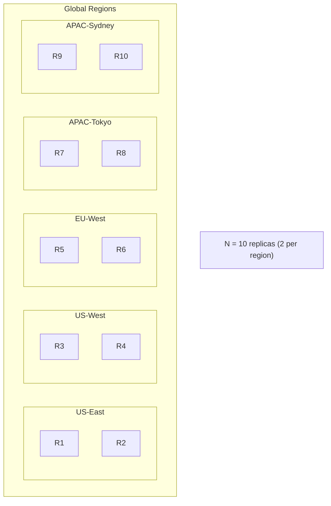
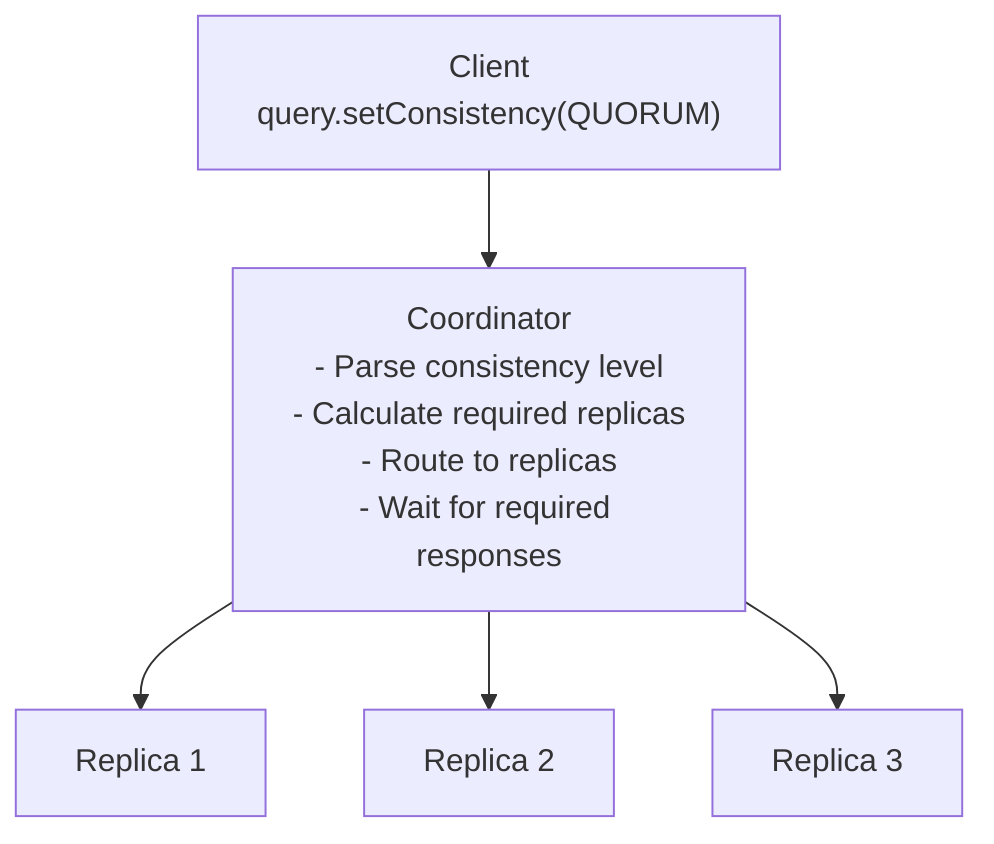

# ⚖️ Quorum Systems

## 0️⃣ Prerequisites

Before diving into quorum systems, you should understand:

- **Replication**: Copying data across multiple nodes for availability and durability
- **Consistency vs Availability**: The tradeoff between all nodes agreeing (consistency) and the system responding (availability)
- **Network Partitions**: When network failures prevent some nodes from communicating
- **Split Brain**: When multiple partitions independently make decisions (covered in Topic 11)

**Quick refresher**: When you replicate data across multiple nodes, you face a question: how many nodes must acknowledge a write before it's considered successful? How many nodes must you read from to get the latest data? Quorum systems answer these questions with mathematical guarantees.

---

## 1️⃣ What Problem Does This Exist to Solve?

### The Specific Pain Point

Imagine you have 5 database replicas for fault tolerance. A client writes `x = 100`. Questions arise:

**How many replicas must acknowledge the write?**
- 1 replica? Fast, but data might be lost if that replica fails
- All 5? Safe, but unavailable if any replica is down
- Something in between?

**How many replicas must you read from?**
- 1 replica? Fast, but might return stale data
- All 5? Guaranteed fresh, but unavailable if any is down
- Something in between?

**The core problem**: Balancing consistency, availability, and performance in replicated systems.

### What Systems Looked Like Before

**Era 1: Single Master**
- All writes to one node
- Reads from any replica
- Simple but master is bottleneck and SPOF

**Era 2: Write-All, Read-One**
- Write to all replicas
- Read from any one
- Consistent but unavailable during any failure

**Era 3: Write-One, Read-All**
- Write to any one replica
- Read from all and take latest
- Available for writes but slow reads

**Era 4: Quorum Systems**
- Write to W replicas
- Read from R replicas
- Tunable consistency and availability

### What Breaks Without Quorum

| Scenario | Without Quorum | With Quorum |
|----------|---------------|-------------|
| Node failure | May lose data or availability | Continues with remaining nodes |
| Stale reads | Possible if reading from lagging replica | Guaranteed fresh if R + W > N |
| Split brain | Multiple conflicting writes | Only majority can write |
| Performance | Fixed latency | Tunable based on R and W |

### Real Examples of the Problem

**Amazon DynamoDB**: Uses quorum-based replication with configurable consistency. Strong consistency reads require quorum, eventual consistency reads can use any replica.

**Apache Cassandra**: NRW quorum system where operators configure N (replicas), R (read quorum), W (write quorum) per query.

**Google Spanner**: Uses Paxos (quorum-based consensus) for global consistency with TrueTime for ordering.

---

## 2️⃣ Intuition and Mental Model

### The Voting Analogy

Think of quorum like voting in a committee:

**Committee of 5 members** (5 replicas):
- A decision requires majority vote (quorum = 3)
- If 3 members agree, decision passes
- Minority (2 members) cannot override majority

**For writes**:
- "I propose we set x = 100"
- Need 3 votes (write quorum) to approve
- Once approved, x = 100 is official

**For reads**:
- "What is the current value of x?"
- Ask 3 members (read quorum)
- At least one will know the latest value
- Why? Because 3 + 3 = 6 > 5, so read and write sets must overlap

### The Overlap Principle

The key insight of quorum systems is **overlap**:

```
5 replicas: [A, B, C, D, E]

Write quorum (W=3): Must write to any 3
Read quorum (R=3): Must read from any 3

If we wrote to [A, B, C] and read from [C, D, E]:
- Overlap: C
- C has the latest value
- Read returns fresh data

R + W > N guarantees at least one node has latest data
```

### The NRW Model

**N** = Total number of replicas
**R** = Read quorum (replicas to read from)
**W** = Write quorum (replicas to write to)

**Consistency guarantee**: If R + W > N, reads see latest writes

```
N = 5 replicas

Strong consistency: R=3, W=3 (3+3=6 > 5) ✓
Weaker consistency: R=1, W=3 (1+3=4 < 5) ✗
Also strong:        R=4, W=2 (4+2=6 > 5) ✓
```

---

## 3️⃣ How It Works Internally

### Basic Quorum Mathematics

**Quorum size for N replicas**:
```
Majority quorum = floor(N/2) + 1

N=3: quorum = 2
N=5: quorum = 3
N=7: quorum = 4
```

**Why majority?**
- Two majorities must overlap
- Can't have two disjoint majorities
- Prevents split brain

**Consistency condition**:
```
R + W > N

This ensures read set and write set overlap by at least one node.
That overlapping node has the latest write.
```

### Read/Write Quorum Configurations

| Configuration | R | W | R+W | Consistency | Use Case |
|--------------|---|---|-----|-------------|----------|
| Strong read  | N | 1 | N+1 | Strong | Read-heavy, can tolerate slow reads |
| Strong write | 1 | N | N+1 | Strong | Write-heavy, fast reads |
| Balanced     | ⌈(N+1)/2⌉ | ⌈(N+1)/2⌉ | N+1 | Strong | Balanced workload |
| Fast read    | 1 | N | N+1 | Strong | Read performance critical |
| Fast write   | N | 1 | N+1 | Strong | Write performance critical |
| Eventual     | 1 | 1 | 2 | Eventual | Maximum availability |

### Version Vectors and Conflict Resolution

When multiple writes happen concurrently, we need to track versions:

**Version Vector**:
```java
class VersionVector {
    Map<String, Long> versions;  // nodeId -> version
    
    // Increment version for this node
    void increment(String nodeId) {
        versions.merge(nodeId, 1L, Long::sum);
    }
    
    // Compare two version vectors
    Comparison compare(VersionVector other) {
        boolean thisNewer = false;
        boolean otherNewer = false;
        
        for (String node : union(versions.keySet(), other.versions.keySet())) {
            long thisV = versions.getOrDefault(node, 0L);
            long otherV = other.versions.getOrDefault(node, 0L);
            
            if (thisV > otherV) thisNewer = true;
            if (otherV > thisV) otherNewer = true;
        }
        
        if (thisNewer && !otherNewer) return NEWER;
        if (otherNewer && !thisNewer) return OLDER;
        if (thisNewer && otherNewer) return CONCURRENT;
        return EQUAL;
    }
}
```

**Conflict resolution strategies**:
1. **Last-write-wins (LWW)**: Timestamp-based, simple but may lose data
2. **Version vectors**: Detect conflicts, let application resolve
3. **CRDTs**: Conflict-free data types that auto-merge

### Sloppy Quorum and Hinted Handoff

**Problem**: Strict quorum requires specific replicas. If they're unavailable, writes fail.

**Sloppy quorum**: Write to any W nodes, not necessarily the designated replicas.

```
Normal quorum for key K:
Designated replicas: [A, B, C]
Write to any 2 of [A, B, C]

Sloppy quorum:
A and B are down
Write to C + D + E (D and E are "hints")
D and E store data temporarily
When A and B recover, D and E "hand off" data to them
```

**Hinted handoff**:
```java
class HintedHandoff {
    // Store hint when designated replica is unavailable
    void storeHint(String targetNode, String key, byte[] value, long timestamp) {
        Hint hint = new Hint(targetNode, key, value, timestamp);
        hintStore.save(hint);
    }
    
    // Periodically try to deliver hints
    void deliverHints() {
        for (Hint hint : hintStore.getPendingHints()) {
            if (isNodeAvailable(hint.targetNode)) {
                boolean delivered = sendToNode(hint.targetNode, hint);
                if (delivered) {
                    hintStore.delete(hint);
                }
            }
        }
    }
}
```

**Tradeoff**: Sloppy quorum improves availability but weakens consistency guarantees.

### Read Repair

When reading from multiple replicas, some may have stale data. **Read repair** fixes this:

```java
class ReadRepair {
    Value readWithRepair(String key, int readQuorum) {
        // Read from R replicas
        List<VersionedValue> responses = readFromReplicas(key, readQuorum);
        
        // Find the latest version
        VersionedValue latest = findLatest(responses);
        
        // Repair replicas with stale data
        for (VersionedValue response : responses) {
            if (response.version < latest.version) {
                // This replica has stale data, repair it
                repairReplica(response.replicaId, key, latest);
            }
        }
        
        return latest.value;
    }
}
```

---

## 4️⃣ Simulation-First Explanation

Let's simulate quorum operations step by step.

### Setup

```
5 replicas: [A, B, C, D, E]
N = 5, R = 3, W = 3
R + W = 6 > 5 (strong consistency)
```

### Scenario 1: Normal Write

```
Client: Write x = 100

Step 1: Client sends write to coordinator (any node)
        Coordinator: Node A

Step 2: A determines replicas for key "x"
        Using consistent hashing: [A, B, C]

Step 3: A sends write request to A, B, C
        A: Write x = 100, version 1 → ACK
        B: Write x = 100, version 1 → ACK
        C: Write x = 100, version 1 → ACK

Step 4: A received 3 ACKs (W=3 satisfied)
        A responds to client: Write successful

State after write:
A.x = 100 (v1)
B.x = 100 (v1)
C.x = 100 (v1)
D.x = (none)
E.x = (none)
```

### Scenario 2: Normal Read

```
Client: Read x

Step 1: Client sends read to coordinator
        Coordinator: Node D

Step 2: D sends read request to R=3 replicas
        D asks: A, B, C (or any 3 nodes)

Step 3: Responses arrive
        A: x = 100 (v1)
        B: x = 100 (v1)
        C: x = 100 (v1)

Step 4: D compares versions, all same
        D responds to client: x = 100
```

### Scenario 3: Read During Write

```
Timeline:
T1: Client 1 starts writing x = 200
T2: Client 2 reads x (before write completes)

T1: Write x = 200 in progress
    A: Received, ACK (x = 200, v2)
    B: Not yet received (x = 100, v1)
    C: Not yet received (x = 100, v1)

T2: Read x with R=3
    Read from A, B, C:
    A: x = 200 (v2)
    B: x = 100 (v1)
    C: x = 100 (v1)
    
    Coordinator sees v2 > v1
    Returns x = 200 (latest)
    
    Also performs read repair:
    Sends x = 200 (v2) to B and C
```

### Scenario 4: Replica Failure During Write

```
Client: Write x = 300

Step 1: Coordinator A sends to A, B, C
        A: ACK (x = 300, v3)
        B: ACK (x = 300, v3)
        C: TIMEOUT (node down)

Step 2: Only 2 ACKs received, need W=3
        
Option A (Strict quorum): 
        Fail the write, return error to client

Option B (Sloppy quorum):
        Send to D as temporary holder
        D: ACK (x = 300, v3, hint for C)
        3 ACKs received, write succeeds
        When C recovers, D hands off data
```

### Scenario 5: Network Partition

```
Partition: [A, B] | [C, D, E]

Write x = 400 arrives at partition [A, B]:
    A sends to A, B, C
    A: ACK
    B: ACK
    C: UNREACHABLE
    
    Only 2 ACKs, W=3 not satisfied
    Write FAILS (correct behavior)

Write x = 500 arrives at partition [C, D, E]:
    C sends to C, D, E
    C: ACK
    D: ACK
    E: ACK
    
    3 ACKs, W=3 satisfied
    Write SUCCEEDS

Result: Majority partition [C, D, E] can operate
        Minority partition [A, B] cannot write
        No split brain!
```

---

## 5️⃣ How Engineers Actually Use This in Production

### Apache Cassandra

**NRW Configuration**:
```yaml
# cassandra.yaml
replication_factor: 3  # N

# Per-query consistency levels
# ONE, TWO, THREE, QUORUM, ALL, LOCAL_QUORUM, EACH_QUORUM
```

**Usage in code**:
```java
// Strong consistency: QUORUM for both read and write
Statement write = QueryBuilder.insertInto("users")
    .value("id", userId)
    .value("name", name)
    .setConsistencyLevel(ConsistencyLevel.QUORUM);

Statement read = QueryBuilder.select().from("users")
    .where(QueryBuilder.eq("id", userId))
    .setConsistencyLevel(ConsistencyLevel.QUORUM);

// Eventual consistency: ONE for fast reads
Statement fastRead = QueryBuilder.select().from("users")
    .where(QueryBuilder.eq("id", userId))
    .setConsistencyLevel(ConsistencyLevel.ONE);
```

**Cassandra's quorum calculation**:
```
QUORUM = floor(replication_factor / 2) + 1

RF=3: QUORUM = 2
RF=5: QUORUM = 3

LOCAL_QUORUM: Quorum within local datacenter
EACH_QUORUM: Quorum in each datacenter
```

### Amazon DynamoDB

**Consistency options**:
- **Eventually consistent reads**: Read from any replica (fast)
- **Strongly consistent reads**: Read from quorum (slower, fresher)

```java
// Eventually consistent (default)
GetItemRequest request = GetItemRequest.builder()
    .tableName("Users")
    .key(Map.of("userId", AttributeValue.builder().s(userId).build()))
    .build();

// Strongly consistent
GetItemRequest strongRequest = GetItemRequest.builder()
    .tableName("Users")
    .key(Map.of("userId", AttributeValue.builder().s(userId).build()))
    .consistentRead(true)  // Quorum read
    .build();
```

**DynamoDB's approach**:
- Always writes to quorum (W = majority)
- Eventual reads from single replica
- Strong reads from quorum

### Riak

**Configurable NRW per bucket**:
```erlang
%% Bucket properties
{n_val, 3},        %% N: number of replicas
{r, 2},            %% R: read quorum
{w, 2},            %% W: write quorum
{pr, 1},           %% Primary read quorum
{pw, 1},           %% Primary write quorum
{dw, 2}            %% Durable write quorum
```

**Riak's sloppy quorum**:
- Writes to any W nodes (not necessarily primary replicas)
- Hinted handoff when primary is unavailable
- Configurable with `pr` and `pw` for strict primary quorum

### Production Lessons

**Netflix's Cassandra Usage**:
- LOCAL_QUORUM for writes (durability within region)
- LOCAL_ONE for reads (performance)
- Accept eventual consistency for non-critical data

**Discord's Cassandra Tuning**:
- RF=3 across availability zones
- QUORUM writes for messages
- ONE reads for message history (eventual consistency OK)

**Uber's Schemaless (MySQL-based)**:
- Custom quorum implementation
- W=2 out of 3 replicas
- Async replication to third replica

---

## 6️⃣ How to Implement or Apply It

### Implementation: Basic Quorum System

```java
package com.example.quorum;

import java.util.*;
import java.util.concurrent.*;

/**
 * Basic quorum system implementation.
 * 
 * Demonstrates NRW quorum with version vectors.
 */
public class QuorumSystem {
    
    private final int n;  // Total replicas
    private final int r;  // Read quorum
    private final int w;  // Write quorum
    private final List<Replica> replicas;
    private final ExecutorService executor;
    
    public QuorumSystem(int n, int r, int w) {
        if (r + w <= n) {
            throw new IllegalArgumentException(
                "R + W must be > N for strong consistency");
        }
        
        this.n = n;
        this.r = r;
        this.w = w;
        this.replicas = new ArrayList<>();
        this.executor = Executors.newFixedThreadPool(n);
        
        // Initialize replicas
        for (int i = 0; i < n; i++) {
            replicas.add(new Replica("replica-" + i));
        }
    }
    
    /**
     * Write with quorum.
     * 
     * @return true if write quorum achieved
     */
    public boolean write(String key, String value) {
        // Generate new version
        long version = System.currentTimeMillis();
        VersionedValue vv = new VersionedValue(value, version);
        
        // Send write to all replicas
        List<Future<Boolean>> futures = new ArrayList<>();
        for (Replica replica : replicas) {
            futures.add(executor.submit(() -> replica.write(key, vv)));
        }
        
        // Wait for W acknowledgments
        int acks = 0;
        for (Future<Boolean> future : futures) {
            try {
                if (future.get(1, TimeUnit.SECONDS)) {
                    acks++;
                    if (acks >= w) {
                        return true;  // Quorum achieved
                    }
                }
            } catch (Exception e) {
                // Replica failed or timed out
            }
        }
        
        return acks >= w;
    }
    
    /**
     * Read with quorum.
     * 
     * @return Latest value or null if quorum not achieved
     */
    public String read(String key) {
        // Read from all replicas
        List<Future<VersionedValue>> futures = new ArrayList<>();
        for (Replica replica : replicas) {
            futures.add(executor.submit(() -> replica.read(key)));
        }
        
        // Collect R responses
        List<VersionedValue> responses = new ArrayList<>();
        for (Future<VersionedValue> future : futures) {
            try {
                VersionedValue vv = future.get(1, TimeUnit.SECONDS);
                if (vv != null) {
                    responses.add(vv);
                    if (responses.size() >= r) {
                        break;  // Got enough responses
                    }
                }
            } catch (Exception e) {
                // Replica failed or timed out
            }
        }
        
        if (responses.size() < r) {
            return null;  // Quorum not achieved
        }
        
        // Find latest version
        VersionedValue latest = responses.stream()
            .max(Comparator.comparingLong(vv -> vv.version))
            .orElse(null);
        
        // Read repair: update stale replicas
        if (latest != null) {
            readRepair(key, latest, responses);
        }
        
        return latest != null ? latest.value : null;
    }
    
    /**
     * Read repair: update replicas with stale data.
     */
    private void readRepair(String key, VersionedValue latest, 
                           List<VersionedValue> responses) {
        for (VersionedValue response : responses) {
            if (response.version < latest.version) {
                // Find and repair this replica
                // In real implementation, track which replica gave which response
            }
        }
    }
    
    /**
     * Get quorum status for monitoring.
     */
    public QuorumStatus getStatus() {
        int available = 0;
        for (Replica replica : replicas) {
            if (replica.isAvailable()) {
                available++;
            }
        }
        
        return new QuorumStatus(
            n, r, w, available,
            available >= r,  // Can read
            available >= w   // Can write
        );
    }
}

/**
 * Single replica in the quorum system.
 */
class Replica {
    private final String id;
    private final Map<String, VersionedValue> data;
    private volatile boolean available;
    
    Replica(String id) {
        this.id = id;
        this.data = new ConcurrentHashMap<>();
        this.available = true;
    }
    
    boolean write(String key, VersionedValue value) {
        if (!available) {
            throw new RuntimeException("Replica unavailable");
        }
        
        // Only write if version is newer
        data.compute(key, (k, existing) -> {
            if (existing == null || value.version > existing.version) {
                return value;
            }
            return existing;
        });
        
        return true;
    }
    
    VersionedValue read(String key) {
        if (!available) {
            throw new RuntimeException("Replica unavailable");
        }
        return data.get(key);
    }
    
    boolean isAvailable() {
        return available;
    }
    
    void setAvailable(boolean available) {
        this.available = available;
    }
}

class VersionedValue {
    final String value;
    final long version;
    
    VersionedValue(String value, long version) {
        this.value = value;
        this.version = version;
    }
}

record QuorumStatus(int n, int r, int w, int available, 
                    boolean canRead, boolean canWrite) {}
```

### Implementation: Sloppy Quorum with Hinted Handoff

```java
package com.example.quorum;

import java.util.*;
import java.util.concurrent.*;

/**
 * Sloppy quorum with hinted handoff.
 * 
 * Improves availability by accepting writes to any W nodes,
 * not just the designated replicas.
 */
public class SloppyQuorumSystem {
    
    private final int n;
    private final int w;
    private final List<Node> allNodes;
    private final ConsistentHash<Node> ring;
    private final Map<Node, Queue<Hint>> hintQueues;
    private final ScheduledExecutorService hintDelivery;
    
    public SloppyQuorumSystem(int n, int w, List<Node> allNodes) {
        this.n = n;
        this.w = w;
        this.allNodes = allNodes;
        this.ring = new ConsistentHash<>(allNodes);
        this.hintQueues = new ConcurrentHashMap<>();
        this.hintDelivery = Executors.newScheduledThreadPool(1);
        
        // Initialize hint queues
        for (Node node : allNodes) {
            hintQueues.put(node, new ConcurrentLinkedQueue<>());
        }
        
        // Start hint delivery background task
        hintDelivery.scheduleAtFixedRate(
            this::deliverHints, 10, 10, TimeUnit.SECONDS);
    }
    
    /**
     * Write with sloppy quorum.
     * 
     * If designated replicas are unavailable, write to other nodes
     * with hints for later delivery.
     */
    public boolean write(String key, String value, long version) {
        // Get designated replicas
        List<Node> designated = ring.getNodes(key, n);
        
        // Try to write to designated replicas first
        int acks = 0;
        List<Node> unavailable = new ArrayList<>();
        
        for (Node node : designated) {
            try {
                if (node.write(key, value, version)) {
                    acks++;
                }
            } catch (Exception e) {
                unavailable.add(node);
            }
        }
        
        // If not enough acks, use sloppy quorum
        if (acks < w && !unavailable.isEmpty()) {
            // Find other available nodes
            List<Node> others = new ArrayList<>(allNodes);
            others.removeAll(designated);
            Collections.shuffle(others);
            
            for (Node node : others) {
                if (acks >= w) break;
                
                try {
                    // Write with hint
                    Node targetNode = unavailable.get(0);
                    unavailable.remove(0);
                    
                    if (node.writeWithHint(key, value, version, targetNode.getId())) {
                        acks++;
                        // Store hint for later delivery
                        Hint hint = new Hint(targetNode, key, value, version);
                        hintQueues.get(node).add(hint);
                    }
                } catch (Exception e) {
                    // This node also unavailable
                }
            }
        }
        
        return acks >= w;
    }
    
    /**
     * Deliver hints to recovered nodes.
     */
    private void deliverHints() {
        for (Map.Entry<Node, Queue<Hint>> entry : hintQueues.entrySet()) {
            Node hintHolder = entry.getKey();
            Queue<Hint> hints = entry.getValue();
            
            Iterator<Hint> iter = hints.iterator();
            while (iter.hasNext()) {
                Hint hint = iter.next();
                
                try {
                    if (hint.targetNode.isAvailable()) {
                        // Deliver hint
                        hint.targetNode.write(hint.key, hint.value, hint.version);
                        // Remove from hint holder
                        hintHolder.deleteHint(hint.key, hint.version);
                        iter.remove();
                        
                        System.out.println("Delivered hint for key " + hint.key + 
                            " to " + hint.targetNode.getId());
                    }
                } catch (Exception e) {
                    // Target still unavailable, keep hint
                }
            }
        }
    }
}

class Node {
    private final String id;
    private final Map<String, VersionedValue> data;
    private final Map<String, VersionedValue> hints;  // Hints for other nodes
    private volatile boolean available;
    
    Node(String id) {
        this.id = id;
        this.data = new ConcurrentHashMap<>();
        this.hints = new ConcurrentHashMap<>();
        this.available = true;
    }
    
    String getId() { return id; }
    boolean isAvailable() { return available; }
    
    boolean write(String key, String value, long version) {
        if (!available) throw new RuntimeException("Unavailable");
        data.put(key, new VersionedValue(value, version));
        return true;
    }
    
    boolean writeWithHint(String key, String value, long version, String targetNodeId) {
        if (!available) throw new RuntimeException("Unavailable");
        String hintKey = targetNodeId + ":" + key;
        hints.put(hintKey, new VersionedValue(value, version));
        return true;
    }
    
    void deleteHint(String key, long version) {
        hints.entrySet().removeIf(e -> 
            e.getKey().endsWith(":" + key) && e.getValue().version == version);
    }
}

class Hint {
    final Node targetNode;
    final String key;
    final String value;
    final long version;
    
    Hint(Node targetNode, String key, String value, long version) {
        this.targetNode = targetNode;
        this.key = key;
        this.value = value;
        this.version = version;
    }
}
```

### Implementation: Cassandra-Style Consistency Levels

```java
package com.example.quorum;

/**
 * Cassandra-style consistency levels.
 */
public enum ConsistencyLevel {
    ONE(1, 1),           // Single replica
    TWO(2, 2),           // Two replicas
    THREE(3, 3),         // Three replicas
    QUORUM(-1, -1),      // Majority of replicas
    ALL(-2, -2),         // All replicas
    LOCAL_QUORUM(-3, -3), // Majority in local DC
    EACH_QUORUM(-4, -4);  // Majority in each DC
    
    private final int readReplicas;
    private final int writeReplicas;
    
    ConsistencyLevel(int read, int write) {
        this.readReplicas = read;
        this.writeReplicas = write;
    }
    
    /**
     * Calculate actual replica count based on replication factor.
     */
    public int getReadReplicas(int replicationFactor) {
        return switch (this) {
            case ONE -> 1;
            case TWO -> 2;
            case THREE -> 3;
            case QUORUM -> (replicationFactor / 2) + 1;
            case ALL -> replicationFactor;
            case LOCAL_QUORUM -> (replicationFactor / 2) + 1; // Simplified
            case EACH_QUORUM -> (replicationFactor / 2) + 1;  // Simplified
        };
    }
    
    public int getWriteReplicas(int replicationFactor) {
        return getReadReplicas(replicationFactor);  // Same logic
    }
}

/**
 * Query with configurable consistency.
 */
public class ConsistentQuery {
    
    private final QuorumSystem quorum;
    private final int replicationFactor;
    
    public ConsistentQuery(QuorumSystem quorum, int replicationFactor) {
        this.quorum = quorum;
        this.replicationFactor = replicationFactor;
    }
    
    public String read(String key, ConsistencyLevel level) {
        int r = level.getReadReplicas(replicationFactor);
        return quorum.readWithQuorum(key, r);
    }
    
    public boolean write(String key, String value, ConsistencyLevel level) {
        int w = level.getWriteReplicas(replicationFactor);
        return quorum.writeWithQuorum(key, value, w);
    }
}
```

### Usage Example

```java
package com.example.quorum;

public class QuorumExample {
    
    public static void main(String[] args) {
        // Create quorum system: N=5, R=3, W=3
        QuorumSystem quorum = new QuorumSystem(5, 3, 3);
        
        // Write with quorum
        boolean writeSuccess = quorum.write("user:123", "John Doe");
        System.out.println("Write success: " + writeSuccess);
        
        // Read with quorum
        String value = quorum.read("user:123");
        System.out.println("Read value: " + value);
        
        // Check quorum status
        QuorumStatus status = quorum.getStatus();
        System.out.println("Quorum status: " + status);
        
        // Simulate replica failure
        System.out.println("\nSimulating 2 replica failures...");
        // In real implementation, mark replicas as unavailable
        
        // Check if we can still operate
        status = quorum.getStatus();
        System.out.println("Can read: " + status.canRead());
        System.out.println("Can write: " + status.canWrite());
    }
}
```

---

## 7️⃣ Tradeoffs, Pitfalls, and Common Mistakes

### Tradeoffs

| Configuration | Pros | Cons |
|--------------|------|------|
| R=1, W=N | Fast reads | Slow writes, unavailable if any node down |
| R=N, W=1 | Fast writes | Slow reads, unavailable if any node down |
| R=W=⌈(N+1)/2⌉ | Balanced | Moderate latency for both |
| R=1, W=1 | Fast, available | Eventual consistency only |

### Latency Implications

```
Write latency = max(W slowest replicas)
Read latency = max(R slowest replicas)

Example with 5 replicas, latencies: [10ms, 20ms, 50ms, 100ms, 200ms]

W=1: Write latency = 10ms (fastest)
W=3: Write latency = 50ms (3rd fastest)
W=5: Write latency = 200ms (slowest)
```

### Common Mistakes

**1. R + W ≤ N**
```java
// BAD: No overlap guarantee
int n = 5, r = 2, w = 2;  // 2 + 2 = 4 ≤ 5

// Read set: [A, B]
// Write set: [C, D]
// No overlap! Stale read possible

// GOOD: Ensure overlap
int n = 5, r = 3, w = 3;  // 3 + 3 = 6 > 5
```

**2. Ignoring Latency Tail**
```java
// BAD: Wait for all W responses
List<Response> responses = waitForAll(writeRequests);

// GOOD: Wait for W responses, not all
int acks = 0;
for (Future<Response> future : futures) {
    if (future.get(timeout)) {
        acks++;
        if (acks >= w) return SUCCESS;
    }
}
```

**3. Not Handling Version Conflicts**
```java
// BAD: Just return first response
return responses.get(0).value;

// GOOD: Compare versions, return latest
return responses.stream()
    .max(Comparator.comparing(r -> r.version))
    .map(r -> r.value)
    .orElse(null);
```

**4. Sloppy Quorum Without Limits**
```java
// BAD: Accept hints indefinitely
hintQueue.add(hint);  // Queue grows forever

// GOOD: Limit hint storage
if (hintQueue.size() < MAX_HINTS) {
    hintQueue.add(hint);
} else {
    // Reject write or drop oldest hints
}
```

### Performance Gotchas

**Coordinator Bottleneck**: All requests go through coordinator. Distribute coordinator role.

**Read Repair Overhead**: Every read triggers repair. Consider probabilistic read repair.

**Version Vector Growth**: Version vectors grow with number of writers. Prune periodically.

---

## 8️⃣ When NOT to Use This

### Skip Quorum When

**Single Region, Low Latency Required**
- Synchronous replication adds latency
- Consider async replication with single leader
- Accept potential data loss on failure

**Strong Ordering Required**
- Quorum doesn't guarantee order
- Use consensus (Raft/Paxos) for ordered operations
- Or single leader with log replication

**Simple Read-Heavy Workload**
- Single leader with read replicas
- Reads from any replica
- Writes only to leader

**Cost Sensitive**
- Quorum requires multiple replicas
- Minimum 3 for meaningful quorum
- Consider single node with backups

### Alternatives

| Need | Alternative |
|------|-------------|
| Strong ordering | Raft/Paxos consensus |
| Simple replication | Primary-secondary |
| Maximum availability | Eventual consistency |
| Cost optimization | Single node + backup |

---

## 9️⃣ Comparison with Alternatives

### Quorum vs Consensus (Raft/Paxos)

| Aspect | Quorum | Consensus |
|--------|--------|-----------|
| Ordering | No guarantee | Total order |
| Complexity | Lower | Higher |
| Latency | Lower (parallel) | Higher (sequential) |
| Use case | Key-value stores | Log replication |

### Quorum vs Primary-Secondary

| Aspect | Quorum | Primary-Secondary |
|--------|--------|-------------------|
| Write path | Multiple replicas | Single primary |
| Read consistency | Configurable | Depends on replica lag |
| Failover | Automatic (if quorum) | Requires election |
| Complexity | Higher | Lower |

### Strict vs Sloppy Quorum

| Aspect | Strict | Sloppy |
|--------|--------|--------|
| Availability | Lower | Higher |
| Consistency | Stronger | Weaker |
| Complexity | Lower | Higher (hints) |
| Use case | Strong consistency | High availability |

---

## 🔟 Interview Follow-up Questions WITH Answers

### L4 (Entry Level) Questions

**Q1: What is a quorum and why is it important?**

**A**: A quorum is the minimum number of nodes that must participate in an operation for it to be considered successful. In distributed systems, quorum ensures consistency and prevents split brain.

**Why it's important**:
1. **Consistency**: If R + W > N, reads always see latest writes
2. **Availability**: Can tolerate (N - W) write failures and (N - R) read failures
3. **Split brain prevention**: Majority quorum ensures only one partition can operate

**Example**:
```
5 replicas, quorum = 3 (majority)

Write to 3 replicas: [A, B, C] have new value
Read from 3 replicas: [B, C, D]
Overlap: B and C have new value
Read returns fresh data
```

---

**Q2: Explain the NRW notation.**

**A**: NRW describes quorum configuration:
- **N**: Total number of replicas for each piece of data
- **R**: Number of replicas to read from (read quorum)
- **W**: Number of replicas that must acknowledge a write (write quorum)

**Consistency rule**: R + W > N guarantees strong consistency

**Examples**:
```
N=3, R=2, W=2: Strong consistency (2+2=4 > 3)
N=3, R=1, W=3: Strong consistency, fast reads
N=3, R=3, W=1: Strong consistency, fast writes
N=3, R=1, W=1: Eventual consistency (1+1=2 ≤ 3)
```

**Tradeoffs**:
- Higher W: More durable writes, slower, less available
- Higher R: Fresher reads, slower, less available
- Lower R/W: Faster, more available, less consistent

---

### L5 (Mid Level) Questions

**Q3: Explain sloppy quorum and hinted handoff.**

**A**: Sloppy quorum improves availability by relaxing which nodes can accept writes.

**Strict quorum**:
- Write must go to designated replicas
- If designated replicas unavailable, write fails

**Sloppy quorum**:
- Write can go to any W available nodes
- If designated replica unavailable, another node accepts temporarily
- That node stores a "hint" to forward data later

**Hinted handoff**:
```
1. Key K should be on [A, B, C]
2. A is down
3. Write goes to B, C, and D (D is not designated)
4. D stores data with hint: "This belongs to A"
5. Background process checks if A is back
6. When A recovers, D sends data to A
7. D deletes its copy
```

**Tradeoffs**:
- Pro: Higher availability during failures
- Con: Weaker consistency guarantees
- Con: Complexity of hint management
- Con: Hints can accumulate if node is down long

**When to use**:
- Availability is more important than consistency
- Failures are typically short-lived
- Can tolerate temporary inconsistency

---

**Q4: How do you handle read repair and anti-entropy?**

**A**: Both mechanisms ensure replicas converge to the same state.

**Read repair**:
- Happens during normal reads
- When reading from R replicas, compare versions
- If some replicas have stale data, update them
- Passive: Only repairs data that's read

```java
List<Response> responses = readFromReplicas(key, R);
Response latest = findLatest(responses);

for (Response r : responses) {
    if (r.version < latest.version) {
        // Repair this replica
        writeToReplica(r.replica, key, latest.value, latest.version);
    }
}

return latest.value;
```

**Anti-entropy**:
- Background process
- Periodically compares replicas
- Repairs all differences, not just read data
- Active: Repairs all data

```java
// Anti-entropy process
void runAntiEntropy() {
    for (String key : allKeys()) {
        List<VersionedValue> values = readFromAllReplicas(key);
        VersionedValue latest = findLatest(values);
        
        for (Replica replica : replicas) {
            if (replica.getVersion(key) < latest.version) {
                replica.write(key, latest);
            }
        }
    }
}
```

**Comparison**:
| Aspect | Read Repair | Anti-Entropy |
|--------|-------------|--------------|
| Trigger | On read | Background |
| Coverage | Read data only | All data |
| Overhead | Per-read | Scheduled |
| Latency impact | Adds to read | None |

---

### L6 (Senior Level) Questions

**Q5: Design a quorum system for a global database with replicas in 5 regions.**

**A**: Global quorum requires careful design to balance latency, consistency, and availability.

**Architecture**:


<details>
<summary>ASCII diagram (reference)</summary>

```text
┌─────────────────────────────────────────────────────────────┐
│                     Global Regions                           │
│                                                              │
│  US-East     US-West     EU-West    APAC-Tokyo  APAC-Sydney │
│  ┌─────┐     ┌─────┐     ┌─────┐     ┌─────┐     ┌─────┐   │
│  │R1,R2│     │R3,R4│     │R5,R6│     │R7,R8│     │R9,R10│  │
│  └─────┘     └─────┘     └─────┘     └─────┘     └─────┘   │
│                                                              │
│  N = 10 replicas (2 per region)                             │
└─────────────────────────────────────────────────────────────┘
```
</details>

**Design Decisions**:

**1. Hierarchical quorum**
```java
// Global quorum: Majority of regions
int globalQuorum = 3;  // 3 of 5 regions

// Local quorum: Majority within region
int localQuorum = 2;   // 2 of 2 replicas

// Write: LOCAL_QUORUM in globalQuorum regions
// Read: LOCAL_QUORUM in any region (for eventual)
//       Or LOCAL_QUORUM in globalQuorum regions (for strong)
```

**2. Consistency levels**
```java
enum GlobalConsistency {
    LOCAL_ONE,      // 1 replica in local region
    LOCAL_QUORUM,   // Majority in local region
    GLOBAL_QUORUM,  // Majority of regions, local quorum each
    ALL             // All replicas
}

int getWriteReplicas(GlobalConsistency level, String localRegion) {
    return switch (level) {
        case LOCAL_ONE -> 1;
        case LOCAL_QUORUM -> 2;  // Local region only
        case GLOBAL_QUORUM -> 6; // 3 regions × 2 replicas
        case ALL -> 10;
    };
}
```

**3. Latency optimization**
```java
// Write to local region first (fast)
// Then async replicate to other regions
// But wait for global quorum before acknowledging

CompletableFuture<Boolean> write(String key, String value) {
    // Phase 1: Local write (fast)
    CompletableFuture<Boolean> local = writeToLocalRegion(key, value);
    
    // Phase 2: Global replication (parallel)
    List<CompletableFuture<Boolean>> remotes = new ArrayList<>();
    for (Region region : otherRegions) {
        remotes.add(writeToRegion(region, key, value));
    }
    
    // Wait for global quorum
    return waitForQuorum(local, remotes, globalQuorum);
}
```

**4. Conflict resolution**
```java
// Use vector clocks for conflict detection
class GlobalVersionVector {
    Map<String, Long> regionVersions;  // region -> version
    
    ConflictResult compare(GlobalVersionVector other) {
        // Compare version vectors
        // Detect concurrent writes from different regions
    }
}

// Resolution strategies:
// 1. Last-write-wins (simple, may lose data)
// 2. Application-specific merge
// 3. Store all versions, let client resolve
```

**5. Partition handling**
```java
// If can't reach global quorum, options:
// 1. Reject write (strong consistency)
// 2. Accept locally, reconcile later (availability)
// 3. Degrade to local-only mode with warning

void handlePartition() {
    if (canReachGlobalQuorum()) {
        normalOperation();
    } else if (canReachLocalQuorum()) {
        // Degrade to local mode
        acceptLocalWrites();
        queueForGlobalSync();
    } else {
        rejectWrites();
    }
}
```

---

**Q6: How would you implement tunable consistency in a production database?**

**A**: Tunable consistency allows per-query consistency level selection.

**Architecture**:


<details>
<summary>ASCII diagram (reference)</summary>

```text
┌─────────────────────────────────────────────────────────────┐
│                      Client                                  │
│  query.setConsistency(QUORUM)                               │
└─────────────────────────────────────────────────────────────┘
                          │
                          ▼
┌─────────────────────────────────────────────────────────────┐
│                    Coordinator                               │
│  - Parse consistency level                                   │
│  - Calculate required replicas                               │
│  - Route to replicas                                         │
│  - Wait for required responses                               │
└─────────────────────────────────────────────────────────────┘
                          │
          ┌───────────────┼───────────────┐
          ▼               ▼               ▼
     ┌─────────┐     ┌─────────┐     ┌─────────┐
     │Replica 1│     │Replica 2│     │Replica 3│
     └─────────┘     └─────────┘     └─────────┘
```
</details>

**Implementation**:

```java
public class TunableConsistencyCoordinator {
    
    private final List<Replica> replicas;
    private final int replicationFactor;
    
    /**
     * Execute read with specified consistency.
     */
    public ReadResult read(String key, ConsistencyLevel consistency) {
        int required = getRequiredReplicas(consistency, replicationFactor);
        
        // Send read to all replicas
        List<CompletableFuture<VersionedValue>> futures = replicas.stream()
            .map(r -> CompletableFuture.supplyAsync(() -> r.read(key)))
            .toList();
        
        // Wait for required number of responses
        List<VersionedValue> responses = new ArrayList<>();
        int received = 0;
        
        for (CompletableFuture<VersionedValue> future : futures) {
            try {
                VersionedValue value = future.get(
                    getTimeout(consistency), TimeUnit.MILLISECONDS);
                responses.add(value);
                received++;
                
                // Early return for low consistency levels
                if (received >= required) {
                    break;
                }
            } catch (Exception e) {
                // Replica failed, continue
            }
        }
        
        if (received < required) {
            throw new ConsistencyNotAchievedException(
                "Got " + received + " responses, needed " + required);
        }
        
        // Find latest value
        VersionedValue latest = responses.stream()
            .max(Comparator.comparing(v -> v.version))
            .orElseThrow();
        
        // Read repair if needed
        if (consistency.shouldRepair()) {
            scheduleReadRepair(key, latest, responses);
        }
        
        return new ReadResult(latest.value, latest.version, received);
    }
    
    /**
     * Execute write with specified consistency.
     */
    public WriteResult write(String key, String value, ConsistencyLevel consistency) {
        int required = getRequiredReplicas(consistency, replicationFactor);
        long version = generateVersion();
        
        // Send write to all replicas
        AtomicInteger acks = new AtomicInteger(0);
        CountDownLatch latch = new CountDownLatch(required);
        
        for (Replica replica : replicas) {
            CompletableFuture.runAsync(() -> {
                try {
                    replica.write(key, value, version);
                    if (acks.incrementAndGet() <= required) {
                        latch.countDown();
                    }
                } catch (Exception e) {
                    // Replica failed
                }
            });
        }
        
        // Wait for required acks
        boolean achieved = latch.await(
            getTimeout(consistency), TimeUnit.MILLISECONDS);
        
        if (!achieved) {
            throw new ConsistencyNotAchievedException(
                "Got " + acks.get() + " acks, needed " + required);
        }
        
        return new WriteResult(version, acks.get());
    }
    
    private int getRequiredReplicas(ConsistencyLevel level, int rf) {
        return switch (level) {
            case ONE -> 1;
            case TWO -> 2;
            case THREE -> 3;
            case QUORUM -> (rf / 2) + 1;
            case ALL -> rf;
            case LOCAL_QUORUM -> (rf / 2) + 1;  // Simplified
            case EACH_QUORUM -> (rf / 2) + 1;   // Simplified
        };
    }
    
    private long getTimeout(ConsistencyLevel level) {
        return switch (level) {
            case ONE -> 100;
            case QUORUM -> 500;
            case ALL -> 2000;
            default -> 1000;
        };
    }
}
```

**Monitoring and Alerting**:
```java
// Track consistency achievement rates
Metrics.counter("read.consistency.achieved", 
    "level", consistency.name()).increment();

Metrics.counter("read.consistency.failed",
    "level", consistency.name()).increment();

// Alert if consistency failures exceed threshold
if (failureRate > 0.01) {  // 1% failure rate
    alert("High consistency failure rate for " + consistency);
}
```

---

## 1️⃣1️⃣ One Clean Mental Summary

Quorum systems ensure consistency in replicated data by requiring a minimum number of nodes to participate in reads and writes. The key formula is **R + W > N**: if read quorum plus write quorum exceeds total replicas, reads are guaranteed to see the latest write.

**N** is total replicas, **R** is read quorum, **W** is write quorum. Higher R means fresher reads but slower. Higher W means more durable writes but slower. The sweet spot depends on your workload.

**Sloppy quorum** improves availability by allowing writes to any W nodes (not just designated replicas), with **hinted handoff** to deliver data to proper replicas later.

In production, systems like Cassandra and DynamoDB offer **tunable consistency**: choose ONE for speed, QUORUM for balance, or ALL for maximum consistency. The tradeoff is always between consistency, availability, and latency.

---

## Quick Reference Card

| Category | Term/Config | Description |
|----------|-------------|-------------|
| **QUORUM SYSTEMS** | N (Replicas) | Total number of replicas |
| | R (Read Quorum) | Replicas to read from |
| | W (Write Quorum) | Replicas to write to |
| | Quorum | Majority = floor(N/2) + 1 |
| **CONSISTENCY RULE** | R + W > N | Strong consistency guaranteed |
| | R + W ≤ N | Eventual consistency only |
| **COMMON CONFIGURATIONS** | N=3, R=2, W=2 | Balanced, tolerates 1 failure |
| | N=3, R=1, W=3 | Fast reads, slow writes |
| | N=3, R=3, W=1 | Slow reads, fast writes |
| | N=5, R=3, W=3 | Tolerates 2 failures |
| **AVAILABILITY** | Read available | If ≥ R replicas up |
| | Write available | If ≥ W replicas up |
| | Max failures | min(N-R, N-W) for full operation |
| **CASSANDRA LEVELS** | ONE | Single replica (fastest) |
| | QUORUM | Majority of replicas |
| | ALL | All replicas (slowest) |
| | LOCAL_QUORUM | Majority in local DC |

<details>
<summary>ASCII diagram (reference)</summary>

```text
┌─────────────────────────────────────────────────────────────┐
│                    QUORUM SYSTEMS                            │
├─────────────────────────────────────────────────────────────┤
│ Term               │ Description                             │
├─────────────────────────────────────────────────────────────┤
│ N (Replicas)       │ Total number of replicas               │
│ R (Read Quorum)    │ Replicas to read from                  │
│ W (Write Quorum)   │ Replicas to write to                   │
│ Quorum             │ Majority = floor(N/2) + 1              │
├─────────────────────────────────────────────────────────────┤
│                    CONSISTENCY RULE                          │
├─────────────────────────────────────────────────────────────┤
│ R + W > N          │ Strong consistency guaranteed          │
│ R + W ≤ N          │ Eventual consistency only              │
├─────────────────────────────────────────────────────────────┤
│                    COMMON CONFIGURATIONS                     │
├─────────────────────────────────────────────────────────────┤
│ N=3, R=2, W=2      │ Balanced, tolerates 1 failure         │
│ N=3, R=1, W=3      │ Fast reads, slow writes               │
│ N=3, R=3, W=1      │ Slow reads, fast writes               │
│ N=5, R=3, W=3      │ Tolerates 2 failures                  │
├─────────────────────────────────────────────────────────────┤
│                    AVAILABILITY                              │
├─────────────────────────────────────────────────────────────┤
│ Read available     │ If ≥ R replicas up                     │
│ Write available    │ If ≥ W replicas up                     │
│ Max failures       │ min(N-R, N-W) for full operation      │
├─────────────────────────────────────────────────────────────┤
│                    CASSANDRA LEVELS                          │
├─────────────────────────────────────────────────────────────┤
│ ONE                │ Single replica (fastest)               │
│ QUORUM             │ Majority of replicas                   │
│ ALL                │ All replicas (slowest)                 │
│ LOCAL_QUORUM       │ Majority in local DC                   │
└─────────────────────────────────────────────────────────────┘
```
</details>

