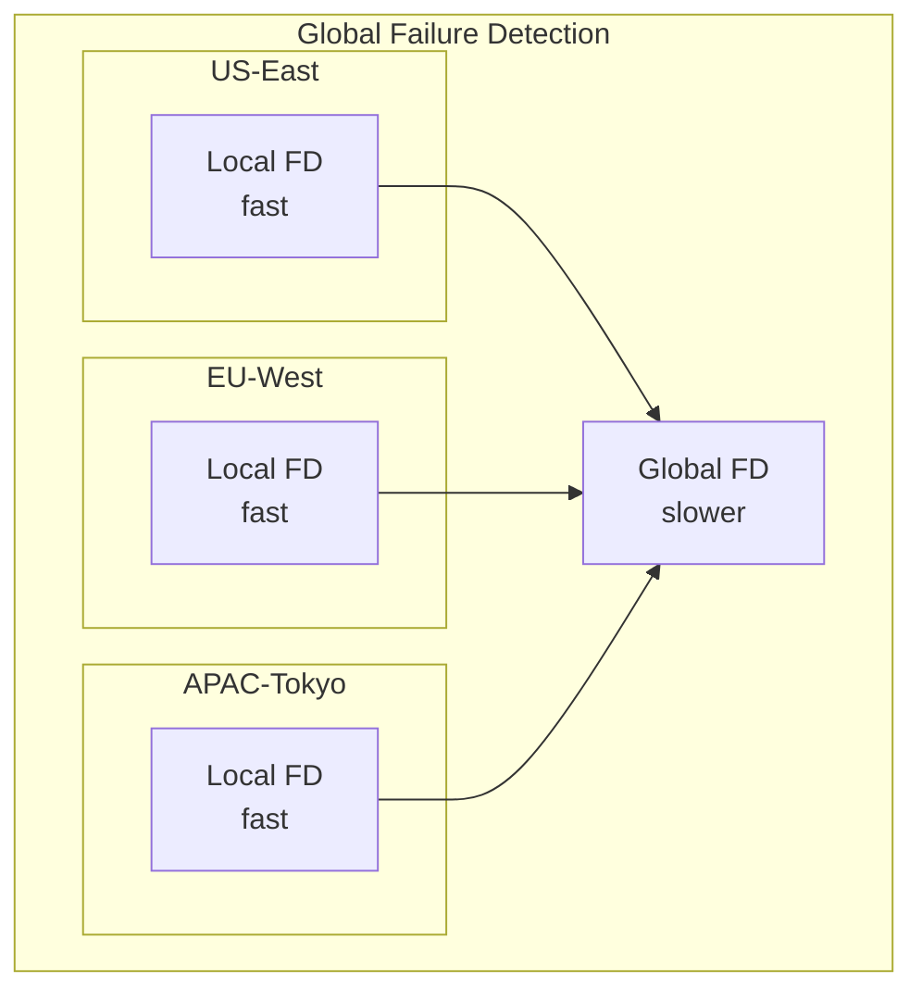

# 🔎 Failure Detection

## 0️⃣ Prerequisites

Before diving into failure detection, you should understand:

- **Distributed Systems Basics**: Multiple nodes communicating over a network
- **Network Unreliability**: Messages can be delayed, lost, or duplicated
- **Partial Failures**: Some nodes can fail while others continue working
- **Gossip Protocol**: Decentralized information sharing (covered in Topic 10)

**Quick refresher**: In a distributed system, nodes need to know when other nodes have failed. This sounds simple but is fundamentally hard: if Node A can't reach Node B, is B dead, or is the network between them broken? Both look identical from A's perspective. Failure detection is about making this determination as accurately and quickly as possible.

---

## 1️⃣ What Problem Does This Exist to Solve?

### The Specific Pain Point

Consider a 5-node database cluster. Node C stops responding. Questions arise:

**Is Node C actually dead?**
- Hardware failure?
- Process crash?
- Just slow (high load, GC pause)?
- Network issue between us and C?

**What should we do?**
- If C is dead: Failover, redistribute data
- If C is just slow: Wait, don't cause unnecessary disruption
- If network issue: Don't split brain

**The core challenge**: We cannot distinguish between a dead node and a slow/unreachable node. This is called the **impossibility of perfect failure detection**.

### What Systems Looked Like Before

**Era 1: Manual Monitoring**
- Operators watch dashboards
- Manual intervention when problems detected
- Slow response, human error

**Era 2: Simple Timeouts**
- If no response in X seconds, assume dead
- Many false positives (slow != dead)
- Many false negatives (long timeout = slow detection)

**Era 3: Heartbeat-Based**
- Nodes send periodic heartbeats
- Missing heartbeats = suspected failure
- Better but still binary (alive/dead)

**Era 4: Probabilistic/Adaptive**
- Calculate probability of failure
- Adapt to network conditions
- Fewer false positives

### What Breaks Without Good Failure Detection

| Scenario | Impact |
|----------|--------|
| False positive (think alive is dead) | Unnecessary failover, data movement, disruption |
| False negative (think dead is alive) | Requests to dead node fail, reduced availability |
| Slow detection | Extended outage, poor user experience |
| Too fast detection | Flapping (constant failover/recovery) |

### Real Examples of the Problem

**Amazon's Timeout Tuning**: Early DynamoDB had fixed timeouts. During network congestion, healthy nodes were marked dead, causing cascading failures. They moved to adaptive timeouts.

**Cassandra's Phi Accrual**: Cassandra implemented phi accrual failure detector after experiencing too many false positives with fixed timeouts during garbage collection pauses.

**Kubernetes Node Health**: Kubernetes uses multiple signals (heartbeat, resource pressure, network) because single-signal detection was unreliable.

---

## 2️⃣ Intuition and Mental Model

### The Doctor Analogy

Think of failure detection like a doctor monitoring a patient:

**Binary approach** (old):
- Check pulse every minute
- No pulse for 2 checks = dead
- Problem: What if patient is just very relaxed? Or equipment glitch?

**Probabilistic approach** (modern):
- Monitor pulse continuously
- Learn patient's normal pattern
- Deviation from pattern = concern
- More deviation = higher concern
- Decide based on probability, not binary threshold

**Key insight**: Instead of asking "Is the node dead?", ask "What's the probability the node is dead given what I've observed?"

### The Heartbeat Mental Model

```
Normal heartbeats:
Node A: ♥ ♥ ♥ ♥ ♥ ♥ ♥ ♥
        1s 1s 1s 1s 1s 1s 1s

Suspicious pattern:
Node A: ♥ ♥ ♥ ♥    ♥       ♥
        1s 1s 1s 3s   5s      ?

Questions:
- Is 3s delay normal variance?
- Is 5s delay a sign of trouble?
- How long to wait before declaring failure?
```

### The Trade-off Triangle

```
                    Fast Detection
                         /\
                        /  \
                       /    \
                      /      \
                     /        \
                    /          \
   Low False      /____________\ Low False
   Positives                     Negatives

You can optimize for any two, but not all three.
```

---

## 3️⃣ How It Works Internally

### Heartbeat Mechanism

The simplest failure detection: nodes send periodic "I'm alive" messages.

```java
class HeartbeatSender {
    private final long intervalMs;
    private final ScheduledExecutorService scheduler;
    private final List<Node> peers;
    
    void start() {
        scheduler.scheduleAtFixedRate(
            this::sendHeartbeats,
            0, intervalMs, TimeUnit.MILLISECONDS);
    }
    
    void sendHeartbeats() {
        for (Node peer : peers) {
            peer.send(new Heartbeat(myNodeId, System.currentTimeMillis()));
        }
    }
}

class HeartbeatReceiver {
    private final Map<String, Long> lastHeartbeat;
    private final long timeoutMs;
    
    void onHeartbeat(Heartbeat hb) {
        lastHeartbeat.put(hb.nodeId, System.currentTimeMillis());
    }
    
    boolean isAlive(String nodeId) {
        Long last = lastHeartbeat.get(nodeId);
        if (last == null) return false;
        return System.currentTimeMillis() - last < timeoutMs;
    }
}
```

**Problems with simple heartbeats**:
1. Fixed timeout doesn't adapt to network conditions
2. Binary decision (alive/dead) is too coarse
3. Single missed heartbeat might trigger false positive

### Timeout-Based Detection

**Fixed timeout**:
```
Timeout = 5 seconds
If no heartbeat for 5 seconds → Node is dead

Problems:
- Network latency spike of 6 seconds → False positive
- Node actually dead but timeout is 5 seconds → 5 second delay
```

**Adaptive timeout**:
```
Track heartbeat intervals over time
Calculate mean and standard deviation
Timeout = mean + (k × stddev)

Example:
- Mean interval: 1000ms
- Stddev: 200ms
- k = 3 (3 sigma)
- Timeout = 1000 + (3 × 200) = 1600ms
```

### Phi Accrual Failure Detector

Instead of binary alive/dead, calculate a **suspicion level** (phi).

**Core idea**: Model heartbeat arrivals as a probability distribution. Calculate how unlikely the current delay is.

```
φ = -log10(P(heartbeat_delay ≥ observed_delay))

If φ = 1: 10% chance of this delay if node is alive
If φ = 2: 1% chance
If φ = 3: 0.1% chance
If φ = 8: 0.000001% chance (probably dead)
```

**How it works**:

1. **Collect samples**: Track recent heartbeat intervals
2. **Model distribution**: Assume normal or exponential distribution
3. **Calculate probability**: Given observed delay, what's probability of being alive?
4. **Convert to phi**: -log10(probability)
5. **Threshold**: If phi > threshold, consider dead

```java
class PhiAccrualFailureDetector {
    private final double threshold;  // e.g., 8
    private final int maxSamples;
    private final Map<String, SampleWindow> windows;
    
    double phi(String nodeId) {
        SampleWindow window = windows.get(nodeId);
        if (window == null) return 0;
        
        long now = System.currentTimeMillis();
        long timeSinceLastHeartbeat = now - window.lastHeartbeat;
        
        double mean = window.mean();
        double stdDev = window.stdDev();
        
        // Calculate probability using normal distribution CDF
        double y = (timeSinceLastHeartbeat - mean) / stdDev;
        double probability = 1.0 - normalCDF(y);
        
        // Convert to phi
        return -Math.log10(probability);
    }
    
    boolean isAvailable(String nodeId) {
        return phi(nodeId) < threshold;
    }
}
```

**Advantages**:
- Adapts to network conditions automatically
- Configurable sensitivity via threshold
- Works across different environments

### SWIM Protocol Failure Detection

SWIM (Scalable Weakly-consistent Infection-style Membership) uses **probe-based** detection.

**Instead of heartbeats, actively probe nodes**:

```
Every T seconds:
1. Pick random node B to probe
2. Send PING to B
3. If B responds with ACK, B is alive
4. If no ACK within timeout:
   a. Pick k random nodes C1, C2, ..., Ck
   b. Ask them to PING B (indirect probe)
   c. If any get ACK, B is alive
   d. If none get ACK, B is suspect
```

**Why indirect probes?**
- Direct probe failure might be network issue between A and B
- If C can reach B but A can't, it's network, not B failure
- Reduces false positives from asymmetric network issues

```java
class SwimFailureDetector {
    void probeRound() {
        Node target = selectRandomNode();
        
        // Direct probe
        boolean directSuccess = sendPing(target, directTimeout);
        if (directSuccess) {
            markAlive(target);
            return;
        }
        
        // Indirect probes
        List<Node> helpers = selectRandomNodes(k);
        boolean indirectSuccess = false;
        
        for (Node helper : helpers) {
            if (requestIndirectPing(helper, target)) {
                indirectSuccess = true;
                break;
            }
        }
        
        if (indirectSuccess) {
            markAlive(target);
        } else {
            markSuspect(target);
        }
    }
}
```

### Gossip-Based Failure Detection

Combine gossip protocol with failure detection:

```
Each gossip message includes:
- Sender's heartbeat counter
- Sender's view of other nodes' heartbeats

When receiving gossip:
- Update heartbeat counters
- If a node's heartbeat hasn't increased, suspect failure
```

```java
class GossipFailureDetector {
    private final Map<String, Long> heartbeats;  // nodeId -> heartbeat
    private final Map<String, Long> lastUpdate;  // nodeId -> timestamp
    
    void onGossip(GossipMessage msg) {
        for (NodeState state : msg.states) {
            // Update if newer heartbeat
            heartbeats.compute(state.nodeId, (id, current) -> {
                if (current == null || state.heartbeat > current) {
                    lastUpdate.put(id, System.currentTimeMillis());
                    return state.heartbeat;
                }
                return current;
            });
        }
    }
    
    void checkFailures() {
        long now = System.currentTimeMillis();
        for (Map.Entry<String, Long> entry : lastUpdate.entrySet()) {
            long age = now - entry.getValue();
            if (age > suspectThreshold) {
                markSuspect(entry.getKey());
            }
            if (age > deadThreshold) {
                markDead(entry.getKey());
            }
        }
    }
}
```

---

## 4️⃣ Simulation-First Explanation

Let's simulate different failure detection approaches.

### Setup

```
5-node cluster: A, B, C, D, E
Heartbeat interval: 1 second
Network latency: normally 10-50ms, occasionally spikes to 500ms
Node C will fail at T=10s
```

### Scenario 1: Fixed Timeout (Poor)

```
Timeout = 2 seconds

T=0-9: Normal operation
       All nodes receive heartbeats within 50ms
       
T=10: Node C fails (process crash)

T=10-12: Other nodes waiting for C's heartbeat
         A: Last heartbeat from C at T=9
         A: Timeout at T=11 (2 seconds since last)
         
T=11: A declares C dead
      Detection time: 2 seconds after failure

T=15: Network spike causes D's heartbeat to arrive 2.5s late

T=15: A declares D dead (FALSE POSITIVE!)
      D is actually alive, just slow network
      
T=16: D's next heartbeat arrives
      A: D is alive again (flapping)
```

**Problems**: Fixed timeout causes false positives during network issues.

### Scenario 2: Adaptive Timeout (Better)

```
Adaptive timeout = mean + 3×stddev
Historical data: mean=1000ms, stddev=100ms
Timeout = 1000 + 300 = 1300ms

T=10: Node C fails

T=11.3: A declares C dead
        Detection time: 1.3 seconds

T=15: Network spike, D's heartbeat delayed 500ms
      Expected: 1000ms, Observed: 1500ms
      1500ms < 1300ms? No, but close
      
      Actually, adaptive timeout recalculates:
      Recent intervals: [1000, 1050, 950, 1500, ...]
      New mean: 1100ms, new stddev: 200ms
      New timeout: 1100 + 600 = 1700ms
      
      D not declared dead (correctly)
```

**Better**: Adapts to network conditions, fewer false positives.

### Scenario 3: Phi Accrual (Best)

```
Threshold: φ = 8

T=0-9: Collecting heartbeat samples
       Intervals: [1000, 1050, 980, 1020, 1010, ...]
       Mean: 1012ms, StdDev: 25ms

T=10: Node C fails

T=10.5: φ for C = 2 (500ms since last heartbeat)
        Probability of 500ms delay: 10%
        Not suspicious yet

T=11: φ for C = 5 (1000ms since last heartbeat)
      Probability: 0.001%
      Getting suspicious

T=11.2: φ for C = 8 (1200ms since last heartbeat)
        Probability: 0.000001%
        Threshold reached, C declared dead
        
Detection time: 1.2 seconds

T=15: Network spike, D's heartbeat delayed 500ms
      φ for D = 2 (500ms is 20 stddevs, but...)
      
      Wait, phi accrual adapts:
      Recent D intervals: [1000, 1050, 1500, ...]
      Distribution widens
      φ for 500ms delay = 1.5 (not suspicious)
      
      D correctly not declared dead
```

**Best**: Probabilistic, adaptive, configurable sensitivity.

### Scenario 4: SWIM Protocol

```
Probe interval: 1 second
Direct timeout: 500ms
Indirect probes: 3

T=10: Node C fails

T=10.5: A's turn to probe, randomly selects C
        A sends PING to C
        No ACK within 500ms
        
T=11: A sends indirect probe requests to B, D, E
      "Please ping C for me"
      
T=11.5: B, D, E all report: "C didn't respond"
        A marks C as SUSPECT
        
T=12: Another probe round, C still not responding
      A marks C as DEAD
      
Detection time: ~2 seconds (but more reliable)

T=15: Network issue between A and D
      A sends PING to D, no response
      A sends indirect probes to B, C, E
      B responds: "D is alive, I got ACK"
      A does NOT mark D as dead (correctly)
```

**SWIM advantage**: Indirect probes catch network asymmetry.

---

## 5️⃣ How Engineers Actually Use This in Production

### Apache Cassandra

**Phi Accrual Failure Detector**:
```yaml
# cassandra.yaml
phi_convict_threshold: 8

# Higher = more tolerant of delays (fewer false positives)
# Lower = faster detection (more false positives)
```

**How Cassandra uses it**:
- Each node tracks heartbeat intervals from every other node
- Phi calculated continuously
- When phi exceeds threshold, node marked DOWN
- Gossip spreads failure information

**Tuning guidance**:
- Cloud environments: phi = 10-12 (more variance)
- Dedicated hardware: phi = 8 (less variance)
- Cross-datacenter: phi = 12+ (high latency variance)

### HashiCorp Consul/Serf

**SWIM-based detection**:
```hcl
# consul.hcl
performance {
  raft_multiplier = 1  # Affects timeouts
}

# Serf (underlying library)
memberlist {
  probe_interval = "1s"
  probe_timeout = "500ms"
  suspicion_mult = 4
}
```

**Suspicion mechanism**:
- Node marked SUSPECT before DEAD
- Suspicion timeout = probe_interval × suspicion_mult × log(cluster_size)
- Gives time for node to refute

### Kubernetes

**Multiple failure signals**:
```yaml
# Node conditions checked:
# - Ready: kubelet is healthy
# - MemoryPressure: node has memory pressure
# - DiskPressure: node has disk pressure
# - PIDPressure: too many processes
# - NetworkUnavailable: network not configured

# Timing configuration
--node-monitor-period=5s      # How often to check
--node-monitor-grace-period=40s  # How long before marking unhealthy
--pod-eviction-timeout=5m     # How long before evicting pods
```

**How it works**:
1. Kubelet sends heartbeats to API server
2. Node controller checks heartbeat age
3. If heartbeat too old, node marked NotReady
4. After grace period, pods evicted

### etcd

**Raft-based heartbeats**:
```yaml
# etcd.yaml
heartbeat-interval: 100  # milliseconds
election-timeout: 1000   # milliseconds

# election-timeout should be:
# - At least 10× heartbeat-interval
# - Less than 50× heartbeat-interval
# - Greater than network round-trip time
```

**Failure detection via Raft**:
- Leader sends heartbeats to followers
- If follower doesn't hear from leader within election-timeout, starts election
- If leader can't reach majority, steps down

### Production Lessons

**Netflix's Eureka**:
- Self-preservation mode: If too many instances appear dead, assume network issue
- Don't evict instances during suspected network partition
- Prevents cascading failures from network glitches

**Uber's Failure Detection**:
- Multiple signals: heartbeat + metrics + health endpoints
- Gradual degradation: slow → suspect → dead
- Human-in-the-loop for critical decisions

---

## 6️⃣ How to Implement or Apply It

### Implementation: Phi Accrual Failure Detector

```java
package com.example.failure;

import java.util.*;
import java.util.concurrent.*;

/**
 * Phi Accrual Failure Detector implementation.
 * 
 * Based on "The φ Accrual Failure Detector" paper by Hayashibara et al.
 * Used by Cassandra and Akka.
 */
public class PhiAccrualFailureDetector {
    
    // Configuration
    private final double threshold;           // φ threshold (e.g., 8)
    private final int maxSampleSize;          // Max heartbeat samples to keep
    private final long minStdDeviationMs;     // Minimum stddev to prevent division issues
    private final long acceptableHeartbeatPauseMs;  // Expected pause (e.g., GC)
    private final long firstHeartbeatEstimateMs;    // Initial estimate before samples
    
    // State per monitored node
    private final ConcurrentMap<String, HeartbeatHistory> histories;
    
    public PhiAccrualFailureDetector(double threshold, int maxSampleSize,
                                     long minStdDeviationMs,
                                     long acceptableHeartbeatPauseMs,
                                     long firstHeartbeatEstimateMs) {
        this.threshold = threshold;
        this.maxSampleSize = maxSampleSize;
        this.minStdDeviationMs = minStdDeviationMs;
        this.acceptableHeartbeatPauseMs = acceptableHeartbeatPauseMs;
        this.firstHeartbeatEstimateMs = firstHeartbeatEstimateMs;
        this.histories = new ConcurrentHashMap<>();
    }
    
    /**
     * Record a heartbeat from a node.
     */
    public void heartbeat(String nodeId) {
        long timestamp = System.currentTimeMillis();
        
        histories.compute(nodeId, (id, history) -> {
            if (history == null) {
                // First heartbeat from this node
                history = new HeartbeatHistory(maxSampleSize, firstHeartbeatEstimateMs);
            } else {
                // Calculate interval since last heartbeat
                long interval = timestamp - history.lastHeartbeatTimestamp;
                history.add(interval);
            }
            history.lastHeartbeatTimestamp = timestamp;
            return history;
        });
    }
    
    /**
     * Calculate phi (suspicion level) for a node.
     * 
     * Higher phi = more suspicious
     * phi >= threshold = consider failed
     */
    public double phi(String nodeId) {
        HeartbeatHistory history = histories.get(nodeId);
        if (history == null) {
            return 0.0;  // No data, can't calculate
        }
        
        return phi(System.currentTimeMillis(), history);
    }
    
    private double phi(long timestamp, HeartbeatHistory history) {
        long timeSinceLastHeartbeat = timestamp - history.lastHeartbeatTimestamp;
        
        double mean = history.mean() + acceptableHeartbeatPauseMs;
        double stdDev = Math.max(history.stdDev(), minStdDeviationMs);
        
        // Calculate using exponential distribution approximation
        // P(X >= t) where X is the time until next heartbeat
        double y = (timeSinceLastHeartbeat - mean) / stdDev;
        double e = Math.exp(-y * (1.5976 + 0.070566 * y * y));
        
        double p;
        if (timeSinceLastHeartbeat > mean) {
            p = e / (1.0 + e);
        } else {
            p = 1.0 - 1.0 / (1.0 + e);
        }
        
        return -Math.log10(p);
    }
    
    /**
     * Check if node is considered available.
     */
    public boolean isAvailable(String nodeId) {
        return phi(nodeId) < threshold;
    }
    
    /**
     * Get availability probability (0 to 1).
     */
    public double availabilityProbability(String nodeId) {
        double p = phi(nodeId);
        if (p >= threshold) return 0.0;
        return 1.0 - (p / threshold);
    }
    
    /**
     * Remove a node from monitoring.
     */
    public void remove(String nodeId) {
        histories.remove(nodeId);
    }
    
    /**
     * Get all monitored nodes and their status.
     */
    public Map<String, NodeStatus> getStatus() {
        Map<String, NodeStatus> status = new HashMap<>();
        long now = System.currentTimeMillis();
        
        for (Map.Entry<String, HeartbeatHistory> entry : histories.entrySet()) {
            String nodeId = entry.getKey();
            HeartbeatHistory history = entry.getValue();
            double currentPhi = phi(now, history);
            
            status.put(nodeId, new NodeStatus(
                nodeId,
                currentPhi,
                currentPhi < threshold,
                now - history.lastHeartbeatTimestamp,
                history.mean(),
                history.stdDev()
            ));
        }
        
        return status;
    }
    
    /**
     * Heartbeat history with running statistics.
     */
    private static class HeartbeatHistory {
        private final long[] intervals;
        private int head;
        private int count;
        private long lastHeartbeatTimestamp;
        
        // Running statistics
        private double mean;
        private double variance;
        
        HeartbeatHistory(int maxSize, long initialEstimate) {
            this.intervals = new long[maxSize];
            this.head = 0;
            this.count = 0;
            this.mean = initialEstimate;
            this.variance = initialEstimate * initialEstimate / 4;  // Initial variance
        }
        
        void add(long interval) {
            // Update running statistics using Welford's algorithm
            count++;
            double delta = interval - mean;
            mean += delta / Math.min(count, intervals.length);
            double delta2 = interval - mean;
            variance += (delta * delta2 - variance) / Math.min(count, intervals.length);
            
            // Add to circular buffer
            intervals[head] = interval;
            head = (head + 1) % intervals.length;
        }
        
        double mean() {
            return mean;
        }
        
        double stdDev() {
            return Math.sqrt(variance);
        }
    }
    
    public record NodeStatus(
        String nodeId,
        double phi,
        boolean available,
        long timeSinceHeartbeatMs,
        double meanIntervalMs,
        double stdDevMs
    ) {}
}
```

### Implementation: SWIM Failure Detector

```java
package com.example.failure;

import java.util.*;
import java.util.concurrent.*;

/**
 * SWIM (Scalable Weakly-consistent Infection-style Membership) Failure Detector.
 * 
 * Uses probe-based detection with indirect probes to reduce false positives.
 */
public class SwimFailureDetector {
    
    // Configuration
    private final long probeIntervalMs;
    private final long probeTimeoutMs;
    private final int indirectProbeCount;
    private final int suspicionMultiplier;
    
    // State
    private final String localNodeId;
    private final ConcurrentMap<String, MemberState> members;
    private final NetworkTransport transport;
    private final ScheduledExecutorService scheduler;
    
    // Probe state
    private int probeIndex;
    private List<String> memberList;
    
    public SwimFailureDetector(String localNodeId, NetworkTransport transport,
                               long probeIntervalMs, long probeTimeoutMs,
                               int indirectProbeCount, int suspicionMultiplier) {
        this.localNodeId = localNodeId;
        this.transport = transport;
        this.probeIntervalMs = probeIntervalMs;
        this.probeTimeoutMs = probeTimeoutMs;
        this.indirectProbeCount = indirectProbeCount;
        this.suspicionMultiplier = suspicionMultiplier;
        
        this.members = new ConcurrentHashMap<>();
        this.scheduler = Executors.newScheduledThreadPool(2);
        this.probeIndex = 0;
        this.memberList = new ArrayList<>();
    }
    
    /**
     * Start the failure detector.
     */
    public void start() {
        // Probe round
        scheduler.scheduleAtFixedRate(
            this::probeRound,
            probeIntervalMs, probeIntervalMs, TimeUnit.MILLISECONDS);
        
        // Suspicion timeout check
        scheduler.scheduleAtFixedRate(
            this::checkSuspicionTimeouts,
            probeIntervalMs, probeIntervalMs, TimeUnit.MILLISECONDS);
    }
    
    /**
     * Add a member to monitor.
     */
    public void addMember(String nodeId, String address) {
        members.put(nodeId, new MemberState(nodeId, address, MemberStatus.ALIVE, 0));
        refreshMemberList();
    }
    
    /**
     * Main probe round - called every probeInterval.
     */
    private void probeRound() {
        if (memberList.isEmpty()) return;
        
        // Select next member to probe (round-robin)
        String targetId = memberList.get(probeIndex % memberList.size());
        probeIndex++;
        
        MemberState target = members.get(targetId);
        if (target == null || target.status == MemberStatus.DEAD) return;
        
        // Direct probe
        boolean directSuccess = directProbe(target);
        
        if (directSuccess) {
            markAlive(targetId);
            return;
        }
        
        // Direct probe failed - try indirect probes
        boolean indirectSuccess = indirectProbe(target);
        
        if (indirectSuccess) {
            markAlive(targetId);
        } else {
            markSuspect(targetId);
        }
    }
    
    /**
     * Send direct PING to target.
     */
    private boolean directProbe(MemberState target) {
        try {
            CompletableFuture<Boolean> probe = transport.ping(target.address);
            return probe.get(probeTimeoutMs, TimeUnit.MILLISECONDS);
        } catch (Exception e) {
            return false;
        }
    }
    
    /**
     * Ask other members to probe target on our behalf.
     */
    private boolean indirectProbe(MemberState target) {
        // Select random members for indirect probing
        List<MemberState> helpers = selectRandomMembers(indirectProbeCount, target.nodeId);
        
        if (helpers.isEmpty()) return false;
        
        List<CompletableFuture<Boolean>> probes = new ArrayList<>();
        for (MemberState helper : helpers) {
            probes.add(transport.indirectPing(helper.address, target.address));
        }
        
        // Wait for any successful response
        try {
            CompletableFuture<Object> anySuccess = CompletableFuture.anyOf(
                probes.toArray(new CompletableFuture[0]));
            
            Object result = anySuccess.get(probeTimeoutMs * 2, TimeUnit.MILLISECONDS);
            return Boolean.TRUE.equals(result);
        } catch (Exception e) {
            return false;
        }
    }
    
    /**
     * Select k random members, excluding specified node.
     */
    private List<MemberState> selectRandomMembers(int k, String excludeId) {
        List<MemberState> candidates = members.values().stream()
            .filter(m -> !m.nodeId.equals(excludeId) && 
                        !m.nodeId.equals(localNodeId) &&
                        m.status == MemberStatus.ALIVE)
            .toList();
        
        List<MemberState> shuffled = new ArrayList<>(candidates);
        Collections.shuffle(shuffled);
        
        return shuffled.subList(0, Math.min(k, shuffled.size()));
    }
    
    private void markAlive(String nodeId) {
        members.computeIfPresent(nodeId, (id, state) -> {
            if (state.status != MemberStatus.ALIVE) {
                System.out.println("Node " + nodeId + " is ALIVE");
            }
            return new MemberState(state.nodeId, state.address, 
                MemberStatus.ALIVE, state.incarnation);
        });
    }
    
    private void markSuspect(String nodeId) {
        members.computeIfPresent(nodeId, (id, state) -> {
            if (state.status == MemberStatus.ALIVE) {
                System.out.println("Node " + nodeId + " is SUSPECT");
                return new MemberState(state.nodeId, state.address,
                    MemberStatus.SUSPECT, state.incarnation, System.currentTimeMillis());
            }
            return state;
        });
    }
    
    private void markDead(String nodeId) {
        members.computeIfPresent(nodeId, (id, state) -> {
            System.out.println("Node " + nodeId + " is DEAD");
            return new MemberState(state.nodeId, state.address,
                MemberStatus.DEAD, state.incarnation);
        });
        refreshMemberList();
    }
    
    /**
     * Check if suspect nodes should be marked dead.
     */
    private void checkSuspicionTimeouts() {
        long now = System.currentTimeMillis();
        long timeout = calculateSuspicionTimeout();
        
        for (MemberState state : members.values()) {
            if (state.status == MemberStatus.SUSPECT) {
                if (now - state.suspicionStartTime > timeout) {
                    markDead(state.nodeId);
                }
            }
        }
    }
    
    /**
     * Calculate suspicion timeout based on cluster size.
     * 
     * Larger clusters need longer timeout for suspicion to propagate.
     */
    private long calculateSuspicionTimeout() {
        int clusterSize = Math.max(1, members.size());
        return probeIntervalMs * suspicionMultiplier * 
               (long) Math.ceil(Math.log10(clusterSize + 1));
    }
    
    /**
     * Handle suspicion refutation from the suspected node.
     */
    public void handleAliveMessage(String nodeId, long incarnation) {
        members.computeIfPresent(nodeId, (id, state) -> {
            if (incarnation > state.incarnation) {
                // Valid refutation - node is alive with higher incarnation
                System.out.println("Node " + nodeId + " refuted suspicion");
                return new MemberState(state.nodeId, state.address,
                    MemberStatus.ALIVE, incarnation);
            }
            return state;
        });
    }
    
    private void refreshMemberList() {
        memberList = members.values().stream()
            .filter(m -> m.status != MemberStatus.DEAD)
            .map(m -> m.nodeId)
            .toList();
    }
    
    /**
     * Get current membership view.
     */
    public Map<String, MemberStatus> getMembership() {
        Map<String, MemberStatus> result = new HashMap<>();
        for (MemberState state : members.values()) {
            result.put(state.nodeId, state.status);
        }
        return result;
    }
}

enum MemberStatus {
    ALIVE, SUSPECT, DEAD
}

class MemberState {
    final String nodeId;
    final String address;
    final MemberStatus status;
    final long incarnation;
    final long suspicionStartTime;
    
    MemberState(String nodeId, String address, MemberStatus status, long incarnation) {
        this(nodeId, address, status, incarnation, 0);
    }
    
    MemberState(String nodeId, String address, MemberStatus status, 
                long incarnation, long suspicionStartTime) {
        this.nodeId = nodeId;
        this.address = address;
        this.status = status;
        this.incarnation = incarnation;
        this.suspicionStartTime = suspicionStartTime;
    }
}

interface NetworkTransport {
    CompletableFuture<Boolean> ping(String address);
    CompletableFuture<Boolean> indirectPing(String helperAddress, String targetAddress);
}
```

### Implementation: Composite Failure Detector

```java
package com.example.failure;

import java.util.*;

/**
 * Composite failure detector combining multiple signals.
 * 
 * Uses heartbeat, health endpoint, and metrics for more robust detection.
 */
public class CompositeFailureDetector {
    
    private final PhiAccrualFailureDetector heartbeatDetector;
    private final HealthCheckMonitor healthMonitor;
    private final MetricsMonitor metricsMonitor;
    
    // Weights for combining signals
    private final double heartbeatWeight;
    private final double healthWeight;
    private final double metricsWeight;
    
    private final double failureThreshold;
    
    public CompositeFailureDetector(double failureThreshold) {
        this.heartbeatDetector = new PhiAccrualFailureDetector(8, 100, 100, 0, 1000);
        this.healthMonitor = new HealthCheckMonitor();
        this.metricsMonitor = new MetricsMonitor();
        
        this.heartbeatWeight = 0.5;
        this.healthWeight = 0.3;
        this.metricsWeight = 0.2;
        this.failureThreshold = failureThreshold;
    }
    
    /**
     * Calculate composite failure score.
     * 
     * 0 = definitely alive
     * 1 = definitely dead
     */
    public double failureScore(String nodeId) {
        // Heartbeat signal (phi-based)
        double heartbeatScore = heartbeatDetector.phi(nodeId) / 16.0;  // Normalize to 0-1
        heartbeatScore = Math.min(1.0, heartbeatScore);
        
        // Health check signal
        double healthScore = healthMonitor.getUnhealthyScore(nodeId);
        
        // Metrics signal (e.g., error rate, latency)
        double metricsScore = metricsMonitor.getAnomalyScore(nodeId);
        
        // Weighted combination
        return heartbeatWeight * heartbeatScore +
               healthWeight * healthScore +
               metricsWeight * metricsScore;
    }
    
    /**
     * Check if node is considered failed.
     */
    public boolean isFailed(String nodeId) {
        return failureScore(nodeId) >= failureThreshold;
    }
    
    /**
     * Get detailed status for a node.
     */
    public NodeHealthStatus getStatus(String nodeId) {
        double heartbeatPhi = heartbeatDetector.phi(nodeId);
        boolean healthCheckPassing = healthMonitor.isHealthy(nodeId);
        double errorRate = metricsMonitor.getErrorRate(nodeId);
        double latencyP99 = metricsMonitor.getLatencyP99(nodeId);
        
        double compositeScore = failureScore(nodeId);
        
        return new NodeHealthStatus(
            nodeId,
            compositeScore < failureThreshold,
            compositeScore,
            heartbeatPhi,
            healthCheckPassing,
            errorRate,
            latencyP99
        );
    }
    
    // Record signals
    public void recordHeartbeat(String nodeId) {
        heartbeatDetector.heartbeat(nodeId);
    }
    
    public void recordHealthCheck(String nodeId, boolean healthy) {
        healthMonitor.recordCheck(nodeId, healthy);
    }
    
    public void recordRequest(String nodeId, boolean success, long latencyMs) {
        metricsMonitor.recordRequest(nodeId, success, latencyMs);
    }
}

class HealthCheckMonitor {
    private final Map<String, List<Boolean>> recentChecks = new ConcurrentHashMap<>();
    private final int windowSize = 10;
    
    void recordCheck(String nodeId, boolean healthy) {
        recentChecks.compute(nodeId, (id, checks) -> {
            if (checks == null) checks = new ArrayList<>();
            checks.add(healthy);
            if (checks.size() > windowSize) {
                checks.remove(0);
            }
            return checks;
        });
    }
    
    boolean isHealthy(String nodeId) {
        List<Boolean> checks = recentChecks.get(nodeId);
        if (checks == null || checks.isEmpty()) return true;
        return checks.get(checks.size() - 1);
    }
    
    double getUnhealthyScore(String nodeId) {
        List<Boolean> checks = recentChecks.get(nodeId);
        if (checks == null || checks.isEmpty()) return 0.0;
        
        long unhealthyCount = checks.stream().filter(h -> !h).count();
        return (double) unhealthyCount / checks.size();
    }
}

class MetricsMonitor {
    private final Map<String, RequestMetrics> metrics = new ConcurrentHashMap<>();
    
    void recordRequest(String nodeId, boolean success, long latencyMs) {
        metrics.compute(nodeId, (id, m) -> {
            if (m == null) m = new RequestMetrics();
            m.record(success, latencyMs);
            return m;
        });
    }
    
    double getErrorRate(String nodeId) {
        RequestMetrics m = metrics.get(nodeId);
        return m != null ? m.errorRate() : 0.0;
    }
    
    double getLatencyP99(String nodeId) {
        RequestMetrics m = metrics.get(nodeId);
        return m != null ? m.latencyP99() : 0.0;
    }
    
    double getAnomalyScore(String nodeId) {
        double errorRate = getErrorRate(nodeId);
        double latencyP99 = getLatencyP99(nodeId);
        
        // Simple anomaly scoring
        double errorScore = Math.min(1.0, errorRate * 10);  // 10% error = score 1.0
        double latencyScore = Math.min(1.0, latencyP99 / 5000);  // 5s = score 1.0
        
        return Math.max(errorScore, latencyScore);
    }
    
    private static class RequestMetrics {
        private int total;
        private int errors;
        private List<Long> latencies = new ArrayList<>();
        
        void record(boolean success, long latencyMs) {
            total++;
            if (!success) errors++;
            latencies.add(latencyMs);
            if (latencies.size() > 1000) {
                latencies.remove(0);
            }
        }
        
        double errorRate() {
            return total > 0 ? (double) errors / total : 0.0;
        }
        
        double latencyP99() {
            if (latencies.isEmpty()) return 0.0;
            List<Long> sorted = new ArrayList<>(latencies);
            Collections.sort(sorted);
            int index = (int) (sorted.size() * 0.99);
            return sorted.get(Math.min(index, sorted.size() - 1));
        }
    }
}

record NodeHealthStatus(
    String nodeId,
    boolean available,
    double compositeScore,
    double heartbeatPhi,
    boolean healthCheckPassing,
    double errorRate,
    double latencyP99Ms
) {}
```

---

## 7️⃣ Tradeoffs, Pitfalls, and Common Mistakes

### Tradeoffs

| Approach | Detection Speed | False Positives | Complexity |
|----------|----------------|-----------------|------------|
| Fixed timeout | Fast | High | Low |
| Adaptive timeout | Medium | Medium | Medium |
| Phi accrual | Configurable | Low | Medium |
| SWIM | Medium | Very low | High |
| Composite | Configurable | Very low | High |

### The Fundamental Trade-off

```
Detection Time ←————————————————————→ Accuracy

Fast detection:
- Short timeouts
- Quick response to failures
- More false positives

Accurate detection:
- Long timeouts
- Fewer false positives
- Slower response to actual failures
```

### Common Mistakes

**1. Fixed Timeout in Variable Environment**
```java
// BAD: Fixed timeout doesn't adapt
if (timeSinceHeartbeat > 5000) {
    markDead(node);  // False positive during GC or network spike
}

// GOOD: Adaptive timeout
double threshold = mean + 3 * stdDev;
if (timeSinceHeartbeat > threshold) {
    markDead(node);
}
```

**2. Ignoring Clock Drift**
```java
// BAD: Comparing timestamps from different nodes
if (remoteTimestamp < localTimestamp - timeout) {
    markDead(remote);  // Clock drift causes false positive
}

// GOOD: Use heartbeat intervals, not absolute times
if (intervalSinceLastHeartbeat > timeout) {
    markDead(remote);
}
```

**3. Single Signal Detection**
```java
// BAD: Only use heartbeat
if (!receivedHeartbeat(node)) {
    markDead(node);  // Might be network issue
}

// GOOD: Multiple signals
if (!receivedHeartbeat(node) && 
    !healthCheckPassing(node) &&
    highErrorRate(node)) {
    markDead(node);
}
```

**4. No Suspicion Period**
```java
// BAD: Immediately mark dead
if (probeFailed(node)) {
    markDead(node);  // Too aggressive
}

// GOOD: Suspicion period before death
if (probeFailed(node)) {
    if (status == ALIVE) {
        markSuspect(node);  // Give time to recover
    } else if (status == SUSPECT && suspicionExpired()) {
        markDead(node);
    }
}
```

### Performance Gotchas

**Heartbeat Storm**: Too many nodes sending heartbeats simultaneously. Stagger heartbeat timing.

**Probe Overhead**: SWIM probes add network traffic. Balance probe frequency with detection speed.

**Memory for History**: Phi accrual stores heartbeat history. Limit sample size.

---

## 8️⃣ When NOT to Use This

### Skip Complex Failure Detection When

**Small, Stable Clusters**
- Fixed timeout is sufficient
- Low network variance
- Manual monitoring feasible

**Stateless Services**
- Load balancer handles failure
- No need for precise detection
- Just retry on failure

**Already Using Consensus**
- Raft/Paxos includes failure detection
- Don't duplicate detection logic

### When Simple Timeout Is Enough

- Dedicated network (low variance)
- Single datacenter
- Few nodes (<10)
- Can tolerate occasional false positives

---

## 9️⃣ Comparison with Alternatives

### Detection Approaches

| Approach | Best For | Weakness |
|----------|----------|----------|
| Heartbeat + timeout | Simple systems | False positives |
| Phi accrual | Variable networks | Complexity |
| SWIM | Large clusters | Probe overhead |
| Composite | Critical systems | Implementation effort |

### Phi Accrual vs SWIM

| Aspect | Phi Accrual | SWIM |
|--------|-------------|------|
| Detection model | Probabilistic | Probe-based |
| Network issues | Adapts via samples | Indirect probes |
| Cluster size | Any | Scales well |
| Complexity | Medium | Higher |
| Used by | Cassandra, Akka | Consul, Serf |

---

## 🔟 Interview Follow-up Questions WITH Answers

### L4 (Entry Level) Questions

**Q1: Why is failure detection hard in distributed systems?**

**A**: Failure detection is hard because we cannot distinguish between different types of failures:

1. **Node failure**: Process crashed, hardware died
2. **Network failure**: Node is fine, but we can't reach it
3. **Slowness**: Node is alive but responding slowly (GC, high load)

All three look the same from the observer's perspective: no response.

**The impossibility**: In an asynchronous network (no timing guarantees), it's theoretically impossible to distinguish a slow node from a dead one. We can only make probabilistic guesses.

**Consequences**:
- False positive: Declare alive node as dead → Unnecessary failover
- False negative: Declare dead node as alive → Requests fail

---

**Q2: What is the phi accrual failure detector?**

**A**: Phi accrual is a failure detection algorithm that outputs a **suspicion level** (phi) instead of a binary alive/dead decision.

**How it works**:
1. Track heartbeat arrival intervals
2. Model as probability distribution (normal/exponential)
3. When checking a node, calculate: "How unlikely is the current delay?"
4. Convert to phi: φ = -log10(probability)

**Interpretation**:
- φ = 1: 10% chance of this delay if alive
- φ = 2: 1% chance
- φ = 8: 0.000001% chance (probably dead)

**Advantages**:
- Adapts to network conditions automatically
- Configurable sensitivity (adjust threshold)
- Works across different environments

**Used by**: Apache Cassandra, Akka

---

### L5 (Mid Level) Questions

**Q3: Explain the SWIM protocol's failure detection mechanism.**

**A**: SWIM uses **probe-based** detection with **indirect probes** to reduce false positives.

**Protocol**:
```
Every T seconds:
1. Select random node B to probe
2. Send PING to B, wait for ACK
3. If ACK received → B is alive
4. If no ACK:
   a. Select k random nodes (C1, C2, ...)
   b. Ask them: "Please PING B for me"
   c. If any report success → B is alive
   d. If all fail → B is suspect
5. After suspicion timeout → B is dead
```

**Why indirect probes?**
- Direct probe failure might be network asymmetry
- If A can't reach B, but C can, it's network, not B failure
- Reduces false positives significantly

**Suspicion mechanism**:
- Don't immediately declare dead
- Mark as SUSPECT first
- Give time to refute (increment incarnation number)
- Only declare DEAD after timeout

**Scalability**:
- O(1) messages per node per round
- Detection time: O(log n) rounds
- Works for clusters of 1000+ nodes

---

**Q4: How would you tune failure detection for a cloud environment?**

**A**: Cloud environments have high variance in network latency and occasional pauses.

**Challenges**:
- Network latency varies (1ms to 100ms+)
- VM pauses (live migration, noisy neighbors)
- GC pauses (especially with large heaps)

**Tuning strategies**:

**1. Increase phi threshold**
```yaml
# On-premise (stable)
phi_threshold: 8

# Cloud (variable)
phi_threshold: 12
```

**2. Longer acceptable pause**
```java
// Account for GC and VM pauses
acceptableHeartbeatPauseMs = 5000;  // 5 seconds
```

**3. More heartbeat samples**
```java
// More samples = better distribution estimate
maxSampleSize = 200;  // Instead of 100
```

**4. Multiple signals**
```java
// Don't rely on heartbeat alone
if (heartbeatFailed && healthCheckFailed && highErrorRate) {
    markDead(node);
}
```

**5. Suspicion period**
```java
// Longer suspicion before declaring dead
suspicionTimeout = probeInterval * 6 * log(clusterSize);
```

**Monitoring**:
- Track false positive rate
- Track detection latency
- Adjust thresholds based on data

---

### L6 (Senior Level) Questions

**Q5: Design a failure detection system for a globally distributed database.**

**A**: Global distribution adds latency variance and partition challenges.

**Architecture**:


<details>
<summary>ASCII diagram (reference)</summary>

```text
┌─────────────────────────────────────────────────────────────┐
│                    Global Failure Detection                  │
│                                                              │
│  US-East          EU-West          APAC-Tokyo               │
│  ┌──────────┐     ┌──────────┐     ┌──────────┐            │
│  │Local FD  │     │Local FD  │     │Local FD  │            │
│  │(fast)    │     │(fast)    │     │(fast)    │            │
│  └────┬─────┘     └────┬─────┘     └────┬─────┘            │
│       │                │                │                   │
│       └────────────────┼────────────────┘                   │
│                        │                                    │
│                 ┌──────┴──────┐                             │
│                 │ Global FD   │                             │
│                 │ (slower)    │                             │
│                 └─────────────┘                             │
└─────────────────────────────────────────────────────────────┘
```
</details>

**Design decisions**:

**1. Hierarchical detection**
```java
// Local detection: Fast, within region
class LocalFailureDetector {
    double phiThreshold = 8;
    long heartbeatInterval = 1000;  // 1 second
}

// Global detection: Slower, cross-region
class GlobalFailureDetector {
    double phiThreshold = 12;
    long heartbeatInterval = 5000;  // 5 seconds
}
```

**2. Region-aware thresholds**
```java
// Different thresholds for different paths
Map<String, Double> thresholds = Map.of(
    "same-az", 8.0,
    "same-region", 10.0,
    "cross-region", 14.0
);

double getThreshold(String sourceRegion, String targetRegion) {
    if (sourceRegion.equals(targetRegion)) {
        return thresholds.get("same-region");
    }
    return thresholds.get("cross-region");
}
```

**3. Quorum-based confirmation**
```java
// Don't act on single detector's opinion
boolean isNodeDead(String nodeId) {
    int detectorsReporting = 0;
    int detectorsThinkDead = 0;
    
    for (FailureDetector fd : allDetectors) {
        if (fd.hasOpinion(nodeId)) {
            detectorsReporting++;
            if (fd.thinksDead(nodeId)) {
                detectorsThinkDead++;
            }
        }
    }
    
    // Majority must agree
    return detectorsThinkDead > detectorsReporting / 2;
}
```

**4. Partition detection**
```java
// Detect if we're in minority partition
void checkPartition() {
    int reachableRegions = countReachableRegions();
    int totalRegions = 5;
    
    if (reachableRegions < totalRegions / 2 + 1) {
        // We might be in minority partition
        // Be conservative about marking others as dead
        enterConservativeMode();
    }
}
```

**5. Failure propagation**
```java
// Use gossip to spread failure information
void onNodeFailure(String nodeId, String detectedBy) {
    FailureEvent event = new FailureEvent(nodeId, detectedBy, timestamp);
    gossip.broadcast(event);
}

// Aggregate failure reports
void onFailureEvent(FailureEvent event) {
    failureReports.add(event);
    
    // If enough reports, confirm failure
    if (countReports(event.nodeId) >= quorum) {
        confirmFailure(event.nodeId);
    }
}
```

---

**Q6: How would you handle failure detection during a network partition?**

**A**: Network partitions create the hardest failure detection scenarios.

**Challenges**:
1. Can't distinguish partition from mass failure
2. Each partition thinks the other is dead
3. Acting on false positives causes split brain

**Strategies**:

**1. Self-preservation mode**
```java
// If too many nodes appear dead, suspect partition
void checkSelfPreservation() {
    int totalNodes = membership.size();
    int deadNodes = countDeadNodes();
    
    if (deadNodes > totalNodes * 0.5) {
        // More than 50% dead? Probably partition
        enterSelfPreservationMode();
    }
}

void enterSelfPreservationMode() {
    // Don't evict nodes
    // Don't trigger failovers
    // Wait for partition to heal
    selfPreservation = true;
    
    // Set timeout to exit
    scheduler.schedule(this::exitSelfPreservation, 5, TimeUnit.MINUTES);
}
```

**2. Minority partition detection**
```java
// Check if we can reach quorum
boolean canReachQuorum() {
    int reachable = countReachableNodes();
    int total = membership.size();
    return reachable >= (total / 2 + 1);
}

void onPartitionDetected() {
    if (!canReachQuorum()) {
        // We're in minority partition
        // Stop accepting writes
        // Continue serving reads (stale)
        enterReadOnlyMode();
    }
}
```

**3. Witness/arbiter nodes**
```java
// Use witness nodes in third location
boolean confirmFailure(String nodeId) {
    // Check with local detector
    boolean localThinksDead = localDetector.thinksDead(nodeId);
    
    // Check with witness
    boolean witnessThinksDead = witnessDetector.thinksDead(nodeId);
    
    // Both must agree
    return localThinksDead && witnessThinksDead;
}
```

**4. Gradual response**
```java
// Don't immediately failover
enum NodeState {
    HEALTHY,      // Normal operation
    SUSPECT,      // Might be dead
    UNREACHABLE,  // Can't reach, but not confirmed dead
    DEAD          // Confirmed dead
}

void updateNodeState(String nodeId) {
    if (canReach(nodeId)) {
        setState(nodeId, HEALTHY);
    } else if (state == HEALTHY) {
        setState(nodeId, SUSPECT);
        scheduleRecheck(nodeId, 5, SECONDS);
    } else if (state == SUSPECT) {
        if (othersCanReach(nodeId)) {
            setState(nodeId, UNREACHABLE);  // Network issue
        } else {
            setState(nodeId, DEAD);  // Confirmed
        }
    }
}
```

---

## 1️⃣1️⃣ One Clean Mental Summary

Failure detection in distributed systems answers the question: "Is this node dead or just slow?" The fundamental challenge is that both look identical from the observer's perspective.

**Simple approaches** use fixed timeouts but suffer from false positives (declaring alive nodes dead) during network issues or GC pauses.

**Phi accrual** calculates a suspicion level based on heartbeat history, adapting to network conditions and providing configurable sensitivity.

**SWIM** uses active probing with indirect probes to distinguish between node failure and network issues, reducing false positives.

In production, use **multiple signals** (heartbeat, health checks, metrics), implement a **suspicion period** before declaring death, and tune thresholds based on your environment's characteristics. Cloud environments need higher thresholds than dedicated hardware.

The key trade-off is **detection speed vs accuracy**. Faster detection means more false positives. Choose based on the cost of each type of error in your system.

---

## Quick Reference Card

| Category | Item | Description |
|----------|------|-------------|
| **FAILURE DETECTION - Approach** | Fixed timeout | Dead if no response in X seconds |
| | Adaptive timeout | Timeout = mean + k×stddev |
| | Phi accrual | Suspicion level based on probability |
| | SWIM | Probe-based with indirect probes |
| **PHI ACCRUAL** | φ = 1 | 10% chance if alive |
| | φ = 2 | 1% chance if alive |
| | φ = 8 | 0.000001% chance (default threshold) |
| | Higher threshold | Fewer false positives, slower detection |
| **SWIM PROTOCOL** | Direct probe | PING target, wait for ACK |
| | Indirect probe | Ask others to PING on your behalf |
| | Suspicion | Intermediate state before DEAD |
| | Incarnation | Version number to refute suspicion |
| **TUNING GUIDELINES** | On-premise | φ threshold = 8 |
| | Cloud | φ threshold = 10-12 |
| | Cross-region | φ threshold = 12-16 |
| | With GC pauses | Add acceptable pause to calculations |

<details>
<summary>ASCII diagram (reference)</summary>

```text
┌─────────────────────────────────────────────────────────────┐
│                    FAILURE DETECTION                         │
├─────────────────────────────────────────────────────────────┤
│ Approach           │ Description                             │
├─────────────────────────────────────────────────────────────┤
│ Fixed timeout      │ Dead if no response in X seconds       │
│ Adaptive timeout   │ Timeout = mean + k×stddev              │
│ Phi accrual        │ Suspicion level based on probability   │
│ SWIM               │ Probe-based with indirect probes       │
├─────────────────────────────────────────────────────────────┤
│                    PHI ACCRUAL                               │
├─────────────────────────────────────────────────────────────┤
│ φ = 1              │ 10% chance if alive                    │
│ φ = 2              │ 1% chance if alive                     │
│ φ = 8              │ 0.000001% chance (default threshold)   │
│ Higher threshold   │ Fewer false positives, slower detection│
├─────────────────────────────────────────────────────────────┤
│                    SWIM PROTOCOL                             │
├─────────────────────────────────────────────────────────────┤
│ Direct probe       │ PING target, wait for ACK              │
│ Indirect probe     │ Ask others to PING on your behalf      │
│ Suspicion          │ Intermediate state before DEAD         │
│ Incarnation        │ Version number to refute suspicion     │
├─────────────────────────────────────────────────────────────┤
│                    TUNING GUIDELINES                         │
├─────────────────────────────────────────────────────────────┤
│ On-premise         │ φ threshold = 8                        │
│ Cloud              │ φ threshold = 10-12                    │
│ Cross-region       │ φ threshold = 12-16                    │
│ With GC pauses     │ Add acceptable pause to calculations   │
└─────────────────────────────────────────────────────────────┘
```
</details>

