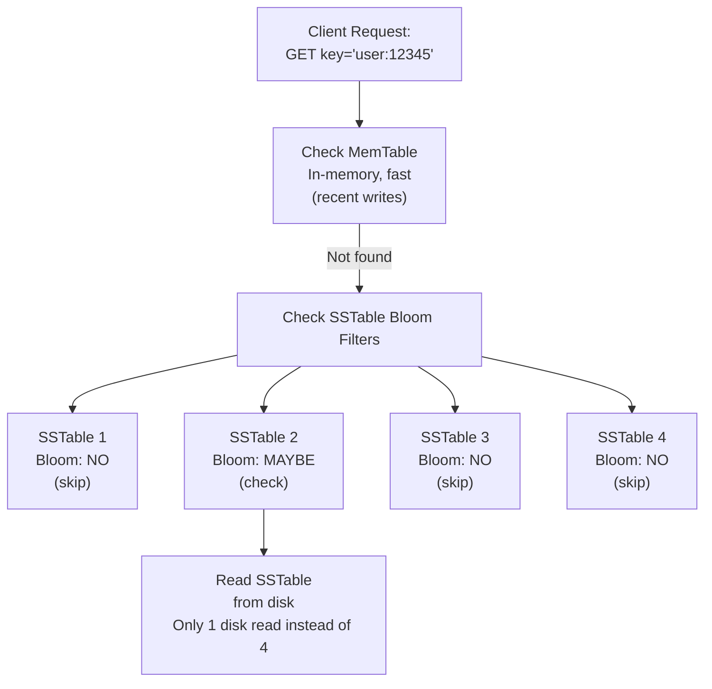

# 🎯 Bloom Filters

## 0️⃣ Prerequisites

Before diving into Bloom filters, you need to understand:

### Hash Functions
A **hash function** takes any input (like a string or number) and converts it into a fixed-size output (usually a number). Think of it as a fingerprint generator for data.

```java
// Simple example: Java's hashCode()
String name = "John";
int hash = name.hashCode();  // Returns something like 2314539
```

Key properties of hash functions:
- **Deterministic**: Same input always produces same output
- **Fast**: Computation is quick, typically O(1)
- **Uniform distribution**: Outputs are spread evenly across the range

### Bit Arrays
A **bit array** (or bitmap) is an array where each element is a single bit (0 or 1). It's extremely memory-efficient because each element uses only 1 bit instead of 8 bits (1 byte) or more.

```java
// Conceptually, a bit array of size 10:
// Index:  0  1  2  3  4  5  6  7  8  9
// Value:  0  0  1  0  1  0  0  0  1  0
```

### False Positives vs False Negatives
- **False Positive**: System says "yes" when the answer should be "no"
- **False Negative**: System says "no" when the answer should be "yes"

Example: A spam filter
- False positive: A legitimate email marked as spam (annoying but recoverable)
- False negative: A spam email reaching your inbox (annoying but tolerable)

---

## 1️⃣ What Problem Does This Exist to Solve?

### The Core Problem: Expensive Membership Queries

Imagine you're building a username registration system. When a user types "john_doe_2024", you need to check if this username already exists.

**The naive approach:**
```java
// Query the database every time
boolean exists = userRepository.existsByUsername("john_doe_2024");
```

**What's wrong with this?**
1. **Database hit for every check**: If you have 10,000 users typing simultaneously, that's 10,000 database queries
2. **Latency**: Each query takes 5-20ms, making the UI feel sluggish
3. **Database load**: Your database becomes a bottleneck
4. **Cost**: More database capacity = more money

### Real-World Pain Points

**Scenario 1: Cache Existence Check**
You have a distributed cache (Redis) with 100 million keys. Before fetching from the database, you want to check if the data exists in cache. But checking the cache itself is a network call.

**Scenario 2: Avoiding Disk Reads**
Google's BigTable stores data on disk. Reading from disk is slow (milliseconds). Before reading, you want to know if a key even exists. Without a Bloom filter, you'd read from disk only to find "key not found."

**Scenario 3: URL Deduplication**
A web crawler has visited 10 billion URLs. Before crawling a new URL, you need to check if it's already been visited. Storing 10 billion URLs in memory is impossible.

### What Breaks Without Bloom Filters?

| Without Bloom Filter | With Bloom Filter |
|---------------------|-------------------|
| 1M database queries/sec | 50K database queries/sec (95% reduction) |
| 20ms average latency | 2ms average latency |
| $10,000/month DB cost | $2,000/month DB cost |
| Disk reads for non-existent keys | Skip disk reads for definitely-not-present keys |

---

## 2️⃣ Intuition and Mental Model

### The Library Card Catalog Analogy

Imagine a massive library with 10 million books. You want to know if a specific book exists.

**Without any system**: Walk through every aisle, check every shelf. Takes hours.

**With a catalog (like a database)**: Look up the book in the catalog. Takes minutes but requires maintaining an expensive, detailed catalog.

**With a Bloom filter (like a quick reference board)**:

Imagine the library has a board at the entrance with 1000 light bulbs. When a book arrives:
1. The librarian runs the book title through 3 different "formulas" (hash functions)
2. Each formula gives a number between 1-1000
3. The librarian turns ON those 3 light bulbs

When you ask "Do you have 'War and Peace'?":
1. Run "War and Peace" through the same 3 formulas
2. Get numbers: 42, 567, 891
3. Check if light bulbs 42, 567, AND 891 are all ON

**If any bulb is OFF**: The book is DEFINITELY NOT in the library
**If all bulbs are ON**: The book is PROBABLY in the library (might be a false positive)

### Why False Positives Happen

Multiple books might turn on overlapping bulbs:
- "War and Peace" → bulbs 42, 567, 891
- "Crime and Punishment" → bulbs 42, 234, 891
- "The Odyssey" → bulbs 567, 789, 999

Now bulbs 42, 567, and 891 are all ON. If you check for "Harry Potter" and it hashes to 42, 567, 891, you'll get a false positive.

### Why False Negatives NEVER Happen

If a book was added, its bulbs are definitely ON. If any bulb is OFF, the book was never added. This is the key guarantee.

**Bloom Filter Guarantee:**
- "Definitely NOT present" → 100% accurate, guaranteed
- "Probably present" → Might be wrong (false positive)

<details>
<summary>ASCII diagram (reference)</summary>

```text
┌─────────────────────────────────────────────────────────────────┐
│                     BLOOM FILTER GUARANTEE                       │
├─────────────────────────────────────────────────────────────────┤
│  "Definitely NOT present"  →  100% accurate, guaranteed         │
│  "Probably present"        →  Might be wrong (false positive)   │
└─────────────────────────────────────────────────────────────────┘
```
</details>

---

## 3️⃣ How It Works Internally

### Core Components

1. **Bit Array**: A fixed-size array of bits, all initialized to 0
2. **Hash Functions**: Multiple independent hash functions (typically 3-10)
3. **Size (m)**: Number of bits in the array
4. **Number of hash functions (k)**: How many hash functions to use

### The Add Operation

When you add an element:

```
Element: "john_doe"

Step 1: Hash with function h1
        h1("john_doe") = 2345678
        Position = 2345678 % m = 42  (if m=1000)
        Set bit[42] = 1

Step 2: Hash with function h2
        h2("john_doe") = 9876543
        Position = 9876543 % m = 543
        Set bit[543] = 1

Step 3: Hash with function h3
        h3("john_doe") = 1111111
        Position = 1111111 % m = 111
        Set bit[111] = 1
```

Visual representation:

```
Before adding "john_doe":
Index:    0   1   2  ...  42  ...  111  ...  543  ...  999
Bits:    [0] [0] [0] ... [0] ... [ 0 ] ... [ 0 ] ... [0]

After adding "john_doe":
Index:    0   1   2  ...  42  ...  111  ...  543  ...  999
Bits:    [0] [0] [0] ... [1] ... [ 1 ] ... [ 1 ] ... [0]
                         ↑        ↑         ↑
                        h1       h3        h2
```

### The Query Operation

When you check if an element exists:

```
Query: "john_doe"

Step 1: Hash with h1 → position 42  → bit[42] = 1? ✓
Step 2: Hash with h2 → position 543 → bit[543] = 1? ✓
Step 3: Hash with h3 → position 111 → bit[111] = 1? ✓

All bits are 1 → "Probably present"

Query: "jane_doe"

Step 1: Hash with h1 → position 99  → bit[99] = 0? ✗

At least one bit is 0 → "Definitely NOT present"
```

### The Mathematics: False Positive Rate

The probability of a false positive depends on:
- **m**: Size of bit array
- **n**: Number of elements inserted
- **k**: Number of hash functions

**Formula for false positive probability (p):**

```
p ≈ (1 - e^(-kn/m))^k
```

**Optimal number of hash functions:**

```
k_optimal = (m/n) × ln(2) ≈ 0.693 × (m/n)
```

**Practical example:**
- You want to store 1 million elements
- You want a 1% false positive rate
- Required bits: m = -n × ln(p) / (ln(2))² ≈ 9.6 million bits ≈ 1.2 MB
- Optimal k = 7 hash functions

| Storage Type | Size (1 Million Items) |
|--------------|------------------------|
| HashSet<String> (avg 50 bytes/string) | ~50 MB |
| Bloom Filter (1% FP rate) | ~1.2 MB |
| Memory savings | ~97% |

<details>
<summary>ASCII diagram (reference)</summary>

```text
┌────────────────────────────────────────────────────────────────┐
│               MEMORY COMPARISON (1 Million Items)               │
├────────────────────────────────────────────────────────────────┤
│  HashSet<String> (avg 50 bytes/string):  ~50 MB                │
│  Bloom Filter (1% FP rate):              ~1.2 MB               │
│  Memory savings:                         ~97%                   │
└────────────────────────────────────────────────────────────────┘
```
</details>

### Why You Cannot Delete

Deleting would require setting bits back to 0. But multiple elements might share the same bit positions:

```
"alice" → bits 10, 20, 30
"bob"   → bits 20, 40, 50

If you delete "alice" by setting bits 10, 20, 30 to 0:
- bit[20] becomes 0
- Now "bob" appears to not exist (FALSE NEGATIVE!)
```

This is why standard Bloom filters don't support deletion. (Counting Bloom filters solve this, covered later.)

---

## 4️⃣ Simulation: Step-by-Step Walkthrough

Let's trace through a complete example with actual numbers.

### Setup

```
Bit array size (m): 20 bits
Hash functions (k): 3
Initial state: all bits = 0

Bit array:
Index:  0  1  2  3  4  5  6  7  8  9 10 11 12 13 14 15 16 17 18 19
Value: [0][0][0][0][0][0][0][0][0][0][0][0][0][0][0][0][0][0][0][0]
```

### Hash Functions (Simplified)

```java
// In reality, we use MurmurHash, FNV, etc.
// For this simulation, let's use simple formulas:

h1(x) = (hashCode(x) × 1) % 20
h2(x) = (hashCode(x) × 2) % 20  
h3(x) = (hashCode(x) × 3) % 20
```

### Adding Elements

**Add "apple":**
```
hashCode("apple") = 93029210

h1("apple") = (93029210 × 1) % 20 = 10
h2("apple") = (93029210 × 2) % 20 = 0
h3("apple") = (93029210 × 3) % 20 = 10  (collision with h1, that's fine)

Set bits: 0, 10

Bit array after "apple":
Index:  0  1  2  3  4  5  6  7  8  9 10 11 12 13 14 15 16 17 18 19
Value: [1][0][0][0][0][0][0][0][0][0][1][0][0][0][0][0][0][0][0][0]
        ↑                             ↑
```

**Add "banana":**
```
hashCode("banana") = -1396355227

h1("banana") = |-1396355227 × 1| % 20 = 7
h2("banana") = |-1396355227 × 2| % 20 = 14
h3("banana") = |-1396355227 × 3| % 20 = 1

Set bits: 1, 7, 14

Bit array after "banana":
Index:  0  1  2  3  4  5  6  7  8  9 10 11 12 13 14 15 16 17 18 19
Value: [1][1][0][0][0][0][0][1][0][0][1][0][0][0][1][0][0][0][0][0]
        ↑  ↑              ↑        ↑           ↑
```

**Add "cherry":**
```
h1("cherry") = 3
h2("cherry") = 6
h3("cherry") = 9

Bit array after "cherry":
Index:  0  1  2  3  4  5  6  7  8  9 10 11 12 13 14 15 16 17 18 19
Value: [1][1][0][1][0][0][1][1][0][1][1][0][0][0][1][0][0][0][0][0]
```

### Querying Elements

**Query "apple":**
```
h1("apple") = 10 → bit[10] = 1 ✓
h2("apple") = 0  → bit[0]  = 1 ✓
h3("apple") = 10 → bit[10] = 1 ✓

Result: "Probably present" ✓ (correct, apple was added)
```

**Query "date":**
```
h1("date") = 5  → bit[5] = 0 ✗

Result: "Definitely NOT present" ✓ (correct, date was never added)
```

**Query "elderberry" (false positive scenario):**
```
Suppose:
h1("elderberry") = 1  → bit[1] = 1 ✓  (set by banana)
h2("elderberry") = 10 → bit[10] = 1 ✓ (set by apple)
h3("elderberry") = 7  → bit[7] = 1 ✓  (set by banana)

Result: "Probably present" ✗ (FALSE POSITIVE! elderberry was never added)
```

This demonstrates how false positives occur: all the bits happen to be set by other elements.

---

## 5️⃣ How Engineers Use This in Production

### Google BigTable

BigTable stores data in SSTables (Sorted String Tables) on disk. Each SSTable has a Bloom filter.

**The problem**: You have 1000 SSTables. To find a key, you might need to read all 1000 from disk.

**The solution**: Each SSTable has a Bloom filter stored in memory. Before reading an SSTable from disk:
1. Check the Bloom filter
2. If "definitely not present" → skip this SSTable entirely
3. If "probably present" → read from disk

**Impact**: Reduces disk reads by 90%+



<details>
<summary>ASCII diagram (reference)</summary>

```text
┌─────────────────────────────────────────────────────────────────┐
│                    BIGTABLE READ PATH                            │
├─────────────────────────────────────────────────────────────────┤
│                                                                  │
│  Client Request: GET key="user:12345"                           │
│           │                                                      │
│           ▼                                                      │
│  ┌─────────────────┐                                            │
│  │ Check MemTable  │ ← In-memory, fast                          │
│  │ (recent writes) │                                            │
│  └────────┬────────┘                                            │
│           │ Not found                                            │
│           ▼                                                      │
│  ┌─────────────────────────────────────────────────────────┐    │
│  │              Check SSTable Bloom Filters                 │    │
│  │  ┌─────────┐ ┌─────────┐ ┌─────────┐ ┌─────────┐        │    │
│  │  │SSTable 1│ │SSTable 2│ │SSTable 3│ │SSTable 4│        │    │
│  │  │ Bloom:  │ │ Bloom:  │ │ Bloom:  │ │ Bloom:  │        │    │
│  │  │   NO    │ │  MAYBE  │ │   NO    │ │   NO    │        │    │
│  │  │ (skip)  │ │ (check) │ │ (skip)  │ │ (skip)  │        │    │
│  │  └─────────┘ └────┬────┘ └─────────┘ └─────────┘        │    │
│  └───────────────────┼─────────────────────────────────────┘    │
│                      │                                           │
│                      ▼                                           │
│              ┌──────────────┐                                   │
│              │ Read SSTable │ ← Only 1 disk read instead of 4   │
│              │   from disk  │                                   │
│              └──────────────┘                                   │
│                                                                  │
└─────────────────────────────────────────────────────────────────┘
```
</details>

### Apache Cassandra

Cassandra uses Bloom filters for the same reason as BigTable. Each SSTable has its own Bloom filter.

Configuration in `cassandra.yaml`:
```yaml
# False positive rate for Bloom filters
# Lower = more memory, fewer false positives
bloom_filter_fp_chance: 0.01  # 1% false positive rate
```

### Medium's Recommendation System

Medium uses Bloom filters to avoid recommending articles a user has already read.

**Without Bloom filter**:
```sql
SELECT * FROM articles 
WHERE article_id NOT IN (
    SELECT article_id FROM user_reads WHERE user_id = ?
)
```
This query becomes slow with millions of reads per user.

**With Bloom filter**:
```java
// Each user has a Bloom filter of read article IDs
BloomFilter<String> userReadArticles = getUserBloomFilter(userId);

List<Article> recommendations = candidateArticles.stream()
    .filter(article -> !userReadArticles.mightContain(article.getId()))
    .limit(10)
    .collect(Collectors.toList());
```

### Akamai CDN

Akamai uses Bloom filters to track "one-hit wonders", URLs that are requested only once. They don't cache these because caching them would waste memory.

**Logic**:
1. First request for URL → Add to Bloom filter, don't cache
2. Second request for URL → Bloom filter says "probably seen" → Now cache it

This prevents the cache from being polluted by rarely-accessed content.

---

## 6️⃣ Implementation in Java

### Maven Dependencies

```xml
<!-- Google Guava provides a production-ready Bloom filter -->
<dependency>
    <groupId>com.google.guava</groupId>
    <artifactId>guava</artifactId>
    <version>32.1.3-jre</version>
</dependency>
```

### Using Guava's Bloom Filter

```java
import com.google.common.hash.BloomFilter;
import com.google.common.hash.Funnels;

public class BloomFilterDemo {
    
    public static void main(String[] args) {
        // Create a Bloom filter for 1 million strings with 1% false positive rate
        BloomFilter<String> bloomFilter = BloomFilter.create(
            Funnels.stringFunnel(java.nio.charset.StandardCharsets.UTF_8),
            1_000_000,  // expected insertions
            0.01        // false positive probability (1%)
        );
        
        // Add elements
        bloomFilter.put("user:12345");
        bloomFilter.put("user:67890");
        bloomFilter.put("user:11111");
        
        // Query elements
        System.out.println(bloomFilter.mightContain("user:12345")); // true
        System.out.println(bloomFilter.mightContain("user:99999")); // false (probably)
        
        // Check approximate element count
        System.out.println("Approximate count: " + bloomFilter.approximateElementCount());
        
        // Check expected false positive probability
        System.out.println("Expected FPP: " + bloomFilter.expectedFpp());
    }
}
```

### Custom Implementation from Scratch

Understanding the internals by building it yourself:

```java
import java.util.BitSet;
import java.util.function.Function;

/**
 * A simple Bloom filter implementation for educational purposes.
 * In production, use Guava's BloomFilter.
 */
public class SimpleBloomFilter<T> {
    
    private final BitSet bitSet;
    private final int size;
    private final int numHashFunctions;
    private int elementCount;
    
    /**
     * Creates a Bloom filter.
     * 
     * @param expectedElements Expected number of elements to insert
     * @param falsePositiveRate Desired false positive rate (e.g., 0.01 for 1%)
     */
    public SimpleBloomFilter(int expectedElements, double falsePositiveRate) {
        // Calculate optimal size: m = -n * ln(p) / (ln(2))^2
        this.size = optimalSize(expectedElements, falsePositiveRate);
        
        // Calculate optimal number of hash functions: k = (m/n) * ln(2)
        this.numHashFunctions = optimalHashFunctions(size, expectedElements);
        
        this.bitSet = new BitSet(size);
        this.elementCount = 0;
        
        System.out.println("Created Bloom filter:");
        System.out.println("  Bit array size: " + size + " bits (" + (size / 8) + " bytes)");
        System.out.println("  Hash functions: " + numHashFunctions);
    }
    
    /**
     * Adds an element to the Bloom filter.
     * After this, mightContain() will return true for this element.
     */
    public void add(T element) {
        int[] hashes = getHashes(element);
        for (int hash : hashes) {
            bitSet.set(hash);
        }
        elementCount++;
    }
    
    /**
     * Checks if an element might be in the set.
     * 
     * @return false means DEFINITELY NOT in set
     *         true means PROBABLY in set (might be false positive)
     */
    public boolean mightContain(T element) {
        int[] hashes = getHashes(element);
        for (int hash : hashes) {
            if (!bitSet.get(hash)) {
                return false;  // Definitely not present
            }
        }
        return true;  // Probably present
    }
    
    /**
     * Generates k hash values for an element.
     * Uses double hashing technique: h(i) = h1 + i * h2
     * This is more efficient than k independent hash functions.
     */
    private int[] getHashes(T element) {
        int[] result = new int[numHashFunctions];
        
        // Get two independent hash values
        int hash1 = element.hashCode();
        int hash2 = hash1 >>> 16;  // Use upper bits as second hash
        
        // Generate k hashes using double hashing
        for (int i = 0; i < numHashFunctions; i++) {
            int combinedHash = hash1 + (i * hash2);
            // Ensure positive and within range
            result[i] = Math.abs(combinedHash % size);
        }
        
        return result;
    }
    
    /**
     * Calculates optimal bit array size.
     * Formula: m = -n * ln(p) / (ln(2))^2
     */
    private static int optimalSize(int n, double p) {
        return (int) Math.ceil(-n * Math.log(p) / (Math.log(2) * Math.log(2)));
    }
    
    /**
     * Calculates optimal number of hash functions.
     * Formula: k = (m/n) * ln(2)
     */
    private static int optimalHashFunctions(int m, int n) {
        return Math.max(1, (int) Math.round((double) m / n * Math.log(2)));
    }
    
    /**
     * Returns the current false positive probability based on elements added.
     * Formula: p = (1 - e^(-kn/m))^k
     */
    public double currentFalsePositiveProbability() {
        double exponent = -((double) numHashFunctions * elementCount) / size;
        return Math.pow(1 - Math.exp(exponent), numHashFunctions);
    }
    
    public int getElementCount() {
        return elementCount;
    }
    
    public int getBitSetCardinality() {
        return bitSet.cardinality();  // Number of bits set to 1
    }
}
```

### Testing the Implementation

```java
public class BloomFilterTest {
    
    public static void main(String[] args) {
        // Create Bloom filter for 10,000 elements with 1% FP rate
        SimpleBloomFilter<String> filter = new SimpleBloomFilter<>(10_000, 0.01);
        
        // Add 10,000 elements
        for (int i = 0; i < 10_000; i++) {
            filter.add("element_" + i);
        }
        
        System.out.println("\nAfter adding 10,000 elements:");
        System.out.println("Bits set: " + filter.getBitSetCardinality());
        System.out.println("Current FPP: " + filter.currentFalsePositiveProbability());
        
        // Test for elements that exist
        int truePositives = 0;
        for (int i = 0; i < 10_000; i++) {
            if (filter.mightContain("element_" + i)) {
                truePositives++;
            }
        }
        System.out.println("\nTrue positives: " + truePositives + "/10000 (should be 10000)");
        
        // Test for elements that DON'T exist
        int falsePositives = 0;
        int testCount = 10_000;
        for (int i = 10_000; i < 10_000 + testCount; i++) {
            if (filter.mightContain("element_" + i)) {
                falsePositives++;
            }
        }
        double actualFPR = (double) falsePositives / testCount;
        System.out.println("False positives: " + falsePositives + "/" + testCount);
        System.out.println("Actual FP rate: " + (actualFPR * 100) + "% (target: 1%)");
    }
}
```

### Production Use Case: Username Availability Check

```java
import com.google.common.hash.BloomFilter;
import com.google.common.hash.Funnels;
import org.springframework.stereotype.Service;
import java.nio.charset.StandardCharsets;

@Service
public class UsernameService {
    
    private final BloomFilter<String> usernameFilter;
    private final UserRepository userRepository;
    
    public UsernameService(UserRepository userRepository) {
        this.userRepository = userRepository;
        
        // Initialize Bloom filter with existing usernames
        // Assume we expect up to 10 million users
        this.usernameFilter = BloomFilter.create(
            Funnels.stringFunnel(StandardCharsets.UTF_8),
            10_000_000,
            0.01
        );
        
        // Load existing usernames into Bloom filter
        // This happens at application startup
        loadExistingUsernames();
    }
    
    private void loadExistingUsernames() {
        userRepository.findAllUsernames()
            .forEach(usernameFilter::put);
    }
    
    /**
     * Checks if a username is available.
     * Uses Bloom filter to avoid unnecessary database queries.
     */
    public UsernameAvailability checkAvailability(String username) {
        // Normalize username
        String normalizedUsername = username.toLowerCase().trim();
        
        // First, check Bloom filter (fast, in-memory)
        if (!usernameFilter.mightContain(normalizedUsername)) {
            // Bloom filter says "definitely not present"
            // This is 100% accurate, no need to check database
            return UsernameAvailability.AVAILABLE;
        }
        
        // Bloom filter says "might be present"
        // Need to verify with database (might be false positive)
        boolean existsInDb = userRepository.existsByUsername(normalizedUsername);
        
        if (existsInDb) {
            return UsernameAvailability.TAKEN;
        } else {
            // This was a false positive from Bloom filter
            return UsernameAvailability.AVAILABLE;
        }
    }
    
    /**
     * Registers a new user.
     * Updates the Bloom filter after successful registration.
     */
    public void registerUser(String username) {
        String normalizedUsername = username.toLowerCase().trim();
        
        // Save to database
        userRepository.save(new User(normalizedUsername));
        
        // Update Bloom filter
        usernameFilter.put(normalizedUsername);
    }
    
    public enum UsernameAvailability {
        AVAILABLE,
        TAKEN
    }
}
```

### Spring Boot Configuration

```java
import com.google.common.hash.BloomFilter;
import com.google.common.hash.Funnels;
import org.springframework.context.annotation.Bean;
import org.springframework.context.annotation.Configuration;
import java.nio.charset.StandardCharsets;

@Configuration
public class BloomFilterConfig {
    
    @Bean
    public BloomFilter<String> urlBloomFilter() {
        // For URL deduplication in a web crawler
        return BloomFilter.create(
            Funnels.stringFunnel(StandardCharsets.UTF_8),
            100_000_000,  // 100 million URLs
            0.001         // 0.1% false positive rate
        );
    }
    
    @Bean
    public BloomFilter<Long> userIdBloomFilter() {
        // For checking if user exists
        return BloomFilter.create(
            Funnels.longFunnel(),
            50_000_000,   // 50 million user IDs
            0.01          // 1% false positive rate
        );
    }
}
```

---

## 7️⃣ Tradeoffs, Pitfalls, and Common Mistakes

### Tradeoffs

| Aspect | Bloom Filter | HashSet | Database Query |
|--------|-------------|---------|----------------|
| Memory | Very low (~1.2 MB for 1M items) | High (~50 MB for 1M items) | N/A |
| False Positives | Yes (configurable) | No | No |
| False Negatives | Never | Never | Never |
| Deletion | Not supported | Supported | Supported |
| Persistence | Manual | Manual | Built-in |
| Exact Count | No | Yes | Yes |

### Common Pitfalls

**1. Underestimating the number of elements**

```java
// BAD: Created for 1,000 elements, but you add 1,000,000
BloomFilter<String> filter = BloomFilter.create(
    Funnels.stringFunnel(StandardCharsets.UTF_8),
    1_000,  // Way too small!
    0.01
);

// After adding 1M elements, false positive rate explodes to ~99%
```

**Solution**: Always overestimate. It's better to allocate extra memory than have useless results.

**2. Forgetting to update after database writes**

```java
// BAD: Added to database but forgot to update Bloom filter
userRepository.save(user);
// Missing: bloomFilter.put(user.getUsername());

// Now the Bloom filter is out of sync!
```

**3. Not handling Bloom filter rebuilds**

Over time, if you need to delete elements, you must rebuild the entire Bloom filter:

```java
@Scheduled(cron = "0 0 3 * * *")  // 3 AM daily
public void rebuildBloomFilter() {
    BloomFilter<String> newFilter = BloomFilter.create(
        Funnels.stringFunnel(StandardCharsets.UTF_8),
        expectedSize,
        falsePositiveRate
    );
    
    // Reload all elements from database
    userRepository.findAllUsernames()
        .forEach(newFilter::put);
    
    // Atomic swap
    this.usernameFilter = newFilter;
}
```

**4. Using wrong hash functions**

```java
// BAD: Using Object.hashCode() directly
// Java's hashCode() is not designed for Bloom filters
// It has poor distribution for some input types

// GOOD: Use Guava's BloomFilter which uses Murmur3 internally
```

### Performance Gotchas

**1. Serialization overhead**

Bloom filters need to be serialized for persistence or distribution:

```java
// Guava provides built-in serialization
try (OutputStream out = new FileOutputStream("bloom.bin")) {
    bloomFilter.writeTo(out);
}

try (InputStream in = new FileInputStream("bloom.bin")) {
    BloomFilter<String> loaded = BloomFilter.readFrom(in, 
        Funnels.stringFunnel(StandardCharsets.UTF_8));
}
```

**2. Thread safety**

Guava's BloomFilter is NOT thread-safe by default:

```java
// BAD: Concurrent modifications can corrupt the filter
executorService.submit(() -> bloomFilter.put("element1"));
executorService.submit(() -> bloomFilter.put("element2"));

// GOOD: Use synchronization
synchronized(bloomFilter) {
    bloomFilter.put("element");
}

// BETTER: Use a thread-safe wrapper or partition by thread
```

### Security Considerations

**1. Denial of Service via Bloom filter saturation**

An attacker could add millions of elements to saturate the filter:

```java
// Mitigation: Rate limiting and size limits
if (bloomFilter.approximateElementCount() > MAX_ELEMENTS) {
    throw new BloomFilterFullException("Bloom filter capacity exceeded");
}
```

**2. Information leakage**

Bloom filters can leak information about what's in the set:

```java
// An attacker can probe to discover valid usernames
for (String guess : commonUsernames) {
    if (bloomFilter.mightContain(guess)) {
        // This username probably exists
    }
}
```

Mitigation: Don't expose Bloom filter queries directly to untrusted clients.

---

## 8️⃣ When NOT to Use Bloom Filters

### Anti-Patterns

**1. When you need exact answers**

```java
// BAD: Using Bloom filter for authorization
if (bloomFilter.mightContain(userId)) {
    grantAccess();  // DANGEROUS! False positives could grant unauthorized access
}
```

**2. When deletion is required frequently**

If your use case requires frequent deletions, a standard Bloom filter is wrong:
- Consider Counting Bloom Filter (uses counters instead of bits)
- Consider Cuckoo Filter (supports deletion)

**3. When the set is small**

```java
// OVERKILL: Using Bloom filter for 100 elements
// Just use a HashSet, it's simpler and gives exact answers
Set<String> smallSet = new HashSet<>();
```

**4. When false positives are unacceptable**

- Financial transactions: "Did this transaction already process?"
- Medical records: "Is this patient allergic to this drug?"
- Security: "Is this user banned?"

### Better Alternatives for Specific Scenarios

| Scenario | Better Alternative |
|----------|-------------------|
| Need deletion | Counting Bloom Filter, Cuckoo Filter |
| Need exact count | HyperLogLog (for cardinality), HashMap (for exact) |
| Small dataset (<10K) | HashSet |
| Need to retrieve values | HashMap, Database |
| Ordered iteration | TreeSet |

---

## 9️⃣ Comparison with Alternatives

### Bloom Filter vs HashSet

```java
// Memory comparison for 1 million strings
HashSet<String> hashSet = new HashSet<>();  // ~50 MB
BloomFilter<String> bloom = BloomFilter.create(...);  // ~1.2 MB

// But HashSet gives exact answers, Bloom filter has false positives
```

| Feature | Bloom Filter | HashSet |
|---------|-------------|---------|
| Memory | O(n) bits | O(n) objects |
| False positives | Yes | No |
| Lookup time | O(k) | O(1) average |
| Deletion | No | Yes |
| Iteration | No | Yes |

### Bloom Filter vs Cuckoo Filter

Cuckoo filters are a newer alternative that supports deletion:

| Feature | Bloom Filter | Cuckoo Filter |
|---------|-------------|---------------|
| Deletion | No | Yes |
| Memory efficiency | Good | Better (for FPR < 3%) |
| Lookup speed | Fast | Faster |
| Implementation complexity | Simple | More complex |
| Maturity | Battle-tested | Newer |

### Bloom Filter vs Database Index

| Feature | Bloom Filter | Database Index |
|---------|-------------|----------------|
| Purpose | Existence check | Full queries |
| Storage | Memory | Disk |
| Speed | Nanoseconds | Milliseconds |
| Accuracy | Probabilistic | Exact |
| Use case | Pre-filter | Primary lookup |

**When to use together:**
```
Request → Bloom Filter (fast, in-memory)
           ↓
    "Definitely not present" → Return immediately
    "Might be present" → Query database index
```

### Real-World Migration: From HashSet to Bloom Filter

**Before (HashSet):**
```java
// Memory: 500 MB for 10 million URLs
private Set<String> visitedUrls = new HashSet<>();

public boolean hasVisited(String url) {
    return visitedUrls.contains(url);
}
```

**After (Bloom Filter):**
```java
// Memory: 12 MB for 10 million URLs (1% FPR)
private BloomFilter<String> visitedUrls = BloomFilter.create(
    Funnels.stringFunnel(StandardCharsets.UTF_8),
    10_000_000,
    0.01
);

public boolean hasVisited(String url) {
    return visitedUrls.mightContain(url);
}
// Trade-off: 1% of URLs might be incorrectly marked as visited
// For a web crawler, this is acceptable
```

---

## 🔟 Interview Follow-Up Questions with Answers

### L4 (Entry-Level) Questions

**Q1: How does a Bloom filter work?**

**Answer**: A Bloom filter is a probabilistic data structure that efficiently tests whether an element is a member of a set. It uses a bit array and multiple hash functions. When adding an element, we hash it with each function and set those bit positions to 1. When querying, we check if all corresponding bits are 1. If any bit is 0, the element is definitely not in the set. If all bits are 1, the element is probably in the set (might be a false positive).

**Q2: Can a Bloom filter have false negatives?**

**Answer**: No, never. If an element was added, all its bits are set to 1. Those bits can never be unset (in a standard Bloom filter). So when we query for that element, all bits will be 1, and we'll correctly return "probably present." False negatives are impossible because bits only go from 0 to 1, never back.

**Q3: Why can't you delete from a Bloom filter?**

**Answer**: Because multiple elements can share the same bit positions. If element A sets bits 5, 10, 15 and element B sets bits 10, 20, 30, they share bit 10. If you delete A by clearing bits 5, 10, 15, you'll also clear bit 10 that B needs. Now querying for B would return "definitely not present" even though B was added. This is a false negative, which violates the Bloom filter guarantee.

### L5 (Senior) Questions

**Q4: How do you choose the optimal size and number of hash functions?**

**Answer**: 
- **Size (m)**: Use the formula m = -n × ln(p) / (ln(2))². For n=1 million elements and p=1% false positive rate, m ≈ 9.6 million bits ≈ 1.2 MB.
- **Hash functions (k)**: Use k = (m/n) × ln(2). For the above, k ≈ 7.

The intuition: More bits means lower collision probability. More hash functions means more bits checked (reduces false positives) but also more bits set (increases collision). There's a sweet spot.

**Q5: How would you implement a distributed Bloom filter?**

**Answer**: Several approaches:
1. **Partitioned**: Divide the bit array across nodes. Each node owns a range of bits. Queries must check all nodes.
2. **Replicated**: Each node has a complete copy. Updates broadcast to all nodes. Queries are local but updates are expensive.
3. **Counting Bloom filter with CRDT**: Use counters instead of bits. Counters can be merged across nodes using CRDT semantics (take max).

For a distributed cache, I'd use partitioned approach with consistent hashing to determine which node owns which bits.

**Q6: A Bloom filter query returns "probably present" but the database says the element doesn't exist. What happened?**

**Answer**: This is a false positive. The element's hash positions happened to be set by other elements. This is expected behavior, not a bug. The false positive rate depends on the filter's size, number of hash functions, and number of elements inserted. If this happens too often, the filter might be undersized or overfilled.

### L6 (Staff) Questions

**Q7: Design a system that uses Bloom filters for a web crawler that needs to avoid recrawling URLs.**

**Answer**:

```
Architecture:

1. URL Frontier (Redis): Queue of URLs to crawl
2. Bloom Filter Service: Distributed Bloom filter
3. Crawler Workers: Fetch and parse pages
4. URL Extractor: Extracts new URLs from pages

Flow:
1. Worker pulls URL from frontier
2. Check Bloom filter: "Have we seen this URL?"
   - Definitely not → Crawl it
   - Probably yes → Skip it (accept ~1% over-filtering)
3. After crawling, add URL to Bloom filter
4. Extract new URLs, add to frontier if not in Bloom filter

Scaling considerations:
- Bloom filter size: 10 billion URLs at 1% FPR ≈ 12 GB
- Partition across 12 nodes (1 GB each)
- Use consistent hashing for URL → node mapping
- Replicate each partition 2x for availability

Rebuild strategy:
- Bloom filters can't delete, so false positive rate grows over time
- Weekly rebuild from URL database
- Blue-green deployment: build new filter, then swap
```

**Q8: Compare Bloom filters to other probabilistic data structures. When would you choose each?**

**Answer**:

| Structure | Use Case | Trade-off |
|-----------|----------|-----------|
| Bloom Filter | Set membership | False positives, no deletion |
| Counting Bloom | Set membership with deletion | 4x memory vs standard Bloom |
| Cuckoo Filter | Set membership with deletion | Better than Counting Bloom, more complex |
| HyperLogLog | Cardinality estimation | ~0.8% error, can't query membership |
| Count-Min Sketch | Frequency estimation | Over-counts, never under-counts |

I'd choose:
- **Bloom**: Cache existence, URL deduplication, spell checkers
- **Cuckoo**: When deletion is needed and memory is constrained
- **HyperLogLog**: Unique visitors, unique IPs
- **Count-Min Sketch**: Trending topics, heavy hitters

---

## 1️⃣1️⃣ One Clean Mental Summary

A Bloom filter is a memory-efficient probabilistic data structure that answers "Is X in the set?" with either "definitely no" or "probably yes." It uses a bit array and multiple hash functions. Adding an element sets several bits to 1. Querying checks if all those bits are 1. False positives occur when different elements happen to set overlapping bits, but false negatives are impossible. Use Bloom filters when you need fast, memory-efficient existence checks and can tolerate occasional false positives, like avoiding unnecessary database queries or deduplicating URLs in a web crawler.

---

## Counting Bloom Filters

Standard Bloom filters don't support deletion. Counting Bloom filters solve this by using counters instead of bits.

### How It Works

Instead of a bit array, use an array of small counters (typically 4 bits each):

```
Standard Bloom:  [0][1][0][1][1][0][0][1]  (1 bit each)
Counting Bloom:  [0][2][0][1][3][0][0][1]  (4 bits each, values 0-15)
```

**Add operation**: Increment counters instead of setting bits
**Delete operation**: Decrement counters
**Query operation**: Check if all counters are > 0

### Implementation

```java
public class CountingBloomFilter<T> {
    
    private final int[] counters;  // Using int for simplicity, production uses 4-bit
    private final int size;
    private final int numHashFunctions;
    
    public CountingBloomFilter(int expectedElements, double falsePositiveRate) {
        this.size = optimalSize(expectedElements, falsePositiveRate);
        this.numHashFunctions = optimalHashFunctions(size, expectedElements);
        this.counters = new int[size];
    }
    
    public void add(T element) {
        for (int hash : getHashes(element)) {
            counters[hash]++;
        }
    }
    
    public void remove(T element) {
        // First verify element might exist
        if (!mightContain(element)) {
            throw new IllegalArgumentException("Element not in filter");
        }
        
        for (int hash : getHashes(element)) {
            if (counters[hash] > 0) {
                counters[hash]--;
            }
        }
    }
    
    public boolean mightContain(T element) {
        for (int hash : getHashes(element)) {
            if (counters[hash] == 0) {
                return false;
            }
        }
        return true;
    }
    
    // ... hash function implementation same as before
}
```

### Trade-offs

| Aspect | Standard Bloom | Counting Bloom |
|--------|---------------|----------------|
| Memory | 1 bit per position | 4 bits per position (4x more) |
| Deletion | Not supported | Supported |
| Counter overflow | N/A | Possible (rare) |
| Use case | Static sets | Dynamic sets |

---

## Scalable Bloom Filters

Standard Bloom filters have a fixed capacity. Scalable Bloom filters grow dynamically.

### The Problem

```java
// Created for 1 million elements
BloomFilter<String> filter = BloomFilter.create(..., 1_000_000, 0.01);

// What happens when you need to add 10 million?
// Option 1: False positive rate explodes
// Option 2: Rebuild with larger size (expensive)
```

### The Solution: Chain of Bloom Filters

```java
public class ScalableBloomFilter<T> {
    
    private final List<BloomFilter<T>> filters = new ArrayList<>();
    private final int initialCapacity;
    private final double targetFPR;
    private final double tighteningRatio = 0.5;  // Each new filter has stricter FPR
    private int totalElements = 0;
    
    public ScalableBloomFilter(int initialCapacity, double targetFPR) {
        this.initialCapacity = initialCapacity;
        this.targetFPR = targetFPR;
        addNewFilter();
    }
    
    private void addNewFilter() {
        // Each subsequent filter has a tighter FPR
        // This ensures overall FPR stays bounded
        double filterFPR = targetFPR * Math.pow(tighteningRatio, filters.size());
        
        BloomFilter<T> newFilter = BloomFilter.create(
            (Funnel<T>) Funnels.stringFunnel(StandardCharsets.UTF_8),
            initialCapacity,
            filterFPR
        );
        filters.add(newFilter);
    }
    
    public void add(T element) {
        // Add to the most recent filter
        BloomFilter<T> currentFilter = filters.get(filters.size() - 1);
        currentFilter.put(element);
        totalElements++;
        
        // If current filter is getting full, create a new one
        if (currentFilter.approximateElementCount() >= initialCapacity) {
            addNewFilter();
        }
    }
    
    public boolean mightContain(T element) {
        // Check all filters, element might be in any of them
        for (BloomFilter<T> filter : filters) {
            if (filter.mightContain(element)) {
                return true;
            }
        }
        return false;
    }
}
```

### How Tightening Ratio Works

```
Filter 0: FPR = 0.01 (1%)
Filter 1: FPR = 0.01 × 0.5 = 0.005 (0.5%)
Filter 2: FPR = 0.01 × 0.25 = 0.0025 (0.25%)
...

Overall FPR = sum of individual FPRs = 0.01 + 0.005 + 0.0025 + ...
            = 0.01 / (1 - 0.5) = 0.02 (2%)
```

The geometric series ensures the overall FPR stays bounded even as filters are added.

---

## Summary

Bloom filters are essential tools for building efficient, scalable systems. They trade perfect accuracy for dramatic memory savings, making them ideal for:

- **Cache existence checks** (avoid network calls)
- **Database query optimization** (avoid disk reads)
- **Deduplication** (URLs, events, messages)
- **Recommendation filtering** (don't recommend seen items)

Key takeaways:
1. False positives are possible, false negatives are impossible
2. Memory usage is ~10 bits per element for 1% FPR
3. Cannot delete from standard Bloom filters
4. Use Counting Bloom filters when deletion is needed
5. Use Scalable Bloom filters when capacity is unknown
6. Always verify positive results against the source of truth

