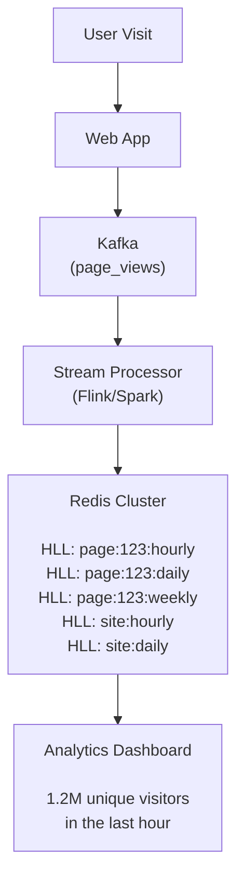

# 🎯 HyperLogLog

## 0️⃣ Prerequisites

Before diving into HyperLogLog, you need to understand:

### Cardinality
**Cardinality** means the count of distinct (unique) elements in a set. 

```java
// Set: {apple, banana, apple, cherry, banana, apple}
// Cardinality = 3 (apple, banana, cherry are unique)

Set<String> fruits = new HashSet<>();
fruits.add("apple");
fruits.add("banana");
fruits.add("apple");   // duplicate, ignored
fruits.add("cherry");
fruits.add("banana");  // duplicate, ignored

int cardinality = fruits.size();  // 3
```

### Hash Functions
A hash function converts any input into a fixed-size output (typically a number). For HyperLogLog, we need hash functions that produce uniformly distributed outputs.

```java
// MurmurHash3 produces 64-bit hash values
long hash = MurmurHash3.hash64("user_12345");
// Result: 0x5A3B7C8D9E1F2A3B (some 64-bit number)
```

### Binary Representation
Numbers can be represented in binary (base 2). HyperLogLog relies heavily on counting leading zeros in binary.

```
Decimal 8  = Binary 1000     (0 leading zeros before the 1)
Decimal 4  = Binary 0100     (1 leading zero before the 1)
Decimal 2  = Binary 0010     (2 leading zeros before the 1)
Decimal 1  = Binary 0001     (3 leading zeros before the 1)
```

### Probability and Expected Value
If you flip a coin, the probability of heads is 0.5. The expected number of flips to get heads is 2. HyperLogLog uses similar probabilistic reasoning.

---

## 1️⃣ What Problem Does This Exist to Solve?

### The Core Problem: Counting Unique Items at Scale

Imagine you're running a website and want to know: "How many unique visitors did we have today?"

**The naive approach:**
```java
Set<String> uniqueVisitors = new HashSet<>();

void recordVisit(String visitorId) {
    uniqueVisitors.add(visitorId);
}

int getUniqueCount() {
    return uniqueVisitors.size();
}
```

**What's wrong with this?**

| Visitors | Memory (HashSet) | Memory (HyperLogLog) |
|----------|------------------|---------------------|
| 1 million | ~50 MB | 12 KB |
| 100 million | ~5 GB | 12 KB |
| 1 billion | ~50 GB | 12 KB |

The HashSet approach doesn't scale. You'd need 50 GB of RAM just to count unique visitors.

### Real-World Pain Points

**Scenario 1: Unique Visitors per Page**
You have 10 million pages. Each page needs its own unique visitor count. With HashSet, that's 10 million × 50 MB = 500 TB. Impossible.

**Scenario 2: Real-Time Analytics Dashboard**
You need to show unique users in the last hour, day, week, month. With HashSet, you'd need separate sets for each time window, multiplying memory usage.

**Scenario 3: Network Traffic Analysis**
Counting unique IP addresses hitting your servers. At 1 million requests per second, you can't afford to store every IP.

### What Breaks Without HyperLogLog?

| Without HyperLogLog | With HyperLogLog |
|---------------------|------------------|
| Memory explodes with scale | Constant 12 KB regardless of count |
| Can't count billions of items | Can count up to 10^18 items |
| Expensive distributed counting | Mergeable across nodes |
| Slow aggregations | O(1) merge operations |

---

## 2️⃣ Intuition and Mental Model

### The Coin Flip Experiment

Imagine you're flipping a fair coin and counting how many flips until you get heads.

```
Experiment 1: H           → 1 flip
Experiment 2: TH          → 2 flips  
Experiment 3: TTH         → 3 flips
Experiment 4: TTTH        → 4 flips
Experiment 5: TTTTH       → 5 flips
```

Now, if I told you: "The longest run of tails before heads was 10", what would you guess about how many experiments I ran?

**Intuition**: To see 10 tails in a row, I probably ran around 2^10 = 1024 experiments.

Why? The probability of getting 10 tails is (1/2)^10 = 1/1024. So on average, you need ~1024 tries to see it happen.

### Applying This to Counting

Instead of coin flips, we use hash values. A good hash function produces outputs that look random, like coin flips.

```
Hash of "user_1"  = 0b1010110...  (first bit is 1, 0 leading zeros)
Hash of "user_2"  = 0b0010110...  (first bit is 0, 1 leading zero)
Hash of "user_3"  = 0b0001110...  (2 leading zeros)
Hash of "user_4"  = 0b0000010...  (5 leading zeros)
```

If we see a hash with 20 leading zeros, we estimate we've seen about 2^20 ≈ 1 million unique items.

### The Birthday Paradox Connection

This is similar to the birthday paradox: with 23 people, there's a 50% chance two share a birthday. HyperLogLog exploits similar probabilistic patterns.

**HyperLogLog Core Insight**: "The maximum number of leading zeros in hash values gives us information about how many unique values we've seen."

- Max leading zeros = k → Estimate ≈ 2^k unique items

<details>
<summary>ASCII diagram (reference)</summary>

```text
┌─────────────────────────────────────────────────────────────────┐
│                  HYPERLOGLOG CORE INSIGHT                        │
├─────────────────────────────────────────────────────────────────┤
│                                                                  │
│  "The maximum number of leading zeros in hash values            │
│   gives us information about how many unique values             │
│   we've seen."                                                  │
│                                                                  │
│  Max leading zeros = k  →  Estimate ≈ 2^k unique items          │
│                                                                  │
└─────────────────────────────────────────────────────────────────┘
```
</details>

---

## 3️⃣ How It Works Internally

### The Basic Algorithm (LogLog)

The simplest version:

1. Hash each element to a binary string
2. Count leading zeros in each hash
3. Track the maximum number of leading zeros seen
4. Estimate cardinality as 2^(max_leading_zeros)

**Problem**: High variance. A single outlier hash can throw off the estimate.

### The Improvement: Stochastic Averaging

To reduce variance, HyperLogLog uses multiple "buckets" (also called registers):

1. Use the first few bits of the hash to select a bucket
2. Use the remaining bits to count leading zeros
3. Store the maximum leading zeros in each bucket
4. Combine bucket estimates using harmonic mean

### Step-by-Step Mechanics

Let's trace through with a concrete example:

**Setup:**
- 16 buckets (use 4 bits for bucket selection)
- 64-bit hash function

**Processing element "user_12345":**

```
Step 1: Hash the element
        hash("user_12345") = 0x5A3B7C8D9E1F2A3B
        Binary: 0101 1010 0011 1011 0111 1100 1000 1101 ...

Step 2: Extract bucket index (first 4 bits)
        First 4 bits: 0101 = 5
        Bucket index = 5

Step 3: Count leading zeros in remaining bits
        Remaining: 1010 0011 1011 0111 1100 1000 1101 ...
        Leading zeros = 0 (first bit is 1)
        Position of first 1 = 1

Step 4: Update bucket
        buckets[5] = max(buckets[5], 1)
```

**Processing more elements:**

```
Element     | Hash (binary prefix)      | Bucket | Leading Zeros | Position
------------|---------------------------|--------|---------------|----------
"user_1"    | 0011 0000 0001...        | 3      | 4             | 5
"user_2"    | 0101 0100 0000 0001...   | 5      | 1             | 2
"user_3"    | 0011 0000 0000 0001...   | 3      | 4             | 5
"user_4"    | 1010 0000 0000 0000 01...| 10     | 6             | 7
```

**Bucket state after processing:**

```
Bucket:  0  1  2  3  4  5  6  7  8  9 10 11 12 13 14 15
Value:  [0][0][0][5][0][2][0][0][0][0][7][0][0][0][0][0]
```

### The Estimation Formula

HyperLogLog uses the harmonic mean of 2^(bucket_value):

```
E = α_m × m² × (Σ 2^(-M[j]))^(-1)

Where:
- m = number of buckets
- M[j] = value in bucket j
- α_m = bias correction constant (depends on m)
```

For our example with 16 buckets:

```
α_16 = 0.673

Harmonic sum = 2^(-0) + 2^(-0) + 2^(-0) + 2^(-5) + ... + 2^(-7) + ...
             = 1 + 1 + 1 + 0.03125 + 1 + 0.25 + ... + 0.0078 + ...

E = 0.673 × 16² × (1/harmonic_sum)
```

### Bias Corrections

The raw estimate has biases at small and large cardinalities:

**Small range correction (Linear Counting):**
When many buckets are still 0, use linear counting instead:
```java
if (estimate < 2.5 * m) {
    int zeroCount = countZeroBuckets();
    if (zeroCount > 0) {
        estimate = m * Math.log((double) m / zeroCount);
    }
}
```

**Large range correction:**
When estimate exceeds 2^32 / 30, apply correction for hash collisions.

### Memory Layout

**HyperLogLog Memory Structure**

- Precision p = 14 (standard)
- Number of buckets m = 2^14 = 16,384
- Bits per bucket = 6 (max value 63, enough for 2^63 elements)
- Total memory = 16,384 × 6 bits = 98,304 bits = 12 KB

| Bucket | 0 | 1 | 2 | 3 | 4 | 5 | 6 | ... |
|--------|---|---|---|---|---|---|---|-----|
| Value (6 bits) | 3 | 7 | 2 | 5 | 4 | 8 | 1 | ... |

<details>
<summary>ASCII diagram (reference)</summary>

```text
┌─────────────────────────────────────────────────────────────────┐
│                    HYPERLOGLOG MEMORY STRUCTURE                  │
├─────────────────────────────────────────────────────────────────┤
│                                                                  │
│  Precision p = 14 (standard)                                    │
│  Number of buckets m = 2^14 = 16,384                           │
│  Bits per bucket = 6 (max value 63, enough for 2^63 elements)  │
│                                                                  │
│  Total memory = 16,384 × 6 bits = 98,304 bits = 12 KB          │
│                                                                  │
│  ┌─────┬─────┬─────┬─────┬─────┬─────┬─────┬─────┐             │
│  │  3  │  7  │  2  │  5  │  4  │  8  │  1  │ ... │  (6 bits)   │
│  └─────┴─────┴─────┴─────┴─────┴─────┴─────┴─────┘             │
│  bucket 0  1     2     3     4     5     6    ...               │
│                                                                  │
└─────────────────────────────────────────────────────────────────┘
```
</details>

---

## 4️⃣ Simulation: Step-by-Step Walkthrough

Let's trace through a complete example with 8 buckets (3 bits for bucket selection).

### Setup

```
Buckets: 8 (using 3 bits for selection)
Initial state: all buckets = 0

Buckets: [0][0][0][0][0][0][0][0]
          0  1  2  3  4  5  6  7
```

### Adding Elements

**Add "alice":**
```
hash("alice") = 0xA3B7C8D9E1F2A3B5
Binary: 1010 0011 1011 0111 ...

Bucket bits (first 3): 101 = 5
Remaining bits: 0 0011 1011 0111 ...
Leading zeros in remaining: 1
Position of first 1: 2

buckets[5] = max(0, 2) = 2

Buckets: [0][0][0][0][0][2][0][0]
```

**Add "bob":**
```
hash("bob") = 0x1234567890ABCDEF
Binary: 0001 0010 0011 0100 ...

Bucket bits: 000 = 0
Remaining bits: 1 0010 0011 0100 ...
Leading zeros: 0
Position of first 1: 1

buckets[0] = max(0, 1) = 1

Buckets: [1][0][0][0][0][2][0][0]
```

**Add "charlie":**
```
hash("charlie") = 0x0007FFFFFFFFFFFF
Binary: 0000 0000 0000 0111 ...

Bucket bits: 000 = 0
Remaining bits: 0 0000 0000 0111 ...
Leading zeros: 9
Position of first 1: 10

buckets[0] = max(1, 10) = 10

Buckets: [10][0][0][0][0][2][0][0]
```

**Add "david":**
```
hash("david") = 0x5555555555555555
Binary: 0101 0101 0101 0101 ...

Bucket bits: 010 = 2
Remaining bits: 1 0101 0101 0101 ...
Leading zeros: 0
Position of first 1: 1

buckets[2] = max(0, 1) = 1

Buckets: [10][0][1][0][0][2][0][0]
```

### Estimating Cardinality

```
Bucket values: [10, 0, 1, 0, 0, 2, 0, 0]

Harmonic mean calculation:
Sum = 2^(-10) + 2^(0) + 2^(-1) + 2^(0) + 2^(0) + 2^(-2) + 2^(0) + 2^(0)
    = 0.001 + 1 + 0.5 + 1 + 1 + 0.25 + 1 + 1
    = 5.751

α_8 = 0.625 (bias correction for 8 buckets)

E = α_8 × m² / Sum
  = 0.625 × 64 / 5.751
  = 6.96 ≈ 7

But we only added 4 elements! The estimate is off because:
1. We used only 8 buckets (very low precision)
2. "charlie" had an unusually high leading zero count
```

With 16,384 buckets (standard), the estimate would be much more accurate.

### Accuracy vs Precision

| Precision (p) | Buckets (m) | Memory | Standard Error |
|---------------|-------------|--------|----------------|
| 4 | 16 | 12 bytes | 26% |
| 10 | 1,024 | 768 bytes | 3.25% |
| 14 | 16,384 | 12 KB | 0.81% |
| 16 | 65,536 | 48 KB | 0.41% |

Standard error means: if true cardinality is 1 million, with p=14, the estimate will typically be within 1,000,000 ± 8,100.

---

## 5️⃣ How Engineers Use This in Production

### Redis HyperLogLog

Redis has built-in HyperLogLog support with three commands:

```bash
# Add elements to a HyperLogLog
PFADD visitors:2024-01-15 "user_123" "user_456" "user_789"

# Get cardinality estimate
PFCOUNT visitors:2024-01-15
# Returns: (integer) 3

# Merge multiple HyperLogLogs
PFMERGE visitors:week visitors:2024-01-15 visitors:2024-01-16 visitors:2024-01-17
```

**Why "PF"?** Named after Philippe Flajolet, co-inventor of the algorithm.

### Real-World Usage at Scale

**Reddit**: Counting unique viewers per post
```python
# When user views a post
redis.pfadd(f"post:{post_id}:viewers", user_id)

# Display "X unique viewers"
count = redis.pfcount(f"post:{post_id}:viewers")
```

**Spotify**: Counting unique listeners per song
```java
// Each song has a HyperLogLog
jedis.pfadd("song:" + songId + ":listeners", visitorId);

// Dashboard query
long uniqueListeners = jedis.pfcount("song:" + songId + ":listeners");
```

**Google BigQuery**: APPROX_COUNT_DISTINCT function
```sql
-- Exact count (slow, expensive)
SELECT COUNT(DISTINCT user_id) FROM events;

-- HyperLogLog estimate (fast, cheap)
SELECT APPROX_COUNT_DISTINCT(user_id) FROM events;
```

### Architecture: Unique Visitors Dashboard



<details>
<summary>ASCII diagram (reference)</summary>

```text
┌─────────────────────────────────────────────────────────────────┐
│                 REAL-TIME ANALYTICS ARCHITECTURE                 │
├─────────────────────────────────────────────────────────────────┤
│                                                                  │
│  User Visit                                                      │
│      │                                                           │
│      ▼                                                           │
│  ┌─────────┐    ┌─────────────┐    ┌─────────────────────────┐  │
│  │ Web App │───▶│   Kafka     │───▶│  Stream Processor       │  │
│  └─────────┘    │ (page_views)│    │  (Flink/Spark)          │  │
│                 └─────────────┘    └───────────┬─────────────┘  │
│                                                │                 │
│                                                ▼                 │
│                                    ┌─────────────────────────┐  │
│                                    │      Redis Cluster      │  │
│                                    │                         │  │
│                                    │  HLL: page:123:hourly   │  │
│                                    │  HLL: page:123:daily    │  │
│                                    │  HLL: page:123:weekly   │  │
│                                    │  HLL: site:hourly       │  │
│                                    │  HLL: site:daily        │  │
│                                    └───────────┬─────────────┘  │
│                                                │                 │
│                                                ▼                 │
│                                    ┌─────────────────────────┐  │
│                                    │   Analytics Dashboard   │  │
│                                    │                         │  │
│                                    │  "1.2M unique visitors  │  │
│                                    │   in the last hour"     │  │
│                                    └─────────────────────────┘  │
│                                                                  │
└─────────────────────────────────────────────────────────────────┘
```
</details>

### Stream Processing Integration

```java
// Apache Flink job for real-time unique counts
DataStream<PageView> pageViews = env
    .addSource(new FlinkKafkaConsumer<>("page_views", ...));

pageViews
    .keyBy(view -> view.getPageId())
    .window(TumblingEventTimeWindows.of(Time.hours(1)))
    .aggregate(new HyperLogLogAggregator())
    .addSink(new RedisSink<>(redisConfig));

// Custom aggregator using HyperLogLog
public class HyperLogLogAggregator 
    implements AggregateFunction<PageView, HyperLogLog, Long> {
    
    @Override
    public HyperLogLog createAccumulator() {
        return new HyperLogLog(14);  // precision 14
    }
    
    @Override
    public HyperLogLog add(PageView view, HyperLogLog hll) {
        hll.add(view.getVisitorId());
        return hll;
    }
    
    @Override
    public Long getResult(HyperLogLog hll) {
        return hll.cardinality();
    }
    
    @Override
    public HyperLogLog merge(HyperLogLog a, HyperLogLog b) {
        return a.merge(b);
    }
}
```

---

## 6️⃣ Implementation in Java

### Maven Dependencies

```xml
<!-- Stream-lib provides HyperLogLog and other probabilistic structures -->
<dependency>
    <groupId>com.clearspring.analytics</groupId>
    <artifactId>stream</artifactId>
    <version>2.9.8</version>
</dependency>

<!-- Or use Redis for distributed HyperLogLog -->
<dependency>
    <groupId>redis.clients</groupId>
    <artifactId>jedis</artifactId>
    <version>5.0.0</version>
</dependency>
```

### Using Stream-lib's HyperLogLog

```java
import com.clearspring.analytics.stream.cardinality.HyperLogLog;
import com.clearspring.analytics.stream.cardinality.ICardinality;

public class HyperLogLogDemo {
    
    public static void main(String[] args) {
        // Create HyperLogLog with precision 14 (standard error ~0.81%)
        HyperLogLog hll = new HyperLogLog(14);
        
        // Add elements
        for (int i = 0; i < 1_000_000; i++) {
            hll.offer("user_" + i);
        }
        
        // Get cardinality estimate
        long estimate = hll.cardinality();
        System.out.println("Estimated cardinality: " + estimate);
        System.out.println("Actual cardinality: 1000000");
        System.out.println("Error: " + Math.abs(estimate - 1_000_000) / 10_000.0 + "%");
        
        // Merge two HyperLogLogs
        HyperLogLog hll2 = new HyperLogLog(14);
        for (int i = 500_000; i < 1_500_000; i++) {
            hll2.offer("user_" + i);
        }
        
        ICardinality merged = hll.merge(hll2);
        System.out.println("Merged cardinality: " + merged.cardinality());
        // Expected: ~1.5 million (users 0-1.5M with 500K overlap)
    }
}
```

### Custom Implementation from Scratch

```java
import java.nio.charset.StandardCharsets;
import com.google.common.hash.Hashing;

/**
 * A simple HyperLogLog implementation for educational purposes.
 * In production, use stream-lib or Redis.
 */
public class SimpleHyperLogLog {
    
    private final int precision;      // Number of bits for bucket index
    private final int numBuckets;     // 2^precision
    private final int[] buckets;      // Array of maximum leading zeros
    private final double alphaMM;     // Bias correction constant
    
    /**
     * Creates a HyperLogLog with specified precision.
     * 
     * @param precision Number of bits for bucket selection (4-16)
     *                  Higher precision = more memory, better accuracy
     */
    public SimpleHyperLogLog(int precision) {
        if (precision < 4 || precision > 16) {
            throw new IllegalArgumentException("Precision must be between 4 and 16");
        }
        
        this.precision = precision;
        this.numBuckets = 1 << precision;  // 2^precision
        this.buckets = new int[numBuckets];
        
        // Calculate bias correction constant
        // These values are derived from the original paper
        this.alphaMM = calculateAlpha() * numBuckets * numBuckets;
    }
    
    private double calculateAlpha() {
        switch (numBuckets) {
            case 16:  return 0.673;
            case 32:  return 0.697;
            case 64:  return 0.709;
            default:  return 0.7213 / (1 + 1.079 / numBuckets);
        }
    }
    
    /**
     * Adds an element to the HyperLogLog.
     */
    public void add(String element) {
        // Use MurmurHash3 for good distribution
        long hash = Hashing.murmur3_128()
            .hashString(element, StandardCharsets.UTF_8)
            .asLong();
        
        // Extract bucket index from first 'precision' bits
        int bucketIndex = (int) (hash >>> (64 - precision));
        
        // Count leading zeros in remaining bits
        // Shift left by precision to remove bucket bits, then count leading zeros
        long remaining = hash << precision;
        int leadingZeros = Long.numberOfLeadingZeros(remaining);
        
        // The "rank" is position of first 1-bit (1-indexed)
        int rank = leadingZeros + 1;
        
        // Update bucket with maximum rank seen
        buckets[bucketIndex] = Math.max(buckets[bucketIndex], rank);
    }
    
    /**
     * Returns the estimated cardinality.
     */
    public long cardinality() {
        // Calculate harmonic mean of 2^(-bucket[i])
        double sum = 0;
        int zeroCount = 0;
        
        for (int bucket : buckets) {
            sum += Math.pow(2, -bucket);
            if (bucket == 0) {
                zeroCount++;
            }
        }
        
        double estimate = alphaMM / sum;
        
        // Apply small range correction (linear counting)
        if (estimate <= 2.5 * numBuckets) {
            if (zeroCount > 0) {
                // Use linear counting for small cardinalities
                estimate = numBuckets * Math.log((double) numBuckets / zeroCount);
            }
        }
        
        // Apply large range correction (for cardinalities approaching 2^32)
        // Omitted for simplicity, needed for very large counts
        
        return Math.round(estimate);
    }
    
    /**
     * Merges another HyperLogLog into this one.
     * After merge, this HLL represents the union of both sets.
     */
    public void merge(SimpleHyperLogLog other) {
        if (this.precision != other.precision) {
            throw new IllegalArgumentException("Cannot merge HLLs with different precision");
        }
        
        for (int i = 0; i < numBuckets; i++) {
            buckets[i] = Math.max(buckets[i], other.buckets[i]);
        }
    }
    
    /**
     * Returns the memory usage in bytes.
     */
    public int memoryUsage() {
        // Each bucket uses 6 bits in optimized implementation
        // We use int[] for simplicity, so 4 bytes per bucket
        return numBuckets * 4;
    }
    
    /**
     * Returns the standard error of the estimate.
     */
    public double standardError() {
        return 1.04 / Math.sqrt(numBuckets);
    }
}
```

### Testing the Implementation

```java
public class HyperLogLogTest {
    
    public static void main(String[] args) {
        testAccuracy();
        testMerge();
        testMemoryEfficiency();
    }
    
    static void testAccuracy() {
        System.out.println("=== Accuracy Test ===");
        
        int[] testSizes = {1_000, 10_000, 100_000, 1_000_000};
        
        for (int size : testSizes) {
            SimpleHyperLogLog hll = new SimpleHyperLogLog(14);
            
            for (int i = 0; i < size; i++) {
                hll.add("element_" + i);
            }
            
            long estimate = hll.cardinality();
            double error = Math.abs(estimate - size) / (double) size * 100;
            
            System.out.printf("Actual: %,d | Estimate: %,d | Error: %.2f%%\n",
                size, estimate, error);
        }
    }
    
    static void testMerge() {
        System.out.println("\n=== Merge Test ===");
        
        SimpleHyperLogLog hll1 = new SimpleHyperLogLog(14);
        SimpleHyperLogLog hll2 = new SimpleHyperLogLog(14);
        
        // Add 0-999,999 to hll1
        for (int i = 0; i < 1_000_000; i++) {
            hll1.add("element_" + i);
        }
        
        // Add 500,000-1,499,999 to hll2 (50% overlap)
        for (int i = 500_000; i < 1_500_000; i++) {
            hll2.add("element_" + i);
        }
        
        System.out.println("HLL1 cardinality: " + hll1.cardinality());
        System.out.println("HLL2 cardinality: " + hll2.cardinality());
        
        // Merge
        hll1.merge(hll2);
        System.out.println("Merged cardinality: " + hll1.cardinality());
        System.out.println("Expected (union): ~1,500,000");
    }
    
    static void testMemoryEfficiency() {
        System.out.println("\n=== Memory Efficiency Test ===");
        
        SimpleHyperLogLog hll = new SimpleHyperLogLog(14);
        
        // Add 10 million elements
        for (int i = 0; i < 10_000_000; i++) {
            hll.add("element_" + i);
        }
        
        System.out.println("Elements: 10,000,000");
        System.out.println("HyperLogLog memory: " + hll.memoryUsage() + " bytes");
        System.out.println("HashSet would need: ~500 MB");
        System.out.println("Estimated cardinality: " + hll.cardinality());
    }
}
```

### Redis Integration with Spring Boot

```java
import org.springframework.data.redis.core.RedisTemplate;
import org.springframework.stereotype.Service;

@Service
public class UniqueVisitorService {
    
    private final RedisTemplate<String, String> redisTemplate;
    
    public UniqueVisitorService(RedisTemplate<String, String> redisTemplate) {
        this.redisTemplate = redisTemplate;
    }
    
    /**
     * Records a visitor for a specific page.
     */
    public void recordVisit(String pageId, String visitorId) {
        String hourlyKey = "page:" + pageId + ":visitors:hourly:" + getCurrentHour();
        String dailyKey = "page:" + pageId + ":visitors:daily:" + getCurrentDate();
        
        // PFADD adds to HyperLogLog
        redisTemplate.opsForHyperLogLog().add(hourlyKey, visitorId);
        redisTemplate.opsForHyperLogLog().add(dailyKey, visitorId);
        
        // Set expiration
        redisTemplate.expire(hourlyKey, Duration.ofHours(2));
        redisTemplate.expire(dailyKey, Duration.ofDays(2));
    }
    
    /**
     * Gets unique visitor count for a page in the current hour.
     */
    public long getHourlyUniqueVisitors(String pageId) {
        String key = "page:" + pageId + ":visitors:hourly:" + getCurrentHour();
        return redisTemplate.opsForHyperLogLog().size(key);
    }
    
    /**
     * Gets unique visitor count for a page today.
     */
    public long getDailyUniqueVisitors(String pageId) {
        String key = "page:" + pageId + ":visitors:daily:" + getCurrentDate();
        return redisTemplate.opsForHyperLogLog().size(key);
    }
    
    /**
     * Gets unique visitors across multiple pages.
     */
    public long getUniqueVisitorsAcrossPages(List<String> pageIds) {
        String[] keys = pageIds.stream()
            .map(id -> "page:" + id + ":visitors:daily:" + getCurrentDate())
            .toArray(String[]::new);
        
        // PFCOUNT with multiple keys returns cardinality of union
        return redisTemplate.opsForHyperLogLog().size(keys);
    }
    
    /**
     * Merges hourly HyperLogLogs into a daily summary.
     */
    public void aggregateHourlyToDaily(String pageId, String date) {
        String dailyKey = "page:" + pageId + ":visitors:daily:" + date;
        
        // Get all hourly keys for that day
        String[] hourlyKeys = IntStream.range(0, 24)
            .mapToObj(hour -> "page:" + pageId + ":visitors:hourly:" + date + ":" + hour)
            .toArray(String[]::new);
        
        // PFMERGE combines multiple HLLs
        redisTemplate.opsForHyperLogLog().union(dailyKey, hourlyKeys);
    }
    
    private String getCurrentHour() {
        return LocalDateTime.now().format(DateTimeFormatter.ofPattern("yyyy-MM-dd:HH"));
    }
    
    private String getCurrentDate() {
        return LocalDate.now().toString();
    }
}
```

### Application Configuration

```yaml
# application.yml
spring:
  redis:
    host: localhost
    port: 6379
    lettuce:
      pool:
        max-active: 8
        max-idle: 8
        min-idle: 0
```

---

## 7️⃣ Tradeoffs, Pitfalls, and Common Mistakes

### Tradeoffs

| Aspect | HyperLogLog | HashSet | Database COUNT(DISTINCT) |
|--------|-------------|---------|--------------------------|
| Memory | O(1), ~12 KB | O(n) | N/A (query-time) |
| Accuracy | ~0.81% error | Exact | Exact |
| Mergeable | Yes | No (without full union) | Limited |
| Speed | O(1) per add | O(1) per add | O(n) per query |
| Persistence | Manual | Manual | Built-in |

### Common Pitfalls

**1. Using too low precision**

```java
// BAD: Precision 4 has 26% standard error
HyperLogLog hll = new HyperLogLog(4);

// GOOD: Precision 14 has 0.81% standard error (standard choice)
HyperLogLog hll = new HyperLogLog(14);
```

**2. Merging HLLs with different precisions**

```java
// BAD: This will throw an exception or give wrong results
HyperLogLog hll1 = new HyperLogLog(10);
HyperLogLog hll2 = new HyperLogLog(14);
hll1.merge(hll2);  // ERROR!

// GOOD: Always use consistent precision
```

**3. Expecting exact counts**

```java
// BAD: Using HLL for billing or compliance
long billableUsers = hll.cardinality();
chargeCustomer(billableUsers * pricePerUser);  // Could be off by 0.81%!

// GOOD: Use exact counting for financial/legal requirements
```

**4. Not accounting for hash collisions at extreme scale**

```java
// At 2^64 elements, hash collisions become significant
// HyperLogLog can count up to ~10^18 with good accuracy
// Beyond that, use HyperLogLog++ or other techniques
```

### Performance Gotchas

**1. Serialization for distributed systems**

```java
// HyperLogLog needs to be serialized for network transfer
// Use efficient serialization (not Java's default)

// Good: Use byte array representation
byte[] serialized = hll.getBytes();
HyperLogLog restored = HyperLogLog.fromBytes(serialized);
```

**2. Memory allocation**

```java
// BAD: Creating many small HLLs
Map<String, HyperLogLog> perPageHLL = new HashMap<>();
// Each HLL is 12 KB, 1 million pages = 12 GB

// GOOD: Use sparse representation for low-cardinality HLLs
// Or use Redis which handles this automatically
```

---

## 8️⃣ When NOT to Use HyperLogLog

### Anti-Patterns

**1. When exact count is required**

```java
// BAD: Regulatory compliance reporting
long activeUsers = hll.cardinality();  // "We have approximately 1 million users"

// GOOD: Use exact counting
long activeUsers = userRepository.countActiveUsers();  // "We have exactly 1,000,247 users"
```

**2. When you need to retrieve the actual elements**

```java
// BAD: HyperLogLog can't tell you WHICH elements were added
HyperLogLog visitors = ...;
visitors.getElements();  // This method doesn't exist!

// GOOD: Use a Set if you need to iterate over elements
Set<String> visitors = new HashSet<>();
```

**3. When cardinality is very small**

```java
// OVERKILL: Using HLL for 100 elements
// Just use a Set, it's simpler and exact
Set<String> smallSet = new HashSet<>();
```

**4. When you need intersection cardinality**

```java
// HyperLogLog can compute UNION cardinality easily
// But INTERSECTION is much harder and less accurate

// For intersection, consider:
// - MinHash for Jaccard similarity
// - Exact computation if sets are small
```

### Better Alternatives

| Use Case | Better Alternative |
|----------|-------------------|
| Exact count needed | HashSet, Database |
| Small cardinality (<10K) | HashSet |
| Need to retrieve elements | HashSet, Database |
| Intersection cardinality | MinHash |
| Frequency counting | Count-Min Sketch |
| Set membership | Bloom Filter |

---

## 9️⃣ Comparison with Alternatives

### HyperLogLog vs HashSet

```java
// Memory for 10 million unique strings
HashSet<String> set = new HashSet<>();  // ~500 MB
HyperLogLog hll = new HyperLogLog(14);  // 12 KB

// Accuracy
set.size();          // Exact: 10,000,000
hll.cardinality();   // Approximate: 9,998,734 (±0.81%)
```

### HyperLogLog vs Count-Min Sketch

| Feature | HyperLogLog | Count-Min Sketch |
|---------|-------------|------------------|
| Purpose | Count unique elements | Estimate frequency of elements |
| Query | "How many unique?" | "How often did X appear?" |
| Error type | Undercount/overcount | Always overestimates |
| Mergeable | Yes | Yes |

### HyperLogLog vs Bloom Filter

| Feature | HyperLogLog | Bloom Filter |
|---------|-------------|--------------|
| Purpose | Count unique elements | Check set membership |
| Query | "How many unique?" | "Is X in the set?" |
| Answer type | Number | Yes/No (with false positives) |
| Memory | ~12 KB fixed | Grows with elements |

### HyperLogLog++ (Google's Improvement)

Google's HyperLogLog++ adds:
1. **Sparse representation**: Uses less memory for low cardinalities
2. **Bias correction**: Better accuracy at small cardinalities
3. **64-bit hashes**: Supports larger cardinalities

```java
// Google's implementation in BigQuery
SELECT APPROX_COUNT_DISTINCT(user_id) FROM events;
// Uses HyperLogLog++ internally
```

---

## 🔟 Interview Follow-Up Questions with Answers

### L4 (Entry-Level) Questions

**Q1: What is HyperLogLog and what problem does it solve?**

**Answer**: HyperLogLog is a probabilistic data structure for estimating the cardinality (count of unique elements) of a set. It solves the problem of counting unique items when you have too many to store in memory. For example, counting unique visitors to a website when you have billions of visits. It uses only about 12 KB of memory regardless of how many elements you add, with about 0.81% standard error.

**Q2: How does HyperLogLog achieve such low memory usage?**

**Answer**: Instead of storing all elements, HyperLogLog stores only the maximum number of leading zeros seen in hash values for each of many "buckets." The key insight is that if you've seen a hash with many leading zeros, you've probably processed many elements. With 16,384 buckets (using 6 bits each = 12 KB total), it can estimate cardinalities up to billions with good accuracy.

**Q3: Can you use HyperLogLog to check if a specific element was added?**

**Answer**: No. HyperLogLog only answers "how many unique elements?" not "was element X added?" For membership queries, you need a Bloom filter. HyperLogLog is lossy. It throws away information about which specific elements were added and only keeps statistical information about the count.

### L5 (Senior) Questions

**Q4: Explain the tradeoff between precision and memory in HyperLogLog.**

**Answer**: Precision (p) determines the number of buckets (2^p). More buckets means better accuracy but more memory:

| Precision | Buckets | Memory | Standard Error |
|-----------|---------|--------|----------------|
| 10 | 1,024 | 768 B | 3.25% |
| 14 | 16,384 | 12 KB | 0.81% |
| 16 | 65,536 | 48 KB | 0.41% |

The standard error is approximately 1.04/√m where m is the number of buckets. Precision 14 is the standard choice because 12 KB is small and 0.81% error is acceptable for most analytics.

**Q5: How would you design a system to count unique visitors per page across a cluster of web servers?**

**Answer**:

```
Architecture:
1. Each web server maintains local HyperLogLogs per page
2. Periodically (every minute), send HLLs to a central aggregator
3. Aggregator merges HLLs from all servers
4. Store merged HLLs in Redis for querying

Why this works:
- HyperLogLogs are mergeable: merge(HLL1, HLL2) = HLL of union
- Low network overhead: 12 KB per page per minute
- No coordination needed between servers

Implementation:
- Use Redis PFADD on each server
- Use Redis PFMERGE to combine
- Use Redis PFCOUNT to query

Alternative: Stream all events to Kafka, process with Flink using HLL aggregator
```

**Q6: What happens if you merge HyperLogLogs with different precisions?**

**Answer**: You cannot directly merge HLLs with different precisions. The bucket indices won't align. Solutions:
1. **Downgrade**: Convert the higher-precision HLL to lower precision by combining adjacent buckets (lossy)
2. **Standardize**: Always use the same precision across your system
3. **Reject**: Throw an error and require matching precisions

In practice, standardize on precision 14 everywhere to avoid this problem.

### L6 (Staff) Questions

**Q7: Design a real-time analytics system that shows unique users across multiple dimensions (page, country, device) with sub-second query latency.**

**Answer**:

```
Challenge: Need to answer queries like:
- Unique users on page X
- Unique users from country Y
- Unique users on page X from country Y (intersection)

Architecture:

1. Data Ingestion:
   - Events flow through Kafka
   - Each event: {user_id, page_id, country, device, timestamp}

2. Stream Processing (Flink):
   - Maintain HLLs for each dimension value
   - HLL for each page, each country, each device
   - Also maintain HLLs for common combinations

3. Storage (Redis):
   - Key pattern: hll:{dimension}:{value}:{time_bucket}
   - Examples:
     - hll:page:homepage:2024-01-15
     - hll:country:US:2024-01-15
     - hll:page:homepage:country:US:2024-01-15

4. Query Layer:
   - Single dimension: PFCOUNT on one key
   - Union (OR): PFCOUNT on multiple keys
   - Intersection (AND): Use inclusion-exclusion principle
     |A ∩ B| ≈ |A| + |B| - |A ∪ B|
     (Less accurate for intersections)

5. Scaling:
   - Partition by time bucket
   - Shard Redis by key hash
   - Pre-aggregate common queries

Trade-offs:
- Intersection queries are less accurate
- Storage grows with dimension cardinality
- Pre-aggregation trades storage for query speed
```

**Q8: Compare HyperLogLog to exact counting in a distributed system. When would you choose each?**

**Answer**:

| Aspect | HyperLogLog | Exact (HashSet + Merge) |
|--------|-------------|------------------------|
| Memory per node | 12 KB | O(n) |
| Network for merge | 12 KB | O(n) |
| Merge complexity | O(m) buckets | O(n) elements |
| Accuracy | ~0.81% error | Exact |
| Idempotency | Built-in | Need deduplication |

**Choose HyperLogLog when:**
- Scale is large (millions+ unique elements)
- Approximate answer is acceptable
- Need fast, frequent merges
- Memory is constrained

**Choose Exact when:**
- Accuracy is legally/financially required
- Scale is small (<100K elements)
- Need to retrieve actual elements
- Need intersection operations

**Hybrid approach:**
- Use exact counting for recent data (last hour)
- Use HyperLogLog for historical data
- Roll up exact counts to HLL periodically

---

## 1️⃣1️⃣ One Clean Mental Summary

HyperLogLog is a probabilistic algorithm that estimates how many unique items you've seen using only about 12 KB of memory, regardless of whether you've seen 1 thousand or 1 billion items. It works by hashing each element and tracking the maximum number of leading zeros seen across many "buckets." The key insight is that seeing rare hash patterns (many leading zeros) indicates you've processed many elements. HyperLogLogs can be merged efficiently, making them ideal for distributed systems counting unique visitors, IPs, or any cardinality estimation at scale. The tradeoff is approximately 0.81% error, which is acceptable for analytics but not for exact counting requirements.

---

## Summary

HyperLogLog is essential for:
- **Real-time analytics**: Unique visitors, unique IPs, unique events
- **Distributed counting**: Merge counts from multiple servers
- **Memory-constrained environments**: Count billions with 12 KB
- **Stream processing**: Aggregate unique counts over windows

Key takeaways:
1. Uses ~12 KB for any cardinality (up to 10^18)
2. Standard error is ~0.81% with precision 14
3. Mergeable: union of two HLLs is straightforward
4. Cannot query membership or retrieve elements
5. Redis provides built-in support (PFADD, PFCOUNT, PFMERGE)
6. Use exact counting when accuracy is legally required

