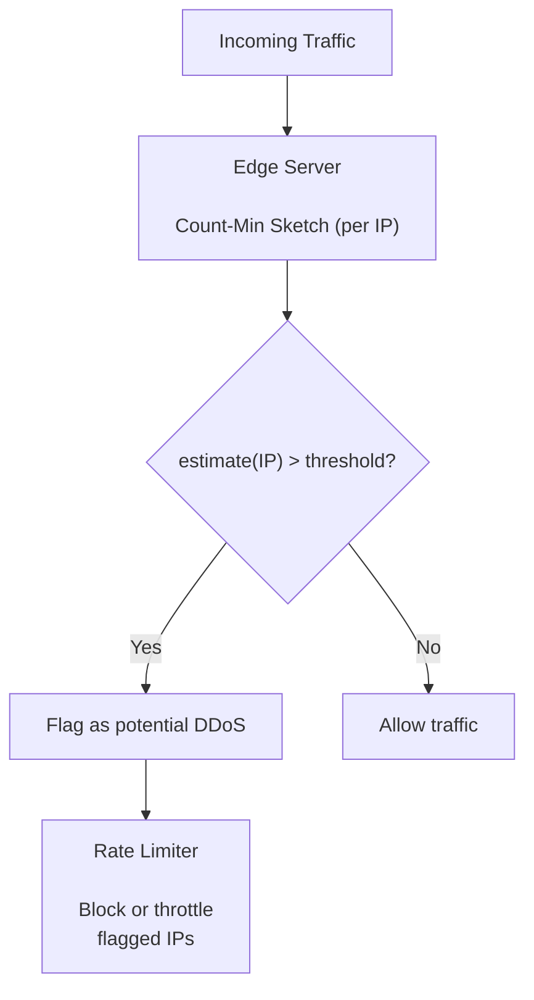
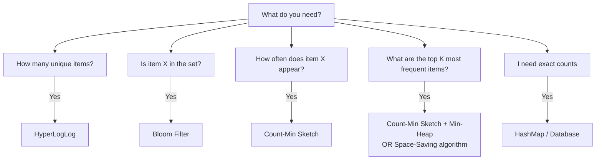

# 🎯 Count-Min Sketch

## 0️⃣ Prerequisites

Before diving into Count-Min Sketch, you need to understand:

### Frequency Counting
**Frequency** means how many times an element appears. In a stream of data, we often want to know: "How often did X occur?"

```java
// Stream: [apple, banana, apple, cherry, apple, banana]
// Frequencies:
//   apple: 3
//   banana: 2
//   cherry: 1
```

### Hash Functions
A hash function maps any input to a fixed-range output. Count-Min Sketch uses multiple independent hash functions.

```java
// Multiple hash functions give different outputs for the same input
h1("apple") = 42
h2("apple") = 17
h3("apple") = 89
```

### 2D Arrays (Matrices)
Count-Min Sketch uses a 2D array where rows correspond to hash functions and columns are buckets.

```java
int[][] sketch = new int[numHashFunctions][numBuckets];
// sketch[i][j] = counter at row i, column j
```

### Streaming Algorithms
A **streaming algorithm** processes data in one pass, using limited memory. You can't go back and re-read the data.

```
Data Stream: item1 → item2 → item3 → item4 → ...
                ↓
           Algorithm (limited memory)
                ↓
           Approximate answer
```

---

## 1️⃣ What Problem Does This Exist to Solve?

### The Core Problem: Counting Frequencies at Scale

Imagine you're Twitter and want to find trending hashtags. Every second, millions of tweets arrive. For each hashtag, you need to count how many times it appeared.

**The naive approach:**
```java
Map<String, Long> hashtagCounts = new HashMap<>();

void processTweet(Tweet tweet) {
    for (String hashtag : tweet.getHashtags()) {
        hashtagCounts.merge(hashtag, 1L, Long::sum);
    }
}
```

**What's wrong with this?**

| Scenario | Memory with HashMap |
|----------|---------------------|
| 1 million unique hashtags | ~100 MB |
| 100 million unique hashtags | ~10 GB |
| 1 billion unique hashtags | ~100 GB |

The HashMap grows linearly with the number of unique items. At Twitter scale, this is impossible.

### Real-World Pain Points

**Scenario 1: Finding Heavy Hitters**
You want to find the top 100 most frequent items in a stream of billions. Storing all items isn't feasible.

**Scenario 2: Network Traffic Analysis**
Detecting IP addresses that are sending unusually high traffic (potential DDoS). You can't store counters for every possible IP.

**Scenario 3: Query Frequency in Databases**
Identifying which queries are most common to optimize caching. Millions of unique queries per day.

### What Breaks Without Count-Min Sketch?

| Without Count-Min Sketch | With Count-Min Sketch |
|--------------------------|----------------------|
| Memory grows with unique items | Fixed memory (~1 MB) |
| Can't process high-velocity streams | Handles millions/sec |
| Expensive distributed counting | Mergeable sketches |
| Need exact counts (often overkill) | Approximate counts (good enough) |

---

## 2️⃣ Intuition and Mental Model

### The Multiple Tally Counters Analogy

Imagine you're counting visitors at a festival with multiple entrances. You can't identify individuals, but you want to estimate how many times each person visited.

**Setup:**
- You have 3 assistants (hash functions)
- Each assistant has 10 tally counters (buckets)
- Each assistant uses a different method to assign visitors to counters

**When visitor "Alice" enters:**
- Assistant 1: "Based on her hat color, counter 3" → increment counter 3
- Assistant 2: "Based on her shirt, counter 7" → increment counter 7
- Assistant 3: "Based on her shoes, counter 1" → increment counter 1

**When you ask "How many times did Alice visit?":**
- Assistant 1: "Counter 3 shows 15"
- Assistant 2: "Counter 7 shows 12"
- Assistant 3: "Counter 1 shows 18"
- Your estimate: minimum(15, 12, 18) = 12

**Why take the minimum?**
- Counters can be inflated by OTHER visitors who got assigned to the same counter
- But a counter can never be LESS than the true count
- So the minimum is the best estimate (least inflated)

### The Key Insight

**Count-Min Sketch Guarantee**

- True count ≤ Estimated count
- The sketch NEVER underestimates. It may overestimate due to hash collisions, but taking the minimum across all hash functions minimizes this overestimation.

<details>
<summary>ASCII diagram (reference)</summary>

```text
┌─────────────────────────────────────────────────────────────────┐
│                  COUNT-MIN SKETCH GUARANTEE                      │
├─────────────────────────────────────────────────────────────────┤
│                                                                  │
│  True count ≤ Estimated count                                   │
│                                                                  │
│  The sketch NEVER underestimates. It may overestimate due to   │
│  hash collisions, but taking the minimum across all hash        │
│  functions minimizes this overestimation.                       │
│                                                                  │
└─────────────────────────────────────────────────────────────────┘
```
</details>

---

## 3️⃣ How It Works Internally

### Core Components

1. **2D Array**: d rows (hash functions) × w columns (buckets)
2. **Hash Functions**: d independent hash functions, each mapping to [0, w-1]
3. **Counters**: Each cell contains a count

| Columns (w buckets) | 0 | 1 | 2 | 3 | 4 | 5 | 6 | 7 |
|---------------------|---|---|---|---|---|---|---|---|
| **Row 0 (h1)** | 0 | 3 | 0 | 5 | 0 | 2 | 0 | 1 |
| **Row 1 (h2)** | 2 | 0 | 4 | 0 | 3 | 0 | 1 | 0 |
| **Row 2 (h3)** | 0 | 1 | 0 | 2 | 0 | 5 | 0 | 3 |

<details>
<summary>ASCII diagram (reference)</summary>

```text
          Columns (w buckets)
          0    1    2    3    4    5    6    7
       ┌────┬────┬────┬────┬────┬────┬────┬────┐
Row 0  │  0 │  3 │  0 │  5 │  0 │  2 │  0 │  1 │  ← h1
       ├────┼────┼────┼────┼────┼────┼────┼────┤
Row 1  │  2 │  0 │  4 │  0 │  3 │  0 │  1 │  0 │  ← h2
       ├────┼────┼────┼────┼────┼────┼────┼────┤
Row 2  │  0 │  1 │  0 │  2 │  0 │  5 │  0 │  3 │  ← h3
       └────┴────┴────┴────┴────┴────┴────┴────┘
```
</details>
```

### The Add Operation

When you add an element with count c (default 1):

```
Element: "trending_topic"
Count to add: 1

Step 1: Compute hash for each row
        h1("trending_topic") % w = 3
        h2("trending_topic") % w = 6
        h3("trending_topic") % w = 1

Step 2: Increment each corresponding cell
        sketch[0][3] += 1
        sketch[1][6] += 1
        sketch[2][1] += 1
```

### The Query Operation

When you query for an element's frequency:

```
Query: "trending_topic"

Step 1: Compute hash for each row (same as add)
        h1("trending_topic") % w = 3
        h2("trending_topic") % w = 6
        h3("trending_topic") % w = 1

Step 2: Get values from each cell
        sketch[0][3] = 5
        sketch[1][6] = 3
        sketch[2][1] = 7

Step 3: Return minimum
        estimate = min(5, 3, 7) = 3
```

### Why Minimum Works

Consider what happens with collisions:

```
"apple" hashes to: row 0 col 3, row 1 col 5, row 2 col 2
"banana" hashes to: row 0 col 3, row 1 col 7, row 2 col 9

After adding both once:
- sketch[0][3] = 2 (collision! both apple and banana)
- sketch[1][5] = 1 (only apple)
- sketch[2][2] = 1 (only apple)

Query for "apple":
- Row 0: 2 (inflated by banana)
- Row 1: 1 (accurate)
- Row 2: 1 (accurate)
- Minimum: 1 (correct!)
```

The minimum picks the counter with the fewest collisions.

### Error Bounds

The Count-Min Sketch provides probabilistic guarantees:

```
Parameters:
- w = width (number of columns)
- d = depth (number of rows/hash functions)
- N = total count of all items added

Error bound:
- With probability ≥ 1 - δ, the estimate is at most true_count + ε × N

Where:
- ε = e / w  (error factor, e ≈ 2.718)
- δ = e^(-d) (failure probability)
```

**Practical example:**
- w = 1000 columns, d = 5 rows
- ε = 2.718 / 1000 ≈ 0.27%
- δ = e^(-5) ≈ 0.67%
- Memory = 5 × 1000 × 4 bytes = 20 KB

This means: with 99.33% probability, the error is at most 0.27% of total stream size.

---

## 4️⃣ Simulation: Step-by-Step Walkthrough

Let's trace through a complete example.

### Setup

```
Width (w): 5 columns
Depth (d): 3 rows (3 hash functions)

Initial state: all zeros

         Col 0  Col 1  Col 2  Col 3  Col 4
       ┌──────┬──────┬──────┬──────┬──────┐
Row 0  │   0  │   0  │   0  │   0  │   0  │
       ├──────┼──────┼──────┼──────┼──────┤
Row 1  │   0  │   0  │   0  │   0  │   0  │
       ├──────┼──────┼──────┼──────┼──────┤
Row 2  │   0  │   0  │   0  │   0  │   0  │
       └──────┴──────┴──────┴──────┴──────┘
```

### Hash Functions (Simplified)

```java
h1(x) = (hash(x) × 1) % 5
h2(x) = (hash(x) × 2 + 1) % 5
h3(x) = (hash(x) × 3 + 2) % 5
```

### Adding Elements

**Add "cat" (3 times):**
```
hash("cat") = 98262  (example)

h1("cat") = (98262 × 1) % 5 = 2
h2("cat") = (98262 × 2 + 1) % 5 = 0
h3("cat") = (98262 × 3 + 2) % 5 = 3

Add 3 to each position:
sketch[0][2] += 3 → 3
sketch[1][0] += 3 → 3
sketch[2][3] += 3 → 3

         Col 0  Col 1  Col 2  Col 3  Col 4
       ┌──────┬──────┬──────┬──────┬──────┐
Row 0  │   0  │   0  │   3  │   0  │   0  │
       ├──────┼──────┼──────┼──────┼──────┤
Row 1  │   3  │   0  │   0  │   0  │   0  │
       ├──────┼──────┼──────┼──────┼──────┤
Row 2  │   0  │   0  │   0  │   3  │   0  │
       └──────┴──────┴──────┴──────┴──────┘
```

**Add "dog" (2 times):**
```
h1("dog") = 4
h2("dog") = 2
h3("dog") = 0

sketch[0][4] += 2 → 2
sketch[1][2] += 2 → 2
sketch[2][0] += 2 → 2

         Col 0  Col 1  Col 2  Col 3  Col 4
       ┌──────┬──────┬──────┬──────┬──────┐
Row 0  │   0  │   0  │   3  │   0  │   2  │
       ├──────┼──────┼──────┼──────┼──────┤
Row 1  │   3  │   0  │   2  │   0  │   0  │
       ├──────┼──────┼──────┼──────┼──────┤
Row 2  │   2  │   0  │   0  │   3  │   0  │
       └──────┴──────┴──────┴──────┴──────┘
```

**Add "bird" (5 times) with collision:**
```
h1("bird") = 2  ← COLLISION with "cat" in row 0!
h2("bird") = 4
h3("bird") = 1

sketch[0][2] += 5 → 8  (was 3, now 8)
sketch[1][4] += 5 → 5
sketch[2][1] += 5 → 5

         Col 0  Col 1  Col 2  Col 3  Col 4
       ┌──────┬──────┬──────┬──────┬──────┐
Row 0  │   0  │   0  │   8  │   0  │   2  │  ← col 2 has cat+bird
       ├──────┼──────┼──────┼──────┼──────┤
Row 1  │   3  │   0  │   2  │   0  │   5  │
       ├──────┼──────┼──────┼──────┼──────┤
Row 2  │   2  │   5  │   0  │   3  │   0  │
       └──────┴──────┴──────┴──────┴──────┘
```

### Querying Elements

**Query "cat":**
```
h1("cat") = 2 → sketch[0][2] = 8  (inflated by bird!)
h2("cat") = 0 → sketch[1][0] = 3  (accurate)
h3("cat") = 3 → sketch[2][3] = 3  (accurate)

Estimate = min(8, 3, 3) = 3 ✓ (correct!)
```

**Query "dog":**
```
h1("dog") = 4 → sketch[0][4] = 2
h2("dog") = 2 → sketch[1][2] = 2
h3("dog") = 0 → sketch[2][0] = 2

Estimate = min(2, 2, 2) = 2 ✓ (correct!)
```

**Query "fish" (never added):**
```
h1("fish") = 0 → sketch[0][0] = 0
h2("fish") = 3 → sketch[1][3] = 0
h3("fish") = 4 → sketch[2][4] = 0

Estimate = min(0, 0, 0) = 0 ✓ (correct!)
```

**Query "elephant" (never added, but collides):**
```
Suppose:
h1("elephant") = 2 → sketch[0][2] = 8
h2("elephant") = 0 → sketch[1][0] = 3
h3("elephant") = 1 → sketch[2][1] = 5

Estimate = min(8, 3, 5) = 3 ✗ (overestimate! true count is 0)
```

This demonstrates the overestimation problem. The sketch never underestimates, but it can overestimate due to collisions.

---

## 5️⃣ How Engineers Use This in Production

### Twitter: Trending Topics

Twitter uses Count-Min Sketch to identify trending hashtags in real-time.

```java
// Simplified Twitter trending algorithm
public class TrendingService {
    private final CountMinSketch currentWindow;
    private final CountMinSketch previousWindow;
    
    public void processTweet(Tweet tweet) {
        for (String hashtag : tweet.getHashtags()) {
            currentWindow.add(hashtag);
        }
    }
    
    public List<String> getTrending(List<String> candidates) {
        return candidates.stream()
            .map(tag -> new AbstractMap.SimpleEntry<>(tag, 
                currentWindow.estimate(tag) - previousWindow.estimate(tag)))
            .filter(e -> e.getValue() > THRESHOLD)
            .sorted(Map.Entry.<String, Long>comparingByValue().reversed())
            .limit(10)
            .map(Map.Entry::getKey)
            .collect(Collectors.toList());
    }
}
```

### Cloudflare: DDoS Detection

Cloudflare uses Count-Min Sketch to detect IP addresses sending abnormally high traffic.



<details>
<summary>ASCII diagram (reference)</summary>

```text
┌─────────────────────────────────────────────────────────────────┐
│                    DDOS DETECTION ARCHITECTURE                   │
├─────────────────────────────────────────────────────────────────┤
│                                                                  │
│  Incoming Traffic                                                │
│      │                                                           │
│      ▼                                                           │
│  ┌─────────────────┐                                            │
│  │  Edge Server    │                                            │
│  │                 │                                            │
│  │  Count-Min      │───▶ If estimate(IP) > threshold:           │
│  │  Sketch (per IP)│         flag as potential DDoS             │
│  │                 │                                            │
│  └────────┬────────┘                                            │
│           │                                                      │
│           ▼                                                      │
│  ┌─────────────────┐                                            │
│  │  Rate Limiter   │                                            │
│  │                 │                                            │
│  │  Block or       │                                            │
│  │  throttle       │                                            │
│  │  flagged IPs    │                                            │
│  └─────────────────┘                                            │
│                                                                  │
└─────────────────────────────────────────────────────────────────┘
```
</details>

### Apache Spark: Approximate Aggregations

Spark SQL uses Count-Min Sketch for approximate frequency queries.

```scala
// Spark SQL with approximate counts
import org.apache.spark.sql.functions._

val sketch = df
  .stat
  .countMinSketch("product_id", 0.001, 0.99)  // ε=0.1%, δ=1%

// Query frequency
val productFreq = sketch.estimateCount("product_123")
```

### Redis: Top-K with Count-Min Sketch

Redis Bloom module provides TOPK which uses Count-Min Sketch internally.

```bash
# Create a Top-K with Count-Min Sketch backing
TOPK.RESERVE trending 10 2000 7 0.925

# Add items
TOPK.ADD trending "bitcoin" "ethereum" "dogecoin" "bitcoin" "bitcoin"

# Query top items
TOPK.LIST trending
# Returns: bitcoin, ethereum, dogecoin
```

---

## 6️⃣ Implementation in Java

### Maven Dependencies

```xml
<!-- Stream-lib provides Count-Min Sketch -->
<dependency>
    <groupId>com.clearspring.analytics</groupId>
    <artifactId>stream</artifactId>
    <version>2.9.8</version>
</dependency>

<!-- Or use Google Guava's implementation -->
<dependency>
    <groupId>com.google.guava</groupId>
    <artifactId>guava</artifactId>
    <version>32.1.3-jre</version>
</dependency>
```

### Using Stream-lib's Count-Min Sketch

```java
import com.clearspring.analytics.stream.frequency.CountMinSketch;

public class CountMinSketchDemo {
    
    public static void main(String[] args) {
        // Create sketch with error rate 0.1% and confidence 99%
        // ε = 0.001, δ = 0.01
        double epsilon = 0.001;
        double delta = 0.01;
        int seed = 42;
        
        CountMinSketch sketch = new CountMinSketch(epsilon, delta, seed);
        
        // Add elements
        sketch.add("apple", 5);
        sketch.add("banana", 3);
        sketch.add("cherry", 10);
        sketch.add("apple", 2);  // Now apple has 7
        
        // Query frequencies
        System.out.println("apple: " + sketch.estimateCount("apple"));   // ~7
        System.out.println("banana: " + sketch.estimateCount("banana")); // ~3
        System.out.println("cherry: " + sketch.estimateCount("cherry")); // ~10
        System.out.println("date: " + sketch.estimateCount("date"));     // ~0
        
        // Merge two sketches
        CountMinSketch sketch2 = new CountMinSketch(epsilon, delta, seed);
        sketch2.add("apple", 3);
        sketch2.add("elderberry", 8);
        
        CountMinSketch merged = CountMinSketch.merge(sketch, sketch2);
        System.out.println("Merged apple: " + merged.estimateCount("apple")); // ~10
    }
}
```

### Custom Implementation from Scratch

```java
import java.nio.charset.StandardCharsets;
import com.google.common.hash.Hashing;
import com.google.common.hash.HashFunction;

/**
 * A simple Count-Min Sketch implementation for educational purposes.
 * In production, use stream-lib or similar libraries.
 */
public class SimpleCountMinSketch {
    
    private final int width;
    private final int depth;
    private final long[][] table;
    private final long[] hashSeeds;
    
    /**
     * Creates a Count-Min Sketch.
     * 
     * @param epsilon Error factor (smaller = more accurate, more memory)
     * @param delta Failure probability (smaller = more confident, more memory)
     */
    public SimpleCountMinSketch(double epsilon, double delta) {
        // Width: ceil(e / epsilon)
        this.width = (int) Math.ceil(Math.E / epsilon);
        
        // Depth: ceil(ln(1 / delta))
        this.depth = (int) Math.ceil(Math.log(1.0 / delta));
        
        this.table = new long[depth][width];
        this.hashSeeds = new long[depth];
        
        // Initialize random seeds for each hash function
        java.util.Random random = new java.util.Random(42);
        for (int i = 0; i < depth; i++) {
            hashSeeds[i] = random.nextLong();
        }
        
        System.out.println("Created Count-Min Sketch:");
        System.out.println("  Width: " + width + " columns");
        System.out.println("  Depth: " + depth + " rows");
        System.out.println("  Memory: " + (width * depth * 8) + " bytes");
    }
    
    /**
     * Adds an element with count 1.
     */
    public void add(String element) {
        add(element, 1);
    }
    
    /**
     * Adds an element with specified count.
     */
    public void add(String element, long count) {
        for (int i = 0; i < depth; i++) {
            int index = getHash(element, i);
            table[i][index] += count;
        }
    }
    
    /**
     * Estimates the frequency of an element.
     * Guaranteed: estimate >= true count
     * With high probability: estimate ≤ true count + ε × N
     */
    public long estimate(String element) {
        long min = Long.MAX_VALUE;
        
        for (int i = 0; i < depth; i++) {
            int index = getHash(element, i);
            min = Math.min(min, table[i][index]);
        }
        
        return min;
    }
    
    /**
     * Computes hash for element at given row.
     * Uses MurmurHash3 with different seeds for each row.
     */
    private int getHash(String element, int row) {
        HashFunction hf = Hashing.murmur3_128((int) hashSeeds[row]);
        long hash = hf.hashString(element, StandardCharsets.UTF_8).asLong();
        
        // Ensure positive and within range
        return (int) ((hash & Long.MAX_VALUE) % width);
    }
    
    /**
     * Merges another sketch into this one.
     * Both sketches must have same dimensions.
     */
    public void merge(SimpleCountMinSketch other) {
        if (this.width != other.width || this.depth != other.depth) {
            throw new IllegalArgumentException("Sketches must have same dimensions");
        }
        
        for (int i = 0; i < depth; i++) {
            for (int j = 0; j < width; j++) {
                this.table[i][j] += other.table[i][j];
            }
        }
    }
    
    /**
     * Returns the total count of all elements added.
     * Computed from any row (they should all be equal).
     */
    public long totalCount() {
        long sum = 0;
        for (int j = 0; j < width; j++) {
            sum += table[0][j];
        }
        return sum;
    }
}
```

### Testing the Implementation

```java
public class CountMinSketchTest {
    
    public static void main(String[] args) {
        testAccuracy();
        testHeavyHitters();
        testMerge();
    }
    
    static void testAccuracy() {
        System.out.println("=== Accuracy Test ===");
        
        // ε = 0.1%, δ = 1%
        SimpleCountMinSketch sketch = new SimpleCountMinSketch(0.001, 0.01);
        
        // Add elements with known frequencies
        Map<String, Long> trueCounts = new HashMap<>();
        trueCounts.put("apple", 1000L);
        trueCounts.put("banana", 500L);
        trueCounts.put("cherry", 100L);
        trueCounts.put("date", 50L);
        
        for (Map.Entry<String, Long> entry : trueCounts.entrySet()) {
            sketch.add(entry.getKey(), entry.getValue());
        }
        
        // Query and compare
        for (Map.Entry<String, Long> entry : trueCounts.entrySet()) {
            long estimate = sketch.estimate(entry.getKey());
            long actual = entry.getValue();
            double error = (estimate - actual) / (double) actual * 100;
            
            System.out.printf("%s: actual=%d, estimate=%d, error=%.2f%%\n",
                entry.getKey(), actual, estimate, error);
        }
        
        // Query non-existent element
        System.out.println("elderberry (never added): " + sketch.estimate("elderberry"));
    }
    
    static void testHeavyHitters() {
        System.out.println("\n=== Heavy Hitters Test ===");
        
        SimpleCountMinSketch sketch = new SimpleCountMinSketch(0.001, 0.01);
        
        // Simulate a stream with some heavy hitters
        java.util.Random random = new java.util.Random(42);
        
        // Add 1 million elements
        // 10% are "hot" items (will be heavy hitters)
        // 90% are "cold" items (appear rarely)
        for (int i = 0; i < 1_000_000; i++) {
            if (random.nextDouble() < 0.1) {
                // Hot items: only 10 unique items, but appear 100,000 times total
                sketch.add("hot_" + (i % 10));
            } else {
                // Cold items: 900,000 unique items, appear once each
                sketch.add("cold_" + i);
            }
        }
        
        // Check heavy hitters
        System.out.println("Heavy hitter estimates:");
        for (int i = 0; i < 10; i++) {
            System.out.println("hot_" + i + ": " + sketch.estimate("hot_" + i));
        }
        
        // Check a cold item
        System.out.println("Cold item (should be ~1): " + sketch.estimate("cold_12345"));
    }
    
    static void testMerge() {
        System.out.println("\n=== Merge Test ===");
        
        SimpleCountMinSketch sketch1 = new SimpleCountMinSketch(0.001, 0.01);
        SimpleCountMinSketch sketch2 = new SimpleCountMinSketch(0.001, 0.01);
        
        // Add to sketch1
        sketch1.add("apple", 100);
        sketch1.add("banana", 50);
        
        // Add to sketch2
        sketch2.add("apple", 75);
        sketch2.add("cherry", 200);
        
        // Merge
        sketch1.merge(sketch2);
        
        System.out.println("After merge:");
        System.out.println("apple: " + sketch1.estimate("apple") + " (expected: 175)");
        System.out.println("banana: " + sketch1.estimate("banana") + " (expected: 50)");
        System.out.println("cherry: " + sketch1.estimate("cherry") + " (expected: 200)");
    }
}
```

### Production Use Case: Real-Time Trending Service

```java
import org.springframework.stereotype.Service;
import org.springframework.scheduling.annotation.Scheduled;
import java.util.concurrent.ConcurrentHashMap;
import java.util.concurrent.atomic.AtomicReference;

@Service
public class TrendingTopicsService {
    
    // Two sketches for sliding window
    private final AtomicReference<SimpleCountMinSketch> currentSketch;
    private final AtomicReference<SimpleCountMinSketch> previousSketch;
    
    // Candidate tracking (items that might be trending)
    private final ConcurrentHashMap<String, Boolean> candidates;
    
    // Configuration
    private static final double EPSILON = 0.001;  // 0.1% error
    private static final double DELTA = 0.01;     // 99% confidence
    private static final int TRENDING_THRESHOLD = 1000;
    
    public TrendingTopicsService() {
        this.currentSketch = new AtomicReference<>(new SimpleCountMinSketch(EPSILON, DELTA));
        this.previousSketch = new AtomicReference<>(new SimpleCountMinSketch(EPSILON, DELTA));
        this.candidates = new ConcurrentHashMap<>();
    }
    
    /**
     * Records an occurrence of a topic (e.g., hashtag, search term).
     */
    public void recordTopic(String topic) {
        currentSketch.get().add(topic);
        
        // Track as candidate if frequency is high enough
        if (currentSketch.get().estimate(topic) > TRENDING_THRESHOLD / 10) {
            candidates.put(topic, true);
        }
    }
    
    /**
     * Gets the top trending topics.
     * Trending = topics with significantly higher frequency than previous window.
     */
    public List<TrendingTopic> getTrendingTopics(int limit) {
        SimpleCountMinSketch current = currentSketch.get();
        SimpleCountMinSketch previous = previousSketch.get();
        
        return candidates.keySet().stream()
            .map(topic -> {
                long currentCount = current.estimate(topic);
                long previousCount = previous.estimate(topic);
                long delta = currentCount - previousCount;
                double growth = previousCount > 0 
                    ? (double) delta / previousCount 
                    : (currentCount > TRENDING_THRESHOLD ? Double.MAX_VALUE : 0);
                return new TrendingTopic(topic, currentCount, delta, growth);
            })
            .filter(t -> t.getDelta() > TRENDING_THRESHOLD)
            .sorted(Comparator.comparing(TrendingTopic::getGrowth).reversed())
            .limit(limit)
            .collect(Collectors.toList());
    }
    
    /**
     * Rotates the window every hour.
     * Current becomes previous, new sketch becomes current.
     */
    @Scheduled(fixedRate = 3600000)  // Every hour
    public void rotateWindow() {
        SimpleCountMinSketch newSketch = new SimpleCountMinSketch(EPSILON, DELTA);
        SimpleCountMinSketch oldCurrent = currentSketch.getAndSet(newSketch);
        previousSketch.set(oldCurrent);
        
        // Clean up old candidates
        candidates.keySet().removeIf(topic -> 
            oldCurrent.estimate(topic) < TRENDING_THRESHOLD / 10);
    }
    
    @Data
    @AllArgsConstructor
    public static class TrendingTopic {
        private String topic;
        private long count;
        private long delta;
        private double growth;
    }
}
```

### Spring Boot Controller

```java
@RestController
@RequestMapping("/api/trending")
public class TrendingController {
    
    private final TrendingTopicsService trendingService;
    
    @PostMapping("/record")
    public ResponseEntity<Void> recordTopic(@RequestParam String topic) {
        trendingService.recordTopic(topic);
        return ResponseEntity.ok().build();
    }
    
    @GetMapping
    public List<TrendingTopic> getTrending(
            @RequestParam(defaultValue = "10") int limit) {
        return trendingService.getTrendingTopics(limit);
    }
}
```

---

## 7️⃣ Tradeoffs, Pitfalls, and Common Mistakes

### Tradeoffs

| Aspect | Count-Min Sketch | HashMap | Database |
|--------|-----------------|---------|----------|
| Memory | O(1/ε × log(1/δ)) | O(n) | Disk-based |
| Accuracy | Approximate (overestimates) | Exact | Exact |
| Mergeable | Yes | Complex | Limited |
| Deletions | Not supported | Supported | Supported |
| Speed | O(d) per operation | O(1) average | O(log n) |

### Common Pitfalls

**1. Choosing wrong parameters**

```java
// BAD: Too small, high error
SimpleCountMinSketch sketch = new SimpleCountMinSketch(0.5, 0.5);
// Width = 6, Depth = 1 → Very inaccurate!

// GOOD: Reasonable error bounds
SimpleCountMinSketch sketch = new SimpleCountMinSketch(0.001, 0.01);
// Width = 2719, Depth = 5 → Much better accuracy
```

**2. Ignoring the overestimation property**

```java
// BAD: Using sketch for rate limiting with strict limits
if (sketch.estimate(userId) > 100) {
    // Block user
    // Problem: Might block users who haven't exceeded limit!
}

// GOOD: Account for overestimation
if (sketch.estimate(userId) > 100 + errorMargin) {
    // Block user with buffer for false positives
}
```

**3. Not understanding what "error" means**

```java
// Error is relative to TOTAL stream size, not individual counts

// If total stream = 1,000,000 and ε = 0.001
// Max error = 0.001 × 1,000,000 = 1,000

// For an item with true count 10:
// Estimate could be as high as 10 + 1,000 = 1,010!

// For an item with true count 100,000:
// Estimate could be as high as 100,000 + 1,000 = 101,000
// Relative error = 1% (much more reasonable)
```

**4. Merging sketches with different parameters**

```java
// BAD: Different ε and δ
SimpleCountMinSketch sketch1 = new SimpleCountMinSketch(0.001, 0.01);
SimpleCountMinSketch sketch2 = new SimpleCountMinSketch(0.01, 0.1);
sketch1.merge(sketch2);  // Dimensions don't match!

// GOOD: Same parameters everywhere
```

### Performance Gotchas

**1. Hash function quality**

```java
// BAD: Using String.hashCode()
// Poor distribution, especially for similar strings

// GOOD: Using MurmurHash3 or similar
HashFunction hf = Hashing.murmur3_128(seed);
```

**2. Integer overflow**

```java
// BAD: Using int for counters
int[][] table = new int[depth][width];
// Overflows after ~2 billion adds

// GOOD: Using long for counters
long[][] table = new long[depth][width];
```

**3. Memory alignment**

```java
// For very large sketches, consider memory layout
// Row-major vs column-major access patterns matter for cache efficiency
```

---

## 8️⃣ When NOT to Use Count-Min Sketch

### Anti-Patterns

**1. When exact counts are required**

```java
// BAD: Billing based on approximate counts
long apiCalls = sketch.estimate(customerId);
charge(customerId, apiCalls * pricePerCall);
// Could overcharge customers!

// GOOD: Use exact counting for billing
long apiCalls = database.countApiCalls(customerId);
```

**2. When you need to enumerate all elements**

```java
// BAD: Trying to list all items
sketch.getAllItems();  // This method doesn't exist!

// Count-Min Sketch doesn't store what items were added
// Only their frequencies
```

**3. When underestimation would be catastrophic**

```java
// Count-Min Sketch ONLY overestimates, never underestimates
// If your use case requires never overestimating, use a different approach
```

**4. When the stream has low cardinality**

```java
// OVERKILL: 100 unique items
// Just use a HashMap, it's simpler and exact

Map<String, Long> counts = new HashMap<>();
counts.merge(item, 1L, Long::sum);
```

### Better Alternatives

| Use Case | Better Alternative |
|----------|-------------------|
| Exact counts needed | HashMap, Database |
| Low cardinality (<10K) | HashMap |
| Need to list all items | HashMap |
| Underestimation needed | Lossy Counting |
| Set membership | Bloom Filter |
| Unique count | HyperLogLog |

---

## 9️⃣ Comparison with Alternatives

### Count-Min Sketch vs HashMap

```java
// Memory for 10 million unique items
HashMap<String, Long> map = new HashMap<>();  // ~500 MB
SimpleCountMinSketch sketch = new SimpleCountMinSketch(0.001, 0.01);  // ~100 KB

// But HashMap gives exact counts
// Sketch may overestimate by up to ε × N
```

### Count-Min Sketch vs Lossy Counting

| Feature | Count-Min Sketch | Lossy Counting |
|---------|-----------------|----------------|
| Error type | Overestimates | Underestimates |
| Memory | Fixed | Grows with stream |
| Best for | Heavy hitters | Frequent items |
| Mergeable | Yes | Complex |

### Count-Min Sketch vs Space-Saving

| Feature | Count-Min Sketch | Space-Saving |
|---------|-----------------|--------------|
| Purpose | Frequency estimation | Top-K items |
| Memory | Fixed, larger | Fixed, smaller |
| Accuracy | Better for all items | Better for top items |
| Implementation | Simpler | More complex |

### When to Use Which



<details>
<summary>ASCII diagram (reference)</summary>

```text
┌─────────────────────────────────────────────────────────────────┐
│                    CHOOSING THE RIGHT TOOL                       │
├─────────────────────────────────────────────────────────────────┤
│                                                                  │
│  "How many unique items?"                                       │
│      → HyperLogLog                                              │
│                                                                  │
│  "Is item X in the set?"                                        │
│      → Bloom Filter                                             │
│                                                                  │
│  "How often does item X appear?"                                │
│      → Count-Min Sketch                                         │
│                                                                  │
│  "What are the top K most frequent items?"                      │
│      → Count-Min Sketch + Min-Heap                              │
│      → OR Space-Saving algorithm                                │
│                                                                  │
│  "I need exact counts"                                          │
│      → HashMap / Database                                       │
│                                                                  │
└─────────────────────────────────────────────────────────────────┘
```
</details>

---

## 🔟 Interview Follow-Up Questions with Answers

### L4 (Entry-Level) Questions

**Q1: What is Count-Min Sketch and what problem does it solve?**

**Answer**: Count-Min Sketch is a probabilistic data structure for estimating the frequency of elements in a data stream. It solves the problem of counting how often items appear when you have too many unique items to store in memory. For example, counting how many times each hashtag appears on Twitter with millions of unique hashtags. It uses a 2D array of counters and multiple hash functions. The key property is that it never underestimates, it can only overestimate due to hash collisions.

**Q2: Why does Count-Min Sketch take the minimum across rows?**

**Answer**: Each row uses a different hash function, so different elements collide in different rows. When we query, some rows might have inflated counts due to collisions with other elements, but at least one row likely has fewer collisions. By taking the minimum, we get the least inflated estimate. This works because the true count contributes to all rows equally, but collision noise varies across rows. The minimum is therefore closest to the true count.

**Q3: Can Count-Min Sketch underestimate?**

**Answer**: No, never. Every time we add an element, we increment all its corresponding counters. When we query, we read those same counters. Since counters only increase (never decrease), and we take the minimum, the result is always at least the true count. Overestimation happens when other elements share the same counter positions, but underestimation is impossible.

### L5 (Senior) Questions

**Q4: How do you choose the right ε and δ for Count-Min Sketch?**

**Answer**: 
- **ε (epsilon)**: Controls the error bound. With probability ≥ 1-δ, the error is at most ε × N (where N is total stream size). Choose based on acceptable error relative to stream size. For 0.1% error, use ε = 0.001.
- **δ (delta)**: Controls confidence. With probability 1-δ, the error bound holds. For 99% confidence, use δ = 0.01.

Memory usage: width = e/ε ≈ 2.72/ε, depth = ln(1/δ)

Example: ε = 0.001, δ = 0.01 → width ≈ 2,720, depth = 5 → 2,720 × 5 × 8 bytes ≈ 109 KB

**Q5: How would you implement a Top-K heavy hitters system using Count-Min Sketch?**

**Answer**:

```java
public class TopKHeavyHitters {
    private final CountMinSketch sketch;
    private final PriorityQueue<Item> minHeap;  // Min-heap of size K
    private final int k;
    
    public void add(String item) {
        sketch.add(item);
        long estimate = sketch.estimate(item);
        
        // If item might be in top K, add to heap
        if (minHeap.size() < k) {
            minHeap.offer(new Item(item, estimate));
        } else if (estimate > minHeap.peek().count) {
            minHeap.poll();
            minHeap.offer(new Item(item, estimate));
        }
    }
    
    public List<String> getTopK() {
        return minHeap.stream()
            .sorted(Comparator.comparing(Item::getCount).reversed())
            .map(Item::getName)
            .collect(Collectors.toList());
    }
}
```

The heap maintains the K items with highest estimated counts. Since CMS overestimates, we might include some items that aren't truly in the top K, but we won't miss any true heavy hitters.

**Q6: How do you handle Count-Min Sketch in a distributed system?**

**Answer**:

```
Architecture:
1. Each node maintains its own local CMS
2. Periodically merge sketches:
   - Cell-wise addition: merged[i][j] = sum of all sketch[i][j]
3. Query the merged sketch

Why this works:
- CMS is additive: if sketch1 has count A for item X,
  and sketch2 has count B for item X,
  merged sketch has count A+B for item X
- Same as if all items were added to one sketch

Considerations:
- All sketches must have same dimensions (ε, δ)
- All sketches must use same hash functions (same seeds)
- Network cost: O(width × depth × 8 bytes) per merge
```

### L6 (Staff) Questions

**Q7: Design a real-time trending detection system for a social media platform.**

**Answer**:

```
Requirements:
- Detect topics trending in the last hour vs previous hour
- Handle 1M events/second
- Sub-second query latency
- Global (across all regions)

Architecture:

1. Event Ingestion:
   - Kafka partitioned by topic hash
   - Events: {topic, timestamp, region}

2. Stream Processing (Flink):
   - Tumbling windows of 1 hour
   - Each window produces a CMS
   - Key by region for parallelism

3. Aggregation:
   - Merge regional CMS into global CMS
   - Store current and previous hour CMS in Redis

4. Trending Calculation:
   - Maintain candidate set (topics seen recently)
   - For each candidate:
     trend_score = (current_count - previous_count) / previous_count
   - Filter by minimum absolute increase
   - Sort by trend_score

5. Query Layer:
   - Redis for CMS storage
   - Pre-computed top-100 trending list
   - Real-time updates every minute

Memory:
- CMS with ε=0.001, δ=0.01 ≈ 100 KB
- 2 windows × 50 regions × 100 KB = 10 MB total

Accuracy:
- At 1M events/hour, max error = 0.001 × 1M = 1,000
- For true heavy hitters (>10K count), error < 10%
```

**Q8: What are the limitations of Count-Min Sketch and how would you address them?**

**Answer**:

| Limitation | Mitigation |
|------------|------------|
| Only overestimates | Use Count-Mean-Min Sketch (subtracts expected collision noise) |
| Can't delete | Use Count-Min-Log Sketch or rebuild periodically |
| Error relative to total stream | Use conservative updates (only increment if estimate would increase) |
| Can't enumerate items | Maintain separate candidate set for heavy hitters |
| No time decay | Use multiple sketches for time windows, or exponential decay |

**Count-Mean-Min improvement:**
```java
// Instead of taking minimum, subtract expected noise
long estimate(String item) {
    long[] values = new long[depth];
    for (int i = 0; i < depth; i++) {
        values[i] = table[i][getHash(item, i)];
    }
    
    // Estimate noise: (total - value) / (width - 1)
    long total = totalCount();
    for (int i = 0; i < depth; i++) {
        long noise = (total - values[i]) / (width - 1);
        values[i] = Math.max(0, values[i] - noise);
    }
    
    return Arrays.stream(values).min().getAsLong();
}
```

---

## 1️⃣1️⃣ One Clean Mental Summary

Count-Min Sketch is a probabilistic data structure that estimates how often items appear in a data stream using fixed memory. It uses a 2D array of counters with multiple hash functions. When adding an item, increment counters at positions determined by each hash function. When querying, return the minimum counter value across all hash functions. The minimum is the best estimate because it's least affected by hash collisions. The key guarantee: it never underestimates, only overestimates. Use it for finding heavy hitters (trending topics, frequent queries, high-traffic IPs) when you can't afford to store exact counts for millions of unique items.

---

## Summary

Count-Min Sketch is essential for:
- **Trending detection**: Finding topics with rapidly increasing frequency
- **Heavy hitter detection**: Identifying items that appear most often
- **Network monitoring**: Detecting high-traffic sources
- **Query optimization**: Finding frequently executed queries

Key takeaways:
1. Fixed memory regardless of stream size
2. Never underestimates, only overestimates
3. Error is relative to total stream size, not individual counts
4. Mergeable across distributed nodes
5. Best for heavy hitters where small counts don't matter
6. Use with min-heap for Top-K queries

