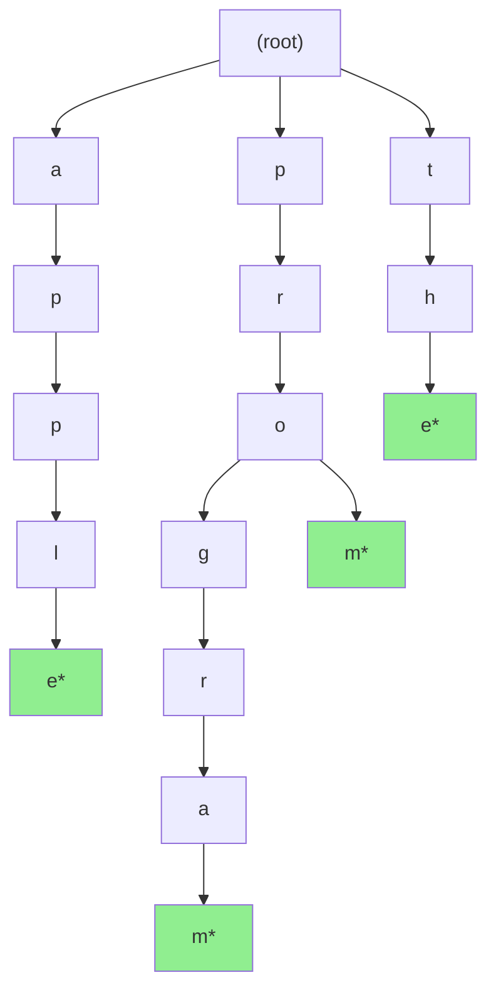

# 🎯 Trie (Prefix Tree)

## 0️⃣ Prerequisites

Before diving into Tries, you need to understand:

### Trees
A **tree** is a hierarchical data structure with nodes connected by edges. Each node has at most one parent (except the root which has none) and can have multiple children.

```
        root
       /    \
      A      B
     / \      \
    C   D      E
```

### Strings and Characters
A **string** is a sequence of characters. In Java, strings are immutable objects.

```java
String word = "hello";  // 5 characters: 'h', 'e', 'l', 'l', 'o'
char firstChar = word.charAt(0);  // 'h'
```

### HashMaps
A **HashMap** stores key-value pairs with O(1) average lookup. Tries often use HashMaps to store child nodes.

```java
Map<Character, TrieNode> children = new HashMap<>();
children.put('a', new TrieNode());
```

### Time Complexity
- **O(1)**: Constant time, regardless of input size
- **O(n)**: Linear time, proportional to input size
- **O(m)**: Where m is the length of a string being processed

---

## 1️⃣ What Problem Does This Exist to Solve?

### The Core Problem: Prefix-Based Operations

Imagine you're building Google's search autocomplete. As a user types "prog", you need to instantly suggest:
- programming
- progress
- program
- programmer

**The naive approach:**
```java
List<String> suggestions = allWords.stream()
    .filter(word -> word.startsWith(prefix))
    .limit(10)
    .collect(Collectors.toList());
```

**What's wrong with this?**

| Dictionary Size | Time per Query |
|-----------------|----------------|
| 100,000 words | 10ms |
| 1,000,000 words | 100ms |
| 10,000,000 words | 1,000ms |

Scanning every word for every keystroke is too slow for real-time autocomplete.

### Real-World Pain Points

**Scenario 1: Autocomplete Systems**
Google processes billions of searches. Each keystroke triggers autocomplete. Linear scan is impossible.

**Scenario 2: IP Routing Tables**
Routers need to find the longest matching prefix for IP addresses. With millions of routes, linear search would cause unacceptable latency.

**Scenario 3: Spell Checkers**
When you type "teh", the spell checker needs to find similar words quickly. Tries enable efficient fuzzy matching.

**Scenario 4: Dictionary/Word Games**
Scrabble, Wordle, and crossword solvers need to validate words and find patterns efficiently.

### What Breaks Without Tries?

| Without Trie | With Trie |
|--------------|-----------|
| O(n × m) prefix search | O(m) prefix search |
| Slow autocomplete | Instant autocomplete |
| Linear IP routing | Logarithmic IP routing |
| No prefix sharing | Memory-efficient prefix sharing |

Where n = number of words, m = length of prefix/word

---

## 2️⃣ Intuition and Mental Model

### The Filing Cabinet Analogy

Imagine organizing a dictionary in a filing cabinet:

**Naive approach (list):**
All words in one big drawer. To find words starting with "pro", you scan every card.

**Trie approach (nested folders):**
- Top-level folders: A, B, C, ..., P, ..., Z
- Inside P: PA, PB, ..., PR, ..., PZ
- Inside PR: PRA, PRB, ..., PRO, ...
- Inside PRO: PROG, PROM, PROP, ...

To find words starting with "pro":
1. Open folder P
2. Open folder R inside P
3. Open folder O inside PR
4. Everything in this folder starts with "pro"!

### The Tree Visualization



<details>
<summary>ASCII diagram (reference)</summary>

```text
                    (root)
                   /  |  \
                  a   p   t
                 /    |    \
                p    r     h
               /     |      \
              p     o       e
             /     / \       \
            l    g   m       *
           /    /     \
          e   r       *
         /   / \
        *   a   *
           /
          m
         /
        *

Words: apple, program, programmer, prom, the
(* marks end of word)
```
</details>

### Key Insight

Each path from root to a node represents a prefix. Nodes marked as "end of word" indicate complete words. All words sharing a prefix share the same path from the root.

**Trie Key Insight**: "Common prefixes are stored only once"

- Words: program, programmer, programming
- Shared path: p → r → o → g → r → a → m
- Then branches: (end), m → e → r, m → i → n → g
- Storage: 7 + 3 + 4 = 14 characters (not 7 + 10 + 11 = 28)

<details>
<summary>ASCII diagram (reference)</summary>

```text
┌─────────────────────────────────────────────────────────────────┐
│                      TRIE KEY INSIGHT                            │
├─────────────────────────────────────────────────────────────────┤
│                                                                  │
│  "Common prefixes are stored only once"                         │
│                                                                  │
│  Words: program, programmer, programming                        │
│  Shared path: p → r → o → g → r → a → m                        │
│  Then branches: (end), m → e → r, m → i → n → g                │
│                                                                  │
│  Storage: 7 + 3 + 4 = 14 characters (not 7 + 10 + 11 = 28)     │
│                                                                  │
└─────────────────────────────────────────────────────────────────┘
```
</details>

---

## 3️⃣ How It Works Internally

### Core Components

1. **TrieNode**: Represents a single character position
   - Children: Map from character to child node
   - isEndOfWord: Boolean marking complete words
   - (Optional) count, value, or other metadata

2. **Root**: Empty node representing the start

3. **Edges**: Implicit, represented by the character key in children map

### The TrieNode Structure

```java
class TrieNode {
    Map<Character, TrieNode> children;
    boolean isEndOfWord;
    
    // Optional: for autocomplete ranking
    int frequency;
    
    // Optional: for storing associated values
    Object value;
    
    TrieNode() {
        children = new HashMap<>();
        isEndOfWord = false;
    }
}
```

### The Insert Operation

When inserting a word:

```
Insert "cat":

Step 1: Start at root
        Current node: root
        
Step 2: Process 'c'
        Does root have child 'c'? No
        Create new node, add as child of root under 'c'
        Move to new node
        
Step 3: Process 'a'
        Does current node have child 'a'? No
        Create new node, add as child under 'a'
        Move to new node
        
Step 4: Process 't'
        Does current node have child 't'? No
        Create new node, add as child under 't'
        Move to new node
        
Step 5: Mark as end of word
        current.isEndOfWord = true
```

Visual progression:

```
Initial:    After 'c':    After 'a':    After 't':
  (root)      (root)        (root)        (root)
                |             |             |
                c             c             c
                              |             |
                              a             a
                                            |
                                            t*
```

### The Search Operation

When searching for a word:

```
Search "cat":

Step 1: Start at root
Step 2: Look for child 'c' → Found, move to it
Step 3: Look for child 'a' → Found, move to it
Step 4: Look for child 't' → Found, move to it
Step 5: Check isEndOfWord → true
Result: "cat" exists

Search "car":

Step 1: Start at root
Step 2: Look for child 'c' → Found
Step 3: Look for child 'a' → Found
Step 4: Look for child 'r' → NOT FOUND
Result: "car" does not exist

Search "ca":

Step 1-3: Navigate to 'c' → 'a'
Step 4: Check isEndOfWord → false
Result: "ca" is not a complete word (but is a prefix)
```

### The Prefix Search Operation

Finding all words with a given prefix:

```
Find all words starting with "ca":

Step 1: Navigate to prefix
        root → c → a
        
Step 2: Collect all words from this subtree
        DFS from 'a' node:
        - a → t* → "cat"
        - a → r* → "car" (if exists)
        - a → n* → "can" (if exists)
        - a → t → c → h* → "catch" (if exists)
```

### Time and Space Complexity

| Operation | Time Complexity | Space Complexity |
|-----------|----------------|------------------|
| Insert | O(m) | O(m) |
| Search | O(m) | O(1) |
| StartsWith | O(m) | O(1) |
| Delete | O(m) | O(1) |
| Autocomplete | O(m + k) | O(k) |

Where m = length of word, k = number of results

**Space for entire trie**: O(ALPHABET_SIZE × m × n)
- In worst case (no shared prefixes)
- In practice, much less due to prefix sharing

---

## 4️⃣ Simulation: Step-by-Step Walkthrough

Let's build a trie with words: "app", "apple", "application", "apt", "bat"

### Initial State

```
(root)
  └── (empty)
```

### Insert "app"

```
Step 1: 'a' - Create node, move down
Step 2: 'p' - Create node, move down
Step 3: 'p' - Create node, move down, mark as end

(root)
  └── a
      └── p
          └── p*
```

### Insert "apple"

```
Step 1: 'a' - EXISTS, move down
Step 2: 'p' - EXISTS, move down
Step 3: 'p' - EXISTS, move down
Step 4: 'l' - Create node, move down
Step 5: 'e' - Create node, move down, mark as end

(root)
  └── a
      └── p
          └── p*
              └── l
                  └── e*
```

### Insert "application"

```
Steps 1-3: Navigate existing path (a → p → p)
Step 4: 'l' - EXISTS, move down
Step 5: 'i' - Create node, move down
Steps 6-11: Create nodes for 'c', 'a', 't', 'i', 'o', 'n', mark end

(root)
  └── a
      └── p
          └── p*
              └── l
                  ├── e*
                  └── i
                      └── c
                          └── a
                              └── t
                                  └── i
                                      └── o
                                          └── n*
```

### Insert "apt"

```
Steps 1-2: Navigate existing path (a → p)
Step 3: 't' - Create node (sibling of second 'p'), mark as end

(root)
  └── a
      └── p
          ├── p*
          │   └── l
          │       ├── e*
          │       └── i → c → a → t → i → o → n*
          └── t*
```

### Insert "bat"

```
Step 1: 'b' - Create node (sibling of 'a' at root level)
Steps 2-3: Create 'a', 't', mark as end

(root)
  ├── a
  │   └── p
  │       ├── p*
  │       │   └── l
  │       │       ├── e*
  │       │       └── i → c → a → t → i → o → n*
  │       └── t*
  └── b
      └── a
          └── t*
```

### Query Examples

**Search "apple":**
```
root → a ✓ → p ✓ → p ✓ → l ✓ → e ✓ (isEndOfWord = true)
Result: FOUND
```

**Search "app":**
```
root → a ✓ → p ✓ → p ✓ (isEndOfWord = true)
Result: FOUND
```

**Search "appl":**
```
root → a ✓ → p ✓ → p ✓ → l ✓ (isEndOfWord = false)
Result: NOT FOUND (prefix exists, but not a complete word)
```

**StartsWith "app":**
```
root → a ✓ → p ✓ → p ✓
Result: TRUE (prefix exists)
```

**Autocomplete "app":**
```
Navigate to: root → a → p → p
DFS from 'p' node:
- p* → "app"
- p → l → e* → "apple"
- p → l → i → c → a → t → i → o → n* → "application"

Results: ["app", "apple", "application"]
```

---

## 5️⃣ How Engineers Use This in Production

### Google Search Autocomplete

Google's autocomplete uses tries (or similar structures) to suggest queries as you type.

```
User types: "how to"

Trie lookup:
root → h → o → w → (space) → t → o

From this node, find top suggestions by frequency:
- "how to tie a tie" (freq: 1M)
- "how to screenshot" (freq: 900K)
- "how to lose weight" (freq: 800K)
```

**Optimizations Google uses:**
1. **Frequency-weighted tries**: Store query frequency at each node
2. **Sharding**: Partition trie by first few characters
3. **Caching**: Cache common prefixes
4. **Compression**: Use compressed tries (Patricia/Radix trees)

### IP Routing (Longest Prefix Match)

Routers use tries to find the best route for an IP address.

```
Routing table:
192.168.0.0/16   → Gateway A
192.168.1.0/24   → Gateway B
192.168.1.128/25 → Gateway C

For IP 192.168.1.200:
- Matches 192.168.0.0/16 ✓
- Matches 192.168.1.0/24 ✓
- Matches 192.168.1.128/25 ✓ (longest match!)

Route to Gateway C
```

**Binary Trie for IP:**
```
Each level represents one bit of IP address
32 levels for IPv4
Path from root to leaf = route

        (root)
       /      \
      0        1
     / \      / \
    0   1    0   1
   ...
```

### Redis: Autocomplete with Sorted Sets

While Redis doesn't have a built-in trie, engineers implement autocomplete using sorted sets:

```bash
# Add words with scores (frequency)
ZADD autocomplete 1000 "programming"
ZADD autocomplete 800 "program"
ZADD autocomplete 600 "programmer"

# Autocomplete for "prog"
ZRANGEBYLEX autocomplete "[prog" "[prog\xff" LIMIT 0 10
```

### Apache Lucene: Finite State Transducers

Lucene (used by Elasticsearch) uses a compressed trie variant called FST (Finite State Transducer) for its term dictionary.

```
Benefits:
- Stores millions of terms in memory
- O(m) lookup where m = term length
- Supports fuzzy matching
- Highly compressed
```

---

## 6️⃣ Implementation in Java

### Basic Trie Implementation

```java
import java.util.*;

/**
 * A Trie (Prefix Tree) implementation for string storage and retrieval.
 * Supports insert, search, prefix search, and autocomplete operations.
 */
public class Trie {
    
    /**
     * Node in the Trie. Each node represents a character position.
     */
    private static class TrieNode {
        Map<Character, TrieNode> children;
        boolean isEndOfWord;
        int frequency;  // For ranking autocomplete results
        
        TrieNode() {
            children = new HashMap<>();
            isEndOfWord = false;
            frequency = 0;
        }
    }
    
    private final TrieNode root;
    
    public Trie() {
        root = new TrieNode();
    }
    
    /**
     * Inserts a word into the trie.
     * Time: O(m) where m = word length
     * Space: O(m) for new nodes
     */
    public void insert(String word) {
        TrieNode current = root;
        
        for (char c : word.toCharArray()) {
            // If child doesn't exist, create it
            current.children.putIfAbsent(c, new TrieNode());
            current = current.children.get(c);
        }
        
        current.isEndOfWord = true;
        current.frequency++;
    }
    
    /**
     * Returns true if the word exists in the trie.
     * Time: O(m)
     */
    public boolean search(String word) {
        TrieNode node = findNode(word);
        return node != null && node.isEndOfWord;
    }
    
    /**
     * Returns true if any word in the trie starts with the given prefix.
     * Time: O(m)
     */
    public boolean startsWith(String prefix) {
        return findNode(prefix) != null;
    }
    
    /**
     * Returns all words that start with the given prefix.
     * Time: O(m + k) where k = number of matching words
     */
    public List<String> autocomplete(String prefix) {
        List<String> results = new ArrayList<>();
        TrieNode prefixNode = findNode(prefix);
        
        if (prefixNode != null) {
            collectWords(prefixNode, new StringBuilder(prefix), results);
        }
        
        return results;
    }
    
    /**
     * Returns top k words that start with the given prefix, sorted by frequency.
     */
    public List<String> autocompleteTopK(String prefix, int k) {
        List<WordFrequency> results = new ArrayList<>();
        TrieNode prefixNode = findNode(prefix);
        
        if (prefixNode != null) {
            collectWordsWithFrequency(prefixNode, new StringBuilder(prefix), results);
        }
        
        // Sort by frequency descending, return top k
        return results.stream()
            .sorted(Comparator.comparing(WordFrequency::frequency).reversed())
            .limit(k)
            .map(WordFrequency::word)
            .collect(Collectors.toList());
    }
    
    /**
     * Deletes a word from the trie.
     * Returns true if the word was found and deleted.
     * Time: O(m)
     */
    public boolean delete(String word) {
        return delete(root, word, 0);
    }
    
    /**
     * Returns the number of words with the given prefix.
     * Time: O(m + k)
     */
    public int countWordsWithPrefix(String prefix) {
        TrieNode prefixNode = findNode(prefix);
        if (prefixNode == null) {
            return 0;
        }
        return countWords(prefixNode);
    }
    
    // ==================== Helper Methods ====================
    
    /**
     * Navigates to the node representing the given prefix.
     * Returns null if prefix doesn't exist.
     */
    private TrieNode findNode(String prefix) {
        TrieNode current = root;
        
        for (char c : prefix.toCharArray()) {
            TrieNode child = current.children.get(c);
            if (child == null) {
                return null;
            }
            current = child;
        }
        
        return current;
    }
    
    /**
     * Collects all words in the subtree rooted at the given node.
     * Uses DFS traversal.
     */
    private void collectWords(TrieNode node, StringBuilder prefix, List<String> results) {
        if (node.isEndOfWord) {
            results.add(prefix.toString());
        }
        
        for (Map.Entry<Character, TrieNode> entry : node.children.entrySet()) {
            prefix.append(entry.getKey());
            collectWords(entry.getValue(), prefix, results);
            prefix.deleteCharAt(prefix.length() - 1);  // Backtrack
        }
    }
    
    /**
     * Collects words with their frequencies.
     */
    private void collectWordsWithFrequency(TrieNode node, StringBuilder prefix, 
                                           List<WordFrequency> results) {
        if (node.isEndOfWord) {
            results.add(new WordFrequency(prefix.toString(), node.frequency));
        }
        
        for (Map.Entry<Character, TrieNode> entry : node.children.entrySet()) {
            prefix.append(entry.getKey());
            collectWordsWithFrequency(entry.getValue(), prefix, results);
            prefix.deleteCharAt(prefix.length() - 1);
        }
    }
    
    /**
     * Recursive delete helper.
     * Returns true if the current node should be deleted.
     */
    private boolean delete(TrieNode current, String word, int index) {
        if (index == word.length()) {
            if (!current.isEndOfWord) {
                return false;  // Word doesn't exist
            }
            current.isEndOfWord = false;
            return current.children.isEmpty();  // Delete if no children
        }
        
        char c = word.charAt(index);
        TrieNode child = current.children.get(c);
        if (child == null) {
            return false;  // Word doesn't exist
        }
        
        boolean shouldDeleteChild = delete(child, word, index + 1);
        
        if (shouldDeleteChild) {
            current.children.remove(c);
            return current.children.isEmpty() && !current.isEndOfWord;
        }
        
        return false;
    }
    
    /**
     * Counts words in subtree.
     */
    private int countWords(TrieNode node) {
        int count = node.isEndOfWord ? 1 : 0;
        for (TrieNode child : node.children.values()) {
            count += countWords(child);
        }
        return count;
    }
    
    private record WordFrequency(String word, int frequency) {}
}
```

### Testing the Implementation

```java
public class TrieTest {
    
    public static void main(String[] args) {
        testBasicOperations();
        testAutocomplete();
        testDelete();
        testFrequencyRanking();
    }
    
    static void testBasicOperations() {
        System.out.println("=== Basic Operations ===");
        
        Trie trie = new Trie();
        
        // Insert words
        trie.insert("apple");
        trie.insert("app");
        trie.insert("application");
        trie.insert("banana");
        
        // Search
        System.out.println("apple exists: " + trie.search("apple"));     // true
        System.out.println("app exists: " + trie.search("app"));         // true
        System.out.println("appl exists: " + trie.search("appl"));       // false
        System.out.println("banana exists: " + trie.search("banana"));   // true
        System.out.println("ban exists: " + trie.search("ban"));         // false
        
        // Prefix check
        System.out.println("prefix 'app': " + trie.startsWith("app"));   // true
        System.out.println("prefix 'ban': " + trie.startsWith("ban"));   // true
        System.out.println("prefix 'cat': " + trie.startsWith("cat"));   // false
    }
    
    static void testAutocomplete() {
        System.out.println("\n=== Autocomplete ===");
        
        Trie trie = new Trie();
        String[] words = {"program", "programmer", "programming", "progress", 
                          "project", "promise", "apple", "application"};
        
        for (String word : words) {
            trie.insert(word);
        }
        
        System.out.println("Autocomplete 'pro': " + trie.autocomplete("pro"));
        System.out.println("Autocomplete 'prog': " + trie.autocomplete("prog"));
        System.out.println("Autocomplete 'app': " + trie.autocomplete("app"));
        System.out.println("Autocomplete 'xyz': " + trie.autocomplete("xyz"));
    }
    
    static void testDelete() {
        System.out.println("\n=== Delete ===");
        
        Trie trie = new Trie();
        trie.insert("apple");
        trie.insert("app");
        
        System.out.println("Before delete:");
        System.out.println("  apple exists: " + trie.search("apple"));
        System.out.println("  app exists: " + trie.search("app"));
        
        trie.delete("apple");
        
        System.out.println("After deleting 'apple':");
        System.out.println("  apple exists: " + trie.search("apple"));  // false
        System.out.println("  app exists: " + trie.search("app"));      // true
    }
    
    static void testFrequencyRanking() {
        System.out.println("\n=== Frequency Ranking ===");
        
        Trie trie = new Trie();
        
        // Simulate search queries with frequencies
        for (int i = 0; i < 100; i++) trie.insert("programming");
        for (int i = 0; i < 80; i++) trie.insert("program");
        for (int i = 0; i < 60; i++) trie.insert("programmer");
        for (int i = 0; i < 40; i++) trie.insert("progress");
        for (int i = 0; i < 20; i++) trie.insert("project");
        
        System.out.println("Top 3 for 'pro': " + trie.autocompleteTopK("pro", 3));
        System.out.println("Top 3 for 'prog': " + trie.autocompleteTopK("prog", 3));
    }
}
```

### Compressed Trie (Radix Tree) Implementation

```java
/**
 * A Radix Tree (Compressed Trie) that stores multiple characters per edge.
 * More memory efficient when words share long prefixes.
 */
public class RadixTree {
    
    private static class RadixNode {
        Map<String, RadixNode> children;  // Edge label → child node
        boolean isEndOfWord;
        
        RadixNode() {
            children = new HashMap<>();
            isEndOfWord = false;
        }
    }
    
    private final RadixNode root;
    
    public RadixTree() {
        root = new RadixNode();
    }
    
    /**
     * Inserts a word into the radix tree.
     */
    public void insert(String word) {
        RadixNode current = root;
        int i = 0;
        
        while (i < word.length()) {
            String remaining = word.substring(i);
            boolean found = false;
            
            for (Map.Entry<String, RadixNode> entry : current.children.entrySet()) {
                String edge = entry.getKey();
                int commonLength = commonPrefixLength(edge, remaining);
                
                if (commonLength > 0) {
                    if (commonLength == edge.length()) {
                        // Entire edge matches, continue down
                        current = entry.getValue();
                        i += commonLength;
                        found = true;
                        break;
                    } else {
                        // Partial match, need to split edge
                        splitEdge(current, edge, commonLength);
                        current = current.children.get(edge.substring(0, commonLength));
                        i += commonLength;
                        found = true;
                        break;
                    }
                }
            }
            
            if (!found) {
                // No matching edge, create new one
                RadixNode newNode = new RadixNode();
                newNode.isEndOfWord = true;
                current.children.put(remaining, newNode);
                return;
            }
        }
        
        current.isEndOfWord = true;
    }
    
    /**
     * Splits an edge at the given position.
     */
    private void splitEdge(RadixNode parent, String edge, int splitPos) {
        RadixNode oldChild = parent.children.remove(edge);
        
        String prefix = edge.substring(0, splitPos);
        String suffix = edge.substring(splitPos);
        
        RadixNode newMiddle = new RadixNode();
        newMiddle.children.put(suffix, oldChild);
        
        parent.children.put(prefix, newMiddle);
    }
    
    /**
     * Returns the length of the common prefix between two strings.
     */
    private int commonPrefixLength(String s1, String s2) {
        int minLen = Math.min(s1.length(), s2.length());
        int i = 0;
        while (i < minLen && s1.charAt(i) == s2.charAt(i)) {
            i++;
        }
        return i;
    }
    
    /**
     * Searches for a word in the radix tree.
     */
    public boolean search(String word) {
        RadixNode current = root;
        int i = 0;
        
        while (i < word.length()) {
            String remaining = word.substring(i);
            boolean found = false;
            
            for (Map.Entry<String, RadixNode> entry : current.children.entrySet()) {
                String edge = entry.getKey();
                
                if (remaining.startsWith(edge)) {
                    current = entry.getValue();
                    i += edge.length();
                    found = true;
                    break;
                }
            }
            
            if (!found) {
                return false;
            }
        }
        
        return current.isEndOfWord;
    }
}
```

### Production Autocomplete Service

```java
import org.springframework.stereotype.Service;
import java.util.concurrent.ConcurrentHashMap;
import java.util.concurrent.locks.ReadWriteLock;
import java.util.concurrent.locks.ReentrantReadWriteLock;

@Service
public class AutocompleteService {
    
    private final Trie trie;
    private final ReadWriteLock lock;
    private final ConcurrentHashMap<String, List<String>> cache;
    
    private static final int MAX_RESULTS = 10;
    private static final int CACHE_SIZE = 10000;
    
    public AutocompleteService() {
        this.trie = new Trie();
        this.lock = new ReentrantReadWriteLock();
        this.cache = new ConcurrentHashMap<>();
    }
    
    /**
     * Adds a search query to the trie.
     * Called when user performs a search.
     */
    public void recordSearch(String query) {
        lock.writeLock().lock();
        try {
            trie.insert(query.toLowerCase().trim());
            invalidateCache(query);
        } finally {
            lock.writeLock().unlock();
        }
    }
    
    /**
     * Gets autocomplete suggestions for a prefix.
     */
    public List<String> getSuggestions(String prefix) {
        String normalizedPrefix = prefix.toLowerCase().trim();
        
        // Check cache first
        List<String> cached = cache.get(normalizedPrefix);
        if (cached != null) {
            return cached;
        }
        
        // Query trie
        lock.readLock().lock();
        try {
            List<String> results = trie.autocompleteTopK(normalizedPrefix, MAX_RESULTS);
            
            // Cache results
            if (cache.size() < CACHE_SIZE) {
                cache.put(normalizedPrefix, results);
            }
            
            return results;
        } finally {
            lock.readLock().unlock();
        }
    }
    
    /**
     * Invalidates cache entries affected by a new word.
     */
    private void invalidateCache(String word) {
        // Invalidate all prefixes of this word
        for (int i = 1; i <= word.length(); i++) {
            cache.remove(word.substring(0, i));
        }
    }
    
    /**
     * Loads initial data from database.
     */
    public void loadFromDatabase(List<SearchQuery> queries) {
        lock.writeLock().lock();
        try {
            for (SearchQuery query : queries) {
                for (int i = 0; i < query.getFrequency(); i++) {
                    trie.insert(query.getText().toLowerCase());
                }
            }
        } finally {
            lock.writeLock().unlock();
        }
    }
}
```

---

## 7️⃣ Tradeoffs, Pitfalls, and Common Mistakes

### Tradeoffs

| Aspect | Trie | HashMap | Sorted Array |
|--------|------|---------|--------------|
| Prefix search | O(m) | O(n × m) | O(n × m) |
| Exact search | O(m) | O(1) avg | O(log n × m) |
| Insert | O(m) | O(1) avg | O(n) |
| Memory | Higher | Lower | Lower |
| Ordered iteration | Yes | No | Yes |

### Common Pitfalls

**1. Not handling case sensitivity**

```java
// BAD: Case-sensitive trie
trie.insert("Apple");
trie.search("apple");  // false!

// GOOD: Normalize case
public void insert(String word) {
    insertInternal(word.toLowerCase());
}
```

**2. Memory explosion with large alphabets**

```java
// BAD: Using array for Unicode
char[] children = new char[65536];  // 128 KB per node!

// GOOD: Using HashMap for sparse children
Map<Character, TrieNode> children = new HashMap<>();
```

**3. Not handling empty strings**

```java
// BAD: Crashes on empty input
trie.insert("");  // Creates no nodes, but marks root as end

// GOOD: Validate input
public void insert(String word) {
    if (word == null || word.isEmpty()) {
        throw new IllegalArgumentException("Word cannot be empty");
    }
    // ...
}
```

**4. Inefficient autocomplete without limits**

```java
// BAD: Returns ALL matching words
public List<String> autocomplete(String prefix) {
    // Could return millions of results!
}

// GOOD: Limit results
public List<String> autocomplete(String prefix, int limit) {
    // Stop after finding 'limit' results
}
```

### Performance Gotchas

**1. Deep recursion**

```java
// BAD: Stack overflow for very long words
private void collectWords(TrieNode node, ...) {
    // Recursive call for each character
}

// GOOD: Use iterative approach with explicit stack
private void collectWordsIterative(TrieNode node, ...) {
    Deque<State> stack = new ArrayDeque<>();
    // ...
}
```

**2. String concatenation in hot path**

```java
// BAD: Creates new String objects
prefix = prefix + c;

// GOOD: Use StringBuilder
prefix.append(c);
// ... use prefix ...
prefix.deleteCharAt(prefix.length() - 1);
```

---

## 8️⃣ When NOT to Use Tries

### Anti-Patterns

**1. When you only need exact lookups**

```java
// OVERKILL: Using trie for exact key-value storage
// Just use a HashMap
Map<String, Value> map = new HashMap<>();
```

**2. When memory is severely constrained**

```java
// Trie with 1 million words, average length 10:
// Worst case: 10M nodes × 50 bytes/node = 500 MB

// HashMap alternative:
// 1M entries × 50 bytes/entry = 50 MB
```

**3. When words have no common prefixes**

```java
// Words: "abc123", "xyz789", "pqr456"
// No shared prefixes = no memory benefit from trie
// HashMap would be simpler and use less memory
```

**4. When you need frequent deletions**

```java
// Trie deletion is complex:
// - Must check if node has other children
// - Must clean up empty branches
// - HashMap deletion is O(1)
```

### Better Alternatives

| Use Case | Better Alternative |
|----------|-------------------|
| Exact lookup only | HashMap |
| Sorted iteration | TreeMap |
| Memory-constrained | Compressed Trie, FST |
| Fuzzy matching | BK-Tree |
| Numeric ranges | Segment Tree |

---

## 9️⃣ Comparison with Alternatives

### Trie vs HashMap

```java
// HashMap: O(1) lookup, O(n×m) prefix search
Map<String, Boolean> words = new HashMap<>();
words.put("apple", true);
boolean exists = words.containsKey("apple");  // O(1)

// Trie: O(m) lookup, O(m) prefix search
Trie trie = new Trie();
trie.insert("apple");
boolean exists = trie.search("apple");  // O(5)
List<String> suggestions = trie.autocomplete("app");  // O(3 + k)
```

### Trie vs Ternary Search Tree

| Feature | Trie | Ternary Search Tree |
|---------|------|---------------------|
| Space per node | O(alphabet size) | O(3) |
| Search time | O(m) | O(m log alphabet) |
| Memory efficiency | Lower | Higher |
| Implementation | Simpler | More complex |

### Standard Trie vs Compressed Trie (Radix Tree)

```
Standard Trie for "romane", "romanus", "romulus":

    r
    |
    o
    |
    m
   / \
  a   u
  |   |
  n   l
 / \   \
e   u   u
    |   |
    s   s

Radix Tree for same words:

      rom
     /   \
   an     ulus
  /  \
 e    us

Radix Tree: Fewer nodes, edges store multiple characters
```

---

## 🔟 Interview Follow-Up Questions with Answers

### L4 (Entry-Level) Questions

**Q1: What is a Trie and what is it used for?**

**Answer**: A Trie (pronounced "try") is a tree-like data structure used for storing strings where common prefixes are shared. Each node represents a character, and paths from root to nodes represent prefixes. It's used for autocomplete systems, spell checkers, IP routing tables, and dictionary implementations. The key advantage is O(m) prefix search where m is the prefix length, regardless of how many words are stored.

**Q2: What is the time complexity of inserting and searching in a Trie?**

**Answer**: Both insert and search are O(m) where m is the length of the word. This is because we traverse one node per character. This is independent of the number of words in the trie, unlike a list where search would be O(n × m). Space complexity for insert is O(m) in the worst case (all new nodes), but often less due to prefix sharing.

**Q3: How would you implement autocomplete using a Trie?**

**Answer**: 
1. Build a trie with all words
2. For autocomplete, navigate to the node representing the prefix
3. From that node, do a DFS to collect all words in the subtree
4. Optionally, sort by frequency and limit results

```java
public List<String> autocomplete(String prefix) {
    TrieNode node = findNode(prefix);
    if (node == null) return Collections.emptyList();
    
    List<String> results = new ArrayList<>();
    collectWords(node, new StringBuilder(prefix), results);
    return results;
}
```

### L5 (Senior) Questions

**Q4: How would you optimize a Trie for memory efficiency?**

**Answer**: Several approaches:

1. **Compressed Trie (Radix Tree)**: Store multiple characters per edge when there's only one child. Reduces nodes significantly.

2. **Array vs HashMap for children**: 
   - Use array for small, fixed alphabets (26 lowercase letters)
   - Use HashMap for large/sparse alphabets (Unicode)

3. **Ternary Search Tree**: Each node has 3 children (less than, equal, greater than). More memory efficient than standard trie.

4. **Double-Array Trie**: Extremely compact representation used in production systems like libdatrie.

5. **Succinct Tries**: Bit-level encoding, used in Lucene's FST.

**Q5: How would you implement a Trie that supports fuzzy matching (allowing k errors)?**

**Answer**:

```java
public List<String> fuzzySearch(String word, int maxErrors) {
    List<String> results = new ArrayList<>();
    fuzzySearchHelper(root, word, 0, maxErrors, new StringBuilder(), results);
    return results;
}

private void fuzzySearchHelper(TrieNode node, String word, int index, 
                                int errorsLeft, StringBuilder current, 
                                List<String> results) {
    if (errorsLeft < 0) return;
    
    if (index == word.length()) {
        if (node.isEndOfWord) {
            results.add(current.toString());
        }
        // Can still add more characters if errors left
        if (errorsLeft > 0) {
            for (Map.Entry<Character, TrieNode> entry : node.children.entrySet()) {
                current.append(entry.getKey());
                fuzzySearchHelper(entry.getValue(), word, index, 
                                  errorsLeft - 1, current, results);
                current.deleteCharAt(current.length() - 1);
            }
        }
        return;
    }
    
    char target = word.charAt(index);
    
    for (Map.Entry<Character, TrieNode> entry : node.children.entrySet()) {
        char c = entry.getKey();
        current.append(c);
        
        if (c == target) {
            // Match: no error consumed
            fuzzySearchHelper(entry.getValue(), word, index + 1, 
                              errorsLeft, current, results);
        } else {
            // Substitution: consume one error
            fuzzySearchHelper(entry.getValue(), word, index + 1, 
                              errorsLeft - 1, current, results);
        }
        
        current.deleteCharAt(current.length() - 1);
    }
    
    // Deletion: skip character in word
    fuzzySearchHelper(node, word, index + 1, errorsLeft - 1, current, results);
}
```

**Q6: How would you design a distributed autocomplete system?**

**Answer**:

```
Architecture:

1. Sharding Strategy:
   - Shard by first 2 characters of prefix
   - "aa" to "az" → Shard 1
   - "ba" to "bz" → Shard 2
   - etc.

2. Each Shard:
   - In-memory Trie for fast queries
   - Backed by persistent storage (RocksDB)
   - Replication for availability

3. Query Flow:
   - Client sends prefix "prog"
   - Router sends to shard for "pr"
   - Shard returns top-K results
   - Results merged if spanning shards

4. Updates:
   - Write to Kafka
   - Each shard consumes relevant updates
   - Periodic compaction and persistence

5. Caching:
   - L1: Application-level cache for hot prefixes
   - L2: Redis for distributed caching
   - Invalidation on updates

Memory estimate:
- 100M queries, avg 20 chars
- Assuming 50% prefix sharing: ~1 GB per shard
- 26 shards × 1 GB = 26 GB total
```

### L6 (Staff) Questions

**Q7: Compare different Trie implementations for a search engine's term dictionary.**

**Answer**:

| Implementation | Memory | Lookup | Use Case |
|----------------|--------|--------|----------|
| Standard Trie | High | O(m) | Small dictionaries |
| Radix Tree | Medium | O(m) | Medium dictionaries |
| Ternary Search Tree | Medium-Low | O(m log σ) | General purpose |
| Double-Array Trie | Low | O(m) | Static dictionaries |
| FST (Lucene) | Very Low | O(m) | Search engines |

For a search engine:
- FST is ideal: minimal memory, fast lookup, supports outputs
- Trade-off: Construction is complex, updates require rebuild
- Lucene rebuilds FST per segment, merges segments periodically

**Q8: How does IP routing use Tries, and what optimizations are used?**

**Answer**:

```
Binary Trie for IP Routing:

IP: 192.168.1.100 = 11000000.10101000.00000001.01100100

Trie structure:
- 32 levels (one per bit)
- Each node has at most 2 children (0 and 1)
- Leaf nodes store next-hop information

Longest Prefix Match:
- Traverse trie following IP bits
- Remember last node with routing info
- Return that route (longest matching prefix)

Optimizations:

1. Multi-bit Tries:
   - Instead of 1 bit per level, use 4-8 bits
   - Reduces depth from 32 to 8 (for 4-bit strides)
   - Trade-off: More memory per node

2. Level Compression:
   - Skip levels with only one path
   - Similar to Radix Tree concept

3. Leaf Pushing:
   - Push routing info to leaves only
   - Simplifies lookup

4. Hardware Implementation (TCAM):
   - Content-Addressable Memory
   - Parallel lookup in one cycle
   - Expensive, power-hungry

5. Tree Bitmap:
   - Bitmap indicates which children exist
   - Compact representation
   - Used in software routers
```

---

## 1️⃣1️⃣ One Clean Mental Summary

A Trie is a tree-based data structure where each path from root to node represents a string prefix. Words sharing common prefixes share the same path, making it memory-efficient for dictionaries. Insert and search are O(m) where m is the word length, independent of dictionary size. The killer feature is prefix-based operations: finding all words starting with "pro" takes O(3 + k) time where k is the number of matches, not O(n) like scanning a list. Use Tries for autocomplete, spell checkers, IP routing, and any scenario where you need fast prefix queries on a large set of strings.

---

## Summary

Tries are essential for:
- **Autocomplete systems**: Google search, IDE code completion
- **Spell checkers**: Finding similar words
- **IP routing**: Longest prefix match
- **Dictionary operations**: Word validation, prefix counting

Key takeaways:
1. O(m) operations where m = word length
2. Prefix sharing reduces memory
3. Use HashMap children for sparse alphabets
4. Consider Radix Tree for memory efficiency
5. Add frequency tracking for ranked autocomplete
6. Cache hot prefixes in production

