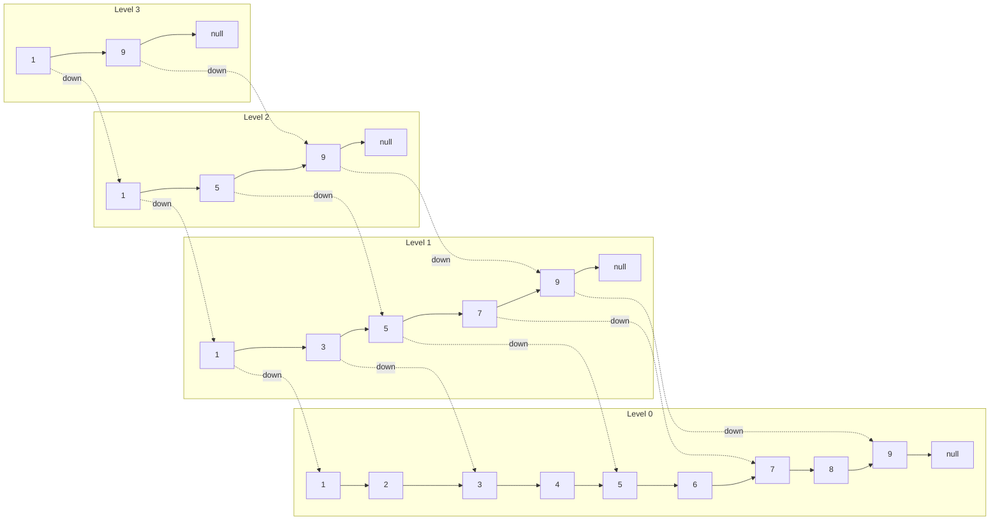
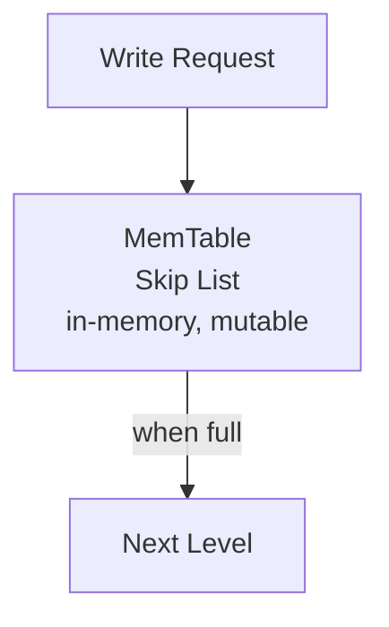

# 🎯 Skip List

## 0️⃣ Prerequisites

Before diving into Skip Lists, you need to understand:

### Linked Lists
A **linked list** is a sequence of nodes where each node contains data and a pointer to the next node.

```java
class Node {
    int value;
    Node next;
}

// List: 1 → 3 → 5 → 7 → 9 → null
```

**Limitation**: Search is O(n) because you must traverse from the beginning.

### Binary Search
**Binary search** finds elements in O(log n) by repeatedly dividing the search space in half. It requires random access (like arrays).

```java
// Array: [1, 3, 5, 7, 9, 11, 13]
// Search for 9:
// Middle = 7, 9 > 7, search right half
// Middle = 11, 9 < 11, search left half
// Found 9!
```

### Balanced Trees (BST, AVL, Red-Black)
Balanced trees maintain O(log n) operations by keeping the tree height balanced. They're complex to implement correctly.

```
        7
       / \
      3   11
     / \  / \
    1  5 9  13
```

### Probability and Randomization
Skip lists use randomization. When inserting, a coin flip determines the node's height. This is called a **randomized data structure**.

```java
// 50% chance of heads (add another level)
boolean addLevel = random.nextBoolean();
```

---

## 1️⃣ What Problem Does This Exist to Solve?

### The Core Problem: Efficient Sorted Data Structure

You need a data structure that:
1. Maintains sorted order
2. Supports O(log n) search, insert, delete
3. Is simpler to implement than balanced trees
4. Works well with concurrent operations

**The linked list problem:**
```java
// Searching in a sorted linked list: O(n)
Node current = head;
while (current != null && current.value < target) {
    current = current.next;  // Must check every node!
}
```

**The balanced tree problem:**
```java
// Red-Black tree insertion requires:
// 1. BST insertion
// 2. Color assignment
// 3. Rotation cases (4 different cases!)
// 4. Propagating fixes up the tree
// Complex and error-prone!
```

### Real-World Pain Points

**Scenario 1: Redis Sorted Sets**
Redis needs a data structure for sorted sets (ZADD, ZRANGE, ZRANK). It chose skip lists over balanced trees.

**Scenario 2: LevelDB/RocksDB MemTable**
These databases use skip lists for their in-memory write buffer because they're cache-friendly and support concurrent writes.

**Scenario 3: Concurrent Data Structures**
Lock-free skip lists are easier to implement than lock-free balanced trees.

### What Breaks Without Skip Lists?

| Without Skip Lists | With Skip Lists |
|-------------------|-----------------|
| O(n) linked list search | O(log n) search |
| Complex tree balancing | Simple randomized structure |
| Difficult concurrent access | Easy lock-free implementation |
| Cache-unfriendly tree traversal | Sequential memory access |

---

## 2️⃣ Intuition and Mental Model

### The Express Train Analogy

Imagine a subway system with multiple lines:

**Local line (Level 0)**: Stops at every station
```
1 → 2 → 3 → 4 → 5 → 6 → 7 → 8 → 9 → 10
```

**Express line (Level 1)**: Stops at every other station
```
1 ──────→ 3 ──────→ 5 ──────→ 7 ──────→ 9
```

**Super Express (Level 2)**: Stops at every fourth station
```
1 ────────────────→ 5 ────────────────→ 9
```

**To get to station 7:**
1. Take Super Express: 1 → 5 (skip 2, 3, 4)
2. Take Express: 5 → 7 (skip 6)
3. Arrive at 7!

**Without express lines**: 1 → 2 → 3 → 4 → 5 → 6 → 7 (6 stops)
**With express lines**: 1 → 5 → 7 (2 stops)

### The Skip List Visualization



<details>
<summary>ASCII diagram (reference)</summary>

```text
Level 3:  1 ─────────────────────────────────────→ 9 → null
          ↓                                        ↓
Level 2:  1 ─────────────→ 5 ─────────────────────→ 9 → null
          ↓                ↓                        ↓
Level 1:  1 ────→ 3 ────→ 5 ────→ 7 ────→ 9 → null
          ↓       ↓       ↓       ↓       ↓
Level 0:  1 → 2 → 3 → 4 → 5 → 6 → 7 → 8 → 9 → null
```
</details>

### Key Insight

**Skip List Key Insight**: "Each level skips roughly half the nodes of the level below"

- Level 0: n nodes
- Level 1: ~n/2 nodes
- Level 2: ~n/4 nodes
- Level k: ~n/2^k nodes

- Total levels: ~log₂(n)
- Search: Traverse ~log(n) levels × ~2 nodes per level = O(log n)

<details>
<summary>ASCII diagram (reference)</summary>

```text
┌─────────────────────────────────────────────────────────────────┐
│                    SKIP LIST KEY INSIGHT                         │
├─────────────────────────────────────────────────────────────────┤
│                                                                  │
│  "Each level skips roughly half the nodes of the level below"   │
│                                                                  │
│  Level 0: n nodes                                               │
│  Level 1: ~n/2 nodes                                            │
│  Level 2: ~n/4 nodes                                            │
│  Level k: ~n/2^k nodes                                          │
│                                                                  │
│  Total levels: ~log₂(n)                                         │
│  Search: Traverse ~log(n) levels × ~2 nodes per level = O(log n)│
│                                                                  │
└─────────────────────────────────────────────────────────────────┘
```
</details>

---

## 3️⃣ How It Works Internally

### Core Components

1. **Node**: Contains value and array of forward pointers (one per level)
2. **Head**: Sentinel node at the beginning, has maximum height
3. **Level**: Current maximum level in the skip list
4. **Probability (p)**: Chance of promoting a node to the next level (typically 0.5)

### Node Structure

```java
class SkipListNode<T> {
    T value;
    SkipListNode<T>[] forward;  // Array of next pointers, one per level
    
    @SuppressWarnings("unchecked")
    SkipListNode(T value, int level) {
        this.value = value;
        this.forward = new SkipListNode[level + 1];
    }
}
```

### The Search Operation

To find a value:

```
Search for 7 in:

Level 2:  H ─────────────→ 5 ─────────────────────→ 9
Level 1:  H ────→ 3 ────→ 5 ────→ 7 ────→ 9
Level 0:  H → 2 → 3 → 4 → 5 → 6 → 7 → 8 → 9

Step 1: Start at head, level 2
        H.forward[2] = 5, and 5 < 7, move to 5
        
Step 2: At 5, level 2
        5.forward[2] = 9, and 9 > 7, drop to level 1
        
Step 3: At 5, level 1
        5.forward[1] = 7, and 7 == 7, FOUND!
```

**Algorithm:**
1. Start at head, highest level
2. Move forward while next node's value < target
3. If can't move forward, drop down one level
4. Repeat until found or reach level 0

### The Insert Operation

To insert a value:

```
Insert 6 into:

Level 2:  H ─────────────→ 5 ─────────────────────→ 9
Level 1:  H ────→ 3 ────→ 5 ────────→ 7 ────→ 9
Level 0:  H → 2 → 3 → 4 → 5 ────→ 7 → 8 → 9

Step 1: Search for position, track predecessors at each level
        update[2] = 5  (last node before 6 at level 2)
        update[1] = 5  (last node before 6 at level 1)
        update[0] = 5  (last node before 6 at level 0)

Step 2: Determine new node's level (random)
        Flip coin: heads → level 1
        Flip coin: tails → stop
        New node level = 1

Step 3: Insert node, update pointers
        newNode = SkipListNode(6, level=1)
        
        At level 0:
        newNode.forward[0] = update[0].forward[0]  // 6 → 7
        update[0].forward[0] = newNode              // 5 → 6
        
        At level 1:
        newNode.forward[1] = update[1].forward[1]  // 6 → 7
        update[1].forward[1] = newNode              // 5 → 6

Result:
Level 2:  H ─────────────→ 5 ─────────────────────→ 9
Level 1:  H ────→ 3 ────→ 5 ────→ 6 ────→ 7 ────→ 9
Level 0:  H → 2 → 3 → 4 → 5 → 6 → 7 → 8 → 9
```

### The Delete Operation

To delete a value:

```
Delete 6 from:

Level 1:  H ────→ 3 ────→ 5 ────→ 6 ────→ 7 ────→ 9
Level 0:  H → 2 → 3 → 4 → 5 → 6 → 7 → 8 → 9

Step 1: Search for node, track predecessors
        update[1] = 5
        update[0] = 5

Step 2: Update pointers to skip the deleted node
        At level 0:
        update[0].forward[0] = 6.forward[0]  // 5 → 7
        
        At level 1:
        update[1].forward[1] = 6.forward[1]  // 5 → 7

Result:
Level 1:  H ────→ 3 ────→ 5 ────────→ 7 ────→ 9
Level 0:  H → 2 → 3 → 4 → 5 ────→ 7 → 8 → 9
```

### Randomized Level Generation

```java
private int randomLevel() {
    int level = 0;
    // Flip coin until tails (probability p = 0.5)
    while (random.nextDouble() < P && level < MAX_LEVEL) {
        level++;
    }
    return level;
}
```

**Expected distribution:**
- Level 0: 100% of nodes
- Level 1: 50% of nodes
- Level 2: 25% of nodes
- Level k: (1/2)^k of nodes

### Time Complexity Analysis

**Search**: O(log n) expected
- At each level, we traverse at most 1/p nodes on average
- There are O(log n) levels
- Total: O((1/p) × log n) = O(log n) for p = 0.5

**Insert**: O(log n) expected
- Search for position: O(log n)
- Update pointers: O(level) = O(log n) expected

**Delete**: O(log n) expected
- Same as insert

**Space**: O(n) expected
- Each node appears at level 0
- Expected total pointers: n × (1 + 1/2 + 1/4 + ...) = 2n = O(n)

---

## 4️⃣ Simulation: Step-by-Step Walkthrough

Let's build a skip list by inserting: 3, 6, 7, 9, 12, 19, 17

### Initial State

```
MAX_LEVEL = 3
P = 0.5

Level 3:  H → null
Level 2:  H → null
Level 1:  H → null
Level 0:  H → null

(H = head sentinel with value -∞)
```

### Insert 3 (random level = 1)

```
Search position: H is predecessor at all levels
Create node with level 1

Level 3:  H ─────────→ null
Level 2:  H ─────────→ null
Level 1:  H ────→ 3 → null
Level 0:  H ────→ 3 → null
```

### Insert 6 (random level = 0)

```
Search: 3 < 6, so 3 is predecessor at levels 0, 1
But new node only has level 0

Level 3:  H ─────────→ null
Level 2:  H ─────────→ null
Level 1:  H ────→ 3 ──────→ null
Level 0:  H ────→ 3 → 6 → null
```

### Insert 7 (random level = 2)

```
Search: 6 < 7, so 6 is predecessor at level 0
        3 < 7, so 3 is predecessor at levels 1, 2, 3

Level 3:  H ───────────────→ null
Level 2:  H ────→ 7 ────────→ null
Level 1:  H ────→ 3 ────→ 7 → null
Level 0:  H ────→ 3 → 6 → 7 → null
```

### Insert 9 (random level = 1)

```
Level 3:  H ───────────────────────→ null
Level 2:  H ────→ 7 ────────────────→ null
Level 1:  H ────→ 3 ────→ 7 ────→ 9 → null
Level 0:  H ────→ 3 → 6 → 7 ────→ 9 → null
```

### Insert 12 (random level = 0)

```
Level 3:  H ───────────────────────────→ null
Level 2:  H ────→ 7 ────────────────────→ null
Level 1:  H ────→ 3 ────→ 7 ────→ 9 ────→ null
Level 0:  H ────→ 3 → 6 → 7 ────→ 9 → 12 → null
```

### Insert 19 (random level = 2)

```
Level 3:  H ─────────────────────────────────→ null
Level 2:  H ────→ 7 ───────────────→ 19 ────→ null
Level 1:  H ────→ 3 ────→ 7 ────→ 9 ────→ 19 → null
Level 0:  H ────→ 3 → 6 → 7 ────→ 9 → 12 → 19 → null
```

### Insert 17 (random level = 0)

```
Final Skip List:

Level 3:  H ─────────────────────────────────────────→ null
Level 2:  H ────────→ 7 ────────────────────→ 19 ────→ null
Level 1:  H ────→ 3 ────→ 7 ────────→ 9 ────────→ 19 → null
Level 0:  H ────→ 3 → 6 → 7 ────→ 9 → 12 → 17 → 19 → null
```

### Search for 12

```
Step 1: Start at H, level 3
        H.forward[3] = null, drop to level 2
        
Step 2: At H, level 2
        H.forward[2] = 7, and 7 < 12, move to 7
        
Step 3: At 7, level 2
        7.forward[2] = 19, and 19 > 12, drop to level 1
        
Step 4: At 7, level 1
        7.forward[1] = 9, and 9 < 12, move to 9
        
Step 5: At 9, level 1
        9.forward[1] = 19, and 19 > 12, drop to level 0
        
Step 6: At 9, level 0
        9.forward[0] = 12, and 12 == 12, FOUND!

Path: H → 7 → 9 → 12 (4 steps instead of 5 in linked list)
```

---

## 5️⃣ How Engineers Use This in Production

### Redis Sorted Sets

Redis uses skip lists for its sorted set implementation (ZSET). Here's why:

**Redis creator Salvatore Sanfilippo (antirez) explains:**
> "Skip lists are simpler to implement, debug, and understand. They also have similar performance to balanced trees but with better cache locality."

```bash
# Redis sorted set operations (backed by skip list)
ZADD leaderboard 100 "player1"
ZADD leaderboard 200 "player2"
ZADD leaderboard 150 "player3"

# Range query (O(log n + m) where m = range size)
ZRANGE leaderboard 0 -1 WITHSCORES
# Returns: player1 100, player3 150, player2 200

# Rank query (O(log n))
ZRANK leaderboard "player3"
# Returns: 1 (0-indexed)
```

**Redis skip list optimizations:**
1. Each node stores span (distance to next node at each level) for O(log n) rank queries
2. Backward pointers for reverse iteration
3. Score + member for composite keys

### LevelDB/RocksDB MemTable

LevelDB uses skip lists for its in-memory write buffer:



<details>
<summary>ASCII diagram (reference)</summary>

```text
┌─────────────────────────────────────────────────────────────────┐
│                    LEVELDB ARCHITECTURE                          │
├─────────────────────────────────────────────────────────────────┤
│                                                                  │
│  Write Request                                                   │
│       │                                                          │
│       ▼                                                          │
│  ┌─────────────┐                                                │
│  │   MemTable  │  ← Skip List (in-memory, mutable)              │
│  │  (Skip List)│                                                │
│  └──────┬──────┘                                                │
│         │ (when full)                                            │
│         ▼                                                        │
```
</details>
│  ┌─────────────┐                                                │
│  │ Immutable   │  ← Skip List (in-memory, read-only)            │
│  │  MemTable   │                                                │
│  └──────┬──────┘                                                │
│         │ (flush to disk)                                        │
│         ▼                                                        │
│  ┌─────────────┐                                                │
│  │   SSTable   │  ← Sorted String Table (on disk)               │
│  │   (Disk)    │                                                │
│  └─────────────┘                                                │
│                                                                  │
└─────────────────────────────────────────────────────────────────┘
```

**Why skip list for MemTable:**
1. Fast concurrent inserts (lock-free skip list)
2. Sorted order for efficient SSTable creation
3. Simpler than concurrent balanced trees

### Java ConcurrentSkipListMap

Java provides a concurrent skip list implementation:

```java
import java.util.concurrent.ConcurrentSkipListMap;

ConcurrentSkipListMap<String, Integer> map = new ConcurrentSkipListMap<>();

// Thread-safe operations
map.put("apple", 1);
map.put("banana", 2);
map.put("cherry", 3);

// Range queries
SortedMap<String, Integer> subMap = map.subMap("a", "c");
// Returns: {apple=1, banana=2}

// Ceiling/Floor operations
String ceiling = map.ceilingKey("apricot");  // "banana"
String floor = map.floorKey("apricot");      // "apple"
```

---

## 6️⃣ Implementation in Java

### Basic Skip List Implementation

```java
import java.util.Random;

/**
 * A Skip List implementation for educational purposes.
 * Supports insert, search, delete, and range queries.
 */
public class SkipList<T extends Comparable<T>> {
    
    private static final int MAX_LEVEL = 16;
    private static final double P = 0.5;  // Probability for level increase
    
    private final SkipListNode<T> head;
    private int level;  // Current maximum level
    private int size;
    private final Random random;
    
    /**
     * Node in the skip list.
     */
    private static class SkipListNode<T> {
        T value;
        SkipListNode<T>[] forward;
        
        @SuppressWarnings("unchecked")
        SkipListNode(T value, int level) {
            this.value = value;
            this.forward = new SkipListNode[level + 1];
        }
    }
    
    public SkipList() {
        this.head = new SkipListNode<>(null, MAX_LEVEL);
        this.level = 0;
        this.size = 0;
        this.random = new Random();
    }
    
    /**
     * Generates a random level for a new node.
     * Each level has probability P of being included.
     */
    private int randomLevel() {
        int lvl = 0;
        while (random.nextDouble() < P && lvl < MAX_LEVEL) {
            lvl++;
        }
        return lvl;
    }
    
    /**
     * Inserts a value into the skip list.
     * Time: O(log n) expected
     */
    public void insert(T value) {
        // Track predecessors at each level
        @SuppressWarnings("unchecked")
        SkipListNode<T>[] update = new SkipListNode[MAX_LEVEL + 1];
        SkipListNode<T> current = head;
        
        // Find position and track predecessors
        for (int i = level; i >= 0; i--) {
            while (current.forward[i] != null && 
                   current.forward[i].value.compareTo(value) < 0) {
                current = current.forward[i];
            }
            update[i] = current;
        }
        
        // Generate random level for new node
        int newLevel = randomLevel();
        
        // If new level is higher than current max, update predecessors
        if (newLevel > level) {
            for (int i = level + 1; i <= newLevel; i++) {
                update[i] = head;
            }
            level = newLevel;
        }
        
        // Create new node
        SkipListNode<T> newNode = new SkipListNode<>(value, newLevel);
        
        // Insert node by updating pointers
        for (int i = 0; i <= newLevel; i++) {
            newNode.forward[i] = update[i].forward[i];
            update[i].forward[i] = newNode;
        }
        
        size++;
    }
    
    /**
     * Searches for a value in the skip list.
     * Time: O(log n) expected
     */
    public boolean search(T value) {
        SkipListNode<T> current = head;
        
        for (int i = level; i >= 0; i--) {
            while (current.forward[i] != null && 
                   current.forward[i].value.compareTo(value) < 0) {
                current = current.forward[i];
            }
        }
        
        current = current.forward[0];
        return current != null && current.value.compareTo(value) == 0;
    }
    
    /**
     * Deletes a value from the skip list.
     * Time: O(log n) expected
     * Returns true if value was found and deleted.
     */
    public boolean delete(T value) {
        @SuppressWarnings("unchecked")
        SkipListNode<T>[] update = new SkipListNode[MAX_LEVEL + 1];
        SkipListNode<T> current = head;
        
        // Find position and track predecessors
        for (int i = level; i >= 0; i--) {
            while (current.forward[i] != null && 
                   current.forward[i].value.compareTo(value) < 0) {
                current = current.forward[i];
            }
            update[i] = current;
        }
        
        current = current.forward[0];
        
        // Value not found
        if (current == null || current.value.compareTo(value) != 0) {
            return false;
        }
        
        // Update pointers to skip deleted node
        for (int i = 0; i <= level; i++) {
            if (update[i].forward[i] != current) {
                break;
            }
            update[i].forward[i] = current.forward[i];
        }
        
        // Reduce level if necessary
        while (level > 0 && head.forward[level] == null) {
            level--;
        }
        
        size--;
        return true;
    }
    
    /**
     * Returns all values in the range [start, end].
     * Time: O(log n + m) where m = number of elements in range
     */
    public java.util.List<T> range(T start, T end) {
        java.util.List<T> result = new java.util.ArrayList<>();
        SkipListNode<T> current = head;
        
        // Find start position
        for (int i = level; i >= 0; i--) {
            while (current.forward[i] != null && 
                   current.forward[i].value.compareTo(start) < 0) {
                current = current.forward[i];
            }
        }
        
        current = current.forward[0];
        
        // Collect values in range
        while (current != null && current.value.compareTo(end) <= 0) {
            result.add(current.value);
            current = current.forward[0];
        }
        
        return result;
    }
    
    /**
     * Returns the number of elements in the skip list.
     */
    public int size() {
        return size;
    }
    
    /**
     * Returns a string representation for debugging.
     */
    @Override
    public String toString() {
        StringBuilder sb = new StringBuilder();
        for (int i = level; i >= 0; i--) {
            sb.append("Level ").append(i).append(": ");
            SkipListNode<T> current = head.forward[i];
            while (current != null) {
                sb.append(current.value).append(" → ");
                current = current.forward[i];
            }
            sb.append("null\n");
        }
        return sb.toString();
    }
}
```

### Testing the Implementation

```java
public class SkipListTest {
    
    public static void main(String[] args) {
        testBasicOperations();
        testRangeQueries();
        testPerformance();
    }
    
    static void testBasicOperations() {
        System.out.println("=== Basic Operations ===");
        
        SkipList<Integer> skipList = new SkipList<>();
        
        // Insert
        int[] values = {3, 6, 7, 9, 12, 19, 17, 26, 21, 25};
        for (int v : values) {
            skipList.insert(v);
        }
        
        System.out.println("Skip List structure:");
        System.out.println(skipList);
        
        // Search
        System.out.println("Search 12: " + skipList.search(12));  // true
        System.out.println("Search 15: " + skipList.search(15));  // false
        
        // Delete
        System.out.println("\nDeleting 12...");
        skipList.delete(12);
        System.out.println("Search 12: " + skipList.search(12));  // false
        System.out.println("Size: " + skipList.size());
    }
    
    static void testRangeQueries() {
        System.out.println("\n=== Range Queries ===");
        
        SkipList<Integer> skipList = new SkipList<>();
        for (int i = 1; i <= 20; i++) {
            skipList.insert(i);
        }
        
        System.out.println("Range [5, 15]: " + skipList.range(5, 15));
        System.out.println("Range [1, 5]: " + skipList.range(1, 5));
        System.out.println("Range [15, 20]: " + skipList.range(15, 20));
    }
    
    static void testPerformance() {
        System.out.println("\n=== Performance Test ===");
        
        SkipList<Integer> skipList = new SkipList<>();
        int n = 100_000;
        
        // Insert
        long start = System.currentTimeMillis();
        for (int i = 0; i < n; i++) {
            skipList.insert(i);
        }
        long insertTime = System.currentTimeMillis() - start;
        System.out.println("Insert " + n + " elements: " + insertTime + " ms");
        
        // Search
        start = System.currentTimeMillis();
        for (int i = 0; i < n; i++) {
            skipList.search(i);
        }
        long searchTime = System.currentTimeMillis() - start;
        System.out.println("Search " + n + " elements: " + searchTime + " ms");
        
        // Delete
        start = System.currentTimeMillis();
        for (int i = 0; i < n; i++) {
            skipList.delete(i);
        }
        long deleteTime = System.currentTimeMillis() - start;
        System.out.println("Delete " + n + " elements: " + deleteTime + " ms");
    }
}
```

### Skip List with Rank Support (Redis-style)

```java
/**
 * Skip List with rank support for O(log n) rank queries.
 * Similar to Redis sorted set implementation.
 */
public class RankedSkipList<T extends Comparable<T>> {
    
    private static final int MAX_LEVEL = 32;
    private static final double P = 0.25;  // Redis uses 0.25
    
    private static class Node<T> {
        T value;
        double score;
        Node<T>[] forward;
        int[] span;  // Distance to next node at each level
        
        @SuppressWarnings("unchecked")
        Node(T value, double score, int level) {
            this.value = value;
            this.score = score;
            this.forward = new Node[level + 1];
            this.span = new int[level + 1];
        }
    }
    
    private final Node<T> head;
    private int level;
    private int length;
    private final Random random = new Random();
    
    public RankedSkipList() {
        this.head = new Node<>(null, 0, MAX_LEVEL);
        this.level = 0;
        this.length = 0;
    }
    
    /**
     * Inserts a value with a score.
     */
    public void insert(T value, double score) {
        @SuppressWarnings("unchecked")
        Node<T>[] update = new Node[MAX_LEVEL + 1];
        int[] rank = new int[MAX_LEVEL + 1];
        
        Node<T> current = head;
        
        for (int i = level; i >= 0; i--) {
            rank[i] = (i == level) ? 0 : rank[i + 1];
            while (current.forward[i] != null && 
                   (current.forward[i].score < score ||
                    (current.forward[i].score == score && 
                     current.forward[i].value.compareTo(value) < 0))) {
                rank[i] += current.span[i];
                current = current.forward[i];
            }
            update[i] = current;
        }
        
        int newLevel = randomLevel();
        if (newLevel > level) {
            for (int i = level + 1; i <= newLevel; i++) {
                rank[i] = 0;
                update[i] = head;
                update[i].span[i] = length;
            }
            level = newLevel;
        }
        
        Node<T> newNode = new Node<>(value, score, newLevel);
        for (int i = 0; i <= newLevel; i++) {
            newNode.forward[i] = update[i].forward[i];
            update[i].forward[i] = newNode;
            
            newNode.span[i] = update[i].span[i] - (rank[0] - rank[i]);
            update[i].span[i] = (rank[0] - rank[i]) + 1;
        }
        
        for (int i = newLevel + 1; i <= level; i++) {
            update[i].span[i]++;
        }
        
        length++;
    }
    
    /**
     * Returns the rank (0-indexed) of a value.
     * Time: O(log n)
     */
    public int getRank(T value, double score) {
        int rank = 0;
        Node<T> current = head;
        
        for (int i = level; i >= 0; i--) {
            while (current.forward[i] != null &&
                   (current.forward[i].score < score ||
                    (current.forward[i].score == score && 
                     current.forward[i].value.compareTo(value) <= 0))) {
                rank += current.span[i];
                current = current.forward[i];
            }
            
            if (current.value != null && current.value.equals(value)) {
                return rank - 1;  // 0-indexed
            }
        }
        
        return -1;  // Not found
    }
    
    /**
     * Returns the value at the given rank (0-indexed).
     * Time: O(log n)
     */
    public T getByRank(int rank) {
        int traversed = 0;
        Node<T> current = head;
        
        for (int i = level; i >= 0; i--) {
            while (current.forward[i] != null && 
                   traversed + current.span[i] <= rank + 1) {
                traversed += current.span[i];
                current = current.forward[i];
            }
            
            if (traversed == rank + 1) {
                return current.value;
            }
        }
        
        return null;
    }
    
    private int randomLevel() {
        int lvl = 0;
        while (random.nextDouble() < P && lvl < MAX_LEVEL) {
            lvl++;
        }
        return lvl;
    }
}
```

### Concurrent Skip List Implementation

```java
import java.util.concurrent.atomic.AtomicMarkableReference;

/**
 * A lock-free concurrent skip list.
 * Uses atomic operations for thread-safety without locks.
 */
public class ConcurrentSkipList<T extends Comparable<T>> {
    
    private static final int MAX_LEVEL = 16;
    
    private static class Node<T> {
        final T value;
        final AtomicMarkableReference<Node<T>>[] next;
        final int topLevel;
        
        // Sentinel nodes
        @SuppressWarnings("unchecked")
        Node(int level) {
            this.value = null;
            this.next = new AtomicMarkableReference[level + 1];
            for (int i = 0; i <= level; i++) {
                next[i] = new AtomicMarkableReference<>(null, false);
            }
            this.topLevel = level;
        }
        
        // Regular nodes
        @SuppressWarnings("unchecked")
        Node(T value, int level) {
            this.value = value;
            this.next = new AtomicMarkableReference[level + 1];
            for (int i = 0; i <= level; i++) {
                next[i] = new AtomicMarkableReference<>(null, false);
            }
            this.topLevel = level;
        }
    }
    
    private final Node<T> head;
    private final Node<T> tail;
    private final ThreadLocal<Random> random = 
        ThreadLocal.withInitial(Random::new);
    
    public ConcurrentSkipList() {
        this.head = new Node<>(MAX_LEVEL);
        this.tail = new Node<>(MAX_LEVEL);
        for (int i = 0; i <= MAX_LEVEL; i++) {
            head.next[i].set(tail, false);
        }
    }
    
    /**
     * Finds predecessors and successors at each level.
     */
    private boolean find(T value, Node<T>[] preds, Node<T>[] succs) {
        boolean[] marked = {false};
        boolean snip;
        Node<T> pred, curr, succ;
        
        retry:
        while (true) {
            pred = head;
            for (int level = MAX_LEVEL; level >= 0; level--) {
                curr = pred.next[level].getReference();
                while (true) {
                    succ = curr.next[level].get(marked);
                    while (marked[0]) {
                        snip = pred.next[level].compareAndSet(curr, succ, false, false);
                        if (!snip) continue retry;
                        curr = pred.next[level].getReference();
                        succ = curr.next[level].get(marked);
                    }
                    if (curr == tail || curr.value.compareTo(value) >= 0) {
                        break;
                    }
                    pred = curr;
                    curr = succ;
                }
                preds[level] = pred;
                succs[level] = curr;
            }
            return curr != tail && curr.value.compareTo(value) == 0;
        }
    }
    
    /**
     * Thread-safe insert.
     */
    @SuppressWarnings("unchecked")
    public boolean insert(T value) {
        int topLevel = randomLevel();
        Node<T>[] preds = new Node[MAX_LEVEL + 1];
        Node<T>[] succs = new Node[MAX_LEVEL + 1];
        
        while (true) {
            boolean found = find(value, preds, succs);
            if (found) {
                return false;  // Already exists
            }
            
            Node<T> newNode = new Node<>(value, topLevel);
            for (int level = 0; level <= topLevel; level++) {
                newNode.next[level].set(succs[level], false);
            }
            
            Node<T> pred = preds[0];
            Node<T> succ = succs[0];
            if (!pred.next[0].compareAndSet(succ, newNode, false, false)) {
                continue;  // Retry
            }
            
            for (int level = 1; level <= topLevel; level++) {
                while (true) {
                    pred = preds[level];
                    succ = succs[level];
                    if (pred.next[level].compareAndSet(succ, newNode, false, false)) {
                        break;
                    }
                    find(value, preds, succs);
                }
            }
            return true;
        }
    }
    
    /**
     * Thread-safe search.
     */
    @SuppressWarnings("unchecked")
    public boolean contains(T value) {
        Node<T>[] preds = new Node[MAX_LEVEL + 1];
        Node<T>[] succs = new Node[MAX_LEVEL + 1];
        return find(value, preds, succs);
    }
    
    private int randomLevel() {
        int level = 0;
        while (random.get().nextDouble() < 0.5 && level < MAX_LEVEL) {
            level++;
        }
        return level;
    }
}
```

---

## 7️⃣ Tradeoffs, Pitfalls, and Common Mistakes

### Tradeoffs

| Aspect | Skip List | Red-Black Tree | B-Tree |
|--------|-----------|----------------|--------|
| Implementation | Simple | Complex | Complex |
| Search | O(log n) expected | O(log n) worst | O(log n) worst |
| Insert | O(log n) expected | O(log n) worst | O(log n) worst |
| Space | O(n) expected | O(n) | O(n) |
| Concurrent | Easy | Hard | Hard |
| Cache locality | Good | Poor | Best |
| Deterministic | No (randomized) | Yes | Yes |

### Why Redis Chose Skip Lists

Salvatore Sanfilippo's reasoning:
1. **Simpler**: Easier to implement, debug, and modify
2. **Similar performance**: Both are O(log n)
3. **Range queries**: Natural for sorted sets
4. **Memory**: Tunable via probability parameter
5. **Lock-free**: Easier to make concurrent

### Common Pitfalls

**1. Not seeding the random number generator**

```java
// BAD: Default seed, reproducible in tests
Random random = new Random();

// GOOD: Seed with current time or SecureRandom
Random random = new Random(System.nanoTime());
```

**2. Using wrong probability**

```java
// BAD: P = 0.9 creates too many levels, wastes memory
// BAD: P = 0.1 creates too few levels, degrades to linked list

// GOOD: P = 0.5 (theoretical optimal) or P = 0.25 (Redis choice)
private static final double P = 0.5;
```

**3. Not handling duplicates correctly**

```java
// BAD: Insert fails silently on duplicates
if (current.value.equals(value)) {
    return;  // Silent failure
}

// GOOD: Define clear duplicate policy
// Option 1: Replace
// Option 2: Allow duplicates
// Option 3: Throw exception
```

**4. Integer overflow in rank calculations**

```java
// BAD: Span can overflow for very large lists
int span;

// GOOD: Use long for large lists
long span;
```

### Performance Gotchas

**1. Cache locality**

```java
// Skip list nodes are scattered in memory
// Each level jump is a pointer chase (cache miss)

// Mitigation: Use arrays for forward pointers (better locality)
// Mitigation: Increase P to reduce average levels
```

**2. Memory overhead**

```java
// Each node has: value + array of pointers
// With P = 0.5, average pointers per node = 2
// With P = 0.25, average pointers per node = 1.33

// For memory-constrained environments, use lower P
```

---

## 8️⃣ When NOT to Use Skip Lists

### Anti-Patterns

**1. When worst-case guarantees are required**

```java
// Skip list has O(log n) EXPECTED time
// Worst case is O(n) (very unlikely but possible)

// For real-time systems requiring guarantees, use balanced trees
```

**2. When memory is severely constrained**

```java
// Skip list has ~2x pointer overhead (with P = 0.5)
// A simple sorted array might be better for small datasets
```

**3. When you need frequent bulk operations**

```java
// Bulk insert into skip list: O(n log n)
// Bulk insert into array + sort: O(n log n) but better constants

// For batch processing, consider other structures
```

**4. When you need disk-based storage**

```java
// Skip lists are memory-based
// For disk storage, B-trees are better (fewer seeks)
```

### Better Alternatives

| Use Case | Better Alternative |
|----------|-------------------|
| Guaranteed O(log n) | Red-Black Tree, AVL Tree |
| Disk-based storage | B-Tree, B+ Tree |
| Small dataset | Sorted Array |
| No range queries | Hash Table |
| Static data | Sorted Array with binary search |

---

## 9️⃣ Comparison with Alternatives

### Skip List vs Red-Black Tree

| Feature | Skip List | Red-Black Tree |
|---------|-----------|----------------|
| Search | O(log n) expected | O(log n) worst |
| Insert | O(log n) expected | O(log n) worst |
| Delete | O(log n) expected | O(log n) worst |
| Implementation | ~100 lines | ~300 lines |
| Rotations | None | Up to 3 per operation |
| Concurrent | Easy (lock-free) | Hard |
| Space | ~2n pointers | 3n pointers |

### Skip List vs B-Tree

| Feature | Skip List | B-Tree |
|---------|-----------|--------|
| Best for | In-memory | Disk-based |
| Cache locality | Moderate | Excellent |
| Branching factor | 2 (binary) | High (100+) |
| Height | O(log n) | O(log_b n) |
| Range queries | Good | Excellent |

### Skip List vs Sorted Array

| Feature | Skip List | Sorted Array |
|---------|-----------|--------------|
| Search | O(log n) | O(log n) |
| Insert | O(log n) | O(n) |
| Delete | O(log n) | O(n) |
| Space | O(n) extra | O(1) extra |
| Best for | Dynamic data | Static data |

---

## 🔟 Interview Follow-Up Questions with Answers

### L4 (Entry-Level) Questions

**Q1: What is a skip list and how does it improve on a linked list?**

**Answer**: A skip list is a probabilistic data structure that extends a sorted linked list with multiple levels of "express lanes." While a regular linked list requires O(n) time to search (must check every node), a skip list achieves O(log n) expected time by allowing you to skip over many nodes at higher levels. It's like having express trains that skip stations, then switching to local trains to reach your exact destination.

**Q2: What is the time complexity of skip list operations?**

**Answer**: All three main operations (search, insert, delete) have O(log n) expected time complexity. This is because there are O(log n) levels on average, and at each level, we traverse only a constant number of nodes on average. Space complexity is O(n) because each node appears at level 0, and the expected total number of pointers is about 2n (with probability 0.5).

**Q3: Why is the skip list called a "probabilistic" data structure?**

**Answer**: The skip list uses randomization to determine the level of each new node. When inserting, we flip a coin repeatedly: heads means add another level, tails means stop. This random process creates a balanced structure on average without the complex rebalancing logic of trees like AVL or Red-Black. The trade-off is that performance is expected O(log n), not guaranteed worst-case O(log n).

### L5 (Senior) Questions

**Q4: Why does Redis use skip lists instead of balanced trees for sorted sets?**

**Answer**: Redis creator Salvatore Sanfilippo chose skip lists for several reasons:
1. **Simpler implementation**: Skip lists are about 100 lines of code vs 300+ for Red-Black trees
2. **Easier to debug and modify**: The structure is more intuitive
3. **Similar performance**: Both are O(log n) for basic operations
4. **Better for range queries**: Skip list's linked structure at level 0 makes ZRANGE efficient
5. **Easier concurrency**: Lock-free skip lists are simpler than lock-free trees
6. **Tunable memory**: Can adjust probability P to trade memory for speed

**Q5: How would you implement a skip list that supports O(log n) rank queries?**

**Answer**: Add a "span" field to each node, storing the distance to the next node at each level:

```java
class Node<T> {
    T value;
    Node<T>[] forward;
    int[] span;  // span[i] = distance to forward[i]
}
```

To find rank:
1. Traverse like normal search
2. Sum spans as you move forward
3. Final sum is the rank

To find by rank:
1. Start at head, highest level
2. Move forward while accumulated span ≤ target rank
3. Drop down when can't move forward
4. Return node when accumulated span equals target

This is how Redis implements ZRANK and ZRANGE.

**Q6: How do you make a skip list thread-safe without locks?**

**Answer**: Use atomic operations and a technique called "logical deletion":

1. **Logical deletion**: Mark a node as deleted before physically removing it
2. **Atomic references**: Use `AtomicMarkableReference` for next pointers
3. **CAS operations**: Use compare-and-swap for pointer updates
4. **Helping**: If you encounter a marked node, help remove it

Key insight: Insert and delete are broken into multiple atomic steps. If a thread fails mid-operation, other threads can detect and help complete or undo the operation.

### L6 (Staff) Questions

**Q7: Design a distributed sorted set using skip lists.**

**Answer**:

```
Architecture:

1. Sharding:
   - Hash the key to determine shard
   - Each shard maintains its own skip list
   - For global operations, query all shards

2. Per-Shard Structure:
   - Skip list with rank support
   - Backed by persistent storage (RocksDB)
   - Replication for availability

3. Operations:
   - ZADD: Route to correct shard, insert locally
   - ZRANK: Query shard, return local rank
   - ZRANGE (local): Query single shard
   - ZRANGE (global): Query all shards, merge results

4. Consistency:
   - Single-shard ops: Linearizable within shard
   - Cross-shard ops: Eventually consistent or use 2PC

5. Challenges:
   - Global rank requires summing across shards
   - Global range requires merging sorted results
   - Rebalancing when shards get too large

Redis Cluster approach:
- 16384 hash slots
- Each node owns a range of slots
- MOVED/ASK redirections for cross-slot queries
```

**Q8: Compare skip list to LSM tree for a write-heavy workload.**

**Answer**:

| Aspect | Skip List | LSM Tree |
|--------|-----------|----------|
| Write path | O(log n) random | O(1) sequential |
| Read path | O(log n) | O(log n) × levels |
| Space amplification | 1x | 10-30x |
| Write amplification | 1x | 10-30x |
| Best for | Balanced R/W | Write-heavy |

Skip list is used as the MemTable in LSM trees (LevelDB, RocksDB):
1. Writes go to skip list MemTable (fast, in-memory)
2. When full, MemTable becomes immutable
3. Immutable MemTable flushed to disk as SSTable
4. SSTables compacted in background

This combines skip list's simplicity with LSM's write optimization:
- Skip list handles the hot, in-memory writes
- LSM handles the cold, on-disk storage

---

## 1️⃣1️⃣ One Clean Mental Summary

A skip list is a probabilistic data structure that achieves O(log n) search, insert, and delete by adding "express lanes" to a sorted linked list. Each node randomly appears at multiple levels, with higher levels skipping more nodes. To search, start at the top level and move forward until you'd overshoot, then drop down a level and repeat. The randomized structure provides balance without complex rebalancing logic. Skip lists are simpler to implement than balanced trees, naturally support range queries, and are easier to make concurrent. Redis uses skip lists for sorted sets because they offer similar performance to trees with much simpler code.

---

## Summary

Skip lists are ideal for:
- **In-memory sorted data**: Redis sorted sets, LevelDB MemTable
- **Concurrent access**: Lock-free implementations are straightforward
- **Range queries**: Natural linked structure at level 0
- **Situations where simplicity matters**: Easier to implement and debug

Key takeaways:
1. O(log n) expected time for all operations
2. Randomized structure provides balance without rotations
3. Simpler than balanced trees (Red-Black, AVL)
4. Easy to add rank support with span fields
5. Natural fit for concurrent programming
6. Trade-off: Expected vs guaranteed performance

