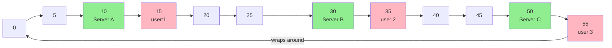

# 🎯 Consistent Hashing

## 0️⃣ Prerequisites

Before diving into Consistent Hashing, you need to understand:

### Hash Functions
A **hash function** takes any input and produces a fixed-size output (typically a number). Good hash functions distribute outputs uniformly.

```java
// Simple hash example
int hash = "user_123".hashCode();  // Returns some integer like 1234567890
int bucket = Math.abs(hash) % 10;  // Maps to bucket 0-9
```

### Modulo Operation
The **modulo** operation (%) gives the remainder after division. It's commonly used to map hash values to a fixed range.

```java
int hash = 1234567890;
int numServers = 5;
int serverIndex = hash % numServers;  // 0, 1, 2, 3, or 4
```

### Distributed Systems Basics
In distributed systems, data is spread across multiple servers (nodes). The challenge is deciding which server stores which data.

### Load Balancing
**Load balancing** distributes work across multiple servers to prevent any single server from being overwhelmed.

---

## 1️⃣ What Problem Does This Exist to Solve?

### The Core Problem: Naive Hashing Breaks on Scaling

Imagine you have a distributed cache with 3 servers. You use simple modulo hashing:

```java
int serverIndex = hash(key) % 3;
```

**Initial state (3 servers):**
```
Key "user:1" → hash = 100 → 100 % 3 = 1 → Server 1
Key "user:2" → hash = 101 → 101 % 3 = 2 → Server 2
Key "user:3" → hash = 102 → 102 % 3 = 0 → Server 0
Key "user:4" → hash = 103 → 103 % 3 = 1 → Server 1
```

**Now add a 4th server:**
```
Key "user:1" → hash = 100 → 100 % 4 = 0 → Server 0  ← MOVED!
Key "user:2" → hash = 101 → 101 % 4 = 1 → Server 1  ← MOVED!
Key "user:3" → hash = 102 → 102 % 4 = 2 → Server 2  ← MOVED!
Key "user:4" → hash = 103 → 103 % 4 = 3 → Server 3  ← MOVED!
```

**Disaster!** Almost ALL keys moved to different servers. Your cache is now empty (cache miss storm).

### The Mathematics of the Problem

When changing from N to N+1 servers with modulo hashing:
- **Keys that need to move**: ~(N/(N+1)) × 100% of all keys
- For N=3 to N=4: 75% of keys move
- For N=99 to N=100: 99% of keys move

### Real-World Pain Points

**Scenario 1: Cache Server Failure**
A cache server dies. With modulo hashing, 1/N keys move... but actually almost all keys get remapped due to modulo change.

**Scenario 2: Adding Capacity**
Black Friday is coming. You add 10 more cache servers. With modulo hashing, your cache becomes useless as all keys are remapped.

**Scenario 3: Database Sharding**
You shard your database by user_id % num_shards. Adding a new shard requires migrating almost all data.

### What Breaks Without Consistent Hashing?

| Without Consistent Hashing | With Consistent Hashing |
|---------------------------|------------------------|
| Adding 1 server moves ~100% keys | Adding 1 server moves ~1/N keys |
| Cache miss storm on scaling | Minimal cache invalidation |
| Massive data migration | Incremental data migration |
| Downtime during scaling | Seamless scaling |

---

## 2️⃣ Intuition and Mental Model

### The Clock Analogy

Imagine a clock face with positions 0-59 (like minutes).

**Servers are placed on the clock:**
- Server A at position 10
- Server B at position 30
- Server C at position 50

**Keys are also placed on the clock (by hashing):**
- Key "user:1" hashes to position 15
- Key "user:2" hashes to position 35
- Key "user:3" hashes to position 55

**Rule: Each key goes to the next server clockwise:**
- "user:1" (pos 15) → Server B (pos 30)
- "user:2" (pos 35) → Server C (pos 50)
- "user:3" (pos 55) → Server A (pos 10, wrapping around)



<details>
<summary>ASCII diagram (reference)</summary>

```text
              0
              │
         55 ──┼── 5
        /     │     \
      50      │      10
     (C)      │     (A)
    /         │         \
   45         │          15
    \         │         /
     40       │       20
        \     │     /
         35 ──┼── 25
              │
              30
             (B)
```
</details>

### What Happens When a Server Dies?

Server B (at position 30) dies:
- Keys that were going to B now go to the next server: C (at position 50)
- Only keys between A (10) and B (30) are affected
- Keys going to A and C are unchanged!

**Only ~1/3 of keys move, not all of them.**

### What Happens When a Server is Added?

Add Server D at position 20:
- Only keys between A (10) and D (20) now go to D instead of B
- That's only ~1/4 of the ring
- Most keys stay where they are!

**Consistent Hashing Key Insight**: "When adding or removing a server, only keys in the affected arc of the ring need to move. All other keys stay put."

- Adding 1 server to N servers: only ~1/N keys move
- Removing 1 server from N servers: only ~1/N keys move

<details>
<summary>ASCII diagram (reference)</summary>

```text
┌─────────────────────────────────────────────────────────────────┐
│                 CONSISTENT HASHING KEY INSIGHT                   │
├─────────────────────────────────────────────────────────────────┤
│                                                                  │
│  "When adding or removing a server, only keys in the affected   │
│   arc of the ring need to move. All other keys stay put."       │
│                                                                  │
│  Adding 1 server to N servers: only ~1/N keys move              │
│  Removing 1 server from N servers: only ~1/N keys move          │
│                                                                  │
└─────────────────────────────────────────────────────────────────┘
```
</details>

---

## 3️⃣ How It Works Internally

### Core Components

1. **Hash Ring**: A circular space of hash values (0 to 2^32-1 or 0 to 2^64-1)
2. **Node Positions**: Each server is hashed to a position on the ring
3. **Key Positions**: Each key is hashed to a position on the ring
4. **Lookup Rule**: A key is stored on the first node encountered going clockwise

### The Hash Ring

```
Hash space: 0 to 2^32 - 1 (4 billion positions)

Visualized as a circle:

                    0
                    │
                    │
     3,000,000,000 ─┼─ 1,000,000,000
                    │
                    │
              2,000,000,000
```

### Node Placement

```java
// Hash each server to get its position on the ring
long serverAPosition = hash("ServerA");  // e.g., 1,000,000,000
long serverBPosition = hash("ServerB");  // e.g., 2,500,000,000
long serverCPosition = hash("ServerC");  // e.g., 3,500,000,000
```

### Key Lookup

```java
// Hash the key
long keyPosition = hash("user:12345");  // e.g., 1,800,000,000

// Find the first server clockwise from this position
// 1,800,000,000 is between A (1B) and B (2.5B)
// So this key goes to Server B
```

### The Algorithm

```java
public class ConsistentHash {
    private TreeMap<Long, String> ring = new TreeMap<>();
    
    public void addServer(String server) {
        long hash = hash(server);
        ring.put(hash, server);
    }
    
    public void removeServer(String server) {
        long hash = hash(server);
        ring.remove(hash);
    }
    
    public String getServer(String key) {
        if (ring.isEmpty()) return null;
        
        long hash = hash(key);
        
        // Find first server with position >= key's position
        Map.Entry<Long, String> entry = ring.ceilingEntry(hash);
        
        // If no server found (key is past last server), wrap to first
        if (entry == null) {
            entry = ring.firstEntry();
        }
        
        return entry.getValue();
    }
}
```

### The Problem: Uneven Distribution

With only 3 servers on a large ring, the distribution is often uneven:

```
Server A: 10% of ring
Server B: 60% of ring  ← Overloaded!
Server C: 30% of ring
```

This happens because hash functions don't guarantee even spacing.

---

## 4️⃣ Virtual Nodes (VNodes)

### The Solution: Multiple Points per Server

Instead of one position per server, place each server at multiple positions:

```java
// Without virtual nodes: 1 position per server
ServerA → position 1,000,000,000

// With virtual nodes: 150 positions per server
ServerA-0 → position 100,000,000
ServerA-1 → position 500,000,000
ServerA-2 → position 900,000,000
...
ServerA-149 → position 3,800,000,000
```

### How Virtual Nodes Work

```java
public void addServer(String server, int numVirtualNodes) {
    for (int i = 0; i < numVirtualNodes; i++) {
        // Create a unique identifier for each virtual node
        String virtualNode = server + "-" + i;
        long hash = hash(virtualNode);
        ring.put(hash, server);  // All virtual nodes map to same physical server
    }
}
```

### Benefits of Virtual Nodes

1. **Better Load Distribution**: More points on the ring means more even distribution
2. **Smoother Scaling**: Adding a server with 150 vnodes takes 150 small slices, not one big slice
3. **Heterogeneous Hardware**: Powerful servers can have more vnodes

```
Without VNodes (3 servers):
Server A: ████████░░░░░░░░░░░░░░░░░░░░░░░░░░░░░░░░  10%
Server B: ████████████████████████████████████████  60%
Server C: ████████████████████████░░░░░░░░░░░░░░░░  30%

With VNodes (150 per server):
Server A: █████████████████████████████████░░░░░░░  33%
Server B: █████████████████████████████████░░░░░░░  34%
Server C: █████████████████████████████████░░░░░░░  33%
```

### Choosing the Number of Virtual Nodes

| VNodes per Server | Distribution Quality | Memory Usage |
|-------------------|---------------------|--------------|
| 1 | Poor | Very Low |
| 50 | Good | Low |
| 150 | Excellent | Medium |
| 500 | Near-perfect | High |

**Rule of thumb**: 100-200 virtual nodes per physical server provides good balance.

---

## 5️⃣ Simulation: Step-by-Step Walkthrough

Let's trace through a complete example with a hash ring of size 100 (for simplicity).

### Initial Setup: 3 Servers, 3 VNodes Each

```
Server A vnodes: hash("A-0")=10, hash("A-1")=40, hash("A-2")=80
Server B vnodes: hash("B-0")=25, hash("B-1")=55, hash("B-2")=90
Server C vnodes: hash("C-0")=5, hash("C-1")=35, hash("C-2")=70

Ring (sorted by position):
Position:  5    10   25   35   40   55   70   80   90
Server:   [C-0][A-0][B-0][C-1][A-1][B-1][C-2][A-2][B-2]
```

### Key Lookups

```
Key "user:1" → hash = 15
  Position 15 → next server clockwise → B-0 (position 25) → Server B

Key "user:2" → hash = 42
  Position 42 → next server clockwise → B-1 (position 55) → Server B

Key "user:3" → hash = 72
  Position 72 → next server clockwise → A-2 (position 80) → Server A

Key "user:4" → hash = 95
  Position 95 → next server clockwise → C-0 (position 5, wrapping) → Server C
```

### Adding Server D (3 VNodes)

```
Server D vnodes: hash("D-0")=20, hash("D-1")=60, hash("D-2")=85

New Ring:
Position:  5    10   20   25   35   40   55   60   70   80   85   90
Server:   [C-0][A-0][D-0][B-0][C-1][A-1][B-1][D-1][C-2][A-2][D-2][B-2]
```

**Which keys moved?**
```
Key "user:1" (hash=15):
  Before: 15 → B-0 (25) → Server B
  After:  15 → D-0 (20) → Server D  ← MOVED

Key "user:2" (hash=42):
  Before: 42 → B-1 (55) → Server B
  After:  42 → B-1 (55) → Server B  ← SAME

Key "user:3" (hash=72):
  Before: 72 → A-2 (80) → Server A
  After:  72 → A-2 (80) → Server A  ← SAME

Key "user:4" (hash=95):
  Before: 95 → C-0 (5) → Server C
  After:  95 → C-0 (5) → Server C  ← SAME
```

Only keys in the arcs before D's vnodes moved. Most keys stayed put!

### Removing Server B

```
Remove B-0 (25), B-1 (55), B-2 (90)

New Ring:
Position:  5    10   20   35   40   60   70   80   85
Server:   [C-0][A-0][D-0][C-1][A-1][D-1][C-2][A-2][D-2]
```

**Which keys moved?**
```
Keys that were going to B-0 (25) now go to C-1 (35)
Keys that were going to B-1 (55) now go to D-1 (60)
Keys that were going to B-2 (90) now go to C-0 (5)

Only ~1/4 of keys moved (B had 3 out of 12 vnodes)
```

---

## 6️⃣ How Engineers Use This in Production

### Amazon DynamoDB

DynamoDB uses consistent hashing for partitioning data across storage nodes.

**DynamoDB Partitioning**

Table: Users  
Partition Key: user_id

- user_id="alice" → hash → partition 3 → Node A
- user_id="bob" → hash → partition 7 → Node B
- user_id="carol" → hash → partition 2 → Node C

**When Node B fails:**
- Only partition 7's data needs to be served by replica
- Other partitions unaffected

<details>
<summary>ASCII diagram (reference)</summary>

```text
┌─────────────────────────────────────────────────────────────────┐
│                    DYNAMODB PARTITIONING                         │
├─────────────────────────────────────────────────────────────────┤
│                                                                  │
│  Table: Users                                                    │
│  Partition Key: user_id                                          │
│                                                                  │
│  user_id="alice" → hash → partition 3 → Node A                  │
│  user_id="bob"   → hash → partition 7 → Node B                  │
│  user_id="carol" → hash → partition 2 → Node C                  │
│                                                                  │
│  When Node B fails:                                              │
│  - Only partition 7's data needs to be served by replica        │
│  - Other partitions unaffected                                  │
│                                                                  │
└─────────────────────────────────────────────────────────────────┘
```
</details>

### Apache Cassandra

Cassandra uses consistent hashing with virtual nodes (vnodes) for data distribution.

```yaml
# cassandra.yaml
num_tokens: 256  # Number of virtual nodes per physical node
```

```
Cassandra Ring:
- Each node owns 256 token ranges
- Data is replicated to N consecutive nodes on the ring
- Adding a node redistributes only 1/num_nodes of data
```

### Memcached / Redis Cluster

Distributed caching uses consistent hashing to route keys to cache servers.

```java
// Client-side consistent hashing
ConsistentHash ring = new ConsistentHash();
ring.addServer("cache1.example.com:11211", 150);
ring.addServer("cache2.example.com:11211", 150);
ring.addServer("cache3.example.com:11211", 150);

String server = ring.getServer("session:user123");
// Connect to that specific server
```

### Discord

Discord uses consistent hashing for routing messages to the correct server.

```
User joins guild "Gaming Community"
→ hash("guild:12345") → Server 7
→ All messages for this guild go to Server 7
→ If Server 7 fails, guild moves to Server 8 (next on ring)
→ Other guilds unaffected
```

---

## 7️⃣ Implementation in Java

### Basic Consistent Hashing with Virtual Nodes

```java
import java.util.*;
import java.security.MessageDigest;
import java.security.NoSuchAlgorithmException;
import java.nio.charset.StandardCharsets;

/**
 * Consistent Hashing implementation with virtual nodes.
 * Used for distributing data across a cluster of servers.
 */
public class ConsistentHash<T> {
    
    private final TreeMap<Long, T> ring = new TreeMap<>();
    private final Map<T, Integer> nodeVnodeCount = new HashMap<>();
    private final int defaultVnodes;
    private final MessageDigest md5;
    
    /**
     * Creates a consistent hash ring.
     * 
     * @param defaultVnodes Default number of virtual nodes per physical node
     */
    public ConsistentHash(int defaultVnodes) {
        this.defaultVnodes = defaultVnodes;
        try {
            this.md5 = MessageDigest.getInstance("MD5");
        } catch (NoSuchAlgorithmException e) {
            throw new RuntimeException("MD5 not available", e);
        }
    }
    
    /**
     * Adds a node to the ring with the default number of virtual nodes.
     */
    public void addNode(T node) {
        addNode(node, defaultVnodes);
    }
    
    /**
     * Adds a node to the ring with a specific number of virtual nodes.
     * More vnodes = more even distribution but more memory.
     */
    public synchronized void addNode(T node, int vnodes) {
        nodeVnodeCount.put(node, vnodes);
        for (int i = 0; i < vnodes; i++) {
            long hash = hash(node.toString() + "-" + i);
            ring.put(hash, node);
        }
    }
    
    /**
     * Removes a node and all its virtual nodes from the ring.
     */
    public synchronized void removeNode(T node) {
        Integer vnodes = nodeVnodeCount.remove(node);
        if (vnodes != null) {
            for (int i = 0; i < vnodes; i++) {
                long hash = hash(node.toString() + "-" + i);
                ring.remove(hash);
            }
        }
    }
    
    /**
     * Gets the node responsible for the given key.
     * 
     * @param key The key to look up
     * @return The node responsible for this key, or null if ring is empty
     */
    public T getNode(String key) {
        if (ring.isEmpty()) {
            return null;
        }
        
        long hash = hash(key);
        
        // Find the first node with hash >= key's hash
        Map.Entry<Long, T> entry = ring.ceilingEntry(hash);
        
        // If no such node exists, wrap around to the first node
        if (entry == null) {
            entry = ring.firstEntry();
        }
        
        return entry.getValue();
    }
    
    /**
     * Gets N nodes for replication (the key's primary node plus N-1 successors).
     * 
     * @param key The key to look up
     * @param count Number of nodes to return
     * @return List of nodes for replication
     */
    public List<T> getNodes(String key, int count) {
        if (ring.isEmpty()) {
            return Collections.emptyList();
        }
        
        List<T> result = new ArrayList<>();
        Set<T> seen = new HashSet<>();
        
        long hash = hash(key);
        
        // Start from the first node >= hash
        SortedMap<Long, T> tailMap = ring.tailMap(hash);
        
        // First, iterate from hash to end of ring
        for (T node : tailMap.values()) {
            if (!seen.contains(node)) {
                seen.add(node);
                result.add(node);
                if (result.size() >= count) {
                    return result;
                }
            }
        }
        
        // Then, wrap around from start of ring
        for (T node : ring.values()) {
            if (!seen.contains(node)) {
                seen.add(node);
                result.add(node);
                if (result.size() >= count) {
                    return result;
                }
            }
        }
        
        return result;
    }
    
    /**
     * Returns all nodes in the ring.
     */
    public Set<T> getAllNodes() {
        return new HashSet<>(nodeVnodeCount.keySet());
    }
    
    /**
     * Returns the number of virtual nodes on the ring.
     */
    public int getRingSize() {
        return ring.size();
    }
    
    /**
     * Computes MD5 hash and returns first 8 bytes as long.
     */
    private long hash(String key) {
        md5.reset();
        byte[] digest = md5.digest(key.getBytes(StandardCharsets.UTF_8));
        
        // Use first 8 bytes as a long
        long hash = 0;
        for (int i = 0; i < 8; i++) {
            hash = (hash << 8) | (digest[i] & 0xFF);
        }
        return hash;
    }
    
    /**
     * Returns distribution statistics for debugging.
     */
    public Map<T, Double> getDistribution() {
        Map<T, Long> counts = new HashMap<>();
        long prevHash = ring.lastKey();
        
        for (Map.Entry<Long, T> entry : ring.entrySet()) {
            long currHash = entry.getKey();
            T node = entry.getValue();
            
            // Calculate arc size (handling wrap-around)
            long arcSize;
            if (currHash > prevHash) {
                arcSize = currHash - prevHash;
            } else {
                arcSize = (Long.MAX_VALUE - prevHash) + (currHash - Long.MIN_VALUE);
            }
            
            counts.merge(node, arcSize, Long::sum);
            prevHash = currHash;
        }
        
        // Convert to percentages
        long total = counts.values().stream().mapToLong(Long::longValue).sum();
        Map<T, Double> distribution = new HashMap<>();
        for (Map.Entry<T, Long> entry : counts.entrySet()) {
            distribution.put(entry.getKey(), (double) entry.getValue() / total * 100);
        }
        
        return distribution;
    }
}
```

### Testing the Implementation

```java
public class ConsistentHashTest {
    
    public static void main(String[] args) {
        testBasicOperations();
        testDistribution();
        testNodeAdditionRemoval();
        testReplication();
    }
    
    static void testBasicOperations() {
        System.out.println("=== Basic Operations ===");
        
        ConsistentHash<String> ring = new ConsistentHash<>(150);
        
        ring.addNode("server1");
        ring.addNode("server2");
        ring.addNode("server3");
        
        // Test key lookups
        String[] keys = {"user:1", "user:2", "user:3", "session:abc", "cache:xyz"};
        for (String key : keys) {
            System.out.println(key + " → " + ring.getNode(key));
        }
    }
    
    static void testDistribution() {
        System.out.println("\n=== Distribution Test ===");
        
        ConsistentHash<String> ring = new ConsistentHash<>(150);
        ring.addNode("server1");
        ring.addNode("server2");
        ring.addNode("server3");
        
        // Count keys per server
        Map<String, Integer> counts = new HashMap<>();
        for (int i = 0; i < 10000; i++) {
            String key = "key:" + i;
            String server = ring.getNode(key);
            counts.merge(server, 1, Integer::sum);
        }
        
        System.out.println("Key distribution (10,000 keys):");
        for (Map.Entry<String, Integer> entry : counts.entrySet()) {
            double pct = entry.getValue() / 100.0;
            System.out.printf("  %s: %d keys (%.1f%%)\n", 
                entry.getKey(), entry.getValue(), pct);
        }
    }
    
    static void testNodeAdditionRemoval() {
        System.out.println("\n=== Node Addition/Removal Test ===");
        
        ConsistentHash<String> ring = new ConsistentHash<>(150);
        ring.addNode("server1");
        ring.addNode("server2");
        ring.addNode("server3");
        
        // Record initial assignments
        Map<String, String> initialAssignments = new HashMap<>();
        for (int i = 0; i < 10000; i++) {
            String key = "key:" + i;
            initialAssignments.put(key, ring.getNode(key));
        }
        
        // Add a new server
        ring.addNode("server4");
        
        // Count how many keys moved
        int moved = 0;
        for (int i = 0; i < 10000; i++) {
            String key = "key:" + i;
            String newServer = ring.getNode(key);
            if (!newServer.equals(initialAssignments.get(key))) {
                moved++;
            }
        }
        
        System.out.printf("Adding server4: %d keys moved (%.1f%%)\n", 
            moved, moved / 100.0);
        System.out.println("Expected: ~25% (1/4 of keys)");
        
        // Remove a server
        ring.removeNode("server2");
        
        moved = 0;
        for (int i = 0; i < 10000; i++) {
            String key = "key:" + i;
            String newServer = ring.getNode(key);
            if (!newServer.equals(initialAssignments.get(key))) {
                moved++;
            }
        }
        
        System.out.printf("After removing server2: %d total keys changed (%.1f%%)\n", 
            moved, moved / 100.0);
    }
    
    static void testReplication() {
        System.out.println("\n=== Replication Test ===");
        
        ConsistentHash<String> ring = new ConsistentHash<>(150);
        ring.addNode("server1");
        ring.addNode("server2");
        ring.addNode("server3");
        ring.addNode("server4");
        ring.addNode("server5");
        
        // Get 3 replicas for a key
        String key = "important:data";
        List<String> replicas = ring.getNodes(key, 3);
        
        System.out.println("Key: " + key);
        System.out.println("Replicas: " + replicas);
    }
}
```

### Production-Ready Implementation with Bounded Load

```java
import java.util.*;
import java.util.concurrent.ConcurrentHashMap;
import java.util.concurrent.atomic.AtomicInteger;

/**
 * Consistent Hashing with Bounded Load.
 * Ensures no node gets more than (1 + ε) × average load.
 * Based on Google's "Consistent Hashing with Bounded Loads" paper.
 */
public class BoundedLoadConsistentHash<T> {
    
    private final ConsistentHash<T> ring;
    private final Map<T, AtomicInteger> nodeLoads = new ConcurrentHashMap<>();
    private final double epsilon;
    private int totalItems = 0;
    
    /**
     * @param vnodes Virtual nodes per physical node
     * @param epsilon Load factor tolerance (e.g., 0.25 means 25% above average is OK)
     */
    public BoundedLoadConsistentHash(int vnodes, double epsilon) {
        this.ring = new ConsistentHash<>(vnodes);
        this.epsilon = epsilon;
    }
    
    public void addNode(T node) {
        ring.addNode(node);
        nodeLoads.put(node, new AtomicInteger(0));
    }
    
    public void removeNode(T node) {
        ring.removeNode(node);
        nodeLoads.remove(node);
    }
    
    /**
     * Gets a node for the key, respecting load bounds.
     * If the primary node is overloaded, tries successors.
     */
    public synchronized T getNode(String key) {
        if (nodeLoads.isEmpty()) {
            return null;
        }
        
        int numNodes = nodeLoads.size();
        double avgLoad = (double) totalItems / numNodes;
        int maxLoad = (int) Math.ceil(avgLoad * (1 + epsilon));
        maxLoad = Math.max(maxLoad, 1);  // At least 1
        
        // Get nodes in order of preference
        List<T> candidates = ring.getNodes(key, numNodes);
        
        // Find first node under the load limit
        for (T node : candidates) {
            AtomicInteger load = nodeLoads.get(node);
            if (load != null && load.get() < maxLoad) {
                return node;
            }
        }
        
        // All nodes at capacity, return primary anyway
        return candidates.isEmpty() ? null : candidates.get(0);
    }
    
    /**
     * Records that a key was assigned to a node.
     */
    public void recordAssignment(T node) {
        AtomicInteger load = nodeLoads.get(node);
        if (load != null) {
            load.incrementAndGet();
            totalItems++;
        }
    }
    
    /**
     * Records that a key was removed from a node.
     */
    public void recordRemoval(T node) {
        AtomicInteger load = nodeLoads.get(node);
        if (load != null) {
            load.decrementAndGet();
            totalItems--;
        }
    }
    
    public Map<T, Integer> getLoadDistribution() {
        Map<T, Integer> result = new HashMap<>();
        for (Map.Entry<T, AtomicInteger> entry : nodeLoads.entrySet()) {
            result.put(entry.getKey(), entry.getValue().get());
        }
        return result;
    }
}
```

### Spring Boot Integration

```java
import org.springframework.stereotype.Component;
import javax.annotation.PostConstruct;
import java.util.List;

@Component
public class CacheRouter {
    
    private final ConsistentHash<String> cacheRing;
    private final List<String> cacheServers;
    
    public CacheRouter(@Value("${cache.servers}") List<String> servers) {
        this.cacheServers = servers;
        this.cacheRing = new ConsistentHash<>(150);
    }
    
    @PostConstruct
    public void init() {
        for (String server : cacheServers) {
            cacheRing.addNode(server);
        }
    }
    
    /**
     * Routes a cache key to the appropriate server.
     */
    public String getServerForKey(String key) {
        return cacheRing.getNode(key);
    }
    
    /**
     * Gets servers for replication.
     */
    public List<String> getServersForReplication(String key, int replicas) {
        return cacheRing.getNodes(key, replicas);
    }
    
    /**
     * Adds a new cache server (e.g., during scaling).
     */
    public void addServer(String server) {
        cacheRing.addNode(server);
        // Optionally trigger data migration
    }
    
    /**
     * Removes a cache server (e.g., during failure or scale-down).
     */
    public void removeServer(String server) {
        cacheRing.removeNode(server);
        // Data on this server will be re-fetched from source
    }
}
```

### Application Configuration

```yaml
# application.yml
cache:
  servers:
    - cache1.example.com:11211
    - cache2.example.com:11211
    - cache3.example.com:11211
  vnodes-per-server: 150
  replication-factor: 2
```

---

## 8️⃣ Advanced Variants

### Jump Consistent Hashing

A simpler algorithm that doesn't require a ring data structure:

```java
/**
 * Jump Consistent Hashing.
 * Faster and uses less memory than ring-based approach.
 * Limitation: Only works when buckets are numbered 0 to n-1.
 */
public class JumpConsistentHash {
    
    /**
     * Returns bucket number (0 to numBuckets-1) for the given key.
     */
    public static int jumpHash(long key, int numBuckets) {
        long b = -1;
        long j = 0;
        
        while (j < numBuckets) {
            b = j;
            key = key * 2862933555777941757L + 1;
            j = (long) ((b + 1) * (double) (1L << 31) / ((key >>> 33) + 1));
        }
        
        return (int) b;
    }
    
    public static int jumpHash(String key, int numBuckets) {
        return jumpHash(key.hashCode(), numBuckets);
    }
}
```

**Advantages:**
- O(log n) time, O(1) space
- No ring to maintain
- Mathematically optimal distribution

**Disadvantages:**
- Buckets must be numbered 0 to n-1
- Adding/removing buckets in the middle is awkward

### Rendezvous Hashing (Highest Random Weight)

An alternative to consistent hashing:

```java
/**
 * Rendezvous Hashing (HRW).
 * Each key picks the server with highest hash(key, server).
 */
public class RendezvousHash<T> {
    
    private final List<T> nodes = new ArrayList<>();
    
    public void addNode(T node) {
        nodes.add(node);
    }
    
    public void removeNode(T node) {
        nodes.remove(node);
    }
    
    public T getNode(String key) {
        if (nodes.isEmpty()) return null;
        
        T bestNode = null;
        long bestScore = Long.MIN_VALUE;
        
        for (T node : nodes) {
            long score = hash(key + node.toString());
            if (score > bestScore) {
                bestScore = score;
                bestNode = node;
            }
        }
        
        return bestNode;
    }
    
    private long hash(String s) {
        // Use a good hash function
        return s.hashCode() * 31L + s.length();
    }
}
```

**Advantages:**
- Simple to understand
- No ring data structure needed
- Naturally handles weighted nodes

**Disadvantages:**
- O(n) lookup time (must check all nodes)
- Not suitable for large clusters

---

## 9️⃣ Tradeoffs, Pitfalls, and Common Mistakes

### Tradeoffs

| Aspect | Consistent Hashing | Modulo Hashing | Rendezvous |
|--------|-------------------|----------------|------------|
| Key movement on scaling | ~1/N | ~100% | ~1/N |
| Lookup time | O(log n) | O(1) | O(n) |
| Memory | O(n × vnodes) | O(1) | O(n) |
| Implementation | Medium | Simple | Simple |

### Common Pitfalls

**1. Too few virtual nodes**

```java
// BAD: Only 1 vnode per server
ConsistentHash<String> ring = new ConsistentHash<>(1);
// Results in very uneven distribution

// GOOD: 100-200 vnodes per server
ConsistentHash<String> ring = new ConsistentHash<>(150);
```

**2. Poor hash function**

```java
// BAD: Using String.hashCode() directly
// Java's hashCode has poor distribution for similar strings

// GOOD: Use MD5, MurmurHash, or xxHash
private long hash(String key) {
    return MurmurHash3.hash64(key.getBytes());
}
```

**3. Not handling node failures**

```java
// BAD: Assuming node is always available
String server = ring.getNode(key);
cache.get(server, key);  // Fails if server is down!

// GOOD: Use replication or fallback
List<String> servers = ring.getNodes(key, 3);
for (String server : servers) {
    try {
        return cache.get(server, key);
    } catch (Exception e) {
        // Try next server
    }
}
```

**4. Ignoring hot keys**

```java
// BAD: Single popular key overloads one server
// All requests for "trending:post" go to same server

// GOOD: Use bounded load consistent hashing
// Or add random suffix for hot keys
String routingKey = isHotKey(key) ? key + ":" + random.nextInt(10) : key;
```

### Performance Gotchas

**1. TreeMap overhead**

```java
// TreeMap operations are O(log n)
// For very high throughput, consider:
// - Caching recent lookups
// - Using array-based ring for fixed node count
```

**2. Synchronization**

```java
// Adding/removing nodes requires synchronization
// Lookups can be lock-free with ConcurrentSkipListMap
private final ConcurrentSkipListMap<Long, T> ring = new ConcurrentSkipListMap<>();
```

---

## 🔟 When NOT to Use Consistent Hashing

### Anti-Patterns

**1. Fixed, small number of nodes**

```java
// OVERKILL: 3 servers that never change
// Just use modulo hashing, it's simpler
int server = hash(key) % 3;
```

**2. When you need strict ordering**

```java
// Consistent hashing doesn't preserve key ordering
// Use range partitioning instead for ordered data
```

**3. When all data must be on all nodes**

```java
// If you need full replication, consistent hashing adds no value
// Just broadcast to all nodes
```

### Better Alternatives

| Use Case | Better Alternative |
|----------|-------------------|
| Fixed cluster size | Modulo hashing |
| Small cluster (<5 nodes) | Rendezvous hashing |
| Range queries needed | Range partitioning |
| Full replication | Broadcast |

---

## 1️⃣1️⃣ Interview Follow-Up Questions with Answers

### L4 (Entry-Level) Questions

**Q1: What is consistent hashing and why is it needed?**

**Answer**: Consistent hashing is a technique for distributing data across a cluster of servers such that when servers are added or removed, only a minimal amount of data needs to be moved. With regular modulo hashing (key % num_servers), changing the number of servers causes almost all keys to be remapped. With consistent hashing, adding or removing a server only affects about 1/N of the keys, where N is the number of servers. This is crucial for distributed caches and databases where moving data is expensive.

**Q2: How does the hash ring work?**

**Answer**: The hash ring is a circular space of hash values (typically 0 to 2^32-1). Both servers and keys are hashed to positions on this ring. To find which server stores a key, you hash the key, then walk clockwise on the ring until you find the first server. When a server is removed, its keys simply go to the next server clockwise. When a server is added, it takes keys from the next server clockwise. This is why only keys in the affected "arc" of the ring need to move.

**Q3: What are virtual nodes and why are they used?**

**Answer**: Virtual nodes (vnodes) are multiple positions on the hash ring for each physical server. Instead of one position per server, each server might have 100-200 positions. This solves the uneven distribution problem: with few points on a large ring, some servers might get much more data than others by chance. With many virtual nodes, the distribution becomes more even. It also makes scaling smoother: adding a server with 150 vnodes takes 150 small slices from around the ring, rather than one big slice.

### L5 (Senior) Questions

**Q4: How would you implement consistent hashing for a distributed cache that needs replication?**

**Answer**:

```java
// For replication, get N consecutive nodes on the ring
public List<String> getReplicaNodes(String key, int replicationFactor) {
    List<String> replicas = new ArrayList<>();
    Set<String> seen = new HashSet<>();
    
    long hash = hash(key);
    SortedMap<Long, String> tailMap = ring.tailMap(hash);
    
    // Walk clockwise, collecting unique physical nodes
    for (String node : tailMap.values()) {
        if (!seen.contains(node)) {
            seen.add(node);
            replicas.add(node);
            if (replicas.size() >= replicationFactor) break;
        }
    }
    
    // Wrap around if needed
    if (replicas.size() < replicationFactor) {
        for (String node : ring.values()) {
            if (!seen.contains(node)) {
                seen.add(node);
                replicas.add(node);
                if (replicas.size() >= replicationFactor) break;
            }
        }
    }
    
    return replicas;
}
```

The key insight is to skip virtual nodes of the same physical server to ensure replicas are on different machines.

**Q5: How do you handle hot keys in consistent hashing?**

**Answer**: Hot keys (keys with disproportionate traffic) can overload a single server. Solutions:

1. **Bounded Load Consistent Hashing**: Track load per server, redirect to next server if primary is overloaded
2. **Key Splitting**: Add random suffix to hot keys to spread them: `hotkey:0`, `hotkey:1`, etc.
3. **Local Caching**: Cache hot keys at the application layer
4. **Read Replicas**: Route read traffic to replicas, not just primary

```java
// Bounded load approach
public String getNode(String key) {
    List<String> candidates = ring.getNodes(key, nodeCount);
    for (String node : candidates) {
        if (getLoad(node) < maxLoad) {
            return node;
        }
    }
    return candidates.get(0);  // Fallback to primary
}
```

**Q6: Compare consistent hashing to range partitioning.**

**Answer**:

| Aspect | Consistent Hashing | Range Partitioning |
|--------|-------------------|-------------------|
| Key distribution | Hash-based (random) | Range-based (ordered) |
| Hot spots | Possible with hot keys | Possible with hot ranges |
| Range queries | Inefficient (scatter-gather) | Efficient (single partition) |
| Rebalancing | Automatic, minimal | Manual, can be complex |
| Use case | Caches, key-value stores | Databases with range scans |

Consistent hashing is better for random access patterns (caches, session stores). Range partitioning is better when you need to query ranges of keys together (time-series data, user data by ID range).

### L6 (Staff) Questions

**Q7: Design a distributed cache system using consistent hashing.**

**Answer**:

```
Architecture:

1. Client Library:
   - Maintains consistent hash ring locally
   - Routes requests to correct server
   - Handles failover to replicas

2. Cache Servers:
   - Stateless, store data in memory
   - Report health to coordinator
   - Handle replication protocol

3. Coordinator Service:
   - Maintains authoritative ring configuration
   - Detects server failures (heartbeat)
   - Broadcasts ring updates to clients

4. Data Flow:
   GET key:
   - Client hashes key, finds server
   - If cache hit, return
   - If cache miss, fetch from source, cache, return
   
   Server failure:
   - Coordinator detects via heartbeat
   - Removes server from ring
   - Broadcasts update to clients
   - Keys automatically route to next server (cache miss, refetch)

5. Consistency:
   - Eventual consistency (cache can be stale)
   - TTL-based expiration
   - Optional: write-through to ensure freshness

6. Scaling:
   - Add server: coordinator adds to ring, broadcasts
   - New server starts empty, fills via cache misses
   - Optional: proactive migration for faster warmup
```

**Q8: How does DynamoDB use consistent hashing, and what modifications did they make?**

**Answer**: DynamoDB uses consistent hashing with several modifications:

1. **Virtual Nodes**: Each node has many tokens (positions on ring) for even distribution

2. **Preference List**: For each key, DynamoDB maintains a list of N nodes responsible for it (not just one). The first node is the coordinator, others are replicas.

3. **Sloppy Quorum**: If a node in the preference list is unavailable, DynamoDB uses the next healthy node on the ring. This is called "hinted handoff."

4. **Vector Clocks**: To handle conflicts from concurrent writes to replicas, DynamoDB uses vector clocks for versioning.

5. **Merkle Trees**: To detect inconsistencies between replicas, DynamoDB uses Merkle trees for efficient comparison.

6. **Gossip Protocol**: Nodes share ring membership information via gossip, so all nodes eventually have the same view.

The key insight is that consistent hashing is just the starting point. Production systems add replication, failure handling, and consistency mechanisms on top.

---

## 1️⃣2️⃣ One Clean Mental Summary

Consistent hashing distributes data across servers using a circular hash ring. Both servers and keys are hashed to positions on the ring, and each key is stored on the first server encountered going clockwise. When a server is added or removed, only keys in the affected arc of the ring need to move (about 1/N of all keys), unlike modulo hashing where almost all keys move. Virtual nodes (multiple positions per server) ensure even distribution. This makes consistent hashing essential for distributed caches, databases, and any system that needs to scale smoothly without massive data migration.

---

## Summary

Consistent hashing is essential for:
- **Distributed caches**: Memcached, Redis Cluster
- **NoSQL databases**: Cassandra, DynamoDB, Riak
- **Load balancers**: Routing requests to backend servers
- **CDNs**: Distributing content across edge servers

Key takeaways:
1. Only ~1/N keys move when adding/removing a server
2. Virtual nodes ensure even distribution
3. Use 100-200 vnodes per physical server
4. Combine with replication for fault tolerance
5. Consider bounded load for hot key handling
6. TreeMap provides O(log n) lookups

