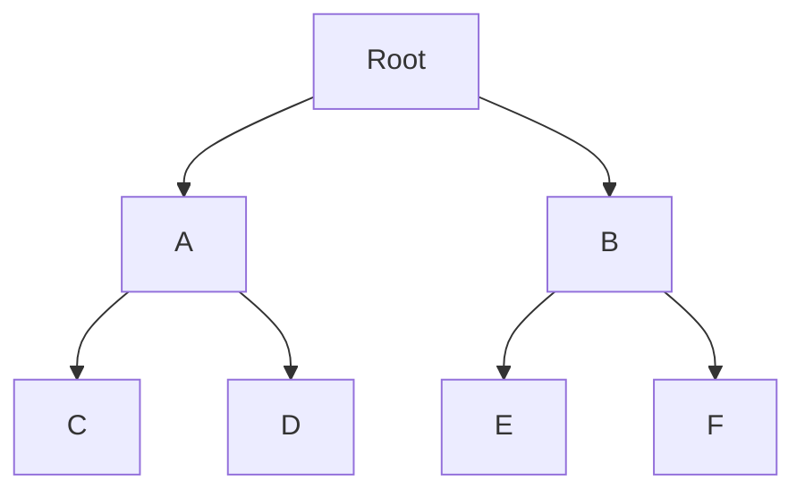
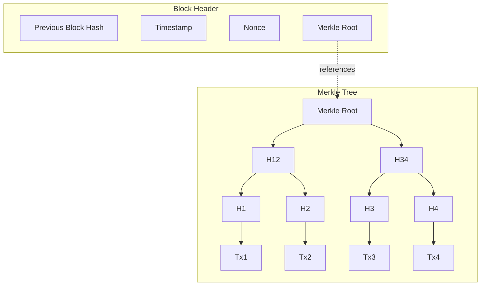
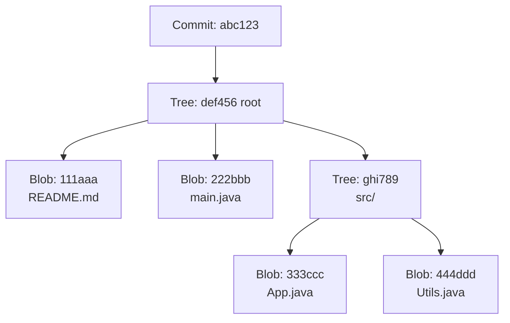
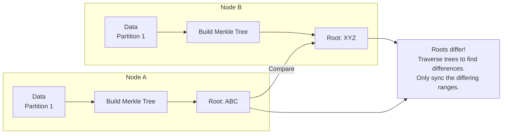

# 🎯 Merkle Trees

## 0️⃣ Prerequisites

Before diving into Merkle Trees, you need to understand:

### Cryptographic Hash Functions
A **cryptographic hash function** takes any input and produces a fixed-size output (digest) with these properties:
- **Deterministic**: Same input always produces same output
- **One-way**: Cannot reverse the hash to get the input
- **Collision-resistant**: Extremely hard to find two different inputs with the same hash
- **Avalanche effect**: Small input change causes completely different output

```java
import java.security.MessageDigest;

// SHA-256 produces a 256-bit (32-byte) hash
MessageDigest md = MessageDigest.getInstance("SHA-256");
byte[] hash = md.digest("Hello".getBytes());
// Result: 185f8db32271fe25f561a6fc938b2e264306ec304eda518007d1764826381969

// Change one letter
byte[] hash2 = md.digest("hello".getBytes());
// Result: 2cf24dba5fb0a30e26e83b2ac5b9e29e1b161e5c1fa7425e73043362938b9824
// Completely different!
```

### Binary Trees
A **binary tree** is a tree where each node has at most two children.



<details>
<summary>ASCII diagram (reference)</summary>

```text
        Root
       /    \
      A      B
     / \    / \
    C   D  E   F
```
</details>

### Data Integrity
**Data integrity** means ensuring data hasn't been modified, corrupted, or tampered with.

---

## 1️⃣ What Problem Does This Exist to Solve?

### The Core Problem: Efficient Data Verification

Imagine you're downloading a 10 GB file from a peer-to-peer network. How do you verify the file is correct and hasn't been tampered with?

**Approach 1: Hash the entire file**
```java
// Download entire 10 GB file
byte[] file = downloadEntireFile();
// Hash it
byte[] hash = sha256(file);
// Compare with expected hash
if (!Arrays.equals(hash, expectedHash)) {
    // File is corrupted, re-download EVERYTHING
    redownloadEntireFile();
}
```

**Problem**: If even one byte is wrong, you must re-download the entire file!

**Approach 2: Hash each chunk separately**
```java
// Split file into 1 MB chunks
// Store hash of each chunk
Map<Integer, byte[]> chunkHashes = new HashMap<>();
for (int i = 0; i < numChunks; i++) {
    chunkHashes.put(i, sha256(chunks[i]));
}
// Problem: 10,000 hashes to store and verify!
```

**Problem**: With 10,000 chunks, you need to store and transmit 10,000 hashes (320 KB just for hashes).

### The Merkle Tree Solution

A Merkle tree organizes hashes hierarchically:
- Store only the **root hash** (32 bytes)
- Verify any chunk with **O(log n)** hashes
- Identify exactly which chunks are corrupted

### Real-World Pain Points

**Scenario 1: Git Version Control**
Git needs to detect which files changed between commits. Comparing every file is slow. Merkle trees (Git calls them "tree objects") enable fast comparison.

**Scenario 2: Blockchain**
Bitcoin blocks contain thousands of transactions. Merkle trees allow lightweight clients to verify a transaction exists without downloading the entire block.

**Scenario 3: Distributed Databases (Cassandra)**
Cassandra nodes need to synchronize data. Merkle trees enable efficient detection of which data differs between nodes (anti-entropy repair).

### What Breaks Without Merkle Trees?

| Without Merkle Trees | With Merkle Trees |
|---------------------|-------------------|
| Verify entire dataset | Verify single root hash |
| O(n) comparison | O(log n) comparison |
| Re-download everything on error | Re-download only corrupted parts |
| Full data scan for sync | Efficient diff detection |

---

## 2️⃣ Intuition and Mental Model

### The Fingerprint Hierarchy Analogy

Imagine you're a museum curator verifying a collection of 1000 paintings.

**Naive approach**: Check every painting individually. If one is fake, you don't know which until you've checked all 1000.

**Merkle approach**: Organize paintings into groups:
- Group paintings into pairs, create a "pair fingerprint"
- Group pair fingerprints into quads, create "quad fingerprint"
- Continue until you have one "master fingerprint"

```
Master Fingerprint: ABC123
        /                  \
   XY789                    ZW456
   /    \                   /    \
 AB12   CD34             EF56   GH78
 /  \   /  \             /  \   /  \
P1  P2 P3  P4           P5  P6 P7  P8
```

**To verify painting P3:**
1. Compute hash of P3
2. Combine with hash of P4 → should equal CD34
3. Combine CD34 with AB12 → should equal XY789
4. Combine XY789 with ZW456 → should equal ABC123 (master)

If any step fails, you know exactly where the problem is!

### The Key Insight

**Merkle Tree Key Insight**: "A single root hash commits to the entire dataset"

- If ANY data changes, the root hash changes.
- If root hashes match, ALL data matches (with overwhelming probability).
- Verification requires only O(log n) hashes, not O(n).

<details>
<summary>ASCII diagram (reference)</summary>

```text
┌─────────────────────────────────────────────────────────────────┐
│                    MERKLE TREE KEY INSIGHT                       │
├─────────────────────────────────────────────────────────────────┤
│                                                                  │
│  "A single root hash commits to the entire dataset"             │
│                                                                  │
│  If ANY data changes, the root hash changes.                    │
│  If root hashes match, ALL data matches (with overwhelming      │
│  probability).                                                  │
│                                                                  │
│  Verification requires only O(log n) hashes, not O(n).          │
│                                                                  │
└─────────────────────────────────────────────────────────────────┘
```
</details>

---

## 3️⃣ How It Works Internally

### Structure

A Merkle tree is a binary tree where:
- **Leaves**: Hashes of individual data blocks
- **Internal nodes**: Hash of concatenated children hashes
- **Root**: Single hash representing the entire dataset

### Building a Merkle Tree

**Data blocks:** [D1, D2, D3, D4]

```
Step 1: Hash each data block (leaves)
H1 = hash(D1)
H2 = hash(D2)
H3 = hash(D3)
H4 = hash(D4)

Step 2: Hash pairs of leaves
H12 = hash(H1 + H2)  // + means concatenation
H34 = hash(H3 + H4)

Step 3: Hash to get root
Root = hash(H12 + H34)

Tree structure:
                    [Root]
                   /      \
               [H12]      [H34]
               /   \      /   \
            [H1]  [H2]  [H3]  [H4]
             |     |     |     |
            D1    D2    D3    D4
```

### Handling Odd Number of Leaves

If there's an odd number of nodes at any level, duplicate the last one:

```
Data: [D1, D2, D3]

            [Root]
           /      \
       [H12]      [H33]
       /   \      /   \
    [H1]  [H2]  [H3]  [H3]  ← H3 duplicated
     |     |     |
    D1    D2    D3
```

### Merkle Proof (Inclusion Proof)

To prove D3 is in the tree, provide the **Merkle proof**: the sibling hashes along the path to the root.

```
Proof for D3:
1. H4 (sibling of H3)
2. H12 (sibling of H34)

Verification:
1. Compute H3 = hash(D3)
2. Compute H34 = hash(H3 + H4)
3. Compute Root = hash(H12 + H34)
4. Compare with known root

If computed root matches, D3 is definitely in the tree!
```

**Proof size**: O(log n) hashes, regardless of dataset size.

### Detecting Changes

If D3 changes to D3':

```
Original:                    After change:
     [Root]                      [Root']
    /      \                    /      \
[H12]      [H34]            [H12]      [H34']
                                       /    \
                                    [H3']   [H4]
```

The change propagates up: H3 → H34 → Root. By comparing roots, we know something changed. By traversing down, we find exactly what changed.

---

## 4️⃣ Simulation: Step-by-Step Walkthrough

### Building a Merkle Tree

**Data:** ["tx1", "tx2", "tx3", "tx4"] (like Bitcoin transactions)

```
Step 1: Hash leaves
H("tx1") = a1b2c3...  → H1
H("tx2") = d4e5f6...  → H2
H("tx3") = g7h8i9...  → H3
H("tx4") = j0k1l2...  → H4

Step 2: Build level 1
H(H1 + H2) = m3n4o5...  → H12
H(H3 + H4) = p6q7r8...  → H34

Step 3: Build root
H(H12 + H34) = s9t0u1...  → Root

Final tree:
                    [s9t0u1...]
                   /           \
           [m3n4o5...]     [p6q7r8...]
           /       \       /       \
    [a1b2c3] [d4e5f6] [g7h8i9] [j0k1l2]
        |        |        |        |
      "tx1"    "tx2"    "tx3"    "tx4"
```

### Generating a Merkle Proof

**Prove "tx3" is in the tree:**

```
Path from tx3 to root: H3 → H34 → Root

Siblings along the path:
1. H4 = j0k1l2... (sibling of H3)
2. H12 = m3n4o5... (sibling of H34)

Merkle Proof = [(H4, RIGHT), (H12, LEFT)]
               Position indicates which side the sibling is on
```

### Verifying a Merkle Proof

**Given:**
- Data: "tx3"
- Proof: [(j0k1l2..., RIGHT), (m3n4o5..., LEFT)]
- Expected Root: s9t0u1...

```
Step 1: Hash the data
H3 = H("tx3") = g7h8i9...

Step 2: Apply first proof element (H4 on RIGHT)
H34 = H(H3 + H4) = H(g7h8i9... + j0k1l2...) = p6q7r8...

Step 3: Apply second proof element (H12 on LEFT)
Root = H(H12 + H34) = H(m3n4o5... + p6q7r8...) = s9t0u1...

Step 4: Compare
Computed root (s9t0u1...) == Expected root (s9t0u1...) ✓

Proof valid! "tx3" is in the tree.
```

### Detecting Tampering

**Someone claims "tx3_fake" is in the tree:**

```
Step 1: Hash the fake data
H3' = H("tx3_fake") = x9y8z7... (different!)

Step 2: Apply proof
H34' = H(x9y8z7... + j0k1l2...) = different...
Root' = H(m3n4o5... + different...) = wrong!

Step 3: Compare
Computed root ≠ Expected root ✗

Proof invalid! "tx3_fake" is NOT in the tree.
```

---

## 5️⃣ How Engineers Use This in Production

### Bitcoin and Blockchain

Bitcoin uses Merkle trees to organize transactions in each block:



<details>
<summary>ASCII diagram (reference)</summary>

```text
┌─────────────────────────────────────────────────────────────────┐
│                       BITCOIN BLOCK                              │
├─────────────────────────────────────────────────────────────────┤
│                                                                  │
│  Block Header:                                                   │
│  ┌─────────────────────────────────────────────────────────┐   │
│  │ Previous Block Hash                                      │   │
│  │ Timestamp                                                │   │
│  │ Nonce                                                    │   │
│  │ Merkle Root ←───────────────────────────────────────────│───│
│  └─────────────────────────────────────────────────────────┘   │
│                                                                  │
│  Merkle Tree:                     [Merkle Root]                 │
│                                   /            \                │
│                              [H12]              [H34]           │
│                              /    \            /    \           │
│                           [H1]   [H2]       [H3]   [H4]        │
│                            |      |          |      |          │
│                          Tx1    Tx2        Tx3    Tx4          │
│                                                                  │
└─────────────────────────────────────────────────────────────────┘
```
</details>

**SPV (Simplified Payment Verification):**
Light clients can verify a transaction without downloading the entire block:
1. Download block headers (80 bytes each)
2. Request Merkle proof for specific transaction
3. Verify proof against Merkle root in header

### Git Version Control

Git uses Merkle trees (called "tree objects") to track file changes:



<details>
<summary>ASCII diagram (reference)</summary>

```text
Commit: abc123
│
└── Tree: def456 (root)
    ├── Blob: 111aaa (README.md)
    ├── Blob: 222bbb (main.java)
    └── Tree: ghi789 (src/)
        ├── Blob: 333ccc (App.java)
        └── Blob: 444ddd (Utils.java)
```
</details>

**Fast diff detection:**
- Compare two commit tree hashes
- If equal, nothing changed
- If different, recurse to find what changed
- Only need to compare changed subtrees

### Apache Cassandra Anti-Entropy

Cassandra uses Merkle trees to synchronize data between replicas:



<details>
<summary>ASCII diagram (reference)</summary>

```text
┌─────────────────────────────────────────────────────────────────┐
│                 CASSANDRA ANTI-ENTROPY REPAIR                    │
├─────────────────────────────────────────────────────────────────┤
│                                                                  │
│  Node A                           Node B                        │
│  ┌─────────────┐                  ┌─────────────┐               │
│  │ Data        │                  │ Data        │               │
│  │ Partition 1 │                  │ Partition 1 │               │
│  └──────┬──────┘                  └──────┬──────┘               │
│         │                                │                       │
│         ▼                                ▼                       │
│  Build Merkle Tree              Build Merkle Tree               │
│         │                                │                       │
│         ▼                                ▼                       │
│  ┌─────────────┐                  ┌─────────────┐               │
│  │ Root: ABC   │ ─── Compare ──→ │ Root: XYZ   │               │
│  └─────────────┘                  └─────────────┘               │
│         │                                                        │
│         ▼                                                        │
│  Roots differ! Traverse trees to find differences.              │
│  Only sync the differing ranges.                                │
│                                                                  │
└─────────────────────────────────────────────────────────────────┘
```
</details>

### IPFS (InterPlanetary File System)

IPFS uses Merkle DAGs (Directed Acyclic Graphs) for content addressing:

```
File: large_video.mp4 (1 GB)

Split into chunks:
Chunk 1 → Hash: Qm1...
Chunk 2 → Hash: Qm2...
Chunk 3 → Hash: Qm3...
...

Merkle DAG:
        [QmRoot...]
       /     |     \
   [Qm1] [Qm2] [Qm3] ...

Content ID = QmRoot...
Anyone with QmRoot can verify they have the correct file.
```

---

## 6️⃣ Implementation in Java

### Basic Merkle Tree Implementation

```java
import java.security.MessageDigest;
import java.security.NoSuchAlgorithmException;
import java.util.*;

/**
 * Merkle Tree implementation for data integrity verification.
 */
public class MerkleTree {
    
    private final List<byte[]> leaves;
    private final List<List<byte[]>> tree;
    private final byte[] root;
    
    /**
     * Builds a Merkle tree from a list of data blocks.
     */
    public MerkleTree(List<byte[]> dataBlocks) {
        if (dataBlocks == null || dataBlocks.isEmpty()) {
            throw new IllegalArgumentException("Data blocks cannot be empty");
        }
        
        // Hash all data blocks to create leaves
        this.leaves = new ArrayList<>();
        for (byte[] data : dataBlocks) {
            leaves.add(hash(data));
        }
        
        // Build tree bottom-up
        this.tree = buildTree(leaves);
        this.root = tree.get(tree.size() - 1).get(0);
    }
    
    /**
     * Builds the tree levels from leaves to root.
     */
    private List<List<byte[]>> buildTree(List<byte[]> leaves) {
        List<List<byte[]>> tree = new ArrayList<>();
        tree.add(new ArrayList<>(leaves));
        
        List<byte[]> currentLevel = leaves;
        
        while (currentLevel.size() > 1) {
            List<byte[]> nextLevel = new ArrayList<>();
            
            for (int i = 0; i < currentLevel.size(); i += 2) {
                byte[] left = currentLevel.get(i);
                // If odd number of nodes, duplicate the last one
                byte[] right = (i + 1 < currentLevel.size()) 
                    ? currentLevel.get(i + 1) 
                    : currentLevel.get(i);
                
                nextLevel.add(hashPair(left, right));
            }
            
            tree.add(nextLevel);
            currentLevel = nextLevel;
        }
        
        return tree;
    }
    
    /**
     * Returns the Merkle root hash.
     */
    public byte[] getRoot() {
        return root.clone();
    }
    
    /**
     * Generates a Merkle proof for the data at the given index.
     * The proof consists of sibling hashes along the path to the root.
     */
    public List<ProofElement> getProof(int index) {
        if (index < 0 || index >= leaves.size()) {
            throw new IndexOutOfBoundsException("Invalid index: " + index);
        }
        
        List<ProofElement> proof = new ArrayList<>();
        int currentIndex = index;
        
        for (int level = 0; level < tree.size() - 1; level++) {
            List<byte[]> currentLevel = tree.get(level);
            
            // Determine sibling index and position
            int siblingIndex;
            Position position;
            
            if (currentIndex % 2 == 0) {
                // Current node is on the left, sibling is on the right
                siblingIndex = currentIndex + 1;
                position = Position.RIGHT;
            } else {
                // Current node is on the right, sibling is on the left
                siblingIndex = currentIndex - 1;
                position = Position.LEFT;
            }
            
            // Handle edge case: odd number of nodes
            if (siblingIndex >= currentLevel.size()) {
                siblingIndex = currentIndex;
            }
            
            proof.add(new ProofElement(currentLevel.get(siblingIndex), position));
            
            // Move to parent index
            currentIndex = currentIndex / 2;
        }
        
        return proof;
    }
    
    /**
     * Verifies a Merkle proof.
     * 
     * @param data The data to verify
     * @param proof The Merkle proof
     * @param expectedRoot The expected root hash
     * @return true if the proof is valid
     */
    public static boolean verifyProof(byte[] data, List<ProofElement> proof, byte[] expectedRoot) {
        byte[] currentHash = hash(data);
        
        for (ProofElement element : proof) {
            if (element.position == Position.LEFT) {
                currentHash = hashPair(element.hash, currentHash);
            } else {
                currentHash = hashPair(currentHash, element.hash);
            }
        }
        
        return Arrays.equals(currentHash, expectedRoot);
    }
    
    /**
     * SHA-256 hash function.
     */
    private static byte[] hash(byte[] data) {
        try {
            MessageDigest md = MessageDigest.getInstance("SHA-256");
            return md.digest(data);
        } catch (NoSuchAlgorithmException e) {
            throw new RuntimeException("SHA-256 not available", e);
        }
    }
    
    /**
     * Hashes two byte arrays together.
     */
    private static byte[] hashPair(byte[] left, byte[] right) {
        byte[] combined = new byte[left.length + right.length];
        System.arraycopy(left, 0, combined, 0, left.length);
        System.arraycopy(right, 0, combined, left.length, right.length);
        return hash(combined);
    }
    
    /**
     * Represents an element in a Merkle proof.
     */
    public static class ProofElement {
        public final byte[] hash;
        public final Position position;
        
        public ProofElement(byte[] hash, Position position) {
            this.hash = hash.clone();
            this.position = position;
        }
    }
    
    public enum Position {
        LEFT, RIGHT
    }
    
    /**
     * Utility method to convert bytes to hex string.
     */
    public static String bytesToHex(byte[] bytes) {
        StringBuilder sb = new StringBuilder();
        for (byte b : bytes) {
            sb.append(String.format("%02x", b));
        }
        return sb.toString();
    }
}
```

### Testing the Implementation

```java
public class MerkleTreeTest {
    
    public static void main(String[] args) {
        testBuildAndVerify();
        testProofVerification();
        testTamperDetection();
    }
    
    static void testBuildAndVerify() {
        System.out.println("=== Build and Verify ===");
        
        List<byte[]> data = Arrays.asList(
            "Transaction 1".getBytes(),
            "Transaction 2".getBytes(),
            "Transaction 3".getBytes(),
            "Transaction 4".getBytes()
        );
        
        MerkleTree tree = new MerkleTree(data);
        
        System.out.println("Merkle Root: " + MerkleTree.bytesToHex(tree.getRoot()));
        
        // Rebuild with same data should give same root
        MerkleTree tree2 = new MerkleTree(data);
        System.out.println("Same data, same root: " + 
            Arrays.equals(tree.getRoot(), tree2.getRoot()));
    }
    
    static void testProofVerification() {
        System.out.println("\n=== Proof Verification ===");
        
        List<byte[]> data = Arrays.asList(
            "tx1".getBytes(),
            "tx2".getBytes(),
            "tx3".getBytes(),
            "tx4".getBytes()
        );
        
        MerkleTree tree = new MerkleTree(data);
        byte[] root = tree.getRoot();
        
        // Generate and verify proof for each element
        for (int i = 0; i < data.size(); i++) {
            List<MerkleTree.ProofElement> proof = tree.getProof(i);
            boolean valid = MerkleTree.verifyProof(data.get(i), proof, root);
            System.out.println("Proof for index " + i + ": " + 
                (valid ? "VALID" : "INVALID") +
                " (proof size: " + proof.size() + ")");
        }
    }
    
    static void testTamperDetection() {
        System.out.println("\n=== Tamper Detection ===");
        
        List<byte[]> data = Arrays.asList(
            "tx1".getBytes(),
            "tx2".getBytes(),
            "tx3".getBytes(),
            "tx4".getBytes()
        );
        
        MerkleTree tree = new MerkleTree(data);
        byte[] root = tree.getRoot();
        
        // Get valid proof for tx3
        List<MerkleTree.ProofElement> proof = tree.getProof(2);
        
        // Verify with correct data
        boolean valid = MerkleTree.verifyProof("tx3".getBytes(), proof, root);
        System.out.println("Original tx3: " + (valid ? "VALID" : "INVALID"));
        
        // Try to verify with tampered data
        boolean tampered = MerkleTree.verifyProof("tx3_fake".getBytes(), proof, root);
        System.out.println("Tampered tx3_fake: " + (tampered ? "VALID" : "INVALID"));
    }
}
```

### Merkle Tree for File Verification

```java
import java.io.*;
import java.nio.file.*;
import java.util.*;

/**
 * Merkle Tree for verifying large files in chunks.
 */
public class FileMerkleTree {
    
    private static final int CHUNK_SIZE = 1024 * 1024;  // 1 MB chunks
    
    private final MerkleTree tree;
    private final int numChunks;
    
    /**
     * Builds a Merkle tree from a file.
     */
    public FileMerkleTree(Path filePath) throws IOException {
        List<byte[]> chunks = readFileChunks(filePath);
        this.numChunks = chunks.size();
        this.tree = new MerkleTree(chunks);
    }
    
    /**
     * Reads file into chunks.
     */
    private List<byte[]> readFileChunks(Path filePath) throws IOException {
        List<byte[]> chunks = new ArrayList<>();
        
        try (InputStream is = Files.newInputStream(filePath)) {
            byte[] buffer = new byte[CHUNK_SIZE];
            int bytesRead;
            
            while ((bytesRead = is.read(buffer)) != -1) {
                byte[] chunk = Arrays.copyOf(buffer, bytesRead);
                chunks.add(chunk);
            }
        }
        
        return chunks;
    }
    
    /**
     * Returns the root hash (file fingerprint).
     */
    public byte[] getRootHash() {
        return tree.getRoot();
    }
    
    /**
     * Generates proof for a specific chunk.
     */
    public List<MerkleTree.ProofElement> getChunkProof(int chunkIndex) {
        return tree.getProof(chunkIndex);
    }
    
    /**
     * Verifies a chunk against the root hash.
     */
    public boolean verifyChunk(byte[] chunkData, int chunkIndex, byte[] rootHash) {
        List<MerkleTree.ProofElement> proof = tree.getProof(chunkIndex);
        return MerkleTree.verifyProof(chunkData, proof, rootHash);
    }
    
    public int getNumChunks() {
        return numChunks;
    }
}
```

### Merkle Tree for Data Synchronization

```java
/**
 * Merkle Tree for efficient data synchronization between nodes.
 * Similar to Cassandra's anti-entropy repair.
 */
public class SyncMerkleTree {
    
    private final TreeMap<String, byte[]> data;
    private MerkleTree tree;
    private byte[] root;
    
    public SyncMerkleTree() {
        this.data = new TreeMap<>();
    }
    
    /**
     * Adds or updates a key-value pair.
     */
    public void put(String key, byte[] value) {
        data.put(key, value);
        rebuildTree();
    }
    
    /**
     * Rebuilds the Merkle tree after data changes.
     */
    private void rebuildTree() {
        if (data.isEmpty()) {
            this.tree = null;
            this.root = null;
            return;
        }
        
        List<byte[]> leaves = new ArrayList<>();
        for (Map.Entry<String, byte[]> entry : data.entrySet()) {
            // Hash key + value together
            byte[] combined = (entry.getKey() + new String(entry.getValue())).getBytes();
            leaves.add(combined);
        }
        
        this.tree = new MerkleTree(leaves);
        this.root = tree.getRoot();
    }
    
    /**
     * Compares with another node's Merkle tree to find differences.
     * Returns the keys that differ.
     */
    public Set<String> findDifferences(SyncMerkleTree other) {
        Set<String> differences = new HashSet<>();
        
        // Quick check: if roots match, no differences
        if (Arrays.equals(this.root, other.root)) {
            return differences;
        }
        
        // Find differing keys
        Set<String> allKeys = new HashSet<>();
        allKeys.addAll(this.data.keySet());
        allKeys.addAll(other.data.keySet());
        
        for (String key : allKeys) {
            byte[] thisValue = this.data.get(key);
            byte[] otherValue = other.data.get(key);
            
            if (thisValue == null || otherValue == null || 
                !Arrays.equals(thisValue, otherValue)) {
                differences.add(key);
            }
        }
        
        return differences;
    }
    
    public byte[] getRoot() {
        return root != null ? root.clone() : null;
    }
}
```

---

## 7️⃣ Tradeoffs, Pitfalls, and Common Mistakes

### Tradeoffs

| Aspect | Merkle Tree | Simple Hash | Hash List |
|--------|-------------|-------------|-----------|
| Storage | O(n) | O(1) | O(n) |
| Proof size | O(log n) | O(n) | O(1) per item |
| Verification | O(log n) | O(n) | O(1) per item |
| Update | O(log n) | O(n) | O(1) |
| Find diff | O(log n) | O(n) | O(n) |

### Common Pitfalls

**1. Not handling odd number of leaves**

```java
// BAD: Crashes on odd number
for (int i = 0; i < leaves.size(); i += 2) {
    hash(leaves.get(i), leaves.get(i + 1));  // IndexOutOfBounds!
}

// GOOD: Duplicate last leaf if odd
byte[] right = (i + 1 < leaves.size()) ? leaves.get(i + 1) : leaves.get(i);
```

**2. Order-dependent hashing**

```java
// BAD: Different order gives different tree
// Tree of [A, B] ≠ Tree of [B, A]

// This is usually correct behavior, but be aware of it
// For order-independent verification, sort leaves first
```

**3. Second preimage attacks**

```java
// BAD: Attacker can create fake internal node
// If hash(leaf) can equal hash(internal_node)

// GOOD: Use domain separation
byte[] leafHash = hash(0x00 || data);      // Prefix with 0x00 for leaves
byte[] nodeHash = hash(0x01 || left || right);  // Prefix with 0x01 for nodes
```

**4. Not caching intermediate hashes**

```java
// BAD: Recompute entire tree for each proof
public List<ProofElement> getProof(int index) {
    // Rebuilds tree from scratch!
}

// GOOD: Store tree structure, reuse for proofs
private List<List<byte[]>> tree;  // Cached
```

---

## 8️⃣ When NOT to Use Merkle Trees

### Anti-Patterns

**1. Small datasets**

```java
// OVERKILL: 10 items
// Just hash them all directly, overhead isn't worth it
```

**2. Frequent full-dataset verification**

```java
// If you always verify everything, Merkle tree adds overhead
// Just use a single hash of the entire dataset
```

**3. No need for partial verification**

```java
// If you never need to verify individual items
// Or never need to find which items changed
// A simple hash is sufficient
```

### Better Alternatives

| Use Case | Better Alternative |
|----------|-------------------|
| Small data (<100 items) | Simple hash |
| No partial verification | Single hash |
| Streaming data | Rolling hash |
| Similarity detection | MinHash, SimHash |

---

## 9️⃣ Interview Follow-Up Questions with Answers

### L4 (Entry-Level) Questions

**Q1: What is a Merkle tree and why is it useful?**

**Answer**: A Merkle tree is a binary tree where each leaf node contains the hash of a data block, and each internal node contains the hash of its two children. The root hash acts as a fingerprint of the entire dataset. It's useful because: (1) You can verify the integrity of any single piece of data with only O(log n) hashes (the Merkle proof), (2) You can detect if any data has changed by comparing root hashes, and (3) You can identify exactly which data changed by traversing the tree.

**Q2: How does a Merkle proof work?**

**Answer**: A Merkle proof proves that a specific piece of data is part of a dataset without revealing the entire dataset. It consists of the sibling hashes along the path from the data's leaf to the root. To verify: (1) Hash the data to get the leaf hash, (2) Combine with the first sibling hash, (3) Continue combining with sibling hashes up to the root, (4) Compare the computed root with the expected root. If they match, the data is proven to be in the tree.

**Q3: How does Bitcoin use Merkle trees?**

**Answer**: Bitcoin uses Merkle trees to organize transactions in each block. All transactions are leaves, and the Merkle root is stored in the block header. This allows "SPV" (Simplified Payment Verification) where lightweight clients can verify a transaction is in a block by downloading only the block headers and requesting a Merkle proof for the specific transaction. They don't need to download all transactions in the block.

### L5 (Senior) Questions

**Q4: How would you use Merkle trees for efficient data synchronization?**

**Answer**: This is how Cassandra does anti-entropy repair:

1. Each node builds a Merkle tree over its data partition
2. Nodes exchange root hashes
3. If roots match, data is in sync
4. If roots differ, recursively compare subtrees:
   - Compare left child hashes
   - Compare right child hashes
   - Only descend into subtrees with different hashes
5. Eventually identify the specific key ranges that differ
6. Sync only those ranges

This is O(log n) comparisons instead of O(n), and only transfers the differing data.

**Q5: What's the difference between a Merkle tree and a Merkle DAG?**

**Answer**: A Merkle tree is a binary tree where each node has exactly two children. A Merkle DAG (Directed Acyclic Graph) is more flexible:
- Nodes can have any number of children
- Multiple nodes can reference the same child (deduplication)
- Used by IPFS for content addressing

Example: If two files share a common chunk, the Merkle DAG stores the chunk once, and both files reference it. This enables automatic deduplication.

### L6 (Staff) Questions

**Q6: Design a system for verifying software updates using Merkle trees.**

**Answer**:

```
Architecture:

1. Build Phase (at release):
   - Split software package into chunks
   - Build Merkle tree over chunks
   - Sign the root hash with private key
   - Publish: root hash, signature, chunk manifest

2. Distribution:
   - CDN hosts chunks and Merkle proofs
   - Clients download chunks from any source
   - Each chunk comes with its Merkle proof

3. Verification (on client):
   - Download signed root hash from trusted source
   - Verify signature
   - For each chunk:
     - Download chunk and proof
     - Verify proof against root
     - If valid, save chunk
   - Assemble verified chunks into update

4. Benefits:
   - Chunks can come from untrusted CDNs
   - Partial downloads can be resumed
   - Corrupted chunks are detected and re-downloaded
   - Man-in-the-middle can't tamper with chunks

5. Optimization:
   - Delta updates: only download chunks that changed
   - Compare new root with old root
   - Use tree diff to find changed chunks
```

---

## 🔟 One Clean Mental Summary

A Merkle tree is a binary tree of hashes where leaves contain data hashes and internal nodes contain hashes of their children. The root hash acts as a fingerprint of the entire dataset: if any data changes, the root changes. Merkle proofs enable verifying that a specific piece of data belongs to the dataset using only O(log n) hashes. This makes Merkle trees essential for blockchain (verifying transactions), version control (Git), distributed databases (Cassandra sync), and any system needing efficient data integrity verification.

---

## Summary

Merkle trees are essential for:
- **Blockchain**: Transaction verification, SPV clients
- **Version control**: Git tree objects, fast diff
- **Distributed databases**: Cassandra anti-entropy repair
- **File sharing**: IPFS content addressing, BitTorrent

Key takeaways:
1. Root hash commits to entire dataset
2. O(log n) proof size for any element
3. Efficient diff detection between datasets
4. Use domain separation to prevent attacks
5. Consider overhead for small datasets

