# 🎯 Ring Buffer (Circular Buffer)

## 0️⃣ Prerequisites

Before diving into Ring Buffers, you need to understand:

### Arrays
An **array** is a contiguous block of memory with fixed size, accessed by index.

```java
int[] buffer = new int[10];
buffer[0] = 5;  // Write to index 0
int value = buffer[0];  // Read from index 0
```

### Modulo Arithmetic
The **modulo** operation (%) gives the remainder after division. It's used to wrap indices around.

```java
int index = 12;
int size = 10;
int wrappedIndex = index % size;  // 12 % 10 = 2
```

### Producer-Consumer Pattern
**Producers** generate data, **consumers** process it. A buffer sits between them to handle speed differences.

```
Producer → [Buffer] → Consumer
```

### Thread Safety
When multiple threads access shared data, we need mechanisms (locks, atomics) to prevent corruption.

---

## 1️⃣ What Problem Does This Exist to Solve?

### The Core Problem: Fixed-Size FIFO Buffer

Imagine you're building a logging system. Logs arrive constantly, but you only want to keep the last 1000 entries.

**Approach 1: ArrayList**
```java
List<LogEntry> logs = new ArrayList<>();

void addLog(LogEntry log) {
    logs.add(log);
    if (logs.size() > 1000) {
        logs.remove(0);  // O(n) - shifts all elements!
    }
}
```

**Problem**: Removing from the front is O(n). With high log volume, this becomes a bottleneck.

**Approach 2: LinkedList**
```java
LinkedList<LogEntry> logs = new LinkedList<>();

void addLog(LogEntry log) {
    logs.addLast(log);
    if (logs.size() > 1000) {
        logs.removeFirst();  // O(1)
    }
}
```

**Problem**: Each node requires extra memory for pointers. Poor cache locality.

### The Ring Buffer Solution

```java
LogEntry[] logs = new LogEntry[1000];
int writeIndex = 0;

void addLog(LogEntry log) {
    logs[writeIndex] = log;
    writeIndex = (writeIndex + 1) % 1000;  // Wraps around
}
// O(1) always, no memory allocation, excellent cache locality
```

### Real-World Pain Points

**Scenario 1: Audio/Video Streaming**
Audio samples arrive at 44,100 Hz. The playback system reads at the same rate but might be slightly out of sync. A ring buffer smooths out timing differences.

**Scenario 2: Network Packet Processing**
Packets arrive faster than they can be processed. A ring buffer queues packets without dynamic allocation.

**Scenario 3: High-Frequency Trading**
Market data arrives at millions of events per second. Ring buffers (like LMAX Disruptor) enable ultra-low-latency processing.

### What Breaks Without Ring Buffers?

| Without Ring Buffer | With Ring Buffer |
|--------------------|------------------|
| O(n) remove from front | O(1) all operations |
| Dynamic memory allocation | Fixed memory, no GC |
| Poor cache locality | Excellent cache locality |
| Unbounded growth | Fixed size, automatic overwrite |

---

## 2️⃣ Intuition and Mental Model

### The Circular Track Analogy

Imagine a circular running track with numbered lanes 0-9.

**Writing (Producer):**
- Start at lane 0
- Write data to current lane
- Move to next lane (0 → 1 → 2 → ... → 9 → 0 → 1 → ...)

**Reading (Consumer):**
- Start at lane 0
- Read data from current lane
- Move to next lane

```
        0
      9   1
     8     2
      7   3
        4
       5 6

Write pointer: 7 (next write goes here)
Read pointer: 3 (next read comes from here)
Data available: lanes 3, 4, 5, 6 (4 items)
```

### The Key Insight

**Ring Buffer Key Insight**: "The buffer wraps around using modulo arithmetic"

- Physical array: [0] [1] [2] [3] [4] [5] [6] [7] [8] [9]
- Logical view: ... → 8 → 9 → 0 → 1 → 2 → ... (circular)

- Write at index: writeIndex % capacity
- Read at index: readIndex % capacity

- No memory allocation, no element shifting, O(1) always

<details>
<summary>ASCII diagram (reference)</summary>

```text
┌─────────────────────────────────────────────────────────────────┐
│                    RING BUFFER KEY INSIGHT                       │
├─────────────────────────────────────────────────────────────────┤
│                                                                  │
│  "The buffer wraps around using modulo arithmetic"              │
│                                                                  │
│  Physical array:  [0] [1] [2] [3] [4] [5] [6] [7] [8] [9]      │
│  Logical view:    ... → 8 → 9 → 0 → 1 → 2 → ...  (circular)    │
│                                                                  │
│  Write at index: writeIndex % capacity                          │
│  Read at index:  readIndex % capacity                           │
│                                                                  │
│  No memory allocation, no element shifting, O(1) always         │
│                                                                  │
└─────────────────────────────────────────────────────────────────┘
```
</details>

### Full vs Empty Detection

The tricky part: How do you know if the buffer is full or empty? Both cases have write == read!

**Solution 1: Keep a count**
```java
int count;  // Track number of elements
boolean isEmpty() { return count == 0; }
boolean isFull() { return count == capacity; }
```

**Solution 2: Waste one slot**
```java
// Buffer is full when write is one behind read
boolean isFull() { return (write + 1) % capacity == read; }
boolean isEmpty() { return write == read; }
// Wastes one slot, but simpler for lock-free implementations
```

**Solution 3: Use sequence numbers**
```java
long writeSequence;  // Never wraps
long readSequence;
boolean isEmpty() { return writeSequence == readSequence; }
boolean isFull() { return writeSequence - readSequence >= capacity; }
```

---

## 3️⃣ How It Works Internally

### Core Components

1. **Buffer array**: Fixed-size array storing elements
2. **Write index (head)**: Where next write goes
3. **Read index (tail)**: Where next read comes from
4. **Capacity**: Size of the buffer

### Single-Producer Single-Consumer (SPSC)

The simplest case: one writer, one reader.

```
Initial state:
Buffer: [_] [_] [_] [_] [_]
         0   1   2   3   4
Write: 0
Read: 0
Count: 0

After write(A):
Buffer: [A] [_] [_] [_] [_]
Write: 1
Read: 0
Count: 1

After write(B), write(C):
Buffer: [A] [B] [C] [_] [_]
Write: 3
Read: 0
Count: 3

After read() → returns A:
Buffer: [_] [B] [C] [_] [_]  (A still there but logically removed)
Write: 3
Read: 1
Count: 2

After write(D), write(E), write(F):
Buffer: [F] [B] [C] [D] [E]  (F wrapped around to index 0)
Write: 1 (wrapped)
Read: 1
Count: 5 (FULL!)
```

### Multi-Producer Multi-Consumer (MPMC)

Multiple writers and readers require synchronization:

```java
// Simple approach: use locks
synchronized void write(T item) {
    while (isFull()) wait();
    buffer[writeIndex] = item;
    writeIndex = (writeIndex + 1) % capacity;
    notifyAll();
}

synchronized T read() {
    while (isEmpty()) wait();
    T item = buffer[readIndex];
    readIndex = (readIndex + 1) % capacity;
    notifyAll();
    return item;
}
```

### Lock-Free Ring Buffer

For high-performance scenarios, use atomic operations:

```java
// Using AtomicLong for indices
AtomicLong writeSequence = new AtomicLong(0);
AtomicLong readSequence = new AtomicLong(0);

boolean offer(T item) {
    long currentWrite = writeSequence.get();
    long currentRead = readSequence.get();
    
    if (currentWrite - currentRead >= capacity) {
        return false;  // Full
    }
    
    // CAS to claim the slot
    if (writeSequence.compareAndSet(currentWrite, currentWrite + 1)) {
        buffer[(int)(currentWrite % capacity)] = item;
        return true;
    }
    return false;  // Another thread got there first
}
```

---

## 4️⃣ Simulation: Step-by-Step Walkthrough

### Basic Operations

**Ring buffer of size 5:**

**Initial:**
| Index | 0 | 1 | 2 | 3 | 4 |
|-------|---|---|---|---|---|
| Value |   |   |   |   |   |
- R,W (Read=0, Write=0, Count=0)

**Write(10):**
| Index | 0 | 1 | 2 | 3 | 4 |
|-------|---|---|---|---|---|
| Value | 10|   |   |   |   |
- R (Read=0), W (Write=1), Count=1

**Write(20), Write(30):**
| Index | 0 | 1 | 2 | 3 | 4 |
|-------|---|---|---|---|---|
| Value | 10| 20| 30|   |   |
- R (Read=0), W (Write=3), Count=3

<details>
<summary>ASCII diagram (reference)</summary>

```text
Initial:
┌───┬───┬───┬───┬───┐
│   │   │   │   │   │
└───┴───┴───┴───┴───┘
  0   1   2   3   4
  ↑
  R,W (Read=0, Write=0, Count=0)

Write(10):
┌───┬───┬───┬───┬───┐
│10 │   │   │   │   │
└───┴───┴───┴───┴───┘
  ↑   ↑
  R   W (Read=0, Write=1, Count=1)

Write(20), Write(30):
┌───┬───┬───┬───┬───┐
│10 │20 │30 │   │   │
└───┴───┴───┴───┴───┘
  ↑           ↑
  R           W (Read=0, Write=3, Count=3)
```
</details>

Read() → 10:
┌───┬───┬───┬───┬───┐
│   │20 │30 │   │   │
└───┴───┴───┴───┴───┘
      ↑       ↑
      R       W (Read=1, Write=3, Count=2)

Write(40), Write(50), Write(60):
┌───┬───┬───┬───┬───┐
│60 │20 │30 │40 │50 │
└───┴───┴───┴───┴───┘
  ↑   ↑
  W   R (Read=1, Write=6%5=1, Count=5, FULL!)

Attempt Write(70) → BLOCKED or returns false (buffer full)

Read() → 20:
┌───┬───┬───┬───┬───┐
│60 │   │30 │40 │50 │
└───┴───┴───┴───┴───┘
  ↑       ↑
  W       R (Read=2, Write=1, Count=4)

Now Write(70) succeeds:
┌───┬───┬───┬───┬───┐
│60 │70 │30 │40 │50 │
└───┴───┴───┴───┴───┘
      ↑   ↑
      W   R (Read=2, Write=2, Count=5, FULL again!)
```

### Overwriting Mode (Fixed Window)

For logging where we always want the latest N entries:

```
Ring buffer of size 3, overwriting mode:

Write(A), Write(B), Write(C):
┌───┬───┬───┐
│ A │ B │ C │
└───┴───┴───┘
  ↑
  W (Write=0, wraps to start)

Write(D) - overwrites A:
┌───┬───┬───┐
│ D │ B │ C │
└───┴───┴───┘
      ↑
      W (Write=1)

Contents in order: B, C, D (oldest to newest)
```

---

## 5️⃣ How Engineers Use This in Production

### LMAX Disruptor

The Disruptor is a high-performance ring buffer used in financial trading systems.


**Key features:**
- Pre-allocated entries (no GC)
- Sequence numbers instead of pointers
- Memory barriers for visibility
- Batch processing for throughput
- Performance: 6 million messages/second per core

<details>
<summary>ASCII diagram (reference)</summary>

```text
┌─────────────────────────────────────────────────────────────────┐
│                    LMAX DISRUPTOR ARCHITECTURE                   │
├─────────────────────────────────────────────────────────────────┤
│                                                                  │
│                    Ring Buffer (pre-allocated)                  │
│  ┌────┬────┬────┬────┬────┬────┬────┬────┐                     │
│  │ E0 │ E1 │ E2 │ E3 │ E4 │ E5 │ E6 │ E7 │                     │
│  └────┴────┴────┴────┴────┴────┴────┴────┘                     │
│     ↑                   ↑              ↑                        │
│  Consumer A          Consumer B     Producer                    │
│  (seq: 2)            (seq: 4)      (seq: 7)                    │
│                                                                  │
│  Key features:                                                  │
│  - Pre-allocated entries (no GC)                               │
│  - Sequence numbers instead of pointers                        │
│  - Memory barriers for visibility                              │
│  - Batch processing for throughput                             │
│                                                                  │
│  Performance: 6 million messages/second per core               │
│                                                                  │
└─────────────────────────────────────────────────────────────────┘
```
</details>

### Linux Kernel: kfifo

Linux uses ring buffers for kernel-to-userspace communication:

```c
// Simplified kfifo structure
struct kfifo {
    unsigned char *buffer;
    unsigned int size;
    unsigned int in;   // Write index
    unsigned int out;  // Read index
};

// Power-of-2 size enables fast modulo with bitwise AND
unsigned int index = in & (size - 1);
```

### Audio Processing

Audio systems use ring buffers to handle producer-consumer timing:

```mermaid
flowchart TD
    A["Microphone (Producer)"] --> B["Ring Buffer<br/>(e.g., 4096 samples)<br/><br/>Write ──────────▶ Read"]
    B --> C["Speaker (Consumer)"]
    
    style B fill:#e1f5ff
```



**Why ring buffer?**
- Microphone produces at 44.1 kHz
- Speaker consumes at 44.1 kHz
- But timing isn't perfectly synchronized
- Ring buffer absorbs small timing variations

<details>
<summary>ASCII diagram (reference)</summary>

```text
┌─────────────────────────────────────────────────────────────────┐
│                    AUDIO RING BUFFER                             │
├─────────────────────────────────────────────────────────────────┤
│                                                                  │
│  Microphone (Producer)                                          │
│       │                                                          │
│       ▼                                                          │
│  ┌────────────────────────────────────────┐                     │
│  │ Ring Buffer (e.g., 4096 samples)       │                     │
│  │                                         │                     │
│  │ Write ──────────────────────▶ Read     │                     │
│  │                                         │                     │
│  └────────────────────────────────────────┘                     │
│       │                                                          │
│       ▼                                                          │
│  Speaker (Consumer)                                             │
│                                                                  │
│  Why ring buffer?                                               │
│  - Microphone produces at 44.1 kHz                             │
│  - Speaker consumes at 44.1 kHz                                │
│  - But timing isn't perfectly synchronized                     │
│  - Ring buffer absorbs small timing variations                 │
│                                                                  │
└─────────────────────────────────────────────────────────────────┘
```
</details>

### Network Packet Processing

High-performance NICs use ring buffers for packet queues:

```
Driver Ring Buffer:
┌────┬────┬────┬────┬────┬────┬────┬────┐
│Pkt1│Pkt2│Pkt3│    │    │    │    │Pkt0│
└────┴────┴────┴────┴────┴────┴────┴────┘
  ↑                             ↑
  Producer (NIC hardware)      Consumer (Driver)

Benefits:
- Zero-copy: NIC writes directly to buffer
- No allocation: buffers pre-allocated at driver init
- Predictable latency: no GC pauses
```

---

## 6️⃣ Implementation in Java

### Basic Ring Buffer

```java
/**
 * A simple bounded ring buffer for single-threaded use.
 */
public class RingBuffer<T> {
    
    private final Object[] buffer;
    private final int capacity;
    private int writeIndex;
    private int readIndex;
    private int count;
    
    public RingBuffer(int capacity) {
        this.capacity = capacity;
        this.buffer = new Object[capacity];
        this.writeIndex = 0;
        this.readIndex = 0;
        this.count = 0;
    }
    
    /**
     * Adds an element to the buffer.
     * @return true if successful, false if buffer is full
     */
    public boolean offer(T element) {
        if (isFull()) {
            return false;
        }
        
        buffer[writeIndex] = element;
        writeIndex = (writeIndex + 1) % capacity;
        count++;
        return true;
    }
    
    /**
     * Removes and returns the oldest element.
     * @return the element, or null if buffer is empty
     */
    @SuppressWarnings("unchecked")
    public T poll() {
        if (isEmpty()) {
            return null;
        }
        
        T element = (T) buffer[readIndex];
        buffer[readIndex] = null;  // Help GC
        readIndex = (readIndex + 1) % capacity;
        count--;
        return element;
    }
    
    /**
     * Returns the oldest element without removing it.
     */
    @SuppressWarnings("unchecked")
    public T peek() {
        if (isEmpty()) {
            return null;
        }
        return (T) buffer[readIndex];
    }
    
    public boolean isEmpty() {
        return count == 0;
    }
    
    public boolean isFull() {
        return count == capacity;
    }
    
    public int size() {
        return count;
    }
    
    public int capacity() {
        return capacity;
    }
}
```

### Thread-Safe Ring Buffer (Blocking)

```java
import java.util.concurrent.locks.Condition;
import java.util.concurrent.locks.ReentrantLock;

/**
 * A thread-safe bounded ring buffer with blocking operations.
 */
public class BlockingRingBuffer<T> {
    
    private final Object[] buffer;
    private final int capacity;
    private int writeIndex;
    private int readIndex;
    private int count;
    
    private final ReentrantLock lock = new ReentrantLock();
    private final Condition notFull = lock.newCondition();
    private final Condition notEmpty = lock.newCondition();
    
    public BlockingRingBuffer(int capacity) {
        this.capacity = capacity;
        this.buffer = new Object[capacity];
    }
    
    /**
     * Adds an element, blocking if the buffer is full.
     */
    public void put(T element) throws InterruptedException {
        lock.lock();
        try {
            while (count == capacity) {
                notFull.await();
            }
            
            buffer[writeIndex] = element;
            writeIndex = (writeIndex + 1) % capacity;
            count++;
            
            notEmpty.signal();
        } finally {
            lock.unlock();
        }
    }
    
    /**
     * Removes and returns an element, blocking if the buffer is empty.
     */
    @SuppressWarnings("unchecked")
    public T take() throws InterruptedException {
        lock.lock();
        try {
            while (count == 0) {
                notEmpty.await();
            }
            
            T element = (T) buffer[readIndex];
            buffer[readIndex] = null;
            readIndex = (readIndex + 1) % capacity;
            count--;
            
            notFull.signal();
            return element;
        } finally {
            lock.unlock();
        }
    }
    
    /**
     * Non-blocking offer.
     */
    public boolean offer(T element) {
        lock.lock();
        try {
            if (count == capacity) {
                return false;
            }
            
            buffer[writeIndex] = element;
            writeIndex = (writeIndex + 1) % capacity;
            count++;
            
            notEmpty.signal();
            return true;
        } finally {
            lock.unlock();
        }
    }
    
    /**
     * Non-blocking poll.
     */
    @SuppressWarnings("unchecked")
    public T poll() {
        lock.lock();
        try {
            if (count == 0) {
                return null;
            }
            
            T element = (T) buffer[readIndex];
            buffer[readIndex] = null;
            readIndex = (readIndex + 1) % capacity;
            count--;
            
            notFull.signal();
            return element;
        } finally {
            lock.unlock();
        }
    }
    
    public int size() {
        lock.lock();
        try {
            return count;
        } finally {
            lock.unlock();
        }
    }
}
```

### Lock-Free SPSC Ring Buffer

```java
import java.util.concurrent.atomic.AtomicLong;

/**
 * A lock-free ring buffer for single-producer single-consumer scenarios.
 * Uses memory barriers for visibility between threads.
 */
public class SPSCRingBuffer<T> {
    
    private final Object[] buffer;
    private final int capacity;
    private final int mask;  // For fast modulo (capacity must be power of 2)
    
    // Padded to avoid false sharing
    private final AtomicLong writeSequence = new AtomicLong(0);
    private final AtomicLong readSequence = new AtomicLong(0);
    
    // Cached values to reduce volatile reads
    private long cachedReadSequence = 0;
    private long cachedWriteSequence = 0;
    
    public SPSCRingBuffer(int capacity) {
        // Ensure power of 2 for fast modulo
        this.capacity = nextPowerOf2(capacity);
        this.mask = this.capacity - 1;
        this.buffer = new Object[this.capacity];
    }
    
    private static int nextPowerOf2(int n) {
        return 1 << (32 - Integer.numberOfLeadingZeros(n - 1));
    }
    
    /**
     * Producer: Add an element.
     * @return true if successful, false if buffer is full
     */
    public boolean offer(T element) {
        long currentWrite = writeSequence.get();
        
        // Check if buffer is full using cached read sequence
        if (currentWrite - cachedReadSequence >= capacity) {
            // Update cache and check again
            cachedReadSequence = readSequence.get();
            if (currentWrite - cachedReadSequence >= capacity) {
                return false;  // Still full
            }
        }
        
        // Write element
        buffer[(int)(currentWrite & mask)] = element;
        
        // Publish write (memory barrier)
        writeSequence.lazySet(currentWrite + 1);
        
        return true;
    }
    
    /**
     * Consumer: Remove and return an element.
     * @return the element, or null if buffer is empty
     */
    @SuppressWarnings("unchecked")
    public T poll() {
        long currentRead = readSequence.get();
        
        // Check if buffer is empty using cached write sequence
        if (currentRead >= cachedWriteSequence) {
            // Update cache and check again
            cachedWriteSequence = writeSequence.get();
            if (currentRead >= cachedWriteSequence) {
                return null;  // Still empty
            }
        }
        
        // Read element
        int index = (int)(currentRead & mask);
        T element = (T) buffer[index];
        buffer[index] = null;  // Help GC
        
        // Publish read (memory barrier)
        readSequence.lazySet(currentRead + 1);
        
        return element;
    }
    
    public int size() {
        return (int)(writeSequence.get() - readSequence.get());
    }
    
    public boolean isEmpty() {
        return writeSequence.get() == readSequence.get();
    }
}
```

### Overwriting Ring Buffer (for Logging)

```java
/**
 * A ring buffer that overwrites oldest entries when full.
 * Perfect for keeping the last N log entries.
 */
public class OverwritingRingBuffer<T> {
    
    private final Object[] buffer;
    private final int capacity;
    private int writeIndex;
    private int count;
    
    public OverwritingRingBuffer(int capacity) {
        this.capacity = capacity;
        this.buffer = new Object[capacity];
        this.writeIndex = 0;
        this.count = 0;
    }
    
    /**
     * Adds an element, overwriting the oldest if full.
     */
    public void add(T element) {
        buffer[writeIndex] = element;
        writeIndex = (writeIndex + 1) % capacity;
        
        if (count < capacity) {
            count++;
        }
    }
    
    /**
     * Returns all elements in order (oldest to newest).
     */
    @SuppressWarnings("unchecked")
    public java.util.List<T> getAll() {
        java.util.List<T> result = new java.util.ArrayList<>(count);
        
        if (count < capacity) {
            // Buffer hasn't wrapped yet
            for (int i = 0; i < count; i++) {
                result.add((T) buffer[i]);
            }
        } else {
            // Buffer has wrapped, start from writeIndex (oldest)
            for (int i = 0; i < capacity; i++) {
                int index = (writeIndex + i) % capacity;
                result.add((T) buffer[index]);
            }
        }
        
        return result;
    }
    
    /**
     * Returns the most recent N elements.
     */
    @SuppressWarnings("unchecked")
    public java.util.List<T> getRecent(int n) {
        n = Math.min(n, count);
        java.util.List<T> result = new java.util.ArrayList<>(n);
        
        for (int i = n; i > 0; i--) {
            int index = (writeIndex - i + capacity) % capacity;
            result.add((T) buffer[index]);
        }
        
        return result;
    }
    
    public int size() {
        return count;
    }
}
```

### Testing the Implementations

```java
public class RingBufferTest {
    
    public static void main(String[] args) throws Exception {
        testBasicRingBuffer();
        testBlockingRingBuffer();
        testSPSCRingBuffer();
        testOverwritingRingBuffer();
    }
    
    static void testBasicRingBuffer() {
        System.out.println("=== Basic Ring Buffer ===");
        
        RingBuffer<Integer> buffer = new RingBuffer<>(5);
        
        // Fill buffer
        for (int i = 1; i <= 5; i++) {
            System.out.println("Offer " + i + ": " + buffer.offer(i));
        }
        System.out.println("Offer 6 (full): " + buffer.offer(6));
        
        // Drain buffer
        while (!buffer.isEmpty()) {
            System.out.println("Poll: " + buffer.poll());
        }
        System.out.println("Poll (empty): " + buffer.poll());
    }
    
    static void testBlockingRingBuffer() throws Exception {
        System.out.println("\n=== Blocking Ring Buffer ===");
        
        BlockingRingBuffer<Integer> buffer = new BlockingRingBuffer<>(5);
        
        // Producer thread
        Thread producer = new Thread(() -> {
            try {
                for (int i = 1; i <= 10; i++) {
                    buffer.put(i);
                    System.out.println("Produced: " + i);
                    Thread.sleep(100);
                }
            } catch (InterruptedException e) {
                Thread.currentThread().interrupt();
            }
        });
        
        // Consumer thread
        Thread consumer = new Thread(() -> {
            try {
                for (int i = 0; i < 10; i++) {
                    int value = buffer.take();
                    System.out.println("Consumed: " + value);
                    Thread.sleep(150);  // Slower than producer
                }
            } catch (InterruptedException e) {
                Thread.currentThread().interrupt();
            }
        });
        
        producer.start();
        consumer.start();
        producer.join();
        consumer.join();
    }
    
    static void testSPSCRingBuffer() throws Exception {
        System.out.println("\n=== SPSC Ring Buffer Performance ===");
        
        SPSCRingBuffer<Long> buffer = new SPSCRingBuffer<>(1024 * 1024);
        long count = 10_000_000;
        
        Thread producer = new Thread(() -> {
            for (long i = 0; i < count; i++) {
                while (!buffer.offer(i)) {
                    // Spin
                }
            }
        });
        
        Thread consumer = new Thread(() -> {
            for (long i = 0; i < count; i++) {
                Long value;
                while ((value = buffer.poll()) == null) {
                    // Spin
                }
            }
        });
        
        long start = System.currentTimeMillis();
        producer.start();
        consumer.start();
        producer.join();
        consumer.join();
        long elapsed = System.currentTimeMillis() - start;
        
        System.out.println("Processed " + count + " messages in " + elapsed + " ms");
        System.out.println("Throughput: " + (count * 1000 / elapsed) + " msg/sec");
    }
    
    static void testOverwritingRingBuffer() {
        System.out.println("\n=== Overwriting Ring Buffer ===");
        
        OverwritingRingBuffer<String> logs = new OverwritingRingBuffer<>(5);
        
        // Add more than capacity
        for (int i = 1; i <= 8; i++) {
            logs.add("Log entry " + i);
        }
        
        System.out.println("All entries: " + logs.getAll());
        System.out.println("Recent 3: " + logs.getRecent(3));
    }
}
```

---

## 7️⃣ LMAX Disruptor Pattern

The Disruptor is a high-performance ring buffer pattern used in financial trading.

### Key Concepts

```java
/**
 * Simplified Disruptor-style ring buffer.
 * Key innovations:
 * 1. Pre-allocated entries (no GC)
 * 2. Sequence numbers instead of pointers
 * 3. Multiple consumers with dependencies
 */
public class DisruptorStyleBuffer<T> {
    
    // Pre-allocated entries
    private final T[] entries;
    private final int bufferSize;
    private final int indexMask;
    
    // Sequences
    private final AtomicLong cursor = new AtomicLong(-1);  // Last published
    private final AtomicLong[] gatingSequences;  // Consumer positions
    
    @SuppressWarnings("unchecked")
    public DisruptorStyleBuffer(int bufferSize, java.util.function.Supplier<T> factory, 
                                 int numConsumers) {
        this.bufferSize = nextPowerOf2(bufferSize);
        this.indexMask = this.bufferSize - 1;
        this.entries = (T[]) new Object[this.bufferSize];
        
        // Pre-allocate all entries
        for (int i = 0; i < this.bufferSize; i++) {
            entries[i] = factory.get();
        }
        
        // Initialize consumer sequences
        this.gatingSequences = new AtomicLong[numConsumers];
        for (int i = 0; i < numConsumers; i++) {
            gatingSequences[i] = new AtomicLong(-1);
        }
    }
    
    /**
     * Claim the next sequence for publishing.
     * Blocks if buffer is full.
     */
    public long next() {
        long nextSequence = cursor.get() + 1;
        long wrapPoint = nextSequence - bufferSize;
        
        // Wait for slowest consumer to advance past wrap point
        while (true) {
            long minConsumerSequence = Long.MAX_VALUE;
            for (AtomicLong seq : gatingSequences) {
                minConsumerSequence = Math.min(minConsumerSequence, seq.get());
            }
            
            if (wrapPoint <= minConsumerSequence) {
                break;
            }
            
            Thread.yield();  // Or use wait strategy
        }
        
        return nextSequence;
    }
    
    /**
     * Get the entry at a sequence for writing.
     */
    public T get(long sequence) {
        return entries[(int)(sequence & indexMask)];
    }
    
    /**
     * Publish the sequence, making it visible to consumers.
     */
    public void publish(long sequence) {
        cursor.lazySet(sequence);
    }
    
    /**
     * Get the current cursor (last published sequence).
     */
    public long getCursor() {
        return cursor.get();
    }
    
    /**
     * Consumer: wait for sequence to be available.
     */
    public long waitFor(long sequence, int consumerIndex) {
        while (cursor.get() < sequence) {
            Thread.yield();
        }
        return cursor.get();
    }
    
    /**
     * Consumer: mark sequence as processed.
     */
    public void markProcessed(long sequence, int consumerIndex) {
        gatingSequences[consumerIndex].lazySet(sequence);
    }
    
    private static int nextPowerOf2(int n) {
        return 1 << (32 - Integer.numberOfLeadingZeros(n - 1));
    }
}
```

---

## 8️⃣ Tradeoffs, Pitfalls, and Common Mistakes

### Tradeoffs

| Aspect | Ring Buffer | LinkedList | ArrayList |
|--------|-------------|------------|-----------|
| Memory | Fixed | Dynamic | Dynamic |
| Allocation | None (after init) | Per element | Amortized |
| Cache locality | Excellent | Poor | Good |
| Add/Remove | O(1) | O(1) | O(1) or O(n) |
| Random access | O(1) | O(n) | O(1) |

### Common Pitfalls

**1. Non-power-of-2 size**

```java
// BAD: Slow modulo operation
int index = sequence % 1000;

// GOOD: Fast bitwise AND (size must be power of 2)
int index = sequence & (1024 - 1);  // Same as % 1024
```

**2. False sharing in multi-threaded code**

```java
// BAD: writeIndex and readIndex on same cache line
private int writeIndex;  // These might be on same
private int readIndex;   // 64-byte cache line

// GOOD: Pad to separate cache lines
private long p1, p2, p3, p4, p5, p6, p7;  // Padding
private int writeIndex;
private long p8, p9, p10, p11, p12, p13, p14;  // Padding
private int readIndex;
```

**3. Not handling wrap-around correctly**

```java
// BAD: Integer overflow
int nextIndex = currentIndex + 1;
if (nextIndex >= capacity) nextIndex = 0;

// GOOD: Always use modulo
int nextIndex = (currentIndex + 1) % capacity;

// BEST: Use mask for power-of-2 sizes
int nextIndex = (currentIndex + 1) & mask;
```

**4. Visibility issues without proper synchronization**

```java
// BAD: No memory barriers
buffer[writeIndex] = value;
writeIndex++;  // Consumer might see new index before value!

// GOOD: Use volatile or atomic operations
buffer[writeIndex] = value;
writeSequence.lazySet(writeIndex + 1);  // Memory barrier
```

---

## 9️⃣ Interview Follow-Up Questions with Answers

### L4 (Entry-Level) Questions

**Q1: What is a ring buffer and when would you use it?**

**Answer**: A ring buffer (circular buffer) is a fixed-size array that wraps around using modulo arithmetic. When you reach the end, you continue from the beginning. It's used for: (1) Producer-consumer queues where you want bounded memory, (2) Keeping the last N items (like log entries), (3) Audio/video streaming buffers, (4) High-performance message passing. The key advantage is O(1) operations with no memory allocation after initialization.

**Q2: How do you detect if a ring buffer is full or empty?**

**Answer**: Both full and empty states have the same condition (write == read), so you need additional tracking:
1. **Keep a count**: Track number of elements. Empty when count=0, full when count=capacity.
2. **Waste one slot**: Full when (write+1)%capacity == read. Empty when write == read. Simpler for lock-free implementations.
3. **Use sequence numbers**: Use monotonically increasing sequences. Empty when writeSeq == readSeq, full when writeSeq - readSeq >= capacity.

**Q3: Why is power-of-2 size important for ring buffers?**

**Answer**: With power-of-2 size, you can replace the modulo operation with a bitwise AND, which is much faster:
- `index % 1024` → division, slow
- `index & 1023` → bitwise AND, fast

This matters in high-performance scenarios where the ring buffer is accessed millions of times per second.

### L5 (Senior) Questions

**Q4: How does the LMAX Disruptor achieve such high performance?**

**Answer**: The Disruptor uses several techniques:
1. **Pre-allocation**: All entries are allocated upfront, no GC during operation
2. **Mechanical sympathy**: Power-of-2 size, cache-line padding to avoid false sharing
3. **Lock-free**: Uses memory barriers and CAS instead of locks
4. **Batching**: Consumers can process multiple entries before updating their sequence
5. **Sequence numbers**: Instead of copying data, producers claim sequences and write in-place
6. **Wait strategies**: Different strategies (busy-spin, yield, block) for different latency requirements

**Q5: How would you implement a multi-producer multi-consumer ring buffer?**

**Answer**: Several approaches:

1. **Single lock**: Simple but contention bottleneck
2. **Dual locks**: Separate locks for producers and consumers
3. **Lock-free with CAS**: Producers CAS to claim slots, consumers CAS to claim reads
4. **Disruptor pattern**: Single producer with sequencer, multiple consumers with dependencies

For MPMC lock-free:
```java
// Producer
long claim;
do {
    claim = writeSequence.get();
} while (!writeSequence.compareAndSet(claim, claim + 1));
buffer[claim & mask] = value;
// Wait for previous slots to be published
while (publishedSequence.get() < claim - 1) yield();
publishedSequence.set(claim);
```

### L6 (Staff) Questions

**Q6: Design a logging system using ring buffers that handles 1 million logs/second.**

**Answer**:

```
Architecture:

1. Per-Thread Ring Buffers:
   - Each thread has its own SPSC ring buffer
   - No contention between threads
   - Size: 64K entries (power of 2)

2. Background Flusher:
   - Dedicated thread drains all ring buffers
   - Batches writes to disk
   - Uses memory-mapped files for performance

3. Overflow Handling:
   - If buffer full, either:
     a) Drop oldest logs (for non-critical)
     b) Block producer (for critical)
     c) Write to overflow file

4. Format:
   - Pre-formatted log entries in buffer
   - Avoid string allocation in hot path
   - Use thread-local StringBuilder

5. Persistence:
   - Batch writes to disk (e.g., every 10ms or 1000 logs)
   - Use direct I/O to bypass page cache
   - Async fsync to avoid blocking

Performance:
- 1M logs/sec = 1 log per microsecond
- Ring buffer operation: ~20 nanoseconds
- Plenty of headroom
```

---

## 🔟 One Clean Mental Summary

A ring buffer is a fixed-size array that wraps around, using modulo arithmetic to create a circular structure. Write operations add to the current position and advance the pointer; read operations consume from the read position and advance it. When pointers wrap around, the buffer reuses space without allocation. Ring buffers are essential for producer-consumer scenarios, providing O(1) operations, bounded memory, excellent cache locality, and no garbage collection overhead. For high-performance systems like trading platforms, lock-free ring buffers (like LMAX Disruptor) achieve millions of operations per second by using sequence numbers, pre-allocation, and careful memory barrier placement.

---

## Summary

Ring buffers are essential for:
- **Producer-consumer queues**: Bounded memory, no allocation
- **Audio/video streaming**: Smooth timing variations
- **High-frequency trading**: LMAX Disruptor pattern
- **Logging systems**: Keep last N entries
- **Network packet processing**: Zero-copy packet queues

Key takeaways:
1. O(1) operations with no memory allocation
2. Use power-of-2 size for fast modulo
3. Choose appropriate full/empty detection method
4. For multi-threaded: consider lock-free with proper memory barriers
5. Pre-allocate entries to avoid GC in hot path

